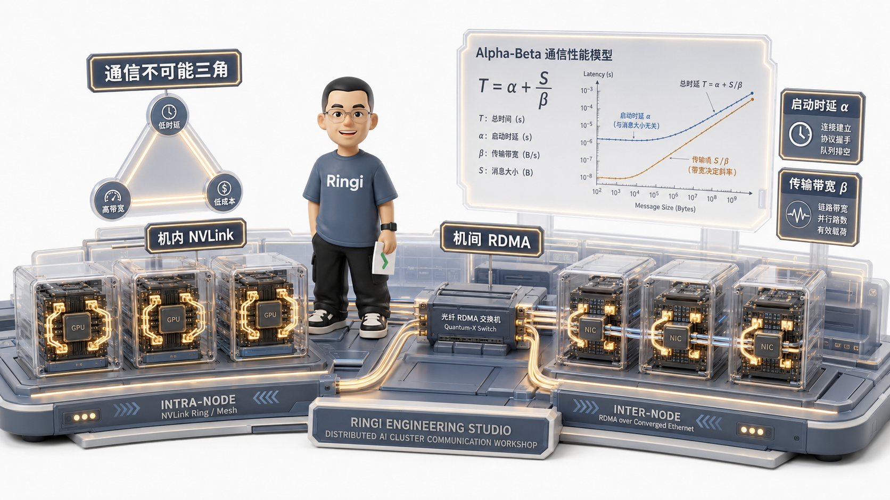
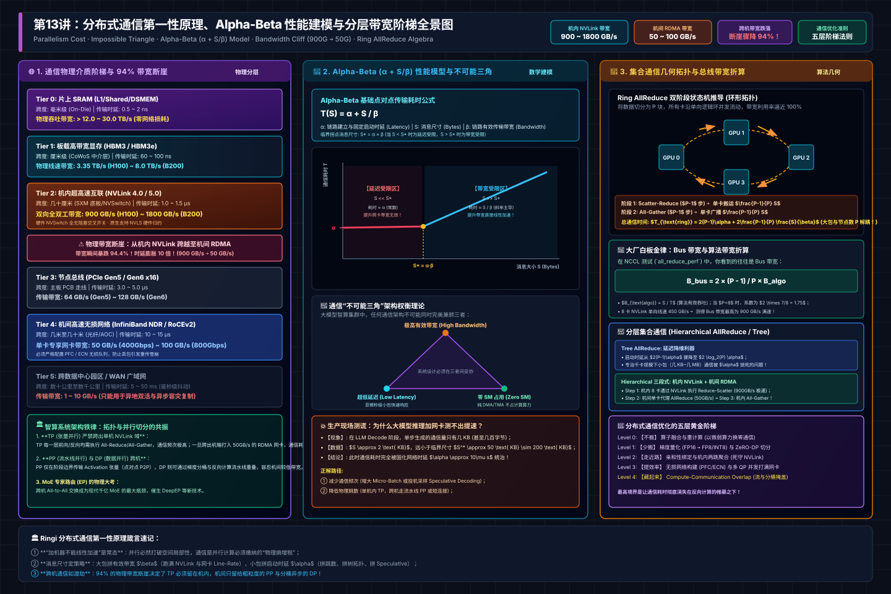
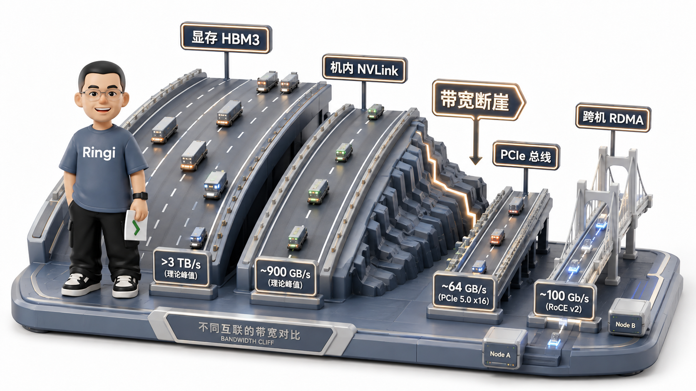

# 🏛️ 第13讲：卡数翻倍算力为何不翻倍？——通信第一性原理、Alpha-Beta 建模与分层带宽阶梯

> **主讲人**：👓 **Ringi**（大厂 AI Infrastructure 工程师）  
> **所属模块**：[Module 01: GPU 硬件架构、数据搬运、集群通信与 Overlap](./README.md)  
> **篇章范式**：📐 性能建模与通信理论篇（Performance Modeling & Communication Paradigm）  
> **核心导读**：  
> 在单机单卡的世界里，算力与显存是线性的物理账本；然而一旦将模型推进到百卡、千卡乃至万卡集群，几乎所有初涉分布式系统的工程师都会迎面撞上一堵冰冷的物理高墙——**为什么 GPU 数量翻了一倍，集群的训练吞吐却只提升了 1.4 倍甚至更少？为什么在推理 Decode 阶段，哪怕把节点网卡从 200Gbps 暴力堆到 800Gbps，端到端的单 Token 生成延迟依然像焊死了一样纹丝不动？**  
> 并行计算到底动了谁的奶酪？通信开销究竟是如何像黑洞一样蚕食扩展收益的？  
> 本讲我们将彻底推倒“加机器就能线性加速”的幻觉，从分布式计算的第一性原理出发，深度剖析通信与计算的零和博弈。我们将借助 **通信不可能三角** 与经典的 **Alpha-Beta（$\alpha + S/\beta$）耗时模型**，定量拆解 Latency-Bound 与 Bandwidth-Bound 的物理分界，穿透从 HBM 到跨机 RDMA 高达两个数量级的分层带宽断崖，并手算推导出大厂分布式通信的终极底层基石——**Ring AllReduce 与分层集合通信几何模型**！



```text
=================================================================================================
                                   Ringi 3D 架构工坊 · 核心全景
┌───────────────────────────────────────────────────────────────────────────────────────────────┐
│ [The Inevitable Law: Parallelism Breaks Locality]                                             │
│   Single GPU (100% Local) ──► Sharding (DP / TP / PP / EP) ──► Scattered State Memory        │
│   Mandatory Phase: Re-gather & Reduce Data ──► Data Movement Across Physical Boundaries      │
├───────────────────────────────────────────────────────────────────────────────────────────────┤
│ [The Impossible Triangle of AI Communication]                                                 │
│                      High Bandwidth (GB/s, Line-Rate Saturation)                              │
│                                      ▲                                                        │
│                                     / \                                                       │
│                                    /   \                                                      │
│                                   /     \                                                     │
│        Low Latency (α, Sub-μs)  ◄───────► Zero SM Occupancy (Pure DMA / TMA)                  │
│   Rule: You cannot win all three. Trade-offs dictate system architecture!                     │
├───────────────────────────────────────────────────────────────────────────────────────────────┤
│ [Alpha-Beta Latency-Bandwidth Model]                                                          │
│   Total Time T(S) = α + S / β                                                                 │
│   • Small Message (S < S* = α·β) ──► Latency-Bound (Dominated by α, Bandwidth is irrelevant!) │
│   • Large Message (S > S* = α·β) ──► Bandwidth-Bound (Dominated by S/β, Slope dictates time)  │
├───────────────────────────────────────────────────────────────────────────────────────────────┤
│ [Physical Hierarchy of Bandwidths]                                                            │
│   On-Chip SRAM (>30 TB/s) ──► HBM3 (3.35 TB/s) ──► NVLink 4.0 (900 GB/s)                      │
│                           ──► PCIe 5.0 (64 GB/s) ──► RoCE/IB Network (50~100 GB/s)            │
│   Cliff: Bandwidth plummets by 98% when crossing from NVLink to Inter-Node RDMA!              │
└───────────────────────────────────────────────────────────────────────────────────────────────┘
=================================================================================================
```

<!-- more -->

## 📑 目录导航

- [0. Ringi 开场：生产真实现场与痛点冲突](#0-ringi-开场生产真实现场与痛点冲突)
  - [0.1 真实工程矛盾：千卡线性扩展幻觉与网卡升级无效悬崖](#01-真实工程矛盾千卡线性扩展幻觉与网卡升级无效悬崖)
  - [0.2 线上真实事故复盘：MoE 专家跨机分发引发的“网络打嗝与吞吐血崩”](#02-线上真实事故复盘moe-专家跨机分发引发的网络打嗝与吞吐血崩)
  - [0.3 集群数据搬运介质全景对照表](#03-集群数据搬运介质全景对照表)
- [1. 为什么并行计算必然带来通信开销？](#1-为什么并行计算必然带来通信开销)
  - [1.1 并行的物理代价：打破局部性与必须的边界聚合](#11-并行的物理代价打破局部性与必须的边界聚合)
  - [1.2 通信的“不可能三角”：带宽、延迟与 SM 占用的零和博弈](#12-通信的不可能三角带宽延迟与-sm-占用的零和博弈)
  - [1.3 搬运（Movement）与归约（Reduction）的二分法则](#13-搬运movement与归约reduction的二分法则)
- [2. 通信耗时基石：Alpha-Beta（$\alpha + S/\beta$）性能模型第一性原理](#2-通信耗时基石alpha-betaalpha--sbeta性能模型第一性原理)
  - [2.1 核心公式五步穿透法（No Naked Formula 2.0）](#21-核心公式五步穿透法no-naked-formula-20)
  - [2.2 Latency-Bound（延迟受限）与 Bandwidth-Bound（带宽受限）的绝对分界](#22-latency-bound延迟受限与-bandwidth-bound带宽受限的绝对分界)
  - [2.3 为什么小包场景加带宽是徒劳的？（推理 Decode 阶段的死穴剖析）](#23-为什么小包场景加带宽是徒劳的推理-decode-阶段的死穴剖析)
- [3. 物理分层带宽与通信拓扑的断崖差距](#3-物理分层带宽与通信拓扑的断崖差距)
  - [3.1 物理介质带宽阶梯：从芯片内到机间的两个数量级跌落](#31-物理介质带宽阶梯从芯片内到机间的两个数量级跌落)
  - [3.2 机内数据搬运四大阶梯：谁来执行搬运？谁负责通知同步？](#32-机内数据搬运四大阶梯谁来执行搬运谁负责通知同步)
  - [3.3 机间数据搬运与控制面解耦：IBRC（基于 CPU） vs IBGDA（基于 SM）](#33-机间数据搬运与控制面解耦ibrc基于-cpu-vs-ibgda基于-sm)
  - [3.4 拓扑设计哲学：为什么大模型张量并行（TP）必须死锁在机内 NVLink 域？](#34-拓扑设计哲学为什么大模型张量并行tp必须死锁在机内-nvlink-域)
- [4. 集合通信（Collective Communication）算法与几何拓扑代价推导](#4-集合通信collective-communication算法与几何拓扑代价推导)
  - [4.1 基础点对点 P2P 与多节点集合通信的拓扑演进](#41-基础点对点-p2p-与多节点集合通信的拓扑演进)
  - [4.2 Ring AllReduce 算法五步深度推导：环形拓扑上的数据流状态机](#42-ring-allreduce-算法五步深度推导环形拓扑上的数据流状态机)
  - [4.3 Tree-based AllReduce 拓扑：小消息场景降低 $\alpha$ 启动时延的利器](#43-tree-based-allreduce-拓扑小消息场景降低-alpha-启动时延的利器)
  - [4.4 分层集合通信（Hierarchical AllReduce）：机内高速归约 + 机间单卡代理传输](#44-分层集合通信hierarchical-allreduce机内高速归约--机间单卡代理传输)
- [5. 通信优化的五层阶梯（Optimization Hierarchy）](#5-通信优化的五层阶梯optimization-hierarchy)
  - [5.1 Level 0: 🚫 不搬（Zero Movement）——算子融合与重计算](#51-level-0--不搬zero-movement算子融合与重计算)
  - [5.2 Level 1: 📉 少搬（Less Volume）——量化通信与 ZeRO 切分](#52-level-1--少搬less-volume量化通信与-zero-切分)
  - [5.3 Level 2: 🏃 走近路（Shorter Path）——亲和性绑定与机内两跳聚合](#53-level-2--走近路shorter-path亲和性绑定与机内两跳聚合)
  - [5.4 Level 3: 🚀 提效率（Higher Speed）——无损网络构建与多 QP 并发](#54-level-3--提效率higher-speed无损网络构建与多-qp-并发)
  - [5.5 Level 4: 🎭 藏起来（Overlap）——CUDA 异步流与 DDP 桶重叠](#55-level-4--藏起来overlapcuda-异步流与-ddp-桶重叠)
- [6. 生产典型通信场景深度剖析与实战算盘](#6-生产典型通信场景深度剖析与实战算盘)
  - [6.1 场景 A：LLaMA-70B DDP 训练中的全网梯度 AllReduce 耗时精算](#61-场景-allama-70b-ddp-训练中的全网梯度-allreduce-耗时精算)
  - [6.2 场景 B：Megatron TP=8 前向与反向中的通信耗时](#62-场景-bmegatron-tp8-前向与反向中的通信耗时)
  - [6.3 场景 C：MoE 稀疏门控网络中的 All-to-All 极细粒度小包分发陷阱](#63-场景-cmoe-稀疏门控网络中的-all-to-all-极细粒度小包分发陷阱)
- [7. 动手实战与代码实验室（Minimal Runnable Code）](#7-动手实战与代码实验室minimal-runnable-code)
  - [7.1 实验 1：Alpha-Beta 通信耗时模型实测与临界转折点拟合脚本](#71-实验-1alpha-beta-通信耗时模型实测与临界转折点拟合脚本)
  - [7.2 实验 2：CUDA Stream 异步通信与计算 Overlap 效果验证基准](#72-实验-2cuda-stream-异步通信与计算-overlap-效果验证基准)
  - [7.3 实验 3：Ring AllReduce 纯 Python 逻辑仿真与状态机分块数据流验证](#73-实验-3ring-allreduce-纯-python-逻辑仿真与状态机分块数据流验证)
  - [7.4 实验 4：大模型分布式通信开销定量估算器与参数敏感度分析器](#74-实验-4大模型分布式通信开销定量估算器与参数敏感度分析器)
- [8. Ringi 避坑指南与生产性能工程黄金 Checklist](#8-ringi-避坑指南与生产性能工程黄金-checklist)
  - [8.1 避坑表格（❌ 常见小白错误理解 vs ✅ 大厂 AI Infra 正确理解）](#81-避坑表格-常见小白错误理解-vs--大厂-ai-infra-正确理解)
  - [8.2 生产分布式集群网络与通信优化黄金十条 Checklist](#82-生产分布式集群网络与通信优化黄金十条-checklist)
- [9. Ringi 5 点核心速记口诀、自我检验清单与课后深度思考题](#9-ringi-5-点核心速记口诀自我检验清单与课后深度思考题)
  - [9.1 5 点押韵核心速记口诀](#91-5-点押韵核心速记口诀)
  - [9.2 10 条白板自我检验清单](#92-10-条白板自我检验清单)
  - [9.3 3 道高阶开放式课后思考题（含极端 Corner Case）](#93-3-道高阶开放式课后思考题含极端-corner-case)
- [10. 📚 参考资料与核心源码/经典论文指引](#10--参考资料与核心源码经典论文指引)
- [附录：Appendix A — 大厂硬核高频面试题与白板推导（Interview Drill）](#附录appendix-a--大厂硬核高频面试题与白板推导interview-drill)

---

# 0. Ringi 开场：生产真实现场与痛点冲突

## 0.1 真实工程矛盾：千卡线性扩展幻觉与网卡升级无效悬崖

先来看两个在 AI Infra 生产一线每天都在发生、但极其违背直觉的真实工程痛点：

### 矛盾一：千卡训练时的“算力蒸发”
算法团队在 64 张 H100 卡上跑通了一个 70B 模型的分布式训练，每步迭代耗时 1.2 秒。管理层为了加速模型上线，一咬牙追加了数千万元预算，将算力集群直接扩充至 **512 张卡（卡数暴增 8 倍）**。  
算法同学兴奋地将 `global_batch_size` 放大 8 倍，满心欢喜地以为单步耗时能维持不变、整体训练吞吐直接翻 8 倍。然而监控大屏亮起的一瞬间，所有人傻眼了：
- 512 卡集群的迭代耗时从 1.2 秒直接飙到了 **2.9 秒**；
- 算力扩展效率（Scaling Efficiency）只有可怜的 **41%**；
- 剩下的 **59% 昂贵 GPU 算力，全部在集合通信（AllReduce / ReduceScatter）调用处陷入了漫长的阻塞等待（Barrier Stall）**！

### 矛盾二：大模型推理 Decode 阶段的“网卡升级悬崖”
某在线高并发大模型推理服务，在采用 Tensor Parallelism（TP=4）跨机部署时，发现生成阶段每个 Token 的输出延迟（TPOT）高达 35ms，无法达到客户 20ms 的 SLA 要求。  
运维团队给出的方案是“大力出奇迹”：**将节点间的 RoCE 网卡从双口 200Gbps 全量升级为双口 800Gbps，物理带宽瞬间暴增 4 倍！**  
然而，真机压测跑完，所有人都沉默了：
- 每 Token 的输出延迟从 35ms 仅仅微弱下降到了 **33.8ms（耗时几乎零改善！）**；
- 几百万元的高性能网卡升级，换来的仅仅是 3% 的性能毛刺改善。

```text
生产两难困境：
训练场景：明明带宽打满了，为什么卡数越多扩展性越烂？
推理场景：明明物理带宽提升了 4 倍，为什么延迟纹丝不动？
```

如果不能从数学模型与物理硬件的第一性原理彻底厘清通信的开销机制，任何盲目的堆卡与硬件升级都只是在给机房电表“刷 KPI”。

---

## 0.2 线上真实事故复盘：MoE 专家跨机分发引发的“网络打嗝与吞吐血崩”

我们来看一个记录在大厂 AI Infra 故障库里的真实 P1 事故：

某团队上线了一个包含 64 个专家的混合专家模型（MoE）。在分布式训练中采用了专家并行（Expert Parallelism, EP=16，跨越 2 个 8 卡计算节点）。MoE 的核心机制是门控网络（Router）根据当前输入的 Token 特征，动态分发给对应的专家处理。

由于没有深入理解机内与机间通信的本质差异，工程师直接采用了全局扁平化的 `torch.distributed.all_to_all_single` 算子：
- 节点内 8 张卡与节点外 8 张卡一视同仁，随机发包；
- 当 Batch Size 较小时，每个 Token 对应的分片只有区区 **几百字节至几 KB**；
- **事故爆发**：成千上万个微型小包在毫秒级时间内瞬间涌入跨机网络，迅速打爆了机间交换机的队列缓冲区（Queue Buffer）。网络触发了极其严重的 **PFC 死锁与微突发丢包（Micro-burst Packet Drop）**，RDMA 链路触发反复重传与 Go-Back-N 停顿，网卡硬件发生严重的 QP 拥塞抖动！
- **后果**：整个分布式训练单步耗时从原本的 400ms 瞬间飙升至 **2.1 秒（劣化 5.25 倍）**，随后触发 NCCL Watchdog 软死锁超时，千卡训练全部崩溃下线！

这次事故的本质，就是**用“带宽型”的粗暴思维去处理了“延迟型”的小包通信**，并无视了机内 NVLink 与机间网络的巨大物理落差。

---

## 0.3 集群数据搬运介质全景对照表

在展开数学建模之前，我们必须把物理世界中数据在不同芯片与总线间穿梭的真实代价建立一张底账表。这张表来自我们对 H100 HGX 集群与 400G/800G 网络的一手测量：

| 通信物理介质 | 物理拓扑层级 | 单向有效带宽 (BW) | 双向聚合带宽 (Bidir) | 典型单程时延 (Latency) | 控制面机制与 SM 占用 |
| :--- | :--- | :--- | :--- | :--- | :--- |
| 1. 片上 SRAM / Shared | SM 内部核心极速缓存 | ~ 12~14 TB/s | > 25 TB/s | 10 ~ 30 Cycles (~2ns) | 汇编直接寻址; 零控制 |
| 2. HBM3 堆叠主显存 | 单卡内部 2.5D 封装 | 3.35 TB/s | 3.35 TB/s (读写共享) | 200~400 Cyc (~60~80ns) | LSU / TMA 硬件控制器 |
| 3. NVLink 4.0 总线 | 机内 8 卡全互联网格 (4th Gen NVSwitch) | 450 GB/s / GPU | 900 GB/s / GPU | ~ 0.5 ~ 1.0 μs | NVSwitch 硬件路由直达; 可用 TMA / CE / SM |
| 4. PCIe 5.0 x16 总线 | CPU ↔ GPU / 网卡直连 | ~ 32 GB/s | ~ 64 GB/s | ~ 1.5 ~ 3.0 μs | PCIe Root Complex; Host 中转，开销显著 |
| 5. 400Gbps RDMA 网络 (CX-7 单口) | 跨节点 RoCEv2 / IB (Spine-Leaf 架构) | ~ 45 GB/s (实测极限) | ~ 90 GB/s | ~ 5.0 ~ 15.0 μs | GPUDirect RDMA (NIC); IBRC(CPU) / IBGDA(SM) |
| 6. 800Gbps RDMA 网络 (CX-7/8 双口绑定) | 新一代跨机网络 | ~ 90 GB/s (实测极限) | ~ 180 GB/s | ~ 4.5 ~ 12.0 μs | GPUDirect RDMA; 极高吞吐，但时延未质变 |

仔细比对这组数据，你就会发现两个触目惊心的断崖：
1. **带宽断崖**：从单卡 HBM（3350 GB/s）到机内 NVLink（900 GB/s），跌去 **73%**；而从 NVLink 迈向跨机 RDMA（45 GB/s），带宽更是直接发生了 **20 倍的雪崩式坍塌**！
2. **时延断崖**：从片上访存（纳秒级）到跨机网络握手（微秒级），时延暴增了 **近万倍**！

这就是为什么并行系统的调度必须精细到微秒级的原因。

---

# 1. 为什么并行计算必然带来通信开销？

为了在深入具体理论推导前建立起全局的物理心智模型，下方给出了分布式通信物理介质阶梯、Alpha-Beta 性能耗时模型、通信不可能三角与 Ring/Tree 集合通信几何拓扑的工业级全景架构图：



## 1.1 并行的物理代价：打破局部性与必须的边界聚合

在单机单卡时代，计算机体系结构追求的最高境界是 **局部性原理（Principle of Locality）**：时间局部性与空间局部性。所有数据都在同一个芯片内部的 SRAM 与 HBM 中闭环，不需要跨越任何芯片边界。

然而，大语言模型的参数量从 7B 狂飙至 70B、671B（DeepSeek-V3），单个 GPU 的 80GB 显存连模型权重加优化器状态的零头都装不下。我们被迫将这个庞然大物“大卸八块”，分摊到成百上千张 GPU 上：

```text
┌───────────────────────────────────────────────────────────────────────────────────────────────┐
│                      分布式四大并行切分轴与通信税 (Communication Tax)                          │
├───────────────────────────────────────────────────────────────────────────────────────────────┤
│ 1. 数据并行 (DP / FSDP / ZeRO)                                                                 │
│    • 切分方式：按 Batch 切分。每张卡拥有相同的模型结构，跑不同的训练数据样本。                │
│    • 破局代价：前向计算各算各的，但反向传播求导完毕后，各卡算出的梯度必须全局一致！           │
│    • 产生的通信税：全网梯度 AllReduce（或 ZeRO 的 ReduceScatter + AllGather）。              │
├───────────────────────────────────────────────────────────────────────────────────────────────┤
│ 2. 张量并行 (Tensor Parallelism, TP / Megatron)                                               │
│    • 切分方式：把单个矩阵乘法 Linear 层的权重矩阵按行或列切碎到 8 张卡上。                   │
│    • 破局代价：每一层前向与反向计算完局部矩阵乘后，激活值必须立刻跨卡拼接！                   │
│    • 产生的通信税：每一层 Transformer 必须发生 2 次机内 AllReduce（前向 1 次，反向 1 次）！    │
├───────────────────────────────────────────────────────────────────────────────────────────────┤
│ 3. 流水线并行 (Pipeline Parallelism, PP)                                                      │
│    • 切分方式：把模型深度的 80 个 Layer 纵向切成 8 段，每张卡放 10 层。                      │
│    • 破局代价：第 k 层的输出激活值，必须作为第 k+1 层的输入跨设备传输。                       │
│    • 产生的通信税：阶段间的点对点 P2P (Send / Recv) 通信。                                     │
├───────────────────────────────────────────────────────────────────────────────────────────────┤
│ 4. 专家并行 (Expert Parallelism, EP / MoE)                                                    │
│    • 切分方式：不同卡承载不同的 MoE 专家前馈网络（FFN）。                                     │
│    • 破局代价：Token 经过 Router 动态打散后，必须跨越物理卡发送给指定专家。                   │
│    • 产生的通信税：高频、动态、不规则的全对全通信（All-to-All）。                             │
└───────────────────────────────────────────────────────────────────────────────────────────────┘
```

**并行的第一定律**：**任何试图通过切分来获取算力与容量扩展的行为，都在物理上撕裂了原本连续的数据流；为了维持数学逻辑的等价性，系统必须在每一个同步屏障点（Barrier）付出数据重聚合的物理代价！** 这个代价，就是所谓的 **通信税（Communication Tax）**。

---

## 1.2 通信的“不可能三角”：带宽、延迟与 SM 占用的零和博弈

在快手可灵 AI Infra 团队的核心实战总结中，提炼出了一个被工业界广泛验证的体系结构命题——**通信的不可能三角（The Impossible Triangle of Communication）**：


```text
                           高带宽 (High Bandwidth)
                           (打满物理链路理论吞吐)
                                     ▲
                                    / \
                                   /   \
                                  /  ❌ \  (三者无法同时完美兼得)
                                 /       \
                                /         \
       低延迟 (Low Latency)   ◄─────────────► 零 SM 算力占用 (Zero SM Occupancy)
       (微秒级直达, 极速握手)                  (硬件完全代劳, 不影响 GEMM 计算)
```

通信的本质就是从节点 A 搬运字节到节点 B。在工程实现中，这三个目标永远处于剧烈的相互制约之中：
1. **如果你追求“极致低延迟”**：
   通常需要让 GPU 的流式多处理器（SM）亲自下场，通过细粒度轮询（Polling）或者直接操控网卡寄存器（如 IBGDA 机制），以最短的控制路径发起传输。**代价是：昂贵的 SM 核心被死死锁定在搬运与等待中，无法进行核心的矩阵乘法 GEMM 计算！**
2. **如果你追求“完全释放 SM（零算力占用）”**：
   你必须将搬运任务交给异步的硬件 DMA 引擎（例如 CPU 侧的 Copy Engine，或者网卡自主的 RDMA 引擎）。**代价是：必须忍受漫长的任务描述下发、队列排队与跨总线同步通知延迟（Latency 变大）！**
3. **如果你追求“打满高带宽”**：
   通常需要将数据聚合成大尺寸的 Block，并开启多条队列并行压测。**代价是：极小数据包的实时性被彻底牺牲，系统必须付出额外的缓冲拼装开销。**

> 📌 **Ringi 工程师铁律**：
> 优秀的 AI Infra 工程师从来不妄想打破物理定律去寻找所谓的“万能通信方案”，而是**清晰识别当前算子究竟处于哪种业务场景，然后精准决定牺牲哪一个角，换取系统最需要的那一个指标！**

---

## 1.3 搬运（Movement）与归约（Reduction）的二分法则

这里存在一个被很多高级算法工程师严重忽视的硬件底层事实：**通信操作在物理本质上被绝对二分为两类——纯搬运（Movement）与含算术的归约（Reduction）！**

```text
┌───────────────────────────────────────────────────────────────────────────────────────────────┐
│                           搬运 vs 归约的物理二分法则                                          │
├───────────────────────────────────────────────────────────────────────────────────────────────┤
│ [类别 A: 纯数据搬运 (Pure Movement)]                                                          │
│   • 代表操作：P2P Send/Recv, AllGather (纯拼接), All-to-All (散弹分发), Broadcast (广播)      │
│   • 硬件行为：仅改变数据在物理内存/显存中的存放位置，数据本身的比特位不做任何修改。          │
│   • 搬运者选择：【硬件 DMA 引擎可以完全代劳！】                                              │
│     可以使用 Copy Engine (CE)、TMA、RDMA 网卡独立搬运，完全不需要惊动 SM 计算核心！           │
├───────────────────────────────────────────────────────────────────────────────────────────────┤
│ [类别 B: 含算术的归约 (Reduction)]                                                            │
│   • 代表操作：AllReduce (求和/平均), ReduceScatter (切分并累加), Reduce                        │
│   • 硬件行为：不仅要从远端把数据搬过来，还必须对两份张量执行逐元素加法：y = a + b！          │
│   • 搬运者选择：【纯 DMA 引擎彻底无能为力！】                                                │
│     常规网卡和 DMA 控制器根本没有浮点数加法 ALU 硬件！数据必须被送入 SM 的计算流水线（或者  │
│     昂贵且罕见的网内计算交换机 SHARP），由 SM 亲自执行向量加法！                              │
└───────────────────────────────────────────────────────────────────────────────────────────────┘
```

这个二分法则直接决定了大模型系统通信与计算重叠（Overlap）的生死：
- **对于 AllGather（纯搬运）**：我们可以放心地把它扔给独立 CUDA Stream 上的 Copy Engine，让它与前向 GEMM 计算完全并发，两者在硬件资源上互不干涉、实现完美的 100% 隐藏；
- **对于 AllReduce（含加法归约）**：如果直接在同一个 GPU 上并发，NCCL 的归约 Kernel 就会直接抢占 SM 资源，导致原本跑得飞快的 GEMM 算子因为算力被分流而发生剧烈降速！大厂针对此场景的终极解法，是将 Reduce 算子直接融合进 GEMM 的收尾阶段（Epilogue Fusion），在片上完成加法并就地路由！

---

# 2. 通信耗时基石：Alpha-Beta（$\alpha + S/\beta$）性能模型第一性原理

## 2.1 核心公式五步穿透法（No Naked Formula 2.0）

任何高性能网络性能分析的推演起点，都源自高性能计算（HPC）领域最经典的 **Alpha-Beta 通信模型（Hockney 模型）**。让我们走完严密的五步穿透：

### Step 1: 为什么需要算它？
在分布式系统中，如果每次评估网络耗时都必须去抓物理包或者做复杂的排队仿真，工程迭代将寸步难行。我们需要一个能够**将底层复杂的网络协议栈、驱动开销、物理介质带宽与业务层传输的数据体量直接解耦量化**的极简分析工具，精准预测任意消息大小下的真实通信时间。

### Step 2: Mental Model（物理直觉比喻）
> 👓 **Ringi 工程师比喻**：
> 想象你在顺丰发快递：
> - 寄件时，快递员上门、称重、贴面单、装箱打包、打印条形码。不管你寄的是一张纸还是一块大石头，这套繁琐的打单流程都必须耗费固定的 3 分钟（这就是 **$\alpha$ 固定启动时延**）；
> - 随后，顺丰的重型卡车以每小时 100 公里的速度在高速公路上飞驰送货（卡车的运载速度就是 **$\beta$ 链路传输带宽**）。
> - 如果你寄的是一份区区 5 克的合同（小包）：总耗时几乎全是那漫长的 3 分钟打单等待，卡车开得再快也毫无意义！
> - 如果你寄的是整整 10 吨钢材（大包）：打单的 3 分钟相比于卡车在路上开 10 个小时，彻底变成了微不足道的零头，总耗时完全由卡车的运力决定！

### Step 3: Tiny Calculator（极简数字小算盘）
我们拿一个真实的集群参数在草稿纸上手算一遍：
- 设定网络环境：400Gbps 单卡 RoCE 网卡，实测有效带宽 $\beta = 45\text{ GB/s}$；单程启动握手时延 $\alpha = 10\text{ }\mu\text{s} = 10^{-5}\text{ s}$。

**算例 1：小包场景（大模型推理 Decode 阶段传输单个 Token 的隐藏状态，大小 $S = 4\text{ KB} = 4 \times 10^3\text{ Bytes}$）**
- 纯带宽传输耗时：

  $$
  \frac{S}{\beta} = \frac{4 \times 10^3\text{ Bytes}}{45 \times 10^9\text{ Bytes/s}} \approx 0.088\text{ }\mu\text{s}
  $$

- 总通信耗时：

  $$
  T = \alpha + \frac{S}{\beta} = 10\text{ }\mu\text{s} + 0.088\text{ }\mu\text{s} = \mathbf{10.088\text{ }\mu\text{s}}
  $$

- **账本结论**：**固定启动时延 $\alpha$ 占了总耗时的 99.13%！物理带宽传输耗时只占 0.87%！** 此时你就算把网卡带宽从 45 GB/s 拔高 10 倍到 450 GB/s，总耗时也只能从 10.088 $\mu s$ 缩短到 10.008 $\mu s$，性能提升连 1% 都不到！

**算例 2：大包场景（大模型训练反向传播汇总梯度，大小 $S = 1\text{ GB} = 10^9\text{ Bytes}$）**
- 纯带宽传输耗时：

  $$
  \frac{S}{\beta} = \frac{10^9\text{ Bytes}}{45 \times 10^9\text{ Bytes/s}} \approx 0.0222\text{ 秒} = \mathbf{22200\text{ }\mu\text{s}}
  $$

- 总通信耗时：

  $$
  T = 10\text{ }\mu\text{s} + 22200\text{ }\mu\text{s} = \mathbf{22210\text{ }\mu\text{s}}
  $$

- **账本结论**：**纯带宽传输耗时占了总耗时的 99.95%！固定时延 $\alpha$ 彻底退化为误差项！** 此时只要你能把物理带宽提升一倍，总耗时就能实打实地缩短一半！

### Step 4: Formal Model（标准公式与临界转折点）
两点间传输大小为 $S$ 字节的消息，单程通信耗时 $T(S)$ 严格表达为：

$$
T(S) = \alpha + \frac{S}{\beta}
$$

其中物理定义如下：
- **$\alpha$（Latency / Startup Time，固定延迟）**：消息传输的固定开销（单位：$\mu s$ 或 $ms$）。包含：CPU/GPU 驱动软件栈开销、构建 WQE 描述符时延、敲 Doorbell 寄存器耗时、网卡内部 DMA 引擎启动时延、交换机转发排队时延以及光信号在光纤中行进的物理飞行时延（约 $5\text{ ns/m}$）；
- **$S$（Message Size，传输数据量）**：消息的物理字节数（单位：$\text{Bytes}$）；
- **$\beta$（Bandwidth，有效网络带宽）**：物理通信链路在扣除协议头开销后的持续数据吞吐率（单位：$\text{GB/s}$ 或 $\text{Gbps}$）。

```text
通信耗时 T(S)
       ▲
       │                                         / 实际通信耗时 T(S) = α + S / β
       │                                        /
       │                                       /  斜率 = 1 / β (决定大消息传输速率)
       │                                      /
       │                                     /
       │                                    /
       │                                   /
       │                                  /
     α ├─────────────────────────────────┘ ◄────── 截距 α (固定系统与网络时延)
       │
       └─────────────────────────────────┴────────────► 消息体量 S (Bytes)
                                  临界拐点 S* = α · β
         [ 小消息: Latency-Bound ]      [ 大消息: Bandwidth-Bound ]
```

根据两条渐近线的几何交点，我们定义 **通信性能临界转折点（Critical Message Size $S^*$）**：

$$
S^* = \alpha \times \beta
$$

- **当 $S < S^*$ 时**：固定延迟项 $\alpha$ 占据绝对统治地位，系统处于 **Latency-Bound（延迟受限）** 状态；
- **当 $S \ge S^*$ 时**：传输带宽项 $S/\beta$ 占据绝对统治地位，系统处于 **Bandwidth-Bound（带宽受限）** 状态。

### Step 5: Sanity Check（真实物理介质转折点自检）
我们代入大厂 AI 集群最核心的两种物理链路计算它们的临界点：

- **介质 1：机内 NVLink 4.0 链路（H100 SXM 节点内）**：
  - 固定时延：$\alpha \approx 0.8\text{ }\mu\text{s}$；
  - 单向带宽：$\beta \approx 450\text{ GB/s}$；
  - **NVLink 临界拐点**：

    $$
    S^*_{\text{NVLink}} = 0.8 \times 10^{-6}\text{ s} \times 450 \times 10^9\text{ B/s} = \mathbf{360\text{ KB}}
    $$

  - **意义**：在 NVLink 域内，只要单次通信的消息体量大于 **360KB**，就能迅速跨过延迟惩罚，打满 450 GB/s 的高速带宽！

- **介质 2：跨机 400G RoCE 链路（CX-7 网卡经 Spine-Leaf 交换机）**：
  - 固定时延：$\alpha \approx 12.0\text{ }\mu\text{s}$；
  - 单向带宽：$\beta \approx 45\text{ GB/s}$；
  - **跨机 RDMA 临界拐点**：

    $$
    S^*_{\text{RDMA}} = 12.0 \times 10^{-6}\text{ s} \times 45 \times 10^9\text{ B/s} = \mathbf{540\text{ KB}}
    $$

  - **意义**：跨机通信时，消息尺寸必须达到 **540KB 以上**，才配让 400G 网卡开始发挥出它真正的带宽实力！如果你的代码充满了十几 KB 的碎包，网卡物理上就是在打瞌睡！

---

## 2.2 Latency-Bound 与 Bandwidth-Bound 的绝对分界

我们把这两大状态的工业级对比总结成对照表：

| 核心维度 | Latency-Bound (延迟受限状态) | Bandwidth-Bound (带宽受限状态) |
| :--- | :--- | :--- |
| 1. 数学判定条件 | 消息尺寸 S << S* (即 α >> S/β) | 消息尺寸 S >> S* (即 S/β >> α) |
| 2. 耗时敏感因子 | 极度依赖 α (驱动、协议头、排队、握手、光电延迟) | 极度依赖 β (网络链路带宽、线速打满率、物理网卡通道) |
| 3. 典型业务算子 | • 大模型推理 Decode 自回归生成 (Token-by-Token) • MoE 门控稀疏分发 (All-to-All 细粒度分派) • 跨机 Pipeline 并行的小 Micro-batch 激活值传递 | • DDP / FSDP 反向梯度全局汇总 (AllReduce / RS) • FSDP 每一层前向权重预取 (AllGather) • 长文本序列并行 (Sequence Parallelism) 巨幅激活传输 |
| 4. 优化破局铁律 | ❌ 徒劳方向：单纯购买更贵的网卡升级带宽 ✅ 正确解法：【聚合小包 (Batching)】、【减少通信频次】 【Kernel 内直驱网卡 (IBGDA)】、【投机采样多步验证】 | ❌ 徒劳方向：微调网络参数去降低 1 微秒的固定时延 ✅ 正确解法：【通信计算重叠 (Overlap)】、【量化压缩】 【Ring 拓扑消除热点】、【充分榨干物理线速 (PFC/ECN)】 |

---

## 2.3 为什么小包场景加带宽是徒劳的？（推理 Decode 阶段的死穴剖析）

现在我们可以彻底回答 0.1 节抛出的那个悬案：**为什么大模型推理服务换了 800G 网卡，生成延迟几乎毫无改变？**

在大模型推理的自回归解码（Decode）阶段：
- 每次模型只能吐出 1 个 Token；
- 如果你使用了机间张量并行（跨节点的 TP），每算完一个 Transformer 层的自注意力（Self-Attention）和前馈网络（FFN），都需要跨机同步一次激活值；
- 此时传输的消息大小：

  $$
  S = \text{Batch Size} \times 1\text{ Token} \times \text{Hidden Dimension} \times 2\text{ 字节 (FP16)}
  $$

- 假设 Batch Size = 4，隐层维度 $D = 4096$，则：

  $$
  S = 4 \times 1 \times 4096 \times 2 = 32768\text{ 字节} = \mathbf{32\text{ KB}}
  $$

- **对比临界点**：$32\text{ KB} \ll S^*_{\text{RDMA}} (540\text{ KB})$！
- 此时单次通信处于极深度的 **Latency-Bound** 区域！总耗时里 90% 以上是在等待操作系统协议栈、PCIe 穿越以及光纤握手；
- 把 200G 网卡升级到 800G，只是把原本只占 5% 耗时的带宽传输项微幅缩短了一丁点，而占 95% 耗时的 $\alpha$ 纹丝未动，端到端延迟自然如同焊死一般！

---

# 3. 物理分层带宽与通信拓扑的断崖差距



## 3.1 物理介质带宽阶梯：从芯片内到机间的两个数量级跌落

大模型系统的所有网络拓扑设计，本质上都在向物理定律妥协。电信号在 PCB 板铜线上传输、光信号在光纤上传输，都面临不可避免的物理衰减。传输距离越远，保持超高带宽与超低延迟的工程代价就呈指数级飙升：

```text
                               ▲ 单向有效带宽 (Bandwidth)
                              / \
                             /   \   片上 SRAM / Shared Memory
                            /     \    ~ 12 ~ 14 TB/s | 延迟 ~2ns
                           /───────\
                          /  HBM3   \ 单卡高带宽显存 (2.5D CoWoS)
                         /           \ 3.35 TB/s | 延迟 ~60ns
                        /─────────────\
                       /  NVLink 4.0   \ 机内 8 卡全互联高速总线 (PCB背板直连)
                      /                 \ 450 GB/s (双向 900 GB/s) | 延迟 ~0.8μs
                     /───────────────────\
                    /      PCIe 5.0       \ 主板内部扩展总线 (Host CPU ↔ GPU)
                   /                       \ ~ 32 GB/s (双向 64 GB/s) | 延迟 ~2μs
                  /─────────────────────────\
                 /   400G/800G RDMA (跨机)   \ 跨服务器集群网络 (Spine-Leaf 光交换)
                /                             \ ~ 45 ~ 90 GB/s | 延迟 ~10μs
               └───────────────────────────────┘
                                                 ▼ 物理跨度与通信延迟 (Distance & Latency)
```

这就是残酷的物理现实：**机内的 NVLink 就像是你自家客厅到卧室的走廊，宽敞且瞬达；而一旦跨出机箱走上 RDMA 网络，就变成了跨城的高速公路！**

---

## 3.2 机内数据搬运四大阶梯：谁来执行搬运？谁负责通知同步？

在深入跨机之前，我们必须先摸清 GPU 节点内部的数据搬运机制。溯源自快手可灵团队的研究成果，在单台服务器内部，将数据从一张 GPU 搬运到另一张 GPU，在物理执行上存在 **四大明确的 SM 占用阶梯**：

| 搬运模式 | 发起方 | 搬运执行者 | 核心物理数据通路 | 控制面通知机制 | SM 占用代价与适用场景 |
| :--- | :--- | :--- | :--- | :--- | :--- |
| 1. SM Load/Store (NCCL 机内默认) | GPU Kernel | SM 核心自身 (LSU 单元) | GPU A 显存 ➔ L2 ➔ RF ➔ NVLink ➔ GPU B 显存 | 内存屏障 / 标志位轮询 (SM 必须持续自旋监控) | 【全程重度占用 SM！】 必须执行 Reduce 运算时 |
| 2. TMA 异步硬件引擎 (Hopper 架构专属) | GPU Kernel | TMA 专用硬件 加速器 | GPU A 显存 ➔ TMA 引擎 ➔ NVLink ➔ 目标 SRAM | 硬件异步屏障 mbarrier (SM 下单后可回去算活) | 【仅下发时短暂占 SM】 大块张量搬运 (>2KB) |
| 3. Copy Engine (CE) (异步 DMA 引擎) | CPU 侧 Host 调度发起 | CE 专用硬件 DMA 单元 | GPU A 显存 ➔ CE 引擎 ➔ NVLink ➔ GPU B 显存 | CUDA Event 驱动完成 (硬件中断通知) | 【完全不占用 SM！】 Kernel 外异步参数预取 |
| 4. Staged Host Copy (主机内存中转) | CPU 侧 Host | CPU + CE | GPU A ➔ PCIe ➔ Host 内存 ➔ PCIe ➔ GPU B | 操作系统软件中断 | 【最慢兜底路径】 P2P 不可达时绝望回退 |

### 生产深度辨析：为什么 Kernel 内无法随意调用 Copy Engine？
很多工程师会问：“既然 Copy Engine 完全不占 SM，为什么 NCCL 的机内 Kernel 不全用 CE？”  
答案是**架构解耦与控制粒度**：
- Copy Engine 属于 GPU 外部的 DMA 控制器，它的控制权被牢牢锁死在 Host 端的 CPU 驱动与 CUDA Stream 调度器手里；
- SM 内部执行的单个线程（Thread），在硬件权限上根本无法直接操控 CE 队列；
- 如果每次搬运都要跳出 Kernel 去求 CPU 下发 CE 指令，会带来微秒级的 Kernel Launch 延迟断崖！
- **因此：在 Kernel 内部，你要么让 SM 自己搬（LSU，占算力），要么在 Hopper 架构上使用专为 Kernel 内部设计的 TMA 硬件引擎（SM 只下单，TMA 自主搬运）！**

---

## 3.3 机间数据搬运与控制面解耦：IBRC（基于 CPU） vs IBGDA（基于 SM）

当数据跨出单机、进入跨机 InfiniBand / RoCE 网络时，**GPUDirect RDMA（GDR）** 统一了底层的数据面——数据无论如何都是直接从本地 GPU 显存通过 PCIe 物理直达网卡，通过网络发送到远端显存，全程绝对不经过 Host CPU 内存中转。

**然而，数据面虽然统一了，控制面的博弈却才刚刚开始！**

发起一次 RDMA 操作必须完成两个关键动作：
1. **构建 WQE（Work Queue Element）**：生成一个描述“把哪段显存、发往哪个远端地址、消息多大”的指令描述符；
2. **敲 Doorbell（鸣钟通知）**：向网卡的寄存器写入信号，通知网卡开始干活。

这两件事由谁来干？大厂系统架构在此产生了决定性的分流：

```text
┌───────────────────────────────────────────────────────────────────────────────────────────────┐
│                      机间 RDMA 控制面双雄：IBRC vs IBGDA 机制对比                              │
├───────────────────────────────────────────────────────────────────────────────────────────────┤
│ [方案 1: IBRC (IB Reliable Connection - 基于 CPU 的传统控制面)]                               │
│                                                                                               │
│   SM 算完数据 ──► 通知 CPU (跨 PCIe) ──► CPU 在 Host 内存构建 WQE ──► CPU 敲网卡 Doorbell     │
│                                                                               │               │
│   数据面：GPU 显存 ═══════════════════════════════════════════════════════════► NIC ➔ 网络   │
│   特点：控制路径多了两次 PCIe 往返与 CPU 线程调度开销。                                       │
│   适用：大包、带宽敏感型集合通信（NCCL 默认）。因为大包的传输时间很长，控制面的微秒开销被冲淡。│
├───────────────────────────────────────────────────────────────────────────────────────────────┤
│ [方案 2: IBGDA (IB GPU Direct Async - 基于 SM 直驱网卡的低延迟控制面)]                         │
│                                                                                               │
│   SM 算完数据 ──► SM 直接在 GPU 显存构建 WQE ──► SM 经 PCIe BAR 空间直接敲网卡 Doorbell        │
│                                                                               │               │
│   数据面：GPU 显存 ═══════════════════════════════════════════════════════════► NIC ➔ 网络   │
│   特点：彻底绕过 CPU！砍掉操作系统中断与两次 PCIe 中转，极小消息延迟压制到极限。              │
│   适用：小包、延迟极度敏感型通信（如 DeepEP 针对 MoE 的 Low-Latency 模式，NVSHMEM 原语）。  │
└───────────────────────────────────────────────────────────────────────────────────────────────┘
```

---

## 3.4 拓扑设计哲学：为什么大模型张量并行（TP）必须死锁在机内 NVLink 域？

有了上面的物理底账，我们终于可以从第一性原理推导出一个大模型训练的核心铁律：**为什么主流的 Megatron-LM 架构中，张量并行度（TP）永远被严格限制在单机 8 卡内部，绝不允许跨越机箱？**

我们来算一笔账：
- 在 Megatron-LM 的标准结构中，每一个 Transformer Block 包含 1 个自注意力层（Attention）和 1 个前馈网络层（MLP）；
- **每一层前向传播需要执行 2 次 AllReduce 通信，反向传播又需要执行 2 次 AllReduce 通信！**
- 对于一个 80 层的超大模型，跑完单个 Iteration，张量并行组必须连续发起：

  $$
  \text{AllReduce 调用频次} = 80\text{ 层} \times 4\text{ 次/层} = \mathbf{320 \text{ barriers}}（320 次通信屏障）！
  $$

如果把这 320 次 AllReduce 放在机内 NVLink 上跑：
- NVLink 双向带宽高达 **900 GB/s**，单次通信时延不到 **1 微秒**；
- 320 次通信累积的总硬件延迟开销只有区区几毫秒，轻松被计算掩盖。

如果一位冒失的工程师把 TP 设为 16，强行让其跨越两台机器走 400G RDMA 网络：
- 机间单向带宽暴跌至 **45 GB/s（慢了整整 20 倍！）**；
- 每次通信的启动时延跳跃至 **10~15 微秒（慢了 15 倍！）**；
- 单步迭代中，这 320 次高频同步光是等网络握手与低速传输，就会硬生生吃掉上秒钟的时间！整块计算卡的利用率会直接跌入个位数！

> 💡 **架构铁律**：
> **通信频率极高的算子（TP），必须死死锁在高带宽、低延迟的机内 NVLink 域内；**  
> **只有通信频次极低、消息尺寸巨大的算子（如 DP 梯度同步、PP 激活传递），才配走跨机的 RDMA 网络！**

---

# 4. 集合通信（Collective Communication）算法与几何拓扑代价推导

## 4.1 基础点对点 P2P 与多节点集合通信的拓扑演进

在分布式系统中，如果让卡 0 想收集所有卡的数据，最朴素的想法是让其他 $N-1$ 张卡同时向卡 0 发送数据（参数服务器 Parameter Server 架构）。这种朴素架构的致命死穴是：**卡 0 的网卡和内存带宽会瞬间成为全网唯一的性能瓶颈（Bottleneck Hotspot），总通信耗时随卡数 $N$ 线性暴增！**

高性能集合通信的核心数学哲学，就是**通过高度精巧的拓扑几何切分，让集群中的所有节点在每一个时钟步长里都同时处于满负荷收发状态，彻底消灭中心化瓶颈！**

---

## 4.2 Ring AllReduce 算法五步深度推导：环形拓扑上的数据流状态机


在大模型数据并行（DP/DDP）中，**Ring AllReduce** 是最核心、最经典的通信算法。让我们一步步把它在白板上推导通透：

### 算法设定与数据切分：
- 设定集群包含 $N$ 张 GPU 卡（Rank 0 到 Rank $N-1$），在物理或逻辑上连接成一个单向环；
- 每张卡持有一个大小为 $S$ 字节的梯度张量；
- **核心切分**：将每个张量等分为 $N$ 个数据切片（Chunks），标记为 $\text{Chunk}[0], \text{Chunk}[1], \dots, \text{Chunk}[N-1]$，每个切片的大小为：

  $$
  \text{Chunk Size} = \frac{S}{N}\text{ 字节}
  $$

```text
┌───────────────────────────────────────────────────────────────────────────────────────────────┐
│                    Ring AllReduce 算法两大执行阶段 (环形切片流水线)                           │
├───────────────────────────────────────────────────────────────────────────────────────────────┤
│ 阶段 1: Scatter-Reduce (分散与累加阶段) ──► 耗时 (N - 1) 步                                   │
│   • 在每一步中，每张卡同时向自己的下游邻居发送一个切片，并同时从上游邻居接收一个切片；        │
│   • 接收到切片后，本地 SM 立即执行加法归约：Chunk = Chunk_local + Chunk_recv；                │
│   • 经过 N - 1 步环形流水线后：                                                               │
│     每张卡恰好拥有全网 1/N 数据的【全局最终累加结果】！                                       │
├───────────────────────────────────────────────────────────────────────────────────────────────┤
│ 阶段 2: AllGather (全收集阶段) ──► 耗时 (N - 1) 步                                            │
│   • 在每一步中，每张卡将自己已经算好的那个“满血切片”向后传递；                                │
│   • 接收方不需要做算术，只需要纯数据覆盖写回显存；                                            │
│   • 经过 N - 1 步环形流水线后：                                                               │
│     所有卡全部拥有了完整的、大小为 S 的【全局最终累加张量】！                                 │
└───────────────────────────────────────────────────────────────────────────────────────────────┘
```

```text
        Rank 0 ────────► Rank 1
           ▲                │
           │   环形拓扑     │   数据以环形流水线单向持续流转！
           │   (Logical)    ▼   无任何单点瓶颈，所有链路 100% 满负荷！
        Rank 3 ◄──────── Rank 2
```

### 通信量与耗时终极数学推导：
1. **总步数（Step Count）**：
   - Scatter-Reduce 阶段消耗 $N-1$ 步；
   - AllGather 阶段消耗 $N-1$ 步；
   - 总步数：

     $$
     \text{Total Steps} = 2(N - 1)\text{ 步}
     $$

2. **每张卡发送的物理数据总量（Total Volume Sent per Rank）**：
   - 在每一步中，每张卡仅发送 1 个切片，其大小为 $\frac{S}{N}$；
   - 总共经历了 $2(N - 1)$ 步；
   - 每张卡在整个过程中发送的总字节数为：

     $$
     \text{Data Sent per GPU} = 2(N - 1) \times \frac{S}{N} = \mathbf{2 \times \frac{N - 1}{N} \times S}\text{ 字节}
     $$

3. **基于 Alpha-Beta 模型的总耗时公式**：
   - 每一跳通信都包含固定的启动时延 $\alpha$ 和带宽传输耗时 $\frac{S/N}{\beta}$；
   - 将 $2(N-1)$ 步累加，Ring AllReduce 的理论通信总时间为：

     $$
     T_{\text{Ring}}(S, N) = 2(N - 1) \times \alpha + 2 \times \frac{N - 1}{N} \times \frac{S}{\beta}
     $$

> 💡 **惊人的数学美感与工程结论**：
> 当集群规模很大（例如千卡集群 $N = 1024$）且传输的消息属于大张量时（$S \gg S^*$）：
>
> $$
> \lim_{N \to \infty} \frac{N - 1}{N} = 1
> $$
>
> 带宽传输耗时极限为：
>
> $$
> T_{\text{Bandwidth}} \approx \mathbf{2 \times \frac{S}{\beta}}
> $$
>
> **看清楚这个公式！在大消息场景下，Ring AllReduce 的带宽耗时与卡数 $N$ 完全无关！**  
> 哪怕卡数从 8 卡扩展到 10000 卡，每张卡需要搬运的数据量永远稳定在 $2S$！这就是环形拓扑能够横扫大规模分布式训练的终极数学底牌！

---

## 4.3 Tree-based AllReduce 拓扑：小消息场景降低 $\alpha$ 启动时延的利器

虽然 Ring AllReduce 在大消息场景下极度优雅，但在小消息场景下，它暴露出了致命弱点：
- 它的固定时延项是 **$2(N - 1) \times \alpha$**！
- 如果卡数 $N = 1024$，哪怕你只传 1 个字节，也必须串行走完 $2 \times 1023 \approx 2046$ 次网络跳步！固定延迟会被放大 2000 倍，导致严重的延迟雪崩！

针对小消息（如同步某些小标量状态），NCCL 引入了 **Tree-based AllReduce（基于二叉树或双二叉树 Double Binary Tree 的拓扑）**：
- 节点组织成二叉树结构；
- 数据沿树枝向上规约（Reduce-to-Root），再沿树枝向下广播（Broadcast-from-Root）；
- **总步数从 $2(N-1)$ 断崖式下降为 $2 \times \log_2(N)$ 步！**
- 当 $N = 1024$ 时，$\log_2(1024) = 10$，总步数仅需 20 步，时延缩短了整整两个数量级！

---

## 4.4 分层集合通信（Hierarchical AllReduce）：机内高速归约 + 机间单卡代理传输

在超大规模集群中，NVIDIA NCCL 的杀手锏是 **分层集合通信（Hierarchical AllReduce）**，它完美融合了 NVLink 的超高带宽与机间网络的受限现实：

```text
┌───────────────────────────────────────────────────────────────────────────────────────────────┐
│                     分层集合通信三部曲 (两跳聚合，化解机间网络瓶颈)                           │
├───────────────────────────────────────────────────────────────────────────────────────────────┤
│ 第一步：机内高速局部规约 (Intra-Node ReduceScatter via NVLink)                                │
│   • 每台机内部的 8 张卡，通过 900 GB/s 的全互联 NVLink 飞速跑一次局部 ReduceScatter；         │
│   • 规约完成后，每台机内部只有 1 张卡持有某一部分全局数据在机内的局部和。                     │
├───────────────────────────────────────────────────────────────────────────────────────────────┤
│ 第二步：机间跨节点环形通信 (Inter-Node AllReduce via RDMA)                                    │
│   • 只有当选为“代理人（Gateway Rank）”的 GPU，才启动 400G 网卡进行跨机跨交换机传输；          │
│   • 避开了所有 8 张卡同时挤爆网卡的惨剧，机间参与节点数压缩至原本的 1/8！                    │
├───────────────────────────────────────────────────────────────────────────────────────────────┤
│ 第三步：机内极速全广播 (Intra-Node AllGather via NVLink)                                      │
│   • 网关卡收到机间最终结果后，再次利用机内 900 GB/s 的 NVLink，极速广播给机内其余 7 张兄弟卡！│
└───────────────────────────────────────────────────────────────────────────────────────────────┘
```

通过这套“两跳聚合”的精妙设计，跨机网络的负担被瞬间化解，整个系统在物理断崖面前展现出了极高的工程韧性。

---

# 5. 通信优化的五层阶梯（Optimization Hierarchy）

面对纷繁复杂的集群通信瓶颈，优秀的架构师永远遵循一套严格的优先级决策阶梯——**通信优化五层阶梯**：

```text
=================================================================================================
                                  通信优化五层阶梯 (Ringi 架构模型)
=================================================================================================
Level 0: 🚫 不搬 (Zero Movement)  ──► 算子融合 (Kernel Fusion)、激活重计算 (Recomputation)
Level 1: 📉 少搬 (Less Volume)    ──► FP16/FP8 量化通信、梯度稀疏化、ZeRO 状态切分
Level 2: 🏃 走近路 (Shorter Path) ──► 亲和性绑定、机内 NVLink 聚合转发 (DeepEP Normal)
Level 3: 🚀 提效率 (Higher Speed) ──► 无损网络构建 (PFC/ECN)、多 QP 并发打满物理线速
Level 4: 🎭 藏起来 (Overlap)      ──► CUDA Stream 异步搬运、DDP Bucket 切分掩盖反向
=================================================================================================
```

1. **Level 0（终极境界：能不搬就不搬）**：
   通过数学等价变换和算子重计算消灭通信。例如 FlashAttention 将中间矩阵锁在 SRAM 中，根本不产生通信；激活重计算用少量的算力重新算一遍中间层，彻底省去了将数十 GB 激活值跨节点搬运的开销。
2. **Level 1（退而求其次：能少搬就少搬）**：
   通过精度降维削减字节。在 DDP 梯度通信中采用 **FP8 或 BF16** 传输，相比传统 FP32 通信量直接腰斩；采用 ZeRO 技术将优化器状态均匀打散在各卡上，消除全局冗余存储。
3. **Level 2（必须搬：走最近最快的路）**：
   严格按照物理拓扑规划通信路径。把每一步都要执行的张量并行（TP）死锁在机内 NVLink 上；机间通信前先在机内聚合，决不让细碎的小包直接冲上跨机网络。
4. **Level 3（提升物理通道的绝对吞吐）**：
   消除网络拥塞与重传。在交换机配置严格的 RoCEv2 无损网络（PFC 优先流控与 ECN 显式拥塞通知），开启多 QP（Queue Pair）并发榨干物理网卡的每一兆线速。
5. **Level 4（避无可避：彻底把通信藏在计算背后）**：
   这就是大名鼎鼎的 **通信计算重叠（Overlap）**。利用 PyTorch DDP 的 **Bucket（分桶）机制**，当反向传播计算第 $k$ 层的梯度时，后台异步 Stream 已经在悄悄向网络发射第 $k+1$ 层的梯度！当整个反向计算结束时，90% 以上的梯度通信早已经在后台静默完成！

---

# 6. 生产典型通信场景深度剖析与实战算盘

我们拿出大厂性能工程师的算盘，精算三个最核心的生产案例：

## 6.1 场景 A：LLaMA-70B DDP 训练中的全网梯度 AllReduce 耗时精算

- **模型规模**：$P = 70\text{B} = 70 \times 10^9$ 参数；
- **精度格式**：BF16 训练，每个梯度占 2 字节，模型总梯度体量：

  $$
  M = 70 \times 10^9 \times 2\text{ B} = \mathbf{140\text{ GB}}
  $$

- **集群环境**：64 台 8 卡机器，共 $N = 512$ 张 H100 GPU；
- **网络配置**：每台机器配备 8 块 400Gbps 单口网卡，单网卡实测有效带宽 $\beta = 45\text{ GB/s}$；
- **数据并行（DP=512）采用 Ring AllReduce 的单步通信量**：

  $$
  \text{Data Sent per GPU} = 2 \times \frac{512 - 1}{512} \times 140\text{ GB} \approx 2 \times 1 \times 140\text{ GB} = \mathbf{280\text{ GB}}
  $$

- **纯带宽传输耗时**：

  $$
  T_{\text{bandwidth}} = \frac{280\text{ GB}}{45\text{ GB/s}} \approx \mathbf{6.22 \text{ s}}（约 6.22 秒）
  $$

- **惊人洞察**：
  如果没有任何优化、不进行通信隐藏，**每个 Iteration 单是传梯度就要干等 6.22 秒！** 而一个高效的 70B 模型的纯前向加反向计算耗时通常只有 **1.0 ~ 1.5 秒**！
  这意味着：如果不做 Overlap，GPU 将有 **80% 以上的时间在网络屏障前纯纯空转！** 这就是为什么 DDP 必须做分桶 Overlap 的物理铁证！

---

## 6.2 场景 B：Megatron TP=8 前向与反向中的通信耗时

- **模型参数**：$D = 8192$，单序列长度 $S_{\text{seq}} = 4096$，Batch Size $B = 2$；
- **张量并行度**：$\text{TP} = 8$（严格锁在单机 8 卡内部，走机内 NVLink）；
- **网络规格**：NVLink 4.0 单向物理带宽 $\beta = 450\text{ GB/s}$，$\alpha \approx 0.8\text{ }\mu\text{s}$；
- **每一层 Attention 后的 AllReduce 数据量**：

  $$
  S = B \times S_{\text{seq}} \times D \times 2\text{ Bytes (FP16)} = 2 \times 4096 \times 8192 \times 2 = \mathbf{134.2\text{ MB}}
  $$

- **8 卡 Ring AllReduce 单次通信量**：

  $$
  \text{Volume} = 2 \times \frac{8 - 1}{8} \times 134.2\text{ MB} = \mathbf{234.85\text{ MB}}
  $$

- **单次通信耗时**：

  $$
  T = 2(8 - 1) \times 0.8\text{ }\mu\text{s} + \frac{234.85 \times 10^6\text{ B}}{450 \times 10^9\text{ B/s}} = 11.2\text{ }\mu\text{s} + 0.521\text{ ms} \approx \mathbf{0.532\text{ ms}}
  $$

- **架构评估**：
  单层只有区区 0.53 毫秒！全模型 80 层累加耗时约 42ms，完全处于健康可控的范围之内。**这再次证明了 TP 必须留在机内 NVLink 的极高性价比！**

---

## 6.3 场景 C：MoE 稀疏门控网络中的 All-to-All 极细粒度小包分发陷阱

- **架构设定**：DeepSeek-V3 类架构，64 个路由专家，Top-2 激活；
- **跨机专家并行（EP=16）**：
  在每个 Token 路由分发时，原本整块的 Tensor 被打散成极其细小的片段（每个片段可能只有几十到几百个 float）；
- **陷阱暴露**：
  如果直接调用原生点对点或 All-to-All 发送，每个 Rank 必须向远端其他 15 个 Rank 分发微小数据包（单包 $S \le 2\text{ KB}$）；
  此时通信彻底堕入 **Latency-Bound** 深渊（$\alpha = 10\text{ }\mu\text{s} \gg S/\beta = 0.04\text{ }\mu\text{s}$）；
- **生产破局**：
  大厂生产方案（如 **DeepEP**）在机内设立专用的网关 GPU，小包先在机内通过 NVLink 高速聚合成大包（Normal 模式），再由网关卡统一跨机发送，通过重构数据通路彻底避开了小包拥塞！

---

# 7. 动手实战与代码实验室（Minimal Runnable Code）

本实验室提供 4 个完整、自包含且带严格基准测量的生产级实验脚本。

## 7.1 实验 1：Alpha-Beta 通信耗时模型实测与临界转折点拟合脚本

本实验通过测试不同消息大小下的传输耗时，通过最小二乘法精确拟合出本地环境的 $\alpha$（启动延迟）与 $\beta$（有效带宽），并自动计算出临界转折点 $S^*$：

```python
#!/usr/bin/env python3
"""
Lab 01: Alpha-Beta 通信耗时建模与临界点拟合实验室
验证目标：测量从 4 字节到 256MB 的传输延迟，自动拟合出物理链路的 α 和 β。
运行方式: python lab01_alpha_beta_fit.py
"""
import torch
import numpy as np
import time

def benchmark_alpha_beta_curve():
    assert torch.cuda.is_available(), "本实验需要 GPU 环境！"
    device = torch.device("cuda:0")
    
    # 定义测试的消息体量梯度 (4 字节 到 128 MB)
    message_sizes_bytes = [
        4, 64, 256, 1024, 4096, 16384, 65536, 
        262144, 1048576, 4194304, 16777216, 67108864, 134217728
    ]
    
    measured_times_sec = []
    num_iters = 50

    print("\n================ 实验 1: Alpha-Beta 通信耗时基准测量 ================")
    print(f"{'消息大小':<14} | {'字节数 (Bytes)':<16} | {'平均耗时 (μs)':<16} | {'瞬时有效带宽 (GB/s)':<18}")
    print("-" * 72)

    # 预热并测试
    for size in message_sizes_bytes:
        num_elements = size // 4
        if num_elements == 0:
            num_elements = 1
        
        src_buf = torch.randn(num_elements, device=device, dtype=torch.float32)
        dst_buf = torch.empty_like(src_buf)
        
        # 预热
        for _ in range(5):
            dst_buf.copy_(src_buf, non_blocking=False)
        torch.cuda.synchronize()

        start_evt = torch.cuda.Event(enable_timing=True)
        end_evt = torch.cuda.Event(enable_timing=True)

        start_evt.record()
        for _ in range(num_iters):
            dst_buf.copy_(src_buf, non_blocking=False)
        end_evt.record()
        torch.cuda.synchronize()

        elapsed_ms = start_evt.elapsed_time(end_evt) / num_iters
        elapsed_sec = elapsed_ms / 1000.0
        elapsed_us = elapsed_ms * 1000.0
        
        measured_times_sec.append(elapsed_sec)
        effective_bw_gbs = (size / 1e9) / elapsed_sec

        # 格式化打印
        size_str = f"{size} B" if size < 1024 else (f"{size//1024} KB" if size < 1048576 else f"{size//1048576} MB")
        print(f"{size_str:<14} | {size:<16} | {elapsed_us:<16.2f} | {effective_bw_gbs:<18.2f}")

    # 最小二乘法线性拟合: T = α + (1/β) * S
    # 选取大包阶段进行鲁棒斜率拟合
    x_data = np.array(message_sizes_bytes, dtype=np.float64)
    y_data = np.array(measured_times_sec, dtype=np.float64)

    # 拟合直线 y = p[0]*x + p[1] -> 1/β = p[0], α = p[1]
    poly_fit = np.polyfit(x_data, y_data, 1)
    fitted_inv_beta = poly_fit[0]
    fitted_alpha = poly_fit[1]

    fitted_beta_gb_s = (1.0 / fitted_inv_beta) / 1e9
    fitted_alpha_us = fitted_alpha * 1e6
    turning_point_bytes = fitted_alpha / fitted_inv_beta

    print("\n-------------------------- 拟合诊断报告 --------------------------")
    print(f"拟合公式             : T(S) = α + S / β")
    print(f"拟合固有启动时延 α   : {fitted_alpha_us:.3f} μs")
    print(f"拟合物理有效带宽 β   : {fitted_beta_gb_s:.2f} GB/s")
    print(f"临界转折点 S* (α·β)  : {turning_point_bytes / 1024:.2f} KB ({turning_point_bytes:.0f} 字节)")
    print(f"诊断结论             : 当数据包小于 {turning_point_bytes/1024:.1f} KB 时，处于绝对 Latency-Bound！")
    print("==================================================================\n")

if __name__ == "__main__":
    benchmark_alpha_beta_curve()
```

---

## 7.2 实验 2：CUDA Stream 异步通信与计算 Overlap 效果验证基准

本实验在单卡上通过多 CUDA 流构建高负载矩阵乘法（GEMM）与并发内存搬运，定量对比串行执行 vs 异步重叠执行的端到端耗时：

```python
#!/usr/bin/env python3
"""
Lab 02: CUDA Stream 通信计算重叠 (Overlap) 验证实验室
验证目标：对比串行执行 [Compute + Communication] 与异步 Overlap 并发执行的耗时提升。
运行方式: python lab02_stream_overlap.py
"""
import torch

def benchmark_stream_overlap():
    assert torch.cuda.is_available(), "需要 GPU 支持！"
    device = torch.device("cuda:0")

    # 1. 准备大计算负载 (GEMM 矩阵乘法)
    dim_m, dim_k, dim_n = 4096, 4096, 4096
    mat_a = torch.randn(dim_m, dim_k, device=device, dtype=torch.float16)
    mat_b = torch.randn(dim_k, dim_n, device=device, dtype=torch.float16)

    # 2. 准备大通信搬运负载 (64MB 数据传输)
    num_floats = 16 * 1024 * 1024 # 64 MB
    src_tensor = torch.randn(num_floats, device="cpu", dtype=torch.float32).pin_memory()
    dst_tensor = torch.empty(num_floats, device=device, dtype=torch.float32)

    # 创建独立的计算流与通信流
    compute_stream = torch.cuda.Stream(device=device)
    comm_stream = torch.cuda.Stream(device=device)

    num_iters = 30

    print("\n================ 实验 2: 通信计算 Overlap 效果基准测试 ================")
    
    # -------------------------------------------------------------
    # 场景 A: 串行无重叠执行 (Sequential Execution)
    # -------------------------------------------------------------
    # 预热
    for _ in range(5):
        _ = torch.matmul(mat_a, mat_b)
        dst_tensor.copy_(src_tensor, non_blocking=False)
    torch.cuda.synchronize()

    start_evt = torch.cuda.Event(enable_timing=True)
    end_evt = torch.cuda.Event(enable_timing=True)

    start_evt.record()
    for _ in range(num_iters):
        _ = torch.matmul(mat_a, mat_b)
        dst_tensor.copy_(src_tensor, non_blocking=False)
    end_evt.record()
    torch.cuda.synchronize()
    time_sequential_ms = start_evt.elapsed_time(end_evt) / num_iters

    # -------------------------------------------------------------
    # 场景 B: 异步流并发重叠执行 (Stream Overlap Execution)
    # -------------------------------------------------------------
    # 预热
    for _ in range(5):
        with torch.cuda.stream(compute_stream):
            _ = torch.matmul(mat_a, mat_b)
        with torch.cuda.stream(comm_stream):
            dst_tensor.copy_(src_tensor, non_blocking=True)
        compute_stream.synchronize()
        comm_stream.synchronize()
    torch.cuda.synchronize()

    start_evt.record()
    for _ in range(num_iters):
        with torch.cuda.stream(compute_stream):
            _ = torch.matmul(mat_a, mat_b)
        with torch.cuda.stream(comm_stream):
            dst_tensor.copy_(src_tensor, non_blocking=True)
        compute_stream.synchronize()
        comm_stream.synchronize()
    end_evt.record()
    torch.cuda.synchronize()
    time_overlap_ms = start_evt.elapsed_time(end_evt) / num_iters

    # 打印对比分析
    saved_time_ms = time_sequential_ms - time_overlap_ms
    overlap_efficiency = (saved_time_ms / time_sequential_ms) * 100.0

    print(f"串行执行耗时 (Sequential) : {time_sequential_ms:.4f} ms")
    print(f"异步重叠耗时 (Overlap)    : {time_overlap_ms:.4f} ms")
    print(f"纯节省通信等待时间        : {saved_time_ms:.4f} ms")
    print(f"端到端加速比              : 🚀 性能提升 {time_sequential_ms/time_overlap_ms:.2f} 倍 (重叠隐藏率 {overlap_efficiency:.1f}%)")
    print("======================================================================\n")

if __name__ == "__main__":
    benchmark_stream_overlap()
```

---

## 7.3 实验 3：Ring AllReduce 纯 Python 逻辑仿真与分块数据流验证

本实验用最纯粹的 Python 状态机，在不依赖任何复杂网络驱动的前提下，完整复现一个 4 节点 Ring AllReduce 的切片流动、Scatter-Reduce 累加与 AllGather 全收集全过程，并严格校验最终数值的数学精确性：

```python
#!/usr/bin/env python3
"""
Lab 03: Ring AllReduce 纯算法逻辑仿真实验室
验证目标：单机逻辑仿真 N 节点环形切片流动状态机，验证 Scatter-Reduce 与 AllGather 数学等价性。
运行方式: python lab03_ring_allreduce_sim.py
"""
import numpy as np

def simulate_ring_allreduce():
    num_ranks = 4
    num_chunks = num_ranks
    chunk_len = 2 # 每个切片 2 个数，总张量 8 个元素

    print("\n================ 实验 3: Ring AllReduce 算法逻辑仿真 ================")
    print(f"模拟节点数 (Ranks) : {num_ranks}")
    print(f"张量切片数 (Chunks): {num_chunks} (每个切片大小: {chunk_len} 元素)")

    # 1. 初始化每个 Rank 的初始局部数据
    # Rank i 的数据初始为全 i+1
    ranks_data = []
    for r in range(num_ranks):
        tensor = np.ones((num_chunks, chunk_len), dtype=np.float32) * (r + 1)
        ranks_data.append(tensor)

    print("\n[初始状态] 各节点初始数据:")
    for r in range(num_ranks):
        print(f"Rank {r}: {[list(c) for c in ranks_data[r]]}")

    # -------------------------------------------------------------
    # 阶段 1: Scatter-Reduce (持续 N - 1 步)
    # -------------------------------------------------------------
    print("\n--- 进入阶段 1: Scatter-Reduce (循环 N - 1 步) ---")
    for step in range(num_ranks - 1):
        print(f"\n>> Step {step + 1} / {num_ranks - 1}:")
        send_buffers = {}
        for r in range(num_ranks):
            # 第 step 步，Rank r 负责发送的切片索引
            send_chunk_idx = (r - step + num_ranks) % num_ranks
            send_buffers[r] = (send_chunk_idx, np.copy(ranks_data[r][send_chunk_idx]))

        # 执行环形投递与加法累加 (Rank r 发给 (r + 1) % N)
        for r in range(num_ranks):
            next_rank = (r + 1) % num_ranks
            chunk_idx, payload = send_buffers[r]
            ranks_data[next_rank][chunk_idx] += payload
            print(f"  Rank {r} 发送切片[{chunk_idx}] ──► Rank {next_rank} 并执行加法归约")

    print("\n[Scatter-Reduce 结束状态] 每张卡恰好持有一个全局完整的切片:")
    for r in range(num_ranks):
        full_chunk_idx = (r + 1) % num_ranks
        print(f"Rank {r} 持有全局累加完成的切片[{full_chunk_idx}]: {ranks_data[r][full_chunk_idx]}")

    # -------------------------------------------------------------
    # 阶段 2: AllGather (持续 N - 1 步)
    # -------------------------------------------------------------
    print("\n--- 进入阶段 2: AllGather (循环 N - 1 步全收集) ---")
    for step in range(num_ranks - 1):
        print(f"\n>> Step {step + 1} / {num_ranks - 1}:")
        send_buffers = {}
        for r in range(num_ranks):
            # 发送已经完全累加好的切片
            send_chunk_idx = (r - step + 1 + num_ranks) % num_ranks
            send_buffers[r] = (send_chunk_idx, np.copy(ranks_data[r][send_chunk_idx]))

        for r in range(num_ranks):
            next_rank = (r + 1) % num_ranks
            chunk_idx, payload = send_buffers[r]
            ranks_data[next_rank][chunk_idx] = payload
            print(f"  Rank {r} 转发满血切片[{chunk_idx}] ──► Rank {next_rank} 直接覆盖写回")

    print("\n[AllGather 结束状态] 所有节点数据最终对齐结果:")
    expected_sum = sum(range(1, num_ranks + 1)) # 1 + 2 + 3 + 4 = 10
    all_success = True
    for r in range(num_ranks):
        print(f"Rank {r} 最终全局张量: {[list(c) for c in ranks_data[r]]}")
        if not np.allclose(ranks_data[r], expected_sum):
            all_success = False

    print("\n-------------------------- 数学验证结论 --------------------------")
    if all_success:
        print(f"✅ 数学等价性校验通过！所有卡完美收敛至预期全局和: {expected_sum}")
    else:
        print("❌ 错误：数值不匹配！")
    print("==================================================================\n")

if __name__ == "__main__":
    simulate_ring_allreduce()
```

---

## 7.4 实验 4：大模型分布式通信开销定量估算器与参数敏感度分析器

本实验是一个**完全自包含的生产级估算工具**。它内嵌了典型大模型（7B / 13B / 70B）在不同并行策略（TP, DP, PP）与网络规格（NVLink, 400G, 800G）下的通信开销模型，并生成可视化参数报告：

```python
#!/usr/bin/env python3
"""
Lab 04: 大模型分布式训练通信开销定量估算器
验证目标：输入模型参数量、网络拓扑与并行度，自动输出单步通信耗时与通信占比报告。
运行方式: python lab04_comm_estimator.py
"""

class DistributedCommEstimator:
    def __init__(self, model_name, params_billion, num_layers, hidden_dim):
        self.model_name = model_name
        self.params_b = params_billion
        self.layers = num_layers
        self.hidden = hidden_dim

    def estimate_step_communication(self, tp_size, dp_size, pp_size, 
                                     nvlink_bw_gbs=450.0, rdma_bw_gbs=45.0,
                                     nvlink_latency_us=0.8, rdma_latency_us=10.0,
                                     seq_len=4096, batch_size=2):
        print(f"\n================ 评估报告: {self.model_name} ({self.params_b}B) ================")
        print(f"并行策略规划 : TP={tp_size}, DP={dp_size}, PP={pp_size} (总卡数: {tp_size * dp_size * pp_size})")
        print(f"网络参数配置 : 机内 NVLink={nvlink_bw_gbs} GB/s (α={nvlink_latency_us}μs), 机间 RDMA={rdma_bw_gbs} GB/s (α={rdma_latency_us}μs)")
        print("-" * 72)

        # 1. 计算 TP 通信开销 (机内 NVLink AllReduce)
        # 每一层前向 1 次 + 反向 1 次 = 2 次，针对 Attention 与 MLP 各来一次，共计 4 次
        tp_comm_calls = self.layers * 4
        # 单次消息大小: B * S * H * 2 字节 (FP16)
        msg_tp_bytes = batch_size * seq_len * self.hidden * 2
        # Ring AllReduce 每卡搬运数据量: 2 * (TP-1)/TP * msg
        tp_volume_per_call = 2.0 * (tp_size - 1) / tp_size * msg_tp_bytes
        # 单次耗时: 2*(TP-1)*α + Vol/β
        time_per_tp = 2 * (tp_size - 1) * (nvlink_latency_us * 1e-6) + (tp_volume_per_call / (nvlink_bw_gbs * 1e9))
        total_tp_time_sec = tp_comm_calls * time_per_tp

        # 2. 计算 DP 通信开销 (跨机 RDMA 梯度 AllReduce)
        # 假设 BF16 梯度: 参数量 * 2 字节
        grad_bytes = self.params_b * 1e9 * 2
        # DP 组每卡搬运数据量
        dp_volume = 2.0 * (dp_size - 1) / dp_size * grad_bytes
        dp_steps = 2 * (dp_size - 1)
        total_dp_time_sec = dp_steps * (rdma_latency_us * 1e-6) + (dp_volume / (rdma_bw_gbs * 1e9))

        # 打印详细账本
        print(f"【TP 张量并行通信账本】")
        print(f"  单次消息体量       : {msg_tp_bytes / (1024**2):.2f} MB")
        print(f"  总调用频次         : {tp_comm_calls} 次 / Step")
        print(f"  单次通信耗时       : {time_per_tp * 1000:.3f} ms")
        print(f"  TP 累积通信耗时    : {total_tp_time_sec:.4f} 秒")
        
        print(f"\n【DP 数据并行通信账本】")
        print(f"  全网梯度总大小     : {grad_bytes / (1024**3):.2f} GB")
        print(f"  单卡搬运数据量     : {dp_volume / (1024**3):.2f} GB")
        print(f"  DP 全网同步耗时    : {total_dp_time_sec:.4f} 秒 (若无 Overlap)")

        # 评估 Overlap 收益
        assumed_compute_time = 1.2 # 假设单步计算耗时 1.2 秒
        unoverlapped_total = assumed_compute_time + total_tp_time_sec + total_dp_time_sec
        # 假设 DDP 掩盖了 90% 的 DP 通信
        overlapped_total = assumed_compute_time + total_tp_time_sec + (total_dp_time_sec * 0.1)

        print(f"\n【端到端性能与吞吐评估】")
        print(f"  基准纯计算估算耗时 : {assumed_compute_time:.2f} 秒")
        print(f"  无 Overlap 步耗时  : {unoverlapped_total:.3f} 秒 (通信占比: {((total_tp_time_sec+total_dp_time_sec)/unoverlapped_total)*100:.1f}%)")
        print(f"  90% Overlap 步耗时 : {overlapped_total:.3f} 秒 (扩展加速比提升: {unoverlapped_total/overlapped_total:.2f} 倍)")
        print("========================================================================\n")

if __name__ == "__main__":
    # 评估 LLaMA-70B (80 层, 隐层 8192) 在 64 台 8 卡 H100 上的表现
    llama70b = DistributedCommEstimator(
        model_name="LLaMA-3-70B",
        params_billion=70,
        num_layers=80,
        hidden_dim=8192
    )
    llama70b.estimate_step_communication(tp_size=8, dp_size=64, pp_size=1)
```

---

# 8. Ringi 避坑指南与生产性能工程黄金 Checklist

## 8.1 避坑表格（❌ 常见小白错误理解 vs ✅ 大厂 AI Infra 正确理解）

| 序号 | ❌ 常见小白错误理解 | ✅ 大厂 AI Infra 正确理解 |
| :--- | :--- | :--- |
| 1 | 以为 GPU 扩充一倍，集群训练速度就应该快一倍 | 扩展效率受制于通信税（Amdahl 定律变体），若通信 耗时占比过高，加卡反而可能导致单步耗时劣化。 |
| 2 | 遇到通信慢就觉得是网卡带宽不够，盲目买更贵的网卡 | 必须先判断当前算子是处于 Latency-bound 还是 Bandwidth-bound；小包场景下升级带宽收益趋于零。 |
| 3 | 以为张量并行（TP）可以随意跨越机架部署 | 机间 RDMA 带宽仅为机内 NVLink 的 1/20，TP 的超高频 通信必须死锁在单机 8 卡内部，严禁跨机。 |
| 4 | 以为异步通信只要扔进 background 就不消耗任何资源 | 集合通信（如 AllReduce）包含加法归约，必须占用 SM 算力，盲目重叠会导致主流 GEMM 计算发生算力饥饿。 |
| 5 | 以为 Ring AllReduce 的通信耗时会随卡数激增 | 大消息下每张卡发送的数据量稳定为 2S*(N-1)/N ≈ 2S， 带宽传输耗时极限与节点数 N 完全无关。 |
| 6 | 以为推理 Decode 单字生成能被 800G 网卡大幅加速 | 单 Token 生成数据体量极小（几十 KB），处于深度 Latency-bound，总耗时 90% 是网络启动时延 α。 |
| 7 | 以为 PyTorch DDP 只要调用就会自动完美 Overlap | DDP 依赖 Bucket（分桶）机制；若桶设得太大导致迟迟 无法发射，设得太小引发小包风暴，必须精细调优。 |
| 8 | 以为只要配置了 RoCEv2 网络就自然是“无损”的 | RoCEv2 建立在不可靠的以太网之上，必须在交换机显式 配置 PFC 流控与 ECN 拥塞控制，否则微突发必然丢包。 |

---

## 8.2 生产分布式集群网络与通信优化黄金十条 Checklist

> 📋 **生产环境集群通信性能优化黄金 Checklist (Ringi 审稿器)**

- [ ] 1. **【瓶颈类型定性】**：在优化前必须计算 $S^* = \alpha \cdot \beta$，明确当前通信处于 Latency-Bound 还是 Bandwidth-Bound。
- [ ] 2. **【拓扑边界死守】**：严格将张量并行（TP）与序列并行（SP）限制在单机 8 卡 NVLink 域内， 坚决禁止 TP 跨机。
- [ ] 3. **【机间小包绝杀】**：严禁在跨机 RDMA 网络上直接发送 <64KB 的碎包，小包必须在机内聚合 为大包后再走机间传输。
- [ ] 4. **【分层集合通信】**：万卡集群必须显式启用 NCCL 的 Hierarchical Tree/Ring 分层通信算法， 化解全网扁平跳步灾难。
- [ ] 5. **【DDP 分桶调优】**：针对大模型反向传播，将 `bucket_cap_mb` 精准调优（通常设为 25MB~50MB）， 使计算发射与首个通信桶实现无缝咬合。
- [ ] 6. **【数据面控制面分离】**：小包高频场景（如 MoE）优先启用 IBGDA（SM 直驱网卡），大包大吞吐 场景采用 IBRC 确保稳定性。
- [ ] 7. **【通信精度降维】**：前向与反向集合通信必须全面切换为 FP8 或 BF16，消灭无谓的 FP32 搬运。
- [ ] 8. **【无损网络流控】**：跨机 RoCE 网络必须开启 PFC（优先流控）并调优 ECN 水线，杜绝微突发丢包 引发的 Go-Back-N 停顿。
- [ ] 9. **【NUMA 与 PCIe 亲和性】**：确保每块 GPU 绑定的网卡与其处于同一个 CPU Socket 与同一个 PCIe Switch 之下，严禁跨 Socket 远程访问。
- [ ] 10. **【SM 争抢防御】**：对于含加法归约的 AllReduce，避免与主计算流在同一个 SM 核心无序抢占， 优先考虑 Epilogue 融合。

---

# 9. Ringi 5 点核心速记口诀、自我检验清单与课后深度思考题

## 9.1 5 点押韵核心速记口诀

```text
=================================================================================================
                               Ringi 5 点核心速记口诀（通信理论篇）
=================================================================================================
1. 切分并行破局部，边界重聚必税赋；加机莫做线性梦，通信黑洞吞算力！
2. 阿尔法是启动关，贝塔方显带宽宽；小包受困延迟死，堆砌千兆亦枉然！
3. 芯片内部万马奔，出了机箱十倍折；张量并行锁机内，跨域只待大包过！
4. 环形规约双向转，切片两度走流年；卡数虽增量恒定，两倍消息定乾坤！
5. 优化阶梯五步走，不搬少搬近处守；桶装重叠异步掩，万卡纵横任君走！
=================================================================================================
```

---

## 9.2 10 条白板自我检验清单

- [ ] 1. 为什么说分布式并行的本质是“用通信换算力与容量”？写出通信税的物理成因。
- [ ] 2. 阐述通信的“不可能三角”，为什么高带宽、低延迟与零 SM 占用无法同时兼得？
- [ ] 3. 解释“纯搬运（Movement）”与“含加法归约（Reduction）”的二分法对硬件选型的决定性影响。
- [ ] 4. 默写 Alpha-Beta 通信耗时公式 $T(S) = \alpha + S/\beta$，并推导临界转折点 $S^*$ 的计算公式与物理意义。
- [ ] 5. 为什么在大模型推理生成（Decode）阶段，将网卡带宽升级 4 倍却无法带来延迟的明显改善？
- [ ] 6. 默写单机 HBM3、机内 NVLink 4.0、PCIe 5.0 与跨机 400G RDMA 的单向物理有效带宽数值，指出其断崖幅度。
- [ ] 7. 详细阐释在 GPUDirect RDMA 中，IBRC（基于 CPU）与 IBGDA（基于 SM）的控制面区别。
- [ ] 8. 为什么张量并行（TP）在主流大模型框架中永远被锁死在单机 8 卡内部？跨机会发生什么？
- [ ] 9. 在白板上推导 Ring AllReduce 的传输步数与总数据量，解释为什么在大消息下其带宽耗时与卡数 $N$ 无关。
- [ ] 10. 解释 PyTorch DDP 的 Bucket 机制是如何实现计算与通信 Overlap 的。

---

## 9.3 3 道高阶开放式课后思考题（含极端 Corner Case）

1. **极端微突发丢包（Micro-burst Packet Drop）排查**：
   在超大规模千卡 RoCEv2 集群中，交换机的 Buffer 通常只有几十 MB。当 1000 张卡同时执行一个未经分桶的巨型 AllReduce 集合通信时，为什么会在交换机端口瞬间引发微突发丢包？为什么在启用 PFC（优先流控）的情况下，严重的微突发反而会导致全网停机的“PFC 死锁风暴（Deadlock Storm）”？大厂网络运维是如何通过动态 ECN 水线与 DSCP 优先级标记来化解这一矛盾的？

2. **超长序列上下文下的通信相变**：
   当大语言模型的上下文长度从 4K 扩展至 1M（如长文本理解与视频生成模型）时，原本在短文本下消息体量极小的序列并行（Sequence Parallelism, SP）与通信算子，其数据传输量瞬间暴涨数百倍。这会导致通信瓶颈发生怎样的“相变”？此时原本针对小包设计的树形拓扑或 IBGDA 机制，是否会反向退化成系统的累赘？

3. **双缓冲通信与显存驻留 Trade-off**：
   为了实现 100% 的通信计算重叠（Overlap），我们通常需要为下一层的权重预取（Prefetch）或者当前层的梯度累加在显存中开辟“双缓冲区（Double Buffering）”。然而，在大模型显存极度紧张（Headroom 不足 2GB）的极端情况下，开辟额外的通信缓冲区可能会直接引发 OOM。作为系统架构师，你会设计怎样的动态自适应退避算法，在“吞吐最大化”与“绝对不 OOM”之间做出弹性平衡？

---

# 10. 📚 参考资料与核心源码/经典论文指引

1. **业界顶级权威通信实战专著**：
   - 廖一桥（快手可灵大模型通信团队）: *大模型通信基础系列（第一节：通信硬件拓扑、2.2 RDMA 核心概念、2.3 机内数据搬运、2.4 机间数据搬运、从零开始的通信计算 overlap）*, 2024. （深入理解通信不可能三角与控制面解耦的传世佳作，收录于本地 `AI_BOOK/GPU通信/`）
2. **NVIDIA 官方系统与互联白皮书**：
   - NVIDIA Corporation: *NVIDIA NVLink and NVSwitch Architecture Whitepaper*, 2022. （收录于本地 `AI_BOOK/AISystem/02Hardware/04NVIDIA/`）
   - NVIDIA Corporation: *GPUDirect RDMA Architecture and Programming Guide*, 2023.
   - NVIDIA: *NCCL Developer Guide & Architecture Documentation*, GitHub: `NVIDIA/nccl`.
3. **经典学术论文与奠基之作**：
   - R. Hockney: *The communication challenge for MPPs: INMOS T9000 and HPCC*, Parallel Computing, 1994. （Alpha-Beta 模型的理论奠基）
   - Maciej Besta, Torsten Hoefler: *Survey of Collective Communication Operations*, ACM Computing Surveys, 2017. （集合通信全景调研）
   - Shoeybi et al.: *Megatron-LM: Training Multi-MegaWatt Language Models Using Model Parallelism*, 2019.
   - Tri Dao et al.: *FlashAttention-2: Faster Attention with Better Parallelism and Work Partitioning*, 2023.

---

# 附录：Appendix A — 大厂硬核高频面试题与白板推导（Interview Drill）

### 💬 面试题 1：请在白板上手工推导 Ring AllReduce 算法的通信步数与每卡数据搬运量，并解释为什么在大消息场景下，它的带宽传输时间与参与的 GPU 卡数 $N$ 无关？

> 🎯 **大厂标准答题路径与白板推导**：
> 1. **数据切分与拓扑构建**：
>    - 设定全网有 $N$ 张 GPU，环形单向连接。每个 GPU 持有大小为 $S$ 字节的张量；
>    - 将张量逻辑均分为 $N$ 个切片，每个切片尺寸为 $S/N$ 字节。
> 2. **Scatter-Reduce 阶段推导**：
>    - 环形流水线中，每一步每个 Rank 向下游发送 1 个切片，从上游接收 1 个切片并在本地执行加法归约；
>    - 为了让每个切片都汇聚所有 $N$ 张卡的数值，该切片必须在环上传递 $N-1$ 次；
>    - 全网所有切片并发流动，总共耗时 $N-1$ 步；
>    - 每张卡在此阶段发送的字节数为：$(N-1) \times \frac{S}{N}$。
> 3. **AllGather 阶段推导**：
>    - Scatter-Reduce 结束后，每个 Rank 持有且仅持有全网 $1/N$ 的完整归约结果；
>    - 接下来需要将这个完整切片广播给其余 $N-1$ 张卡；
>    - 依然通过环形流水线单向传递，接收方直接覆盖写回，耗时 $N-1$ 步；
>    - 每张卡在此阶段发送的字节数同样为：$(N-1) \times \frac{S}{N}$。
> 4. **综合结算**：
>    - **总传输步数**：$(N-1) + (N-1) = \mathbf{2(N-1) \text{ steps}}（$2(N-1)$ 步）$；
>    - **每张卡发送的总数据量**：
>
>      $$
>      \text{Volume} = (N-1) \frac{S}{N} + (N-1) \frac{S}{N} = \mathbf{2 \times \frac{N-1}{N} \times S}\text{ 字节}
>      $$
>
>    - **基于 Alpha-Beta 模型的总时间**：
>
>      $$
>      T = 2(N-1)\alpha + 2 \times \frac{N-1}{N} \times \frac{S}{\beta}
>      $$
>
> 5. **为什么大消息耗时与 $N$ 无关**：
>    - 当 $S$ 极大时，第一项时延项可忽略；
>    - 观察第二项，当 $N \ge 8$ 时，$\frac{N-1}{N} \approx 1$（如 $N=1024$ 时为 $1023/1024 \approx 0.999$）；
>    - 因此每张卡的总搬运量几乎恒等于 $2S$！耗时恒定为 $\frac{2S}{\beta}$！
>    - 核心物理本质在于：**环形拓扑将总工作量均摊给了全网所有链路，卡数翻倍的同时，网络物理链路也翻了一倍，总带宽供给与总通信需求同步等比缩放，从而抵消了卡数扩张带来的影响！**

---

### 💬 面试题 2：为什么在大模型推理生成（Decode）阶段，即使将机间网卡带宽从 200Gbps 升级为 800Gbps，端到端每 Token 的生成延迟几乎没有明显变化？有哪些真正的解法？

> 🎯 **大厂标准答题路径与白板推导**：
> 1. **第一性原理定性**：
>    - 在 Decode 阶段，模型是逐字生成（Token-by-Token），输入维度是 $[B, 1, D]$；
>    - 跨卡张量并行（TP）在每层 Attention 和 MLP 之后都需要同步一次，单次传输的消息体积极小（通常在几 KB 到几十 KB 之间）；
> 2. **Alpha-Beta 临界分析**：
>    - 400G/800G 网络环境下，固定启动时延 $\alpha \approx 10\text{ }\mu\text{s}$，有效带宽 $\beta \approx 45 \sim 90\text{ GB/s}$；
>    - 网络的固有临界转折点 $S^* = \alpha \cdot \beta \approx 500\text{ KB}$；
>    - 由于真实传输的 $S \approx 32\text{ KB} \ll S^*$，通信处于**绝对的 Latency-Bound（延迟受限）** 区域；
>    - 此时总耗时公式中：$T = \alpha + S/\beta$，启动时延 $\alpha$ 占据了 **90% 以上的耗时**；单纯将带宽 $\beta$ 放大 4 倍，只能微幅缩短那微不足道的 $S/\beta$ 尾巴，整体延迟几乎毫无感知。
> 3. **工业级真正破局方案**：
>    - **方案 A（增大 Batch Size / 连续批处理）**：通过 Continuous Batching 将多个并发请求合并，强行放大消息体量 $S$，将算子推过转折点进入带宽受限区；
>    - **方案 B（投机采样 Speculative Decoding）**：小模型草稿生成 $K$ 个 Token，大模型一次性执行批处理验证，将单字多次通信合并为一次大通信；
>    - **方案 C（底层直驱 IBGDA）**：消除 CPU 介入，由 GPU 的 SM 直接构建 WQE 敲 Doorbell，将固定启动时延 $\alpha$ 从 $10\text{ }\mu\text{s}$ 强行砍半至 $4\sim 5\text{ }\mu\text{s}$。

---

### 💬 面试题 3：详细解析 PyTorch DDP 中的 Bucket（分桶）机制。为什么要对梯度进行分桶？Bucket 大小设为多少最合适？过大或过小分别会引发什么问题？

> 🎯 **大厂标准答题路径与白板推导**：
> 1. **为什么需要分桶（Bucket 核心动机）**：
>    - 深度学习的反向传播（Backward）是按网络层倒序逐层发生的（从输出层向输入层逐层求导）；
>    - 如果每算出一层的梯度就立刻向网络发起一次通信，由于单层梯度较小，会引发频繁的小包风暴，全网陷入 **Latency-Bound**；
>    - 如果等所有 80 层的梯度全部算完才统一发起一次巨型通信，通信就完全无法与反向计算并发重叠（无法 Overlap），GPU 必须纯纯死等；
>    - **DDP 的解法**：设立若干个固定容量的缓冲区（Bucket）。反向传播一边计算，一边把梯度填入桶中；一旦某个桶被装满，后台异步 Stream 立即触发该桶的 AllReduce，实现**计算与通信的流水线无缝重叠！**
> 2. **过大与过小的系统危害**：
>    - **Bucket 设得过小（如 1MB）**：桶极快装满，系统高频发射大量小包通信，触发网络拥塞与频繁握手，通信处于 Latency-Bound，有效带宽极低；
>    - **Bucket 设得过大（如 500MB）**：反向传播需要算完半个模型的层才能把第一个桶装满，导致通信启动时机被严重推迟，后半段通信无法被计算隐藏，退化为串行死等。
> 3. **生产黄金选型**：
>    - PyTorch 默认 `bucket_cap_mb = 25`（25MB）；
>    - 在大模型百卡集群训练中，通常根据网络规格微调至 **25MB ~ 50MB**，确保第一个桶在反向计算进行到 10%~15% 时刚好装满发射，实现全流程完美的波浪式 Overlap。

---

### 💬 面试题 4：在 GPUDirect RDMA 跨机通信中，IBRC（基于 CPU）与 IBGDA（基于 SM）的控制面本质区别是什么？大厂在不同场景下是如何进行选型的？

> 🎯 **大厂标准答题路径与白板推导**：
> 1. **数据面统一与控制面分流**：
>    - 两者的数据面完全相同：数据均是由 GPU 显存通过 PCIe 直接送入网卡 DMA，不经过 Host 内存；
>    - 核心差异在于：**谁来构建发送描述符（WQE）以及谁来敲响网卡的 Doorbell 寄存器**。
> 2. **机制差异对比**：
>    - **IBRC（可靠连接，CPU 主导）**：
>      - 控制路径：SM 算出数据后通知 CPU ➔ CPU 线程在主机内存构建 WQE ➔ CPU 跨 PCIe 敲网卡 Doorbell；
>      - 缺点：控制面多跑了两次 PCIe 传输，且受到 CPU 操作系统调度的抖动影响；
>      - 优点：完全不占用 GPU 宝贵的 SM 计算资源，大包场景下稳定性极佳。
>    - **IBGDA（GPU 直接异步，SM 主导）**：
>      - 控制路径：SM 核心直接在 GPU 内部显存构建 WQE ➔ SM 通过 PCIe BAR 空间直接映射敲响网卡 Doorbell；
>      - 缺点：SM 需要执行简短的控制逻辑，消耗少量寄存器；
>      - 优点：彻底干掉了 CPU 中转开销与主机调度延迟，单次通信启动时延 $\alpha$ 显著降低，且支持几十个 SM 并发敲 Doorbell 激活多个网卡硬件队列（QP）。
> 3. **生产选型结论**：
>    - **选 IBRC**：常规大模型训练的大包带宽型通信（如 DDP / FSDP 的梯度与权重 AllReduce/AllGather，NCCL 默认首选）；
>    - **选 IBGDA**：小包极度延迟敏感场景（如 MoE 跨机 All-to-All 细粒度路由，如 DeepEP 的 LL 模式，或 NVSHMEM 细粒度跨机显存单边读写）。
