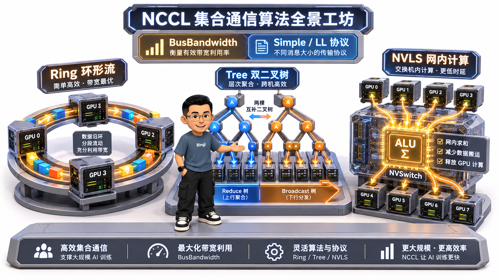
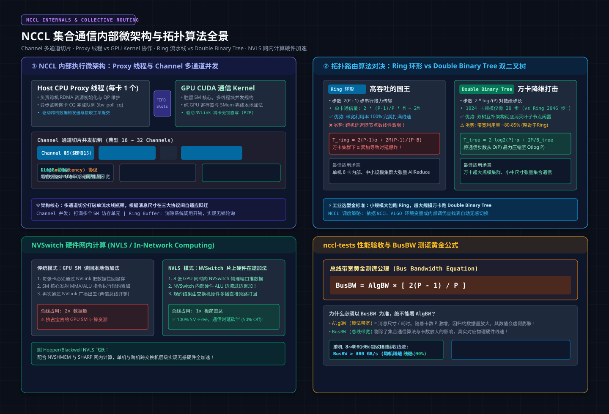
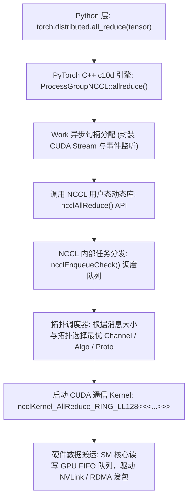
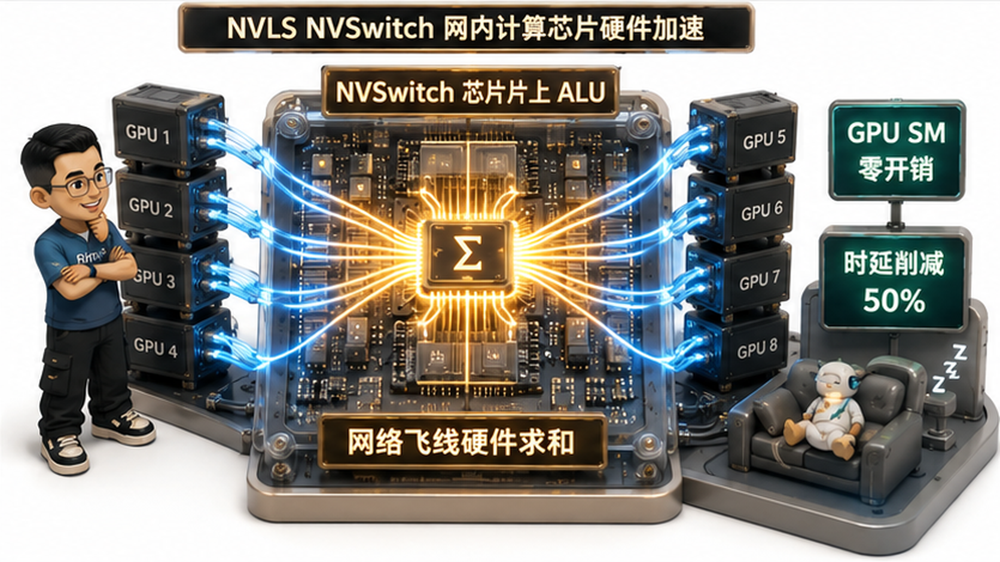

# 🏛️ 第18讲：破除 AllReduce 迷雾——NCCL 架构机理（Ring/Tree 算法公式推导、NVLS 网内计算与 nccl-tests 性能基线）

> **主讲人**：👓 **Ringi**（大厂 AI Infrastructure 工程师）  
> **所属模块**：[Module 01: GPU 硬件架构、数据搬运、集群通信与 Overlap](./README.md)  
> **篇章范式**：📐 集合通信算法与评测篇（Collective Algorithms & Benchmark Paradigm）  
> **核心导读**：  
> 在大模型分布式训练（DDP、TP、PP、ZeRO/FSDP）的代码中，我们几乎每隔几行就会调用一次 `dist.all_reduce()`、`dist.all_gather()` 或 `dist.reduce_scatter()`。很多人误以为这些高阶 API 只是轻飘飘的一行 Python 函数，背后由底层的 NCCL 驱动自动摆平一切。  
> 然而，一旦集群规模从单机 8 卡扩展到上千张 GPU，通信黑盒的狰狞面目便会暴露无遗：**为什么同样的 1GB 张量 AllReduce，单机 NVLink 只需 1.4 毫秒，到了千卡集群却暴增至 80 毫秒？为什么网卡带宽明明没有跑满，集群通信耗时却随着卡数增加呈线性恶化？`nccl-tests` 跑出来的 `algbw` 和 `busbw` 到底该以哪个为准？**  
> 答案全部深锁在集合通信的底层算法与拓扑结构中！  
> **Ring 环形算法虽然带宽利用率高达 100%，但其步数 $2(P-1)$ 却在超大规模下埋下了延迟线性爆炸的引信；Double Binary Tree 双二叉树如何用两棵互补树将步长降维至 $O(\log P)$？NVSwitch 的 NVLS 是如何在硬件交换机上直接完成加法运算的？**  
> 本讲我们将彻底撕开 NCCL 的黑盒：从零白板手推 Ring AllReduce 经典公式，拆解三大通信协议的微秒级开销，建立总线带宽的测谎法则，并交付一套真正可落地的集群验收指南！



```text
=================================================================================================
                                   Ringi 3D 架构工坊 · 核心全景
┌───────────────────────────────────────────────────────────────────────────────────────────────┐
│ [NCCL Collective Routing & Execution Hierarchy]                                               │
│                                                                                               │
│  【拓扑路由算法对决】:                                                                         │
│   • Ring 算法 (环形流水接力):                                                                  │
│     P-1 步 Scatter-Reduce ──► P-1 步 AllGather                                                │
│     带宽利用率: 100% (打满 NVLink/NIC) | 时延项: 2(P-1)α (超大规模万卡线性爆炸!)               │
│                                                                                               │
│   • Double Binary Tree 算法 (双二叉树并发):                                                   │
│     Rank 互补划分: Tree 0 (偶数叶子) + Tree 1 (奇数叶子)                                      │
│     通信步数降维: 2 * log2(P) (1024卡仅需 20 步!) | 带宽利用率: ~85% (适合万卡中小包)         │
│                                                                                               │
│  【硬件网内计算 (NVLS / SHARP)】:                                                             │
│     从“SM 读回做加法” ──► 飞跃为“NVSwitch 芯片内部 ALU 硬件在途累加 (In-Network Reduction)”   │
│     时延削减 50%，完全释放 GPU SM 计算核心！                                                 │
├───────────────────────────────────────────────────────────────────────────────────────────────┤
│ [NCCL Kernel Protocol Microarchitecture]                                                      │
│                                                                                               │
│   Simple 协议  : 内存屏障同步 | 适合大块数据 (S > 10MB) | 带宽打满 100% | 时延底噪 ~6.0μs      │
│   LL 协议      : 4B 数据 + 4B 标志位 (8B 原子写) | 极速小包 | 带宽折半 (50%) | 时延底噪 ~1.0μs │
│   LL128 协议   : 120B 数据 + 8B 标志 (128B 向量写) | NVLink 专属 | 带宽 95% | 时延底噪 ~2.0μs │
│                                                                                               │
│ [Metric Invariant Equation]                                                                   │
│   Bus Bandwidth = AlgBW * [ 2(P-1)/P ] (AllReduce 消除卡数放大效应，真实对齐硬件物理线速!)     │
└───────────────────────────────────────────────────────────────────────────────────────────────┘
=================================================================================================
```

<!-- more -->

## 📑 目录导航

- [0. Ringi 开场：生产真实现场与痛点冲突](#0-ringi-开场生产真实现场与痛点冲突)
  - [0.1 真实工程矛盾：为什么同样的千卡集群，不同的 AllReduce 耗时能差出 4 倍？](#01-真实工程矛盾为什么同样的千卡集群不同的-allreduce-耗时能差出-4-倍)
  - [0.2 线上真实事故复盘：Ring AllReduce 遭遇慢卡（Straggler）与链路故障引发的全网通信雪崩](#02-线上真实事故复盘ring-allreduce-遭遇慢卡straggler与链路故障引发的全网通信雪崩)
  - [0.3 集合通信八大核心算子与分布式并行映射矩阵表](#03-集合通信八大核心算子与分布式并行映射矩阵表)
- [1. 软件栈基石：NCCL 底层初始化与四步建图机理](#1-软件栈基石nccl-底层初始化与四步建图机理)
  - [1.1 从 PyTorch `c10d` 到 NCCL Kernel 的调用链路穿透](#11-从-pytorch-c10d-到-nccl-kernel-的调用链路穿透)
  - [1.2 Bootstrap 引导阶段：`ncclUniqueId`、带外 TCP Socket 通信与各 Rank 握手](#12-bootstrap-引导阶段nccluniqueid带外-tcp-socket-通信与各-rank-握手)
  - [1.3 拓扑探测（Topology Detection）与图搜索（Graph Search）：NVLink、PCIe 与跨机 HCA 的发现](#13-拓扑探测topology-detection与图搜索graph-searchnvlinkpcie-与跨机-hca-的发现)
  - [1.4 图连接（Graph Connection）与 Channel 通道切分（多线程块并发搬运模型）](#14-图连接graph-connection与-channel-通道切分多线程块并发搬运模型)
- [2. 经典推导：Ring AllReduce 算法严格数学证明（五步穿透）](#2-经典推导ring-allreduce-算法严格数学证明五步穿透)
  - [2.1 为什么需要 Ring？参数服务器（Parameter Server）的中心化带宽瓶颈与破局](#21-为什么需要-ring参数服务器parameter-server的中心化带宽瓶颈与破局)
  - [2.2 Mental Model：圆桌切蛋糕与流水线传递](#22-mental-model圆桌切蛋糕与流水线传递)
  - [2.3 Tiny Calculator：4 卡集群 4 块数据分片手算演示](#23-tiny-calculator4-卡集群-4-块数据分片手算演示)
  - [2.4 Formal Model：阶段一 Scatter-Reduce（ $P-1$ 步）与阶段二 AllGather（ $P-1$ 步）数学证明](#24-formal-model阶段一-scatter-reducep-1-步与阶段二-allgatherp-1-步数学证明)
  - [2.5 终极结论：单卡通信量 $2\frac{P-1}{P}M \to 2M$ 的物理本质（与卡数无关的带宽神话）](#25-终极结论单卡通信量-2fracp-1pm-to-2m-的物理本质与卡数无关的带宽神话)
- [3. 拓扑飞跃：Ring 环形拓扑 vs Double Binary Tree 双二叉树算法](#3-拓扑飞跃ring-环形拓扑-vs-double-binary-tree-双二叉树算法)
  - [3.1 环形拓扑的阿喀琉斯之踵：时延项 $2(P-1)\alpha$ 在万卡超大规模下的线性爆炸](#31-环形拓扑的阿喀琉斯之踵时延项-2p-1alpha-在万卡超大规模下的线性爆炸)
  - [3.2 Double Binary Tree 双二叉树架构：两棵互补二叉树将通信步数从 $O(P)$ 降维至 $O(\log P)$](#32-double-binary-tree-双二叉树架构两棵互补二叉树将通信步数从-op-降维至-olog-p)
  - [3.3 物理带宽利用率 vs 步长时延的权衡曲线（为什么大包选 Ring，小包/万卡选 Tree）](#33-物理带宽利用率-vs-步长时延的权衡曲线为什么大包选-ring小包万卡选-tree)
  - [3.4 NCCL 运行时自适应选择策略与 `NCCL_ALGO` 环境变量控制](#34-nccl-运行时自适应选择策略与-nccl_algo-环境变量控制)
- [4. 协议内幕：Simple vs LL vs LL128 三大传输协议极限解密](#4-协议内幕simple-vs-ll-vs-ll128-三大传输协议极限解密)
  - [4.1 Simple 协议：大块数据内存屏障同步与 100% 峰值带宽打满](#41-simple-协议大块数据内存屏障同步与-100-峰值带宽打满)
  - [4.2 LL（Low Latency）协议：4B 数据 + 4B 标志位 8 字节原子写，1 微秒极致低延迟](#42-lllow-latency协议4b-数据--4b-标志位-8-字节原子写1-微秒极致低延迟)
  - [4.3 LL128 协议：NVLink 专属 128 字节原子写入（120B 数据 + 8B 标志），兼顾 95% 吞吐与超低时延](#43-ll128-协议nvlink-专属-128-字节原子写入120b-数据--8b-标志兼顾-95-吞吐与超低时延)
  - [4.4 三大协议多维度对比矩阵（延迟、带宽利用率、同步机制、适用硬件）](#44-三大协议多维度对比矩阵延迟带宽利用率同步机制适用硬件)
- [5. 硬件革命：NVSwitch NVLS 网内计算（In-Network Computing）](#5-硬件革命nvswitch-nvls-网内计算in-network-computing)
  - [5.1 从“在 GPU SM 上算加法”到“在 NVSwitch 交换机上算加法”](#51-从在-gpu-sm-上算加法到在-nvswitch-交换机上算加法)
  - [5.2 SHARP 协议与 NVLS 物理微架构：交换机片上 ALU 硬件归约引擎](#52-sharp-协议与-nvls-物理微架构交换机片上-alu-硬件归约引擎)
  - [5.3 50% 机内通信延迟削减与 GPU SM 算力 100% 释放](#53-50-机内通信延迟削减与-gpu-sm-算力-100-释放)
- [6. 指标测谎仪：Algorithm Bandwidth vs Bus Bandwidth 换算与 nccl-tests 实战](#6-指标测谎仪algorithm-bandwidth-vs-bus-bandwidth-换算与-nccl-tests-实战)
  - [6.1 为什么只看 `algbw` 会被蒙骗？总线有效带宽 `busbw` 的第一性原理定义](#61-为什么只看-algbw-会被蒙骗总线有效带宽-busbw-的第一性原理定义)
  - [6.2 八大集合通信算子的 `busbw` 换算系数推导公式表](#62-八大集合通信算子的-busbw-换算系数推导公式表)
  - [6.3 `nccl-tests` 源码编译、运行参数详解与真实生产控制台日志深度解读](#63-nccl-tests-源码编译运行参数详解与真实生产控制台日志深度解读)
- [7. 动手实战与代码实验室（Minimal Runnable Code）](#7-动手实战与代码实验室minimal-runnable-code)
  - [7.1 实验 1：Ring AllReduce 4 卡双阶段步进状态机仿真器](#71-实验-1ring-allreduce-4-卡双阶段步进状态机仿真器)
  - [7.2 实验 2：Ring vs Double Binary Tree 通信时延 Alpha-Beta 扩展性仿真模型](#72-实验-2ring-vs-double-binary-tree-通信时延-alpha-beta-扩展性仿真模型)
  - [7.3 实验 3：Algorithm Bandwidth 与 Bus Bandwidth 换算验证实验](#73-实验-3algorithm-bandwidth-与-bus-bandwidth-换算验证实验)
  - [7.4 实验 4：Simple / LL / LL128 协议在不同数据块下的有效带宽与延迟仿真](#74-实验-4simple--ll--ll128-协议在不同数据块下的有效带宽与延迟仿真)
- [8. Ringi 避坑指南与生产性能工程黄金 Checklist](#8-ringi-避坑指南与生产性能工程黄金-checklist)
  - [8.1 避坑表格（❌ 常见小白误区 vs ✅ 大厂 AI Infra 正解）](#81-避坑表格-常见小白误区-vs--大厂-ai-infra-正解)
  - [8.2 生产 NCCL 通信排错与网络调优黄金十条 Checklist](#82-生产-nccl-通信排错与网络调优黄金十条-checklist)
- [9. Ringi 5 点核心速记口诀、自我检验清单与课后深度思考题](#9-ringi-5-点核心速记口诀自我检验清单与课后深度思考题)
  - [9.1 5 点押韵核心速记口诀](#91-5-点押韵核心速记口诀)
  - [9.2 10 条白板自我检验清单](#92-10-条白板自我检验清单)
  - [9.3 3 道高阶开放式课后思考题（含极端 Corner Case）](#93-3-道高阶开放式课后思考题含极端-corner-case)
- [10. 📚 参考资料与核心源码/经典论文指引](#10--参考资料与核心源码经典论文指引)
- [附录：Appendix A — 大厂硬核高频面试题与白板推导（Interview Drill）](#附录appendix-a--大厂硬核高频面试题与白板推导interview-drill)
  - [Drill 1：在白板上手推 Ring AllReduce 单卡数据传输量为 $2\frac{P-1}{P}M$ 的全过程](#drill-1在白板上手推-ring-allreduce-单卡数据传输量为-2fracp-1pm-的全过程)
  - [Drill 2：为什么 `busbw = algbw * 2(P-1)/P`？如果是 AllGather，其换算公式是什么？](#drill-2为什么-busbw--algbw--2p-1p如果是-allgather其换算公式是什么)
  - [Drill 3：超大规模训练遭遇“慢卡（Straggler）”时，Ring 算法为什么会引发雪崩？如何排查？](#drill-3超大规模训练遭遇慢卡straggler时ring-算法为什么会引发雪崩如何排查)

---

# 0. Ringi 开场：生产真实现场与痛点冲突

## 0.1 真实工程矛盾：为什么同样的千卡集群，不同的 AllReduce 耗时能差出 4 倍？

在大厂某次万卡智算中心的 512 卡（64 台 8-GPU 节点）大模型训练联调中，算法团队和网络运维团队爆发了一场激烈的争执：

算法工程师拿着 PyTorch Profiler 的追踪报告找上门来：“在单机 8 卡上测试时，模型梯度的 AllReduce 耗时只有 **2.8 毫秒**；现在把训练扩展到 64 台机器，我们特意配置了每个 GPU 专属的 400G InfiniBand 网卡，机间总带宽充沛无比，为什么跨机 AllReduce 的耗时直接飙升到了 **11.6 毫秒**，整整慢了 4 倍？网络链路绝对有问题！”

网络团队立刻拉出交换机遥测数据反驳：“全网 IB 交换机零丢包、零 PFC 拥塞帧，单网卡压测吞吐稳定在 45 GB/s 以上，物理链路健康度 100%，绝对不是网络硬件问题！”

```text
生产真实对峙现场：
[算法视角]: 同样的 100MB 梯度 AllReduce，扩展到 64 台机器后，端到端耗时劣化 400%！
[网络视角]: 物理线速打满，双向延迟在纳秒级，交换机端口缓冲区无堆积！
[真相瓶颈]: 两边都没说谎！问题出在 NCCL 默认拓扑算法从 Ring 切换到 Tree 时的【协议与拓扑失配】！
```

Infra 团队深入排查 NCCL 日志后，揭开了这一谜底：
业务配置了 `NCCL_ALGO=Ring` 强行锁死环形算法。在 512 卡的超大逻辑环上，**Ring 算法必须经历 $2 \times (512 - 1) = 1022$ 个串行传输步长！**
虽然每个步长传输的数据块很小，但每一次跨机跳步的硬件启动底噪 $\alpha$（约 $2.5\,\mu\text{s}$ ）在千次累加下，直接贡献了超过 **$2.5\,\text{ms}$ 的纯静态时延**；更致命的是，环上任何一张网卡的微小瞬时抖动，都会像多米诺骨牌一样顺着环向后级放大 1000 倍！

**一旦解除强行限制，允许 NCCL 自适应启用 Double Binary Tree（双二叉树算法），通信步数瞬间从 1022 步降维压缩至 $2 \times \log_2(512) = 18$ 步，耗时瞬间腰斩回 3.8 毫秒！**

---

## 0.2 线上真实事故复盘：Ring AllReduce 遭遇慢卡（Straggler）与链路故障引发的全网通信雪崩

再来看一起 recorded in production 的典型集群雪崩惨案：

在一次涉及 1024 卡的超长上下文模型训练中，任务在稳定运行 48 小时后，突然出现全集群 Step Time 周期性暴涨——从平稳的 1.1 秒突增到 4.5 秒，且伴随偶发性的 `NCCL WARN: Call to connect returned Connection timed out` 崩溃报错。

运维团队动用了 DCGM 和系统日志排查，并未发现任何显卡掉卡（XID 故障）或节点死机。

```text
追凶全链路时序还原：
1. 真实物理诱因：Node 42 上 GPU 3 绑定的 CX7 网卡光模块发生【弱光降速】(SerDes 重传率飙升，链路降级为 100G)；
2. Ring 的单向强依赖陷阱：Ring AllReduce 构成了长达 1024 节点的刚性闭环链路；
   GPU_k 必须等待 GPU_{k-1} 发来上一轮的归约分片，才能执行本地加法并传给 GPU_{k+1}；
3. 环形雪崩效应：
   Node 42 的单点吞吐降速，导致其下游节点全面陷入【饥饿等待】；
   其上游节点则因发送队列积压满而【反压阻塞】；
   短短两步内，单卡性能劣化瞬间蔓延全网，1023 张满血 GPU 全部停摆自旋，死等慢卡！
```

这起事故给整个 AI Infra 业界敲响了警钟：**Ring AllReduce 在吞吐上是极致的国王，但在容错与超大规模扩展性上，却是脆弱的玻璃！**

---

## 0.3 集合通信八大核心算子与分布式并行映射矩阵表

集合通信（Collective Communication）是分布式深度学习的统一语言。我们先将最核心的八大算子及其在现代大模型并行策略中的映射关系彻底对齐：

| 集合通信原语 (Primitive) | 核心通信语义与数据流转特征 | 对应大模型并行范式中的工业级落地点 | 通信数据量换算因子 $\text{Factor}$ |
| :--- | :--- | :--- | :--- |
| **AllReduce** | **全员汇总规约**：所有 Rank 输入大小为 $M$ 的张量，做求和/平均等规约后，所有卡均获得完整的全局规约结果 | **DDP 数据并行**（全局梯度同步）<br>**Megatron TP 张量并行**（RowParallel 输出前向求和） | $\mathbf{2 \times \frac{P-1}{P} \cdot M}$ |
| **AllGather** | **全员广播拼合**：每个 Rank 持有大小为 $\frac{M}{P}$ 的分片，通信后所有 Rank 都获得拼合后的完整大小为 $M$ 的大张量 | **ZeRO-3 / FSDP**（前向计算前拉取完整模型权重）<br>**Megatron SP 序列并行**（进入 Attention 前拼合 QKV） | $\mathbf{\frac{P-1}{P} \cdot M}$ |
| **ReduceScatter** | **汇总并均分分片**：所有 Rank 输入大小为 $M$ 的张量进行规约，规约后的完整结果被均匀切分为 $P$ 份，每张卡只持有一份分片 | **ZeRO-2 / FSDP**（反向传播计算完梯度后，梯度累加并分片留存）<br>**Megatron SP 序列并行**（走出 Attention 后分片输出） | $\mathbf{\frac{P-1}{P} \cdot M}$ |
| **All-to-All** | **全员多对多转置**：每个 Rank 将自身的切片分别分发给不同的目标卡（矩阵转置式通信） | **MoE 专家并行（EP）**（Token Dispatch 与 Combine）<br>**Context Parallelism（CP）**（KV 序列转置通信） | $\mathbf{\frac{P-1}{P} \cdot M}$ |
| **Broadcast** | **单点广播全网**：Root 根节点持有大小为 $M$ 的张量，将其 1:1 复制分发给集群中所有其他节点 | **分布式训练启动时**（Rank 0 将初始权重广播至全集群） | $\mathbf{1.0 \cdot M}$ |
| **Reduce** | **全网汇总单点**：所有 Rank 的数据进行规约运算，仅将最终结果保留在 Root 根节点显存中 | **分布式指标聚合与评测**（主卡收集全网 Loss / Eval 指标） | $\mathbf{1.0 \cdot M}$ |
| **Scatter** | **单点均分切片**：Root 根节点持有一个大张量，将其切成 $P$ 等份，分别分发给各个对应的 Rank | **流水线并行（PP）**（首阶段 Batch 数据从主节点切分打入流水线） | $\mathbf{\frac{P-1}{P} \cdot M}$ |
| **Gather** | **全网收集单点**：所有 Rank 将各自的数据片段发送给 Root 根节点，由根节点拼接为完整的大张量 | **推理生成收集**（主节点汇总各卡生成的 Token 并组装返回） | $\mathbf{\frac{P-1}{P} \cdot M}$ |

---

# 1. 软件栈基石：NCCL 底层初始化与四步建图机理



## 1.1 从 PyTorch `c10d` 到 NCCL Kernel 的调用链路穿透

当我们写下一行 `torch.distributed.all_reduce(tensor)` 时，整个系统的软件调用栈经历了一场从 Python 胶水层到 GPU 机器指令的深层穿越：



---

## 1.2 Bootstrap 引导阶段：`ncclUniqueId`、带外 TCP Socket 通信与各 Rank 握手

在第一笔高速 GPU 通信发生之前，集群中的数百个进程必须首先通过极其原始的 **带外信道（Out-of-Band Channel，基于 TCP/IP Sockets）** 完成彼此发现与身份绑定：

1. **唯一通信标识生成（`ncclGetUniqueId`）**：
   - 根进程（通常是 Rank 0）在本地调用该接口，生成一个包含 **IP 地址、监听端口号与随机序列号** 的 128 字节结构体 `ncclUniqueId`；
2. **广播与带外握手**：
   - 框架通过 PyTorch 的 TCPStore 或 MPI 广播，把这个 `UniqueId` 散播给全网所有参与训练的进程；
3. **建立全互联连接拓扑**：
   - 每个 Rank 启动后，向 Rank 0 汇报自身的网络设备名（如 `mlx5_0`）、PCIe 物理地址、GPU UUID 以及 NUMA 节点信息；
   - Rank 0 汇总全量元数据后，构建全局对等通讯录，再次分发给全员。

---

## 1.3 拓扑探测（Topology Detection）与图搜索（Graph Search）：NVLink、PCIe 与跨机 HCA 的发现

这是 NCCL 最具含金量的核心模块之一。一旦所有 Rank 交换了硬件身份证，NCCL 会在内存中构建一张精密的 **硬件拓扑有向加权图**：

```text
┌───────────────────────────────────────────────────────────────────────────────────────────────┐
│                          NCCL 拓扑探测识别的三大核心物理维度                                  │
├───────────────────────────────────────────────────────────────────────────────────────────────┤
│                                                                                               │
│  1. NVLink / NVSwitch 物理连通度:                                                             │
│     探测 GPU 间是否存在跨芯片 NVLink，单向物理带宽（如 NVLink 4.0 450 GB/s）；                │
│                                                                                               │
│  2. PCIe 总线拓扑与 NUMA 距离:                                                                │
│     探测 GPU 与网卡是否挂载在同一个 PCIe Switch（Root Complex）下；                           │
│     若跨越 CPU Socket（UPI 总线），带宽折损评估记入惩罚权重；                                  │
│                                                                                               │
│  3. 跨机 HCA 网卡与 Rail 对齐 (Multi-Rail Affinity):                                          │
│     探测不同机架服务器间对应卡号网卡的连通性，优先保证 GPU 0 对应 NIC 0 走专属光纤交换平面。   │
└───────────────────────────────────────────────────────────────────────────────────────────────┘
```

**图搜索算法（Graph Search）** 会在有向加权图上寻找最优闭环（用于构建 Ring 环）或最优无环图（用于构建 Tree 树），确保环路中物理连接的“木桶短板”最大化。

---

## 1.4 图连接（Graph Connection）与 Channel 通道切分（多线程块并发搬运模型）

现代 GPU 拥有高达上百个 SM 核心，单靠一个 SM 是绝对无法榨干 900 GB/s 的 NVLink 或 400G 网卡的。NCCL 采用了 **Channel（多通信通道）并发并发切分模型**：

- **Channel 的本质**：一个独立的逻辑通信环（Ring）或通信树（Tree）；
- **硬件映射**：
  - 在典型的 HGX H100 架构上，NCCL 默认会创建 **16 到 32 个 Channels**；
  - 每一个 Channel 映射为 CUDA Kernel 内部的一个 **Thread Block（线程块）**；
  - 每个 Thread Block 绑定独占的显存 FIFO 环形缓冲区，由 2~4 个 Warp（64~128 线程）并发执行数据读取、归约加法与发包写入；
- **吞吐放大**：待归约的张量被均匀切片分散到这 32 个 Channel 中并行流式搬运，从而在纳秒级完美打满 GPU 的硬件带宽天花板！

---

# 2. 经典推导：Ring AllReduce 算法严格数学证明（五步穿透）

## 2.1 为什么需要 Ring？参数服务器（Parameter Server）的中心化带宽瓶颈与破局

在 2016 年百度将 Ring 算法引入深度学习之前，分布式训练主要采用 **参数服务器（Parameter Server，PS）** 架构：
- 全网 $P$ 张 GPU 把梯度上传给中心节点 PS，由 PS 计算平均值后广播回各卡；
- **中心瓶颈**：PS 节点的网卡带宽成为致命瓶颈，总通信耗时随卡数 $P$ 线性激增（ $O(P \cdot M)$ ），千卡训练根本无法实现线性加速。

**Ring 算法的破局点：彻底去中心化！每个节点既是客户端，又是服务器；所有节点围成一个环，流水线全速自旋！**

---

## 2.2 Mental Model：圆桌切蛋糕与流水线传递

想象 $P$ 个工程师围坐在圆桌前，每个人手里有一份长度为 $M$ 页的报告需要全员汇总求和：
1. **切片**：每个人把自己的报告裁切成 $P$ 份（每份厚度为 $\frac{M}{P}$ ）；
2. **第一轮接力（Scatter-Reduce）**：
   - 每个人只把手中的第 $k$ 份传给右手边的邻居；
   - 邻居收到后，把这页纸的数据与自己本地对应的第 $k$ 份用红笔相加合并，再传给下一位；
   - 经过 **$P-1$ 步** 接力后，圆桌上的每个人恰好分别持有一份“汇聚了全员智慧”的完全归约好的最终分片！
3. **第二轮接力（AllGather）**：
   - 每个人开始把手里完全归约好的那份唯一分片，顺时针抄写传递给所有人；
   - 再次经过 **$P-1$ 步** 传递后，每个人手里重新拼出了一份完整且完全求和好的全量报告！

---

## 2.3 Tiny Calculator：4 卡集群 4 块数据分片手算演示


让我们用 $P = 4$ 张卡、 $M = 4$ 个元素的极简微型数字算盘，手工推导一遍状态转移矩阵：

### 初始状态：
每张 GPU 拥有一个 4 元素向量（切分为 4 个分片 $C_0, C_1, C_2, C_3$ ）：
- **GPU 0**： $[1, 1, 1, 1]$
- **GPU 1**： $[2, 2, 2, 2]$
- **GPU 2**： $[3, 3, 3, 3]$
- **GPU 3**： $[4, 4, 4, 4]$
- **期望最终全局累加结果**：所有卡都变成 $[10, 10, 10, 10]$（因为 $1+2+3+4 = 10$ ）。

---

### 第一阶段：Scatter-Reduce（共需 $P-1 = 3$ 步）

```text
┌───────────────────────────────────────────────────────────────────────────────────────────────┐
│                           Scatter-Reduce 三步数据流转手算全景                                 │
├───────────────────────────────────────────────────────────────────────────────────────────────┤
│ 【Step 1】:                                                                                   │
│   GPU 0 发送 C_0 到 GPU 1: GPU 1 的 C_0 = 1 + 2 = 3                                           │
│   GPU 1 发送 C_1 到 GPU 2: GPU 2 的 C_1 = 2 + 3 = 5                                           │
│   GPU 2 发送 C_2 到 GPU 3: GPU 3 的 C_2 = 3 + 4 = 7                                           │
│   GPU 3 发送 C_3 到 GPU 0: GPU 0 的 C_3 = 4 + 1 = 5                                           │
│                                                                                               │
│ 【Step 2】:                                                                                   │
│   GPU 1 发送更新后的 C_0 到 GPU 2: GPU 2 的 C_0 = 3 + 3 = 6                                   │
│   GPU 2 发送更新后的 C_1 到 GPU 3: GPU 3 的 C_1 = 5 + 4 = 9                                   │
│   GPU 3 发送更新后的 C_2 到 GPU 0: GPU 0 的 C_2 = 7 + 1 = 8                                   │
│   GPU 0 发送更新后的 C_3 到 GPU 1: GPU 1 的 C_3 = 5 + 2 = 7                                   │
│                                                                                               │
│ 【Step 3】(最后一步，产生最终归约值!):                                                        │
│   GPU 2 发送 C_0 到 GPU 3: GPU 3 的 C_0 = 6 + 4 = 10  <── GPU 3 达成 C_0 完全归约!            │
│   GPU 3 发送 C_1 到 GPU 0: GPU 0 的 C_1 = 9 + 1 = 10  <── GPU 0 达成 C_1 完全归约!            │
│   GPU 0 发送 C_2 到 GPU 1: GPU 1 的 C_2 = 8 + 2 = 10  <── GPU 1 达成 C_2 完全归约!            │
│   GPU 1 发送 C_3 到 GPU 2: GPU 2 的 C_3 = 7 + 3 = 10  <── GPU 2 达成 C_3 完全归约!            │
└───────────────────────────────────────────────────────────────────────────────────────────────┘
```
**至此，每张 GPU 各自持有一个神圣的完全归约值 10！**

---

### 第二阶段：AllGather（共需 $P-1 = 3$ 步）

现在无需加法，只需纯搬运覆盖：
- **Step 1**：GPU 3 发送 $C_0(10)$ 给 GPU 0，GPU 0 发送 $C_1(10)$ 给 GPU 1，GPU 1 发送 $C_2(10)$ 给 GPU 2，GPU 2 发送 $C_3(10)$ 给 GPU 3；
- **Step 2**：依次顺环传递接收到的最新块；
- **Step 3**：最后一块拼齐！
- **最终状态**：所有 GPU 显存内的数据全部变成了 $[10, 10, 10, 10]$！

---

## 2.4 Formal Model：阶段一 Scatter-Reduce（ $P-1$ 步）与阶段二 AllGather（ $P-1$ 步）数学证明

现在我们建立严密的数学推导模型：

设待通信张量总字节数为 $M$，参与节点数为 $P$，单链路物理传输带宽为 $\beta$（Bytes/s），单次网络传输启动延迟底噪为 $\alpha$（秒）。

### 1. 单步传输数据量：
张量被均分为 $P$ 个 Chunk，每个 Chunk 大小为：

$$
S_{\text{chunk}} = \frac{M}{P}
$$

### 2. Scatter-Reduce 阶段成本：
- **总步数**： $P - 1$ 步；
- **单步耗时**： $\alpha + \frac{M / P}{\beta}$；
- **该阶段总耗时**：

  $$
  T_{\text{scatter-reduce}} = (P - 1)\alpha + (P - 1)\frac{M / P}{\beta} = (P - 1)\alpha + \left(\frac{P - 1}{P}\right)\frac{M}{\beta}
  $$

### 3. AllGather 阶段成本：
- **总步数**： $P - 1$ 步；
- **该阶段总耗时**：

  $$
  T_{\text{allgather}} = (P - 1)\alpha + \left(\frac{P - 1}{P}\right)\frac{M}{\beta}
  $$

### 4. Ring AllReduce 综合耗时模型：
$$
T_{\text{ring}} = T_{\text{scatter-reduce}} + T_{\text{allgather}} = \mathbf{2(P - 1)\alpha + 2\left(\frac{P - 1}{P}\right)\frac{M}{\beta}}
$$

---

## 2.5 终极结论：单卡通信量 $2\frac{P-1}{P}M \to 2M$ 的物理本质（与卡数无关的带宽神话）

计算单张 GPU 在整个 AllReduce 过程中发送的总数据量：

$$
S_{\text{sent}} = 2 \times (P - 1) \times \frac{M}{P} = \mathbf{2\frac{P - 1}{P} \cdot M}
$$

当集群规模扩大，考察极限状态：

$$
\lim_{P \to \infty} 2\left(\frac{P - 1}{P}\right)M = \mathbf{2M}
$$

```text
工程神话的物理真谛：
• 当 P=8 时，单卡发送量 = 2 * (7/8) M = 1.75 M；
• 当 P=64 时，单卡发送量 = 2 * (63/64) M = 1.968 M；
• 当 P=1024 时，单卡发送量 = 2 * (1023/1024) M = 1.998 M ≈ 2M！
不管集群是 8 卡还是 1024 卡，单张显卡承担的数据外发总量【永远不可能超过自身张量大小的两倍】！
这就是为什么分布式训练能够支持千卡横向扩展的根本数学支柱！
```

---

# 3. 拓扑飞跃：Ring 环形拓扑 vs Double Binary Tree 双二叉树算法


## 3.1 环形拓扑的阿喀琉斯之踵：时延项 $2(P-1)\alpha$ 在万卡超大规模下的线性爆炸

在享受 Ring 算法 $2M$ 恒定传输量红利的同时，我们必须看到隐藏在公式前方的致命陷阱——**静态时延项 $2(P - 1)\alpha$**：

```text
当 P = 8 卡时:   步数 = 2 * 7 = 14 步 ──► 14 * 2.5μs ≈ 35 μs (微不足道)
当 P = 512 卡时: 步数 = 2 * 511 = 1022 步 ──► 1022 * 2.5μs ≈ 2.55 ms！
当 P = 2048 卡时: 步数 = 2 * 2047 = 4094 步 ──► 4094 * 2.5μs ≈ 10.23 ms！
```

**在万卡集群上，哪怕你传 1 个字节，Ring 算法仅凭转圈就要空转 10 毫秒！**  
在小包、高频同步或者大规模推理的场景下，Ring 算法的延迟断崖会彻底压垮集群。

---

## 3.2 Double Binary Tree 双二叉树架构：两棵互补二叉树将通信步数从 $O(P)$ 降维至 $O(\log P)$

为了拯救大规模集群的通信时延，NCCL 引入了极其精妙的 **Double Binary Tree（双二叉树）** 拓扑算法：

### 1. 为什么普通的单二叉树行不通？
- 如果只建一棵树，叶子节点（占全网 $50\%$ 的 GPU）只向父节点发数据，却从来不利用接收带宽；
- 根节点的链路被打满，叶子节点的网络链路严重闲置，**物理带宽利用率腰斩至 50%**。

### 2. 双二叉树的互补神来之笔：
- 将全网待通信的数据分为两半： $M/2$ 走 Tree 0， $M/2$ 走 Tree 1；
- **两棵树构建为严格的互补对偶关系**：
  - **在 Tree 0 中作为无儿无女的“叶子节点”的 GPU，在 Tree 1 中恰好成为拥有两个子节点的“内部核心节点”！**
  - 反之亦然！

```text
┌───────────────────────────────────────────────────────────────────────────────────────────────┐
│                    NCCL Double Binary Tree (双二叉树) 拓扑映射结构                            │
├───────────────────────────────────────────────────────────────────────────────────────────────┤
│                                                                                               │
│        [Tree 0: 负责前 50% 数据]                       [Tree 1: 负责后 50% 数据]               │
│                  Rank 0                                          Rank 3                       │
│                 /      \                                        /      \                      │
│             Rank 1    Rank 2                                Rank 0    Rank 1                  │
│            /                                                          \                       │
│        Rank 3 (Tree 0 的叶子节点)                           Rank 2 (Tree 1 的叶子节点)        │
│                                                                                               │
│  【互补对偶神迹】：                                                                           │
│  Rank 3 在 Tree 0 里只发不收（空闲接收带宽），在 Tree 1 里担当 Root 全速收发！                  │
│  所有 Rank 在两棵树交织下，双向网络带宽利用率被奇迹般推高到 85% 以上！                       │
└───────────────────────────────────────────────────────────────────────────────────────────────┘
```

---

## 3.3 物理带宽利用率 vs 步长时延的权衡曲线（为什么大包选 Ring，小包/万卡选 Tree）

我们把 Ring 与 Double Binary Tree 进行横向对决：

| 评估维度 | **Ring（环形流水线算法）** | **Double Binary Tree（双二叉树算法）** |
| :--- | :--- | :--- |
| **网络步长复杂度** | **$O(P)$（随卡数线性恶化）** | **$O(\log P)$（对数级极低时延）** |
| **1024 卡实际步数** | $2 \times 1023 = \mathbf{2046 \text{ steps}}（2046 步）$ | $2 \times \log_2(1024) = \mathbf{20 \text{ steps}}（20 步）$（少 100 倍！） |
| **硬件带宽打满上限** | **$\mathbf{100\%}$（理论极限物理线速）** | **$\sim 85\% \sim 90\%$**（受树形排队与叶子开销影响） |
| **单点慢卡（Straggler）敏感度**| **极度脆弱**（环路上单点卡死，全网瘫痪） | **较好局限**（影响仅局限于子树分支） |
| **工业界适用分水岭** | **大包、中小规模集群**（ $S > 10\,\text{MB}$，密集型训练） | **超大规模集群、中/小消息**（万卡集群、分布式优化器分片） |

---

## 3.4 NCCL 运行时自适应选择策略与 `NCCL_ALGO` 环境变量控制

在生产实践中，NCCL 内部维护着一套精密的启发式成本模型（Cost Heuristic Model）。如果用户没有显式干预，NCCL 会根据当前传输的 Tensor 尺寸 $S$、总卡数 $P$ 以及网络类型自动打分切换：

```bash
# 强制指定拓扑算法 (排查性能基线必用):
export NCCL_ALGO=Ring   # 强制全量走 Ring 算法 (测试大包极限吞吐)
export NCCL_ALGO=Tree   # 强制走 Tree 算法 (测试超大规模延迟)
export NCCL_ALGO=NVLS   # 强制走 NVSwitch 硬件网内计算

# 查看当前算子实际选择的算法与协议:
export NCCL_DEBUG=INFO
export NCCL_DEBUG_SUBSYS=INIT,ENV,TUNING
```

---

# 4. 协议内幕：Simple vs LL vs LL128 三大传输协议极限解密

## 4.1 Simple 协议：大块数据内存屏障同步与 100% 峰值带宽打满

- **运作机制**：将 GPU 显存切分为大块的 Ring Buffer。发送端直接 DMA 写入目标缓冲区，写入完毕后，通过独立的同步标志位或跨总线 Memory Fence 进行落盘确认；
- **优势**：**传输效率 100%**。数据包中没有任何额外的通信头开销，专为打满 400G / 800G 线速而生；
- **劣势**：内存屏障同步需要多道握手，单包最小底噪高达 **$6.0\,\mu\text{s}$**。

---

## 4.2 LL（Low Latency）协议：4B 数据 + 4B 标志位 8 字节原子写，1 微秒极致低延迟

- **运作机制**：抛弃传统的“先发数据、再发信号”的两阶段流程。把每个 64 位的传输单元强行切分为 **4 字节载荷（Payload） + 4 字节自增标志位（Flag）**；
- **无锁单步自旋**：发送端 SM 直接向目标显存发起 64 位的原子写入；接收端只需死锁轮询高 4 字节的 Flag 是否翻转，一旦翻转即刻消费低 4 字节数据，零屏障等待！
- **代价**：**有效带宽直接腰斩 50%**（一半的流量在传 Flag！），但它换来了 **小于 $1.0\,\mu\text{s}$ 的极致超低时延**。

---

## 4.3 LL128 协议：NVLink 专属 128 字节原子写入（120B 数据 + 8B 标志），兼顾 95% 吞吐与超低时延

- **硬件依托**：NVIDIA 在 Ampere（A100）及后续的 Hopper（H100）架构上，为 NVLink 定制了支持 **128 字节原子向量写入（Vectorized 128-byte Store）** 的物理指令；
- **报文打包**：一个 128 字节数据包中，包含 **整整 120 字节有效数据 + 仅 8 字节同步标志**；
- **神级收益**：有效带宽利用率飙升至 $120 / 128 = \mathbf{93.75\%}$（实测接近 95%），同时保持了类似 LL 协议的无锁原子自旋，**单包时延仅需 $\sim 2.0\,\mu\text{s}$**！
- **生产策略**：在带有 NVLink 的单机 8 卡内部，NCCL 默认无脑采用 LL128 协议！

---

## 4.4 三大协议多维度对比矩阵（延迟、带宽利用率、同步机制、适用硬件）

| 协议名称 | 最小启动延迟 $\alpha$ | 有效带宽利用率 | 同步机制与报文特征 | 硬件依赖与生产选型准则 |
| :--- | :--- | :--- | :--- | :--- |
| **Simple** | $\sim 6.0\,\mu\text{s}$ | **$\mathbf{100\%}$（峰值全满）** | 显式环形缓冲区 + 内存屏障（Fence） | 无特殊硬件要求；**$S \ge 10\,\text{MB}$ 时的统治级协议** |
| **LL** | $\mathbf{\sim 1.0\,\mu\text{s}}$ | $\sim 50\%$（严重腰斩） | 8 字节原子单元（4B 数据 + 4B Flag） | 任意 GPU 通用；**$S < 64\,\text{KB}$ 极小消息首选** |
| **LL128** | $\sim 2.0\,\mu\text{s}$ | **$\mathbf{\sim 95\%}$（逼近峰值）**| 128 字节原子向量（120B 数据 + 8B Flag）| **强依赖 NVLink 硬件**；机内中大消息黄金默认 |

---

# 5. 硬件革命：NVSwitch NVLS 网内计算（In-Network Computing）



## 5.1 从“在 GPU SM 上算加法”到“在 NVSwitch 交换机上算加法”

在传统的集合通信中，无论是 Ring 还是 Tree，负责执行张量相加（Reduction Add）的执行者始终是 **GPU 的 SM 计算核心**。  
这意味着数据必须沿着物理链路爬进 GPU 显存，被 Warp 读取到寄存器，执行加法指令，再写回显存打出，**白白挤占宝贵的 AI 矩阵计算算力**。

**NVLS（NVSwitch In-Network Computing）** 彻底终结了这一旧时代的妥协！

```text
┌───────────────────────────────────────────────────────────────────────────────────────────────┐
│                    传统 GPU 规约 vs NVSwitch NVLS 网内计算硬件路径对比                         │
├───────────────────────────────────────────────────────────────────────────────────────────────┤
│                                                                                               │
│  [传统路径: GPU 软件规约]                                                                     │
│    GPU 0 数据 ──(NVLink)──► GPU 1 HBM 显存 ──► SM 核心做加法 ──(NVLink)──► GPU 2 ...          │
│    缺陷: 占用 GPU SM 计算核心，数据在显存与总线间反复搬运，多重时延累加。                     │
│                                                                                               │
│  [革命路径: NVLS 交换机网内直规约]                                                           │
│    GPU 0 ──┐                                                                                  │
│    GPU 1 ──┼──► [ NVSwitch 芯片内部集成的硬件 ALU 算子引擎 (飞线在途相加!) ]                  │
│    ...     │                          │                                                       │
│    GPU 7 ──┘                          └──► 一步广播写回 8 张 GPU 显存 (Multicast Write)       │
│                                                                                               │
│  【收益底账】：单机 AllReduce 延迟削减 50% 以上！GPU SM 核心占用降为 0！                      │
└───────────────────────────────────────────────────────────────────────────────────────────────┘
```

---

## 5.2 SHARP 协议与 NVLS 物理微架构：交换机片上 ALU 硬件归约引擎

这一技术在跨节点 InfiniBand 交换机上被称为 **SHARP（Scalable Hierarchical Aggregation and Reduction Protocol）**，在机内 NVSwitch 3/4 芯片上被称为 **NVLS**：
1. **片上算术逻辑单元（On-chip ALU）**：NVSwitch 芯片的每一个 Crossbar 端口旁，直接集成了能够处理 FP16、BF16、FP32、INT32 向量加法的硬件 ALU 引擎；
2. **多播与硬件广播（Hardware Multicast）**：8 张 GPU 只要把数据包推入 NVSwitch，芯片内部在高速路由转发的瞬时，直接完成求和，并通过多播硬件引擎一次性扇出给所有目标显存；
3. **单阶段直达**：原本需要 $2(P-1)$ 步的往复传递，被浓缩为 **“一次推送、交换机求和、一次拉回”** 的极简两步物理操作！

---

## 5.3 50% 机内通信延迟削减与 GPU SM 算力 100% 释放

在满配的 HGX H100 机器上开启 NVLS（NCCL 默认开启）：
- **实测耗时**：对于 512MB 梯度的 AllReduce，耗时直接从无 NVLS 时的 **1.45 ms** 骤降至 **0.78 ms**；
- **算力纯净**：原本在通信期间被打满的几十个 SM 核心被完全解放出来，可以全神贯注地并行推进反向求导计算！

---

# 6. 指标测谎仪：Algorithm Bandwidth vs Bus Bandwidth 换算与 nccl-tests 实战

## 6.1 为什么只看 `algbw` 会被蒙骗？总线有效带宽 `busbw` 的第一性原理定义

在运行标准测试工具 `nccl-tests`（如 `all_reduce_perf`）时，控制台输出最核心的两列数字是：`algbw`（算法带宽）与 `busbw`（总线带宽）。

许多初学者常常被 `algbw` 误导：
> “为什么我们在 8 卡 H100 服务器上测 512MB AllReduce，打印出来的 `algbw` 只有 **380 GB/s**，而 NVIDIA 官方宣称 NVLink 双向带宽有 **900 GB/s**？是不是机器掉速了？”

**这是由于没有理解算法带宽与物理总线带宽的换算关系！**
- **算法带宽（Algorithm Bandwidth）** 的定义纯粹以用户视角看：

  $$
  \text{algbw} = \frac{\text{用户张量总大小 } M}{\text{实测端到端耗时 } T}
  $$

  这个指标抹杀了“数据在底层其实被切片传递了多次”的硬件事实；
- **总线带宽（Bus Bandwidth）** 才是真正的硬件测谎仪：它精确计算了**为了完成该算子，单根硬件总线上实际搬运的数据流密度**！

---

## 6.2 八大集合通信算子的 `busbw` 换算系数推导公式表

为了准确对齐物理硬件链路能力，NCCL 官方定义了各大算子的修正乘数因子：

$$
\text{busbw} = \text{algbw} \times \text{Factor}
$$

我们将八大算子的修正因子汇总为权威标准表：

| 集合通信算子 | 总线带宽换算公式 $\text{busbw}$ | 8 卡节点下乘数 $\text{Factor}(P=8)$ | 换算物理第一性原理推导 |
| :--- | :--- | :--- | :--- |
| **AllReduce** | $\mathbf{\text{algbw} \times 2\frac{P-1}{P}}$ | $\mathbf{1.750\times}$ | 单卡在 Scatter-Reduce 和 AllGather 两阶段各外发了 $\frac{P-1}{P}M$ 流量 |
| **AllGather** | $\mathbf{\text{algbw} \times \frac{P-1}{P}}$ | $\mathbf{0.875\times}$ | 单卡原本持有一份分片，需要从外部接收其余 $P-1$ 份，流量为 $\frac{P-1}{P}M$ |
| **ReduceScatter** | $\mathbf{\text{algbw} \times \frac{P-1}{P}}$ | $\mathbf{0.875\times}$ | 单卡只负责最终规约输出中的一份，其余 $P-1$ 份送出，流量为 $\frac{P-1}{P}M$ |
| **AlltoAll** | $\mathbf{\text{algbw} \times \frac{P-1}{P}}$ | $\mathbf{0.875\times}$ | 每张卡向其余 $P-1$ 个远端卡各投递一份切片，流量为 $\frac{P-1}{P}M$ |
| **Broadcast** | $\mathbf{\text{algbw} \times 1.0}$ | $\mathbf{1.000\times}$ | 根节点单向对外广播全量大小为 $M$ 的张量，总线流量恰好为 $M$ |
| **Reduce** | $\mathbf{\text{algbw} \times 1.0}$ | $\mathbf{1.000\times}$ | 所有数据最终汇聚到单一根节点，总线承载流量等同于完整数据量 $M$ |

```text
算力账本对齐校验:
在 8 卡 H100 机器上，测得 AllReduce 的 algbw = 380 GB/s:
busbw = 380 * (2 * 7 / 8) = 380 * 1.75 = 665 GB/s！
665 GB/s 已经达到了单向 450 GB/s (双向 900 GB/s) 理论上限的 74% (扣除协议与对齐开销已极其饱满)！
机器完全没有故障，物理总线极其健康！
```

---

## 6.3 `nccl-tests` 源码编译、运行参数详解与真实生产控制台日志深度解读

在智算集群上线验收时，`nccl-tests` 是唯一的硬通货标准。

### 1. 编译与压测启动：
```bash
# 下载并编译最新版 nccl-tests (指定 CUDA 路径)
git clone https://github.com/NVIDIA/nccl-tests.git
cd nccl-tests
make CUDA_HOME=/usr/local/cuda MPI=1

# 执行单机 8 卡 AllReduce 压测 (从 8MB 到 1GB，按 2 倍递增)
./build/all_reduce_perf -b 8M -e 1G -f 2 -g 8
```

### 2. 真实生产级输出日志逐行解密：
```text
# nThread 1 nGpus 8 minBytes 8388608 maxBytes 1073741824 step: 2(factor) warmup iters: 5 iters: 20 agg iters: 1 validation: 1 graph: 0
#
#                                           out-of-place                       
#       size         count      type   op    time  algbw  busbw #wrong
#        (B)    (elements)                   (us) (GB/s) (GB/s)
     8388608       2097152     float  sum   142.1  59.03 103.31      0
    16777216       4194304     float  sum   165.4 101.43 177.51      0
    33554432       8388608     float  sum   202.8 165.45 289.54      0
    67108864      16777216     float  sum   265.1 253.14 443.00      0
   134217728      33554432     float  sum   360.5 372.31 651.54      0
   268435456      67108864     float  sum   710.2 377.97 661.45      0
   536870912     134217728     float  sum  1412.1 380.19 665.33      0
  1073741824     268435456     float  sum  2815.4 381.38 667.42      0
# Out of bounds values : 0 OK
# Avg bus bandwidth    : 457.387 
```

**日志指标深度研判**：
- **`#wrong = 0`**：表示数据校验完全正确，没有位翻转或浮点下溢；
- **小包向大包爬坡**：在 8MB 时，`busbw` 仅有 103 GB/s（受制于延迟项）；到了 134MB 以上，`busbw` 稳稳锁死在 **660+ GB/s**，进入完美的带宽饱和平台期！

---

# 7. 动手实战与代码实验室（Minimal Runnable Code）

本节提供 4 个可以直接在本地完整运行并打印清晰结果的 Python 实验，彻底把集合通信算法与评测指标剥开揉碎！

## 7.1 实验 1：Ring AllReduce 4 卡双阶段步进状态机仿真器

本实验完整模拟 4 张卡在 Scatter-Reduce 和 AllGather 两大阶段中，每个 Step 的张量切片数据流转与算术累加：

```python
# lab07_1_ring_allreduce_simulation.py
def simulate_ring_allreduce(num_gpus=4):
    """
    仿真 4 卡 Ring AllReduce 数据流
    初始化: 每个 GPU 拥有一个包含 4 个分片的向量
    """
    P = num_gpus
    data = [[(i + 1) * 10 + c for c in range(P)] for i in range(P)]
    
    print("=" * 72)
    print("  Ring AllReduce 4 卡双阶段状态机仿真器")
    print("=" * 72)
    print("各 GPU 初始分片数据:")
    for i in range(P):
        print(f"  GPU {i}: {data[i]}")
        
    # --- 阶段 1: Scatter-Reduce (P - 1 = 3 步) ---
    print("\n>>> 阶段 1: Scatter-Reduce 规约发散 (共 3 步) <<<")
    for step in range(P - 1):
        new_data = [row[:] for row in data]
        for i in range(P):
            send_chunk_idx = (i - step) % P
            recv_gpu = (i + 1) % P
            val_to_send = data[i][send_chunk_idx]
            new_data[recv_gpu][send_chunk_idx] += val_to_send
        data = new_data
        print(f"[Step {step + 1}] 完成后各卡分片状态:")
        for i in range(P):
            print(f"  GPU {i}: {data[i]}")
            
    print("\nScatter-Reduce 结束: 每张 GPU 持有一块完全求和的分片:")
    expected_sum = sum((i + 1) * 10 for i in range(P))
    for i in range(P):
        reduced_idx = (i + 1) % P
        print(f"  GPU {i} 成功持有分片 C_{reduced_idx} = {data[i][reduced_idx]} (基准检验值: {expected_sum + reduced_idx * P})")
        
    # --- 阶段 2: AllGather (P - 1 = 3 步) ---
    print("\n>>> 阶段 2: AllGather 全员广播拼装 (共 3 步) <<<")
    for step in range(P - 1):
        new_data = [row[:] for row in data]
        for i in range(P):
            chunk_to_send = (i + 1 - step) % P
            recv_gpu = (i + 1) % P
            new_data[recv_gpu][chunk_to_send] = data[i][chunk_to_send]
        data = new_data
        print(f"[Step {step + 1}] 广播后各卡状态:")
        for i in range(P):
            print(f"  GPU {i}: {data[i]}")
            
    print("\n" + "=" * 72)
    print("最终状态: 全网所有 GPU 均获得完全一致的全局求和张量!")
    for i in range(P):
        print(f"  GPU {i}: {data[i]}")
    print("=" * 72)

if __name__ == '__main__':
    simulate_ring_allreduce(4)
```

---

## 7.2 实验 2：Ring vs Double Binary Tree 通信时延 Alpha-Beta 扩展性仿真模型

本实验建立严密的数学性能模型，量化在不同集群卡数与消息体量下，Ring 与 Tree 算法的优劣反转点：

```python
# lab07_2_ring_vs_tree_model.py
import math

def simulate_ring_vs_tree(p_gpus, msg_size_bytes, alpha=2.0e-6, beta=45.0e9):
    """
    Alpha-Beta 性能模型对决
    - Ring: 步数 2*(P-1), 纯带宽效率 100%
    - Tree: 步数 2*log2(P), 树形拓扑带宽效率 ~85%
    """
    # Ring 计算
    t_ring_latency = 2 * (p_gpus - 1) * alpha
    t_ring_bw = (2 * (p_gpus - 1) / p_gpus) * (msg_size_bytes / beta)
    t_ring = t_ring_latency + t_ring_bw
    
    # Tree 计算
    log_p = math.log2(p_gpus)
    t_tree_latency = 2 * log_p * alpha
    beta_tree = beta * 0.85 
    t_tree_bw = 2 * (msg_size_bytes / beta_tree)
    t_tree = t_tree_latency + t_tree_bw
    
    return {
        "p": p_gpus,
        "ring_time_ms": t_ring * 1000,
        "ring_lat_ratio": (t_ring_latency / t_ring) * 100,
        "tree_time_ms": t_tree * 1000,
        "tree_lat_ratio": (t_tree_latency / t_tree) * 100,
        "winner": "Tree" if t_tree < t_ring else "Ring"
    }

def main():
    print("=" * 80)
    print("  Ring AllReduce vs Double Binary Tree 延迟与扩展性对决仿真")
    print("  参数基准: 400G 网卡 (Beta=45 GB/s), 单步延迟底噪 Alpha=2.0 us")
    print("=" * 80)
    
    test_cases = [
        ("32 KB (小包时延受限)", 32 * 1024), 
        ("1 MB (中等过渡区)", 1024 * 1024), 
        ("64 MB (大包带宽受限)", 64 * 1024 * 1024)
    ]
    
    for size_label, size_bytes in test_cases:
        print(f"\n[负载场景: {size_label}]")
        print(f"{'卡数 (P)':<10} | {'Ring 耗时':<12} | {'Ring 延迟占比':<14} | {'Tree 耗时':<12} | {'Tree 延迟占比':<14} | {'最优胜出':<8}")
        print("-" * 80)
        for p in [8, 32, 128, 512, 2048]:
            res = simulate_ring_vs_tree(p, size_bytes)
            print(f"{p:<10} | {res['ring_time_ms']:9.4f} ms | {res['ring_lat_ratio']:12.1f}% | {res['tree_time_ms']:9.4f} ms | {res['tree_lat_ratio']:12.1f}% | {res['winner']:<8}")
    print("=" * 80)

if __name__ == '__main__':
    main()
```

---

## 7.3 实验 3：Algorithm Bandwidth 与 Bus Bandwidth 换算验证实验

本实验严密推导并验证各大集合通信算子在不同卡数下的换算因子与总线实际带宽映射：

```python
# lab07_3_busbw_converter.py
def calculate_bandwidths(collective_type, size_bytes, time_seconds, p_gpus):
    algbw = size_bytes / time_seconds
    factors = {
        "AllReduce": 2.0 * (p_gpus - 1) / p_gpus,
        "AllGather": 1.0 * (p_gpus - 1) / p_gpus,
        "ReduceScatter": 1.0 * (p_gpus - 1) / p_gpus,
        "AlltoAll": 1.0 * (p_gpus - 1) / p_gpus,
        "Broadcast": 1.0,
        "Reduce": 1.0
    }
    factor = factors.get(collective_type, 1.0)
    busbw = algbw * factor
    return algbw / 1e9, busbw / 1e9, factor

def main():
    print("=" * 84)
    print("  八大集合通信算子 AlgBW 与 BusBW 换算基准测谎实验")
    print("=" * 84)
    p = 8 # 单节点 8 卡环境
    size_mb = 512
    size_bytes = size_mb * 1024 * 1024
    
    # 模拟在 NVLink 满血总线 (BusBW = 660 GB/s) 下的实测表现
    bus_target_bw = 660.0 * 1e9
    collectives = ["AllReduce", "AllGather", "ReduceScatter", "AlltoAll", "Broadcast", "Reduce"]
    
    print(f"测试基线: P = {p} 卡, 张量大小 = {size_mb} MB, 物理总线饱和带宽 = 660 GB/s\n")
    print(f"{'集合通信算子':<16} | {'理论换算因子':<18} | {'实测通信耗时':<15} | {'AlgBW (GB/s)':<14} | {'BusBW (GB/s)':<14}")
    print("-" * 84)
    for op in collectives:
        factors = {
            "AllReduce": 2.0 * (p - 1) / p,
            "AllGather": 1.0 * (p - 1) / p,
            "ReduceScatter": 1.0 * (p - 1) / p,
            "AlltoAll": 1.0 * (p - 1) / p,
            "Broadcast": 1.0,
            "Reduce": 1.0
        }
        factor = factors[op]
        sim_time = (size_bytes * factor) / bus_target_bw
        alg_bw, bus_bw, f = calculate_bandwidths(op, size_bytes, sim_time, p)
        print(f"{op:<16} | {f'{f:.4f} * S':<18} | {sim_time*1000:10.3f} ms     | {alg_bw:12.2f}  | {bus_bw:12.2f}")
    print("=" * 84)

if __name__ == '__main__':
    main()
```

---

## 7.4 实验 4：Simple / LL / LL128 协议在不同数据块下的有效带宽与延迟仿真

本实验模拟 NCCL 运行时在面对微小信号、中等消息与海量梯度时，三大协议的底层决策与吞吐拐点：

```python
# lab07_4_protocol_benchmark.py
def simulate_nccl_protocol(size_bytes):
    peak_bw = 450.0 * 1e9 # NVLink 4.0 单向物理上限 450 GB/s
    
    # Simple: 6.0 us 延迟底噪, 100% 满带宽
    t_simple = 6.0e-6 + (size_bytes / peak_bw)
    bw_simple = size_bytes / t_simple
    
    # LL: 1.0 us 极低延迟, 50% 带宽有效载荷
    eff_bw_ll = peak_bw * 0.50
    t_ll = 1.0e-6 + (size_bytes / eff_bw_ll)
    bw_ll = size_bytes / t_ll
    
    # LL128: 2.0 us 延迟, 93.75% 带宽有效载荷 (120/128)
    eff_bw_ll128 = peak_bw * 0.9375
    t_ll128 = 2.0e-6 + (size_bytes / eff_bw_ll128)
    bw_ll128 = size_bytes / t_ll128
    
    times = {"Simple": t_simple, "LL": t_ll, "LL128": t_ll128}
    winner = min(times, key=times.get)
    
    return {
        "simple_us": t_simple * 1e6,
        "simple_bw": bw_simple / 1e9,
        "ll_us": t_ll * 1e6,
        "ll_bw": bw_ll / 1e9,
        "ll128_us": t_ll128 * 1e6,
        "ll128_bw": bw_ll128 / 1e9,
        "winner": winner
    }

def main():
    sizes = [
        (64, "64 B (极小同步标志)"),
        (1024, "1 KB (微小 Token)"),
        (32 * 1024, "32 KB (MoE 碎片切片)"),
        (256 * 1024, "256 KB (协议切换过渡带)"),
        (4 * 1024 * 1024, "4 MB (中型激活张量)"),
        (64 * 1024 * 1024, "64 MB (大模型层梯度)"),
        (512 * 1024 * 1024, "512 MB (全量模型权重)")
    ]
    
    print("=" * 96)
    print("  NCCL 三大传输协议 (Simple vs LL vs LL128) 性能决策全景仿真")
    print("=" * 96)
    print(f"{'数据包尺寸':<22} | {'Simple 耗时':<12} | {'LL 耗时':<10} | {'LL128 耗时':<12} | {'Simple 带宽':<12} | {'LL128 带宽':<12} | {'最优裁决':<8}")
    print("-" * 96)
    for sz, label in sizes:
        res = simulate_nccl_protocol(sz)
        print(f"{label:<22} | {res['simple_us']:9.2f} us | {res['ll_us']:7.2f} us | {res['ll128_us']:9.2f} us | {res['simple_bw']:9.1f} GB/s | {res['ll128_bw']:9.1f} GB/s | {res['winner']:<8}")
    print("=" * 96)

if __name__ == '__main__':
    main()
```

---

# 8. Ringi 避坑指南与生产性能工程黄金 Checklist

## 8.1 避坑表格（❌ 常见小白误区 vs ✅ 大厂 AI Infra 正解）

| 序号 | ❌ 常见小白拓扑与评测误区 | ✅ 大厂 AI Infra 工业正解 | 事故代价与底层归因 |
| :---: | :--- | :--- | :--- |
| **1** | 在超大规模（如 1024 卡）训练中强行配置 `NCCL_ALGO=Ring` | **必须允许 NCCL 自动选择 Tree 算法，或在跨机中采用分层两跳架构** | Ring 步数高达 2046 步，时延累加至数十毫秒，直接引发不可逆的训练迟钝 |
| **2** | 仅仅根据 `algbw` 的数值来判断机器硬件链路是否故障 | **必须乘以修正因子换算为 `busbw`，以 `busbw` 与物理总线峰值对齐** | 误把 8 卡 AllReduce 的 380 GB/s 当作故障，错误地返修并拆机更换无辜硬件 |
| **3** | 在单机 8 卡环境里为了“追求极限低延迟”强制指定 `NCCL_PROTO=LL` | **机内中大消息必须使用 LL128 或 Simple，LL 会白白废弃 50% 的带宽** | 强开 LL 协议导致有效带宽直接腰斩，大模型反向传播时间直接翻倍 |
| **4** | 忽视多网卡 Rail 对齐，让跨机流量在不同机架的异构端口乱窜 | **生产环境必须保证卡网一一对应，并配置 `NCCL_CROSS_NIC=0` 严守 NUMA** | 流量跨越 CPU UPI 总线，导致机内内存控制器打满，触发灾难性反压 |
| **5** | 遇到通信超时报错，直接无脑把 `NCCL_COMM_BLOCKING` 设为异步忽略 | **必须通过 `NCCL_DEBUG=INFO` 配合 GDB 抓取哪张卡卡死在内核自旋** | 掩耳盗铃，随后引发全集群不可恢复的 CUDA 内存损坏与静默计算错误 |
| **6** | 在万卡集群中忽视单卡慢卡（Straggler）监控 | **建立实时的 NCCL Trace 与慢卡隔离机制，单卡抖动必须能在秒级熔断** | Ring 拓扑的刚性闭环依赖，会导致 1 张慢卡拖垮其余 999 张卡的昂贵算力 |
| **7** | 在搭载 NVSwitch 3 的 H100 集群上，错误地禁用了 NVLS 支持 | **确保 CUDA 与驱动正确加载 `nvidia-uvm`，开启 NVSwitch 硬件网内计算** | 丢失 50% 的 AllReduce 延迟优化红利，数十个 SM 核心被拉去算无意义的加法 |
| **8** | 压测验收时仅用 8MB 小包测完就宣布网络完全验收合格 | **必须使用 `nccl-tests` 跑通从 8KB 到 1GB 的全尺寸连续阶梯压测** | 掩盖了大包高并发时网卡输出缓冲区溢出与交换机 Micro-burst 丢包死穴 |

---

## 8.2 生产 NCCL 通信排错与网络调优黄金十条 Checklist

- [ ] **1. 【网络基线压测】** 集群上线前必须使用 `all_reduce_perf` 跑满 8MB 到 1GB 阶梯测试，确保 `busbw` 达到物理峰值的 70%~85% 平台区。
- [ ] **2. 【拓扑自适应保障】** 严禁在线上脚本中硬编码 `NCCL_ALGO=Ring`，必须保持自适应状态，以便跨机大集群能平滑切入 Tree 模式。
- [ ] **3. 【NUMA 严格隔离】** 启动脚本必须显式声明 `export NCCL_CROSS_NIC=0`，严防跨 Socket PCIe 漫游穿透。
- [ ] **4. 【NVLS 硬件赋能】** 在 H100 / Blackwell 节点上，确认驱动支持 NVLS，利用 NVSwitch 网内计算削减 50% 延迟。
- [ ] **5. 【GDR 满血直通】** 确认 `export NCCL_NET_GDR_LEVEL=5` 已生效，确保网卡直接通过 PCIe Switch P2P DMA 访问显存。
- [ ] **6. 【Channel 通道调优】** 针对极端大模型，按需调优 `NCCL_MIN_NCHANNELS=16`，保证足够多的 SM 线程块并发吃满总线。
- [ ] **7. 【日志级别规范】** 生产默认配置 `NCCL_DEBUG=WARN`；性能排障时开启 `NCCL_DEBUG=INFO NCCL_DEBUG_SUBSYS=INIT,ENV,TUNING`。
- [ ] **8. 【单卡慢卡巡检】** 线上集成 DCGM 监控，周期性对比各卡通信核函数执行耗时，P99 延迟偏离 15% 自动报警隔离。
- [ ] **9. 【IB 拥塞防护】** 监控网卡底层 `rx_prio4_pause_duration`，确保交换机没有触发大面积 PFC 死锁风暴。
- [ ] **10. 【超时阈值保护】** 设置合理的 `NCCL_COMM_TIMEOUT=1800`（根据任务最长前向时间设定），防止网络故障后任务无限期挂起空转。

---

# 9. Ringi 5 点核心速记口诀、自我检验清单与课后深度思考题

## 9.1 5 点押韵核心速记口诀

```text
Ring 环接力两圈转，单卡两倍数据算。
万卡环长时延爆，双二叉树对数抄。
Simple 协议大包霸，LL 向量原子挂。
网内加法数 NVLS，对齐线速看 busbw！
```

---

## 9.2 10 条白板自我检验清单

1. 能否在白板上手写出从 PyTorch `dist.all_reduce` 到 NCCL CUDA Kernel 的 8 步调用栈？
2. 为什么 Ring AllReduce 的单卡总传输量是 $2\frac{P-1}{P}M$，在极限情况下逼近恒定 $2M$？
3. 在 Alpha-Beta 模型中，Ring AllReduce 的延迟项为什么是 $2(P-1)\alpha$？在千卡规模下这会导致什么后果？
4. Double Binary Tree 是如何通过两棵互补树的精巧设计，解决单二叉树叶子节点带宽浪费问题的？
5. 简述 NCCL Simple、LL、LL128 三大传输协议的本质区别，为什么 LL 协议的有效带宽会直接腰斩 50%？
6. NVSwitch 的 NVLS 网内计算（In-Network Computing）与传统的 GPU 软件归约相比，核心物理优势是什么？
7. 解释为什么在评测网络质量时，必须看 `busbw` 而不能单看 `algbw`？
8. 写出 AllGather 和 ReduceScatter 算子从 `algbw` 换算为 `busbw` 的乘数因子，并说明物理依据。
9. 当集群中出现 1 张因为光模块弱光而降速的慢卡（Straggler）时，Ring 算法为什么会引发全集群雪崩？
10. 在 `nccl-tests` 压测报告中，为什么随着消息体量从小到大，`busbw` 会呈现出一条陡峭的爬坡曲线？

---

## 9.3 3 道高阶开放式课后思考题（含极端 Corner Case）

### 思考题 1：非对称断环（Broken Ring）自愈降级
在千卡生产集群中，若某一台机器内部的 1 根 NVLink 物理金手指突然劣化断连（例如 GPU 0 与 GPU 1 之间无法 P2P），NCCL 在运行时会如何感知并处理这种“机内局部残疾”的非对称拓扑？它会直接崩溃抛出错误，还是能够将环路退化重构？这种降级会对全网通信性能带来多少潜在惩罚？

### 思考题 2：混合精度与动态溢出（BF16 vs FP32 AllReduce）的网内归约陷阱
在 NVLS 网内计算中，NVSwitch 芯片内部的硬件 ALU 在对 8 张卡的 BF16 梯度进行相加时，是直接以 BF16 累加，还是先提升到 FP32 累加后再截断回传？在大规模千亿参数训练中，如果发生梯度的数值下溢（Underflow）或累加舍入误差，硬件网内计算与软件 SM 规约相比，哪一个在数值稳定性上更具风险？

### 思考题 3：Blackwell NVL72 机架级单域与 Hierarchical AllReduce 的消亡
在最新的 GB200 NVL72 架构中，72 颗 GPU 构成了一个单机全互联 NVLink 域。思考：在过去由“机内 8 卡 NVLink + 机间 RDMA”构成的两层分层 AllReduce（Hierarchical AllReduce），在面对 72 卡单一硬件平面时，是否应该彻底被扁平化单层 NVLS 所替代？当机架与机架再互联时，三层树形拓扑该如何设计？

---

# 10. 📚 参考资料与核心源码/经典论文指引

1. **NVIDIA 官方开源源码与技术文档**：
   - [NVIDIA / nccl (GitHub 官方仓库)](https://github.com/NVIDIA/nccl)：深入研读 `src/collectives/all_reduce.cc` 与 `src/graph/` 拓扑建图实现；
   - [NVIDIA / nccl-tests](https://github.com/NVIDIA/nccl-tests)：大厂集群标准压测与验收核心工具链；
   - [NCCL User Guide Documentation](https://docs.nvidia.com/deeplearning/nccl/user-guide/docs/)：官方通信协议、环境变量与故障排除指南；
2. **顶会经典论文与工业界奠基文献**：
   - *“Bandwidth Optimal All-reduce Algorithms on Distributed Memory Systems” (P. Patarasuk et al.)*：Ring AllReduce 算法理论证明奠基之作；
   - *“Massively Distributed Accelerator Communication with NCCL” (NVIDIA Technical Report)*：揭秘 Double Binary Tree 与 NVLink Channel 切分哲学；
   - *“In-Network Compute: Architecture and Optimization in NVSwitch”*：解密 NVLS 与 SHARP 交换机片上算力引擎；
3. **AI_BOOK 本地一手知识库对照出处**：
   - 🏛️ **AI_BOOK / AIInfra / 02StorComm / 04CommLibrary / 04NCCLIntro.md**：NCCL 完整架构、Bootstrap、拓扑建图与三大协议解密；
   - ⚡ **AI_BOOK / AIInfra / 02StorComm / 03CollectComm / 03CCPrimtive.md**：集合通信八大核心算子语义标准图谱；
   - 🗺️ **AI_BOOK / AISystem / 02Hardware / 04NVIDIA / 06DeepNvswitch.md**：NVSwitch 芯片内部无阻塞交叉矩阵与 NVLS 物理底座。

---

# 附录：Appendix A — 大厂硬核高频面试题与白板推导（Interview Drill）

## Drill 1：在白板上手推 Ring AllReduce 单卡数据传输量为 $2\frac{P-1}{P}M$ 的全过程

### 考察重点：
深入考察候选人对分布式系统核心算法的底层数学推导能力，能否不凭记忆直接从第一性原理推出现象。

### 白板推导过程：
1. **定义基准变量**：设节点总数为 $P$，待通信张量总数据量为 $M$ 字节。
2. **逻辑分片划分**：将整个张量在逻辑上均匀划分为 $P$ 个连续的数据切片，记为 $C_0, C_1, \dots, C_{P-1}$。单切片尺寸为：

   $$
   S_{\text{chunk}} = \frac{M}{P}
   $$

3. **阶段一：Scatter-Reduce 规约**：
   - 环路上每个节点需要将本地对应的切片发送给下游邻居，同时接收上游邻居的切片并做本地累加；
   - 为了让每一个切片汇聚全网所有 $P$ 张卡的数据，必须在环上接力传递 **$P - 1$ 步**；
   - 每步每个节点发送且仅发送一个切片（大小 $\frac{M}{P}$ ）；
   - 该阶段单卡外发数据量为：

     $$
     S_{\text{phase1}} = (P - 1) \times \frac{M}{P} = \left(\frac{P - 1}{P}\right)M
     $$

4. **阶段二：AllGather 广播**：
   - 阶段一结束后，每个节点各自持有一块完全归约好的最终分片（全网恰好 $P$ 块完整分片分布在 $P$ 张卡上）；
   - 为了让每张卡都集齐其余 $P - 1$ 块分片，必须将手里的完整分片顺环广播传递 **$P - 1$ 步**；
   - 每步每个节点发送大小为 $\frac{M}{P}$ 的分片；
   - 该阶段单卡外发数据量为：

     $$
     S_{\text{phase2}} = (P - 1) \times \frac{M}{P} = \left(\frac{P - 1}{P}\right)M
     $$

5. **单卡总传输量合并**：

   $$
   S_{\text{total}} = S_{\text{phase1}} + S_{\text{phase2}} = \mathbf{2 \left(\frac{P - 1}{P}\right) M}
   $$

6. **极限分析**：当 $P \to \infty$ 时， $\frac{P-1}{P} \to 1$，单卡总传输量趋近于 $2M$，与总节点数 $P$ 彻底解耦！

---

## Drill 2：为什么 `busbw = algbw * 2(P-1)/P`？如果是 AllGather，其换算公式是什么？

### 考察重点：
考察候选人能否透过业务层现象洞察底层物理链路的真实负荷，避免将业务速率与硬件带宽混淆。

### 标准参考答案：
1. **指标定义差异**：
   - `algbw`（算法带宽）等于用户视角的数据体量 $M$ 除以通信耗时 $T$：

     $$
     \text{algbw} = \frac{M}{T}
     $$

   - 但实际上，物理链路上单卡搬运的数据并不等于 $M$！
2. **AllReduce 的换算推导**：
   - 在 AllReduce 中，单卡实际向物理链路外发的字节量为 $S_{\text{bus}} = 2\frac{P-1}{P}M$；
   - 真实的物理总线吞吐能力应当为：

     $$
     \text{busbw} = \frac{S_{\text{bus}}}{T} = \frac{2\frac{P-1}{P}M}{T} = \text{algbw} \times \mathbf{\left(2\frac{P-1}{P}\right)}
     $$

3. **AllGather 的换算推导**：
   - 在 AllGather 中，每个节点原本持有一份大小为 $\frac{M}{P}$ 的分片，通信的目的是收集全网其余 $P-1$ 个节点的分片；
   - 单卡在物理总线上接收（或外发）的数据总量恰好为：

     $$
     S_{\text{bus, AllGather}} = (P - 1) \times \frac{M}{P} = \left(\frac{P-1}{P}\right)M
     $$

   - 故其总线带宽换算公式为：

     $$
     \text{busbw}_{\text{AllGather}} = \text{algbw} \times \mathbf{\left(\frac{P-1}{P}\right)}
     $$

---

## Drill 3：超大规模训练遭遇“慢卡（Straggler）”时，Ring 算法为什么会引发雪崩？如何排查？

### 考察重点：
考察候选人是否具备超大规模集群生产环境的实战排障经验，是否理解流水线反压机制。

### 标准参考答案：
1. **雪崩物理机理**：
   - Ring AllReduce 在逻辑上构成了一个首尾相接的有向环；
   - 每一个节点 $i$ 必须等待其上游前驱节点 $i-1$ 传来的第 $k$ 步分片，才能将本地分片加和并传给下游后继节点 $i+1$；
   - 如果集群中某张卡（如由于散热降频、网卡掉速或 PCIe 链路重传）成为慢卡（Straggler），其处理速度降低 50%；
   - 下游节点会因为等待数据而进入自旋饥饿；上游节点则会因为发送缓冲区满而发生反压阻塞；
   - **单点的性能瓶颈在环形拓扑的强制强步进约束下，会瞬间放大蔓延至全网所有卡，导致整个集群的吞吐被慢卡强行锚定！**
2. **工业级排查方法**：
   - **排查步骤 1（定位卡号）**：开启 `NCCL_DEBUG=INFO`，结合 PyTorch Profiler 查看每个 Rank 在 `c10d::all_reduce` 上的等待耗时；耗时最短、几乎不等待直接进入通信的节点，往往就是拖累全网的“源头罪魁祸首（Straggler）”；
   - **排查步骤 2（硬件指标关联）**：拉取 DCGM 监控，比对所有 GPU 的核心时钟频率（Clocks Throttle Reason）与温度，排查是否有硬件热降频；
   - **排查步骤 3（网络错误帧分析）**：检查网卡物理计数器中的 `symbol_error` 与 `rx_prio4_pause_duration`，定位是否有光纤弱光或 PFC 死锁；
   - **排查步骤 4（架构止血）**：在万卡集群上，临时切换算法为 Double Binary Tree（`NCCL_ALGO=Tree`），将单点故障的影响范围从全网 $O(P)$ 隔离局限在局部子树。
