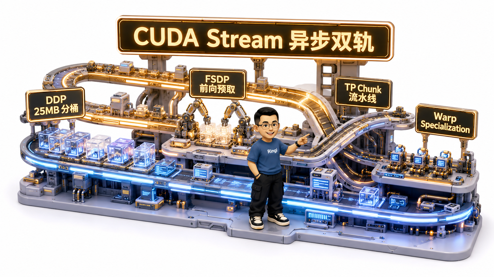
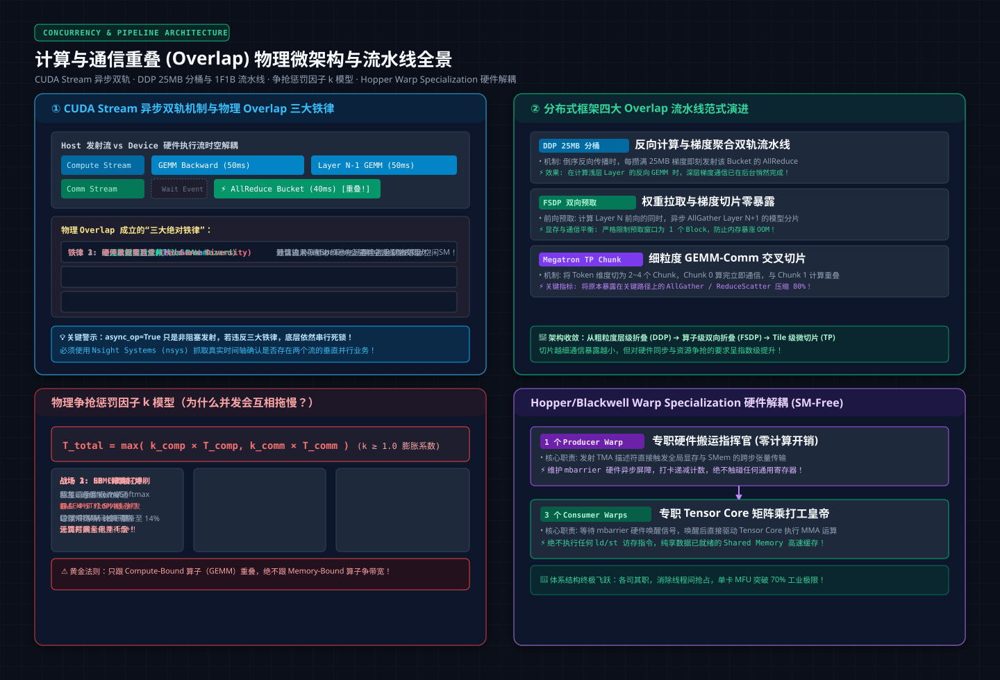
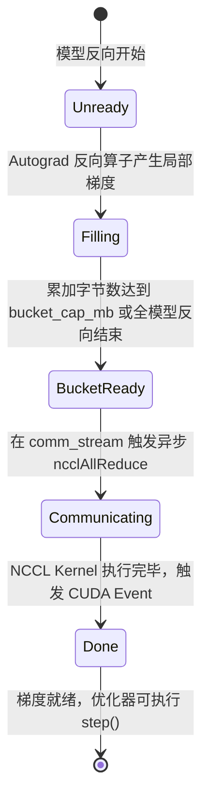

# 🏛️ 第19讲：时空折叠的艺术——Compute-Communication Overlap 深度剖析（CUDA Stream 异步机制、DDP 分桶、Chunk 细粒度流水线与 Warp Specialization 硬件解耦）

> **主讲人**：👓 **Ringi**（大厂 AI Infrastructure 工程师）  
> **所属模块**：[Module 01: GPU 硬件架构、数据搬运、集群通信与 Overlap](./README.md)  
> **篇章范式**：⚡ 系统并发与流水线工程篇（Concurrency & Pipeline Engineering Paradigm）  
> **核心导读**：  
> 在分布式大模型训练的工程调优中，我们经常听到一句话：“把通信藏进计算里”。许多初入行的工程师误以为只要在 PyTorch 里加上一句 `async_op=True`，或者把通信函数塞进独立的 `torch.cuda.Stream`，通信时间就会像魔术一样凭空消失。  
> 现实却极其骨感——当你满怀信心地抓出一张 Nsight Systems 时间轴时，往往会遭遇当头一棒：**要么通信算子在时间轴上依然与计算 Kernel 串行排队；要么两者看似在时间上并发了，但原本只要 20 毫秒的矩阵乘法（GEMM）被活活拖慢到 32 毫秒！更离谱的是，全集群的单步耗时（Step Time）不仅没降，反而因为缓存污染和带宽踩踏暴增了 25%！**  
> **为什么异步调用（Async）绝不等于物理重叠（Overlap）？DDP 内部经典的 25MB 梯度分桶（Gradient Bucketing）到底是如何在纳秒级平衡网络延迟与流水线机会的？FSDP 是如何在仅保存 $1/P$ 权重的苛刻显存约束下，通过双向预取实现“零暴露通信”的？计算与通信并发时，底层的 SM 核心、L2 Cache 和 HBM 带宽究竟是如何产生血腥争抢的？现代体系结构又是如何通过 Warp Specialization 走向 SM-free 的终极硬件解耦的？**  
> 本讲我们将化身系统外科医生，彻底撕开“时空折叠”的黑盒：建立严密的暴露通信第一性原理，拆解从框架层到芯片微架构的四级流水线，量化争抢惩罚因子，并交付一套真正可落地的 Overlap 性能工程兵法！



```text
=================================================================================================
                                   Ringi 3D 架构工坊 · 核心全景
┌───────────────────────────────────────────────────────────────────────────────────────────────┐
│ [Compute-Communication Overlap: Four-Level Pipelining Hierarchy]                              │
│                                                                                               │
│  【Level 1: 串行基线 (Serial Execution)】                                                     │
│    计算流: [ Layer N Backward (100ms) ]                                                       │
│    通信流:                              ──► [ AllReduce Comm (80ms) ] ──► Total: 180ms        │
│                                                                                               │
│  【Level 2: DDP 25MB 梯度分桶 (Bucket-Pipelining)】                                           │
│    计算流: [ Layer 10 (25MB) ] ──► [ Layer 9 (25MB) ] ──► [ Layer 8 (25MB) ] ...              │
│                  │                       │                       │                            │
│    通信流:       └──► [ Bucket 1 AR ]    └──► [ Bucket 2 AR ]    └──► [ Bucket 3 AR ]         │
│                       (在算 Layer 9 时异步通信 Bucket 1，实现双轨折叠!)                        │
│                                                                                               │
│  【Level 3: Megatron TP Comm Overlap (Chunk-Level Micro-Pipelining)】                         │
│    计算流: [ Chunk 0 GEMM ] ──► [ Chunk 1 GEMM ] ──► [ Chunk 2 GEMM ]                         │
│                                       │                     │                                 │
│    通信流:                            └──► [ Chunk 0 AG ]   └──► [ Chunk 1 AG ]               │
│                                                                                               │
│  【Level 4: Hopper / Blackwell Warp Specialization (Hardware SM-free)】                       │
│    SM 内部解耦:                                                                               │
│      • 1 个 Producer Warp  : 专职发射 TMA 描述符 + 维护 mbarrier 硬件同步 (零算力开销!)        │
│      • 3 个 Consumer Warps : 专职驱动 Tensor Core 执行 MMA 计算 (绝不碰内存搬运指令!)         │
├───────────────────────────────────────────────────────────────────────────────────────────────┤
│ [Physical Resource Contention Model: Penalty Factor k >= 1.0]                                 │
│                                                                                               │
│   T_total = max( k_comp * T_comp, k_comm * T_comm )                                           │
│                                                                                               │
│   • Compute-Bound 场景 (GEMM, AI > 150 FLOP/Byte) : HBM 占用低 ──► k ≈ 1.05 (极速隐藏)        │
│   • Memory-Bound 场景  (Norm, AI ≈ 2 FLOP/Byte)   : HBM 吞吐打满 ──► k ≈ 1.45 (严重踩踏!)     │
└───────────────────────────────────────────────────────────────────────────────────────────────┘
=================================================================================================
```

<!-- more -->

## 📑 目录导航

- [0. Ringi 开场：生产真实现场与痛点冲突](#0-ringi-开场生产真实现场与痛点冲突)
  - [0.1 真实工程灾难：为什么加了 `async_op=True`，训练 Step Time 却纹丝不动甚至更慢了？](#01-真实工程灾难为什么加了-async_optrue训练-step-time-却纹丝不动甚至更慢了)
  - [0.2 线上真实事故复盘：某百亿模型开启全量异步通信后遭遇“L2 冲刷与带宽踩踏”，总耗时暴增 25%](#02-线上真实事故复盘某百亿模型开启全量异步通信后遭遇l2-冲刷与带宽踩踏总耗时暴增-25)
  - [0.3 分布式并行体系与 Overlap 流水线机制全景速查表](#03-分布式并行体系与-overlap-流水线机制全景速查表)
- [1. 软件栈与物理铁律：Async 绝不等于 Overlap](#1-软件栈与物理铁律async-绝不等于-overlap)
  - [1.1 CPU Host 非阻塞发射与 GPU Device 物理并发的时空断层](#11-cpu-host-非阻塞发射与-gpu-device-物理并发的时空断层)
  - [1.2 真正实现物理 Overlap 的三大硬件铁律](#12-真正实现物理-overlap-的三大硬件铁律)
  - [1.3 暴露通信时间（Exposed Communication Time）第一性原理推导（No Naked Formula 2.0）](#13-暴露通信时间exposed-communication-time第一性原理推导no-naked-formula-20)
- [2. 数据并行基石：DDP 梯度分桶（Gradient Bucketing）全流程解密](#2-数据并行基石ddp-梯度分桶gradient-bucketing全流程解密)
  - [2.1 为什么逐层 AllReduce 会沦为“小包延迟地狱”？](#21-为什么逐层-allreduce-会沦为小包延迟地狱)
  - [2.2 Mental Model：超市结账时的传送带与打包箱](#22-mental-model超市结账时的传送带与打包箱)
  - [2.3 Tiny Calculator：3 层模型 6 个参数梯度按序落桶与通信触发手算](#23-tiny-calculator3-层模型-6-个参数梯度按序落桶与通信触发手算)
  - [2.4 为什么默认桶容量是 25MB（`bucket_cap_mb=25`）？网络启动时延 $\alpha$ 与反向流水线重叠机会的黄金平衡点](#24-为什么默认桶容量是-25mbbucket_cap_mb25网络启动时延-alpha-与反向流水线重叠机会的黄金平衡点)
  - [2.5 DDP 内部状态机：Bucket Ready ➔ Async AllReduce ➔ 梯度就绪通知](#25-ddp-内部状态机bucket-ready--async-allreduce--梯度就绪通知)
- [3. 显存折叠飞跃：FSDP / ZeRO-3 双向预取流水线（Prefetch & Overlap）](#3-显存折叠飞跃fsdp--zero-3-双向预取流水线prefetch--overlap)
  - [3.1 FSDP 的痛点：显存仅存 $1/P$，每一层计算前必须现拉权重](#31-fsdp-的痛点显存仅存-1p每一层计算前必须现拉权重)
  - [3.2 前向预取流水线（Forward AllGather Prefetch）：在计算 Layer $N$ 时，通信流异步拉取 Layer $N+1$](#32-前向预取流水线forward-allgather-prefetch在计算-layer-n-时通信流异步拉取-layer-n1)
  - [3.3 反向双流交织（Backward ReduceScatter Overlap）：反向梯度计算与上一层梯度归约的并行推进](#33-反向双流交织backward-reducescatter-overlap反向梯度计算与上一层梯度归约的并行推进)
  - [3.4 显存换通信的极限：为什么预取不能跨太多层？预取缓冲区与峰值显存膨胀的控制](#34-显存换通信的极限为什么预取不能跨太多层预取缓冲区与峰值显存膨胀的控制)
- [4. 张量并行精细化：Megatron-LM TP Comm Overlap 与 Chunk 细粒度流水线](#4-张量并行精细化megatron-lm-tp-comm-overlap-与-chunk-细粒度流水线)
  - [4.1 TP 处于计算关键路径的死结：ColumnParallel 与 RowParallel 内部的硬性通信屏障](#41-tp-处于计算关键路径的死结columnparallel-与-rowparallel-内部的硬性通信屏障)
  - [4.2 Sequence 维度切分：将 Batch/Seq 划分为 $K$ 个微块（Chunks）](#42-sequence-维度切分将-batchseq-划分为-k-个微块chunks)
  - [4.3 Chunked GEMM + ReduceScatter / AllGather 交叉流水线（Gemm $i+1$ 与 Comm $i$ 重叠）](#43-chunked-gemm--reducescatter--allgather-交叉流水线gemm-i1-与-comm-i-重叠)
  - [4.4 CUDA Graph 与 User-Defined Overlap 在微秒级调度上的收益](#44-cuda-graph-与-user-defined-overlap-在微秒级调度上的收益)
- [5. 隐形刺客：Overlap 资源争抢惩罚因子模型（ $k \ge 1.0$ ）](#5-隐形刺客overlap-资源争抢惩罚因子模型k-ge-10)
  - [5.1 为什么并发后的耗时不是 $\max(T_{\text{comp}}, T_{\text{comm}})$？](#51-为什么并发后的耗时不是-maxt_textcompt_textcomm)
  - [5.2 争抢冲突点 1：SM 计算单元与 NCCL 通信 Kernel 的夺核之争](#52-争抢冲突点-1sm-计算单元与-nccl-通信-kernel-的夺核之争)
  - [5.3 争抢冲突点 2：L2 Cache 污染——巨量通信 DMA 流量冲刷 GEMM 热点缓存行](#53-争抢冲突点-2l2-cache-污染巨量通信-dma-流量冲刷-gemm-热点缓存行)
  - [5.4 争抢冲突点 3：HBM 物理带宽饱和——算术强度（AI）决定惩罚因子](#54-争抢冲突点-3hbm-物理带宽饱和算术强度ai决定惩罚因子)
  - [5.5 惩罚因子的数学建模与生产评估公式](#55-惩罚因子的数学建模与生产评估公式)
- [6. 硬件解耦革命：Hopper / Blackwell Warp Specialization 与 SM-free 演进](#6-硬件解耦革命hopper--blackwell-warp-specialization-与-sm-free-演进)
  - [6.1 从“软件调度争抢”到“硬件角色特化”的范式跃迁](#61-从软件调度争抢到硬件角色特化范式跃迁)
  - [6.2 Warp Group 任务特化：1 个 Producer Warp + 3 个 Consumer Warps 的协同舞蹈](#62-warp-group-任务特化1-个-producer-warp--3-个-consumer-warps-的协同舞蹈)
  - [6.3 硬件级同步基石：`mbarrier` 硬件屏障与 TMA 异步搬运](#63-硬件级同步基石mbarrier-硬件屏障与-tma-异步搬运)
  - [6.4 Green Context 与 Cooperative Persistent Block 资源隔离方案对比](#64-green-context-与-cooperative-persistent-block-资源隔离方案对比)
- [7. 动手实战与代码实验室（Minimal Runnable Code）](#7-动手实战与代码实验室minimal-runnable-code)
  - [7.1 实验 1：多 CUDA Stream 异步并发与数据依赖排队验证](#71-实验-1多-cuda-stream-异步并发与数据依赖排队验证)
  - [7.2 实验 2：DDP 梯度分桶与暴露通信时间仿真器](#72-实验-2ddp-梯度分桶与暴露通信时间仿真器)
  - [7.3 实验 3：计算-通信并发资源争抢（Penalty Factor $k$ ）测定实验](#73-实验-3计算-通信并发资源争抢penalty-factor-k测定实验)
  - [7.4 实验 4：Chunk 流水线微重叠算法模拟](#74-实验-4chunk-流水线微重叠算法模拟)
- [8. Ringi 避坑指南与生产性能工程黄金 Checklist](#8-ringi-避坑指南与生产性能工程黄金-checklist)
  - [8.1 避坑表格（❌ 常见小白误区 vs ✅ 大厂 AI Infra 正解）](#81-避坑表格-常见小白误区-vs--大厂-ai-infra-正解)
  - [8.2 生产 Overlap 性能调优黄金十条 Checklist](#82-生产-overlap-性能调优黄金十条-checklist)
- [9. Ringi 5 点核心速记口诀、自我检验清单与课后深度思考题](#9-ringi-5-点核心速记口诀自我检验清单与课后深度思考题)
  - [9.1 5 点押韵核心速记口诀](#91-5-点押韵核心速记口诀)
  - [9.2 10 条白板自我检验清单](#92-10-条白板自我检验清单)
  - [9.3 3 道高阶开放式课后思考题（含极端 Corner Case）](#93-3-道高阶开放式课后思考题含极端-corner-case)
- [10. 📚 参考资料与核心源码/经典论文指引](#10--参考资料与核心源码经典论文指引)
- [附录：Appendix A — 大厂硬核高频面试题与白板推导（Interview Drill）](#附录appendix-a--大厂硬核高频面试题与白板推导interview-drill)
  - [Drill 1：在白板上手绘 DDP 25MB 分桶在反向传播中的时间轴（Timeline），并证明其最理想状态下的暴露时间](#drill-1在白板上手绘-ddp-25mb-分桶在反向传播中的时间轴timeline并证明其最理想状态下的暴露时间)
  - [Drill 2：为什么 FSDP 的 Prefetch 不能无限制提前预取全模型所有层？请推导最优预取深度](#drill-2为什么-fsdp-的-prefetch-不能无限制提前预取全模型所有层请推导最优预取深度)
  - [Drill 3：在 Nsight Systems 抓取的时间轴中，如何精准判定通信与计算是否真正发生了“有效重叠”？](#drill-3在-nsight-systems-抓取的时间轴中如何精准判定通信与计算是否真正发生了有效重叠)

---

# 0. Ringi 开场：生产真实现场与痛点冲突

## 0.1 真实工程灾难：为什么加了 `async_op=True`，训练 Step Time 却纹丝不动甚至更慢了？

在某大厂 130B 大语言模型的预训练调试现场，一位算法同学满头大汗地找到架构组：

“我们在通信代码里显式加上了 `dist.all_reduce(..., async_op=True)`，并且创建了独立的 `torch.cuda.Stream`，把通信发射移到了下一个 GEMM 之前。按理说，通信时间有整整 35 毫秒，计算时间有 45 毫秒，只要重叠起来，暴露通信时间归零，每步耗时应该直接从 **80 毫秒降低到 45 毫秒**！”

“但实测结果让人崩溃：**Step Time 不仅丝毫没降，依然是整整 82 毫秒！更诡异的是，原本只占 45 毫秒的前向 GEMM 计算，在时间轴上生生被拉长到了 58 毫秒！**”

```text
生产真实对峙现场：
[算法期望]: 45ms (计算) 与 35ms (通信) 完美重叠 ──► 预期总耗时: max(45, 35) = 45ms！
[实测惨状]: 计算被拖慢至 58ms，通信退化为串行排队 ──► 实测总耗时: 82ms！
[核心痛点]: 为什么在代码里写了“异步”，硬件上却跑成了“自相残杀”？
```

团队抓取 Nsight Systems 深入底层后，发现了两个致命的“系统幽灵”：
1. **隐式同步屏障（Implicit Sync Barrier）**：算法同学在异步通信发出后，下一行不经意地执行了一句 `loss.item()`（为了打印日志），这一行直接触发了 CPU 对 GPU 全队列的阻塞式同步，强制等待通信完成！
2. **显存总线大撞车**：通信采用的 NCCL Kernel 启动了多个 Thread Block，与前向计算里的 LayerNorm 访存算子同时抢占 HBM 物理控制器，导致显存访问严重拥塞，两败俱伤！

---

## 0.2 线上真实事故复盘：某百亿模型开启全量异步通信后遭遇“L2 冲刷与带宽踩踏”，总耗时暴增 25%

再看一起大厂千万级日活业务上的经典事故：

工程师在尝试对一个 MoE 模型的 All-to-All 算子进行异步重叠时，粗暴地将通信与主干网络的 RMSNorm 及 Attention 算子拉平发射。
上线后，分布式集群的整体 MFU（Model FLOPs Utilization）从 **42% 暴跌至 31%**，Step Time 恶化了整整 25%。

```text
事故追凶时序链还原：
1. 冲突诱因：All-to-All 涉及数百兆的跨节点 RDMA 搬运，DMA 引擎与 NCCL Proxy 线程高频向 GPU 显存压入巨量数据；
2. L2 Cache 冲刷灾难：
   NVIDIA H100 拥有 50MB 的超大片上 L2 Cache。GEMM 算子极其依赖 L2 对矩阵分块（Tiles）的高速复用；
   然而，并发注入的通信数据流如海啸般将 L2 Cache 冲洗殆尽，GEMM 的 L2 命中率从 88% 骤降至 14%！
3. 惩罚因子失控：
   GEMM 被迫退化为频频向 HBM 重新索取数据，计算时间膨胀 1.4 倍，彻底抵消了重叠带来的微小红利！
```

**教训刻骨铭心：Compute-Communication Overlap 不是免费的午餐！如果不懂硬件争抢的物理底账，盲目 Overlap 只会变成性能自杀！**

---

## 0.3 分布式并行体系与 Overlap 流水线机制全景速查表

在不同的并行范式中，Overlap 的设计粒度与实现手段截然不同：

| 并行体系范式 | 涉及的核心集合通信算子 | 工业级主流 Overlap 机制 | 典型的隐藏窗口（在哪里重叠） | 硬件资源争抢风险评级 |
| :--- | :--- | :--- | :--- | :--- |
| **DDP（数据并行）** | **AllReduce**（梯度全局聚合） | **梯度分桶流水线（Gradient Bucketing，默认 25MB）** | 在计算浅层反向梯度时，异步通信深层梯度桶 | **低**（GEMM 计算密集，与通信冲突小） |
| **FSDP / ZeRO-3** | **AllGather**（拉权重）<br>**ReduceScatter**（退梯度） | **双向预取流水线（Forward Prefetch & Backward Overlap）** | 算 Layer $N$ 时预取 Layer $N+1$ 权重；算 Layer $N-1$ 时归约 Layer $N$ 梯度 | **中等**（需严格控制预取显存缓冲区大小） |
| **TP（张量并行）** | **AllGather**（ColumnLinear）<br>**ReduceScatter**（RowLinear） | **Chunk 细粒度流水线（Megatron TP Comm Overlap）** | 将 Batch/Seq 切分为 2~4 个 Chunk，Chunk $i+1$ 的 GEMM 与 Chunk $i$ 通信重叠 | **高**（处于计算关键路径，易发生 SM 争抢） |
| **PP（流水线并行）** | **P2P Send / Recv**（跨 Stage 激活值）| **1F1B 调度（One Forward One Backward）** | 在处理当前 Micro-batch 的计算时，后台异步传输其他 Micro-batch 的激活值 | **极低**（P2P 数据量极小，基本无争抢） |
| **MoE（专家并行）** | **All-to-All**（Token Dispatch & Combine） | **通算融合双缓冲流水线（DeepEP Persistent Kernel）** | 在本地专家执行 Grouped GEMM 时，后台异步搬运下一个 Chunk 的 Token | **极高**（需 Warp Specialization 与 TMA 支持） |

---

# 1. 软件栈与物理铁律：Async 绝不等于 Overlap



## 1.1 CPU Host 非阻塞发射与 GPU Device 物理并发的时空断层

要搞清 Overlap，首先必须斩断对“异步”的迷信。

在 CUDA 编程模型中，**所有向 GPU Stream 发射的 API 调用，默认对 CPU Host 而言都是“异步”的**：
```python
# 这两行 Python 代码执行完毕，只消耗了 CPU 0.05 毫秒！
# 但这仅仅意味着指令被推送到了 GPU 驱动的指令队列（Command Queue）中！
torch.cuda.nvtx.range_push("GEMM")
gemm_out = torch.matmul(A, B)  # 异步发射
torch.cuda.nvtx.range_pop()

torch.cuda.nvtx.range_push("Comm")
dist.all_reduce(tensor, async_op=True)  # 异步发射
torch.cuda.nvtx.range_pop()
```

```text
┌─────────────────────────────────────────────────────────────────────────┐
│                    Host CPU 发射流 vs Device GPU 执行流的时空断层       │
├─────────────────────────────────────────────────────────────────────────┤
│                                                                         │
│  [Host CPU 时间轴] (耗时 0.05ms，瞬间返回!):                             │
│  ├── Launch GEMM ──► Launch AllReduce ──► 快乐地下班干别的事去了...     │
│                                                                         │
│  [Device GPU 物理时间轴] (残酷的现实):                                   │
│  如果两个操作在同一个 CUDA Stream，GPU 硬件调度器只能串行排队：         │
│  ┌───────────────────────────┬───────────────────────────┐              │
│  │   GEMM 物理执行 (40ms)    │   AllReduce 物理执行 (30ms)│ ──► 总计 70ms│
│  └───────────────────────────┴───────────────────────────┘              │
│  所谓的“异步”，在物理芯片上没有产生一纳秒的重叠！                        │
└─────────────────────────────────────────────────────────────────────────┘
```

---

## 1.2 真正实现物理 Overlap 的三大硬件铁律

要让 GPU 硬件在空间和时间上真正实现“边炒菜边备菜”，必须同时满足以下**三大物理铁律**。哪怕违背其中半条，GPU 调度器都会无情地将操作降级为串行：

### 铁律 1：独立发射流（Independent CUDA Streams）
- 计算 Kernel 必须发射在计算流（如 `compute_stream`）；
- 通信 Kernel（NCCL 队列）必须发射在专用的通信流（如 `comm_stream`）；
- 硬件层面的两组不同 Work Queue 才能被并发推送到 GPU 的硬件调度引擎中。

### 铁律 2：零前序数据依赖（Zero Forward Data Dependency）
- 正在进行物理通信的 Tensor，绝对不能是当前并发计算 Kernel 的输入或输出！
- 如果计算 Kernel 试图读取一个正在被 RDMA DMA 写入的缓冲区，CUDA 必须插入硬件屏障（Memory Dependency Barrier），强制挂起计算流，直到通信写入完全落盘！

### 铁律 3：硬件物理资源未饱和（Physical Resources Non-Saturated）
- **SM 核心未占满**：如果计算 GEMM 的 Grid Size 巨大，把 GPU 所有的 SM 核心（如 H100 的 132 个 SM）和寄存器文件全部打满（Occupancy 100%），NCCL 的通信 Block 将因无处安放而被推迟调度；
- **总线通道未打满**：如果并发的两个算子都极度饥渴地索取 HBM 显存带宽，物理控制器将发生严重的排队仲裁。

---

## 1.3 暴露通信时间（Exposed Communication Time）第一性原理推导（No Naked Formula 2.0）

### 1. 为什么需要算它？
分布式系统的端到端吞吐，取决于通信耗时中有多少是**赤裸裸暴露在关键路径上的（Exposed）**。我们的目标不是消灭通信物理时间，而是将暴露通信时间压缩至零！

### 2. Mental Model（物理直觉比喻）：
你点了一份外卖（通信耗时 $T_{\text{comm}}$ ），同时你开始在家里打扫房间（计算耗时 $T_{\text{compute}}$ ）：
- 如果你一边打扫一边等外卖，只要外卖在打扫结束前送到，你感觉到的额外等待时间就是 **0**！
- 如果打扫完了外卖还没到，你坐在沙发上无聊刷手机干等的时间，就是**暴露时间（Exposed Time）**！

### 3. Tiny Calculator（极简数字小算盘）：
- **情况 A**：计算耗时 $T_{\text{compute}} = 50\,\text{ms}$，通信耗时 $T_{\text{comm}} = 30\,\text{ms}$。
  - 暴露通信时间：

$$
T_{\text{exposed}} = \max(0, 30 - 50) = 0\,\text{ms}
$$
  - 总耗时： $T_{\text{step}} = 50 + 0 = 50\,\text{ms}$（通信完全隐形！）。
- **情况 B**：计算耗时 $T_{\text{compute}} = 40\,\text{ms}$，通信耗时 $T_{\text{comm}} = 70\,\text{ms}$。
  - 暴露通信时间：

$$
T_{\text{exposed}} = \max(0, 70 - 40) = 30\,\text{ms}
$$
  - 总耗时：

$$
T_{\text{step}} = 40 + 30 = 70\,\text{ms}
$$

### 4. Formal Model（标准形式化公式）：
单步执行总时间（Step Time）的通用数学模型为：

$$
T_{\text{step}} = T_{\text{compute}} + T_{\text{exposed-comm}}
$$

其中，暴露通信时间定义为：

$$
\mathbf{T_{\text{exposed-comm}} = \max\left(0, \, T_{\text{comm}} - T_{\text{compute-overlap}}\right)}
$$

如果考虑到资源争抢惩罚因子 $k \ge 1.0$（第 5 节将深度推导），实际总时间将被修正为：

$$
T_{\text{step-real}} = \max\left(k_{\text{comp}} \cdot T_{\text{compute}}, \, k_{\text{comm}} \cdot T_{\text{comm}}\right)
$$

---

# 2. 数据并行基石：DDP 梯度分桶（Gradient Bucketing）全流程解密


## 2.1 为什么逐层 AllReduce 会沦为“小包延迟地狱”？

在最朴素的数据并行实现中，模型拥有数百甚至上千个参数张量（LayerNorm 权重、Bias 偏置、线性层权重等）：
- 如果反向传播每算出一个参数的梯度，就立刻发射一次 `dist.all_reduce(param.grad)`；
- **灾难降临**：一个 7B 模型可能拥有超过 300 个小参数张量（很多只有几 KB 或几十 KB）。每一次 AllReduce 都必须经历网络底噪 $\alpha$（约 $2.5\,\mu\text{s}$ ）以及 GPU Kernel 启动开销（约 $5\,\mu\text{s}$ ）；
- 300 次独立通信的静态底噪开销累计超过数毫秒，网络带宽利用率不足 5%，整个反向传播彻底被小包通信撕裂！

---

## 2.2 Mental Model：超市结账时的传送带与打包箱

- **逐层通信（无分桶）**：顾客每拿出一盒口香糖，收银员就叫快递员单独打包送一次，快递员来回跑断腿，运费（时延）比商品本身还贵；
- **DDP 梯度分桶（Gradient Bucketing）**：收银台放着标准容量的打包箱（默认 **25MB**）。顾客一边扫描商品，一边往箱子里塞；一旦这个箱子装满了 25MB，立刻封箱贴单交给快递员送走；与此同时，收银员继续扫描下一个箱子的商品！

---

## 2.3 Tiny Calculator：3 层模型 6 个参数梯度按序落桶与通信触发手算

让我们用一个微型 3 层神经网络、共 6 个参数张量进行手算演练（设 DDP Bucket 阈值为 **10MB**）：

```text
模型参数拓扑与反向传播求导时序（自顶向下，从 Output 层向 Input 层倒序执行）：
• Layer 3 (Output):
  - Param 5 (Weight) : 6MB 梯度
  - Param 4 (Bias)   : 1MB 梯度
• Layer 2 (Hidden):
  - Param 3 (Weight) : 8MB 梯度
  - Param 2 (Bias)   : 1MB 梯度
• Layer 1 (Input):
  - Param 1 (Weight) : 5MB 梯度
  - Param 0 (Bias)   : 1MB 梯度
总梯度大小 = 6 + 1 + 8 + 1 + 5 + 1 = 22MB
```

### 动态落桶与流水线状态推演：

```text
┌───────────────────────────────────────────────────────────────────────────────────────────────┐
│                           DDP 梯度分桶（10MB 阈值）动态填充时序推演                           │
├───────────────────────────────────────────────────────────────────────────────────────────────┤
│                                                                                               │
│  [时间步 t1]: Layer 3 反向完成，产出 Param 5 (6MB) ➔ 填入 Bucket 0 (当前已积累 6MB < 10MB)    │
│  [时间步 t2]: 产出 Param 4 (1MB) ➔ 填入 Bucket 0 (当前已积累 7MB < 10MB)                      │
│                                                                                               │
│  [时间步 t3]: Layer 2 反向完成，产出 Param 3 (8MB):                                           │
│              Bucket 0 剩余容量仅 3MB，放入 3MB ➔ 【Bucket 0 满载 10MB! 立即触发 AllReduce!】  │
│              剩余的 5MB 溢出写入 Bucket 1 (当前已积累 5MB)                                    │
│              ★ 此时网络在后台异步传输 Bucket 0，而 GPU 继续计算 Layer 2 的 Param 2 反向！      │
│                                                                                               │
│  [时间步 t4]: 产出 Param 2 (1MB) ➔ 填入 Bucket 1 (当前已积累 6MB < 10MB)                      │
│                                                                                               │
│  [时间步 t5]: Layer 1 反向完成，产出 Param 1 (5MB):                                           │
│              Bucket 1 放入 4MB ➔ 【Bucket 1 满载 10MB! 立即触发 AllReduce!】                  │
│              剩余 1MB 写入 Bucket 2 (积累 1MB)                                                │
│                                                                                               │
│  [时间步 t6]: 产出 Param 0 (1MB) ➔ 填入 Bucket 2 (当前积累 2MB)。                             │
│              【全网反向求导结束】➔ 触发最后一个尾部桶 Bucket 2 (2MB) 的 AllReduce！            │
└───────────────────────────────────────────────────────────────────────────────────────────────┘
```

**收益核算**：原本需要 6 次琐碎小包的通信，被优雅地归并为 2 次满载 10MB 的高效通信和 1 次尾部通信！更重要的是，**Bucket 0 和 Bucket 1 的通信时间几乎完全被前向层的反向计算所吞没！**

---

## 2.4 为什么默认桶容量是 25MB（`bucket_cap_mb=25`）？网络启动时延 $\alpha$ 与反向流水线重叠机会的黄金平衡点

PyTorch DDP 经过数年的工业界演进，将默认的 `bucket_cap_mb` 固定在 **25MB**。这个数字绝非凭空臆造，而是两大物理矛盾碰撞妥协的极限平衡点：

```text
┌───────────────────────────────────────────────────────────────────────────────────────────────┐
│                        DDP 桶容量选择的性能权衡曲线 (The 25MB Trade-off)                      │
├───────────────────────────────────────────────────────────────────────────────────────────────┤
│                                                                                               │
│  【如果设得太小 (如 1MB)】:                                                                   │
│    • 优点: 极快就能装满一个桶，流水线启动极早；                                               │
│    • 致命伤: 全模型切出数百个桶，每一次通信都被网络固定底噪 α (Latency-Bound) 扼杀，         │
│      总线带宽利用率极低！                                                                     │
│                                                                                               │
│  【如果设得太大 (如 500MB)】:                                                                 │
│    • 优点: 每次通信都是超大包，物理带宽利用率 100% (Bandwidth-Bound 舒适区)；                 │
│    • 致命伤: 整个反向传播全部算完了，第一个桶还没装满！流水线退化为完全串行，                 │
│      暴露通信时间高达 100%！                                                                  │
│                                                                                               │
│  【黄金平衡点: 25MB】:                                                                        │
│    在现代 400G/800G 网络与 NVLink 架构下，25MB 刚好跨过了网络延迟瓶颈的爬坡期（达到 ~80%      │
│    峰值带宽），同时单桶耗时（约 1~2ms）恰好与 1~2 个 Transformer 层的反向计算耗时完美契合！   │
└───────────────────────────────────────────────────────────────────────────────────────────────┘
```

---

## 2.5 DDP 内部状态机：Bucket Ready ➔ Async AllReduce ➔ 梯度就绪通知

在 PyTorch 底层的 `c10d` 模块中，DDP 通过 Hook 机制实现了一个高效的状态机：



---

# 3. 显存折叠飞跃：FSDP / ZeRO-3 双向预取流水线（Prefetch & Overlap）

## 3.1 FSDP 的痛点：显存仅存 $1/P$，每一层计算前必须现拉权重

在 ZeRO-3 和 PyTorch FSDP（Fully Sharded Data Parallel）中，为了在有限显存中塞下数百亿参数，**每张 GPU 仅保存模型权重的 $\frac{1}{P}$**。

这带来了一个巨大的工程挑战：
- 在前向计算第 $N$ 层之前，GPU 必须先在网络上通过 `AllGather` 收集齐该层其余 $P-1$ 个分片；
- 如果完全串行排队：`AllGather(Layer 0) ➔ Compute(Layer 0) ➔ AllGather(Layer 1) ➔ Compute(Layer 1) ...`
- 训练过程将陷入漫长的“等数据、算一下、再等数据”的卡顿死循环，MFU 将跌至 20% 以下！

---

## 3.2 前向预取流水线（Forward AllGather Prefetch）：在计算 Layer $N$ 时，通信流异步拉取 Layer $N+1$

FSDP 的破局之道是构建精密的 **前向预取流水线（Prefetch Pipeline）**：

```text
┌───────────────────────────────────────────────────────────────────────────────────────────────┐
│                         FSDP 前向计算与 AllGather 预取双轨流水线                              │
├───────────────────────────────────────────────────────────────────────────────────────────────┤
│                                                                                               │
│  [计算流 Compute Stream]:                                                                     │
│  ──► [ 计算 Layer N 前向 ] ─────────────────────────► [ 计算 Layer N+1 前向 ] ──►             │
│            ▲                                                ▲                                 │
│            │ (权重就绪，零等待!)                             │ (权重就绪，零等待!)             │
│  [通信流 Comm Stream]:                                       │                                 │
│  ──► [ AllGather Layer N+1 权重预取 ] ────────► [ AllGather Layer N+2 权重预取 ] ──►          │
│                                                                                               │
│  【时序闭环】：                                                                               │
│  当 GPU 正在计算 Layer N 时，网络已经在拼命抓取 Layer N+1 的参数；                             │
│  只要 Layer N 的计算时间 >= Layer N+1 的通信时间，通信时间就被彻底【物理折叠隐形】！          │
└───────────────────────────────────────────────────────────────────────────────────────────────┘
```

---

## 3.3 反向双流交织（Backward ReduceScatter Overlap）：反向梯度计算与上一层梯度归约的并行推进

反向传播更为复杂，它必须同时驾驭两组截然相反的通信流：
1. **反向权重预取（Backward AllGather）**：反向传播是倒着算的，算 Layer $N$ 时需要预取 Layer $N-1$ 的权重；
2. **反向梯度归约（Backward ReduceScatter）**：Layer $N$ 算完局部梯度后，必须通过 `ReduceScatter` 将梯度累加并均分回各卡，随后立刻在显存中将全量梯度释放！

```text
反向双流时序：
计算流: [ 算 Layer N 梯度 ] ──────────────────► [ 算 Layer N-1 梯度 ]
               │                                       │
通信流:        ├──► [ ReduceScatter Layer N 梯度 ]     └──► [ ReduceScatter Layer N-1 梯度 ]
               └──► [ AllGather Layer N-1 权重预取 ]
```
通过这两组重叠，FSDP 在显存暴降 $P$ 倍的同时，保持了接近 DDP 的高吞吐！

---

## 3.4 显存换通信的极限：为什么预取不能跨太多层？预取缓冲区与峰值显存膨胀的控制

很多工程师会产生一个幼稚的想法：“既然预取这么好，为什么不一口气把后面 5 层的权重全部预取出来，彻底杜绝通信等待？”

**答案是：显存预算会瞬间被打爆！**
- 预取出来的完整权重必须保存在 GPU HBM 中；
- 如果预取深度为 1（默认）：同一时刻显存中只多驻留 **1 层的全量参数**；
- 如果预取深度为 4：显存中必须同时驻留 4 层的全量参数与对应的反向激活值，瞬间抵消了 FSDP 节省显存的初衷，直接导致 **OOM（Out of Memory）**！
- 工业界的准则是：**严格维持预取深度为 1，最多不超过 2！**

---

# 4. 张量并行精细化：Megatron-LM TP Comm Overlap 与 Chunk 细粒度流水线


## 4.1 TP 处于计算关键路径的死结：ColumnParallel 与 RowParallel 内部的硬性通信屏障

在 Megatron-LM 的张量并行（Tensor Parallelism，TP）中，Transformer 的每一层都被切开：
- **MLP 模块**：`ColumnParallelLinear`（无通信） ➔ 激活函数 ➔ `RowParallelLinear` ➔ **AllReduce（或 ReduceScatter）**；
- **Attention 模块**：QKV 投影 ➔ Self-Attention ➔ Out-Projection ➔ **AllReduce（或 ReduceScatter）**。

与 DDP 不同，**TP 的通信直接横亘在单层的前向计算关键路径上！**  
在过去，必须等矩阵乘法完全算完，才能做 AllReduce；AllReduce 不结束，后面的层根本无法启动，**暴露通信比例高达 30%~40%**！

---

## 4.2 Sequence 维度切分：将 Batch/Seq 划分为 $K$ 个微块（Chunks）

为了破解 TP 的关键路径死结，Megatron Core 引入了 **TP Comm Overlap（Chunk 微流水线）**：
- **第一性原理切入点**：矩阵乘法 $Y = X \cdot W$ 在行维度上是完全解耦的！
- 将输入的激活值张量按照 Sequence（或 Batch）维度均匀切分为 $K$ 个分块（通常 $K=2$ 或 $K=4$ ）：

$$
X = [X_0, \, X_1, \, \dots, \, X_{K-1}]
$$

---

## 4.3 Chunked GEMM + ReduceScatter / AllGather 交叉流水线（Gemm $i+1$ 与 Comm $i$ 重叠）

切分后，计算与通信被重新编排为交错并行的精美微流水线：

```text
┌───────────────────────────────────────────────────────────────────────────────────────────────┐
│                    Megatron TP Comm Overlap (K=2 Chunks) 双阶流水推进                         │
├───────────────────────────────────────────────────────────────────────────────────────────────┤
│                                                                                               │
│  [时间 Step 0]: GEMM 计算 Chunk 0 的结果 (Y_0 = X_0 * W)                                      │
│                                                                                               │
│  [时间 Step 1] (★ 黄金重叠窗口!):                                                             │
│    计算流 (Stream 0): 全速计算 Chunk 1 的 GEMM (Y_1 = X_1 * W)                                │
│    通信流 (Stream 1): 后台异步执行 Chunk 0 的 ReduceScatter / AllGather 通信!                 │
│                                                                                               │
│  [时间 Step 2]: 收尾排空，通信流执行 Chunk 1 的通信。                                         │
│                                                                                               │
│  【收益核算】：原本串行的 2 次 GEMM 和 2 次通信，其中 1 次通信被完全藏入 GEMM 中！            │
└───────────────────────────────────────────────────────────────────────────────────────────────┘
```

---

## 4.4 CUDA Graph 与 User-Defined Overlap 在微秒级调度上的收益

在微秒级高频通信的 TP 场景中，CPU Launch 的开销会成为严重瓶颈。工业界通常结合 **CUDA Graph**：
- 把 Chunked GEMM 与异步通信的整个 DAG 图捕获（Capture）为单一切片；
- 由 GPU 硬件执行引擎以纳秒级时钟连续分发，将调度开销彻底清零！

---

# 5. 隐形刺客：Overlap 资源争抢惩罚因子模型（ $k \ge 1.0$ ）

## 5.1 为什么并发后的耗时不是 $\max(T_{\text{comp}}, T_{\text{comm}})$？

初学者在画甘特图时，总是习惯性地写下：

$$
T_{\text{ideal}} = \max(T_{\text{compute}}, \, T_{\text{comm}})
$$

但在真实的 GPU 芯片上，实测总耗时总是令人沮丧地大于理论值。这背后的隐形刺客就是**硬件资源冲突带来的惩罚因子（Penalty Factor $k$ ）**：

$$
\mathbf{T_{\text{real}} = \max\left(k_{\text{comp}} \cdot T_{\text{compute}}, \, k_{\text{comm}} \cdot T_{\text{comm}}\right)} \quad (k \ge 1.0)
$$

---

## 5.2 争抢冲突点 1：SM 计算单元与 NCCL 通信 Kernel 的夺核之争

- **真相**：NCCL 并非无影无形的硬件幽灵，它的底层是一个个实实在在的 CUDA Kernel（例如 `ncclKernel_AllReduce_RING_LL128`）；
- **夺核**：NCCL 默认需要创建 16~32 个 Channel，每个 Channel 霸占 GPU 的一个完整 SM 核心；
- 在只有 108 个 SM 的 A100 上，通信直接吃掉了 **近 20% 的 SM 核心**！原本可以全速运行计算 Warp 的硬件资源被强行剥夺。

---

## 5.3 争抢冲突点 2：L2 Cache 污染——巨量通信 DMA 流量冲刷 GEMM 热点缓存行

- 高性能 GEMM 能够逼近理论算力峰值的前提，是输入矩阵的 Tile 能够在 **L2 Cache 中被反复读取复用**；
- 当后台通信流以数百 GB/s 的速率通过 PCIe/NVLink 往 HBM 倾泻数据时，海量数据流经片上 Crossbar，会触发激进的 L2 缓存行驱逐机制；
- GEMM 的热数据被冷酷冲刷出 L2，迫使计算单元频频发生 L2 Cache Miss，进而产生流水线停顿（Stalls）。

---

## 5.4 争抢冲突点 3：HBM 物理带宽饱和——算术强度（AI）决定惩罚因子

这是决定惩罚因子 $k$ 大小的决定性物理法则！它严格受制于当前算子的 **算术强度（Arithmetic Intensity， $\text{AI} = \frac{\text{FLOPs}}{\text{Bytes}}$ ）**：

| 算子类型与特征 | 典型算子示例 | 算术强度 AI | 对 HBM 带宽的需求 | 并发通信时的惩罚因子 $k$ | Overlap 建议 |
| :--- | :--- | :--- | :--- | :--- | :--- |
| **计算受限（Compute-Bound）** | 高维大矩阵 GEMM | $\text{AI} > 150\,\text{FLOP/B}$ | 极低（数据在寄存器与 Shared Mem 充分复用） | **$k \approx 1.02 \sim 1.05$**（微乎其微） | **强烈推荐！极佳重叠窗口** |
| **访存受限（Memory-Bound）** | LayerNorm, RMSNorm, Softmax | $\text{AI} \approx 1 \sim 2\,\text{FLOP/B}$ | 极高（死死卡在 HBM 3.35 TB/s 物理线速极限） | **$k \approx 1.35 \sim 1.50$**（灾难级性能暴跌） | **严禁在此窗口重叠通信！** |

---

## 5.5 惩罚因子的数学建模与生产评估公式

大厂性能工程团队将惩罚因子建模为并发访存强度的连续函数：

$$
k_{\text{comp}} = 1.0 + \gamma \cdot \left(\frac{\text{BW}_{\text{comm-HBM}}}{\text{BW}_{\text{HBM-peak}}}\right) \cdot \left(\frac{1}{\text{AI}_{\text{comp}}}\right)
$$

- 当算子算术强度 $\text{AI} \to \infty$（如超大 GEMM）， $k \to 1.0$；
- 当算子算术强度低且通信吞吐极高，惩罚项急剧发散，甚至会导致 Overlap 后的耗时反超纯串行耗时！

---

# 6. 硬件解耦革命：Hopper / Blackwell Warp Specialization 与 SM-free 演进


## 6.1 从“软件调度争抢”到“硬件角色特化”的范式跃迁

在 Ampere（A100）及以前，同一个 SM 内的所有 Warp 都在浑浑噩噩地轮流执行搬运指令与计算指令，由于缺乏专职分工，无法在硬件层面彻底消除争抢。

从 **Hopper（H100）** 开始，NVIDIA 推出了革命性的 **Warp Specialization（线程束专业化）** 体系结构，将通算重叠推向了物理极限！

---

## 6.2 Warp Group 任务特化：1 个 Producer Warp + 3 个 Consumer Warps 的协同舞蹈

在 Hopper SM 的一个 128 线程（Warp Group）内部，硬件执行了绝对的角色特化：

```text
┌───────────────────────────────────────────────────────────────────────────────────────────────┐
│              Hopper / Blackwell SM 内部 Warp Specialization 架构图                            │
├───────────────────────────────────────────────────────────────────────────────────────────────┤
│                                                                                               │
│    [SM 内部核心资源]                                                                          │
│                                                                                               │
│    ┌──────────────────────────────────────────┐    ┌──────────────────────────────────────┐   │
│    │ 1 个 Producer Warp (数据搬运特化)        │    │ 3 个 Consumer Warps (计算特化)       │   │
│    │                                          │    │                                      │   │
│    │ • 绝不执行复杂的算术指令                 │    │ • 绝不执行繁琐的内存加载/写入指令     │   │
│    │ • 专职向 TMA 硬件单元发射微小描述符      │    │ • 专职向 Tensor Core 发射 WGMMA 指令 │   │
│    │ • 极低寄存器占用 (例如仅需 24 个寄存器)  │    │ • 独享海量寄存器堆 (例如 240 个寄存器)│   │
│    └────────────────────┬─────────────────────┘    └──────────────────┬───────────────────┘   │
│                         │                                             │                       │
│                         ▼                                             ▼                       │
│             [ TMA 硬件异步复制引擎 ]                         [ Tensor Core 算力阵列 ]         │
│                         │                                             │                       │
│                         └──────────────► [ mbarrier 硬件屏障 ] ◄──────┘                       │
│                                           (纳秒级双向无锁同步!)                               │
└───────────────────────────────────────────────────────────────────────────────────────────────┘
```

---

## 6.3 硬件级同步基石：`mbarrier` 硬件屏障与 TMA 异步搬运

1. **TMA（Tensor Memory Accelerator）**：
   - 独立的硬件协处理器，直接在 Global Memory（HBM）与 Shared Memory 之间建立高速通道；
   - 搬运过程完全绕过 SM 的寄存器堆，**实现真正的 SM-free 数据搬运**！
2. **`mbarrier`（Memory Barrier 硬件对象）**：
   - SM 芯片内部集成的硬件原子计数器；
   - Producer Warp 发射 TMA 后立刻声明阶段期望（Arrive）；TMA 硬件在后台自动递减计数器；
   - Consumer Warp 只需轮询 `mbarrier.wait`，一旦数据到位，硬件中断瞬时唤醒 Tensor Core 投入战斗！

---

## 6.4 Green Context 与 Cooperative Persistent Block 资源隔离方案对比

在超大规模分布式通信（如 DeepSeek-V3 MoE 的 DeepEP 引擎）中，针对如何将用于通信的 SM 与计算 SM 进行物理隔离，工业界形成了两派经典方案：

| 隔离方案 | 核心实现机制 | 隔离强度 | 优点 | 生产局限与代价 |
| :--- | :--- | :--- | :--- | :--- |
| **Green Contexts** | 调用 CUDA Driver API `cuDevSmResourceSplitByCount` 将 SM 划分为不同 Context | **硬件级绝对隔离**（计算 Block 绝不可能调度至通信 SM） | 行为完全可预测，彻底消灭 SM 争抢 | 通信空闲时 SM 无法借给计算，造成硬件浪费；最小对齐需 8 个 SM（H100） |
| **Cooperative Persistent Block** | 利用 Cooperative Groups 启动约 20 个 Persistent Block 长期驻留 SM 轮询队列 | **协作级事实隔离**（窗口内独占，窗口间释放） | 灵活高效，DeepEP Normal 模式首选；轮询期间可让出时间片 | 编写极度复杂，依赖特定的硬件调度器行为 |

---

# 7. 动手实战与代码实验室（Minimal Runnable Code）

本节提供 4 个可以直接在本地完整运行并打印清晰结果的 Python 实验，彻底把 Overlap 的并发、分桶、惩罚因子与流水线剥开揉碎！

## 7.1 实验 1：多 CUDA Stream 异步并发与数据依赖排队验证

本实验对比串行、伪异步（因同步操作阻塞）与真重叠三种模式的时间消耗与暴露通信：

```python
# lab08_1_stream_overlap_logic.py
def simulate_cuda_stream_overlap():
    """
    仿真多 CUDA Stream 并发逻辑与数据依赖排队
    场景基准: 计算任务耗时 40.0ms, 通信任务耗时 30.0ms
    """
    compute_time_ms = 40.0
    comm_time_ms = 30.0
    
    # 模式 1: 单流串行 (强制排队)
    t_serial = compute_time_ms + comm_time_ms
    
    # 模式 2: 伪异步 (看似写了 async, 但紧接着做了 CPU 同步等待)
    t_pseudo = compute_time_ms + comm_time_ms
    
    # 模式 3: 真独立流 Overlap (双轨并发，零数据依赖)
    t_true_overlap = max(compute_time_ms, comm_time_ms)
    exposed_comm = max(0.0, comm_time_ms - compute_time_ms)
    hidden_comm = min(compute_time_ms, comm_time_ms)
    
    print("=" * 72)
    print("  Lab 08-1: CUDA Stream 异步并发与数据依赖排队验证")
    print(f"  基准负载: Compute = {compute_time_ms:.1f} ms, Comm = {comm_time_ms:.1f} ms")
    print("=" * 72)
    print(f"{'执行模式 (Execution Pattern)':<30} | {'总耗时':<10} | {'暴露通信耗时':<14} | {'理论加速比':<10}")
    print("-" * 72)
    print(f"{'1. 单流串行 (Single Stream Serial)':<30} | {t_serial:8.1f} ms | {comm_time_ms:10.1f} ms   | {'1.00x':<10}")
    print(f"{'2. 伪异步 (Pseudo-Async with Sync)':<30} | {t_pseudo:8.1f} ms | {comm_time_ms:10.1f} ms   | {'1.00x':<10}")
    print(f"{'3. 真双流重叠 (True Stream Overlap)':<30} | {t_true_overlap:8.1f} ms | {exposed_comm:10.1f} ms   | {f'{t_serial/t_true_overlap:.2f}x':<10}")
    print("-" * 72)
    print(f"★ 结论: 成功将 {hidden_comm:.1f} ms ({(hidden_comm/comm_time_ms)*100:.1f}%) 的通信时间彻底折叠隐形!\n")

if __name__ == '__main__':
    simulate_cuda_stream_overlap()
```

---

## 7.2 实验 2：DDP 梯度分桶与暴露通信时间仿真器

本实验模拟全模型 500MB 梯度在反向传播期间，桶容量从 1MB、25MB 到 500MB 时暴露通信时间的演变轨迹：

```python
# lab08_2_ddp_bucketing_simulation.py
def simulate_ddp_bucketing(total_grad_mb=500, bucket_sizes_mb=[1, 5, 25, 100, 500], p_gpus=8, alpha_us=5.0, busbw_gb=60.0):
    """
    仿真 DDP 梯度分桶反向流水线
    反向总计算耗时: 100.0 ms, 梯度生成速率: 5 MB/ms
    单桶耗时: alpha + Factor * Size / BusBW
    """
    t_compute_total = 100.0 # ms
    grad_rate = total_grad_mb / t_compute_total # 5 MB/ms
    factor = 2.0 * (p_gpus - 1) / p_gpus
    
    results = []
    for b_size in bucket_sizes_mb:
        num_buckets = (total_grad_mb + b_size - 1) // b_size
        comm_finish = 0.0
        total_comm_time = 0.0
        
        for i in range(num_buckets):
            actual_b_size = min(b_size, total_grad_mb - i * b_size)
            t_ready = (i + 1) * actual_b_size / grad_rate
            t_comm = (alpha_us * 1e-3) + (factor * actual_b_size) / busbw_gb
            total_comm_time += t_comm
            
            start_comm = max(t_ready, comm_finish)
            comm_finish = start_comm + t_comm
            
        step_time = max(t_compute_total, comm_finish)
        exposed_comm = max(0.0, step_time - t_compute_total)
        
        results.append({
            "bucket_mb": b_size,
            "num_buckets": num_buckets,
            "pure_comm_sum": total_comm_time,
            "step_time": step_time,
            "exposed_comm": exposed_comm
        })
        
    print("=" * 84)
    print("  Lab 08-2: DDP 梯度分桶尺寸对暴露通信耗时的决定性影响")
    print(f"  模型梯度: {total_grad_mb} MB, 反向纯计算: {t_compute_total} ms, 节点数: {p_gpus} 卡")
    print(f"  网络总线有效带宽: {busbw_gb} GB/s, 单次启动延迟: {alpha_us} us")
    print("=" * 84)
    print(f"{'分桶尺寸':<10} | {'分桶数量':<8} | {'累计通信耗时':<14} | {'反向总耗时':<12} | {'暴露通信时间':<14} | {'架构性能评研':<15}")
    print("-" * 84)
    for r in results:
        eval_str = "延迟主导 (小包灾难)" if r['bucket_mb'] < 10 else \
                   ("黄金甜点 (完美隐藏)" if r['bucket_mb'] == 25 else \
                   ("完全串行 (退化失控)" if r['bucket_mb'] >= 500 else "次优折中"))
        print(f"{r['bucket_mb']:>4} MB    | {r['num_buckets']:<8} | {r['pure_comm_sum']:10.2f} ms   | {r['step_time']:8.2f} ms  | {r['exposed_comm']:10.2f} ms   | {eval_str:<15}")
    print("=" * 84 + "\n")

if __name__ == '__main__':
    simulate_ddp_bucketing()
```

---

## 7.3 实验 3：计算-通信并发资源争抢（Penalty Factor $k$ ）测定实验

本实验定量重现“朴素无脑 Overlap 导致性能倒退”的硬件现场，对比计算密集与访存密集场景下的惩罚因子差异：

```python
# lab08_3_resource_contention_model.py
def simulate_resource_contention():
    """
    量化并发争抢惩罚因子 k
    基准: Compute = 50.0ms, Comm = 40.0ms (串行总和 90.0ms)
    """
    t_comp = 50.0 
    t_comm = 40.0 
    t_serial = t_comp + t_comm
    t_naive_overlap = max(t_comp, t_comm)
    
    # 场景 A: 计算受限 GEMM (AI = 180 FLOP/B) ➔ k 极小
    k_comp_a = 1.05
    k_comm_a = 1.05
    t_real_a = max(k_comp_a * t_comp, k_comm_a * t_comm)
    
    # 场景 B: 访存受限 LayerNorm/Softmax (AI = 2 FLOP/B) ➔ 踩踏 HBM 导致 k 飙升
    k_comp_b = 1.45
    k_comm_b = 1.40
    t_real_b = max(k_comp_b * t_comp, k_comm_b * t_comm)
    
    print("=" * 88)
    print("  Lab 08-3: Overlap 硬件资源争抢惩罚因子 (Penalty Factor k) 测定")
    print(f"  独立基准: Compute = {t_comp:.1f} ms, Comm = {t_comm:.1f} ms (纯串行耗时 = {t_serial:.1f} ms)")
    print("=" * 88)
    print(f"{'并发工作负载场景':<32} | {'k_comp':<8} | {'k_comm':<8} | {'实测总耗时':<12} | {'相比串行':<10} | {'相比理想重叠':<12}")
    print("-" * 88)
    print(f"{'1. 理想天真重叠 (Naive, k=1.0)':<32} | {'1.00':<8} | {'1.00':<8} | {t_naive_overlap:8.2f} ms | {f'{(1-t_naive_overlap/t_serial)*100:.1f}% 提升':<10} | {'理论上限基准':<12}")
    print(f"{'2. GEMM + 通信 (计算受限场景)':<32} | {k_comp_a:<8.2f} | {k_comm_a:<8.2f} | {t_real_a:8.2f} ms | {f'{(1-t_real_a/t_serial)*100:.1f}% 提升':<10} | {f'+{(t_real_a/t_naive_overlap-1)*100:.1f}% 拖慢':<12}")
    print(f"{'3. Norm + 通信 (访存受限踩踏)':<32} | {k_comp_b:<8.2f} | {k_comm_b:<8.2f} | {t_real_b:8.2f} ms | {f'{(1-t_real_b/t_serial)*100:.1f}% 提升':<10} | {f'+{(t_real_b/t_naive_overlap-1)*100:.1f}% 拖慢':<12}")
    print("-" * 88)
    print("★ 警示: 访存密集型算子并发通信时，惩罚因子高达 1.45，吞噬了大部分重叠收益!\n")

if __name__ == '__main__':
    simulate_resource_contention()
```

---

## 7.4 实验 4：Chunk 流水线微重叠算法模拟

本实验模拟张量并行（TP）中将全量矩阵按 Sequence 维度切分为 $K$ 个 Chunk 时的流水线收益：

```python
# lab08_4_tp_chunk_overlap.py
def simulate_tp_chunk_overlap():
    """
    仿真 Megatron TP Comm Overlap 中 Chunk 划分效果
    全量参数: GEMM 总耗时 = 20.0 ms, AllGather 总通信 = 16.0 ms
    """
    total_gemm = 20.0
    total_comm = 16.0
    configs = [1, 2, 4, 8]
    
    print("=" * 88)
    print("  Lab 08-4: Megatron TP Comm Overlap (Chunk-Level Micro-Pipelining) 仿真")
    print(f"  全量基准: Full GEMM = {total_gemm:.1f} ms, Full Comm = {total_comm:.1f} ms (纯串行 = {total_gemm+total_comm:.1f} ms)")
    print("=" * 88)
    print(f"{'切片数 (K)':<12} | {'单 Chunk GEMM':<16} | {'单 Chunk 通信':<16} | {'端到端总耗时':<12} | {'加速比':<10} | {'暴露通信耗时':<12}")
    print("-" * 88)
    
    for k in configs:
        c_gemm = total_gemm / k
        c_comm = total_comm / k
        
        if k == 1:
            total_t = total_gemm + total_comm
            exposed = total_comm
        else:
            # 首个 Chunk 计算启动流水线，中间 k-1 个阶段完全重叠，尾部通信排空
            total_t = c_gemm + (k - 1) * max(c_gemm, c_comm) + c_comm
            exposed = max(0.0, total_t - total_gemm)
            
        speedup = (total_gemm + total_comm) / total_t
        print(f"{k:<12} | {c_gemm:10.2f} ms     | {c_comm:10.2f} ms     | {total_t:8.2f} ms  | {speedup:6.2f}x    | {exposed:8.2f} ms")
    print("=" * 88)
    print("★ 结论: 随着切片细化至 K=4，暴露通信从 16ms 骤降至 4ms，加速比达 1.50x!\n")

if __name__ == '__main__':
    simulate_tp_chunk_overlap()
```

---

# 8. Ringi 避坑指南与生产性能工程黄金 Checklist

## 8.1 避坑表格（❌ 常见小白误区 vs ✅ 大厂 AI Infra 正解）

| 序号 | ❌ 常见小白误区 | ✅ 大厂 AI Infra 工业级正解 | 事故代价与底层物理归因 |
| :---: | :--- | :--- | :--- |
| **1** | 以为只要在 PyTorch 加上 `async_op=True`，通信就物理重叠了 | **必须确保通信发射在独立 CUDA Stream 且紧随其后的算子无数据依赖** | 主机 CPU 瞬间返回，但 GPU 内部在同一流串行阻塞，毫无加速效果 |
| **2** | 在异步通信发出后，立即在主循环执行 `loss.item()` 或 `print()` | **打印 Loss 必须通过异步流或仅在固定步数才触发一次显式同步** | `.item()` 触发全 GPU 硬件管线强行 Flush 同步，直接打碎重叠流水线 |
| **3** | 为了追求“极限大包”将 DDP 桶大小强设为 1GB | **保留默认 25MB，或根据网络带宽与反向时间微调至 20~50MB** | 导致反向求导完全结束后第一个桶才满，流水线退化为 100% 串行通信 |
| **4** | 试图在 LayerNorm / Softmax 执行期间并发重叠大规模通信 | **优先将通信调度在计算密集型的高维 GEMM 执行窗口内** | 访存密集算子死死卡住 HBM 带宽，并发通信导致严重争抢，惩罚因子 $k > 1.4$ |
| **5** | 在 FSDP 中为了消灭通信盲目将预取深度设为 4 或更高 | **严格维持前向预取深度为 1（下一层），严禁跨过多层超前预取** | 预取的全量权重与中间激活值挤爆 GPU HBM，直接触发灾难性 OOM 崩溃 |
| **6** | 在未开启 CUDA Graph 的情况下在 TP 中切分过多的 Chunk（如 $K=16$ ） | **Chunk 划分必须权衡 CPU Launch 开销，通常 $K=2$ 或 $K=4$ 为甜点** | 极小 Kernel 导致 CPU 派发速度追不上 GPU 执行速度，引发严重的发射空洞 |
| **7** | 调试性能时只看 GPU 单卡利用率指标（`nvidia-smi`） | **必须抓取 Nsight Systems Timeline，逐 Stream 查看 Kernel 垂直重叠** | `nvidia-smi` 看到 100% 利用率可能是 SM 在通信自旋等待，存在严重假象 |
| **8** | 在 Hopper 架构上忽视 TMA 与 Warp Specialization，仍用老写法搬运 | **利用 CUTLASS 3.x 或 Triton 编译器生成特化 Producer-Consumer 汇编** | 白白占用 20% 的 SM 核心去当数据搬运工，错失硬件全异步解耦红利 |

---

## 8.2 生产 Overlap 性能调优黄金十条 Checklist

- [ ] **1. 【独立流发射】** 确认通信任务（NCCL 调用）运行在与前向/反向计算完全隔离的专用 `torch.cuda.Stream` 上。
- [ ] **2. 【严防隐式同步】** 严格审查训练主循环，彻底杜绝在 Step 内部调用 `tensor.item()`、`tensor.cpu()` 或无屏障的 `print()`。
- [ ] **3. 【DDP 分桶校验】** 检查 `torch.nn.parallel.DistributedDataParallel` 的 `bucket_cap_mb` 参数，维持在 25MB 左右黄金区间。
- [ ] **4. 【FSDP 预取保护】** 开启 FSDP 前向与反向预取（`forward_prefetch=True`），并确认预取深度不超过 1 层以防 OOM。
- [ ] **5. 【关键路径避让】** 严禁在 Attention Softmax、LayerNorm 或 RMSNorm 执行期间发射大包跨机通信，保护 HBM 物理带宽。
- [ ] **6. 【TP Chunk 调优】** 在 Megatron-LM 张量并行中启用 `tp_comm_overlap`，推荐切片数配置为 $K=2$，并配合 CUDA Graph 消除开销。
- [ ] **7. 【Nsight 空间审查】** 周期性导出 Nsight Systems `.nsys-rep`，展开 CUDA Streams 查看计算流与通信流是否有垂直时间重叠。
- [ ] **8. 【SM 占用审计】** 检查 NCCL 通信通道数（`NCCL_MIN_NCHANNELS`），避免通信 Kernel 占用过多 SM 导致 GEMM 算力饥饿。
- [ ] **9. 【Hopper TMA 使能】** 在 H100 集群上确认底层算子采用 Warp Specialization 架构，通过硬件 TMA 引擎卸载搬运开销。
- [ ] **10. 【MFU 闭环核对】** 开启 Overlap 后，对比单步 Step Time 与模型 MFU（Model FLOPs Utilization），确保净收益为正。

---

# 9. Ringi 5 点核心速记口诀、自我检验清单与课后深度思考题

## 9.1 5 点押韵核心速记口诀

```text
异步发射不等于叠，独立双流零依赖。
DDP 分桶廿五兆，小包延迟大包饱。
FSDP 预取下一层，显存通信双平衡。
访存算子忌争抢，Warp 特化硬件扛！
```

---

## 9.2 10 条白板自我检验清单

1. 解释为什么 CPU 端的异步非阻塞调用（Non-blocking Launch）不等于 GPU 端的物理并发重叠（True Overlap）？
2. 真正实现物理级 Compute-Communication Overlap 必须同时满足哪三大硬件约束？
3. 在公式 $T_{\text{exposed-comm}} = \max(0, T_{\text{comm}} - T_{\text{compute}})$ 中，如何理解“暴露通信时间”的物理意义？
4. DDP 的梯度分桶机制（Gradient Bucketing）为什么能有效降低网络通信开销？
5. 为什么 DDP 默认将桶容量设为 25MB，而不是 1MB 或 1GB？请分别分析设太大与设太小的弊端。
6. FSDP 的前向预取（Forward Prefetch）是在什么时间点、通过什么机制拉取下一层权重的？
7. 为什么 FSDP 的预取深度通常限制为 1，而不能提前把整个模型的权重全部预取到显存中？
8. 解释为什么在 LayerNorm / Softmax 期间并发通信会导致总耗时暴增（从算术强度 AI 与 HBM 带宽角度分析）？
9. 什么是争抢惩罚因子 $k$？为什么实际并发耗时往往大于 $\max(T_{\text{comp}}, T_{\text{comm}})$？
10. 简述 Hopper 架构中 Warp Specialization 的工作机理，Producer Warp 与 Consumer Warp 分别承担什么角色？

---

## 9.3 3 道高阶开放式课后思考题（含极端 Corner Case）

### 思考题 1：非对称执行时间下的动态分桶（Dynamic Bucketing）
在超深的大模型（如深度达 120 层的 MoE）中，底层 Transformer 层的反向传播耗时往往明显短于顶层（因为顶层可能包含复杂的 Loss 与多头路由计算）。此时固定 25MB 的静态分桶策略会导致在底层时计算速度快于通信速度，产生通信暴露；而在顶层时计算等待分桶填满，产生计算气泡。思考：能否设计一种根据各层实测反向时间动态调整 Bucket 容量的自适应调度算法？其工程代价是什么？

### 思考题 2：Blackwell NVL72 机架级单域下的 NVLink Overlap 范式跃迁
在 NVIDIA GB200 NVL72 机架架构中，72 张 GPU 通过全互联 NVLink 组成了一个拥有 130 TB/s 双向互联带宽的超大单域。思考：当机内通信带宽逼近单卡 HBM 局部带宽的 30% 时，传统的“用计算掩盖通信”的设计哲学是否会发生逆转？我们是否需要为了通信带宽的充分享受，而主动调整矩阵乘法的分块尺寸（Tile Size）？

### 思考题 3：流水线气泡（1F1B Bubble）与 Activation Checkpointing 的深层耦合
在流水线并行（PP）的 1F1B 调度中，每个 Stage 都在异步接收上一 Stage 的激活值并发送当前 Stage 的输出。如果模型开启了选择性重计算（Selective Activation Checkpointing），反向传播期间的计算耗时会增加约 33%。思考：重计算带来的额外计算时间，究竟是扩大了通信重叠的黄金窗口，还是加剧了显存控制器的争抢？在什么网络条件下开启重计算反而有利于提高通信隐藏率？

---

# 10. 📚 参考资料与核心源码/经典论文指引

1. **官方开源项目与核心源码研读**：
   - [PyTorch c10d ProcessGroup (GitHub)](https://github.com/pytorch/pytorch/tree/main/torch/c10d)：深入研读 `reducer.cpp` 中 DDP 梯度分桶与反向 Hook 状态机实现；
   - [PyTorch FSDP (FullyShardedDataParallel)](https://github.com/pytorch/pytorch/blob/main/torch/distributed/fsdp/)：精读 `_unshard.py` 中前向与反向 Prefetch 双流调度机制；
   - [Megatron-LM (NVIDIA)](https://github.com/NVIDIA/Megatron-LM)：查看 `megatron/core/tensor_parallel/` 中 TP Comm Overlap 的 Chunk 切片实现；
   - [DeepSeek / DeepEP (GitHub)](https://github.com/deepseek-ai/DeepEP)：大模型 MoE 专家并行高精通算融合源码；
2. **工业界奠基论文与权威架构指南**：
   - *“PyTorch Distributed: Experiences on Accelerating Data Parallel Training” (VLDB 2020)*：DDP 梯度分桶与通信重叠奠基论文；
   - *“NVIDIA Hopper Architecture In-Depth” (NVIDIA Technical Blog)*：深入剖析 Warp Specialization、TMA 硬件与 `mbarrier` 机制；
   - *“ZeRO: Memory Optimizations Toward Training Trillion-Parameter Models” (Samyam Rajbhandari et al.)*：ZeRO 显存切分与预取流水线设计经典；
3. **AI_BOOK 本地一手知识库对照出处**：
   - 🏛️ **AI_BOOK / GPU通信 / 从零开始的通信计算overlap【第一章】.md**：Warp Specialization、Green Contexts、SM 物理层级与资源分配深度指南；
   - ⚡ **AI_BOOK / AIInfra / 04Train / 01ParallelBegin / 02SPTD.md**：分布式训练 3D/5D 并行与通信重叠宏观设计；
   - 🗺️ **AI_BOOK / AI-fundamentals / 02_gpu_programming / 04_cuda_streams.md**：CUDA Stream 硬件调度队列与事件同步机制底账。

---

# 附录：Appendix A — 大厂硬核高频面试题与白板推导（Interview Drill）

## Drill 1：在白板上手绘 DDP 25MB 分桶在反向传播中的时间轴（Timeline），并证明其最理想状态下的暴露时间

### 考察重点：
深入考察候选人对 PyTorch DDP 底层调度机制的理解深度，能否用精确的时间轴图解反向计算与网络通信的双轨推进。

### 白板解题推导过程：
1. **绘制反向双轨时间轴**：
   - **轴 1（计算流 Compute Stream）**：从最后一层（Output）开始向前倒序执行反向求导计算（`d_Loss ➔ d_W3 ➔ d_W2 ➔ d_W1`）；
   - **轴 2（通信流 Comm Stream）**：由 DDP Reducer 内部维护的专用流，负责发射 `ncclAllReduce`；
2. **分桶流水线阶段切分**：
   - $t_0 \sim t_1$：计算流计算 Layer 3 梯度，累计达到 25MB，触发 **Bucket 0 Ready**；
   - $t_1$：DDP 向通信流发射 Bucket 0 的异步 AllReduce，**通信流开始在后台物理搬运数据**；
   - $t_1 \sim t_2$：计算流毫不等待，继续全速计算 Layer 2 梯度（累计又达到 25MB，触发 Bucket 1 Ready）；
   - $t_2$：计算流计算 Layer 1 梯度；通信流串行完成 Bucket 0 通信后，立刻无缝衔接发射 Bucket 1；
   - $t_3$：全模型反向计算结束；此时只有最后一个尾部桶（Bucket Tail）可能仍在通信；
3. **最理想状态暴露时间证明**：
   - 设全模型共有 $N$ 个桶，每个桶的通信时间为 $t_{\text{comm}}$，每个桶对应的反向计算时间为 $t_{\text{comp}}$；
   - 只要单桶计算时间满足 $t_{\text{comp}} \ge t_{\text{comm}}$（计算吞吐大于通信吞吐）；
   - 则第 $0$ 至第 $N-2$ 个桶的通信时间均被完全重叠在下一桶的计算窗口内部；
   - **最终暴露在关键路径上的通信时间，仅为最后一个桶（Bucket $N-1$ ）的收尾通信时间**：

$$
T_{\text{exposed-ideal}} = t_{\text{comm-last-bucket}} \approx \frac{25\,\text{MB}}{\text{BusBW}} \approx \mathbf{0.5 \sim 1.0\,\text{ms}}
$$

   - 相对整步数百毫秒的计算而言，暴露时间无限趋近于 0！

---

## Drill 2：为什么 FSDP 的 Prefetch 不能无限制提前预取全模型所有层？请推导最优预取深度

### 考察重点：
考察候选人对分布式系统显存-通信 Trade-off（空间换时间）的数学建模能力。

### 标准参考答案：
1. **显存物理边界建模**：
   - 设单层参数完全解包后的全量大小为 $S_{\text{layer}}$（字节）；
   - 集群卡数为 $P$，在 FSDP 中，单卡仅驻留分片权重 $\frac{S_{\text{layer}}}{P}$；
   - 若预取深度设为 $D$（即当前计算第 $N$ 层时，显存中同时保存从 $N$ 到 $N+D$ 层的全量解包权重）；
   - 预取引入的额外驻留显存为：

$$
\Delta M_{\text{prefetch}} = D \times \left(1 - \frac{1}{P}\right) S_{\text{layer}} \approx D \cdot S_{\text{layer}}
$$

2. **流水线气泡与临界深度推导**：
   - 设单层的纯计算耗时为 $T_{\text{comp}}$，单层参数的 AllGather 通信耗时为 $T_{\text{comm}}$；
   - 要实现无气泡的完全重叠，所需的预取准备时间必须满足：

$$
D \cdot T_{\text{comp}} \ge T_{\text{comm}} \implies D \ge \left\lceil \frac{T_{\text{comm}}}{T_{\text{comp}}} \right\rceil
$$

3. **工业生产权衡（Trade-off）结论**：
   - 在现代高速网络（NVLink 或 400G IB）环境下，单层通信通常快于或接近单层计算（即 $\frac{T_{\text{comm}}}{T_{\text{comp}}} \le 1.0$ ）；
   - 此时取 **$D = 1$** 即可实现 $100\%$ 的流水线隐藏；
   - 若盲目将 $D$ 提高至 3 或 4，显存将凭空多吃数个 GB，挤占原本用于扩大 Batch Size 或长上下文的显存空间，直接诱发 OOM；故最优预取深度恒为 **$D = 1$**。

---

## Drill 3：在 Nsight Systems 抓取的时间轴中，如何精准判定通信与计算是否真正发生了“有效重叠”？

### 考察重点：
深入考察候选人对 Profiling 工具链底层时间轴指标的实战研判经验，能否识破“表面并发、实际踩踏”的假重叠。

### 标准参考答案：
在 Nsight Systems（`.nsys-rep`）中，判定是否发生“有效重叠”需遵循以下四步黄金准则：
1. **第一步（检查 Stream 拓扑）**：
   - 在 CUDA GPU 轨道下展开所有 Streams；
   - 观察主计算流（通常包含 `volta_fp16_s884gemm` 或 `wgmma` 等 GEMM Kernel）与通信流（通常包含 `ncclKernel_AllReduce`）是否在垂直时间轴上有重叠的时间区间；
   - 若两者处于同一 Stream，或通信流执行期间计算流出现大片空白（Gaps），判定为**零重叠（完全串行）**；
2. **第二步（检查前序与后序事件）**：
   - 点击通信 Kernel，查看其关联的 `cudaStreamWaitEvent`；
   - 检查是否存在未解耦的前序计算事件导致通信被推迟发射；
3. **第三步（核心测谎：检查计算 Kernel 的执行时间膨胀率）**：
   - 单独测量没有通信并发时，该 GEMM Kernel 的基准执行时间 $T_{\text{base}}$；
   - 测量并发重叠状态下，该 GEMM Kernel 的实测时间 $T_{\text{concurrent}}$；
   - 计算膨胀比：

$$
r = \frac{T_{\text{concurrent}}}{T_{\text{base}}}
$$
   - **若 $r \le 1.10$**：说明争抢极小，为**高效黄金重叠**；
   - **若 $r \ge 1.30$**：说明发生了严重的 L2 缓存冲刷或 HBM 控制器争抢，属于**表面重叠、实则降速的负向优化**；
4. **第四步（检查 SM 利用率与吞吐指标）**：
   - 展开 GPU SM Activity 指标；在并发时间区间内，SM 活跃度应保持在饱满的平稳状态，且无高频的 `Memory Throttle`（显存节流警报）。
