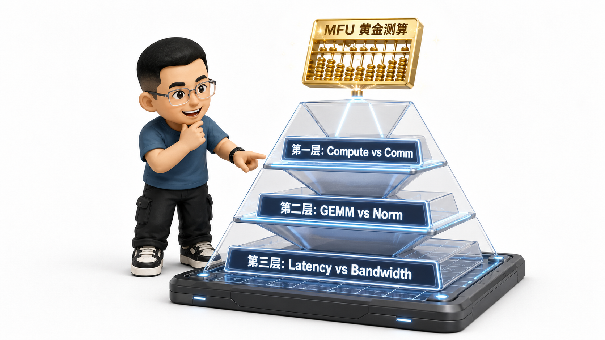
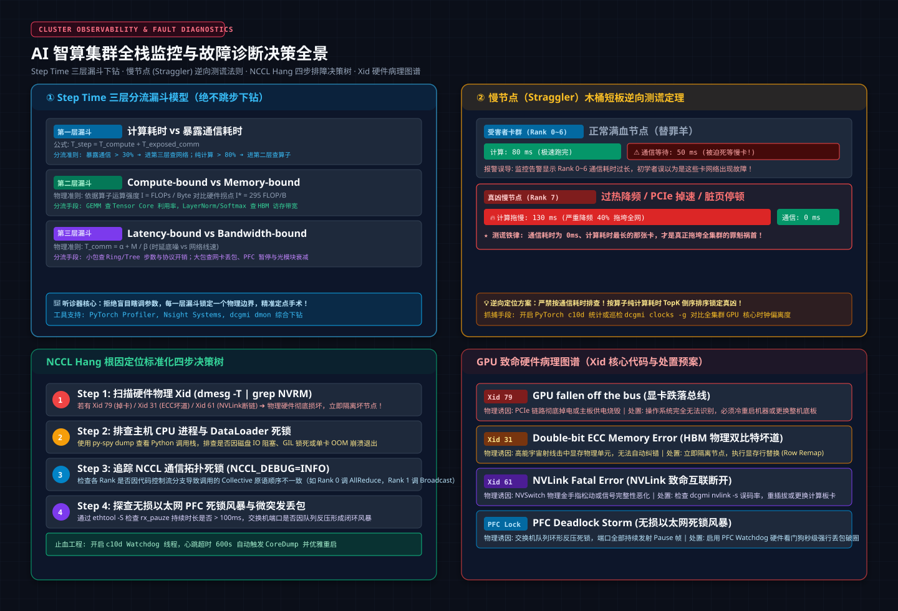
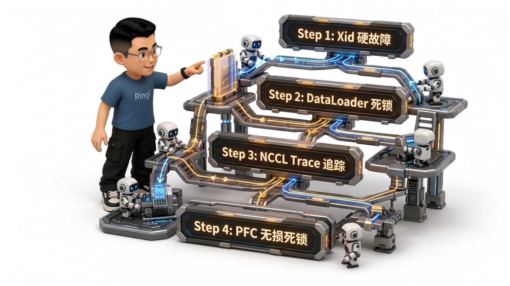
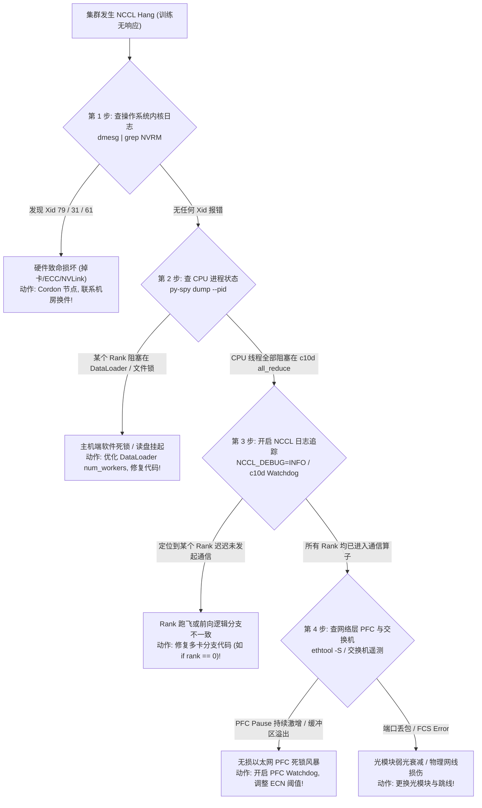
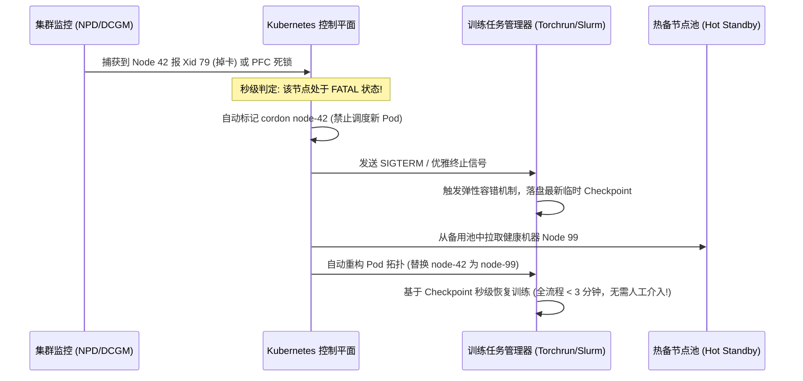

# 🏛️ 第20讲：智算集群的听诊器——Benchmark、监控与 AI 集群故障诊断（Step Time 三层分解、慢节点木桶短板、NCCL Hang 排障决策树与 Xid 故障图谱）

> **主讲人**：👓 **Ringi**（大厂 AI Infrastructure 工程师）  
> **所属模块**：[Module 01: GPU 硬件架构、数据搬运、集群通信与 Overlap](./README.md)  
> **篇章范式**：🛠️ 生产运维与故障排障篇（Production Troubleshooting & Diagnostics Paradigm）  
> **核心导读**：  
> 在千卡/万卡大模型预训练的漫长征程中，AI Infra 团队最恐惧的报警永远有两个：  
> **第一个是“训练突然暴毙卡死（NCCL Hang）”**——集群监控上所有 GPU 依然显示 100% 占用，但 Step 进度彻底冻结，上百名算法与平台工程师半夜被电话叫醒，抓着几万行杂乱日志在排障迷宫里通宵抓瞎；  
> **第二个是更加隐蔽而致命的“静默降速（Silent Slow Node / Straggler）”**——任务没有任何报错，甚至没有掉卡，但原本 800 毫秒的单步迭代耗时莫名其妙暴增到 1300 毫秒，大模型训练速度凭空蒸发了 35%，每天几百万元的昂贵算力在无声无息中被白白焚烧！  
> **面对千卡集群的庞大机器阵列，如何用一套科学的金字塔漏斗层层下钻、三分钟锁定性能瓶颈？为什么说在集合通信的木桶短板中，“通信等待时间最长的人往往是无辜的，那个通信等待时间为 0 的才是真凶”？面对死一般的 NCCL Hang，如何沿着标准化四步决策树在 15 分钟内完成硬核定损？操作系统内核抛出的 Xid 79、Xid 31、Xid 61 到底对应着哪些无法逆转的物理创伤？无损以太网的 PFC 暂停帧又是如何酿成整网死锁风暴的？**  
> 本讲我们将彻底走出“两眼一抹黑、重启解千愁”的业余运维泥潭，将大厂一线沉淀数万机时提炼出的听诊兵法与止血手册倾囊相授！


```text
=================================================================================================
                                   Ringi 3D 架构工坊 · 核心全景
┌───────────────────────────────────────────────────────────────────────────────────────────────┐
│ [AI Cluster Observability & Diagnostic Decision Flow]                                         │
│                                                                                               │
│  【Step Time 三层分流漏斗 (Funnel)】                                                           │
│    Step Time (单步迭代总耗时)                                                                 │
│    ├── Level 1: [ Compute (纯计算耗时) ]  vs  [ Exposed Comm (暴露通信耗时) ]                  │
│    ├── Level 2: [ Compute-bound (GEMM算力) ] vs [ Memory-bound (Norm/Softmax 访存) ]          │
│    └── Level 3: [ Latency-bound (小包底噪α) ] vs [ Bandwidth-bound (网络线速β/丢包) ]         │
│                                                                                               │
│  【慢节点逆向定位法 (The Inversion Law of Stragglers)】                                       │
│    • 受害者卡群 (Rank 0~6) : [ Compute 80ms ] ──► [ NCCL AllReduce 死等 50ms ] (等待最长!)   │
│    • 真正罪魁祸首 (Rank 3) : [ Compute 130ms (过热降频!) ] ──► [ AllReduce 瞬间完成 (0ms!) ] │
│      ★ 黄金测谎铁律: 通信等待时间最短、计算时间最长的那张卡，就是拖死全集群的慢卡！           │
├───────────────────────────────────────────────────────────────────────────────────────────────┤
│  【NCCL Hang 四步决断与硬件物理病理图谱 (Xid Knowledge)】                                     │
│    Step 1: 扫硬件 Xid ──► [ Xid 79 (PCIe掉卡) / Xid 31 (ECC坏道) / Xid 61 (NVLink断链) ]     │
│    Step 2: 查主机进程   ──► [ DataLoader 读盘挂起 / Python GIL 死锁 / py-spy 堆栈 ]           │
│    Step 3: 剖通信拓扑   ──► [ NCCL_DEBUG=INFO 追踪 / c10d Watchdog 线程心跳超时 ]             │
│    Step 4: 探无损网络   ──► [ PFC Pause 持续时长 > 100ms 触发 PFC 死锁风暴 / 微突发溢出丢包 ] │
└───────────────────────────────────────────────────────────────────────────────────────────────┘
=================================================================================================
```

<!-- more -->

## 📑 目录导航

- [0. Ringi 开场：生产真实现场与痛点冲突](#0-ringi-开场生产真实现场与痛点冲突)
  - [0.1 真实工程矛盾：千卡大模型训练的两大午夜梦魇（NCCL Hang vs Slow Node）](#01-真实工程矛盾千卡大模型训练的两大午夜梦魇nccl-hang-vs-slow-node)
  - [0.2 线上真实事故复盘：某万亿参数大模型因 1 张单卡热降频拖垮 1024 卡训练达 3 天的惨痛教训](#02-线上真实事故复盘某万亿参数大模型因-1-张单卡热降频拖垮-1024-卡训练达-3-天的惨痛教训)
  - [0.3 AI 集群故障分层与排障全景速查表](#03-ai-集群故障分层与排障全景速查表)
- [1. 性能分析第一性原理：Step Time 三层分解金字塔（No Naked Formula 2.0）](#1-性能分析第一性原理step-time-三层分解金字塔no-naked-formula-20)
  - [1.1 为什么需要分解？盲目优化单点往往南辕北辙](#11-为什么需要分解盲目优化单点往往南辕北辙)
  - [1.2 第一层：计算时间（$T_{\text{compute}}$） vs 暴露通信时间（$T_{\text{exposed-comm}}$）](#12-第一层计算时间t_textcompute-vs-暴露通信时间t_textexposed_comm)
  - [1.3 第二层：计算内部细分——算力瓶颈（Compute-Bound） vs 访存瓶颈（Memory-Bound）](#13-第二层计算内部细分算力瓶颈compute-bound-vs-访存瓶颈memory-bound)
  - [1.4 第三层：通信内部细分——小包启动时延（Latency-Bound） vs 大包网络带宽（Bandwidth-Bound）](#14-第三层通信内部细分小包启动时延latency-bound-vs-大包网络带宽bandwidth-bound)
  - [1.5 Step Time 分解公式与 MFU / MBU 算盘校验](#15-step-time-分解公式与-mfu--mbu-算盘校验)
- [2. 木桶短板抓凶手：慢节点（Slow Rank / Straggler）逆向定位法](#2-木桶短板抓凶手慢节点slow-rank--straggler逆向定位法)
  - [2.1 慢节点的三大物理病灶：供电与热降频、PCIe 物理金手指掉速、光纤弱光](#21-慢节点的三大物理病灶供电与热降频pcie-物理金手指掉速光纤弱光)
  - [2.2 颠覆直觉的逆向测谎逻辑：等待时间最长的人是无辜受害者！](#22-颠覆直觉的逆向测谎逻辑等待时间最长的人是无辜受害者)
  - [2.3 慢节点定位三大实战工具：跨 Rank 耗时分布、DCGM 时钟偏离度与心跳监控](#23-慢节点定位三大实战工具跨-rank-耗时分布dcgm-时钟偏离度与心跳监控)
- [3. 午夜梦魇破局：NCCL Hang（死锁）排障四步决策树](#3-午夜梦魇破局nccl-hang死锁排障四步决策树)
  - [3.1 为什么说 NCCL Hang 是分布式系统最难排查的幽灵？](#31-为什么说-nccl-hang-是分布式系统最难排查的幽灵)
  - [3.2 决策树第 1 步：硬件硬故障秒级排查（`dmesg | grep NVRM` 锁定致命 Xid）](#32-决策树第-1-步硬件硬故障秒级排查dmesg--grep-nvrm-锁定致命-xid)
  - [3.3 决策树第 2 步：主机端进程与 DataLoader 死锁排查（`py-spy` 堆栈透视）](#33-决策树第-2-步主机端进程与-dataloader-死锁排查py-spy-堆栈透视)
  - [3.4 决策树第 3 步：NCCL 通信算子与拓扑阻塞定位（`NCCL_DEBUG=INFO` 逐行解密）](#34-决策树第-3-步nccl-通信算子与拓扑阻塞定位nccl_debuginfo-逐行解密)
  - [3.5 决策树第 4 步：无损网络 PFC 死锁与微突发丢包风暴排查](#35-决策树第-4-步无损网络-pfc-死锁与微突发丢包风暴排查)
- [4. 芯片物理病理学：GPU Xid 错误代码深度图谱](#4-芯片物理病理学gpu-xid-错误代码深度图谱)
  - [4.1 什么是 Xid？NVIDIA 驱动内核级硬件异常上报机制](#41-什么是-xidnvidia-驱动内核级硬件异常上报机制)
  - [4.2 致命硬故障代码速查：Xid 79、Xid 31/48、Xid 61/62 与 Xid 43/45](#42-致命硬故障代码速查xid-79xid-3148xid-6162-与-xid-4345)
  - [4.3 软故障与驱动异常的隔离与自愈恢复策略](#43-软故障与驱动异常的隔离与自愈恢复策略)
- [5. 网络层死穴：RoCE / InfiniBand 无损网络监控与 PFC / ECN 拥塞风暴](#5-网络层死穴roce--infiniband-无损网络监控与-pfc--ecn-拥塞风暴)
  - [5.1 无损网络的双刃剑：消灭了丢包，却换来了致命的 PFC 死锁（Deadlock）](#51-无损网络的双刃剑消灭了丢包却换来了致命的-pfc-死锁deadlock)
  - [5.2 PFC 反压雪崩机制：从单网卡拥塞到整网端口瘫痪的时空扩散](#52-pfc-反压雪崩机制从单网卡拥塞到整网端口瘫痪的时空扩散)
  - [5.3 生产核心测谎指标：Pause Duration、Discards、Symbol Error 与 ECN 标记率](#53-生产核心测谎指标pause-durationdiscardssymbol-error-与-ecn-标记率)
- [6. 智算中心监控中枢：四层指标体系与秒级熔断自愈](#6-智算中心监控中枢四层指标体系与秒级熔断自愈)
  - [6.1 四层立体监控：GPU 硬件 ➔ 机内互联 ➔ 网络集群 ➔ 业务应用](#61-四层立体监控gpu-硬件--机内互联--网络集群--业务应用)
  - [6.2 工业级健康检查脚本体系（L1 快速巡检 ➔ L2 结构排查 ➔ L3 压力验证）](#62-工业级健康检查脚本体系l1-快速巡检--l2-结构排查--l3-压力验证)
  - [6.3 生产故障秒级自愈闭环：自动 Cordon、热备节点替换与弹性 Checkpoint 恢复](#63-生产故障秒级自愈闭环自动-cordon热备节点替换与弹性-checkpoint-恢复)
- [7. 动手实战与代码实验室（Minimal Runnable Code）](#7-动手实战与代码实验室minimal-runnable-code)
  - [7.1 实验 1：Step Time 三层分流性能漏斗与 MFU 自动化诊断脚本](#71-实验-1step-time-三层分流性能漏斗与-mfu-自动化诊断脚本)
  - [7.2 实验 2：慢节点（Straggler）逆向定位算法实验](#72-实验-2慢节点straggler逆向定位算法实验)
  - [7.3 实验 3：GPU Xid 错误日志解析与自愈决策引擎](#73-实验-3gpu-xid-错误日志解析与自愈决策引擎)
  - [7.4 实验 4：RDMA / RoCE 网络健康与 PFC 拥塞风暴检测器](#74-实验-4rdma--roce-网络健康与-pfc-拥塞风暴检测器)
- [8. Ringi 避坑指南与生产性能工程黄金 Checklist](#8-ringi-避坑指南与生产性能工程黄金-checklist)
  - [8.1 避坑表格（❌ 常见小白误区 vs ✅ 大厂 AI Infra 正解）](#81-避坑表格-常见小白误区-vs--大厂-ai-infra-正解)
  - [8.2 生产 AI 集群运维与故障定位黄金十条 Checklist](#82-生产-ai-集群运维与故障定位黄金十条-checklist)
- [9. Ringi 5 点核心速记口诀、自我检验清单与课后深度思考题](#9-ringi-5-点核心速记口诀自我检验清单与课后深度思考题)
  - [9.1 5 点押韵核心速记口诀](#91-5-点押韵核心速记口诀)
  - [9.2 10 条白板自我检验清单](#92-10-条白板自我检验清单)
  - [9.3 3 道高阶开放式课后思考题（含极端 Corner Case）](#93-3-道高阶开放式课后思考题含极端-corner-case)
- [10. 📚 参考资料与核心源码/经典论文指引](#10--参考资料与核心源码经典论文指引)
- [附录：Appendix A — 大厂硬核高频面试题与白板推导（Interview Drill）](#附录appendix-a--大厂硬核高频面试题与白板推导interview-drill)
  - [Drill 1：在线上 1024 卡训练任务中，如何利用“逆向倒挂法则”在 1 分钟内定位慢节点？](#drill-1在线上-1024-卡训练任务中如何利用逆向倒挂法则在-1-分钟内定位慢节点)
  - [Drill 2：推演从捕获 Xid 79 到 Kubernetes 自动完成 Pod 隔离漂移的完整工业链路](#drill-2推演从捕获-xid-79-到-kubernetes-自动完成-pod-隔离漂移的完整工业链路)
  - [Drill 3：为什么说 RoCE 网络的 PFC 死锁比丢包更致命？如何通过 ECN 和 Watchdog 防御？](#drill-3为什么说-roce-网络的-pfc-死锁比丢包更致命如何通过-ecn-和-watchdog-防御)

---

# 0. Ringi 开场：生产真实现场与痛点冲突

## 0.1 真实工程矛盾：千卡大模型训练的两大午夜梦魇（NCCL Hang vs Slow Node）

在大厂负责千卡大模型训练平台的工程师，手机永远不敢调成静音。因为有两个足以让所有人神经衰弱的报警，随时会在凌晨三点撕裂夜空：

### 梦魇一：死一般的冻结（NCCL Hang）
监控面板上，全集群 1024 张 GPU 的利用率整整齐齐地趴在 **100%**，GPU 温度正常、显存显存全满，看似算力全开。然而，**模型训练的 Step 计数器却静止了整整 40 分钟**！既没有抛出异常，也没有显卡报错，所有节点仿佛陷入了一场深不见底的集体冬眠。

### 梦魇二：无声的钝刀子割肉（Slow Node）
任务跑得很稳定，已经连续运行了 3 天，然而大盘监控上的 MFU（Model FLOPs Utilization）只有可怜的 **26%**（理论基线应该在 48% 以上），单步迭代耗时比基线慢了整整 350 毫秒！
算法团队抱怨底层网络太差，网络团队指责算法模型架构写得烂，运维团队反复执行 `nvidia-smi` 却发现 128 台机器全部“状态健康”！

```text
生产真实对峙现场：
[算法视角]: "Step Time 慢了 35%，一定是你们这批新上的机器网络有暗病！"
[网络视角]: "交换机端口流量均衡，零丢包、零错误帧，网络好得很！"
[运维视角]: "每台机器 dmesg 都没报错，驱动好端端的，到底要我修哪台？"
[真相底账]: 1024 个人绑着脚进行千人齐跑，其中只有 1 个人因为散热硅脂干涸发生了【静默热降频】！
           全集群其余 1023 张价值千万的 GPU，被迫在每次 AllReduce 节点死等这个慢卡！
```

---

## 0.2 线上真实事故复盘：某万亿参数大模型因 1 张单卡热降频拖垮 1024 卡训练达 3 天的惨痛教训

回顾国内某头部 AI 团队在一次万亿 MoE 模型训练中的血泪教训：

该项目动用了 128 台 8-GPU 满配服务器（共 1024 张 A100-SXM4-80GB）。上线初期，训练按预期推进，但三天后团队发现整体训练进度严重滞后：
- 理论上 3 天应跑完 120,000 个 Step，实测仅跑完 78,000 个 Step，**整体算力浪费折合资金超过两百万元**；
- 抓取分布式日志，各节点日志整齐划一，没有一个进程崩溃退出。

```text
追凶全链路时序还原：
1. 真正病灶：Node 87 的 GPU 5 散热模组扣压螺丝松动，导热垫片脱落；
2. 恶魔触发点：当环境温度轻微上升时，GPU 5 核心温度突破 83℃ 阈值，硬件内部触发【Thermal Throttling】；
   GPU 核心频率瞬间从 1410 MHz 腰斩至 765 MHz，算力暴跌 45%！
3. 木桶放大效应：
   在 Megatron-LM 的 TP+PP+DP 拓扑中，GPU 5 处于前向与反向的强同步环路中；
   GPU 5 的矩阵乘法变慢，导致同一 TP 组内的其余 7 张卡在 AllReduce 时陷入空等；
   空等反压顺着数据并行 Ring 环路扩散，最终将全网 1024 张卡死死拖至相同的龟速！
4. 为什么一直没被发现？
   日常运维脚本只检测“GPU 是否掉卡”，只要没报 Xid 错误就判定正常；
   对于这种【活着但变慢】的静默性能退化，传统运维监控完全处于失明状态！
```

---

## 0.3 AI 集群故障分层与排障全景速查表

智算集群的故障绝非孤立事件，必须将其划分为清晰的物理与系统层级：

| 故障层级 | 典型故障现象与代码 | 核心根因与物理机制 | 业务直接表现 | 生产诊断工具与手段 |
| :--- | :--- | :--- | :--- | :--- |
| **L0: 芯片硬故障** | **Xid 79**（Fallen off the bus）<br>**Xid 31/48**（Double-Bit ECC） | PCIe 掉电、供电模块烧毁、HBM 物理坏道 | 任务瞬间崩溃、显卡彻底消失 | `dmesg -T \| grep NVRM`<br>`nvidia-smi -q` |
| **L1: 机内互联故障** | **Xid 61/62**（NVLink 致命错误）<br>NVLink CRC Error 激增 | NVSwitch 物理金手指松动、高速信号失真 | AllReduce 耗时暴增或直接死锁 | `nvidia-smi nvlink -e`<br>`dcgmi nvlink -s` |
| **L2: 网络集群故障** | **PFC Deadlock**（死锁风暴）<br>PortRxDiscards 丢包 | 交换机多入一出缓冲区打爆、持续反压 | 全网集体 Hang 住、吞吐归零 | `ethtool -S` 查 Pause<br>`ibstat` / `perfquery` |
| **L3: 节点亚健康** | **Thermal Throttling**（热降频）<br>PCIe 掉速至 Gen3 x4 | 散热风道受阻、PCIe AER 错误降速 | **Slow Node**（无报错但全网变慢 30%） | DCGM 时钟偏离度巡检<br>Profiler 逆向定位 |
| **L4: 软件与框架死锁** | **NCCL Timeout**（超时报错）<br>DataLoader Worker Hang | 单卡 OOM 跑飞、数据读取多线程死锁 | 报超时退出或无响应挂起 | `py-spy dump`<br>`NCCL_DEBUG=INFO` |

---

# 1. 性能分析第一性原理：Step Time 三层分解金字塔（No Naked Formula 2.0）





## 1.1 为什么需要分解？盲目优化单点往往南辕北辙

在大模型性能调优中，最业余的做法是“盲人摸象”：看一眼 GPU 利用率不高，就去调批次大小（Batch Size）；看到耗时较长，就去强行改 FlashAttention。

在大厂 AI Infra 工业实践中，面对任何性能不达标的集群，第一步永远是构建 **Step Time 三层分流漏斗（Funnel Model）**。每一层漏斗只回答一个物理问题，层层下钻，绝不跳步！

---

## 1.2 第一层：计算时间（$T_{\text{compute}}$） vs 暴露通信时间（$T_{\text{exposed-comm}}$）

单步训练迭代耗时（Step Time）由计算与未被重叠隐藏的通信共同组成：

$$
T_{\text{step}} = T_{\text{compute}} + T_{\text{exposed-comm}}
$$

```text
┌─────────────────────────────────────────────────────────────────────────┐
│                    Step Time 第一层漏斗：计算 vs 暴露通信                │
├─────────────────────────────────────────────────────────────────────────┤
│                                                                         │
│  【Case A: 暴露通信主导型 (Exposed Comm > 30%)】                        │
│    ┌───────────────────────────────────┬───────────────────────────┐    │
│    │       Compute (计算 60ms)         │   Exposed Comm (通信 40ms)│    │
│    └───────────────────────────────────┴───────────────────────────┘    │
│    ➔ 诊断方向: 下钻到【第三层漏斗】，排查网络带宽、拓扑与 Overlap 掩盖。  │
│                                                                         │
│  【Case B: 纯计算主导型 (Exposed Comm < 10%)】                          │
│    ┌───────────────────────────────────────────────────────┬───────┐    │
│    │                  Compute (计算 90ms)                  │Comm10m│    │
│    └───────────────────────────────────────────────────────┴───────┘    │
│    ➔ 诊断方向: 下钻到【第二层漏斗】，排查单卡算力利用率与访存带宽瓶颈。  │
└─────────────────────────────────────────────────────────────────────────┘
```

---

## 1.3 第二层：计算内部细分——算力瓶颈（Compute-Bound） vs 访存瓶颈（Memory-Bound）

如果第一层判定瓶颈在计算（$T_{\text{compute}}$ 过长），必须沿 Roofline 模型将其拆解为两大算子阵营：

1. **算力受限（Compute-Bound）**：
   - 典型算子：高维 GEMM 矩阵乘法（$Q \cdot K^T$、FFN Linear）；
   - 诊断指标：**Tensor Core 利用率** 是否达到理论峰值的 60%~75%？如果利用率极低，检查是否是 Batch Size 太小导致 SM 核心吃不饱，或者是 Tile 切分失配；
2. **访存受限（Memory-Bound）**：
   - 典型算子：RMSNorm、LayerNorm、Softmax、RoPE 旋转位置编码；
   - 诊断指标：**HBM 带宽饱和度**。如果显存带宽打满（如 H100 达到 3.0 TB/s），必须采用 **算子融合（Kernel Fusion）**，将多次读写显存合并在 Shared Memory 中完成！

---

## 1.4 第三层：通信内部细分——小包启动时延（Latency-Bound） vs 大包网络带宽（Bandwidth-Bound）

如果第一层判定瓶颈在暴露通信，依据 Alpha-Beta 模型对其进行解剖：

$$
T_{\text{comm}} = \alpha + \frac{M}{\beta}
$$

1. **时延受限（Latency-Bound）**：
   - 特征：张量切片极小（$M < 1\,\text{MB}$），通信耗时被单步网络启动时延 $\alpha$ 和跨机跳步主导；
   - 药方：开启 **DDP 梯度分桶（Gradient Bucketing）**，强行把小包拼接为 25MB 以上的大桶，或开启 CUDA Graph；
2. **带宽受限（Bandwidth-Bound）**：
   - 特征：大包通信（$M > 100\,\text{MB}$），通信耗时完全由网络物理线速 $\beta$ 决定；
   - 药方：检查网卡速率协商、RoCE/IB 多轨对齐（Multi-Rail Affinity），排查交换机丢包与慢卡。

---

## 1.5 Step Time 分解公式与 MFU / MBU 算盘校验

在实际验收时，我们通过 **MFU（Model FLOPs Utilization）** 对集群进行终极测算：

### 1. 为什么需要算 MFU？
单纯看 `nvidia-smi` 的 GPU 利用率（GPU-Util）是巨大的骗局——GPU 空转轮询或者等待通信时，利用率依然显示 100%！**MFU 才是唯一不撒谎的工业黄金标准！**

### 2. 极简计算公式（No Naked Formula 2.0）：
- 设模型单步理论计算量为 $\text{FLOPs}_{\text{step}}$（对于 Dense Transformer，前向约 $2PD$，反向约 $4PD$，单步总计约 $6PD$）；
- 设集群总卡数为 $N$，单卡硬件理论峰值算力为 $P_{\text{peak}}$（如 H100 SXM 为 989 TFLOPS BF16）；
- 实测单步迭代耗时为 $T_{\text{step}}$（秒）：

$$
\mathbf{\text{MFU} = \frac{\text{FLOPs}_{\text{step}}}{T_{\text{step}} \times N \times P_{\text{peak}}}}
$$

```text
算力账本健康度标尺：
• MFU < 30%: 严重不及格！集群必然存在严重的通信阻塞、慢节点或显存严重踩踏；
• MFU 40% ~ 48%: 工业及格线，大多数生产大模型分布式训练的标准区间；
• MFU > 55%: 顶级优化水准！表明计算通信近乎完美重叠，算子高度融合。
```

---

# 2. 木桶短板抓凶手：慢节点（Slow Rank / Straggler）逆向定位法


## 2.1 慢节点的三大物理病灶：供电与热降频、PCIe 物理金手指掉速、光纤弱光

慢节点（Straggler）之所以难抓，是因为它**没有死**，而是像一个生病的搬运工，速度变慢了，却依然在系统里机械地交接班。它的三大典型物理病灶包括：

```text
┌─────────────────────────────────────────────────────────────────────────┐
│                          慢节点的底层三大物理病灶                       │
├─────────────────────────────────────────────────────────────────────────┤
│                                                                         │
│  1. 散热与供电病灶 (Thermal & Power Throttling):                         │
│     某张 GPU 的风扇灰尘堆积或导热硅脂硬化，核心温度突破 83℃；           │
│     GPU 固件强制触发降频锁频 (Clock Throttle)，频率从 1.8GHz 暴跌至 1.0GHz! │
│                                                                         │
│  2. PCIe 总线物理降速 (PCIe Link Degraded):                             │
│     服务器主板金手指氧化或物理变形，PCIe 5.0 x16 (64 GB/s)              │
│     发生大量链路协商降级，掉至 PCIe 3.0 x4 (4 GB/s)，跨 Socket 搬运暴跌! │
│                                                                         │
│  3. 光模块弱光衰减 (Optical Transceiver Weak Light):                    │
│     IB/RoCE 网卡光纤插头污染，发光功率从 -2dBm 衰减至 -12dBm；          │
│     接收端产生大量不可纠正误码 (Symbol Error)，网卡频繁重传，吞吐暴跌!  │
└─────────────────────────────────────────────────────────────────────────┘
```

---

## 2.2 颠覆直觉的逆向测谎逻辑：等待时间最长的人是无辜受害者！

在集合通信（如 AllReduce）的同步壁垒下，初级工程师抓出 Profiler 性能追踪图时，常常会犯下一个颠覆黑白的致命错误：

> “看！Rank 0 到 Rank 6 在 `c10d::all_reduce` 上整整耗费了 **50 毫秒**！而 Rank 3 在通信上只花了 **0 毫秒**！所以一定是 Rank 0~6 的网络通信出了大问题！”

**这是完全颠倒因果的荒谬结论！**

```text
┌─────────────────────────────────────────────────────────────────────────┐
│                    慢节点逆向倒挂时序图 (The Inversion Law)             │
├─────────────────────────────────────────────────────────────────────────┤
│                                                                         │
│  Rank 0 (正常卡): [ Compute 80ms ] ──► [ NCCL AllReduce 等待 50ms (冤屈!)] ──► 进入下步
│  Rank 1 (正常卡): [ Compute 80ms ] ──► [ NCCL AllReduce 等待 50ms (冤屈!)] ──► 进入下步
│  ...                                                                    │
│  Rank 3 (慢节点): [ Compute 130ms (过热降频!) ] ──► [ AR 0ms (瞬间完成!) ] ──► 进入下步
│                                                                         │
│  【第一性原理裁决】：                                                    │
│  • Rank 0~2, 4~7 早在 80ms 时就已经算完，它们在集合通信屏障前【苦苦等待了 50ms】；
│  • Rank 3 磨磨蹭蹭直到 130ms 才把计算算完；当它姗姗来迟到达同步点时，全员早已就位，
│    数据传输瞬间发生完毕！                                               │
│  ★ 黄金逆向铁律：通信等待时间最长的是受害者；通信等待为 0 的才是真凶！ │
└─────────────────────────────────────────────────────────────────────────┘
```

---

## 2.3 慢节点定位三大实战工具：跨 Rank 耗时分布、DCGM 时钟偏离度与心跳监控

### 1. 跨 Rank 耗时倒挂定位法（Profiler Inversion）
导出 PyTorch Profiler 的 Chrome Trace，聚合所有卡在 `aten::linear` 或反向算子的耗时。**计算耗时高出平均线 20% 以上、且通信等待时间为最低值的 Rank，直接锁定为慢节点！**

### 2. DCGM 硬件时钟实时巡检（Clock Skew Detection）
通过 NVIDIA DCGM 实时轮询全集群 GPU 的核心时钟频率（SM Clock）：
```bash
# 查询各 GPU 当前频率、温度与节流原因
nvidia-smi --query-gpu=index,clocks.current.sm,temperature.gpu,throttle_reasons.active --format=csv
```
一旦发现某张卡的 `clocks.current.sm` 严重低于基准（例如正常卡 1830 MHz，某卡仅 1120 MHz），且标志位显示 `Thermal Slowdown` 或 `Power Brake`，无需看代码，100% 确认硬件物理降频！

### 3. 分布式心跳与步长看门狗（Step Heartbeat Watchdog）
训练框架内注入轻量级心跳探针，记录每张卡完成前向和反向计算的绝对时间戳。只要某节点的计算完成时间戳持续偏离中位数超过阈值，自动触发告警并标记该节点下线（Cordon）。

---

# 3. 午夜梦魇破局：NCCL Hang（死锁）排障四步决策树



## 3.1 为什么说 NCCL Hang 是分布式系统最难排查的幽灵？

当一个千卡任务遭遇 NCCL Hang 时，之所以排查极其痛苦，是因为 **CUDA 的异步执行模型（Async Execution）掩盖了真正的事故现场**：
- 当某张卡发生硬件掉卡或代码死锁时，它停止了发包；
- 其余 1023 张卡已经在各自的 GPU Stream 上发射了通信 Kernel，CPU 主机端早已返回；
- GPU 核心陷入无休止的内存轮询等待（Polling Loop），从外部监控看，GPU 利用率死死卡在 100%，CPU 占用极低，系统表现得像是在“全速运行”！

必须依托一套不可逆的 **四步标准化决策树**，在最短时间内斩断迷雾！



---

## 3.2 决策树第 1 步：硬件硬故障秒级排查（`dmesg | grep NVRM` 锁定致命 Xid）

**铁律：永远优先排除硬件物理猝死！**  
登录任意疑似卡死的主机，执行：
```bash
dmesg -T | grep -E "NVRM|Xid" | tail -n 20
```
- 如果看到 **`NVRM: Xid: 79, GPU has fallen off the bus`**：恭喜你，直接破案！该 GPU 已经彻底脱离 PCIe 总线，硬件掉电或烧毁，任何软件重试都是徒劳，必须立刻踢掉该节点并报修；
- 如果看到 **`Xid 61/62`** 或 **`Xid 31`**：说明 NVLink 物理断链或显存遭遇不可纠正的多比特翻转（Uncorrectable ECC）。

---

## 3.3 决策树第 2 步：主机端进程与 DataLoader 死锁排查（`py-spy` 堆栈透视）

如果内核日志干干净净，说明硬件安然无恙，问题出在软件层！

使用生产级无侵入性能探针 **`py-spy`**，直接 Dump 出挂起进程的 Python 完整调用栈：
```bash
# 无需停止任务，秒级抓取 Python 堆栈
py-spy dump --pid $(pgrep -f "train.py" | head -1)
```
- **典型真凶 1：DataLoader 读盘死锁**：如果某个 Rank 的堆栈卡在 `torch.utils.data.DataLoader` 内部的 `multiprocessing.Queue.get()`，通常是某台机器的分布式存储（如 NFS / Lustre）响应超时或句柄耗尽，导致该 Rank 根本没拿到数据，后续所有卡在 AllReduce 等死！
- **典型真凶 2：分支逻辑失配（Rank Divergence）**：
  ```python
  # 灾难级初级 Bug:
  if dist.get_rank() == 0:
      dist.all_reduce(tensor)  # 只有 Rank 0 发起了通信，其余 1023 张卡全网死等！
  ```

---

## 3.4 决策树第 3 步：NCCL 通信算子与拓扑阻塞定位（`NCCL_DEBUG=INFO` 逐行解密）

如果排除了数据加载问题，必须让 NCCL 吐出底层交互轨迹。在启动脚本中注入：
```bash
export NCCL_DEBUG=INFO
export NCCL_DEBUG_SUBSYS=INIT,COLL,ENV
export NCCL_ASYNC_ERROR_HANDLING=1
export TORCH_DISTRIBUTED_DEBUG=DETAIL
```

**实战日志关键行解读**：
- **`NCCL INFO Comm config nvlinkCentricSched set to 1`**：表明 NVLink 拓扑识别成功；如果是 `pcieCentricSched`，说明 NVLink 掉线被降级走 PCIe；
- **`Ring 00 : 0 -> 1 -> 2 ...`**：检查逻辑环的顺序是否完整对齐；
- **`Call to connect returned Connection timed out`**：直接打印出在尝试握手哪一个目标 IP 和端口时超时，立刻顺藤摸瓜找到目标机器！

---

## 3.5 决策树第 4 步：无损网络 PFC 死锁与微突发丢包风暴排查

如果所有卡都进入了通信，日志停留在某个具体的 AllReduce，则说明网络包在物理交换机中被堵死了！

登录 RoCE/IB 交换机或在主机端执行：
```bash
# 检查网卡 PFC 暂停帧与丢包统计
ethtool -S eth0 | grep -E "pfc|rx_pause|tx_pause|drop|discard" | grep -v ": 0"
```
如果发现某个网卡的 `rx_prio4_pause_duration`（优先级 4 暂停帧持续时间）数值异常庞大，说明**整网已触发 PFC 死锁风暴（PFC Deadlock Storm）**，数据包在交换机环路中无限期循环阻塞！

---

# 4. 芯片物理病理学：GPU Xid 错误代码深度图谱

## 4.1 什么是 Xid？NVIDIA 驱动内核级硬件异常上报机制

Xid 是 NVIDIA GPU 驱动向 Linux 内核（`/var/log/messages` 或 `dmesg`）输出的 **驱动与硬件异常中断事件代码**。  
它是 GPU 硬件健康状态的“心电图”，每一个 Xid 编号都严格映射了底层不同物理单元（GPU 核心、MMU、NVLink、PCIe 控制器、显存控制器）的异常状态。

---

## 4.2 致命硬故障代码速查：Xid 79、Xid 31/48、Xid 61/62 与 Xid 43/45

在 AI Infra 运维中，必须对以下高频 Xid 形成肌肉记忆：

| Xid 错误码 | 官方定义与物理含义 | 物理病理解剖 | 故障级别 | 生产处理动作 |
| :---: | :--- | :--- | :---: | :--- |
| **Xid 79** | **GPU has fallen off the bus** | GPU 彻底脱离 PCIe 总线！供电烧毁、主板短路或 PCIe 硬件断开 | 💀 **物理绝症** | **不可恢复！立即 Cordon 节点，下线并申报硬件售后换卡** |
| **Xid 31** | **GPU Memory Page Fault** | GPU 访问了非法物理显存地址，或显存发生严重硬件损坏 | 🔴 **严重故障** | 检查是否触发 OOM；若频繁发生，判定为显存物理坏道，下线换卡 |
| **Xid 48** | **Double-Bit ECC Error (DBE)** | HBM 显存发生双比特翻转！超出硬件 ECC 纠错极限（无法纠正） | 💀 **物理坏道** | **必须立即下线！** 执行内存隔离（Page Retire），失败则换卡 |
| **Xid 61 / 62**| **Internal Microcontroller / NVLink Error** | NVLink 高速链路物理层失锁、微控制器握手失败或金手指接触不良 | 🔴 **互联中断** | 尝试重启物理机；若重启后仍报，更换 NVLink 连接器或主板 |
| **Xid 43** | **GPU stopped processing** | GPU 处于 Hang 死状态，驱动看门狗超时（通常是 Kernel 死循环） | 🟡 **驱动挂起** | 杀死关联进程；若 GPU 无法恢复，执行 `nvidia-smi --gpu-reset` |
| **Xid 45** | **Preemptive Cleanup** | 驱动主动抢占清理任务（通常由其他严重 Xid 伴随引发，或用户 Ctrl+C）| 🟢 **良性伴生** | 忽略本错误，向前追溯最先引发抢占的“源头 Xid” |

---

## 4.3 软故障与驱动异常的隔离与自愈恢复策略

- **伴生 Xid 误导**：当 GPU 掉卡（Xid 79）时，内核往往会连带抛出数十个 Xid 45 和 Xid 31。**排查时切记：只抓时间戳最早的那一个 Xid，它是唯一的真正诱因！**
- **软重置（Soft Reset）**：针对 Xid 43 等挂起状态，在无需重启整台服务器的前提下，可尝试热重置：
  ```bash
  # 尝试重置指定的 GPU 3
  nvidia-smi -i 3 --gpu-reset
  ```

---

# 5. 网络层死穴：RoCE / InfiniBand 无损网络监控与 PFC / ECN 拥塞风暴

## 5.1 无损网络的双刃剑：消灭了丢包，却换来了致命的 PFC 死锁（Deadlock）

在跨机分布式大模型训练中，RDMA 必须运行在 **无损网络（Lossless Network）** 之上：
- **传统的有损以太网**：网络拥塞时，交换机直接丢弃数据包，由 TCP 负责超时重传。但重传的时延高达数十毫秒，分布式训练根本承受不起；
- **RoCE v2 无损网络**：利用 **PFC（Priority-based Flow Control，基于优先级的流量控制）**。当交换机下游队列快被塞满时，向上游发送 Pause 暂停帧，强制上游暂停发包，从而实现“零丢包”。

**双刃剑的背面：PFC 暂停机制在超大规模网络下极易酿成死锁风暴！**

---

## 5.2 PFC 反压雪崩机制：从单网卡拥塞到整网端口瘫痪的时空扩散

```text
┌─────────────────────────────────────────────────────────────────────────┐
│                       PFC 环形死锁风暴时空扩散机制                      │
├─────────────────────────────────────────────────────────────────────────┤
│                                                                         │
│  [Node A] ──(全速打流)──► [Switch 1] ──(多入一出突发)──► [Switch 2]      │
│                                ▲                             │          │
│                                │                             │          │
│                          (Pause 反压帧)                (Pause 反压帧)    │
│                                │                             ▼          │
│                           [Switch 4] ◄──(Pause 反压帧)─── [Switch 3]    │
│                                                                         │
│  【死锁闭环形成】：                                                      │
│  1. 某个端口突发拥塞，向下游发 Pause 帧；                               │
│  2. 上游交换机缓冲区随之被动积满，被迫向更上一层扩散发 Pause 帧；       │
│  3. 在复杂的 Clos 拓扑网络中，Pause 帧沿着路由环路反向传递，形成死锁闭环！│
│  4. 最终全网所有交换机端口全部停摆，不再转发任何数据包，整网吞吐归零！  │
└─────────────────────────────────────────────────────────────────────────┘
```

---

## 5.3 生产核心测谎指标：Pause Duration、Discards、Symbol Error 与 ECN 标记率

在智算中心的交换机与网卡监控大盘上，必须对以下四大核心指标设置毫秒级告警：

| 网络监控指标 | 正常物理基准 | 危险告警水位 | 物理含义与底层故障归因 |
| :--- | :--- | :--- | :--- |
| **`rx_prio4_pause_duration`** | **0 或极低**（< 1ms） | **> 100 ms 持续激增** | 网卡收到持续的 PFC 暂停帧，**整网死锁风暴直接征兆**！ |
| **`port_rcv_discards`** | **恒为 0** | **> 0（任何丢包均为事故）** | 无损 SLA 被打破！交换机缓冲区彻底溢出，RDMA 链路崩溃重传 |
| **`symbol_error_rate`** | **恒为 0** | **> 10 个/分钟** | 光模块发光功率衰减、光纤弯折或灰尘污染，物理链路劣化 |
| **`ECN Marking Rate`** | < 1% | **> 15%（触发持续限速）** | 交换机提前通过 ECN 触发网卡降速，网络已处在严重拥塞边缘 |

---

# 6. 智算中心监控中枢：四层指标体系与秒级熔断自愈

## 6.1 四层立体监控：GPU 硬件 ➔ 机内互联 ➔ 网络集群 ➔ 业务应用

一个工业出版级智算平台的监控中枢，绝不是简单的单机监控堆砌，而是构建由下至上的 **四层立体防御雷达**：

```text
=================================================================================================
                                智算中心四层立体监控雷达体系
=================================================================================================
[第 4 层: 业务与应用层 (Application)]
  • 核心指标: Step Time Jitter (步长抖动率 < 5%) | MFU (模型算力利用率 > 45%) | Loss 突变突刺
  • 采集技术: PyTorch Callback / TensorBoard / 业务自定义 Prometheus Exporter

[第 3 层: 集群互联网络层 (Network)]
  • 核心指标: RDMA Port Discards (=0) | PFC Pause 持续时长 | ECN 触发率 | 光模块收发光功率
  • 采集技术: Mellanox eSwitch Telemetry / perfquery / netq / ethtool 探针

[第 2 层: 机内高速拓扑层 (Intra-Node)]
  • 核心指标: NVLink 物理吞吐 (450 GB/s) | NVLink CRC 校验错误码 (=0) | PCIe 降速与 AER 错误
  • 采集技术: DCGM (Data Center GPU Manager) nvlink_error_counter / nvidia-smi topo

[第 1 层: GPU 芯片物理层 (GPU Hardware)]
  • 核心指标: 核心时钟频率 (SM Clock) | 核心温度 (GPU Temp < 75℃) | 功耗达标率 | ECC 双比特坏道
  • 采集技术: NVIDIA DCGM Exporter + Prometheus + Node-Problem-Detector (NPD)
=================================================================================================
```

---

## 6.2 工业级健康检查脚本体系（L1 快速巡检 ➔ L2 结构排查 ➔ L3 压力验证）

在大厂运维规范中，物理机交付或故障诊断必须按深度执行三级体检：

- **L1 快速巡检（< 10 秒）**：一键扫清温度、功耗、基础利用率与 Xid 错误；
- **L2 结构排查（< 1 分钟）**：比对 NVLink 拓扑矩阵（确保无 `SYS`/`NODE` 降级）、校验 ECC 显存 Retired Pages 与 PCIe 协商带宽；
- **L3 压力验证（> 5 分钟）**：拉起 `dcgmproftester` 与 `all_reduce_perf`，将整机功耗与总线带宽压至 100% 极限，拷机无暗病后再行入池。

---

## 6.3 生产故障秒级自愈闭环：自动 Cordon、热备节点替换与弹性 Checkpoint 恢复

一个成熟的大模型训练运维系统，必须具备 **无人值守的自动化自愈闭环**：



---

# 7. 动手实战与代码实验室（Minimal Runnable Code）

本节提供 4 个可以直接在本地完整运行并打印清晰结果的 Python 实验，彻底把 Step Time 分解、慢节点逆向定位、Xid 解析与网络风暴监测剥开揉碎！

## 7.1 实验 1：Step Time 三层分流性能漏斗与 MFU 自动化诊断脚本

本实验实现对单步训练耗时的三层下钻分析，并自动计算全集群 MFU 与瓶颈归因：

```python
# lab09_1_steptime_funnel.py
def analyze_step_time_funnel(step_time_ms, t_fwd_ms, t_bwd_ms, t_exposed_comm_ms, cluster_peak_tflops=7912.0, model_flops_per_step=3.6e15):
    """
    Step Time 三层分流漏斗分析与 MFU 自动化诊断
    基准参数: 8 卡 H100 集群 (单卡 989 TFLOPS, 全集群 7912 TFLOPS)
    """
    t_compute_ms = t_fwd_ms + t_bwd_ms
    comm_ratio = (t_exposed_comm_ms / step_time_ms) * 100.0
    compute_ratio = (t_compute_ms / step_time_ms) * 100.0
    
    # 实际达成算力 = 模型单步总浮点数 / 单步总时间
    step_time_sec = step_time_ms / 1000.0
    achieved_tflops = (model_flops_per_step / 1e12) / step_time_sec
    mfu = (achieved_tflops / cluster_peak_tflops) * 100.0
    
    diagnosis = []
    if comm_ratio > 30.0:
        diagnosis.append(f"暴露通信严重超标 ({comm_ratio:.1f}%): 网络带宽受限或缺少 Overlap 掩盖")
    if mfu < 35.0:
        diagnosis.append(f"MFU 极度偏低 ({mfu:.1f}%): 存在严重硬件停顿或算子未融合")
    else:
        diagnosis.append(f"MFU 表现健康 ({mfu:.1f}%): 处于工业级算力黄金利用区间")
        
    return {
        "step_time_ms": step_time_ms,
        "compute_ms": t_compute_ms,
        "compute_ratio": compute_ratio,
        "exposed_comm_ms": t_exposed_comm_ms,
        "comm_ratio": comm_ratio,
        "achieved_tflops": achieved_tflops,
        "mfu": mfu,
        "diagnosis": diagnosis
    }

def main():
    print("=" * 96)
    print("  Lab 09-1: Step Time 三层分流性能漏斗与 MFU 自动化诊断")
    print("=" * 96)
    
    cases = [
        ("1. 黄金健康集群 (Optimal)", 850.0, 280.0, 510.0, 60.0),
        ("2. 暴露通信受限 (Exposed Comm Spike)", 1380.0, 280.0, 510.0, 590.0),
        ("3. 计算热降频受阻 (Thermal Throttled)", 1320.0, 450.0, 810.0, 60.0)
    ]
    
    print(f"{'集群工况场景':<34} | {'总步长':<10} | {'计算占比':<10} | {'暴露通信比':<12} | {'MFU':<8} | {'核心诊断推断'}")
    print("-" * 96)
    for label, st, fwd, bwd, comm in cases:
        r = analyze_step_time_funnel(st, fwd, bwd, comm)
        diag = "; ".join(r['diagnosis'])
        print(f"{label:<34} | {r['step_time_ms']:7.1f} ms | {r['compute_ratio']:8.1f}% | {r['comm_ratio']:10.1f}% | {r['mfu']:6.1f}% | {diag}")
    print("=" * 96 + "\n")

if __name__ == '__main__':
    main()
```

---

## 7.2 实验 2：慢节点（Straggler）逆向定位算法实验

本实验模拟 8 卡节点中单卡发生热降频后，各卡在计算时间与通信等待时间上的倒挂表现，并执行自动化定位：

```python
# lab09_2_straggler_detector.py
def detect_slow_nodes(ranks_profile):
    """
    基于逆向倒挂法则 (The Inversion Law) 定位慢卡
    罪魁祸首特征: 计算耗时极大、通信等待耗时极小 (甚至为 0)
    """
    max_comp = max(r['compute_time'] for r in ranks_profile.values())
    min_comm_wait = min(r['comm_wait_time'] for r in ranks_profile.values())
    
    avg_comp = sum(r['compute_time'] for r in ranks_profile.values()) / len(ranks_profile)
    avg_clock = sum(r['clock_mhz'] for r in ranks_profile.values()) / len(ranks_profile)
    
    suspects = []
    for rank_id, data in ranks_profile.items():
        comp_deviation = ((data['compute_time'] - avg_comp) / avg_comp) * 100.0
        clock_deviation = ((data['clock_mhz'] - avg_clock) / avg_clock) * 100.0
        
        # 判定依据: 计算耗时最高且等待耗时最低，或计算耗时偏离均值超 20%
        is_culprit = (data['compute_time'] == max_comp) and (data['comm_wait_time'] == min_comm_wait)
        if is_culprit or comp_deviation > 20.0 or clock_deviation < -20.0:
            suspects.append({
                "rank": rank_id,
                "compute_time": data['compute_time'],
                "comm_wait": data['comm_wait_time'],
                "clock": data['clock_mhz'],
                "temp": data['temp_c'],
                "comp_dev": comp_deviation,
                "clock_dev": clock_deviation,
                "verdict": "CRITICAL STRAGGLER (真正慢节点凶手!)" if is_culprit else "SUSPECT (疑似异常)"
            })
    return suspects

def main():
    print("=" * 84)
    print("  Lab 09-2: 慢节点 (Straggler) 逆向倒挂诊断算法实验")
    print("=" * 84)
    
    # 模拟数据: Rank 3 核心温度达到 84℃ 触发降频 (时钟从 1830MHz 跌至 1120MHz)
    profiles = {
        0: {'compute_time': 80.0, 'comm_wait_time': 50.0, 'clock_mhz': 1830, 'temp_c': 68},
        1: {'compute_time': 80.2, 'comm_wait_time': 49.8, 'clock_mhz': 1830, 'temp_c': 69},
        2: {'compute_time': 79.8, 'comm_wait_time': 50.2, 'clock_mhz': 1825, 'temp_c': 67},
        3: {'compute_time': 130.0, 'comm_wait_time': 0.0, 'clock_mhz': 1120, 'temp_c': 84}, # 慢卡！
        4: {'compute_time': 80.1, 'comm_wait_time': 49.9, 'clock_mhz': 1830, 'temp_c': 70},
        5: {'compute_time': 80.5, 'comm_wait_time': 49.5, 'clock_mhz': 1830, 'temp_c': 68},
        6: {'compute_time': 79.9, 'comm_wait_time': 50.1, 'clock_mhz': 1825, 'temp_c': 69},
        7: {'compute_time': 80.0, 'comm_wait_time': 50.0, 'clock_mhz': 1830, 'temp_c': 71},
    }
    
    print(f"{'卡号 (Rank)':<10} | {'纯计算耗时':<12} | {'通信等待耗时':<14} | {'SM 频率':<10} | {'核心温度':<10} | {'直观表象'}")
    print("-" * 84)
    for r_id, d in profiles.items():
        status = "苦苦等待 (无辜受害者)" if d['comm_wait_time'] > 40 else "通信 0 等待 (姗姗来迟)"
        print(f"GPU Rank {r_id:<2} | {d['compute_time']:8.1f} ms   | {d['comm_wait_time']:10.1f} ms   | {d['clock_mhz']:6} MHz | {d['temp_c']:6} ℃   | {status}")
        
    suspects = detect_slow_nodes(profiles)
    print("\n>>> 自动化慢卡测谎判定结果 <<<")
    for s in suspects:
        print(f"  [锁定目标] GPU Rank {s['rank']} ──► {s['verdict']}")
        print(f"    • 计算时间偏离度 : +{s['comp_dev']:.1f}% (耗时暴涨)")
        print(f"    • 硬件时钟偏离度 : {s['clock_dev']:.1f}% (严重降频)")
        print(f"    • 核心温度监测   : {s['temp']} ℃ (突破过热阈值!)\n")

if __name__ == '__main__':
    main()
```

---

## 7.3 实验 3：GPU Xid 错误日志解析与自愈决策引擎

本实验解析来自 Linux 内核的 `dmesg` 真实硬件报错，并映射到大厂运维的秒级自愈指令流：

```python
# lab09_3_xid_auto_healing.py
import re

def parse_xid_log(log_line):
    pattern = r"NVRM:\s+Xid\s+\(PCI:([0-9a-fA-F:]+)\):\s+(\d+),\s+(.*)"
    match = re.search(pattern, log_line)
    if not match:
        return None
    
    bdf = match.group(1)
    xid = int(match.group(2))
    details = match.group(3)
    
    xid_kb = {
        79: {"desc": "GPU has fallen off the bus (PCIe 掉卡/断电)", "severity": "FATAL_HARDWARE", "action": "CORDON_NODE_AND_RMA"},
        61: {"desc": "Internal Microcontroller / NVLink Fatal Error", "severity": "FATAL_HARDWARE", "action": "REBOOT_OR_RMA"},
        62: {"desc": "Internal Microcontroller Error (NVLink Engine)", "severity": "FATAL_HARDWARE", "action": "REBOOT_OR_RMA"},
        31: {"desc": "GPU Memory Page Fault (显存地址越界/损坏)", "severity": "CRITICAL_MEM", "action": "RESTART_POD_OR_DRAIN"},
        48: {"desc": "Double-Bit ECC Error (不可纠正多比特坏道)", "severity": "FATAL_HARDWARE", "action": "CORDON_AND_REPLACE_GPU"},
        43: {"desc": "GPU stopped processing (驱动超时挂起)", "severity": "HANG_DRIVER", "action": "KILL_JOB_AND_RESET_GPU"},
        45: {"desc": "Preemptive cleanup (抢占清理，伴生错误)", "severity": "BENIGN_SOFT", "action": "TASK_RETRY"},
        13: {"desc": "Graphics Engine Exception (软件非法访问)", "severity": "SOFTWARE_BUG", "action": "USER_CODE_CHECK"}
    }
    info = xid_kb.get(xid, {"desc": "未收录异常错误码", "severity": "UNKNOWN", "action": "MANUAL_INVESTIGATION"})
    
    return {
        "bdf": bdf,
        "xid": xid,
        "desc": info["desc"],
        "severity": info["severity"],
        "action": info["action"],
        "raw": details
    }

def main():
    sample_logs = [
        "kernel: [12345.678] NVRM: Xid (PCI:0000:4c:00): 79, pid=31456, GPU has fallen off the bus.",
        "kernel: [12389.123] NVRM: Xid (PCI:0000:84:00): 31, pid=31458, GPU Memory Page Fault: virtual address 0x7f230000",
        "kernel: [12401.999] NVRM: Xid (PCI:0000:8a:00): 61, pid=31460, Internal Microcontroller Error on NVLink port 3",
        "kernel: [12410.555] NVRM: Xid (PCI:0000:90:00): 45, pid=31462, Preemptive cleanup, user requested interrupt."
    ]
    
    print("=" * 96)
    print("  Lab 09-3: 操作系统内核 GPU Xid 错误自动解析与集群自愈决策引擎")
    print("=" * 96)
    print(f"{'PCIe 物理地址':<16} | {'Xid':<6} | {'故障严重度':<16} | {'自动化运维决策':<24} | {'物理故障诊断'}")
    print("-" * 96)
    for line in sample_logs:
        res = parse_xid_log(line)
        if res:
            print(f"{res['bdf']:<16} | {res['xid']:<6} | {res['severity']:<16} | {res['action']:<24} | {res['desc']}")
    print("=" * 96 + "\n")

if __name__ == '__main__':
    main()
```

---

## 7.4 实验 4：RDMA / RoCE 网络健康与 PFC 拥塞风暴检测器

本实验模拟多网卡端口性能计数器巡检，快速甄别 PFC 死锁风暴与光纤弱光丢包：

```python
# lab09_4_rdma_pfc_inspector.py
def inspect_rdma_health(port_metrics):
    """
    RDMA / RoCE 端口健康诊断
    1. PFC 死锁风险: 暂停时长超过 100ms
    2. 无损打破: 产生 Discards 丢包
    3. 光纤物理退化: 产生 Symbol Errors
    """
    alerts = []
    for port, m in port_metrics.items():
        status = "HEALTHY (正常)"
        issues = []
        if m['rx_pause_us'] > 100000: # 100ms
            issues.append(f"PFC 疑似死锁风暴 (Rx Pause = {m['rx_pause_us']/1000:.1f}ms > 100ms)")
            status = "CRITICAL_DEADLOCK"
        elif m['rx_pause_us'] > 5000:
            issues.append(f"PFC 局部拥塞反压 (Rx Pause = {m['rx_pause_us']/1000:.1f}ms)")
            if status.startswith("HEALTHY"):
                status = "WARNING_CONGESTION"
                
        if m['discards'] > 0:
            issues.append(f"发生网络丢包 ({m['discards']} 个包丢失, 无损 SLA 被打破!)")
            status = "CRITICAL_DROP"
            
        if m['symbol_errs'] > 0:
            issues.append(f"光路物理退化 ({m['symbol_errs']} 个误码, 检查光模块光衰!)")
            if "CRITICAL" not in status:
                status = "WARNING_OPTICAL"
                
        alerts.append({
            "port": port,
            "status": status,
            "rx_pause_ms": m['rx_pause_us'] / 1000.0,
            "tx_pause_ms": m['tx_pause_us'] / 1000.0,
            "discards": m['discards'],
            "symbol_errs": m['symbol_errs'],
            "issues": issues if issues else ["端口链路健康"]
        })
    return alerts

def main():
    ports = {
        "mlx5_0 (GPU 0)": {'rx_pause_us': 120, 'tx_pause_us': 250, 'discards': 0, 'symbol_errs': 0},
        "mlx5_1 (GPU 1)": {'rx_pause_us': 145000, 'tx_pause_us': 180000, 'discards': 12, 'symbol_errs': 0}, # 发生死锁与丢包！
        "mlx5_2 (GPU 2)": {'rx_pause_us': 15, 'tx_pause_us': 20, 'discards': 0, 'symbol_errs': 48}, # 弱光！
        "mlx5_3 (GPU 3)": {'rx_pause_us': 0, 'tx_pause_us': 0, 'discards': 0, 'symbol_errs': 0}
    }
    
    print("=" * 96)
    print("  Lab 09-4: RDMA / RoCE 物理端口健康与 PFC 拥塞风暴检测")
    print("=" * 96)
    print(f"{'HCA 设备端口':<16} | {'健康状态评级':<20} | {'Rx 暂停时长':<14} | {'丢包数':<8} | {'误码数':<8} | {'诊断处置建议'}")
    print("-" * 96)
    results = inspect_rdma_health(ports)
    for r in results:
        issues_str = "; ".join(r['issues'])
        print(f"{r['port']:<16} | {r['status']:<20} | {r['rx_pause_ms']:8.2f} ms     | {r['discards']:6}   | {r['symbol_errs']:6}   | {issues_str}")
    print("=" * 96 + "\n")

if __name__ == '__main__':
    main()
```

---

# 8. Ringi 避坑指南与生产性能工程黄金 Checklist

## 8.1 避坑表格（❌ 常见小白误区 vs ✅ 大厂 AI Infra 正解）

| 序号 | ❌ 常见小白误区 | ✅ 大厂 AI Infra 工业级正解 | 事故代价与物理底层归因 |
| :---: | :--- | :--- | :--- |
| **1** | 训练变慢时，盯着 Profiler 责怪通信等待时间最长的节点 | **执行逆向测谎法则，寻找通信等待时间最短、计算耗时最长的慢节点** | 倒因为果，冤枉了无辜排队的正常卡，放跑了真正过热降频的罪魁祸首 |
| **2** | 遇到 NCCL Hang，不查日志直接全集群强行无脑重启 | **先执行四步决策树，抓取 `py-spy` 堆栈与 `dmesg` 锁定故障卡后再行动** | 破坏了脆弱的死锁内存现场，重启后不出半小时原样复发，通宵抓瞎 |
| **3** | 看到 GPU-Util 达到 100% 就认定集群算力利用极其充分 | **必须以 MFU（模型算力利用率）为准绳，严防通信死等轮询假象** | 被虚假监控蒙蔽，实际上 GPU 的大部分 SM 处于空转自旋等待状态 |
| **4** | 认为无损网络（Lossless Network）永远不会发生丢包 | **必须监控 `PortRcvDiscards`，缓冲区溢出或 PFC 死锁时依然会发生丢包** | 迷信无损概念，掩盖了交换机突发拥塞与拥塞队列被击穿的严峻事实 |
| **5** | 看到 Xid 45 报错，误以为是该显卡发生了严重故障而申请换卡 | **Xid 45 只是良性的抢占伴生清理，必须顺着日志时间戳向前找源头 Xid** | 误判健康硬件，导致非必要的停机换件，大幅拖延了预训练工期 |
| **6** | 忽视光模块的弱光与 `Symbol Error`，只要物理 Link 处于 Up 就不管 | **建立实时的光功率与误码监控，微弱光衰会引发底层海量重传降速** | 导致个别节点吞吐暴跌 80%，顺着 AllReduce 环路拖垮全网千卡训练 |
| **7** | 遇到通信超时错误，无脑把 `NCCL_COMM_TIMEOUT` 调大到数小时 | **合理设置超时阈值（如 30 分钟），配合心跳 Watchdog 尽早熔断止血** | 掩耳盗铃，导致集群在故障发生后无意义地悬挂空转数小时，浪费数十万算力 |
| **8** | 忽视 PCIe 总线状态，认为只要在 `lspci` 看到 GPU 就可以跑 | **检查 `Width` 与 `Speed`，严防 PCIe 5.0 x16 降级至 PCIe 3.0 x4 的暗病** | 单卡主机到显存搬运带宽暴跌 8 倍，在 FSDP 或数据加载时沦为致命颈瓶 |

---

## 8.2 生产 AI 集群运维与故障定位黄金十条 Checklist

- [ ] **1. 【开机体检基线】** 新节点入池前必须跑通 L1~L3 完整体检，确保 `nvidia-smi topo -m` 全为 `NVLink`，无 `SYS/NODE` 降级。
- [ ] **2. 【Xid 内核监听】** 部署 DaemonSet 实时监听 `/dev/kmsg`，捕获到 Xid 79/31/61 时在 5 秒内自动标记节点为 `NoSchedule`。
- [ ] **3. 【逆向慢卡测谎】** 建立全集群计算耗时分布监控，对计算耗时偏离均值 15% 且通信等待为 0 的慢卡实施秒级报警。
- [ ] **4. 【时钟频率巡检】** 通过 DCGM 定期轮询 `clocks.current.sm`，若出现由于温度（>83℃）触发的 `Thermal Slowdown` 立即隔离排查。
- [ ] **5. 【无损网络防死锁】** RoCE 网络交换机必须启用 PFC Watchdog，当端口单次 Pause 时长超过 100ms 时自动丢弃并恢复队列。
- [ ] **6. 【光路质量体检】** 周期性采集网卡 `symbol_error_rate` 与 SFP 光模块收发光功率，光衰低于 -10dBm 时提前预防性更换。
- [ ] **7. 【NCCL 阻塞防护】** 训练启动脚本统一注入 `export NCCL_ASYNC_ERROR_HANDLING=1` 与合理的 `NCCL_COMM_TIMEOUT`。
- [ ] **8. 【DataLoader 保护】** 严格审计 PyTorch DataLoader，设置合理的超时退出保护，防止数据读盘死锁阻断分布式流水线。
- [ ] **9. 【MFU 连续看板】** 实时大盘展示全集群 MFU 折线图，若 MFU 出现突发阶梯式下滑（下跌 > 5%），自动触发诊断流程。
- [ ] **10. 【秒级弹性自愈】** 建立基于轻量级 Checkpoint 与热备机器池的故障切换架构，将节点损坏的集群恢复时间压至 3 分钟以内。

---

# 9. Ringi 5 点核心速记口诀、自我检验清单与课后深度思考题

## 9.1 5 点押韵核心速记口诀

```text
三层漏斗查耗时，计算通信两相思。
逆向测谎抓慢卡，等待最短才是它。
NCCL Hang 莫要慌，Xid 堆栈查网囊。
七九掉卡不可活，无损死锁忌延磨！
```

---

## 9.2 10 条白板自我检验清单

1. 能否在白板上手绘出 Step Time 三层分流金字塔，并说明每一层的排障分流逻辑？
2. 解释为什么在 AllReduce 同步机制下，通信等待时间最长的 Rank 反而是“无辜受害者”？
3. 列举导致慢节点（Straggler）出现的三大硬件物理诱因，以及对应的监控指标是什么？
4. 简述遭遇训练无响应（NCCL Hang）时，标准化的四步排查决策树流程。
5. 什么是 GPU Xid 错误？Xid 79、Xid 31 与 Xid 45 分别代表什么物理含义？哪个是致命故障？
6. 在 RoCE 无损网络中，PFC 流量控制是如何由于反压扩散酿成整网死锁风暴的？
7. 解释为什么说单看 `nvidia-smi` 的 GPU-Util 利用率无法真实反映集群的算力利用水平？
8. MFU（Model FLOPs Utilization）的物理定义与计算公式是什么？及格线一般是多少？
9. 在 Nsight Systems 时间轴中，如何一眼分辨出是“小包延迟受限”还是“网络物理带宽受限”？
10. Kubernetes 设备插件（NVIDIA K8s Device Plugin）是如何通过监听 NVML 事件实现坏卡秒级隔离的？

---

## 9.3 3 道高阶开放式课后思考题（含极端 Corner Case）

### 思考题 1：静默数据损坏（Silent Data Corruption / SDC）与梯度毒化
在万卡集群上，如果某张 GPU 没有发生死机（没有 Xid 报错），也没有发生降频（Step Time 正常），但其内部的 Tensor Core 在执行 BF16 矩阵乘法时由于偶然的物理缺陷产生了静默计算错误（如偶尔算出的数字出现低位翻转）。这种静默数据损坏不会导致任务 Hang 住，但会导致训练的 Loss 曲线缓慢发散或梯度爆炸。思考：作为 AI Infra 工程师，你该如何设计一套低开销的在线检测与巡检机制，在不中断训练的前提下揪出这种“内鬼卡”？

### 思考题 2：跨交换机多轨网络中的“木桶短板转移”
在一个采用 8-Rail 对齐架构的 1024 卡集群中，若某一台 Leaf 交换机上的一个 400G 端口发生了光衰降速（协商降级为 200G）。思考：这个单点降速会如何影响属于该 Rail 平面的全量节点？在结合了数据并行（DP）与流水线并行（PP）的复杂拓扑下，这种降速会表现为全网均匀变慢，还是特定 Stage 的耗时突变？

### 思考题 3：无损网络与自适应路由（Adaptive Routing / AR）的利弊抉择
为了防止 PFC 死锁并提高带宽利用率，许多现代互联方案（如 NVIDIA SHARP、Spectrum-4、UEC）主张引入自适应路由（Packet-based Adaptive Routing），允许数据包乱序到达并在网卡重组。思考：开启自适应路由后，对接收端网卡的重组缓冲区大小（Reassembly Buffer）提出了什么要求？在极端微突发流量下，自适应路由是否会因为乱序重传而恶化 NCCL 通信？

---

# 10. 📚 参考资料与核心源码/经典论文指引

1. **官方权威文档与排障指南**：
   - [NVIDIA XID Errors Official Documentation](https://docs.nvidia.com/deploy/xid-errors/)：NVIDIA 官方全量 Xid 错误代码手册与硬件诊断定义；
   - [NVIDIA DCGM (Data Center GPU Manager)](https://github.com/NVIDIA/DCGM)：大厂数据中心集群监控、拓扑诊断与健康排查黄金工具库；
   - [PyTorch Distributed Troubleshooting Guide](https://pytorch.org/docs/stable/distributed.html#troubleshooting-distributed)：官方分布式超时、死锁与 Watchdog 排错体系；
2. **顶会经典论文与工业界实战文献**：
   - *“Understanding and Mitigating Stragglers in Distributed Deep Learning”*：大模型分布式训练慢节点定位与成因分析奠基之作；
   - *“Deadlocks in Lossless Ethernet: Analysis and Prevention”*：数据中心 RoCE 网络 PFC 死锁风暴与预防机制经典论文；
   - *“MegaScale: Scaling Large Language Model Training to More Than 10,000 GPUs” (NSDI 2024, ByteDance)*：万卡智算集群稳定性保障、监控与秒级故障自愈实战经验总结；
3. **AI_BOOK 本地一手知识库对照出处**：
   - 🏛️ **AI_BOOK / AI-fundamentals / 03_ai_cluster_ops / 01_gpu_ops / 06_gpu_health_check.md**：8-GPU SXM4 真实集群三级健康检查全流程；
   - ⚡ **AI_BOOK / AI-fundamentals / 03_ai_cluster_ops / 01_gpu_ops / 08_gpu_driver_troubleshooting.md**：GPU 驱动故障与内核态 Xid 错误深度速查；
   - 🗺️ **AI_BOOK / AI-fundamentals / 03_ai_cluster_ops / 03_nccl / 05_nccl_debug_output.md**：NCCL Debug 逐行输出解密与通信死锁追踪底账。

---

# 附录：Appendix A — 大厂硬核高频面试题与白板推导（Interview Drill）

## Drill 1：在线上 1024 卡训练任务中，如何利用“逆向倒挂法则”在 1 分钟内定位慢节点？

### 考察重点：
深入考察候选人是否具备超大规模智算中心的真实排障实战直觉，能否透过复杂的集合通信同步表象，秒级揪出降频拖垮全网的慢卡。

### 标准参考答案：
1. **揭示表象误区**：
   - 在分布式集合通信（如 AllReduce）中，所有 Rank 必须等待最后一个成员到达同步屏障才能完成数据归约；
   - 因此，正常的卡由于算得快，早早进入通信阶段等待，表现为通信耗时极长（如 50ms）；
   - 而慢节点由于自身计算拖慢，当它终于算完进入通信时，全网数据立刻就绪，其通信耗时几乎为 0ms；
2. **一分钟逆向定位三步法**：
   - **第 1 步（耗时指标倒挂排查）**：拉取全集群各卡在当前迭代的耗时指标，寻找 **“计算耗时最大值（Max Compute）”与“通信等待最小值（Min Comm Wait）”交汇的 Rank**；
   - **第 2 步（时钟频率横向比对）**：通过 DCGM 提取该 Rank 的 `clocks.current.sm`；如果全网正常卡都在 1830 MHz，唯独该卡处于 1100 MHz 左右，且伴随 `Thermal Slowdown` 标记，铁证如山，直接锁定为慢节点；
   - **第 3 步（隔离止血）**：通知调度器将该节点从当前运行拓扑中摘除，使用热备节点替换，恢复集群正常步长。

---

## Drill 2：推演从捕获 Xid 79 到 Kubernetes 自动完成 Pod 隔离漂移的完整工业链路

### 考察重点：
考察候选人对云原生 AI 平台（Cloud-Native AI Platform）、K8s Device Plugin 与硬件底层联动的系统级全链路工程认知。

### 标准参考答案：
完整的工业自愈闭环经历以下六个阶段：
1. **硬件发生物理异常**：GPU 供电故障或 PCIe 总线断开，NVIDIA 驱动捕获到硬件中断丢失，向 Linux 内核写日志：`NVRM: Xid (PCI:0000:4c:00): 79, GPU has fallen off the bus`；
2. **节点问题探测器（NPD / DCGM）上报**：部署在宿主机上的 Node-Problem-Detector 守护进程通过 `/dev/kmsg` 捕获到 Xid 79 事件，或 DCGM Exporter 抛出 `DCGM_FR_GPU_FALLEN_OFF_BUS` 严重异常；
3. **K8s 节点污点标记（Cordon & Taint）**：节点健康控制器监听到异常，瞬时向该 Kubernetes Node 打上污点：`node.kubernetes.io/gpu-unhealthy=true:NoSchedule`，同时将其标记为不可调度（Cordon），防止新任务派发至坏卡节点；
4. **训练引擎优雅熔断**：PyTorch 分布式通信进程感知到目标卡通信无响应，触发 `c10d` Watchdog 超时；训练主进程捕获中断信号，快速保存最近一次完整的 Checkpoint 元数据至全局分布式存储（如 3FS / Lustre）；
5. **容器主动驱逐与重新编排**：训练调度器（如 Volcano 或 Kubeflow Training Operator）销毁挂死容器，向调度队列重新申请一组健康的 GPU 资源；
6. **热备替换与冷启动恢复**：调度器从预留的热备节点池（Hot Standby Nodes）中借调一台健康物理机，挂载历史 Checkpoint，重启分布式训练，整个自愈流程在 3 分钟内全自动闭环。

---

## Drill 3：为什么说 RoCE 网络的 PFC 死锁比丢包更致命？如何通过 ECN 和 Watchdog 防御？

### 考察重点：
考察候选人对数据中心无损以太网（Lossless Ethernet）协议栈深层冲突的理解深度，以及工业界针对拥塞控制的调优经验。

### 标准参考答案：
1. **为什么 PFC 死锁比丢包更致命？**
   - **丢包的代价是可控的**：当网络拥塞发生丢包时，尽管 RDMA 会产生重传开销，但网络本身依然具备转发能力，其他无关联端口的任务依然能正常推进；
   - **PFC 死锁是全网瘫痪**：PFC 依靠反压机制强制上游暂停发包。在复杂的网络环路（如多路径 ECMP 或 Clos 拓扑）中，Pause 帧会像雪崩一样逆向扩散，最终形成首尾相接的有向等待闭环；
   - 一旦死锁形成，**所有交换机队列全部被死死冻结，整网吞吐瞬间跌至 0，且永远无法自我恢复**，只能依赖人工硬重启交换机！
2. **工业防御与治理体系**：
   - **第一道防线：ECN（显式拥塞通知）先发制人**：在交换机队列尚未填满、尚未达到 PFC Pause 触发阈值之前，提前在数据包 IP 报头打上 CE 标记；接收端收到后回发 CNP 报文，促使发送端网卡主动降速，**在拥塞演变为暂停前就化解危机**；
   - **第二道防线：PFC Watchdog（死锁看门狗）强制熔断**：交换机内部配置 PFC Watchdog 监测机制；当某个端口的连续处于 Pause 状态的时长超过阈值（如 100ms），判定发生死锁，看门狗强制破除死锁循环，直接丢弃该队列的积压数据包并恢复转发，**宁可承受丢包重传，也绝不容忍整网死锁！**
