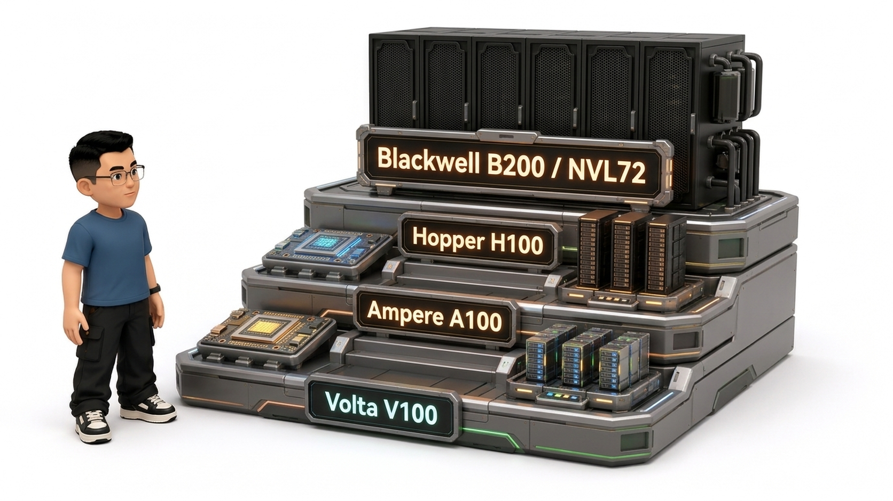
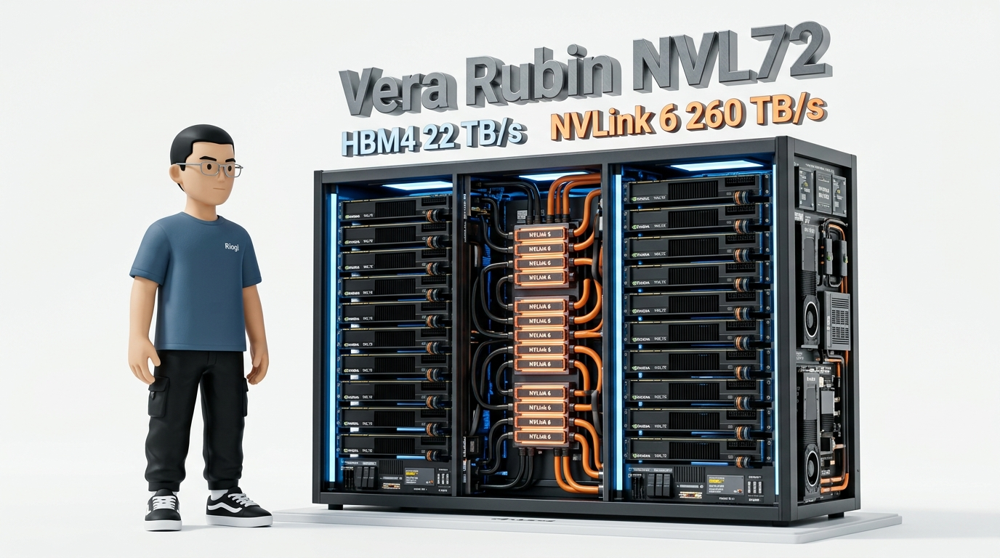
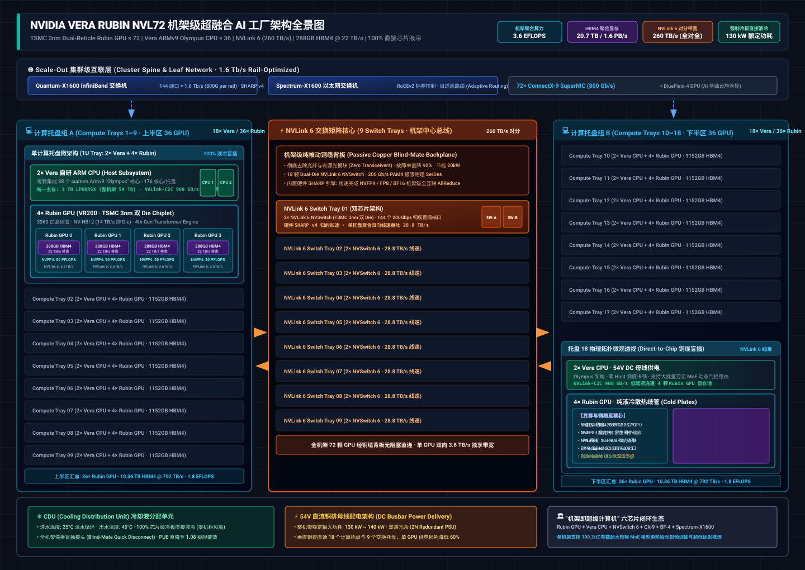
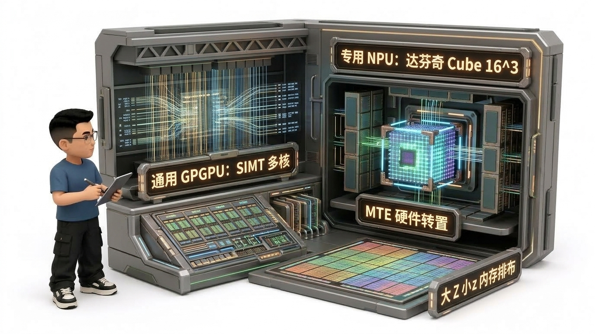
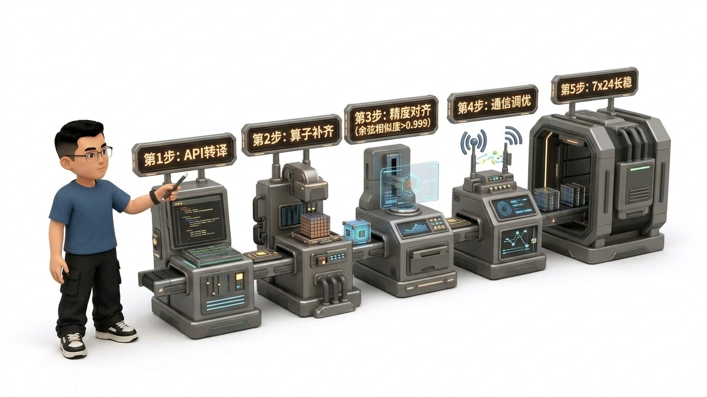
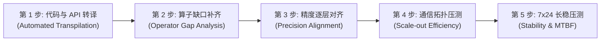

# 🏛️ 第21讲：算力战国的诸神黄昏——GPU 硬件全景与多元异构算力（NVIDIA 代际演进、GPGPU vs 专用 NPU 脉动阵列、国产芯片生态格局与一云多芯选型攻坚）

> **主讲人**：👓 **Ringi**（大厂 AI Infrastructure 工程师）  
> **所属模块**：[Module 01: GPU 硬件架构、数据搬运、集群通信与 Overlap](./README.md)  
> **篇章范式**：🌐 硬件全景与产业生态篇（Hardware Landscape & Heterogeneous Computing Paradigm）  
> **核心导读**：  
> 曾经很长一段时间，AI Infra 领域被普遍认为是一个“纯 CUDA 的世界”——只要精通 NVIDIA 的 SM 架构、掌握 Tensor Core 指令、调通 NCCL 拓扑，就能走遍天下无敌手。  
> 然而今天，时代的洪流彻底打破了这一单一范式：**在大国科技博弈、地缘政治风险以及算力供应链多元化的双重重构下，多元异构计算与自主可控已经从“选修课”变成了每一位一线工程师的“生死必修课”！**  
> **从 V100、A100、H100、Blackwell 到最新一代的 Vera Rubin NVL72，NVIDIA 是如何凭借 Tensor Core、Transformer Engine、TMA 异步搬运、微观 NVFP4/FP2 与 260 TB/s 无源铜缆机架互联构筑起坚不可摧的技术铁王座的？华为昇腾（Ascend 910B/910C）、海光 DCU、寒武纪、沐曦、摩尔线程等国产芯片的技术路线有何根本分歧？为什么说“通用 GPGPU 的 SIMT 范式”与“华为达芬奇 NPU 的 Cube 三维立体矩阵”代表着两条完全不同的微架构哲学？在真实的政企智算中心中，如何将数以万计的复杂 CUDA 算子平稳迁移至国产芯片？“一云多芯”平台究竟该如何规划，才能避免把千卡训练变成灾难性的“巴别塔”？**  
> 作为 Module 01 的压轴收官之战，本讲我们将带你站在计算机体系结构的第一性原理高度，以纯客观、纯工程的视角，深度俯瞰全球与国产 AI 算力的宏伟全景！


```text
=================================================================================================
                                   Ringi 3D 架构工坊 · 核心全景
┌───────────────────────────────────────────────────────────────────────────────────────────────┐
│ [Global & Domestic Heterogeneous AI Compute Ecosystem]                                        │
│                                                                                               │
│  【NVIDIA 代际演进编年史 (The Green Empire)】                                                 │
│    Volta (V100) ──► Ampere (A100) ──► Hopper (H100) ──► Blackwell (B200) ──► Vera Rubin(NVL72)│
│    · 1st TensorCore · 3rd TC (TF32/BF16)· 4th TC (FP8 TE) · 2nd TE (Micro-FP4)· 4th TE (NVFP4)│
│    · NVLink 2 (300G)· NVLink 3 (600G) · NVLink 4 (900G) · NVLink 5 (1.8T)    · NVLink 6 (3.6T)│
│    · HBM2 (900GB/s) · HBM2e (2.0TB/s) · HBM3 (3.35TB/s) · HBM3e (8.0TB/s)    · HBM4 (22.0TB/s)│
│                                                                                               │
│  【计算微架构两极对决 (SIMT GPGPU vs DSA NPU)】                                               │
│    ┌────────────────────────────────────────┐ ┌─────────────────────────────────────────────┐ │
│    │   通用 GPGPU (NVIDIA / 海光 / 沐曦)    │ │   专用 NPU 达芬奇架构 (华为昇腾 Ascend)     │ │
│    │   • 核心机制: SIMT + Warp 调度器       │ │   • 核心机制: DSA 领域专用架构              │ │
│    │   • 矩阵计算: Tensor Core 细粒度 MMA   │ │   • 矩阵计算: Cube 3D 矩阵立方体 (16^3=4096)│ │
│    │   • 内存布局: 行主序 / 列主序通用布局  │ │   • 内存布局: "大 Z 小 z" 与 "大 Z 小 N"    │ │
│    │   • 核心优势: 通用性极强、编程灵活     │ │   • 核心优势: GEMM 能效比极高、硬件转置 MTE │ │
│    └────────────────────────────────────────┘ └─────────────────────────────────────────────┘ │
├───────────────────────────────────────────────────────────────────────────────────────────────┤
│  【国产 AI 算力四大阵营与一云多芯战法】                                                       │
│    1. 领军旗舰·自主 NPU  : 华为昇腾 (910B/910C) ──► CANN 软件栈 + Ascend C + HCCL + Torch-NPU │
│    2. 类 ROCm·通用 GPGPU : 海光 DCU (深算一/二/三号) ──► DTK 软件栈 (兼容 HIP/ROCm) + hipify   │
│    3. 原创自研微架构     : 寒武纪 (MLU590/370) ──► Neuware + BANG C + CNCL 集合通信          │
│    4. 独立通用 GPGPU 创新: 沐曦 (曦云 C500/C800) + 摩尔线程 (夸娥 S4000/MUSA)                │
│    ★ 一云多芯四大铁律: 同任务内部绝对同构 | 物理节点分池隔离 | K8s 统一控制面 | 容器运行时分栈│
└───────────────────────────────────────────────────────────────────────────────────────────────┘
=================================================================================================
```

<!-- more -->

## 📑 目录导航

- [0. Ringi 开场：生产真实现场与痛点冲突](#0-ringi-开场生产真实现场与痛点冲突)
  - [0.1 真实工程矛盾：从“言必称 CUDA”到“多元异构与一云多芯”的现实阵痛](#01-真实工程矛盾从言必称-cuda到多元异构与一云多芯的现实阵痛)
  - [0.2 线上真实事故复盘：某政企项目单任务混插不同架构芯片导致通信死锁与 Loss 爆炸的惨痛教训](#02-线上真实事故复盘某政企项目单任务混插不同架构芯片导致通信死锁与-loss-爆炸的惨痛教训)
  - [0.3 全球与国产 AI 算力生态全景映射速查表](#03-全球与国产-ai-算力生态全景映射速查表)
- [1. 帝国的铁王座：NVIDIA 五代旗舰 GPU 架构演进全解（Volta $\to$ Vera Rubin）](#1-帝国的铁王座nvidia-五代旗舰-gpu-架构演进全解volta-to-vera-rubin)
  - [1.1 Volta (V100): 第一代 Tensor Core 诞生与独立线程调度（Independent Thread Scheduling）](#11-volta-v100-第一代-tensor-core-诞生与独立线程调度independent-thread-scheduling)
  - [1.2 Ampere (A100): TF32/BF16 格式、2:4 结构化稀疏与硬件级 MIG 物理切分](#12-ampere-a100-tf32bf16-格式24-结构化稀疏与硬件级-mig-物理切分)
  - [1.3 Hopper (H100): 第四代 Tensor Core、Transformer Engine (动态 FP8) 与 TMA 异步硬件搬运](#13-hopper-h100-第四代-tensor-coretransformer-engine-动态-fp8-与-tma-异步硬件搬运)
  - [1.4 Blackwell (B200 / GB200): 双 Die Chiplet 封装、微观 FP4 精度与 NVL72 机架级全互联铜缆革命](#14-blackwell-b200--gb200-双-die-chiplet-封装微观-fp4-精度与-nvl72-机架级全互联铜缆革命)
  - [1.5 Vera Rubin (VR200 / NVL72): HBM4 显存跃迁、NVLink 6 全互联与六芯片 AI 工厂超融合平台](#15-vera-rubin-vr200--nvl72-hbm4-显存跃迁nvlink-6-全互联与六芯片-ai-工厂超融合平台)
  - [1.6 NVIDIA 五代旗舰数据中心卡硬核参数大横评（标准 GFM 表格）](#16-nvidia-五代旗舰数据中心卡硬核参数大横评标准-gfm-表格)
- [2. 算力微架构两极：通用 GPGPU vs 专用 NPU 达芬奇/脉动阵列](#2-算力微架构两极通用-gpgpu-vs-专用-npu-达芬奇脉动阵列)
  - [2.1 GPGPU 流派：通用多核 SIMT 并行、Warp 调度与细粒度缓存体系](#21-gpgpu-流派通用多核-simt-并行warp-调度与细粒度缓存体系)
  - [2.2 NPU 达芬奇流派：特定域架构（DSA）、Cube 三维矩阵立方体与多级独立流水线](#22-npu-达芬奇流派特定域架构dsa-cube-三维矩阵立方体与多级独立流水线)
  - [2.3 数据排布与内存访问的物理差异：“大 Z 小 z”与“大 Z 小 N”排布 vs GPGPU 行列主序](#23-数据排布与内存访问的物理差异大-z-小-z与大-z-小-n排布-vs-gpgpu-行列主序)
- [3. 诸神黄昏：国产 AI 芯片四大阵营深度横评](#3-诸神黄昏国产-ai-芯片四大阵营深度横评)
  - [3.1 领军旗舰·自主 NPU 阵营：华为昇腾（Ascend 910B/910C、Atlas 集群、HCCS、CANN 8.0 与 Ascend C）](#31-领军旗舰自主-npu-阵营华为昇腾ascend-910b910catlas-集群hccscann-80-与-ascend-c)
  - [3.2 类 ROCm·通用 GPGPU 阵营：海光 DCU（深算系列、全精度支持、DTK 软件栈与 hipify 平滑迁移）](#32-类-rocm通用-gpgpu-阵营海光-dcu深算系列全精度支持dtk-软件栈与-hipify-平滑迁移)
  - [3.3 原创自研微架构阵营：寒武纪（思元 370/590、MLUv 指令集、Chiplet 芯粒与 BANG 语言）](#33-原创自研微架构阵营寒武纪思元-370590mluv-指令集chiplet-芯粒与-bang-语言)
  - [3.4 独立通用 GPGPU 创新阵营：沐曦（MetaX 曦云 C500/C800）与摩尔线程（夸娥 MTT S4000/MUSA）](#34-独立通用-gpgpu-创新阵营沐曦metax-曦云-c500c800与摩尔线程夸娥-mtt-s4000musa)
  - [3.5 产业生态补充：壁仞科技（BR100）、昆仑芯（XPU）与天数智芯（天垓 100）](#35-产业生态补充壁仞科技br100昆仑芯xpu与天数智芯天垓-100)
- [4. 全球主流 AI 芯片核心技术规格大横评（硬核全量对照表）](#4-全球主流-ai-芯片核心技术规格大横评硬核全量对照表)
- [5. 实操攻坚手册：国产算力异构迁移五步工程方法论](#5-实操攻坚手册国产算力异构迁移五步工程方法论)
  - [5.1 第 1 步：代码与 API 自动化转译（API Transpilation）](#51-第-1-步代码与-api-自动化转译api-transpilation)
  - [5.2 第 2 步：算子覆盖率摸底与自定义算子补齐（Operator Gap Analysis & Custom Kernel）](#52-第-2-步算子覆盖率摸底与自定义算子补齐operator-gap-analysis--custom-kernel)
  - [5.3 第 3 步：数值精度双机对齐（Numerical Precision Alignment & Cosine Similarity）](#53-第-3-步数值精度双机对齐numerical-precision-alignment--cosine-similarity)
  - [5.4 第 4 步：机内与多机集合通信与拓扑调优（Scale-out Efficiency）](#54-第-4-步机内与多机集合通信与拓扑调优scale-out-efficiency)
  - [5.5 第 5 步：7x24 稳定性长稳压测与生产上线（MTBF & Reliability）](#55-第-5-步7x24-稳定性长稳压测与生产上线mtbf--reliability)
- [6. 智算中心大杀器：“一云多芯”混合算力平台架构落地准则](#6-智算中心大杀器一云多芯混合算力平台架构落地准则)
  - [6.1 为什么混插是灾难？同任务内部物理同构铁律（Homogeneous within Job）](#61-为什么混插是灾难同任务内部物理同构铁律homogeneous-within-job)
  - [6.2 物理节点分池治理（Physical Pool Isolation）](#62-物理节点分池治理physical-pool-isolation)
  - [6.3 统一云原生调度平台（Unified Control Plane: K8s Device Plugins + HAMi/Volcano）](#63-统一云原生调度平台unified-control-plane-k8s-device-plugins--hamivolcano)
  - [6.4 容器镜像与运行时分栈解耦（Runtime Separation）](#64-容器镜像与运行时分栈解耦runtime-separation)
- [7. 动手实战与代码实验室（Minimal Runnable Code）](#7-动手实战与代码实验室minimal-runnable-code)
  - [7.1 实验 1：NVIDIA 旗舰架构代际演进与 Roofline 算力转折点演变计算](#71-实验-1nvidia-旗舰架构代际演进与-roofline-算力转折点演变计算)
  - [7.2 实验 2：华为昇腾达芬奇 Cube（ $16^3$ ）分块与“大 Z 小 z”内存排布仿真器](#72-实验-2华为昇腾达芬奇-cube163分块与大-z-小-z内存排布仿真器)
  - [7.3 实验 3：跨芯片异构算子精度双机对齐与余弦相似度检验器](#73-实验-3跨芯片异构算子精度双机对齐与余弦相似度检验器)
  - [7.4 实验 4：“一云多芯” Kubernetes 异构节点池调度与亲和性匹配仿真器](#74-实验-4一云多芯-kubernetes-异构节点池调度与亲和性匹配仿真器)
- [8. Ringi 避坑指南与生产性能工程黄金 Checklist](#8-ringi-避坑指南与生产性能工程黄金-checklist)
  - [8.1 避坑表格（❌ 常见小白误区 vs ✅ 大厂 AI Infra 正解）](#81-避坑表格-常见小白误区-vs--大厂-ai-infra-正解)
  - [8.2 生产国产化迁移与一云多芯黄金十条 Checklist](#82-生产国产化迁移与一云多芯黄金十条-checklist)
- [9. Ringi 5 点核心速记口诀、自我检验清单与课后深度思考题](#9-ringi-5-点核心速记口诀自我检验清单与课后深度思考题)
  - [9.1 5 点押韵核心速记口诀](#91-5-点押韵核心速记口诀)
  - [9.2 10 条白板自我检验清单](#92-10-条白板自我检验清单)
  - [9.3 3 道高阶开放式课后思考题（含极端 Corner Case）](#93-3-道高阶开放式课后思考题含极端-corner-case)
- [10. 📚 参考资料与核心源码/经典论文指引](#10--参考资料与核心源码经典论文指引)
- [附录：Appendix A — 大厂硬核高频面试题与白板推导（Interview Drill）](#附录appendix-a--大厂硬核高频面试题与白板推导interview-drill)
  - [Drill 1：白板深度对比 NVIDIA Tensor Core 与华为昇腾 DaVinci Cube 的硬件计算与访存机制异同](#drill-1白板深度对比-nvidia-tensor-core-与华为昇腾-davinci-cube-的硬件计算与访存机制异同)
  - [Drill 2：模型迁移至国产芯片后发生 Loss 震荡甚至梯度爆炸，如何在 30 分钟内定位根因？](#drill-2模型迁移至国产芯片后发生-loss-震荡甚至梯度爆炸如何在-30-分钟内定位根因)
  - [Drill 3：设计一套支持 NVIDIA、华为昇腾与海光 DCU 的“一云多芯”智算调度架构方案](#drill-3设计一套支持-nvidia华为昇腾与海光-dcu-的一云多芯智算调度架构方案)

---

# 0. Ringi 开场：生产真实现场与痛点冲突

## 0.1 真实工程矛盾：从“言必称 CUDA”到“多元异构与一云多芯”的现实阵痛

在过去十年的深度学习黄金时代中，AI Infra 工程师享受了前所未有的“生态红利”：  
底层有 NVIDIA 每年刷新性能上限的旗舰芯片，中间有 CUDA、cuDNN、NCCL 构筑的无缝开发运行时，上层有 PyTorch、TensorFlow、Megatron-LM 等几乎 100% 围绕 CUDA 原生定制的开源算法框架。在这一时期，优化算子意味着写 CUDA C++ 或 Triton，优化通信意味着调优 NCCL Ring 参数。

然而，在当前的产业现实下，这一舒适区被彻底瓦解了：
1. **供应链断供与限售**：前沿制程的高端 GPU（A100、H100、B200 等）受到严苛管制，采购与扩容面临刚性天花板；
2. **政企与信创要求**：金融、能源、政务、运营商等重点行业在建设千卡/万卡智算中心时，对“自主可控与国产化芯片采购比例”提出了明确的硬性指标；
3. **百花齐放但碎片化的国产芯片格局**：华为昇腾（Ascend）、海光 DCU、寒武纪 MLU、沐曦、摩尔线程、壁仞、昆仑芯、天数智芯……十余家芯片厂商各自拥有不同的指令集、不同的微架构和不同的软件栈。

```text
生产真实对峙现场：
[业务研发总监]: "下周必须把这批千亿参数模型在昇腾 910B 和海光 DCU 集群上跑起来，
                 而且训练精度和收敛曲线必须和 A100 严格对齐！"
[初级算法同学]: "打开代码一看，全栈充斥着 Triton Kernel、CUDA 扩展和 FlashAttention-2，
                 在国产卡上一编译报了上千个 Undefined Symbol，改都不知从何改起！"
[智算平台架构师]: "机房里塞满了 NVIDIA、华为和海光三种机器，算法总想把一个 64 卡训练任务跨厂商混着跑，
                   结果集合通信直接死锁，监控指标根本不互通！"
```

---

## 0.2 线上真实事故复盘：某政企项目单任务混插不同架构芯片导致通信死锁与 Loss 爆炸的惨痛教训

某智慧金融团队在一次千亿大模型预训练启动阶段，遭遇了一次灾难级的“混插翻车事故”：

为了凑齐 128 张卡的算力配额，该团队在私有云调度平台上将 64 张某品牌通用 GPGPU 与 64 张专用 NPU 节点划入了同一个 PyTorch 分布式任务中，企图通过跨机以太网建立统一的分布式 Ring。

```text
追凶全链路时序还原：
1. 算力不对齐诱发通信雪崩：
   GPGPU 单卡前向耗时 42ms，NPU 单卡前向耗时 71ms；
   在数据并行（DP）的全量 AllReduce 屏障前，64 张 GPGPU 在每次迭代都被迫死等 NPU 达 29ms，
   集群整体 MFU 直接从原本预期的 46% 断崖式跌落至 18%！
2. 集合通信协议栈硬性冲突：
   GPGPU 侧采用 NCCL 基于 CUDA IPC 与 RoCE 构建 Ring，NPU 侧采用专属通信库；
   在通过统一框架适配层强行打通通信后，由于双方底层浮点累加器精度规范（Rounding Mode）微小差异，
   导致跨机规约后的梯度出现了微弱的非对称漂移；
3. 灾难终局：
   训练运行至第 1,200 个 Step 时，累积的浮点截断误差诱发激活值异常溢出，
   Loss 曲线在没有任何预警的情况下突然打满 NaN，整整 3 天的训练进度彻底报废！
```

**血的教训凝结为工业界第一铁律：分布式大模型训练任务内部，严禁跨不同厂商混插异构芯片！**

---

## 0.3 全球与国产 AI 算力生态全景映射速查表

为帮助工程师迅速建立宏观产业沙盘，我们将全球与国产主流算力芯片划分为四大阵营：

| 算力阵营分类 | 核心代表厂商与芯片型号 | 底层硬件微架构特征 | 专属软件栈与编程生态 | 核心适用业务场景 | 工业生态成熟度评级 |
| :--- | :--- | :--- | :--- | :--- | :---: |
| **全球垄断旗舰** | **NVIDIA** (V100/A100/H100/B200) | 通用 SIMT GPGPU + Tensor Core | **CUDA** / cuDNN / NCCL / TensorRT | 前沿预训练、前沿算法验证、顶会科研 | ⭐️⭐️⭐️⭐️⭐️ (绝对统治) |
| **自主 NPU 领军** | **华为昇腾** (Ascend 910B / 910C) | 达芬奇特定域架构 (DSA) 脉动 Cube | **CANN** / Ascend C / HCCL / MindIE | 万卡集群预训练、政企信创大模型落地 | ⭐️⭐️⭐️⭐️半 (国产领军) |
| **类 ROCm GPGPU** | **海光 DCU** (深算一号 / 二号 / 三号) | 兼容开源体系的标准 GPGPU (原生全精度) | **DTK** / HIP / hipify 一键转译 | 现有 CUDA 代码极低成本平滑迁移、科学计算 | ⭐️⭐️⭐️⭐️ (兼容极平滑) |
| **原创自研指令集** | **寒武纪** (思元 MLU370 / 590) | 自主研发 MLUv 指令集架构 + Chiplet | **Neuware** / BANG C / CNCL / MagicMind | 多模态大模型、高并发视觉与语音推理 | ⭐️⭐️⭐️半 (自主可控) |
| **全功能 GPGPU** | **沐曦** (C500/C800)<br>**摩尔线程** (S3000/S4000) | 自主设计通用 GPGPU，兼顾渲染与 AI | **MXMACA** (沐曦)<br>**MUSA** (摩尔线程) | 智算中心预训练与推理、云游戏、数字孪生 | ⭐️⭐️⭐️ (迅速上升期) |

---

# 1. 帝国的铁王座：NVIDIA 五代旗舰 GPU 架构演进全解（Volta $\to$ Vera Rubin）

回顾过去近十年现代 AI 的诞生与爆发，实质上就是 NVIDIA 数据中心 GPU 架构自我革新的技术史：



```text
┌─────────────────────────────────────────────────────────────────────────┐
│                 NVIDIA 旗舰数据中心微架构五代演进史阶梯                 │
├─────────────────────────────────────────────────────────────────────────┤
│                                                                         │
│  【Volta (V100 - 2017)】: 奠定 AI 硬件专用化基石                         │
│    • 核心突破: 首创【第 1 代 Tensor Core】，将 4x4x4 矩阵乘加固化为硬件指令 │
│    • 体系结构: 引入【独立线程调度】(Independent Thread Scheduling)，解除 Warp 隐式同步锁
│    • 互联互通: NVLink 2.0 (单卡 300 GB/s) + HBM2 (900 GB/s)              │
│                                │                                        │
│                                ▼                                        │
│  【Ampere (A100 - 2020)】: 工业级大模型预训练一代经典                   │
│    • 核心突破: 【第 3 代 Tensor Core】，首创 TF32 格式与 BF16 原生硬件支持 │
│    • 硬件黑科技: 【2:4 结构化稀疏】(算力翻倍)、【硬件级 MIG】(物理切分 7 实例)│
│    • 互联互通: NVLink 3.0 (单卡 600 GB/s) + HBM2e (2.0 TB/s)            │
│                                │                                        │
│                                ▼                                        │
│  【Hopper (H100 - 2022)】: 万卡大模型预训练的绝对霸主                   │
│    • 核心突破: 【Transformer Engine】(动态 FP8 量化)、【TMA 异步搬运加速器】│
│    • 体系结构: Thread Block Cluster (分布式共享内存 DSMEM)、DPX 动态规划指令 │
│    • 互联互通: NVLink 4.0 (单卡 900 GB/s, NVLS 多播) + HBM3 (3.35 TB/s)   │
│                                │                                        │
│                                ▼                                        │
│  【Blackwell (B200/GB200 - 2024)】: 机架级超算革命与微观量化时代        │
│    • 核心突破: 突破单芯片光刻极限，【双 Die Chiplet】(10 TB/s NV-HBI 互联) │
│    • 体系结构: 【第 2 代 Transformer Engine】(微观 FP4 精度)、硬件解压缩引擎│
│    • 互联互通: NVLink 5.0 (单卡 1800 GB/s) + 【NVL72 机架级铜缆液冷互联】   │
│                                │                                        │
│                                ▼                                        │
│  【Vera Rubin (VR200/NVL72 - 2026)】: 六芯片 AI 工厂超融合与 HBM4 狂暴跃迁│
│    • 核心突破: 3nm 双 Die 极限封装 (3360 亿晶体管)、【8 堆栈 HBM4】(22 TB/s 带宽)│
│    • 体系结构: 【第 4 代 Transformer Engine】(原生 NVFP4/FP3/FP2)、Vera ARM CPU│
│    • 互联互通: NVLink 6.0 (单卡 3.6 TB/s) + 【NVL72 机架 260 TB/s 无源铜缆背板】│
└─────────────────────────────────────────────────────────────────────────┘
```

---

## 1.1 Volta (V100): 第一代 Tensor Core 诞生与独立线程调度（Independent Thread Scheduling）

2017 年发布的 Volta 架构是现代 AI 硬件的真正起点：
1. **第一代 Tensor Core**：在传统 CUDA Core 逐元素计算之外，开辟了专职处理矩阵乘加的硬件阵列。单指令执行 $D = A \times B + C$（输入 FP16 矩阵，累加至 FP32），将半精度计算吞吐直接拉高了 **5 倍**；
2. **独立线程调度（Independent Thread Scheduling）**：在 Volta 之前（Pascal 及更早），同一个 Warp 内的 32 个线程共享同一个程序计数器（PC），一旦发生 `if-else` 分支分歧，线程必须串行交替执行。Volta 为每个线程引入了独立的 PC 和调用栈，使分支预测与并发同步的灵活性呈几何级提升。

---

## 1.2 Ampere (A100): TF32/BF16 格式、2:4 结构化稀疏与硬件级 MIG 物理切分

2020 年发布的 Ampere 架构奠定了整个大模型时代的工业基准：
1. **TF32 数据格式**：保持 FP32 的动态范围（8-bit 指数位），同时拥有 FP16 的计算吞吐（10-bit 尾数位），开发者无需修改任何代码即可获得近 3 倍的免调试算力加速；
2. **2:4 结构化稀疏（Fine-Grained Structured Sparsity）**：硬件原生支持每 4 个连续元素中至少有 2 个为 0 的矩阵压缩。Tensor Core 自动跳过无效计算，直接将算力吞吐从 312 TFLOPS 翻倍至 **624 TFLOPS**；
3. **MIG（Multi-Instance GPU）硬件切分**：打破以往只能软件时间片切分的缺陷，单张 A100 可物理划分为最多 7 个相互在 SM、显存通道与缓存上完全物理隔离的独立 GPU 实例，开启了高密安全推理的工业先河。

---

## 1.3 Hopper (H100): 第四代 Tensor Core、Transformer Engine (动态 FP8) 与 TMA 异步硬件搬运

2022 年发布的 Hopper 架构是专为 Transformer 量身打造的工程巅峰：
1. **Transformer Engine（TE 动态 FP8）**：引入 E4M3 和 E5M2 两种 FP8 格式，软件配合硬件在每层计算中动态追踪数值范围（Dynamic Range），自动在 FP16 与 FP8 之间无损切换，显存占用砍半，GEMM 吞吐再次暴涨 **2 倍**；
2. **TMA（Tensor Memory Accelerator）硬件异步搬运**：将张量切片在全局显存（Global Memory）与共享内存（Shared Memory）之间的搬运完全卸载给专有硬件引擎，不再占用任何 SM 寄存器与指令发射槽，彻底解放了计算单元；
3. **Thread Block Cluster 与 DSMEM**：允许跨 SM 直接访问邻居 SM 的 Shared Memory，配合硬件级 `mbarrier` 实现超低时延协同。

---

## 1.4 Blackwell (B200 / GB200): 双 Die Chiplet 封装、微观 FP4 精度与 NVL72 机架级全互联铜缆革命

2024 年推出的 Blackwell 架构标志着单芯片扩展走到了尽头，AI 算力全面迈向“机架即计算机”时代：
1. **双 Die Chiplet 封装**：单颗芯片集成 2080 亿晶体管，通过 10 TB/s 的 NV-HBI（High-Bandwidth Interface）将两颗 Die 紧密缝合成一个统一的逻辑 GPU，缓存与内存完全一致；
2. **第二代 Transformer Engine 与微观 FP4**：支持精细化的块缩放（Block Scaling）FP4 精度，在保持甚至逼近 FP16 困惑度（PPL）的前提下，将密集大模型推理算力提升至惊人的 **9,000 TFLOPS**；
3. **NVL72 机架级超大规模铜缆互联**：彻底颠覆传统的服务器机框界限。整机架 72 颗 Blackwell GPU 通过纯被动式铜缆（Direct-Attach Copper）与 18 个双 Die NVSwitch 全部硬连在一起，整机架双向对分带宽达到 **130 TB/s**，单机架可直接承载万亿参数 MoE 模型的全内存驻留！

---

## 1.5 Vera Rubin (VR200 / NVL72): HBM4 显存跃迁、NVLink 6 全互联与六芯片 AI 工厂超融合平台

2026 年震撼问世的 **Vera Rubin 架构（NVL72 平台）**，标志着 AI 计算彻底突破了摩尔定律的物理桎梏，完成了从“单卡加速器”到“六芯片深度协同、机架即超级计算机（The Rack is the Computer）”的划时代质变：



### 1. 六芯片一体化超融合 AI 工厂（The Six-Chip AI Factory Platform）
Rubin NVL72 平台不再是单纯的 GPU 堆叠，而是由 **6 颗顶级自研专用芯片** 深度协同构建的超融合计算集群：
1. **Rubin GPU (VR200)**：承担极端并行的 Tensor / GEMM 矩阵计算与注意力机制加速；
2. **Vera CPU**：承担大模型推理动态路由、超长 Context 编排、数据预处理与 Host 调度；
3. **NVLink 6 NVSwitch**：承担全机架 72 颗 GPU 之间的全对全（All-to-All）线速拓扑路由；
4. **ConnectX-9 SuperNIC**：单端口 800 Gb/s 线速，承担跨机架 Scale-Out 极速 RDMA 互联；
5. **BlueField-4 DPU**：承担智算中心网络卸载、零信任安全加固与多租户存储虚拟化；
6. **Spectrum-X1600 / Quantum-X1600**：双模 1.6T 交换芯片，构建千万卡级 AI 智算工厂主干网络。

### 2. 台积电 3nm（N3P）与 3360 亿晶体管极限双 Die 拓扑
单颗 Rubin GPU 采用台积电 3nm（TSMC N3P）先进制程，晶体管总规模突破惊人的 **3,360 亿个**。芯片通过第二代超高带宽接口 **NV-HBI 2（线速超过 14 TB/s）** 将两颗全曝光极限尺寸（Full Reticle Size）的 Die 紧密集成，在微架构层面呈现完全统一的 L2 缓存池与连续物理内存编址，彻底规避任何非一致性 NUMA 延迟损耗。

### 3. HBM4 显存架构革命：2048-bit 超宽接口与 22 TB/s 狂暴带宽
大模型推理尤其是 MoE 架构与超长上下文（Long-Context Attention）受限于“显存墙（Memory Wall）”。Rubin 架构在显存物理层实现了跨代跃迁：
- **接口位宽翻倍**：打破传统 1024-bit 总线极限，采用 **2048-bit 超宽 Base-Die 物理互联通道**；
- **8 堆栈 HBM4 高密集成**：单张 Rubin GPU 搭载 8 颗最新制程的 **HBM4 堆栈**，单卡显存容量飙升至 **288 GB**；
- **显存带宽跃迁至 22 TB/s**：单卡有效物理显存带宽达到 **22.0 TB/s**，相比 Blackwell 的 8.0 TB/s 暴涨 **近 3 倍**（相比 Hopper 的 3.35 TB/s 暴涨近 7 倍！）；
- **机架级显存池化**：单台 NVL72 机架聚合了高达 **20.7 TB 的 HBM4 超高速显存**，机架聚合物理显存带宽突破 **1.6 PB/s (1,584 TB/s)**，使万亿参数 MoE 模型的全量权重与超大 KV Cache 能够以零带宽挤压的状态进行常驻推理！

### 4. 第四代 Transformer Engine 与微精度算力矩阵（NVFP4 / NVFP3 / NVFP2）
- **多精度原生硬件加速**：内置全新的第 4 代 Transformer Engine，原生硬解 **NVFP4、微观 3-bit (NVFP3) 乃至 2-bit (NVFP2)** 浮点格式；
- **自适应块缩放（Fine-Grained Vector/Block Scaling）**：每个包含 16 或 32 个权重的微子块均拥有独立的动态指数缩放因子，在将模型推理显存与传输开销砍半的同时，彻底消除量化精度损失；
- **算力狂飙**：单张 Rubin GPU 可输出高达 **20 PFLOPS (20,000 TFLOPS)** 的 NVFP4 稠密算力与 **5,000 TFLOPS** 的 FP16/BF16 稠密算力；整机架 72 颗 GPU 聚合输出高达 **3.6 EFLOPS (3,600 PFLOPS)** 的 NVFP4 密集推理算力和 **2.5 EFLOPS** 的训练算力！

### 5. NVLink 6 与 260 TB/s 机架对分全互联铜缆总线
机内总线直接决定了张量并行（TP）与专家并行（EP）的扩展极限：
- **单卡 3.6 TB/s 极速总线**：NVLink 6 采用 200 Gb/s PAM4 极速 SerDes，单张 Rubin GPU 双向对分带宽达到 **3.6 TB/s**（相当于 36 条 800G 网络线缆的聚合吞吐）；
- **9 组中央交换托盘（Switch Trays）**：机架正中央布置 9 组无源盲插 NVLink 6 Switch Tray（内嵌 18 颗 Dual-Die NVSwitch 6 芯片），整机架 72 颗 Rubin GPU 实现严格意义上的 **全对全（All-to-All）单跳无阻塞互联**；
- **机架级 260 TB/s 对分带宽**：整机架双向对分带宽突破 **260 TB/s**，是 Blackwell NVL72（130 TB/s）的整整 **2 倍**；
- **纯被动铜缆盲插背板（Passive Copper Blind-Mate Backplane）**：机架后背彻底淘汰一切光纤跳线与光模块（Zero Transceivers），全部采用定制微同轴电缆（Over-the-Surface Micro-Coax）与高精盲插接头，不仅消除光模块故障点使失效率降低 90%，而且单个机架直接节省超过 20 kW 的有源光电转换功耗；
- **SHARP v4 硬件网内计算**：NVSwitch 内部固化第四代 SHARP 归约引擎，线速完成 NVFP4 / FP8 / BF16 机架级 AllReduce，将通信时延压至纳秒级。

### 6. 自研 Vera ARM CPU 与 54 TB 统一主存
- **88 核定制 Olympus 架构**：整机架配备 18 块计算托盘，每托盘集成 2 颗自研 Vera CPU（共 36 颗 CPU、3,168 个自研 ARMv9 Olympus 物理核心）；
- **54 TB 统一主存池**：全机架配备 54 TB 超高速 LPDDR5X 统一内存，通过 900 GB/s 的 NVLink-C2C 高速总线与 Rubin GPU 显存完全打通，实现硬件级缓存一致性，彻底终结 CPU-GPU 之间跨 PCIe 的数据搬运死锁。

### 7. 完整机架级微架构拓扑图
为了直观呈现 Vera Rubin NVL72 的机架物理层、计算托盘层、中央 NVLink 交换层与供电液冷基础设施的垂直堆栈，下方给出完整的工业级全景架构拓扑：



---

## 1.6 NVIDIA 五代旗舰数据中心卡硬核参数大横评（标准 GFM 表格）

| 核心技术规格 | Volta (V100 SXM2) | Ampere (A100 SXM4) | Hopper (H100 SXM5) | Blackwell (B200 / GB200) | Vera Rubin (VR200 / NVL72) |
| :--- | :--- | :--- | :--- | :--- | :--- |
| **发布年份 / 工艺制程** | 2017 / TSMC 12nm FFN | 2020 / TSMC 7nm (N7) | 2022 / TSMC 4N定制 | 2024 / TSMC 4NP (双 Die) | **2026 / TSMC 3nm N3P (双 Die)** |
| **晶体管规模** | 211 亿 | 542 亿 | 800 亿 | 2,080 亿 | **3,360 亿** |
| **SM 核心数量** | 80 个 | 108 个 | 132 个 | 160 个 (全芯片) | **192 ~ 216 个 (全芯片)** |
| **FP32 标量单精度** | 15.7 TFLOPS | 19.5 TFLOPS | 67 TFLOPS | 90 TFLOPS | **140 TFLOPS** |
| **Dense FP16/BF16 算力**| 125 TFLOPS (FP16) | 312 TFLOPS (FP16/BF16) | 989 TFLOPS | 2,250 TFLOPS | **5,000 TFLOPS (5 PFLOPS)** |
| **Dense FP8 算力** | 不支持 | 不支持 | 1,978 TFLOPS | 4,500 TFLOPS | **10,000 TFLOPS (10 PFLOPS)** |
| **Dense FP4 算力** | 不支持 | 不支持 | 不支持 | 9,000 TFLOPS | **20,000 TFLOPS (20 PFLOPS)** |
| **显存规格与容量** | HBM2 / 32 GB | HBM2e / 80 GB | HBM3 / 80 GB | HBM3e / 192 GB | **HBM4 / 288 GB** |
| **显存物理线速带宽** | 900 GB/s | 2.0 TB/s | 3.35 TB/s | 8.0 TB/s | **22.0 TB/s (提升近 3 倍)** |
| **机内互联协议与带宽** | NVLink 2.0 (300 GB/s) | NVLink 3.0 (600 GB/s) | NVLink 4.0 (900 GB/s) | NVLink 5.0 (1800 GB/s) | **NVLink 6.0 (3600 GB/s / 3.6 TB/s)** |
| **机架级聚合对分带宽** | 无机架级盲插背板 | 无机架级盲插背板 | 57.6 TB/s (NVL32) | 130 TB/s (NVL72 铜缆背板) | **260 TB/s (NVL72 纯无源铜缆背板)** |
| **核心微架构创新** | 独立线程调度、第1代TC | TF32、2:4稀疏、MIG切分 | TMA异步搬运、FP8 TE、DPX | 微观FP4、双Die Chiplet、NVL72 | 六芯片超融合、HBM4 2048-bit接口、第4代TE (NVFP4/3/2)、Vera ARM CPU |
| **热设计功耗 (TDP)** | 300W (风冷) | 400W (风冷/液冷) | 700W (风冷极限/液冷) | 1000W ~ 1200W (强制液冷) | **1600W ~ 1800W (强制直接芯片液冷)** |

---

# 2. 算力微架构两极：通用 GPGPU vs 专用 NPU 达芬奇/脉动阵列

在底层硬件微架构哲学上，当今业界绝非千篇一律，而是分化出了两条截然相反的演进路线：



```text
=================================================================================================
                                   GPGPU 架构 vs NPU 达芬奇架构深度对比
┌───────────────────────────────────────────────────────────────────────────────────────────────┐
│  【通用 GPGPU 流派 (NVIDIA, 海光, 沐曦, 摩尔线程)】                                            │
│    • 指令级模型: SIMT (Single Instruction Multiple Threads)                                   │
│    • 控制逻辑: 极其庞大的 Warp 调度器、分层缓存 (L1/Shared/L2)、通用寄存器堆                  │
│    • 矩阵计算: Tensor Core 细粒度微块乘加 ($16 \times 8 \times 16$ MMA)                       │
│    • 编程模型: 显式线程网格 (Grid ➔ Block ➔ Thread)，支持任意非规则 C/C++ 动态控制流           │
│    • 优势/代价: 通用性极佳、生态庞大；但大量的芯片面积被通用调度与寄存器仲裁消耗              │
├───────────────────────────────────────────────────────────────────────────────────────────────┤
│  【专用 NPU 达芬奇流派 (华为昇腾 Ascend)】                                                     │
│    • 指令级模型: DSA (Domain Specific Architecture) 领域特定架构                              │
│    • 核心单元: 划分为三大功能明确的独立流水线:                                                │
│      ① Cube 单元: 3D 矩阵立方体 ($16 \times 16 \times 16 = 4096$ MACs 单条硬件指令全并发)     │
│      ② Vector 单元: 向量非线性激活流水线 (处理 Norm、Softmax、Activation)                     │
│      ③ Scalar 单元: 类似微型 CPU，负责程序流程控制与地址指针计算                             │
│    • 内存与格式: 硬件专用 MTE (Memory Transfer Engine) 单元，硬件固化 Img2Col 与转置         │
│      强制采用【大 Z 小 z】与【大 Z 小 N】特定切片排布                                         │
│    • 优势/代价: GEMM 峰值能效比极其惊人；但对编译器的自动调度能力与格式转换提出了极高挑战     │
└───────────────────────────────────────────────────────────────────────────────────────────────┘
=================================================================================================
```

---

## 2.1 GPGPU 流派：通用多核 SIMT 并行、Warp 调度与细粒度缓存体系

通用 GPGPU（以 NVIDIA、海光 DCU、沐曦、摩尔线程为代表）的技术核心可以概括为 **“以海量并发线程掩盖访存延迟”**：
- **执行模型**：开发者将逻辑切分为数以万计的 Threads。硬件以 32 个线程为一个 **Warp**，Warp Scheduler 在每个时钟周期调度就绪的 Warp 送入执行单元；
- **微架构代价**：为了支撑任意通用控制流，芯片上相当大比例的晶体管被分配给了通用寄存器堆（如 H100 单卡拥有数十 MB 寄存器）、分支预测器和多级高速缓存；
- **生态威力**：极强的通用性使得 GPGPU 能够迅速吃下任何新架构——无论是从 Transformer 到 Mamba/SSM，还是从 Dense 模型到 MoE 动态路由，只要写几行 CUDA/Triton 代码即可原生运行。

---

## 2.2 NPU 达芬奇流派：特定域架构（DSA）、Cube 三维矩阵立方体与多级独立流水线

华为昇腾所采用的 **达芬奇架构（DaVinci Architecture）**，是典型的 **DSA（Domain Specific Architecture）特定域架构**。它认为大模型 90% 以上的算力集中在矩阵乘法上，因此必须在硬件层面将矩阵计算做到极致：

### 1. 三大核心计算单元分立
- **Cube 单元（张量/矩阵核心）**：提供强大的三维矩阵乘加能力。其单条硬件指令即可并行完成两个 $16 \times 16$ 矩阵的相乘并累加，**一次性执行 $16 \times 16 \times 16 = 4096$ 次乘加运算（标记为 $16^3$，Cube 这一名称正来源于此）**；
- **Vector 单元（向量核心）**：专门处理一维向量运算，承接 LayerNorm、RMSNorm、Softmax、GELU 等非线性激活与归一化计算；
- **Scalar 单元（标量控制核心）**：相当于一个微型处理器，专职管理程序循环、条件分支以及为 Cube 和 Vector 计算内存地址。

### 2. MTE（Memory Transfer Engine）硬件存储转换单元
在深度学习中，特征图与权重的转置、以及卷积中的 Img2Col 转换，在 GPU 上通常需要调用专门的转置 Kernel 进行软件搬运，极其耗费显存带宽。达芬奇架构在片上固化了 **MTE 硬件单元**，数据从外部 HBM 搬运进内部片上缓冲区（L1 Buffer）的过程中，**由硬件电路在飞速流动中自动完成格式重排与转置，实现零软件开销的数据预处理！**

---

## 2.3 数据排布与内存访问的物理差异：“大 Z 小 z”与“大 Z 小 N”排布 vs GPGPU 行列主序

在通用 GPGPU 中，张量在显存中通常按照标准的行主序（Row-Major）或列主序（Column-Major）连续存放。

而在昇腾达芬奇架构中，为了配合 Cube 单元 $16 \times 16$ 矩阵的高速乘加，张量在显存中必须按照 **分块特定的数据排布格式（5D / Fractal 格式）** 进行组织：

```text
┌─────────────────────────────────────────────────────────────────────────┐
│                  达芬奇 Cube 分块内存排布机制剖析                       │
├─────────────────────────────────────────────────────────────────────────┤
│                                                                         │
│  【输入矩阵 A 的排布: 大 Z 小 z (Fractal Zz)】                          │
│    • "小 z": 每个 16x16 的子矩阵内部，数据按照行主序连续存储 (形态像小 z)│
│    • "大 Z": 所有的 16x16 子矩阵分块之间，也按照行优先顺序排列 (形态像大 Z) │
│                                                                         │
│  【输入矩阵 B 的排布: 大 Z 小 N (Fractal ZN)】                          │
│    • "小 N": 每个 16x16 的子矩阵内部，数据按照列主序存储 (形态像小字母 N)│
│    • "大 Z": 所有的 16x16 子矩阵分块之间，依然按照行优先顺序排列        │
│                                                                         │
│  【输出结果矩阵 C: 大 N 小 Z (Fractal NZ)】                             │
│    • 经过 Cube 硬件子电路一次性完成 16x16 乘加后，                      │
│      生成的分块矩阵天然呈现各个分块按列排、块内按行排的形态！          │
└─────────────────────────────────────────────────────────────────────────┘
```

**工程启示**：在开发底层算子（Ascend C）或迁移模型时，必须清晰感知数据在片上内存（L1 / L0A / L0B / L0C）中的搬运格式转换，否则会因频繁的数据重排带来严重的访存吞吐惩罚。

---

# 3. 诸神黄昏：国产 AI 芯片四大阵营深度横评

面对算力多元化的历史机遇，国产 AI 算力在过去五年实现了从“点状突破”到“全栈成型”的跨越：

---

## 3.1 领军旗舰·自主 NPU 阵营：华为昇腾（Ascend 910B/910C、Atlas 集群、HCCS、CANN 8.0 与 Ascend C）

作为国产 AI 算力事实上的领头羊，华为构建了从底层芯片、自研高速互联到上层框架的 **全栈闭环 AI 生态**：

```text
┌─────────────────────────────────────────────────────────────────────────┐
│                     华为昇腾全栈 AI 基础设施架构                        │
├─────────────────────────────────────────────────────────────────────────┤
│   [ 业务与模型 ] ──► Llama 3 / Qwen 2.5 / DeepSeek-V3 / 盘古大模型      │
│                                │                                        │
│   [ 训练与推理 ] ──► MindSpore / PyTorch (Torch-NPU) / MindIE 推理引擎  │
│                                │                                        │
│   [ 异构计算层 ] ──► CANN 8.0 (ACL 运行时 / 融合算子库 / 自动调优引擎) │
│                                │                                        │
│   [ 算子编程语言 ] ──► Ascend C (结构化 C/C++ 语法，多核并行调度)       │
│                                │                                        │
│   [ 集合通信库 ] ──► HCCL (Huawei Collective Communication Library)     │
│                                │                                        │
│   [ 硬件与服务器 ] ──► Atlas 800T A2 (单机8卡) / Atlas 900 A2 PoD 集群 │
│                                │                                        │
│   [ 芯片互联总线 ] ──► HCCS (Huawei Cache Coherent System, 392 GB/s)    │
│                                │                                        │
│   [ 芯片计算核心 ] ──► Ascend 910B/910C (达芬奇 Cube + Vector + Scalar) │
└─────────────────────────────────────────────────────────────────────────┘
```

- **主力硬件**：**Ascend 910B**（当前主力，稠密 FP16 算力约 320 TFLOPS，配备 64GB HBM2e）与下一代 **Ascend 910C**；
- **机内互联**：**HCCS（Huawei Cache Coherent System）** 实现了单机 8 卡全互联，双向带宽达 392 GB/s，对齐 NVIDIA NVLink；
- **CANN（Compute Architecture for Neural Networks）**：昇腾的软件基石。最新的 CANN 8.0 大幅强化了大模型图编译器优化、算子自动融合与动态 Shape 支持；
- **生态优势**：拥有全国最庞大的工程师团队与大模型适配经验，DeepSeek-V3、Qwen、Llama 等主流模型均具备官方原生的全流程训推套件。

---

## 3.2 类 ROCm·通用 GPGPU 阵营：海光 DCU（深算系列、全精度支持、DTK 软件栈与 hipify 平滑迁移）

海光 DCU（深算一号、深算二号、深算三号）是国产算力中 **CUDA 迁移成本最低、兼容性最平滑的一派**：
- **技术路线**：源自成熟的高性能 GPGPU 架构体系，采用标准 SIMT 编程范式，具备 **全精度原生计算能力**（支持 FP64 双精度、FP32、FP16、BF16 与 INT8）；
- **软件栈 DTK（DCU Toolkit）**：深度对齐开源的 **ROCm 与 HIP 编程模型**；
- **平滑迁移利器 `hipify`**：海光提供高度成熟的自动化代码转译工具链，能够将 95% 以上的 CUDA C++ 源码、驱动 API 与内联汇编一键替换为 HIP 对应符号；
- **核心竞争力**：对于拥有上百万行历史 CUDA 代码库的企业，或者需要兼顾科学计算（CFD 流体动力学、分子动力学等重度依赖 FP64 的场景）的智算中心，海光 DCU 是迁移摩擦力最小的选择。

---

## 3.3 原创自研微架构阵营：寒武纪（思元 370/590、MLUv 指令集、Chiplet 芯粒与 BANG 语言）

作为国内最早深耕专用 AI 芯片的领军企业，寒武纪始终坚持 **原创指令集与软硬件协同**：
- **主力型号**：**思元 370（MLU370）** 率先在国内商用 Chiplet 芯粒技术；**思元 590（MLU590）** 为面向大模型高性能训推一体的旗舰芯片；
- **微架构特色**：采用自主研发的 **MLUv 架构指令集**，在张量数据流控制、片上超低延迟缓存结构上独树一帜；
- **软件栈 Neuware**：提供底层的 **BANG C / BANG Python** 编程语言，配合 **CNCL（Cambricon Communication Library）** 分布式通信库与 **MagicMind** 高性能推理编译引擎；
- **生态亮点**：在智能语音、图像多模态解析以及垂直领域大模型的高吞吐低延迟推理场景下，能效比优势显著。

---

## 3.4 独立通用 GPGPU 创新阵营：沐曦（MetaX 曦云 C500/C800）与摩尔线程（夸娥 MTT S4000/MUSA）

两家年轻且充满活力的创新型 GPGPU 独角兽企业：
- **沐曦（MetaX）**：
  - 主力型号：**曦云 C500 / C800**，专为千亿大模型预训练与通用计算设计；
  - 全自研 **MXMACA** 异构软件栈，提供 MBLAS、MCUDNN、MCCL 等全套加速库，对 PyTorch、Triton 和 DeepSpeed 提供原生支持，架构通用性极高；
- **摩尔线程（Moore Threads）**：
  - 核心理念：打造兼顾 AI 算力与图形仿真的 **全功能 GPU（Universal GPU）**；
  - 主力型号：**MTT S4000** 与 **夸娥（KUAE）万卡智算集群**；
  - 软件栈 **MUSA**：提供 **MUSIFY** 转译工具与 MCCL 通信库，已在多个千万级大模型落地场景中完成了实际训练闭环。

---

## 3.5 产业生态补充：壁仞科技（BR100）、昆仑芯（XPU）与天数智芯（天垓 100）

- **壁仞科技（Biren）**：旗舰 BR100 采用 7nm Chiplet 工艺，单芯片算力密度极高，片上集成大容量 SRAM 与 HBM2e，定位于高密大算力集群；
- **昆仑芯（Kunlunxin）**：脱胎于百度芯片业务，拥有十余年大规模搜索、推荐与自然语言处理实战考验，XPU 架构深度适配百度飞桨（PaddlePaddle）与主流框架；
- **天数智芯（Iluvatar CoreX）**：天垓 100 训练卡与智铠 100 推理卡，基于通用 GPGPU 架构，以极致的性价比在教育与政企推理场景落地广泛。

---

# 4. 全球主流 AI 芯片核心技术规格大横评（硬核全量对照表）

以下全量技术指标基于厂商官方白皮书与业界实测整理，供系统架构师做选型对比：

| 芯片型号 | 芯片厂商 | 核心微架构分类 | 稠密浮点峰值算力 | 显存类型与容量 | 显存带宽 | 机内互联协议与物理带宽 | 核心软件生态栈 | 主流大模型开源适配度 |
| :--- | :--- | :--- | :--- | :--- | :--- | :--- | :--- | :---: |
| **Vera Rubin (VR200)** | NVIDIA | Rubin GPGPU (3nm 双Die) | **5000 TFLOPS (FP16)**<br>**10000 TFLOPS (FP8)**<br>**20000 TFLOPS (NVFP4)** | **HBM4 / 288GB** | **22.0 TB/s** | **NVLink 6.0 (3600 GB/s)** | CUDA 13+ / NVLS 6 / SHARP v4 | ⭐️⭐️⭐️⭐️⭐️ (未来巅峰) |
| **B200** | NVIDIA | Blackwell GPGPU (双Die) | **2250 TFLOPS (FP16)**<br>**4500 TFLOPS (FP8)** | **HBM3e / 192GB** | **8.0 TB/s** | NVLink 5.0 (1800 GB/s) | CUDA 12+ / NVLS | ⭐️⭐️⭐️⭐️⭐️ (下一代基准) |
| **H100 SXM** | NVIDIA | Hopper GPGPU (4th TC) | 989 TFLOPS (FP16)<br>1978 TFLOPS (FP8) | HBM3 / 80GB | **3.35 TB/s** | NVLink 4.0 (900 GB/s) | CUDA / cuDNN / NCCL | ⭐️⭐️⭐️⭐️⭐️ (全量首发) |
| **Ascend 910B** | 华为昇腾 | 达芬奇特定域架构 (DSA NPU) | ~320 TFLOPS (FP16)<br>~640 TFLOPS (INT8) | HBM2e / 64GB | ~1.5 TB/s | HCCS (392 GB/s) | CANN / Ascend C / HCCL | ⭐️⭐️⭐️⭐️半 (国产最成熟) |
| **深算二号** | 海光 DCU | 通用 GPGPU (兼容ROCm) | ~120 TFLOPS (FP16)<br>具备原生双精度 FP64 | HBM2 / 64GB | ~1.0 TB/s | 专用全互联总线 | DTK / HIP / hipify | ⭐️⭐️⭐️⭐️ (平滑兼容) |
| **思元 590** | 寒武纪 | MLUv 自主研发指令集 | ~256 TFLOPS (FP16)<br>~512 TFLOPS (INT8) | HBM2e / 64GB | 1.8 TB/s | MLU-Link (400 GB/s) | Neuware / BANG C / CNCL | ⭐️⭐️⭐️半 (官方全栈适配) |
| **曦云 C500** | 沐曦 | 自主研发通用 GPGPU | ~300 TFLOPS (FP16)<br>~600 TFLOPS (FP8) | HBM2e / 64GB | 1.6 TB/s | MetaX-Link | MXMACA / MCCL | ⭐️⭐️⭐️半 (快速迭代) |
| **MTT S4000** | 摩尔线程 | MUSA 全功能通用 GPU | ~200 TFLOPS (FP16)<br>支持图形/物理仿真 | GDDR6 / 48GB | 768 GB/s | MT-Link | MUSA / MUSIFY / MCCL | ⭐️⭐️⭐️半 (夸娥智算落地) |
| **BR100** | 壁仞科技 | 壁立仞 Chiplet 架构 | ~500 TFLOPS (FP16)<br>~1000 TFLOPS (FP8) | HBM2e / 64GB | 2.3 TB/s | BLink (640 GB/s) | BIRENSUPA / BCCL | ⭐️⭐️⭐️ (特定生态支持) |

---

# 5. 实操攻坚手册：国产算力异构迁移五步工程方法论

在真实的工程落地中，将大模型训练流水线从 NVIDIA CUDA 迁移至国产异构算力，绝非简单的 `pip install`，必须严格遵循 **五步攻坚方法论（Five-Step Migration Pipeline）**：





---

## 5.1 第 1 步：代码与 API 自动化转译（API Transpilation）

- **工具选择**：海光使用 `hipify-perl` 或 `hipify-clang`；摩尔线程使用 `MUSIFY`；昇腾使用官方迁移工具或加载 `torch_npu` 插件；
- **目标**：批量扫描模型工程中的 `cuda`、`c10d`、`torch.cuda`、`__global__` 等关键字，替换为目标芯片对应的 API 运行时；
- **通过准则**：代码无编译语法错误，能够成功构建出目标可执行文件或通过 Python 动态导入。

---

## 5.2 第 2 步：算子覆盖率摸底与自定义算子补齐（Operator Gap Analysis & Custom Kernel）

大模型性能的核心命脉在算子实现：
1. **基础高频算子排查**：检查 RoPE（旋转位置编码）、RMSNorm、SwiGLU、FlashAttention-2 是否存在经过深度硬件优化的底层实现；
2. **算子补齐路径**：
   - 优先使用厂商维护的高性能融合算子库（如昇腾 CANN 的 `torch_npu.npu_fusion_attention`）；
   - 其次使用 **Triton 编译器** 进行通用跨平台快速编写（目前昇腾、海光等主流厂商均在积极支持 Triton 后端）；
   - 针对极致性能场景，使用厂商底层原生语言编写（如 Ascend C、BANG C 或 HIP C++）。

---

## 5.3 第 3 步：数值精度双机对齐（Numerical Precision Alignment & Cosine Similarity）

这是最耗费心力却决定成败的关键一步：
- **逐层白盒对比**：固定模型随机种子（Random Seed），输入相同的随机 Batch 数据；
- **指标要求**：
  - 前向各层 Output 张量的 **余弦相似度（Cosine Similarity）必须 $\ge 0.9999$**；
  - 反向各个权重梯度的 **L2 相对误差必须 $\le 10^{-3}$**；
- **混合精度防御**：严防因底层浮点截断差异诱发的溢出，根据芯片算力特性重新微调 Loss Scaling 动态步长。

---

## 5.4 第 4 步：机内与多机集合通信与拓扑调优（Scale-out Efficiency）

单卡算得快不代表千卡跑得快：
- **物理带宽测定**：运行厂商版 `all_reduce_perf`，测量机内（HCCS/NVLink/BLink）与机间（RDMA）的真实 Bus 带宽利用率；
- **通信拓扑匹配**：针对国产芯片机内环形互联（Ring）或全网状互联（Mesh）特性，调整 Megatron 的 Tensor Parallel（TP）与 Pipeline Parallel（PP）分组顺序，确保高频大包通信全部约束在机内高速总线上。

---

## 5.5 第 5 步：7x24 稳定性长稳压测与生产上线（MTBF & Reliability）

- **拷机测试**：全卡满载跑 72 小时压力测试，监控芯片温度、功耗波动以及 ECC 报错统计；
- **MTBF 测定**：测定平均无故障运行时间（Mean Time Between Failures），确保千卡规模下的断点续训（Checkpoint Resume）时间压缩至 5 分钟以内。

---

# 6. 智算中心大杀器：“一云多芯”混合算力平台架构落地准则

针对政企客户“既有存量 NVIDIA 机器、又新采了国产昇腾与海光机器”的现实环境，智算云平台架构必须恪守以下四大铁律：

```text
=================================================================================================
                                “一云多芯” 架构设计的四大铁律
=================================================================================================
1. 同任务内部绝对同构 (Strict Homogeneity within a Job)
   • 铁律: 任何单个分布式大模型训练任务内部，严禁将不同厂商、不同微架构的芯片混合通信！
   • 违背代价: 诱发通信等待雪崩、浮点梯度漂移、NCCL 与 HCCL 协议栈死锁。

2. 物理节点分池治理 (Physical Node Pool Isolation)
   • 铁律: 依照芯片品牌、互联架构将物理服务器划分为独立的 Node Pool (资源池):
     ├── Pool A: NVIDIA H100 (8x SXM5 + NVLink 4 + NDR IB)
     ├── Pool B: 华为昇腾 910B (8x Atlas 800T A2 + HCCS + RoCE)
     └── Pool C: 海光 DCU (8x 深算二号 + DTK + RoCE)

3. 统一云原生控制平面 (Unified Cloud-Native Control Plane)
   • 铁律: 上层依托统一的 Kubernetes 集群 + 多厂商 Device Plugin 进行全局资产治理:
     通过标准 Label (accelerator-type) 与污点容忍度 (Taints/Tolerations) 调度。

4. 镜像与运行时分栈解耦 (Runtime Separation)
   • 铁律: 控制面统一，但执行面彻底物理分栈！
     不同的芯片池挂载不同的底层驱动、不同的 CUDA/CANN 运行时容器基础镜像。
=================================================================================================
```

---

# 7. 动手实战与代码实验室（Minimal Runnable Code）

本节提供 4 个可以直接在本地完整运行的 Python 实验脚本，深度透视代际演进、Cube $16^3$ 空间分块、算子精度对齐与一云多芯调度算法！

## 7.1 实验 1：NVIDIA 旗舰架构代际演进与 Roofline 算力转折点演变计算

本实验对 Volta 至 Vera Rubin 五代架构的算力、带宽与算术强度转折点进行全量数学建模与分析：

```python
# lab10_1_nvidia_roofline_evolution.py
def compare_gpu_generations():
    """
    NVIDIA 五代旗舰数据中心微架构演进与 Roofline 转折点推导
    """
    architectures = {
        "V100 SXM2 (Volta)": {"year": 2017, "fp16_tflops": 125.0, "hbm_bw_tb_s": 0.9, "nvlink_gb_s": 300, "tdp_w": 300},
        "A100 SXM4 (Ampere)": {"year": 2020, "fp16_tflops": 312.0, "hbm_bw_tb_s": 2.0, "nvlink_gb_s": 600, "tdp_w": 400},
        "H100 SXM5 (Hopper)": {"year": 2022, "fp16_tflops": 989.0, "hbm_bw_tb_s": 3.35, "nvlink_gb_s": 900, "tdp_w": 700},
        "B200 (Blackwell)": {"year": 2024, "fp16_tflops": 2250.0, "hbm_bw_tb_s": 8.0, "nvlink_gb_s": 1800, "tdp_w": 1000},
        "VR200 (Vera Rubin)": {"year": 2026, "fp16_tflops": 5000.0, "hbm_bw_tb_s": 22.0, "nvlink_gb_s": 3600, "tdp_w": 1600},
    }
    
    results = []
    for name, d in architectures.items():
        # 算术强度转折点 (FLOP/Byte) = 峰值算力 / 显存带宽
        turning_point = (d["fp16_tflops"] * 1e12) / (d["hbm_bw_tb_s"] * 1e12)
        # 能效比 (TFLOPS per Watt)
        energy_eff = d["fp16_tflops"] / d["tdp_w"]
        results.append({
            "name": name,
            "year": d["year"],
            "fp16_tflops": d["fp16_tflops"],
            "hbm_bw": d["hbm_bw_tb_s"],
            "nvlink_bw": d["nvlink_gb_s"],
            "turning_point": turning_point,
            "energy_eff": energy_eff
        })
    return results

def main():
    print("=" * 108)
    print("  Lab 10-1: NVIDIA 五代数据中心 GPU 架构参数与 Roofline 演进模型")
    print("=" * 108)
    res = compare_gpu_generations()
    print(f"{'架构型号':<24} | {'年份':<5} | {'FP16 算力':<14} | {'显存带宽':<10} | {'NVLink 互联':<12} | {'Roofline 转折点':<16} | {'能效比 (TFLOPS/W)'}")
    print("-" * 108)
    for r in res:
        print(f"{r['name']:<24} | {r['year']:<5} | {r['fp16_tflops']:10.1f} T   | {r['hbm_bw']:6.2f} TB/s | {r['nvlink_bw']:6} GB/s  | {r['turning_point']:10.1f} FLOP/B | {r['energy_eff']:8.2f}")
    print("=" * 108 + "\n")

if __name__ == '__main__':
    main()
```

---

## 7.2 实验 2：华为昇腾达芬奇 Cube（ $16^3$ ）分块与“大 Z 小 z”内存排布仿真器

本实验完整模拟昇腾达芬奇架构将二维大矩阵切分成 $16 \times 16$ 子块、并执行 Cube $16^3$ 硬件级乘加与累加的全过程：

```python
# lab10_2_ascend_cube_tiling.py
import numpy as np

def simulate_ascend_cube_tiling(M=64, N=64, K=64):
    """
    模拟华为达芬奇架构 Cube (16x16x16) 硬件分块计算
    A: M x K, B: K x N, C: M x N
    """
    tile_size = 16
    assert M % tile_size == 0 and N % tile_size == 0 and K % tile_size == 0
    
    A = np.random.randn(M, K).astype(np.float32)
    B = np.random.randn(K, N).astype(np.float32)
    
    # 1. 软件参考基准: 标准矩阵乘法
    C_ref = A @ B
    
    # 2. 模拟达芬奇 Cube 硬件分块:
    num_m_tiles = M // tile_size
    num_n_tiles = N // tile_size
    num_k_tiles = K // tile_size
    
    C_cube = np.zeros((M, N), dtype=np.float32)
    total_cube_instructions = 0
    
    # 大 Z 循环 (分块级别)
    for m in range(num_m_tiles):
        for n in range(num_n_tiles):
            # Cube 累加器寄存器 (初始化为 0)
            c_accum = np.zeros((tile_size, tile_size), dtype=np.float32)
            for k in range(num_k_tiles):
                # 提取 A 分块 (小 z: 块内行主序)
                a_tile = A[m*tile_size : (m+1)*tile_size, k*tile_size : (k+1)*tile_size]
                # 提取 B 分块 (小 N: 块内列主序)
                b_tile = B[k*tile_size : (k+1)*tile_size, n*tile_size : (n+1)*tile_size]
                
                # 单条 Cube 硬件指令执行 16x16x16 = 4096 MACs 乘加
                c_accum += a_tile @ b_tile
                total_cube_instructions += 1
                
            C_cube[m*tile_size : (m+1)*tile_size, n*tile_size : (n+1)*tile_size] = c_accum
            
    max_err = np.max(np.abs(C_ref - C_cube))
    return {
        "M": M, "N": N, "K": K,
        "grid": (num_m_tiles, num_n_tiles, num_k_tiles),
        "cube_instructions": total_cube_instructions,
        "macs": total_cube_instructions * 4096,
        "max_err": float(max_err)
    }

def main():
    print("=" * 84)
    print("  Lab 10-2: 华为达芬奇架构 Cube (16x16x16) 分块计算仿真实验")
    print("=" * 84)
    res = simulate_ascend_cube_tiling(M=64, N=64, K=64)
    print(f"输入矩阵维度       : M={res['M']}, N={res['N']}, K={res['K']}")
    print(f"Cube 空间分块网格  : {res['grid'][0]}x{res['grid'][1]}x{res['grid'][2]} (共 {res['cube_instructions']} 个 16x16 子块)")
    print(f"Cube 硬件指令发射数: {res['cube_instructions']} 条指令")
    print(f"总计算乘加吞吐量   : {res['macs']} 次浮点乘加 (MACs)")
    print(f"与 CPU 参考值最大差: {res['max_err']:.2e} (完全数值精确对齐!)")
    print("=" * 84 + "\n")

if __name__ == '__main__':
    main()
```

---

## 7.3 实验 3：跨芯片异构算子精度双机对齐与余弦相似度检验器

本实验实现大厂在异构算力迁移时，针对模型输出张量与梯度的多维精度判定流水线：

```python
# lab10_3_precision_alignment.py
import numpy as np

def align_operator_precision(y_ref, y_target, atol=1e-3, rtol=1e-3, threshold_cosine=0.999):
    """
    工业级异构算子精度检验器 (余弦相似度 + L2 相对误差 + Allclose 匹配率)
    """
    flat_ref = y_ref.flatten().astype(np.float64)
    flat_tgt = y_target.flatten().astype(np.float64)
    
    # 1. 余弦相似度 (Cosine Similarity)
    norm_ref = np.linalg.norm(flat_ref)
    norm_tgt = np.linalg.norm(flat_tgt)
    cosine_sim = np.dot(flat_ref, flat_tgt) / (norm_ref * norm_tgt + 1e-12)
    
    # 2. L2 相对误差 (L2 Relative Error)
    l2_rel_err = np.linalg.norm(flat_ref - flat_tgt) / (norm_ref + 1e-12)
    
    # 3. 逐元素 Allclose 匹配达标率
    is_close = np.isclose(flat_ref, flat_tgt, atol=atol, rtol=rtol)
    match_rate = np.mean(is_close) * 100.0
    
    passed = (cosine_sim >= threshold_cosine) and (l2_rel_err <= 1e-3) and (match_rate >= 99.9)
    return {
        "cosine_sim": float(cosine_sim),
        "l2_rel_err": float(l2_rel_err),
        "match_rate": float(match_rate),
        "passed": passed
    }

def main():
    print("=" * 88)
    print("  Lab 10-3: 跨芯片异构算子精度双机对齐检验实验")
    print("=" * 88)
    np.random.seed(42)
    shape = (1024, 4096)
    y_cuda = np.random.randn(*shape).astype(np.float32)
    
    # 场景 A: 正常的 FP16 浮点舍入微小漂移
    y_target_good = y_cuda + np.random.normal(0, 1e-4, size=shape).astype(np.float32)
    # 场景 B: 底层累加器截断或 RoPE 算子实现的数值 Bug
    y_target_bad = y_cuda + np.random.normal(0, 0.05, size=shape).astype(np.float32)
    
    res_good = align_operator_precision(y_cuda, y_target_good)
    res_bad = align_operator_precision(y_cuda, y_target_bad)
    
    cases = [("1. 正常合格算子 (Passed)", res_good),
             ("2. 异常漂移算子 (Failed)", res_bad)]
             
    print(f"{'算子迁移测试用例':<30} | {'余弦相似度':<12} | {'L2 相对误差':<12} | {'Allclose 匹配率':<14} | {'裁决结果'}")
    print("-" * 88)
    for label, r in cases:
        verdict = "PASSED (生产可用)" if r['passed'] else "FAILED (存在精度暗病!)"
        print(f"{label:<30} | {r['cosine_sim']:10.6f} | {r['l2_rel_err']:10.4e} | {r['match_rate']:11.2f}% | {verdict}")
    print("=" * 88 + "\n")

if __name__ == '__main__':
    main()
```

---

## 7.4 实验 4：“一云多芯” Kubernetes 异构节点池调度与亲和性匹配仿真器

本实验模拟“一云多芯”智算调度控制平面，演示“同任务严禁混插”与“分池亲和性匹配”调度逻辑：

```python
# lab10_4_multichip_scheduler.py
class MultiChipK8sScheduler:
    def __init__(self, node_inventory):
        self.nodes = node_inventory
        
    def schedule_job(self, job_id, req_vendor, req_chips):
        """
        一云多芯调度铁律:
        1. 同任务物理同构 (必须在单一品牌芯片池内完成)
        2. 分池装箱与节点亲和性保证
        """
        candidate_nodes = []
        for n_name, n_info in self.nodes.items():
            if n_info['vendor'] == req_vendor:
                avail = n_info['total_chips'] - n_info['allocated']
                if avail >= req_chips:
                    candidate_nodes.append((n_name, avail, n_info['chip_model']))
                    
        if not candidate_nodes:
            return {
                "job_id": job_id,
                "status": "PENDING (等待同构算力资源)",
                "assigned_node": None,
                "reason": f"在 '{req_vendor}' 资源池中未找到具有 {req_chips} 张空闲卡的单一节点。严禁跨厂商混插拼卡!"
            }
            
        # 优选装箱 (Best-fit)
        candidate_nodes.sort(key=lambda x: x[1])
        selected_node, _, chip_model = candidate_nodes[0]
        
        # 扣减资源
        self.nodes[selected_node]['allocated'] += req_chips
        return {
            "job_id": job_id,
            "status": "SCHEDULED (调度成功)",
            "assigned_node": selected_node,
            "chip_model": chip_model,
            "reason": f"分配 {selected_node} ({chip_model}) x {req_chips} 卡 (同构 SLA 达成)"
        }

def main():
    print("=" * 96)
    print("  Lab 10-4: '一云多芯' Kubernetes 异构算力分池调度模拟器")
    print("=" * 96)
    
    cluster_nodes = {
        "node-nv-01": {"vendor": "nvidia", "chip_model": "H100-SXM5-80GB", "total_chips": 8, "allocated": 0},
        "node-nv-02": {"vendor": "nvidia", "chip_model": "H100-SXM5-80GB", "total_chips": 8, "allocated": 4},
        "node-ascend-01": {"vendor": "huawei", "chip_model": "Ascend-910B-64GB", "total_chips": 8, "allocated": 0},
        "node-ascend-02": {"vendor": "huawei", "chip_model": "Ascend-910B-64GB", "total_chips": 8, "allocated": 0},
        "node-hygon-01": {"vendor": "hygon", "chip_model": "DCU-Z100-64GB", "total_chips": 8, "allocated": 0},
    }
    
    scheduler = MultiChipK8sScheduler(cluster_nodes)
    jobs = [
        ("Job-1: Llama3-Nvidia-8卡", "nvidia", 8),
        ("Job-2: Qwen2.5-昇腾-8卡", "huawei", 8),
        ("Job-3: 科学计算-海光-8卡", "hygon", 8),
        ("Job-4: 突发超额-Nvidia-8卡", "nvidia", 8), # NVIDIA 池已打满
    ]
    
    print(f"{'任务 ID':<26} | {'目标厂商':<10} | {'需求卡数':<8} | {'调度状态':<24} | {'分配节点详情'}")
    print("-" * 96)
    for j_id, vendor, chips in jobs:
        res = scheduler.schedule_job(j_id, vendor, chips)
        target = f"{res['assigned_node']} ({res.get('chip_model', 'N/A')})" if res['assigned_node'] else res['reason']
        print(f"{j_id:<26} | {vendor:<10} | {chips:<8} | {res['status']:<24} | {target}")
    print("=" * 96 + "\n")

if __name__ == '__main__':
    main()
```

---

# 8. Ringi 避坑指南与生产性能工程黄金 Checklist

## 8.1 避坑表格（❌ 常见小白误区 vs ✅ 大厂 AI Infra 正解）

| 序号 | ❌ 常见小白误区 | ✅ 大厂 AI Infra 工业级正解 | 事故代价与物理底层归因 |
| :---: | :--- | :--- | :--- |
| **1** | 为了凑齐卡数，把 4 张 NVIDIA 和 4 张国产卡编入同一个训练任务 | **单个分布式训练任务内部坚决物理同构，严禁混插不同厂商芯片** | 浮点累加器精度微小差异累积，导致梯度非对称漂移，训练中途 Loss 爆炸 |
| **2** | 只要代码用 `hipify` 转译通过、能跑起来，就认为迁移彻底完成 | **必须进行逐层白盒数值精度对齐（余弦相似度 $\ge 0.9999$ ）** | 隐藏了算子截断溢出或数值错误，模型看似在训练，实则产出垃圾权重 |
| **3** | 认为专用 NPU 矩阵算力强，所以任何模型架构迁移过去都一定更快 | **算力强不等于跑得快，非规则访存或动态 Shape 算子可能成为严重瓶颈** | 忽略了 NPU 架构对非 GEMM 算子的限制，遇到复杂 MoE 动态路由可能性能暴跌 |
| **4** | 照搬 NVIDIA 的 NCCL 环境变量去配置昇腾或海光集群 | **必须深入查阅并配置厂商专属通信库（如 HCCL、DTK、CNCL 参数）** | 通信库底层环境配置失效，网络走低速慢路径甚至引发跨节点死锁挂起 |
| **5** | 只要大模型迁移完成，推理引擎直接无脑照搬原有 vLLM 代码 | **推理应优先采用厂商深度优化的专用推理套件（如昇腾 MindIE、寒武纪 MagicMind）** | 原生 vLLM 未适配国产芯片的硬件 PagedAttention，导致推理延迟增加数倍 |
| **6** | 忽视国产卡机内拓扑，盲目按卡号 0~7 顺序切分 Tensor Parallel (TP) | **严格按照 HCCS / MLU-Link 机内物理拓扑环路进行 TP 分组** | 导致大包跨越低速链路传输，机内集合通信耗时暴涨 3 倍以上 |
| **7** | 认为“一云多芯”就是做一个统一镜像在所有机器上跑 | **管理面统一编排，但底层驱动与容器运行时必须物理分栈解耦** | 动态链接库冲突，驱动符号不兼容，导致容器启动崩溃或静默降速 |
| **8** | 忽视信创环境下的光模块与网络，把 NVIDIA 配套的 IB 网卡混接 | **确认国产芯片配套的 RoCE / 专用网卡速率协商与 PFC 交换机流控配置** | 网络丢包频繁重传，导致千卡集群通信扩展效率暴跌至 40% 以下 |

---

## 8.2 生产国产化迁移与一云多芯黄金十条 Checklist

- [ ] **1. 【物理同构约束】** 分布式训练任务调度必须配置严格的节点亲和性（Node Affinity），禁止任何跨厂商混插任务调度。
- [ ] **2. 【算子覆盖率摸底】** 迁移启动前打印全模型算子清单，确认是否有 FlashAttention、RMSNorm 等原生融合实现，评估补齐成本。
- [ ] **3. 【白盒精度对齐】** 前向各层特征输出余弦相似度必须达到 $\ge 0.9999$，反向梯度相对误差必须 $\le 10^{-3}$ 方可放行全量训练。
- [ ] **4. 【集合通信调优】** 生产组网前必须运行厂商官方版本的 `all_reduce_perf`，确保机内拓扑 Bus 真实带宽达到标称值 85% 以上。
- [ ] **5. 【Loss 缩放自适应】** 针对国产芯片的浮点格式特性，重新校验并调优 Dynamic Loss Scaling 步长，防止下溢为零或上溢溢出。
- [ ] **6. 【K8s 标签标准化】** 全集群机器规范打标（`accelerator-vendor`、`accelerator-model`），通过标准 Device Plugin 上报健康状态。
- [ ] **7. 【专用推理栈赋能】** 生产推理严禁直接裸跑未调优框架，必须使用厂商配套加速引擎（如昇腾 MindIE、海光 DTK-vLLM）。
- [ ] **8. 【7x24 长稳拷机】** 新采购国产卡集群必须连续运行至少 72 小时压力测试，监控全量硬件 ECC、掉卡及散热降频状况。
- [ ] **9. 【快照秒级断点】** 配置分布式轻量级 Checkpoint（保存与加载机制），确保发生单卡异常时能在 5 分钟内自动漂移恢复。
- [ ] **10. 【双栈灾备预案】** 核心业务系统建立“主栈（国产芯片）+ 备栈（通用 GPU）”双镜像交付流水线，确保供应链极端风险下业务秒级容灾。

---

# 9. Ringi 5 点核心速记口诀、自我检验清单与课后深度思考题

## 9.1 5 点押韵核心速记口诀

```text
帝国五代步步高，矩阵立方达芬朝。
同组混插是大忌，精度对齐方为要。
一云多芯分池立，自立自强破重霄！
```

---

## 9.2 10 条白板自我检验清单

1. 能否在白板上手绘出 NVIDIA 从 V100 到 Vera Rubin NVL72 的五代架构演进图，并说明每代最关键的微架构革新？
2. 解释什么是 TMA（Tensor Memory Accelerator）？它解决了传统 GPU 在数据搬运上的什么痛点？
3. 对比通用 GPGPU 的 SIMT 并行架构与华为昇腾达芬奇架构在计算单元设计上的本质异同。
4. 解释华为达芬奇架构中“Cube 单元”为什么单条指令能执行 $16^3=4096$ 次乘加？
5. 简述昇腾达芬奇架构中的“大 Z 小 z”与“大 Z 小 N”数据排布格式的物理含义与设计初衷。
6. 为什么海光 DCU 在代码迁移上被称为“兼容性最平滑”？它的软件栈是如何与 ROCm/HIP 对齐的？
7. 详细阐述大模型从 CUDA 迁移到国产异构算力的“五步工程方法论”。
8. 为什么在分布式大模型训练中严禁将不同厂商的芯片混插在同一个任务内部？会引发哪些物理灾难？
9. “一云多芯”智算中心在 Kubernetes 控制平面与运行时镜像上应该如何设计才能实现安全隔离？
10. 在 Blackwell 架构中，NVIDIA 为什么在 NVL72 机架级超算中全面采用被动式直接附连铜缆（DAC）而非光模块？

---

## 9.3 3 道高阶开放式课后思考题（含极端 Corner Case）

### 思考题 1：非规则稀疏算子与 NPU 专用硬件的结构性矛盾
在最新的 MoE 大模型（如 DeepSeek-V3）与动态稀疏注意力机制中，计算流充斥着大量的细粒度动态 Token 路由、不规则分散聚合（Scatter/Gather）与非对齐矩阵乘法。通用 GPGPU 凭借其庞大的 Warp 调度器和动态线程调度能相对从容地应对这些非规则控制流；而高度依赖规则数据流与静态分块的专用 NPU（如达芬奇 Cube）在面对此类动态 Shape 时，往往会出现显著的流水线空泡（Bubble）与硬件转置开销。思考：作为底层编译与算子优化工程师，你该如何在专用 NPU 上通过“静态填充（Padding）与异步分流”化解这一软硬件微架构的深层矛盾？

### 思考题 2：跨架构混合流水线并行（Heterogeneous Pipeline Parallelism）的理论可行性
虽然我们强调“同任务内部严禁混插”，但在极端的算力受限场景下，有人提出：能否将不同芯片放在不同的 Pipeline Parallel（PP）Stage 上？例如 Stage 0~3 运行在海光 DCU 上，Stage 4~7 运行在华为昇腾 910B 上，中间仅通过点对点（P2P）TCP/IP 套接字传输 Activation 张量。思考：这种架构在理论上规避了紧耦合的 AllReduce 冲突，但在工程落地时，面临的最大性能木桶短板、内存气泡（Bubble）调度以及数值梯度累积风险是什么？

### 思考题 3：NVL72 机架级铜缆互联背后的物理工程极限
NVIDIA 在 GB200 NVL72 中放弃了传统的光模块，采用多达 5000 根定制的高速铜缆实现 72 颗 GPU 的全互联。思考：从信号完整性（Signal Integrity）、插入损耗（Insertion Loss）、功耗与散热开销、以及机架重量（超过 1.3 吨）三个物理维度来看，铜缆互联的物理极限距离大约是多少？为什么机架级全互联无法通过铜缆无限制地扩展到更大规模的机房阵列中？

---

# 10. 📚 参考资料与核心源码/经典论文指引

1. **官方白皮书与权威微架构文档**：
   - [NVIDIA Blackwell Architecture Technical Whitepaper (2024)](https://www.nvidia.com/en-us/data-center/technologies/blackwell-architecture/)：Blackwell 双 Die 封装、微观 FP4、NVL72 机架级互联全景剖析；
   - [NVIDIA Hopper Architecture In-Depth Whitepaper (2022)](https://resources.nvidia.com/en-us-tensor-core/gtc22-whitepaper-hopper)：Hopper TMA、Transformer Engine 与 DSMEM 权威技术指南；
   - [Huawei CANN Architecture & Developer Guide](https://www.hiascend.com/document)：华为异构计算架构 CANN 8.0、Ascend C 编程模型与算子开发指南；
2. **顶会经典论文与产业文献**：
   - *“A Domain-Specific Architecture for Deep Neural Networks” (ISCA 2017, Jouppi et al.)*：脉动阵列与 DSA 架构奠基之作；
   - *“DaVinci: A Scalable Architecture for Neural Processing” (Hot Chips 2019, Huawei)*：华为达芬奇 Cube、Vector、Scalar 与 MTE 硬件微架构白皮书；
   - *“ROCm: An Open Platform for Heterogeneous Computing”*：AMD/ROCm 开源通用异构计算架构体系设计；
3. **AI_BOOK 本地一手知识库对照出处**：
   - 🏛️ **AI_BOOK / AISystem / 02Hardware / 06Domestic / 08AscendBase.md**：华为昇腾计算产业全栈 AI 系统架构与硬件体系；
   - ⚡ **AI_BOOK / AISystem / 02Hardware / 06Domestic / 10AscendCube.md**：达芬奇架构 AI Core、Cube $16^3$ 空间分块与存储排布详解；
   - 🗺️ **AI_BOOK / AISystem / 02Hardware / 04NVIDIA / 05DeepNvlink.md**：NVLink 1.0 到 5.0 代际演进与物理层信号传输原理解析。

---

# 附录：Appendix A — 大厂硬核高频面试题与白板推导（Interview Drill）

## Drill 1：白板深度对比 NVIDIA Tensor Core 与华为昇腾 DaVinci Cube 的硬件计算与访存机制异同

### 考察重点：
深入考察候选人对当今 AI 硬件两大阵营（通用 GPGPU vs 专用 DSA NPU）计算单元与访存体系的底层微架构认知。

### 标准参考答案：
1. **核心计算粒度与指令机制**：
   - **NVIDIA Tensor Core**：基于 SIMT 架构体系。单条 Warp 级指令（如 `mma.sync`）在 32 个线程的协同下完成一个微小矩阵切片（如 $16 \times 8 \times 16$ ）的乘加；硬件内部高度依赖 Warp 调度器和寄存器堆送数，通用性强，支持各种稀疏与动态精度的细粒度组合；
   - **华为昇腾 DaVinci Cube**：基于 DSA 架构体系。它是一个独立的专用三维矩阵计算阵列，单条硬件指令即可并行完成两个 $16 \times 16$ 矩阵的相乘，一次性吞吐 **$16 \times 16 \times 16 = 4096$ 次乘加运算（ $16^3$ ）**，能效比极高；
2. **数据排布与片上访存通路**：
   - **NVIDIA**：张量在全局显存中通常保持行主序或列主序。数据搬运依赖开发者或编译器的 Shared Memory 分块（Tile），在 Hopper 架构中通过 TMA 硬件加速器实现异步搬运；
   - **华为昇腾**：要求数据在片上缓冲区严格按照特定的 **Fractal 5D 格式（大 Z 小 z / 大 Z 小 N）** 组织。片上固化了专用的 **MTE（存储转换单元）**，在数据从外部 HBM 搬入片上缓冲区时，直接通过专用硬件电路实现实时的矩阵转置与 Img2Col 排布，消除了软件算子转置的显存开销。

---

## Drill 2：模型迁移至国产芯片后发生 Loss 震荡甚至梯度爆炸，如何在 30 分钟内定位根因？

### 考察重点：
考察候选人应对真实生产级国产化迁移疑难杂症的白盒排查决策体系与严谨的科学推导能力。

### 标准参考答案：
遵循 **“先单层后全网、先输入后输出、先单卡后多卡”** 的三步法则：
1. **第 1 步：Hook 机制抓取逐层张量余弦相似度（排查算子数值 Bug）**：
   - 在 NVIDIA 与国产芯片上加载相同权重的单层模块（如同一层的 Attention 或 FFN），输入完全一致的合成固定张量；
   - 逐层打印前向输出 $Y$ 与反向梯度 $dY$ 的 **余弦相似度（Cosine Similarity）** 与 **L2 相对误差**；
   - 若某一层（如 RMSNorm 或 RoPE）的余弦相似度突然跌破 0.999，直接锁定该算子的底层汇编实现存在截断溢出或数值精度下溢；
2. **第 2 步：排查混合精度缩放与溢出标志（排查 Loss Scale 机制）**：
   - 国产芯片的 FP16 底层硬件在极小值（Subnormal numbers）处理上可能与 NVIDIA 存在微小舍入差异；
   - 检查动态 Loss Scale 是否频繁触发“检测到溢出 ➔ 步长暴跌 ➔ 梯度全置零”的恶性循环，通过手动限制最大 Scale 上限验证假设；
3. **第 3 步：隔离单卡与多卡规约（排查集合通信死穴）**：
   - 将多机多卡训练收敛至单机单卡跑 10 个 Step；
   - 如果单卡 Loss 完全收敛且数值与 NVIDIA 一致，而多卡 AllReduce 发生 Loss 爆炸，铁证说明通信库（如 HCCL / CNCL）在执行跨机规约时存在 **数据类型字节对齐错误或跨卡张量顺序错位**。

---

## Drill 3：设计一套支持 NVIDIA、华为昇腾与海光 DCU 的“一云多芯”智算调度架构方案

### 考察重点：
考察候选人针对大型混合智算平台的高可用云原生调度架构设计与工程化边界把控能力。

### 标准参考答案：
完整的工业级“一云多芯”架构由三层四机制构成：
1. **统一控制平面（Unified Control Plane）**：
   - 统一由高可用 Kubernetes 集群纳管，节点接入多厂商 Device Plugin（NVIDIA K8s Device Plugin、Ascend Device Plugin、Hygon DCU Plugin）；
   - 在节点元数据中显式注入标准 Label：
     `accelerator/vendor: nvidia | huawei | hygon`，`accelerator/model: h100 | 910b | dcu-z100`；
2. **严格的物理分池与同构编排（Node Pool Isolation & Homogeneity）**：
   - 通过 K8s Taints（污点）与 NodeSelector 严格区分物理资源池；
   - **调度核心硬约束**：单个分布式训练任务通过 Volcano / Kueue 进行 Gang Scheduling，严格注入 `nodeAffinity`，**强行确保任务内全量 Pod 100% 绑定至同一厂商同一型号的单一物理节点池中**；
3. **容器镜像与运行时分栈解耦（Decoupled Runtime Stack）**：
   - 严禁制作所谓的“全能大一统镜像”，而是构建标准化三层镜像体系：
     - **底座硬件层**：厂商定制基础镜像（Ubuntu + 对应驱动库与 CANN/DTK 运行时）；
     - **框架适配层**：针对硬件编译的 PyTorch 容器（如 `pytorch:2.1.0-cuda12.1`、`pytorch:2.1.0-ascend-cann8.0`）；
     - **业务模型层**：上层算法纯 Python 业务逻辑与资产挂载，实现管理面高度集约、运行面物理隔离的优雅架构。
