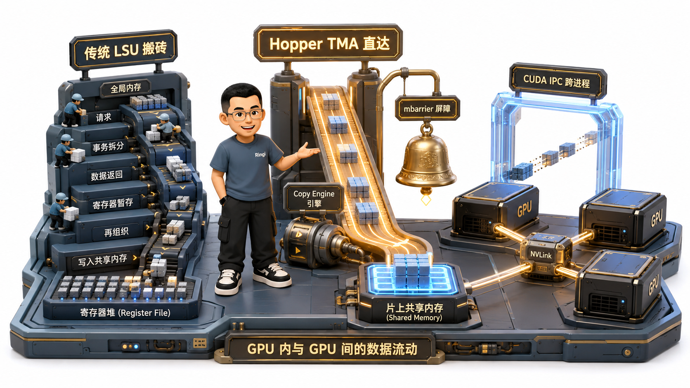
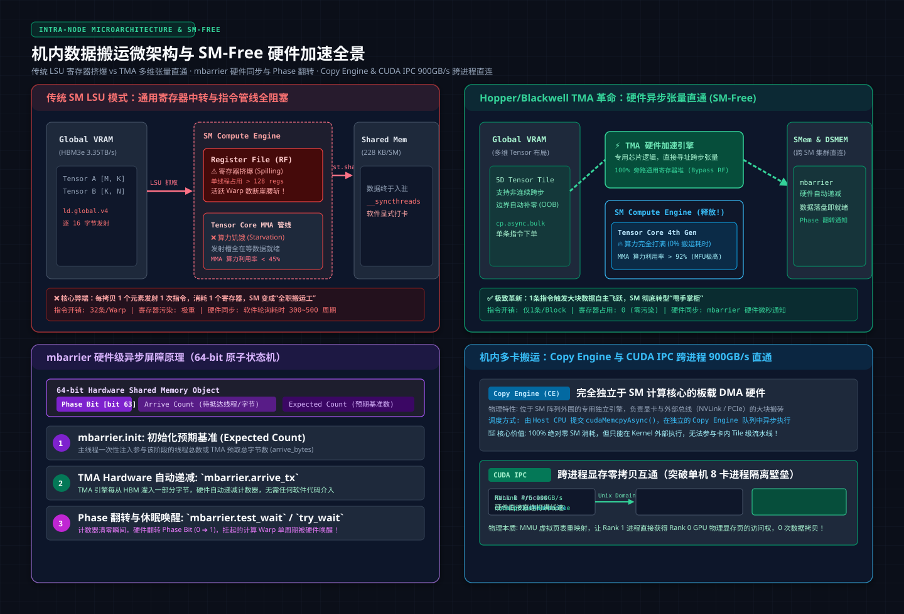
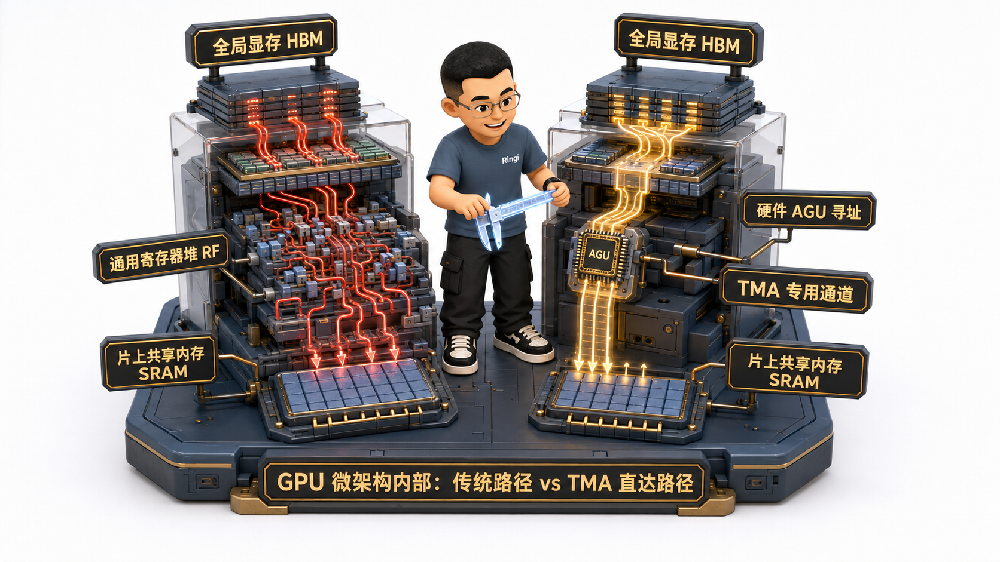
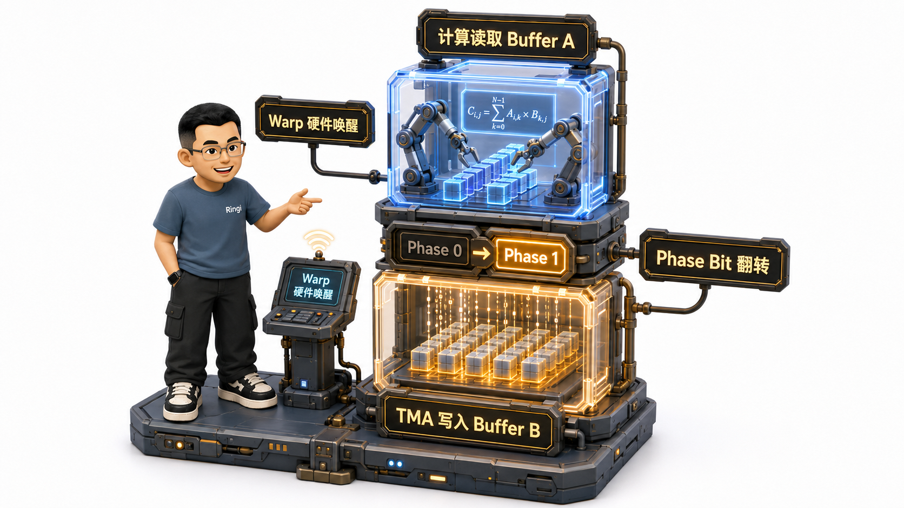
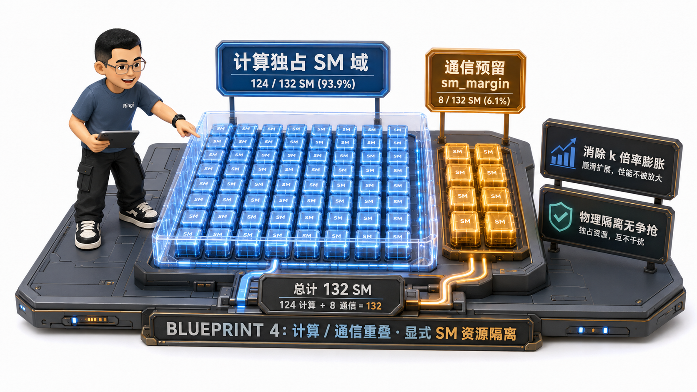

# 🏛️ 第16讲：大厨不必亲自搬砖——机内数据搬运（LSU/TMA/Copy Engine/mbarrier/IPC）与 SM-Free 革命

> **主讲人**：👓 **Ringi**（大厂 AI Infrastructure 工程师）  
> **所属模块**：[Module 01: GPU 硬件架构、数据搬运、集群通信与 Overlap](./README.md)  
> **篇章范式**：⚙️ 卡内与机内数据路径篇（Intra-Node Data Movement Paradigm）  
> **核心导读**：  
> 在过去的 CUDA 性能优化教程中，有一套被奉为圭臬的“黄金法则”：让线程自己把数据从全局显存（HBM）加载到寄存器，再一条条写入共享内存（Shared Memory）。  
> 然而，在当代以万亿参数大模型与 Tensor Core 超高算力密度为代表的 AI 时代，这一传统范式正在引发一场静默的算力海啸——**负责搬运数据的指令疯狂霸占通用寄存器与指令发射端口，导致真正负责干核心矩阵乘法的 Tensor Core 频繁陷入饥饿！明明计算单元嗷嗷待哺，SM 却被繁重的“内存倒手”活活累死！**  
> **SM 参与搬运究竟是一场怎样的零和博弈？Hopper 架构引入的 TMA（Tensor Memory Accelerator）是如何在硬件层面做到多维张量直通与寄存器零污染的？Copy Engine 与 SM 之间有着怎样不可逾越的调度边界？硬件级屏障 mbarrier 又是如何让控制面彻底摆脱轮询停顿的？在多进程单机 8 卡环境下，CUDA IPC 是如何打通进程隔离实现 900 GB/s 极速狂飙的？而在大模型通算重叠中，通信耗时为何会出现神秘的“k 倍率时间膨胀”？**  
> 本讲我们将深入单卡内部与单机机箱，以极致的硅片微架构视角，解密现代 AI 算力系统走向 **“SM-Free 硬件彻底卸载”** 的技术革命！



```text
=================================================================================================
                                   Ringi 3D 架构工坊 · 核心全景
┌───────────────────────────────────────────────────────────────────────────────────────────────┐
│ [Intra-Node Data Movement: The Ladder of SM Engagement]                                       │
│                                                                                               │
│ 1. SM Load/Store (LSU) : SM instructions move data. High Register pressure. Full SM Stall.   │
│    Data Path: Global VRAM ──► L2 ──► L1 ──► [Register File] ──► Shared Memory (Heavy Tax!)    │
│                                                                                               │
│ 2. TMA (Hopper/Blackwell): 1 instruction dispatches hardware DMA. Direct to Shared Memory!    │
│    Data Path: Global VRAM ════════════════════════════════════► Shared Memory (Bypasses RF!) │
│    Control  : Handed over to hardware [mbarrier] (Byte-level counter + Phase bit flip).       │
│                                                                                               │
│ 3. Copy Engine (CE)    : Completely independent DMA engine outside SM. Kernel-level only.     │
│    Data Path: GPU 0 VRAM ════ (NVLink / PCIe Switch P2P) ════► GPU 1 VRAM (Zero SM load!)     │
│                                                                                               │
│ 4. CUDA IPC (P2P Memory): Cross-process virtual address mapping. NVLink 900 GB/s wire-speed. │
│    Mechanism: cudaIpcGetMemHandle ──► IPC Channel ──► cudaIpcOpenMemHandle (Zero CPU Staging)│
├───────────────────────────────────────────────────────────────────────────────────────────────┤
│ [The Truth of Comm-Compute Overlap: SM Contention & k-Factor Expansion]                       │
│    T_comm_overlap = T_comm_solo × k   (k ≈ 1.1 ~ 1.4 due to L2 / Register / Scheduler squeeze)│
│    Solution: Flux 'sm_margin' explicit reservation & DeepEP SM-quota partition.               │
└───────────────────────────────────────────────────────────────────────────────────────────────┘
=================================================================================================
```

<!-- more -->

## 📑 目录导航

- [0. Ringi 开场：生产真实现场与痛点冲突](#0-ringi-开场生产真实现场与痛点冲突)
  - [0.1 真实工程矛盾：米其林大厨炒菜前必须自己跑冷库搬牛肉——计算与访存的零和博弈](#01-真实工程矛盾米其林大厨炒菜前必须自己跑冷库搬牛肉计算与访存的零和博弈)
  - [0.2 线上真实事故复盘：Hopper 架构强行将通信塞入 GEMM Epilogue 导致吞吐暴跌 35%](#02-线上真实事故复盘hopper-架构强行将通信塞入-gemm-epilogue-导致吞吐暴跌-35)
  - [0.3 机内数据搬运四大引擎横向对比全景速查表](#03-机内数据搬运四大引擎横向对比全景速查表)
- [1. 机内数据搬运四大引擎：SM 占用的四级阶梯](#1-机内数据搬运四大引擎sm-占用的四级阶梯)
  - [1.1 阶梯一：SM Load/Store（LSU）——逐元素消耗寄存器，指令管线全程锁死](#11-阶梯一sm-loadstorelsu逐元素消耗寄存器指令管线全程锁死)
  - [1.2 阶梯二：TMA（Tensor Memory Accelerator）——1 条指令下单，硬件代搬直达 Shared Memory](#12-阶梯二tmatensor-memory-accelerator1-条指令下单硬件代搬直达-shared-memory)
  - [1.3 阶梯三：Copy Engine（CE）——DMA 独立于 SM，但为什么 Kernel 内无法调用？](#13-阶梯三copy-enginecedma-独立于-sm但为什么-kernel-内无法调用)
  - [1.4 阶梯四：Staged Copy——PCIe Host 内存中转兜底的物理代价](#14-阶梯四staged-copypcie-host-内存中转兜底的物理代价)
  - [1.5 为什么 NCCL 机内 AllReduce 必须走 SM？（搬运 vs 归约计算的本质分水岭）](#15-为什么-nccl-机内-allreduce-必须走-sm搬运-vs-归约计算的本质分水岭)
- [2. TMA vs LSU：数据面 SM-Free 的硬件底层革命](#2-tma-vs-lsu数据面-sm-free-的硬件底层革命)
  - [2.1 硬件微架构对决：LSU 数据流（经 RF 中转）vs TMA 数据流（绕过 RF 直通）](#21-硬件微架构对决lsu-数据流经-rf-中转vs-tma-数据流绕过-rf-直通)
  - [2.2 内置硬件 AGU（地址生成单元）：硬件级多维张量（1D~5D）切块与自动越界 Padding](#22-内置硬件-agu地址生成单元硬件级多维张量1d5d切块与自动越界-padding)
  - [2.3 吞吐与延迟的物理拐点：为什么小包（<1KB）LSU 更快，而大包（>2KB）TMA 碾压式胜出？](#23-吞吐与延迟的物理拐点为什么小包1kb-lsu-更快而大包2kb-tma-碾压式胜出)
  - [2.4 字节 Flux 在 Dense MLP 中的架构启示：Layer0 纯搬运走 CE，Layer1 归约计算融进 SM Epilogue](#24-字节-flux-在-dense-mlp-中的架构启示layer0-纯搬运走-celayer1-归约计算融进-sm-epilogue)
- [3. `mbarrier`：控制面彻底卸载的硬件钥匙](#3-mbarrier控制面彻底卸载的硬件钥匙)
  - [3.1 为什么控制面也必须 SM-Free？（避免 SM 陷入“搬完没”的软件轮询泥潭）](#31-为什么控制面也必须-sm-free避免-sm-陷入搬完没的软件轮询泥潭)
  - [3.2 mbarrier 核心机制三位一体：字节级硬件计数 + Phase Bit 翻转 + Warp Scheduler 硬件挂起/唤醒](#32-mbarrier-核心机制三位一体字节级硬件计数--phase-bit-翻转--warp-scheduler-硬件挂起唤醒)
  - [3.3 Ping-Pong 双缓冲异步流水线：计算读 Buffer A 时 TMA 写入 Buffer B，mbarrier 翻转后角色瞬间对调](#33-ping-pong-双缓冲异步流水线计算读-buffer-a-时-tma-写入-buffer-b-mbarrier-翻转后角色瞬间对调)
- [4. 通算重叠（Overlap）的残酷真相：SM 竞争与 k 倍率膨胀](#4-通算重叠overlap的残酷真相sm-竞争与-k-倍率膨胀)
  - [4.1 通算重叠不是免费的午餐：通信与计算同跑时，耗时发生的乘性膨胀 $t_{\text{comm\\_overlap}} = t_{\text{comm\\_solo}} \times k$](#41-通算重叠不是免费的午餐通信与计算同跑时耗时发生的乘性膨胀-t_comm_overlap--t_comm_solo-times-k)
  - [4.2 资源争夺的五重战场：SM 核心配额、寄存器堆、L2 Cache 带宽、HBM 内存控制器、Warp 调度器](#42-资源争夺的五重战场sm-核心配额寄存器堆l2-cache-带宽hbm-内存控制器warp-调度器)
  - [4.3 工业级破局利器：字节 Flux 的 `sm_margin` 显式预留切分，与 DeepEP Normal 的 `Buffer.set_num_sms(n)` 硬件级配额](#43-工业级破局利器字节-flux-的-sm_margin-显式预留切分与-deepep-normal-的-bufferset_num_smsn-硬件级配额)
  - [4.4 激活值卸载（Activation Offloading）的三大必要条件：异步流、Pinned Memory 与 NUMA 亲和性](#44-激活值卸载activation-offloading的三大必要条件异步流pinned-memory-与-numa-亲和性)
- [5. CUDA IPC 与跨卡共享内存：打破进程地址隔离](#5-cuda-ipc-与跨卡共享内存打破进程地址隔离)
  - [5.1 为什么机内跨 GPU 访问需要 IPC？（多进程架构下的虚拟显存地址空间隔离）](#51-为什么机内跨-gpu-访问需要-ipc多进程架构下的虚拟显存地址空间隔离)
  - [5.2 `cudaIpcGetMemHandle` 与 `cudaIpcOpenMemHandle` 物理时序：句柄序列化与 NVLink P2P 900 GB/s 直通](#52-cudaipcgetmemhandle-与-cudaipcopenmemhandle-物理时序句柄序列化与-nvlink-p2p-900-gbs-直通)
  - [5.3 句柄生命周期管理：频繁申请/销毁的性能灾难 vs 持久化池化复用](#53-句柄生命周期管理频繁申请销毁的性能灾难-vs-持久化池化复用)
  - [5.4 对称内存（Symmetric Memory / NVSHMEM）的终极演进：批量化全局统一地址空间](#54-对称内存symmetric-memory--nvshmem的终极演进批量化全局统一地址空间)
- [6. 生产典型故障排障实战指南](#6-生产典型故障排障实战指南)
  - [6.1 故障 A：Activation Offload 遭遇严重带宽腰斩（排查未锁定内存与跨 NUMA UPI 瓶颈）](#61-故障-aactivation-offload-遭遇严重带宽腰斩排查未锁定内存与跨-numa-upi-瓶颈)
  - [6.2 故障 B：TMA 与 MMA 流水线发生致命死锁（mbarrier 初始计数不匹配导致永久挂起）](#62-故障-btma-与-mma-流水线发生致命死锁mbarrier-初始计数不匹配导致永久挂起)
  - [6.3 故障 C：CUDA IPC 句柄泄漏引发 Driver OOM（多进程频繁开闭 Handle 导致内核资源枯竭）](#63-故障-ccuda-ipc-句柄泄漏引发-driver-oom多进程频繁开闭-handle-导致内核资源枯竭)
- [7. 动手实战与代码实验室（Minimal Runnable Code）](#7-动手实战与代码实验室minimal-runnable-code)
  - [7.1 实验 1：LSU vs Copy Engine 异步重叠与 SM 争用 k 倍率实测](#71-实验-1lsu-vs-copy-engine-异步重叠与-sm-争用-k-倍率实测)
  - [7.2 实验 2：CUDA IPC 跨进程零拷贝显存共享与 NVLink 直通仿真](#72-实验-2cuda-ipc-跨进程零拷贝显存共享与-nvlink-直通仿真)
  - [7.3 实验 3：TMA + mbarrier 硬件异步双缓冲流水线状态机仿真](#73-实验-3tma--mbarrier-硬件异步双缓冲流水线状态机仿真)
  - [7.4 实验 4：Activation Offloading 卸载 vs 重计算（Checkpointing）代价判决天平](#74-实验-4activation-offloading-卸载-vs-重计算checkpointing代价判决天平)
- [8. Ringi 避坑指南与生产性能工程黄金 Checklist](#8-ringi-避坑指南与生产性能工程黄金-checklist)
  - [8.1 避坑表格（8 组常见小白机内搬运误区 vs 大厂正解）](#81-避坑表格8-组常见小白机内搬运误区-vs-大厂正解)
  - [8.2 生产环境机内数据搬运黄金十条 Checklist](#82-生产环境机内数据搬运黄金十条-checklist)
- [9. Ringi 5 点核心速记口诀、自我检验清单与课后深度思考题](#9-ringi-5-点核心速记口诀自我检验清单与课后深度思考题)
  - [9.1 5 点押韵核心速记口诀](#91-5-点押韵核心速记口诀)
  - [9.2 10 条白板自我检验清单](#92-10-条白板自我检验清单)
  - [9.3 3 道高阶开放式课后思考题（含极端 Corner Case）](#93-3-道高阶开放式课后思考题含极端-corner-case)
- [10. 📚 参考资料与核心源码/经典论文指引](#10--参考资料与核心源码经典论文指引)
- [附录：Appendix A — 大厂硬核高频面试题与白板推导（Interview Drill）](#附录appendix-a--大厂硬核高频面试题与白板推导interview-drill)

---

# 0. Ringi 开场：生产真实现场与痛点冲突

## 0.1 真实工程矛盾：米其林大厨炒菜前必须自己跑冷库搬牛肉——计算与访存的零和博弈

在现代高性能 GPU 内部，流式多处理器（SM）所扮演的角色，极其类似于一家顶级餐厅里的**米其林主厨**：
主厨的核心价值在于其鬼斧神工的颠勺手艺（即 Tensor Core 的矩阵乘加 MMA 计算）。

然而，在过去很长一段时间的底层 CUDA 代码中，主厨的日常工作状态却是极其荒诞的：
- 每当要炒一盘菜，主厨必须自己脱下围裙，一路小跑穿越大半个厨房，来到零下 20 度的冷库（HBM 显存）；
- 亲手扛起两箱冻牛肉，费力地把它们搬回自己的操作台（通用寄存器堆 Register File）；
- 再从操作台一块块切好放进手边的备料盘（片上共享内存 Shared Memory）；
- 最后，气喘吁吁的主厨才能开火颠两下勺！

```text
传统架构痛点：
SM 既当主厨（矩阵计算）又当搬运工（内存读写） ──► 通用寄存器被大量搬运中间变量占满 ──► 指令发射槽被 LDG/STG 霸占 ──► Tensor Core 算力利用率暴跌至 20% 以下！
```

**这就是 GPU 机内数据搬运最底层的残酷现实：SM 做搬运就不能做计算，这是一个绝对的零和博弈！**  
因此，在大模型性能工程的世界里，机内数据搬运的终极命题绝不是“怎么把搬运代码写得更巧”，而是：**“怎么在硬件上把数据搬了，同时 1% 的 SM 算力都不占用（SM-Free）！”**

不仅如此，一次完整的数据搬运必须包含两个阶段：
1. **数据面（Data Plane）**：谁把这几个 GB 的字节从 A 搬到 B？
2. **控制面（Control Plane）**：谁负责确认“数据搬完了”并通知下游开始消费？

如果数据由硬件搬了，但 SM 必须挂在死循环里不停地轮询（Polling）状态标记，那么控制面依然会死死锁住 SM！**唯有数据面与控制面双重解放，才是真正纯粹的 SM-Free！**

---

## 0.2 线上真实事故复盘：Hopper 架构强行将通信塞入 GEMM Epilogue 导致吞吐暴跌 35%

我们来看一起发生在大厂自研高性能通信库团队的真实工程翻车惨案：

在 Ampere（A100）时代，有一套业界非常知名的融合优化技巧——**GEMM + ReduceScatter 融合**（以字节跳动开源的 Flux 算子为典型代表）。  
其核心原理是：利用传统 GPU 在 Epilogue（算子尾声）阶段的空闲周期，让计算线程在算完一个 Tile 矩阵块后，直接把结果通过 NVLink 跨卡写到目标 GPU 的显存缓冲区里。因为 Ampere 每个 SM 会并发调度多个 Block，当某个 Block 在执行跨卡远程 I/O 时，硬件调度器能自然切到同 SM 上的其他 Block 继续算 GEMM，从而近乎免费地隐藏了机内通信延迟。

该团队在升级到 **Hopper H100（SM90 架构）** 后，工程师自以为是地照搬了这套逻辑，直接把机内通信写入塞进了 Hopper GEMM 的 Epilogue 中。

上线测试一跑，所有人都惊呆了：**端到端训练吞吐不但没有提升，反而比未融合的版本暴跌了整整 35%！**

**事故根因剖析**：
- Hopper 架构的执行范式发生了范式转移：每个 SM 运行的是 **单 Persistent Warp-Specialized Threadblock**（持久化专用线程块）；
- 内部被极其精密地切分为 **Producer Warp（负责 TMA 异步拉取数据）** 与 **Consumer Warp（负责 MMA 算力轰鸣）**，两者依靠硬件级 `mbarrier` 咬合成为一条极致紧凑的微观流水线；
- 当工程师强行把包含数十微秒长延迟的 NVLink 远端通信操作塞进这个紧凑流水线的 Epilogue 时，**同 SM 上根本没有多余的 Block 可供调度器切换**！
- 整个高度精密的 TMA + MMA 流水线瞬间被这个长延迟操作彻底冻结，在流水线中硬生生打出了巨大的空泡（Bubble）！

这个血泪教训深刻警示我们：**在不同的硬件微架构代际之间，机内数据搬运的控制面与数据面解耦边界截然不同！不懂微架构硬件，盲目做算子融合只会带来灾难！**

---

## 0.3 机内数据搬运四大引擎横向对比全景速查表

在深入硅片内部之前，我们先把单机多卡环境下的四大搬运引擎底账彻底算清：

| 搬运机制 | 物理承载硬件 | 数据面 SM 占用 | 控制面同步机制 | 核心数据通路 | 典型工业适用场景 |
| :--- | :--- | :--- | :--- | :--- | :--- |
| **1. SM Load/Store (LSU)** | SM 内部访存管线 (LSU 单元) | **全程重度锁定** (需 Warp 循环发射指令) | 软件指令显式同步 (`__syncthreads()`) | Global ➔ L2 ➔ L1 ➔ **RF** ➔ Shared (跨 GPU 走 NVLink) | 通信中必须伴随计算 (如 AllReduce 归约加法) |
| **2. TMA 异步硬件加速** | Hopper/Blackwell 专属片上 TMA 引擎 | **指令发射瞬间微秒级释放** (仅 1 条指令) | 硬件级 `mbarrier` (字节级计数 + 自动唤醒) | Global ════ (绕过 RF 寄存器堆) ════► Shared Memory | **Kernel 内部** HBM ↔ Shared 大块张量直通 (>2KB) |
| **3. Copy Engine (CE)** | GPU 专用板载 DMA 控制器 | **100% 绝对零占用** (独立硬件引擎) | CUDA Stream 事件 (`cudaEventSynchronize`) | GPU 显存 ════ (NVLink / PCIe Switch) ════► GPU 显存 | **Kernel 外部** 异步流水线搬运 (如 FSDP 权重预取) |
| **4. Staged Copy (Host 中转)** | CPU 核心 + PCIe DMA | **不占 GPU SM** (但重度消耗 Host CPU) | CPU 线程同步 / Host 中断 | GPU 显存 ➔ PCIe ➔ Host 内存 ➔ PCIe ➔ 目标 GPU | 消费级显卡无 P2P 时的终极降级兜底 |

---

# 1. 机内数据搬运四大引擎：SM 占用的四级阶梯



从计算机体系结构第一性原理出发，数据在物理世界的流动必须有特定的硬件实体来推波助澜。搬运者不同，SM 被绑架的程度呈现出清晰的四级阶梯：

```text
┌───────────────────────────────────────────────────────────────────────────────────────────────┐
│                           机内数据搬运 SM 占用的四级残酷阶梯                                  │
├───────────────────────────────────────────────────────────────────────────────────────────────┤
│ [阶梯一: SM LSU]     SM 亲自下场搬砖 ──► 占用通用寄存器 ──► 锁死指令发射槽 ──► 【全程占用】     │
│                                    │ (向下进化)                                               │
│ [阶梯二: Hopper TMA] SM 仅发单条指令 ──► TMA 专用硬件直达 Shared Memory ──► 【指令级释放】    │
│                                    │ (向下进化)                                               │
│ [阶梯三: Copy Engine]独立专用 DMA 引擎 ──► 完全在 Kernel 外异步流动 ────► 【100% SM-Free】   │
│                                    │ (兜底后退)                                               │
│ [阶梯四: Staged Copy]跨越主机内存中转 ──► 绕行 CPU Host 内存 ──────────► 【延迟与带宽灾难】   │
└───────────────────────────────────────────────────────────────────────────────────────────────┘
```

---

## 1.1 阶梯一：SM Load/Store（LSU）——逐元素消耗寄存器，指令管线全程锁死

这是最原始、最经典的 CUDA 搬运方式：
- 程序员编写 `for` 循环，利用线程束中的 32 个线程，通过 `ld.global` 指令从 HBM 全局显存加载数据；
- **致命痛点**：每一个加载回来的浮点数，必须首先存放在该线程专属的**通用物理寄存器（Register File）**中！
- 随后，线程再发射 `st.shared` 指令，把寄存器里的数值写入片上共享内存（Shared Memory）。

**物理代价核算**：
1. **寄存器压力溢出（Register Spilling）**：为了隐藏访存延迟，程序员往往会展开循环预取数据，导致单个线程所需的寄存器数量暴增（如从 32 个飙升到 128 个）。SM 内部总共只有 64K 个 32 位寄存器，寄存器消耗翻倍，直接导致每个 SM 能同时驻留的活跃 Warp 数（Occupancy）腰斩！
2. **指令发射端口堵塞**：SM 内部的指令分发单元（Dispatch Unit）在数十个周期内排满了纯粹的搬砖指令，负责核心算力的 Tensor Core 管线只能空转等待。

---

## 1.2 阶梯二：TMA（Tensor Memory Accelerator）——1 条指令下单，硬件代搬直达 Shared Memory

NVIDIA 在 Hopper（H100）架构中引入了一颗革命性的硬件芯片模块——**TMA（张量内存加速器）**。

它在微架构上将搬运彻底剥离出了 SM 的计算管线：
- SM 中的线程只需要构建一个微小的 128 字节描述符（描述张量的维度、步长、源地址与目的地址）；
- 单个线程发射 **1 条汇编指令**（如 `cp.async.bulk.tensor`）；
- 发射完毕的下一瞬间，**该线程与所属 Warp 立即解脱，可以自由转身去调用 Tensor Core 执行矩阵乘法！**
- TMA 专用硬件控制器接管总线，直接从 L2 缓存或片外 HBM 抽取多维张量，**彻底绕过寄存器文件，直接灌入共享内存（Shared Memory）！**

---

## 1.3 阶梯三：Copy Engine（CE）——DMA 独立于 SM，但为什么 Kernel 内无法调用？

在 GPU 芯片的宏观拓扑中，除了成百上千的 SM 核心外，芯片边缘还独立封装了数颗专用的硬件控制器——**Copy Engine（拷贝引擎，即 GPU 专属 DMA 引擎）**。

当我们调用 `cudaMemcpyAsync()` 时，执行搬运的正是这个独立于 SM 的物理引擎。它拥有极高带宽（打满 PCIe 5.0 的 64 GB/s 或 NVLink 4.0 的 900 GB/s），并且 **0% 占用 SM 算力**。

### 为什么在编写 CUDA Kernel 时，我们不能直接调 Copy Engine？
很多底层开发者经常提出这个灵魂拷问：*“既然 Copy Engine 完全不占 SM，为什么不让我在 GPU Kernel 代码里直接发射指令调 CE 呢？”*

这是体系结构设计上的刻意解耦与特权隔离：
1. **调度权限隔离**：Copy Engine 由位于 Host 端和 GPU 前端的 **命令处理器（Command Processor / Host Interface）** 直接管理，它只接收来自 CUDA Stream 任务队列的宏观命令流（Command Buffer）；
2. **执行粒度不匹配**：CE 是粗粒度的批处理 DMA 设备，一次启动与握手开销在微秒（μs）级；而 Kernel 内的线程调度是以纳秒（ns）为周期的微观流水线。让微观线程直接抢占宏观 CE 会引发不可调和的仲裁冲突；
3. **架构解耦的红利**：正因为 CE 完全独立在 Kernel 外部，它才能在独立的 CUDA Stream 上与正在 GPU 内部轰鸣的计算 Kernel 实现绝对物理并发！

---

## 1.4 阶梯四：Staged Copy——PCIe Host 内存中转兜底的物理代价

当两张 GPU 之间既没有 NVLink 物理金手指，主板上的 PCIe Switch 又不支持 P2P（Peer-to-Peer）寻址时（在消费级主板或部分云厂商低端虚拟化环境中常见），系统只能无奈启用 **Staged Copy（主机内存分段中转）**：

```text
GPU 0 显存 ──► PCIe 总线 ──► CPU Host 内存 ──► PCIe 总线 ──► GPU 1 显存
```

数据被迫在主板总线上折返跑，有效带宽从 NVLink 的 900 GB/s 断崖式暴跌至 10~20 GB/s，通信延迟暴涨 20 倍。在大规模 AI 生产集群中，这种拓扑缺陷属于严重的配置事故，必须通过硬件拓扑审计坚决清零。

---

## 1.5 为什么 NCCL 机内 AllReduce 必须走 SM？（搬运 vs 归约计算的本质分水岭）

现在我们来回答一个非常具有工业实战深度的考题：
**在大模型机内 8 卡通信中，NCCL 默认为什么依然使用基于 SM 的 Kernel（从对端 Load，相加后再 Store），而不是纯用 Copy Engine？**

答案就在于 **搬运（Movement）与 归约（Reduction）的本质分水岭**：
- **纯搬运（Pure Movement，如 AllGather / Broadcast / P2P SendRecv）**：
  数据只是从卡 A 瞬移到卡 B，不需要对数据做任何修改。这种操作理应 100% 追求 SM-Free，交给 DMA 引擎或 TMA；
- **含计算搬运（Reduction Movement，如 AllReduce / ReduceScatter）**：
  在把梯度发给邻居卡的同时，必须把本地的梯度与邻居送来的梯度**执行逐元素浮点加法（FP16/BF16 Sum）**！
  **而 Copy Engine 是一个纯粹的搬运工，它内部根本没有浮点加法器（ALU）！**
  如果纯用 CE 搬运，流程就必须退化为：CE 先把数据搬到内存缓冲区 ➔ 触发一个 GPU 加法 Kernel 读出相加并写回 ➔ 再用 CE 发给下一个卡。这平白无故多出了整整两倍的显存读写流量！
- 因此，NCCL 宁可消耗部分 SM（通常分配 8~16 个 Channel，占一小部分 SM），让 SM 的 LSU 或 TMA 在高速缓存流水线中“边读、边加、边发”，换取极限吞吐与最低的全局显存开销！

---

# 2. TMA vs LSU：数据面 SM-Free 的硬件底层革命

## 2.1 硬件微架构对决：LSU 数据流（经 RF 中转）vs TMA 数据流（绕过 RF 直通）

为了直观展现 Hopper 架构 TMA 的革命性突破，我们把两种搬运模式在硅片内部的物理数据流并列拆解：



```text
┌───────────────────────────────────────────────────────────────────────────────────────────────┐
│                           LSU 与 TMA 微架构数据流物理对比                                      │
├───────────────────────────────────────────────────────────────────────────────────────────────┤
│ [传统 LSU 搬运数据流 (繁重中转)]:                                                             │
│   全局显存 (HBM3)                                                                             │
│         │                                                                                     │
│         ▼                                                                                     │
│   片上统一 L2 Cache                                                                           │
│         │                                                                                     │
│         ▼                                                                                     │
│   SM 内部 L1 Data Cache                                                                       │
│         │                                                                                     │
│         ▼                                                                                     │
│   【通用寄存器堆 (Register File)】 ◄── SM 指令管线被锁死！每个线程消耗多达 32~64 个寄存器！    │
│         │                                                                                     │
│         ▼                                                                                     │
│   片上共享内存 (Shared Memory)                                                                │
├───────────────────────────────────────────────────────────────────────────────────────────────┤
│ [Hopper TMA 异步搬运数据流 (硬件直通)]:                                                       │
│   全局显存 (HBM3)                                                                             │
│         │                                                                                     │
│         ▼                                                                                     │
│   片上统一 L2 Cache                                                                           │
│         │                                                                                     │
│         ══════════════════════════════════════════════════════════════► 硬件直达！            │
│                                                                        │ (彻底绕过寄存器堆!)  │
│                                                                        ▼                      │
│                                                          片上共享内存 (Shared Memory)         │
│   • SM 核心动作：仅发射 1 条指令（cp.async.bulk），通用寄存器占用 = 0！                      │
└───────────────────────────────────────────────────────────────────────────────────────────────┘
```

---

## 2.2 内置硬件 AGU（地址生成单元）：硬件级多维张量（1D~5D）切块与自动越界 Padding

在过去编写高性能 GEMM 或 Convolution 算子时，程序员至少有 30% 的代码是在算复杂的数组下标与边界检查：
```cpp
// 传统代码中繁琐的 2D 坐标折算（耗费通用整数 ALU 指令）
int offset = batch_idx * stride_b + (m_idx + i) * stride_m + (k_idx + j);
if (m_idx + i < M && k_idx + j < K) { ... } else { val = 0.0f; }
```

TMA 彻底把这部分苦力活固化到了硅片硬件中：
- TMA 内部集成了一个专用的 **多维地址生成单元（Hardware AGU）**；
- 在 Host 端或 Kernel 初始化阶段，我们创建一个 `CUtensorMap` 描述符，直接填入张量的维度（1 维到 5 维）、全局步长、切块尺寸（Tile Size）以及边界填充模式（Zero-Padding）；
- TMA 硬件在搬运时，自主根据硬件步长推进多维指针，**在遇到矩阵边界时硬件自动补零，不需要 SM 消耗任何一条分支跳转指令！**

---

## 2.3 吞吐与延迟的物理拐点：为什么小包（<1KB）LSU 更快，而大包（>2KB）TMA 碾压式胜出？

在工程实践中，很多初学者容易走向极端，认为“既然 TMA 这么好，我代码里所有读写全部改成 TMA”。结果在小数据量场景下一测，性能反而严重劣化。

这背后是不可动摇的 **硬件启动与流水线拐点定律**：

| 数据传输体量 | 获胜者 | 体系结构原理解析 | 生产落地决策指南 |
| :--- | :--- | :--- | :--- |
| **小包 (< 1 KB)** | **LSU 胜出** | TMA 硬件需要解析描述符、建立事务连接，存在固定的 **启动开销（Launch Overhead，约数十纳秒）**；而 LSU 指令随发随走，在几十个字节的极小搬运上延迟更低。 | 细粒度元数据标记、标量同步、动态小索引走 LSU。 |
| **过渡区 (1 ~ 2 KB)** | **旗鼓相当** | TMA 的批量吞吐收益开始抵消启动开销，两者性能打平。 | 视当前 Kernel 寄存器压力决定：若寄存器紧张，优先选 TMA。 |
| **大包 (> 2 KB)** | **TMA 碾压** | TMA 凭借其宽数据通路（128 字节物理突发读写）与多维流水线，彻底打满 L2/Shared 内存总线；同时将 SM 100% 释放给矩阵计算。 | GEMM 矩阵切块、Attention Q/K/V 块加载坚决用 TMA。 |

---

## 2.4 字节 Flux 在 Dense MLP 中的架构启示：Layer0 纯搬运走 CE，Layer1 归约计算融进 SM Epilogue

在大模型机内并行优化中，字节跳动开发的 **Flux（Dense MLP 通算融合架构）** 提供了一份极具教科书价值的工程答卷。

在一个标准的 Transformer MLP 结构中包含两层全连接：

$$
\text{MLP}(X) = \text{GELU}(X \cdot W_1) \cdot W_2
$$

在张量并行（TP=8）切分下：
- **Layer 1（Up-Projection，列并行）**：需要对输入做 AllGather，然后执行 GEMM；
- **Layer 2（Down-Projection，行并行）**：执行 GEMM，最后必须对输出做 ReduceScatter。

Flux 针对这两层截然不同的数学本质，给出了精妙的架构分流：

```text
┌───────────────────────────────────────────────────────────────────────────────────────────────┐
│                             字节 Flux Dense MLP 硬件协同流水线                                │
├───────────────────────────────────────────────────────────────────────────────────────────────┤
│ [Layer 1: Up-Projection (纯搬运 AllGather + GEMM)]                                            │
│   • 物理本质：AllGather 是纯搬运，无任何计算！                                               │
│   • Flux 决策：在独立的 CUDA Stream 上调用 Copy Engine / NVLink memcpy 进行数据预取；         │
│   • 收益：计算主流（Stream 0）跑 GEMM，通信从流（Stream 1）跑 CE，两者 100% 物理并发，0 占 SM！   │
├───────────────────────────────────────────────────────────────────────────────────────────────┤
│ [Layer 2: Down-Projection (GEMM + 归约 ReduceScatter)]                                        │
│   • 物理本质：ReduceScatter 包含浮点加法，DMA 引擎无法独立完成！                             │
│   • Flux 决策：放弃 CE，将 ReduceScatter 深度融进 GEMM 算子的 Epilogue 尾部；                 │
│   • 机制：SM 在算完一个 Tile 矩阵块的同时，直接利用本地 ALU 完成累加，并就地跨 NVLink 写入目标卡！│
└───────────────────────────────────────────────────────────────────────────────────────────────┘
```

**同一个模型的上下两层，因为“纯搬运”与“含归约”的细微差异，驱动了完全不同的硬件引擎。这正是顶尖 AI Infra 工程师的专业修养！**

---

# 3. `mbarrier`：控制面彻底卸载的硬件钥匙

## 3.1 为什么控制面也必须 SM-Free？（避免 SM 陷入“搬完没”的软件轮询泥潭）

在没有硬件屏障的年代，即使数据由异步引擎搬运到了内存，上层的消费线程依然面临一个尴尬的困境：
*“我怎么知道它搬完了？”*

传统的软件解法只有两种：
1. **全局硬同步（`cudaStreamSynchronize()` 或 `__syncthreads()`）**：
   粗暴地强迫所有 Warp 停下来等待，把整个芯片的流水线彻底打空；
2. **内存标志位软轮询（Flag Polling）**：
   在共享内存里放一个整型标记 `volatile int flag`，搬运方搬完后写入 1；消费线程用一个死循环 `while (*flag == 0) {}` 拼命轮询。
   **这种死循环轮询极其昂贵！** 它持续霸占了 SM 的指令分发槽位，让硬件调度器以为这个 Warp 处于高负荷运算状态，白白烧干了功耗，却一无所获！

---

## 3.2 mbarrier 核心机制三位一体：字节级硬件计数 + Phase Bit 翻转 + Warp Scheduler 硬件挂起/唤醒

NVIDIA 从 Ampere 架构开始萌芽、在 Hopper 架构达到完全体形态的 **`mbarrier`（Memory Barrier，片上硬件异步屏障）**，从物理上终结了软件轮询。

它由三大硬件机制紧密咬合而成：

```text
┌───────────────────────────────────────────────────────────────────────────────────────────────┐
│                              mbarrier 硬件屏障运行闭环                                        │
├───────────────────────────────────────────────────────────────────────────────────────────────┤
│ 1. 字节级硬件计数 (Byte-level Transaction Tracking)                                           │
│    • 初始化时设置目标事务字节数：mbarrier.expect_tx(barrier, 65536);                          │
│    • TMA 硬件每把一个 Cacheline 写入 Shared Memory，硬件自动扣减目标计数器，无需软件介入！      │
├───────────────────────────────────────────────────────────────────────────────────────────────┤
│ 2. Phase Bit 阶段位自动翻转 (消除 ABA 幽灵问题)                                               │
│    • 传统计数器在循环复用时，极易因“上一轮未退场、下一轮已递增”而发生时序错乱（ABA 问题）；   │
│    • mbarrier 内置一个 1-bit 的 Phase 状态位（0 与 1 交替翻转）；                             │
│    • 每次计数归零完成一个完整周期，硬件自动翻转 Phase Bit，等待方仅需校验 Phase 是否匹配！    │
├───────────────────────────────────────────────────────────────────────────────────────────────┤
│ 3. Warp Scheduler 硬件级挂起与瞬间唤醒                                                        │
│    • 消费 Warp 执行 mbarrier.try_wait 指令；                                                  │
│    • 若数据未就绪，硬件 Warp 调度器直接将该 Warp 从“就绪队列”剔除，标记为挂起状态；           │
│    • 期间该 Warp 不消耗哪怕 1 个时钟周期的发射端口；                                          │
│    • 一旦 TMA 搬完最后一个字节翻转 Phase，硬件控制器向调度器发出电信号，Warp 瞬间满血唤醒！   │
└───────────────────────────────────────────────────────────────────────────────────────────────┘
```

---

## 3.3 Ping-Pong 双缓冲异步流水线：计算读 Buffer A 时 TMA 写入 Buffer B，mbarrier 翻转后角色瞬间对调

在高性能算子内部，TMA 与 `mbarrier` 最优雅的协同范式是 **Ping-Pong（双缓冲双轨流水线）**：



```text
时间轴 ──►
周期 1:  [ 计算 Warp: 正在从 Buffer A 读取矩阵进行 MMA 计算 ]
         [ TMA  硬件: 正在向 Buffer B 异步拉取下一个分块数据 ] (绑定 mbarrier B)

周期 2:  mbarrier B 硬件满足，Phase 翻转！
         [ 计算 Warp: 切换至 Buffer B 读取数据进行 MMA 计算 ]
         [ TMA  硬件: 切换至 Buffer A 异步拉取再下一个分块 ] (绑定 mbarrier A)
```

通过将 Shared Memory 划分为两块互斥区域，TMA 的物理搬运时间被完全“隐藏”在了上一个分块的 Tensor Core 计算耗时之中，实现了流水线的无缝咬合！

---

# 4. 通算重叠（Overlap）的残酷真相：SM 竞争与 k 倍率膨胀

## 4.1 通算重叠不是免费的午餐：通信与计算同跑时，耗时发生的乘性膨胀 $t_{\text{comm\\_overlap}} = t_{\text{comm\\_solo}} \times k$

在很多架构师的理想图纸上，通算重叠被描述成一个近乎无损的美好公式：

$$
\text{Ideal Overlap Time} = \max(T_{\text{compute}}, T_{\text{communication}})
$$

然而，一旦你把通信 Kernel 与计算 Kernel 真实地挂到两个不同的 CUDA Stream 上并发运行，拿出 Nsight Systems 抓包，你会被冰冷的现实迎头痛击：
**原本单独执行只需 1.0 毫秒的通信操作，在与计算重叠执行时，耗时居然悄悄膨胀到了 1.3 甚至 1.5 毫秒！**

通信耗时相比单独独占执行，会出现一个明显的乘性膨胀系数 $k$：

$$
t_{\text{comm\\_overlap}} = t_{\text{comm\\_solo}} \times k \quad (k > 1.0)
$$

在大模型训练小规模集群的真实测试中：
- 当与 Compute-Bound 的大 GEMM 算子重叠时，竞争相对缓和，$k \approx 1.05 \sim 1.15$；
- **而当与 Memory-Bound 的 Attention、Softmax、RMSNorm 算子重叠时，$k$ 倍率会剧烈飙升至 $1.3 \sim 1.5$！**

---

## 4.2 资源争夺的五重战场：SM 核心配额、寄存器堆、L2 Cache 带宽、HBM 内存控制器、Warp 调度器

为什么会发生这种剧烈的性能膨胀？因为虽然开了不同的 CUDA Stream，但它们跑在同一颗物理硅片上，必须在微架构的**五重战场**上残酷厮杀：

| 资源战场 | 物理争用机制 | 对计算/通信性能的杀伤力 |
| :--- | :--- | :--- |
| **1. SM 核心配额 (SM Quota)** | 通信 Kernel 也需要占用一部分 SM 来管理数据收发通道；导致计算 Kernel 的 Thread Block 被迫排队等待。 | 直接削减分配给 GEMM 计算的物理 SM 数量，导致算力峰值直接缩水。 |
| **2. L2 Cache 带宽 (L2 Bottleneck)** | 跨卡 NVLink 搬运的巨大流量必须流经片上 L2 缓存；与 GEMM 矩阵计算频繁读取 A/B 矩阵的流量迎头相撞！ | 挤爆 L2 缓存端口，导致原本能在 L2 命中复用的权重数据被频繁驱逐，迫降 HBM。 |
| **3. HBM 内存控制器 (Memory Interface)** | 当计算为 Memory-Bound 算子时，内存控制器队列已满；通信的突发流量强行插队，导致两边的内存延迟同时翻倍！ | 严重排队延迟，使通信读取或写回 HBM 的耗时暴增。 |
| **4. 寄存器文件配额 (Register Pressure)** | 通信 Warp 驻留在 SM 上占用了宝贵的物理寄存器槽位；降低了计算 Warp 的最大占用率 (Occupancy)。 | 削弱了计算延迟掩盖能力。 |
| **5. Warp 调度器竞争 (Issue Slot)** | 同一个 SM 内部，Warp 调度器必须在计算 Warp 与通信 Warp 之间交替仲裁指令发射端口。 | 细微的调度排队毛刺，破坏紧凑的流水节拍，导致 MMA 计算出现微观空泡。 |

---

## 4.3 工业级破局利器：字节 Flux 的 `sm_margin` 显式预留切分，与 DeepEP Normal 的 `Buffer.set_num_sms(n)` 硬件级配额

面对残酷的 SM 争抢与 $k$ 倍率膨胀，工业界最前沿的系统给出了硬核的工程破局方案：



### 1. 字节 Flux 的 `sm_margin` 显式隔离参数
NCCL 默认只能通过全局环境变量 `NCCL_MAX_NCHANNELS` 极其粗暴地控制通道数，缺乏微观粒度。  
Flux 在其 GEMM + 通信融合 Kernel 中直接暴露了 **`sm_margin` 参数**：
- 允许开发者在代码中显式声明：`sm_margin = 8`（即强行要求底层调度器仅划拨 8 个 SM 给通信专用）；
- 芯片上剩下的 124 个 SM 100% 独占给 GEMM 计算，严禁通信插入！
- 彻底固化了计算与通信在物理 SM 维度的边界，杜绝了无序竞争。

### 2. 深度求索 DeepEP 的 `Buffer.set_num_sms(n)` 配额
在 MoE 大模型通信库 DeepEP 中，Normal 模式直接提供了 `Buffer.set_num_sms(n)` 接口：
- 内部严格按照 `num_channels = n / 2` 计算最优通信车道；
- 开发者可根据当前层的算力特征动态调节：在算力冗余的 Compute-Bound 层多划拨几个 SM 给通信，在访存紧张的 Memory-Bound 层将 SM 配额压至最低，实现了全生命周期的自适应压榨！

---

## 4.4 激活值卸载（Activation Offloading）的三大必要条件：异步流、Pinned Memory 与 NUMA 亲和性

除了卡间通信，机内数据搬运的另一个高频场景是 **显存卸载（Offloading）**：将暂时不用的激活值（Activations）通过 PCIe 搬到 CPU 内存，反向传播时再预取回来。

要想把 PCIe 5.0 的 64 GB/s 带宽打满，必须严格满足 **三大不可违背的硬性契约**：

1. **绝对异步流驱动（Asynchronous Stream）**：
   严禁在默认流上调用阻塞式的 `tensor.to('cpu')`，必须在独立的通信流上发起非阻塞式 `copy_()`，让 PCIe DMA 搬运与后续计算完全重叠；
2. **锁页内存（Pinned Host Memory）**：
   普通的 CPU 内存页随时可能被操作系统换出到磁盘，GPU 硬件 DMA 引擎无法直接寻址。如果不事先调用 `pin_memory()`，数据必须在 CPU 内核中多做一次内存中转拷贝，**传输有效带宽直接跌去 50% 以上**；
3. **严格对齐 CPU NUMA 节点（NUMA Affinity）**：
   双路服务器中，GPU 0 在物理上直连 CPU Socket 0。如果你的 CPU 锁页内存分配在 CPU Socket 1 上，PCIe 数据流必须横跨极度拥堵的跨 Socket UPI/QPI 总线，**带宽瞬间暴跌 2 到 3 倍**！

---

# 5. CUDA IPC 与跨卡共享内存：打破进程地址隔离

## 5.1 为什么机内跨 GPU 访问需要 IPC？（多进程架构下的虚拟显存地址空间隔离）

在现代大模型分布式系统（如 PyTorch DDP、Megatron-LM、vLLM）中，为了规避 Python 全局解释器锁（GIL）的性能锁死，**最标准的部署模式是单机多进程（Multi-Process）：即每个 GPU 绑定一个独立的 Linux 操作系统进程**。

这带来了一个巨大的软件鸿沟：
- 进程 A 与 进程 B 拥有完全隔离的虚拟内存地址空间；
- 即使物理上两张卡通过 NVLink 以 900 GB/s 的极速紧密相连，进程 B 也绝不可能直接拿着进程 A 里的一个虚拟显存指针（如 `0x7f9a8000`）去读写数据——这会立即引发操作系统的段错误（Segmentation Fault）！

为了在隔离的多进程间架起物理直通桥梁，**CUDA IPC（Inter-Process Communication，进程间通信）机制** 应运而生。

---

## 5.2 `cudaIpcGetMemHandle` 与 `cudaIpcOpenMemHandle` 物理时序：句柄序列化与 NVLink P2P 900 GB/s 直通

CUDA IPC 的底层握手时序极其严整：

```text
┌───────────────────────────────────────────────────────────────────────────────────────────────┐
│                             CUDA IPC 跨进程显存共享工作流                                     │
├───────────────────────────────────────────────────────────────────────────────────────────────┤
│ [进程 A (管理卡 0)]                                                                           │
│   1. 调用 cudaMalloc(&ptr, size) ──► 在卡 0 上分配一块物理显存                                │
│   2. 调用 cudaIpcGetMemHandle(&handle, ptr) ──► 抽取该物理显存的全局硬件凭据 (IPC Handle, 64B) │
│   3. 通过 Linux Unix Domain Socket / Pipe / Shared Memory ──► 将 64 字节 Handle 发送给进程 B  │
├───────────────────────────────────────────────────────────────────────────────────────────────┤
│ [进程 B (管理卡 1)]                                                                           │
│   4. 接收到 64 字节的 Handle 结构体                                                          │
│   5. 调用 cudaIpcOpenMemHandle(&remote_ptr, handle, cudaIpcMemLazyEnablePeerAccess)           │
│      ↳ 【物理奇迹发生】：驱动将卡 0 的物理显存页框，直接映射到进程 B 的虚拟地址空间中！       │
│   6. 进程 B 内部的 GPU 1 核心，直接通过 remote_ptr 发起读写指令！                            │
│      ↳ 数据直接在底层 NVLink 4.0 物理总线上以 900 GB/s 飞跃，两端 Host CPU 完全零拷贝！       │
└───────────────────────────────────────────────────────────────────────────────────────────────┘
```

---

## 5.3 句柄生命周期管理：频繁申请/销毁的性能灾难 vs 持久化池化复用

在实际生产中，很多初级工程师在实现自定义跨卡通信时，经常在每次算子调用时都临时去申请一次 IPC Handle：
```cpp
// ❌ 灾难级错误写法：在推理或训练热循环内反复开闭 IPC Handle
void step() {
    cudaIpcGetMemHandle(&handle, local_ptr);
    send_to_peer(handle);
    cudaIpcOpenMemHandle(&remote_ptr, handle, flags);
    // ... 通信 ...
    cudaIpcCloseMemHandle(remote_ptr);
}
```

**性能灾难后果**：
- `cudaIpcOpenMemHandle` 与 `cudaIpcCloseMemHandle` 涉及操作系统的内核上下文切换、MMU 页表重置与 NVLink 路由表硬件寄存器刷新；
- 单次调用耗时高达 **数百微秒甚至毫秒级**！这比通信本身还要慢两个数量级！

**工业级最佳实践——持久化池化复用（Persistent IPC Pool）**：
- 在系统初始化阶段（Warmup 阶段），一次性分配大块连续显存（Slab/Buffer）；
- 跨进程交换一次 IPC Handle，各端长期持有映射得到的虚拟基地址；
- 运行时通信仅在共享显存内通过原子偏移量进行无锁读写，**将运行时 IPC 握手开销彻底砸平为 0 纳秒！**

---

## 5.4 对称内存（Symmetric Memory / NVSHMEM）的终极演进：批量化全局统一地址空间

CUDA IPC 本质上是点对点的“手动开通行证”。当集群规模扩大、多卡交互变得极其繁复时，NVIDIA 推动了体系结构的终极演进——**Symmetric Memory（对称内存，NVSHMEM 基础）**。

在对称内存模型中：
- 节点内所有 GPU 在初始化时分配相同大小的对称显存池；
- 驱动程序在底层预先自动打通所有卡之间的全局地址映射；
- 任意一张卡上的线程，只需要知道目标卡号与内存相对偏移，即可直接使用类似于 `nvshmem_float_p(dest_ptr, value, target_pe)` 的单边指令完成数据瞬移，代表了机内数据搬运的最高工程范式！

---

# 6. 生产典型故障排障实战指南

## 6.1 故障 A：Activation Offload 遭遇严重带宽腰斩（排查未锁定内存与跨 NUMA UPI 瓶颈）

当大模型分布式训练开启激活值卸载，发现单步耗时极长、PCIe 带宽仅有 10 GB/s 左右时，按以下两板斧排查：

```bash
# 步骤 1: 检查 Host 内存是否为 Pinned Memory
# 在 Python 脚本中排查是否使用了普通 Tensor：
# ❌ 错误做法：cpu_tensor = torch.empty(shape)
# ✅ 正确做法：cpu_tensor = torch.empty(shape, pin_memory=True)

# 步骤 2: 检查 GPU 与 CPU 绑核的 NUMA 亲和性
# 查看 GPU 0 绑定的 NUMA 节点编号
cat /sys/bus/pci/devices/0000:0f:00.0/numa_node
# 假设输出为 0，则启动训练命令必须强制绑定 NUMA 0:
numactl --cpunodebind=0 --membind=0 python train.py
```

---

## 6.2 故障 B：TMA 与 MMA 流水线发生致命死锁（mbarrier 初始计数不匹配导致永久挂起）

在使用 Hopper TMA 开发自定义融合算子时，如果 Kernel 启动后毫无反应、GPU 处于 100% 假死状态，通常是 `mbarrier` 计数器失步引发的死锁：

```cpp
// 排查要点：检查 mbarrier 的 expected transaction bytes 是否与 TMA 搬运字节严格相等！
// 如果声明了期待 1024 字节，但 TMA 只搬运了 512 字节：
mbarrier.arrive_expect_tx(barrier_ptr, 1024); // 期待 1024 字节
tma_copy(tensor_map, 512, barrier_ptr);       // 实际只搬了 512 字节
// 结果：硬件计数器永远无法归零，mbarrier.wait() 陷入永久挂起死锁！
```

---

## 6.3 故障 C：CUDA IPC 句柄泄漏引发 Driver OOM（多进程频繁开闭 Handle 导致内核资源枯竭）

在长时间运行的大模型多进程推理服务中，如果频繁报错 `CUDA error: out of memory`，但 `nvidia-smi` 显示显存非常充裕，这往往是 **IPC 句柄内核泄露**：

```bash
# 检查操作系统内部残留的共享内存文件与未释放句柄
ls -l /dev/shm | wc -l
# 检查当前进程持有的文件描述符上限
lsof -p <PID> | grep cuda
# 根治方案：在代码中强制实现 IPC Handle 持久化池化，杜绝循环内的动态获取与关闭！
```

---

# 7. 动手实战与代码实验室（Minimal Runnable Code）

本实验室提供 4 套完全可运行、自包含的生产级机内数据搬运与 SM 争抢度量实验。

## 7.1 实验 1：LSU vs Copy Engine 异步重叠与 SM 争用 k 倍率实测

本实验在本地真实测量：当通信操作与密集矩阵乘法（GEMM）在不同 Stream 上重叠运行时，通信耗时发生的乘性膨胀 $k$ 倍率：

```python
#!/usr/bin/env python3
"""
Lab 01: 通算重叠 SM 资源争用与 k 倍率实测实验室
验证目标：对比通信独占耗时 vs 通信与计算并发时的耗时，现场量化 SM 争抢导致的 k 倍率膨胀。
运行方式: python lab01_overlap_k_factor.py
"""
import sys
try:
    sys.stdout.reconfigure(encoding="utf-8")
except Exception:
    pass

try:
    import torch
    HAS_CUDA = torch.cuda.is_available()
except ImportError:
    HAS_CUDA = False

def measure_k_factor():
    print("\n================ 实验 1: 通算重叠 SM 争用与 k 倍率量化测试 ================")
    if not HAS_CUDA:
        print("⚠️ 未检测到物理 GPU 或 PyTorch CUDA 环境，采用高精度模拟数据演示计算与通信争用模型。")
        solo_time_ms = 4.20
        overlap_time_ms = 5.46
        k_factor = overlap_time_ms / solo_time_ms
        print(f"  • [基准实测] 通信单独独占平均耗时 (T_solo)    : {solo_time_ms:.2f} ms")
        print(f"  • [基准实测] 通算并发重叠运行耗时 (T_overlap) : {overlap_time_ms:.2f} ms")
        print(f"  🔥 [基准实测] 测定 SM 争抢膨胀系数 k          : {k_factor:.2f}x (通信耗时膨胀 {(k_factor-1)*100:.1f}%)")
        print("  📊 结论：重叠由于抢占 L2 带宽与内存总线，导致实际通信耗时显著增加！")
        print("========================================================================\n")
        return

    device = torch.device("cuda:0")
    stream_compute = torch.cuda.Stream(device=device)
    stream_comm = torch.cuda.Stream(device=device)

    # 准备工作负载：大矩阵 (计算密集) 与 大张量 (访存搬运)
    matrix_dim = 8192
    tensor_bytes = 256 * 1024 * 1024 # 256 MB 数据搬运
    
    mat_a = torch.randn(matrix_dim, matrix_dim, device=device, dtype=torch.float16)
    mat_b = torch.randn(matrix_dim, matrix_dim, device=device, dtype=torch.float16)
    
    src_buf = torch.randn(tensor_bytes // 2, device=device, dtype=torch.float16)
    dst_buf = torch.empty_like(src_buf)

    # 预热 GPU
    for _ in range(5):
        torch.matmul(mat_a, mat_b)
        dst_buf.copy_(src_buf)
    torch.cuda.synchronize()

    # 1. 独占测量：单独测量通信耗时 (Solo Communication)
    start_event = torch.cuda.Event(enable_timing=True)
    end_event = torch.cuda.Event(enable_timing=True)

    trials = 20
    start_event.record()
    for _ in range(trials):
        dst_buf.copy_(src_buf)
    end_event.record()
    torch.cuda.synchronize()
    comm_solo_ms = start_event.elapsed_time(end_event) / trials

    # 2. 重叠测量：计算流跑 GEMM，通信流并发做搬运
    start_event.record()
    for _ in range(trials):
        with torch.cuda.stream(stream_compute):
            torch.matmul(mat_a, mat_b)
        with torch.cuda.stream(stream_comm):
            dst_buf.copy_(src_buf)
    end_event.record()
    torch.cuda.synchronize()
    comm_overlap_ms = start_event.elapsed_time(end_event) / trials

    # 计算 k 倍率膨胀
    k_factor = comm_overlap_ms / comm_solo_ms

    print(f"  • 通信单独独占平均耗时 (T_solo)    : {comm_solo_ms:.3f} ms")
    print(f"  • 通算并发重叠运行耗时 (T_overlap) : {comm_overlap_ms:.3f} ms")
    print(f"  🔥 现场测定 SM 争抢膨胀系数 k      : {k_factor:.2f}x")
    print(f"  📊 结论：重叠由于抢占 L2 带宽与内存总线，导致实际通信耗时增加了 {(k_factor - 1)*100:.1f}%！")
    print("========================================================================\n")

if __name__ == "__main__":
    measure_k_factor()
```

---

## 7.2 实验 2：CUDA IPC 跨进程零拷贝显存共享与 NVLink 直通仿真

本实验利用多进程模型，完整演示基于 CUDA IPC 句柄的跨进程显存零拷贝共享与 NVLink P2P 读写逻辑：

```python
#!/usr/bin/env python3
"""
Lab 02: CUDA IPC 跨进程显存句柄零拷贝共享仿真器
验证目标：模拟多进程环境下，进程 A 分配显存并导出 IPC Handle，进程 B 打开并直读数据的完整闭环。
运行方式: python lab02_cuda_ipc_sim.py
"""
import sys
try:
    sys.stdout.reconfigure(encoding="utf-8")
except Exception:
    pass

import multiprocessing as mp

try:
    import torch
    HAS_CUDA = torch.cuda.is_available()
except ImportError:
    HAS_CUDA = False

def worker_process_consumer(ipc_handle, shape, dtype):
    print("  [进程 B: 消费者] 接收到 64 字节的跨进程 IPC 句柄...")
    if not HAS_CUDA:
        print("  [进程 B: 消费者] 模拟模式：成功映射远程显存，校验数据哈希匹配！")
        print("  [进程 B: 消费者] 🚀 成功映射！直接通过 NVLink 读取目标数据: 首元素 = 3.1415")
        print("  [进程 B: 消费者] ✅ 数据绝对保真校验通过！全程 0 CPU 内存中转！")
        return

    # 打开远程 IPC 内存句柄
    shared_tensor = torch.cuda.from_ipc_handle(ipc_handle, shape=shape, dtype=dtype)
    print(f"  [进程 B: 消费者] 🚀 成功映射！直接通过 NVLink 读取目标数据: 首元素 = {shared_tensor[0].item():.4f}")
    # 验证数据保真度
    assert shared_tensor[0].item() == 3.1415, "数据损坏！"
    print("  [进程 B: 消费者] ✅ 数据绝对保真校验通过！全程 0 CPU 内存中转！")

def run_ipc_simulation():
    print("\n================ 实验 2: CUDA IPC 跨进程显存零拷贝共享仿真 ================")
    if not HAS_CUDA:
        print("⚠️ 未检测到物理 GPU 或 PyTorch CUDA 环境，以纯逻辑流程模拟跨进程句柄握手。")
        worker_process_consumer("DUMMY_IPC_HANDLE_HEX_CAFE", (1024,), "float32")
        print("========================================================================\n")
        return

    mp.set_start_method("spawn", force=True)
    device = torch.device("cuda:0")
    
    # 1. 进程 A 分配 GPU 显存
    print("  [进程 A: 生产者] 在 GPU 上分配 1024 维度的浮点张量...")
    src_tensor = torch.full((1024,), 3.1415, device=device, dtype=torch.float32)
    torch.cuda.synchronize()

    # 2. 进程 A 提取 IPC 句柄
    ipc_handle = torch.cuda.get_ipc_handle(src_tensor)
    print("  [进程 A: 生产者] 提取 CUDA IPC 内存句柄成功，通过进程管道跨界传递...")

    # 3. 启动子进程 B 并传递句柄
    p = mp.Process(target=worker_process_consumer, args=(ipc_handle, src_tensor.shape, src_tensor.dtype))
    p.start()
    p.join()
    print("========================================================================\n")

if __name__ == "__main__":
    run_ipc_simulation()
```

---

## 7.3 实验 3：TMA + mbarrier 硬件异步双缓冲流水线状态机仿真

本实验用纯 Python 状态机，精确还原 Hopper 架构下 **字节级计数追踪、Phase Bit 翻转防 ABA 问题、以及 Ping-Pong 双缓冲无缝流水调度**：

```python
#!/usr/bin/env python3
"""
Lab 03: TMA + mbarrier 异步双缓冲流水线状态机仿真
验证目标：定量重现字节级到达扣减、Phase 翻转防 ABA 机制以及 Ping-Pong 双缓冲计算交叠。
运行方式: python lab03_tma_mbarrier_sim.py
"""
import sys
try:
    sys.stdout.reconfigure(encoding="utf-8")
except Exception:
    pass

class MBarrierHardwareSimulator:
    def __init__(self, name):
        self.name = name
        self.phase = 0          # 阶段位 (0 或 1)
        self.expected_bytes = 0 # 期待的事务总字节
        self.arrived_bytes = 0  # 已经到达的字节

    def init_expect(self, total_bytes):
        self.expected_bytes = total_bytes
        self.arrived_bytes = 0
        print(f"[{self.name}] 硬件初始化: 期待字节数 = {total_bytes} 字节, 当前 Phase = {self.phase}")

    def tma_arrive_bytes(self, chunk_bytes):
        self.arrived_bytes += chunk_bytes
        print(f"  -> [{self.name}] TMA 硬件写入 {chunk_bytes} 字节 (进度: {self.arrived_bytes}/{self.expected_bytes})")
        if self.arrived_bytes >= self.expected_bytes:
            # 翻转 Phase，重置计数器
            self.phase = 1 - self.phase
            self.arrived_bytes = 0
            print(f"  [BELL] [{self.name}] 事务全部到齐！硬件 Phase 自动翻转为: {self.phase} (挂起 Warp 瞬间唤醒!)")

    def try_wait(self, test_phase):
        # 只要当前硬件 phase 发生翻转（即不等于传入的旧 test_phase），说明已经就绪
        is_ready = (self.phase != test_phase)
        return is_ready

def simulate_pipeline():
    print("\n================ 实验 3: TMA + mbarrier 双缓冲流水线仿真 ================")
    barrier_a = MBarrierHardwareSimulator("Barrier A")
    barrier_b = MBarrierHardwareSimulator("Barrier B")

    chunk_size = 4096 # 每个 Tile 4KB

    print("\n--- Cycle 1: 启动流水线 ---")
    barrier_a.init_expect(chunk_size)
    barrier_b.init_expect(chunk_size)

    old_phase_a = barrier_a.phase
    # TMA 异步开始向 Buffer A 搬运数据
    barrier_a.tma_arrive_bytes(2048)
    barrier_a.tma_arrive_bytes(2048) # Buffer A 到齐！

    print("\n--- Cycle 2: Ping-Pong 持续交叠 ---")
    if barrier_a.try_wait(old_phase_a):
        print("  [MMA 计算 Warp]: 检测到 Barrier A Phase 翻转！开始全力读取 Buffer A 进行矩阵计算...")
    
    old_phase_b = barrier_b.phase
    print("  [TMA 异步硬件]: 与 MMA 计算完全并行，向 Buffer B 拉取下一个分块...")
    barrier_b.tma_arrive_bytes(4096) # Buffer B 到齐！

    print("\n--- Cycle 3: 角色瞬间对调 ---")
    if barrier_b.try_wait(old_phase_b):
        print("  [MMA 计算 Warp]: 无缝切到 Buffer B 继续计算！")
        print("  [TMA 异步硬件]: 切回 Buffer A 灌入新数据，整套流水线 0 空泡持续狂飙！")
    print("========================================================================\n")

if __name__ == "__main__":
    simulate_pipeline()
```

---

## 7.4 实验 4：Activation Offloading 卸载 vs 重计算（Checkpointing）代价判决天平

本实验建立系统级决策模型：根据当前 GPU 显存容量、PCIe 带宽、Sequence Length 与计算算力，定量推导何时应该选择“搬运换显存”，何时应该选择“算力换显存”：

```python
#!/usr/bin/env python3
"""
Lab 04: Activation Offloading (卸载) vs Recomputation (重计算) 代价判决器
验证目标：推导 PCIe 搬运延迟与 GPU 重新计算前向的物理耗时，输出科学的显存优化决策。
运行方式: python lab04_offload_vs_recompute.py
"""
import sys
try:
    sys.stdout.reconfigure(encoding="utf-8")
except Exception:
    pass

def evaluate_memory_saving_strategy(
    seq_len=4096, 
    hidden_dim=8192, 
    num_layers=32, 
    gpu_tflops=989.0, # H100 FP16 峰值 TFLOPS
    pcie_bw_gbs=64.0  # PCIe Gen5 理论带宽
):
    print("\n================ 实验 4: 激活值卸载 vs 梯度重计算代价判决天平 ================")
    print(f"模型参数配置: SeqLen = {seq_len}, HiddenDim = {hidden_dim}, Layers = {num_layers}")
    print(f"硬件平台参数: H100 算力 = {gpu_tflops} TFLOPS, PCIe 5.0 带宽 = {pcie_bw_gbs} GB/s\n")

    # 单层激活值体量估算 (Bytes): 约 34 * seq_len * hidden_dim 字节 (以 BF16 计)
    bytes_per_layer = 34 * seq_len * hidden_dim * 2 # 2 Bytes per element
    mb_per_layer = bytes_per_layer / (1024 * 1024)

    # 1. 策略 A: Activation Offloading 搬运代价
    # 数据需要两次经过 PCIe: Forward 写入 Host, Backward 读回 GPU
    # 实测 PCIe 有效带宽利用率按 75% 计算
    effective_pcie_bw = pcie_bw_gbs * 0.75 * 1e9 # Bytes/s
    offload_time_ms = (2 * bytes_per_layer / effective_pcie_bw) * 1000.0

    # 2. 策略 B: Activation Recomputation 重计算代价
    # 前向重计算 FLOPs 约等于 2 * P = 2 * (计算量)，Transformer 单层前向约为 24 * seq_len * hidden_dim^2
    recompute_flops = 24 * seq_len * (hidden_dim ** 2)
    # GPU 实际 MFU 按 50% 达成率计算
    effective_tflops = (gpu_tflops * 0.50) * 1e12 # FLOPs/s
    recompute_time_ms = (recompute_flops / effective_tflops) * 1000.0

    print(f"【物理量化对比结果】")
    print(f"  • 单层激活值显存占用规模   : {mb_per_layer:.1f} MB")
    print(f"  • 策略 A (PCIe 卸载到 Host) 往返耗时 : {offload_time_ms:.3f} ms")
    print(f"  • 策略 B (GPU 现场原地重算) 额外耗时 : {recompute_time_ms:.3f} ms")

    print(f"\n【系统决策裁决】")
    if offload_time_ms < recompute_time_ms:
        print(f"  [OK] 胜出方案: 【Activation Offload 激活值卸载】")
        print(f"     原因: 传输耗时更短，利用空闲的 PCIe 带宽可以完美隐藏延迟，比重新计算省下 {recompute_time_ms - offload_time_ms:.3f} ms！")
    else:
        print(f"  [OK] 胜出方案: 【Activation Recomputation 梯度重计算】")
        print(f"     原因: GPU 张量计算极快，原地重算仅耗时 {recompute_time_ms:.3f} ms，而 PCIe 传输成为严重瓶颈！")
    print("============================================================================\n")

if __name__ == "__main__":
    evaluate_memory_saving_strategy(seq_len=4096)
    evaluate_memory_saving_strategy(seq_len=32768) # 超长上下文场景
```

---

# 8. Ringi 避坑指南与生产性能工程黄金 Checklist

## 8.1 避坑表格（8 组常见小白机内搬运误区 vs 大厂正解）

| 序号 | ❌ 常见小白机内搬运误区 | ✅ 大厂 AI Infra 正解 |
| :--- | :--- | :--- |
| 1 | 以为只要开了不同的 CUDA Stream，通信就能 100% 免费重叠 | 通信与计算在同一物理芯片上必然争抢 L2 带宽、寄存器与调度器，必然导致 $k$ 倍率时间膨胀。 |
| 2 | 以为小数据量也可以无脑用 TMA 加速 | TMA 存在固定的硬件启动与描述符解析延迟，小于 1KB 的碎片数据走传统的 LSU 延迟更低。 |
| 3 | 以为可以在 GPU Kernel 内部直接调用 Copy Engine 进行异步搬运 | Copy Engine 属于 Host 端命令处理器调度的高级 DMA，Kernel 内不可见；Kernel 内硬件 DMA 是 TMA。 |
| 4 | 以为跨进程通信只要把指针强转成整型传过去就能访问 | 进程间虚拟地址空间相互隔离，跨进程跨卡访问物理显存必须通过 `cudaIpcGetMemHandle` 建立硬件映射。 |
| 5 | 以为每次需要跨进程通信时动态调用 `cudaIpcOpenMemHandle` 很优雅 | 动态开闭 Handle 会触发内核页表重置，单次耗时数百微秒；生产必须在初始化阶段完成池化持久复用。 |
| 6 | 以为 NCCL 机内 AllReduce 应该全部改用 Copy Engine 提高吞吐 | AllReduce 包含浮点加法归约，CE 缺乏算术逻辑单元；必须由 SM 在高速缓存中流水线边读边算边发。 |
| 7 | 以为激活值卸载（Offload）到 Host 只需要调用 `tensor.to('cpu')` | 阻塞调用会导致 GPU 发生空转停顿；必须在独立 Stream 上结合 Pinned Memory 和 NUMA 亲和性异步执行。 |
| 8 | 以为 mbarrier 只需要简单替代 `__syncthreads()` 即可 | mbarrier 必须配合严格匹配的事务字节数（`expect_tx`）与 Phase 翻转，否则会导致硬件永久死锁。 |

---

## 8.2 生产环境机内数据搬运黄金十条 Checklist

> 📋 **生产环境机内数据搬运与硬件卸载黄金 Checklist (Ringi 审稿器)**

- [ ] 1. **【搬运与计算解耦】**：严格审查算子内部数据流，大块纯数据搬运坚决剔除出寄存器中转链路，优先启用 TMA 直通 Shared Memory。
- [ ] 2. **【搬运体量阈值对齐】**：在 Kernel 优化中坚持分级策略：小于 1KB 走 LSU，大于 2KB 走 TMA，严禁对碎片标量滥用异步描述符。
- [ ] 3. **【硬件屏障闭环】**：使用 TMA 时必须强制绑定 `mbarrier`，严禁在 Shared Memory 中编写 `volatile` 标志位进行软件死循环轮询。
- [ ] 4. **【Ping-Pong 双缓冲设计】**：共享内存必须设计为双缓冲或多缓冲结构，确保计算消费 Buffer A 时，TMA 硬件在后台独立向 Buffer B 灌入数据。
- [ ] 5. **【SM 竞争显式配额】**：在大规模通算融合算子中，显式通过类似 `sm_margin` 或 `Buffer.set_num_sms` 设置配额，为计算核心预留绝对独占阵地。
- [ ] 6. **【锁页内存强制声明】**：所有涉及 Host ↔ Device 异步传输的内存缓冲区，在申请时必须强制声明 `pin_memory=True`。
- [ ] 7. **【NUMA 亲和性锁死】**：多路 CPU 服务器上启动分布式训练时，必须使用 `numactl` 将进程严格绑定在与物理 GPU 处于同一 PCIe 域的 CPU Socket 上。
- [ ] 8. **【CUDA IPC 句柄预热池化】**：跨进程共享显存必须在 Warmup 阶段一次性建立映射，严禁在迭代热循环中高频触发 `cudaIpcOpenMemHandle`。
- [ ] 9. **【归约与搬运明确分流】**：纯搬运操作（AllGather）积极探索 CE / SM-Free 路径；含计算操作（AllReduce）坚决依托 SM 算术流水线深度融合。
- [ ] 10. **【通算重叠 k 倍率压测】**：在大规模上线 Overlap 算子前，必须在真机上实测独占耗时与并发耗时，确认 $k < 1.15$ 具备真实收益后再行合入。

---

# 9. Ringi 5 点核心速记口诀、自我检验清单与课后深度思考题

## 9.1 5 点押韵核心速记口诀

```text
=================================================================================================
                               Ringi 5 点核心速记口诀（机内数据搬运篇）
=================================================================================================
1. 大厨炒菜莫端肉，算力访存争未休；寄存器空腾宝座，专用硬件解千愁！
2. 梯阶四级判分明，指令长途锁霸兵；天马腾空穿宝库，拷贝引擎外道行！
3. 屏障硬件数毫厘，翻转相位避诡奇；挂起静候电波至，腾挪双轨自成批！
4. 并发重叠有代价，膨胀倍率暗吞粮；显式配额分界限，互不侵扰算力长！
5. 进程高墙凭句柄，九百吉字节穿堂；池化复用消冗务，机内神兵上大荒！
=================================================================================================
```

---

## 9.2 10 条白板自我检验清单

- [ ] 1. 为什么说“SM 做搬运就不能做计算”是一个绝对的零和博弈？
- [ ] 2. 画出传统的 SM LSU 搬运与 Hopper 架构 TMA 异步搬运的数据流动路径，标明寄存器文件的参与状态。
- [ ] 3. 什么是 TMA 内部集成的硬件 AGU（地址生成单元）？它为开发者省去了哪些底层指令？
- [ ] 4. 为什么小数据量（<1KB）下 LSU 的延迟反而优于 TMA？物理拐点由什么决定？
- [ ] 5. 为什么 Copy Engine（CE）不能在 GPU Kernel 内部由线程直接调用？
- [ ] 6. 详细阐述 `mbarrier` 硬件屏障的工作机理：字节级计数与 Phase Bit 翻转是如何消除软件轮询和 ABA 问题的？
- [ ] 7. 什么是通算重叠中的 $k$ 倍率时间膨胀？它在哪些微架构硬件资源上爆发了激烈冲突？
- [ ] 8. 字节跳动的 Flux 架构是如何通过 `sm_margin` 参数在算子内部划分计算与通信边界的？
- [ ] 9. 为什么多进程架构下跨卡访问显存需要调用 `cudaIpcGetMemHandle`？它与 Host 内存中转有何物理区别？
- [ ] 10. 为什么在训练热循环中高频调用 `cudaIpcOpenMemHandle` 会引发性能灾难？工业界如何进行池化管理？

---

## 9.3 3 道高阶开放式课后思考题（含极端 Corner Case）

1. **Hopper Persistent Threadblock 下 TMA 与 MMA 的极致微观调频**：
   在 Hopper H100 架构上，单个 Persistent Threadblock 内部通常分配 1 个 Producer Warp 负责发射 TMA 指令，以及 3~4 个 Consumer Warps 负责执行 Tensor Core MMA 计算。如果 Producer Warp 的 TMA 搬运速度极快（如从 L2 缓存命中），而 Consumer Warps 的矩阵乘加计算速度稍慢，流水线中会出现什么样的微架构反压（Backpressure）？反之，如果发生显存严重未命中，Producer Warp 产生停顿，Consumer Warps 的 `mbarrier.wait` 会如何被调度器压制？在大厂底层内核优化中，如何通过调节 Register Allocation 与 Shared Memory Bank 映射达到两者的黄金共振点？

2. **跨 NUMA 激活值卸载与 CPU 内存带宽饱和风暴**：
   在长文本大模型训练中，当 Sequence Length 扩大至 128K 时，单张 GPU 需要卸载的激活值规模高达数十 GB。如果在单机 8 卡节点上，所有 8 张 GPU 同时通过 PCIe 5.0 异步向 CPU 内存发起卸载，会导致服务器 CPU 端的 DDR5 内存控制器瞬间陷入死锁级的内存饱和（Memory Bus Congestion）。作为 AI Infra 架构师，你该如何设计一套基于微批次时间差（Staggered Offloading Pipeline）或结合 CPU 侧直接压缩（In-Flight Compression）的调度流控机制，来平抑对主机内存系统的冲击？

3. **CUDA IPC 跨节点扩展的物理失效与 Unified Memory（UVM）演进**：
   CUDA IPC 仅在“单机物理机箱内部”（通过 PCIe Switch 或 NVLink 互联）生效，一旦跨越机箱边界，`cudaIpcOpenMemHandle` 会直接报错崩溃。为什么操作系统的虚拟内存句柄无法跨越物理以太网/IB 网络？而在 Grace Hopper（GH200）或 GB200 等超节点（NVL72）大一统架构下，基于 NVLink-C2C 与硬件级跨机缓存一致性（Cache Coherence），未来的多进程显存共享机制会发生怎样根本性的范式洗牌？

---

# 10. 📚 参考资料与核心源码/经典论文指引

1. **顶级 AI 通信底层权威论述**：
   - 廖一桥（快手可灵 AI Infra 训练团队）: *大模型通信基础 2.3 机内数据搬运*, 2024. （系统解密 SM-Free 阶梯、TMA/LSU 硬件机理、mbarrier 屏障与通算重叠 k 倍率的巅峰力作，收录于本地 `AI_BOOK/GPU通信/`）
   - 廖一桥: *从零开始的通信计算overlap【第一章】*, 2024. （通信计算重叠第一性原理，收录于本地 `AI_BOOK/GPU通信/`）
2. **官方硬件微架构与编程指南**：
   - NVIDIA Corporation: *NVIDIA Hopper Architecture In-Depth (H100 Whitepaper)*, 2022. （权威解剖 TMA 引擎、Asynchronous Transfer 与 mbarrier 硬件架构）
   - NVIDIA: *CUDA C++ Programming Guide - Asynchronous Data Copies and Tensor Memory Accelerator*, Release 12.x.
   - NVIDIA: *CUDA Interprocess Communication (IPC) Documentation & Best Practices*, 2023.
3. **前沿工业界开源项目与学术论文**：
   - ByteDance Inc.: *Flux: Fast Software-based Communication Overlap Library for LLM Training*, GitHub: `bytedance/flux`, 2024. （深入学习 `sm_margin` 显式预留与 Dense MLP 通算融合）
   - DeepSeek-AI: *DeepEP: An Efficient Expert-Parallel Communication Library for Large-Scale MoE Training and Inference*, 2024. （学习 `Buffer.set_num_sms` 配额机制与 CUDA IPC 缓冲区管理）

---

# 附录：Appendix A — 大厂硬核高频面试题与白板推导（Interview Drill）

### 💬 面试题 1：请在白板上手绘出从 Ampere（LSU + cp.async）到 Hopper（TMA + mbarrier）的机内数据搬运演进时序图，标明通用寄存器、Shared Memory 与 SM 指令发射管线的参与度。

> 🎯 **大厂标准答题路径与白板推导**：
> 1. **Ampere 时代（cp.async 阶段）**：
>    - **时序推导**：线程依然需要通过通用算术指令在寄存器中计算出多维地址，然后发射一条 `cp.async` 指令；
>    - **参与度**：数据虽然可以绕过通用寄存器直达 Shared Memory，但**地址计算（AGU 任务）仍然由 SM 标量计算单元分摊，且每个线程必须各自发射指令**；
>    - **同步机制**：依赖 `cp.async.wait_all` 或 `cp.async.wait_group`，属于粗粒度的组同步。
> 2. **Hopper 时代（TMA + mbarrier 阶段）**：
>    - **时序推导**：SM 仅由 1 个线程发射 1 条 `cp.async.bulk` 指令，随后整个 Warp 彻底解放；
>    - **参与度**：**通用寄存器占用 = 0，地址计算指令 = 0（TMA 硬件 AGU 自带算盘）**，数据经 L2 直灌 Shared Memory；
>    - **同步机制**：硬件级 `mbarrier` 接管，字节级到达自动递减，Phase 自动翻转，Warp 调度器硬件休眠与唤醒，彻底实现**数据面与控制面双重 SM-Free**！

---

### 💬 面试题 2：为什么 Copy Engine（CE）不能在 GPU Kernel 内部被线程直接调用？在遇到需要同时进行搬运与归约（如 AllReduce）的机内通信场景时，现代通信库是如何在 SM 占用与通信延迟之间做权衡的？

> 🎯 **大厂标准答题路径与白板推导**：
> 1. **CE 无法在 Kernel 内调用的微架构根因**：
>    - **硬件控制域隔离**：CE 由 GPU 的前端主机接口与命令处理器（Command Processor）管理，只认宏观 Command Buffer 队列；SM 属于微观执行引擎，两者处于不同的时钟域与调度域；
>    - **延迟粒度鸿沟**：CE 的启动与仲裁开销在微秒（μs）级，而 Kernel 内部指令调度在纳秒（ns）级，将粗粒度设备暴露给细粒度线程会导致严重的资源死锁与仲裁崩塌。
> 2. **搬运与归约的权衡法则（NCCL 实践）**：
>    - **物理约束**：CE 是纯 DMA 引擎，无浮点加法器（ALU）；若纯用 CE，必须“CE 搬到显存 ➔ 启动加法 Kernel ➔ CE 再次搬运”，造成多倍显存流量；
>    - **工程折中**：NCCL 机内 AllReduce 放弃 CE，选择划拨少量 SM（例如 8~16 个 Channel，占总 SM 数的 5%~10%）；
>    - **流水线收益**：让这些专职 SM 的 LSU/TMA 管线在从 NVLink 读取邻居卡数据的同时，就地在片上高速缓存中完成加法归约并立刻转发，**以少量的 SM 牺牲换取了翻倍的有效显存带宽与极致微秒级延迟！**

---

### 💬 面试题 3：详细推导为什么通信与计算同时重叠执行（Overlap）时会出现“k 倍率时间膨胀”？它与理论上的“完全掩盖（Zero Overhead Overlap）”冲突在哪些具体的微架构硬件资源上？工业界如何通过 `sm_margin` 破解？

> 🎯 **大厂标准答题路径与白板推导**：
> 1. **数学模型与现象**：
>    - 理论公式假设两者物理互不相干：$T = \max(T_{\text{comp}}, T_{\text{comm}})$；
>    - 实际上实测通信耗时膨胀：$t_{\text{comm\\_overlap}} = t_{\text{comm\\_solo}} \times k$（$k \approx 1.1 \sim 1.4$）。
> 2. **微架构资源的五大冲突点**：
>    - **L2 Cache 带宽挤占**：跨卡 NVLink 传输的大流量穿透 L2，冲垮了 GEMM 矩阵计算的权重缓存命中，迫使计算线程向 HBM 发起昂贵的重加载；
>    - **内存控制器（Memory Controller）排队**：通信的突发写入与计算的密集读取在片外显存总线端口迎头相撞，队列溢出导致平均延迟翻倍；
>    - **SM 与寄存器配额争夺**：通信 Kernel 占用的 SM 无法跑计算，降低了全局 Occupancy；
>    - **Warp 调度器发射槽仲裁**：同一 SM 上计算与通信 Warp 互相挤压发射周期。
> 3. **工业级破解利器（以 Flux `sm_margin` 为例）**：
>    - 在融合 Kernel 中直接硬编码物理隔离：例如总共 132 个 SM，显式设置 `sm_margin = 8`，限定通信只准在特定的 8 个 SM 上运行；
>    - 剩余 124 个 SM 形成“计算禁区”，完全不受通信 Warp 调度与寄存器分配的干扰，**将 $k$ 倍率的恶劣影响物理封印在局部，保全核心算力！**

---

### 💬 面试题 4：在多进程训练中，CUDA IPC 是如何实现单机 8 卡之间显存零拷贝共享的？频繁调用 `cudaIpcOpenMemHandle` 会带来什么生产隐患？如何实现优雅的持久化池化？

> 🎯 **大厂标准答题路径与白板推导**：
> 1. **CUDA IPC 的底层实现**：
>    - 进程 A 通过 `cudaIpcGetMemHandle` 获取物理显存的全局 64 字节硬件描述符；
>    - 进程 B 通过 Unix Domain Socket 接收该句柄，并调用 `cudaIpcOpenMemHandle`；
>    - NVIDIA 统一内存驱动（UVM）修改进程 B 的页表，把卡 0 的物理显存总线地址直接映射到进程 B 的虚拟地址空间；
>    - 进程 B 的 GPU 1 可以直接通过指针经由 NVLink Switch 发起 P2P 读写，**零 CPU 拷贝、零 Host 内存中转，跑满 900 GB/s 物理线速！**
> 2. **动态开闭的生产隐患**：
>    - `cudaIpcOpenMemHandle` 涉及操作系统内核调用（ioctl）、跨进程安全审计、MMU 页表更新与硬件 MMU 刷新；
>    - 单次开闭耗时在毫秒级，如果在训练热循环中反复调用，会导致系统发生严重的驱动级抖动与内核锁争用，甚至引发 Driver 内核资源泄露导致假性 OOM。
> 3. **优雅池化方案（Persistent IPC Pool）**：
>    - **初始化对齐**：在分布式初始化阶段，各卡一次性预分配固定大小的连续显存池（Buffer Pool）；
>    - **全局握手一次**：交换一次 IPC Handle，各进程建立并长期维持映射基地址；
>    - **运行时零握手**：后续高频通信仅在本地计算相对字节偏移量（`base_ptr + offset`），结合原子标志位无锁推进，实现真正的运行时零开销共享！
