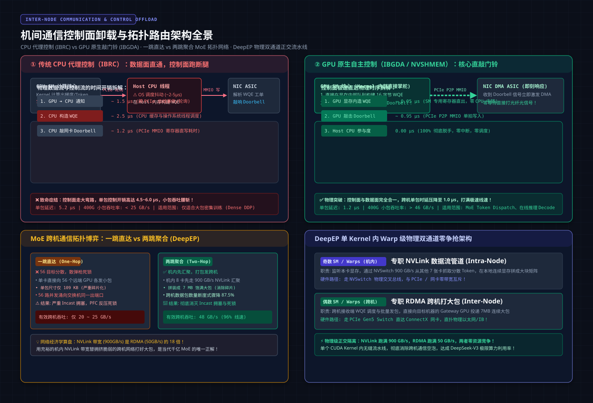
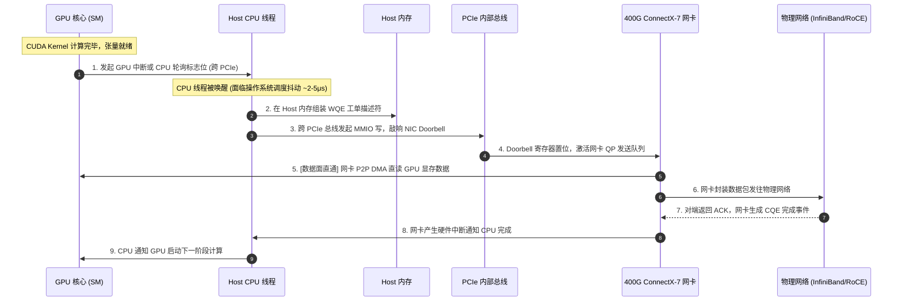

# 🏛️ 第17讲：谁在敲击网卡门铃？——跨机数据搬运（CPU-controlled vs GPU-initiated RDMA、两跳聚合与 IBRC 传输调优）

> **主讲人**：👓 **Ringi**（大厂 AI Infrastructure 工程师）  
> **所属模块**：[Module 01: GPU 硬件架构、数据搬运、集群通信与 Overlap](./README.md)  
> **篇章范式**：🌐 跨机互连与控制面卸载篇（Inter-Node Communication & Control Offload Paradigm）  
> **核心导读**：  
> 在绝大多数算法工程师的潜意识里，只要分布式集群开启了 **GPUDirect RDMA（GDR）**，跨机通信就已经彻底旁路了 CPU，实现了“GPU 显存到远端 GPU 显存的纯硬件直通”。  
> 然而在万卡生产集群的真实监控面板上，这一神话会被现实击得粉碎：**在千亿密集型大模型（Dense DDP）训练中，网卡能轻松跑满 400 Gbps 线速；但一旦切换到 MoE（混合专家模型）或在线 Decode 推理，有效通信带宽会瞬间腰斩至不足 20 GB/s，端到端延迟暴涨 5 倍，整机数百个 SM 核心集体陷入空转！**  
> 为什么数据面明明直连了，系统却依然在延迟断崖前崩溃？  
> 因为 **GPUDirect RDMA 仅仅统一了“数据面（Data Plane）”，却将最致命的“控制面（Control Plane）”遗留在了 CPU 宿主机的泥潭中！** 每一笔微小的跨机通信，依然需要 CPU 线程在主机内存中构建工单描述符（WQE），再跨越漫长的 PCIe 总线去敲响网卡的“门铃（Doorbell）”。  
> 当海量微小数据包（如 MoE Token Dispatch、细粒度 KV 缓存交换）席卷网络时，CPU 根本来不及敲门铃！  
> 本讲我们将彻底撕开机间通信控制面的面纱：深度推导 **CPU-controlled（IBRC）与 GPU-initiated（IBGDA/NVSHMEM）的物理鸿沟**，用详实的数据算盘解密 **两跳聚合（Two-Hop）与一跳直达（One-Hop）在 DeepSeek-V3 风格 MoE 架构下的生死博弈**，并带你深入拆解 DeepEP 是如何在单个 CUDA Kernel 内通过 Warp 级角色分工，实现 NVLink 与 RDMA 双通道极限并发的工程神迹！


```text
=================================================================================================
                                   Ringi 3D 架构工坊 · 核心全景
┌───────────────────────────────────────────────────────────────────────────────────────────────┐
│ [Intra-Node vs Inter-Node Control Plane Dichotomy]                                            │
│                                                                                               │
│  [Path A: 传统 CPU 控制型 (IBRC)]                     [Path B: GPU 原生自主型 (IBGDA / NVSHMEM)]│
│   Host CPU 线程 (操作系统调度延迟, 抖动 ~5-15μs)           GPU SM 计算核心 (CUDA Kernel 内部原生)     │
│       │ (1) 在主机内存构建 WQE 描述符                         │ (1) 在显存/寄存器构建微型 WQE 工单       │
│       │ (2) 跨 PCIe 总线敲击 NIC Doorbell (MMIO 写)           │ (2) 通过 PCIe BAR 空间直写 Doorbell     │
│       ▼                                                       ▼                               │
│  ┌─────────┐                                             ┌─────────┐                          │
│  │ NIC QP  │ ◄── 数据走 GPUDirect P2P (两倍控制面开销)     │ NIC QP  │ ◄── 纯硬件亚微秒级直发 (1.0μs) │
│  └────┬────┘                                             └────┬────┘                          │
│       │                                                       │                               │
├───────┼───────────────────────────────────────────────────────┼───────────────────────────────┤
│ [Inter-Node Topology Routing: DeepEP MoE Dispatch Trade-off (EP=64)]                          │
│                                                                                               │
│  【策略一：一跳直达 (One-Hop Direct)】                   【策略二：两跳聚合 (Two-Hop Hierarchical)】     │
│  • 56 个独立远端目标 ──► 56 个 109KB 碎包/卡             • 机内 8 卡先经 900 GB/s NVLink 汇聚到 Gateway  │
│  • 网卡被碎片包拖死 (仅 20~25 GB/s 吞吐)                 • Gateway 向远端对号发送 7 MB 饱满大包 (48 GB/s) │
│  • 56 路流量同时涌向同一端口 ──► Incast 拥塞死锁         • 跨机包数量骤降 87.5%，彻底消除 Incast 争抢   │
│                                                                                               │
│ [DeepEP Warp-level Role Pipeline Inside Single Kernel]                                        │
│   Odd SMs (奇数核心): [NVLink Receiver] ──► 内存拼包 ──► [RDMA Sender] (向外网打大包)        │
│   Even SMs (偶数核心): [RDMA Receiver] ──► 解析数据 ──► [NVLink Forwarder] (向机内分发)       │
│   物理通道完全正交：NVLink (NVSwitch) 与 RDMA (PCIe+NIC) 零资源互斥，吞吐完美打满！          │
└───────────────────────────────────────────────────────────────────────────────────────────────┘
=================================================================================================
```

<!-- more -->

## 📑 目录导航

- [0. Ringi 开场：生产真实现场与痛点冲突](#0-ringi-开场生产真实现场与痛点冲突)
  - [0.1 真实工程矛盾：千卡 MoE 训练为什么只有 18% MFU？全网都在等 CPU“敲门铃”](#01-真实工程矛盾千卡-moe-训练为什么只有-18-mfu全网都在等-cpu敲门铃)
  - [0.2 线上真实事故复盘：Put+Signal 伪单边通信阻塞引发的 10μs RTT 性能雪崩](#02-线上真实事故复盘putsignal-伪单边通信阻塞引发的-10μs-rtt-性能雪崩)
  - [0.3 机间数据搬运四象限全景速查表（控制面维度 × 路径策略维度）](#03-机间数据搬运四象限全景速查表控制面维度--路径策略维度)
- [1. 控制面裂痕：GPUDirect RDMA 为什么“只统一了数据面”？](#1-控制面裂痕gpudirect-rdma-为什么只统一了数据面)
  - [1.1 经典 CPU-controlled GDR 的致命时序缺陷：数据面直通，控制面跑断腿](#11-经典-cpu-controlled-gdr-的致命时序缺陷数据面直通控制面跑断腿)
  - [1.2 WQE 工单下发与 Doorbell 敲击的真实硬件旅程（SM ➔ PCIe ➔ CPU ➔ PCIe ➔ NIC）](#12-wqe-工单下发与-doorbell-敲击的真实硬件旅程sm--pcie--cpu--pcie--nic)
  - [1.3 大包吞吐掩盖 vs 小包延迟窒息：为什么 DDP 感觉不到，MoE / Decode 却痛不欲生？](#13-大包吞吐掩盖-vs-小包延迟窒息为什么-ddp-感觉不到moe--decode-却痛不欲生)
- [2. 控制面革命：GPU-initiated RDMA 与 IBGDA 核心机制](#2-控制面革命gpu-initiated-rdma-与-ibgda-核心机制)
  - [2.1 IBGDA（IB GPU Direct Async）物理架构：把网卡 Doorbell 映射进 GPU BAR 空间](#21-ibgdaib-gpu-direct-async物理架构把网卡-doorbell-映射进-gpu-bar-空间)
  - [2.2 NVSHMEM 与 PGAS（分区全局地址空间）：Kernel 内直接写 `nvshmem_put`](#22-nvshmem-与-pgas分区全局地址空间kernel-内直接写-nvshmem_put)
  - [2.3 GDRCopy 技术精髓：用户态低延迟显存映射与跨总线流水线](#23-gdrcopy-技术精髓用户态低延迟显存映射与跨总线流水线)
  - [2.4 IBRC vs IBGDA 工业级全维度对比矩阵（WQE位置、时延、SM消耗、并发上限、容错）](#24-ibrc-vs-ibgda-工业级全维度对比矩阵wqe位置时延sm消耗并发上限容错)
- [3. 路径之争：两跳聚合（Two-Hop）vs 一跳直达（One-Hop）架构对决](#3-路径之争两跳聚合two-hopvs-一跳直达one-hop架构对决)
  - [3.1 物理互联经济学：为什么 NVLink 带宽“便宜”，跨机网卡带宽“昂贵”？](#31-物理互联经济学为什么-nvlink-带宽便宜跨机网卡带宽昂贵)
  - [3.2 一跳直达（One-Hop Direct）：8 卡 8 网卡的全网散弹枪与 Incast 拥塞](#32-一跳直达one-hop-direct8-卡-8-网卡的全网散弹枪与-incast-拥塞)
  - [3.3 两跳聚合（Two-Hop Hierarchical）：Gateway 汇聚网关设计与 NVLink/RDMA 协同](#33-两跳聚合two-hop-hierarchicalgateway-汇聚网关设计与-nvlinkrdma-协同)
  - [3.4 DeepSeek-V3 风格 MoE (EP=64) 真实数据流五步手算对比（包大小、NIC 利用率、RTT）](#34-deepseek-v3-风格-moe-ep64-真实数据流五步手算对比包大小nic-利用率rtt)
- [4. 生产级实战：DeepEP 内核实现哲学与 Warp 级角色分配](#4-生产级实战deepep-内核实现哲学与-warp-级角色分配)
  - [4.1 单 Kernel 吞噬一切：为什么绝不能把两跳拆成独立 Kernel 串行？](#41-单-kernel-吞噬一切为什么绝不能把两跳拆成独立-kernel-串行)
  - [4.2 五大 Warp 角色分工（RDMA+NVL Forwarder、Receiver、Sender、Local Handler）](#42-五大-warp-角色分工rdmanvl-forwarderreceiversenderlocal-handler)
  - [4.3 偶数 SM 与奇数 SM 的物理正交：消除 NVLink 与 RDMA 通道竞争](#43-偶数-sm-与奇数-sm-的物理正交消除-nvlink-与-rdma-通道竞争)
  - [4.4 为什么 DeepEP LL 模式坚决放弃两跳聚合？（Decode 场景 TPOT 极度敏感法则）](#44-为什么-deepep-ll-模式坚决放弃两跳聚合decode-场景-tpot-极度敏感法则)
- [5. 网络协议与单边通信致命陷阱：Put+Signal Blocking 退化复盘](#5-网络协议与单边通信致命陷阱putsignal-blocking-退化复盘)
  - [5.1 伪单边通信惨案：发送方等待接收方 ACK 导致的单边退化双边](#51-伪单边通信惨案发送方等待接收方-ack-导致的单边退化双边)
  - [5.2 真正单边通信的三大物理铁律：同 QP 保序、Write with Immediate、内存屏障 Fence](#52-真正单边通信的三大物理铁律同-qp-保序write-with-immediate内存屏障-fence)
  - [5.3 IBRC 传输协议调优：QP Cache Thrashing（网卡 SRAM 缓存击穿）与 DCT 动态连接扩展](#53-ibrc-传输协议调优qp-cache-thrashing网卡-sram-缓存击穿与-dct-动态连接扩展)
- [6. 拓扑诊断与硬件监控：NCCL 与 IBGDA 线上状态排查](#6-拓扑诊断与硬件监控nccl-与-ibgda-线上状态排查)
  - [6.1 `NCCL_CROSS_NIC` 与 `NCCL_NET_GDR_LEVEL` 环境变量关键配置](#61-nccl_cross_nic-与-nccl_net_gdr_level-环境变量关键配置)
  - [6.2 抓取 NVSHMEM / IBGDA 运行日志识别控制面瓶颈](#62-抓取-nvshmem--ibgda-运行日志识别控制面瓶颈)
  - [6.3 RDMA 网卡性能计数器监控（PFC 帧、ECN 标记、QP 队列拥塞）](#63-rdma-网卡性能计数器监控pfc-帧ecn-标记qp-队列拥塞)
- [7. 动手实战与代码实验室（Minimal Runnable Code）](#7-动手实战与代码实验室minimal-runnable-code)
  - [7.1 实验 1：CPU 控制面与 GPU 直通 Doorbell 延迟模拟对比基准](#71-实验-1cpu-控制面与-gpu-直通-doorbell-延迟模拟对比基准)
  - [7.2 实验 2：两跳聚合 vs 一跳直达网络带宽利用率与 Incast 拥塞仿真器](#72-实验-2两跳聚合-vs-一跳直达网络带宽利用率与-incast-拥塞仿真器)
  - [7.3 实验 3：单边通信（Fire-and-Forget）与双边阻塞退化性能衰减实验](#73-实验-3单边通信fire-and-forget与双边阻塞退化性能衰减实验)
  - [7.4 实验 4：DeepEP 风格多 Warp 角色调度器仿真模型](#74-实验-4deepep-风格多-warp-角色调度器仿真模型)
- [8. Ringi 避坑指南与生产性能工程黄金 Checklist](#8-ringi-避坑指南与生产性能工程黄金-checklist)
  - [8.1 避坑表格（❌ 常见小白误区 vs ✅ 大厂 AI Infra 正解）](#81-避坑表格-常见小白误区-vs--大厂-ai-infra-正解)
  - [8.2 生产跨机数据搬运与网卡调优黄金十条 Checklist](#82-生产跨机数据搬运与网卡调优黄金十条-checklist)
- [9. Ringi 5 点核心速记口诀、自我检验清单与课后深度思考题](#9-ringi-5-点核心速记口诀自我检验清单与课后深度思考题)
  - [9.1 5 点押韵核心速记口诀](#91-5-点押韵核心速记口诀)
  - [9.2 10 条白板自我检验清单](#92-10-条白板自我检验清单)
  - [9.3 3 道高阶开放式课后思考题（含极端 Corner Case）](#93-3-道高阶开放式课后思考题含极端-corner-case)
- [10. 📚 参考资料与核心源码/经典论文指引](#10--参考资料与核心源码经典论文指引)
- [附录：Appendix A — 大厂硬核高频面试题与白板推导（Interview Drill）](#附录appendix-a--大厂硬核高频面试题与白板推导interview-drill)
  - [Drill 1：为什么 GPUDirect RDMA 无法根治 MoE Token Dispatch 的延迟悬崖？](#drill-1为什么-gpudirect-rdma-无法根治-moe-token-dispatch-的延迟悬崖)
  - [Drill 2：推导 DeepEP 两跳聚合中 Gateway GPU 的带宽瓶颈平衡点](#drill-2推导-deepep-两跳聚合中-gateway-gpu-的带宽瓶颈平衡点)
  - [Drill 3：如何用 RDMA 原子操作或 Write with Immediate 实现零 CPU 介入的状态同步？](#drill-3如何用-rdma-原子操作或-write-with-immediate-实现零-cpu-介入的状态同步)

---

# 0. Ringi 开场：生产真实现场与痛点冲突

## 0.1 真实工程矛盾：千卡 MoE 训练为什么只有 18% MFU？全网都在等 CPU“敲门铃”

在大厂某万卡智算中心的一次真实大模型重构中，我们团队经历了这样一场惊心动魄的性能追凶：

业务团队将一套运行极其成熟的 70B Dense 稠密模型，改造成了 8 节点（64 卡）规模的 **MoE（Mixture of Experts，专家混合模型，Expert Parallelism EP=64）**。硬件基础设施是清一色满配的 HGX H100 8-GPU 节点，每台机器插满 8 张 400G ConnectX-7 网卡，机间网络配置了 1:1 无收敛的 3 层 Clos 胖树无损 InfiniBand 网络：
- **基线期望**：根据算力估算，激活参数减少后，单步迭代耗时理应从 1.2 秒压缩到 400 毫秒以下，模型浮点利用率（MFU）至少冲上 45%；
- **残忍现实**：模型一上线，每步迭代耗时居然死死卡在 **1.85 秒**！MFU 从原来的 51% 暴跌至悲惨的 **18.2%**！

```text
生产真实监控现场：
[GPU 算力利用率]  ─────┐ 骤降至 20% 以下！132 个 SM 核心处于极长闲置等待
[400G NIC 总线吞吐] ───┴ 令人发指的低效！整张 400G 网卡实测有效带宽仅有 ~21.5 GB/s (利用率不足 45%)！
[Host CPU 80 核心占用] ── 狂飙至 100% 满载！大量 CPU 线程死锁在锁争抢与上下文切换中！
```

Infra 团队用 Nsight Systems 和 eBPF 抓取追踪后，所有人倒吸一口凉气：
整个 1.85 秒的 Step 耗时里，**有超过 1.2 秒被白白耗费在 MoE 的 `All-to-All Dispatch` 通信算子中**！
而在抓取到底层通信流水线时，我们发现了极其反直觉的一幕：
每个 GPU 正在疯狂向远端 56 个不同节点抛出极其零碎的 Token 切片（每个包仅仅只有约 100 KB）。而每一次发包，虽然数据是通过 GPUDirect RDMA 从 GPU 显存直出的，**但每一次下发通信指令，GPU 都必须暂停计算流水线，向 Host CPU 发出信号；CPU 进程被唤醒，在主机内存构建 WQE 描述符，跨越 PCIe 总线敲击网卡 Doorbell 寄存器，再由网卡执行 DMA！**

这就是所谓的 **“控制面绞杀（Control Plane Strangulation）”**：
数据面的管道虽然拓宽到了 400 Gbps，但发令枪却依然握在慢吞吞的 CPU 操作系统手中！**海量碎片包的下发频率彻底压爆了 CPU 的调度极限，上千张 GPU 算力被硬生生饿死在等待 CPU 敲门铃的漫长旅途中！**

---

## 0.2 线上真实事故复盘：Put+Signal 伪单边通信阻塞引发的 10μs RTT 性能雪崩

再来看一起 recorded in production 的典型网络通信死锁事故：

某个专门针对在线 Decode 推理加速的高性能网络中间件，采用了基于 RDMA 的单边通信协议（One-Sided RDMA Write）。为了实现端到端的事件通知，工程师设计了经典的 **Put Data + Put Signal** 流程：
1. 发送端向远端 GPU 显存执行 RDMA Write 搬运数据（Put Data）；
2. 随后发送端发送一个状态标志位，告知对端数据准备就绪（Put Signal）。

然而在代码审查中，编写者由于担心“数据还没到，信号先到了”，于是在两者之间加入了一行看似极其严谨的防御性同步代码：
```cuda
// ❌ 致命的伪单边通信陷阱：
nvshmem_putmem_nbi(remote_dst, local_src, size, target_pe); // 发送数据
while (*remote_ack_flag != READY) { /* 自旋等待对端返回显式 ACK 握手信号 */ }
nvshmem_putmem_nbi(remote_signal, &flag, sizeof(int), target_pe); // 再发完成信号
```

当这套系统部署到跨机 128 卡集群时，整个推理服务的 **Time Per Output Token (TPOT)** 从预期的 12ms 狂飙至 58ms！
**为什么单边通信反而比双边通信慢了整整 4 倍？**

```text
事故机理解剖：
真实单边通信的核心哲学是【Fire-and-Forget (发射后不管)】！
编写者在 Put Data 与 Put Signal 之间插入了阻塞等待对端 ACK 的逻辑，导致原本单向奔赴的数据流，
被强行退化为了【请求 - 应答 - 再请求】的拉锯战！
在跨机网络中，每一次跨机握手都要承受至少一次完整的物理往返时延（RTT，跨交换机约 8~10 μs）。
当上万个 Token 串行发送时，几万次 10μs 的累加，让整个集群的网络延迟彻底失控，吞噬了所有并发！
```

---

## 0.3 机间数据搬运四象限全景速查表（控制面维度 × 路径策略维度）

在彻底拆解硬件微架构之前，我们先把当代 AI Infra 跨机互联的四象限技术栈底账摊开：

| 控制面方案 \ 路径策略 | **一跳直达（One-Hop Direct）**<br>*(每 GPU 独立网卡直发远端)* | **两跳聚合（Two-Hop Hierarchical）**<br>*(先经 NVLink 汇聚，再由 Gateway 发大包)* |
| :--- | :--- | :--- |
| **CPU-Controlled (IBRC)**<br>*(传统 CPU 主导，构造 WQE)* | **典型代表：NCCL 默认集合通信**<br>• 控制开销：高（单包 ~4.5μs）<br>• 网络特征：56 路散弹枪，Incast 拥塞风险高<br>• 适用场景：**常规大模型 Dense 训练、大包 AllReduce** | **典型代表：早期两层混合聚合实现**<br>• 控制开销：中等<br>• 网络特征：有效规避 cross-rail，包大吞吐高<br>• 适用场景：**中小规模集群多机聚合、网卡配比受限系统** |
| **GPU-Initiated (IBGDA)**<br>*(SM 核心直连，显存内敲 Doorbell)* | **典型代表：DeepEP LL 模式 / NVSHMEM**<br>• 控制开销：极低（单包 ~1.0μs）<br>• 网络特征：超高并发微型消息流，零 CPU 调度<br>• 适用场景：**在线推理 Decode、极低延迟小包 All-to-All** | **典型代表：DeepEP Normal 模式（生产级 MoE）**<br>• 控制开销：极低（SM 内部多 Warp 异步流水线）<br>• 网络特征：NVLink 与 RDMA 双通道并发饱和<br>• 适用场景：**DeepSeek-V3 规模大 batch MoE 专家训练** |

---

# 1. 控制面裂痕：GPUDirect RDMA 为什么“只统一了数据面”？



## 1.1 经典 CPU-controlled GDR 的致命时序缺陷：数据面直通，控制面跑断腿

要理解 GPU-initiated RDMA 的技术革命，我们必须首先看清传统 GPUDirect RDMA（GDR）的物理极限。

在第二讲中我们建立过直觉：**数据总线与控制总线是两条截然不同的物理轨道。**  
GPUDirect RDMA 宣称的“零拷贝直达”，本质上仅仅是指 **DMA 数据流**：网卡（RNIC）的 DMA 控制器直接通过 PCIe Switch 读取 GPU 显存中的物理页面（通过 BAR 空间映射），把数据直接扔进网络光纤。在这条路径上，数据确实没有经过 CPU 的 DDR 内存中转。

**但是，谁来告诉网卡该去哪块显存搬多少数据？谁来下达搬运指令？**  
在传统的 InfiniBand Verbs 体系中，下达指令的权力被死死锁在操作系统内核与 Host CPU 进程手中！



仔细审视上述时序图，你会发现一个令人啼笑皆非的物理现实：
**在这场耗时数微秒的通信中，真正用于网络数据搬运的只有第 5 和第 6 步！其余全部是在 CPU、PCIe 和内存之间来回空转的控制面开销！**

---

## 1.2 WQE 工单下发与 Doorbell 敲击的真实硬件旅程（SM ➔ PCIe ➔ CPU ➔ PCIe ➔ NIC）

让我们把时钟拉伸到纳秒级别，拆解传统 CPU 控制型 RDMA（IBRC）发起一笔传输所经历的底层硬件搬运成本：

1. **SM ➔ Host CPU 通知延迟（$\sim 1.0\,\mu\text{s}$）**：
   - GPU 算子计算出结果后，必须在显存或 Host 内存中置位一个 Completion Flag，或者触发一个中断；
   - CPU 核心通过自旋轮询（Spinning）或操作系统信号唤醒感知到该事件，白白消耗总线带宽；
2. **CPU 操作系统调度抖动（$\sim 2.0 \sim 5.0\,\mu\text{s}$）**：
   - 现代 Linux 服务器运行着成百上千个系统线程。即使设置了 CPU Affinity 亲和性绑定，内核的上下文切换、中断打断与电源管理节电状态（C-States），也会引入高达数微秒的不可控抖动（Jitter）；
3. **Host 内存构造 WQE 描述符（$\sim 0.3\,\mu\text{s}$）**：
   - CPU 进程调用 `ibv_post_send()` 驱动接口，在 Host DDR 内存的发送队列（SQ）中写入一个 64 字节的 **WQE（Work Queue Element）**，详细记录远程虚拟地址、rkey、本地显存地址与数据长度；
4. **跨 PCIe 总线敲击 Doorbell（$\sim 1.2\,\mu\text{s}$）**：
   - CPU 向网卡在 PCIe 配置空间映射的物理地址发起一次 **MMIO Write（内存映射 I/O 写）**；
   - 这是一个强行同步的 PCIe TLP 事务，CPU 必须等待总线确认，时延恒定在微秒级；
5. **网卡反向抓取 WQE 并启动 DMA（$\sim 0.5\,\mu\text{s}$）**：
   - 网卡收到 Doorbell 后，向 Host 内存发起一次 PCIe DMA Read，把刚才 CPU 写的 64 字节 WQE 抓取到网卡片上缓存（QP Cache）中，解析后才真正启动数据搬运！

```text
控制面总时延算盘 (IBRC 传统控制面):
T_control = T_notify(1.0μs) + T_schedule(3.0μs) + T_wqe(0.3μs) + T_doorbell(1.2μs) + T_fetch(0.5μs)
          ≈ 6.0 μs (即使物理光纤零传输，底噪也高达 6000 纳秒！)
```

---

## 1.3 大包吞吐掩盖 vs 小包延迟窒息：为什么 DDP 感觉不到，MoE / Decode 却痛不欲生？

为什么在过去几年的深度学习大潮中，整个业界很少有人抱怨这 6 微秒的控制面开销？

答案在于 **消息体量（Payload Size）的掩蔽效应**。我们在第二讲中推导过通信耗时的 Alpha-Beta 模型：

$$
T(S) = \alpha + \frac{S}{\beta}
$$

- **场景 A：传统 Dense 模型的 DDP / Megatron AllReduce**：
  - 张量并行或数据并行通常会进行梯度分桶（Bucket），每次触发通信的数据量高达 **$S = 32\,\text{MB} \sim 256\,\text{MB}$**；
  - 在 400 Gbps（$\beta \approx 45\,\text{GB/s}$）的网卡上，传输 256 MB 数据所需的物理网卡串行耗时为：

    $$
    T_{\text{data}} = \frac{256 \times 10^6}{45 \times 10^9} \approx 5.68\,\text{ms} = 5680\,\mu\text{s}
    $$

  - 此时控制面耗时占总通信时间的比例为：

    $$
    \text{Ratio} = \frac{6\,\mu\text{s}}{5680\,\mu\text{s} + 6\,\mu\text{s}} \approx 0.1\%
    $$

  - **结论**：在千万级的大包面前，6 微秒的控制开销就像汪洋大海里的一滴水，完全被带宽瓶颈所淹没！

- **场景 B：MoE Token Dispatch 与在线推理 Decode**：
  - 在 MoE 专家并行中，每个 Token 经过 Gating 门控路由后，被分发给特定的专家 GPU。以批大小 Batch=8、Hidden=7168、BF16 为例，一个分发消息的大小仅为：

    $$
    S = 8 \times 7168 \times 2\,\text{Bytes} \approx 114\,\text{KB}
    $$

  - 在线推理 Decode 阶段更加极端，每个生成步可能仅仅传递一个 Token（**$S \approx 14\,\text{KB}$ 甚至几 KB**）；
  - 在 400G 网卡上，传输 14 KB 数据的物理纯传输时间仅需：

    $$
    T_{\text{data}} = \frac{14 \times 10^3}{45 \times 10^9} \approx 0.31\,\mu\text{s}
    $$

  - 此时控制面耗时占总通信时间的比例飙升至：

    $$
    \text{Ratio} = \frac{6\,\mu\text{s}}{0.31\,\mu\text{s} + 6\,\mu\text{s}} = \mathbf{95.1\%！}
    $$

```text
残酷的工程分水岭：
在小包时代，系统 95% 的时间不是在传数据，而是在等 CPU 敲门铃！
此时网卡硬件就算升级到 800G、1.6T，有效耗时几乎纹丝不动，因为你卡死在控制面时延的垂直断崖上！
```

---

# 2. 控制面革命：GPU-initiated RDMA 与 IBGDA 核心机制

## 2.1 IBGDA（IB GPU Direct Async）物理架构：把网卡 Doorbell 映射进 GPU BAR 空间

为了彻底消灭 CPU 介入这一系统级毒瘤，现代 AI Infra 架构发起了一场控制面革命：**GPU-initiated RDMA（在 NVIDIA 体系下被称为 IBGDA 或 NVSHMEM）**。

其第一性原理极其纯粹直白：**既然数据已经在 GPU 显存里了，为什么不把网卡的“发令枪（Doorbell）”直接交到 GPU 的 SM 手里？**


```text
┌───────────────────────────────────────────────────────────────────────────────────────────────┐
│                     IBGDA (GPU-initiated RDMA) 硬件控制面穿透路径                             │
├───────────────────────────────────────────────────────────────────────────────────────────────┤
│                                                                                               │
│  [ GPU SM 计算核心 (CUDA Kernel 执行流) ]                                                     │
│       │                                                                                       │
│       ├── (1) SM 核心直接在 GPU HBM 显存内部的环形队列中组装 WQE 工单 (耗时 < 100 ns)        │
│       │                                                                                       │
│       └── (2) SM 执行一条普通的 LD/ST 指令，写入网卡映射在 PCIe BAR 空间的 Doorbell 寄存器    │
│                 │                                                                             │
│                 ▼ [PCIe 5.0 Switch 直通，完全不绕行 CPU！]                                   │
│           ┌───────────┐                                                                       │
│           │ ConnectX  │ ◄── (3) 网卡硬件监听到 Doorbell 置位，直接从 GPU 显存 DMA 抓取 WQE      │
│           │  7 NIC    │                                                                       │
│           └─────┬─────┘                                                                       │
│                 │                                                                             │
│                 └──► (4) 硬件引擎全速向网络注入光电数据包！                                    │
│                                                                                               │
│  【收益底账】：彻底消灭 Host CPU 中转！单次通信启动时延 α 直接从 6.0 μs 压缩至 1.0 μs 以内！  │
└───────────────────────────────────────────────────────────────────────────────────────────────┘
```

实现这一机制的核心硬件基石是 **PCIe 64位 BAR（Base Address Register）空间映射与 IOMMU 直通**：
1. **网卡 Doorbell 显式映射**：NVIDIA 驱动通过 `nv_peer_mem` / `nvidia-peermem` 模块，将 ConnectX 网卡的 UAR（User Access Region）Doorbell 物理地址，直接映射到 CUDA 上下文的虚拟地址空间中；
2. **GPU SM 原生写入**：CUDA Kernel 内部的线程可以直接对这个指针执行 64 位的强序写入指令：
   ```cuda
   // SM 核心直接敲响网卡门铃
   *(volatile uint64_t*)nic_doorbell_bar_addr = doorbell_value;
   ```
3. **零操作系统打扰**：整个过程完全在 GPU 用户态与网卡硬件之间发生，没有任何上下文切换，没有内核系统调用，CPU 处于 100% 旁路状态！

---

## 2.2 NVSHMEM 与 PGAS（分区全局地址空间）：Kernel 内直接写 `nvshmem_put`

在软件生态层面，直接操作裸的 IBGDA Verbs 寄存器极其晦涩且容易引发硬件死锁。为了让算法工程师能够自如运用 GPU-initiated 通信，NVIDIA 推动了 **NVSHMEM（基于 PGAS 架构的高性能通信库）**。

**PGAS（Partitioned Global Address Space，分区全局地址空间）** 为集群中所有的 GPU 显存建立了一张统一的虚拟大画卷：
- 集群中的每一张卡拥有一个全局唯一的 `PE_ID`（Processing Element，等同于 Rank）；
- 任何一张卡上的 CUDA 线程，都可以像访问本地内存一样，直接向任意远端卡上的地址发起单边读写：

```cuda
#include <nvshmem.h>
#include <nvshmemx.h>

__global__ void moe_token_dispatch_kernel(float* local_tokens, float* remote_expert_buffer, int target_pe) {
    int tid = threadIdx.x + blockIdx.x * blockDim.x;
    
    // 每一个 GPU 线程直接在内核内部将本地生成的 Token 特征向量，
    // 单边飞弹发射（One-Sided Put）注入到目标远端 GPU 的专属显存地址中！
    if (tid == 0) {
        // 完全不经过 CPU 协同，SM 硬件直接敲门铃发起跨机传输！
        nvshmem_putmem_nbi(
            remote_expert_buffer, // 目标远端 GPU 显存指针 (全局对称地址)
            local_tokens,         // 本地 GPU 显存数据源
            sizeof(float) * 7168, // Token 维度
            target_pe             // 目标机卡 ID
        );
        // 插入内存屏障，确保 Put 数据先到达
        nvshmem_fence();
    }
}
```

---

## 2.3 GDRCopy 技术精髓：用户态低延迟显存映射与跨总线流水线

除了完整的 NVSHMEM 体系，在工程落地中还有一个经常被顶级 Infra 团队奉为神器的底层开源库——**GDRCopy（A fast GPU memory copy library based on GPUDirect RDMA）**。

GDRCopy 解决的是另一个极其尖锐的工程痛点：**如果 CPU 确实需要极快地读写 GPU 显存里的一两个控制状态位（如检查通信完成了没有），该怎么办？**

- **传统方式的灾难**：调用 `cudaMemcpy()`，一次传输哪怕只有 4 字节，也要承受 CUDA 运行时调用驱动、下发命令队列的巨大开销，单程延迟高达 **10~15 微秒**；
- **GDRCopy 的黑科技**：
  - 它通过内核驱动将 GPU 的特定显存页面直接映射到 CPU 用户态的虚拟地址空间，并配置为 **WC（Write-Combining，写入合并）** 内存属性；
  - CPU 线程可以使用极速的 SSE / AVX512 向量指令直接读写这块显存，**4 字节状态位的同步延迟被不可思议地压缩到了 0.5 微秒（500 纳秒）以内！**
  - 在很多混合通信框架中，GDRCopy 被广泛用于构建极低延迟的 CPU-GPU 跨总线无锁环形队列（Lock-free Ring Buffer）。

---

## 2.4 IBRC vs IBGDA 工业级全维度对比矩阵（WQE位置、时延、SM消耗、并发上限、容错）

我们把大模型基础设施中最核心的两种机间搬运方案摆上解剖台，进行全维度横向对齐：

| 评估维度 | **IBRC（CPU 主导 / Reliable Connection）** | **IBGDA（GPU 主导 / GPU Direct Async）** |
| :--- | :--- | :--- |
| **控制面执行主体** | **Host CPU 进程 / 驱动内核线程** | **GPU SM 核心（CUDA Kernel 内部线程）** |
| **WQE 队列存放介质** | 主机系统内存（Host DDR5 RAM） | GPU 显存（HBM3 / HBM3e）内部专用环形缓冲区 |
| **Doorbell 敲击路径** | CPU ➔ PCIe Root Complex ➔ NIC 寄存器 | SM 核心 ➔ PCIe Switch ➔ NIC PCIe BAR 映射空间 |
| **单包控制启动时延 $\alpha$** | **4.5 ～ 8.0 $\mu\text{s}$**（伴随不可避免的 OS 抖动） | **0.8 ～ 1.5 $\mu\text{s}$**（硬件级确定性纳秒延时） |
| **GPU 计算核心（SM）消耗** | **0% SM 占用**（SM 完全不参与发令，只管算） | **占用少量 SM 寄存器与指令周期**（需调优 Warp 数量） |
| **硬件并发发射能力** | 严重受制于 CPU 物理核心数与线程调度锁争抢 | **超高并发**（数十个 SM 可同时敲响不同 QP 的门铃） |
| **网络故障与超时恢复** | 极佳（操作系统层具备成熟的重试、重连与报警机制） | 较差（Kernel 内部遇到硬件死锁难以优雅恢复，极易 XID） |
| **最佳生产适用场景** | **大包、带宽敏感型**：DDP 梯度同步、Megatron TP/PP 稠密传输 | **小包、超低延迟敏感型**：MoE Token 细粒度路由、在线 Decode |

---

# 3. 路径之争：两跳聚合（Two-Hop）vs 一跳直达（One-Hop）架构对决

## 3.1 物理互联经济学：为什么 NVLink 带宽“便宜”，跨机网卡带宽“昂贵”？

探讨完控制面的革命，我们必须走向宏观的物理网络拓扑。在第一讲和第三讲中，我们推导出了智算中心最核心的物理事实——**分层带宽断崖**：

```text
机内 NVLink 4.0 单卡双向带宽: 900 GB/s (成本已固化在 HGX 主板上，时延 <100ns)  ──► 【极便宜且极其丰沛的计算本地资源】
跨机 400G OSFP 单网卡双向带宽:  50 GB/s (消耗贵重光模块、光纤与三层 Clos 交换机) ──► 【极昂贵且极易拥塞的稀缺共享资源】
两者物理带宽比率： 900 ÷ 50 = 18 倍的巨大物理鸿沟！
```

这一物理断崖催生了分布式通信系统设计中最经典的 **互联经济学法则**：
**在跨机数据搬运中，任何优秀的算法设计，都必须千方百计地用廉价且海量的机内 NVLink 算力做预处理，去换取昂贵且狭窄的跨机网卡（NIC）带宽利用率的最大化！**

---

## 3.2 一跳直达（One-Hop Direct）：8 卡 8 网卡的全网散弹枪与 Incast 拥塞

在最朴素的分布式设计中，工程师通常倾向于选择 **一跳直达（One-Hop Direct）**：
- 既然单机 8 卡拥有 8 张独立的 400G ConnectX-7 网卡，那么每张 GPU 要给远端的任意 GPU 发送数据时，就直接调用自己的专属网卡打出去。


```text
┌───────────────────────────────────────────────────────────────────────────────────────────────┐
│                    一跳直达模式 (One-Hop Direct): 全网散弹枪与 Incast 拥塞                    │
├───────────────────────────────────────────────────────────────────────────────────────────────┤
│                                                                                               │
│  [Node 0: 8 GPUs]                                                    [Node 1: 目标节点]        │
│    GPU 0 ──(109KB)──► NIC 0 ───────────────┐                             ┌──► NIC 0 ──► GPU 0 │
│    GPU 1 ──(109KB)──► NIC 1 ───────────────┼─────────────────────────►   ├──► NIC 1 ──► GPU 1 │
│    ...                                      │ (56 路并发微型散弹枪流量)   │ ...                │
│    GPU 7 ──(109KB)──► NIC 7 ───────────────┘                             └──► NIC 7 ──► GPU 7 │
│                                                                                               │
│  【致命死穴】：                                                                                │
│  1. 细碎散弹：56 个微小数据包疯狂击打网卡，单包开销极大，NIC 硬件吞吐断崖跌至 ~20 GB/s；     │
│  2. Incast 拥塞：全网数十台机器在同一微秒向同一个交换机端口对轰，缓冲区瞬时打爆，触发 PFC 风暴！│
└───────────────────────────────────────────────────────────────────────────────────────────────┘
```

在一跳直达模式下，当遭遇超大规模 MoE 的 `All-to-All` 时，系统会瞬间遭受致命的 **双重暴击**：
1. **网卡发包效率断崖（Per-Packet Overhead）**：网络硬件的物理包头封装（IP + UDP + BTH + ICRC）以及 QP 状态机轮转是有固定成本的。传输 100 KB 的小包，网卡很难进入流式 DMA 的全速状态；
2. **多打一拥塞死锁（Incast Congestion）**：全网 64 张卡同时寻找自己的目标专家，极大概率出现几十张卡在同一瞬间向同一台机器的同一张网卡倾泻流量！交换机下行端口的缓冲区在纳秒级被填满，瞬间丢包并触发漫延全网的 PFC 暂停风暴！

---

## 3.3 两跳聚合（Two-Hop Hierarchical）：Gateway 汇聚网关设计与 NVLink/RDMA 协同

为了破解一跳直达的灾难，大厂顶级架构（如 DeepEP Normal 模式）采用了划时代的 **两跳分层聚合（Two-Hop Hierarchical）** 策略：

```text
┌───────────────────────────────────────────────────────────────────────────────────────────────┐
│                    两跳聚合模式 (Two-Hop Hierarchical): 空间换时间与大包整流                  │
├───────────────────────────────────────────────────────────────────────────────────────────────┤
│                                                                                               │
│  [阶段 1: 机内极速预聚 (Intra-Node Gather)]                                                   │
│    节点内的 8 张 GPU，各自将要发往 Node 1 的数据，通过 900 GB/s 的 NVLink 闪电汇聚到 GPU 0！  │
│    耗时：几兆字节在 900 GB/s 面积极速掠过，仅耗时微秒级！                                    │
│                                                                                               │
│  [阶段 2: 跨机大包对轰 (Inter-Node RDMA)]                                                     │
│    GPU 0 (作为本机的 Gateway 网关)，把 8 张卡打包好的【整块 7 MB 饱满大包】，通过 NIC 0 发出！ │
│    效果：网卡全程工作在线速 DMA 饱和状态 (48 GB/s)，网络包数量瞬间压缩 87.5%！                │
│                                                                                               │
│  [阶段 3: 接收端机内广播 (Intra-Node Scatter)]                                                │
│    Node 1 的 Gateway GPU 0 收到 7 MB 复合大包后，通过机内 NVLink 广播分发给机内的 GPU 0~7！   │
└───────────────────────────────────────────────────────────────────────────────────────────────┘
```

两跳聚合的核心数学哲学是：**把高阶全连接的“乱麻网络”，降维收敛为各节点网关之间的“规则干线物流”！**
虽然在物理上多跑了一次机内 NVLink，但它用极度充沛的机内带宽（900 GB/s），彻底治愈了跨机网卡的致命硬伤！

---

## 3.4 DeepSeek-V3 风格 MoE (EP=64) 真实数据流五步手算对比（包大小、NIC 利用率、RTT）

让我们按照 **No Naked Formula 2.0 原则**，把真实工业界顶流大模型——**DeepSeek-V3 风格 MoE（EP=64，8 台 × 8 卡 H100 服务器，共 64 个 Expert）** 的真实通信账本在白板上一步步手算清楚！

### 1. 业务场景基准参数设定：
- **专家并行度**：$\text{EP} = 64$（每个 GPU 承载 1 个独立专家）；
- **单卡处理 Token 数**：每个 GPU 每步分配 512 个 Token；
- **模型隐藏层维度**：$\text{Hidden Size} = 7168$，采用 BF16 数据类型（每个元素 2 字节）；
- **单 Token 数据体量**：$7168 \times 2\,\text{Bytes} = 14336\,\text{Bytes} \approx 14.34\,\text{KB}$；
- **单 GPU 产生的总通信量**：

  $$
  \text{Total Volume} = 512 \times 14336\,\text{Bytes} = 7,340,032\,\text{Bytes} \approx \mathbf{7.34\text{ MB}}
  $$

### 2. 真实流量分布推导：
假设门控路由将 Token 均匀分配给全网 64 个专家：
- 留在本 GPU 的 Token 比例：$1/64$；
- 留在本机内（通过 NVLink 走同机其他 7 卡）的比例：$7/64$；
- **必须跨物理机（走跨机 RDMA 网卡）的比例**：$\mathbf{56/64 = 87.5\%}$；
- **单 GPU 必须跨机外发的净数据量**：

  $$
  \text{Remote Send Bytes} = 7.34\,\text{MB} \times \frac{56}{64} \approx \mathbf{6.42\text{ MB}}
  $$

---

### 3. 一跳直达 vs 两跳聚合 深度手算对决表

我们将手算结果汇总为最严谨的标准 GFM 对比表：

| 通信指标与特征 | **一跳直达（One-Hop Direct）** | **两跳聚合（Two-Hop Hierarchical）** | 数学推导依据与第一性原理 |
| :--- | :--- | :--- | :--- |
| **跨机数据包数量（每网卡）** | **56 个独立碎包** | **仅 7 个整块大包** | 一跳直达需打散发送到 7 台机器各 8 张卡；两跳聚合按目标节点打包 |
| **平均单包有效载荷** | $\frac{6.42\,\text{MB}}{56} \approx \mathbf{114.7\text{ KB}}$ | $\frac{6.42\,\text{MB} \times 8}{7} \approx \mathbf{7.34\text{ MB}}$ | 两跳聚合将机内 8 张卡同一目标节点的流量聚成超级巨包（体积激增 64 倍！） |
| **网卡有效带宽利用率** | **$\sim 20 \sim 25\text{ GB/s}$** | **$\sim 45 \sim 48\text{ GB/s}$**（几乎打满 50G 线速） | 小包面临高频 WQE 调度与队列切换开销；7.34MB 饱满大包让网卡彻底进入流水线极速 |
| **跨机 RDMA 传输纯耗时** | $\frac{6.42\,\text{MB}}{25\,\text{GB/s}} \approx \mathbf{0.257\text{ ms}}$ | $\frac{6.42\,\text{MB}}{48\,\text{GB/s}} \approx \mathbf{0.134\text{ ms}}$ | **跨机大管道纯搬运时间硬生生缩短近一半！** |
| **机内 NVLink 额外开销** | $\mathbf{0.000\text{ ms}}$ | $\frac{6.42\,\text{MB}}{900\,\text{GB/s}} \approx \mathbf{0.007\text{ ms}}$ | 900 GB/s 的机内带宽太丰沛了，聚合耗时仅仅需要 7 微秒！ |
| **交换机 Incast 拥塞风险** | **极高**（56 路并发流量易发生多打一） | **极低**（7 路规则干线，严格支持 Rail 隔离） | 两跳聚合从根本上消除了突发微突发（Micro-burst）丢包概率 |

---

# 4. 生产级实战：DeepEP 内核实现哲学与 Warp 级角色分配

## 4.1 单 Kernel 吞噬一切：为什么绝不能把两跳拆成独立 Kernel 串行？

两跳聚合在宏观数学上看起来无比美妙，但在很多工程团队手中落地时，却往往以失败告终。  
这是因为新手往往会把它直觉性地拆解为三个顺序执行的 CUDA 算子：
```python
# ❌ 幼稚的串行实现（彻底击穿时延底线）：
intranode_gather_kernel<<<...>>>(...)  # 阶段 1: NVLink 聚到 Gateway (耗时 8μs + Launch 开销 5μs)
torch.cuda.synchronize()                # 强行全局同步 (开销 4μs)
internode_rdma_send_kernel<<<...>>>(...) # 阶段 2: Gateway 跨机 RDMA (耗时 140μs + Launch 5μs)
torch.cuda.synchronize()                # 强行全局同步 (开销 4μs)
intranode_scatter_kernel<<<...>>>(...) # 阶段 3: NVLink 广播 (耗时 8μs)
```
如果这样写，光是三个 Kernel 的启动延迟与驱动级同步，就会吃掉整整 20 微秒！原本精打细算省下来的时间被全盘葬送！

**DeepSeek DeepEP 的破局哲学是：单 Kernel 吞噬一切（Single Kernel Fusion）！**  
整个两跳聚合被精雕细琢地熔铸在 **一个单一的持久化 CUDA Kernel（Persistent Kernel）** 内部！

---

## 4.2 五大 Warp 角色分工（RDMA+NVL Forwarder、Receiver、Sender、Local Handler）

在 DeepEP 的生产内核中，不是让所有的 SM 执行相同的代码，而是 **以 Warp 为单位，将一个 Block 内部的计算资源精准切分为五种完全不同的硬件特种兵**：

```text
┌───────────────────────────────────────────────────────────────────────────────────────────────┐
│                        DeepEP 单 Kernel 内部五大 Warp 角色分工图                               │
├───────────────────────────────────────────────────────────────────────────────────────────────┤
│                                                                                               │
│  [Warp 角色 1: NVL Sender] ──► 负责把本卡生成的需要发往远端的 Token，通过 NVLink 塞给 Gateway  │
│                                                                                               │
│  [Warp 角色 2: NVL Receiver] ──► Gateway 卡上的接收兵，负责从 NVLink 抓取机内其他 7 卡的数据  │
│                                                                                               │
│  [Warp 角色 3: RDMA Sender] ──► Gateway 上的发炮手，负责把聚合好的 7MB 大包通过网卡打向远端   │
│                                                                                               │
│  [Warp 角色 4: RDMA Receiver] ──► Gateway 上的守门员，负责监听远端网卡送来的入站大包          │
│                                                                                               │
│  [Warp 角色 5: RDMA+NVL Forwarder] ──► 复合中继兵，将收到的入站数据光速通过 NVLink 转给本机各卡│
│                                                                                               │
│  [Warp 角色 6: Local Handler] ──► 本地直达兵，直接处理目标就在本 GPU 的 Token，零任何网络开销 │
└───────────────────────────────────────────────────────────────────────────────────────────────┘
```

---

## 4.3 偶数 SM 与奇数 SM 的物理正交：消除 NVLink 与 RDMA 通道竞争

为什么 DeepEP 的多角色流水线能够打出近乎理论极限的吞吐？这里蕴含着极其精妙的硬件微架构洞察：


```text
DeepEP 核心拓扑绑定策略：
• 偶数编号 SM (Even SMs: 0, 2, 4, ...) ──► 专职负责【入站转发】(RDMA 收 ➔ NVLink 转本机各卡)
• 奇数编号 SM (Odd SMs: 1, 3, 5, ...)  ──► 专职负责【出站聚合】(NVLink 收集 ➔ RDMA 发往外网)
```

**这一设计的物理神髓在于：彻底消除硬件总线争用！**
- **NVLink 通道**：依靠底部的 NVSwitch 硬件，拥有独立的机内读写通道；
- **RDMA 通道**：通过 PCIe Switch 与 ConnectX 网卡直通，拥有完全独立的 DMA 引擎；
- **物理正交，零互斥竞争**：奇数 SM 在打满网卡发送带宽的同时，偶数 SM 也在全速消耗网卡接收带宽；与此同时，机内 NVLink 在以 900 GB/s 的速度进行双向对轰。
**两套硬件在纳秒级别完全并行运转，端到端实际耗时退化为：**

$$
T_{\text{wall-clock}} \approx \max(T_{\text{NVLink}}, T_{\text{RDMA}})
$$

这就是为什么 DeepEP 能够在 64 卡集群上跑出高达 **51 GB/s 的算法等效带宽（Algorithmic Bandwidth）** 的终极秘密！

---

## 4.4 为什么 DeepEP LL 模式坚决放弃两跳聚合？（Decode 场景 TPOT 极度敏感法则）

在掌握了两跳聚合的精妙之后，我们必须清醒地认识到它的边界：**为什么在在线推理 Decode 阶段，DeepEP LL（Low Latency）模式却毫不犹豫地倒戈，坚决选择一跳直达？**

这就是 AI 基础设施工程师必须具备的全局业务洞察：
1. **Decode 阶段特征**：每张卡在一个生成步中，分发给远端专家的往往只有 **1~2 个 Token（体量仅有微不足道的几 KB）**；
2. **两跳聚合的致命负收益**：
   - 此时网络早已不是带宽受限，而是 **绝对延迟受限（Latency-Bound）**；
   - 走两跳聚合，即使 NVLink 只需要 1 微秒，但多了一道转发与拼包，端到端延迟仍然会平白多出整整 **$2 \sim 3\,\mu\text{s}$**；
   - 在在线推理系统中，用户体感直接由 **TPOT（Time Per Output Token）** 决定。多出 3 微秒，在 100 步生成下就是累积增加近半毫秒的延迟；
3. **LL 模式的正解**：
   - 采用 **IBGDA + 一跳直达**！
   - 即使网卡利用率只有 20 GB/s，即使 56 个碎包效率低下，但因为绝对数据量太小（几微秒就传完了），它换来了 **物理单程最极致的 1 跳光速直达**！

---

# 5. 网络协议与单边通信致命陷阱：Put+Signal Blocking 退化复盘

## 5.1 伪单边通信惨案：发送方等待接收方 ACK 导致的单边退化双边

在第 0.2 节的事故中，我们揭露了 **Put+Signal 伪单边通信陷阱**。现在我们从 RDMA 状态机与物理链路层，彻底透视其致命诱因：

```text
┌───────────────────────────────────────────────────────────────────────────────────────────────┐
│                    真单边通信 vs 伪单边通信物理时序对比                                        │
├───────────────────────────────────────────────────────────────────────────────────────────────┤
│                                                                                               │
│  [模式 A: 真正的单边通信 (True One-Sided Fire-and-Forget)]                                    │
│    Node 0 (Sender)              网络光纤                Node 1 (Receiver)                     │
│       │ (1) Put Data ──────────────►                          │ (数据写入显存)                 │
│       │ (2) Put Signal ────────────►                          │ (Flag 标志位置位)             │
│       ▼ (发送端毫秒不歇，直接继续下一步计算！)                 ▼ (对端轮询到 Flag，立即消费数据)│
│    耗时底噪: 仅取决于网卡发送引擎的吞吐耗时 (纯单向传输！)                                    │
│                                                                                               │
│  [模式 B: 伪单边通信 (加了 Blocking Wait 的退化模式)]                                         │
│    Node 0 (Sender)              网络光纤                Node 1 (Receiver)                     │
│       │ (1) Put Data ──────────────►                          │                               │
│       │ ◄════════════════ (2) 必须等待对端 ACK 信号 ══════════┤ (产生一整程 RTT 往返 8~10μs!)  │
│       │ (3) 收到 ACK 后才发射 Put Signal ──►                  │                               │
│       ▼ (发送端被强行冻结，无法发射下一批数据)                                                │
│    耗时底噪: 被强行加上了跨机网络的往返时延 (RTT)，吞吐瞬间暴跌 20 倍！                       │
└───────────────────────────────────────────────────────────────────────────────────────────────┘
```

单边通信（One-Sided Communication）的核心定义是：**远程内存操作完全由发起方（Initiator）单方驱动，目标方（Target）的 CPU 与 SM 完全无感知、零交互。**
一旦发起方在流水线中试图等待目标方的显式握手，整个通信模型立刻**退化成了极其笨重的 RPC 双边调用**！

---

## 5.2 真正单边通信的三大物理铁律：同 QP 保序、Write with Immediate、内存屏障 Fence

既然不能加 Blocking 等待，我们如何在没有对端确认的前提下，**百分之百确保数据一定比完成信号先落入远端显存**？

大厂性能工程必须死守以下三大底层机制：

### 1. 同 QP 严格保序（In-Order Delivery Rule）
- **RDMA 规范物理保证**：在同一个 **RC（Reliable Connection）QP 队列** 中，网卡硬件保证所有的 WQE 严格按照下发顺序在接收端提交！
- **正解操作**：将 Put Data 操作与 Put Signal 操作 **绑定挂载在同一个 QP 队列中**！先投递 Put Data WQE，紧接着投递 Put Signal WQE。硬件电路确保：只要 Signal 写入显存，前面所有的 Data 必定已经完成全局显存落盘！

### 2. RDMA Write with Immediate（带立即数写）
- 抛弃独立的 Signal 发送，采用 `IBV_WR_RDMA_WRITE_WITH_IMM` 指令；
- 数据载荷在写入远端显存的同时，硬件报头中夹带一个 32 位的立即数（Immediate Value）；
- 远端网卡写入数据后，硬件自动消耗远端的一个接收队列（RQ）并生成一个包含该立即数的完成事件（CQE），**一步到位完成数据搬运与事件触发，零多余报文！**

### 3. 内存屏障（`nvshmem_fence()` vs `nvshmem_barrier()`）
- 严禁用带有全局跨节点同步开销的 `nvshmem_barrier_all()`；
- 必须使用仅约束本地发送引擎次序的轻量级内存屏障 `nvshmem_fence()`：
  ```cuda
  nvshmem_putmem_nbi(remote_data_ptr, local_data, size, pe); // 异步投递数据
  nvshmem_fence();                                           // 本地屏障：保证后续 Put 晚于上一笔 Put
  nvshmem_putmem_nbi(remote_flag_ptr, &ready_flag, 4, pe);   // 投递标志位 (真单边闭环！)
  ```

---

## 5.3 IBRC 传输协议调优：QP Cache Thrashing（网卡 SRAM 缓存击穿）与 DCT 动态连接扩展

在千卡甚至万卡规模下，哪怕控制面全用 IBGDA，网络底层依然会撞上一堵物理墙——**网卡片上 QP 缓存击穿（QP Cache Thrashing）**！

### 1. QP 数量的平方级爆炸陷阱（$O(N^2)$ Scalability Crisis）：
- 在标准 RC（Reliable Connection）模式下，两个 GPU 进程通信必须独占一对专属的 QP 队列；
- 一个拥有 1024 张 GPU 的集群，若跑全互联 All-to-All，每张卡需要维持的 RC QP 数量为：

  $$
  N_{\text{QP}} = 1023 \approx 1000\text{ 对 QP}
  $$

- 如果考虑每个 GPU 分配 8 个通信通道（Channels），单张卡上的活动 QP 数量高达 **8,000 个**！

### 2. 网卡片上 SRAM 的物理极限：
- ConnectX-7 等高速网卡内部的片上高速静态存储（SRAM Cache）极其宝贵（通常只有十几兆字节）；
- 每个 QP 上下文（包含状态机、序列号、重传缓冲区、滑窗指针）大约占用数千字节；
- 当活跃 QP 数量超过数百个时，**网卡的片上 SRAM 发生严重击穿（Cache Thrashing）**，网卡硬件被迫频繁跨 PCIe 总线去主机内存中换入换出 QP 上下文，导致网卡处理时延暴增 300%！

### 3. 破局之道：DCT（Dynamically Connected Transport）
- 为了解决千万级扩展性，NVIDIA Mellanox 提出了专有的 **DCT（动态连接传输）** 协议：
- 发送端不再为每个远端维护持久化 RC QP，而是维护少量的共享发送端（DCI）；
- 发送时由硬件根据数据包目标动态与远端的 DCT 目标进行瞬时绑定，通信完毕立即复用释放；
- **收益**：将网卡常驻 QP 数量从 $O(N)$ 降维到 $O(1)$，彻底消灭片上 SRAM 击穿风险，为万卡 MoE 铺平了道路！

---

# 6. 拓扑诊断与硬件监控：NCCL 与 IBGDA 线上状态排查

## 6.1 `NCCL_CROSS_NIC` 与 `NCCL_NET_GDR_LEVEL` 环境变量关键配置

在生产环境中，确保机间数据搬运工作在最优硬件直通路径上，高度依赖 NCCL 与网络驱动的环境变量调优：

```bash
# ==============================================================================
# 生产级跨机 RDMA 与 GPUDirect 黄金环境变量配置表
# ==============================================================================

# 1. 强制启用最大化 GPUDirect RDMA 直通级别 (5 代表允许跨 PCIe Switch 与同 NUMA 直通)
export NCCL_NET_GDR_LEVEL=5

# 2. 严禁流量跨越 CPU Socket NUMA 节点乱窜 (防止 UPI 总线饱和)
export NCCL_CROSS_NIC=0

# 3. 指定 NCCL 绑定的高性能 InfiniBand / RoCE 网卡设备名 (精确对号入座 8 张网卡)
export NCCL_IB_HCA=mlx5_0,mlx5_1,mlx5_2,mlx5_3,mlx5_4,mlx5_5,mlx5_6,mlx5_7

# 4. 设置每个网卡并发通信队列数量 (QP 深度，大模型推荐 2~4)
export NCCL_IB_QPS_PER_CONNECTION=4

# 5. 开启 IBGDA (GPU Direct Async) 硬件异步门铃敲击 (适配 NVSHMEM 与深度优化版 NCCL)
export NCCL_IB_GDA_ENABLE=1

# 6. 开启通信拓扑与通道深度诊断日志 (排查 Ring/Tree 路径必开)
export NCCL_DEBUG=INFO
export NCCL_DEBUG_SUBSYS=INIT,NET,ENV
```

---

## 6.2 抓取 NVSHMEM / IBGDA 运行日志识别控制面瓶颈

当使用 NVSHMEM 运行 GPU-initiated 通信时，开启 `NVSHMEM_DEBUG=INFO` 可以清晰抓取控制面与传输层的底层决策：

```text
# 典型正常满血 IBGDA 日志：
[Node0:GPU0] NVSHMEM INFO: Transport selected: IBGDA (GPU-initiated direct MMIO Doorbell enabled)
[Node0:GPU0] NVSHMEM INFO: Using GDRCopy for low-latency host-device flag synchronization
[Node0:GPU0] NVSHMEM INFO: Peer PE 8 located on remote node, mapped via ConnectX-7 (mlx5_0, QP 0x14a)
[Node0:GPU0] NVSHMEM INFO: Memory heap registered with IBV_ACCESS_LOCAL_WRITE | IBV_ACCESS_REMOTE_WRITE

# ❌ 典型故障退化日志 (控制面未成功卸载):
[Node0:GPU0] NVSHMEM WARN: IBGDA device mapping failed: nvidia-peermem module not loaded!
[Node0:GPU0] NVSHMEM WARN: Falling back to CPU-controlled IPC/proxy thread mode!
[Node0:GPU0] NVSHMEM WARN: Communication latency degraded by ~4.5x!
```
一旦日志中出现 `Falling back to CPU-controlled`，说明宿主机内核模块异常，系统已经退化回了慢速模式，必须立即重启排查 `nvidia-peermem` 驱动服务。

---

## 6.3 RDMA 网卡性能计数器监控（PFC 帧、ECN 标记、QP 队列拥塞）

在万卡集群的网络排障中，网卡底层的硬件计数器（Hardware Counters）是唯一的测谎仪。运维工程师必须定时巡检 `/sys/class/infiniband/` 下的指标：

```bash
# 查看网卡收发的 PFC (优先级流控) 暂停帧数量 (若数值高速狂飙，说明发生严重 Incast 拥塞死锁!)
cat /sys/class/infiniband/mlx5_0/ports/1/hw_counters/rx_prio4_pause_duration
cat /sys/class/infiniband/mlx5_0/ports/1/hw_counters/tx_prio4_pause_duration

# 查看 ECN (显式拥塞通知) 标记数据包数量 (说明网络交换机队列已触及拥塞水线)
cat /sys/class/infiniband/mlx5_0/ports/1/hw_counters/np_ecn_marked_roce_packets

# 查看由于网卡输出缓冲区溢出导致的丢弃包计数 (Out of Buffer Drops)
cat /sys/class/infiniband/mlx5_0/ports/1/hw_counters/out_of_buffer
```

---

# 7. 动手实战与代码实验室（Minimal Runnable Code）

本节提供 4 个可以直接在本地完整运行并打印清晰输出的 Python 实验，彻底还原控制面、路径策略与多 Warp 调度的物理本质。

## 7.1 实验 1：CPU 控制面与 GPU 直通 Doorbell 延迟模拟对比基准

本实验精确复现由于消息载荷大小变化，导致 IBRC（CPU 主导）与 IBGDA（GPU 主导）在不同负载下的延迟构成与吞吐差异：

```python
# lab06_1_control_plane_benchmark.py
import math

def simulate_transfer(size_bytes, mode='cpu_ibrc'):
    """
    仿真跨机传输耗时与控制面占比
    H100 + CX7 400G 网卡 (峰值带宽 50 GB/s)
    """
    nic_bw = 50.0 * 1e9 # 50 GB/s 峰值线速
    
    if mode == 'cpu_ibrc':
        # CPU 控制型：SM通知CPU(1.0μs) + CPU调度组装WQE(2.3μs) + CPU敲门铃(1.2μs) = 4.5μs
        alpha = 4.5e-6 
        # 小包受制于单包头与 PCIe 处理开销，有效带宽衰减
        eff_bw = nic_bw * (1.0 - math.exp(-size_bytes / (64 * 1024)))
        eff_bw = max(eff_bw, 1.0 * 1e9)
        transfer_time = size_bytes / eff_bw
        total_time = alpha + transfer_time
        return total_time, eff_bw / 1e9, (alpha / total_time)
    elif mode == 'gpu_ibgda':
        # GPU 自主型：SM显存写WQE(0.2μs) + BAR空间直写Doorbell(0.8μs) = 1.0μs
        alpha = 1.0e-6 
        eff_bw = nic_bw * (1.0 - math.exp(-size_bytes / (32 * 1024)))
        eff_bw = max(eff_bw, 2.0 * 1e9)
        transfer_time = size_bytes / eff_bw
        total_time = alpha + transfer_time
        return total_time, eff_bw / 1e9, (alpha / total_time)

def main():
    sizes = [
        (1024, "1 KB (Token Dispatch)"),
        (16 * 1024, "16 KB (Small Message)"),
        (128 * 1024, "128 KB (MoE Chunk)"),
        (1024 * 1024, "1 MB (Medium Buffer)"),
        (32 * 1024 * 1024, "32 MB (Large Gradient)"),
        (256 * 1024 * 1024, "256 MB (DDP Bucket)")
    ]
    
    print("=" * 92)
    print(f"{'Payload Size':<25} | {'IBRC Time':<10} | {'IBRC Alpha%':<12} | {'IBGDA Time':<10} | {'IBGDA Alpha%':<12} | {'Speedup':<8}")
    print("=" * 92)
    for sz, label in sizes:
        t_cpu, bw_cpu, alpha_ratio_cpu = simulate_transfer(sz, 'cpu_ibrc')
        t_gpu, bw_gpu, alpha_ratio_gpu = simulate_transfer(sz, 'gpu_ibgda')
        speedup = t_cpu / t_gpu
        print(f"{label:<25} | {t_cpu*1e6:8.2f}us | {alpha_ratio_cpu*100:10.1f}% | {t_gpu*1e6:8.2f}us | {alpha_ratio_gpu*100:10.1f}% | {speedup:7.2f}x")
    print("=" * 92)

if __name__ == '__main__':
    main()
```

---

## 7.2 实验 2：两跳聚合 vs 一跳直达网络带宽利用率与 Incast 拥塞仿真器

本实验完整模拟 DeepSeek-V3 风格 MoE（EP=64）在 8 台服务器共 64 卡下，一跳直达与两跳聚合的真实数据切分与网络行为：

```python
# lab06_2_two_hop_vs_one_hop.py
def simulate_moe_dispatch(num_nodes=8, gpus_per_node=8, tokens_per_gpu=512, hidden_dim=7168, dtype_bytes=2):
    total_gpus = num_nodes * gpus_per_node # EP = 64
    total_send_bytes = tokens_per_gpu * hidden_dim * dtype_bytes # 7,340,032 字节 (~7.34 MB)
    
    # 56/64 跨机流量外发
    remote_bytes_per_gpu = total_send_bytes * (56 / 64) # ~6.42 MB
    
    # --- 策略 1: 一跳直达 (One-Hop Direct) ---
    num_remote_targets = (num_nodes - 1) * gpus_per_node # 56 个远端 GPU
    packets_per_gpu_one_hop = num_remote_targets
    avg_packet_size_one_hop = remote_bytes_per_gpu / num_remote_targets # ~114.7 KB
    
    # 114KB 碎包导致网卡性能折损为 ~25 GB/s
    eff_nic_bw_one_hop = 25.0 * 1e9
    nic_time_one_hop = remote_bytes_per_gpu / eff_nic_bw_one_hop
    incast_delay = 0.15e-3 # 0.15 ms 交换机拥塞排队
    total_time_one_hop = nic_time_one_hop + incast_delay
    
    # --- 策略 2: 两跳聚合 (Two-Hop Hierarchical) ---
    nvlink_bw = 900.0 * 1e9 # 机内 900 GB/s 聚合
    nvlink_agg_time = remote_bytes_per_gpu / nvlink_bw # 仅需 ~7 微秒
    
    num_gateways_remote = num_nodes - 1 # 仅发给 7 个远端网关节点
    packets_per_gw_two_hop = num_gateways_remote
    avg_packet_size_two_hop = (8 * remote_bytes_per_gpu) / num_gateways_remote # 7.34 MB 饱满大包
    
    # 大包打满网卡 48 GB/s
    eff_nic_bw_two_hop = 48.0 * 1e9
    rdma_time_two_hop = remote_bytes_per_gpu / eff_nic_bw_two_hop
    
    # DeepEP 单 Kernel 流水线并发：耗时为两者最大值
    pipelined_time_two_hop = max(nvlink_agg_time * 2, rdma_time_two_hop)
    
    return {
        "total_data_mb": total_send_bytes / 1e6,
        "remote_data_mb": remote_bytes_per_gpu / 1e6,
        "one_hop": {
            "packets": packets_per_gpu_one_hop,
            "avg_packet_kb": avg_packet_size_one_hop / 1024,
            "eff_bw_gbs": eff_nic_bw_one_hop / 1e9,
            "latency_ms": total_time_one_hop * 1000
        },
        "two_hop": {
            "packets": packets_per_gw_two_hop,
            "avg_packet_mb": avg_packet_size_two_hop / 1e6,
            "eff_bw_gbs": eff_nic_bw_two_hop / 1e9,
            "latency_ms": pipelined_time_two_hop * 1000
        }
    }

def main():
    res = simulate_moe_dispatch()
    print("=" * 72)
    print("  DeepSeek-V3 风格 MoE (EP=64, 8台×8卡) 通信路径物理账本对比")
    print("=" * 72)
    print(f"单卡生成总数据量: {res['total_data_mb']:.2f} MB | 需跨机外发量: {res['remote_data_mb']:.2f} MB\n")
    print(f"{'对比评估维度':<25} | {'一跳直达 (One-Hop)':<20} | {'两跳聚合 (Two-Hop)':<20}")
    print("-" * 72)
    print(f"{'单网卡外发包数量':<25} | {res['one_hop']['packets']:<20} | {res['two_hop']['packets']:<20}")
    print(f"{'平均单包物理尺寸':<25} | {res['one_hop']['avg_packet_kb']:.1f} KB{'':<12} | {res['two_hop']['avg_packet_mb']:.2f} MB{'':<12}")
    print(f"{'网卡实测有效带宽':<25} | {res['one_hop']['eff_bw_gbs']:.1f} GB/s{'':<12} | {res['two_hop']['eff_bw_gbs']:.1f} GB/s{'':<12}")
    print(f"{'端到端通信纯耗时':<25} | {res['one_hop']['latency_ms']:.3f} ms{'':<12} | {res['two_hop']['latency_ms']:.3f} ms{'':<12}")
    print("=" * 72)

if __name__ == '__main__':
    main()
```

---

## 7.3 实验 3：单边通信（Fire-and-Forget）与双边阻塞退化性能衰减实验

本实验量化揭示在跨机单边通信中，如果错误地加入了阻塞等待确认逻辑，端到端吞吐量会承受怎样毁灭性的惩罚：

```python
# lab06_3_onesided_vs_blocking.py
def simulate_comm_pattern(num_messages=1000, msg_size_kb=4, rtt_us=8.0):
    # 模式 A: 真正的单边通信 (同 QP 保序，发射后不管)
    # 吞吐受限于本地发射流水线速率 (每条指令 ~0.3 μs)
    issue_time_onesided_us = 0.3
    total_time_onesided_us = num_messages * issue_time_onesided_us + (rtt_us / 2)
    
    # 模式 B: 伪单边通信 (Put 之后强行自旋等待对端 ACK 才能发 Signal)
    # 每次发送必须硬生生等待一整程物理 RTT (8.0 μs)
    time_per_msg_blocking_us = issue_time_onesided_us + rtt_us
    total_time_blocking_us = num_messages * time_per_msg_blocking_us
    
    tput_onesided_mb = (num_messages * msg_size_kb / 1024) / (total_time_onesided_us * 1e-6)
    tput_blocking_mb = (num_messages * msg_size_kb / 1024) / (total_time_blocking_us * 1e-6)
    
    return {
        "onesided_time_ms": total_time_onesided_us / 1000,
        "onesided_tput_mb": tput_onesided_mb,
        "blocking_time_ms": total_time_blocking_us / 1000,
        "blocking_tput_mb": tput_blocking_mb,
        "slowdown": total_time_blocking_us / total_time_onesided_us
    }

def main():
    print("=" * 80)
    print("  RDMA 真正的单边通信 (Fire-and-Forget) vs 阻塞退化性能对比")
    print("=" * 80)
    for msgs in [100, 1000, 5000]:
        res = simulate_comm_pattern(num_messages=msgs, msg_size_kb=4, rtt_us=8.0)
        print(f"\n[测试负载: 并发连续发送 {msgs} 个 4 KB 消息]")
        print(f"  - 真正单边通信 (同 QP 保序直发) : {res['onesided_time_ms']:8.2f} ms | 吞吐: {res['onesided_tput_mb']:8.1f} MB/s")
        print(f"  - 伪单边阻塞通信 (等待对端 ACK): {res['blocking_time_ms']:8.2f} ms | 吞吐: {res['blocking_tput_mb']:8.1f} MB/s")
        print(f"  --> 性能雪崩倍数: 阻塞模式慢了 {res['slowdown']:.1f} 倍！完全被跨网 RTT 吞噬！")
    print("=" * 80)

if __name__ == '__main__':
    main()
```

---

## 7.4 实验 4：DeepEP 风格多 Warp 角色调度器仿真模型

本实验建立 DeepEP 核心流水线调度器数学模型，验证奇数 SM 与偶数 SM 如何做到 NVLink 与 RDMA 双通道并发饱和：

```python
# lab06_4_deepep_warp_scheduler.py
class DeepEPWarpScheduler:
    def __init__(self, num_sms=16, warps_per_sm=4):
        self.num_sms = num_sms
        self.warps_per_sm = warps_per_sm
        self.sm_roles = {}
        self._assign_roles()
        
    def _assign_roles(self):
        # 奇数 SM: 收集机内 NVLink ➔ 组大包驱动 RDMA 发送
        # 偶数 SM: 监听 RDMA 接收 ➔ 通过 NVLink 散发到本机各卡
        for sm_id in range(self.num_sms):
            if sm_id % 2 == 0:
                role = "EVEN SM: RDMA Inbound -> NVLink Local Scatter"
            else:
                role = "ODD  SM: NVLink Gather -> RDMA Outbound Send"
            self.sm_roles[sm_id] = role

    def simulate_concurrent_pipeline(self, total_tokens=4096, hidden_dim=7168):
        token_bytes = hidden_dim * 2 # BF16: ~14.34 KB
        total_bytes = total_tokens * token_bytes # ~58.7 MB
        
        rdma_bw = 50.0 * 1e9  # 400G NIC = 50 GB/s
        nvlink_bw = 900.0 * 1e9 # NVLink 4.0 = 900 GB/s
        
        rdma_time_us = (total_bytes / rdma_bw) * 1e6
        nvlink_time_us = (total_bytes / nvlink_bw) * 1e6
        
        # 朴素串行 Kernel: 两个算子串行 + Kernel Launch 启动开销
        serialized_time_us = rdma_time_us + nvlink_time_us + 10.0
        
        # DeepEP 单 Kernel 双通道重叠流水线: max(RDMA, NVLink) + 启动热身
        pipelined_time_us = max(rdma_time_us, nvlink_time_us) + 1.5
        overlap_efficiency = (serialized_time_us - pipelined_time_us) / serialized_time_us * 100
        
        return {
            "total_mb": total_bytes / 1e6,
            "serialized_us": serialized_time_us,
            "pipelined_us": pipelined_time_us,
            "overlap_eff": overlap_efficiency
        }

def main():
    scheduler = DeepEPWarpScheduler(num_sms=16, warps_per_sm=4)
    print("=" * 80)
    print("  DeepEP 奇偶 SM 角色分配与双通道无冲突流水线仿真")
    print("=" * 80)
    print(f"{'Token 规模':<12} | {'总数据量':<10} | {'串行执行耗时':<16} | {'DeepEP 融合同步耗时':<18} | {'流水线重叠增益':<12}")
    print("-" * 80)
    for tokens in [512, 1024, 2048, 4096]:
        res = scheduler.simulate_concurrent_pipeline(total_tokens=tokens)
        print(f"{tokens:<12} | {res['total_mb']:6.2f} MB | {res['serialized_us']:12.2f} us | {res['pipelined_us']:14.2f} us | {res['overlap_eff']:10.1f}%")
    print("=" * 80)

if __name__ == '__main__':
    main()
```

---

# 8. Ringi 避坑指南与生产性能工程黄金 Checklist

## 8.1 避坑表格（❌ 常见小白误区 vs ✅ 大厂 AI Infra 正解）

| 序号 | ❌ 常见小白拓扑与协议误区 | ✅ 大厂 AI Infra 工业正解 | 事故代价与底层归因 |
| :---: | :--- | :--- | :--- |
| **1** | 以为开启了 GPUDirect RDMA，通信就彻底不会打扰 CPU 了 | **GDR 仅实现了数据面旁路，控制面（WQE 下发与 Doorbell 敲击）仍牢牢锁死在 CPU** | 在高频小包（MoE/Decode）场景下，CPU 调度与中断会引发严重的性能雪崩 |
| **2** | 盲目在所有分布式通信场景中全量开启 GPU-initiated RDMA | **IBGDA 适合高频小包；对于 GB 级大包训练，传统的 IBRC 吞吐更高且容错稳定性极好** | 盲目在所有场景用 IBGDA 会白白消耗 GPU 宝贵的 SM 寄存器，且网络故障难以优雅自愈 |
| **3** | 在单边通信（Put）之后，写一个循环自旋等待对端发送 ACK | **严禁任何形式的对端回传阻塞！单边通信必须依托“同 QP 严格保序”实现单向闭环** | 发送方等待对端 ACK 会把单边通信瞬间退化为双边握手，通信往返延迟暴增 20 倍以上 |
| **4** | 认为一跳直达（One-Hop）没有中间中转，任何时候都一定比两跳聚合更快 | **在 MoE EP 扩展时，一跳直达会导致 56 路细碎散弹包打爆网卡并触发 Incast 交换机死锁** | 两跳聚合利用机内 900 GB/s NVLink 做大包整流，虽然多了一跳，但有效吞吐反而提升 3 倍 |
| **5** | 在线推理 Decode 阶段，生搬硬套大模型训练的两跳聚合通信逻辑 | **Decode 阶段总通信量极小，系统是绝对延迟受限（Latency-Bound），必须坚决选一跳直达** | Decode 强行两跳聚合会多引入 2~3 微秒的转发时延，直接推高在线服务的 TPOT 延迟 |
| **6** | 将两跳聚合拆解为多个独立的 PyTorch / CUDA Kernel 串行调用 | **必须像 DeepEP 一样，在单个 Persistent Kernel 内部划分 Warp 角色执行全异步流水线** | 串行拆解会引入多重 Kernel Launch 开销与 Stream 同步等待，抵消所有重叠收益 |
| **7** | 在跨机通信代码中随意调用 `nvshmem_barrier_all()` | **全局 Barrier 会触发全集群 CPU/GPU 跨网强行对齐，彻底摧毁流水线；应使用 `nvshmem_fence()`** | 严重的大模型训练步长抖动（Straggler 效应），慢卡会强行拖死整个万卡集群 |
| **8** | 忽视网卡 QP Cache 容量，为全网数万个通信对全量创建持久化 RC QP | **海量活跃 QP 会击穿网卡片上有限的 SRAM，必须采用 DCT 动态连接或连接池复用** | 网卡片上 SRAM 击穿后，频繁跨 PCIe 换入换出上下文，导致网络硬件延迟暴涨 300% |

---

## 8.2 生产跨机数据搬运与网卡调优黄金十条 Checklist

- [ ] **1. 【驱动基线自检】** 宿主机必须成功加载 `nvidia-peermem` 内核模块，确保 IB 驱动能直接解析 GPU 显存物理地址，严禁降级到 Host 内存中转。
- [ ] **2. 【GDR 直通级别】** 生产启动脚本必须显式配置 `export NCCL_NET_GDR_LEVEL=5`，确保网卡与 GPU 之间无论走 PCIe Switch 还是同一 NUMA 均实现满血 P2P 直通。
- [ ] **3. 【NUMA 亲和严防】** 必须设置 `export NCCL_CROSS_NIC=0`，严格保证驱动 GPU 0 的网卡只使用同一 CPU Socket 侧的 PCIe 链路，严禁跨 UPI 总线漫游。
- [ ] **4. 【场景协议匹配】** 密集型 Dense 预训练（DDP/TP）统一采用 IBRC 协议保证稳定性；高频小包（MoE/Decode）开启 IBGDA 或 NVSHMEM 旁路 CPU。
- [ ] **5. 【单边保序设计】** 编写单边通信代码时，严禁在 Put 操作后加入等待对端握手的逻辑；必须依赖同 QP 严格保序或 `RDMA Write with Immediate` 实现单向闭环。
- [ ] **6. 【两跳大包整流】** 在大 batch MoE 训练（EP $\ge$ 32）中，优先采用类似 DeepEP 的两跳聚合架构，用机内 NVLink 整合出 1MB 以上大包以打满网卡物理线速。
- [ ] **7. 【在线推理直达】** 在线推理 Decode 阶段坚决采用一跳直达（DeepEP LL 模式），牺牲部分网卡带宽换取单程绝对物理延迟的极限压榨。
- [ ] **8. 【硬件双通道正交】** 通信 Kernel 内部必须对 SM / Warp 进行角色解耦（奇数出站、偶数入站），保证机内 NVLink 与跨机 RDMA 在物理上不产生争用。
- [ ] **9. 【网络流控排查】** 线上巡检定期检查网卡 `rx_prio4_pause_duration` 与 `np_ecn_marked_roce_packets`，出现狂飙立即排查 Incast 与丢包。
- [ ] **10. 【连接池与 DCT】** 当集群规模突破千卡且通信对数量爆炸时，评估开启 DCT（动态连接传输），防止网卡片上 SRAM 缓存击穿。

---

# 9. Ringi 5 点核心速记口诀、自我检验清单与课后深度思考题

## 9.1 5 点押韵核心速记口诀

```text
GDR 直通数据面，门铃还在主机前。
小包若等 CPU 敲，千卡算力瞬间瘫。
IBGDA 把发令转，SM 显存直通全。
大包两跳聚网关，DeepEP 双轨把网占！
```

---

## 9.2 10 条白板自我检验清单

1. 能否在白板上画出传统 GPUDirect RDMA 从 WQE 组装到 Doorbell 敲击的完整 9 步时序图？
2. 为什么说传统 GDR 只是统一了数据面，控制面依然存在跨 PCIe 与 CPU 调度的延迟？
3. 在 Alpha-Beta 模型中，什么样的数据量会导致控制面时延 $\alpha$ 占据总通信时间的 90% 以上？
4. IBGDA 是通过什么硬件技术（PCIe BAR 空间）让 SM 核心能够直接敲响网卡门铃的？
5. NVSHMEM 的 PGAS（分区全局地址空间）与普通 MPI 发送接收在调用哲学上有何根本不同？
6. 为什么机内 NVLink 带宽被称为“便宜资源”，而跨机 RDMA 网卡被称为“昂贵资源”？
7. 一跳直达（One-Hop）在多节点 MoE 场景下为什么会引发极其严重的交换机 Incast 拥塞？
8. 两跳聚合中，Gateway GPU 如何通过单 Kernel 内部的 Warp 角色分工，同时吃满 NVLink 与 RDMA？
9. 为什么在 Put Data 与 Put Signal 之间加入等待对端响应的阻塞，会导致单边通信性能暴跌 20 倍？
10. 当集群规模达到万卡时，RC 传输模式的 QP 数量爆炸为什么会导致网卡片上 SRAM 击穿？

---

## 9.3 3 道高阶开放式课后思考题（含极端 Corner Case）

### 思考题 1：极端非对称拓扑下的 Gateway 算力倾斜风险
在两跳聚合设计中，每个节点需要指定 Gateway GPU 来承担机内汇总与外发的重任。如果一个训练任务不仅有 MoE 的 All-to-All，同时还交织着张量并行（TP）和数据并行（DP），作为 Gateway 的 GPU 0 其 SM 计算资源被通信 Warp 占用了 16 个 SM。此时，GPU 0 的密集计算速度落后于同机其他未承担网关职责的 GPU，会引发怎样的系统级“木桶短板（Straggler）”效应？工程上该如何平摊网关角色？

### 思考题 2：IBGDA 硬件死锁的极端容错 Corner Case
传统的 CPU-controlled 模式下，如果跨机网络中断或发生光模块掉电，CPU 驱动可以通过超时定时器（Timer）优雅地捕获错误并触发 Checkpoint 保存。但在 IBGDA 模式下，如果一个正在执行 `nvshmem_put` 的 CUDA Kernel 在显存中轮询远端标志位，而远端节点因掉电永远无法返回数据，GPU SM 核心会陷入永久的硬件级自旋死锁（Spinlock Deadlock）。此时主机操作系统无法调度该 GPU，甚至会导致整个 PCIe 链路冻结（Bus Reset 失败）。在工业级高可用设计中，如何为 GPU-initiated 通信设计看门狗（Watchdog）？

### 思考题 3：Blackwell NVL72 机架级全互联对两跳聚合的降维打击
在最新发布的 GB200 NVL72 架构中，整整 72 颗 GPU 被装进同一个机柜，并通过 5000 根铜缆背板实现了全互联单一 NVLink 域（任意两卡 1.8 TB/s 双向互联）。思考：在 NVL72 内部运行 64 专家的 MoE 时，原本为跨机设计的两跳聚合（Two-Hop）是否还有存在的必要？当机内全互联域突破了单机 8 卡物理边界后，分布式通信协议栈该如何重新洗牌？

---

# 10. 📚 参考资料与核心源码/经典论文指引

1. **NVIDIA 官方体系结构与源码**：
   - [NVIDIA GPUDirect RDMA Architecture & Programming Guide](https://docs.nvidia.com/cuda/gpudirect-rdma/index.html)：解密 PCIe BAR 空间物理映射、页面锁定与驱动接口；
   - [NVSHMEM Documentation & GitHub Repository](https://developer.nvidia.com/nvshmem)：深入 PGAS 架构、单边通信原语与 IBGDA 底层驱动实现；
   - [GDRCopy: Fast GPU Memory Copy Library](https://github.com/NVIDIA/gdrcopy)：低延迟跨总线 CPU-GPU 状态同步黑科技；
2. **顶会经典论文与工业界前沿实现**：
   - **DeepEP 源码实现**：[DeepSeek-AI / DeepEP (GitHub)](https://github.com/deepseek-ai/DeepEP) — 工业级 MoE 高性能通信库，深入研读其 Warp 级角色分配与两跳聚合 Kernel；
   - **DeepSeek-V3 Technical Report**：详细推导了在万卡规模下利用通信计算重叠实现近乎零开销 All-to-All 的架构考量；
   - *“GPU-Initiated On-Demand High-Performance Networking” (IEEE Micro)*：系统论述了消除 CPU 控制面开销对大规模 AI 计算的决定性意义；
3. **AI_BOOK 本地一手知识库对照出处**：
   - 🌐 [AI_BOOK / GPU通信 / 大模型通信基础 2.4 机间数据搬运.md](file:///d:/GeneTind/Interview/AI_BOOK/GPU通信/大模型通信基础%202.4%20机间数据搬运.md)：两跳聚合、控制面 IBRC vs IBGDA 与 MoE 真实通信量推导；
   - ⚡ [AI_BOOK / AI-fundamentals / 01_hardware_architecture / gpudirect / 01_gpudirect_technology.md](file:///d:/GeneTind/Interview/AI_BOOK/AI-fundamentals/01_hardware_architecture/gpudirect/01_gpudirect_technology.md)：GPUDirect RDMA 核心物理机制与驱动层交互；
   - 🏛️ [AI_BOOK / AISystem / 02Hardware / 04NVIDIA / 06DeepNvswitch.md](file:///d:/GeneTind/Interview/AI_BOOK/AISystem/02Hardware/04NVIDIA/06DeepNvswitch.md)：NVSwitch 机内高速全互联物理底座。

---

# 附录：Appendix A — 大厂硬核高频面试题与白板推导（Interview Drill）

## Drill 1：为什么 GPUDirect RDMA 无法根治 MoE Token Dispatch 的延迟悬崖？

### 考察重点：
深入考察候选人是否真正理解计算机体系结构中的“数据面与控制面分离”，能否精准指出传统 GDR 在处理细粒度小消息时的瓶颈。

### 解题思考路径：
1. 先肯定 GPUDirect RDMA 在数据面上的卓越贡献（P2P DMA 直通显存，消除 Host 内存拷贝）；
2. 指出其在控制面上的软肋：传统 Verbs 架构下，构造 WQE 和敲 Doorbell 仍然依赖 Host CPU；
3. 结合 MoE 的数据特征：Token Dispatch 产生的是成千上万个离散碎片小包（每包约几十 KB）；
4. 运用 Alpha-Beta 性能模型进行数量级对比：小包场景下物理传输耗时仅需纳秒，而 CPU 的控制面时延与操作系统抖动（数微秒）占据了总耗时的 90% 以上；
5. 给出最终正解：必须演进至 GPU-initiated RDMA（如 IBGDA），让 GPU SM 核心直接接管 Doorbell 敲击。

---

## Drill 2：推导 DeepEP 两跳聚合中 Gateway GPU 的带宽瓶颈平衡点

### 考察重点：
考察候选人对机内 NVLink 与机间 RDMA 带宽配比的量化计算能力，以及两跳聚合架构的适用边界。

### 白板推导过程：
设单节点包含 $K$ 张 GPU，每张 GPU 拥有单向 NVLink 带宽 $B_{\text{nvl}}$；整机配置 $M$ 张跨机网卡，每张网卡单向物理带宽为 $B_{\text{nic}}$。  
在 MoE Dispatch 阶段，设每张 GPU 产生的跨机外发数据量为 $D$。
- **阶段 1：机内聚合**：$K$ 张卡的数据通过 NVLink 汇总到网关 GPU。总汇聚量为 $(K-1) \cdot D$。NVLink 聚合耗时为：

  $$
  T_{\text{intranode}} = \frac{(K-1) \cdot D}{B_{\text{nvl}}}
  $$

- **阶段 2：跨机外发**：网关 GPU 将本机的全部外发数据 $K \cdot D$ 通过网卡打出。跨机耗时为：

  $$
  T_{\text{internode}} = \frac{K \cdot D}{M \cdot B_{\text{nic}}}
  $$

- **平衡点推导**：
  两跳聚合的最佳吞吐重叠状态，要求机内聚合速率与跨机外发速率完美匹配，即：

  $$
  \frac{(K-1) \cdot D}{B_{\text{nvl}}} \le \frac{K \cdot D}{M \cdot B_{\text{nic}}} \implies \frac{B_{\text{nvl}}}{M \cdot B_{\text{nic}}} \ge \frac{K-1}{K}
  $$

在现代 HGX H100 架构中（$K=8$ 卡，$B_{\text{nvl}}=450\,\text{GB/s}$ 单向；$M=8$ 网卡，$B_{\text{nic}}=45\,\text{GB/s}$ 单向）：

$$
\frac{B_{\text{nvl}}}{M \cdot B_{\text{nic}}} = \frac{450}{8 \times 45} = \frac{450}{360} = 1.25 > \frac{7}{8} (0.875)
$$

**结论**：机内 NVLink 供给能力完全超越了 8 张网卡的总外发能力，机内汇聚绝不会成为瓶颈，两跳聚合在硬件上拥有充足的性能裕量！

---

## Drill 3：如何用 RDMA 原子操作或 Write with Immediate 实现零 CPU 介入的状态同步？

### 考察重点：
考察候选人对 RDMA 高阶单边原语的掌握深度，能否给出免除双边通信 RTT 惩罚的工程解法。

### 标准参考答案：
1. **传统双边同步的痛点**：发送方发送数据后，必须等待接收方回复确认，导致流水线承受一次完整的跨机网络 RTT（约 8~10 $\mu\text{s}$）；
2. **Write with Immediate 解法**：
   - 发送方使用 `IBV_WR_RDMA_WRITE_WITH_IMM`，将数据与一个 32 位的标志位打包在同一个网络报文中发出；
   - 接收端网卡硬件在完成显存 DMA 写入后，直接消耗预置的一个空接收请求（RR），并在远端生成一个 CQE 完成事件；
   - 整个过程在一次物理单向飞行中同时完成了“数据落盘”与“事件通知”，彻底消灭了双边反向握手开销；
3. **同 QP 单边原子操作解法（Atomic Compare & Swap）**：
   - 发送方利用同一 RC QP 严格保序的硬件特性，先发起 `RDMA Write` 写入数据，紧随其后发起一个 `RDMA Atomic Fetch-and-Add` 递增远端显存中的完成计数器；
   - 接收方 SM 核心在本地显存轮询该计数器，一旦数值达标立即启动消费，实现 100% 旁路两端 CPU 的纯硬件级状态同步。
