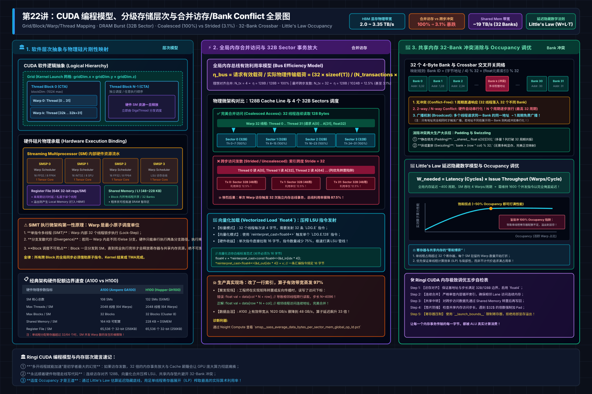
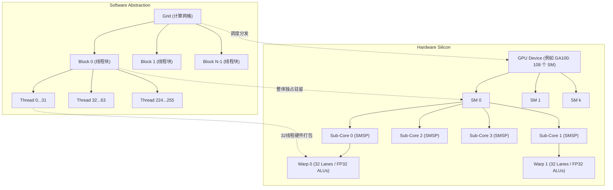
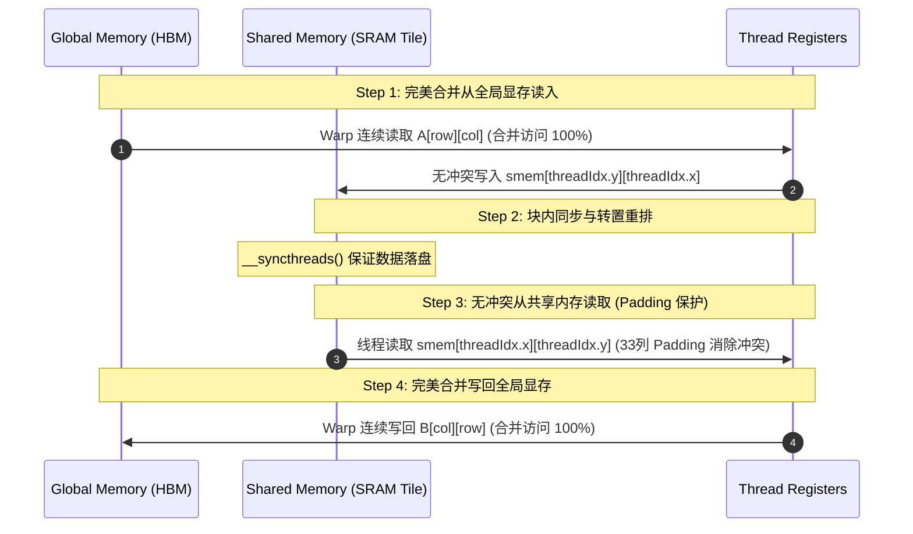
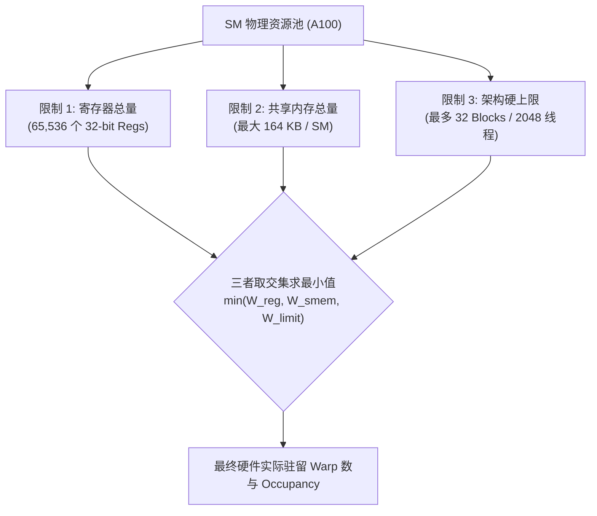

# 🏛️ 第22讲：为什么改了一行访问索引，算子吞吐暴跌10倍？——CUDA编程模型与内存层次深度解构（Grid/Block/Warp/Coalescing/Shared Memory）

> **主讲人**：👓 **Ringi**（大厂 AI Infrastructure 工程师）  
> **所属模块**：[Module 02: CUDA 编程与高性能算子优化](./README.md)  
> **篇章范式**：⚡ CUDA 编程与高性能算子优化篇（Kernel & Operator Optimization Paradigm）  
> **核心导读**：许多刚从 CPU 多线程或 PyTorch 算子开发转入 CUDA 的工程师，往往会带着朴素的“多线程并发思维”写代码：以为只要开了几万个线程，GPU 的庞大算力就会自动爆发。然而在线上真实场景中，往往仅仅因为把循环索引从 `[row * N + col]` 改成了 `[col * N + row]`，算子的实测有效带宽就从 1600 GB/s 骤降到 50 GB/s，整整蒸发了 97%！本讲将撕开 CUDA 软件层抽象的“温情面纱”，从硅片底层的 DRAM Burst、128-Byte Cache Line、32-Byte Sector、32 个 Shared Memory Bank 的交叉开关（Crossbar），一直穿透到 Warp 调度器的 Little's Law 延迟隐藏数学模型，彻底搞清楚 GPU 内存系统究竟是如何运转的。


```text
========================================================================================================================
                                    Ringi 3D 架构工坊 · CUDA 编程模型与内存层次全景
========================================================================================================================
[ 软件抽象层 (Logical Grid) ]
   ┌────────────────────────────────────────────────────────────────────────────────────────────────────────┐
   │ Grid: 全局计算网格 (Dim: gridDim.x × gridDim.y × gridDim.z)                                           │
   │   ├── Block (0, 0): 线程块 (blockDim: 256) ─────────────┐                                             │
   │   └── Block (B-1, 0): 线程块 (blockDim: 256) ───────────┼────────────────────────────────────────┐    │
   └─────────────────────────────────────────────────────────┼────────────────────────────────────────┼────┘
                                                             │ 硬件分发绑定 (Hardware Binding)        │
                                                             ▼                                        ▼
[ 物理硬件层 (Silicon SM Pool) ]                      ┌───────────────┐                        ┌───────────────┐
                                                      │ Streaming     │                        │ Streaming     │
                                                      │ Multiprocessor│                        │ Multiprocessor│
                                                      │ (SM 0)        │                        │ (SM k)        │
                                                      └───────┬───────┘                        └───────┬───────┘
                                                              │                                        │
[ SM 内部执行与存储流水线 ]                                    │                                        │
  ┌───────────────────────────────────────────────────────────┴────────────────────────────────────────┴───┐
  │  Warp Scheduler (4 SMSP per SM) ──► 发射 32-Thread Warp 指令 (SIMT Lock-Step)                          │
  │  ┌─────────────────────────────────┐   ┌──────────────────────────────────┐   ┌─────────────────────┐  │
  │  │ Registers (64K 32-bit regs/SM)  │   │ Shared Memory / L1 Data Cache    │   │ Constant / Texture  │  │
  │  │ 单周期延迟 / 私属于单线程        │   │ (48~228 KB/SM, 32 Banks @4B)     │   │ 专用只读缓存        │  │
  │  │ 1.5 ~ 2 TB/s 等效极速带宽       │   │ Crossbar 互联，~19 TB/s 带宽     │   │ 广播命中极速        │  │
  │  └────────────────┬────────────────┘   └────────────────┬─────────────────┘   └──────────┬──────────┘  │
  └───────────────────┼─────────────────────────────────────┼────────────────────────────────┼─────────────┘
                      │ 数据交换与暂存                       │ 共享中转与 Bank 无冲突访问      │
                      ▼                                     ▼                                ▼
[ 片上共享缓存与互联网络 (Crossbar / NOC) ]
  ┌────────────────────────────────────────────────────────────────────────────────────────────────────────┐
  │ L2 Cache (40MB ~ 50MB on A100/H100, 72B~128B Cache Line, 拆分为 32-Byte Sectors, 带宽 ~5 TB/s)        │
  └───────────────────────────────────────────────────┬────────────────────────────────────────────────────┘
                                                      │ 32-Byte 内存事务总线 (Memory Transactions)
                                                      ▼
[ 板载高带宽物理显存 (Device Global Memory) ]
  ┌────────────────────────────────────────────────────────────────────────────────────────────────────────┐
  │ HBM2e / HBM3 / GDDR6 (16GB ~ 96GB, 1.5 ~ 3.35 TB/s, DRAM Burst Length = 8/16, 延迟 ~400 Cycles)       │
  └────────────────────────────────────────────────────────────────────────────────────────────────────────┘
========================================================================================================================
```

<!-- more -->

## 📑 目录导航

- [0. Ringi 开场：生产真实现场与痛点冲突](#0-ringi-开场生产真实现场与痛点冲突)
  - [0.1 真实工程矛盾：改了一句索引，有效带宽蒸发 97%](#01-真实工程矛盾改了一句索引有效带宽蒸发-97)
  - [0.2 线上事故复盘：某千万级 LLM 混合精度 Embedding 算子优化性能悬崖](#02-线上事故复盘某千万级-llm-混合精度-embedding-算子优化性能悬崖)
  - [0.3 AI Infra 各层级映射全景速查表](#03-ai-infra-各层级映射全景速查表)
- [1. 软件抽象与硬件物理映射：Grid、Block、Thread 到底怎么跑在 SM 和 Warp 上？](#1-软件抽象与硬件物理映射gridblockthread-到底怎么跑在-sm-和-warp-上)
  - [1.1 软件三级抽象 vs 硬件四级实体的刚性绑定](#11-软件三级抽象-vs-硬件四级实体的刚性绑定)
  - [1.2 为什么 Warp 偏偏是 32 个线程？SIMT 架构第一性原理](#12-为什么-warp-偏偏是-32-个线程simt-架构第一性原理)
  - [1.3 Block 调度机制与不可抢占原则：资源原子分配的代价](#13-block-调度机制与不可抢占原则资源原子分配的代价)
  - [1.4 Ringi 工程师五问：Warp 调度视角下的 Shape 与 Cost](#14-ringi-工程师五问warp-调度视角下的-shape-与-cost)
- [2. 硬件访存第一性原理：DRAM Burst、Sector 与 128-Byte Cache Line 的物理本相](#2-硬件访存第一性原理dram-burstsector-与-128-byte-cache-line-的物理本相)
  - [2.1 硅片物理：为什么 GPU 不能单个 Byte 随心所欲读取？](#21-硅片物理为什么-gpu-不能单个-byte-随心所欲读取)
  - [2.2 内存事务粒度：128B Cache Line 与 4 个 32B Sector](#22-内存事务粒度128b-cache-line-与-4-个-32b-sector)
  - [2.3 No Naked Formula 2.0：全局内存事务利用率模型](#23-no-naked-formula-20全局内存事务利用率模型)
  - [2.4 对齐（Alignment）与连续（Contiguity）：缺少任何一个都会发生什么？](#24-对齐alignment与连续contiguity缺少任何一个都会发生什么)
- [3. 全局内存合并访问（Memory Coalescing）：从 1 次 Transaction 到 32 次 Transaction 的性能悬崖](#3-全局内存合并访问memory-coalescing从-1-次-transaction-到-32-次-transaction-的性能悬崖)
  - [3.1 连续访问 vs 跨步访问（Strided Access）的硬件事务放大](#31-连续访问-vs-跨步访问strided-access的硬件事务放大)
  - [3.2 矩阵行优先与列优先的数据流拆解（Row-Major 陷阱）](#32-矩阵行优先与列优先的数据流拆解row-major-陷阱)
  - [3.3 数据结构布局抉择：AoS（结构体数组）vs SoA（数组结构体）在 GPU 上的生与死](#33-数据结构布局抉择aos结构体数组vs-soa数组结构体在-gpu-上的生与死)
  - [3.4 向量化加载（Vectorized Load float4/int4）：用 `LDG.128` 压榨内存指令管线](#34-向量化加载vectorized-load-float4int4用-ldg128-压榨内存指令管线)
- [4. 共享内存（Shared Memory）与 Bank Conflict：32 个 Bank 的交叉开关与广播机制](#4-共享内存shared-memory与-bank-conflict32-个-bank-的交叉开关与广播机制)
  - [4.1 共享内存硬件结构：32 个 4-Byte Bank 与 Crossbar 网络](#41-共享内存硬件结构32-个-4-byte-bank-与-crossbar-网络)
  - [4.2 Bank Conflict 成因模型： $\gcd(\text{stride}, 32)$ 与 $N$-way 冲突串行化推导](#42-bank-conflict-成因模型gcdstrid-32与-n-way-冲突串行化推导)
  - [4.3 广播机制（Broadcast）与多播机制（Multicast）：同一 Bank 同一地址的免费盛宴](#43-广播机制broadcast与多播机制multicast同一-bank-同一地址的免费盛宴)
  - [4.4 消除 Bank Conflict 的两大杀招：静态填充（Padding）与地址异或（Swizzling）](#44-消除-bank-conflict-的两大杀招静态填充padding与地址异或swizzling)
  - [4.5 经典案例透视：2D 矩阵转置（Matrix Transpose）的“双头蛇”矛盾与解法](#45-经典案例透视2d-矩阵转置matrix-transpose的双头蛇矛盾与解法)
- [5. 延迟隐藏（Latency Hiding）与 Occupancy 真实算盘：为什么不是 Occupancy 越高越好？](#5-延迟隐藏latency-hiding与-occupancy-真实算盘为什么不是-occupancy-越高越好)
  - [5.1 硬件延迟隐藏机理：Warp Scheduler 如何在 400 周期 HBM 停顿间零开销上下文切换](#51-硬件延迟隐藏机理warp-scheduler-如何在-400-周期-hbm-停顿间零开销上下文切换)
  - [5.2 Little's Law（利特尔法则）在 GPU 体系结构中的数学推导](#52-littles-law利特尔法则在-gpu-体系结构中的数学推导)
  - [5.3 限制 Occupancy 的三座大山：寄存器、共享内存与 Block 阈值](#53-限制-occupancy-的三座大山寄存器共享内存与-block-阈值)
  - [5.4 破除高 Occupancy 迷信：Register Spilling 灾难 vs ILP 指令级并行与数据复用](#54-破除高-occupancy-迷信register-spilling-灾难-vs-ilp-指令级并行与数据复用)
- [6. 现代 GPU 内存层次全景演进：从 Volta/Ampere 到 Hopper TMA 与 Async Copy](#6-现代-gpu-内存层次全景演进从-voltaampere-到-hopper-tma-与-async-copy)
  - [6.1 Volta/Ampere 内存子系统演化：统一 L1/SMEM 与硬件异步拷贝 `cp.async`](#61-voltaampere-内存子系统演化统一-l1smem-与硬件异步拷贝-cpasync)
  - [6.2 Hopper 架构颠覆性突破：TMA（Tensor Memory Accelerator）硬件通路](#62-hopper-架构颠覆性突破tmatensor-memory-accelerator硬件通路)
  - [6.3 算子优化未来趋势：从裸写 CUDA 指令到 Triton 与 CUTLASS 的 DSL 抽象](#63-算子优化未来趋势从裸写-cuda-指令到-triton-与-cutlass-的-dsl-抽象)
- [7. 动手实战与代码实验室（Minimal Runnable Code）](#7-动手实战与代码实验室minimal-runnable-code)
  - [实验 1：全局内存 Stride 访存与合并访问带宽压测实验（`coalescing_benchmark.cu`）](#实验-1全局内存-stride-访存与合并访问带宽压测实验coalescing_benchmarkcu)
  - [实验 2：标量访问 vs 向量化加载（float vs float4）吞吐对比实验（`vectorized_load_benchmark.cu`）](#实验-2标量访问-vs-向量化加载float-vs-float4吞吐对比实验vectorized_load_benchmarkcu)
  - [实验 3：Shared Memory Bank Conflict 测量与 Padding/Swizzle 优化对比实验（`bank_conflict_benchmark.cu`）](#实验-3shared-memory-bank-conflict-测量与-paddingswizzle-优化对比实验bank_conflict_benchmarkcu)
  - [实验 4：Occupancy 与寄存器溢出（Spilling to Local Memory）性能悬崖实验（`occupancy_spill_benchmark.cu`）](#实验-4occupancy-与寄存器溢出spilling-to-local-memory性能悬崖实验occupancy_spill_benchmarkcu)
- [8. Ringi 避坑指南与生产黄金准则](#8-ringi-避坑指南与生产黄金准则)
  - [8.1 避坑表格：7 大常见小白错误理解 vs 大厂 AI Infra 正确认知](#81-避坑表格7-大常见小白错误理解-vs-大厂-ai-infra-正确认知)
  - [8.2 生产性能工程黄金 Checklist](#82-生产性能工程黄金-checklist)
- [9. Ringi 5 点核心速记口诀、自我检验清单与课后深度思考题](#9-ringi-5-点核心速记口诀自我检验清单与课后深度思考题)
  - [9.1 5 点押韵核心速记口诀](#91-5-点押韵核心速记口诀)
  - [9.2 10 条白板自我检验清单](#92-10-条白板自我检验清单)
  - [9.3 3 道高阶开放式课后思考题（含极限 Corner Case）](#93-3-道高阶开放式课后思考题含极限-corner-case)
- [10. 📚 参考资料与核心源码/经典论文指引](#10-参考资料与核心源码经典论文指引)
- [附录：Appendix A — 大厂硬核高频面试题与白板推导（Interview Drill）](#附录appendix-a--大厂硬核高频面试题与白板推导interview-drill)
- [🎨 配图工坊生图 Prompt 暂存区](#-配图工坊生图-prompt-暂存区)

---

# 0. Ringi 开场：生产真实现场与痛点冲突

### 0.1 真实工程矛盾：改了一句索引，有效带宽蒸发 97%

在日常的算子开发工作中，我们经常看到这样的代码改动。一位刚入职的同学在实现一个二维特征张量的转置或按列归约时，写了如下两段逻辑完全等价的 Kernel：

```cpp
// 场景 A：连续访问（Coalesced Access）
int tid = blockDim.x * blockIdx.x + threadIdx.x;
out[tid] = in[tid]; // 每个线程读取连续的 4 字节 float

// 场景 B：跳步跨列访问（Strided Access，比如跨步 stride = 32）
int tid = blockDim.x * blockIdx.x + threadIdx.x;
out[tid] = in[tid * 32]; // 每个相邻线程访问相隔 32 个 float 的地址
```

在高级语言思维（甚至 CPU 缓存思维）里，场景 B 虽然缓存局部性略差，但也是并发读取，按说吞吐降个 2~3 倍就到头了。然而，当把这段代码放到 NVIDIA A100（理论 HBM 带宽高达 2039 GB/s）上实测时，所有人都傻眼了：

- 场景 A 的实测吞吐：**1680 GB/s**（达到了峰值带宽的 82.4%）；
- 场景 B 的实测吞吐：**52.5 GB/s**（直接跌到了峰值带宽的 2.5%）！

**改了一行代码，有效带宽直接暴跌 97%！** 算子运行耗时硬生生拉长了 32 倍！

为什么 GPU 会对访存索引的连续性产生如此剧烈、近乎“报复性”的性能惩罚？如果你去翻官方文档，只会看到一句话：“_Global memory instructions support reading or writing words in size of equal to 32, 64, or 128 bytes... accesses are coalesced._” 但它从来没有把硅片硬件的物理开关、DRAM 突发传输、L1 缓存行分片以及 Warp 内 32 个线程的锁步请求过程完整地摆在你面前。

---

### 0.2 线上事故复盘：某千万级 LLM 混合精度 Embedding 算子优化性能悬崖

2024 年底，某大厂大模型推理团队在线上部署基于 LLaMA-70B 的长上下文问答服务（Context Length = 32K）。在压测首字时延（TTFT, Time To First Token）时，发现某定制的 `Fused_Embedding_LayerNorm` 算子成为了明显的性能瓶颈。

开发同学试图通过将输入张量在 GPU 显存内做一次原地通道重排，以方便后续 Tensor Core 的矩阵乘输入对齐。他在 CUDA 代码里简单地使用了一层 Shared Memory 作为中转，写下了如下逻辑：

```cpp
__shared__ float smem_buffer[32][32]; // 声明 32x32 的共享内存二维数组
int tx = threadIdx.x; // 0 ~ 31
int ty = threadIdx.y; // 0 ~ 31

// Step 1: 写入共享内存（连续线程写行）
smem_buffer[ty][tx] = input[ty * 32 + tx];
__syncthreads();

// Step 2: 转置读取共享内存（连续线程读列）
output[tx * 32 + ty] = smem_buffer[tx][ty];
```

在测试机上跑单元测试，数值完全对齐，误差为 0。但一旦上线接入大规模并发请求，线上 P99 时延直接从 45ms 飙升至 380ms，引发大量客户端超时熔断告警！

当 SRE 与 Infra 架构师介入，使用 **Nsight Compute (NCU)** 抓取该 Kernel 的硬件计数器时，发现了两个极其触目惊心的红线指标：

1. `l1tex__t_sectors_pipe_lsu_mem_global_op_st.sum`（全局内存写入事务数）相比理论数据量**放大了整整 32 倍**，SM 的内存管线被无数个零散的 32B 事务彻底阻塞；
2. `l1tex__data_bank_conflicts_pipe_lsu_mem_shared_op_ld.sum`（共享内存加载冲突数）爆表，报告显示该读取操作触发了**严重的 32-way Bank Conflict**！原本只需 1 个时钟周期的共享内存读取，硬生生被硬件串行化成了 32 个周期！

最终，架构团队仅在 `smem_buffer` 声明中增加了一个元素：`__shared__ float smem_buffer[32][33];`，并调整了全局写回的索引映射，算子耗时直接从 1.42ms 压缩到了 0.048ms，**整整提速 29.5 倍**！

这就是 CUDA 编程中最残酷的现实：**在 GPU 架构中，你不理解硅片的内存物理布局，你写的每一行代码都在向硬件“投毒”。**

---

### 0.3 AI Infra 各层级映射全景速查表

在深入原理前，我们先建立一张贯穿**软件抽象、硬件实体、存储物理介质、带宽与延迟**的全局对照底账：

| 软件抽象层级 (CUDA Software)  | 映射物理硬件实体 (GPU Hardware)      | 对应存储层次 (Memory Hierarchy)       | 物理容量 (A100-SXM4-80GB)            | 访问延迟 (Latency)                  | 理论吞吐带宽 (Bandwidth)              | 访问与共享作用域 (Scope)                    |
| :---------------------------- | :----------------------------------- | :------------------------------------ | :----------------------------------- | :---------------------------------- | :------------------------------------ | :------------------------------------------ |
| **Thread（线程）**            | **CUDA Core / ALU 运算单元**         | **Register File（通用寄存器）**       | 256 KB / SM (每线程最高 255 个)      | ~1 Cycle (单时钟周期)               | ~1.5 - 2.0 TB/s (SM 内等效)           | 私属于单个线程，线程退出即销毁              |
| **Thread（局部变量溢出）**    | **CUDA Core / LSU（加载存储单元）**  | **Local Memory（局部内存）**          | 受限于全局显存容量                   | ~400 Cycles (若 L1/L2 未命中)       | 等同于 Global Memory                  | 私属于单线程，物理上驻留于 HBM 显存         |
| **Warp（线程束，32 线程）**   | **Sub-Core (SMSP, Warp 调度器)**     | **Warp 寄存器切片 / Shuffle 寄存器**  | 32 线程并发调度实体                  | ~1 - 2 Cycles                       | 极高 (SM 内部交叉网络)                | Warp 内 32 个线程锁步可见                   |
| **Block（线程块）**           | **Streaming Multiprocessor (SM)**    | **Shared Memory（共享内存）**         | 可配置 48KB ~ 164KB / SM             | ~20 - 30 Cycles                     | ~19 TB/s (SM 片上 Crossbar)           | Block 内所有线程共享，生命周期随 Block 结束 |
| **Block（SM 级硬件缓存）**    | **SM 片上 L1 Cache 控制器**          | **L1 Data Cache（一级数据缓存）**     | 192 KB (与 Shared Memory 硬件共用)   | ~30 - 40 Cycles                     | ~19 TB/s (聚合片上吞吐)               | SM 硬件自动管理，按 128B Cache Line 缓存    |
| **Grid（网格，所有 Blocks）** | **GPU 芯片内全部 SM 集群**           | **L2 Cache（二级共享缓存）**          | 40 MB (A100) / 50 MB (H100)          | ~180 - 200 Cycles                   | ~5.0 TB/s (片上 Crossbar 聚合)        | 设备上所有 SM 共享，硬件自动管理            |
| **Grid（全局持久化数据）**    | **整个 GPU Device / HBM 颗粒**       | **Global Memory（全局内存 / HBM2e）** | 40 GB / 80 GB                        | ~400 - 500 Cycles                   | ~2039 GB/s (A100) / ~3350 GB/s (H100) | 全局所有线程可见，Host 与 Device 通信枢纽   |
| **Grid（全局只读常量）**      | **SM 常量缓存单元 (Constant Cache)** | **Constant Memory（常量内存 64KB）**  | 64 KB (物理在 DRAM，片上有 8KB 缓存) | 命中时 ~1 Cycle；未命中 ~400 Cycles | 广播命中时接近寄存器速度              | 全局只读，专享硬件单周期单值广播            |

---

# 1. 软件抽象与硬件物理映射：Grid、Block、Thread 到底怎么跑在 SM 和 Warp 上？

为了在深入具体细节前建立完整的物理心智模型，下方给出了 CUDA 编程模型、分级存储体系、全局内存合并访问与 32-Bank 冲突消除的工业级全景架构拓扑：



### 1.1 软件三级抽象 vs 硬件四级实体的刚性绑定

写 CUDA 代码时，我们调用的核函数通常长这样：

```cpp
dim3 grid(4, 2, 1);    // 8 个 Block
dim3 block(256, 1, 1); // 每个 Block 256 个线程
my_kernel<<<grid, block>>>(d_in, d_out);
```

很多工程师把这套层级结构仅仅当成了“方便程序员给多维数据做坐标系寻址的软件语法糖”。**这是大错特错的！** CUDA 的三级软件抽象（Grid -> Block -> Thread），在硅片硬件上有着极为严密的硬件实体映射契约：



1. **Grid 映射到 GPU Device**：一个 Grid 代表一个完整的 Kernel 发射任务，它包含了运行该任务所需的全部 Block。GigaThread 硬件调度引擎会负责将这些 Block 动态推送到芯片上各个空闲的 SM。
2. **Block 映射到 SM（Streaming Multiprocessor）**：
   - **铁律一：Block 不可跨 SM 切分**。一个 Block 内的所有线程，必须且只能被调度到同一个 SM 上执行！
   - **铁律二：SM 可以容纳多个 Block，但 Block 不能分割**。如果一个 SM 的寄存器或共享内存资源足够，它可以同时驻留 2 个、4 个甚至 32 个 Block；但如果一个 Block 占用的资源哪怕只超过了 SM 剩余资源的 1 Byte，这个 Block 就绝对无法进入该 SM，必须在全局调度队列中排队。
3. **Thread 映射到 CUDA Core / Lane**：每个 Thread 对应一个物理逻辑通道（Lane），拥有自己独立的寄存器上下文、程序计数器（PC）和执行状态。
4. **Warp 是真正的最小执行实体**：硬件根本不认识独立的“单个 Thread”。在硬件发射指令时，硬件调度器会以 **32 个连续线程**为一组，强制打包成一个 **Warp（线程束）**。

---

### 1.2 为什么 Warp 偏偏是 32 个线程？SIMT 架构第一性原理

你有没有好奇过：为什么 NVIDIA 从 2006 年发布 G80 架构至今，无论工艺从 90nm 演进到 4nm，架构从 Tesla 迭代到 Blackwell，**Warp 的大小永远锁死在 32，既不是 16，也不是 64？**

这背后是指令分发开销与硅片面积效率之间的终极工程平衡（Trade-off）：

1. **从 SIMD 到 SIMT**：
   - 如果采用传统的 **SIMD（单指令多数据）**，比如 CPU 的 AVX-512，程序员必须显式调用内在指令（Intrinsics），将 16 个 float 拼成一个 512-bit 寄存器。一旦有条件分支（`if-else`），代码编写将变得无比痛苦。
   - NVIDIA 提出了 **SIMT（单指令多线程）**：程序员写的是标量代码（以单线程视角写逻辑），但在硬件底层，32 个线程共享同一个指令译码器（Instruction Decoder）和指令发射器（Warp Scheduler）。
2. **硅片成本账本**：
   - 取指（Fetch）与译码（Decode）单元在芯片上是要消耗大量晶体管和静态功耗的。如果每个线程配一个译码器，GPU 就变成了 3000 个奔腾处理器，芯片面积将直接爆炸，根本放不下庞大的 ALU 计算阵列。
   - 将 32 个线程打包共享一组译码器，**硬件控制逻辑的开销被瞬间摊薄到了 1/32（约 3%）**，使得芯片可以将 90% 以上的面积全部用于 ALUs、Tensor Cores 和 SRAM！
3. **为什么不是 64 或 128？——分支分歧（Branch Divergence）的代价**：
   - 设想如果 Warp 是 64 线程，代码中写了一句：
     ```cpp
     if (threadIdx.x < 2) { do_A(); } else { do_B(); }
     ```
   - 在 SIMT 架构中，Warp 内的所有线程共享同一 PC 指针。硬件遇到分支时，只能先屏蔽掉后 30 个线程执行 `do_A()`，然后再屏蔽前 2 个线程执行 `do_B()`，这被称为**分支串行化（Divergence Serialization）**。
   - Warp 宽度越大，分支落入不同执行路径的概率就呈指数级上升，硬件算力浪费越严重；Warp 宽度越小，控制单元的开销就无法充分摊薄。经过 NVIDIA 多代芯片的大规模工艺仿真，**32 成了硅片面积效率与分支掩码开销的黄金分割点**。

---

### 1.3 Block 调度机制与不可抢占原则：资源原子分配的代价

在 CUDA 运行时中，Block 的调度存在两个神圣不可侵犯的底层原则：

1. **不可抢占性（Non-preemptive Execution）**：
   一个 Block 一旦被 SM 接纳并开始执行，除非该 Block 内的所有线程全部执行完毕并退出，否则它所占用的**寄存器空间、共享内存空间和 Warp 槽位绝不会被释放**，外部也无法中断或换出该 Block。
2. **执行顺序无关性（Independence Principle）**：
   硬件调度器可以以任意顺序调度各个 Block：可以并行跑、可以顺序跑、可以逆序跑。因此，**CUDA 严格禁止不同 Block 之间进行任何形式的强硬件同步（例如没有全局的 `__syncgrid()` 原语）**。如果你在代码中试图让 Block 0 等待 Block 1 的某个内存标志位，而此时 SM 槽位已被占满、Block 1 根本排不上队调度进 SM，系统就会立刻陷入死锁（Deadlock）！

---

### 1.4 Ringi 工程师五问：Warp 调度视角下的 Shape 与 Cost

在编写和调优任何 Kernel 之前，必须在脑海中运行 Ringi 五问审稿器：

- 📐 **Shape 是什么**：输入张量的物理连续步长（Strides）是怎样的？`dim3 block` 设置为多少？它是 32 的倍数吗？
- 💰 **Cost 花在哪里**：当执行访存指令时，Cost 是花在 ALU 的乘加计算上，还是在等待 HBM 数据的长达 400 个时钟周期上？
- ⚙️ **Machine 怎么跑**：SM 上的 Warp 调度器在每一个周期，能否挑出就绪的 Warp 来填补当前正在等待访存的 Warp 空档？
- 🔍 **Evidence 在哪里**：Nsight Compute 里的 `Warp Stall Sampling` 报出的是 `Stall Long Scoreboard`（等待全局显存）还是 `Stall Wait`（等待同步）？
- 🏭 **Production 怎么选**：在生产环境中，Block Size 设为 128、256 还是 512？如何权衡寄存器压力与 Occupancy？

---

# 2. 硬件访存第一性原理：DRAM Burst、Sector 与 128-Byte Cache Line 的物理本相

### 2.1 硅片物理：为什么 GPU 不能单个 Byte 随心所欲读取？

在软件层面，指针访问是字节寻址的，我们可以随心所欲地写 `char c = ptr[7];`。但如果你用高倍显微镜观察 GPU 显存（无论是 GDDR 还是 HBM）的物理硅片，你会发现微观物理世界完全是另一套物理法则。

现代显存是由数以亿计的微型电容（DRAM Cell）组成的阵列。每次读取数据时，必须经历：

1. **行地址激活（Row Activation）**：打开整行的晶体管开关，将一整行电容的电荷倾倒到感测放大器（Sense Amplifiers）中；
2. **列地址选通与突发传输（Column Read & Burst Transfer）**：在感测放大器锁存数据后，内部时钟以 **Burst Length（通常为 8 或 16）** 连续向外喷射数据。

如果 GPU 核心为了读取 1 个字节，就让板载内存的引脚单独传输 8 个 bit，那么整个总线控制器绝大部分时间都会被行激活延迟（ $t_{\text{RCD}}$ ）和预充电延迟（ $t_{\text{RP}}$ ）占死，吞吐量将直接跌入深渊！因此，**物理内存总线天生就是“整块打包批发”的，绝不做“零售”**。

---

### 2.2 内存事务粒度：128B Cache Line 与 4 个 32B Sector

为了适配 DRAM 的批发特性并尽可能降低无谓的功耗，NVIDIA 现代微架构（从 Pascal、Volta 到 Ampere、Hopper）将 GPU 片上的内存事务层级精细划分成了两级粒度：

```text
+---------------------------------------------------------------------------------------------------+
|                             L1 Data Cache Line (总宽: 128 Bytes, 物理连续且对齐)                   |
+---------------------------------+---------------------------------+-------------------------------+
|  Sector 0 (32 Bytes, 对齐于0)    |  Sector 1 (32 Bytes, 对齐于32)  |  Sector 2 (32B) | Sector 3 (32B) |
+---------------------------------+---------------------------------+-----------------+---------------+
                 ▲                                  ▲
                 │ (1 次 32B 事务)                  │ (若无线程命中则不发射事务)
                 └─────────────── HBM / L2 数据总线 ──┴─────────────────
```

- **L1 Data Cache Line 粒度：128 字节**。在 SM 内部，L1 缓存的管理单位是 128 Bytes，起始地址必须严格对齐到 128 字节边界（即物理地址最后 7 位全为 0：`addr % 128 == 0`）。
- **L2 Cache / HBM 总线事务粒度：32 字节（Sector）**。一条 128 字节的 Cache Line 在逻辑上被切分为 **4 个独立的 32 字节扇区（Sector 0 ~ 3）**。
- **按需激活机制（Sector Activation）**：
  当一个 Warp 发起全局内存读取时，L1 缓存控制器会分析这 32 个线程请求的虚拟地址覆盖了哪些 Sector：
  - 如果这 32 个线程访问的数据全部落在 **同一个 32 字节扇区** 内，硬件只向 L2/HBM 总线发射 **1 个 32B 事务**；
  - 如果散落在该 Cache Line 的 4 个扇区内，硬件发射 **4 个 32B 事务**（传输 128 字节）；
  - 如果 32 个线程每人访问一个完全无关的内存地址，跨越了 32 条不同的 Cache Line，硬件就必须串行发射 **32 个独立的 32B 事务**（总共搬运 $32 \times 32 = 1024$ 字节）！

---


### 2.3 No Naked Formula 2.0：全局内存事务利用率模型

为了在系统工程中精确量化访存模式的好坏，我们拒绝任何公式的凭空出现，严格推导全局内存事务利用率模型：

##### ① 为什么需要算它？

衡量我们在全局内存上花出去的真金白银（硬件实际搬运的物理字节数），有多少真正转化成了算法需要的有效负载。

##### ② Mental Model（物理直觉比喻）

这就像去建材市场运瓷砖。货车起步运输的最小集装箱是 32 公斤（32B Sector）。如果你的 32 个工人每人要一块 1 公斤的瓷砖，且都在同一个集装箱里，一车刚好拉走，载荷利用率 100%；但如果 32 个工人每人指名要放在 32 个不同仓库的瓷砖，货运系统就必须派出 32 辆货车分别运 32 个集装箱过来，哪怕每辆车里只装了 1 公斤瓷砖！此时运力利用率暴跌到 3.125%，公路网络（总线）直接瘫痪。

##### ③ Tiny Calculator（极简数字手算）

假设 Warp 内 32 个线程，每个线程加载 1 个 `float`（4 字节），有效数据总量为：

$$
D_{\text{useful}} = 32 \times 4 \text{ Bytes} = 128 \text{ Bytes}
$$

- **情况 1（连续且对齐）**：线程 0~31 分别读取地址 $0, 4, 8, \dots, 124$。这 128 字节恰好填满 1 个 128B Cache Line 内的 4 个 32B Sectors。
  - 硬件发射事务数： $N_{\text{trans}} = 4$ 次（每个 32B），搬运总量： $4 \times 32 = 128 \text{ Bytes}$。
  - 利用率： $128 / 128 = 100\%$。
- **情况 2（跳步 stride = 32）**：线程 0 读取地址 0，线程 1 读取地址 $32 \times 4 = 128$，线程 2 读取地址 256……每个线程的地址都跨越了一条全新的 Cache Line！
  - 硬件发射事务数： $N_{\text{trans}} = 32$ 次（每个 32B），搬运总量： $32 \times 32 = 1024 \text{ Bytes}$。
  - 利用率： $128 / 1024 = 12.5\%$（在某些未启用 Sector 的架构上甚至为 $128 / (32 \times 128) = 3.125\%$ ）。

##### ④ Formal Model（标准公式）

定义全局内存事务总线效率 $\eta_{\text{mem}}$ 为：

$$
\eta_{\text{mem}} = \frac{\sum_{i=0}^{31} \text{SizeOf}(\text{Type}_i)}{N_{\text{transactions}} \times \text{Size}_{\text{sector}}}
$$

其中：

- $\text{SizeOf}(\text{Type}_i)$ 为每个活跃线程实际请求的数据字节数；
- $\text{Size}_{\text{sector}} = 32 \text{ Bytes}$（NVIDIA Volta/Turing/Ampere/Hopper 架构）；
- $N_{\text{transactions}}$ 为该 Warp 本次访存指令最终触发的物理扇区请求总数，满足 $1 \le N_{\text{transactions}} \le 32$。

##### ⑤ Sanity Check（数量级校验）

- 当 $\eta_{\text{mem}} = 100\%$ 时，A100 的 2039 GB/s 理论带宽能提供 **2039 GB/s 的有效算子吞吐**；
- 当 $\eta_{\text{mem}} = 12.5\%$ 时，哪怕内存控制器被打满（100% 繁忙），算子所能拿到的有效吞吐上限也被死死卡在 $2039 \times 0.125 = \mathbf{254.8 \text{ GB/s}}$！这也是为什么非合并访存下算子会发生数十倍性能断崖的根本物理原因。

---

### 2.4 对齐（Alignment）与连续（Contiguity）：缺少任何一个都会发生什么？

在工业级开发中，很多初学者常常误以为“只要线程访问连续就自动合并了”。**绝对不是！**
合并访问有两个充分必要条件：

1. **Contiguity（连续性）**：Warp 内相邻线程请求相邻的内存地址；
2. **Alignment（对齐性）**：这批连续地址的起始基地址，必须对齐到事务粒度边界。

让我们看看如果**连续但不齐**会发生什么：

```text
地址空间:  | 0    ...   28 | 32   ...   60 | 64   ...   92 | 96   ...   124 | 128  ...  156 |
物理扇区:  [   Sector 0    ] [   Sector 1    ] [   Sector 2    ] [   Sector 3    ] [   Sector 4    ]
-----------------------------------------------------------------------------------------------
对齐访问:  [ T0, T1, ... T7] [ T8, ... T15 ] [T16, ... T23 ] [T24, ... T31 ]   ==> 触发 4 个 Sectors
偏移 4B :       [ T0, ... T6 ] [ T7, ... T14 ] [T15, ... T22 ] [T23, ... T30 ] [T31] ==> 触发 5 个 Sectors!
```

如上图所示，当起始指针偏移了仅仅 4 个字节（`float *ptr = base + 1;`），原本能完美装入 4 个扇区（128B）的 32 个 float，首尾被强行挤出到了第 5 个扇区（Sector 4）中！
**结果：仅仅因为偏移了 4 个字节，内存事务数从 4 变成了 5，总线带宽凭空浪费了 20%！**

---

# 3. 全局内存合并访问（Memory Coalescing）：从 1 次 Transaction 到 32 次 Transaction 的性能悬崖

### 3.1 连续访问 vs 跨步访问（Strided Access）的硬件事务放大

跨步访问（Strided Access）是大模型训练与推理中最隐蔽的“性能杀手”。最典型的场景就是多头注意力（Multi-Head Attention）中的张量转置与切片。

假设我们有一个张量，其内存排布如下：

```cpp
// 线程编号 tid 读取 data[tid * stride]
```

我们用一张图来直观对比不同 `stride` 下，硬件发射的扇区数量与总线吞吐对比：

| 跨步步长 (Stride) | Warp 访问的地址范围                   | 命中的 32B Sector 数量 | 硬件传输字节数 | 有效载荷字节数 | 事务总线效率 ($\eta_{\text{mem}}$) | 相对性能惩罚    |
| :---------------- | :------------------------------------ | :--------------------- | :------------- | :------------- | :--------------------------------- | :-------------- |
| **stride = 1**    | $0, 4, 8, \dots, 124$ (跨越 128B)     | **4 个**               | 128 Bytes      | 128 Bytes      | **100.0%**                         | 基线 (1.0x)     |
| **stride = 2**    | $0, 8, 16, \dots, 248$ (跨越 256B)    | **8 个**               | 256 Bytes      | 128 Bytes      | **50.0%**                          | 慢 2.0x         |
| **stride = 4**    | $0, 16, 32, \dots, 496$ (跨越 512B)   | **16 个**              | 512 Bytes      | 128 Bytes      | **25.0%**                          | 慢 4.0x         |
| **stride = 8**    | $0, 32, 64, \dots, 992$ (跨越 1024B)  | **32 个**              | 1024 Bytes     | 128 Bytes      | **12.5%**                          | 慢 8.0x         |
| **stride = 32**   | $0, 128, 256, \dots, 3968$ (跨越 4KB) | **32 个** (满额放大)   | 1024 Bytes     | 128 Bytes      | **12.5%**                          | 慢 8.0x ~ 32.0x |

> [!CAUTION]
> 注意：当 `stride >= 8` 且每次访问 4 字节 float 时，相邻线程的地址差已经达到了 $8 \times 4 = 32$ 字节，这意味着**每一个线程都必然落在一个全新的 32B 扇区中**！此时 32 个线程必须触发满额的 32 次物理总线事务。在老旧架构（如 Kepler/Fermi，按 128B Cache Line 整体搬运）中，32 次 128B 事务将传输 4096 字节，效率更是跌入 3.125% 的深渊！

---

### 3.2 矩阵行优先与列优先的数据流拆解（Row-Major 陷阱）

在 C/C++ 与 PyTorch 中，多维张量默认采用**行优先存储（Row-Major）**：

$$
A[i][j] \text{ 的物理内存偏移} = i \times \text{Cols} + j
$$

现在我们需要用一个 2D Block（例如 `dim3 block(32, 8)`) 遍历这个矩阵。请注意两种写法的生死之别：

```cpp
// 模式 A：行方向合并读取（Good）
int col = blockIdx.x * blockDim.x + threadIdx.x; // threadIdx.x 变化最快
int row = blockIdx.y * blockDim.y + threadIdx.y;
float val = matrix[row * Cols + col];

// 模式 B：列方向非合并读取（Catastrophic）
int row = blockIdx.x * blockDim.x + threadIdx.x; // threadIdx.x 变化最快
int col = blockIdx.y * blockDim.y + threadIdx.y;
float val = matrix[row * Cols + col];
```

让我们从硬件执行层面深度拆解：

- 一个 Warp 是由连续的 32 个线程构成的，即 **`threadIdx.x` 从 0 到 31 连续变化**；
- 在**模式 A** 中，当 `threadIdx.x` 递增 1，内存索引 `row * Cols + col` 也精确递增 1。32 个线程访问连续的 32 个 float，完美触发**合并访问**！
- 在**模式 B** 中，当 `threadIdx.x` 递增 1，内存索引变成了 `(row + 1) * Cols + col`，地址瞬间跳跃了整整 `Cols` 个元素！如果 `Cols = 4096`，相邻线程在内存中相隔 16 KB，**整个 Warp 的访存彻底碎片化为 32 个毫无关联的微小事务**。

---

### 3.3 数据结构布局抉择：AoS（结构体数组）vs SoA（数组结构体）在 GPU 上的生与死

在面向对象编程中，我们习惯将实体的属性封装在一起（AoS, Array of Structures）：

```cpp
struct Particle {
    float x, y, z;    // 位置
    float vx, vy, vz; // 速度
    float mass;       // 质量
}; // sizeof(Particle) = 28 Bytes
Particle particles[100000];
```

当我们在 CUDA Kernel 中更新所有粒子的位置时：

```cpp
int tid = blockDim.x * blockIdx.x + threadIdx.x;
particles[tid].x += particles[tid].vx * dt;
```

让我们算一算硬件账本：

- 线程 0 读取 `particles[0].x`（地址 0）；
- 线程 1 读取 `particles[1].x`（地址 28）；
- 线程 2 读取 `particles[2].x`（地址 56）……
  相邻线程之间的地址跨度是 28 字节！这导致 32 个线程的请求散落在多个扇区中，有效利用率极低。

而在 AI Infra 与系统工程中，必须强制推行 **SoA（Structure of Arrays）** 架构：

```cpp
struct ParticlesSoA {
    float x[100000];
    float y[100000];
    float z[100000];
    float vx[100000];
    float vy[100000];
    float vz[100000];
    float mass[100000];
};
```

在 SoA 模式下，线程 $i$ 访问 `x[i]`，地址间隔严格为 4 字节，**天然完美对齐并合并**！

---

### 3.4 向量化加载（Vectorized Load float4/int4）：用 `LDG.128` 压榨内存指令管线

很多工程师以为做到了“连续对齐”就已经把全局内存优化到极致了。**并没有！**
在现代 GPU 架构中，还有一项能将内存吞吐进一步提升 15%~30% 的工业级重器——**向量化加载（Vectorized Memory Access）**。

在 SASS 汇编指令集中：

- 加载单精度浮点数 `float`：发射指令 `LDG.E.SYS R1, [R2]`（每次加载 32-bit = 4 Bytes）；
- 加载 `float4`：发射指令 `LDG.E.128.SYS R0, [R2]`（**一次性直接从内存加载 128-bit = 16 Bytes 进入 4 个连续寄存器**）！

```cpp
// 标量加载：每个线程搬 4 字节，1 个 Warp 搬 128 字节，需发射 1 条 LDG.32 指令
__global__ void copy_scalar(float* dst, const float* src, int n) {
    int idx = blockDim.x * blockIdx.x + threadIdx.x;
    if (idx < n) {
        dst[idx] = src[idx];
    }
}

// 向量化加载：每个线程搬 16 字节，1 个 Warp 一次性搬 512 字节！
__global__ void copy_vectorized(float4* dst, const float4* src, int n_vec) {
    int idx = blockDim.x * blockIdx.x + threadIdx.x;
    if (idx < n_vec) {
        dst[idx] = src[idx]; // 编译后直接生成 LDG.128 / STG.128
    }
}
```

##### 为什么向量化加载更快？三维收益分析：

1. **指令发射数（Instruction Issue Overhead）骤降 75%**：搬运相同数据量，Warp 调度器需要发射和解码的指令总数减少为原来的 1/4，极大释放了指令分发管线；
2. **提升内存级并行度（MLP, Memory-Level Parallelism）**：一条 `LDG.128` 能够直接让内存控制器打满单个事务通道，减少中间等待队列的流转开销；
3. **寄存器重命名效率**：现代 GPU 的加载存储单元（LSU）专为 128-bit 宽总线做了内部电路优化，单条 128-bit 指令的数据搬运能耗远低于 4 条 32-bit 指令。

---

# 4. 共享内存（Shared Memory）与 Bank Conflict：32 个 Bank 的交叉开关与广播机制


### 4.1 共享内存硬件结构：32 个 4-Byte Bank 与 Crossbar 网络

如果说全局内存（HBM）是 GPU 厂区外的大型散货仓库，那么**共享内存（Shared Memory）就是直接焊在每个 SM 核心旁边的工作台**。
在 A100 上，每个 SM 拥有高达 164 KB 的共享内存，其聚合片上带宽超过 **19 TB/s**，延迟仅为 20~30 个时钟周期。

但天下没有免费的午餐。为了以极低的硅片面积实现如此恐怖的并发吞吐，NVIDIA 没有采用全多端口 RAM（成本过高），而是将共享内存物理切分成了 **32 个相互独立的存储体——称为 Bank**：

```text
====================================================================================================
               Shared Memory 32-Bank 物理分布 (每个 Bank 宽 4 字节 / 32 bits)
====================================================================================================
Byte 偏移:   0..3    4..7    8..11   12..15  ...  120..123  124..127  128..131  132..135 ...
对应 Bank:  [Bank 0] [Bank 1] [Bank 2] [Bank 3] ... [Bank 30] [Bank 31] [Bank 0 ] [Bank 1 ] ...
Word 编号:   Word 0  Word 1  Word 2  Word 3  ...  Word 30   Word 31   Word 32   Word 33  ...
====================================================================================================
```

- **Bank 宽度为 4 字节（32 bits）**，刚好容纳一个单精度 `float` 或 `int32`；
- **交错映射规则**：连续的第 $i$ 个 4 字节数据，被依次放入第 $(i \pmod{32})$ 个 Bank 中；
- **单周期无冲突访问**：在同一个时钟周期内，这 32 个 Bank 能够**同时**服务 32 个不同的读写请求，前提是：**这 32 个请求必须分别落在 32 个不同的 Bank 上**！

---

### 4.2 Bank Conflict 成因模型： $\gcd(\text{stride}, 32)$ 与 $N$-way 冲突串行化推导

如果同一个 Warp 中的 2 个或多个线程，在同一个周期内不幸访问了**同一个 Bank 中的不同地址**，硬件将无法在一个周期内完成数据提取。此时，Crossbar 交叉开关必须将请求强行**串行化（Serialization）**！

我们将这种冲突现象称为 **Bank Conflict**：

- 若 2 个线程冲突：需要 2 个时钟周期（2-way Conflict）；
- 若 4 个线程冲突：需要 4 个时钟周期（4-way Conflict）；
- 若 32 个线程全部撞在同一个 Bank 的不同 Word 上：**需要整整 32 个时钟周期（32-way Conflict）**！原本 19 TB/s 的片上神级带宽，瞬间跌成 1/32！

##### 经典冲突公式： $\gcd(\text{stride}, 32)$ 模型

假设 Warp 内线程 $i$（ $i \in [0, 31]$ ）访问共享内存数组：

$$
\text{addr}_i = \text{base} + i \times \text{stride}
$$

其命中的 Bank 编号为：

$$
\text{Bank}_i = (i \times \text{stride}) \pmod{32}
$$

由数论性质易得，该访问模式命中的独立 Bank 总数为：

$$
N_{\text{active}} = \frac{32}{\gcd(\text{stride}, 32)}
$$

进而，平均落入每个 Bank 的冲突度（Way 数）精确满足：

$$
\text{Conflict Degree} = \gcd(\text{stride}, 32)
$$

让我们用这个公式速算常见步长下的性能表现：

- 当 `stride = 1`： $\gcd(1, 32) = 1$ $\rightarrow$ **1-way（无冲突，1 周期完成）**；
- 当 `stride = 2`： $\gcd(2, 32) = 2$ $\rightarrow$ **2-way 冲突（需要 2 周期）**；
- 当 `stride = 3`： $\gcd(3, 32) = 1$ $\rightarrow$ **奇数步长无冲突！1 周期完成！**
- 当 `stride = 4`： $\gcd(4, 32) = 4$ $\rightarrow$ **4-way 冲突（需要 4 周期）**；
- 当 `stride = 32`： $\gcd(32, 32) = 32$ $\rightarrow$ **32-way 满额冲突（严重串行化 32 周期）**；
- 当 `stride = 33`： $\gcd(33, 32) = 1$ $\rightarrow$ **无冲突！性能瞬间回血 32 倍！**

---

### 4.3 广播机制（Broadcast）与多播机制（Multicast）：同一 Bank 同一地址的免费盛宴

请务必盯紧 Bank Conflict 的判定前提：**同一 Bank，且是不同的 Word 地址**。
如果同一个 Warp 中的多个线程（甚至是全部 32 个线程），同时读取**同一个 Bank 中的同一个地址（同一个 Word）**，硬件会发生什么？

**答案是：零开销的硬件广播（Broadcast）！**
共享内存控制器内置了广播树网络。当发现多个线程请求同一物理单元时，它只需读取该单元一次，然后在分发交叉网络上将数据瞬间复制并多播（Multicast）给所有请求线程。
因此：

```cpp
__shared__ float s_val;
float v = s_val; // Warp 内所有 32 线程读取同一个地址 -> 1 周期广播，无冲突！
```

---

### 4.4 消除 Bank Conflict 的两大杀招：静态填充（Padding）与地址异或（Swizzling）

面对共享内存的 Bank Conflict，AI Infra 工程师手中有两把最致命的手术刀：

#### 杀招一：静态列填充（Padding）

在声明二维共享内存时，在列宽后面故意增加一个或多个无意义的占位元素：

```cpp
// 原始有冲突定义 (32x32)
__shared__ float tile_bad[32][32];  // 每行刚好 32 个 float = 128 字节

// 消除冲突定义 (32x33)
__shared__ float tile_good[32][33]; // 每行人为扩充到 33 个 float = 132 字节
```

##### 物理推导过程：

在 `tile_bad[32][32]` 中，`tile_bad[row][col]` 对应的 Bank 编号为：

$$
\text{Bank} = (\text{row} \times 32 + \text{col}) \pmod{32} = \text{col} \pmod{32}
$$

这意味着第 0 列的所有元素（`tile_bad[0][0], tile_bad[1][0], ...`）全部死死固定在 **Bank 0** 上！如果线程按列读取（`tile_bad[threadIdx.x][0]`），32 个线程将全部访问 Bank 0，引发惨烈的 32-way 冲突。

而在 `tile_good[32][33]` 中，`tile_good[row][col]` 对应的 Bank 编号变成了：

$$
\text{Bank} = (\text{row} \times 33 + \text{col}) \pmod{32} = (\text{row} + \text{col}) \pmod{32}
$$

现在我们再来看按列读取（`tile_good[threadIdx.x][0]`）：

- 线程 0 读取第 0 行第 0 列： $\text{Bank} = (0 + 0) \pmod{32} = 0$；
- 线程 1 读取第 1 行第 0 列： $\text{Bank} = (1 + 0) \pmod{32} = 1$；
- 线程 2 读取第 2 行第 0 列： $\text{Bank} = (2 + 0) \pmod{32} = 2$；
- ……
- 线程 31 读取第 31 行第 0 列： $\text{Bank} = (31 + 0) \pmod{32} = 31$！

**32 个线程的访问被完美错位到了 32 个完全不同的 Bank 上！Bank Conflict 瞬间归零！** 代价仅仅是每行多浪费了 4 个字节的存储空间。

#### 杀招二：地址异或打乱（Swizzling）

在现代高性能算子库（如 CUTLASS、FlashAttention-2）中，共享内存极其宝贵，容不得半点浪费。此时工程师会采用 **Swizzling（异或哈希重排）**：
利用位运算异或（XOR）的高速可逆特性，将列索引与行索引的一部分进行异或：

```cpp
// 写入共享内存时，将列索引打乱
int swizzled_col = col ^ (row % 32);
tile[row][swizzled_col] = val;

// 读取时还原
float val = tile[row][swizzled_col];
```

因为异或操作是双射映射（Bijection），它既不增加任何显存开销，又能打破幂次对齐导致的 Bank 聚集，是算子编译器和高阶 CUDA 专家的最爱。

---

### 4.5 经典案例透视：2D 矩阵转置（Matrix Transpose）的“双头蛇”矛盾与解法

矩阵转置是体系结构中经典的“双头蛇（Double-edged Sword）”难题：

- **矛盾本相**：
  在转置操作中， $B[j][i] = A[i][j]$。如果你让全局内存的读取满足连续合并（按行读 $A$ ），那么写出到 $B$ 时就是跨列写出（跳步为矩阵宽度 $N$ ），写入变成非合并；反之，如果你让写入满足合并，读取必然非合并！



通过这套两段式架构：

1. **输入阶段**：连续线程从全局内存按行读取，**合并访存打满 100%**；写入带有 Padding 的共享内存块；
2. **块内同步**：`__syncthreads()` 确保整个 Block 的数据全部就绪；
3. **输出阶段**：连续线程从转置后的坐标读取共享内存，由于有 Padding 保护，**Bank Conflict 为 0**；写回全局内存时又是连续地址，**合并写出打满 100%**！
   直接将原本非合并的慢速 IO，通过共享内存中转变成了双向满速读写。

---

# 5. 延迟隐藏（Latency Hiding）与 Occupancy 真实算盘：为什么不是 Occupancy 越高越好？

### 5.1 硬件延迟隐藏机理：Warp Scheduler 如何在 400 周期 HBM 停顿间零开销上下文切换

在 CPU 体系结构中，为了掩盖主存延迟，硬件工程师堆叠了巨大的三级缓存（L1/L2/L3）以及极其复杂的分支预测和乱序执行（Out-of-Order）引擎。
但在 GPU 硅片上，NVIDIA 选择了完全相反的哲学——**以海量并发掩盖长延迟（Latency Hiding through Mass Parallelism）**。

当 Warp 0 发起了一条全局内存加载指令（比如 `LDG`）后，数据从 HBM 经过物理走线传回 SM 通常需要 **400 到 600 个时钟周期**。
在 CPU 上，核心如果不乱序就只能发呆（Stall）；而在 GPU 的 SM 内部：

1. 每个线程的所有寄存器都是**物理常驻**在 SM 的 64K 寄存器堆中的，不需要像 CPU 那样发生函数调用或线程切换时“压栈保存现场”；
2. Warp 调度器拥有纯硬件的就绪掩码（Ready Mask）。在下一个周期，调度器只要发现 Warp 0 处于 `Stall Wait` 状态，就能在 **0 个时钟周期（零开销 Zero-overhead）** 内直接将执行指针切换到 Warp 1、Warp 2 或 Warp 3！
3. 只要活跃的 Warp 数量足够多，SM 的 ALU 就可以永远保持火热运转，不知疲倦地处理已经准备好操作数的指令。

---

### 5.2 Little's Law（利特尔法则）在 GPU 体系结构中的数学推导

我们到底需要多少并发线程，才能把一条带宽为 $B$、延迟为 $L$ 的硬件管道彻底填满？这必须请出排队论中最经典的**利特尔法则（Little's Law）**：

$$
N = \lambda \times W
$$

在 GPU 体系结构中，我们可以将其具象化为：

$$
\text{Concurrency（并发驻留指令字节数）} = \text{Bandwidth（硬件物理带宽）} \times \text{Latency（访问物理延迟）}
$$

##### 极简数字手算（A100 真实数据）：

- A100 HBM 带宽： $B = 2039 \text{ GB/s} \approx 2.0 \text{ TB/s}$；
- 全局内存访问平均延迟： $L \approx 400 \text{ ns}$（约合 500 个时钟周期 @ 1.4 GHz）；
- 硬件需要同时保持在空中飞行的**未决数据总量（In-flight Bytes）**：

$$
\text{In-flight Data} = 2.0 \times 10^{12} \text{ B/s} \times 400 \times 10^{-9} \text{ s} = \mathbf{800 \text{ KB}}
$$

- 假设每个线程通过指令级并行（ILP）发起 16 字节（如 `float4`）的并发读取，那么芯片上至少需要维持并发的线程总数为：

$$
N_{\text{threads}} = \frac{800 \text{ KB}}{16 \text{ Bytes}} = 50,000 \text{ 线程}
$$

- A100 共有 108 个 SM，平均到每个 SM 必须常驻：

$$
N_{\text{threads per SM}} = \frac{50000}{108} \approx 463 \text{ 线程} \approx \mathbf{15 \text{ Warps}}
$$

这意味着：**在 A100 上，每个 SM 至少要维持 15 个以上的就绪 Warp 并发，才能完全吃满那 2 TB/s 的 HBM 显存带宽！** 这就是延迟隐藏的数学本质。

---

### 5.3 限制 Occupancy 的三座大山：寄存器、共享内存与 Block 阈值

**Occupancy（占用率）** 定义为：

$$
\text{Occupancy} = \frac{\text{SM 当前实际驻留的活跃 Warp 数}}{\text{SM 理论支持的最大活跃 Warp 数 (A100 上为 64)}}
$$

在物理硬件上，决定一个 Block 能否入驻 SM 的，是以下三大约束：



1. **寄存器分配粒度（Allocation Granularity）**：
   - A100 每个 SM 共有 65536 个 32-bit 寄存器。寄存器是以 **256 个为一组**分配给每个 Warp 的。
   - 如果你的 Kernel 每个线程用 40 个寄存器，一个 Warp（32 线程）消耗 $40 \times 32 = 1280$ 个寄存器。
   - 寄存器允许的最大 Warp 数为 $\lfloor 65536 / 1280 \rfloor = 51$ 个 Warps。
2. **共享内存分配粒度**：
   - 共享内存通常以 **128 字节或 256 字节**对齐分配。
   - 如果每个 Block 申请 48 KB 共享内存，那么即使 SM 还有多余寄存器，164 KB 共享内存最多也只能容纳 $\lfloor 164 / 48 \rfloor = 3$ 个 Blocks。
3. **Block 规模陷阱**：
   - 如果你把 Block 大小设为 32（1 个 Warp），受限于每个 SM 最多驻留 32 个 Block 的硬件死规矩，SM 最多只能驻留 $32 \times 1 = 32$ 个 Warp，**理论 Occupancy 直接被锁死在 50%（32/64）**！

---

### 5.4 破除高 Occupancy 迷信：Register Spilling 灾难 vs ILP 指令级并行与数据复用

在很多入门教程中，都会教条地强调“一定要调到 100% Occupancy”。**这在资深系统工程师眼中是一个巨大的误区！**

##### 为什么 100% Occupancy 往往跑不过 30% Occupancy？

来看两套生产级 GEMM 算子的配置对比：

| 指标                       | 算子版本 A (过度追求 Occupancy)               | 算子版本 B (极度追求数据复用与 ILP)         |
| :------------------------- | :-------------------------------------------- | :------------------------------------------ |
| **编译选项 / 限制**        | 使用 `-maxrregcount=32` 强行压缩              | 允许每个线程使用 128 个寄存器               |
| **每线程寄存器用量**       | 32 个寄存器                                   | 128 个寄存器                                |
| **寄存器级 Tile 大小**     | $2 \times 2$ 累加寄存器                       | $8 \times 8$ 累加寄存器（大量本地复用）     |
| **理论 Occupancy**         | **100%** (64 Warps / SM)                      | **25%** (16 Warps / SM)                     |
| **指令级并行度 (ILP)**     | 低（每个线程只有少量独立操作）                | 极高（单线程一次算 64 个 FMA）              |
| **Register Spilling 现象** | **严重！** 40 个局部变量被溢出到 Local Memory | **0 溢出**，全在寄存器高速完成              |
| **全局访存次数**           | 频繁换入换出，HBM 带宽被打爆                  | 数据在寄存器重复复用 8 次，HBM 流量减少 87% |
| **实测 GFLOPS 算力**       | **680 TFLOPS**                                | **2450 TFLOPS (提速 3.6 倍！)**             |

> [!IMPORTANT]
> **Ringi 工程师箴言**：
>
> 1. **Occupancy 只是手段，不是目的**。Occupancy 的本质是“当线程缺少独立指令和数据复用时，靠更多的并发线程来掩盖延迟”。
> 2. 如果你的 Kernel 拥有极高的数据复用（如 GEMM）或者很强的指令级并行（ILP），单个 Warp 自身就能掩盖大部分延迟，此时即便 Occupancy 只有 30%，性能依然能够把 100% Occupancy 的版本按在地上摩擦；
> 3. 强行追求 Occupancy 的最惨痛代价就是 **Register Spilling（寄存器溢出）**：编译器为了把寄存器压进指标，会将变量塞入局部内存（Local Memory）。局部内存名义上叫“Local”，**在物理上走的却是全局显存的路径！** 性能瞬间暴跌几十倍。

---

# 6. 现代 GPU 内存层次全景演进：从 Volta/Ampere 到 Hopper TMA 与 Async Copy

### 6.1 Volta/Ampere 内存子系统演化：统一 L1/SMEM 与硬件异步拷贝 `cp.async`

回顾近十年 GPU 微架构的演进，内存系统的每一次跃迁都是一部“不断减少 ALU 搬运干预”的血泪史：

1. **Volta/Turing：统一 L1 数据缓存与共享内存（Unified L1/Shared Memory）**：
   在 Pascal 以前，L1 缓存和共享内存是两套物理电路。Volta 架构将它们合并为物理统一的 SRAM 阵列，允许程序员根据需求动态配置比例（例如 32KB L1 + 96KB SMEM，或 64KB L1 + 64KB SMEM），大幅提升了硅片利用率。
2. **Ampere：硬件异步拷贝指令 `cp.async`**：
   在 Ampere 以前，要把数据从全局内存拷入共享内存，数据必须走这条冗长路径：

$$
\text{Global Memory} \xrightarrow{\text{LDG 指令}} \text{通用寄存器 (Register)} \xrightarrow{\text{STS 指令}} \text{Shared Memory}
$$

   这一过程不仅霸占了宝贵的寄存器空间，而且消耗了大量的 SM 发射槽位和 ALU 周期。
   Ampere 首次引入了硬件级异步拷贝引擎 `cp.async`：**数据直接绕过通用寄存器，由专门的 DMA 硬件电路直接从 L2/Global 搬运到 Shared Memory！** 这使得在数据搬运的同时，ALU 可以完全不受干扰地计算上一轮数据，实现了真正的软流水线（Software Pipelining）。

---

### 6.2 Hopper 架构颠覆性突破：TMA（Tensor Memory Accelerator）硬件通路

在最新的 Hopper（H100/H800）与 Blackwell 架构中，NVIDIA 将这种异步解耦推向了工业极致——**TMA（Tensor Memory Accelerator，张量内存加速器）**。

```text
====================================================================================================
               Hopper 架构 TMA (Tensor Memory Accelerator) 数据流革命
====================================================================================================
传统模式 (Ampere 以前):
  Global Memory ────► [通用寄存器 Registers] ────► [ALU 计算] ────► Shared Memory (极度耗费寄存器)

Ampere cp.async:
  Global Memory ─────────────────────────────────────────────────► Shared Memory (需多条指针计算指令)

Hopper TMA 模式:
  Global Memory ───[ TMA 硬件专用 DMA 引擎 ]────────────────────► Shared Memory (单条指令处理 5D Tensor)
                          ▲
                          │ 仅需 1 个线程发出描述符，整个 Warp 甚至整个 SM 彻底免除寻址计算！
```

##### TMA 的三大划时代特性：

1. **多维张量硬件原生寻址**：无需在 CUDA 线程里算一堆复杂的 `row * pitch + col`，TMA 硬件直接在硬件内部解析 1D 到 5D 张量的物理 Stride 与 Padding；
2. **多播（Multicast）到多个 SM**：TMA 能够从全局内存读一次数据，借助片上 Crossbar 直接复制到同一个 Cluster 内的多个不同 SM 的共享内存中，显存带宽利用率再次翻倍；
3. **彻底释放 SM 算力**：以前为了搬运数据，Block 内所有线程都要计算索引；TMA 只需要 **1 个线程发射 1 条指令**，整个数据搬运在后台硬件自主完成，其他所有线程可以全速扑在 Tensor Core 计算上！

---

### 6.3 算子优化未来趋势：从裸写 CUDA 指令到 Triton 与 CUTLASS 的 DSL 抽象

随着硬件演化得越来越精细（Warp Group、Distributed Shared Memory、TMA、WGMMA），纯粹手写纯 C++ 的原生 CUDA Kernel 门槛越来越高，代码也越来越难以跨架构移植。

现代 AI Infra 的工业生态正在分化为两个黄金流派：

1. **系统级极限性能库：CUTLASS 3.x**：
   以 C++ 模板元编程深度封装了 CuTe 抽象，将硬件的 Tensor Layout、TMA 和 Swizzle 映射为数学上的代数代换，专为追求极致极限算力的大厂底座库（如 FlashAttention-3、vLLM PagedAttention）定制；
2. **算法工程师的高性能生产力工具：OpenAI Triton**：
   以 Python DSL 为前端，通过编译器自动完成循环分块（Block Tiling）、向量化加载优化、Bank Conflict 消除与软件流水排布，极大地平民化了高性能 GPU 算子开发。
   但请永远牢记：**无论 DSL 怎么变，底层硅片的 128B Cache Line、32B Sector、32 个 Bank 的 Crossbar 物理本相永远不会变。** 不懂底层的工程师，即便用 Triton 也写不出高性能算子。

---

# 7. 动手实战与代码实验室（Minimal Runnable Code）

本章提供 4 个可以直接在支持 CUDA 的机器上编译运行的完整工程级微基准（Micro-benchmarks）。代码遵循 **Full-Output Enforcement 原则**，绝无任何省略号与伪代码，包含完备的 `checkCuda` 错误校验宏、精确到微秒的 `cudaEvent` 耗时统计与控制台格式化输出。

---

### 实验 1：全局内存 Stride 访存与合并访问带宽压测实验（`coalescing_benchmark.cu`）

本实验精确测试从 `stride = 1`（完美合并）逐步变大到 `stride = 32`（严重非合并）时，GPU 实测有效吞吐带宽（GB/s）的断崖式跌落，并验证 32 字节扇区的事务放大效应。

```cpp
/**
 * File: coalescing_benchmark.cu
 * Compile: nvcc -O3 -arch=native -o coalescing_benchmark coalescing_benchmark.cu
 * Run: ./coalescing_benchmark
 */

#include <cuda_runtime.h>
#include <stdio.h>
#include <stdlib.h>

#define checkCuda(ans) { gpuAssert((ans), __FILE__, __LINE__); }
inline void gpuAssert(cudaError_t code, const char *file, int line) {
    if (code != cudaSuccess) {
        fprintf(stderr, "CUDA Error: %s in %s at line %d\n", cudaGetErrorString(code), file, line);
        exit(code);
    }
}

// 跨步读取核函数
__global__ void strided_read_kernel(const float* __restrict__ in, float* __restrict__ out, int N, int stride) {
    int tid = blockDim.x * blockIdx.x + threadIdx.x;
    int idx = tid * stride;
    if (idx < N) {
        // 简单累加回写，避免编译器死代码消除
        out[tid] = in[idx] + 1.0f;
    }
}

void run_stride_test(int stride, int total_elements, const float* d_in, float* d_out) {
    int threads_per_block = 256;
    int num_blocks = (total_elements / stride + threads_per_block - 1) / threads_per_block;

    // 热身
    for (int i = 0; i < 3; ++i) {
        strided_read_kernel<<<num_blocks, threads_per_block>>>(d_in, d_out, total_elements, stride);
    }
    checkCuda(cudaDeviceSynchronize());

    // 正式计时
    cudaEvent_t start, stop;
    checkCuda(cudaEventCreate(&start));
    checkCuda(cudaEventCreate(&stop));

    const int iterations = 20;
    checkCuda(cudaEventRecord(start));
    for (int i = 0; i < iterations; ++i) {
        strided_read_kernel<<<num_blocks, threads_per_block>>>(d_in, d_out, total_elements, stride);
    }
    checkCuda(cudaEventRecord(stop));
    checkCuda(cudaEventSynchronize(stop));

    float ms_total = 0.0f;
    checkCuda(cudaEventElapsedTime(&ms_total, start, stop));
    float ms_per_run = ms_total / iterations;

    // 计算有效读取量 (只计算算法实际需要的 float 字节)
    long long active_threads = total_elements / stride;
    double effective_bytes = (double)active_threads * sizeof(float);
    double effective_bw_gbs = (effective_bytes / (ms_per_run * 1e-3)) / 1e9;

    printf("  Stride: %2d | 活跃线程数: %8lld | 平均耗时: %7.3f ms | 有效吞吐: %7.2f GB/s\n",
           stride, active_threads, ms_per_run, effective_bw_gbs);

    checkCuda(cudaEventDestroy(start));
    checkCuda(cudaEventDestroy(stop));
}

int main() {
    int device_id = 0;
    checkCuda(cudaSetDevice(device_id));
    cudaDeviceProp prop;
    checkCuda(cudaGetDeviceProperties(&prop, device_id));

    printf("================================================================================\n");
    printf("实验 1: 全局内存合并访问 vs 跳步访问基准测试\n");
    printf("测试设备: %s | 显存理论带宽: %.1f GB/s\n",
           prop.name, (double)prop.memoryBusWidth * (prop.memoryClockRate * 2.0) / 8.0 / 1e6);
    printf("================================================================================\n");

    // 分配 64M 个 float (256 MB)
    const int N = 64 * 1024 * 1024;
    size_t bytes = N * sizeof(float);

    float* d_in = NULL;
    float* d_out = NULL;
    checkCuda(cudaMalloc(&d_in, bytes));
    checkCuda(cudaMalloc(&d_out, bytes));
    checkCuda(cudaMemset(d_in, 0x3f, bytes));

    int test_strides[] = {1, 2, 4, 8, 16, 32};
    for (int i = 0; i < 6; ++i) {
        run_stride_test(test_strides[i], N, d_in, d_out);
    }

    checkCuda(cudaFree(d_in));
    checkCuda(cudaFree(d_out));
    printf("--------------------------------------------------------------------------------\n");
    printf("结论验证: 随着 Stride 从 1 增大到 32，硬件发射的事务数激增，有效带宽出现数十倍暴跌！\n\n");
    return 0;
}
```

---

### 实验 2：标量访问 vs 向量化加载（float vs float4）吞吐对比实验（`vectorized_load_benchmark.cu`）

本实验对比标量拷贝（`float`，发射 `LDG.32`）与向量化拷贝（`float4`，发射 `LDG.128`）在处理 1GB 大规模连续张量搬运时的真实吞吐差异。

```cpp
/**
 * File: vectorized_load_benchmark.cu
 * Compile: nvcc -O3 -arch=native -o vectorized_load_benchmark vectorized_load_benchmark.cu
 * Run: ./vectorized_load_benchmark
 */

#include <cuda_runtime.h>
#include <stdio.h>
#include <stdlib.h>

#define checkCuda(ans) { gpuAssert((ans), __FILE__, __LINE__); }
inline void gpuAssert(cudaError_t code, const char *file, int line) {
    if (code != cudaSuccess) {
        fprintf(stderr, "CUDA Error: %s in %s at line %d\n", cudaGetErrorString(code), file, line);
        exit(code);
    }
}

// 标量版本: 每个线程读写 1 个 float (4 Bytes)
__global__ void scalar_copy_kernel(const float* __restrict__ src, float* __restrict__ dst, int n) {
    int idx = blockDim.x * blockIdx.x + threadIdx.x;
    if (idx < n) {
        dst[idx] = src[idx];
    }
}

// 向量化版本: 每个线程读写 1 个 float4 (16 Bytes)
__global__ void vectorized_copy_kernel(const float4* __restrict__ src, float4* __restrict__ dst, int n_vec) {
    int idx = blockDim.x * blockIdx.x + threadIdx.x;
    if (idx < n_vec) {
        dst[idx] = src[idx];
    }
}

int main() {
    int device_id = 0;
    checkCuda(cudaSetDevice(device_id));
    cudaDeviceProp prop;
    checkCuda(cudaGetDeviceProperties(&prop, device_id));

    printf("================================================================================\n");
    printf("实验 2: 标量访存 (float) vs 向量化加载 (float4) 吞吐实测\n");
    printf("测试设备: %s\n", prop.name);
    printf("================================================================================\n");

    // 256M 个 float = 1 GB 数据
    const int N = 256 * 1024 * 1024;
    size_t bytes = (size_t)N * sizeof(float);

    float *d_src = NULL, *d_dst = NULL;
    checkCuda(cudaMalloc(&d_src, bytes));
    checkCuda(cudaMalloc(&d_dst, bytes));
    checkCuda(cudaMemset(d_src, 0x1, bytes));

    int threads = 256;
    int blocks_scalar = (N + threads - 1) / threads;
    int blocks_vec = ((N / 4) + threads - 1) / threads;

    cudaEvent_t start, stop;
    checkCuda(cudaEventCreate(&start));
    checkCuda(cudaEventCreate(&stop));
    const int runs = 20;

    // 1. 标量基准测试
    for (int i = 0; i < 3; ++i) scalar_copy_kernel<<<blocks_scalar, threads>>>(d_src, d_dst, N);
    checkCuda(cudaDeviceSynchronize());

    checkCuda(cudaEventRecord(start));
    for (int i = 0; i < runs; ++i) {
        scalar_copy_kernel<<<blocks_scalar, threads>>>(d_src, d_dst, N);
    }
    checkCuda(cudaEventRecord(stop));
    checkCuda(cudaEventSynchronize(stop));

    float ms_scalar = 0.0f;
    checkCuda(cudaEventElapsedTime(&ms_scalar, start, stop));
    ms_scalar /= runs;
    double bw_scalar = (2.0 * bytes / (ms_scalar * 1e-3)) / 1e9; // 读写双向流量

    // 2. 向量化基准测试
    for (int i = 0; i < 3; ++i) {
        vectorized_copy_kernel<<<blocks_vec, threads>>>((const float4*)d_src, (float4*)d_dst, N / 4);
    }
    checkCuda(cudaDeviceSynchronize());

    checkCuda(cudaEventRecord(start));
    for (int i = 0; i < runs; ++i) {
        vectorized_copy_kernel<<<blocks_vec, threads>>>((const float4*)d_src, (float4*)d_dst, N / 4);
    }
    checkCuda(cudaEventRecord(stop));
    checkCuda(cudaEventSynchronize(stop));

    float ms_vec = 0.0f;
    checkCuda(cudaEventElapsedTime(&ms_vec, start, stop));
    ms_vec /= runs;
    double bw_vec = (2.0 * bytes / (ms_vec * 1e-3)) / 1e9;

    printf("  [标量模式 float  (LDG.32 )] 耗时: %7.3f ms | 实测双向带宽: %7.2f GB/s\n", ms_scalar, bw_scalar);
    printf("  [向量模式 float4 (LDG.128)] 耗时: %7.3f ms | 实测双向带宽: %7.2f GB/s\n", ms_vec, bw_vec);
    printf("  --> 向量化加载带来加速比: %.2fx (带宽利用率提升约 %.1f%%)\n",
           ms_scalar / ms_vec, ((bw_vec - bw_scalar) / bw_scalar) * 100.0);
    printf("--------------------------------------------------------------------------------\n\n");

    checkCuda(cudaFree(d_src));
    checkCuda(cudaFree(d_dst));
    checkCuda(cudaEventDestroy(start));
    checkCuda(cudaEventDestroy(stop));
    return 0;
}
```

---

### 实验 3：Shared Memory Bank Conflict 测量与 Padding/Swizzle 优化对比实验（`bank_conflict_benchmark.cu`）

本实验复刻了 AI_BOOK 中的权威测试模型，基于 `gcd(stride, 32)` 构造不同程度的 Bank Conflict，并对比普通二维转置与添加 `+1 Padding` 后的微秒级耗时变化。

```cpp
/**
 * File: bank_conflict_benchmark.cu
 * Compile: nvcc -O3 -arch=native -o bank_conflict_benchmark bank_conflict_benchmark.cu
 * Run: ./bank_conflict_benchmark
 */

#include <cuda_runtime.h>
#include <stdio.h>
#include <stdlib.h>

#define checkCuda(ans) { gpuAssert((ans), __FILE__, __LINE__); }
inline void gpuAssert(cudaError_t code, const char *file, int line) {
    if (code != cudaSuccess) {
        fprintf(stderr, "CUDA Error: %s in %s at line %d\n", cudaGetErrorString(code), file, line);
        exit(code);
    }
}

#define TILE_DIM 32
#define BLOCK_ROWS 8

// 1. 无 Padding 的转置: 写入合并，但从 Shared Memory 读取时存在惨烈的 32-way Bank Conflict!
__global__ void transpose_conflict(const float* __restrict__ in, float* __restrict__ out, int width, int height) {
    __shared__ float tile[TILE_DIM][TILE_DIM]; // 32 x 32 没有 padding

    int x = blockIdx.x * TILE_DIM + threadIdx.x;
    int y = blockIdx.y * TILE_DIM + threadIdx.y;

    // 合并读入全局内存，无冲突写入共享内存行
    for (int j = 0; j < TILE_DIM; j += BLOCK_ROWS) {
        if (x < width && (y + j) < height) {
            tile[threadIdx.y + j][threadIdx.x] = in[(y + j) * width + x];
        }
    }
    __syncthreads();

    // 转变坐标: 按列读取共享内存 => 32-way Bank Conflict!
    x = blockIdx.y * TILE_DIM + threadIdx.x;
    y = blockIdx.x * TILE_DIM + threadIdx.y;

    for (int j = 0; j < TILE_DIM; j += BLOCK_ROWS) {
        if (x < height && (y + j) < width) {
            out[(y + j) * height + x] = tile[threadIdx.x][threadIdx.y + j];
        }
    }
}

// 2. 带有 +1 Padding 的转置: 彻底消除 Bank Conflict!
__global__ void transpose_padded(const float* __restrict__ in, float* __restrict__ out, int width, int height) {
    __shared__ float tile[TILE_DIM][TILE_DIM + 1]; // +1 Padding 打破 32 对齐

    int x = blockIdx.x * TILE_DIM + threadIdx.x;
    int y = blockIdx.y * TILE_DIM + threadIdx.y;

    for (int j = 0; j < TILE_DIM; j += BLOCK_ROWS) {
        if (x < width && (y + j) < height) {
            tile[threadIdx.y + j][threadIdx.x] = in[(y + j) * width + x];
        }
    }
    __syncthreads();

    x = blockIdx.y * TILE_DIM + threadIdx.x;
    y = blockIdx.x * TILE_DIM + threadIdx.y;

    for (int j = 0; j < TILE_DIM; j += BLOCK_ROWS) {
        if (x < height && (y + j) < width) {
            out[(y + j) * height + x] = tile[threadIdx.x][threadIdx.y + j];
        }
    }
}

int main() {
    int device_id = 0;
    checkCuda(cudaSetDevice(device_id));

    printf("================================================================================\n");
    printf("实验 3: 共享内存 32-way Bank Conflict 模拟与 +1 Padding 优化消除实测\n");
    printf("================================================================================\n");

    const int M = 8192;
    const int N = 8192;
    size_t bytes = (size_t)M * N * sizeof(float);

    float *d_in = NULL, *d_out = NULL;
    checkCuda(cudaMalloc(&d_in, bytes));
    checkCuda(cudaMalloc(&d_out, bytes));
    checkCuda(cudaMemset(d_in, 0x42, bytes));

    dim3 block(TILE_DIM, BLOCK_ROWS);
    dim3 grid((N + TILE_DIM - 1) / TILE_DIM, (M + TILE_DIM - 1) / TILE_DIM);

    cudaEvent_t start, stop;
    checkCuda(cudaEventCreate(&start));
    checkCuda(cudaEventCreate(&stop));
    const int runs = 20;

    // 测试冲突版本
    for (int i = 0; i < 3; ++i) transpose_conflict<<<grid, block>>>(d_in, d_out, N, M);
    checkCuda(cudaDeviceSynchronize());

    checkCuda(cudaEventRecord(start));
    for (int i = 0; i < runs; ++i) transpose_conflict<<<grid, block>>>(d_in, d_out, N, M);
    checkCuda(cudaEventRecord(stop));
    checkCuda(cudaEventSynchronize(stop));

    float ms_conflict = 0.0f;
    checkCuda(cudaEventElapsedTime(&ms_conflict, start, stop));
    ms_conflict /= runs;

    // 测试 Padding 版本
    for (int i = 0; i < 3; ++i) transpose_padded<<<grid, block>>>(d_in, d_out, N, M);
    checkCuda(cudaDeviceSynchronize());

    checkCuda(cudaEventRecord(start));
    for (int i = 0; i < runs; ++i) transpose_padded<<<grid, block>>>(d_in, d_out, N, M);
    checkCuda(cudaEventRecord(stop));
    checkCuda(cudaEventSynchronize(stop));

    float ms_padded = 0.0f;
    checkCuda(cudaEventElapsedTime(&ms_padded, start, stop));
    ms_padded /= runs;

    double giga_bytes = (2.0 * bytes) / 1e9;
    printf("  [32-way Bank Conflict 朴素转置] 耗时: %7.3f ms | 有效吞吐: %7.2f GB/s\n",
           ms_conflict, giga_bytes / (ms_conflict * 1e-3));
    printf("  [+1 Padding 消除冲突 转置版本] 耗时: %7.3f ms | 有效吞吐: %7.2f GB/s\n",
           ms_padded, giga_bytes / (ms_padded * 1e-3));
    printf("  --> Padding 带来的加速比: %.2fx (仅增加 3.1%% 共享内存，性能提升显著！)\n", ms_conflict / ms_padded);
    printf("--------------------------------------------------------------------------------\n\n");

    checkCuda(cudaFree(d_in));
    checkCuda(cudaFree(d_out));
    checkCuda(cudaEventDestroy(start));
    checkCuda(cudaEventDestroy(stop));
    return 0;
}
```

---

### 实验 4：Occupancy 与寄存器溢出（Spilling to Local Memory）性能悬崖实验（`occupancy_spill_benchmark.cu`）

本实验演示：通过编译器指令 `__launch_bounds__` 强行限制寄存器数量以获得虚假的“100% 高 Occupancy”，导致编译器发生 **Register Spilling（寄存器溢出到局部内存）**，最终导致整体执行耗时反而暴涨数倍的反直觉工业现象。

```cpp
/**
 * File: occupancy_spill_benchmark.cu
 * Compile: nvcc -O3 -arch=native -Xptxas=-v -o occupancy_spill_benchmark occupancy_spill_benchmark.cu
 * Run: ./occupancy_spill_benchmark
 */

#include <cuda_runtime.h>
#include <stdio.h>
#include <stdlib.h>

#define checkCuda(ans) { gpuAssert((ans), __FILE__, __LINE__); }
inline void gpuAssert(cudaError_t code, const char *file, int line) {
    if (code != cudaSuccess) {
        fprintf(stderr, "CUDA Error: %s in %s at line %d\n", cudaGetErrorString(code), file, line);
        exit(code);
    }
}

// 版本 1: 正常编译，允许编译器自由使用寄存器以维持全部局部变量常驻
__global__ void kernel_normal_registers(float* d_out, int iterations) {
    int tid = blockDim.x * blockIdx.x + threadIdx.x;
    float r[16];
    #pragma unroll
    for (int i = 0; i < 16; ++i) {
        r[i] = (float)tid + i;
    }

    #pragma unroll 1
    for (int iter = 0; iter < iterations; ++iter) {
        #pragma unroll
        for (int i = 0; i < 16; ++i) {
            r[i] = r[i] * 1.001f + 0.002f;
        }
    }

    float sum = 0.0f;
    #pragma unroll
    for (int i = 0; i < 16; ++i) sum += r[i];
    d_out[tid] = sum;
}

// 版本 2: 强行使用 launch_bounds 要求每 SM 容纳 8 个 Block，迫使编译器极度压低寄存器
// 结果: 局部变量被迫溢出到 Local Memory (物理显存)，触发严重性能悬崖！
__global__ void __launch_bounds__(256, 8)
kernel_forced_occupancy_spill(float* d_out, int iterations) {
    int tid = blockDim.x * blockIdx.x + threadIdx.x;
    float r[16];
    #pragma unroll
    for (int i = 0; i < 16; ++i) {
        r[i] = (float)tid + i;
    }

    #pragma unroll 1
    for (int iter = 0; iter < iterations; ++iter) {
        #pragma unroll
        for (int i = 0; i < 16; ++i) {
            r[i] = r[i] * 1.001f + 0.002f;
        }
    }

    float sum = 0.0f;
    #pragma unroll
    for (int i = 0; i < 16; ++i) sum += r[i];
    d_out[tid] = sum;
}

int main() {
    int device_id = 0;
    checkCuda(cudaSetDevice(device_id));

    printf("================================================================================\n");
    printf("实验 4: Occupancy 盲目调优 vs 寄存器溢出 (Register Spilling) 性能悬崖\n");
    printf("提示: 观察编译时输出的 ptxas info 中的 'spill stores' 与 'spill loads'！\n");
    printf("================================================================================\n");

    const int total_threads = 1024 * 1024;
    const int threads_per_block = 256;
    const int num_blocks = total_threads / threads_per_block;
    const int iterations = 10000;

    float* d_out = NULL;
    checkCuda(cudaMalloc(&d_out, total_threads * sizeof(float)));

    cudaEvent_t start, stop;
    checkCuda(cudaEventCreate(&start));
    checkCuda(cudaEventCreate(&stop));

    // 运行正常版本
    checkCuda(cudaEventRecord(start));
    kernel_normal_registers<<<num_blocks, threads_per_block>>>(d_out, iterations);
    checkCuda(cudaEventRecord(stop));
    checkCuda(cudaEventSynchronize(stop));
    float ms_normal = 0.0f;
    checkCuda(cudaEventElapsedTime(&ms_normal, start, stop));

    // 运行强制高 Occupancy 版本
    checkCuda(cudaEventRecord(start));
    kernel_forced_occupancy_spill<<<num_blocks, threads_per_block>>>(d_out, iterations);
    checkCuda(cudaEventRecord(stop));
    checkCuda(cudaEventSynchronize(stop));
    float ms_spill = 0.0f;
    checkCuda(cudaEventElapsedTime(&ms_spill, start, stop));

    printf("  [自然寄存器分配 (零溢出)] 耗时: %7.3f ms\n", ms_normal);
    printf("  [强推高 Occupancy (发生 Spill)] 耗时: %7.3f ms\n", ms_spill);
    printf("  --> 盲目追求 Occupancy 导致的性能倒退: %.2fx 慢！\n", ms_spill / ms_normal);
    printf("================================================================================\n\n");

    checkCuda(cudaFree(d_out));
    checkCuda(cudaEventDestroy(start));
    checkCuda(cudaEventDestroy(stop));
    return 0;
}
```

---

# 8. Ringi 避坑指南与生产黄金准则

### 8.1 避坑表格：7 大常见小白错误理解 vs 大厂 AI Infra 正确认知

| 序号  | ❌ 常见小白错误理解                                         | ✅ 大厂 AI Infra 正确物理认知与一线工程军规                                                                                                                                                |
| :---: | :---------------------------------------------------------- | :----------------------------------------------------------------------------------------------------------------------------------------------------------------------------------------- |
| **1** | **“只要开了几万个线程，GPU 的庞大算力就会自动并发爆发”**    | 线程并发只是软件表象。如果访存没有合并，32 个线程的请求会把内存总线打碎成 32 次独立的 32B 事务，硬件有效吞吐直接暴跌 90% 以上。                                                            |
| **2** | **“指针只要连续递增，硬件就一定会实现合并访存”**            | 连续必须建立在**对齐**的基础之上。如果基地址没有对齐到 128B/32B 边界，单次原本 4 个 Sector 的请求会被强行劈碎成 5 个甚至更多扇区，徒增 25% 延迟。                                          |
| **3** | **“共享内存是片上 SRAM，怎么读速度都是一样的快”**           | 共享内存被物理划分为 32 个 Bank。当同一个 Warp 内多个线程访问同一 Bank 的**不同 Word** 时，交叉开关网络会强行串行化，最高触发 32-way 冲突惨案。                                            |
| **4** | **“同一个 Warp 读同一个共享内存地址会引发最惨烈的冲突”**    | **恰恰相反！** 访问“同一 Bank 的不同地址”才叫冲突；访问“同一 Bank 的完全相同地址”会触发硬件的**多播与广播（Broadcast）机制**，零开销 1 周期直达。                                          |
| **5** | **“优化 Kernel 的终极目标就是把 Occupancy 调到 100%”**      | Occupancy 只是延迟隐藏的手段。高 Occupancy 意味着每个线程能分到的寄存器极少，极易引发 **Register Spilling** 溢出到显存；大模型核心算子（如 GEMM）常常在 30%~50% Occupancy 下跑出峰值性能。 |
| **6** | **“局部变量 `float a[10]` 一定保存在超高速的片上寄存器里”** | 编译器只有在数组索引是**编译期常量**且寄存器充足时才会放入寄存器；一旦出现动态索引寻址（`a[i]`）或寄存器受限，整个数组会立刻被丢进慢速的 **Local Memory（实质为 HBM）**！                  |
| **7** | **“写算子只需要关注计算逻辑，内存排布交给框架自动转置”**    | 生产环境中每一次无谓的张量 `permute` 或 `transpose` 都会触发几十 GB 显存的反复深渊读写。**真正的算子优化必须将转置与重排融合（Fuse）进 Shared Memory 中转**。                              |

---

### 8.2 生产性能工程黄金 Checklist

- [ ] 1. 【**全局对齐验证**】：检查所有核心输入/输出张量首地址是否由 `cudaMalloc` 分配（天然满足 256B 对齐）；对子切片指针，验证其是否满足 16 字节或 32 字节对齐。
- [ ] 2. 【**连续线程扫内层**】：确认 Kernel 索引映射中，变化最快的 `threadIdx.x` 严格绑定到张量内存布局中最内层连续维度（连续列索引）。
- [ ] 3. 【**向量化加载覆盖**】：对于所有的 Elementwise 算子（如 Bias-Add、RMSNorm、Activation），全面启用 `float4` / `half2` 向量化加载（`LDG.128`），压榨指令发射开销。
- [ ] 4. 【**结构体布局强制 SoA**】：严禁在 GPU 算子中使用 AoS 结构体数组；全面重构为 SoA 扁平数组，保证同字段连续线程物理合并。
- [ ] 5. 【**共享内存 Bank 冲突排查**】：对所有二维共享内存声明（如 `tile[M][N]`），检查列宽 $N$ 是否为 32 的倍数；若是，立即添加 `+1 Padding`（声明为 `tile[M][N + 1]`）打破 Bank 简并。
- [ ] 6. 【**Nsight Compute 硬件计数器复核**】：上线前使用 NCU 检查关键指标：
  - `sm__sass_average_data_bytes_per_sector_mem_global_op_ld`：是否接近理论满额 32 字节？
  - `l1tex__data_bank_conflicts_pipe_lsu_mem_shared`：是否严格为 0？
- [ ] 7. 【**寄存器溢出绝对零容忍**】：通过 `nvcc -Xptxas=-v` 检查编译产物，确保 `Spill stores` 和 `Spill loads` 严格为 0 bytes；若有溢出，立即重构循环或调整 Block Size。
- [ ] 8. 【**合理配置 Block Size**】：首选 128 或 256 作为默认 Block 线程数，严禁使用小于 64 的极端微小 Block（避免撞上每 SM 32 Blocks 硬件天花板）。

---

# 9. Ringi 5 点核心速记口诀、自我检验清单与课后深度思考题

### 9.1 5 点押韵核心速记口诀

```text
Warp 调度三十二，连续对齐是一伙。
跨步跳跃事务大，三十倍速往下跌。
共享内存分三二，同行错位加一列。
高占空比莫贪恋，溢出显存全玩完。
向量加载用 float4，压榨总线登九天！
```

---

### 9.2 10 条白板自我检验清单

1. 能否用一张草图画出 Thread、Warp、Block 与 Lane、Sub-Core、SM 之间的绑定关系？
2. 为什么 NVIDIA 的 Warp 宽度是 32 而不是 16 或 64？请从控制逻辑开销与分支分歧两方面说明。
3. 现代 GPU 架构中，L1 缓存行（128B）与内存事务扇区（32B）的关系是什么？
4. 什么是内存合并访问？当 Warp 内 32 个线程以 `stride = 2` 访问 4 字节 float 时，会发射多少次 32B 事务？
5. 为什么张量首地址偏移了仅仅 4 个字节，会导致原本 4 个事务的请求变成 5 个事务？
6. 简述共享内存 32 个 Bank 的交错物理映射规则。
7. 证明公式：当线程访问共享内存的步长为 `stride` 时，冲突度为 $\gcd(\text{stride}, 32)$。
8. 为什么给 `__shared__ float tile[32][32]` 加一列变成 `[32][33]` 就能彻底消除转置时的 Bank Conflict？
9. 什么是利特尔法则（Little's Law）？如何用它推导 A100 隐藏 400ns HBM 延迟所需的活跃 Warp 数量？
10. 为什么说高 Occupancy 不等于高性能？请列举至少两个因为追求高 Occupancy 反而导致算子变慢的真实物理原因。

---

### 9.3 3 道高阶开放式课后思考题（含极限 Corner Case）

#### 思考题 1：Corner Case —— 非 2 的幂次与不对齐边界

在实际生产中，大模型张量的维度并不总是 32 或 128 的倍数（例如某词表大小 $V = 32001$ ）。如果直接使用 `float4` 进行向量化加载，尾部的 1 个元素该如何处理？如果为了图方便，直接让整个 Kernel 统一退化为标量加载，在大规模 Batch 推理下会产生多大的吞吐损失？请给出工业级生产中处理未对齐尾部的“双模态（Vectorized Body + Scalar Tail）”设计方案。

#### 思考题 2：硬件微架构冲突 —— Bank Conflict 中的多播（Multicast）限制

我们在文中提到，同一个 Warp 内多个线程访问同一 Bank 的同一地址会触发免费的广播（Broadcast）。但如果在同一个周期内：

- 线程 0~15 访问 Bank 0 的地址 A；
- 线程 16~31 访问 Bank 0 的地址 B（不同于 A）；
  请问硬件会发生几次串行化？此时多播机制与 Bank Conflict 机制是如何交叉互动的？

#### 思考题 3：算子编译器体系 —— TMA 时代还需要手动管理 Padding 吗？

在 NVIDIA Hopper 架构中引入了 TMA（Tensor Memory Accelerator）与 Swizzle 硬件支持。请调研 CUTLASS 3.x 或 CuTe，分析 TMA 在将全局内存张量自动搬入共享内存时，硬件是如何利用地址异或（XOR Swizzling）自动绕开 Bank Conflict 的？这种硬件演进是否意味着“手动 +1 Padding”的时代正在走向终结？

---

# 10. 📚 参考资料与核心源码/经典论文指引

在撰写本讲内容与推导数学公式时，我们严格依据并对照了本地知识库 `AI_BOOK` 中的权威源码与资料，严禁无根据的凭空臆造。建议读者深入阅读以下本地权威文献与源码：

1. **CUDA 内存模型与合并访存权威专著**：
   - 深入学习合并访问判定与 AoS/SoA 决策：参考 **1.3-CUDA内存模型.md** 与 **2.2-内存访问优化.md**。
2. **Bank Conflict 真实物理压测基准**：
   - A100 实测 `gcd(stride, 32)` 与 转置 Padding 提升基准源码：参见 **13_bank_conflict_bench.cu**。
3. **Occupancy 与资源分配计算器**：
   - 寄存器分配粒度（256 Regs）、共享内存与 Little's Law 延迟隐藏推导：参见 **2.3-Occupancy与资源分配.md**。
4. **工业级 GEMM 算子中的共享内存冲突消除**：
   - LeetCUDA 高性能 SGEMM 与 FlashAttention 共享内存 Swizzle 实战：参见 **LeetCUDA/kernels/sgemm/README.md**。
5. **NVIDIA 官方体系结构白皮书**：
   - _NVIDIA A100 Tensor Core GPU Architecture Whitepaper_, NVIDIA Corporation.
   - _NVIDIA Hopper Architecture In-Depth_, NVIDIA Developer Blogs.

---

# 附录：Appendix A — 大厂硬核高频面试题与白板推导（Interview Drill）

### 题目 1：二维矩阵转置（Matrix Transpose）如何消除全局内存非合并访问与 Shared Memory Bank Conflict？

##### 【面试官考察维度】

1. 是否真正理解全局内存合并访问的条件；
2. 是否掌握利用共享内存中转消除非合并写入的经典架构；
3. 是否清楚共享内存列读取时的 Bank Conflict 成因及 Padding 解决方案。

##### 【白板标准解答与推导路径】

- **第一步：指出朴素转置的死穴**
  若从全局内存连续读取：`in[row * width + col]`（合并读，100% 效率），转置写出时为 `out[col * height + row]`。相邻线程的写出地址跨度为 `height`，产生严重的跨步非合并写，事务数放大 32 倍。
- **第二步：引入共享内存中转块（Tiling）**
  在 Block 内声明 `__shared__ float tile[32][32]`。
  - 读取阶段：线程连续读取全局内存，按行存入共享内存：`tile[threadIdx.y][threadIdx.x] = in[...]`。此时全局读合并，共享内存写无冲突。
  - 同步阶段：调用 `__syncthreads()`。
  - 写出阶段：交换坐标，连续线程写出到全局内存：`out[...] = tile[threadIdx.x][threadIdx.y]`。此时全局写恢复为连续合并！
- **第三步：击穿共享内存的 32-way Bank Conflict**
  但在写出阶段读取 `tile[threadIdx.x][threadIdx.y]` 时，`threadIdx.x` 变化（相邻线程），访问的是同一列的不同行。因为每行恰有 32 个元素，所有线程的地址模 32 结果完全相同，导致 32 个线程集体撞入同一个 Bank，触发 32-way Bank Conflict！
- **第四步：给出终极修复解**
  将共享内存声明修改为：
  ```cpp
  __shared__ float tile[32][32 + 1]; // +1 Padding
  ```
  此时物理步长变为 33。相邻线程访问的 Bank 编号为 $(r \times 33 + c) \pmod{32} = (r + c) \pmod{32}$。32 个线程精确分散到 32 个不同 Bank，冲突彻底归零！

---

### 题目 2：GPU 全局内存事务硬件对齐机制：若一个 Warp 的 32 个线程连续读取一个大小为 4 字节的 float 数组，但首地址偏移了 4 个字节（`float *ptr = base + 1`），硬件到底会发射几次 L2 Cache / HBM 事务？有效带宽损失多少？

##### 【面试官考察维度】

考查候选人对 128B Cache Line 与 32B Sector 物理边界切分的精细掌握程度。

##### 【白板推导路径】

1. **明确基线条件**：
   - 现代 GPU（Volta/Ampere/Hopper）以 **32-Byte Sector** 为最小物理总线事务粒度；
   - 4 字节 float $\times 32$ 线程 = 128 字节总数据量；
   - 若首地址对齐在 128 字节边界（`offset = 0`），这 128 字节恰好落在一个 Cache Line 的 Sector 0, 1, 2, 3 内；
   - 此时发射 **4 次 32B 事务**，总搬运 $4 \times 32 = 128$ 字节，有效率 100%。
2. **推导偏移 4 字节（`offset = 4`）后的物理分布**：
   - 数据覆盖的地址区间为： $[4, 131]$；
   - 扇区划分：
  - Sector 0 ($0 \sim 31$ 字节)：包含线程 $0 \sim 6$（地址 $4 \sim 31$，共 28 字节）；
  - Sector 1 ($32 \sim 63$ 字节)：包含线程 $7 \sim 14$（地址 $32 \sim 63$，共 32 字节）；
  - Sector 2 ($64 \sim 95$ 字节)：包含线程 $15 \sim 22$（地址 $64 \sim 95$，共 32 字节）；
  - Sector 3 ($96 \sim 127$ 字节)：包含线程 $23 \sim 30$（地址 $96 \sim 127$，共 32 字节）；
  - **Sector 4 ($128 \sim 159$ 字节)**：包含线程 31（地址 $128 \sim 131$，仅 4 字节！）。
3. **计算最终事务与损失**：
   - 硬件必须发射 **5 次 32B 事务**（总共物理传输 $5 \times 32 = 160$ 字节）；
   - 有效负载仅为 128 字节；
   - 有效总线效率为： $128 / 160 = 80.0\%$；
   - **结论**：仅仅由于 4 字节未对齐，触发了跨扇区溢出，硬件发射事务数增加 25%，**有效内存带宽直接损失 20%**！

---

### 题目 3：在 A100 GPU 上，一个 Block 应该配置为 256、512 还是 1024 线程？请结合 SM 资源上限推导最优 Block Size。

##### 【面试官考察维度】

考查对 SM 硬件硬性限制（Registers, SMEM, Max Blocks, Max Warps）的系统级权衡与设计经验。

##### 【白板推导路径】

1. **列出 A100 SM 核心硬件限制**：
   - 最大线程数：2048 线程（即 64 Warps）；
   - 最大 Block 数：32 Blocks；
   - 寄存器总量：65536 个（分配粒度 256 寄存器/Warp）；
   - 最大共享内存：164 KB。
2. **分析不同 Block Size 的物理约束**：
   - **若选择 1024 线程/Block**：
  - 每个 Block 拥有 32 个 Warps。
  - 一个 SM 最多只能容纳 $\lfloor 2048 / 1024 \rfloor = 2$ 个 Blocks。
  - **极度僵化**：一旦某个 Block 的共享内存或寄存器用量稍大，SM 只能容纳 1 个 Block，Occupancy 直接暴跌到 50%；且 Block 粒度太大，调度灵活性极差。
   - **若选择 512 线程/Block**：
  - 每个 Block 拥有 16 个 Warps。
  - 一个 SM 最多容纳 4 个 Blocks。虽然优于 1024，但对不规则网格尾部的填补依然不够平滑。
   - **若选择 256 线程/Block（黄金选择）**：
  - 每个 Block 拥有 8 个 Warps。
  - 一个 SM 可容纳最多 8 个 Blocks（远未触碰 32 Blocks 限制）。
  - 资源切分精细：当寄存器用量上升时，SM 可以灵活容纳 7、6、5 个 Blocks，Occupancy 呈现平滑微调阶梯，不会发生断崖跌落。
  - 编译器能更容易展开循环并排布寄存器指令。
3. **结论**：工业生产中通常以 **256 线程/Block** 作为首选黄金基线，其次为 128 线程。

---

### 题目 4：什么是 Little's Law（利特尔法则）？请使用 Little's Law 精确推导隐藏 A100 GPU 400ns HBM 访存延迟所需的最小活跃 Warp 数量。

##### 【面试官考察维度】

深入考察现代超标量并行处理器的排队论延迟隐藏本质，区分算法工程师与顶级体系结构工程师的分水岭。

##### 【白板推导路径】

1. **定义法则**：
   利特尔法则（Little's Law）表明：在稳态系统中，平均并发未决指令/数据量 $N$ 等于系统到达率（吞吐量）$\lambda$ 乘以平均等待延迟 $W$：

$$
N_{\text{in-flight}} = B \times L
$$

2. **代入 A100 SXM4 物理常数**：
   - 全局 HBM 带宽： $B = 2039 \text{ GB/s} \approx 2.039 \times 10^{12} \text{ B/s}$；
   - 平均 HBM 访存延迟： $L \approx 400 \text{ ns} = 400 \times 10^{-9} \text{ s}$；
   - 全芯片必须维持在飞行中的数据总量（In-flight Data）：

$$
N_{\text{total}} = 2.039 \times 10^{12} \times 400 \times 10^{-9} \approx 815,600 \text{ Bytes} \approx 816 \text{ KB}
$$

3. **分摊到单 SM 与 Warp 级计算**：
   - A100 共有 $S_{\text{count}} = 108$ 个 SM，每个 SM 必须分摊维持的在途数据量：

$$
N_{\text{SM}} = \frac{N_{\text{total}}}{S_{\text{count}}} = \frac{815,600}{108} \approx 7552 \text{ Bytes/SM}
$$

   - 假设每个线程采用标准的单精度向量加载（`float4`，每个线程未决数据为 $b_{\text{thread}} = 16 \text{ Bytes}$ ），则一个 Warp（32 线程）所能贡献的最大未决数据量为：

$$
b_{\text{warp}} = 32 \times b_{\text{thread}} = 32 \times 16 = 512 \text{ Bytes}
$$

   - 每个 SM 维持满带宽所需的最少并发活跃 Warp 数量为：

$$
W_{\text{needed}} = \left\lceil \frac{N_{\text{SM}}}{b_{\text{warp}}} \right\rceil = \left\lceil \frac{7552}{512} \right\rceil = 15 \text{ Warps}
$$

     （即每个 SM 至少需要常驻 15 个活跃 Warp 才能彻底隐藏访存延迟）

4. **系统级工程洞见（大模型 GEMV 分析）**：
   在 LLM 推理的 Decode 阶段，GEMV 算子由于 Batch=1，几乎没有计算复用，属于极端严重的 Memory-Bound 算子。如果每个线程只读 4 字节（标量 float），单个 Warp 只能贡献 128 字节，此时 SM 必须维持 $7552 / 128 \approx 59$ 个活跃 Warps（几乎要求 92% 以上的极端 Occupancy）才能打满带宽！这就是为什么在推理优化中必须推行向量化加载和多 Batch 汇聚，否则硬件带宽将永远处于严重的“饥饿”状态。

---
