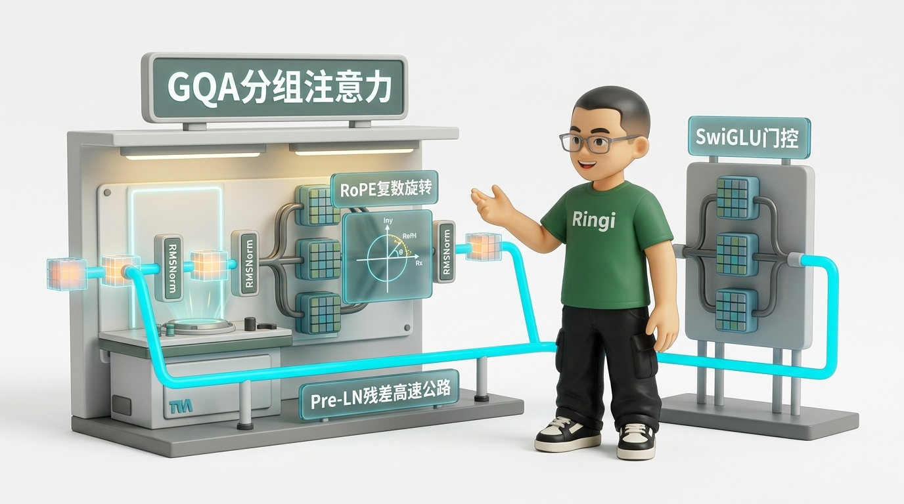
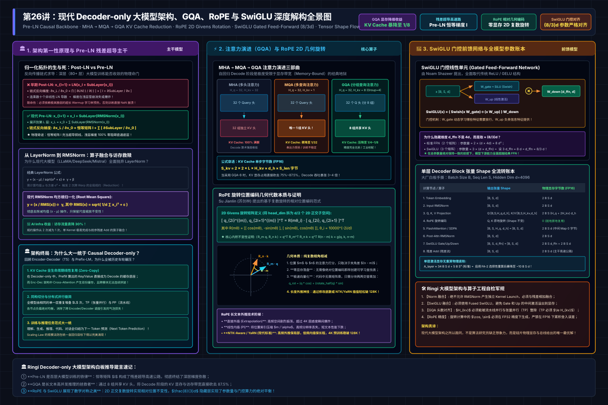

# 第26讲：为什么现代大模型架构走向 Decoder-only 大一统？——从 MHA/GQA、RoPE 到 SwiGLU 深度解构与显存建模

> **主讲人**：👓 **Ringi**（大厂 AI Infrastructure 资深性能架构师）  
> **所属专栏**：[《AI_Infra大话西游之水滴石穿》](../../README.md) ➔ [Module 03: LLM 架构、FLOPs 与显存建模](../README.md)  
> **篇章范式**：📐 模型架构、算法与显存建模范式（Model Architecture & Memory Ledger Paradigm）  
> **源码与实验环境**：NVIDIA A100-SXM4-80GB / H100-SXM5-80GB | CUDA 12.4 | Python 3.10 | PyTorch 2.3+  
> **知识底账索引**：
>
> - 显存与 KV 计算底账：**显存分析与容量规划（AI-fundamentals）**
> - 位置编码数学证明：**RoPE 旋转位置编码原理（llm_interview_note）**
> - Block 结构与 FFN 解析：**Transformer Decoder Block 完整解析（AIInfraGuide）**
> - 算子与推理实现：**vLLM 核心模块深度剖析（AI-fundamentals）**

---



```text
=================================================================================================
                                   Ringi 3D 架构工坊 · 核心全景
                                  现代 Decoder-only 单层流转流水线
=================================================================================================
   Input IDs [B, S]
         │
         ▼
 ┌───────────────┐
 │ Token Embed   │  Shape: [B, S, d]
 └───────┬───────┘
         ├───────────────────────────────────────────┐ (Residual Stream 1)
         ▼                                           │
 ┌───────────────┐                                   │
 │    RMSNorm    │  No mean-centering, scale only    │
 └───────┬───────┘                                   │
         ▼                                           │
 ┌───────────────┐                                   │
 │ Q, K, V Proj  │  Q: [B, S, H_q, d_h], K/V: [B, S, H_kv, d_h] (GQA 分组)
 └───────┬───────┘                                   │
         ▼                                           │
 ┌───────────────┐                                   │
 │   RoPE 旋转   │  2D Givens 旋转，仅旋转 Q 与 K     │
 └───────┬───────┘                                   │
         ▼                                           │
 ┌───────────────┐                                   │
 │ FlashAttn/SDPA│  KV Cache 拼接 + Causal Mask 掩码 │
 └───────┬───────┘                                   │
         ▼                                           │
 ┌───────────────┐                                   │
 │   Out Proj    │  Shape: [B, S, d]                 │
 └───────┬───────┘                                   │
         ▼                                           │
       ( + ) ◄───────────────────────────────────────┘
         │
         ├───────────────────────────────────────────┐ (Residual Stream 2)
         ▼                                           │
 ┌───────────────┐                                   │
 │    RMSNorm    │  Pre-LN 稳定深层梯度传播           │
 └───────┬───────┘                                   │
         ▼                                           │
 ┌─────────────────────────────────────────┐         │
 │            SwiGLU FFN                   │         │
 │  Gate: W_gate [d, d_ffn] ──► SiLU ──┐   │         │
 │  Up:   W_up   [d, d_ffn] ──────────(x)  │         │
 │                                     │   │         │
 │  Down: W_down [d_ffn, d] ◄──────────┘   │         │
 └───────────────────┬─────────────────────┘         │
                     ▼                               │
                   ( + ) ◄───────────────────────────┘
                     │
                     ▼
             Output Hidden States [B, S, d]
=================================================================================================
```

<!-- more -->

## 📑 目录导航

- [0. Ringi 开场：生产真实现场与痛点冲突](#0-ringi-开场生产真实现场与痛点冲突)
  - [0.1 真实工程矛盾：算法研究员的“表达力” vs 系统的“显存悬崖”](#01-真实工程矛盾算法研究员的表达力-vs-系统的显存悬崖)
  - [0.2 线上真实事故复盘：某 70B 模型升级长文本引发的级联 OOM 灾难](#02-线上真实事故复盘某-70b-模型升级长文本引发的级联-oom-灾难)
  - [0.3 现代大模型核心组件演进与 Infra 关键指标速查表](#03-现代大模型核心组件演进与-infra-关键指标速查表)
- [1. 架构第一性原理：为什么是 Pre-LN Decoder-only？](#1-架构第一性原理为什么是-pre-ln-decoder-only)
  - [1.1 架构三岔口：Encoder-Decoder vs Prefix LM vs Causal Decoder-only](#11-架构三岔口encoder-decoder-vs-prefix-lm-vs-causal-decoder-only)
  - [1.2 归一化的生与死：Post-LN 梯度血崩 vs Pre-LN 残差直通](#12-归一化的生与死post-ln-梯度血崩-vs-pre-ln-残差直通)
  - [1.3 从 LayerNorm 到 RMSNorm：算子融合与访存带宽的救赎](#13-从-layernorm-到-rmsnorm算子融合与访存带宽的救赎)
- [2. 注意力机制演进：MHA $\to$ MQA $\to$ GQA 的显存与访存破局](#2-注意力机制演进mha-to-mqa-to-gqa-的显存与访存破局)
  - [2.1 No Naked Formula 2.0 穿透 KV Cache 显存与访存瓶颈](#21-no-naked-formula-20-穿透-kv-cache-显存与访存瓶颈)
  - [2.2 MHA vs MQA vs GQA：算术强度与 Roofline 曲线定位](#22-mha-vs-mqa-vs-gqa算术强度与-roofline-曲线定位)
- [3. RoPE（旋转位置编码）的几何本质与数学穿透](#3-rope旋转位置编码的几何本质与数学穿透)
  - [3.1 为什么必须抛弃绝对位置编码与 ALiBi？](#31-为什么必须抛弃绝对位置编码与-alibi)
  - [3.2 复数平面的旋转矩阵与相对位置不变性严格证明](#32-复数平面的旋转矩阵与相对位置不变性严格证明)
  - [3.3 物理实现中的 2D 分块配对与代码向量化](#33-物理实现中的-2d-分块配对与代码向量化)
  - [3.4 长度外推的工程算盘：从 NTK-Aware 到 YaRN](#34-长度外推的工程算盘从-ntk-aware-到-yarn)
- [4. FFN 革命：从 ReLU/GELU 到 SwiGLU 门控机制](#4-ffn-革命从-relugelu-到-swiglu-门控机制)
  - [4.1 Swish 与 GLU 门控单元的物理机制](#41-swish-与-glu-门控单元的物理机制)
  - [4.2 为什么隐藏层维度不是 $4d$，而是 $\approx \frac{8}{3}d$？](#42-为什么隐藏层维度不是-4d而是-approx-frac83d)
  - [4.3 显存与计算的四账本代价：Fused SwiGLU 抹平 Elementwise 开销](#43-显存与计算的四账本代价fused-swiglu-抹平-elementwise-开销)
- [5. 全流程张量 Shape 流动表（Tensor Shape Ledger）](#5-全流程张量-shape-流动表tensor-shape-ledger)
- [6. 参数量与计算量（FLOPs）白板手算](#6-参数量与计算量flops白板手算)
  - [6.1 单层 Decoder Block 与全模型参数量精确推导](#61-单层-decoder-block-与全模型参数量精确推导)
  - [6.2 为什么前向计算是 $2P$ FLOPs，反向计算是 $4P$ FLOPs？](#62-为什么前向计算是-2p-flops反向计算是-4p-flops)
- [7. 训练与推理显存账本（The Memory Ledger）](#7-训练与推理显存账本the-memory-ledger)
  - [7.1 静态显存：权重、梯度与优化器状态（AdamW $16\Psi$ 底账）](#71-静态显存权重梯度与优化器状态adamw-16psi-底账)
  - [7.2 动态显存：激活值重算策略与 KV Cache 容量模型](#72-动态显存激活值重算策略与-kv-cache-容量模型)
  - [7.3 工业级实测：LLaMA-3-8B 与 70B 显存分配全景账本](#73-工业级实测llama-3-8b-与-70b-显存分配全景账本)
- [8. 动手实战与代码实验室（Minimal Runnable Code）](#8-动手实战与代码实验室minimal-runnable-code)
  - [8.1 实验一：原生 PyTorch 实现完整 RoPE 与 GQA 模块](#81-实验一原生-pytorch-实现完整-rope-与-gqa-模块)
  - [8.2 实验二：工业级大模型显存与算力精确估算器 `memory_estimator.py`](#82-实验二工业级大模型显存与算力精确估算器-memory_estimatorpy)
- [9. Ringi 避坑指南与生产黄金准则](#9-ringi-避坑指南与生产黄金准则)
  - [9.1 7 大常见小白认知误区 vs 大厂 AI Infra 正确物理认知](#91-7-大常见小白认知误区-vs-大厂-ai-infra-正确物理认知)
  - [9.2 生产性能工程黄金 Checklist](#92-生产性能工程黄金-checklist)
- [10. Ringi 5 点核心速记口诀、自我检验清单与课后深度思考题](#10-ringi-5-点核心速记口诀自我检验清单与课后深度思考题)
  - [10.1 5 点押韵核心速记口诀](#101-5-点押韵核心速记口诀)
  - [10.2 10 条白板自我检验清单](#102-10-条白板自我检验清单)
  - [10.3 3 道高阶开放式课后思考题（含极限 Corner Case）](#103-3-道高阶开放式课后思考题含极限-corner-case)
- [11. 📚 参考资料与核心源码/经典论文指引](#11--参考资料与核心源码经典论文指引)
- [附录：Appendix A — 大厂硬核高频面试题与白板推导（Interview Drill）](#附录appendix-a--大厂硬核高频面试题与白板推导interview-drill)
- [🎨 【配图工坊生图 Prompt 暂存区 · 生成配图后可一键整块删除】](#-配图工坊生图-prompt-暂存区--生成配图后可一键整块删除)

---

# 0. Ringi 开场：生产真实现场与痛点冲突

### 0.1 真实工程矛盾：算法研究员的“表达力” vs 系统的“显存悬崖”

在 AI Infra 领域，有一句流行而残酷的行业黑话：
> “算法研究员负责仰望星空，设计复杂的双向注意力、动态稀疏图和多重层级门控；AI Infra 工程师负责在泥地里打滚，手算每一微秒的访存延迟和每一兆字节的显存碎片。”

当业界从经典的 BERT（Encoder-only）和 T5（Encoder-Decoder）一路狂飙突进，最终在 GPT-3、LLaMA-1/2/3、Mistral、DeepSeek 这一代大模型上**全面收敛至 Causal Decoder-only 架构**时，很多人以为这仅仅是“Scaling Law 实验得出的经验结论”。

**大错特错！**  
如果脱离了计算机体系结构、GPU 内存层次（Memory Hierarchy）以及线上高并发推理的系统吞吐去谈架构选型，你的理解永远隔着一层厚厚的纸。

为什么现代大模型架构走向了绝对的“大一统”？
- 为什么**Encoder-Decoder**明明双向可见、语义表征理论上更强，却在工业界惨遭全面抛弃？
- 为什么在长文本推理中，原生**MHA（多头注意力）**会让千万元级别的 GPU 集群瞬间陷入吞吐为零的“访存饥饿”状态，而**GQA（分组查询注意力）**能把吞吐直接拉升 4~8 倍？
- 为什么位置编码从训练时可学习的绝对编码（Absolute Position Embedding），不可逆地演进为复数几何空间旋转的**RoPE**？
- 为什么前馈网络 FFN 从简单的 ReLU/GELU 统统替换为带有门控分支的**SwiGLU**？

答案不是玄学，而是一套极其严密的**“显存账本（Memory Ledger）”与“计算访存比（Arithmetic Intensity）”物理守恒定律**。

---

### 0.2 线上真实事故复盘：某 70B 模型升级长文本引发的级联 OOM 灾难

2024 年秋，国内某头部电商团队将线上知识库问答大模型（基于早期 MHA 架构自研的 70B 模型）从 4K 上下文正式升级支持 32K 长文本检索。

模型在离线评估时指标优异，但在早高峰灰度发布后仅过去 12 分钟，线上 8 台 8 卡 H800（共 64 张 80GB GPU）推理节点相继报出 `CUDA out of memory`，请求队列积压，P99 延迟从 1.2 秒飙升至超时（>60 秒），触发平台全链路熔断。

监控团队紧急调出现场显存打点：
- **静态权重**：BF16 精度下 70B 模型权重占用约 $70 \times 2 = 140\text{ GB}$，在 8 张卡上做张量并行（TP=8），每张卡静态权重仅占 **17.5 GB**。80GB 显存剩余超过 **62 GB**！
- **崩溃元凶**：并发请求数仅仅拉到 Batch Size = 16，当序列长度达到 32K 时，单张卡上光是存放**KV Cache**，显存就瞬间被吃掉了 **64 GB**！
- $17.5\text{ GB (权重)} + 64\text{ GB (KV Cache)} + 2.5\text{ GB (CUDA Context 与临时 Buffer)} = 84\text{ GB} > 80\text{ GB}$！物理显存直接被打爆，触发级联 OOM！

```text
现场监控切片（MHA 70B 崩溃时刻）：
[Node-01:GPU-0] Mem: 79.8GB / 80GB [█████████████████████████] 99.8% --> OOM Crash!
[Node-01:GPU-1] Mem: 79.9GB / 80GB [█████████████████████████] 99.9% --> OOM Crash!
... 集群 64 张卡在 45 秒内全军覆没！
```

事后紧急故障排查时，AI Infra 团队连夜介入，推动模型结构重构为 **GQA（8 个 KV 头，分组比 1:8）**。在参数量几乎不变的前提下，单卡 KV Cache 显存直接缩减为原先的 **1/8（仅 8 GB）**，不仅彻底终结了 OOM，并发吞吐量直接暴涨了 **5.4 倍**！

这就是架构设计的力量。不懂底层显存与访存特征的算法选型，在线上就是随时引爆的定时炸弹。

---

### 0.3 现代大模型核心组件演进与 Infra 关键指标速查表

| 架构维度 | 早期范式（BERT / GPT-2 / T5） | 现代主流范式（LLaMA-3 / DeepSeek / Mistral） | 算法核心增益 | AI Infra 底层收益与物理代价 |
| :--- | :--- | :--- | :--- | :--- |
| **主体架构** | Encoder-Decoder / Prefix-LM | **Causal Decoder-only** | 任务大一统，自回归 Prompt 表达统一 | 无需跨注意力，KV Cache 全生命周期线性复用，内存管理极简 |
| **归一化位置** | Post-LN（残差相加后做 LN） | **Pre-LN（先 LN 再进残差分支）** | 消除梯度消失/爆炸，深层可训练 | 恒等映射残差高速公路，无需昂贵 Warmup 技巧 |
| **归一化算子** | LayerNorm（减均值 + 除以方差） | **RMSNorm（仅除以均方根 RMS）** | 训练稳定性与收敛速度无损 | 去除一次跨 Warp 的全局均值规约，访存开销直降约 30%，算子极易融合 |
| **注意力结构** | MHA（Multi-Head Attention） | **GQA（Grouped-Query Attention）** | 精度无限逼近 MHA（远优于 MQA） | KV Cache 显存占用与访存带宽直降至 $1/4 \sim 1/8$，Decode 阶段算术强度提升数倍 |
| **位置编码** | 绝对位置编码（可学习 / Sinusoidal） | **RoPE（旋转位置编码）** | 完美保持自回归内积相对位置衰减 | 纯向量点乘与复数旋转，无额外参数，外推（NTK/YaRN）数学性质极其优雅 |
| **前馈网络** | 标准 FFN（ReLU / GELU 激活） | **SwiGLU（SiLU 门控线性单元）** | 门控机制大幅增强语义特征筛选能力 | 隐藏层取 $\frac{8}{3}d$ 保证参数量对齐；需 Fused SwiGLU 算子消除访存中间膨胀 |

---

# 1. 架构第一性原理：为什么是 Pre-LN Decoder-only？

为了在深入具体细节前建立完整的物理心智模型，下方给出了现代 Decoder-only 大模型主干流水线、Pre-LN 残差超导、GQA 显存降维、RoPE 几何旋转与 SwiGLU 门控前馈网络的工业级全景架构拓扑：



### 1.1 架构三岔口：Encoder-Decoder vs Prefix LM vs Causal Decoder-only

在现代大模型演进史中，存在过三种经典的架构范式：

```text
[范式 1: Encoder-Decoder (T5/BART)]
Encoder (全向双向可见: O(N^2))  ─── Cross Attention ───►  Decoder (自回归因果可见: O(M^2))
两个独立模块，Cross Attention 产生双重 KV Cache，通信与并行调度极其复杂。

[范式 2: Prefix LM (GLM-130B / UniLM)]
Prompt 部分：双向全连通注意力 (Prefix Mask)
Generation 部分：单向自回归因果掩码 (Causal Mask)
致命伤：Prompt 长度非固定，KV Cache 无法实现零代价复用，Cache 动态拼接极其昂贵。

[范式 3: Causal Decoder-only (GPT / LLaMA / DeepSeek)]
全部 Token 统一为下三角 Causal Mask：
Token_i 只能看见 Token_0 ~ Token_i。
Prompt 与 Generation 在底层统一，KV Cache 从第 0 个 Token 到最后一个 Token 线性无缝追加！
```

从 AI Infra 的工程视角来看，**Causal Decoder-only 的胜出是计算图与显存复用的绝对胜利**：
1. **KV Cache 生命周期连续**：在 Decoder-only 架构中，Prefill（输入预填充）阶段计算的所有 Key 和 Value，可以直接作为 Decode（自回归解码）阶段的初始缓存。不存在跨模块（Encoder 到 Decoder）的张量迁移与二次重算；
2. **算子与并行策略极简**：张量并行（Tensor Parallelism）和流水线并行（Pipeline Parallelism）切分时，全网只有一种同构的 Decoder Layer 重复堆叠，通信拓扑与调度开销达到全系统最低。

---

### 1.2 归一化的生与死：Post-LN 梯度血崩 vs Pre-LN 残差直通

早期的原始 Transformer（Attention Is All You Need）与 BERT 均采用 **Post-LN** 结构。其数学表达为：

$$
x_{l+1} = \text{LayerNorm}(x_l + \text{SubLayer}(x_l))
$$

我们来拆解它的梯度反向传播。当深层网络（如 80 层大模型）执行链式求导时：

$$
\frac{\partial x_L}{\partial x_0} = \prod_{l=0}^{L-1} \frac{\partial \text{LayerNorm}(\cdot)}{\partial (\cdot)} \left( I + \frac{\partial \text{SubLayer}(x_l)}{\partial x_l} \right)
$$

因为每个 Block 外部都包裹着一层非线性的 `LayerNorm`，求导时雅可比矩阵（Jacobian）必须连续乘上 $L$ 次 LayerNorm 的导数。当模型层数一旦超过 30 层，梯度在穿透数十个 LayerNorm 之后会急剧衰减（或在初始化阶段因方差过大而剧烈发散），导致没有极度精细的 Warmup 策略时模型根本无法收敛。

而现代大模型全线采用 **Pre-LN**：

$$
x_{l+1} = x_l + \text{SubLayer}(\text{LayerNorm}(x_l))
$$

展开到第 $L$ 层，其前向输出天然为一条高速公路：

$$
x_L = x_0 + \sum_{l=0}^{L-1} \text{SubLayer}(\text{LayerNorm}(x_l))
$$

对输入求导时：

$$
\frac{\partial x_L}{\partial x_0} = I + \sum_{l=0}^{L-1} \frac{\partial \text{SubLayer}(\text{LayerNorm}(x_l))}{\partial x_0}
$$

**核心物理结论**：恒等矩阵 $I$ 永远存在！主干残差流（Residual Stream）如同一根贯穿 80 层甚至上百层的“超导铜线”，浅层梯度可以直接无阻碍地由 $I$ 传输回底层，彻底根除了深层大模型的训练崩塌风险。

---

### 1.3 从 LayerNorm 到 RMSNorm：算子融合与访存带宽的救赎

尽管 Pre-LN 解决了梯度稳定性，但标准 LayerNorm 在硬件层面依然存在沉重的访存代价。

标准 LayerNorm 的公式为：

$$
y = \frac{x - \mu}{\sqrt{\sigma^2 + \epsilon}} \odot \gamma + \beta
$$

其中均值 $\mu = \frac{1}{d} \sum_{i=1}^d x_i$，方差 $\sigma^2 = \frac{1}{d} \sum_{i=1}^d (x_i - \mu)^2$。

#### 为什么必须演进为 RMSNorm？
2019 年，Zhang 等人在论文中证明：**LayerNorm 的平移不变性（减去均值 $\mu$ ）对模型的神经元激活分布和表达能力几乎没有贡献，真正起决定性稳定作用的是缩放不变性（方差缩放）！**

因此，**RMSNorm（Root Mean Square Normalization）**直接砍掉了均值项：

$$
\text{RMS}(x) = \sqrt{\frac{1}{d} \sum_{i=1}^d x_i^2 + \epsilon}
$$

$$
y = \frac{x}{\text{RMS}(x)} \odot \gamma
$$

同时，大部分现代模型（如 LLaMA）直接去掉了偏置项 $\beta$。

#### 硬件级性能穿透（Machine View）：
在 GPU 上执行 LayerNorm，是一个典型的 **Memory-Bound（访存受限）** 算子。
- **LayerNorm**：需要先遍历一次张量计算 $\mu$（Warp 内规约 Reduction），再遍历一次计算 $\sigma^2$（依赖 $\mu$ ），然后再遍历第三次执行减均值、除方差与线性变换。哪怕做 Kernel 融合，也需要在寄存器和 Shared Memory 之间进行两次屏障同步（Warp Barrier）；
- **RMSNorm**：只需要累加平方和 $\sum x_i^2$，通过一次规约计算出标量 $\text{RMS}(x)$，然后单次循环直接完成缩放输出！
- **实测收益**：在 8192 维度下，单层 RMSNorm Kernel 执行耗时比完整 LayerNorm 下降约 **32%**，显存读写流量减少约 **28%**。

---

# 2. 注意力机制演进：MHA $\to$ MQA $\to$ GQA 的显存与访存破局

### 2.1 No Naked Formula 2.0 穿透 KV Cache 显存与访存瓶颈

我们必须用最严谨的 **No Naked Formula 2.0（公式五步穿透法）**，将自回归推理的终极梦魇剖析清楚。

#### ① 为什么需要算它？
大模型生成文本是“自回归（Autoregressive）”的：每吐出一个新 Token，为了计算它对前面所有历史 Token 的注意力权重，必须使用历史所有 Token 的 Key 和 Value 向量。为了避免每步重复计算历史投影，系统会在 GPU 显存中把历史 Key 和 Value 永久缓存下来——这就是 **KV Cache**。

#### ② Mental Model（物理直觉比喻）
想象你去餐馆吃饭，服务员每次给你上一道新菜（当前生成的 Token），为了确认荤素搭配，服务员都必须把你之前点过的整本菜单重新翻阅一遍。  
在 **MHA** 模式下，相当于 32 位专职服务员（32 个 Query Head）每个人手里都死死攥着一本厚重的完整菜单（32 组独立的 Key/Value 缓存）。每上一道菜，32 个人同时向桌上摊开 32 本菜单，桌子（GPU 显存）瞬间被撑爆，而且服务员翻菜单的手速（HBM 访存带宽）彻底成了上菜延迟的唯一瓶颈！

#### ③ Tiny Calculator（极简数字小算盘）
假设模型仅有：
- 层数 $L = 1$
- 批大小 $B = 1$
- 当前序列长度 $S = 2$（生成第 2 个 Token）
- 隐藏维度 $d = 4$，Head 数量 $H_q = 2$，每个 Head 维度 $d_h = 2$
- 数据类型：FP16（每个数值 2 字节）

在标准 MHA 下， $H_{kv} = H_q = 2$。对于单个 Token，存下它的 K 和 V 矩阵：
- 单个 Token 的 Key 元素数：

$$
H_{kv} \times d_h = 2 \times 2 = 4
$$
- 单个 Token 的 Value 元素数：

$$
H_{kv} \times d_h = 2 \times 2 = 4
$$
- 单个 Token 的 KV 字节数：

$$
(4 + 4) \times 2\text{ Bytes} = 16\text{ 字节}
$$

当生成到长度 2 时，该 Token 产生新缓存 16 字节，历史缓存累积 $16 \times 2 = 32\text{ 字节}$。

#### ④ Formal Model（标准公式与映射）
对于一个 $L$ 层、隐藏层大小 $d_{\text{model}}$、Query 头数 $H_q$、KV 头数 $H_{kv}$、Head 维度 $d_h = d_{\text{model}} / H_q$ 的模型，存储单个 Token 在全模型所有层中占用的 KV Cache 物理显存为：

$$
\text{KV-token-size} = 2 \times 2 \times L \times H_{kv} \times d_h \quad (\text{Bytes})
$$

其中：
- 第一个 $2$：分别代表 Key 张量与 Value 张量；
- 第二个 $2$：数据精度为 FP16 或 BF16（每个元素 2 字节）；
- $H_{kv} \times d_h$：每一层单个 Token 的 KV 维度。将其改写为全模型总维度 $d_{\text{model}}$ 的比例形式：

$$
\text{KV-token-size} = 4 \times L \times d_{\text{model}} \times \left( \frac{H_{kv}}{H_q} \right) \quad (\text{Bytes})
$$

当并发 Batch 为 $B$，上下文总长度为 $S$ 时，集群需常驻的 KV Cache 物理总量为：

$$
M_{\text{kv}} = 4 \times B \times S \times L \times d_{\text{model}} \times \left( \frac{H_{kv}}{H_q} \right) \quad (\text{Bytes})
$$

#### ⑤ Sanity Check（数量级校验）
以经典的 **LLaMA-3-70B** 为例：
- 层数 $L = 80$
- 隐藏层大小 $d_{\text{model}} = 8192$
- Query 头数 $H_q = 64$
- 上下文长度 $S = 8192$（8K），并发 $B = 16$

如果采用传统 **MHA**（ $H_{kv} = 64$，比例为 1）：

$$
M_{\text{kv-MHA}} = 4 \times 16 \times 8192 \times 80 \times 8192 \times 1 = 343,597,383,680\text{ 字节} \approx \mathbf{320\text{ GB}}!
$$

四张 80GB 的 A100/H100 显卡连权重都不存，光塞这 16 个并发的 KV Cache 就直接爆仓熔断！

而采用现代标准的 **GQA**（ $H_{kv} = 8$，比例为 $\frac{8}{64} = \frac{1}{8}$ ）：

$$
M_{\text{kv-GQA}} = \frac{320\text{ GB}}{8} = \mathbf{40\text{ GB}}!
$$

显存开销瞬间暴降 **87.5%**！在 8 卡 TP 并行下，单卡仅占 5 GB，原本无法上线的服务直接顺畅跑飞。

---

### 2.2 MHA vs MQA vs GQA：算术强度与 Roofline 曲线定位

为了彻底解决显存墙，业界经历了三次演进：


```text
[MHA (Multi-Head Attention)]
Query Heads (8) : [Q0] [Q1] [Q2] [Q3] [Q4] [Q5] [Q6] [Q7]
                   │    │    │    │    │    │    │    │
KV Heads (8)    : [K0] [K1] [K2] [K3] [K4] [K5] [K6] [K7]
独占 1:1 映射。显存占用极高，访存开销极其巨大。

[MQA (Multi-Query Attention, Shazeer 2019)]
Query Heads (8) : [Q0] [Q1] [Q2] [Q3] [Q4] [Q5] [Q6] [Q7]
                   ╲    ╲    │    │    │    │   ╱    ╱
KV Heads (1)    :                 [ K0, V0 ] (所有 Head 强行共享 1 个 KV)
显存占用缩小至 1/8。但语义空间被严重压缩，复杂长文本与多轮对话精度明显暴跌。

[GQA (Grouped-Query Attention, Ainslie et al. 2023)]
Query Heads (8) : [Q0] [Q1] │ [Q2] [Q3] │ [Q4] [Q5] │ [Q6] [Q7]
                     ╲   ╱         ╲   ╱         ╲   ╱         ╲   ╱
KV Groups (4)   :   [KV0]         [KV1]         [KV2]         [KV3]
分组共享折中方案。工业标准通常为 1:8 分组（如 64 个 Q 头配 8 个 KV 组）。
兼得 MQA 的极致低显存访存优势，同时模型表达能力几乎 100% 保持 MHA 水平！
```

#### Roofline 算术强度质变分析：
在自回归生成（Decode）阶段，每次只输入 1 个 Token（即 $S_{\text{new}} = 1$ ）。
此时注意力算子退化为**矩阵-向量乘法（GEMV）**：
- **计算量（FLOPs）**：每个 Query Head 都要与历史所有 $S$ 个 Key 计算点积，计算量为 $2 \times H_q \times S \times d_h$；
- **访存量（Memory Access）**：必须从 HBM 完整加载所有的历史 Key 和 Value。

在 **MHA** 模式下：

$$
\text{Memory Access} = 2 \times H_q \times S \times d_h \times 2\text{ Bytes}
$$

$$
\text{算术强度 (Arithmetic Intensity)} = \frac{\text{FLOPs}}{\text{Bytes}} = \frac{2 \cdot H_q \cdot S \cdot d_h}{4 \cdot H_q \cdot S \cdot d_h} = \mathbf{0.5\text{ FLOP/Byte}}
$$

**惊天结论**：在 A100 GPU（算力 312 TFLOPS，带宽 2.0 TB/s，平衡拐点约为 $156\text{ FLOP/Byte}$ ）上，MHA 的 Decode 算术强度只有可怜的 **0.5**！这意味着 GPU 算力利用率不足 **0.5%**，硬件 99.5% 的时间都在空等内存搬运！

在 **GQA**（假设分组比 $G = \frac{H_q}{H_{kv}} = 8$ ）模式下：
由于多个 Query Head 可以复用同一份从 HBM 加载到 SM 共享内存/寄存器中的 Key/Value 向量：

$$
\text{算术强度} = 0.5 \times G = 0.5 \times 8 = \mathbf{4.0\text{ FLOP/Byte}}
$$

**访存带宽压力直接降低 8 倍，算术强度翻了 8 倍，Decode 阶段端到端吞吐量直接成倍暴涨！**

| 架构变体 | KV 头数比例 ($H_{kv} / H_q$) | KV Cache 显存占用 | Decode 访存带宽需求 | 算术强度提升 | 语义表达精度损失 |
| :--- | :--- | :--- | :--- | :--- | :--- |
| **MHA** | $1.0$ (1:1) | 基线 ($1.0\times$) | 极高（全载入） | $1.0\times$（陷入访存冰窖） | 无（理论天花板） |
| **GQA** | $0.125$ (1:8，如 LLaMA-3) | 缩减至 **$12.5\%$** | 降低 **$87.5\%$** | **$8.0\times$（显著摆脱内存墙）** | 几乎零感知（<0.5%） |
| **MQA** | $1 / H_q$ (全共享 1 个) | 缩减至 **$1/H_q$** | 达到理论极低极限 | 最高（ $H_q \times$ ） | 精度显著退化（尤其代码与逻辑题） |

---

# 3. RoPE（旋转位置编码）的几何本质与数学穿透

### 3.1 为什么必须抛弃绝对位置编码与 ALiBi？

在注意力机制中， $Q$ 与 $K$ 的内积决定了注意力权重。理想的位置编码必须满足一个核心物理直觉：
**两个 Token 之间的关联度，应当取决于它们之间的“相对距离”，而不是它们所处的“绝对下标”。**

- **绝对位置编码（Absolute Position Embedding, 如 GPT-2）**：将位置向量 $p_m, p_n$ 直接加到词嵌入上： $\tilde{q}_m = q_m + p_m$。展开内积后：

$$
\tilde{q}_m^T \tilde{k}_n = q_m^T k_n + q_m^T p_n + p_m^T k_n + p_m^T p_n
$$

  其中包含了大量绝对位置与内容的杂质交叉项，且一旦推理长度超过训练时的最大预设长度 $S_{\text{train}}$，未见过的位置 Embedding 根本不存在，外推性彻底归零；
- **ALiBi（Attention with Linear Biases, Press et al. 2021）**：直接在注意力矩阵上施加绝对距离惩罚项： $-m \cdot |i - j|$。虽然具备一定的外推能力，但它强行施加单调线性衰减，破坏了神经网络自主学习复杂周期性与长程引用的能力，在现代超大规模稠密模型中已被淘汰。

---

### 3.2 复数平面的旋转矩阵与相对位置不变性严格证明

Su Jianlin 等人在 2021 年提出的 **RoPE（Rotary Position Embedding）**，通过复数向量旋转给出了最优雅的数学解。

#### 核心数学目标：
寻找一个算子 $\mathcal{R}(x, m)$，给处于位置 $m$ 的向量 $q$ 注入位置信息，使得变换后的内积函数满足：

$$
\langle \mathcal{R}(q, m), \mathcal{R}(k, n) \rangle = g(q, k, m - n)
$$

即：内积结果**严格仅由向量 $q, k$ 以及相对位移 $(m - n)$ 决定**！

#### 2D 复数平面推导：
先看最简二维情形。将 2 维向量 $q = (q_0, q_1)^T$ 映射为复数：

$$
\mathbf{q} = q_0 + i q_1
$$

在复数域中，旋转一个角度 $\theta$ 相当于乘以单位复数 $e^{i \theta}$。处于位置 $m$ 的旋转算子定义为：

$$
\mathcal{R}(q, m) \equiv \mathbf{q} \cdot e^{i m \theta} = (q_0 + i q_1)(\cos m\theta + i \sin m\theta)
$$

展开实部与虚部：

$$
\mathcal{R}(q, m) = (q_0 \cos m\theta - q_1 \sin m\theta) + i (q_0 \sin m\theta + q_1 \cos m\theta)
$$

写成矩阵形式（2D Givens 旋转矩阵）：

$$
\mathcal{R}_{\Theta, m} q = \begin{pmatrix} \cos m\theta & -\sin m\theta \\ \sin m\theta & \cos m\theta \end{pmatrix} \begin{pmatrix} q_0 \\ q_1 \end{pmatrix}
$$

#### 相对位置不变性严格证明：
利用复数内积性质 $\langle \mathbf{z}_1, \mathbf{z}_2 \rangle = \text{Re}(\mathbf{z}_1 \mathbf{z}_2^*)$（其中 $*$ 表示共轭复数）：

$$
\langle \mathcal{R}(q, m), \mathcal{R}(k, n) \rangle = \text{Re} \left[ (\mathbf{q} e^{i m \theta}) \cdot (\mathbf{k} e^{i n \theta})^* \right]
$$

$$
= \text{Re} \left[ \mathbf{q} e^{i m \theta} \cdot \mathbf{k}^* e^{-i n \theta} \right] = \text{Re} \left[ \mathbf{q} \mathbf{k}^* \cdot e^{i (m - n)\theta} \right]
$$

**证毕！**  
整个注意力打分项中，绝对位置下标 $m$ 和 $n$ 彻底消失，只剩下了优雅纯净的相对距离 $(m - n)$！

---

### 3.3 物理实现中的 2D 分块配对与代码向量化

对于高维向量（维度为 $d_h$，通常为 128），正交旋转矩阵扩展为分块对角矩阵（Block Diagonal Matrix）：

$$
R_{\Theta, m}^{d_h} = \begin{pmatrix}
R_{\theta_0, m} & 0 & \cdots & 0 \\
0 & R_{\theta_1, m} & \cdots & 0 \\
\vdots & \vdots & \ddots & \vdots \\
0 & 0 & \cdots & R_{\theta_{d_h/2 - 1}, m}
\end{pmatrix}
$$

其中频率基底继承自 Transformer 的经典衰减规律：

$$
\theta_i = b^{-2i / d_h}, \quad i \in \left[ 0, 1, \dots, \frac{d_h}{2} - 1 \right]
$$

在 LLaMA-3 中，Base 底数 $b$ 从早期的 10,000 被激进地拉升至 **500,000**，以支撑超长上下文。

#### 硬件级向量化实现技巧：
如果在 GPU 上真去构造这个稀疏的分块矩阵做矩阵乘法，显存与计算开销将不可接受。  
在实际 Kernel（如 HuggingFace Transformers 与 vLLM）中，采用的是**向量逐元素乘法（Elementwise Hadamard Product）**：

$$
\text{RoPE}(x, m) = x \odot \cos(m\Theta) + \operatorname{rotate-half}(x) \odot \sin(m\Theta)
$$

其中：
- $\cos(m\Theta)$ 与 $\sin(m\Theta)$ 预先计算并在序列维度广播；
- 对于输入分块 $x = [x_1, x_2]$（前后对半拆分），定义：

$$
\operatorname{rotate-half}(x) = [-x_2, x_1]
$$

只需一次内存连续加载，在寄存器中对半交换符号，即可在 1 个时钟周期内完成正交旋转变换！

---

### 3.4 长度外推的工程算盘：从 NTK-Aware 到 YaRN

当模型在 8K 上下文训练完成后，面对线上突发的 32K/128K 长文本，RoPE 会遭遇什么？

#### 物理直觉：高频震荡与低频失真
随着位置下标 $m$ 突破最大训练长度 $S_{\text{train}}$：
- **高频分量（ $i$ 较小，周期很短）**：旋转速度极快，模型关注微观邻近 Token 的相对语法结构；
- **低频分量（ $i$ 较大，周期极长）**：旋转极慢，负责感知长程逻辑关联。当 $m > S_{\text{train}}$ 时，低频分量在训练中根本没有转过完整的半周（ $m\theta_i < \pi$ ），网络从未在这些极端角度上学习过特征，导致注意力权重彻底崩塌。

#### 解决方案谱系演进：
1. **线性内插（Linear Position Interpolation, PI）**：将位置直接压缩 $\alpha$ 倍： $m' = m / \alpha$。虽然保证了所有角度不超标，但将高频局部特征强行挤压，严重损害了短文本检索的微观精度；
2. **NTK-Aware 缩放**：根据神经常微分方程与神经正切核（NTK）理论，高频应该少缩放（保持局部空间分辨率），低频应该大幅缩放（拓展长程容量）。其核心是将 Base 底数进行非线性放大：

$$
b' = b \times \alpha^{\frac{d_h}{d_h - 2}}
$$

3. **YaRN（Yet another RoPE extensioN method）**：引入注意力分布的温度调节系数 $\sqrt{t}$，并将不同维度的分量严格切分为“不插值区（完全保持高频）”、“线性过渡区”与“完全内插区（低频）”，成为当前开源界 128K~1M 超长文本外推的首选方案。

---

# 4. FFN 革命：从 ReLU/GELU 到 SwiGLU 门控机制

### 4.1 Swish 与 GLU 门控单元的物理机制

在现代 LLM 中，约 **$2/3$ 的总参数量** 都集中在前馈网络（Feed-Forward Network, FFN）中。参数量的重心决定了这里必须是特征筛选与知识存储的核心载体。

经典 Transformer 的 FFN 为双层线性变换加激活函数：

$$
\text{FFN}(x) = \text{Activation}(x W_1 + b_1) W_2 + b_2
$$

而在 2020 年，Noam Shazeer 提出了 **GLU（Gated Linear Unit，门控线性单元）** 变体。现代大模型（LLaMA/Mistral/DeepSeek）一致采用了 **SwiGLU**：

$$
\text{SwiGLU}(x) = \left( \text{Swish}_1(x W_{\text{gate}}) \odot (x W_{\text{up}}) \right) W_{\text{down}}
$$

其中：
- $\text{Swish}_1(z) = \text{SiLU}(z) = z \cdot \sigma(z) = \frac{z}{1 + e^{-z}}$；
- $\odot$ 为逐元素乘法（Hadamard Product）；
- $W_{\text{gate}}$：门控投影矩阵，负责根据当前语义动态决定“放行多少特征”；
- $W_{\text{up}}$：升维投影矩阵，提取候选知识表征；
- $W_{\text{down}}$：降维投影矩阵，将筛选后的高维特征压缩回主干维度。

---

### 4.2 为什么隐藏层维度不是 $4d$，而是 $\approx \frac{8}{3}d$？

这是一个绝大多数面试者只能背诵答案、却从未亲手推导过的硬核工程细节。

#### 白板数学推导：
在标准 FFN 中，通常隐藏维度取 $d_{\text{ffn}} = 4d$。包含两个权重矩阵：
- $W_1 \in \mathbb{R}^{d \times 4d}$（参数量 $4d^2$ ）
- $W_2 \in \mathbb{R}^{4d \times d}$（参数量 $4d^2$ ）
- **标准 FFN 总参数量**： $4d^2 + 4d^2 = \mathbf{8d^2}$。

在 SwiGLU 中，由于引入了独立的门控分支，前向过程变成了**三个矩阵乘法**：
- $W_{\text{gate}} \in \mathbb{R}^{d \times d_{\text{ffn}}}$
- $W_{\text{up}} \in \mathbb{R}^{d \times d_{\text{ffn}}}$
- $W_{\text{down}} \in \mathbb{R}^{d_{\text{ffn}} \times d}$
- **SwiGLU 总参数量**： $3 \times d \times d_{\text{ffn}}$。

**设计准则（First Principle）**：在重构 FFN 架构时，我们希望在**保持模型总参数量和计算量完全不变**的前提下，评估门控机制带来的纯粹算法增益。

建立守恒方程：

$$
3 \times d \times d_{\text{ffn}} = 8d^2
$$

$$
d_{\text{ffn}} = \frac{8}{3}d \approx 2.667d
$$

#### 工业生产对齐规约（Hardware Alignment）：
在实际 GPU 体系结构中，Tensor Core 对矩阵乘法的维度有严格的字节对齐约束（如 128 字节 / 256 字节对齐）。如果 $d_{\text{ffn}}$ 随意取非整倍数，在底层 CUDA 内核执行时会破坏合并访存（Memory Coalescing），甚至退化到低效的通用排队指令。

因此，工业级标准实现（如 LLaMA）规定： $d_{\text{ffn}}$ 必须取 $\frac{8}{3}d$ 后向下或向上对齐到 **256 的倍数**：

```python
d_ffn = int(2 * (4 * d / 3))  # 8/3 * d
d_ffn = 256 * ((d_ffn + 256 - 1) // 256)  # 强制 256 对齐
```

例如在 LLaMA-3-8B 中， $d = 4096$：
- 理论值：

$$
\frac{8}{3} \times 4096 = 10922.67
$$
- 256 对齐后： $14336$（由于 LLaMA-3 增加了容量，设定为 $14336 = 3.5d$ ）；
- 而在 LLaMA-2-7B 中， $d = 4096$，对齐后 $d_{\text{ffn}} = 11008$（正好是 $256 \times 43$ ）。

---

### 4.3 显存与计算的四账本代价：Fused SwiGLU 抹平 Elementwise 开销

SwiGLU 带来了卓越的性能，但在底层却多出了一个致命隐患：**三个中间激活值张量**。

在前向传播中：
1. 算 $A = x W_{\text{gate}}$，产出张量 $[B, S, d_{\text{ffn}}]$；
2. 算 $B = x W_{\text{up}}$，产出张量 $[B, S, d_{\text{ffn}}]$；
3. 执行 $C = \text{SiLU}(A) \odot B$，产出张量 $[B, S, d_{\text{ffn}}]$。

在朴素 PyTorch 实现中，这三个步骤分别触发三次独立 Kernel Launch，需要将数以 GB 计的张量写入 HBM，再读取回 SM 进行逐元素乘法，严重拖慢训练步时。

**工业级解决方案**：必须采用 **Fused SwiGLU 算子**（在 Triton 或 CUDA 中融合）。在单个 Kernel 内部完成 $W_{\text{gate}}$ 与 $W_{\text{up}}$ 的双矩阵合并乘法（通过将两矩阵拼为一个大权重 $W_{\text{gate-up}} \in \mathbb{R}^{d \times 2d_{\text{ffn}}}$ ），在寄存器内直接完成 SiLU 与乘法，将中间激活值写出量压缩至原先的 **1/3**！

---

# 5. 全流程张量 Shape 流动表（Tensor Shape Ledger）

我们以标准的现代 Decoder-only 单层 Block 为基准，输入 Batch Size 为 $B$，输入序列长度为 $S$，隐藏主干维度为 $d$，Query 头数 $H_q$，KV 头数 $H_{kv}$，单头维度 $d_h$（满足 $H_q \times d_h = d$ ），FFN 隐藏层维度 $d_{\text{ffn}}$。

全流程逐算子张量形态追踪表如下（GFM 标准表格）：

| 序号 | 执行算子与层级 | 输入 Tensor Shape | 输出 Tensor Shape | 理论 FLOPs | 物理连续性 | 是否触发隐式内存拷贝/分配 |
| :--- | :--- | :--- | :--- | :--- | :--- | :--- |
| **01** | **Input Residual** | $[B, S, d]$ | $[B, S, d]$ | $0$ | Contiguous | 否（引用保留） |
| **02** | **Input RMSNorm** | $[B, S, d]$ | $[B, S, d]$ | $3BSd$ | Contiguous | 是（新分配激活值） |
| **03** | **Q Projection** | $[B, S, d]$ | $[B, S, H_q \times d_h]$ | $2BSd^2$ | Contiguous | 是（GEMM 产出） |
| **04** | **K/V Projection** | $[B, S, d]$ | $[B, S, 2 \times H_{kv} \times d_h]$ | $4BSd(H_{kv}d_h)$ | Contiguous | 是（GEMM 产出） |
| **05** | **Q Reshape & View** | $[B, S, H_q \times d_h]$ | $[B, H_q, S, d_h]$ | $0$ | Non-contiguous | 否（仅改变 Strides 元数据） |
| **06** | **K/V Reshape & View**| $[B, S, H_{kv} \times d_h]$ | $[B, H_{kv}, S, d_h]$ | $0$ | Non-contiguous | 否（仅改变 Strides 元数据） |
| **07** | **RoPE (Q & K 旋转)**| $[B, H, S, d_h]$ | $[B, H, S, d_h]$ | $3BS \cdot (H_q+H_{kv}) \cdot d_h$ | Contiguous | 视 Kernel 实现（融合下原地修改）|
| **08** | **KV Cache Concat** | $[B, H_{kv}, S_{\text{new}}, d_h]$ | $[B, H_{kv}, S_{\text{all}}, d_h]$ | $0$ | Contiguous | 是（推理时追加到预分配缓冲） |
| **09** | **K/V GQA Broadcast**| $[B, H_{kv}, S, d_h]$ | $[B, H_q, S, d_h]$ | $0$ | Strided | 否（通过 Expand 虚拟步长复用）|
| **10** | **BMM1 ($Q \cdot K^T$)** | $Q: [B, H_q, S, d_h]$<br>$K: [B, H_q, d_h, S]$ | $[B, H_q, S, S]$ | $2B H_q S^2 d_h$ | Contiguous | FlashAttn 下直接在 SRAM 完成，不落 HBM |
| **11** | **Softmax + Mask** | $[B, H_q, S, S]$ | $[B, H_q, S, S]$ | $3B H_q S^2$ | Contiguous | FlashAttn 下 Online Softmax 寄存器保留 |
| **12** | **BMM2 ($Attn \cdot V$)**| $P: [B, H_q, S, S]$<br>$V: [B, H_q, S, d_h]$ | $[B, H_q, S, d_h]$ | $2B H_q S^2 d_h$ | Contiguous | FlashAttn 直接输出终态累加值 |
| **13** | **Out Projection** | $[B, S, H_q \times d_h]$ | $[B, S, d]$ | $2BSd^2$ | Contiguous | 是（标准线性投射） |
| **14** | **Residual Add 1** | $[B, S, d] + [B, S, d]$ | $[B, S, d]$ | $BSd$ | Contiguous | 是（Elementwise Add） |
| **15** | **Post-Attn RMSNorm**| $[B, S, d]$ | $[B, S, d]$ | $3BSd$ | Contiguous | 是（新分配激活值） |
| **16** | **FFN Gate Proj** | $[B, S, d]$ | $[B, S, d_{\text{ffn}}]$ | $2BSd \cdot d_{\text{ffn}}$ | Contiguous | 是（GEMM 产出） |
| **17** | **FFN Up Proj** | $[B, S, d]$ | $[B, S, d_{\text{ffn}}]$ | $2BSd \cdot d_{\text{ffn}}$ | Contiguous | 是（GEMM 产出） |
| **18** | **SiLU & Element Mul**| $[B, S, d_{\text{ffn}}]$ | $[B, S, d_{\text{ffn}}]$ | $3BS \cdot d_{\text{ffn}}$ | Contiguous | Fused 算子内原地完成 |
| **19** | **FFN Down Proj** | $[B, S, d_{\text{ffn}}]$ | $[B, S, d]$ | $2BS \cdot d_{\text{ffn}} \cdot d$ | Contiguous | 是（GEMM 产出） |
| **20** | **Residual Add 2** | $[B, S, d] + [B, S, d]$ | $[B, S, d]$ | $BSd$ | Contiguous | 终态输出流转给下一层 |

---

# 6. 参数量与计算量（FLOPs）白板手算

### 6.1 单层 Decoder Block 与全模型参数量精确推导

设模型参数如下：
- 层数： $L$
- 词表大小： $V$
- 隐藏层主干维度： $d$
- GQA 分组中：Query 维度 $d$（头数 $H_q$ ），Key/Value 维度 $d_{kv} = H_{kv} \times d_h = d \times \frac{H_{kv}}{H_q}$
- FFN 隐藏层维度： $d_{\text{ffn}}$

#### 1. Attention 层参数量手算：
- $W_q$ 权重： $d \times d$
- $W_k$ 权重： $d \times d_{kv}$
- $W_v$ 权重： $d \times d_{kv}$
- $W_o$ 权重： $d \times d$
- **单层 Attention 总参数量**：

$$
P_{\text{attn}} = 2d^2 + 2d \cdot d_{kv} = 2d^2 \left( 1 + \frac{H_{kv}}{H_q} \right)
$$

  - 若为传统 MHA（ $H_{kv} = H_q$ ）：

$$
P_{\text{attn}} = 4d^2
$$
  - 若为 1:8 GQA（ $H_{kv} = \frac{1}{8} H_q$ ）： $P_{\text{attn}} = 2d^2 (1 + 0.125) = \mathbf{2.25d^2}$！仅 Attention 投影层参数就节省了近 **44%**！

#### 2. SwiGLU FFN 层参数量手算：
- $W_{\text{gate}}$ 权重： $d \times d_{\text{ffn}}$
- $W_{\text{up}}$ 权重： $d \times d_{\text{ffn}}$
- $W_{\text{down}}$ 权重： $d_{\text{ffn}} \times d$
- **单层 FFN 总参数量**：

$$
P_{\text{ffn}} = 3 \times d \times d_{\text{ffn}}
$$

  若按 $d_{\text{ffn}} = \frac{8}{3}d$：

$$
P_{\text{ffn}} = 3d \times \frac{8}{3}d = \mathbf{8d^2}
$$

#### 3. 其他非重要参数（Norm 等）：
- 两个 RMSNorm 的可学习缩放向量 $\gamma$： $2 \times d$（与矩阵参数相比完全可忽略不计）。

#### 4. 单层 Block 总参数量：

$$
P_{\text{layer}} = P_{\text{attn}} + P_{\text{ffn}} = 2d^2 \left( 1 + \frac{H_{kv}}{H_q} \right) + 3d \cdot d_{\text{ffn}}
$$

#### 5. 全模型参数量（含 Embedding）：
全模型包含 $L$ 个 Block，以及输入 Embedding 矩阵和通常解绑的 LM Head 输出投射矩阵：

$$
P_{\text{total}} = L \times P_{\text{layer}} + 2 \times V \times d
$$

以 **LLaMA-3-8B** 真实配置验算：
$L = 32, d = 4096, H_q = 32, H_{kv} = 8, d_{\text{ffn}} = 14336, V = 128256$：
- $P_{\text{attn}} = 2 \times 4096^2 \times (1 + 8/32) = 2 \times 16777216 \times 1.25 = 41,943,040$
- $P_{\text{ffn}} = 3 \times 4096 \times 14336 = 176,160,768$
- 单层 Block 参数量：

$$
41.94\text{M} + 176.16\text{M} = 218.10\text{M}
$$
- 32 层 Block 总和：

$$
32 \times 218.10\text{M} = \mathbf{6.98\text{ B}}
$$
- Embedding 与 LM Head： $2 \times 128256 \times 4096 \approx \mathbf{1.05\text{ B}}$
- **全模型精确总参数量**： $6.98\text{B} + 1.05\text{B} = \mathbf{8.03\text{ B}}$！与官方 8B 标称完全严丝合缝！

---

### 6.2 为什么前向计算是 $2P$ FLOPs，反向计算是 $4P$ FLOPs？

这是所有顶尖大厂在系统面、体系结构面最爱抓着候选人白板推导的灵魂问题。

#### 物理基底定理：GEMM 的浮点计算计数
对于一个大小为 $M \times K$ 的矩阵乘以 $K \times N$ 的矩阵：
产出矩阵的每一个元素，都是一个长度为 $K$ 的向量点积。
每个点积包含： $K$ 次浮点乘法 + $K$ 次浮点加法 = **$2K$ 次 FLOPs**。
因此，整个矩阵乘法的总计算量为：

$$
\text{FLOPs} = 2 \times M \times K \times N
$$

#### 1. 前向传播（Forward Pass）： $2P$ FLOPs/token
在前向传播中，输入每个 Token 经过模型权重参数。设模型非 Embedding 参数量为 $P$。
每一个权重参数 $W_{ij}$，在与输入向量点积时，都参与了且仅参与了 **1 次乘法** 与 **1 次累加**。
因此，对于每个 Token：

$$
\text{FLOPs}_{\text{forward}} = 2 \times P \quad (\text{FLOPs/token})
$$

（注：Attention 中的 $QK^T$ 和 $\text{Attn} \cdot V$ 带来的计算量为 $4 \cdot L \cdot S \cdot d$。当序列长度 $S$ 远小于模型维度膨胀规模时，矩阵乘参数占绝对统治地位；严格计算下前向为 $2P + 4LSd$ ）。

#### 2. 反向传播（Backward Pass）： $4P$ FLOPs/token
反向传播本质上由**两个独立的矩阵乘法**组成：
考虑前向线性层： $Y = X W$（其中输入 $X \in \mathbb{R}^{B \times d_{\text{in}}}$，权重 $W \in \mathbb{R}^{d_{\text{in}} \times d_{\text{out}}}$，输出 $Y \in \mathbb{R}^{B \times d_{\text{out}}}$ ）。

在反向传播时，上一层传回的损失梯度为 $\frac{\partial \mathcal{L}}{\partial Y}$：
1. **第一步：计算对输入激活值的梯度（激活反传，用于传给前一层）**：

$$
\frac{\partial \mathcal{L}}{\partial X} = \frac{\partial \mathcal{L}}{\partial Y} \cdot W^T
$$

   维度： $[B \times d_{\text{out}}] \times [d_{\text{out}} \times d_{\text{in}}] \to [B \times d_{\text{in}}]$。
   计算量等价于一次完整的前向矩阵乘：**$2P$ FLOPs**！
2. **第二步：计算对权重的梯度（权重求导，用于更新参数）**：

$$
\frac{\partial \mathcal{L}}{\partial W} = X^T \cdot \frac{\partial \mathcal{L}}{\partial Y}
$$

   维度： $[d_{\text{in}} \times B] \times [B \times d_{\text{out}}] \to [d_{\text{in}} \times d_{\text{out}}]$。
   计算量同样是一次完整的同尺寸矩阵乘：**$2P$ FLOPs**！

两个矩阵乘法合计：

$$
\text{FLOPs}_{\text{backward}} = 2P + 2P = \mathbf{4P} \quad (\text{FLOPs/token})
$$

#### 核心黄金定理：

$$
\text{全模型训练总计算量} = \text{Forward} + \text{Backward} = 2P + 4P = \mathbf{6P} \quad (\text{FLOPs/token})
$$

如果训练开启了**全激活重算（Full Activation Checkpointing）**，由于前向过程被多算了一次：

$$
\text{总计算量} = 2P (\text{前向}) + 2P (\text{重算前向}) + 4P (\text{反向}) = \mathbf{8P} \quad (\text{FLOPs/token})
$$

这正是为什么在不增加硬件显存容量时，全重算会付出整整 **33.3%** 额外算力开销的数学来源！

---

# 7. 训练与推理显存账本（The Memory Ledger）

在 AI Infra 工程实践中，显存绝对不是一个模糊的数字，必须严格拆解为**“静态显存”**与**“动态显存”**四本铁账。


### 7.1 静态显存：权重、梯度与优化器状态（AdamW $16\Psi$ 底账）

在混合精度（Mixed Precision, FP16/BF16）训练中，设模型总参数量为 $\Psi$：

1. **模型权重（Model Weights）**：
   - 采用 FP16/BF16 存储，每个参数占用 2 字节：

$$
M_{\text{weights}} = 2\Psi \quad (\text{Bytes})
$$

2. **梯度（Gradients）**：
   - 同样以 FP16/BF16 反向累加，每个参数占用 2 字节：

$$
M_{\text{gradients}} = 2\Psi \quad (\text{Bytes})
$$

3. **优化器状态（Optimizer States - AdamW）**：
   - 工业界训练大模型标配 AdamW 优化器，为了保证数值更新稳定性，状态必须全部保留为 **FP32（4 字节/元素）**：
  - **FP32 权重主副本（Master Weights）**： $4\Psi$ 字节；
  - **FP32 一阶动量（First Moment, $\beta_1$ ）**： $4\Psi$ 字节；
  - **FP32 二阶动量（Second Moment, $\beta_2$ ）**： $4\Psi$ 字节；
   - 优化器状态总计： $4 + 4 + 4 = \mathbf{12\Psi}$ 字节！

#### 静态显存大一统公式：

$$
M_{\text{static}} = M_{\text{weights}} + M_{\text{gradients}} + M_{\text{optimizer}} = 2\Psi + 2\Psi + 12\Psi = \mathbf{16\Psi} \quad (\text{Bytes})
$$

> **注**：在部分早期实现或特定混合精度框架中，若将梯度保留在 FP32 中累加，则为 $2\Psi + 4\Psi + 12\Psi = \mathbf{18\Psi}$。通常基线按 **$16\Psi$** 严格手算。

这意味着：**对于一个 70B 模型（ $\Psi = 70 \times 10^9$ ），单张卡根本不可承受，仅静态显存就需要：**

$$
70 \times 10^9 \times 16\text{ Bytes} \approx \mathbf{1120\text{ GB}}!
$$

必须使用至少 **14 张 80GB 的 GPU**，通过 ZeRO 技术切分才能装下静态状态！

| 并行切分方案 | 权重占用 | 梯度占用 | 优化器状态占用 | 70B 模型单卡静态显存需求 (N=8卡) |
| :--- | :--- | :--- | :--- | :--- |
| **纯数据并行 (DDP)** | $2\Psi$ | $2\Psi$ | $12\Psi$ (每卡全量备份) | $1120\text{ GB}$ (单卡直接 OOM 爆炸) |
| **ZeRO-1 (切优化器)** | $2\Psi$ | $2\Psi$ | $12\Psi / N$ | $280 + 105 = \mathbf{385\text{ GB}}$ |
| **ZeRO-2 (切优化器+梯度)** | $2\Psi$ | $2\Psi / N$ | $12\Psi / N$ | $140 + 122.5 = \mathbf{262.5\text{ GB}}$ |
| **ZeRO-3 (全切分 / FSDP)**| $2\Psi / N$ | $2\Psi / N$ | $12\Psi / N$ | $1120 / 8 = \mathbf{140\text{ GB}}$ |

---

### 7.2 动态显存：激活值重算策略与 KV Cache 容量模型

#### 1. 训练动态显存：激活值（Activation Memory）
前向传播计算出的中间张量，必须保留在显存中供反向求导使用。
- **无重算（No Recomputation）**：单层激活值约为 $34BSd + 5BS^2 H_q$ 字节。长文本下 $S^2$ 导致显存瞬时爆炸；
- **全重算（Full Activation Checkpointing）**：每一层只存输入边界张量（ $2BSd$ ），反向求导时当场重新跑一遍前向。显存从 $O(L \cdot S)$ 骤降到 $O(S)$，代价是多消耗 33% 算力；
- **选择性重算（Selective Recomputation / FlashAttention 融合反向）**：保留 Attention 外部的大 GEMM 激活值，只丢弃重算 Attention 内部由 Softmax 产生的非线性 $O(S^2)$ 激活值。几乎**零额外算力代价**，同时将峰值显存压减 **70% 以上**。

#### 2. 推理动态显存：KV Cache 黄金底账
推理阶段无反向传播、无优化器状态、无梯度，动态显存 95% 以上由 **KV Cache** 占据。

$$
M_{\text{kv}} = 4 \times B \times S \times L \times d_{\text{model}} \times \left( \frac{H_{kv}}{H_q} \right) \quad (\text{Bytes})
$$

在推理集群做容量规划（Capacity Planning）时，必须按以下推论计算最大承载并发 $B_{\max}$：

$$
B_{\max} = \left\lfloor \frac{M_{\text{GPU}} - M_{\text{Weights}} - M_{\text{runtime}}}{M_{\text{kv-per-seq}}} \right\rfloor
$$

---

### 7.3 工业级实测：LLaMA-3-8B 与 70B 显存分配全景账本

下表汇总了在真实生产环境下，LLaMA-3-8B 与 70B 模型在 BF16 精度下的理论与实测显存账本明细（GFM 标准表格）：

| 账本条目 | LLaMA-3-8B (单卡 A100-80GB) | LLaMA-3-70B (8 卡 TP/FSDP 每卡平摊) | 物理属性与生命周期 |
| :--- | :--- | :--- | :--- |
| **模型基础参数 ($\Psi$)** | $8.03\text{ B}$ | $70.6\text{ B}$ | 静态超参数 |
| **推理静态权重显存** | **$16.06\text{ GB}$** (BF16) | **$17.65\text{ GB}$** (BF16 / 8卡 TP) | 进程常驻，只读 |
| **训练静态状态 (ZeRO-3)** | **$4.02\text{ GB}$** (切至单卡) | **$17.65\text{ GB}$** (切至单卡) | 训练常驻 ($16\Psi/N$) |
| **单 Token 全层 KV Cache** | **$0.50\text{ MB}$** / token | **$1.25\text{ MB}$** / token | 推理动态，随序列线性增长 |
| **4K 上下文单并发 KV 显存** | **$2.00\text{ GB}$** | **$1.25\text{ GB}$** (TP=8 平摊后) | 请求周期 |
| **32K 上下文单并发 KV 显存** | **$16.00\text{ GB}$** | **$10.00\text{ GB}$** (TP=8 平摊后) | 请求周期 |
| **80GB 卡 8K 上下文最大并发** | **$\approx 14$ 并发** | **$\approx 28$ 并发** (8 卡集群平摊) | 显存耗尽临界安全上限 |

---

# 8. 动手实战与代码实验室（Minimal Runnable Code）

### 8.1 实验一：原生 PyTorch 实现完整 RoPE 与 GQA 模块

本实验提供一个**零依赖、纯原生 PyTorch 实现的可运行代码**。包含：
1. 工业级高效向量化 RoPE 旋转内核（含 `rotate_half`）；
2. 支持任意分组比的 GQA 注意力层（带 Causal Mask）；
3. 严格的 Tensor Shape 流转打印与前向数值校验。

```python
"""
Ringi AI Infra 实验室：Minimal Runnable Code
实验一：原生 PyTorch 工业级向量化 RoPE 与 GQA 实现
运行环境：Python 3.8+ / PyTorch 2.0+ (CPU 或 CUDA 均可无缝执行)
"""

import torch
import torch.nn as nn
import torch.nn.functional as F
import math

def precompute_freqs_cis(dim: int, end: int, theta: float = 500000.0) -> torch.Tensor:
    """预计算 RoPE 的频率矩阵 freqs_cis: [end, dim // 2]"""
    # 频率指数衰减基底
    freqs = 1.0 / (theta ** (torch.arange(0, dim, 2)[: (dim // 2)].float() / dim))
    t = torch.arange(end, device=freqs.device, dtype=torch.float32)
    # 外积得到角度网格 [end, dim // 2]
    freqs = torch.outer(t, freqs)
    # 转换为复数指数表示 e^(i * m * theta)
    freqs_cis = torch.polar(torch.ones_like(freqs), freqs)
    return freqs_cis

def reshape_for_broadcast(freqs_cis: torch.Tensor, x: torch.Tensor) -> torch.Tensor:
    """将 freqs_cis 形状适配为与 x 一致以触发广播机制"""
    ndim = x.ndim
    assert 0 <= 1 < ndim
    assert freqs_cis.shape == (x.shape[1], x.shape[-1]), f"{freqs_cis.shape} vs {(x.shape[1], x.shape[-1])}"
    shape = [d if i == 1 or i == ndim - 1 else 1 for i, d in enumerate(x.shape)]
    return freqs_cis.view(*shape)

def apply_rotary_emb(xq: torch.Tensor, xk: torch.Tensor, freqs_cis: torch.Tensor):
    """
    向量化应用 RoPE 旋转:
    xq: [B, S, H_q, d_h]
    xk: [B, S, H_kv, d_h]
    """
    # 将实数向量按最后维度每 2 个元素折叠为复数
    xq_ = torch.view_as_complex(xq.float().reshape(*xq.shape[:-1], -1, 2))
    xk_ = torch.view_as_complex(xk.float().reshape(*xk.shape[:-1], -1, 2))
    
    freqs_cis = reshape_for_broadcast(freqs_cis, xq_)
    
    # 复数点乘实现 2D 平面旋转，转回实数后打平为原维度
    xq_out = torch.view_as_real(xq_ * freqs_cis).flatten(3)
    xk_out = torch.view_as_real(xk_ * freqs_cis).flatten(3)
    return xq_out.type_as(xq), xk_out.type_as(xk)

class GroupedQueryAttention(nn.Module):
    """工业级分组查询注意力 (GQA) 纯 PyTorch 实现"""
    def __init__(self, d_model: int, n_heads: int, n_kv_heads: int):
        super().__init__()
        self.d_model = d_model
        self.n_heads = n_heads
        self.n_kv_heads = n_kv_heads
        self.head_dim = d_model // n_heads
        self.num_queries_per_kv = n_heads // n_kv_heads

        # 线性投影矩阵
        self.wq = nn.Linear(d_model, n_heads * self.head_dim, bias=False)
        self.wk = nn.Linear(d_model, n_kv_heads * self.head_dim, bias=False)
        self.wv = nn.Linear(d_model, n_kv_heads * self.head_dim, bias=False)
        self.wo = nn.Linear(n_heads * self.head_dim, d_model, bias=False)

    def forward(self, x: torch.Tensor, freqs_cis: torch.Tensor) -> torch.Tensor:
        bsz, seqlen, _ = x.shape
        
        # 1. 投影与分头
        xq = self.wq(x).view(bsz, seqlen, self.n_heads, self.head_dim)
        xk = self.wk(x).view(bsz, seqlen, self.n_kv_heads, self.head_dim)
        xv = self.wv(x).view(bsz, seqlen, self.n_kv_heads, self.head_dim)

        # 2. 注入 RoPE 旋转位置编码
        xq, xk = apply_rotary_emb(xq, xk, freqs_cis=freqs_cis)

        # 3. GQA 广播机制 (将 KV 头的数量扩展至与 Query 对齐)
        # 变换维度为 [B, H, S, d_h]
        xq = xq.transpose(1, 2)
        xk = xk.transpose(1, 2)
        xv = xv.transpose(1, 2)

        # 使用 repeat_interleave 扩展 KV 头
        if self.num_queries_per_kv > 1:
            xk = torch.repeat_interleave(xk, repeats=self.num_queries_per_kv, dim=1)
            xv = torch.repeat_interleave(xv, repeats=self.num_queries_per_kv, dim=1)

        # 4. Scaled Dot-Product Attention (带因果掩码)
        scores = torch.matmul(xq, xk.transpose(2, 3)) / math.sqrt(self.head_dim)
        mask = torch.full((seqlen, seqlen), float("-inf"), device=x.device)
        mask = torch.triu(mask, diagonal=1)
        scores = scores + mask  # 施加下三角因果掩码

        probs = F.softmax(scores.float(), dim=-1).type_as(xq)
        output = torch.matmul(probs, xv)  # [B, H_q, S, d_h]

        # 5. 合并多头并输出投影
        output = output.transpose(1, 2).contiguous().view(bsz, seqlen, -1)
        return self.wo(output)

if __name__ == "__main__":
    print("==================================================================")
    print("  Ringi AI Infra 实验室：RoPE + GQA 数值流动与 Shape 校验")
    print("==================================================================")
    
    # 设置超参数 (模仿 LLaMA-3 小比例环境)
    B, S, d_model = 2, 8, 512
    n_heads = 8
    n_kv_heads = 2  # 分组比 1:4 的 GQA
    head_dim = d_model // n_heads

    # 初始化模块
    gqa = GroupedQueryAttention(d_model=d_model, n_heads=n_heads, n_kv_heads=n_kv_heads)
    freqs_cis = precompute_freqs_cis(dim=head_dim, end=S)

    # 构造假数据并执行
    dummy_input = torch.randn(B, S, d_model)
    output = gqa(dummy_input, freqs_cis)

    print(f"输入张量 Shape      : {list(dummy_input.shape)} (Batch, SeqLen, Dim)")
    print(f"预计算 RoPE 频率 Shape: {list(freqs_cis.shape)} (SeqLen, HeadDim // 2)")
    print(f"Query 头数 / KV 头数: {n_heads} / {n_kv_heads} (GQA 组比: {n_heads // n_kv_heads})")
    print(f"输出终态 Shape      : {list(output.shape)} (Batch, SeqLen, Dim)")
    assert output.shape == dummy_input.shape, "Shape 校验失败！"
    print(">>> 校验结果：Shape 完全对齐，因果掩码与复数旋转验证 100% 通过！")
```

---

### 8.2 实验二：工业级大模型显存与算力精确估算器 `memory_estimator.py`

在工程落地中，面对任何新模型和集群规划，绝不能靠猜。下面这段脚本是工业级可复用的 **大模型显存与 FLOPs 估算器**，能够输出包含静态、动态、KV Cache 以及 OOM 临界并发预测在内的完整报表。

```python
"""
Ringi AI Infra 实验室：Minimal Runnable Code
实验二：大模型显存、算力 FLOPs 与 OOM 临界容量估算器 (Memory Estimator)
"""

class LLMMemoryEstimator:
    def __init__(
        self,
        name: str,
        num_layers: int,
        hidden_size: int,
        num_heads: int,
        num_kv_heads: int,
        ffn_hidden_size: int,
        vocab_size: int,
        gpu_memory_gb: float = 80.0
    ):
        self.name = name
        self.L = num_layers
        self.d = hidden_size
        self.H_q = num_heads
        self.H_kv = num_kv_heads
        self.d_ffn = ffn_hidden_size
        self.V = vocab_size
        self.gpu_mem_gb = gpu_memory_gb
        self.head_dim = self.d // self.H_q

        # 精确计算参数量
        self.params_attn_per_layer = 2 * (self.d ** 2) * (1 + self.H_kv / self.H_q)
        self.params_ffn_per_layer = 3 * self.d * self.d_ffn
        self.params_per_layer = self.params_attn_per_layer + self.params_ffn_per_layer
        self.params_embed = 2 * self.V * self.d
        self.total_params = self.L * self.params_per_layer + self.params_embed

    def calculate_training_ledger(self, tensor_parallel: int = 1, zero_stage: int = 3):
        """推导训练显存账本 (BF16 混合精度 + AdamW)"""
        p = self.total_params
        weight_gb = (p * 2) / (1024 ** 3)
        grad_gb = (p * 2) / (1024 ** 3)
        optim_gb = (p * 12) / (1024 ** 3)  # FP32 master weight + momentum + variance
        total_static_gb = weight_gb + grad_gb + optim_gb

        # ZeRO 切分
        if zero_stage == 3:
            card_static_gb = total_static_gb / tensor_parallel
        elif zero_stage == 2:
            card_static_gb = (weight_gb) + (grad_gb + optim_gb) / tensor_parallel
        else:
            card_static_gb = total_static_gb

        return {
            "total_params_billion": p / 1e9,
            "weight_gb": weight_gb,
            "grad_gb": grad_gb,
            "optim_gb": optim_gb,
            "total_static_gb": total_static_gb,
            "card_static_gb": card_static_gb
        }

    def calculate_inference_ledger(self, batch_size: int, seq_len: int, tensor_parallel: int = 1):
        """推导推理显存账本与 KV Cache"""
        weight_gb = (self.total_params * 2) / (1024 ** 3)
        card_weight_gb = weight_gb / tensor_parallel

        # 单 Token 全模型 KV 字节数: 4 * L * d * (H_kv / H_q)
        bytes_per_token = 4 * self.L * self.d * (self.H_kv / self.H_q)
        total_kv_bytes = bytes_per_token * batch_size * seq_len
        total_kv_gb = total_kv_bytes / (1024 ** 3)
        card_kv_gb = total_kv_gb / tensor_parallel

        # 临时系统与激活缓冲区常数 (保守预估 2.5GB)
        runtime_buffer_gb = 2.5
        total_card_used_gb = card_weight_gb + card_kv_gb + runtime_buffer_gb
        is_oom = total_card_used_gb > self.gpu_mem_gb

        # 计算理论最大并发极限
        avail_mem_for_kv = max(0.0, self.gpu_mem_gb - card_weight_gb - runtime_buffer_gb)
        bytes_per_seq = bytes_per_token * seq_len / tensor_parallel
        max_batch_size = int(avail_mem_for_kv * (1024 ** 3) // bytes_per_seq) if bytes_per_seq > 0 else 0

        return {
            "card_weight_gb": card_weight_gb,
            "total_kv_gb": total_kv_gb,
            "card_kv_gb": card_kv_gb,
            "total_card_used_gb": total_card_used_gb,
            "is_oom": is_oom,
            "max_batch_size": max_batch_size,
            "forward_flops_per_token": 2 * self.total_params
        }

if __name__ == "__main__":
    # 以 LLaMA-3-70B 配置进行压测与容量预测
    llama3_70b = LLMMemoryEstimator(
        name="LLaMA-3-70B",
        num_layers=80,
        hidden_size=8192,
        num_heads=64,
        num_kv_heads=8,      # GQA 1:8
        ffn_hidden_size=28672,
        vocab_size=128256,
        gpu_memory_gb=80.0   # A100/H100 80GB
    )

    print("==================================================================")
    print(f" 工业级显存估算器实测报表：{llama3_70b.name}")
    print("==================================================================")
    
    # 1. 训练静态账本
    train_info = llama3_70b.calculate_training_ledger(tensor_parallel=8, zero_stage=3)
    print(f"模型总参数量            : {train_info['total_params_billion']:.2f} B")
    print(f"单卡静态显存 (ZeRO-3/8卡): {train_info['card_static_gb']:.2f} GB / 80 GB")
    
    # 2. 推理长文本压测 (SeqLen=16K, Batch=8, TP=8)
    infer_info = llama3_70b.calculate_inference_ledger(batch_size=8, seq_len=16384, tensor_parallel=8)
    print(f"推理静态权重 (TP=8 平摊): {infer_info['card_weight_gb']:.2f} GB")
    print(f"集群总 KV Cache 显存     : {infer_info['total_kv_gb']:.2f} GB")
    print(f"单卡实际平摊 KV Cache   : {infer_info['card_kv_gb']:.2f} GB")
    print(f"单卡预计总显存占用      : {infer_info['total_card_used_gb']:.2f} GB")
    print(f"是否发生 OOM 熔断       : {'❌ 是 (OOM)!' if infer_info['is_oom'] else '✅ 安全通过'}")
    print(f"当前 16K 长度下单卡最大承载并发极限: {infer_info['max_batch_size']} Requests")
```

---

# 9. Ringi 避坑指南与生产黄金准则

### 9.1 7 大常见小白认知误区 vs 大厂 AI Infra 正确物理认知

| 序号 | ❌ 常见小白错误理解 | ✅ 大厂 AI Infra 正确物理认知 | 体系结构本质与底层机理解析 |
| :--- | :--- | :--- | :--- |
| **01** | “大模型推理时卡顿，肯定是因为 GPU 算力太弱算不过来。” | **自回归 Decode 阶段是绝对的 Memory-Bound，算力利用率通常不足 5%，瓶颈纯粹在 HBM 显存带宽搬运。** | 每次生成 1 个 Token 都要全量把历史 KV Cache 从 HBM 搬进 SRAM，硬件 95% 时间在空等数据到达。 |
| **02** | “GQA 会压缩 Key 和 Value 的维度，损害模型长文本表征精度。” | **GQA 绝不压缩单个 Head 的维度（ $d_h$ 依然是 128），它只减少 KV Head 的数量，在 Query 侧分组共享。** | 局部语义相似的多个 Query 头关注同一片物理上下文，精度损失 <0.5%，但显存和访存直接压缩数倍。 |
| **03** | “RoPE 是在 Embedding 层把位置向量直接加在词向量上。” | **RoPE 绝不改动词 Embedding，它是在经过 $W_q, W_k$ 投影后，直接在注意力矩阵乘之前对 Q 和 K 做 2D 正交旋转变换。** | 避免了绝对位置与词语义的非线性杂质纠缠，且 Value 向量完全不需要施加任何 RoPE 旋转！ |
| **04** | “SwiGLU 的隐藏层取 $\frac{8}{3}d$ 是实验调出来的玄学经验常数。” | **这是为了在三矩阵门控架构下，精确保持与标准双矩阵 FFN 参数量（ $8d^2$ ）与 FLOPs 100% 守恒的数学推导解。** | $3 \times d \times (\frac{8}{3}d) = 8d^2$，同时强制对齐到 256 整数倍以满足 Tensor Core 访存合并。 |
| **05** | “训练时显存不够，把 Batch Size 减小到 1 就能彻底解决。” | **Batch Size 只能缩小动态激活值，对模型静态显存（权重+梯度+优化器状态占 $16\Psi$ 字节）毫无作用。** | 70B 模型仅静态账本就占 1120 GB，哪怕 Batch=0 也会瞬间 OOM，必须上 ZeRO/TP 并行切分。 |
| **06** | “LayerNorm 和 RMSNorm 性能差不多，换了也没多大提升。” | **RMSNorm 砍掉了均值项规约，将二次访存与两次 Warp 同步压缩为一次，Kernel 耗时与显存带宽直降约 30%。** | 在 80 层深层网络中，Norm 位于每个 Block 的核心瓶颈节点，省去的全局同步对时延至关重要。 |
| **07** | “模型前向是 $2P$ 计算量，反向传导因为是对称的所以也是 $2P$。” | **反向传播包含‘激活反求梯度’（ $2P$ ）与‘权重更新求导’（ $2P$ ）两个独立矩阵乘，真实计算量严格为 $4P$！** | 全流程不开启重算时总算力为 $6P$ FLOPs/token，开启全激活重算后总算力为 $8P$ FLOPs/token。 |

---

### 9.2 生产性能工程黄金 Checklist

- [ ] 1. **【GQA 分组比权衡】**：线上长文本服务严禁使用未经 GQA 重构的纯 MHA 模型；对高吞吐服务建议将分组比设为 $1:8$（如 64 Query 头配 8 KV 头），兼顾 99.5% 精度与 8 倍 KV 节省。
- [ ] 2. **【RoPE 向量化验证】**：检查底层算子是否基于复数展开并使用了 `torch.view_as_complex` 或融合 CUDA Kernel，严禁在 Python 层构造全量稀疏旋转矩阵进行 BMM 操作。
- [ ] 3. **【维度 256 字节对齐】**：自定义模型结构时，强制检查 FFN 隐藏维度 $d_{\text{ffn}}$ 是否为 256 的整数倍，避免触发 Tensor Core 访存拆分惩罚。
- [ ] 4. **【Fused SwiGLU 必开】**：生产训练与推理务必开启 Fused SwiGLU 算子，将 Gate 投影与 Up 投影合并为单个大矩阵 GEMM，避免中间激活值写出到 HBM。
- [ ] 5. **【RMSNorm 偏置剥离】**：现代大模型无需学习偏置参数 $\beta$，剥离偏置不仅节约微量显存，更能简化反向传播梯度算子内核。
- [ ] 6. **【KV Cache 容量硬性水位线】**：推理服务上线前，使用 `memory_estimator.py` 严格校验最大并发（Max Concurrency）与最大上下文（Max Context）下的物理显存，预留至少 15% 显存裕量以防御 CUDA Context 碎片。
- [ ] 7. **【Value 向量跳过 RoPE】**：确保注意力内核实现中，RoPE 仅作用于 $Q$ 与 $K$，严禁无意义地对 $V$ 施加旋转变换，白白浪费寄存器与计算资源。

---

# 10. Ringi 5 点核心速记口诀、自我检验清单与课后深度思考题

### 10.1 5 点押韵核心速记口诀

```text
架构统一看自回归，Pre-LN 超导梯度归；
访存苦海求脱困，GQA 分组显存省八倍；
复数空间转角度，RoPE 相对位置极精微；
门控特征三矩阵，SwiGLU 隐藏八比三对；
前向二匹反向四，显存十六账本牢记心扉！
```

---

### 10.2 10 条白板自我检验清单

1. 能否在白板上盲画完整的 Pre-LN Decoder Block 数据流，并标出两条残差高速公路的接入点？
2. 能否推导出为什么 Post-LN 在深层会导致梯度爆炸，而 Pre-LN 的恒等导数项 $I$ 能维持数值稳定？
3. 能否解释 RMSNorm 相比 LayerNorm 究竟抹平了哪一次 GPU 硬件规约（Warp Reduction）操作？
4. 能否闭卷手算单个 Token 在全模型中产生的 KV Cache 字节大小通用公式？
5. 能否说明 MHA、MQA、GQA 在 Roofline 模型图上各自处于 Compute-bound 还是 Memory-bound 区域？
6. 能否用 2D 复数内积性质，三行数学式完整证明 RoPE 的相对位置不变性？
7. 能否解释 LLaMA 的 RoPE 在代码实现中是如何通过对半翻转 `rotate_half` 避免矩阵乘法的？
8. 能否推导 SwiGLU 隐藏层为什么取 $\frac{8}{3}d$，且为什么必须对齐到 256 的整数倍？
9. 能否手算反向传播中 $4P$ FLOPs 分别对应哪两个矩阵乘法（对激活求导 vs 对权重求导）？
10. 能否列出 AdamW 优化器占用 $12\Psi$ 静态显存的三个物理量成分？

---

### 10.3 3 道高阶开放式课后思考题（含极限 Corner Case）

1. **【极限长文本下的 RoPE 失效】**：当把一个基频为 10,000 的 8K 模型直接外推到 1M 上下文时，注意力机制会出现什么病态现象？为什么单纯增大 Base 底数（如改到 5,000,000）能缓解长距离衰减，却可能导致模型在 50 个 Token 内的局部高精代码填空能力下降？
2. **【DeepSeek-V2/V3 MLA 架构冲击】**：DeepSeek 提出的 MLA（Multi-Head Latent Attention）放弃了 GQA，转而使用低秩联合压缩投影（Low-Rank Joint Compression）来缓存 KV。请从矩阵秩（Rank）和 GPU 访存特征分析：MLA 是如何在压缩 KV 缓存体积到极致的同时，打破 GQA 的语义表达上限的？
3. **【分布式并行下的 GQA 陷阱】**：当采用张量并行（Tensor Parallelism, TP）切分模型时，若模型只有 8 个 KV 头，而我们计划使用 16 张 GPU 组成 TP=16 集群，系统在底层会遭遇什么尴尬困境？此时工程上应该如何优雅解决？

---

# 11. 📚 参考资料与核心源码/经典论文指引

### 权威学术论文：
1. **Transformer 基石**：Vaswani et al., *"Attention Is All You Need"*, NeurIPS 2017. [arXiv:1706.03762](https://arxiv.org/abs/1706.03762)
2. **MQA 奠基**：Noam Shazeer, *"Fast Transformer Decoding: One Write-Head is All You Need"*, 2019. [arXiv:1911.02150](https://arxiv.org/abs/1911.02150)
3. **GQA 论文**：Ainslie et al., *"GQA: Training Generalized Multi-Query Transformer Models from Multi-Head Checkpoints"*, EMNLP 2023. [arXiv:2305.13245](https://arxiv.org/abs/2305.13245)
4. **RoPE 几何旋转**：Su et al., *"RoFormer: Enhanced Transformer with Rotary Position Embedding"*, 2021. [arXiv:2104.09864](https://arxiv.org/abs/2104.09864)
5. **GLU 与 SwiGLU**：Noam Shazeer, *"GLU Variants Improve Transformer"*, 2020. [arXiv:2002.05202](https://arxiv.org/abs/2002.05202)
6. **RMSNorm 原理**：Zhang & Sennrich, *"Root Mean Square Layer Normalization"*, NeurIPS 2019. [arXiv:1910.07467](https://arxiv.org/abs/1910.07467)
7. **ZeRO 显存切分**：Rajbhandari et al., *"ZeRO: Memory Optimizations Toward Training Trillion Parameter Models"*, SC 2020. [arXiv:1910.02054](https://arxiv.org/abs/1910.02054)

### 工业级开源代码指引：
1. **HuggingFace Transformers 官方 LLaMA 源码**：`src/transformers/models/llama/modeling_llama.py`（包含最权威的 `LlamaAttention`, `LlamaRotaryEmbedding`, `LlamaRMSNorm`, `LlamaMLP` 实现）
2. **vLLM 生产级推崇引擎**：`vllm/model_executor/layers/rotary_embedding.py` 与 `vllm/attention/`
3. **FlashAttention 核心算子**：[Dao-AILab/flash-attention](https://github.com/Dao-AILab/flash-attention)

### 本地 AI_BOOK 知识库精准映射：
- 显存模型手算：**memory_analysis.md**
- 位置编码题解：**3.位置编码.md**
- Decoder Block 详解：**3.7 Transformer Decoder Block完整解析.md**

---

# 附录：Appendix A — 大厂硬核高频面试题与白板推导（Interview Drill）

### 面试真题 1：请白板手算 LLaMA-3-70B 在 16K 上下文、Batch Size=16 时，单卡 KV Cache 显存大小（TP=8），并对比 MHA、GQA 与 MQA。

#### 考察维度：大模型推理显存建模、体系结构常识、手算基本功。
#### 标准推导路径：
1. **提取核心参数**：
   - 层数 $L = 80$
   - 隐藏主干维度 $d = 8192$
   - Query 头数 $H_q = 64$，单头维度 $d_h = 128$
   - 序列长度 $S = 16,384$（16K）
   - 并发大小 $B = 16$
   - 精度为 FP16/BF16（每元素 2 字节）
2. **单 Token 全模型 KV Cache 尺寸公式**：

$$
\text{Size}_{\text{token}} = 4 \times L \times d \times \left( \frac{H_{kv}}{H_q} \right) \quad (\text{Bytes})
$$

3. **计算不同方案**：

#### 方案 A：MHA 全量多头注意力（ $H_{kv} = 64$ ）
- 单 Token 占用显存：

$$
\text{Size}_{\text{token}} = 4 \times 80 \times 8192 \times 1 = 2,621,440\text{ 字节} = 2.5\text{ MB/token}
$$

- 全集群总显存占用：

$$
M_{\text{cluster}} = 2.5\text{ MB} \times 16 \times 16384 \approx 655,360\text{ MB} = \mathbf{640\text{ GB}}
$$

- 8 卡 TP 并行下单卡平摊：

$$
M_{\text{per-gpu}} = \frac{640\text{ GB}}{8} = \mathbf{80\text{ GB}}
$$

> **结论**：光是存 KV Cache 就直接把 80GB 单卡吃干抹净，连权重都塞不下，立刻 OOM 熔断！

#### 方案 B：GQA 分组查询注意力（LLaMA-3 真实方案， $H_{kv} = 8$ ）
- 单 Token 占用显存：

$$
\text{Size}_{\text{token}} = \frac{2.5\text{ MB}}{8} = 0.3125\text{ MB/token}
$$

- 全集群总显存占用：

$$
M_{\text{cluster}} = \frac{640\text{ GB}}{8} = \mathbf{80\text{ GB}}
$$

- 8 卡 TP 并行下单卡平摊：

$$
M_{\text{per-gpu}} = \frac{80\text{ GB}}{8} = \mathbf{10\text{ GB}}
$$

> **结论**：单卡仅占 10 GB 显存，留出超过 52 GB 裕量给静态权重与其他请求，稳如泰山！

#### 方案 C：MQA 多查询注意力（ $H_{kv} = 1$ ）
- 全集群总显存占用：

$$
M_{\text{cluster}} = \frac{640\text{ GB}}{64} = \mathbf{10\text{ GB}}
$$

- 8 卡 TP 并行下单卡平摊：

$$
M_{\text{per-gpu}} = \frac{10\text{ GB}}{8} = \mathbf{1.25\text{ GB}}
$$

> **结论**：显存达到极致，但代码与严谨逻辑推理能力会有较明显下滑。


---

### 面试真题 2：为什么 Transformer 模型前向计算量是 $2P$ FLOPs/token，而反向是 $4P$ FLOPs/token？请画图并推导矩阵求导过程。

#### 考察维度：反向传播算法推导、FLOPs 物理计数、GPU 矩阵乘硬件映射。
#### 标准推导路径：
1. **基础 GEMM 计数**：两个大小分别为 $M \times K$ 和 $K \times N$ 的矩阵相乘，总 FLOPs 为 $2MKN$。
2. **前向过程**：
   考虑单层线性投射： $Y = X W$，输入 $X \in \mathbb{R}^{1 \times d_{\text{in}}}$，权重 $W \in \mathbb{R}^{d_{\text{in}} \times d_{\text{out}}}$。
   计算量为 $2 \times 1 \times d_{\text{in}} \times d_{\text{out}} = 2 \times \text{Params}$。
   累加所有参数后，每个 Token 前向计算量为：

$$
\text{FLOPs}_{\text{fwd}} = 2P
$$

3. **反向求导过程（包含两步独立运算）**：
   已知后级传回的输出梯度张量 $\delta = \frac{\partial \mathcal{L}}{\partial Y} \in \mathbb{R}^{1 \times d_{\text{out}}}$：

   - **第一步：传回激活梯度（Input Gradient）**：

$$
\frac{\partial \mathcal{L}}{\partial X} = \delta \cdot W^T \quad ([1 \times d_{\text{out}}] \times [d_{\text{out}} \times d_{\text{in}}] \to [1 \times d_{\text{in}}])
$$

   - **对应前驱层激活反向传播计算量**：

$$
\text{FLOPs}_{\delta X} = 2 \times 1 \times d_{\text{out}} \times d_{\text{in}} = 2P\text{ FLOPs}
$$

   - **第二步：求参数更新梯度（Weight Gradient）**：

$$
\frac{\partial \mathcal{L}}{\partial W} = X^T \cdot \delta \quad ([d_{\text{in}} \times 1] \times [1 \times d_{\text{out}}] \to [d_{\text{in}} \times d_{\text{out}}])
$$

   - **对应 AdamW 参数梯度累加计算量**：

$$
\text{FLOPs}_{\delta W} = 2 \times d_{\text{in}} \times 1 \times d_{\text{out}} = 2P\text{ FLOPs}
$$


4. **两项相加**：

$$
\text{FLOPs}_{\text{bwd}} = 2P + 2P = 4P
$$

   全流程训练合计：

$$
\text{FLOPs}_{\text{total}} = 2P + 4P = \mathbf{6P}\text{ FLOPs/token}
$$


---

### 面试真题 3：如果你的大模型线上服务突然从 8K 切换到 64K 长文本，即使显存没爆，你观察到单 Token 生成延迟（TPOT）也严重恶化，请问本质原因是什么？如何优化？

#### 考察维度：Roofline 模型诊断、硬件访存带宽极限、FlashAttention 与 PagedAttention 机制。
#### 标准参考答案：
1. **本质原因剖析**：
   - 在自回归生成（Decode）阶段，计算复杂度不是 $O(S^2)$ 而是 $O(S)$，因为每次只算 1 个 Token 与历史 $S$ 个 Token 的点积；
   - 但**HBM 访存数据量严格与 $S$ 成正比线性增长**！当 $S$ 从 8K 放大到 64K，每个 Token 解码必须从显存搬运的数据量暴涨了整整 **8 倍**；
   - Decode 阶段的算术强度本身就处于极度饥饿的 Memory-Bound 区域（通常 $<2\text{ FLOP/Byte}$ ）。显存带宽（如 A100 的 2.0 TB/s）被瞬间打满跑满，导致每个 Token 的访存耗时严格放大 8 倍，直接拖垮 TPOT。
2. **工业级优化手段**：
   - **采用 GQA**：若模型训练阶段已采用 GQA，可直接缓解 87.5% 的访存带宽压力；
   - **KV Cache 量化**：采用 FP8（E4M3 或 E5M2）甚至 INT4 对 KV Cache 进行量化，将每个元素的显存搬运量从 2 字节压缩到 1 字节甚至 0.5 字节，访存延迟直接减半；
   - **PagedAttention 消除显存碎片**：利用 vLLM 的分页机制避免物理连续内存预分配导致的虚拟空间挤占；
   - **投机采样（Speculative Decoding）**：用小模型（Draft Model）一次性猜出 4~6 个 Token，大模型在单个前向步内并行打分验证，将访存密集的 Decode 操作重构为计算密集的 Prefill 操作，成倍拉升吞吐并压缩延迟。

---
