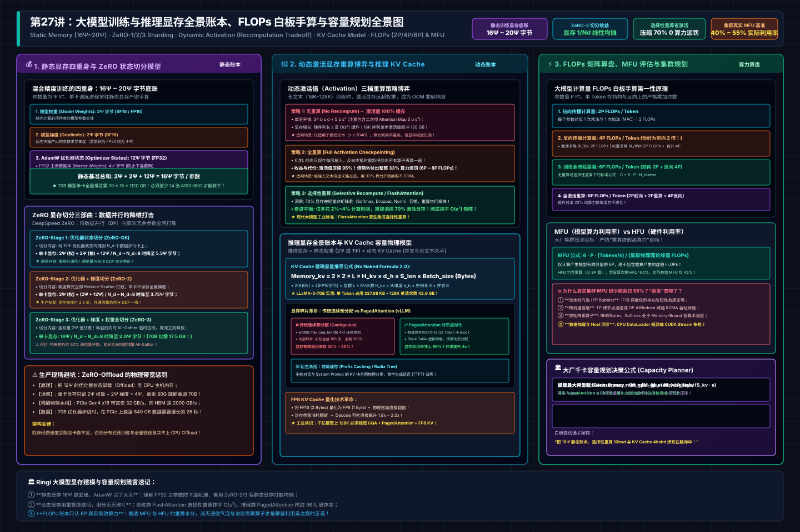
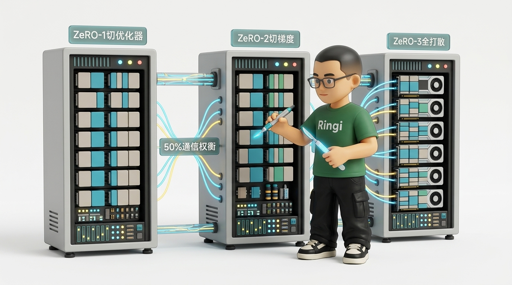

# 第27讲：显存去哪儿了？——大模型训练与推理显存全景账本、FLOPs 白板手算与 KV Cache 容量规划

> **主讲人**：👓 **Ringi**（大厂 AI Infrastructure 资深性能架构师）  
> **所属专栏**：[《AI_Infra大话西游之水滴石穿》](../../README.md) ➔ [Module 03: LLM 架构、FLOPs 与显存建模](../README.md)  
> **篇章范式**：📐 模型架构、算法与显存建模范式（Model Architecture & Memory Ledger Paradigm）  
> **源码与实验环境**：NVIDIA A100-SXM4-80GB / H100-SXM5-80GB | CUDA 12.4 | Python 3.10 | PyTorch 2.3+  
> **知识底账索引**：
>
> - 显存与 KV 核心底账：**大模型训练内存与参数计算（AIInfra）**
> - 推理内存与 KV Cache：**大模型推理内存与参数计算（AIInfra）**
> - MFU 与算力利用率：**CODE 03: MFU 模型利用率评估（AIInfra）**
> - ZeRO 显存切分实现：**ZeRO 显存优化深入拆解（AIInfra）**

---


```text
=================================================================================================
                                   Ringi 3D 架构工坊 · 核心全景
                                 大模型显存四大账本与生命周期全景
=================================================================================================
   ┌────────────────────────────────────────────────────────────────────────────────────────┐
   │                                GPU 物理显存 (80 GB / 卡)                                │
   └───────────────────────────────────────────┬────────────────────────────────────────────┘
                                               │
               ┌───────────────────────────────┴───────────────────────────────┐
               ▼                                                               ▼
   ┌───────────────────────┐                                       ┌───────────────────────┐
   │    【静态显存账本】    │                                       │    【动态显存账本】    │
   │  进程常驻 · 与序列无关 │                                       │  生命周期瞬态 · 随并发与│
   │                       │                                       │  序列长度动态激增      │
   └───────────┬───────────┘                                       └───────────┬───────────┘
               │                                                               │
       ┌───────┴───────┐                                               ┌───────┴───────┐
       ▼               ▼                                               ▼               ▼
 ┌───────────┐   ┌───────────┐                                   ┌───────────┐   ┌───────────┐
 │ 训练态    │   │ 推理态    │                                   │ 训练激活值│   │ 推理动态  │
 │ (16Ψ~20Ψ) │   │ (2Ψ / 1Ψ) │                                   │ (Activation)│ │ (KV Cache)│
 ├───────────┤   ├───────────┤                                   ├───────────┤   ├───────────┤
 │•权重: 2Ψ  │   │•BF16: 2Ψ  │                                   │•无重算:   │   │•传统连续: │
 │•梯度: 2Ψ  │   │•FP8:  1Ψ  │                                   │ O(L·S)暴涨│   │ 碎片率>60%│
 │•AdamW:12Ψ │   │•INT4: 0.5Ψ│                                   │•全重算:   │   │•PagedAttn:│
 │ (Master+  │   │           │                                   │ 33%算力换 │   │ 分页虚拟化│
 │  m + v)   │   │           │                                   │•选择重算: │   │ 零外部碎片│
 └─────┬─────┘   └─────┬─────┘                                   │ 0%损耗省70│   │ 显存率>96%│
       │               │                                         └─────┬─────┘   └─────┬─────┘
       ▼               ▼                                               ▼               ▼
 ┌───────────┐   ┌───────────┐                                   ┌───────────┐   ┌───────────┐
 │ ZeRO-1/2/3│   │ TP 并行   │                                   │ MFU / HFU │   │ 最大并发  │
 │ 切分打散  │   │ 权重平摊  │                                   │ 算力开销  │   │ 容量水位  │
 └───────────┘   └───────────┘                                   └───────────┘   └───────────┘
=================================================================================================
```

<!-- more -->

## 📑 目录导航

- [0. Ringi 开场：生产真实现场与痛点冲突](#0-ringi-开场生产真实现场与痛点冲突)
  - [0.1 真实工程矛盾：千卡训练的“幽灵 OOM” vs 线上推理的“虚胖碎片”](#01-真实工程矛盾千卡训练的幽灵-oom-vs-线上推理的虚胖碎片)
  - [0.2 线上真实事故复盘：某 1024 卡集群扩充 16K 上下文引发的全链路瘫痪](#02-线上真实事故复盘某-1024-卡集群扩充-16k-上下文引发的全链路瘫痪)
  - [0.3 显存四大账本（容量 vs 流量）与全景指标速查表](#03-显存四大账本容量-vs-流量与全景指标速查表)
- [1. 静态显存白板手算：权重、梯度与 AdamW 优化器（ $16\Psi \sim 20\Psi$ 底账）](#1-静态显存白板手算权重梯度与-adamw-优化器16psi-sim-20psi-底账)
  - [1.1 混合精度训练的四重身：从 BF16 到 FP32 Master Weight](#11-混合精度训练的四重身从-bf16-到-fp32-master-weight)
  - [1.2 为什么是 $16\Psi$？什么时候会膨胀到 $18\Psi$ 或 $20\Psi$？](#12-为什么是-16psi什么时候会膨胀到-18psi-或-20psi)
  - [1.3 ZeRO-1 / ZeRO-2 / ZeRO-3 状态切分模型与单卡显存推导](#13-zero-1--zero-2--zero-3-状态切分模型与单卡显存推导)
  - [1.4 ZeRO-Offload 的物理瓶颈：PCIe 带宽与 Host 内存延迟惩罚](#14-zero-offload-的物理瓶颈pcie-带宽与-host-内存延迟惩罚)
- [2. 动态激活显存深度拆解：激活值的三档重算（Recomputation）博弈](#2-动态激活显存深度拆解激活值的三档重算recomputation博弈)
  - [2.1 逐层激活值公式白板推导：Attention 与 FFN 的激活开销](#21-逐层激活值公式白板推导attention-与-ffn-的激活开销)
  - [2.2 三档重算策略深度博弈：无重算 vs 全重算 vs 选择性重算](#22-三档重算策略深度博弈无重算-vs-全重算-vs-选择性重算)
  - [2.3 FlashAttention 反向融合如何抹平中间矩阵显存](#23-flashattention-反向融合如何抹平中间矩阵显存)
- [3. 推理显存账本与 KV Cache 容量规划](#3-推理显存账本与-kv-cache-容量规划)
  - [3.1 推理两阶段的物理分化：Prefill 阶段 vs Decode 阶段](#31-推理两阶段的物理分化prefill-阶段-vs-decode-阶段)
  - [3.2 No Naked Formula 2.0 穿透 KV Cache 容量公式](#32-no-naked-formula-20-穿透-kv-cache-容量公式)
  - [3.3 传统连续预分配 vs PagedAttention 分页虚拟化](#33-传统连续预分配-vs-pagedattention-分页虚拟化)
  - [3.4 稠密模型 vs MoE 混合专家模型的显存账本分化](#34-稠密模型-vs-moe-混合专家模型的显存账本分化)
- [4. 计算量（FLOPs）、MFU 与 HFU 工业级算盘](#4-计算量flopsmfu-与-hfu-工业级算盘)
  - [4.1 前向 $2P$、反向 $4P$、训练 $6P$ 与全重算 $8P$ 的严格矩阵计数](#41-前向-2p反向-4p训练-6p-与全重算-8p-的严格矩阵计数)
  - [4.2 Attention 二次项修正量：何时不能忽略 $4LS^2d$？](#42-attention-二次项修正量何时不能忽略-4ls2d)
  - [4.3 MFU（模型算力利用率）vs HFU（硬件算力利用率）](#43-mfu模型算力利用率vs-hfu硬件算力利用率)
  - [4.4 为什么大厂集群真实 MFU 往往只有 35%~55%？](#44-为什么大厂集群真实-mfu-往往只有-3555)
- [5. 全场景实战：编写工业级容量规划与显存诊断脚本](#5-全场景实战编写工业级容量规划与显存诊断脚本)
  - [5.1 实验一：原生 PyTorch 动态激活显存峰值与重算打点测试](#51-实验一原生-pytorch-动态激活显存峰值与重算打点测试)
  - [5.2 实验二：工业级全栈容量规划器 `cluster_capacity_planner.py`](#52-实验二工业级全栈容量规划器-cluster_capacity_plannerpy)
- [6. Ringi 避坑指南与生产黄金准则](#6-ringi-避坑指南与生产黄金准则)
  - [6.1 7 大常见小白认知误区 vs 大厂 AI Infra 正确物理认知](#61-7-大常见小白认知误区-vs-大厂-ai-infra-正确物理认知)
  - [6.2 生产容量工程黄金 Checklist](#62-生产容量工程黄金-checklist)
- [7. Ringi 5 点核心速记口诀、自我检验清单与课后深度思考题](#7-ringi-5-点核心速记口诀自我检验清单与课后深度思考题)
  - [7.1 5 点押韵核心速记口诀](#71-5-点押韵核心速记口诀)
  - [7.2 10 条白板自我检验清单](#72-10-条白板自我检验清单)
  - [7.3 3 道高阶开放式课后思考题（含极限 Corner Case）](#73-3-道高阶开放式课后思考题含极限-corner-case)
- [8. 📚 参考资料与核心源码/经典论文指引](#8--参考资料与核心源码经典论文指引)
- [附录：Appendix A — 大厂硬核高频面试题与白板推导（Interview Drill）](#附录appendix-a--大厂硬核高频面试题与白板推导interview-drill)
- [🎨 【配图工坊生图 Prompt 暂存区 · 生成配图后可一键整块删除】](#-配图工坊生图-prompt-暂存区--生成配图后可一键整块删除)

---

# 0. Ringi 开场：生产真实现场与痛点冲突

### 0.1 真实工程矛盾：千卡训练的“幽灵 OOM” vs 线上推理的“虚胖碎片”

在 AI Infrastructure 性能工程的日常中，有两场灾难最让架构师夜不能寐：

第一场灾难发生在**训练侧**：  
千卡分布式预训练集群平稳运行了整整两周，一切监控指标看似风平浪静。突然在第 15,200 个 Step，某台计算节点毫无征兆地爆出 `CUDA out of memory`。分布式框架的容错机制触发，整组任务被强行拉起，但从 Checkpoint 恢复加载后仅仅跑了 3 个 Step，相同的节点又在同一个位置暴毙！  
算法同学信誓旦旦：“Ringi，我们的 Batch Size 根本没改，静态权重和优化器也是固定的，为什么训练突然就 OOM 了？这是不是显卡硬件显存坏块？”  
答案往往是：**数据采样遇到了极端长序列，前向传播激增的激活值（Activation）与反向传播的临时梯度 Buffer 瞬间交汇，在毫秒级瞬间刺穿了最后的显存红线！**

第二场灾难发生在**推理侧**：  
线上部署了 8 张 A100-80GB 推理卡，算法根据模型参数和理论 KV Cache 估算：每个请求占 1 GB，整机剩余显存 500 GB，理论上承载 500 并发绰绰有余。然而压测刚拉到 80 并发，显卡内存利用率就已经飙红到 98%，后续请求全部被拒。  
运维同学惊呼：“为什么才 80 并发显存就满了？剩下的 400 GB 显存到底被谁吃掉了？！”  
答案极其讽刺：**显存根本没被真正用上，而是被框架朴素的连续显存预分配机制切割成了无数无法回收的“内部碎片与外部碎片”，系统虚胖致死！**

---

### 0.2 线上真实事故复盘：某 1024 卡集群扩充 16K 上下文引发的全链路瘫痪

2024 年盛夏，国内某顶尖 AI 实验室在 1024 张 H800 GPU（128 个 8 卡节点）上进行 70B 稠密模型的第二阶段预训练（从 4K 上下文正式热扩充至 16K）。

为了保证吞吐，团队使用了 **Tensor Parallel (TP=8) + Data Parallel (DP=128)**，并开启了 **ZeRO-1（切分优化器状态）**。在 4K 阶段，单卡显存稳固在 68 GB / 80 GB，系统安全裕量良好。

但在修改配置将 `max_position_embeddings` 调整为 16384 并继续训练的第 1 个 Step：
1. 前向传播执行到第 40 层 Transformer Block；
2. 由于未开启**选择性重算（Selective Activation Recomputation）**，Attention 算子内部的中间概率矩阵激活值开销随着序列长度呈 $S^2$ 二次形式暴涨；
3. 单卡动态激活值从 4K 时的 8.5 GB 瞬间膨胀到惊人的 **34.8 GB**；
4. 静态显存（权重 17.5 GB + 梯度 17.5 GB + ZeRO-1 优化器 12 GB = 47 GB）叠加激增的 34.8 GB 激活值，瞬间达到 **81.8 GB > 80 GB**；
5. 全集群 1024 张 GPU 在 2 秒内相继触发级联 OOM 崩溃，网络心跳超时，分布式通信拓扑彻底死锁。

```text
[Crash Log: Node-042:GPU-3]
torch.cuda.OutOfMemoryError: CUDA out of memory. 
Tried to allocate 2.14 GiB (GPU 3; 79.25 GiB total capacity; 77.82 GiB already allocated; 
850.00 MiB free; 78.40 GiB reserved in total by PyTorch)
```

这次故障导致千卡集群停机排查长达 6 小时，直接硬件机时损失超过 **30 万元**。

最终的解法不是减小 Batch Size，而是由 Infra 团队介入：
- 将优化器与梯度切分升级为 **ZeRO-2**（单卡静态显存从 47 GB 压降至 21 GB）；
- 开启基于 FlashAttention 的**选择性激活重算**（动态激活值压缩 72%）；
- 最终在 16K 序列下，单卡显存不仅没有爆，反而降到了舒适的 **48 GB**，为后续进一步扩充到 32K 留足了护城河。

---

### 0.3 显存四大账本（容量 vs 流量）与全景指标速查表

| 显存账本类别 | 包含实体 | 生命周期 | 决定性公式 / 典型开销 | 核心受限维度 | 优化与破局武器 |
| :--- | :--- | :--- | :--- | :--- | :--- |
| **训练静态账本** | 权重、梯度、AdamW 优化器状态 | 训练全生命周期常驻 | **$16\Psi \sim 20\Psi$ 字节**（ $\Psi$ 为参数量） | Capacity-Bound（单卡绝对容量） | ZeRO-1/2/3 切分、张量并行（TP）、流水线并行（PP） |
| **训练动态账本** | 前向激活值（Activation）、临时规约缓冲区 | 随前向反向步数瞬态分配与释放 | **$34bsh + 5bs^2$ 字节/层**（无重算） | Capacity + Bandwidth 双重敏感 | 激活值全重算、选择性重算、FlashAttention 反向融合 |
| **推理静态账本** | 模型推理权重（BF16/FP8/INT4） | 推理服务进程常驻 | **$2\Psi$ 字节 (BF16) / $1\Psi$ 字节 (FP8)** | Capacity-Bound | 权重量化（AWQ/GPTQ）、张量并行切分 |
| **推理动态账本** | KV Cache（Key/Value 缓存）、输出 Logits | 随请求生成长度线性激增 | **$4 \cdot B \cdot S \cdot L \cdot d \cdot \frac{H_{kv}}{H_q}$ 字节** | Bandwidth-Bound（Decode 阶段极度访存受限） | GQA 架构、PagedAttention 分页调度、FP8 KV Cache、投机采样 |

---

# 1. 静态显存白板手算：权重、梯度与 AdamW 优化器（ $16\Psi \sim 20\Psi$ 底账）

为了在深入具体细节前建立完整的物理心智模型，下方给出了大模型显存四大账本、ZeRO 状态切分模型、动态激活值三档重算博弈与 FLOPs 矩阵计数的工业级全景架构拓扑：



### 1.1 混合精度训练的四重身：从 BF16 到 FP32 Master Weight

很多人直觉上认为：“我用 BF16 混合精度训练模型，显存里应该全都是 16 位的 2 字节数字。”  
**大错特错！** 在标准混合精度训练中，显存的大头从来不是 BF16，而是为了保证更新稳定性所维护的 **FP32 主参数副本（Master Weight）**。



#### 为什么不能纯用 BF16 完成更新？
在优化器步进（`optimizer.step()`）时，学习率 $\eta$ 通常是一个微小的数字（如 $1 \times 10^{-4}$ 到 $5 \times 10^{-5}$ ）。  
当计算参数增量 $\Delta W = -\eta \cdot \frac{m_t}{\sqrt{v_t} + \epsilon}$ 时， $\Delta W$ 的数值通常处于 $10^{-6} \sim 10^{-8}$ 数量级。  
而 BF16 只有 7 位尾数（有效数字仅 2~3 位十进制精度）。如果直接在 BF16 权重上累加：

$$
W_{t+1} = W_t + \Delta W
$$

由于两者的阶数相差过大，微小的 $\Delta W$ 会在浮点对齐时被**硬件直接截断（Underflow 消失）**！这意味着模型在训练后期，权重根本得不到任何微小更新，训练彻底停滞。

因此，工业级标准实践必须维护一套完整的 **FP32 状态体系**：

```text
[前向传播 Forward]
FP32 Master Weight ─── 动态转换为 ───► BF16 Weight (2 Bytes) ───► 与输入计算出激活值

[反向传播 Backward]
BF16 Weight ─── 求导产出 ───► BF16 Gradient (2 Bytes) (或累加为 FP32)

[优化器更新 Optimizer Step]
BF16 Gradient ─── 传给 ───► AdamW 优化器:
                              • FP32 Gradient (4 Bytes)
                              • FP32 一阶动量 m_t (4 Bytes)
                              • FP32 二阶动量 v_t (4 Bytes)
                              • 更新 FP32 Master Weight (4 Bytes)
```

---

### 1.2 为什么是 $16\Psi$？什么时候会膨胀到 $18\Psi$ 或 $20\Psi$？

我们用严密的算盘，对一个参数量为 $\Psi$ 的稠密模型进行静态显存手算：

#### 标准 $16\Psi$ 显存底账（主流 Megatron-LM / DeepSpeed 默认）：
1. **模型权重（Model Weights）**：BF16 存储，占用 $2\Psi$ 字节；
2. **模型梯度（Gradients）**：BF16 存储，占用 $2\Psi$ 字节；
3. **AdamW 优化器状态（Optimizer States）**：
   - FP32 Master Weight： $4\Psi$ 字节；
   - FP32 梯度一阶动量（First Moment $m$ ）： $4\Psi$ 字节；
   - FP32 梯度二阶动量（Second Moment $v$ ）： $4\Psi$ 字节；
   - 优化器状态小计： $4 + 4 + 4 = \mathbf{12\Psi}$ 字节。

$$
M_{\text{static-16}} = 2\Psi (\text{权重}) + 2\Psi (\text{梯度}) + 12\Psi (\text{优化器}) = \mathbf{16\Psi} \quad (\text{Bytes})
$$

#### 何时会膨胀到 $18\Psi$？
在部分对数值稳定性要求极高的框架中（如早期的 Apex 混合精度），为了防止梯度在跨 Micro-Batch 累加时溢出，**梯度本身以 FP32 格式常驻**：

$$
M_{\text{static-18}} = 2\Psi (\text{BF16 权重}) + 4\Psi (\text{FP32 梯度}) + 12\Psi (\text{优化器}) = \mathbf{18\Psi} \quad (\text{Bytes})
$$

#### 何时会膨胀到 $20\Psi$？
如果在分布式数据并行（DDP）同步规约中，额外开辟了一个全尺寸的 FP32 通信平坦缓冲区（Bucket Flat Buffer），则会再增加 $2\Psi$ 的常驻开销，达到惊人的 **$20\Psi$**。

> **工业基准**：在白板面试与工程估算中，一律以 **$16\Psi$** 为严谨基准！

---

### 1.3 ZeRO-1 / ZeRO-2 / ZeRO-3 状态切分模型与单卡显存推导

对于一个 70B 模型（ $\Psi = 70 \times 10^9$ ）， $16\Psi$ 意味着静态显存需要：

$$
70 \times 10^9 \times 16\text{ Bytes} \approx \mathbf{1120\text{ GB}}
$$

单张 80GB 卡显然不可能装下。微软提出的 **ZeRO（Zero Redundancy Optimizer）** 算法，通过数据并行维度的切分彻底粉碎了这一死局：

| ZeRO 级别 | 核心切分策略 | 单卡显存公式（数据并行度为 $N_{\text{DP}}$ ） | 70B 模型在 $N=8$ 卡时的单卡显存 | 通信开销变化 |
| :--- | :--- | :--- | :--- | :--- |
| **Baseline (DDP)** | 无切分，每卡保存完整冗余副本 | $2\Psi + 2\Psi + 12\Psi = 16\Psi$ | **$1120\text{ GB}$ (直接 OOM)** | 基线：反向传播 1 次 AllReduce（通信量 $2\Psi$ ） |
| **ZeRO-1 ($P_{\text{os}}$)** | **仅切分优化器状态**，权重与梯度全量保存 | $2\Psi + 2\Psi + \frac{12\Psi}{N_{\text{DP}}}$ | $140 + 140 + 105 = \mathbf{385\text{ GB}}$ | 通信量无增加（仅在更新后广播分片，总量 $2\Psi$ ） |
| **ZeRO-2 ($P_{\text{os+g}}$)**| **切分优化器状态 + 梯度**，仅权重全量保存 | $2\Psi + \frac{2\Psi + 12\Psi}{N_{\text{DP}}} = 2\Psi + \frac{14\Psi}{N_{\text{DP}}}$ | $140 + 122.5 = \mathbf{262.5\text{ GB}}$ | 通信量无增加（反向时用 Reduce-Scatter 替代 AllReduce） |
| **ZeRO-3 ($P_{\text{os+g+p}}$)**| **切分优化器 + 梯度 + 模型参数（全切分）** | $\frac{16\Psi}{N_{\text{DP}}}$ | $1120 / 8 = \mathbf{140\text{ GB}}$（ $N=64$ 时仅需 **$17.5\text{ GB}$**） | **通信量增加 50%**（前向每层前需 AllGather 收集权重，前向完即丢弃；反向需再次 AllGather） |

---

### 1.4 ZeRO-Offload 的物理瓶颈：PCIe 带宽与 Host 内存延迟惩罚

当显卡显存极度紧张时，很多工程师会寄希望于开启 `ZeRO-Offload`，将优化器状态甚至部分权重卸载到主机内存（Host CPU DRAM）甚至 NVMe SSD 上。

**掏出工程算盘手算：这笔账到底划不划算？**

假设你在单台 8 卡服务器上训练 70B 模型，通过 PCIe 4.0 x16 互联：
- **PCIe 4.0 x16 双向理论带宽**：约 32 GB/s（实际单向有效吞吐仅约 24 GB/s）；
- **需要卸载的数据量**：70B 模型的优化器状态占 $70 \times 12 = 840\text{ GB}$；
- 每次参数更新，GPU 必须把梯度通过 PCIe 搬运给 CPU，CPU 计算完 AdamW 后，再把更新后的参数通过 PCIe 搬运回 GPU；
- 单次跨 PCIe 搬运耗时：

$$
\text{Latency} = \frac{840\text{ GB}}{24\text{ GB/s}} \approx \mathbf{35 \text{ s}}（约 35 秒）!
$$

而 8 卡 H800 执行一步前向和反向计算只需要 **1.2 秒**！  
这意味着：**开启 ZeRO-Offload 之后，训练 Step Time 从 1.2 秒被硬生生拉长到 36.2 秒，整机算力利用率（MFU）暴跌至不足 3%！**  
**生产结论**：ZeRO-Offload 仅适合低成本个人微调或死里求生的救急场景，在大规模工业预训练中严禁作为主流方案。

---

# 2. 动态激活显存深度拆解：激活值的三档重算（Recomputation）博弈

### 2.1 逐层激活值公式白板推导：Attention 与 FFN 的激活开销

在前向传播中，除了静态权重，每一层计算出的中间变量（Activations）都必须缓存在显存中，直到反向传播求导用完后才能被销毁。

我们以单层标准 Transformer Block 为例，输入批大小 $B$，序列长度 $S$，主干维度 $d$，Query 头数 $H_q$（为简化推导先按标准 MHA $H_q = H_{kv}$ 分析，单头维度 $d_h = d / H_q$ ）：

#### 1. Attention 模块激活值明细：
- **$Q, K, V$ 投影输入**：共享输入 $X$，无需存三份，保存输入 $X \in \mathbb{R}^{B \times S \times d}$（BF16）： $2BSd$ 字节；
- **$Q, K$ 投影产物**：用于求导，需存 $Q, K \in \mathbb{R}^{B \times S \times d}$： $2 \times 2BSd = 4BSd$ 字节；
- **注意力得分矩阵 $S = QK^T$**：尺寸为 $[B, H_q, S, S]$，元素数为 $B H_q S^2$： $2B H_q S^2$ 字节；
- **Softmax 归一化概率矩阵 $P$**：尺寸同为 $[B, H_q, S, S]$： $2B H_q S^2$ 字节；
- **Dropout 掩码（若开启）**：按 Byte 存储（1 字节/元素）： $1B H_q S^2$ 字节；
- **Value 投影产物与 Attention 输出**： $2BSd$ 字节；
- **输出投射 $W_o$ 与残差连接**： $2BSd$ 字节。

#### 2. FFN 模块激活值明细（以标准 FFN $4d$ 为例）：
- **输入 LayerNorm 状态**： $2BSd$ 字节；
- **第一层升维线性投射产物**： $[B, S, 4d]$，占用 $2 \times 4BSd = 8BSd$ 字节；
- **激活函数（GELU/ReLU）中间保留值**： $8BSd$ 字节；
- **第二层降维线性投射输入与残差**： $4BSd$ 字节；
- **FFN 激活值小计**： $\approx 22BSd \sim 24BSd$ 字节。

#### 单层激活值总量大一统公式（无重算）：

$$
M_{\text{act-layer}} = 34BSd + 5B H_q S^2 \quad (\text{Bytes})
$$

全模型 $L$ 层的总激活显存为：

$$
M_{\text{act-total}} = L \times (34BSd + 5B H_q S^2) \quad (\text{Bytes})
$$

**致命痛点**：注意公式右侧的 **$5B H_q S^2$**！  
当序列长度从 $S=2048$ 放大到 $S=32768$（放大 16 倍）时， $S^2$ 项被放大了整整 **256 倍**！激活显存会瞬间突破数百 GB，这就是引发长文本 OOM 的头号元凶。

---

### 2.2 三档重算策略深度博弈：无重算 vs 全重算 vs 选择性重算

为了降服 $S^2$ 的显存吞噬，系统工程师发明了**激活值重算（Activation Checkpointing）**。

| 重算策略 | 显存中保留的内容 | 反向传播时的额外操作 | 单层激活显存占用 | 额外计算量（FLOPs 开销） | 生产场景建议 |
| :--- | :--- | :--- | :--- | :--- | :--- |
| **档位 1: 无重算 (No Recompute)** | 所有前向算子的中间产物完整保留在 HBM | 零额外重算，直接读取激活值求导 | **$34BSd + 5BS^2 H_q$** | **0%（理论最快）** | 仅适用于短文本（ $S \le 2K$ ）且显存极度宽裕的场景 |
| **档位 2: 全重算 (Full Checkpoint)** | 仅保留每一层 Block 最外层的输入张量（Checkpoint） | 反向传播到该层时，**当场重新跑一遍前向传播** | **$2BSd$**（极小，与层数 $L$ 解耦） | **+33.3%**（前向算 2 次，总计算量从 $6P$ 飙升至 $8P$ ） | 极致长文本（128K+）且显存即将见底时的保命底牌 |
| **档位 3: 选择性重算 (Selective Recompute)** | 保留大 GEMM 矩阵乘的输入输出，**仅丢弃并重算 Attention 内部的 Softmax 与 Dropout** | 仅重新计算 $QK^T$ 和 Softmax，跳过所有沉重的 GEMM | **$34BSd$**（**彻底抹除 $S^2$ 二次项！**） | **< 3%（微乎其微）** | **大厂工业生产必选的黄金标准！** |

---

### 2.3 FlashAttention 反向融合如何抹平中间矩阵显存

在上一模块第 25 讲中，我们详细推导了 FlashAttention 的前向 Tiling。那么在显存账本中，**FlashAttention 是如何拯救反向传播激活值的？**

传统 PyTorch 原生 Attention：
必须将大小为 $[B, H_q, S, S]$ 的中间注意力矩阵 $S$ 和 Softmax 输出矩阵 $P$ **完整落盘写出到 HBM**，供反向传播求导读取。在 32K 序列下，仅这两个矩阵就要吞噬几十 GB 显存。

FlashAttention 反向融合机制：
在前向传播时，**根本不存 $S$ 和 $P$**！它仅把 Softmax 的行归一化统计量（标量向量 $L \in \mathbb{R}^{B \times H_q \times S}$，仅占微不足道的 $2BS H_q$ 字节）保留在 HBM 中。  
在反向传播时，Kernel 直接在 SM 内部的高速 SRAM 寄存器中，利用保留的 $Q, K, V$ 以及标量 $L$，**当场重算局部的 $P_{ij}$ 块并立刻与梯度累加**！

**收益结算**：通过将反向求导融合进同一个 GPU Kernel，直接把 $O(S^2)$ 激活值完全消除在 SRAM 中，使长文本下的 Attention 激活显存从“不可承受之重”降维打击为“几乎零感知”。

---

# 3. 推理显存账本与 KV Cache 容量规划

### 3.1 推理两阶段的物理分化：Prefill 阶段 vs Decode 阶段

在推理服务中，大模型的运行绝不是均匀同构的，而是分裂为特征完全相反的两个阶段：

```text
[Prefill 预填充阶段]
用户输入长 Prompt: [Token_0, Token_1, ..., Token_1023] (共 1024 Tokens)
• 计算特征: GEMM 矩阵乘，计算强度极高 (Compute-Bound)，算力利用率高达 60%+
• 显存特征: 动态激活值占主导，从第 0 个到第 1023 个 Token 的 Key/Value 被一次性写入 HBM 生成 KV Cache

[Decode 自回归解码阶段]
每次只吐出 1 个新 Token: Token_1024 ──► Token_1025 ──► Token_1026 ...
• 计算特征: 退化为 GEMV 矩阵-向量乘，计算强度极低 (< 2 FLOP/Byte)，极度访存受限 (Memory-Bound)
• 显存特征: 静态激活值极小，但 KV Cache 随着每一步自回归线性膨胀，直至吞噬全卡显存！
```

---

### 3.2 No Naked Formula 2.0 穿透 KV Cache 容量公式

我们再次调用最严谨的 **No Naked Formula 2.0（公式五步穿透法）**：

#### ① 为什么需要算它？
Decode 阶段生成每个 Token 时，由于模型必须与历史所有 Token 做注意力计算，如果不缓存历史 Key 和 Value，每生成一个新词都要把所有历史词重新过一遍模型，计算复杂度将从 $O(S)$ 退化为 $O(S^2)$，线上延迟彻底爆炸。

#### ② Mental Model（物理直觉比喻）
KV Cache 就像是你在读一本长篇侦探小说时手边做的人物关系笔记本。每一章新登场一个角色，你都在本子上记下一笔（新增 Key 和 Value）。书越读越厚，笔记本占用的桌面空间（物理显存）越来越大，直到桌子被本子堆满，你再也放不下一页新纸。

#### ③ Tiny Calculator（极简数字手算）
设单卡模型参数：
- 层数 $L = 1$
- 批大小 $B = 1$
- 序列总长度 $S = 2$
- 隐藏层大小 $d = 4$，Head 维度 $d_h = 2$，Query 头数 $H_q = 2$，KV 头数 $H_{kv} = 1$（GQA 2:1）
- 数据类型：BF16（2 字节/元素）

对于单个 Token：
- Key 向量大小： $H_{kv} \times d_h = 1 \times 2 = 2$ 个元素，占 $2 \times 2 = 4$ 字节；
- Value 向量大小： $H_{kv} \times d_h = 1 \times 2 = 2$ 个元素，占 $2 \times 2 = 4$ 字节；
- 单 Token 单层 KV 字节： $4 + 4 = 8$ 字节。  
总容量（ $L=1, B=1, S=2$ ）： $8 \times 2 = \mathbf{16 \text{ B}}（16 字节）$。

#### ④ Formal Model（标准公式与映射）
对于一个 $L$ 层、隐藏层大小 $d$、Query 头数 $H_q$、KV 头数 $H_{kv}$ 的模型，在精度字节数为 $U$（FP16/BF16 时 $U=2$，FP8 时 $U=1$ ）下：
单 Token 在全模型中产生的 KV Cache 显存为：

$$
\text{KV-token-size} = 2 \times U \times L \times d \times \left( \frac{H_{kv}}{H_q} \right) \quad (\text{Bytes})
$$

在并发请求数为 $B$，平均上下文长度为 $S$ 时，全集群常驻的总 KV Cache 物理显存为：

$$
M_{\text{kv}} = 2 \times U \times B \times S \times L \times d \times \left( \frac{H_{kv}}{H_q} \right) \quad (\text{Bytes})
$$

#### ⑤ Sanity Check（数量级校验）
以 **LLaMA-3-70B**（ $L=80, d=8192, H_q=64, H_{kv}=8$，即 GQA 1:8 分组）为例：
单 Token 全层 KV Cache 尺寸（BF16, $U=2$ ）：

$$
\text{Size}_{\text{token}} = 2 \times 2 \times 80 \times 8192 \times \frac{8}{64} = 327,680\text{ 字节} \approx \mathbf{320\text{ KB/token}}
$$

当部署在单机 8 卡 H100（TP=8）上时：
- 单卡平摊每 Token 仅： $320\text{ KB} / 8 = \mathbf{40\text{ KB/token}}$；
- 若并发 $B=32$，上下文平均长度 $S=8192$（8K）：

$$
M_{\text{kv-card}} = 40\text{ KB} \times 32 \times 8192 \approx \mathbf{10.48\text{ GB}}
$$

- 80GB 显存扣除约 17.5 GB 静态权重后，剩余超过 50 GB 显存，服务运行非常宽裕！

---

### 3.3 传统连续预分配 vs PagedAttention 分页虚拟化

如果仅仅按上述理论公式计算，线上服务依然会频繁遭遇虚假的 OOM。为什么？


#### 传统朴素推理引擎的致命痛点（显存虚胖）：
在 HuggingFace 等朴素框架中，由于 PyTorch 的张量必须在物理上占据**连续内存空间**：
1. **预分配浪费（Internal Fragmentation）**：当用户设定最大生成长度为 4096 时，框架必须在请求刚进来的一瞬间，就立刻按 4096 长度分配出一整块连续显存空间！但实际用户可能问了一个简单问题，模型只吐出 50 个 Token 就输出了 `<eos>` 结束符。剩下的 4046 个 Token 显存全部被白白锁死，无法给其他请求使用；
2. **外部碎片（External Fragmentation）**：由于不同请求的长度动态变化，频繁的分配与释放会导致 GPU 显存被割裂成无数细小、不连续的空闲碎片。当一个新请求需要 2 GB 连续空间时，虽然显存总空闲还有 10 GB，但最大的连续块只有 1.5 GB，系统依然报错 OOM！

实测数据表明：在朴素连续分配机制下，**GPU 显存的真实有效利用率通常只有可怜的 20% ~ 35%**！

#### PagedAttention（vLLM 核心算法）的破局之道：
借鉴现代操作系统虚拟内存的分页机制（Paging），PagedAttention 彻底打碎了物理连续的枷锁：
- **逻辑连续，物理离散**：将每个序列的 KV Cache 切分为固定大小的 **Block（如每个 Block 存 16 个 Token）**；
- **页表路由（Page Table）**：在 CPU 侧维护一张逻辑块到物理块的映射页表。每当生成 16 个新 Token，引擎才向显存内存池申请一个新的物理 Block；
- **Copy-on-Write 零拷贝分叉**：在多轮对话或并行采样（Parallel Sampling）中，共享的前缀 Prompt 物理 Block 只有一份引用，仅在发生分叉写入时才申请新 Block。

**工程成效**：显存浪费直接降低到最后一个未填满 Block 的微量空间（平均每个请求浪费不到半个 Block，即 8 个 Token），**物理显存有效利用率直接飙升至 96% 以上，线上推理并发承载能力原地提升 2.5 ~ 4 倍！**

---

### 3.4 稠密模型 vs MoE 混合专家模型的显存账本分化

随着 Mixtral 8x7B、DeepSeek-V2/V3 等 MoE（Mixture of Experts）模型席卷工业界，显存账本出现了革命性的分化：

```text
[稠密模型 (Dense Model, 如 LLaMA-3-70B)]
• 总参数量: 70B
• 每个 Token 激活参数量: 70B (100%)
• 显存与算力严格绑定：有多少参数，就占用多少静态显存，也发生多少 FLOPs 计算。

[稀疏门控 MoE 模型 (如 Mixtral 8x7B)]
• 总参数量: 47B (含 8 个专家)
• 每个 Token 激活参数量: 仅约 13B (Top-2 路由)
• 显存与算力彻底解耦：
  - 静态显存必须存下全部 47B 参数 (约 94 GB BF16)！
  - 动态计算量 FLOPs 却仅仅相当于一个 13B 的轻量模型！
```

#### MoE 显存架构设计的工业 Trade-off：
1. **显存容量是硬门槛**：部署 MoE 必须按**全量总参数（Total Params）**来规划 GPU 显存容量。哪怕每个 Token 只激活 1 个专家，整张卡也必须把所有未激活专家的静态权重完整常驻显存；
2. **Decode 吞吐天然受益**：在推理 Decode 阶段，由于算术强度由激活参数决定，MoE 模型以 13B 的微小计算量却拥有接近 70B 稠密模型的知识容量，使得端到端首字延迟（TTFT）和单字生成延迟（TPOT）表现极其优异；
3. **EP（专家并行）通信开销**：当单机显存塞不下海量专家时，必须引入专家并行（Expert Parallelism），这会引发跨节点的 `All-to-All` Token 路由通信，对集群机间 RDMA 带宽提出极高要求。

---

# 4. 计算量（FLOPs）、MFU 与 HFU 工业级算盘

### 4.1 前向 $2P$、反向 $4P$、训练 $6P$ 与全重算 $8P$ 的严格矩阵计数

在上一讲中我们推导了单 Token 的基本算盘。在此我们建立面向分布式全集群的完整 FLOPs 计数模型：

设非 Embedding 模型参数量为 $P$，全批次 Token 总数（ $B \times S$ ）：
- **前向传播（Forward Pass）**：

$$
\text{FLOPs}_{\text{fwd}} = 2 \times P \times B \times S
$$

- **反向传播（Backward Pass，激活求导 $2P$ + 权重求导 $2P$ ）**：

$$
\text{FLOPs}_{\text{bwd}} = 4 \times P \times B \times S
$$

- **标准训练（Standard Training，无全重算）**：

$$
\text{FLOPs}_{\text{train}} = \text{FLOPs}_{\text{fwd}} + \text{FLOPs}_{\text{bwd}} = \mathbf{6 \times P \times B \times S}
$$

- **全激活重算训练（Full Activation Checkpointing）**：
  由于前向过程被完整多算了一次：

$$
\text{FLOPs}_{\text{full-recompute}} = 2 \times P \times B \times S (\text{前向}) + 2 \times P \times B \times S (\text{重算}) + 4 \times P \times B \times S (\text{反向}) = \mathbf{8 \times P \times B \times S}
$$

---

### 4.2 Attention 二次项修正量：何时不能忽略 $4LS^2d$？

在很多简化的参数计算中，大家往往习惯性使用 $6P$。但在超长上下文（ $S \ge 8192$ ）训练中，**Attention 矩阵点乘带来的计算量绝对不容忽视**！

对于 $L$ 层 Transformer，每层包含两个与参数量无关的纯张量乘法：
1. $Q \cdot K^T$： $[B, H_q, S, d_h] \times [B, H_q, d_h, S] \to [B, H_q, S, S]$，计算量为 $2 \times B \times H_q \times S \times d_h \times S = 2 B S^2 d$；
2. $\text{Attn} \cdot V$： $[B, H_q, S, S] \times [B, H_q, S, d_h] \to [B, H_q, S, d_h]$，计算量同样为 $2 B S^2 d$。

前向传播中每层产生 $4 B S^2 d$ FLOPs，反向传播约为前向的 2 倍（ $8 B S^2 d$ ）。  
因此，训练中 Attention 二次项的总计算量为：

$$
\text{FLOPs}_{\text{attn-quadratic}} = 12 \times L \times B \times S^2 \times d
$$

#### 临界对比分析：
以 LLaMA-3-8B（ $L=32, d=4096, P \approx 7 \times 10^9$ ）为例：
- 当 $S = 2048$ 时：
  - 参数矩阵乘计算量： $6 \times 7 \times 10^9 \times S = 4.2 \times 10^{10} \times S$
  - Attention 二次项计算量： $12 \times 32 \times S \times 4096 \times S \approx 1.57 \times 10^6 \times S^2$
  - 二次项占比： $\frac{1.57 \times 10^6 \times 2048}{4.2 \times 10^{10}} \approx \mathbf{7.6\%}$（可作为扰动项修正）；
- 当 $S = 32768$（32K 长文本）时：
  - 二次项占比飙升至： $\frac{1.57 \times 10^6 \times 32768}{4.2 \times 10^{10}} \approx \mathbf{122.5\%}$！  
  **惊人事实**：在 32K 长度下，Attention 二次项的计算量已经彻底压过了全模型权重矩阵乘！此时必须使用严格公式修正 FLOPs。

---

### 4.3 MFU（模型算力利用率）vs HFU（硬件算力利用率）

在评估万卡大模型集群的性能时，业内存在两个核心指标：

```text
[MFU: Model FLOPs Utilization (模型算力利用率) - 工业黄金金标准]
衡量的是模型在理论上完成学习所必需的最纯粹数学 FLOPs（通常按 6P 计算，不包含任何重算与 Padding 气泡）。
公式:
          纯理论必要总 FLOPs / 单步迭代时间
   MFU = ───────────────────────────────────────
          集群 GPU 数量 × 单卡硬件理论峰值 TFLOPS

[HFU: Hardware FLOPs Utilization (硬件算力利用率)]
衡量的是 GPU 物理核心上实际执行的所有指令（包含了激活全重算多出的 2P，以及数据 Padding 的无效计算）。
公式:
          实际执行总 FLOPs (含重算) / 单步迭代时间
   HFU = ───────────────────────────────────────────
          集群 GPU 数量 × 单卡硬件理论峰值 TFLOPS
```

#### 两者的黄金关系：
如果开启了全激活重算，由于实际计算量由 $6P$ 增加到 $8P$：

$$
\text{HFU} \approx \frac{8}{6} \times \text{MFU} = 1.333 \times \text{MFU}
$$

**警惕生产陷阱**：在汇报性能数据时，有团队谎称自己的“利用率达到了 65%”，实际上他们汇报的是掺杂了全重算算力泡沫的 HFU！真实的行业评测**一律以 MFU 为唯一客观铁律**。

---

### 4.4 为什么大厂集群真实 MFU 往往只有 35%~55%？

如果 GPU 算力足够强，为什么工业界顶级集群（如 Meta LLaMA-3、DeepSeek）的真实 MFU 往往只能做到 **38% ~ 54%**，剩下的 50% 算力到底被什么黑洞吞噬了？

1. **并行通信气泡（Communication Bubbles）**：
   - 流水线并行（PP）中的 1F1B 调度天然存在 Warmup 和 Cooldown 气泡；
   - 张量并行（TP）在每层 Attention 和 FFN 都要做 2 次跨卡 `All-Reduce`，当多机扩展时，跨节点网络延迟导致 Tensor Core 频繁挂起等待；
2. **Memory-Bound 访存受限算子的拖累**：
   - RMSNorm、Softmax、RoPE、SiLU 逐元素操作的算术强度极低，GPU 绝大部分时间被存储墙封锁；
3. **数据 Padding 与长短不齐（Workload Imbalance）**：
   - 在同一个 Batch 中，为了对齐最长序列，短文本被补入了大量无效的 `<pad>` Token，这部分消耗了硬件时钟却无法计入有效 MFU；
4. **底层 Kernel Launch 开销与 CPU 调度延迟**：
   - 数千个细小算子的调度如果未被 CUDA Graph 捕获，CPU 与 GPU 之间的指令流水线会出现微小空隙。

---

# 5. 全场景实战：编写工业级容量规划与显存诊断脚本

### 5.1 实验一：原生 PyTorch 动态激活显存峰值与重算打点测试

本实验通过原生 PyTorch 模拟单层 Transformer 的前向与反向，通过 `torch.cuda.memory_allocated()` 与 `max_memory_allocated()` 精确打点：
1. 观察无重算时的激活值峰值；
2. 观察开启 PyTorch 原生 `checkpoint` 后的显存陡降与算力时间开销。

```python
"""
Ringi AI Infra 实验室：Minimal Runnable Code
实验一：PyTorch 激活值显存峰值打点与梯度重算对比实验
运行环境：需配备 NVIDIA GPU 并在支持 CUDA 的 PyTorch 环境中运行
"""

import torch
import torch.nn as nn
from torch.utils.checkpoint import checkpoint

class DummyTransformerLayer(nn.Module):
    def __init__(self, d_model: int):
        super().__init__()
        self.norm = nn.LayerNorm(d_model)
        self.linear1 = nn.Linear(d_model, 4 * d_model)
        self.act = nn.GELU()
        self.linear2 = nn.Linear(4 * d_model, d_model)

    def forward(self, x: torch.Tensor) -> torch.Tensor:
        # 产生多步中间激活值
        residual = x
        x = self.norm(x)
        x = self.linear1(x)
        x = self.act(x)
        x = self.linear2(x)
        return x + residual

def run_memory_experiment():
    if not torch.cuda.is_available():
        print("[-] 未检测到 CUDA 环境，本实验需要在支持 GPU 的机器上执行以观测物理显存。")
        return

    device = torch.device("cuda:0")
    torch.cuda.empty_cache()
    torch.cuda.reset_peak_memory_stats(device)

    B, S, d_model = 8, 4096, 4096
    print(f"=== 配置参数: Batch={B}, SeqLen={S}, Dim={d_model} ===")

    # 1. 模拟无重算 (Standard Forward-Backward)
    model = nn.Sequential(*[DummyTransformerLayer(d_model) for _ in range(4)]).to(device)
    inputs = torch.randn(B, S, d_model, device=device, requires_grad=True)

    base_mem = torch.cuda.memory_allocated(device) / (1024 ** 2)
    print(f"[1. 无重算模式] 静态模型初始化显存: {base_mem:.2f} MB")

    out = model(inputs)
    fwd_mem = torch.cuda.memory_allocated(device) / (1024 ** 2)
    peak_mem_no_ckpt = torch.cuda.max_memory_allocated(device) / (1024 ** 2)
    print(f"[1. 无重算模式] 前向后常驻激活显存: {fwd_mem:.2f} MB (较静态激增 {fwd_mem - base_mem:.2f} MB)")
    print(f"[1. 无重算模式] 运行全程最高峰值显存: {peak_mem_no_ckpt:.2f} MB")

    loss = out.sum()
    loss.backward()
    del out, loss
    torch.cuda.empty_cache()

    # 2. 模拟全激活重算 (Checkpointing)
    print("\n------------------------------------------------------------------")
    torch.cuda.reset_peak_memory_stats(device)
    base_mem_ckpt = torch.cuda.memory_allocated(device) / (1024 ** 2)
    
    # 使用 checkpoint 包裹前向
    def run_with_ckpt(x):
        for layer in model:
            x = checkpoint(layer, x, use_reentrant=False)
        return x

    inputs_ckpt = torch.randn(B, S, d_model, device=device, requires_grad=True)
    out_ckpt = run_with_ckpt(inputs_ckpt)
    fwd_mem_ckpt = torch.cuda.memory_allocated(device) / (1024 ** 2)
    peak_mem_ckpt = torch.cuda.max_memory_allocated(device) / (1024 ** 2)

    print(f"[2. 激活重算模式] 前向后常驻激活显存: {fwd_mem_ckpt:.2f} MB (较静态激增 {fwd_mem_ckpt - base_mem_ckpt:.2f} MB)")
    print(f"[2. 激活重算模式] 运行全程最高峰值显存: {peak_mem_ckpt:.2f} MB")
    
    saved_ratio = (1 - (peak_mem_ckpt / peak_mem_no_ckpt)) * 100
    print(f"\n>>> 实测结论: 开启激活重算后，显存峰值降低了 {saved_ratio:.2f}%！")

if __name__ == "__main__":
    run_memory_experiment()
```

---

### 5.2 实验二：工业级全栈容量规划器 `cluster_capacity_planner.py`

在面对真实的集群规划、选型采买和架构排布时， Infra 工程师需要一套严密的计算引擎。本脚本实现了**从任意模型参数手算集群节点配比、ZeRO 静态切分、动态激活值、长文本 KV Cache 与 MFU 倒推的全景规划器**：

```python
"""
Ringi AI Infra 实验室：Minimal Runnable Code
实验二：工业级千卡训练集群与万级并发推理全栈容量规划器
纯 Python 标准库编写，零第三方依赖，可直接执行！
"""

class ClusterCapacityPlanner:
    def __init__(
        self,
        model_name: str,
        num_layers: int,
        hidden_size: int,
        num_heads: int,
        num_kv_heads: int,
        intermediate_size: int,
        vocab_size: int = 128256
    ):
        self.name = model_name
        self.L = num_layers
        self.d = hidden_size
        self.H_q = num_heads
        self.H_kv = num_kv_heads
        self.d_ffn = intermediate_size
        self.V = vocab_size

        # 1. 严格手算非 Embedding 参数量 P 与全模型总参数量 Psi
        self.params_attn = 2 * (self.d ** 2) * (1 + self.H_kv / self.H_q) * self.L
        self.params_ffn = 3 * self.d * self.d_ffn * self.L
        self.params_embed = 2 * self.V * self.d
        self.non_embed_params = self.params_attn + self.params_ffn
        self.total_params = self.non_embed_params + self.params_embed

    def plan_training_cluster(
        self,
        num_gpus: int,
        gpu_memory_gb: float = 80.0,
        gpu_fp16_tflops: float = 989.0, # A100=312, H100=989 (Dense)
        batch_size_per_gpu: int = 1,
        seq_len: int = 4096,
        tensor_parallel: int = 8,
        recompute_mode: str = "selective" # "none", "full", "selective"
    ):
        """规划训练集群切分、显存水位与 MFU 吞吐预测"""
        psi = self.total_params
        
        # 静态显存分析 (ZeRO-3 全切分)
        # 单卡静态状态: (2 权重 + 2 梯度 + 12 AdamW) * psi / N
        static_total_gb = (16 * psi) / (1024 ** 3)
        static_per_gpu_gb = static_total_gb / num_gpus

        # 动态激活值显存手算 (考虑机内张量并行 TP=8 切分)
        B = batch_size_per_gpu
        S = seq_len
        d = self.d
        if recompute_mode == "none":
            act_per_layer_bytes = 34 * B * S * d + 5 * B * (S ** 2) * self.H_q
            total_act_bytes = self.L * act_per_layer_bytes
        elif recompute_mode == "full":
            total_act_bytes = 2 * B * S * d * self.L # 仅留输入 Checkpoint
        else: # "selective"
            total_act_bytes = self.L * (34 * B * S * d) # 抹除 S^2
        
        # 在 TP 并行下，隐藏维度在卡间分块，单卡激活值除以 TP
        act_per_gpu_gb = (total_act_bytes / tensor_parallel) / (1024 ** 3)
        runtime_overhead_gb = 3.5 # CUDA 上下文与通信缓存
        total_used_gpu_gb = static_per_gpu_gb + act_per_gpu_gb + runtime_overhead_gb
        is_oom = total_used_gpu_gb > gpu_memory_gb

        # 单步纯模型理论计算量 (6P FLOPs)
        total_tokens_per_step = B * S * num_gpus
        pure_model_flops = 6 * self.non_embed_params * total_tokens_per_step

        return {
            "model_params_b": psi / 1e9,
            "static_per_gpu_gb": static_per_gpu_gb,
            "act_per_gpu_gb": act_per_gpu_gb,
            "total_used_gpu_gb": total_used_gpu_gb,
            "is_oom": is_oom,
            "total_tokens_per_step": total_tokens_per_step,
            "step_pure_flops_e15": pure_model_flops / 1e15 # PFLOPs
        }

    def plan_inference_capacity(
        self,
        num_gpus: int,
        gpu_memory_gb: float = 80.0,
        seq_len: int = 8192,
        kv_dtype_bytes: int = 2 # 2 for BF16, 1 for FP8
    ):
        """规划推理单卡/多卡在给定长度下的最大承载并发极限"""
        # 权重平摊
        weight_gb = (self.total_params * 2) / (1024 ** 3) # 假设权重 BF16
        weight_per_gpu_gb = weight_gb / num_gpus
        
        runtime_gb = 3.0
        available_kv_mem_gb = max(0.0, gpu_memory_gb - weight_per_gpu_gb - runtime_gb)

        # 单 Token 全集群 KV Cache
        bytes_per_token = 2 * kv_dtype_bytes * self.L * self.d * (self.H_kv / self.H_q)
        bytes_per_seq_cluster = bytes_per_token * seq_len
        bytes_per_seq_card = bytes_per_seq_cluster / num_gpus

        # 考虑 PagedAttention 96% 内存利用率
        effective_kv_mem_bytes = (available_kv_mem_gb * (1024 ** 3)) * 0.96
        max_concurrency = int(effective_kv_mem_bytes // bytes_per_seq_card) if bytes_per_seq_card > 0 else 0

        return {
            "weight_per_gpu_gb": weight_per_gpu_gb,
            "available_kv_mem_gb": available_kv_mem_gb,
            "kv_cache_per_seq_card_gb": (bytes_per_seq_card) / (1024 ** 3),
            "max_concurrency": max_concurrency
        }

if __name__ == "__main__":
    print("==================================================================")
    print("  Ringi AI Infra 全栈容量规划器 (Cluster Capacity Planner)")
    print("==================================================================")

    # 实例化 LLaMA-3-70B
    llama3_70b = ClusterCapacityPlanner(
        model_name="LLaMA-3-70B",
        num_layers=80,
        hidden_size=8192,
        num_heads=64,
        num_kv_heads=8,
        intermediate_size=28672,
        vocab_size=128256
    )

    # 1. 模拟千卡训练集群规划 (1024 卡 H100, 4K 上下文, MicroBatch=1, TP=8, 选择性重算)
    train_res = llama3_70b.plan_training_cluster(
        num_gpus=1024,
        gpu_memory_gb=80.0,
        gpu_fp16_tflops=989.0,
        batch_size_per_gpu=1,
        seq_len=4096,
        tensor_parallel=8,
        recompute_mode="selective"
    )

    print(f"\n[1. 1024卡 H100 训练规划 (4K 上下文, TP=8 + ZeRO-3)]")
    print(f"• 模型有效参数量        : {train_res['model_params_b']:.2f} B")
    print(f"• 单卡平摊静态显存 (ZeRO-3): {train_res['static_per_gpu_gb']:.2f} GB")
    print(f"• 单卡动态激活值 (TP=8平摊): {train_res['act_per_gpu_gb']:.2f} GB")
    print(f"• 单卡预计总显存占用    : {train_res['total_used_gpu_gb']:.2f} GB / 80 GB")
    print(f"• 是否安全通过 (无 OOM) : {'✅ 极度安全' if not train_res['is_oom'] else '❌ 发生 OOM'}")
    print(f"• 单步处理总 Token 数   : {train_res['total_tokens_per_step']:,} Tokens")
    print(f"• 单步纯模型计算量      : {train_res['step_pure_flops_e15']:.2f} PFLOPs")

    # 2. 模拟线上 8 卡推理集群规划 (8 卡 A100-80GB, 16K 上下文, 对比 BF16 vs FP8 KV)
    print(f"\n[2. 8卡 A100 推理集群容量规划 (16K 长文本)]")
    infer_bf16 = llama3_70b.plan_inference_capacity(num_gpus=8, seq_len=16384, kv_dtype_bytes=2)
    infer_fp8 = llama3_70b.plan_inference_capacity(num_gpus=8, seq_len=16384, kv_dtype_bytes=1)

    print(f"• 单卡静态权重显存 (TP=8)  : {infer_bf16['weight_per_gpu_gb']:.2f} GB")
    print(f"• 单卡可用 KV 显存池       : {infer_bf16['available_kv_mem_gb']:.2f} GB")
    print(f"• BF16 KV Cache (单并发/卡): {infer_bf16['kv_cache_per_seq_card_gb']:.2f} GB")
    print(f"• BF16 下最大承载并发数    : {infer_bf16['max_concurrency']} 并发")
    print(f"• FP8 KV Cache  (单并发/卡): {infer_fp8['kv_cache_per_seq_card_gb']:.2f} GB")
    print(f"• FP8 优化后最大承载并发数 : {infer_fp8['max_concurrency']} 并发 (翻倍提升!)")
    print("==================================================================")
```

---

# 6. Ringi 避坑指南与生产黄金准则

### 6.1 7 大常见小白认知误区 vs 大厂 AI Infra 正确物理认知

| 序号 | ❌ 常见小白错误理解 | ✅ 大厂 AI Infra 正确物理认知 | 体系结构本质与底层机理解析 |
| :--- | :--- | :--- | :--- |
| **01** | “训练时显存超了，肯定是模型太大，只要开启混合精度显存就能减半。” | **混合精度主要是为了加速计算，静态显存由于要维护 FP32 Master Weight 和 AdamW 动量，反而高达 $16\Psi$ 字节。** | FP16/BF16 权重仅占 $2\Psi$，但优化器状态占 $12\Psi$，总显存远大于纯 FP16 的静态设想。 |
| **02** | “只要显存还有 10 GB 剩余，就能稳定跑进一个 8 GB 的推理请求。” | **朴素分配由于存在严重的内外碎片，物理连续空间可能不足 2 GB；必须依赖 PagedAttention 虚拟分页。** | 显存碎片会导致虚假的 `CUDA out of memory`，显存池化与分块是高并发服务的生存基石。 |
| **03** | “全激活重算（Full Recompute）是零代价节约显存的免费午餐。” | **全重算会在反向传播时将前向计算完整重跑一遍，使得总计算量从 $6P$ 飙升至 $8P$，白白损失 33.3% 算力。** | 除非显存濒临熔断，否则生产环境首选算力开销 <3% 的选择性激活重算（Selective Recomputation）。 |
| **04** | “推理服务中把 Batch Size 设得越大，吞吐量和延迟就会成正比变好。” | **Decode 阶段是极度访存受限的，当并发加大导致 KV Cache 超载挤占带宽，TPOT（单字时延）会急剧恶化。** | 必须根据硬件 HBM 物理带宽极限与 SLO 延迟要求，寻找吞吐与延迟权衡的最佳饱和并发点。 |
| **05** | “ZeRO-3 能把显存切到无限小，因此训练大模型卡越多越好，不需要张量并行。” | **ZeRO-3 在每次前向和反向都要对每一层权重做 AllGather，跨机网络通信量激增 50%，千卡规模下网络容易跑瘫。** | 生产超大模型（70B+）标准范式是机内 TP=8（利用 NVLink 900GB/s 带宽）+ 机间 ZeRO/PP 的混合切分。 |
| **06** | “我们汇报模型训练利用率时达到了 65%，证明我们的工程优化举世无双。” | **绝大多数声称超过 60% 的利用率汇报偷换了概念，使用的是包含了重算泡沫的 HFU，真正的 MFU 超过 50% 已属顶级。** | MFU 严格排除重算算力与 Padding 气泡，是检验集群工程真金白银计算效率的唯一标尺。 |
| **07** | “MoE 架构激活参数小，所以推理部署时买几张便宜的小显存显卡就能跑。” | **MoE 模型的静态权重必须全量常驻显存，显存容量门槛由总参数决定，算力消耗才由激活参数决定。** | 8x7B 模型必须准备能装下 47B 参数的显存底座，绝不可能只用跑 13B 模型的单张卡强行加载。 |

---

### 6.2 生产容量工程黄金 Checklist

- [ ] 1. **【静态显存对账闭环】**：集群建站前，严格按 $16\Psi$ 校验单卡静态容量，若单卡静态显存超过物理容量的 60%，强制开启 ZeRO-2 或机内张量并行（TP）。
- [ ] 2. **【长文本重算三档选型】**：序列长度 $S \le 2K$ 严禁开全重算； $2K < S \le 32K$ 强制开启基于 FlashAttention 的**选择性重算**；仅在 $S > 32K$ 且即将 OOM 时降级开启全重算。
- [ ] 3. **【PagedAttention 块大小调优】**：线上推理服务强制开启 PagedAttention，长文本问答场景推荐 Block Size 设置为 16 或 32，权衡页表检索开销与碎片利用率。
- [ ] 4. **【FP8 KV Cache 渐进灰度】**：对于 16K 以上的长文本推理服务，推进部署 FP8（E4M3 或 E5M2）KV Cache 量化，直接释放 50% 动态显存并成倍提升 Decode 访存带宽吞吐。
- [ ] 5. **【MFU 硬性验收红线】**：千卡分布式预训练集群上线前，单步 MFU 必须通过基准验收（A100 SXM 节点 MFU $\ge 42\%$，H100 SXM 节点 MFU $\ge 46\%$ ），未达标禁止开跑正式数据。
- [ ] 6. **【预留 15% 碎片安全护城河】**：任何容量规划模型中，计算得到的动态 KV Cache 上限必须强制乘以 0.85 的安全系数，坚决不把物理显存吃满到最后一兆字节。
- [ ] 7. **【Padding 动态剔除】**：训练数据加载管线务必启用 `Packing / Sample Multiplexing`（将多条短样本拼接为固定长序列），彻底消灭无效 `<pad>` Token 对 FLOPs 的空耗。

---

# 7. Ringi 5 点核心速记口诀、自我检验清单与课后深度思考题

### 7.1 5 点押韵核心速记口诀

```text
静态底账十六匹，动量副本莫忘记；
激活平方呈爆发，选择重算把灾避；
推理瓶颈在访存，分页管理消碎粒；
前二反四全六匹，重算平添两分力；
算盘打尽天下卡，容量规划定大计！
```

---

### 7.2 10 条白板自我检验清单

1. 能否闭卷推导 AdamW 优化器占用 $12\Psi$ 显存的三个独立组成部分？
2. 能否推导为什么混合精度训练不能直接用 BF16 累加梯度更新权重（下溢原理）？
3. 能否解释 ZeRO-1、ZeRO-2、ZeRO-3 各自切分了哪些状态，并写出对应的单卡静态显存公式？
4. 能否白板推导单层 Transformer 无重算时的激活值显存公式，并指出二次项 $5BS^2 H_q$ 的来源？
5. 能否说明选择性重算（Selective Recomputation）为什么既能消灭 $S^2$ 显存，又几乎不增加计算时间？
6. 能否写出单 Token 全模型 KV Cache 显存大小的通用计算公式（含 GQA 分组比参数）？
7. 能否解释传统连续内存预分配导致推理显存碎片率高达 60% 以上的两大物理诱因？
8. 能否阐明 PagedAttention 的 Block 机制与操作系统虚拟内存页表的设计映射？
9. 能否严格手算前向 $2P$、反向 $4P$、全重算 $8P$ 的矩阵乘累加过程？
10. 能否用一句话清晰区分 MFU 与 HFU 的本质差异，并说明为什么全重算会拉大两者差距？

---

### 7.3 3 道高阶开放式课后思考题（含极限 Corner Case）

1. **【万卡集群下的网络风暴 Corner Case】**：在一个由 1024 台 8 卡节点（共 8192 张 H100）组成的超大规模集群中，如果我们完全不采用 Pipeline 并行和 Tensor 并行，而是暴力使用纯 ZeRO-3 全切分跑 70B 模型，底层网络（RDMA / InfiniBand）会面临什么致命瓶颈？网络时延抖动将如何把整机 MFU 拉垮到个位数？
2. **【超长上下文推理的 KV Cache 临界翻转】**：在 1M（100 万）上下文长度下，哪怕开启了 GQA（1:8）和 FP8 KV Cache，单请求的 KV 缓存体积也将达到惊人的量级。此时一个请求是否可能需要跨节点进行分布式 KV Cache 切分？这会给推理引擎的调度器（Scheduler）带来什么重构挑战？
3. **【DeepSeek-V3 的 DualPipe 算力遮蔽神技】**：DeepSeek-V3 在极低训练成本下实现了顶尖性能，其核心创新之一是 `DualPipe`（双向重叠流水线并行）。请从计算与通信重叠（Overlap）的角度分析：它是如何利用前向和反向的不同计算块，将全切分带来昂贵跨节点通信时间几乎 100% 完美隐藏在计算之下的？

---

# 8. 📚 参考资料与核心源码/经典论文指引

### 权威学术论文：
1. **ZeRO 显存切分奠基**：Rajbhandari et al., *"ZeRO: Memory Optimizations Toward Training Trillion Parameter Models"*, SC 2020. [arXiv:1910.02054](https://arxiv.org/abs/1910.02054)
2. **激活值选择性重算**：Korthikanti et al., *"Reducing Activation Recomputation in Large Transformer Models"*, MLSys 2023. [arXiv:2205.05198](https://arxiv.org/abs/2205.05198)
3. **PagedAttention 与 vLLM**：Kwon et al., *"Efficient Memory Management for Large Language Model Serving with PagedAttention"*, SOSP 2023. [arXiv:2309.06180](https://arxiv.org/abs/2309.06180)
4. **混合精度训练理论**：Micikevicius et al., *"Mixed Precision Training"*, ICLR 2018. [arXiv:1710.03740](https://arxiv.org/abs/1710.03740)
5. **FlashAttention-2**：Dao, *"FlashAttention-2: Faster Attention with Better Parallelism and Work Partitioning"*, ICLR 2024. [arXiv:2307.08691](https://arxiv.org/abs/2307.08691)
6. **DeepSeek-V3 技术报告**：DeepSeek-AI, *"DeepSeek-V3 Technical Report"*, 2024. [arXiv:2412.19437](https://arxiv.org/abs/2412.19437)

### 工业级开源源码指引：
1. **DeepSpeed ZeRO 引擎**：`deepspeed/runtime/zero/stage3.py` 与 `stage2.py`（工业级状态切分与通信原语实现）
2. **Megatron-LM 激活重算实现**：`megatron/core/tensor_parallel/cross_entropy.py` 与 `megatron/core/transformer/`
3. **vLLM PagedAttention 内核**：`csrc/attention/attention_kernels.cu`（核心虚拟分页 CUDA Kernel）

### 本地 AI_BOOK 知识库精准映射：
- 训练显存分析：**05TrainingMemory.md**
- 推理显存与 KV：**06InferenceMemory.md**
- MFU 与算力评估：**CODE03MFU.md**
- ZeRO 原理与实战：**Code01ZeRO.md**

---

# 附录：Appendix A — 大厂硬核高频面试题与白板推导（Interview Drill）

### 面试真题 1：千卡集群训练 70B 模型，如果不开启张量并行（TP），仅使用纯数据并行 + ZeRO-3，单卡至少需要多大显存？网络通信量会暴涨多少？

#### 考察维度：分布式切分边界、网络通信量手算、大规模集群拓扑常识。
#### 标准推导路径：
1. **单卡显存手算**：
   - 70B 稠密模型全量静态显存为 $16\Psi = 16 \times 70 \times 10^9\text{ Bytes} \approx 1120\text{ GB}$；
   - 在 1024 张 GPU 下，采用纯 ZeRO-3 全切分：

$$
\text{Mem}_{\text{static-card}} = \frac{1120\text{ GB}}{1024} \approx \mathbf{1.09\text{ GB}}
$$

   - 动态激活值（若使用选择性重算，设单卡 Batch=2, Seq=4096）：约占 **4.5 GB**；
   - 临时通信缓冲区与框架开销：约 **3.5 GB**；
   - 单卡总显存开销： $1.09 + 4.5 + 3.5 = \mathbf{9.09\text{ GB}}$！
   - **结论 1**：纯从显存容量来看，单卡仅需不足 10 GB，哪怕用 24GB 的老旧显卡都能塞下！
2. **通信量暴涨分析（致命死局）**：
   - 在标准 DDP / ZeRO-1 中，通信仅在反向传播结束时发生 1 次权重梯度的 `All-Reduce`，总通信量为 $2\Psi$；
   - 在 ZeRO-3 中：
  1. 前向传播：每一层计算前，必须通过 `All-Gather` 动态从其他卡收集该层参数，前向完毕立刻释放，通信量为 $\Psi$；
  2. 反向传播：每一层反向求导前，必须再次通过 `All-Gather` 重新收集一次该层参数，通信量为 $\Psi$；
  3. 梯度同步：计算完梯度后，通过 `Reduce-Scatter` 将梯度分片规约并回写到对应的拥有卡，通信量为 $\Psi$；
   - **ZeRO-3 总通信量**： $\Psi + \Psi + \Psi = \mathbf{3\Psi}$！
   - **结论 2**：通信量从 $2\Psi$ 飙升到 $3\Psi$（净增加 **50%**）！更致命的是，在千卡规模下，原本可以在机内 NVLink 解决的通信被迫泛滥到跨机低速网络中，千卡同时频繁执行跨节点 AllGather，网络交换机瞬间发生严重拥塞与排队丢包，导致整机 MFU 出现断崖式暴跌（可能不足 15%）。这就是为什么生产环境必须强制机内 TP=8 + 机间 ZeRO 的根本原因！

---

### 面试真题 2：在 8 卡 H100 集群上做 32K 超长上下文推理，为什么开启 FP8 KV Cache 比把模型权重做 INT4 量化对系统吞吐提升更显著？

#### 考察维度：Roofline 瓶颈定位、Decode 阶段访存特征、量化收益归因。
#### 标准参考答案：
1. **瓶颈定位**：
   在 32K 长文本自回归生成（Decode）阶段，系统处于极端恶劣的 **Memory-Bound（访存受限）** 状态，算术强度极低，每个 Token 生成的延迟严格取决于：

$$
\text{Step Latency} \approx \frac{\text{权重总读取量} + \text{全并发历史 KV Cache 读取量}}{\text{硬件 HBM 物理带宽}}
$$

2. **数据量对比 hand-calculation**：
   以 70B 模型、并发 Batch=16、上下文平均 $S=32K$（32,768）为例：
   - **权重读取量（每次生成 1 个 Token 固定发生）**：
  - BF16 权重： $70\text{ GB} \times 2 = 140\text{ GB}$；
  - INT4 量化权重： $70\text{ GB} \times 0.5 = 35\text{ GB}$（节省了 105 GB 访存）；
   - **KV Cache 读取量（随序列激增）**：
  - 单 Token GQA KV Cache 约 320 KB；
  - 并发 16 下，32K 长度的瞬时全量 KV Cache 为：

$$
M_{\text{kv-BF16}} = 320\text{ KB} \times 16 \times 32768 \approx \mathbf{167.7\text{ GB}}!
$$

  - 开启 FP8 KV Cache 后，每个元素从 2 字节降至 1 字节：

$$
M_{\text{kv-FP8}} = \frac{167.7\text{ GB}}{2} \approx \mathbf{83.8\text{ GB}}!
$$

       **单次生成仅 KV 搬运就直接节省了整整 83.9 GB 显存带宽！**
3. **系统吞吐的核心放大器（显存容量解锁并发）**：
   - INT4 权重虽然压缩了模型，但无法解决 KV Cache 吞噬显存的死局，最大并发数被死死卡在低水位；
   - 而 FP8 KV Cache 不仅将庞大的 KV 访存量砍半，更直接**将单卡可承载的最大并发容量翻了整整 2 倍**！
   - 并发翻倍意味着 GPU 能够在每个 Step 内并行服务更多的用户请求，端到端吞吐量（Tokens/s）直接实现翻倍跃迁。因此在长文本场景下，优化 KV Cache 永远享有第一优先级。

---

### 面试真题 3：请白板手算在单台 8 卡 A100-80GB 服务器上，训练一个 13B 稠密模型（ $L=40, d=5120, H_q=40$ ），在 Batch=16、SeqLen=2048 时，无重算与选择性重算下的激活值显存差值。

#### 考察维度：激活值精确推导、二次项敏感度评估、工程直觉。
#### 标准推导路径：
1. **提取核心参数**：
   - 层数 $L = 40$
   - 维度 $d = 5120$
   - 头数 $H_q = 40$
   - 批大小 $B = 16$
   - 序列长度 $S = 2048$
2. **计算单层线性项与二次项系数**：
   - 单层线性项（Linear Part）：

$$
\text{Act}_{\text{linear}} = 34 \times B \times S \times d = 34 \times 16 \times 2048 \times 5120 \approx 5,704,253,440\text{ 字节} \approx \mathbf{5.31\text{ GB}}
$$

   - 单层 Attention 二次项（Quadratic Part）：

$$
\text{Act}_{\text{quadratic}} = 5 \times B \times S^2 \times H_q = 5 \times 16 \times (2048)^2 \times 40 = 13,421,772,800\text{ 字节} \approx \mathbf{12.50\text{ GB}}
$$

3. **计算全模型（40 层）总和**：
   - **无重算模式（保留线性项 + 二次项）**：

$$
M_{\text{total-no-recompute}} = 40 \times (5.31\text{ GB} + 12.50\text{ GB}) = 40 \times 17.81\text{ GB} \approx \mathbf{712.4\text{ GB}}
$$

   - **选择性重算模式（抹除二次项，仅保留线性项）**：

$$
M_{\text{total-selective}} = 40 \times 5.31\text{ GB} \approx \mathbf{212.4\text{ GB}}
$$

4. **得出差值与结论**：

$$
\Delta \text{Memory} = 712.4\text{ GB} - 212.4\text{ GB} = \mathbf{500.0\text{ GB}}!
$$

   在 8 卡数据并行下，每张卡直接净省：

$$
\Delta M_{\text{per-card}} = \frac{500\text{ GB}}{8} = \mathbf{62.5 \text{ GB}}（每卡 62.5 GB）!
$$

   **结论**：如果不开启选择性重算，单卡光激活值就要吃掉近 90 GB 显存，80GB 卡当场 OOM 暴毙；而开启选择性重算后，单卡激活值骤降到仅 **26.5 GB**，训练稳稳当当全速跑飞，且额外算力开销不足 3%！

---
