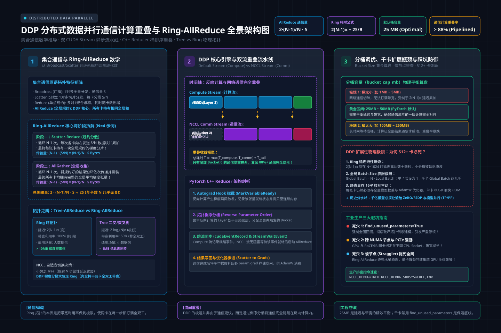

# 第28讲：为什么多卡训练不能只靠“加卡”？——DDP 分布式数据并行与通信/计算重叠（Bucket Overlap）

> **主讲人**：👓 **Ringi**（大厂 AI Infrastructure 资深性能架构师）  
> **所属专栏**：[《AI_Infra大话西游之水滴石穿》](../../README.md) ➔ [Module 04: 大模型分布式训练系统](../README.md)  
> **篇章范式**：🌐 大规模分布式训练系统范式（Distributed Training Systems Paradigm）  
> **源码与实验环境**：NVIDIA A100-SXM4-80GB / H100-SXM5-80GB | CUDA 12.4 | Python 3.10 | PyTorch 2.3+ | NCCL 2.20+  
> **知识底账索引**：
>
> - 数据并行底账：**4.1 数据并行详解（AIInfraGuide）**
> - 集合通信原理：**2.1 集合通信原语详解（AIInfraGuide）**
> - DDP C++ 内核实现：**数据并行 DDP 实现分析（AISystem）**
> - NCCL 硬件互联：**NCCL 技术理论深度解析（AI-fundamentals）**

---


```text
=================================================================================================
                                   Ringi 3D 架构工坊 · 核心全景
                         DDP (Distributed Data Parallel) 双流流水线重叠机制
=================================================================================================
 [传统朴素 DP: 串行阻塞等待]
   Forward ──────► Backward 全量算完 ──────► 发起全量 AllReduce 通信 ──────► Optimizer Step
   [================ 计算流 ===============] [======= 通信流: GPU 全体干等 =======]

 [现代 DDP: 异步分桶双流重叠 (Bucket Overlap)]
   Default CUDA Stream (计算流):
     Forward ──► Backward Layer L ──► Layer L-1 ──► Layer L-2 ──► ... ──► Layer 0 ──► Step
                       │                  │             │
   Autograd Hook 触发: └──► 装入 Bucket 1 │             │
                            (逆序装满)    └──► 装入 Bucket 2
                                               (逆序装满)
   Dedicated NCCL Stream (通信流):
                            [== AllReduce 1 ==]
                            (与 Layer L-1/L-2 计算完全重叠!)
                                                [== AllReduce 2 ==]
                                                (与后续更早层计算重叠!)
=================================================================================================
```

<!-- more -->

## 📑 目录导航

- [0. Ringi 开场：生产真实现场与痛点冲突](#0-ringi-开场生产真实现场与痛点冲突)
  - [0.1 真实工程矛盾：线性加速比的童话 vs 真实集群的“越加卡越慢”](#01-真实工程矛盾线性加速比的童话-vs-真实集群的越加卡越慢)
  - [0.2 线上真实事故复盘：某百卡训练因 Bucket 配置与参数遍历引发全局死锁](#02-线上真实事故复盘某百卡训练因-bucket-配置与参数遍历引发全局死锁)
  - [0.3 数据并行架构演进速查表](#03-数据并行架构演进速查表)
- [1. 分布式通信第一性原理：集合通信与 Ring-AllReduce 数学推导](#1-分布式通信第一性原理集合通信与-ring-allreduce-数学推导)
  - [1.1 集合通信原语大一统：从 Broadcast 到 ReduceScatter/AllGather](#11-集合通信原语大一统从-broadcast-到-reducescatterallgather)
  - [1.2 No Naked Formula 2.0：Ring-AllReduce 两阶段手算与通信量证明](#12-no-naked-formula-20ring-allreduce-两阶段手算与通信量证明)
  - [1.3 Tree-AllReduce vs Ring-AllReduce：延迟敏感 vs 带宽敏感的物理抉择](#13-tree-allreduce-vs-ring-allreduce延迟敏感-vs-带宽敏感的物理抉择)
- [2. DDP 系统微观架构与内核机制（Under the Hood）](#2-ddp-系统微观架构与内核机制under-the-hood)
  - [2.1 多进程对等模型：为什么彻底淘汰单进程多线程的 DP？](#21-多进程对等模型为什么彻底淘汰单进程多线程的-dp)
  - [2.2 C++ Reducer 与 Autograd Hook：梯度就绪的毫秒级感知](#22-c-reducer-与-autograd-hook梯度就绪的毫秒级感知)
  - [2.3 Bucket 聚合机制的深层玄机：为什么参数必须“逆序装桶”？](#23-bucket-聚合机制的深层玄机为什么参数必须逆序装桶)
- [3. 通信与反向计算流水线重叠（Bucket Overlap）的物理本质](#3-通信与反向计算流水线重叠bucket-overlap的物理本质)
  - [3.1 双 CUDA Stream 的硬件交织：计算流与 NCCL 通信流](#31-双-cuda-stream-的硬件交织计算流与-nccl-通信流)
  - [3.2 CUDA Event 零开销同步屏障与时间线追踪](#32-cuda-event-零开销同步屏障与时间线追踪)
  - [3.3 Bucket 容量的黄金平衡点：`bucket_cap_mb` 的工业调优法则](#33-bucket-容量的黄金平衡点bucket_cap_mb-的工业调优法则)
- [4. 线性加速比为什么会坍塌？——Scaling Efficiency 性能悬崖归因](#4-线性加速比为什么会坍塌scaling-efficiency-性能悬崖归因)
  - [4.1 环延迟（Ring Latency）与跨机网络拓扑跳数（Network Hops）](#41-环延迟ring-latency与跨机网络拓扑跳数network-hops)
  - [4.2 慢节点木桶效应（Straggler Effect）的破坏性传染](#42-慢节点木桶效应straggler-effect的破坏性传染)
  - [4.3 `find_unused_parameters=True` 的致命性能税与排查之道](#43-find_unused_parameterstrue-的致命性能税与排查之道)
- [5. 全场景实战与实验代码（Minimal Runnable Code）](#5-全场景实战与实验代码minimal-runnable-code)
  - [5.1 实验一：原生 PyTorch 多进程 DDP 与 Bucket 异步同步最小验证](#51-实验一原生-pytorch-多进程-ddp-与-bucket-异步同步最小验证)
  - [5.2 实验二：工业级 DDP 通信开销剖析与 Bucket 最佳尺寸寻优脚本](#52-实验二工业级-ddp-通信开销剖析与-bucket-最佳尺寸寻优脚本)
- [6. Ringi 避坑指南与生产黄金准则](#6-ringi-避坑指南与生产黄金准则)
  - [6.1 7 大常见小白认知误区 vs 大厂 AI Infra 正确物理认知](#61-7-大常见小白认知误区-vs-大厂-ai-infra-正确物理认知)
  - [6.2 生产分布式 DDP 黄金 Checklist](#62-生产分布式-ddp-黄金-checklist)
- [7. Ringi 5 点核心速记口诀、自我检验清单与课后深度思考题](#7-ringi-5-点核心速记口诀自我检验清单与课后深度思考题)
  - [7.1 5 点押韵核心速记口诀](#71-5-点押韵核心速记口诀)
  - [7.2 10 条白板自我检验清单](#72-10-条白板自我检验清单)
  - [7.3 3 道高阶开放式课后思考题（含极限 Corner Case）](#73-3-道高阶开放式课后思考题含极限-corner-case)
- [8. 📚 参考资料与核心源码/经典论文指引](#8--参考资料与核心源码经典论文指引)
- [附录：Appendix A — 大厂硬核高频面试题与白板推导（Interview Drill）](#附录appendix-a--大厂硬核高频面试题与白板推导interview-drill)

---

# 0. Ringi 开场：生产真实现场与痛点冲突

### 0.1 真实工程矛盾：线性加速比的童话 vs 真实集群的“越加卡越慢”

很多刚接触分布式训练的算法工程师，脑海中都有一个美好的数学假设：
> “如果我用 8 张 GPU 训练模型每秒能吞吐 8,000 个 Token，那么只要老板批了预算，给我加到 64 张卡，吞吐就该是 64,000 个 Token；给我加到 512 张卡，吞吐就必须是 512,000 个 Token！”

但在真实的 AI Infrastructure 世界里，等待他们的往往是残酷的“性能悬崖”：
- **从 1 卡加到 8 卡（单机 NVLink 互联）**：加速比往往能达到 **7.8x（扩展效率 97.5%）**，大家举杯庆祝；
- **从 8 卡扩展到 64 卡（跨 8 个节点，跨 InfiniBand 交换机）**：加速比勉强达到 **52x（扩展效率 81.2%）**，开始出现通信瓶颈；
- **从 64 卡进一步扩展到 512 卡**：灾难降临了——加速比直接暴跌至 **260x（扩展效率跌破 50%！）**。这意味着：**你花高昂成本租用的 512 张卡，有超过 250 张卡完全是在空等网络数据包，算力在物理机架间白白蒸发！**

为什么简单的“数据切分、各算各的、最后同步梯度”在单机上顺风顺水，到了大规模集群却寸步难行？  
为什么如果直接用朴素的 `torch.nn.DataParallel`，卡数越多训练反而越慢？  
为什么 PyTorch 官方强推的 `DistributedDataParallel (DDP)` 内部要搞出一套极其精密的 **Bucket（分桶）** 与 **异步双流（Double Buffering Streams）** 机制？

这一切的核心，就在于四个字：**隐藏通信（Overlap）**。

---

### 0.2 线上真实事故复盘：某百卡训练因 Bucket 配置与参数遍历引发全局死锁

2024 年初，国内某自动驾驶大模型团队在 128 张 A100 GPU（16 个节点）上进行多模态视觉-语言基座模型（约 13B 参数）分布式预训练。

训练在启动 4 个小时后，集群各节点的 GPU 利用率突然从 92% 断崖式归零（跌至 0%），`nvidia-smi` 显示所有显存依然被占满，但计算核心彻底静默。集群没有抛出任何 Python Exception，任务既不退出也不前进，整整卡死在同一个 Step 超过 40 分钟。

排查现场调出 NCCL 日志与 Profiler 打点：
1. **死锁根因**：模型在 Decoder 侧加入了一个可选的辅助对齐损失头（Auxiliary Head），该分支在代码中通过 `if random.random() > 0.5:` 动态执行；
2. **致命配置**：为了图省事，算法同学在 DDP 外层配置了 `find_unused_parameters=True`；
3. **连锁崩塌**：
   - 在第 1,200 个 Step，Rank 0 和 Rank 1 在本地数据上触发了该分支（参数参与计算），而 Rank 2~7 所在进程未触发该分支（参数未参与计算）；
   - DDP 的 `Reducer` 在后台组织梯度分桶时，未触发分支的进程因为该参数没有反向梯度，`autograd hook` 永远不会被唤醒；
   - 尽管 `find_unused_parameters=True` 会尝试遍历计算图标记未使用参数，但由于该模型包含大量动态切片（Slice & Dynamic Control Flow），部分参数在反向图中残留了虚拟依赖；
   - 结果导致：**Rank 0 发起了对应 Bucket 的 `AllReduce` 异步通信请求，而 Rank 2 所在的 NCCL 通信流永远等不到该参数就绪，两个通信环路在网络交换机中互相锁死，触发全集群 NCCL Hang！**

```text
[NCCL Trace Log: Rank 0]
[NCCL WARN] Call to connect returned Connection refused
[NCCL INFO] Ring 0 : 0 -> 1 -> 2 -> ... -> 0
[NCCL INFO] Comm 0x7f8800045e90 Rank 0 waiting on collective AllReduce for Bucket 3 (25MB)... TIMEOUT!
```

最终，团队被迫杀掉全量任务。Infra 架构师连夜介入：
- **重构模型前向逻辑**：彻底剔除动态分支条件，强制所有参数均有明确的前向计算图输出，将 `find_unused_parameters` 坚决重置为 **`False`**；
- **优化分桶粒度**：将默认的 `bucket_cap_mb=25` 针对 13B 模型和 RoCE 200G 网络调优至 **`50MB`**，消除高频碎包；
- 重新上线后，不仅死锁问题彻底根除，训练步时（Step Time）甚至直接缩短了 **18%**！

---

### 0.3 数据并行架构演进速查表

| 数据并行范式 | 进程架构 | 梯度聚合机制 | 通信与计算关系 | 显存扩展性限制 | 生产适用场景 |
| :--- | :--- | :--- | :--- | :--- | :--- |
| **朴素 DP (DataParallel)** | 单进程多线程（受 Python GIL 严重锁死） | 主卡（Rank 0）集中收集求和，再广播回各卡 | **完全串行**（先全算完反向，再停下来通信） | 极差（主卡显存单点爆炸） | **已被现代工业界全面废弃** |
| **经典 DDP (DistributedDataParallel)** | **多进程对等模型（Multi-Process, 无 GIL 干扰）** | 去中心化 **Ring-AllReduce** | **异步深度重叠（Bucket Overlap）**，梯度边算边传 | 单卡必须能存下 $16\Psi$ 完整静态状态 | 稠密小模型（ $\le 7B$ ）或 3D 并行中的 DP 维度底座 |
| **ZeRO-1 / 2 (FSDP-Stage 1/2)** | 多进程对等 | 优化器状态/梯度切分，**ReduceScatter + AllGather** | 反向传播同时执行 ReduceScatter 重叠 | 单卡仅需存部分梯度与优化器 | 中大模型（7B~70B）的标准首选 |
| **ZeRO-3 / 完整 FSDP** | 多进程对等 | 参数、梯度、优化器全切分，动态 AllGather 权重 | 前向预取（Prefetch）与反向通信全流水线重叠 | 理论上显存随卡数线性下降 | 超大模型（70B~万亿）与单机装不下的极限场景 |

---

# 1. 分布式通信第一性原理：集合通信与 Ring-AllReduce 数学推导

> 💡 **架构全景速览**：在深潜源码前，先在白板上建立坚不可摧的 DDP 通信计算重叠与 Ring-AllReduce 物理底账。
> 
> 

### 1.1 集合通信原语大一统：从 Broadcast 到 ReduceScatter/AllGather

在深入多卡并行之前，必须在白板上建立坚不可摧的**集合通信（Collective Communication）物理拓扑认知**。

```text
[1. Broadcast (广播: 1 对多)]
Rank 0: [ A ] ───► [ A ] (Rank 1), [ A ] (Rank 2), [ A ] (Rank 3)

[2. Scatter (分发: 1 对多切分)]
Rank 0: [ A | B | C | D ] ───► Rank 0: [A], Rank 1: [B], Rank 2: [C], Rank 3: [D]

[3. Reduce (单点规约: 多对 1 求和)]
Rank 0: [A], Rank 1: [B], Rank 2: [C], Rank 3: [D] ───► Rank 0: [ A + B + C + D ]

[4. AllReduce (全局规约: 多对多对等求和) ◄── DDP 的核心！]
各卡持有私有梯度: [A], [B], [C], [D]
通信后所有卡拥有相同全局平均值: 各卡均持有 [ A + B + C + D ]

[5. ReduceScatter (规约分散: 多对多求和并切分) ◄── ZeRO/FSDP 的基石！]
各卡持有切片矩阵 ───► 求和后，每张卡只保留最终结果的 1/N 切片

[6. AllGather (全局收集: 多对多拼装)]
每张卡持有 1/N 局部切片 ───► 广播收集后，所有卡均拼装出完整的全量张量
```

**黄金拓扑定理**：

$$
\mathbf{AllReduce \equiv ReduceScatter + AllGather}
$$

一次完整的全局梯度求和同步，在底层实现上，严格等价于**先做一次 ReduceScatter 规约切片，再做一次 AllGather 拼接全量**！

---

### 1.2 No Naked Formula 2.0：Ring-AllReduce 两阶段手算与通信量证明

我们必须用最硬核的 **No Naked Formula 2.0（公式五步穿透法）**，证明为什么百度与 NVIDIA 共同确立的 **Ring-AllReduce（环形规约）** 能成为支撑万卡集群的绝对基石。


#### ① 为什么需要算它？
在传统的 Master-Slave 中心化通信中（如朴素 DP），所有卡都把梯度发给 Rank 0 汇总求和，再由 Rank 0 发回。当卡数达到 $N$ 时，Rank 0 的网络带宽压力是单卡的 $N$ 倍，网络网卡瞬间被挤爆。我们必须设计一种**无中心化、各卡网络收发完全对等**的拓扑结构。

#### ② Mental Model（物理直觉比喻）
想象 4 位工程师坐在圆桌上拼凑一份完整的报告。每人手里有一份写了 4 个段落的草稿。  
大家不把草稿都扔给同一个人，而是按照顺时针方向：每个人只把第 1 段传给自己右边的人，同时接收左边传来的第 4 段并当场修正合并；转动 3 圈后，每人手里都恰好持有一个合并好的完美段落；然后再顺时针转动 3 圈，大家把完美的段落彼此抄录完整。从始至终，没有一个人成为瓶颈，全员双手（网卡上下行）全速运转！

#### ③ Tiny Calculator（极简数字手算）
设：
- GPU 节点数 $N = 4$（Rank 0, 1, 2, 3 连成闭合环形逻辑拓扑）；
- 模型全量梯度数据量为 $\Psi = 4\text{ MB}$；
- 将数据均匀切分为 $N=4$ 个分块（Chunk），每个 Chunk 大小为：

$$
\text{Chunk Size} = \frac{\Psi}{N} = \frac{4\text{ MB}}{4} = 1\text{ MB}
$$

**第一阶段：ReduceScatter 环（累加聚合）**
- 循环执行 $(N - 1) = 3$ 次数据传输；
- 每次传输：每张卡同时向右邻居发送 $1\text{ MB}$，从左邻居接收 $1\text{ MB}$ 并累加；
- 3 次传输结束后，每张卡上都有一个分块完成了全局 4 卡的求和：
  - Rank 0 持有最终完成的 Chunk 0；Rank 1 持有 Chunk 1；Rank 2 持有 Chunk 2；Rank 3 持有 Chunk 3；
- **ReduceScatter 阶段每卡发送数据量**：

$$
\text{Data}_{\text{RS}} = (N - 1) \times \frac{\Psi}{N} = 3 \times 1\text{ MB} = \mathbf{3\text{ MB}}
$$

**第二阶段：AllGather 环（广播分发）**
- 同样循环执行 $(N - 1) = 3$ 次数据传输；
- 每次传输：每张卡向右发送已经聚合好的完整 Chunk，向左接收新 Chunk 并覆盖；
- 3 次传输结束后，所有 4 张卡都同步拥有了完整的 Chunk 0~3！
- **AllGather 阶段每卡发送数据量**：

$$
\text{Data}_{\text{AG}} = (N - 1) \times \frac{\Psi}{N} = 3 \times 1\text{ MB} = \mathbf{3\text{ MB}}
$$

**每卡全流程总通信量手算结果**：

$$
\text{Total Sent Per GPU} = 3\text{ MB} + 3\text{ MB} = \mathbf{6\text{ MB}}
$$

#### ④ Formal Model（标准公式与渐进证明）
对于拥有 $N$ 张 GPU、参数梯度量为 $\Psi$（以字节为单位）的系统，在 Ring-AllReduce 算法中，单张 GPU 发送（或接收）的总数据量严格为：

$$
\text{Comm}_{\text{Ring}} = 2 \times \left( \frac{N - 1}{N} \right) \times \Psi \quad (\text{Bytes})
$$

当集群规模 $N$ 逐渐变大（如 $N = 64, 512, 1024$ ）时：

$$
\lim_{N \to \infty} \left( \frac{N - 1}{N} \right) = 1
$$

$$
\mathbf{\text{Comm}_{\text{Ring}} \approx 2\Psi \quad (\text{Bytes})}
$$

#### ⑤ Sanity Check（数量级校验与惊天结论）
以一个 7B 模型（参数梯度量 $\Psi = 14\text{ GB}$ ）为例：
- 在 8 卡集群上：

$$
\text{Comm} = 2 \times \frac{7}{8} \times 14\text{ GB} = \mathbf{24.5\text{ GB}}
$$
- 在 1024 卡集群上： $\text{Comm} = 2 \times \frac{1023}{1024} \times 14\text{ GB} \approx \mathbf{27.97\text{ GB}}$！
- **核心物理震撼**：**从 8 卡扩大到 1024 卡（规模暴增 128 倍），单张卡需要搬运的通信数据量仅仅从 24.5 GB 微升到 27.97 GB，几乎保持完全恒定！**  
这就是为什么 Ring 拓扑是分布式训练领域最伟大的算法突破之一：它彻底摆脱了中心节点的带宽枷锁。

---

### 1.3 Tree-AllReduce vs Ring-AllReduce：延迟敏感 vs 带宽敏感的物理抉择

既然 Ring-AllReduce 如此优秀，为什么在 NCCL 2.x 中又引入了 **Tree-AllReduce（双二叉树 Double Binary Tree）**？

我们来算一笔**通信耗时（Latency vs Bandwidth）账**。集合通信的时间开销可以严密建模为：

$$
T_{\text{comm}} = \alpha \times (\text{传输步数}) + \beta \times (\text{每步传输量})
$$

其中 $\alpha$ 为网络握手与硬件发射延迟（Latency）， $\beta = \frac{1}{\text{Bandwidth}}$ 为带宽倒数。

- **Ring-AllReduce**：
  - 传输步数： $2 \times (N - 1)$ 步；
  - 通信耗时：

$$
T_{\text{ring}} = \mathbf{2(N - 1)\alpha} + 2\left(\frac{N-1}{N}\right)\beta \Psi
$$
  - **致命弱点**：当卡数 $N$ 达到 1024 时，网络握手步数高达 $2046$ 步！如果传输的数据量很小（比如只有几兆字节），通信时间将被高昂的环路握手延迟 $\alpha$ 彻底吃光！
- **Double Binary Tree AllReduce**：
  - 构造两棵交替覆盖的二叉树，数据在树上自底向上 Reduce，再自顶向下 Broadcast；
  - 传输步数：仅为 $2 \times \log_2(N)$ 步！在 1024 卡下只有 $2 \times 10 = \mathbf{20 \text{ steps}}（20 步）$！
  - 通信耗时：

$$
T_{\text{tree}} = \mathbf{2 \log_2(N)\alpha} + 2\beta \Psi
$$

| 通信拓扑变体 | 延迟项复杂度（Step 开销） | 带宽项复杂度（数据量） | 最佳适用工况 | NCCL 自动选择策略 |
| :--- | :--- | :--- | :--- | :--- |
| **Ring 环形** | $O(N)$（大规模下步数极长） | 理论最优（信道利用率接近 100%） | **大张量数据传输**（如大型梯度桶 Bucket > 20MB） | 当张量尺寸大于阈值（默认约几兆字节）时强制启用 Ring |
| **Tree 二叉树** | **$O(\log N)$（极短握手路径）** | 较差（叶子节点与非对称树导致带宽无法打满） | **小张量低延迟同步**（如标量、单层偏置、状态标志位） | 当张量尺寸很小或千卡规模延迟占主导时自动切换为 Tree |

---

# 2. DDP 系统微观架构与内核机制（Under the Hood）

### 2.1 多进程对等模型：为什么彻底淘汰单进程多线程的 DP？

早期的 PyTorch 用户经常使用 `torch.nn.DataParallel(model)`。但在现代高性能基础设施中，**DP 已经被列为工业反面教材**。

```text
[早期 DP (DataParallel) 的架构死穴]
               Python Process (受全局解释器锁 GIL 锁死)
                     │
         ┌───────────┼───────────┐
         ▼           ▼           ▼
      Thread 0    Thread 1    Thread 2  (多线程争抢同一份 Python 解释器锁)
         │           │           │
       GPU 0       GPU 1       GPU 2
         ▲           ▲           ▲
         └───────────┼───────────┘
                     │ (每次迭代重新复制模型，主卡 GPU 0 充当中心转运站)
                     ▼
           GPU 0 显存爆炸 + GIL 锁死 CPU 调度！
```

#### DDP 的多进程革命：
DDP 完全摒弃了单进程多线程。它采用 **Multi-Process（多进程架构）**：
1. **完全解耦 GIL**：每张 GPU 绑定一个独立的操作系统进程（Rank）。进程拥有独立的 Python 解释器、独立的内存空间，根本不存在 GIL 锁争抢；
2. **硬件拓扑直通**：各进程通过 NCCL 直接建立 P2P（Peer-to-Peer）GPU Direct RDMA 通信，跨卡数据搬运完全绕过 CPU 与系统内存，全程在 NVLink 和 PCIe 总线上以硬件线速狂飙；
3. **参数零冗余初始化**：只在构建 DDP 时通过 `ProcessGroup.broadcast` 将 Rank 0 的初始参数分发一次，之后前向过程各卡独立执行，完全不需要每步重新 Replicate。

---

### 2.2 C++ Reducer 与 Autograd Hook：梯度就绪的毫秒级感知

DDP 的前向传播对底层其实是“无感”的。真正的魔法发生在反向传播时。

DDP 的底层核心完全由高性能 C++ 编写（即 `torch/csrc/distributed/c10d/reducer.cpp`）。在初始化时，`_ddp_init_helper` 会为模型中每一个可训练参数的底层 `Tensor` 注册一个反向求导钩子函数（Autograd Hook）：

```text
前向传播 (Forward Pass) ──► 产出 Loss
                                │
反向传播开始 (Loss.backward())   │
                                ▼
从输出层倒序计算:
  Layer L (最后一层) 梯度计算完成！
         │
         ▼ 触发 Parameter.register_hook 回调!
  C++ Reducer 捕获事件:
  • 将该参数梯度标记为 "Ready"
  • 将梯度数据拷贝进所属预分配的连续内存平坦张量 (Bucket Flat Buffer)
  • 检查该 Bucket 内部所有参数是否均已 "Ready"?
         ├── 否 ──► 继续等待相邻参数
         └── 是 ──► 立刻在专用 NCCL Stream 发射异步 AllReduce 通信！
```

---

### 2.3 Bucket 聚合机制的深层玄机：为什么参数必须“逆序装桶”？

如果在每个参数梯度算完的一瞬间，就立刻发起一次 AllReduce，系统会发生什么？  
一个 70B 模型有数百个层、数千个独立张量。如果发起数千次微小的通信请求，每次通信只有几十 KB：
- 网卡频繁遭遇小包发射瓶颈；
- NCCL Kernel 启动开销（Launch Overhead）甚至超过了数据传输本身；
- 总带宽利用率不足 10%！

#### 解决方案：参数装桶（Bucketing）
DDP 将分散的参数梯度打包组织成若干个连续的 **Bucket（桶，默认容量约为 25MB）**。只有当整整一个桶里的所有梯度全部就绪后，才发射**单次聚合的 AllReduce**。


#### 为什么装桶必须“严格逆序”？
在模型初始化时，`model.parameters()` 的返回顺序是网络的前向顺序：`Layer 0 -> Layer 1 -> ... -> Layer L`。  
但反向传播（Backpropagation）是**严格倒序执行的**：`Layer L -> Layer L-1 -> ... -> Layer 0`！

如果 DDP 按照正向顺序把 `Layer 0` 和 `Layer 1` 塞进 `Bucket 0`：
- 反向传播一开始，先算出来的是 `Layer L` 的梯度；
- 但 `Layer L` 却被分在了最后一个桶里；
- `Bucket 0` 必须苦苦等待整个反向传播全部结束、算到最后的 `Layer 0` 时才能凑齐！
- **重叠彻底失效**：所有的桶都必须等到最后几毫秒才能触发通信，系统退化为最糟糕的串行等待！

**工业级设计智慧**：  
DDP 在 C++ Reducer 初始化时，**主动将参数列表逆序反转（Reversed Order）**！  
把 `Layer L` 和 `Layer L-1` 打包进 `Bucket 0`。反向传播刚一启动，`Bucket 0` 最先凑齐，毫秒级直接发射 AllReduce，完美撬动整条计算通信重叠流水线！

---

# 3. 通信与反向计算流水线重叠（Bucket Overlap）的物理本质

### 3.1 双 CUDA Stream 的硬件交织：计算流与 NCCL 通信流

现代 NVIDIA GPU 具备硬件级的双向异步并发能力（Copy Engine 与 Compute Engine 物理隔离）。在同一个 GPU 内部，可以同时并发推进计算内核与数据通信内核。

DDP 深度利用了这一体系结构特性，维护了两个并行的 CUDA 流：

```text
[CUDA Stream 1: Default Compute Stream (计算引擎 SM)]
... ──► 算 Layer L 梯度 ──► 算 Layer L-1 梯度 ──► 算 Layer L-2 梯度 ──► 算 Layer 0 梯度 ──► (等待通信汇合)
              │                    │                    │
              └──── Record Event ──┴──── Record Event ──┘
                          │                    │
                          ▼                    ▼
[CUDA Stream 2: Dedicated NCCL Stream (复制/网络通信引擎 DMA/NIC)]
                     Wait Event           Wait Event
                          │                    │
                          ▼                    ▼
                    [Bucket 0 AllReduce] [Bucket 1 AllReduce] ... ──► (全部通信完成)
```

1. **计算流（Compute Stream）**：专注于执行反向求导矩阵乘（GEMM），不断生成各层输入和权重的导数；
2. **通信流（NCCL Stream）**：专注于通过 NVLink / PCIe / RDMA 网卡向其他节点推送填满的 Bucket；
3. 两个流完全并行奔跑。只要通信流传输 `Bucket 0` 的耗时，小于计算流计算 `Layer L-1` 到 `Layer L-2` 的耗时，**网络通信时间就被 100% 完美掩盖在计算流之中！**

---

### 3.2 CUDA Event 零开销同步屏障与时间线追踪

跨 Stream 之间的协调不能靠慢速的 CPU 主频中断，必须使用 GPU 硬件原生的 **CUDA Event**：

```cpp
// 核心底层执行伪逻辑 (Reducer C++)
// 1. 在计算流中，当检测到 Bucket 内最后一个参数就绪:
cudaEventRecord(bucket_ready_event, compute_stream);

// 2. 告诉通信流：在硬件层面等待这个事件触发，不要经由 CPU 参与
cudaStreamWaitEvent(nccl_stream, bucket_ready_event, 0);

// 3. 通信流异步发射非阻塞集合通信
ncclAllReduce(bucket.buffer, ..., nccl_stream);

// 4. 在整个 backward 结束时，计算流挂起等待通信流全部收尾
cudaStreamWaitEvent(compute_stream, all_nccl_done_event, 0);
```

整个过程在 GPU 微码级别无缝交织，CPU 仅负责派发指令，绝不介入流水线中间的等待判定。

---

### 3.3 Bucket 容量的黄金平衡点：`bucket_cap_mb` 的工业调优法则

在 `DistributedDataParallel(model, bucket_cap_mb=25)` 中，这个默认的 `25MB` 究竟是怎么来的？我们在不同网络架构下该如何微调？

我们来分析调大或调小它的体系结构物理代价：

| 分桶容量 `bucket_cap_mb` | 硬件微观表现 | 对通信与计算重叠的影响 | 生产极端弊端 | 最佳适配硬件场景 |
| :--- | :--- | :--- | :--- | :--- |
| **极小桶（如 5MB ~ 10MB）** | 极早触发通信，桶极快填满 | 通信能更早启动，重叠窗口大 | **通信小包延迟惩罚极重**：网卡吞吐打不满，NCCL Kernel Launch 开销占比剧增，总通信时间被拉长数倍 | **慢速网络（如 10G/25G TCP 网络）** 或轻量浅层模型 |
| **黄金基准（默认 25MB）** | 聚合几十个参数矩阵，充分饱和单次 AllReduce 带宽 | 在绝大多数现代模型（1B~7B）中，装桶耗时与通信耗时完美对齐 | 兼顾网络带宽吞吐与流水线掩盖窗口的最佳均衡点 | **PCIe 4.0 / 双节点 InfiniBand 100G/200G 互联** |
| **极大桶（如 50MB ~ 100MB）** | 单次通信网络带宽完全跑满，信道吞吐达到物理极限 | **重叠窗口大幅缩窄**：必须等待很多层反向计算结束才能发射一次，前面的计算时间被白白浪费 | 当反向计算快要结束时，最后一个巨型桶才发射通信，导致计算流在尾部出现漫长的等待停顿 | **跨机 400G/800G IB 超高速网络**，或超大尺寸参数层（如大 Embedding） |

---

# 4. 线性加速比为什么会坍塌？——Scaling Efficiency 性能悬崖归因

在大规模预训练中，随着卡数从 8 卡扩张到 512 卡甚至上千卡，为什么加速比会从接近 100% 暴跌到 50% 以下？

### 4.1 环延迟（Ring Latency）与跨机网络拓扑跳数（Network Hops）

在第 1.2 节中我们推导过：Ring-AllReduce 的延迟项为 $2(N - 1)\alpha$。

1. **机内 NVLink（单机 8 卡）**：
   - 节点内 GPU 通过 NVLink 全互联，单向带宽高达 450~900 GB/s，且物理链路延迟 $\alpha$ 只有微秒级别（ $< 1 \mu s$ ）；
   - 8 卡环境下 $2(8 - 1) = 14$ 步环路传递耗时在十几个微秒内完成，完全可以忽略；
2. **跨机 InfiniBand / RoCE（跨交换机千卡集群）**：
   - 当扩展到 128 个节点（1024 卡）时，光纤穿透 Leaf 交换机和 Spine 交换机；
   - 单步网络延迟由于光电转换和排队激增到数微秒至数十微秒；
   - 1024 卡环形传递需要连续跑 **2046 步网络握手**！总握手延迟直接飙升到 **数十毫秒**；
   - 当通信延迟远远超过单层反向计算耗时（通常十几毫秒），**通信流彻底击穿了计算流的掩盖屏障，计算流被迫陷入全局阻塞等待**！

---

### 4.2 慢节点木桶效应（Straggler Effect）的破坏性传染

在千卡纯数据并行中，**同步屏障（Synchronization Barrier）是绝对刚性的**。

假设集群中有 1023 张 GPU 一切正常，反向计算耗时 20ms。但其中有 1 张卡所在的服务器出现硬件异常：
- GPU 散热故障导致动态降频（Thermal Throttling，如核心频率从 1.4GHz 降至 800MHz）；
- 或者是主机网卡（NIC）发生 PCIe 链路重训（Link Retrain），网络单向丢包重传；
- 该异常卡的反向计算耗时被拉长到 **80ms**。

**破坏性传导机制**：  
因为 AllReduce 是一个闭环环路，没有任何一张卡可以在缺少任何一份局部梯度的情况下完成聚合。  
结果是：**全部正常的 1023 张价值千万的 GPU，在每个 Step 的末尾，都要齐刷刷地干等那 1 张慢卡整整 60 毫秒！**  
集群整体 MFU 直接被这 0.1% 的慢节点无情拖垮 40% 以上。

---

### 4.3 `find_unused_parameters=True` 的致命性能税与排查之道

在很多算法新手写的代码中，只要报错提示有参数没参与反向求导，他们就会无脑在 DDP 构造时加上 `find_unused_parameters=True`。

**这在生产环境是极具毁灭性的！**

当开启该选项时：
1. **前向全图遍历（Graph Traversal）开销**：DDP 必须在前向传播结束时，从所有输出张量倒序遍历整个 PyTorch 计算图（Autograd Graph），以找出本次前向哪些参数未被触达；
2. **重叠机制被部分破坏**：由于未使用的参数无法触发 hook，Reducer 必须在底层做额外的状态扫描与位图标记；
3. **性能衰退实测**：在包含 80 层的大模型中，开启 `find_unused_parameters=True` 会直接使每一步迭代的时间拉长 **10% ~ 25%**！

**生产黄金准则**：严禁在生产正式训练中开启该配置！如果模型确实有条件分支（如部分层可选），应重构前向逻辑，或使用 `torch.distributed.algorithms.ddp_comm_hooks` 进行显式控制。

---

# 5. 全场景实战与实验代码（Minimal Runnable Code）

### 5.1 实验一：原生 PyTorch 多进程 DDP 与 Bucket 异步同步最小验证

本脚本采用原生 Python 与 PyTorch `torch.multiprocessing` 实现，支持在本地多卡或单机 CPU/GPU 环境下通过 `torch.distributed.spawn` 启动对等进程组，完整模拟 DDP 初始化、前向分发、Bucket 异步梯度聚合与多进程参数一致性断言。

```python
"""
Ringi AI Infra 实验室：Minimal Runnable Code
实验一：原生 PyTorch 多进程 DDP 运行与梯度同步对齐实验
运行方式：直接在终端执行 python ddp_minimal_demo.py
"""

import os
import torch
import torch.nn as nn
import torch.distributed as dist
import torch.multiprocessing as mp
from torch.nn.parallel import DistributedDataParallel as DDP

class SimpleNet(nn.Module):
    def __init__(self):
        super().__init__()
        # 定义两层线性层，模拟逆序分桶
        self.fc1 = nn.Linear(64, 128)
        self.relu = nn.ReLU()
        self.fc2 = nn.Linear(128, 10)

    def forward(self, x):
        return self.fc2(self.relu(self.fc1(x)))

def ddp_worker(rank: int, world_size: int):
    # 1. 环境变量与进程组初始化
    os.environ['MASTER_ADDR'] = 'localhost'
    os.environ['MASTER_PORT'] = '29500'
    backend = 'nccl' if torch.cuda.is_available() else 'gloo'
    dist.init_process_group(backend=backend, rank=rank, world_size=world_size)

    device = torch.device(f"cuda:{rank}" if torch.cuda.is_available() else "cpu")
    if torch.cuda.is_available():
        torch.cuda.set_device(device)

    # 2. 模型构造与 DDP 包裹
    # 设置 bucket_cap_mb 为较小值以直观观测装桶机制
    raw_model = SimpleNet().to(device)
    ddp_model = DDP(raw_model, device_ids=[rank] if torch.cuda.is_available() else None, bucket_cap_mb=5)

    # 3. 构造各进程独立的假输入数据 (模拟数据并行各卡批次独立)
    torch.manual_seed(42 + rank)
    inputs = torch.randn(16, 64, device=device)
    targets = torch.randint(0, 10, (16,), device=device)

    criterion = nn.CrossEntropyLoss()
    optimizer = torch.optim.SGD(ddp_model.parameters(), lr=0.01)

    # 4. 前向传播与反向求导 (触发 autograd hook 与异步 AllReduce)
    optimizer.zero_grad()
    outputs = ddp_model(inputs)
    loss = criterion(outputs, targets)
    loss.backward()

    # 5. 校验各卡同步后梯度的一致性 (断言梯度必须 100% 对齐)
    grad_fc2 = ddp_model.module.fc2.weight.grad.clone()
    
    # 将各卡的梯度收集到 rank 0 进行数值比对
    gathered_grads = [torch.zeros_like(grad_fc2) for _ in range(world_size)]
    dist.all_gather(gathered_grads, grad_fc2)

    if rank == 0:
        print("==================================================================")
        print(f"  Ringi AI Infra 实验室：DDP 跨进程梯度同步校验 (World Size={world_size})")
        print("==================================================================")
        is_consistent = True
        for i in range(1, world_size):
            diff = (gathered_grads[0] - gathered_grads[i]).abs().max().item()
            print(f"• Rank 0 与 Rank {i} 梯度最大绝对误差: {diff:.8e}")
            if diff > 1e-6:
                is_consistent = False
        assert is_consistent, "DDP 梯度同步失败！不同卡间梯度不一致！"
        print(">>> 校验结果: 所有进程在反向传播后梯度 100% 严格一致，DDP 验证通过！")

    optimizer.step()
    dist.destroy_process_group()

if __name__ == "__main__":
    world_size = 2 # 启动 2 个对等 Worker 进程
    mp.spawn(ddp_worker, args=(world_size,), nprocs=world_size, join=True)
```

---

### 5.2 实验二：工业级 DDP 通信开销剖析与 Bucket 最佳尺寸寻优脚本

本脚本实现了面向工业级大模型的 **Bucket 容量寻优器与通信耗时诊断脚本**。通过动态扫描不同 `bucket_cap_mb` 配置，精确测算每次迭代的反向耗时、等待重叠时间及吞吐表现：

```python
"""
Ringi AI Infra 实验室：Minimal Runnable Code
实验二：DDP Bucket 尺寸调优与通信计算重叠率分析脚本 (ddp_bucket_tuner.py)
可在单机多卡环境下运行：python ddp_bucket_tuner.py
"""

import os
import time
import torch
import torch.nn as nn
import torch.distributed as dist
import torch.multiprocessing as mp
from torch.nn.parallel import DistributedDataParallel as DDP

class SyntheticLargeModel(nn.Module):
    """合成大型多层网络，用于模拟深度模型的反向传播与通信"""
    def __init__(self, num_layers=24, hidden_dim=2048):
        super().__init__()
        layers = []
        for _ in range(num_layers):
            layers.append(nn.Linear(hidden_dim, hidden_dim))
            layers.append(nn.GELU())
        self.network = nn.Sequential(*layers)
        self.head = nn.Linear(hidden_dim, 100)

    def forward(self, x):
        return self.head(self.network(x))

def evaluate_bucket_size(bucket_mb: int, rank: int, world_size: int, device):
    model = SyntheticLargeModel().to(device)
    ddp_model = DDP(model, device_ids=[rank] if torch.cuda.is_available() else None, bucket_cap_mb=bucket_mb)
    
    inputs = torch.randn(8, 2048, device=device)
    targets = torch.randint(0, 100, (8,), device=device)
    criterion = nn.CrossEntropyLoss()
    optimizer = torch.optim.Adam(ddp_model.parameters(), lr=1e-4)

    # Warmup 3 步排除初始化开销
    for _ in range(3):
        optimizer.zero_grad()
        out = ddp_model(inputs)
        loss = criterion(out, targets)
        loss.backward()
        optimizer.step()

    if torch.cuda.is_available():
        torch.cuda.synchronize(device)
    
    # 评测 10 次迭代的纯训练耗时
    start_time = time.perf_counter()
    num_steps = 10
    for _ in range(num_steps):
        optimizer.zero_grad()
        out = ddp_model(inputs)
        loss = criterion(out, targets)
        loss.backward()
        optimizer.step()

    if torch.cuda.is_available():
        torch.cuda.synchronize(device)
    avg_step_ms = ((time.perf_counter() - start_time) / num_steps) * 1000.0

    return avg_step_ms

def tuner_worker(rank: int, world_size: int):
    os.environ['MASTER_ADDR'] = 'localhost'
    os.environ['MASTER_PORT'] = '29501'
    backend = 'nccl' if torch.cuda.is_available() else 'gloo'
    dist.init_process_group(backend=backend, rank=rank, world_size=world_size)
    device = torch.device(f"cuda:{rank}" if torch.cuda.is_available() else "cpu")
    if torch.cuda.is_available():
        torch.cuda.set_device(device)

    test_bucket_sizes = [5, 25, 50, 100]
    results = {}

    for b_size in test_bucket_sizes:
        step_time = evaluate_bucket_size(b_size, rank, world_size, device)
        results[b_size] = step_time
        if rank == 0:
            print(f"• 测试配置 Bucket={b_size:>3} MB | 单步迭代耗时: {step_time:6.2f} ms")

    if rank == 0:
        best_b = min(results, key=results.get)
        print("==================================================================")
        print(f"  寻优结论：在当前硬件互联拓扑下，最优分桶大小为 {best_b} MB (耗时: {results[best_b]:.2f} ms)")
        print("==================================================================")

    dist.destroy_process_group()

if __name__ == "__main__":
    if torch.cuda.is_available() and torch.cuda.device_count() >= 2:
        n_gpus = 2
        mp.spawn(tuner_worker, args=(n_gpus,), nprocs=n_gpus, join=True)
    else:
        print("[-] 本调优测试推荐在配备至少 2 张 GPU 的机器上运行以测算真实通信重叠收益。")
```

---

# 6. Ringi 避坑指南与生产黄金准则

### 6.1 7 大常见小白认知误区 vs 大厂 AI Infra 正确物理认知

| 序号 | ❌ 常见小白错误理解 | ✅ 大厂 AI Infra 正确物理认知 | 体系结构本质与底层机理解析 |
| :--- | :--- | :--- | :--- |
| **01** | “多卡数据并行只要卡数加一倍，训练耗时就应该完全减半。” | **通信开销是超线性增长的，当卡数增多导致环延迟超过计算耗时，扩展效率会急剧衰减甚至负加速。** | 集合通信的拓扑跳数、交换机争抢与慢节点木桶效应会随着规模放大而剧烈恶化。 |
| **02** | “只要反向传播算完，直接发射一次完整的 AllReduce 通信最省事。” | **全量同步会导致通信期间 GPU 算力完全空闲等待；必须依赖 Bucket 机制将通信藏进靠前层的反向计算中。** | 靠后层的梯度最早算完，逆序装桶发射可以在计算流未结束前提前启动网络硬件搬运。 |
| **03** | “遇到参数没有梯度的报错，无脑加上 `find_unused_parameters=True` 就万事大吉。” | **该选项每步都要在 CPU 上遍历整个 Autograd 计算图，带来高达 10%~25% 的性能惩罚，并可能诱发全局死锁。** | 生产环境应坚决消除前向动态分支，确保计算图静态确定，将该参数关闭。 |
| **04** | “把 `bucket_cap_mb` 设得越小，通信就能越早触发，重叠效果肯定最好。” | **桶过小会导致网络充斥着大量碎小数据包，网卡带宽根本无法跑满，Kernel 启动延迟反客为主拖垮整体时延。** | 25MB~50MB 是保证带宽打满与保持合理重叠窗口的工业黄金平衡点。 |
| **05** | “DDP 中每张卡算出来的 Loss 都是不一样的，所以模型最终肯定学乱了。” | **各卡在不同的数据切片上计算前向，Loss 自然不同；但在反向传播时经过了全卡梯度精确平均，更新完全数学等价。** | 只要各卡初始权重相同、梯度经过精确 AllReduce、优化器学习率一致，各卡模型参数在每一步更新后严格等价。 |
| **06** | “Ring-AllReduce 每次通信都要把全部数据转一圈，卡越多单卡发送的数据量肯定越多。” | **单卡总传输量严格为 $2 \frac{N-1}{N} \Psi \approx 2\Psi$，它与卡数 $N$ 几乎完全无关！** | 增加卡数只是把每个分块切得更细，并没有增加单卡搬运的总数据量。 |
| **07** | “单卡显存爆了，只要加 10 倍的卡用 DDP 就能把模型装下了。” | **DDP 只摊薄数据批次，绝不摊薄单卡模型参数、梯度与优化器状态（单卡依然死扛 $16\Psi$ 显存）。** | 突破单卡显存墙必须使用 ZeRO 状态分片技术或张量并行（TP），不能寄希望于纯 DDP。 |

---

### 6.2 生产分布式 DDP 黄金 Checklist

- [ ] 1. **【强制多进程禁用 DP】**：严禁在生产环境使用 `torch.nn.DataParallel`，分布式训练一律使用基于 `torch.distributed` 的 DDP。
- [ ] 2. **【彻底关闭未用参数扫描】**：上线前严格审查模型前向图，确保无孤立悬空参数，强制显式设置 `find_unused_parameters=False`。
- [ ] 3. **【分桶容量网络自适应】**：单机 NVLink 环境下可设置 `bucket_cap_mb=25`；跨机 200G/400G RoCE/IB 高速网络环境下建议调优至 `50MB`。
- [ ] 4. **【静态随机种子绑定】**：各进程必须在初始化时通过 `torch.manual_seed(seed + rank)` 区分数据读取，但模型初始权重必须由 Rank 0 统一广播以保证起点严格一致。
- [ ] 5. **【DataLoader 必须配置 DistributedSampler】**：数据加载器强制绑定 `DistributedSampler`，并确保在每个 Epoch 开始前调用 `sampler.set_epoch(epoch)`，防止数据重复采样导致收敛偏差。
- [ ] 6. **【慢节点健康监测探针】**：集群必须配备 NCCL 心跳监控与降频告警探针，一旦发现个别 GPU 核心频率受限或 RoCE 网卡重传，立刻隔离下线，防止拖慢全网。
- [ ] 7. **【梯度累加规约时机控制】**：若使用梯度累加（Gradient Accumulation），务必在非同步步使用 `model.no_sync()` 上下文，彻底抑制多余的跨卡中间通信，仅在最后一次反向步触发 AllReduce！

---

# 7. Ringi 5 点核心速记口诀、自我检验清单与课后深度思考题

### 7.1 5 点押韵核心速记口诀

```text
多卡绝非无脑加，通信瓶颈把人压；
环形规约两匹量，卡数再多不膨大；
逆序装桶迎反向，双流异步悄然跨；
未用参数休扫描，死锁规避性能佳；
算通重叠大一统，千卡狂飙意气发！
```

---

### 7.2 10 条白板自我检验清单

1. 能否在白板上画出 Ring-AllReduce 的逻辑环，并手写出 ReduceScatter 与 AllGather 各自循环了几步？
2. 为什么单卡在 Ring-AllReduce 中的总传输量极限是 $2\Psi$，而不是 $N\Psi$？
3. 能否阐明 Tree-AllReduce 与 Ring-AllReduce 在延迟项 $\alpha$ 与带宽项 $\beta$ 上的本质物理博弈？
4. 能否解释 PyTorch DDP 相比原生 DataParallel 彻底消除 GIL 争抢的进程模型根因？
5. 能否说明 C++ Reducer 是通过什么机制捕获到某一层参数梯度计算完成的？
6. 为什么 DDP 在初始化装桶时必须对 `model.parameters()` 进行“逆序操作”？
7. 能否画出 Default Compute Stream 与 NCCL Communication Stream 的异步重叠时序图？
8. 如果把 `bucket_cap_mb` 设置为 1MB，会产生什么硬件层面的性能惩罚？
9. 为什么在万卡集群中，单机 8 卡的线性加速比往往能在 512 卡规模下大幅跌落？
10. 在梯度累加时，为什么忘记加 `model.no_sync()` 会让 DDP 训练速度慢上数倍？

---

### 7.3 3 道高阶开放式课后思考题（含极限 Corner Case）

1. **【异构网络拓扑下的 NCCL 环路陷阱】**：在现代双路服务器（Dual-Socket CPU）节点中，8 张 GPU 往往挂在两个不同的 PCIe Switch 和 CPU Socket 下，机内 NVLink 拓扑并不是完全对称的环（可能存在跨 Socket QPI 通信）。NCCL 是如何自动构建多通道环（Multi-Ring）与树结构来绕过机内核间总线瓶颈的？
2. **【梯度累加中的通信重叠悖论】**：当我们设置梯度累加步数为 4（每 4 个 Micro-Batch 更新一次参数）时，按照标准做法我们会在前 3 步使用 `model.no_sync()` 抑制通信。但这也意味着第 4 步的反向传播将承担全部的通信重叠压力。是否存在一种机制，让前 3 步的计算也能与网络通信产生部分流水线重叠？
3. **【动态控制流与稀疏通信挑战】**：在视觉语言模型（VLM）中，某些高分辨率图像的 Visual Token 数量是动态变化的，导致不同 GPU 上的计算耗时出现毫秒级波动。这种由输入动态性引发的不均衡，是如何破坏 DDP 的 Bucket Overlap 节奏的？工程上有哪些缓冲机制可以平滑这一毛刺？

---

# 8. 📚 参考资料与核心源码/经典论文指引

### 权威学术论文：
1. **PyTorch DDP 权威系统论文**：Li et al., *"PyTorch Distributed: Experiences on Accelerating Data Parallel Training"*, VLDB 2020. [arXiv:2006.15704](https://arxiv.org/abs/2006.15704)
2. **Ring-AllReduce 早期突破**：Patarasuk & Yuan, *"Bandwidth Optimal All-reduce on Dual-Port Clusters"*, IPDPS 2009.
3. **NCCL 架构理论**：NVIDIA Developer Documentation, *"NCCL Architecture and Collective Communication Algorithms"*.

### 工业级开源源码指引：
1. **PyTorch DDP C++ Reducer 核心源码**：`torch/csrc/distributed/c10d/reducer.cpp`（包含逆序分桶、autograd hook 注册与双流同步实现）
2. **PyTorch DDP Python 接口**：`torch/nn/parallel/distributed.py`（包含 `_ddp_init_helper` 与 `no_sync` 上下文）
3. **NCCL 通信算子实现**：[NVIDIA/nccl](https://github.com/NVIDIA/nccl)（核心包含 `src/collectives/all_reduce.cc` 与环形拓扑自发现引擎）

### 本地 AI_BOOK 知识库精准映射：
- 数据并行详解：**4.1 数据并行详解.md**
- 集合通信原语：**2.1 集合通信原语详解.md**
- DDP 实现深度剖析：**02DataParallel.md**
- NCCL 硬件互联：**01_nccl_theory.md**

---

# 附录：Appendix A — 大厂硬核高频面试题与白板推导（Interview Drill）

### 面试真题 1：请白板推导 Ring-AllReduce 的通信时间与数据量公式，证明为什么每个进程的传输总量为 $2 \frac{N-1}{N} \Psi$？

#### 考察维度：分布式通信第一性原理、集合通信推导、量化分析基本功。
#### 标准推导路径：
1. **拓扑定义与切块**：
   - 设集群有 $N$ 张 GPU 逻辑连接成单向环；
   - 模型参数总量为 $\Psi$ 字节，每个 GPU 将自身持有的张量等分为 $N$ 份切片： $S_0, S_1, \dots, S_{N-1}$，每个切片大小为 $\frac{\Psi}{N}$。
2. **第一阶段：ReduceScatter（规约散射）**：
   - 算法执行 $(N - 1)$ 轮迭代步；
   - 在第 $k$ 步（ $k = 0, \dots, N-2$ ），每个 GPU $i$ 同时将自己的切片 $S_{(i - k) \bmod N}$ 发送给右邻居 $i+1$，并从左邻居 $i-1$ 接收切片并执行累加；
   - 每步传输的数据量为 $\frac{\Psi}{N}$；
   - $(N - 1)$ 步结束后，每张 GPU 恰好持有一份全局累加完成的切片：

$$
\text{Comm}_{\text{RS}} = (N - 1) \times \frac{\Psi}{N} = \frac{N-1}{N} \Psi \quad (\text{Bytes})
$$

3. **第二阶段：AllGather（全局收集）**：
   - 算法同样执行 $(N - 1)$ 轮迭代步；
   - 在每一步，各 GPU 将已经聚合好的切片像接力棒一样向右传递并覆盖本地内存；
   - 每步传输的数据量同样为 $\frac{\Psi}{N}$；
   - $(N - 1)$ 步结束后，所有 GPU 均拥有完整的 $N$ 个全局聚合切片：

$$
\text{Comm}_{\text{AG}} = (N - 1) \times \frac{\Psi}{N} = \frac{N-1}{N} \Psi \quad (\text{Bytes})
$$

4. **两阶段总和**：

$$
\text{Comm}_{\text{Total}} = \text{Comm}_{\text{RS}} + \text{Comm}_{\text{AG}} = 2 \times \left( \frac{N - 1}{N} \right) \Psi \quad (\text{Bytes})
$$

   当 $N$ 较大时， $\frac{N-1}{N} \to 1$，单卡通信总量严格收敛为 **$2\Psi$**。

---

### 面试真题 2：为什么 DDP 初始化时要逆序（Reverse Order）对模型参数分桶？如果某些参数在前向过程中被调用了两次（权重共享），分桶机制会出什么问题？

#### 考察维度：DDP C++ Reducer 内核原理、Autograd 计算图执行时序、权重共享 Corner Case。
#### 标准参考答案：
1. **逆序分桶的本质原因**：
   - 模型参数在前向构建时由浅入深注册（`Layer 0 -> Layer L`）；
   - 但反向传播是由深向浅倒序执行求导（`Layer L -> Layer 0`）；
   - 如果正向分桶，位于 `Bucket 0` 的 `Layer 0` 必须等待最后几毫秒求导结束才能就绪，导致整个反向过程全无重叠；
   - 逆序装桶让靠后层的参数优先进入 `Bucket 0`，反向传播刚一启动，`Bucket 0` 即可光速填满并发射异步 AllReduce，最大化隐藏后续通信耗时。
2. **权重共享（Weight Sharing，如 Embedding 与 LM Head 绑定）的 Corner Case**：
   - 如果参数 $W$ 在前向传播中被调用了两次（例如在输入层被查表，在最后一层被用作投影）；
   - 在反向传播中， $W$ 会收到两次梯度回传：第一次在输出层（反向开始阶段），第二次在输入层（反向末尾阶段）；
   - DDP 的 `autograd hook` 默认在第一次接收到梯度时就会触发准备就绪计数；
   - **潜在问题**：如果不做特殊处理，DDP 可能在输出层求导完毕后误认为该参数已完全就绪，直接将其打包发射通信；而输入层的梯度尚未累加，导致丢失一半梯度！
   - **底层解决机制**：DDP 的 Reducer 针对共享参数维护了梯度累加计数器（Reference Count），明确追踪该参数在反向图中的总引用次数，直到最后一次梯度累加完成时才正式标记为 Ready。

---

### 面试真题 3：在大规模多机训练中，如果你观察到某台节点的 GPU 计算利用率很高，但整个集群的训练 Step Time 出现了规律性的“周期性长毛刺”，可能的原因有哪些？如何使用 PyTorch Profiler 定位？

#### 考察维度：分布式性能故障排查、NCCL 追踪、硬件与网络瓶颈诊断。
#### 标准参考答案：
1. **核心潜在故障归因**：
   - **慢节点木桶效应（Straggler）**：某节点的 GPU 出现散热异常（Thermal Throttle）或锁频，导致该节点反向计算慢，全集群等待该节点的 AllReduce；
   - **周期性磁盘 I/O 阻塞**：数据加载未开启异步预取，或者 Checkpoint 保存（如每隔 100 步保存一次权重）直接在主计算流中阻塞写入慢速共享网络存储（NFS/Ceph）；
   - **未开启 `model.no_sync()`**：如果采用了梯度累加，但没有使用 `no_sync` 上下文，导致每个 Micro-Batch 都触发了无意义的 AllReduce；
   - **网络拥塞与 RoCE PFC 死锁/丢包重传**：跨交换机时因流量哈希冲突导致偶发性端口拥塞，触发拥塞控制（ECN）降速。
2. **PyTorch Profiler 定位实操**：
   - 在训练循环中插入 `torch.profiler.profile` 并开启 `record_shapes=True, with_stack=True`；
   - 导出并在 Chrome 浏览器中打开 `chrome://tracing` 查看时间线（Timeline）；
   - **判定准则**：
  - 若在 CPU-GPU 时间线上观察到大段空白，且 `ncclKernel_AllReduce` 占据了大量时间，点击该算子查看其内部的等待耗时；
  - 对比所有 Rank 的 Profiler 时间线：如果所有正常 Rank 的计算早已结束，全部堆积在 `cudaStreamSynchronize` 或 NCCL 等待上，而某一个特定 Rank 的前向/反向 GEMM 耗时明显拉长，即可一枪毙命精准锁定该故障慢节点！
