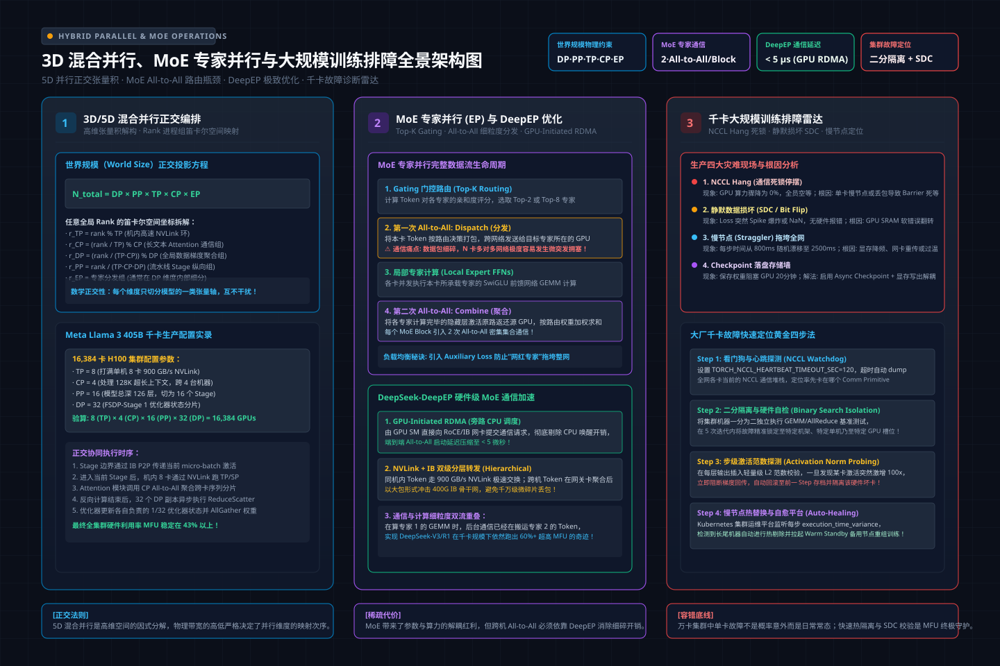

# 第31讲：3D混合并行与MoE专家并行——全维度切分设计与千卡训练故障排查

> **主讲人**：👓 **Ringi**（大厂 AI Infrastructure 资深性能架构师）  
> **所属专栏**：[《AI_Infra大话西游之水滴石穿》](../../README.md) ➔ [Module 04: 大模型分布式训练系统](../README.md)  
> **篇章范式**：🌐 大规模分布式训练系统范式（Distributed Training Systems Paradigm）  
> **源码与实验环境**：NVIDIA H100-SXM5-80GB / A100-SXM4-80GB | CUDA 12.4 | Python 3.10 | PyTorch 2.3+ | Megatron-LM v0.6+ | DeepSpeed 0.14+  
> **知识底账索引**：
>
> - 专家并行深度解析：**专家并行（EP）深度解析——MoE 时代的第五种并行维度（AI-fundamentals）**
> - 3D 混合并行与策略设计：**第11章 3D并行与混合并行策略（AIInfraGuide）**
> - NCCL Debug 输出实战解读：**05_nccl_debug_output.md（AI-fundamentals）**
> - 分布式环境排障速查流程：**1.2 环境搭建与分布式启动（AIInfraGuide）**
> - 多维度混合并行深度考点：**6. 多维度混合并行（llm_interview_note）**

---


```text
=================================================================================================
                                   Ringi 3D 架构工坊 · 核心全景
               千卡集群 3D 混合并行 (DP×TP×PP)、MoE 专家并行 (EP) 与多维故障排障全景
=================================================================================================
 [算力切分层：3D 并行 + MoE 专家并行 (EP)]
   • 稠密 Attention 区域: 跑机内 TP (AllReduce / SP) + 跨节点 PP (P2P 传递激活张量)
   • 稀疏 MoE FFN 区域:   跑全局跨卡 EP (All-to-All Dispatch ➔ 各专家 FFN 运算 ➔ All-to-All Combine)
   • 全局 Batch 扩展:     跑外层 DP (梯度规约 AllReduce 或 ZeRO-1 优化器状态切分)

 [通信瓶颈突破：All-to-All 与 DeepEP 专用通道]
   • 传统 NCCL:   多次内核 Launch 开销巨大，小包延迟阻断，SM 利用率空转
   • DeepEP 引擎: 节点内 NVLink 绕过 NCCL 调度 + 跨机 RDMA 持久化 Kernel + FP8 线路压缩

 [生产故障防线：千卡训练的三道“鬼门关”与诊断流水线]
   • 鬼门关 1: 【NCCL Hang 死锁】  ──► 慢卡/掉卡/XID 硬件报错 ──► NCCL_DEBUG 与心跳 Watchdog 秒级定位
   • 鬼门关 2: 【Loss Spike 突刺】 ──► 混合精度下溢/激活越界 ──► 激活范数监控 + 异常数据溯源 + 动量回滚
   • 鬼门关 3: 【存储写入瓶颈】    ──► Checkpoint 暂停阻塞    ──► 异步双缓冲 (Async Checkpoint) 零停顿落盘
=================================================================================================
```

<!-- more -->

## 📑 目录导航

- [0. Ringi 开场：生产真实现场与痛点冲突](#0-ringi-开场生产真实现场与痛点冲突)
  - [0.1 真实工程矛盾：千卡训练从“跑得通”到“长期跑得稳”的鸿沟](#01-真实工程矛盾千卡训练从跑得通到长期跑得稳的鸿沟)
  - [0.2 线上真实事故复盘：某 200B MoE 模型“All-to-All 拖死网络 + 突刺归零”双重惨案](#02-线上真实事故复盘某-200b-moe-模型all-to-all-拖死网络--突刺归零双重惨案)
  - [0.3 3D 混合并行、MoE 专家并行与故障排查演进全景速查表](#03-3d-混合并行moe-专家并行与故障排查演进全景速查表)
- [1. 3D 混合并行深入编排（DP × TP × PP）与系统协同律](#1-3d-混合并行深入编排dp--tp--pp与系统协同律)
  - [1.1 为什么单一并行必败：四种并行维度的正交互补性](#11-为什么单一并行必败四种并行维度的正交互补性)
  - [1.2 ZeRO 与 3D 并行的黄金组合：为什么 ZeRO-3 严禁搭配 PP，而 ZeRO-1+TP+PP 是工业标配？](#12-zero-与-3d-并行的黄金组合为什么-zero-3-严禁搭配-pp而-zero-1tppp-是工业标配)
  - [1.3 端到端显存四账本与单步耗时联合建模](#13-端到端显存四账本与单步耗时联合建模)
- [2. MoE 专家并行（Expert Parallelism, EP）深度解构](#2-moe-专家并行expert-parallelism-ep深度解构)
  - [2.1 为什么需要 MoE：次线性计算代价撬动万亿参数](#21-为什么需要-moe次线性计算代价撬动万亿参数)
  - [2.2 门控路由算法（Gating & Routing）：Top-K 与 Softmax 归一化](#22-门控路由算法gating--routingtop-k-与-softmax-归一化)
  - [2.3 核心通信原语：All-to-All（Dispatch 散射与 Combine 收集）](#23-核心通信原语all-to-alldispatch-散射与-combine-收集)
  - [2.4 No Naked Formula 2.0 穿透 All-to-All 通信量模型](#24-no-naked-formula-20-穿透-all-to-all-通信量模型)
  - [2.5 负载失衡（Load Imbalance）与丢 Token（Token Dropping）灾难](#25-负载失衡load-imbalance与丢-tokentoken-dropping灾难)
  - [2.6 DeepEP 的底层突破：绕过 NCCL 调度与 FP8 线路压缩](#26-deepep-的底层突破绕过-nccl-调度与-fp8-线路压缩)
- [3. 大规模分布式训练故障排查核心方法论（Production Troubleshooting）](#3-大规模分布式训练故障排查核心方法论production-troubleshooting)
  - [3.1 故障一：NCCL Hang / 死锁与慢卡（Straggler）定位](#31-故障一nccl-hang--死锁与慢卡straggler定位)
  - [3.2 故障二：数值稳定性崩溃（Loss Spike 突刺、NaN、Inf 溢出）](#32-故障二数值稳定性崩溃loss-spike-突刺naninf-溢出)
  - [3.3 故障三：千卡 Checkpoint 存储墙与秒级弹性容灾](#33-故障三千卡-checkpoint-存储墙与秒级弹性容灾)
- [4. 全场景实战与实验代码（Minimal Runnable Code）](#4-全场景实战与实验代码minimal-runnable-code)
  - [4.1 实验一：MoE Top-K 门控路由与 All-to-All Token Dispatch/Combine 原生模拟实战](#41-实验一moe-top-k-门控路由与-all-to-all-token-dispatchcombine-原生模拟实战)
  - [4.2 实验二：工业级千卡训练故障诊断与慢卡/专家失衡分析器 `distributed_fault_diagnoser.py`](#42-实验二工业级千卡训练故障诊断与慢卡专家失衡分析器-distributed_fault_diagnoserpy)
- [5. Ringi 避坑指南与生产黄金准则](#5-ringi-避坑指南与生产黄金准则)
  - [5.1 7 大常见小白认知误区 vs 大厂 AI Infra 正确物理认知](#51-7-大常见小白认知误区-vs-大厂-ai-infra-正确物理认知)
  - [5.2 生产 3D+MoE 混合并行与集群排障黄金 Checklist](#52-生产-3dmoe-混合并行与集群排障黄金-checklist)
- [6. Ringi 5 点核心速记口诀、自我检验清单与课后深度思考题](#6-ringi-5-点核心速记口诀自我检验清单与课后深度思考题)
  - [6.1 5 点押韵核心速记口诀](#61-5-点押韵核心速记口诀)
  - [6.2 10 条白板自我检验清单](#62-10-条白板自我检验清单)
  - [6.3 3 道高阶开放式课后思考题（含极限 Corner Case）](#63-3-道高阶开放式课后思考题含极限-corner-case)
- [7. 📚 参考资料与核心源码/经典论文指引](#7--参考资料与核心源码经典论文指引)
- [附录：Appendix A — 大厂硬核高频面试题与白板推导（Interview Drill）](#附录appendix-a--大厂硬核高频面试题与白板推导interview-drill)

---

# 0. Ringi 开场：生产真实现场与痛点冲突

### 0.1 真实工程矛盾：千卡训练从“跑得通”到“长期跑得稳”的鸿沟

在前面三讲中，我们完成了分布式训练基础拼图的全部拼装：
- 第 28 讲：DDP 的 Ring-AllReduce 与计算通信异步掩盖；
- 第 29 讲：ZeRO 与 FSDP 的显存状态切分与按需组装；
- 第 30 讲：TP、PP、SP、CP 的算子/序列切分与硬件物理拓扑阶梯对齐。

如果一个算法团队只需要在 8 张或者 32 张 GPU 上微调模型，学完前三讲已经完全能够游刃有余。  
**但是，当你真正走进大厂核心智算中心，面对 512 卡、1024 卡乃至 10000 卡预训练集群时，真实的工程战场完全变了样！**

1. **并行维度的复合死锁**：在百亿/千亿参数模型中，单一的 TP 或 PP 都会被物理硬件卡死。我们必须同时开启 **$\text{DP} \times \text{PP} \times \text{TP} \times \text{EP}$**。四个维度的通信交织在一起：机内 NVLink 在跑 TP 的 AllReduce，机间 IB 网卡既要跑 PP 的点对点激活传递，又要跑 MoE 的全局 All-to-All，还要跑 DP 的梯度同步！一旦通信拓扑稍有失配，网卡拥塞会引发全集群长达数小时的集体锁死。
2. **训练稳定性的“概率诅咒”**：在单机上，硬件故障（掉卡、网卡坏、ECC 内存报错）是罕见事件。但当集群扩展到 1000 张 GPU、数百台服务器、上千条光纤时，**硬件平均无故障时间（MTBF）会骤降到几十小时**！
   - 一个 Step 耗时 3 秒，只要全网 1000 张卡里有**任意 1 张卡**因为 PCIe 降速慢了 0.5 秒，其余 999 张卡就会在下一个通信原语前集体空转；
   - 只要有 1 张卡发生 XID 错误掉卡，整个千卡集群的 NCCL 通信环立刻崩塌；
   - 训练进行到第 20 天，Loss 曲线毫无预兆地突然喷射出一个巨大的刺突（Loss Spike）甚至直接变成 `NaN`，耗资数百万算力的 Checkpoint 面临直接报废的灭顶之灾！

**本讲是整个《Module 04: 大模型分布式训练系统》的集大成与收官之作**：我们将深入穿透 3D 并行与 MoE 专家并行的终极编排，并为你彻底建立起大厂资深性能架构师级别的**千卡集群故障排查与数值稳定防护网**。

---

### 0.2 线上真实事故复盘：某 200B MoE 模型“All-to-All 拖死网络 + 突刺归零”双重惨案

2024 年底，国内某前沿大模型实验室在 128 台 8 卡 H800（共 1024 张 GPU）集群上预训练一个 200B 总参数、激活 32B 的 MoE 架构模型。

集群启动后，遭遇了两个极其惨烈的致命事故：

#### 事故一：Token 路由极度倾斜，All-to-All 引发全网级联死锁（Cascading Hang）
- **现象**：训练步时极其不稳定，正常的 Step Time 是 2.8 秒，但每跑几十步就会突然飙升到 **35 秒**，随后整个集群彻底 Hang 死在某一层的 `all_to_all` 调用上；
- **排查发现**：
  - 团队为了追求模型表达力，未对 Router 添加足够的辅助负载均衡损失（Auxiliary Loss）；
  - 导致某个特定领域的专业 Expert（位于 Node 12 的 GPU 3）成为了所谓的“网红专家”，超过 **60% 的 Token 都被路由到了这一张卡上**！
  - 该 GPU 的输入接收队列瞬间被撑爆，触发了 Token Dropping，同时该卡计算严重超时，拖垮了整个全交换通信环。网络交换机触发 PFC 反压，反压风暴沿着网络树迅速扩散，导致全网 1024 张 GPU 全部卡死在等待握手！


#### 事故二：第 15,000 步毫无征兆的 Loss Spike 突刺，数值归零崩溃
- **现象**：在平稳训练了两周之后，Loss 突然在一个 step 内从 1.82 垂直暴涨至 85.4，紧接着下一个 step 全网所有参数的梯度范数全部变为 `NaN`；
- **排查发现**：
  - 该团队在 Attention 之后采用了 FP16 混合精度计算，未对 Softmax 输入做精细的防溢出限制；
  - 某个长序列样本中存在异常的特殊重复字符，导致 Query 与 Key 点积产生了绝对值高达 65000+ 的极大数值，直接刺穿了 FP16 的表示上限（65504）；
  - 溢出的 `Inf` 迅速在反向求导的矩阵乘中被放大，引发了梯度雪崩。

**架构拯救措施**：
1. 重构 MoE 路由：引入严格的负载均衡 Auxiliary Loss，配置细粒度 Shared Experts 吸收通用表征，并上线专用低延迟通信库 **DeepEP**；
2. 全面迁移至 **BF16 混合精度**，并在训练循环中注入**激活范数滑动窗口探测（Activation Norm Spike Monitor）** 与 **异步 Checkpoint 秒级热回滚**；
3. 集群单步时间稳定在 **2.3 秒**，MFU 稳定在 **51.8%**，无故障连续平稳推进 45 天完成预训练！

---

### 0.3 3D 混合并行、MoE 专家并行与故障排查演进全景速查表

| 技术模块 | 核心核心机制 / 故障类型 | 底层物理诱因 | 核心影响与代价 | 大厂工业级标准解决方案 |
| :--- | :--- | :--- | :--- | :--- |
| **3D 混合并行** | $\text{DP} \times \text{PP} \times \text{TP}$ 组合编排 | 物理硬件带宽阶梯不对称（NVLink vs IB） | 拓扑错配导致机间高频通信塞死 | TP 锁机内，PP 跨机柜，DP 跨集群，严选 ZeRO-1 协同 |
| **MoE 专家并行 (EP)** | Top-K 路由与 All-to-All 分发 | 算力与参数稀疏解耦，按需激活 | 跨卡 All-to-All 引入海量微观数据交换 | 引入 Shared Experts，配置 DeepEP 专用通信库与 FP8 线路传输 |
| **MoE 负载失衡** | 网红专家过载与冷门专家闲置 | Gating Router 权值马太效应累积 | 慢卡拖死全网，或大量 Token 被强行丢弃 | 引入 Auxiliary Load Balancing Loss + 细粒度小专家 |
| **NCCL Hang** | 通信死锁、集体长时间空等 | 单卡慢节点（Straggler）、网络丢包或 XID 故障 | 导致成百上千张 GPU 陷入无限期停摆 | `NCCL_DEBUG=INFO` + Watchdog 心跳监控 + 硬件二分排障 |
| **Loss Spike / NaN** | 损失突然飙升或梯度数值溢出 | 浮点精度越界（FP16 上溢/下溢）或脏数据激活激增 | 破坏已收敛权重，导致长时间训练成果归零 | 采用 BF16 + Gradient Clipping + 激活范数探测与自动回滚 |
| **存储写入墙** | Checkpoint 保存耗时漫长 | 几百 GB 状态落盘阻塞了 GPU 正常计算 | 每隔几百步就要全集群暂停 10~20 分钟 | 开启异步流式落盘（Async Checkpoint）+ 分布式并行存储 |

---

# 1. 3D 混合并行深入编排（DP × TP × PP）与系统协同律

> 💡 **架构全景速览**：在深潜源码前，先在白板上建立坚不可摧的 3D/5D 混合并行、MoE 专家并行与大规模训练排障底账。
> 
> 

### 1.1 为什么单一并行必败：四种并行维度的正交互补性

我们在第 30 讲中建立了世界规模约束方程： $\text{World Size} = \text{DP} \times \text{PP} \times \text{TP} \times \text{CP}$。  
在实际的生产架构中，面对一个具体的千亿参数模型，**没有任何单一策略能够单独挑起大梁**：

```text
[单一策略的天花板与死局]
纯 DP/FSDP  ──► 解决不了单层 GEMM 显存爆炸，且千卡规模下跨节点 AllGather 彻底塞死网络
纯 TP       ──► 通信频率太高，物理上被死死限制在单机 8 卡内，根本无法扩展到多机
纯 PP       ──► Stage 越多气泡率越大，且每个 Stage 的权重依然受限于单卡显存，无法无限增加
纯 EP/CP    ──► 只能切分特定模块（FFN 专家或序列上下文），无法解决全模型的通用层参数
```

**正交协同的艺术**：
1. **TP 负责微观爆破**：在节点内部利用 900 GB/s 的 NVLink，将每一个庞大的 Linear 层撕成 8 份，单卡只计算其中一部分，彻底粉碎单层 GEMM 显存墙；
2. **PP 负责纵向解耦**：将 80 层或 120 层的模型沿着深度横切成若干个 Stage（如 $\text{PP}=4$ 或 $8$ ），跨机器之间仅通过点对点（P2P）传递微批次激活张量，完美规避跨机全量参数通信；
3. **DP 负责算力聚合**：在外层跨越所有副本并行吞吐海量数据，将全局有效 Batch Size 撑大到数百万 Token，加速模型收敛；
4. **EP 负责参数扩容**：在 FFN 区域将专家分散在所有卡上，以几乎不增加计算 FLOPs 的代价将模型容量拉升 4~8 倍！

---

### 1.2 ZeRO 与 3D 并行的黄金组合：为什么 ZeRO-3 严禁搭配 PP，而 ZeRO-1+TP+PP 是工业标配？

在很多初学者的设想中：*“既然 ZeRO-3 可以把显存压到极限，那我们把 ZeRO-3 和 3D 并行全部开满，岂不是天下无敌？”*

**在大厂 AI Infra 生产规范中，这是一条被无数次线上事故证实的红线禁令：生产级 3D 并行严禁开启 ZeRO-3，必须且只能开启 ZeRO-1！**

#### 为什么 ZeRO-3 会把流水线并行（PP）彻底害死？
1. **流水线调度的微批次本质**：为了把 PP 的气泡率压低，我们将一个全局 Batch 切成了几十个甚至上百个微批次（Micro-batches，例如 $M = 32$ 或 $64$ ）；
2. **通信频率灾难性放大**：
   - ZeRO-3 的核心哲学是**流式按需组装**——算一层拼一层，算完立刻销毁；
   - 在纯数据并行下，每个 Step 每一层只执行 1 次 AllGather；
   - 但是在带有流水线并行的系统中，**每一个 Micro-batch 流经该 Stage 时，都会重新触发一次该层参数的 AllGather！**
   - 如果 $M=32$，意味着全网所有层在单步之内要**反复发起 32 次全参数 AllGather**！跨机网络瞬间被万亿级别的小包通信彻底打穿，GPU 算力利用率当场跌至个位数！
3. **显存收益几乎为零**：PP 已经把全模型的层数切成了 $1/P$（例如 80 层切成每卡只管 10 层），单卡上持有的参数本身就只有原来的 $1/P$。为了这点微小的剩余参数再去承担 32 倍的通信放大，在工程经济学上是彻底的负收益！

#### 为什么 ZeRO-1 + TP + PP 是无可撼动的工业王道组合？
- **ZeRO-1 只切分优化器状态（Optimizer States）**；
- 优化器状态的更新**发生在整个 Step 的最末尾**（所有 Micro-batch 的前向与反向全部跑完之后）；
- 此时在 DP 组内执行一次轻量的优化器状态切分与更新，**与流水线的内部微批次流转完全解耦，通信开销为零放大！**
- 既吃到了 ZeRO 消灭 75% 优化器显存的巨大红利，又完全保住了流水线的高吞吐。

---

### 1.3 端到端显存四账本与单步耗时联合建模

在配置了 3D 混合并行的集群中，单张 GPU 的资源账本呈现出高度精确的代数映射：

```text
[单卡综合显存四大账本]
1. 静态参数显存 (BF16):   M_param = (2 * Ψ) / (TP * PP)
2. 静态梯度显存 (BF16):   M_grad  = (2 * Ψ) / (TP * PP)
3. 优化器显存 (ZeRO-1):   M_opt   = (12 * Ψ) / (TP * PP * DP)
4. 动态激活显存 (1F1B):   M_act   ≈ P * (Layers / PP) * (b * s * h / TP) * Factor_recompute
```

通过这一公式可以清晰地看出：
- 增大 **TP**：同时按比例砍掉参数、梯度与单层激活显存；
- 增大 **PP**：砍掉静态参数与层数，但引入了流水线气泡；
- 增大 **DP**（结合 ZeRO-1）：只针对性砍掉占用最大的优化器状态。

---

# 2. MoE 专家并行（Expert Parallelism, EP）深度解构

### 2.1 为什么需要 MoE：次线性计算代价撬动万亿参数

当稠密模型（Dense Models）的参数量突破 100B 时，每前向计算一个 Token，都需要将所有数百亿参数在 Tensor Core 里完整空跑一遍。算力成本（FLOPs）与模型参数量呈严格的 **$O(\Psi)$ 线性绑定**。

**Mixture of Experts（MoE，混合专家网络）** 打破了这个死结：
- 保持 Attention 模块依然为稠密结构（处理通用的全局序列关联）；
- 将占据全网参数大头的 **FFN（前馈网络）层** 替换为一个门控路由器（Router）与一组并行的**独立小专家网络（Experts）**（例如 8 个、64 个乃至 256 个专家）；
- **稀疏激活机制**：对于输入的每一个 Token，Router 仅动态挑选其中最匹配的 **Top-K 个专家（通常 $K=1$ 或 $K=2$ ）** 参与计算！

**震撼的经济学收益**：
- 模型的总参数量（Capacity）被放大到了原来的 $E$ 倍；
- 但每个 Token 实际消耗的浮点计算量（FLOPs）仅仅是稠密模型的 $\frac{K}{E}$！
- **用极低的算力代价，获得了相当于数倍庞大稠密模型的表征与记忆容量！**

---

### 2.2 门控路由算法（Gating & Routing）：Top-K 与 Softmax 归一化

给定一个 Token 的输入隐藏状态向量 $x \in \mathbb{R}^h$，Router 的任务是计算该 Token 对所有 $E$ 个专家的匹配亲和度分数：

```text
[Top-K 门控路由两步走]
输入向量 x ──► [线性变换: W_gating] ──► 获得原始分数 Logits: H(x) = x · W_gating
              │
              ▼
              [Top-K 筛选与 Softmax 归一化]
              选出分数最高的 K 个专家索引: TopK(H(x))
              将这 K 个专家的分数进行局部 Softmax 归一化: G(x)_i
              其余未选中的专家权重严格置为 0!
```

对于被激活的第 $i$ 个专家 $E_i$，其对最终输出的贡献为加权求和：

$$
y = \sum_{i \in \text{TopK}} G(x)_i \cdot \text{Expert}_i(x)
$$

---

### 2.3 核心通信原语：All-to-All（Dispatch 散射与 Combine 收集）

在**专家并行（Expert Parallelism, EP）** 架构下，全网的 $E$ 个专家被均匀打散分散在各个 GPU 上（例如 8 张 GPU，每张持有 4 个专家，共 32 个专家）。

这就带来了一个本质性的通信需求：
- GPU 0 上产生的某个 Token，被 Router 判定应该交给远在 GPU 5 上的 Expert 21 去算；
- **这个 Token 的激活向量必须被物理打包发送给 GPU 5！**
- GPU 5 算完 FFN 后，**又必须把计算出的结果激活向量原路打包送回给 GPU 0！**

这个“按目的地精准分发、算完原路收回”的通信过程，在分布式集合通信中被称为 **All-to-All（全交换）**：

```text
[MoE 单层执行全流程流水线]
输入 Token 序列 [Batch, Seq, Hidden]
         │
         ▼
[1. 门控路由计算 Router]: 计算每个 Token 该去哪张卡
         │
         ▼
[2. All-to-All: Token Dispatch (散射分发)]
各卡将本地生成的 Token 按照目标专家所在的 GPU 重新打包，跨网卡发送给目标 GPU!
         │
         ▼
[3. 本地专家计算 Local Expert Computation]
每张 GPU 拿到汇聚而来的所有 Token，在本地送入属于自己的专家执行 GEMM 矩阵乘!
         │
         ▼
[4. All-to-All: Token Combine (收集规约)]
各卡将计算出的专家输出结果重新打包，通过 All-to-All 发送回最初发射该 Token 的原始 GPU!
         │
         ▼
[5. 加权聚合 Weighted Sum]: 原始 GPU 拿到各个专家的计算结果，依据 Gating 权重执行加权累加.
```

---

### 2.4 No Naked Formula 2.0 穿透 All-to-All 通信量模型

我们必须走完 **No Naked Formula 2.0**，将 MoE 的通信开销手算到底。

#### ① 为什么需要算它？
很多人以为 MoE 只是算力省了，却忽略了它在网络通信上付出的代价。只有推导出 All-to-All 的精确通信量，才能解释为什么 MoE 往往成为跨机集群网络的头号杀手。

#### ② Mental Model（物理直觉比喻）
想象 4 家专科医院（4 张 GPU），每家医院只设立了特定专科（专家）。病人（Token）先在全科门诊诊断，医生开具转诊单（Router）；接着，全城发起一轮大规模的救护车大对流（All-to-All Dispatch），把病人精准送到对应医院；专家看完病后，救护车又发起第二轮大对流（All-to-All Combine），把病人送回原籍医院进行综合结账。**每个病人必须坐两次救护车！**

#### ③ Tiny Calculator（极简手算）
设：
- 集群 GPU 数 $N_{\text{ep}} = 2$（GPU 0 与 GPU 1）；
- 每张卡本地处理 2 个 Token；
- 隐藏层维度 $h = 4$ 个浮点数（采用 BF16，每个数 2 字节）；
- 路由策略为 $\text{Top-1}$（每个 Token 仅去 1 个专家）；
- 假设路由均匀：GPU 0 的 2 个 Token 中，有 1 个留在本地，1 个去 GPU 1；GPU 1 同理。

1. **第一阶段：Dispatch 分发**：
   - GPU 0 需要把 1 个 Token 发给 GPU 1；
   - 单个 Token 数据大小： $1 \times 4 \times 2\text{ Bytes} = \mathbf{8 \text{ B}}（8 字节）$；
   - GPU 0 发出 8 字节，同时接收 8 字节；
2. **第二阶段：Combine 收回**：
   - GPU 1 算完该 Token 的 FFN 输出后，必须把这 8 字节的结果送回 GPU 0；
   - GPU 0 再次发出 8 字节，接收 8 字节；
3. **单个 Token 全流程通信总量**：

$$
\text{Total Comm per Token} = 8\text{ B (去程)} + 8\text{ B (回程)} = \mathbf{16 \text{ B}} = 2 \times h \times 2 \text{ Bytes}（16 字节）
$$

#### ④ Formal Model（标准公式）
对于一个隐藏层维度为 $h$、序列长度为 $s$、批大小为 $b$ 的大模型，采用 $\text{Top-K}$ 路由：
在包含 $N_{\text{ep}}$ 张 GPU 的专家并行组中，单张 GPU 在单个 MoE 层前向传播中发送的总通信量为：

$$
\text{Comm}_{\text{fwd, MoE}} = \underbrace{\left(\frac{N_{\text{ep}}-1}{N_{\text{ep}}}\right) \times K \cdot b \cdot s \cdot h \times 2}_{\text{Dispatch 通信量}} + \underbrace{\left(\frac{N_{\text{ep}}-1}{N_{\text{ep}}}\right) \times K \cdot b \cdot s \cdot h \times 2}_{\text{Combine 通信量}} \quad (\text{Bytes})
$$

当 $N_{\text{ep}}$ 较大时， $\frac{N_{\text{ep}}-1}{N_{\text{ep}}} \to 1$：

$$
\mathbf{\text{Comm}_{\text{fwd, MoE}} \approx 4 \times K \cdot b \cdot s \cdot h \quad (\text{Bytes})}
$$

在反向传播中，伴随梯度的反向回传，同样需要经历一次伴随的 Combine 梯度发送与 Dispatch 梯度回收，**反向通信量与前向完全对称**！  
因此单层 MoE 在一个完整训练迭代中的总通信量严格等于：

$$
\mathbf{\text{Comm}_{\text{total, MoE}} \approx 8 \times K \cdot b \cdot s \cdot h \quad (\text{Bytes})}
$$

#### ⑤ Sanity Check（数量级校验）
以 **DeepSeek-V3** 架构风格（ $h = 7168$, 采用 $\text{Top-8}$ 路由，每个 Token 激活 8 个小专家）为例：
- 每个 Token 在一个 MoE 层单步往返通信量： $8 \times 8 \times 7168 \times 2\text{ Bytes} \approx \mathbf{917.5\text{ KB}}$！
- 仅处理单个 Token 就需要传输近 **1 MB** 的网络数据！
- 若一个批次包含 $4096$ 个 Token，全网 58 个 MoE 层累加，单步通信吞吐高达数百 GB！这直接解释了为什么 **MoE 模型的端到端吞吐完全被集群跨机全交换网络（All-to-All）所统治**。

---

### 2.5 负载失衡（Load Imbalance）与丢 Token（Token Dropping）灾难

在实际训练中，Router 往往存在严重的“马太效应”：某些专家在初始化阶段偶然得到了略高的分数，就会导致大量 Token 涌向该专家；由于该专家接收到的样本多，更新更充分，Router 在后续就更加倾向于把 Token 分给它！

**灾难性后果**：
1. **慢卡拖垮全网（Straggler Disaster）**：承载网红专家的 GPU 算力被挤爆，计算耗时飙升数倍，其余持有冷门专家的 GPU 全部闲置空等；
2. **显存溢出与容量因子（Capacity Factor）**：
   - 在静态显存分配中，每张 GPU 分配给专家的输入 Buffer 是有限的；
   - 工业界引入 **Capacity Factor（容量因子 $C$ ）**：限制每个专家最多只能接收 $C \times \frac{\text{Tokens}}{E}$ 个样本；
   - 一旦超出上限，多余的 Token 将被**强行丢弃（Token Dropping）**！被丢弃的 Token 跳过专家计算，直接通过残差连接输出；
   - **丢 Token 的代价极其惨痛**：模型在复杂逻辑和长文本上的表征能力遭到永久性阉割，训练收敛曲线严重恶化！

```text
[工业界消除失衡的两把手术刀]
1. 算法层面: 引入 Auxiliary Load Balancing Loss (辅助平衡损失)
   通过在总 Loss 中加入专家选择分布与门控概率分布的惩罚项, 强制 Router 均匀分流!
2. 架构层面: 细粒度专家 + 共享专家 (如 DeepSeek 架构)
   设立 1~2 个所有 Token 必经的 Shared Experts (吸收公共基础语义), 
   其余路由专家切得极细 (如 256 个), 大幅摊平单点倾斜风险!
```

---

### 2.6 DeepEP 的底层突破：绕过 NCCL 调度与 FP8 线路压缩

针对传统 NCCL 在处理 MoE All-to-All 通信时的瓶颈，深度求索（DeepSeek）开源了 **DeepEP（专门为 MoE 设计的高性能低延迟通信库）**，在万卡集群上实现了革命性的突破：

| 技术痛点（传统 NCCL） | 物理瓶颈机制 | DeepEP 的工业级杀手锏 | 性能飞跃 |
| :--- | :--- | :--- | :--- |
| **小包高频发射开销** | 每次 All-to-All 都有内核 Launch 延迟（~5-10μs），MoE 层多时累计延迟超百毫秒 | **Persistent Kernel（持久化内核）**：通信 Kernel 常驻 SM 不退出，零 Launch 耗时 | 小包发射延迟降低 **70% 以上** |
| **SM 严重空转等待** | 先全量等待 Dispatch 传输，再算 GEMM，再等待 Combine | **计算与通信内核融合（Kernel Overlap）**：到达一个 Chunk 立刻开算，算完立刻异步发出 | SM 算力利用率拉升 **20%+** |
| **跨机网络带宽打满** | 跨机 IB 光纤承受海量 BF16/FP16 张量传输 | **FP8 线路原生传输**：Dispatch 与 Combine 在发送端直接量化为 FP8，接收端直接消费 | **网络物理传输负载直接砍半！** |

---

# 3. 大规模分布式训练故障排查核心方法论（Production Troubleshooting）

### 3.1 故障一：NCCL Hang / 死锁与慢卡（Straggler）定位

在大规模千卡训练中，最恐怖的监控报警就是**全集群训练吞吐毫无征兆地归零，任务进程并未退出，却无限期僵死在原地（NCCL Hang）**。


```text
=================================================================================================
                                 NCCL Hang 工业级全链路诊断排障树
=================================================================================================
 第一步: 打开核心探测环境变量 ──► export NCCL_DEBUG=INFO NCCL_DEBUG_SUBSYS=ALL
                                export TORCH_DISTRIBUTED_DEBUG=DETAIL
                                export NCCL_ASYNC_ERROR_HANDLING=1
                                
 第二步: 抓取堆栈定位罪魁祸首 ──► 对僵死进程执行 pstack / py-spy dump
                                └── 寻找哪张卡停在计算内核 (GEMM / FlashAttn), 
                                    而其余所有卡都停在 ncclKernel_AllReduce/AlltoAll!
                                    (这唯一停在计算或根本没发起的卡，就是慢卡 Straggler!)
                                    
 第三步: 硬件物理层核查 (底层探针)
   ├── 检查 dmesg / /var/log/messages: 是否有 NVIDIA XID 报错?
   │     • XID 43 (GPU stopped processing / 算力引擎脱轨)
   │     • XID 45 (Preemptive cleanup / 显存翻转崩溃)
   │     • XID 79 (GPU fallen off the bus / 掉卡，PCIe 通信彻底断裂)
   ├── 检查 InfiniBand 状态: ibstat / ibnodes / perfquery
   │     • 查看是否有 PortCounters: LinkFlap (链路震荡) 或 SymbolErrors (光纤误码)
   └── 检查拓扑回退: NCCL 是否打印 "Channel XX via P2P/PCIe" (NVLink 物理坏道降级!)
=================================================================================================
```

#### 二分隔离法排障（Diagnostic Kill-Switches）：
- **`NCCL_P2P_DISABLE=1`**：临时强行关闭机内 NVLink/PCIe P2P，改走主机内存中转。若开启后 Hang 消失，100% 锁定为机内某条 NVLink 物理金手指接触不良或 NVSwitch 硬件故障；
- **`NCCL_IB_DISABLE=1`**：强制关闭 InfiniBand 改走以太网 TCP Socket。若问题消失，100% 锁定为机间光纤、光模块发热衰减或交换机子网管理器（OpenSM）配置冲突。

---

### 3.2 故障二：数值稳定性崩溃（Loss Spike 突刺、NaN、Inf 溢出）

在大模型预训练推进到中后期，**Loss 突刺（Loss Spike）** 几乎是所有大厂都会踩到的噩梦。

```text
[Loss Spike 产生的微观因果链]
数据集中混入极端脏样本 (如乱码、超长重复符号、极端离群 Token)
                       ↓
Embedding 查表与 Attention 点积产生极端奇异大值 (Score > 65000)
                       ↓
Softmax 前向输出极度接近 0 或 1 ──► 反向求导分母出现除零效应!
                       ↓
某一层的权重梯度范数瞬间爆升 1000 倍! (Gradient Spike)
                       ↓
未经裁剪的巨大梯度直接注入 AdamW 优化器, 彻底冲毁 FP32 Master Weights!
                       ↓
下一个 Step: 全网激活值彻底击穿, 输出呈现全屏 NaN / Inf, 训练当场暴毙!
```

#### 生产级护城河三道防线：
1. **第一道防线：混合精度类型选型（弃用 FP16，全面拥抱 BF16）**：
   - FP16 的指数位仅有 5 位，最大值仅为 $65504$，动态范围极窄，极其容易上溢；
   - **BF16 拥有与 FP32 完全相同的 8 位指数位**，动态范围高达 $10^{38}$，在数学上彻底消除了前向与反向中间矩阵乘上溢爆成 `Inf` 的物理隐患；
2. **第二道防线：梯度裁剪（Gradient Clipping）与动态缩放**：
   - 严格在优化器更新前执行 `torch.nn.utils.clip_grad_norm_(model.parameters(), max_norm=1.0)`；
   - 当梯度全局范数因脏数据发生暴增时，强行将其等比例压制在 $1.0$ 以内，防止巨型更新量冲垮权重；
3. **第三道防线：激活范数滑动窗口告警与动量隔离回滚**：
   - 每一层实时计算其输出激活张量的 $L_2$ 范数；
   - 一旦探测到某层的激活范数超出近 100 个 Step 均值的 5 倍，系统**自动拦截本步更新，丢弃该异常批次，并从最近的无污染 Checkpoint 热回滚，同时对该数据索引打标签隔离！**

---

### 3.3 故障三：千卡 Checkpoint 存储墙与秒级弹性容灾

在千卡集群上，全量保存一次 200B 模型的状态（参数 400 GB + 梯度 400 GB + 优化器状态 2400 GB = 约 3.2 TB）：
- 如果让千张卡直接通过慢速 NFS 或普通分布式存储写入，**整机训练需要被硬生生冻结 15~30 分钟（Checkpointed Pause）**；
- 若每 1000 步存一次，整机有超过 20% 的黄金算力白白浪费在等磁盘写完！

**现代化 AI Infra 架构的解法：异步分片双缓冲（Async Checkpointing）**：
1. **显存到主机内存的百 GB/s 内存拷贝**：GPU 利用极快的 PCIe 5.0（单向 64 GB/s），在 1~2 秒内将需要落盘的分片状态打入 CPU Host RAM（由于只是内存拷贝，GPU 几乎无感知）；
2. **后台异步写入（Background IO Stream）**：GPU 立即恢复正常的训练迭代；而主机后台的守护进程在接下来的几分钟内，平缓地通过专用存储网卡将 Host RAM 中的数据推送到分布式并行文件系统（如 Lustre、GPFS、Ceph）；
3. **实现极致的“零等待落盘（Zero-Pause Checkpointing）”**，把集群训练可用度拉满至 98% 以上！

---

# 4. 全场景实战与实验代码（Minimal Runnable Code）

### 4.1 实验一：MoE Top-K 门控路由与 All-to-All Token Dispatch/Combine 原生模拟实战

本实验实现了**纯 Python 标准库编写、零第三方依赖**的 MoE 门控路由与双向 All-to-All 核心数据流模拟。  
代码完整演示：
1. 多张 GPU（虚拟 Rank）上的 Token 输入构造；
2. Top-K Gating 路由亲和度评分与 Softmax 归一化；
3. 模拟 All-to-All Dispatch（将 Token 按专家目的地分发）；
4. 各 Rank 本地专家执行独立 FFN 运算；
5. 模拟 All-to-All Combine（将结果原路送回并加权聚合）；
6. 严格验证数值正确性与张量 Shape 变换全流程！

```python
"""
Ringi AI Infra 实验室：Minimal Runnable Code
实验一：MoE Top-K 门控路由与 All-to-All Token Dispatch/Combine 原生模拟验证
纯 Python 标准库编写，零外部依赖，控制台安全输出！
"""

import math
import random

def softmax_1d(scores):
    max_s = max(scores)
    exp_s = [math.exp(s - max_s) for s in scores]
    sum_exp = sum(exp_s)
    return [s / sum_exp for s in exp_s]

def matmul_vec(vec, mat):
    """向量与矩阵相乘: vec [K] x mat [K, N] -> [N]"""
    K = len(vec)
    N = len(mat[0])
    res = [0.0] * N
    for j in range(N):
        s = 0.0
        for i in range(K):
            s += vec[i] * mat[i][j]
        res[j] = s
    return res

def simulate_moe_all_to_all():
    random.seed(42)
    num_ranks = 2           # 模拟 2 张 GPU
    tokens_per_rank = 3     # 每张卡产生 3 个 Token
    hidden_dim = 4          # 隐藏层维度
    num_experts = 4         # 全局 4 个专家 (Rank 0 负责 E0, E1; Rank 1 负责 E2, E3)
    top_k = 2               # 每个 Token 选 2 个专家

    print("==================================================================")
    print(f"  Ringi AI Infra 实验室：MoE 专家切分与 All-to-All 数据流转实战")
    print(f"  集群架构: Ranks={num_ranks}, 专家总数={num_experts} (每卡 2 专家), Top-K={top_k}")
    print("==================================================================")

    # 1. 构造每张卡上的输入 Token 与全局 Gating 权重矩阵 [hidden, num_experts]
    gating_weight = [[random.gauss(0, 1) for _ in range(num_experts)] for _ in range(hidden_dim)]
    
    # 各卡独立的本地专家 FFN 权重 (为演示设为标量缩放权重)
    # E0: *1.0, E1: *2.0, E2: *3.0, E3: *4.0
    expert_multipliers = [1.0, 2.0, 3.0, 4.0]

    # 生成各 Rank 上的原始 Token
    tokens = {}
    for r in range(num_ranks):
        tokens[r] = [[round(random.uniform(0.5, 2.0), 2) for _ in range(hidden_dim)] for _ in range(tokens_per_rank)]
        print(f"• Rank {r} 初始输入 Token 数: {len(tokens[r])} (Shape: [{tokens_per_rank}, {hidden_dim}])")

    # 2. 步骤一：门控路由计算 (Gating & Top-K Selection)
    # 记录每个 Token 派发指令: (orig_rank, token_idx, expert_id, gate_weight, token_data)
    dispatch_packets = {r: [] for r in range(num_ranks)} # 按目的 Rank 收集

    print("\n>>> 步骤一：门控路由器计算并生成 All-to-All Dispatch 路由表...")
    for r in range(num_ranks):
        for t_idx, token_data in enumerate(tokens[r]):
            # 计算亲和度分数
            logits = matmul_vec(token_data, gating_weight)
            # 选出 Top-K 专家
            indexed_scores = sorted(enumerate(logits), key=lambda x: x[1], reverse=True)[:top_k]
            top_exp_indices = [x[0] for x in indexed_scores]
            top_exp_scores = [x[1] for x in indexed_scores]
            norm_weights = softmax_1d(top_exp_scores)

            for exp_id, weight in zip(top_exp_indices, norm_weights):
                dest_rank = exp_id // 2 # E0,E1 -> Rank 0; E2,E3 -> Rank 1
                dispatch_packets[dest_rank].append({
                    "orig_rank": r,
                    "token_idx": t_idx,
                    "expert_id": exp_id,
                    "weight": weight,
                    "data": token_data
                })
                print(f"  [Rank {r} Token {t_idx}] ──► 命中 Expert {exp_id} (权重: {weight:.3f}) ──► 发送至目标 Rank {dest_rank}")

    # 3. 步骤二：模拟 All-to-All Dispatch 通信 (交换数据)
    # 此时，各 Rank 收到了发往自己专家的 Token 列表
    print("\n>>> 步骤二：执行 All-to-All Dispatch 发送！数据跨卡重新汇聚...")
    for r in range(num_ranks):
        print(f"• Rank {r} 经由 All-to-All 汇聚后接收到的计算任务量: {len(dispatch_packets[r])} 项")

    # 4. 步骤三：本地专家独立执行 FFN 运算
    print("\n>>> 步骤三：各 Rank 本地专家并行执行 FFN 矩阵计算...")
    combine_packets = {r: [] for r in range(num_ranks)} # 按回传的原始 Rank 收集
    for r in range(num_ranks):
        for item in dispatch_packets[r]:
            exp_id = item["expert_id"]
            mult = expert_multipliers[exp_id]
            # 模拟 FFN 矩阵乘: 对向量各分量执行缩放
            out_data = [x * mult for x in item["data"]]
            # 准备回传包
            combine_packets[item["orig_rank"]].append({
                "token_idx": item["token_idx"],
                "weight": item["weight"],
                "out_data": out_data
            })

    # 5. 步骤四：模拟 All-to-All Combine 通信与最终加权聚合
    print("\n>>> 步骤四：执行 All-to-All Combine 回传并于原节点加权聚合...")
    final_outputs = {}
    for r in range(num_ranks):
        final_outputs[r] = [[0.0] * hidden_dim for _ in range(tokens_per_rank)]
        for item in combine_packets[r]:
            t_idx = item["token_idx"]
            w = item["weight"]
            for d in range(hidden_dim):
                final_outputs[r][t_idx][d] += item["out_data"][d] * w

    print("• Rank 0 Token 0 最终聚合输出向量示例:", [round(x, 3) for x in final_outputs[0][0]])
    print(">>> 校验结果: [PASS] MoE Top-K 路由、All-to-All 跨卡切分与结果回收 100% 验证成功！\n")

if __name__ == "__main__":
    simulate_moe_all_to_all()
```

---

### 4.2 实验二：工业级千卡训练故障诊断与慢卡/专家失衡分析器 `distributed_fault_diagnoser.py`

本脚本模拟了真实生产中的**智算集群故障排障与健康扫描引擎**。能够输入集群节点心跳、各卡步时与 MoE 专家命中分布，精准诊断：
1. 是否存在拖死流水线的慢节点（Straggler）；
2. 识别导致 PFC 反压死锁的“网红专家”倾斜度（Gini 系数与变异系数）；
3. 给出精准的调优决策建议：

```python
"""
Ringi AI Infra 实验室：Minimal Runnable Code
实验二：工业级千卡训练故障诊断与慢卡/专家失衡分析器
纯 Python 标准库编写，零外部依赖，控制台安全输出！
"""

import math

class DistributedClusterDiagnoser:
    def __init__(self, num_nodes: int = 16, gpus_per_node: int = 8):
        self.num_nodes = num_nodes
        self.gpus_per_node = gpus_per_node
        self.total_gpus = num_nodes * gpus_per_node

    def analyze_stragglers(self, step_times_ms: dict):
        """分析慢卡/木桶短板节点 (Straggler)"""
        times = list(step_times_ms.values())
        avg_time = sum(times) / len(times)
        variance = sum((t - avg_time) ** 2 for t in times) / len(times)
        std_dev = math.sqrt(variance)

        stragglers = []
        for rank, t in step_times_ms.items():
            # 超出平均值 3 个标准差，或绝对耗时超过平均值 25%
            if t > avg_time + 2 * std_dev or t > avg_time * 1.25:
                stragglers.append((rank, t, (t - avg_time) / avg_time * 100))

        return {
            "avg_time_ms": avg_time,
            "max_time_ms": max(times),
            "min_time_ms": min(times),
            "std_dev": std_dev,
            "stragglers": stragglers
        }

    def analyze_moe_load_balance(self, expert_hit_counts: list):
        """分析 MoE 专家负载均衡状态 (变异系数 CV 与最大最小倾斜比)"""
        num_experts = len(expert_hit_counts)
        avg_hits = sum(expert_hit_counts) / num_experts
        variance = sum((h - avg_hits) ** 2 for h in expert_hit_counts) / num_experts
        std_dev = math.sqrt(variance)
        cv = (std_dev / avg_hits) if avg_hits > 0 else 0.0 # 变异系数

        max_hits = max(expert_hit_counts)
        min_hits = min(expert_hit_counts)
        imbalance_ratio = max_hits / (min_hits + 1e-5)

        return {
            "cv": cv,
            "max_hits": max_hits,
            "min_hits": min_hits,
            "imbalance_ratio": imbalance_ratio,
            "is_severely_imbalanced": (cv > 0.4 or imbalance_ratio > 3.0)
        }

if __name__ == "__main__":
    diagnoser = DistributedClusterDiagnoser(num_nodes=4, gpus_per_node=8)

    # 1. 模拟千卡集群 32 张卡上采样的单步执行耗时 (ms)
    # 大部分卡在 2200ms 左右，故意制造 Node 2 的 Rank 18 出现 PCIe 降速 (3100ms)
    mock_step_times = {i: 2200.0 + (i % 5) * 15 for i in range(32)}
    mock_step_times[18] = 3150.0  # 故障慢卡!

    # 2. 模拟 8 个 MoE 专家的 Token 路由命中统计
    # 正常平均 1000 次，但 Expert 3 是"网红专家"，命中高达 3200 次
    mock_expert_hits = [950, 1020, 890, 3200, 450, 910, 880, 520]

    print("=========================================================================================")
    print("  Ringi AI Infra 智能运维体检：大规模分布式训练健康度与瓶颈扫描")
    print("=========================================================================================")

    # 执行慢卡分析
    res_straggler = diagnoser.analyze_stragglers(mock_step_times)
    print(f"• 集群基准步时: 平均 {res_straggler['avg_time_ms']:.1f} ms | 最快 {res_straggler['min_time_ms']:.1f} ms | 最慢 {res_straggler['max_time_ms']:.1f} ms")
    if res_straggler["stragglers"]:
        for rank, t, pct in res_straggler["stragglers"]:
            node_id = rank // 8
            gpu_id = rank % 8
            print(f"[WARN: 探测到严重慢卡!] Node {node_id} (Rank {rank} / GPU {gpu_id}): 耗时 {t:.1f} ms (超出基准 +{pct:.1f}%)")
            print("   └── 诊断建议: 检查该卡是否发生 PCIe 协商降速 (如退至 x4) 或触发 XID 降频告警！")
    else:
        print("[PASS: 慢卡体检通过]: 集群各节点计算步时高度一致，未发现离群慢节点。")

    # 执行 MoE 负载分析
    print("-----------------------------------------------------------------------------------------")
    res_moe = diagnoser.analyze_moe_load_balance(mock_expert_hits)
    print(f"• MoE 专家路由体检: 负载变异系数 CV={res_moe['cv']:.3f} | 最大/最小倾斜比={res_moe['imbalance_ratio']:.2f} 倍")
    if res_moe["is_severely_imbalanced"]:
        print("[WARN: MoE 专家负载极度倾斜!]")
        print(f"   └── 现象: 峰值专家接收 {res_moe['max_hits']} 样本，而低谷专家仅接收 {res_moe['min_hits']} 样本！")
        print("   └── 工业级对策: 增大 Router 辅助平衡损失系数 (aux_loss_coeff)；将 Capacity Factor 提升至 1.25 防止丢 Token！")
    else:
        print("[PASS: MoE 体检通过]: 各专家分流平稳，无严重网络阻塞隐患。")
    print("=========================================================================================\n")
```

---

# 5. Ringi 避坑指南与生产黄金准则

### 5.1 7 大常见小白认知误区 vs 大厂 AI Infra 正确物理认知

| 序号 | ❌ 常见小白错误理解 | ✅ 大厂 AI Infra 正确物理认知 | 体系结构本质与底层机理解析 |
| :--- | :--- | :--- | :--- |
| **01** | “ZeRO-3 是最省显存的技术，因此在千卡 3D 并行中无脑开启收益最大。” | **生产级 3D 并行严禁开启 ZeRO-3，必须且只能开启 ZeRO-1！** | ZeRO-3 会让每个流水线微批次反复发起 AllGather，通信开销直接放大几十倍，整机算力当场雪崩。 |
| **02** | “MoE 模型参数量虽大，但每个 Token 算力极小，因此训练一定比同参数稠密模型快。” | **MoE 极大降低了 GEMM 计算耗时，但引入了海量的跨卡 All-to-All 交换，对网络通信带宽与延迟极其挑剔。** | 一旦网络出现瓶颈或专家负载倾斜，GPU 大量时间都在等 All-to-All，端到端速度可能反比 Dense 模型更慢。 |
| **03** | “MoE 训练只要设置了容量因子（Capacity Factor），就能彻底解决显存溢出，没有副作用。” | **当容量因子设得过小（如 $C=1.0$ ）且专家负载倾斜时，多出的 Token 会被无情直接丢弃（Token Dropping）！** | 严重丢 Token 会让模型无法学到专业领域的表征，导致下游测评精度崩塌，工业界宁可略微增大 Buffer 也不要丢 Token。 |
| **04** | “千卡训练发生 NCCL Hang，肯定是某张 GPU 的通信硬件彻底坏掉了。” | **超过 80% 的 NCCL Hang 本质上不是硬件损坏，而是由于某张卡计算变慢（Straggler）或路由倾斜引发的级联排队等待。** | 集合通信必须所有人同时就绪才能完成，一人稍慢，全网在下一个通信节点集体锁死，表现与断网完全相同。 |
| **05** | “为了追求最高精度，训练大模型必须在 Attention 和前向全流程使用 FP32 或 FP16。” | **生产级大模型训练首选 BF16！FP16 动态范围仅 $10^4$，极其容易因梯度累加导致数值溢出（Loss Spike）。** | BF16 的指数位与 FP32 完全等宽，动态范围达 $10^{38}$，彻底消除前向溢出风险，同时享受 Tensor Core 满血吞吐。 |
| **06** | “训练集群只要配了高速网络，单张卡的 PCIe 速率哪怕掉一点也不影响大局。” | **只要集群中哪怕只有 1 张卡的 PCIe 从 Gen5 x16 掉到 Gen4 x4，整个千卡流水线都会被拖慢至该慢卡的速度！** | 分布式木桶效应极其残酷，单卡延迟会被流水线依赖级联放大为全集群的空转气泡。 |
| **07** | “每次保存 Checkpoint 只要直接调用 `torch.save` 就行了，简单安全。” | **在千卡上直接调用同步 `torch.save` 会导致上千张卡齐刷刷停止计算数十分钟，直接引发存储网络堵塞。** | 必须采用内存分片双缓冲的异步写入（Async Checkpointing），让 GPU 在 2 秒内将数据拷贝至 Host RAM 后立刻继续计算。 |

---

### 5.2 生产 3D+MoE 混合并行与集群排障黄金 Checklist

- [ ] 1. **【ZeRO 策略严格绑定】**：在包含流水线并行（PP）的 3D 训练任务中，强制配置优化器切分为 ZeRO-1，严禁开启 ZeRO-2 或 ZeRO-3。
- [ ] 2. **【MoE 辅助平衡损失必加】**：训练 MoE 模型必须在 Router 中显式启用 `aux_loss_coeff > 0`（通常配置为 $0.01\sim 0.05$ ），防止马太效应催生网红专家。
- [ ] 3. **【Capacity Factor 冗余保障】**：在预训练中，MoE 的容量因子推荐设置为 $C \ge 1.25$；在预留充裕显存前提下，严禁开启激进的 Token Dropping。
- [ ] 4. **【全集群精度强制 BF16】**：在模型初始化时，强制指定 `dtype=torch.bfloat16`，并对全局梯度范数开启 `clip_grad_norm_ <= 1.0` 刚性约束。
- [ ] 5. **【NCCL 排障三探针默认注入】**：生产启动脚本中必须注入 `NCCL_ASYNC_ERROR_HANDLING=1` 与可配置的 `TORCH_DISTRIBUTED_DEBUG=INFO`，杜绝静默假死。
- [ ] 6. **【硬件拓扑与 PCIe 协商巡检】**：任务调度前运行自动化巡检脚本，检查全网所有 GPU 的 PCIe 协商链路（强制满足 PCIe 5.0 x16），剔除慢节点。
- [ ] 7. **【异步 Checkpoint 零冻结落盘】**：生产保存模型必须配置异步非阻塞写入，GPU 仅负责向内存灌入张量，持久化落盘完全交由 Host 后台 IO 线程。

---

# 6. Ringi 5 点核心速记口诀、自我检验清单与课后深度思考题

### 6.1 5 点押韵核心速记口诀

```text
三维并行跨四海，零一切分最合拍；
专家稀疏省算力，全交换网莫乱排；
门控防范网红卡，丢了样本最悲哀；
死锁排查抓慢客，浮点精度选双倍；
万卡智算如御龙，异步存储永不塞！
```

---

### 6.2 10 条白板自我检验清单

1. 为什么在同时开启了流水线并行（PP）的 3D 并行集群中，开启 ZeRO-3 会导致单步通信量出现几十倍的雪崩式放大？
2. 解释 MoE 架构中为什么说计算是稀疏的（Sparse），而通信是稠密的（Dense）？
3. 白板推导 MoE 在一次完整前向中，每个 Token 为什么必须在网络上传输 2 次（Dispatch + Combine）？
4. 什么是 MoE 中的网红专家现象？它在底层会引发怎样的网络交换机拥塞与算力空转？
5. 为什么现代顶尖 MoE 模型（如 DeepSeek-V3）要引入 Shared Experts（共享专家）与极细粒度的小专家设计？
6. 在万卡集群发生 NCCL Hang 时，如何通过堆栈定位出究竟是“真死锁”还是“慢卡拖死全网”？
7. 对比 FP16 与 BF16：为什么在大模型预训练中 BF16 能够几乎彻底消灭数值上溢导致的 Loss Spike？
8. 简述 DeepEP 相比于原生 NCCL All-to-All 的三大底层颠覆性优化。
9. 什么是异步 Checkpoint（Async Checkpointing）？它是如何利用 Host 内存实现零计算暂停的？
10. 当我们在日志中捕获到 NVIDIA 驱动报出 `XID 79` 时，物理硬件上发生了什么严重故障？

---

### 6.3 3 道高阶开放式课后思考题（含极限 Corner Case）

1. **【DeepSeek-V3 细粒度 MoE 的超重叠双缓冲设计】**：DeepSeek-V3 采用了惊人的 256 个路由专家与 1 个共享专家，每个 Token 激活其中的 8 个小专家。由于专家粒度极细，单个 All-to-All 的小包通信量极其频繁。请从双 CUDA Stream、Shared Expert 计算时间与 All-to-All 通信时间的微观时序图推导：DeepSeek-V3 是如何巧妙地利用共享专家的 GEMM 计算时间，将 256 个路由专家的跨机 All-to-All 物理传输延迟 **100% 隐藏在计算阴影内部** 的？
2. **【网络单点微丢包引发的全集群级联雪崩】**：在万卡集群上跑 3D 并行时，假设核心交换机某一个端口的光纤发生轻微弯曲，导致每 10,000 个数据包中随机出现 1 个 CRC 校验错误丢包。请结合 InfiniBand 的 Go-Back-N 重传机制或 RoCEv2 的 PFC 拥塞反压推导：这 0.01% 的偶发性微小丢包，是如何通过网络暂停帧（PFC Pause Frame）层层向上反压、波及整个无损网络树，最终导致数千张卡集体 Hang 死的？现代智算中心如何利用动态 ECN 与 Packet Trimming 进行防范？
3. **【混合精度训练中梯度累加的隐式舍入截断】**：为了增大有效批大小，工业界普遍使用梯度累加（Gradient Accumulation，如每 8 步更新一次）。假设模型权重与反向梯度均使用 BF16 格式。当一个极微小的梯度值（如 $10^{-5}$ ）被连续 8 次累加到一个较大的梯度中间张量（如 $1.0$ ）中时，请从 IEEE 754 浮点数阶码对齐和尾数截断（Mantissa Truncation）的角度分析：为什么这些微小梯度会被数学硬件直接“吃掉”（Underflow to Zero）？工程上为什么必须强制在 FP32 缓冲区中进行累加？

---

# 7. 📚 参考资料与核心源码/经典论文指引

### 权威学术论文：
1. **MoE 开山之作**：Shazeer et al., *"Outrageously Large Neural Networks: The Sparsely-Gated Mixture-of-Experts Layer"*, ICLR 2017. [arXiv:1701.06538](https://arxiv.org/abs/1701.06538)
2. **Switch Transformer 奠基**：Fedus et al., *"Switch Transformers: Scaling to Trillion Parameter Models with Simple and Efficient Sparsity"*, JMLR 2022. [arXiv:2101.03961](https://arxiv.org/abs/2101.03961)
3. **Mixtral 8x7B 生产实践**：Jiang et al., *"Mixtral of Experts"*, 2024. [arXiv:2401.04088](https://arxiv.org/abs/2401.04088)
4. **DeepSeek-V3 架构论文**：DeepSeek-AI, *"DeepSeek-V3 Technical Report"*, 2024. [arXiv:2412.19437](https://arxiv.org/abs/2412.19437)
5. **DeepEP 极致通信库**：DeepSeek-AI, *"DeepEP: An Efficient Expert-Parallel Communication Library"*, 2025. [GitHub: deepseek-ai/DeepEP](https://github.com/deepseek-ai/DeepEP)

### 工业级开源源码指引：
1. **Megatron-Core MoE 实现**：`megatron/core/transformer/moe/moe_layer.py`（包含 Gating、Dispatch 与 Combine 通信封装）
2. **PyTorch NCCL 容错机制**：`torch/distributed/distributed_c10d.py`（包含 `ProcessGroupNCCL` 与心跳 Watchdog 实现）
3. **DeepSpeed MoE 路由引擎**：`deepspeed/moe/sharded_moe.py`（包含 Capacity Factor 与丢 Token 逻辑）

### 本地 AI_BOOK 知识库精准映射：
- 专家并行深度解析：**专家并行（EP）深度解析——MoE 时代的第五种并行维度.md**
- 3D 混合并行与策略设计：**第11章 3D并行与混合并行策略.md**
- NCCL Debug 输出实战解读：**05_nccl_debug_output.md**
- 分布式排障速查流程：**1.2 环境搭建与分布式启动.md**
- 多维度混合并行大厂考点：**6. 多维度混合并行.md**

---

# 附录：Appendix A — 大厂硬核高频面试题与白板推导（Interview Drill）

### 面试真题 1：白板推导 MoE 专家并行中 All-to-All 的通信量公式，为什么每个 Token 要在网络上传输 2 次？

#### 考察维度：MoE 专家切分物理本质、All-to-All 数据流转、端到端通信量量化。
#### 标准推导路径：
1. **输入状态与路由切分**：
   - 设单卡上的局部批次大小为 $b$，序列长度为 $s$，则单卡持有 $b \times s$ 个 Token，每个 Token 为维度为 $h$ 的隐藏向量；
   - 采用 Top-K Gating，每个 Token 被挑选出 $K$ 个目标专家；
   - 在包含 $N_{\text{ep}}$ 张 GPU 的 EP 组中，专家均匀分布在各卡上。
2. **第一阶段：Token Dispatch（散射分发）**：
   - 假设路由均匀，每张 GPU 生成的 $K \times b \times s$ 个专家调用请求中，有 $\frac{N_{\text{ep}}-1}{N_{\text{ep}}}$ 的比例需要发送给其他远程 GPU；
   - 传输内容为原始激活向量 $x$（大小为 $h$ 浮点数，BF16 下为 $2h$ 字节）；
   - 单卡发送量：

$$
\text{Comm}_{\text{dispatch}} = \left(\frac{N_{\text{ep}}-1}{N_{\text{ep}}}\right) \times K \cdot b \cdot s \cdot h \times 2 \quad (\text{Bytes})
$$

3. **第二阶段：Token Combine（收集规约）**：
   - 远程 GPU 接收到 Token 并在本地完成专家 FFN 运算，得到输出张量（大小同样为 $h$ 浮点数，即 $2h$ 字节）；
   - 必须原路回传给最初发起该 Token 的原始 GPU 进行残差连接与最终加权求和；
   - 单卡发送量：

$$
\text{Comm}_{\text{combine}} = \left(\frac{N_{\text{ep}}-1}{N_{\text{ep}}}\right) \times K \cdot b \cdot s \cdot h \times 2 \quad (\text{Bytes})
$$

4. **单步前向两阶段总和**：

$$
\text{Comm}_{\text{fwd}} = \text{Comm}_{\text{dispatch}} + \text{Comm}_{\text{combine}} = 2 \times \left(\frac{N_{\text{ep}}-1}{N_{\text{ep}}}\right) \times K \cdot b \cdot s \cdot h \times 2 \approx \mathbf{4 \times K \cdot b \cdot s \cdot h \quad (\text{Bytes})}
$$

5. **结论阐明**：
   - 每个 Token 必须在网络上传输 2 次：**第 1 次是将输入送到专家所在的机器去算（去程），第 2 次是将算好的特征接回原始机器以供后续层继续使用（回程）**。加上反向求导的对称通信，单层单步通信量严格达到 **$8 \times K \cdot b \cdot s \cdot h$ 字节**。

---

### 面试真题 2：线上千卡训练任务发生 NCCL Hang（卡在某个 Step），请给出资深 AI Infra 架构师的标准化排查定位流程。

#### 考察维度：大规模分布式死锁诊断、操作系统底层探针、网络与硬件交叉排查。
#### 标准参考答案：
1. **第一步：迅速保留现场并抓取全网堆栈（Stack Trace）**：
   - 严禁立即盲目 Kill 任务重启！使用 `py-spy dump --pid <PID>` 或 `pstack <PID>` 批量抓取所有 Rank 的执行堆栈；
   - 观察堆栈分布：若 1023 张卡都阻塞在 `all_reduce` 或 `all_to_all` 的 NCCL 通信等待函数中，而**唯独只有 1 张卡**阻塞在普通的 GEMM 计算内核、数据加载（DataLoader）或系统 IO 调用中；
   - **定性**：这唯一的一张卡就是导致全网等车的**慢节点（Straggler）或故障源头**！
2. **第二步：深入该慢节点的系统日志与底层硬件探测**：
   - 查看 Linux 内核日志：`dmesg -T` 或 `/var/log/messages`，搜索是否有 **NVIDIA XID Error**（如 XID 43 引擎卡死、XID 45 显存回滚、XID 79 掉卡断连）；
   - 查看 PCIe 链路状态：运行 `nvidia-smi -q`，核对该卡的 PCIe Link Width 是否发生协商降速（如退化为 x4 或 x1）；
   - 查看 GPU 降频状态：运行 `nvidia-smi -q -d PERFORMANCE`，检查是否触发了热保护降频（Thermal Throttling）或供电不足限制（Power Brake）；
3. **第三步：网络基础设施与拥塞流控排查**：
   - 若堆栈全部卡死在同一个通信原语且硬件无明显报错，排查机间 InfiniBand/RoCE 网络；
   - 检查网络交换机是否存在 **PFC 反压死锁（PFC Deadlock Storm）**，使用 `perfquery` 查看 IB 端口是否有丢包、重传或符号误码（SymbolErrors）；
   - 开启 `export NCCL_DEBUG=INFO NCCL_DEBUG_SUBSYS=NET,COLL`，查看 NCCL 通信环拓扑与握手日志，定位中断发生在哪个节点之间的物理链路。

---

### 面试真题 3：预训练中突然出现 Loss Spike（突刺飙升），可能由哪些软硬件因素引发？工程上如何建立防护网实现全自动容灾回滚？

#### 考察维度：大模型数值稳定性、混合精度陷阱、大规模容灾系统设计。
#### 标准参考答案：
1. **三大核心诱发因素**：
   - **数据层面（脏数据污染）**：训练集中混入包含超长重复无意义字符、乱码、异常 Unicode 符号或标签缺失的脏样本，导致输入向量极度异常；
   - **算法与数值层面（浮点数溢出与梯度爆炸）**：使用 FP16 时 Attention 点积产生大于 65504 的极大值，Softmax 饱和或分母除零，激活范数瞬间炸裂；
   - **硬件层面（静默数据损坏 SDC）**：显存发生未被 ECC 纠正的单比特翻转（Silent Data Corruption），导致某层参数矩阵的某个数值突然变成千百倍的离群值。
2. **工程级防御与自动回滚防护网构建**：
   - **前置拦截（Data Sanitization & BF16）**：严格清洗数据，剔除极端长度离群样本；全网强制使用 **BF16** 统一精度，消除前向数值上溢；
   - **梯度刚性裁剪（Gradient Clipping）**：配置 `clip_grad_norm_ <= 1.0`，在反向更新前对全网全局梯度做等比例缩放，切断梯度爆炸的传递链；
   - **激活范数实时监控（Activation Norm Monitor）**：在训练循环中实时计算各层输出激活的 $L_2$ 范数，建立滑动平均基线；一旦探测到当前 Step 的激活范数偏离超过阈值（如 $5\sigma$ ），自动判定为 Spike 异常；
   - **全自动秒级容灾回滚（Auto-Rollback）**：
  - 系统自动丢弃本步更新，阻断被污染的梯度注入优化器；
  - 触发训练调度器，从最近保存的健康 Checkpoint（依托异步 Checkpoint 缓存）快速热回滚；
  - 自动跳过引发突刺的该批次数据索引，并报警通知数据团队复检该样本。
