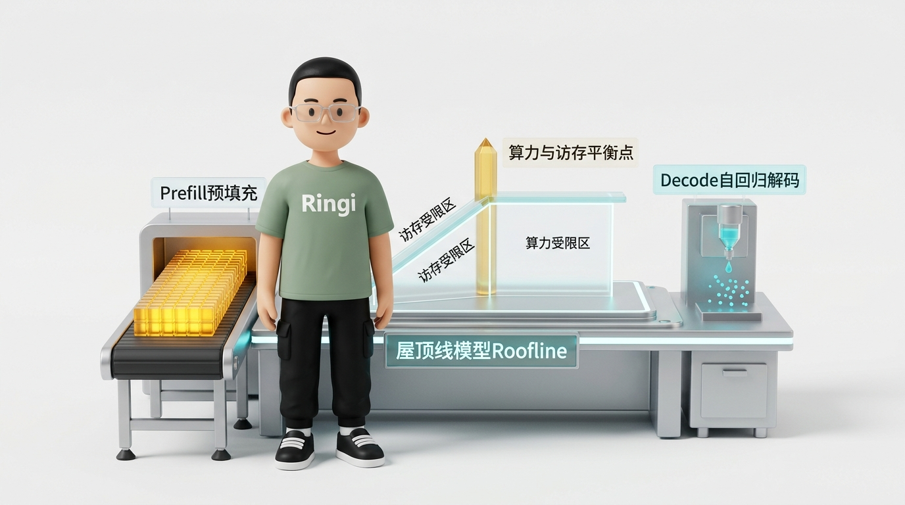
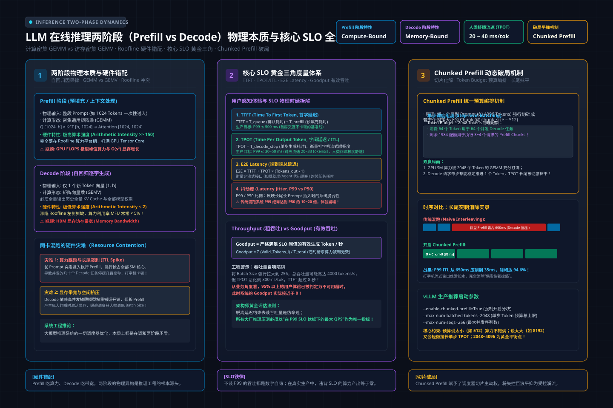
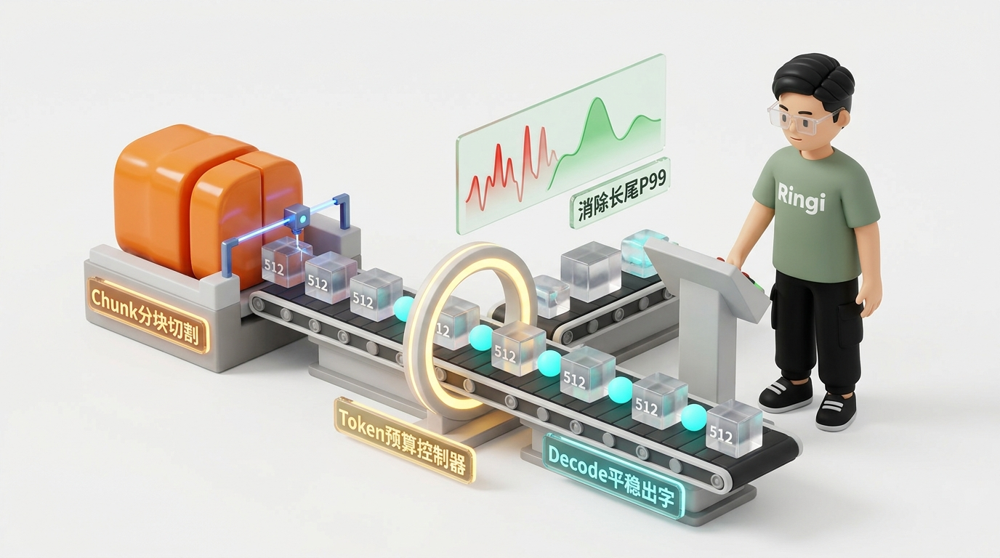
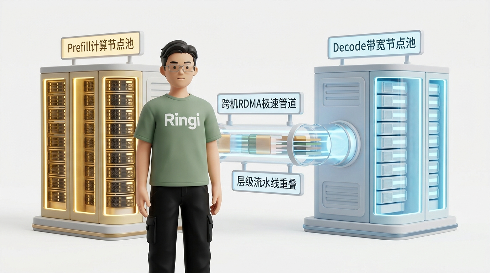

# 🏛️ 第32讲：为什么吞吐高长尾却崩了？——LLM 在线推理两阶段（Prefill vs Decode）物理特性与核心 SLO 指标体系深度剖析

> **主讲人**：👓 **Ringi**（大厂 AI Infrastructure 工程师）  
> **所属模块**：[Module 05: LLM 在线推理系统与性能工程](./README.md)  
> **篇章范式**：🚀 LLM 推理服务与高性能 Serving 篇（Inference Serving & Systems Paradigm）  
> **核心导读**：大模型训练是一场追求极限算力吞吐（TFLOPS）的攻坚战，而在线推理（Inference Serving）却是一场在严苛服务等级目标（SLO）约束下、在算力墙与访存墙之间走钢丝的精密工程。为什么把并发数拉满时总吞吐飙升，但前端用户的打字机效果却卡得痛不欲生？为什么砸了数十万元采购的高端 GPU，在生成文字时核心计算单元却大部分时间在“旷工”？本讲不罗列空洞的参数字典，而是从计算体系结构的第一性原理出发，彻底穿透 Prefill（Compute-bound）与 Decode（Memory-bound）的天然物理错配，手算显存账本与 Roofline 平衡点，解构 TTFT、TPOT、Goodput 与 P99 尾延迟的数学本质，并层层推导 Continuous Batching、Chunked Prefill 直至当下前沿 PD 解耦（Disaggregation）架构的演进必然性。



```text
========================================================================================================================
                                     Ringi 3D 架构工坊 · 在线推理两阶段与系统演进全景
========================================================================================================================

 [客户端 HTTP/gRPC 请求流] 
        │ (Prompt: 500~16K Tokens)
        ▼
 ┌────────────────────────────────────────────────────────────────────────────────────────────────────────────────────┐
 │  Inference Serving Gateway & Scheduler (vLLM / TensorRT-LLM / TGI)                                                │
 │  • Tokenizer (CPU) ──► 动态装箱调度 ──► Token Budget 预算控制器 (如 max_num_batched_tokens=2048)                   │
 └──────────────────────────────┬─────────────────────────────────────────────────────┬───────────────────────────────┘
                                │                                                     │
                                ▼                                                     ▼
 ┌─────────────────────────────────────────────────────────────┐ ┌────────────────────────────────────────────────────┐
 │ 阶段一：Prefill (预填充 / 读题阶段)                         │ │ 阶段二：Decode (自回归解码 / 答题阶段)             │
 ├─────────────────────────────────────────────────────────────┤ ├────────────────────────────────────────────────────┤
 │ • 核心物理特征：Compute-Bound (算力受限)                    │ │ • 核心物理特征：Memory-Bound (访存受限 / 显存带宽) │
 │ • 输入特征：整段 Prompt (S 个 Token 并行进网络)             │ │ • 输入特征：每步每请求仅 1 个 Token (逐字生成)     │
 │ • 计算算子：大尺度 GEMM (Q, K, V 投影与 FFN 升降维)         │ │ • 计算算子：GEMV / Batch GEMM (搬运全部权重扫一遍) │
 │ • 算术强度：Arithmetic Intensity >> 200~300 FLOP/Byte       │ │ • 算术强度：Arithmetic Intensity ≈ 1~30 FLOP/Byte  │
 │ • 硬件状态：Tensor Cores 满负荷轰鸣 (利用率 > 60%)          │ │ • 硬件状态：Tensor Cores 严重空转，HBM 带宽被打满  │
 │ • 决定业务指标：首字延迟 (TTFT - Time To First Token)       │ │ • 决定业务指标：字间延迟 (TPOT / ITL)              │
 └──────────────────────────────┬──────────────────────────────┘ └────────────────────┬───────────────────────────────┘
                                │ 产出首字与完整 Prompt KV                           ▲ 逐步追加新 Token 的 (K, V)
                                └──────────────────────────┬──────────────────────────┘
                                                           ▼
 ┌────────────────────────────────────────────────────────────────────────────────────────────────────────────────────┐
 │  KV Cache 动态内存池 (PagedAttention 虚拟分页管理)                                                                │
 │  • 单 Token 容量：2 × L × H_kv × d_head × Precision 字节 (70B GQA 模型单 Token 约 320 KB，32K Context 达 10.5 GB) │
 │  • 显存双墙对抗：容量墙 (Capacity Wall: 吞吐并发上限) vs 带宽墙 (Bandwidth Wall: Decode 单步延迟下限)               │
 └────────────────────────────────────────────────────────────────────────────────────────────────────────────────────┘
                                                           │
                                ┌──────────────────────────┴──────────────────────────┐
                                ▼                                                     ▼
 ┌─────────────────────────────────────────────────────────────┐ ┌────────────────────────────────────────────────────┐
 │  调度级化解方案：Chunked Prefill (削峰填谷)                 │ │  架构级终极解耦：PD 分离 (Prefill-Decode Disaggregation)│
 ├─────────────────────────────────────────────────────────────┤ ├────────────────────────────────────────────────────┤
 │ • 思想：将长 Prefill 强行切块 (如 Chunk=512)，掺入 Decode   │ │ • 思想：物理节点拆分，Prefill 用高算力卡，Decode 用高带宽卡│
 │ • 收益：消除长 Prefill 独占带来的 TPOT 惊魂尖刺，抹平长尾P99 │ │ • 挑战：跨机 RDMA 传输 10GB 级 KV Cache 的网络延迟与流水线 │
 └─────────────────────────────────────────────────────────────┘ └────────────────────────────────────────────────────┘
========================================================================================================================
```

<!-- more -->

## 📑 目录导航

- [0. Ringi 开场：生产真实现场与痛点冲突](#0-ringi-开场生产真实现场与痛点冲突)
  - [0.1 真实工程矛盾：为什么老板看总吞吐一片大好，前端打字机却“卡在喉咙里”？](#01-真实工程矛盾为什么老板看总吞吐一片大好前端打字机却卡在喉咙里)
  - [0.2 线上真实事故复盘：某代码大模型 Copilot 集群因 16K 长上下文导致全集群 Decode 瞬时冻结 600ms](#02-线上真实事故复盘某代码大模型-copilot-集群因-16k-长上下文导致全集群-decode-瞬时冻结-600ms)
  - [0.3 训练（Training）vs 在线推理（Inference Serving）全系统维度对照速查表](#03-训练training-vs-在线推理inference-serving全系统维度对照速查表)
- [1. 第一性原理穿透：Prefill 与 Decode 两阶段的物理本质与硬件错配](#1-第一性原理穿透prefill-与-decode-两阶段的物理本质与硬件错配)
  - [1.1 自回归接龙的单向因果律：为什么下一个 Token 必须串行等待？](#11-自回归接龙的单向因果律为什么下一个-token-必须串行等待)
  - [1.2 Prefill（预填充）阶段：高度并行的矩阵乘法（GEMM）与算力饱食](#12-prefill预填充阶段高度并行的矩阵乘法gemm与算力饱食)
  - [1.3 Decode（逐字解码）阶段：每步单 Token 的矩阵-向量乘（GEMV）与访存饥渴](#13-decode逐字解码阶段每步单-token-的矩阵-向量乘gemv与访存饥渴)
  - [1.4 两阶段计算与访存特性全景对齐表](#14-两阶段计算与访存特性全景对齐表)
- [2. Roofline 模型硬核投影：为什么砸了几十万的 GPU，Decode 时算力却在“旷工”？](#2-roofline-模型硬核投影为什么砸了几十万的-gpudecode-时算力却在旷工)
  - [2.1 算术强度（Arithmetic Intensity）的物理本质](#21-算术强度arithmetic-intensity的物理本质)
  - [2.2 公式五步穿透：GPU 硬件平衡点（Balance Point）手算推导](#22-公式五步穿透gpu-硬件平衡点balance-point手算推导)
  - [2.3 Prefill 与 Decode 在 Roofline 上的双峰对立：1024 vs 1 FLOP/Byte 的百倍鸿沟](#23-prefill-与-decode-在-roofline-上的双峰对立1024-vs-1-flopbyte-的百倍鸿沟)
  - [2.4 为什么增大 Batch Size 是拯救 Decode 算术强度的唯一稻草？](#24-为什么增大-batch-size-是拯救-decode-算术强度的唯一稻草)
- [3. KV Cache 空间换时间：显存四账本与碎片化陷阱](#3-kv-cache-空间换时间显存四账本与碎片化陷阱)
  - [3.1 为什么必须缓存？重算复杂度 $O(S^2)$ vs 缓存复杂度 $O(S)$](#31-为什么必须缓存重算复杂度-os2-vs-缓存复杂度-os)
  - [3.2 公式五步穿透：单个 Token KV Cache 显存容量精确手算](#32-公式五步穿透单个-token-kv-cache-显存容量精确手算)
  - [3.3 传统连续预分配的显存灾难：内部碎片 + 外部碎片导致有效利用率 $<40\%$](#33-传统连续预分配的显存灾难内部碎片--外部碎片导致有效利用率-40)
  - [3.4 从 MHA 到 GQA/MQA 的演进：为什么现代大模型架构几乎 100% 转向 GQA？](#34-从-mha-到-gqamqa-的演进为什么现代大模型架构几乎-100-转向-gqa)
- [4. 核心 SLO 指标体系：如何用大厂工程标准衡量一次在线推理的“好与坏”](#4-核心-slo-指标体系如何用大厂工程标准衡量一次在线推理的好与坏)
  - [4.1 延迟类指标：TTFT（首字响应）、TPOT / ITL（字间间隔）与 E2E 延迟模型](#41-延迟类指标ttft首字响应tpot--itl字间间隔与-e2e-延迟模型)
  - [4.2 吞吐类指标：系统级 Token/s、用户感知 Token/s 与 RPS 的辩证关系](#42-吞吐类指标系统级-tokens用户感知-tokens-与-rps-的辩证关系)
  - [4.3 为什么不要相信平均值？P50 / P95 / P99 尾延迟与长尾效应（Tail At Scale）](#43-为什么不要相信平均值p50--p95--p99-尾延迟与长尾效应tail-at-scale)
  - [4.4 生产终极指标：Goodput（有效吞吐）与 Pareto 最优前沿面（Pareto Frontier）](#44-生产终极指标goodput有效吞吐与-pareto-最优前沿面pareto-frontier)
- [5. 请求调度演进之路：从 Static Batching 到 Chunked Prefill 与统一 Token 预算](#5-请求调度演进之路从-static-batching-到-chunked-prefill-与统一-token-预算)
  - [5.1 静态批处理（Static Batching）的短板效应：被最长序列锁死的“木桶”](#51-静态批处理static-batching的短板效应被最长序列锁死的木桶)
  - [5.2 连续批处理（Continuous / In-Flight Batching）：请求级动态进出与迭代级组批](#52-连续批处理continuous--in-flight-batching请求级动态进出与迭代级组批)
  - [5.3 长 Prefill 对 Decode 的“降维打击”：TPOT 突刺的物理根源](#53-长-prefill-对-decode-的降维打击tpot-突刺的物理根源)
  - [5.4 Chunked Prefill（分块预填充）：把集装箱切成包裹，用小额 TTFT 牺牲换平稳 TPOT](#54-chunked-prefill分块预填充把集装箱切成包裹用小额-ttft-牺牲换平稳-tpot)
  - [5.5 vLLM V1 统一 Token 预算调度器（Unified Token Budget）：抹平阶段二分](#55-vllm-v1-统一-token-预算调度器unified-token-budget抹平阶段二分)
- [6. 架构前沿演进：PD 解耦（Prefill-Decode Disaggregation）与跨节点 KV 传输](#6-架构前沿演进pd-解耦prefill-decode-disaggregation与跨节点-kv-传输)
  - [6.1 为什么物理拆分？计算卡与带宽卡的异构选型与成本收益比](#61-为什么物理拆分计算卡与带宽卡的异构选型与成本收益比)
  - [6.2 新的物理墙：跨机 RDMA 传输百吉字节 KV Cache 的时延代价](#62-新的物理墙跨机-rdma-传输百吉字节-kv-cache-的时延代价)
  - [6.3 传输三大决策维度：Push vs Pull、Eager vs Pipelined、Full vs Incremental](#63-传输三大决策维度push-vs-pulleager-vs-pipelinedfull-vs-incremental)
  - [6.4 工业界主流架构：vLLM KV Connector V1、LMCache PD Backend 与 Mooncake](#64-工业界主流架构vllm-kv-connector-v1lmcache-pd-backend-与-mooncake)
- [7. 动手实战与代码实验室（Minimal Runnable Code）](#7-动手实战与代码实验室minimal-runnable-code)
  - [7.1 实验一：基于 Roofline 理论的 Prefill/Decode 算术强度与硬件瓶颈极简推导器](#71-实验一基于-roofline-理论的-prefilldecode-算术强度与硬件瓶颈极简推导器)
  - [7.2 实验二：离散事件驱动模拟器（DES）：Continuous Batching vs Chunked Prefill 消除 P99 TPOT 突刺全真仿真](#72-实验二离散事件驱动模拟器descontinuous-batching-vs-chunked-prefill-消除-p99-tpot-突刺全真仿真)
- [8. Ringi 避坑指南与生产黄金准则](#8-ringi-避坑指南与生产黄金准则)
  - [8.1 7 大常见小白认知误区 vs 大厂 AI Infra 正确物理认知](#81-7-大常见小白认知误区-vs-大厂-ai-infra-正确物理认知)
  - [8.2 生产在线推理服务黄金 Checklist](#82-生产在线推理服务黄金-checklist)
- [9. Ringi 5 点核心速记口诀、自我检验清单与课后深度思考题](#9-ringi-5-点核心速记口诀自我检验清单与课后深度思考题)
  - [9.1 5 点押韵核心速记口诀](#91-5-点押韵核心速记口诀)
  - [9.2 10 条白板自我检验清单](#92-10-条白板自我检验清单)
  - [9.3 3 道高阶开放式课后思考题（含极限 Corner Case）](#93-3-道高阶开放式课后思考题含极限-corner-case)
- [10. 📚 参考资料与核心源码/经典论文指引](#10--参考资料与核心源码经典论文指引)
- [附录：Appendix A — 大厂硬核高频面试题与白板推导（Interview Drill）](#附录appendix-a--大厂硬核高频面试题与白板推导interview-drill)
- [🎨 【配图工坊生图 Prompt 暂存区 · 生成配图后可一键整块删除】](#-配图工坊生图-prompt-暂存区--生成配图后可一键整块删除)

---

# 0. Ringi 开场：生产真实现场与痛点冲突

### 0.1 真实工程矛盾：为什么老板看总吞吐一片大好，前端打字机却“卡在喉咙里”？

在许多初涉大模型在线服务（LLM Serving）的团队里，经常会上演这样一幕荒诞剧：

运维监控大屏上，GPU 利用率稳定在 85%，系统每秒产出的总 Token 数（System Throughput）高达 6,000 Token/s，压测报告上的“平均延迟”只有区区 35ms/Token。CTO 看着报表频频点头，认为集群资源被利用到了极致。

然而，客服后台却早已被核心业务方的投诉塞爆：
- 销售团队在前端使用智能话术助手，经常发现打字机光标在回答到一半时突然“**窒息僵死**”整整半秒钟，随后又像子弹一样噼里啪啦吐出一大串字；
- 研发团队在使用代码补全（Copilot）时，按下快捷键后光标转圈长达 1.5 秒毫无反应，开发者早已手动敲完了代码，补全建议才慢半拍弹出来，体验形同虚设！

为什么“平均吞吐量”极高的系统，用户真实体验却如此糟糕？

答案就在于：**你用分布式训练的“大吞吐”思维去管理在线推理系统，掉进了“平均数谎言”与“吞吐-延迟零和博弈”的深坑。**

在大模型在线服务中，衡量成功的唯一标尺是 **在严格的 SLO（服务等级目标）约束下的长尾性能（P99 延迟）**。一旦长尾延迟被击穿，平均吞吐再高，也是一堆不合格的残次品。而制造这种长尾抖动的元凶，正是大模型推理底层那对不可调和的矛盾——**Prefill（预填充）与 Decode（解码）的物理特性错配**。

---

### 0.2 线上真实事故复盘：某代码大模型 Copilot 集群因 16K 长上下文导致全集群 Decode 瞬时冻结 600ms

2024 年秋，国内某头部科技大厂的内部代码辅助生成系统（基于 32B 参数的开源代码基座模型，部署在 8 台双路 8 卡 H800 GPU 服务器上）遭遇了一次严重的服务劣化危机。

该服务承接了全公司数万名工程师的 IDE 代码续写请求。平时请求的 Prompt 平均长度在 200~500 Token 之间，服务配置了当时主流的 Continuous Batching（连续批处理）引擎，单步迭代时间（Step Time）稳定在 **25ms 左右**，前端打字感极度丝滑。

**事故爆发经过**：
1. **流量异常**：上午 10:30，某位高级架构师在排查跨模块复杂调用链时，使用 IDE 插件发起了一次全工程上下文代码诊断。插件一次性打包了该工程师工程中的 14 个核心源代码文件，构建了一个高达 **16,384 Token 的超长 Prompt**；
2. **调度抢占**：网关将该请求路由至 Node-03 实例。该实例正在处理同批并发的 48 个小代码补全请求（均处于 Decode 逐字吐出阶段）；
3. **性能雪崩**：
   - 引擎调度器在下一个 Step 判定将该 16K 的长 Prompt 加入执行批次；
   - 为了完成这 16K Token 的 Prefill，GPU 上的 Tensor Cores 被迫拉满执行超大矩阵乘法，**这一单步前向传播直接耗时高达 640ms**；
   - 极其致命的是，在采用未分块的 Continuous Batching 架构下，**同处于该批次的另外 48 个请求的 Decode 步骤全部被迫停摆，在 GPU 硬件队列中同步等待整整 640ms**！
4. **连锁反应**：
   - 这 48 个请求在前端表现为长达 0.6 秒的绝对停顿，直接打破了人类感官的连贯阈值（>100ms 即感顿挫，>300ms 产生烦躁）；
   - 前端用户的 IDE 客户端因判定首字超时，自动触发了重试机制，向网关二次注入相同的长代码请求；
   - 恶性循环开启：新一轮的长 Prefill 再次霸占 GPU，Node-03 的 P99 延迟瞬间飙升至 2.8 秒，服务彻底进入雪崩状态！

```text
[监控 Trace 日志：Node-03 GPU 0 执行时间线]
Step 1024 [48 Decodes]                ---> 耗时: 24.2ms  (平稳)
Step 1025 [48 Decodes]                ---> 耗时: 25.1ms  (平稳)
Step 1026 [48 Decodes + 16K Prefill]  ---> 耗时: 641.8ms (💥 灾难！48 个 Decode 线程被劫持等待 640ms！)
Step 1027 [48 Decodes]                ---> 耗时: 24.8ms  (打字机恢复，但前端已重试)
```

**事后救火与根因破局**：
基础设施团队调出 Nsight Systems 与 vLLM Profiler 日志，当场揪出了调度器没有对 Prefill 进行配额控制的硬伤。团队连夜执行了两项关键改造：
1. **上线 Chunked Prefill（分块预填充）**：强行将任何超过 512 Token 的 Prompt 拆解成若干个固定切片，每一步仅处理一个切片并与 Decode 请求交织混部，将单步最长耗时死死锁在 35ms 以内；
2. **规划 Prefill-Decode 解耦（P/D Disaggregation）架构**：在长短文本混合的超大规模集群中，彻底把处理长 Prefill 的节点与处理 Decode 的节点在物理机器层级剥离！

改造上线后，系统在相同 16K 极端 Prompt 冲击下，P99 TPOT 波动幅度从 **+2400% 骤降至 +8%**，长尾延迟彻底平抑。

---

### 0.3 训练（Training）vs 在线推理（Inference Serving）全系统维度对照速查表

许多工程师在从分布式训练转向在线推理时，往往因技术直觉未转换而踩坑。下表从底层硬件、算子特征到系统指标，给出了全景对照：

| 比较维度 | 分布式离线训练（Training） | 在线大模型推理服务（Inference Serving） | 核心工程本质差异 |
| :--- | :--- | :--- | :--- |
| **首要优化目标** | **极致吞吐量（Throughput）**，以天/周为周期追求 GPU MFU（模型算力利用率）最大化 | **在严苛 SLO 约束下的 Goodput**，追求 P99 延迟极小化与单位成本（ $/Token）最低 | 训练是离线批处理；推理是硬实时在线交互系统 |
| **计算模式** | 前向计算（Forward）+ 反向梯度（Backward），计算图固定且高度可预测 | **Prefill（静态整段）+ Decode（动态自回归自增循环）**，每步长度未知 | 推理多出了一个单 Token 逐字自回归循环 |
| **硬件瓶颈属性** | 几乎全程为 **Compute-Bound（算力受限）**，大规模稠密矩阵乘法（GEMM）吃满 Tensor Core | **Prefill 为 Compute-Bound**；而 **Decode 为严重的 Memory-Bound（显存带宽受限）** | 相同的模型，在推理的不同阶段触发完全不同的硬件物理瓶颈 |
| **显存主要开销** | 优化器状态（Optimizer States）、梯度（Gradients）、激活值（Activations） | **KV Cache（随会话长度与并发动态膨胀）** 与 模型静态权重 | 训练显存大头在优化器；推理显存大头在 KV Cache |
| **批处理策略** | 静态固定 Batch（Static Batching），由 DataLoader 事先对齐 Pad 长度 | **连续流式批处理（Continuous / In-Flight Batching）**，请求随时加入与退出 | 推理必须解决请求到达随机性与输出长度不确定性 |
| **网络通信瓶颈** | 节点间 AllReduce / AlltoAll 通信，受制于跨机 Scale-Out 带宽（InfiniBand / RoCE） | 主要是单机内张量并行（TP）通信；在 PD 分离架构下新增跨机 KV Cache RDMA 传输 | 推理通信通常限制在单机 8 卡 NVLink 内（低延迟优先） |
| **故障容忍度** | 依靠定期写入磁盘的 Checkpoint 恢复，容忍分钟级断点重启 | **零容忍**，单次超时即用户掉线或请求熔断，要求毫秒级健康摘流 | 在线服务对慢卡、网络抖动极度敏感（长尾放大） |

---

# 1. 第一性原理穿透：Prefill 与 Decode 两阶段的物理本质与硬件错配

> 💡 **架构全景速览**：在深潜源码前，先在白板上建立坚不可摧的 LLM 推理两阶段（Prefill vs Decode）物理本质与核心 SLO 底账。
> 
> 

### 1.1 自回归接龙的单向因果律：为什么下一个 Token 必须串行等待？

目前以 LLaMA、GPT、Qwen、DeepSeek 为代表的绝大多数主流大语言模型，底层均为基于因果掩码（Causal Mask）的 **Decoder-only 架构**。

所谓“自回归（Autoregressive）”，在数学上表达为一种**单向因果联合概率分解**：

$$
P(x_1, x_2, \dots, x_T) = \prod_{t=1}^T P(x_t \mid x_1, x_2, \dots, x_{t-1})
$$

在物理时间轴上，这意味着一个铁律：
> **第 $t$ 个 Token 的生成，必须以前面所有的 $t-1$ 个历史 Token 作为上下文输入；没有计算出第 $t$ 个 Token，整个世界没有任何人能知道第 $t+1$ 个 Token 的输入向量是什么！**

这一不可打破的单向数据依赖，直接将大模型在线推理在时间维度上强行切分为两个截然不同的阶段：
1. **Prefill 阶段（预填充 / 上下文理解）**：用户把整段 Prompt（例如 500 个 Token）发送过来。因为这 500 个 Token 在一开始就已经确定，模型可以**一次性、完全并行地**把这 500 个向量送进 Transformer 的数十层网络中做前向传播，一口气算出所有隐层状态并吐出第一个输出 Token；
2. **Decode 阶段（逐字生成 / 解码）**：从第二个 Token 开始，系统陷入了串行死循环——把刚才生成的第 501 个 Token 作为输入，过一遍模型得到第 502 个；再把第 502 个作为输入，过一遍模型得到第 503 个……直到生成终止符（EOS）或达到最大输出长度。如果一个请求要输出 200 个字，就必须在物理硬件上**完完整整地将整套神经网络连续执行 200 次**！

```mermaid
graph TD
    subgraph Prefill阶段["1. Prefill 阶段 (并行读题 · Compute-Bound)"]
        A["输入 Prompt: [x1, x2, ..., x500]"] -->|一次性并行输入| B["Transformer 层级并行计算"]
        B -->|产出第 1 个输出字| C["生成 Token: y1"]
        B -.->|一次性写入 500 个历史 KV| D[("KV Cache 存储池")]
    end

    subgraph Decode阶段["2. Decode 阶段 (串行答题 · Memory-Bound)"]
        C -->|仅输入 1 个 Token: y1| E["Decode Step 1"]
        D -.->|读全量历史 KV (500)| E
        E -->|产出| F["生成 Token: y2"]
        E -.->|追加写入 y1 的 KV| D

        F -->|仅输入 1 个 Token: y2| G["Decode Step 2"]
        D -.->|读全量历史 KV (501)| G
        G -->|产出| H["生成 Token: y3 ... 循环直至 EOS"]
        G -.->|追加写入 y2 的 KV| D
    end
```

---

### 1.2 Prefill（预填充）阶段：高度并行的矩阵乘法（GEMM）与算力饱食

在 Prefill 阶段，输入 Tensor 的形状为：

$$
\mathbf{X}_{\text{prefill}} \in \mathbb{R}^{B \times S \times d_{\text{model}}}
$$

其中 $B$ 为 Batch Size（通常为 1 到数十）， $S$ 为输入 Prompt 序列长度（数十到数万不等）， $d_{\text{model}}$ 为模型隐层维度（如 LLaMA-3 70B 为 8192）。

此时，模型内部的核心计算是**通用稠密矩阵乘法（GEMM - General Matrix Multiply）**：
- **Q, K, V 投影**：将形状为 $(B \times S, d_{\text{model}})$ 的激活矩阵与形状为 $(d_{\text{model}}, 3 \times d_{\text{model}})$ 的模型静态权重矩阵相乘；
- **MLP / SwiGLU 升降维**：将形状为 $(B \times S, d_{\text{model}})$ 的激活矩阵与形状为 $(d_{\text{model}}, d_{\text{ffn}})$ 的 Gate/Up 权重矩阵相乘；
- **Self-Attention 矩阵乘**： $Q \times K^T$ 产生 $(B, H, S, S)$ 的注意力得分矩阵。

**硬件层面的物理映射**：
因为 $M = B \times S$ 通常较大（例如 $1 \times 2048 = 2048$ ），矩阵乘法的维度是 $[2048 \times 8192] \times [8192 \times 8192]$。
- **权重搬运一次，计算成千上万次**：GPU 从高带宽显存（HBM）中读取一次权重矩阵（几百兆字节），放入片上高速缓存（SRAM / Shared Memory），可以让这 2048 个 Token 并行复用！
- **Tensor Cores 极度饱食**：NVIDIA GPU（如 Hopper 架构）的 Tensor Core 阵列被完全喂饱，计算单元运转如飞，硬件利用率（MFU）通常可以达到 **50% ~ 65%**；
- **物理归宿**：Prefill 是不折不扣的 **Compute-Bound（算力受限型）** 任务。限制其运行时间的最核心瓶颈，是 GPU 的峰值浮点算力（TFLOPS）。

---

### 1.3 Decode（逐字解码）阶段：每步单 Token 的矩阵-向量乘（GEMV）与访存饥渴

进入 Decode 阶段后，整个物理世界彻底反转。

在 Decode 的每一个独立 Step 中，对于某一个特定的请求，输入的 Tensor 形状缩水为：

$$
\mathbf{X}_{\text{decode}} \in \mathbb{R}^{B \times 1 \times d_{\text{model}}}
$$

注意中间那个刺眼的数字：**$S = 1$**！每一个正在生成的请求，在这一步仅仅贡献了 **1 个 Token**！

此时，原本威风凛凛的矩阵乘法（GEMM）退化成了**矩阵-向量乘法（GEMV - General Matrix-Vector Multiply）**：
- 输入向量的维度是 $[B \times 1, d_{\text{model}}]$；
- 权重矩阵的维度依然是庞大的 $[d_{\text{model}}, d_{\text{model}}]$ 或 $[d_{\text{model}}, d_{\text{ffn}}]$。

**硬件层面的残酷现实**：
假定并发数很小（例如 $B=1$ ）：
1. GPU 为了计算这区区 **1 个 Token** 的前向传播，必须从显存（HBM）中把整个大模型**数十吉字节（GB）的静态权重完整读取一遍**到片上缓存！
2. 每一个权重参数（2 字节）被辛苦地从 HBM 经过几毫米长的硅中介层搬运到 SM（流式多处理器）中，仅仅与这 1 个 Token 的输入分量做了一次乘加操作（2 FLOPs），随即就被丢弃！
3. **计算单元的大规模空转**：Tensor Cores 拥有每秒吞吐数百甚至上千太次（Tera-FLOPs）浮点数的恐怖胃口，但 HBM 的供水管道（显存带宽）每秒最多只能泵出几太字节（TB/s）的数据。计算单元就像一台吞吐量惊人的工业粉碎机，上游却只拿一根极细的吸管一滴一滴地给它喂料。
4. **物理归宿**：单请求或小批量的 Decode 是绝对的 **Memory-Bound（访存受限 / 显存带宽受限型）** 任务。此时 GPU 算力利用率理论上**甚至不足 1%**！限制其运行时间的根本不是算力有多强，而是显存带宽有多宽。

---

### 1.4 两阶段计算与访存特性全景对齐表

| 特征维度 | Prefill 阶段（预填充） | Decode 阶段（自回归逐字解码） | 体系结构根因与工程映射 |
| :--- | :--- | :--- | :--- |
| **执行时序与次数** | 请求到达后仅执行 **1 次** | 随生成序列长度串行循环执行 **$S_{\text{out}} - 1$ 次** | Decode 构成了端到端时间的大头 |
| **单步 Token 吞吐形态** | 整段 Prompt（ $S_{\text{in}} \in [\text{几十}, \text{数万}]$ ）一次性输入 | 每步每个请求仅输入 **1 个 Token** | 一个是批处理吞吐模式，一个是逐点迭代模式 |
| **底层代数算子形态** | **GEMM（矩阵 × 矩阵）**，高维度密集阵列乘 | **GEMV（矩阵 × 向量）** 或 小 Batch GEMM | 代数运算维度直接决定了片上数据复用度（Data Reuse） |
| **片上数据复用率** | **极高**（同一个权重参数被 $S_{\text{in}}$ 个 Token 共享） | **极低**（单个权重参数仅被 $B$ 个 Token 共享，若 $B=1$ 则无复用） | 片上 SRAM 无法对跨 Step 的权重做长时间缓存 |
| **算术强度（AI）** | 极高（通常在 $200 \sim 2000\text{ FLOP/Byte}$ ） | 极低（小 Batch 下仅为 $1 \sim 20\text{ FLOP/Byte}$ ） | 算术强度彻底跨越了 GPU Roofline 拐点两侧 |
| **硬件物理瓶颈** | **Compute-Bound（受限于 FP16/BF16/FP8 Tensor Core 算力）** | **Memory-Bound（受限于 HBM 显存物理读写带宽）** | 决定了后续优化是该“降计算”还是“压缩搬运量” |
| **核心决定业务指标** | **首字延迟（TTFT - Time To First Token）** | **字间延迟（TPOT / ITL）** 与 用户端打字感 | 架构调优必须对这两个指标进行解耦权衡 |
| **最有效的优化杠杆** | FlashAttention、算子融合（Kernel Fusion）、Chunked Prefill | **Continuous Batching、KV Cache 压缩/量化（FP8/INT4）、投机采样** | 对症下药：Prefill 需优化调度与并发，Decode 需拼命提 Batch 与减带宽 |

---

# 2. Roofline 模型硬核投影：为什么砸了几十万的 GPU，Decode 时算力却在“旷工”？

### 2.1 算术强度（Arithmetic Intensity）的物理本质

要定量解释为什么 Decode 阶段算力被极度闲置，必须引入计算机体系结构中最经典的分析工具——**Roofline 模型（屋顶线模型）**。

Roofline 模型建立在两个最基础的物理现实之上：
1. **处理器算力上限（Peak Compute Performance, $P_{\text{peak}}$ ）**：单位为 $\text{TFLOPS}$（每秒万亿次浮点运算）；
2. **显存物理带宽上限（Peak Memory Bandwidth, $B_{\text{peak}}$ ）**：单位为 $\text{TB/s}$（每秒万亿字节数据搬运）。

连接计算与搬运两个维度的桥梁，叫做 **算术强度（Arithmetic Intensity, $I$ ）**：

$$
I = \frac{\text{任务总浮点运算量 (FLOPs)}}{\text{从底层显存搬运的总数据量 (Bytes)}} \quad \left[\frac{\text{FLOP}}{\text{Byte}}\right]
$$

直白地说：**算术强度代表每从显存里费劲搬运出 1 个字节的数据，能顺带在片上完成多少次浮点加法或乘法操作。**
- 如果 $I$ 极高：意味着数据搬上芯片后被反复复用计算了上千次，此时访存时间可以被繁重的计算完全掩盖，GPU 达到性能天花板 $P_{\text{peak}}$，称为 **算力受限（Compute-Bound）**；
- 如果 $I$ 极低：意味着计算单元做几次运算就没数据了，只能停下来干等下一批数据从 HBM 爬过来，此时哪怕给它一万个 Tensor Core 也无济于事，性能受制于斜坡天花板 $I \times B_{\text{peak}}$，称为 **访存受限（Memory-Bound）**。

---

### 2.2 公式五步穿透：GPU 硬件平衡点（Balance Point）手算推导

#### ① Why（为什么需要算它？）
在采购 GPU 或设计推理引擎前，必须知道一个硬指标：**一个算子的算术强度必须达到多大，才能刚好把这块 GPU 的算力和带宽同时喂满？** 这个分界点被称为 **硬件平衡点（Machine Balance Point）**，它是划定 Memory-Bound 与 Compute-Bound 的绝对物理楚河汉界。

#### ② Mental Model（物理直觉比喻）
想象一个吃汉堡比赛：
- 选手的咀嚼速度是每秒 1,000 口（算力）；
- 服务员端盘子的速度是每秒 2 盘汉堡（带宽）；
- 如果每盘汉堡只有 10 口肉（算术强度低），选手嚼 0.01 秒就得眼巴巴等盘子送来（访存瓶颈）；
- 只有当每盘汉堡至少堆满 500 口肉时，选手才能一刻不停地咀嚼，服务员也刚好端得过来（达到平衡点）。

#### ③ Tiny Calculator（极简数字手算）
以目前大厂推理集群最主流的 **NVIDIA H100 SXM (80GB HBM3)** 为例：
- **稠密半精度（BF16/FP16）Tensor Core 算力**： $P_{\text{peak}} \approx 989\text{ TFLOPS} = 989 \times 10^{12}\text{ FLOP/s}$（注：官方宣传的 1979 TFLOPS 包含了 2:4 结构化稀疏，工业稠密基准按非稀疏计算）；
- **HBM3 显存实测理论峰值带宽**： $B_{\text{peak}} \approx 3.35\text{ TB/s} = 3.35 \times 10^{12}\text{ Byte/s}$。

带入手算：

$$
I_{\text{balance}}^{\text{H100}} = \frac{989 \times 10^{12}}{3.35 \times 10^{12}} \approx \mathbf{295.2\text{ FLOP/Byte}}
$$

再算一个老当益壮的 **NVIDIA A100 SXM (80GB HBM2e)**：
- BF16 Tensor Core 算力： $P_{\text{peak}} = 312\text{ TFLOPS}$；
- HBM2e 显存带宽： $B_{\text{peak}} \approx 2.039\text{ TB/s}$。

$$
I_{\text{balance}}^{\text{A100}} = \frac{312 \times 10^{12}}{2.039 \times 10^{12}} \approx \mathbf{153.0\text{ FLOP/Byte}}
$$

#### ④ Formal Model（标准公式与 GPU 算子/内存映射）
对于任意加速硬件与精度格式，硬件平衡点定义为：

$$
I_{\text{balance}} = \frac{P_{\text{peak}}(\text{Precision})}{B_{\text{peak}}(\text{Device})} \quad \left[\frac{\text{FLOP}}{\text{Byte}}\right]
$$

在 Roofline 双对数坐标系中，系统的实际执行算力 $P$ 严格服从：

$$
P(I) = \min\left(P_{\text{peak}}, \; I \times B_{\text{peak}}\right)
$$

```text
实际算力 P (TFLOPS)
  ^
  |                          Compute-Bound 区 (算力打满: P = P_peak)
  |                  ───────────────────────────────────────────── (P_peak = 989 TFLOPS)
  |                 /  ▲
  |                /   │
  |               /    │ Prefill 阶段 (I = 1024, 处于水平屋顶线)
  |              /     │
  |             / 
  |            / 
  |           / 
  |          / 
  |         /  平衡点 (H100: 295 FLOP/Byte)
  |        /  
  |       / 
  |      /  Memory-Bound 区 (访存受限斜坡: P = I * B_peak)
  |     /
  |    / ▲
  |   /  │ Decode 阶段 (B=1 时 I = 1 FLOP/Byte! 实际算力只有 3.35 TFLOPS, 利用率 0.3%!)
  |  /   │
  +------------------------------------------------------------> 算术强度 I (FLOP/Byte)
    1    10   50   100  200  295  500  1000
```

#### ⑤ Sanity Check（数量级校验）
记住这个核心基准：**在 H100 上，一个算子必须达到约 300 FLOP/Byte 的算术强度，才能碰触到算力天花板；在 A100 上，这个门槛是 150 FLOP/Byte。** 低于这个数值，算子无论怎么写，注定在斜坡上爬行。

---

### 2.3 Prefill 与 Decode 在 Roofline 上的双峰对立：1024 vs 1 FLOP/Byte 的百倍鸿沟

现在，让我们把大模型前向传播的数学计算代入算术强度公式。

考虑一个参数量为 $W$（以参数个数计）的模型，采用半精度（FP16/BF16，每个参数占 2 字节，模型总权重字节数为 $2W$ ）。

#### 案例 A：单请求 Decode 阶段（ $B=1, S=1$ ）
- **计算量（FLOPs）**：根据 Transformer 的前向计算公式，每个参数对 1 个输入 Token 贡献一次乘法和一次加法（1 MAC = 2 FLOPs），因此总计算量为：

  $$
  \text{FLOPs} = 2 \times W \times 1 = 2W\text{ FLOPs}
  $$

- **访存量（Bytes）**：必须把模型的所有权重从 HBM 加载到 SRAM 一次（忽略极小的单 Token KV Cache），数据量为：

  $$
  \text{Bytes} = 2W\text{ Bytes}
  $$

- **单请求 Decode 算术强度**：

  $$
  I_{\text{decode}}(B=1) = \frac{2W\text{ FLOPs}}{2W\text{ Bytes}} = \mathbf{1.0\text{ FLOP/Byte}} \quad \text{！！！}
  $$

**惊天结论**：
在 $B=1$ 时，大模型 Decode 的算术强度**仅仅是 1 FLOP/Byte**！
而 H100 的平衡点是 **295 FLOP/Byte**！
这意味着什么？
在 H100 上跑单请求 Decode，实际能达到的算力为：

$$
P = 1.0\text{ FLOP/Byte} \times 3.35\text{ TB/s} = \mathbf{3.35\text{ TFLOPS}}
$$

它在 H100 额定的 989 TFLOPS 稠密算力面前，利用率只有：

$$
\text{MFU} = \frac{3.35}{989} \approx \mathbf{0.34\%} \quad \text{（百分之零点三四！）}
$$

**硬件上超过 99.6% 的计算晶体管在彻底闲置！**

#### 案例 B：Prefill 阶段（ $B=1, S=1024$ ）
- **计算量**： $S=1024$ 个 Token 同时进网络，每个参数被 1024 个 Token 共同复用：

  $$
  \text{FLOPs} = 2 \times W \times 1024 = 2048W\text{ FLOPs}
  $$

- **访存量**：静态权重依然只从 HBM 读取一次，数据量为 $2W\text{ Bytes}$（暂时忽略 Attention 激活值）：
- **Prefill 算术强度**：

  $$
  I_{\text{prefill}} = \frac{2048W}{2W} = \mathbf{1024\text{ FLOP/Byte}}
  $$

因为 $1024 \gg 295$，Prefill 远远落在了水平的 Compute-Bound 区域！H100 的 Tensor Core 能够全速满血轰鸣。

这就是大模型在线推理系统中**最深刻、最无法回避的硬件双峰对立**。

---

### 2.4 为什么增大 Batch Size 是拯救 Decode 算术强度的唯一稻草？

既然 Decode 卡在 1 FLOP/Byte 的深渊里，怎么救？

审视 Decode 的算术强度公式：如果我们把并发请求打包成一个大小为 $B$ 的 Batch，输入维度变为 $[B, 1, d_{\text{model}}]$：
- **计算量**： $B$ 个 Token 同时计算，总运算量线性增加为：

  $$
  \text{FLOPs} = 2 \times W \times B
  $$

- **权重访存量**：妙处正在于此——**这 $B$ 个 Token 共享相同的模型权重！** 模型权重依然只需要从 HBM 读取一次，权重搬运量仍为 $2W\text{ Bytes}$（假设忽略随 $B$ 增长的 KV Cache 访存）：
- **组批后的算术强度**：

  $$
  I_{\text{decode}}(B) \approx \frac{2 \times W \times B}{2W} = \mathbf{B\text{ FLOP/Byte}}
  $$

**这一推导揭示了为什么整个大模型推理工程都在拼了命做 Batching：**
- 当 $B=1$ 时， $I = 1\text{ FLOP/Byte}$，利用率 0.3%；
- 当 $B=32$ 时， $I = 32\text{ FLOP/Byte}$，利用率攀升到约 10%；
- 当 $B=128$ 时， $I = 128\text{ FLOP/Byte}$，利用率攀升到约 43%；
- 当 $B \ge 300$ 时， $I \ge 300\text{ FLOP/Byte}$，Decode 终于第一次跨过平衡点，把 H100 的算力彻底吃满！

> 💡 **Ringi 工程师大实话**：
> “把 Batch Size 搞大，单位 Token 的边际显存搬运成本就会被平摊。权重只搬一次，服务 100 个用户，吞吐量就能暴增 100 倍，而每一步的硬件执行耗时几乎没变！**这就是 Continuous Batching 能够在降低单位 Token 算力成本上封神的物理根基。**”

---

# 3. KV Cache 空间换时间：显存四账本与碎片化陷阱

### 3.1 为什么必须缓存？重算复杂度 $O(S^2)$ vs 缓存复杂度 $O(S)$

在前面的讨论中，我们留下了一个关键疑问：既然自回归每一步只需要当前这 1 个 Token 的输出，为什么注意力机制（Attention）会拖累整个系统？

回顾 Attention 的经典计算范式：

$$
\text{Attention}(Q, K, V) = \text{softmax}\left(\frac{Q K^T}{\sqrt{d_k}}\right) V
$$

在 Decode 的第 $t$ 步：
- 当前输入的仅仅是第 $t$ 个 Token，它通过线性投影产生当前的查询向量 $q_t \in \mathbb{R}^{1 \times d_k}$；
- 但是，为了计算第 $t$ 个位置的自注意力，**$q_t$ 必须与前序所有 $t$ 个 Token 的键向量矩阵 $K_{1:t} \in \mathbb{R}^{t \times d_k}$ 做内积，并与值向量矩阵 $V_{1:t} \in \mathbb{R}^{t \times d_k}$ 做加权求和！**

**如果不做 KV Cache（无缓存方案）**：
- 生成第 1 个 Token 时，计算长度为 1 的 Attention；
- 生成第 2 个 Token 时，重新把第 1、2 个 Token 走一遍模型算 $K_1, K_2, V_1, V_2$；
- 生成第 $S$ 个 Token 时，必须把前 $S-1$ 个历史 Token 全量重算一遍；
- 总浮点运算量关于序列长度呈现悲惨的二次方爆炸：

  $$
  \sum_{t=1}^S \mathcal{O}(t) = \mathcal{O}(S^2)
  $$

**做 KV Cache（空间换时间）**：
- 在第 1 步（Prefill）算完后，把所有 Prompt Token 的 $K$ 和 $V$ 矩阵保存在显存中；
- 随后每走一步 Decode，**只计算当前这 1 个新 Token 的 $q_t, k_t, v_t$**；
- 把新算出的 $k_t, v_t$ 追加写入缓存；
- $q_t$ 直接与显存里的全量历史 $K_{1:t}, V_{1:t}$ 做点乘（此时只需一次矩阵-向量乘法）；
- 每步计算量从 $O(t)$ 降为 $O(1)$，全流程计算量降至线性：

  $$
  \sum_{t=1}^S \mathcal{O}(1) = \mathcal{O}(S)
  $$

代价是什么？**代价是显存必须像蓄水池一样，永远为所有并发请求保留不断变长的历史 $K$ 和 $V$ 张量！**

---

### 3.2 公式五步穿透：单个 Token KV Cache 显存容量精确手算

#### ① Why（为什么需要算它？）
在大模型上线容量规划中，GPU 显存被分成两大块：**静态权重** 和 **动态运行时显存**。而动态显存的 90% 以上被 KV Cache 霸占。如果算不准单 Token 的 KV Cache 开销，就无法估算集群能承载的最大并发数，线上分分钟触发 CUDA Out of Memory (OOM) 崩溃。

#### ② Mental Model（物理直觉比喻）
把 Transformer 模型想象成一座 80 层高的摩天大楼（80 层 Transformer Layer）。
每一层都有专门的接待前台，配置了若干个账本盒子（KV Heads）。
每进来一个客人（1 个 Token），每一层的每个账本盒子里都必须为他塞进两张卡片（一张写他的 Key 特征，一张写他的 Value 特征）。层数越多、盒子越多、卡片越厚，整栋楼被塞满的速度就越快。

#### ③ Tiny Calculator（极简数字手算）
我们手算业界两款最标杆开源模型的单 Token 账本：

**案例 1：LLaMA-3 8B (采用 GQA，8 对 KV Heads)**
- 层数 $L = 32$；
- KV 头数 $H_{\text{kv}} = 8$（注意：Query 头数是 32，但因为是 GQA，KV 头只有 8 个！）；
- 头的维度 $d_{\text{head}} = 128$；
- 存储精度：半精度 FP16 / BF16，每个元素占 2 字节（ $\text{Precision} = 2$ ）；
- 乘数 2：分别存储 Key 和 Value。

带入小算盘：

$$
\begin{aligned}
\text{Bytes}_{\text{token}}^{\text{8B}} &= 2 \times L \times H_{\text{kv}} \times d_{\text{head}} \times \text{Precision} \\
&= 2 \times 32 \times 8 \times 128 \times 2 \\
&= 131,072\text{ Bytes} = \mathbf{128\text{ KB/Token}}
\end{aligned}
$$

**案例 2：LLaMA-3 70B (采用 GQA，8 对 KV Heads)**
- 层数 $L = 80$；
- KV 头数 $H_{\text{kv}} = 8$；
- 头的维度 $d_{\text{head}} = 128$；
- 存储精度：FP16（2 字节）。

$$
\begin{aligned}
\text{Bytes}_{\text{token}}^{\text{70B}} &= 2 \times 80 \times 8 \times 128 \times 2 \\
&= 327,680\text{ Bytes} = \mathbf{320\text{ KB/Token}}
\end{aligned}
$$

#### ④ Formal Model（标准公式）
对于任意 Transformer 模型，单个 Token 在全局 KV Cache 中占据的字节数为：

$$
\text{KV}_{\text{token}} = 2 \times L \times H_{\text{kv}} \times d_{\text{head}} \times P_{\text{bytes}}
$$

对于一个并发数为 $B$、平均上下文长度为 $S$ 的在线服务，KV Cache 消耗的显存物理总量为：

$$
\text{Memory}_{\text{KV-total}} = B \times S \times \text{KV}_{\text{token}} \quad (\text{Bytes})
$$

#### ⑤ Sanity Check（数量级校验与震惊时刻）
以 LLaMA-3 70B 为例：
- 单个 Token 占用 $320\text{ KB}$；
- **长文本场景（32K 上下文）**：

  $$
  \text{单请求 KV Cache} = 32,768 \times 320\text{ KB} \approx \mathbf{10.48\text{ GB}} \quad \text{！！！}
  $$

  仅仅这一个长文本会话，光是它的 KV 历史就要吃掉一张 A100 80GB 卡上超过八分之一的显存！
- **并发场景（并发数 $B=64$，平均长度 4K）**：

  $$
  \text{总 KV Cache} = 64 \times 4096 \times 320\text{ KB} \approx \mathbf{83.88\text{ GB}}
  $$

  整整需要一张额外的 80GB GPU 才能装得下这些缓存！

---

### 3.3 传统连续预分配的显存灾难：内部碎片 + 外部碎片导致有效利用率 $<40\%$

在 vLLM 问世之前，主流的推理框架（包括早期的 HuggingFace Accelerate、FasterTransformer 等）在显存管理上都采取了原始的“**连续张量预分配策略**”。

因为 PyTorch 原生算子要求张量在物理内存中必须是连续地址，而系统在请求到达那一刻，**根本不可能预知这个用户到底会输出多少个字**（可能只回答一个“好”字，也可能滔滔不绝写一篇论文）。

传统的做法只能按最大可能长度（如 $S_{\text{max}} = 2048$ ）为每个请求预留一块连续的显存空间。这就引发了极其恐怖的**内存碎片黑洞**：

```text
传统连续内存分配黑洞 (显存有效利用率 < 40%):
┌────────────────────────────────────────────────────────────────────────────────────────┐
│  Request 1 (预分配 2048 Slots)                                                         │
│  [■■■ 实际生成 120 Tokens ■■■][□□□□□□□□□□ 内部碎片: 1928 Slots 闲置空占 □□□□□□□□□□□] │
├────────────────────────────────────────────────────────────────────────────────────────┤
│  Request 2 (预分配 2048 Slots)                                                         │
│  [■■■■■ 实际生成 450 Tokens ■■■■■][□□□□□ 内部碎片: 1598 Slots 闲置空占 □□□□□]         │
├────────────────────────────────────────────────────────────────────────────────────────┤
│  [外部碎片: 夹在已分配块之间的散碎空间，因物理不连续无法被新请求申请]                   │
└────────────────────────────────────────────────────────────────────────────────────────┘
```

1. **内部碎片（Internal Fragmentation）**：请求实际只生成了 100 个 Token 就遇到了 EOS，但系统为它保留的 1948 个 Token 显存空间直到请求完全释放前都无法被他人使用；
2. **预留碎片（Reservation Waste）**：正在生成的请求其 KV Cache 是随时间递增的，但在最初时刻必须把未来的空间全部占住；
3. **外部碎片（External Fragmentation）**：内存频繁申请与释放后，显存中散落着大量小碎片，无法拼凑成一个满足新请求 $S_{\text{max}}$ 的连续大块。

在大厂实测数据中，传统静态分配下的显存有效利用率往往**惨不忍睹地低于 35% ~ 40%**，显存被大面积白白浪费，直接将服务的并发吞吐量死死压制在地面。这也是为什么伯克利团队提出 **PagedAttention** 后瞬间引爆整个大模型系统领域——它从根本上效仿了现代操作系统的虚拟内存分页机制，将 KV Cache 拆成细粒度的物理块（Block，如 16 或 32 个 Token），彻底将显存利用率拉升至 **96% 以上**！

---

### 3.4 从 MHA 到 GQA/MQA 的演进：为什么现代大模型架构几乎 100% 转向 GQA？

仔细审视单 Token KV Cache 计算公式：

$$
\text{KV}_{\text{token}} = 2 \times L \times \mathbf{H_{\text{kv}}} \times d_{\text{head}} \times \text{Precision}
$$

在这几个参数中：
- 层数 $L$ 与隐层维度 $d_{\text{model}} = H \times d_{\text{head}}$ 直接决定了模型容量，不能轻易缩减；
- 数据精度 $\text{Precision}$ 压缩到 FP8 已经是当下极限；
- **唯一的线性缩减暴击点，就是 $H_{\text{kv}}$（KV 头的数量）！**

在最经典的 **MHA（Multi-Head Attention，多头注意力）** 架构中（如原始 Transformer、GPT-3）：
- Query、Key、Value 的头数完全一致： $H_{\text{q}} = H_{\text{kv}} = H$；
- 每一个 Query 都有自己专属的一对 Key/Value 头。

**MQA（Multi-Query Attention）的激进压缩**（2019 年 Shazeer 提出）：
- 让所有的 Query 头（如 32 个）**全量共享仅仅 1 组 Key/Value 头**（ $H_{\text{kv}} = 1$ ）；
- 显存暴降：KV Cache 体积直接断崖式缩减为 MHA 的 **$\frac{1}{H}$（如 $\frac{1}{32}$，缩减 97%）**！
- 代价：注意力表达能力受到明显损伤，在某些复杂关联推理任务上泛化能力下降。

**GQA（Grouped-Query Attention）的黄金折中**（2023 年 LLaMA-2/3、Qwen、Mistral 普遍采纳）：
- 将 $H_{\text{q}}$ 个查询头分成 $G$ 组（例如 32 个 Query 头分成 8 组，每组 4 个 Query 头）；
- 每一组共享 1 对 Key/Value 头（ $H_{\text{kv}} = 8$ ）；
- 显存收益：KV Cache 直接缩减为 MHA 的 **$\frac{8}{32} = \frac{1}{4}$（节省 75% 显存）**！
- 精度表现：大厂实验证明，GQA 在几乎完全保持 MHA 语言理解与复杂推理能力的同时，让在线推理系统的最大并发度直接翻了 4 倍！

```text
MHA vs GQA vs MQA 头结构拓扑对比:

[1. MHA (标准多头: 8Q 对 8KV, 显存 100%)]
 Q1 Q2 Q3 Q4 Q5 Q6 Q7 Q8
  │  │  │  │  │  │  │  │
 K1 K2 K3 K4 K5 K6 K7 K8  (1 对 1 映射, 显存开销最重)

[2. GQA (分组查询: 8Q 对 2KV, 显存降至 25% · 现代工业标准)]
 Q1 Q2 Q3 Q4    Q5 Q6 Q7 Q8
  └──┬──┘        └──┬──┘
     K1             K2     (每组 4 个 Q 共享 1 个 KV 头, 表达力与显存的黄金平衡)

[3. MQA (多查询: 8Q 对 1KV, 显存降至 12.5%)]
 Q1 Q2 Q3 Q4 Q5 Q6 Q7 Q8
  └────────┬───────────┘
           K1              (全模型全层 Q 共享唯独 1 个 KV 头, 显存极度轻量但精度受损)
```

---

# 4. 核心 SLO 指标体系：如何用大厂工程标准衡量一次在线推理的“好与坏”

### 4.1 延迟类指标：TTFT（首字响应）、TPOT / ITL（字间间隔）与 E2E 延迟模型

衡量大模型服务的性能，“Latency（延迟）”不再是一个单一的标量，而是一个多维时序指标族。

```text
大模型在线推理请求生命周期时间线:

用户点击发送                                             首个 Token 渲染到屏幕                  生成完毕 (EOS)
    │                                                            │                                    │
    ▼                                                            ▼                                    ▼
────┼─────────────────────────┬──────────────────────────────────┼─────────┬─────────┬─────────┬──────┼────► 时间 (t)
    │     网络排队 + 调度等待   │          Prefill 前向计算        │ Decode 1│ Decode 2│ Decode 3│ ...  │
    │                        │                                  │         │         │         │      │
    └────────────────────────┴──────────────────────────────────┘
                 首字延迟 (TTFT - Time To First Token)               └─────────┴─────────┴─────────┘
                                                                        字间延迟 (TPOT / ITL) 循环累加
    └────────────────────────────────────────────────────────────────────────────────────────────────┘
                                    端到端总延迟 (E2E Latency)
```

#### 1. TTFT（Time To First Token，首字延迟）
- **定义**：从客户端发送 HTTP/gRPC 请求开始，到客户端接收并渲染出**第一个生成的 Token** 的完整耗时；
- **物理构成**：

  $$
  \text{TTFT} = T_{\text{network-in}} + T_{\text{queue}} + T_{\text{tokenize}} + T_{\text{prefill}} + T_{\text{network-out}}
  $$

- **核心主导项**：在服务端高负载排队时受 $T_{\text{queue}}$ 主导；在平稳运行时受 $T_{\text{prefill}}$ 主导；
- **用户心智阈值**：人机交互黄金定律规定，TTFT 超过 **1.0 秒** 用户便开始感知迟钝，超过 **2.0 秒** 会引发用户二次刷新或放弃任务。

#### 2. TPOT（Time Per Output Token，每输出字延迟）/ ITL（Inter-Token Latency，字间延迟）
- **定义**：在进入自回归流式输出后，相邻两个 Token 之间的平均吐字时间间隔；
- **业界标准计量（NVIDIA GenAI-Perf 口径）**：

  $$
  \text{TPOT} = \text{ITL} = \frac{\text{E2E Latency} - \text{TTFT}}{S_{\text{out}} - 1}
  $$

- **用户心智阈值**：
  - 人类的正常默读速度约为每秒 5~10 个汉字/单词（对应 TPOT 为 $100 \sim 200\text{ ms}$ ）；
  - 极佳的打字机视觉流速应维持在每秒 20~40 个 Token，即 **$\text{TPOT} \le 25 \sim 50\text{ ms}$**；
  - 一旦 TPOT 恶化到超过 **$100\text{ ms}$**（即出字速度低于 10 字/秒），人眼就能明显察觉到字符蹦出时的“阻滞感”。

#### 3. E2E Latency（端到端总延迟）
- **数学建模**：

  $$
  \text{Latency}_{\text{E2E}} = \text{TTFT} + \text{TPOT} \times (S_{\text{out}} - 1)
  $$

> ⚠️ **生产架构决策暗礁：你的场景被谁主导？**
> - **短输出场景（如搜索引擎摘要、分类标注、 $S_{\text{out}} = 20$ ）**：
>   设 $\text{TTFT} = 500\text{ ms}, \text{TPOT} = 40\text{ ms}$。
>   $\text{E2E} = 500 + 40 \times 19 = 1260\text{ ms}$。
>   **TTFT 占据了总耗时的 40%！** 此时花大精力去把 TPOT 从 40ms 优化到 30ms 收益甚微，必须主攻 TTFT；
> - **长输出场景（如代码生成、长篇写作、 $S_{\text{out}} = 1000$ ）**：
>   $\text{E2E} = 500 + 40 \times 999 \approx 40460\text{ ms}$。
>   **TPOT 占据了总耗时的 98.8%！** 此时即使把 TTFT 优化到 100ms 也毫无存在感，必须不惜一切代价优化 TPOT。

---

### 4.2 吞吐类指标：系统级 Token/s、用户感知 Token/s 与 RPS 的辩证关系

在量化吞吐时，如果不加限定词，工程讨论往往会变成鸡同鸭讲。必须严格区分三个不同视角的吞吐概念：

| 吞吐指标 | 英文名称与单位 | 计算口径与数学公式 | 汇报与考量对象 |
| :--- | :--- | :--- | :--- |
| **系统集群总吞吐** | **System Throughput**<br>$\text{Tokens/s}$ | $\frac{\text{集群所有卡在时间 } T \text{ 内生成的总 Token 数}}{T}$ | **算力采购与成本核算（CFO / 运维负责人）**：衡量机器有没有买亏，单位算力的产出比 |
| **单用户感知流速** | **User-perceived Speed**<br>$\text{Tokens/s/user}$ | $\frac{1}{\text{TPOT}}$ | **用户产品体验（CPO / 交互设计师）**：决定流式打字机视觉顺滑度，只与单步 Decode 耗时相关 |
| **系统请求并发率** | **RPS / QPS**<br>$\text{Req/s}$ | $\frac{\text{单位时间内成功响应完成的请求总数}}{T}$ | **网关承载能力（SRE / 架构师）**：在大量短请求场景下作为主要容量考量指标 |

**残酷的零和博弈**：
**系统总吞吐（System Throughput）与单用户感知流速（User-perceived Speed）往往是互斥的！**
- 为了提高系统总吞吐，调度器倾向于凑一个更大的 Batch（如从 $B=16$ 提到 $B=128$ ）；
- 硬件虽然打满了，但由于显存带宽被更多 KV Cache 读取挤占，单步 Decode 耗时从 25ms 拖慢到 50ms；
- 结果是：**系统总产出翻倍了，但每个独立用户看到的打字机流速直接腰斩跌了一半！**

---

### 4.3 为什么不要相信平均值？P50 / P95 / P99 尾延迟与长尾效应（Tail At Scale）

在分布式系统中，最致命的陷阱就是盯着“平均值（Mean）”自我陶醉。

在大模型在线服务中，请求具有极强的**异构性（Heterogeneity）**：
- 有的用户 Prompt 只有 50 Token，有的用户一粘贴就是 8,000 Token；
- 有的用户只要求回答“Yes/No”，有的用户让模型写一篇 3,000 字的小说；
- 不同的显存块分配可能会偶发触发内存垃圾回收、CPU-GPU 同步阻塞或网络丢包重传。

如果我们绘制一张真实高并发流量下的 TTFT 分布曲线：

```text
请求密度 (PDF)
  ^
  |      P50 (中位数: 280ms - 大多数短请求体验很好)
  |       │
  |     ┌─┴─┐
  |    ┌┘   └┐
  |   ┌┘     └┐          P95 (780ms)
  |  ┌┘       └──┐            │         P99 (1850ms - 严重的尾部拖尾!)
  | ┌┘           └────────────┼───────────────┬───────────────────────────► 延迟 (ms)
  +─┴─────────────────────────┴───────────────┴───────────────────────────
   0                         800             1800
```

- **P50（中位数）**：50% 的请求延迟低于此值，代表系统在最佳状态下的“平均面貌”；
- **P95 / P99（尾延迟）**：95% 或 99% 的请求低于此值。**这 1% 的恶化长尾，才是导致核心客户流失、业务告警狂响的真正罪魁祸首！**

根据著名论文《The Tail at Scale》的数学推导：在微服务调用链或重交互应用中，若一个最终动作由若干个并行子调用组成，单个调用的长尾概率会在复合系统下发生指数级放大。如果在线系统不能严控 P99 尾延迟，服务的可用性在业务侧等同于零。

---

### 4.4 生产终极指标：Goodput（有效吞吐）与 Pareto 最优前沿面（Pareto Frontier）

为了彻底撕下“平均吞吐量”的遮羞布，工业界正式引入了 **Goodput（有效吞吐）** 的概念。

#### 1. Goodput 定义
**只有当一个请求的端到端指标严格满足预设的 SLO 条件时，它所产出的 Token 才被算作“有效 Token”；一切超时的 Token，哪怕 GPU 算得再辛苦，在商业和业务意义上均被视作“无效废物（Badput）”！**

$$
\text{Goodput} = \frac{\sum_{i \in \text{Successful Requests}} \text{Tokens}_i}{T}
$$

$$
\text{其中 Successful 严格受限于：} \begin{cases} \text{TTFT}_i \le \text{SLO}_{\text{TTFT}} & (\text{如 } \le 800\text{ ms}) \\ \text{TPOT}_i \le \text{SLO}_{\text{TPOT}} & (\text{如 } \le 50\text{ ms}) \end{cases}
$$

#### 2. Pareto 最优前沿面（Pareto Frontier）
在大模型容量规划与压测中，我们永远无法单方面追求“最低延迟”或“最高吞吐”。工程师的职责是在二者之间绘制出系统的 **Pareto 边界曲线**：

```text
P99 TPOT (ms)
  ^
  |  [不合格区域 (超标违约)]
  |                                        ● 无限制高并发压测 (吞吐极高, 但 P99 彻底崩塌)
 80 - - - - - - - - - - - - - - - - - - - / - - (SLO 上限: 50ms)
  |                                      /
 50 |----------------------------------● 生产黄金操作点 (Goldilocks Point)
  |                                   /    (在满足 P99 < 50ms 约束下的最大吞吐)
 30 |            ●                   /
  |             / (超保守低并发:
 20 |__________/   延迟极低, 但机器算力大面积浪费)
  |
  +------------------------------------------------------------> 系统吞吐 Throughput (Tokens/s)
  0            1000                3500                6000
```

在线服务的容量规划底线，就是在 Pareto 曲线刚好切中 SLO 门槛的那一点——**黄金操作点（Goldilocks Point）**。在此点左侧是硬件浪费，在此点右侧是服务违约。

---

# 5. 请求调度演进之路：从 Static Batching 到 Chunked Prefill 与统一 Token 预算

### 5.1 静态批处理（Static Batching）的短板效应：被最长序列锁死的“木桶”

在深度学习推理的最早期，系统沿袭了训练时代的 **Static Batching（静态批处理）**：
1. 调度器在内存队列中积攒 $N$ 个请求（比如 $N=4$ ）；
2. 找到这 4 个请求中最长的那一个（假设是 1000 Token），把其余 3 个较短的请求用大量无意义的 `<PAD>` 占位符强制填充到 1000 Token；
3. 将整个 $[4 \times 1000]$ 的静态张量打包推给 GPU，进行前向计算。

**灾难性的木桶效应**：
- **无谓的计算浪费**：GPU 浪费大量算力在无效的 `<PAD>` 矩阵乘法上；
- **提前结束者的幽灵等待**：若请求 1 只需要生成 5 个字就退出了，而请求 2 需要生成 500 个字，请求 1 的资源和槽位必须被死死绑定，陪着请求 2 一起跑完剩下的 495 步才能被返回！

在多轮对话与长短不一的真实生产流量中，Static Batching 的资源利用率极低，目前已被现代工业引擎全面淘汰。

---

### 5.2 连续批处理（Continuous / In-Flight Batching）：请求级动态进出与迭代级组批

2022 年，Orca 论文提出了划时代的 **Continuous Batching（连续批处理 / 迭代级组批 Iteration-level Batching）**。

其核心洞见在于：
> **既然 Transformer 的 Decode 是单步逐字迭代执行的，为什么要把组批的粒度绑定在‘请求（Request）’生命周期上？为什么不在‘每一步迭代（Step）’上重新动态组批？**

- **动态退出**：在任一 Step，只要某一个请求遇到了 EOS，调度器立刻将其结果流式返回并从批次中剔除，其所占用的显存立即归还；
- **动态注入**：在任一 Step，只要显存池中还有多余的 Block，排队中的新请求无需等待前序大任务结束，立刻见缝插针地被塞进当前 Step 的空闲槽位！

Continuous Batching 将 GPU 算力的吞吐量瞬间提升了 2 到 4 倍，直接催生了 vLLM、TGI、TensorRT-LLM 等现代 Serving 引擎的爆发。

---

### 5.3 长 Prefill 对 Decode 的“降维打击”：TPOT 突刺的物理根源

然而，早期的 Continuous Batching 很快在生产中撞上了我们在 0.2 节复盘的那堵“高墙”：**Prefill 与 Decode 的恶性资源争抢**。

在朴素的 Continuous Batching 实现中，调度器每一步要做决策：
- 既然来了一个新请求，我就把它的整段 Prefill，和正在运行的那批 Decode 请求**塞在同一个 Step 里一起跑**！

此时，这一步的计算总量变成了：

$$
\text{Step Tokens} = \underbrace{S_{\text{prompt}}}_{\text{比如 4000 Tokens}} + \underbrace{B_{\text{decode}} \times 1}_{\text{比如 16 个 Decode}}
$$

- GPU 的 Tensor Core 必须执行极其沉重的 $[4016 \times d_{\text{model}}]$ 级前向传播；
- 这一步的物理耗时从平时的 25ms **瞬间暴增至 300ms**；
- 正在安静逐字流式输出的 16 位用户，其屏幕上的打字机全部**突发性停顿卡死 300ms**！
- 如果后续又有新的长 Prompt 请求接踵而至，TPOT 的监控曲线上将密密麻麻布满了致命的“摩天大楼”般的尖刺（Spikes）！

```mermaid
gantt
    title 朴素 Continuous Batching 下长 Prefill 引发的 Decode 停顿劫持
    dateFormat X
    axisFormat %s ms
    section Step 101
    Decode x 8 (耗时 25ms) :active, 0, 25
    section Step 102 (💥 突发长 Prompt)
    4000-Token Prefill + Decode x 8 (耗时 320ms!) :crit, 25, 345
    section Step 103
    Decode x 8 (耗时 25ms 恢复) :active, 345, 370
```



---

### 5.4 Chunked Prefill（分块预填充）：把集装箱切成包裹，用小额 TTFT 牺牲换平稳 TPOT

面对突发长 Prefill 阻塞流水线的绝境，业界（以 Sarathi-Serve 论文为代表）提出了极其精妙的解法——**Chunked Prefill（分块预填充）**。

#### 核心思想
**凭什么规定一段 4000 Token 的长 Prompt 必须在单步内一口气吃完？**
现实中高速公路上绝不允许超重集装箱横冲直撞堵死车道，而是必须将大宗货物拆装运输。
- 我们给 Prefill 设定一个固定的 **Chunk 大小（例如 $\text{Chunk Size} = 512$ ）**；
- 当一个 4000 Token 的长请求到达时，系统将其强制切割为 8 个独立的 Chunk；
- **每一步只执行一个 512 Token 的 Chunk，并与正常的 Decode 请求混合批处理**；
- 剩下的 7 个 Chunk 顺延至后续 Step 逐个消化！



```text
Chunked Prefill 的削峰填谷艺术:

[传统未分块: 一次性砸入 4000 Tokens]
Step t:   [████████████████████████████████ 4000-Token Prefill + Decode] -> 耗时 320ms (💥 全局瘫痪!)

[Chunked Prefill: 强制切片 512 Tokens/步]
Step t:   [████ 512 Chunk 1][■ Decode x 16] -> 耗时 35ms (平稳)
Step t+1: [████ 512 Chunk 2][■ Decode x 16] -> 耗时 35ms (平稳)
Step t+2: [████ 512 Chunk 3][■ Decode x 16] -> 耗时 35ms (平稳)
...
Step t+7: [████ 512 Chunk 8][■ Decode x 16] -> 耗时 35ms (Prefill 完成, 吐出首字!)
```

#### 工程收益与代价权衡
- **核心收益**：每一单步的计算负载被硬性限制在一个极窄的区间内，单步耗时稳定在 30~40ms，**彻底抹平了长尾 TPOT 尖刺，P99 稳定性提升数倍！**
- **妥协代价**：这个超长 Prompt 的首字延迟（TTFT）会有小幅增加（因为它被摊到了 8 步完成）。但在真实业务中，长文本用户对多等几十毫秒首字完全钝感，而前台成百上千个正在打字的用户却获得了丝般顺滑的稳定体验。**这是一笔极具工程智慧的高价值交换！**

---

### 5.5 vLLM V1 统一 Token 预算调度器（Unified Token Budget）：抹平阶段二分

在 vLLM 的早期架构（V0）中，调度器内部充斥着两套逻辑：Prefill 队列与 Decode 队列被区别对待，逻辑盘根错节。

而在 **vLLM V1 核心调度引擎** 中，实现了一个极其优雅的抽象跃迁——**统一 Token 预算调度器（Token Budget Scheduler）**。

#### 核心哲学：在 GPU 眼里，天下没有任何阶段之分，只有“这一步要算几个 Token”！
调度器在每一步开始前，只持有唯独一个硬指标：**当前 Step 的全局 Token 预算上限（ $\text{max-batched-tokens}$，如 2048）**。

调度决策被高度抽象为一个纯粹的装箱字典映射：

```python
# vLLM V1 统一调度决策的数据结构抽象
scheduled_step_plan = {
    "req_interactive_01": 1,      # 正在 Decode 的请求，占 1 个 Token 预算
    "req_interactive_02": 1,      # 正在 Decode 的请求，占 1 个 Token 预算
    "req_long_doc_03":    512,    # 长 Prompt 切出来的第 1 个 Prefill Chunk
    "req_short_query_04": 128,    # 短 Query，一步吃完并完成 Prefill
}

# 调度硬约束方程:
# sum(scheduled_step_plan.values()) <= max_num_batched_tokens
```

#### 优先级准则：先保存量 Decode，余量给 Prefill
1. **第一优先级（保流速）**：正在运行的所有存量 Decode 请求绝对优先分配预算（每个扣减 1 个 Token 额度），确保老用户的打字机绝不断流；
2. **第二优先级（削峰填谷）**：计算剩余的可用 Token 预算（ $\text{Budget}_{\text{remain}} = \text{Budget}_{\text{total}} - B_{\text{decode}}$ ）；
3. **第三优先级（分块裁决）**：新请求的 Prefill 按照 $\text{min}(\text{Request Remaining Tokens}, \text{Budget}_{\text{remain}})$ 进行自然截断，自动切成 Chunk！

通过这套数学框架，**Chunked Prefill、Prefix Caching（前缀复用）以及 Speculative Decoding（投机验证）被极其惊艳地统一进了同一套算力装箱模型中**。

---

# 6. 架构前沿演进：PD 解耦（Prefill-Decode Disaggregation）与跨节点 KV 传输

### 6.1 为什么物理拆分？计算卡与带宽卡的异构选型与成本收益比

尽管 Chunked Prefill 巧妙地平抑了同卡混部下的 TPOT 尖刺，但在超大规模公有云及万卡集群中，混部依然存在无法解决的**硬件规格妥协死结**：

1. **硬件利用率的零和妥协**：
   - 如果为 Prefill 选型配置昂贵的算力怪兽卡（如 NVIDIA H100/H200，989 TFLOPS），但在 Decode 阶段其强悍的 Tensor Core 依然在大面积空转等待带宽；
   - 如果为 Decode 选型配置高性价比、大显存但算力较弱的卡（如 L40S 或定制内存卡），一旦遇到突发的大并发长 Prefill，系统立刻陷入算力瓶颈。
2. **显存驻留冲突**：
   - Prefill 阶段瞬时需要巨大的激活值显存（Activation Memory）；
   - Decode 阶段长期需要巨大的持久化 KV Cache 显存池；
   - 两种生命周期的内存互相挤占，造成显存碎片与提前触发驱逐（Eviction）。

**破局方案：物理彻底解耦（P/D Disaggregation）！**
- **Prefill 专职节点池（P-Pool）**：采购高算力规格的机器（甚至配置水冷超频算力），只干一件事——把客户端送来的 Prompt 飞速算完，生成初始 KV Cache 和第一个 Token；
- **Decode 专职节点池（D-Pool）**：采购显存容量超大、显存带宽极宽的机型，专职挂载海量并发的会话，平稳维持流畅出字；
- **成本收益暴增**：两端可以独立进行弹性水平伸缩（Auto-scaling），白天写长文档多就扩容 P-Pool，晚上多轮对话多就扩容 D-Pool，硬件 ROI（投资回报率）提升超过 40%。



```mermaid
graph TD
    UserReq["用户长 Prompt 请求 (16K Tokens)"] --> Conductor["全局智能调度器 (Global Conductor)"]
    
    subgraph P_Node["Prefill 节点池 (计算密集型 · H100)"]
        P1["Prefill GPU Worker"] -->|利用 Tensor Core 极速并行前向| P1
        P1 -->|生成首 Token| ReturnFirst["直接回传首字 (极速 TTFT)"]
    end
    
    Conductor -->|路由调度| P1
    
    subgraph D_Node["Decode 节点池 (带宽/显存密集型)"]
        D1["Decode GPU Worker 1"]
        D2["Decode GPU Worker 2"]
    end
    
    P1 -.->|跨机高速 RDMA (RoCE / IB)\n传输 10GB 级 KV Cache| D1
    D1 -->|持续平稳流式出字\n稳定维持 TPOT < 25ms| StreamOut["流式返回剩余 Tokens"]
```

---

### 6.2 新的物理墙：跨机 RDMA 传输百吉字节 KV Cache 的时延代价

然而，天底下没有免费的午餐。物理拆分虽然解开了单机内的硬件死结，却把系统推向了一堵全新的物理高墙——**跨机网络带宽墙（Inter-Node Network Wall）**。

在单机混部时，KV Cache 存在于本地显存中，Prefill 到 Decode 的切换是零开销的片内指针传递。
而在 PD 解耦架构下，**Prefill 节点算出的完整 KV Cache，必须通过高速网络物理搬运到 Decode 节点的显存里！**

#### 一笔令人不寒而栗的网络账本：
以 LLaMA-3 70B（80 层，8 个 KV 头，FP16，单 Token 约 320 KB）为例：
- 一个 **32,768 Token（32K）的长上下文请求**，其生成的 KV Cache 总量高达：

  $$
  \text{KV Size} = 32,768 \times 320\text{ KB} \approx \mathbf{10.48\text{ GB}}
  $$

- 假设集群配备了工业顶级的 **400 Gbps InfiniBand / RoCE 网卡**（单向理论有效带宽约为 $45\sim 48\text{ GB/s}$ ）；
- 纯网络硬件传输这一份 KV Cache 的理论物理耗时下限为：

  $$
  T_{\text{network}} = \frac{10.48\text{ GB}}{48\text{ GB/s}} \approx \mathbf{218\text{ ms}} \quad \text{！！！}
  $$

如果加上网卡驱动协议栈开销、两端 GPU Direct RDMA（GDR）内存注册与同步耗时，**网络传输本身就要额外给用户的首字延迟（TTFT）硬生生加上 250~300ms！**

如果这笔网络开销不能被有效隐藏，PD 解耦架构将不仅无法带来性能提升，反而在长文本场景下导致 TTFT 全面暴跌。

---

### 6.3 传输三大决策维度：Push vs Pull、Eager vs Pipelined、Full vs Incremental

为了攻克这堵跨机网络高墙，学术界与大厂 Infra 团队在传输协议上探索出了三个维度的核心设计空间：

```text
┌────────────────────────────────────────────────────────────────────────────────────────────────────────┐
│                               PD 解耦下跨机 KV 传输的三维设计空间决策树                                │
└────────────────────────────────────────────────────────────────────────────────────────────────────────┘
            │
            ├─► 维度 1: 谁主动发起传输？
            │     ├── 【Push (推模式)】: Prefill 节点算完主动申请远端内存并塞给 Decode 节点 (端到端低延迟，需全局协同)
            │     └── 【Pull (拉模式)】: Decode 节点收到调度指令后，像缺页中断一样按需向 Prefill 节点拉取
            │
            ├─► 维度 2: 什么时候开始传？
            │     ├── 【Eager (急切全量)】: 全部 80 层 Prefill 全算完，再一次性打包发 RDMA (传输延迟完全暴露在 TTFT)
            │     └── 【Pipelined (层级流水线)】: 算完 Layer 1 立即触发该层 RDMA，与 Layer 2 计算深度重叠 (零开销隐藏!)
            │
            └─► 维度 3: 传输什么内容？
                  ├── 【Full (全量传输)】: 傻瓜式传输完整 32K KV Cache (400G 网卡依然不堪重负)
                  └── 【Incremental (增量传输)】: 结合 Prefix Caching，只传输命中后剩余的未缓存增量 (结合 Mooncake)
```

1. **Push vs Pull（推送 vs 拉取）**：
   - **Push（推）**：Prefill 节点在前向计算的同时，主动通过 RDMA 向 Decode 节点目标内存推送。优势在于 Decode 节点随时可以零等待启动；劣势是 Prefill 节点必须提前知道下发给哪台 Decode 节点，依赖强大的外部编排器；
   - **Pull（拉）**：Decode 节点在被调度时按需向远端拉取，适合带有全局分布式缓存池的复杂拓扑。
2. **Eager vs Pipelined（一次性聚合 vs 层级流水线）**：
   - **Pipelined（层级流水线重叠）是生产环境的绝对标配**！一个 80 层的模型，Layer 0 算完后立刻通过异步 RDMA 发射，当 GPU 正在算 Layer 3 的注意力时，Layer 0 和 Layer 1 的数据已经在跨机线缆中疾驰。通过计算与通信的无缝 Overlap，最终暴露给 TTFT 的仅剩最后一两层的极小传输气泡！
3. **Full vs Incremental（全量 vs 增量）**：
   - 绝不傻傻地全量搬运！如果用户 Prompt 的前 10,000 个 Token 是一个通用的 System Prompt 或企业知识库前缀，而 Decode 节点本地已经命中了该 Prefix，则传输引擎仅需传输后序 6K 的增量差值！

---

### 6.4 工业界主流架构：vLLM KV Connector V1、LMCache PD Backend 与 Mooncake

当前，开源大模型与大厂自研体系在 PD 解耦领域已经形成了三足鼎立的落地实现：

| 系统/组件 | 架构定位与核心策略 | 传输机制与协议设计 | 优缺点与适用场景 |
| :--- | :--- | :--- | :--- |
| **vLLM KV Connector V1** | **通用开放抽象接口**<br>（vLLM 官方标准化规范，支持插拔不同后端） | 提供了 `start_load_kv` 与 `save_kv_layer` API 挂钩点，原生支持 **Pipelined 异步层级流水线** | 灵活性极高，生态兼容性好；本身不绑死特定传输介质，留给底层实现自由发挥 |
| **LMCache PD Backend** | **工业级轻量 Push 方案**<br>（专为一堆一 / 小集群 PD 解耦打造） | 基于明确的 **Sender-Receiver 角色**，采用高性能 GDRDMA 协议，支持去重 `already_sent_indexes` | 架构简洁、性能极高；接管了 Host 内存分配路径，适合中轻量级确定性集群部署 |
| **Mooncake (月饼)**<br>（Kimi / Moonshot 开源方案） | **全局中心化调度 + 跨节点分离式大缓存池** | 采用 **Pull-with-cache + 分块管道并行（CPP）**，通过 Conductor 调度器全局感知跨机缓存拓扑 | 业界顶级万卡级方案；将存算分离与多级存储（GPU/CPU/SSD）深度融合，长文本利器 |

---

# 7. 动手实战与代码实验室（Minimal Runnable Code）

> 💻 **Ringi 实验室守则**：拒绝不可落地的理论空谈。本节提供两个完全自包含、纯 Python 原生运行、零复杂外部依赖的硬核实战脚本。直接复制到本地，即可清晰复现底层物理定理与调度优化实证。

### 7.1 实验一：基于 Roofline 理论的 Prefill/Decode 算术强度与硬件瓶颈极简推导器

本脚本根据输入的任意模型参数与 GPU 规格，自动推导硬件平衡点，并计算在不同输入长度、不同 Batch Size 条件下，Prefill 与 Decode 的实际算术强度、理论算力利用率与瓶颈归属。

```python
#!/usr/bin/env python3
"""
===============================================================================
实验一：LLM 在线推理两阶段 Roofline 模型与硬件平衡点实证实操
主讲人：Ringi
功能：输入模型参数与 GPU 硬件规格，手算算术强度，并绘制字符版 Roofline 投影定位
===============================================================================
"""

import math

def calculate_roofline(
    model_name: str,
    params_b: float,          # 模型参数量 (单位: Billion，如 8.0 或 70.0)
    device_name: str,
    peak_tflops: float,       # GPU 半精度稠密张量算力 (TFLOPS)
    hbm_bandwidth_tbs: float, # GPU 显存物理带宽 (TB/s)
    precision_bytes: int = 2  # FP16/BF16 为 2 字节, FP8 为 1 字节
):
    print("=" * 85)
    print(f"🔬 Roofline 物理特性诊断报告: 模型 [{model_name}] @ 硬件 [{device_name}]")
    print("=" * 85)
    
    total_params = params_b * 1e9
    weight_bytes = total_params * precision_bytes
    
    # 1. 硬件平衡点 (Balance Point)
    balance_point = (peak_tflops * 1e12) / (hbm_bandwidth_tbs * 1e12)
    print(f"⚙️ 硬件规格:")
    print(f"   • 峰值稠密算力 : {peak_tflops:.1f} TFLOPS (FP16/BF16)")
    print(f"   • HBM 内存带宽 : {hbm_bandwidth_tbs:.2f} TB/s")
    print(f"   • 静态权重体积 : {weight_bytes / (1024**3):.2f} GB")
    print(f"   🎯 硬件平衡点  : {balance_point:.1f} FLOPs/Byte (高于此值算力受限，低于此值访存受限)\n")
    
    test_cases = [
        # (阶段名称, Batch Size, 序列长度/Token数)
        ("Prefill (单请求短 Prompt)", 1, 128),
        ("Prefill (单请求中 Prompt)", 1, 1024),
        ("Prefill (单请求长上下文)",  1, 8192),
        ("Decode  (单请求单步生成)",  1, 1),
        ("Decode  (极小 Batch 组批)", 8, 1),
        ("Decode  (中等 Batch 组批)", 64, 1),
        ("Decode  (饱和 Batch 组批)", 256, 1),
    ]
    
    print(f"{'运行阶段与负载场景':<28} | {'Token数':<8} | {'算术强度 (FLOP/B)':<18} | {'实际算力 (TFLOPS)':<18} | {'MFU利用率':<10} | {'瓶颈属性'}")
    print("-" * 105)
    
    for stage_desc, batch_size, seq_len in test_cases:
        total_tokens = batch_size * seq_len
        # 前向计算量: 每个参数每个 Token 对应 2 次浮点运算
        flops = 2 * total_params * total_tokens
        # 权重搬运量 (模型权重被当前 batch 共享读取 1 次)
        bytes_transferred = weight_bytes
        
        # 算术强度
        arithmetic_intensity = flops / bytes_transferred
        
        # Roofline 实际可达成算力
        achievable_tflops = min(peak_tflops, (arithmetic_intensity * (hbm_bandwidth_tbs * 1e12)) / 1e12)
        mfu = (achievable_tflops / peak_tflops) * 100.0
        bound_type = "Compute-Bound (算力受限)" if arithmetic_intensity >= balance_point else "Memory-Bound (访存受限)"
        
        print(f"{stage_desc:<28} | {total_tokens:<8} | {arithmetic_intensity:<18.1f} | {achievable_tflops:<18.2f} | {mfu:<9.2f}% | {bound_type}")
    print("=" * 105 + "\n")

if __name__ == "__main__":
    # 模拟 H100 上的 LLaMA-3 8B
    calculate_roofline(
        model_name="LLaMA-3-8B (Dense)",
        params_b=8.0,
        device_name="NVIDIA H100 SXM5",
        peak_tflops=989.0,
        hbm_bandwidth_tbs=3.35,
        precision_bytes=2
    )
    
    # 模拟 A100 上的 LLaMA-3 70B (TP=8 均摊单卡)
    calculate_roofline(
        model_name="LLaMA-3-70B (单卡分片等效)",
        params_b=70.0 / 8.0,
        device_name="NVIDIA A100-80G SXM",
        peak_tflops=312.0,
        hbm_bandwidth_tbs=2.039,
        precision_bytes=2
    )
```

---

### 7.2 实验二：离散事件驱动模拟器（DES）：Continuous Batching vs Chunked Prefill 消除 P99 TPOT 突刺全真仿真

本实验构建了一个精密的**轻量离散事件推理调度模拟器**。模拟真实生产环境下的泊松随机到达请求流（混合了普通短问答与罕见超长代码 Prompt）。对比在“朴素 Continuous Batching”与“启用 Chunked Prefill（512 Token 预算）”下，全生命周期的 TTFT 均值以及 **P50 / P95 / P99 核心 TPOT 长尾延迟分布**。

```python
#!/usr/bin/env python3
"""
===============================================================================
实验二：离散事件驱动模拟器 (DES) —— Chunked Prefill 抹平 TPOT 尾延迟全真模拟
主讲人：Ringi
功能：模拟真实在线并发请求，对比未切块与切块调度下的 P50/P90/P99 延迟表现
===============================================================================
"""

import random
import statistics
from typing import List, Optional

class InferenceRequest:
    def __init__(self, req_id: int, arrival_time: float, prompt_len: int, output_len: int):
        self.req_id = req_id
        self.arrival_time = arrival_time
        self.prompt_len = prompt_len
        self.output_len = output_len
        
        self.remaining_prefill = prompt_len
        self.remaining_output = output_len
        
        self.ttft: Optional[float] = None
        self.completion_time: Optional[float] = None
        self.inter_token_latencies: List[float] = []

def run_serving_simulation(
    enable_chunked_prefill: bool,
    chunk_budget: int = 512,
    num_requests: int = 60,
    arrival_rate_rps: float = 6.0
):
    random.seed(2026) # 锁定随机种子，确保两组实验输入完全一致
    
    # 1. 生成符合泊松分布的请求流
    curr_t = 0.0
    all_requests: List[InferenceRequest] = []
    for i in range(num_requests):
        inter_arrival = random.expovariate(arrival_rate_rps)
        curr_t += inter_arrival
        # 混合负载: 80% 短请求 (128~512)，20% 突发长请求 (2048~4096)
        if random.random() < 0.8:
            p_len = random.choice([128, 256, 512])
        else:
            p_len = random.choice([2048, 4096])
        out_len = random.randint(30, 80)
        all_requests.append(InferenceRequest(i, curr_t, p_len, out_len))

    clock = 0.0
    waiting_queue = list(all_requests)
    running_prefills: List[InferenceRequest] = []
    running_decodes: List[InferenceRequest] = []
    finished_requests: List[InferenceRequest] = []

    # 硬件算力参数建模 (以 H100 承载 8B 模型为例):
    # - Decode 基准单步耗时约 22ms (主要受 HBM 带宽制约，小 Batch 内近似恒定)
    # - Prefill 处理速率约 35,000 Tokens/s (约 0.0285 ms / Token)
    def simulate_hardware_step_time(n_decodes: int, n_prefill_tokens: int) -> float:
        t_decode = 22.0 if n_decodes > 0 else 0.0
        t_prefill = (n_prefill_tokens / 35000.0) * 1000.0 # 转换为毫秒
        # GPU 计算流与访存流在底层有部分交织，步耗时取二者组合
        return max(t_decode, t_prefill) if (t_decode > 0 and t_prefill > 0) else (t_decode + t_prefill)

    # 调度主循环
    while len(finished_requests) < num_requests:
        # 将到达时间早于当前系统时钟的请求注入就绪队列
        while waiting_queue and waiting_queue[0].arrival_time <= clock:
            req = waiting_queue.pop(0)
            running_prefills.append(req)

        # 若当前无任务，时钟快进到下一个请求到达时间
        if not running_prefills and not running_decodes:
            if waiting_queue:
                clock = waiting_queue[0].arrival_time
                continue
            else:
                break

        current_step_decodes = list(running_decodes)
        num_decodes_in_step = len(current_step_decodes)

        # 调度决策计算
        if enable_chunked_prefill:
            # 统一 Token 预算模式: 优先保 Decode，剩余预算切 Prefill
            remaining_token_budget = max(0, chunk_budget - num_decodes_in_step)
            step_prefill_tokens = 0
            
            for req in list(running_prefills):
                if remaining_token_budget <= 0:
                    break
                chunk_to_take = min(req.remaining_prefill, remaining_token_budget)
                if chunk_to_take > 0:
                    req.remaining_prefill -= chunk_to_take
                    step_prefill_tokens += chunk_to_take
                    remaining_token_budget -= chunk_to_take
                    
                    # 该长 Prompt 的 Prefill 彻底切分完毕
                    if req.remaining_prefill == 0:
                        running_prefills.remove(req)
                        req.ttft = (clock - req.arrival_time) * 1000.0 # 毫秒
                        running_decodes.append(req)
        else:
            # 朴素 Continuous Batching 模式: 长 Prompt 不分块，直接整包塞入单步
            step_prefill_tokens = 0
            if running_prefills:
                req = running_prefills.pop(0)
                step_prefill_tokens = req.remaining_prefill
                req.remaining_prefill = 0
                req.ttft = (clock - req.arrival_time) * 1000.0
                running_decodes.append(req)

        # 执行当前 Step 并推移物理时钟
        step_duration_ms = simulate_hardware_step_time(num_decodes_in_step, step_prefill_tokens)
        clock += (step_duration_ms / 1000.0)

        # 为本批次内所有 Decode 请求记录 ITL 并推进 1 个 Token
        for req in current_step_decodes:
            req.inter_token_latencies.append(step_duration_ms)
            req.remaining_output -= 1
            if req.remaining_output == 0:
                req.completion_time = clock
                running_decodes.remove(req)
                finished_requests.append(req)

    # 统计核心指标
    all_itls = [itl for r in finished_requests for itl in r.inter_token_latencies]
    all_ttfts = [r.ttft for r in finished_requests if r.ttft is not None]
    
    p50_itl = statistics.median(all_itls)
    p90_itl = statistics.quantiles(all_itls, n=10)[8]
    p99_itl = statistics.quantiles(all_itls, n=100)[98] if len(all_itls) >= 100 else max(all_itls)
    max_itl = max(all_itls)
    
    mode_str = f"Chunked Prefill (Budget={chunk_budget})" if enable_chunked_prefill else "朴素 Continuous Batching (未分块)"
    print(f"📊 调度模式: 【{mode_str}】")
    print(f"   • 平均 TTFT (首字延迟)  : {statistics.mean(all_ttfts):.1f} ms")
    print(f"   • P50 TPOT (字间中位数) : {p50_itl:.1f} ms")
    print(f"   • P90 TPOT (90分位字间) : {p90_itl:.1f} ms")
    print(f"   • P99 TPOT (99分位长尾) : {p99_itl:.1f} ms  <--- 核心长尾对比！")
    print(f"   • 极限单步卡顿峰值      : {max_itl:.1f} ms")
    print("-" * 75)

if __name__ == "__main__":
    print("=" * 75)
    print("🚀 正在运行在线服务调度模拟器: 观测長 Prefill 注入对 TPOT 尾延迟的冲击...")
    print("=" * 75)
    run_serving_simulation(enable_chunked_prefill=False)
    run_serving_simulation(enable_chunked_prefill=True, chunk_budget=512)
```

---

# 8. Ringi 避坑指南与生产黄金准则

### 8.1 7 大常见小白认知误区 vs 大厂 AI Infra 正确物理认知

| 序号 | ❌ 常见初学者与算法小白误区 | ✅ 大厂 AI Infra 严谨物理事实与工程真相 |
| :---: | :--- | :--- |
| **1** | “大模型推理就是模型做一次前向传播（Forward），和离线跑测试集没区别。” | **完全错误**。离线评测是无状态批处理；在线推理严格分为 **Prefill（静态全量并行，Compute-bound）** 与 **Decode（动态单 Token 循环，Memory-bound）** 两套截然不同的软硬件执行流。 |
| **2** | “显卡标称算力 1000 TFLOPS，只要显存装得下模型，跑推理就能跑出 1000 TFLOPS 的算力。” | **大错特错**。Decode 阶段单步算术强度极低（仅约 1 FLOP/Byte），绝大多数时间 Tensor Cores 在空等显存搬运数据，小 Batch 下算力利用率**甚至低于 1%**！ |
| **3** | “我们服务压测的平均延迟（Mean Latency）很低，说明系统性能非常优秀。” | **典型 KPI 欺骗**。在线交互服务看的是 **P95 / P99 尾延迟**。平均值会彻底抹杀由突发长 Prefill 或显存碎片引发的数百毫秒局部卡顿（字间顿挫）。 |
| **4** | “KV Cache 只是为了省事缓存一下中间变量，显存吃紧时可以随便关掉。” | **物理灾难**。关掉 KV Cache 会让每次生成新 Token 重新走全量自回归计算，单次请求总计算量从 $\mathcal{O}(S)$ 暴增至 $\mathcal{O}(S^2)$，长文本下机器瞬间被算力熔断。 |
| **5** | “Batch Size 越大越好，只要显存没爆（OOM），就把 Batch 拉到极致。” | **顾此失彼**。增大 Batch 确实提升了系统总吞吐，但单步显存搬运量的累加会显著拉长每步 Decode 耗时，直接牺牲了单用户的打字机流速（TPOT 恶化）。 |
| **6** | “Chunked Prefill 会增加长文本的 TTFT，所以它降低了系统性能。” | **缺乏全局系统观**。Chunked Prefill 刻意牺牲单请求微不足道的 TTFT，换取整批在线 Decode 服务的 P99 TPOT 绝对稳定，大幅提升了系统的 **Goodput（有效吞吐）**。 |
| **7** | “PD 解耦既然能彻底拆分算力与带宽卡，那所有大模型服务都应该立即全面上线 PD 解耦。” | **盲目激进**。PD 解耦引入了跨机 RDMA 传输巨量 KV Cache 的高昂网络成本与系统复杂度。在以短文本（<1K）为主的业务中，网络传输开销甚至倒挂，得不偿失。 |

---

### 8.2 生产在线推理服务黄金 Checklist

在上线任何大模型在线服务前，必须严格对照以下生产基准逐一打勾验收：

- [ ] **1. 显存动态安全预算校验（KV Cache Headroom）**：
  - 严禁将 `gpu_memory_utilization` 设为 1.0！生产基线推荐设为 **0.90 ~ 0.92**，必须强制为 CUDA 运行时、通信 Buffer（P2P/NCCL）以及偶发临时张量保留至少 6~8GB 物理缓冲底座，杜绝底层显存 OOM。
- [ ] **2. 全面开启虚拟分页内存管理（PagedAttention）**：
  - 弃用任何依赖物理连续内存的静态预分配引擎，使用 vLLM 或 TensorRT-LLM 分页管理器，将显存碎片率死死锁在 4% 以下。
- [ ] **3. 生产强制启用分块调度（Chunked Prefill）**：
  - 在支持的引擎中将 Chunked Prefill 设为默认开启；
  - 推荐基线配置：`max_num_batched_tokens` 设为 **512 ~ 2048**（针对 H100 建议 2048，A100 建议 512），在保障算力利用率的同时严控单步最大时延。
- [ ] **4. 严苛定义业务 SLO 与 Goodput 观测大盘**：
  - 严禁单纯监控 QPS 与 GPU 利用率；
  - 告警大盘核心关注：**P99 TTFT（建议 $\le 1000\text{ ms}$ ）** 与 **P99 TPOT / ITL（建议 $\le 35\text{ ms}$ ）**；
  - 设置自动熔断机制：当长尾超时率超过 2% 时，网关主动启动排队限流降级。
- [ ] **5. 全面推行注意力架构 GQA / MQA**：
  - 严禁在长文本生产线上部署未经注意力头压缩的纯 MHA 稠密大模型；
  - 对存量模型评估迁移至 GQA 或部署 FP8 KV Cache 量化（显存直接减半，吞吐翻倍）。
- [ ] **6. 区分短输出与长输出业务池，实施集群异构混部**：
  - 搜索增强（RAG）短摘要服务与代码生成（Copilot）长生成服务切忌混在同一个 Serving 实例池；
  - 短输出池以优化 Prefill 算力为主，长输出池以扩展 Batch 显存带宽为主。
- [ ] **7. 长文本混合场景审慎评估 PD 解耦架构**：
  - 当平均输入上下文超过 **8K ~ 16K**，且长短混合流量明显引发 TPOT 剧烈抖动时，启动 PD 解耦专项改造；
  - 必须配备不低于 **200G/400G 的无损 RDMA（RoCE v2 / IB）** 网络底座，并开启层级流水线（Pipelined Transfer）隐藏传输延迟。

---

# 9. Ringi 5 点核心速记口诀、自我检验清单与课后深度思考题

### 9.1 5 点押韵核心速记口诀

```text
两阶段分水岭，Prefill读题Decode写。
一个算力吃得饱，一个带宽急得跳。
屋顶线下找平衡，单步Decode算力空。
分桶装箱切Chunk，长尾尖刺无处藏。
显存大头看KV，GQA分页是良方！
```

---

### 9.2 10 条白板自我检验清单

1. **能否在白板上徒手画出 Roofline 模型，并标注出算术强度、硬件平衡点与水平/倾斜屋顶线？**
2. **为什么单请求（ $B=1$ ）Decode 阶段的算术强度近似等于 $1.0\text{ FLOP/Byte}$？写出推导过程。**
3. **计算 H100 SXM（989 TFLOPS, 3.35 TB/s）的平衡点是多少？为什么低于这个值的算子称为访存受限？**
4. **如果不使用 KV Cache，自回归生成 $S$ 个 Token 的全流程浮点计算量是多大？使用后降为多少？**
5. **手算 LLaMA-3 70B（80 层, 8 对 KV 头, FP16）单 Token 的 KV Cache 显存容量是多少？**
6. **什么是内部碎片与外部碎片？PagedAttention 解决传统连续显存预分配的核心思想是什么？**
7. **写出端到端延迟（E2E Latency）关于 TTFT、TPOT 和输出长度的数学表达式。短文本和长文本分别受谁主导？**
8. **什么是 Goodput？为什么说仅看系统平均吞吐（System Throughput）是具有欺骗性的？**
9. **朴素 Continuous Batching 遇到一个 16K 的超长 Prompt 时，为什么会导致正在出字的用户感到严重卡顿？**
10. **Chunked Prefill 是如何利用 Token Budget（Token 预算）消除 TPOT 尖刺的？它的代价值得吗？**

---

### 9.3 3 道高阶开放式课后思考题（含极限 Corner Case）

1. **【极限时延与网络倒挂题】**：
   在 PD 解耦（Prefill-Decode Disaggregation）架构中，若某业务的平均输入长度仅为 256 Token，输出长度为 512 Token，但网络环境仅为 25Gbps 以太网（TCP/IP）。此时部署 PD 解耦会出现什么灾难性后果？试定量分析其网络传输延迟与本地执行延迟的倒挂临界点。
2. **【显存抖动与超卖风险题】**：
   PagedAttention 允许我们将显存物理块的利用率推高至 96% 以上。然而，如果系统调度器过度乐观地允许过多请求并发进入 Decode，在某一时刻所有请求同时遭遇长文本展开，导致物理显存 Block 耗尽，系统将发生什么？vLLM 是如何设计“抢占（Preemption）”与“重算/换入换出（Swapping）”机制来兜底的？
3. **【架构颠覆题：投机采样（Speculative Decoding）对两阶段特性的反转】**：
   投机解码（Speculative Decoding）使用一个小模型（Draft Model）快速投机生成 $K$ 个 Token，再由大模型（Target Model）在单步内一次性并行验证。请问：这一机制在底层究竟是如何改变了大模型在 Decode 阶段的算术强度与 Roofline 位置的？为什么说它本质上是在用 Prefill 的计算形态来解 Decode 的带宽难题？

---

# 10. 📚 参考资料与核心源码/经典论文指引

1. **[Orca 论文]** Yu, G. I., et al. (OSDI 2022). *"Orca: A Distributed Serving System for Transformer-Based Generative Models."* —— 提出了 Continuous / Iteration-level Batching 的奠基之作。
2. **[vLLM / PagedAttention 论文]** Kwon, W., et al. (SOSP 2023). *"Efficient Memory Management for Large Language Model Serving with PagedAttention."* —— 解决 KV Cache 内存碎片与动态分页管理的划时代论文。
3. **[Sarathi-Serve / Chunked Prefill 论文]** Agrawal, A., et al. (OSDI 2024). *"Taming Throughput-Latency Tradeoff in LLM Inference with Sarathi-Serve."* —— 提出 Chunked Prefill 与消除长尾 TPOT 尖刺的经典力作。
4. **[Mooncake 架构论文]** Qin, Z., et al. (arXiv 2024). *"Mooncake: A Kimi-Centric Disaggregated Architecture for LLM Serving."* —— 月之暗面团队开源的全球首个万卡规模 Kimi 生产级 PD 分离与分布式多层 KV Cache 架构实录。
5. **[Roofline 模型原著]** Williams, S., Waterman, A., & Patterson, D. (CACM 2009). *"Roofline: An insightful visual performance model for multicore architectures."* —— 计算机体系结构性能分析第一性原理必读文献。
6. **[vLLM 官方核心调度源码]** `vllm/v1/core/sched/scheduler.py` 与 `vllm/core/scheduler.py` —— 深入研读统一 Token Budget 调度器与 BlockManager 源码实现。

---

# 附录：Appendix A — 大厂硬核高频面试题与白板推导（Interview Drill）

### 面试题 1：为什么 Decode 阶段 GPU 算力利用率通常只有 1%~5%？如何通过架构与工程手段提升到 50% 以上？

#### 🎯 考核考察点
- 考察候选人是否具备扎实的计算机体系结构第一性原理（Roofline 模型）；
- 是否能跳出纯算法框架，从硬件物理限制与系统工程两个维度定位根本瓶颈并给出破局解法。

#### 💡 解题思考路径
1. **点明物理矛盾**：Decode 阶段单步输入的向量极短（ $S=1$ ），矩阵乘法退化为矩阵-向量乘法（GEMV），导致其算术强度极低（仅约 1 FLOP/Byte），远远低于现代 GPU（如 H100 的 295 FLOP/Byte）的平衡点，系统死死受制于 HBM 显存物理带宽墙；
2. **给出数学证据**： $B=1$ 时单步计算量为 $2W$，搬运量为 $2W$，利用率理论上不足 0.5%；
3. **推导破局路径（如何拉升算术强度与硬件利用率）**：
   - **路径一：增大 Batch Size（Continuous Batching）**： $I \approx B\text{ FLOP/Byte}$。将 Batch Size 拉升至 128~256，让模型静态权重搬运一次能服务更多 Token，直接将利用率拉入 Compute-Bound 区域；
   - **路径二：压缩权重访存量（Weight-Only 量化，如 W4A16 / W8A16）**：如果将 FP16（2 字节）压到 INT4（0.5 字节），模型权重搬运量锐减 75%，算术强度瞬间提升 4 倍，单步耗时直接砍掉一半以上；
   - **路径三：改写计算范式（投机采样 Speculative Decoding）**：小模型跑 Memory-Bound 的生成，大模型一次性并行验证 $K$ 个 Token（转变为短 Prefill 的 GEMM 算子），利用大算术强度把 Tensor Core 算力榨干。

---

### 面试题 2：现场白板手算：70B 模型（GQA, 8 对 KV heads, FP16）在并发 128、上下文 4K 条件下的显存需求与 H100 理论单步 TPOT 下限。

#### 🎯 考核考察点
- 考察大厂 Infra 工程师必须肌肉记忆的公式推导与极速心算能力；
- 考察对生产容量规划（Capacity Planning）与硬件理论极限的认知深度。

#### 💡 详细推导过程
**步骤一：手算静态模型权重显存**
- 70B 模型（700 亿参数），半精度 FP16（每参数 2 字节）：

  $$
  \text{Memory}_{\text{Weights}} = 70 \times 10^9 \times 2\text{ Bytes} = 140\text{ GB}
  $$

- 在 8 卡 H100（TP=8）集群上，单卡均摊静态权重为：

  $$
  \text{Weight}_{\text{per-GPU}} = \frac{140\text{ GB}}{8} = \mathbf{17.5\text{ GB}}
  $$

**步骤二：手算动态 KV Cache 总显存**
- LLaMA-3 70B 架构参数：层数 $L = 80$， $H_{\text{kv}} = 8$， $d_{\text{head}} = 128$， $\text{Precision} = 2$ 字节；
- 单 Token 全局 KV 增量：

  $$
  \text{KV}_{\text{token}} = 2 \times 80 \times 8 \times 128 \times 2 = 327,680\text{ Bytes} \approx \mathbf{320\text{ KB/Token}}
  $$

- 并发 $B = 128$，平均长度 $S = 4096$：

  $$
  \text{KV}_{\text{Total}} = 128 \times 4096 \times 320\text{ KB} = 128 \times 4096 \times 0.3125\text{ MB} = 163,840\text{ MB} = \mathbf{160\text{ GB}}
  $$

- 在 TP=8 下，KV 头数按卡均分（每张卡分到 $8 / 8 = 1$ 个 KV 头），单卡均摊 KV Cache 为：

  $$
  \text{KV}_{\text{per-GPU}} = \frac{160\text{ GB}}{8} = \mathbf{20.0\text{ GB}}
  $$

- **单卡显存总占用**：

  $$
  \text{Total}_{\text{per-GPU}} = 17.5\text{ GB (权重)} + 20.0\text{ GB (KV)} = \mathbf{37.5\text{ GB}}
  $$

  （完全安全地落在 H100 80GB 的显存预算内，剩余约 42.5GB 充当额外安全裕量）。

**步骤三：推导 H100 上的单步理论 TPOT 物理下限**
- 单卡单步需要从 HBM 搬运的数据量：

  $$
  \text{Data}_{\text{per-step}} = \text{静态权重} + \text{全量历史 KV} = 17.5\text{ GB} + 20.0\text{ GB} = \mathbf{37.5\text{ GB}}
  $$

- 单张 H100 SXM5 的物理理论显存带宽为 $B_{\text{peak}} = 3.35\text{ TB/s} = 3350\text{ GB/s}$；
- 假定显存总线带宽利用率为极高水平的 80%（有效带宽 $3350 \times 0.8 = 2680\text{ GB/s}$ ）；
- 单步仅搬运数据所需的物理耗时下限为：

  $$
  T_{\text{step-min}} = \frac{37.5\text{ GB}}{2680\text{ GB/s}} \approx 0.014\text{ 秒} = \mathbf{14.0\text{ ms}}
  $$

- **标准答案结论**：在并发 128、4K 上下文下，单卡仅需 37.5GB 显存；H100 上的单步纯搬运理论 TPOT 下限约为 **14ms 左右**（对应单用户感知流速最高约 71 Token/s）。

---

### 面试题 3：设计题：面对突发 10x 流量峰值（如突发新闻、春晚红包），如何保证在线推理服务的 P99 TTFT 不击穿？请给出全栈容灾调度架构方案。

#### 🎯 考核考察点
- 考察面对不可预测洪峰流量时，候选人是否具备端到端全链路稳定性架构设计能力；
- 是否懂得在网关、调度器、执行引擎与缓存多层级协同设防。

#### 💡 全栈标准设计方案

```text
       突发 10x 流量洪峰 (HTTP / gRPC)
                  │
                  ▼
 ┌─────────────────────────────────────────────────────────────┐
 │  层级 1: 边缘与网关层 (API Gateway & Ingress)               │
 │  • 令牌桶动态限流 (Rate Limiting) + 优先级队列 (VIP请求保通) │
 │  • 基于语义指纹的 Prompt 缓存前置 (Semantic / Prefix Cache) │
 └──────────────────────────────┬──────────────────────────────┘
                                │ 未拦截的流量下发
                                ▼
 ┌─────────────────────────────────────────────────────────────┐
 │  层级 2: 全局智能调度器层 (Global Router & Conductor)       │
 │  • 负载倾斜感知与自适应分流 (Least-Loaded & SLO-Aware)       │
 │  • 基于前缀命中率的亲和性路由 (Cache-Affinity Routing)       │
 └──────────────────────────────┬──────────────────────────────┘
                                │ 动态装箱注入
                                ▼
 ┌─────────────────────────────────────────────────────────────┐
 │  层级 3: 引擎级弹性防线 (vLLM / Serving Engine)             │
 │  • 强行开启 Chunked Prefill (Token Budget 硬顶，防单步耗死)  │
 │  • 动态降级模式: 临时缩减最大输出长度 (Max Output Tokens)   │
 │  • 显存不足时触发轻量级抢占 (Preemption: Recompute/Swap)     │
 └──────────────────────────────┬──────────────────────────────┘
                                │ 算力池弹性底座
                                ▼
 ┌─────────────────────────────────────────────────────────────┐
 │  层级 4: 基础设施资源池与 PD 动态解耦 (Infrastructure Pool) │
 │  • 临时将训练空闲卡或离线批处理卡一键切入 Prefill 专职池     │
 │  • 自动开启 KV Cache FP8 动态量化，显存容量瞬间翻倍         │
 └─────────────────────────────────────────────────────────────┘
```

1. **第一道防线：网关层的高性能 Prefix Cache（前缀复用）**：
   - 突发热点新闻通常伴随着高度相似的上下文（如同一段长新闻报道或同一套 Prompt 模板）；
   - 在网关层部署 RadixTree / LMCache 全局前缀缓存。一旦命中热点前缀，Prefill 计算量瞬间清零（ $T_{\text{prefill}} \to 0$ ），将原本需要耗费大量 GPU 算力的大块计算直接退化为内存/网络零拷贝，洪峰直接被化解 70%！
2. **第二道防线：调度层的 Token Budget 刚性硬顶与 Chunked Prefill**：
   - 调度器严禁放行无限制的大 Prefill，严格执行 $\sum \text{Tokens} \le \text{Budget}$；
   - 即使 10x 请求涌入，每单步 GPU 耗时被死死锚定在 30ms 左右，保证存量存活用户的打字感绝对平稳；
3. **第三道防线：自适应降级与弹性超卖**：
   - 当检测到 P99 TTFT 逼近告警线（如 800ms）时，系统自动启动服务降级策略：临时关闭多轮历史拼接，或将新请求的最大输出 Token 上限由 2048 调低至 512，大幅缩短单会话生命周期；
   - 动态启用 KV Cache FP8 量化，把单个 GPU 容纳的并发容量瞬时拉升 2 倍；
4. **第四道防线：离线算力瞬间借调（PD 异构弹性转换）**：
   - 联动 Kubernetes 集群控制面，将正在执行离线 Embedding 或非紧急离线微调任务的 GPU 节点通过热插拔机制临时切入推理集群的 Prefill 节点池，几分钟内完成算力翻倍扩容。

---

## 🎨 【配图工坊生图 Prompt 暂存区 · 生成配图后可一键整块删除】

> *提示：本区块仅供创作者生成 Midjourney / DALL-E 3 架构配图使用。图片生成并归档至 assets 目录后，可直接删除本区块，不影响正文章节与目录结构。*

### 蓝图 1：LLM 在线推理两阶段与 Roofline 双峰全景工坊
- **文件路径**：`assets/ringi_32_overview.png`
- **核心中文标签**：`Prefill预填充`、`Decode自回归解码`、`屋顶线模型Roofline`、`算力与访存平衡点`

> **🇨🇳 中文直接生图指令（推荐直接发给 ChatGPT / DALL-E 3）**：
```text
3D 潮玩手办微缩场景，16:9 宽屏，纯白无界背景。工程师 Ringi 是一位年轻干练的华人男性，留着利落清爽的黑色短发，露出额头，神态温和且充满自信微笑，佩戴一副极细银色透明方框眼镜，身穿一件鼠尾草绿（Sage Green）纯棉短袖T恤，胸前印有醒目的白色加粗英文字母“Ringi”，下身搭配纯黑工装裤与黑白相间运动鞋。Ringi 站在一个由发光水晶构建的巨大科技展台前。展台中央立着一个巨大的透明三维“屋顶线模型（Roofline）”坐标系，屋顶线左侧是陡峭的发光斜坡标牌“访存受限区”，右侧是水平的发光平顶标牌“算力受限区”，交界处立着金色刻度水晶柱标牌“算力与访存平衡点”。展台左侧是一个高速矩阵冲压传送带，上面堆满了密集的金色数据方块标牌“Prefill预填充”，指示灯显示满负荷运行；展台右侧是一个极度缓慢但精准的单字点滴喷射器，一滴一滴吐出蓝色数据微粒标牌“Decode自回归解码”。带有清晰发光中文标牌：“Prefill预填充”、“Decode自回归解码”、“屋顶线模型Roofline”、“算力与访存平衡点”。柔和影室漫反射光，干净的粘土与亚克力哑光质感，C4D风格高精渲染。 --ar 16:9 --style raw
```

> **🌐 中英双语精准 Prompt（Midjourney / DALL-E 3 专用）**：
```text
3D stylized matte vinyl toy miniature scene, 16:9 widescreen composition, pure solid white boundless background. The character Ringi: an Asian male engineer, neat cropped black hair, clear forehead, friendly confident smile, transparent thin silver square-frame glasses, wearing a sage green T-shirt with the bold white word 'Ringi' printed on the chest, black cargo pants, black-and-white sneakers. Ringi stands in front of an advanced illuminated tech workbench. In the center is a glowing transparent 3D Roofline model coordinate structure: the left side has an inclined slope labeled '访存受限区', the right side has a horizontal flat roof labeled '算力受限区', and the vertex has a golden crystal column labeled '算力与访存平衡点'. On the left is an ultra-fast high-throughput matrix press conveyor loaded with dense glowing golden blocks labeled 'Prefill预填充'; on the right is a precise single-droplet dispenser slowly emitting cyan data particles labeled 'Decode自回归解码'. Crisp illuminated Chinese tech signs: 'Prefill预填充', 'Decode自回归解码', '屋顶线模型Roofline', '算力与访存平衡点'. Soft studio lighting, clean octane render, matte clay and resin texture. --ar 16:9 --style raw
```

---

### 蓝图 2：Chunked Prefill 削峰填谷与 Token Budget 调度工坊
- **文件路径**：`assets/ringi_32_chunked_prefill_overlap.png`
- **核心中文标签**：`Chunk分块切割`、`Token预算控制器`、`消除长尾P99`、`Decode平稳出字`

> **🇨🇳 中文直接生图指令（推荐直接发给 ChatGPT / DALL-E 3）**：
```text
3D 潮玩手办微缩场景，16:9 宽屏，纯白无界背景。工程师 Ringi（短发、细方框眼镜、鼠尾草绿“Ringi”短袖T恤、黑工装裤）正在操作一台高科技智能分拣传送装置。传送带入口处有一个原本极其庞大的橙色集装箱，被激光切割机整齐地切分成若干个标有刻度“512”的标准透明小方盒，标牌为“Chunk分块切割”。传送带中央是一个发光的圆形能量闸门，上面标注“Token预算控制器”，精准地将每一个 512 小方盒与一群正在轻快前进的蓝色小数据球标牌“Decode平稳出字”均匀混排通过。装置上方悬浮着一面绿色的平稳波形全息屏，标牌为“消除长尾P99”，彻底抹平了原先剧烈的红色尖刺波形。带有清晰发光中文标牌：“Chunk分块切割”、“Token预算控制器”、“消除长尾P99”、“Decode平稳出字”。软调影室漫射光，精致高精度科技微缩模型，极简极客渲染。 --ar 16:9 --style raw
```

> **🌐 中英双语精准 Prompt（Midjourney / DALL-E 3 专用）**：
```text
3D stylized matte vinyl toy diorama, 16:9 widescreen, pure solid white background. The character Ringi: Asian male engineer, neat black hair, clear square glasses, sage green T-shirt with bold white 'Ringi', black cargo pants. Ringi operates an advanced automated sorting conveyor apparatus. At the intake, an oversized orange container is sliced by laser into uniform transparent cubes marked '512' labeled 'Chunk分块切割'. In the center of the belt is a glowing circular gate labeled 'Token预算控制器', perfectly interweaving each 512 cube with evenly spaced small cyan spheres labeled 'Decode平稳出字'. Above the belt floats a green smooth holographic waveform display labeled '消除长尾P99', replacing turbulent red spikes. Illuminated crisp Chinese labels: 'Chunk分块切割', 'Token预算控制器', '消除长尾P99', 'Decode平稳出字'. Soft studio lighting, 3D isometric tech diorama, clean clay render. --ar 16:9 --style raw
```

---

### 蓝图 3：Prefill-Decode 物理解耦与跨机 RDMA KV 流转工坊
- **文件路径**：`assets/ringi_32_pd_disaggregation.png`
- **核心中文标签**：`Prefill计算节点池`、`Decode带宽节点池`、`跨机RDMA极速管道`、`层级流水线重叠`

> **🇨🇳 中文直接生图指令（推荐直接发给 ChatGPT / DALL-E 3）**：
```text
3D 潮玩手办微缩场景，16:9 宽屏，纯白无界背景。工程师 Ringi（短发、细方框眼镜、鼠尾草绿“Ringi”短袖T恤、黑工装裤）站在两座未来感机房数据岛之间。左侧数据岛由数台散发着炽热金光的密集计算服务器组成，标牌为“Prefill计算节点池”；右侧数据岛由数台散发着清澈冰蓝光芒的超大显存服务器组成，标牌为“Decode带宽节点池”。两座岛屿之间悬空连接着一条透明的发光气动网络管道，管道内极速穿梭着光纤数据流，标牌为“跨机RDMA极速管道”。在管道的剖面上，展示着正在逐层并行飞驰的 KV Cache 数据切片，闪烁着微光标牌“层级流水线重叠”。带有清晰发光中文标牌：“Prefill计算节点池”、“Decode带宽节点池”、“跨机RDMA极速管道”、“层级流水线重叠”。高精度 3D 渲染，干净纯正的白色背景，精致哑光质感。 --ar 16:9 --style raw
```

> **🌐 中英双语精准 Prompt（Midjourney / DALL-E 3 专用）**：
```text
3D stylized matte vinyl toy diorama, 16:9 widescreen, pure solid white background. The character Ringi: Asian male engineer, neat hair, thin square glasses, sage green T-shirt with bold white 'Ringi', black cargo pants. Ringi stands between two futuristic modular server islands. The left island consists of high-density compute servers glowing with warm golden light labeled 'Prefill计算节点池'; the right island consists of high-capacity memory servers glowing with calm ice-blue light labeled 'Decode带宽节点池'. Suspended between the two islands is a transparent glowing pneumatic network pipeline with rapid optical fiber data flow labeled '跨机RDMA极速管道'. Inside the cross-section of the tube, multi-layered KV Cache data packets stream simultaneously labeled '层级流水线重叠'. Clear illuminated Chinese tech signs: 'Prefill计算节点池', 'Decode带宽节点池', '跨机RDMA极速管道', '层级流水线重叠'. Soft diffused studio lighting, premium matte plastic and acrylic materials. --ar 16:9 --style raw
```
