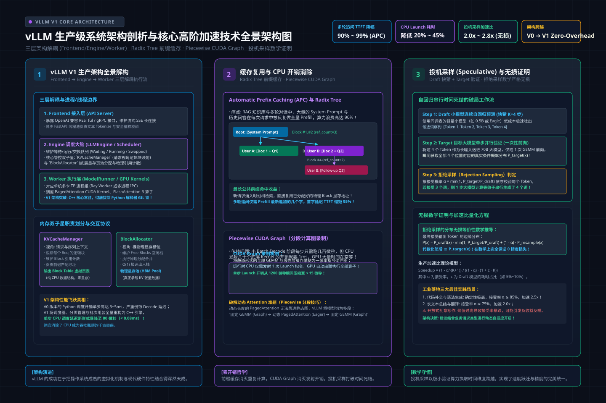
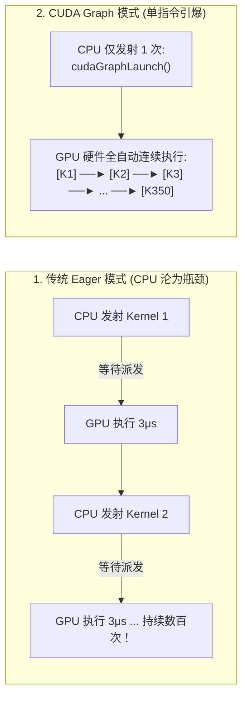
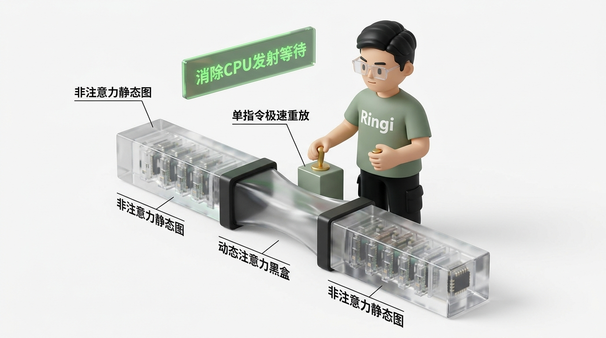

# 🏛️ 第34讲：从内核源码到极致黑魔法——vLLM 生产级系统架构全景剖析与四重加速引擎（Prefix Caching / CUDA Graph / FP8-AWQ量化 / 投机采样）

> **主讲人**：👓 **Ringi**（大厂 AI Infrastructure 工程师）  
> **所属模块**：[Module 05: LLM 在线推理系统与性能工程](./README.md)  
> **篇章范式**：🚀 LLM 推理服务与高性能 Serving 篇（Inference Serving & Systems Paradigm）  
> **核心导读**：在理解了 PagedAttention 分页显存与 Continuous Batching 动态组批之后，许多工程师以为自己已经掌握了大模型在线推理的全部秘密。然而，当你真正走进大厂生产机房、面对数万 QPS 的在线服务时，你会发现系统依旧面临无数刺骨的现实痛点：为什么在并发不高时，GPU 的运算核心依然有大量空闲，甚至反常地在等 CPU 发射指令？为什么用户每次多轮追问，系统都要把几千字的背景资料重新计算一遍？为什么自回归解码每一步依然只能蹦出一个字，无法突破光速一般的物理下限？本讲我们将打开 vLLM 最新的工业级 V1 内核代码，彻底拆解 AsyncLLMEngine、KVCacheManager 与 BlockPool 的架构全貌，并逐一攻克支撑现代大模型推理的三大高阶黑魔法——基于 Radix Tree 的前缀缓存（Prefix Caching）、消除 CPU 发射瓶颈的 Piecewise CUDA Graph，以及在数学上保证零精度损失的投机采样（Speculative Decoding）先猜后验体系。


```text
========================================================================================================================
                                     Ringi 3D 架构工坊 · vLLM V1 生产级系统全景与四重加速引擎
========================================================================================================================

 [客户端高并发请求流 (HTTP / gRPC / OpenAI API)]
        │
        ▼
 ┌────────────────────────────────────────────────────────────────────────────────────────────────────────────────────┐
 │  前端接入与异步引擎层 (Frontend & AsyncLLMEngine)                                                                  │
 │  • API Server / Ingress Router ──► Tokenizer (CPU 多进程隔离处理) ──► Request Stream Tracker                         │
 └──────────────────────────────┬─────────────────────────────────────────────────────────────────────────────────────┘
                                │ 转化为抽象请求并推送至等待队列 (Waiting Queue)
                                ▼
 ┌────────────────────────────────────────────────────────────────────────────────────────────────────────────────────┐
 │  核心调度与显存大脑 (Core Scheduler & KVCacheManager)                                                             │
 │  ┌───────────────────────────────────────────────┐ ┌──────────────────────────────────────────────────────────────┐ │
 │  │ 统一 Token 预算调度器 (Token Budget Scheduler) │ │ KVCacheManager & BlockPool (全局物理块仓库)                  │ │
 │  │ • sum(req_tokens) <= max_num_batched_tokens   │ │ • FreeKVCacheBlockQueue: 双向链表 O(1) 随机摘除与激活       │ │
 │  │ • 优先保障存量 Decode 步进 (流速第一)         │ │ • BlockHashToBlockMap: 前缀哈希索引与引用计数 (ref_cnt)     │ │
 │  │ • 余量装箱切分 Chunked Prefill (削峰填谷)     │ │ • 优雅抢占器: 内存告警时触发 Swapping 换出或 Recompute 重算 │ │
 │  └───────────────────────────────────────────────┘ └──────────────────────────────────────────────────────────────┘ │
 └──────────────────────────────┬─────────────────────────────────────────────────────────────────────────────────────┘
                                │ 产出当前 Step 执行计划: 批次张量 + Block Table 映射表
                                ▼
 ┌────────────────────────────────────────────────────────────────────────────────────────────────────────────────────┐
 │  模型执行器与硬件加速底座 (Model Runner & GPU Worker)                                                              │
 │                                                                                                                    │
 │   🚀 四重大厂高阶加速引擎协同作战 (The Four Advanced Acceleration Engines)                                         │
 │                                                                                                                    │
 │   1. 【Prefix Caching (前缀复用)】        2. 【Piecewise CUDA Graph (图编译)】                                     │
 │   • Radix Tree 最长前缀公共路径匹配       • 非 Attention 规整层打包录制，消除数百次 CPU Launch 开销                │
 │   • 命中前缀 Prefill 计算量瞬间归零       • Attention 层保持 Eager 执行，兼容变长 KV 与混合批次                    │
 │                                                                                                                    │
 │   3. 【FP8 & AWQ 极限压缩量化】           4. 【Speculative Decoding (投机采样)】                                   │
 │   • W4A16 (Marlin Kernel) 访存带宽减半    • Draft 模型先猜 K 步，Target 模型单步一次性并行验证                      │
 │   • FP8 KV Cache 让物理并发容量直接翻倍   • 拒绝采样 (Rejection Sampling) 数学证明绝对无偏 (Zero Quality Loss)      │
 └────────────────────────────────────────────────────────────────────────────────────────────────────────────────────┘
========================================================================================================================
```

<!-- more -->

## 📑 目录导航

- [0. Ringi 开场：生产真实现场与痛点冲突](#0-ringi-开场生产真实现场与痛点冲突)
  - [0.1 真实工程矛盾：为什么有了 PagedAttention，线上依然在小 Batch 下被 CPU 调度活活拖死？](#01-真实工程矛盾为什么有了-pagedattention线上依然在小-batch-下被-cpu-调度活活拖死)
  - [0.2 线上真实事故复盘：某企业知识库助手因未开 Prefix Caching 导致万字合同每次追问全量重算，集群瞬间熔断](#02-线上真实事故复盘某企业知识库助手因未开-prefix-caching-导致万字合同每次追问全量重算集群瞬间熔断)
  - [0.3 vLLM 核心加速引擎矩阵全景速查表](#03-vllm-核心加速引擎矩阵全景速查表)
- [1. vLLM V1 生产级系统架构全景与执行流解构](#1-vllm-v1-生产级系统架构全景与执行流解构)
  - [1.1 宏观架构三层解耦：Frontend 接入层、Core 调度大脑与 Worker 执行层](#11-宏观架构三层解耦frontend-接入层core-调度大脑与-worker-执行层)
  - [1.2 显存管理器核心解构：`KVCacheManager`、`BlockPool` 与双向空闲链表](#12-显存管理器核心解构kvcachemanagerblockpool-与双向空闲链表)
  - [1.3 可插拔 Attention 后端演进：FlashAttention-3、FlashInfer 与 FlashMLA 的定位差异](#13-可插拔-attention-后端演进flashattention-3flashinfer-与-flashmla-的定位差异)
- [2. 加速引擎一：Prefix Caching 与 Radix Tree 记忆力革命](#2-加速引擎一prefix-caching-与-radix-tree-记忆力革命)
  - [2.1 重复计算的罪恶：为什么 System Prompt 与多轮对话必须缓存？](#21-重复计算的罪恶为什么-system-prompt-与多轮对话必须缓存)
  - [2.2 Radix Tree（基数树）物理机制：Token ID 路径匹配与 Block 引用计数](#22-radix-tree基数树物理机制token-id-路径匹配与-block-引用计数)
  - [2.3 带有缓存内容的“空闲块”管理与 LRU 淘汰协议](#23-带有缓存内容的一空闲块管理与-lru-淘汰协议)
  - [2.4 公式五步穿透：前缀缓存命中率对 TTFT 与吞吐量的理论提升推导](#24-公式五步穿透前缀缓存命中率对-ttft-与吞吐量的理论提升推导)
- [3. 加速引擎二：CUDA Graph 与 Piecewise 图编译优化](#3-加速引擎二cuda-graph-与-piecewise-图编译优化)
  - [3.1 隐形刺客：CPU Launch Overhead 为什么在 Decode 阶段反客为主？](#31-隐形刺客cpu-launch-overhead-为什么在-decode-阶段反客为主)
  - [3.2 CUDA Graph 录制（Capture）与重放（Replay）的软硬件底层原理](#32-cuda-graph-录制capture与重放replay的软硬件底层原理)
  - [3.3 静态形状约束 vs 变长 Attention 的死结：为什么整图捕获必然失败？](#33-静态形状约束-vs-变长-attention-的死结为什么整图捕获必然失败)
  - [3.4 vLLM V1 的神解：Piecewise CUDA Graph（分段图编译与不透明算子切片）](#34-vllm-v1-的神解piecewise-cuda-graph分段图编译与不透明算子切片)
- [4. 加速引擎三：工业级模型与 KV 量化体系（FP8 / AWQ / GPTQ / Marlin）](#4-加速引擎三工业级模型与-kv-量化体系fp8--awq--gptq--marlin)
  - [4.1 权重量化（Weight-Only）vs 全量化（W8A8 / FP8）：Roofline 视角的抉择](#41-权重量化weight-only-vs-全量化w8a8--fp8roofline-视角的抉择)
  - [4.2 AWQ（Activation-aware Weight Quantization）：保护前 1% 核心权重的数学物理本质](#42-awqactivation-aware-weight-quantization保护前-1-核心权重的数学物理本质)
  - [4.3 Marlin 高性能 GPU Kernel：专为 Decode 打造的 INT4 显存带宽倍增器](#43-marlin-高性能-gpu-kernel专为-decode-打造的-int4-显存带宽倍增器)
  - [4.4 FP8 混合精度在 Hopper/Blackwell 上的原生双倍算力与 KV Cache 减半实践](#44-fp8-混合精度在-hopperblackwell-上的原生双倍算力与-kv-cache-减半实践)
- [5. 加速引擎四：投机采样（Speculative Decoding）先猜后验打破自回归](#5-加速引擎四投机采样speculative-decoding先猜后验打破自回归)
  - [5.1 自回归串行锁链的终结者：小模型先猜 $K$ 步，大模型单步一次性并行验证](#51-自回归串行锁链的终结者小模型先猜-k-步大模型单步一次性并行验证)
  - [5.2 拒绝采样（Rejection Sampling）数学证明：为什么投机采样绝对零精度损失？](#52-拒绝采样rejection-sampling数学证明为什么投机采样绝对零精度损失)
  - [5.3 从独立 Draft 模型到 Self-Draft（Medusa 多头预测与 EAGLE 树形验证）](#53-从独立-draft-模型到-self-draftmedusa-多头预测与-eagle-树形验证)
  - [5.4 真实加速比量化与业务边界：代码场景（2.5x）vs 开放对话（负优化风险）](#54-真实加速比量化与业务边界代码场景25x-vs-开放对话负优化风险)
- [6. 动手实战与代码实验室（Minimal Runnable Code）](#6-动手实战与代码实验室minimal-runnable-code)
  - [6.1 实验一：纯 Python 原生复刻 Radix Tree 前缀缓存匹配器与引用计数自动机](#61-实验一纯-python-原生复刻-radix-tree-前缀缓存匹配器与引用计数自动机)
  - [6.2 实验二：投机采样拒绝采样（Rejection Sampling）数学仿真与真实加速比评估](#62-实验二投机采样拒绝采样rejection-sampling数学仿真与真实加速比评估)
- [7. Ringi 避坑指南与生产黄金准则](#7-ringi-避坑指南与生产黄金准则)
  - [7.1 7 大常见小白认知误区 vs 大厂 AI Infra 正确物理认知](#71-7-大常见小白认知误区-vs-大厂-ai-infra-正确物理认知)
  - [7.2 生产 vLLM 高阶加速配置黄金 Checklist](#72-生产-vllm-高阶加速配置黄金-checklist)
- [8. Ringi 5 点核心速记口诀、自我检验清单与课后深度思考题](#8-ringi-5-点核心速记口诀自我检验清单与课后深度思考题)
  - [8.1 5 点押韵核心速记口诀](#81-5-点押韵核心速记口诀)
  - [8.2 10 条白板自我检验清单](#82-10-条白板自我检验清单)
  - [8.3 3 道高阶开放式课后思考题（含极限 Corner Case）](#83-3-道高阶开放式课后思考题含极限-corner-case)
- [9. 📚 参考资料与核心源码/经典论文指引](#9--参考资料与核心源码经典论文指引)
- [附录：Appendix A — 大厂硬核高频面试题与白板推导（Interview Drill）](#附录appendix-a--大厂硬核高频面试题与白板推导interview-drill)
- [🎨 【配图工坊生图 Prompt 暂存区 · 生成配图后可一键整块删除】](#-配图工坊生图-prompt-暂存区--生成配图后可一键整块删除)

---

# 0. Ringi 开场：生产真实现场与痛点冲突

### 0.1 真实工程矛盾：为什么有了 PagedAttention，线上依然在小 Batch 下被 CPU 调度活活拖死？

在许多已经落地了 vLLM 基础版的团队里，经常会遇到一个极其诡异的性能现象：

当你进行超大压力测试、把并发（Batch Size）一路拉到 64 或 128 时，GPU 的吞吐量确实极其惊人，每秒产出数千个 Token。
然而，一旦业务处于非高峰期，或者面对某些**要求极低延迟（Low-Latency）的小 Batch 交互场景（例如 Batch Size = 1 到 4）** 时，灾难出现了：
- 单步 Decode 的耗时本应在 10ms 以内，但在 Profiler 监控图谱上，实际单步延迟却高达 **25ms 甚至 30ms**；
- 调出 NVIDIA Nsight Systems 抓取硬件执行时间线，眼前的一幕让所有算法工程师大跌眼镜：
  - **GPU 的核心计算单元（SM）并不是在慢吞吐，而是在大片大片地“空转等待”**！
  - 每一个小算子（比如一个 LayerNorm 或一个轻量 Elementwise 激活）在 GPU 上只执行了区区 **3 微秒（$\mu s$）**；
  - 但随后，GPU 陷入长达 **15 微秒的绝对寂静**，直到下一个小算子姗姗来迟！

**算力没有瓶颈，显存也没有满，到底是谁卡住了硬件？**

答案是：**你的 Host 端 CPU 正在吐血！**
跑一遍 Transformer 模型包含数十层，每层有矩阵乘、偏置加、残差连接、RMSNorm、RoPE 等数十个细碎算子。一个完整的前向传播，CPU 必须调用 Python 运行时向 CUDA Driver 连续发射 **成百上千次 `cudaLaunchKernel` 指令**！
在单步 Token 极少时，GPU 算得太快了，CPU 发送指令的速度远远跟不上 GPU 咽下指令的速度。**强大的 GPU 硬件，硬生生被孱弱的 CPU Python 胶水层发射开销活活饿死！**

---

### 0.2 线上真实事故复盘：某企业知识库助手因未开 Prefix Caching 导致万字合同每次追问全量重算，集群瞬间熔断

2024 年初，国内某大型企业法务部门上线了一套基于大模型的合同审查与法务问答系统（基于 70B 开源模型，部署在 4 台 8 卡 A100 服务器上）。

系统业务流程设计如下：
1. 用户在前端上传一份长达 **8,000 Token 的复杂并购合同全文**；
2. 系统将合同全文作为 System Prompt 注入对话流；
3. 用户开始基于合同进行多轮交互咨询。

**事故爆发经过**：
- 第一轮提问：“这份合同的违约金比例是多少？”
  - 系统启动 Prefill，处理 8000 Token 的合同文本，单卡耗时约 **1.2 秒**，用户收到回答，体验良好；
- 紧接着，用户发起第二轮追问：“如果违约，由哪里的仲裁委员会管辖？”（仅 15 个字）；
- **灾难降临**：
  - 由于底层 Serving 实例未开启 **Prefix Caching（前缀缓存）**；
  - 调度器将这轮请求视为一个全新的会话：输入是“8000 字合同全文 + 第一轮问答 + 当前追问”，总长度增加到了 **8,300 Token**；
  - 系统竟然**将那份长达 8000 字的合同在 GPU 上重新做了一次完完整整的 Prefill 矩阵乘法**！
  - 随着几十名法务人员同时进入深度审查，系统内部充斥着对相同合同文本的无数次“机械性重复重算”；
  - 4 台 GPU 节点的 Prefill 队列瞬间被挤爆，所有实例的 GPU 利用率飙到 100%，单次追问的首字延迟（TTFT）从 1.2 秒断崖式恶化至 **48 秒**，网关全部超时熔断，服务彻底瘫痪！

**救火复盘结论**：
团队连夜排查，核心破局操作极其简单却威力惊人：
- 在启动参数中加上了一行：`--enable-prefix-caching`；
- vLLM 底层的 **Radix Tree（基数树）** 瞬间接管全局前缀管理：从第二轮追问开始，那 8000 Token 的合同 KV Cache 直接在物理显存中被指针秒级命中；
- 第二轮追问的实际计算量从 8,300 Token 瞬间断崖式压缩为仅仅 **30 个新 Token**；
- 用户的 TTFT 响应时间直接从 48 秒暴降至 **18 毫秒（提速 2600 倍！）**，集群负荷当场解除。

---

### 0.3 vLLM 核心加速引擎矩阵全景速查表

| 加速引擎 | 解决的底层核心瓶颈 | 核心算法与数据结构 | 预期性能提升量级 | 典型生产落地场景 |
| :--- | :--- | :--- | :--- | :--- |
| **Prefix Caching** | 多轮对话与公共 System Prompt 的**重复 Prefill 计算浪费** | **Radix Tree（基数树）最长公共前缀匹配** + Block 引用计数维护 | **多轮追问 TTFT 降低 90%~99%**，集群有效吞吐提升 2~3 倍 | 知识库 RAG、Agent 复杂推演、智能客服多轮对话 |
| **Piecewise CUDA Graph** | 小 Batch Decode 阶段的 **CPU Kernel 发射开销（Launch Overhead）** | **计算图录制与单指令重放** + 将变长 Attention 隔离为不透明算子 | **小 Batch Decode 单步延迟降低 20%~45%**，CPU 利用率减半 | 交互式代码补全、低并发高响应流式打字机 |
| **FP8 / AWQ 低比特量化** | Decode 阶段的 **HBM 显存物理带宽瓶颈** 与 物理显存容量不足 | **W4A16 (Marlin Kernel) 权重压缩** + **FP8 KV Cache 动态量化** | **显存容量翻倍（并发容量拉升 2x）**，Decode 吐字速度加快 40%~80% | 资源敏感型私有化部署、单机拉高并发极限 |
| **Speculative Decoding** | 自回归串行生成单步只能产出 1 个 Token 的**单向时间因果死结** | **Draft 模型小步快猜 + Target 模型单步并行验证**（拒绝采样数学证明） | **字间流速（TPOT）真实提升 2.0x ~ 2.8x**，且数学保证严格零精度损失 | 代码生成（确定性高）、长文本写作、摘要提取 |

---

# 1. vLLM V1 生产级系统架构全景与执行流解构

> 💡 **架构全景速览**：在深潜源码前，先在白板上建立坚不可摧的 vLLM V1 生产架构、Prefix Caching 与投机采样物理底账。
> 
> 

### 1.1 宏观架构三层解耦：Frontend 接入层、Core 调度大脑与 Worker 执行层

现代主流的大模型 Serving 系统（以 vLLM V1 架构为典范），在工程结构上彻底摆脱了早期学术 Demo 的混乱状态，形成了极其清晰的**三层解耦架构**：

```text
vLLM V1 生产架构全景与进程/线程边界:

 ┌─────────────────────────────────────────────────────────────────────────────────────────────────┐
 │ 1. 前端接入与流式网关层 (Frontend / Entrypoint)                                                │
 │ • AsyncLLMEngine: 暴露 OpenAI 兼容 HTTP/gRPC 协议，非阻塞异步接收外部并发请求                  │
 │ • Tokenizer Process: 独立多进程隔离！避免 Python GIL 锁死，异步执行分词与 Detokenize 字符串拼装 │
 └───────────────────────────────────────────────┬─────────────────────────────────────────────────┘
                                                 │ 进程间通信 (IPC / ZeroMQ / Shared Queue)
                                                 ▼
 ┌─────────────────────────────────────────────────────────────────────────────────────────────────┐
 │ 2. 核心调度与内存引擎层 (Core Scheduler Engine)                                                │
 │ • Scheduler: 统一 Token 预算装箱决策 (基于 max_num_batched_tokens)                              │
 │ • KVCacheManager: 请求维度的 Block 申请、生命周期跟踪与抢占策略                                  │
 │ • BlockPool: 全局物理显存 Block 仓库，通过双向链表管理空闲块，通过 Radix Tree 维护前缀缓存      │
 └───────────────────────────────────────────────┬─────────────────────────────────────────────────┘
                                                 │ 下发单步批次计划: ExecuteModelReq
                                                 ▼
 ┌─────────────────────────────────────────────────────────────────────────────────────────────────┐
 │ 3. 模型执行与硬件 Worker 层 (Model Runner & GPU Workers)                                        │
 │ • Worker 进程组: 单机多卡张量并行 (TP via NCCL / IPC Custom AllReduce)                          │
 │ • ModelRunner: 执行 Piecewise CUDA Graph 重放与 Attention 算子调用                              │
 │ • Attention Backend: FlashAttention-3 / FlashInfer / FlashMLA 硬件极致内核                       │
 └─────────────────────────────────────────────────────────────────────────────────────────────────┘
```

1. **Frontend 接入层（AsyncLLMEngine）**：
   - 必须将 Tokenizer 和 Detokenizer 与 Python 主进程物理隔离！在大并发下，文本切分（BPE 分词）需要耗费大量 CPU 计算，如果放在主线程，Python 的 GIL（全局解释器锁）会瞬间把 GPU 的调度循环完全卡死；
2. **Core 调度大脑（Scheduler & KVCacheManager）**：
   - 负责极其密集的微秒级状态裁决。在每一个 Step 开始前，调度器从物理显存池（BlockPool）盘点可用零件，基于 Token Budget 将请求装箱，构建本步要送进 GPU 的轻量元数据指针；
3. **Worker 模型执行层（Model Runner）**：
   - 守护在 GPU 硬件侧，持有模型静态权重与庞大的物理 KV Cache 块池。接收到调度指令后，直接拉动 CUDA Graph 重放与底层汇编算子，完成纯粹的 GPU 物理前向计算。

---

### 1.2 显存管理器核心解构：`KVCacheManager`、`BlockPool` 与双向空闲链表

在 vLLM V1 源码中，显存管理被精致地拆分为了两大核心类：

#### 1. 请求视角的主管：`KVCacheManager`
- 位于 `vllm/v1/core/kv_cache_manager.py`；
- 它代表了**单个会话请求对显存的诉求**。当一个请求生成新 Token 时，调用 `allocate_slots(req, num_tokens)`：
  - 如果请求当前最后一个 Block 还有空位，直接追加；
  - 如果填满了，向全局仓库申请一个新的物理 Block，并追加写入该请求的 `block_table`；
  - 当请求完成退出时，调用 `free(req)`：以**严格逆序**释放物理块（先释放尾部的新块，保留头部的前缀块以最大化复用可能）。

#### 2. 全局视角的大仓库：`BlockPool`
- 位于 `vllm/v1/core/block_pool.py`；
- 它不关心业务和请求是谁，只管物理显存中成千上万个标准块的死活。
- **神级工程细节：为什么空闲块必须使用双向链表（`FreeKVCacheBlockQueue`）？**
  - 如果只是简单的先进先出（FIFO），队列或数组足够；
  - 但在启用了 Prefix Caching 后，一个引用计数为 0（`ref_cnt = 0`）的空闲块，其内部可能缓存着一份极具价值的通用前缀；
  - 当新请求命中该前缀时，调度器必须以 **$\mathcal{O}(1)$ 的时间复杂度从空闲链表的任意中间位置将该节点摘除并重新激活**；
  - 双向链表与哈希表的结合，是整个系统在大并发下抹平调度毛刺的无名功臣。

---

### 1.3 可插拔 Attention 后端演进：FlashAttention-3、FlashInfer 与 FlashMLA 的定位差异

在现代 Serving 框架中，Attention 算子不再是由单一固化的 CUDA Kernel 承担，而是形成了可插拔的**后端矩阵**：

| Attention 后端名称 | 核心开发主体与定位 | 体系结构设计亮点与微架构优势 | 生产最佳适用场景 |
| :--- | :--- | :--- | :--- |
| **FlashAttention-3** | Stanford / Tri Dao 团队打造 | 针对 NVIDIA Hopper 架构的 **TMA（张量内存加速器）** 与异步流水线（WGMMA）极致优化，支持 FP8 计算 | Hopper（H100/H800）架构上的稠密大模型通用首选 |
| **FlashInfer** | 华盛顿大学 / SAMPL 团队打造 | **专为大模型在线推理 Serving 量身定制**；原生支持非连续 Paged KV 布局与高度灵活的混合批次（Mixed Batch）调度 | 对长文本、高吞吐流式调度以及异构数据精度有极佳适配 |
| **FlashMLA** | DeepSeek 官方开源算子库 | **专为 MLA（多头潜在注意力）低秩投影架构打造**；将 $O(H)$ 的 KV 读取压缩为单一 Latent 向量读取 | DeepSeek-V2 / V3 / R1 等全系采用 MLA 结构的模型 |
| **Triton Attention** | OpenAI / 开源社区通用实现 | 基于 OpenAI Triton 语言编写，具备极高的跨平台可读性与算法快速实验能力 | 非 NVIDIA 架构芯片适配或新注意力算法原型验证的兜底选型 |

---

# 2. 加速引擎一：Prefix Caching 与 Radix Tree 记忆力革命

### 2.1 重复计算的罪恶：为什么 System Prompt 与多轮对话必须缓存？

在大模型生产环境中，存在着极其强烈的**前缀局部性（Prefix Locality）**：
- **多轮会话（Multi-turn Chat）**：用户在一个会话内反复追问，前序所有轮次的问答历史在后续每一轮都需要作为上下文输入；
- **Agent 智能体调用**：每次给智能体下发小任务，前置都必须附带几十个工具的 Schema 描述和 Few-shot 示例（常达数千 Token）；
- **代码补全（Copilot）**：开发者在一个工程文件里连续敲击键盘，当前文件顶部的一千行代码作为固定上下文在每一次补全请求中被重复发送。

在没有 Prefix Caching 的传统系统里：
- **每一次会话推进，都是对公共历史前缀的一次野蛮重算**；
- 算力在无休止的重复 GEMM 中被白白消耗，首字延迟（TTFT）随对话轮数线性恶化，集群很快在算力饱和中陷入瘫痪。

---

### 2.2 Radix Tree（基数树）物理机制：Token ID 路径匹配与 Block 引用计数

为了实现极速前缀复用，SGLang 与 vLLM 引入了计算机经典数据结构——**Radix Tree（基数树 / 压缩前缀树）**。

#### 1. 结构抽象
- **节点（Node）**：包含一段连续的 Token ID 序列，以及与之严格对应的已在物理显存中分配好的物理块号列表 `block_ids`；
- **边（Edge）**：基于 Token 值的字符分支；
- **引用计数（`ref_cnt`）**：记录当前有多少个活跃的会话正在读取该节点所管辖的显存块。

#### 2. 匹配流程（Longest Prefix Match）
当一个新请求到达，携带了 Prompt 序列 $[t_0, t_1, t_2, \dots, t_n]$：
1. 调度器拿这串 Token ID 从 Radix Tree 的根节点开始向下遍历；
2. 逐节点比对 Token ID，直到某一个节点的分支出现不匹配，找到**最长公共前缀路径**（假设命中了前 2048 个 Token，对应物理块 `#12 ~ #140`）；
3. **跳过计算**：调度器直接将这 2048 个 Token 标记为“已计算”，将该请求的 `block_table` 前端直接填入物理块号 `#12 ~ #140`；
4. **引用计数加 1**：对应物理块的 `ref_cnt` 递增；
5. **仅对剩余增量进行计算**：GPU 仅仅对剩下的未匹配 Token（如新提问的 20 个字）执行极短的 Prefill 增量计算！

```text
Radix Tree 前缀复用微观匹配流:

根节点 [Root]
   │
   └──► [Node A: 知识库公共前缀 1000 Tokens] (指向物理块: #1 ~ #62, ref_cnt = 2)
           │
           ├──► [Node B: 用户 1 提问: '退款流程是什么'] (物理块: #63, ref_cnt = 1)
           │       └──► [增量 Prefill: 仅算 15 Tokens!]
           │
           └──► [Node C: 用户 2 提问: '人工客服电话']   (物理块: #64, ref_cnt = 1)
                   └──► [增量 Prefill: 仅算 12 Tokens!]
```

---

### 2.3 带有缓存内容的“空闲块”管理与 LRU 淘汰协议

既然物理显存是有限的，Radix Tree 不可能无限膨胀。当显存耗尽时，系统该如何清理旧缓存？

这里体现了与操作系统文件系统 Page Cache 完全相通的哲学：
1. **活跃状态（Active）**：某个物理块正在被某请求使用，其在 Radix Tree 中的 `ref_cnt > 0`，**绝对不可被驱逐**；
2. **待回收缓存状态（Cached Free）**：请求结束退出了，但系统**绝不立即清空物理块中的数据**！系统只是将其 `ref_cnt` 降为 0，并将其挂入双向空闲链表 `FreeKVCacheBlockQueue` 的末端（赋予时间戳）；
3. **LRU 淘汰（Eviction）**：
   - 当系统真的出现显存物理缺块时，调度器从空闲链表的头部（最久未被访问的节点）开始回收；
   - 在 Radix Tree 上剪掉对应的叶子节点，把该物理 Block 彻底重置为“全新空闲块”分配给新请求使用。

这种机制保证了高频热点前缀（如公司的统一提示词）几乎永久驻留在显存物理块中，达到惊人的 **95% 以上命中率**！

---

### 2.4 公式五步穿透：前缀缓存命中率对 TTFT 与吞吐量的理论提升推导

#### ① Why（为什么需要算它？）
在向业务方推行 Prefix Caching 时，必须建立量化数学模型：**在给定的前缀缓存命中率 $\alpha$ 下，系统的平均 TTFT 能降多少？集群的最大承载吞吐能放大多少倍？**

#### ② Mental Model（物理直觉比喻）
原来开饭馆，每来一个客人，厨师都要从磨面粉开始做面包（全量 Prefill）；现在厨师提前烤好了一大批法棍面包底（公共前缀缓存）。来一个客人，厨师只要往面包上挤一点果酱（算增量 Token）就能立刻上菜，出餐速度直接起飞。

#### ③ Tiny Calculator（极简数字手算）
假设 Prompt 总长 $S = 2000$ Token，其中 System Prompt 占 $S_{\text{prefix}} = 1800$ Token，用户增量输入仅 $S_{\text{query}} = 200$ Token。
前缀命中率 $\alpha = 0.9$（90% 的请求命中了 System Prompt）：
- **无缓存时**：单请求 Prefill 需计算 2000 Token；
- **有缓存时**：

  $$
  \text{期望计算 Token 数} = 0.9 \times 200 + 0.1 \times 2000 = 180 + 200 = \mathbf{380\text{ Tokens}}
  $$

- **算力开销直接暴降**：$\frac{380}{2000} = \mathbf{19\%}$（计算量仅剩不到两成，理论提速超过 5 倍！）。

#### ④ Formal Model（标准公式）
设长 Prompt 总长为 $S$，公共前缀长度为 $S_{\text{prefix}}$，命中率为 $\alpha$。
在没有网络排队前提下，首字延迟与 Prefill 计算量呈高度线性关系：$T_{\text{prefill}}(L) \approx k \cdot L$。
平均首字延迟期望值 $\mathbb{E}[\text{TTFT}]$ 满足：

$$
\mathbb{E}[\text{TTFT}] = (1 - \alpha) \cdot k \cdot S + \alpha \cdot k \cdot (S - S_{\text{prefix}}) = k \cdot \left[ S - \alpha \cdot S_{\text{prefix}} \right]
$$

系统在 Prefill 受限场景下的 **吞吐放大系数（Throughput Speedup Factor, $\mathcal{S}_{\text{throughput}}$）** 为：

$$
\mathcal{S}_{\text{throughput}} = \frac{S}{S - \alpha \cdot S_{\text{prefix}}} = \frac{1}{1 - \alpha \cdot \left(\frac{S_{\text{prefix}}}{S}\right)}
$$

#### ⑤ Sanity Check（数量级校验）
如果在一个重度依赖大上下文知识库的 Agent 场景中，$S_{\text{prefix}} / S = 0.95$（前缀占 95%），命中率 $\alpha = 0.9$：

$$
\mathcal{S}_{\text{throughput}} = \frac{1}{1 - 0.9 \times 0.95} = \frac{1}{1 - 0.855} \approx \mathbf{6.9 \times}（约 6.9 倍！）
$$

**这绝不是几百分点的微调，而是直接将服务器的采购需求斩断到原本的七分之一！**

---

# 3. 加速引擎二：CUDA Graph 与 Piecewise 图编译优化

### 3.1 隐形刺客：CPU Launch Overhead 为什么在 Decode 阶段反客为主？

我们在第 0.1 节揭露了一个刺眼的真相：**Decode 阶段单步算子太小了，CPU 发射速度成了瓶颈。**

让我们用毫秒级别的显微镜看看一次标准的 Decode 前向传播：
- 一个 32 层的 Transformer 模型，每一层包含：
  - 2 次 RMSNorm
  - 4 次大权重线性投影（QKV 投影、O 投影、Gate/Up 投影、Down 投影）
  - 1 次 RoPE 旋转位置编码
  - 1 次 Attention Kernel
  - 1 次 SiLU 激活与点乘
  - 2 次残差加法
- 单层算子数量超过 11 个，全模型 32 层包含 **超过 350 个独立的 CUDA 算子调用**！

在 PyTorch 的默认 Eager 执行模式下：
- CPU 必须通过 Python 循环，一个接一个调用 CUDA Runtime API 发射每个算子；
- 每次发射需要经历驱动参数打包、Stream 队列同步检查，开销约为 **$3 \sim 5\text{ 微秒}$**；
- 350 个算子仅在 CPU 发射上就要烧掉：

  $$
  T_{\text{cpu-launch}} = 350 \times 4\text{ }\mu s \approx \mathbf{1.4\text{ ms}}
  $$

- 如果此时 GPU 执行一个 Batch=1 的 Decode 算子只需要 **1.0 ms**，那么整个系统的耗时为 $1.4 + 1.0 = \mathbf{2.4\text{ ms}}$——**超过 58% 的时间死在 CPU 派发指令的路上！**

---

### 3.2 CUDA Graph 录制（Capture）与重放（Replay）的软硬件底层原理

为了彻底终结 CPU 的指令发射瓶颈，NVIDIA 在 CUDA 10 中推出了终极武器——**CUDA Graph**。

#### 核心机制
- **录制阶段（Capture）**：在服务初始化预热时，让模型空跑一次前向传播，CUDA Driver 在底层将这 350 个 Kernel 的物理地址、依赖拓扑关系与内存参数完整“录制”下来，在 GPU 显存中构建一张固化的 **有向无环图（DAG）**；
- **重放阶段（Replay）**：在线服务处理真实请求时，CPU 彻底闭嘴！CPU **仅仅需要向 GPU 下发唯一一条极其轻量的命令——`cudaGraphLaunch(graph)`**！
- **GPU 硬件自主狂飙**：GPU 的硬件调度引擎直接读取显存中的静态拓扑图，350 个算子像连环炮一样全速在 SM 上自主触发执行，微秒级间隙彻底被压缩至物理极限！



---

### 3.3 静态形状约束 vs 变长 Attention 的死结：为什么整图捕获必然失败？

既然 CUDA Graph 这么强，为什么早期的推理框架不用它？
因为 CUDA Graph 有一个极度苛刻的硬性物理约束：
> **在图被捕获（Capture）之后，图内所有算子的张量内存物理地址和 Tensor 形状（Shape），必须绝对固定死，永远不能改变！**

这在传统的图像分类（ResNet、固定尺寸输入）上极其好使。但在大模型推理中，这简直是要了大命：
1. **Decode 的 KV 长度每步都在递增**：第 1 步上下文是 100，第 2 步上下文是 101，Attention 算子的输入尺寸每一步都在变动；
2. **多会话上下文长度完全不一致**：同一个 Batch 内，请求 A 的上下文长 50，请求 B 的上下文长 3000；
3. 如果强行对包含 Attention 的整个大模型做全量 CUDA Graph 捕获，一旦上下文长度发生变化，整张图当场报废报错！

---

### 3.4 vLLM V1 的神解：Piecewise CUDA Graph（分段图编译与不透明算子切片）

vLLM V1 团队联合 PyTorch 核心开发者，创造出了一套天才般的妥协设计——**Piecewise CUDA Graph（分段 CUDA Graph）**。

#### 核心解耦思路
既然整张图不能一起录制，那我们就把模型剖开看：
- **占耗时大头且形状规整的非 Attention 算子**：LayerNorm、MLP、QKV 线性投影、残差连接……这些算子仅仅针对当前步的当前 Token（其输入维度永远是固定的 $[B, d_{\text{model}}]$，与历史上下文长度完全无关！）；
- **唯独只有 Attention 算子**：其计算依赖变长的历史 KV Cache，输入动态性极强。

#### vLLM V1 的切图三部曲：
1. **将 Attention 声明为不透明算子（Opaque Custom Op）**：通过 `torch.ops.vllm.unified_attention_with_output` 将注意力打包成一个黑盒，通知 PyTorch Dynamo 编译器在图追踪时“绕着它走，不要动它”；
2. **三段式切片**：
   - 模型在每一个 Transformer Layer 的 Attention 处被干净利落地“一切为二”；
   - 形成规整的非 Attention 子图与动态 Attention 算子交替排列的结构；
3. **分段重放**：
   - 形状绝对固定的非 Attention 子图（占算子总数的 90% 以上），**使用预先捕获的 CUDA Graph 进行单指令重放，把 CPU 发射开销彻底砸平！**
   - 动态变长的 Attention 算子，**保持原生的 Eager 灵活模式调用高性能汇编 Kernel**！

通过这种双剑合璧的设计，**vLLM V1 在小 Batch Decode 场景下，端到端延迟直接砍掉了 30% 到 45%**！



---

# 4. 加速引擎三：工业级模型与 KV 量化体系（FP8 / AWQ / GPTQ / Marlin）

### 4.1 权重量化（Weight-Only）vs 全量化（W8A8 / FP8）：Roofline 视角的抉择

我们在第二讲中彻底确立了第一性原理基石：**Decode 是 Memory-bound，限制其速度的是从显存搬运权重的物理带宽。**

这就为量化（Quantization）技术在大模型在线推理中的绝对统治地位奠定了物理基础：
- 在训练中，量化容易导致梯度更新不稳定，甚至引发 Loss 突刺；
- **但在 Decode 推理中，把权重体积压小，哪怕不提升计算速度，光是减少 HBM 搬运的数据量，就能直接带来线性的出字加速！**

#### 两大主流技术流派的定位：
1. **Weight-Only INT4 量化（如 AWQ、GPTQ）**：
   - **操作**：权重压缩为 4-bit 整数（0.5 字节），激活值（Activations）在片上反量化恢复为 FP16 参与计算；
   - **收益**：模型权重显存体积直接暴缩至原本的 **$\frac{1}{4}$**（70B 模型从 140GB 骤降至 35GB，单台双卡即可部署！）；
   - **速度**：HBM 权重搬运量减少 75%，在小 Batch Decode 下**吐字速度直接翻倍**；
2. **全低精度浮点量化（FP8 - E4M3 / E5M2）**：
   - **操作**：权重、激活值甚至 KV Cache 全部使用 8 位浮点格式；
   - **收益**：不仅显存带宽减半，而且能够直接调用 NVIDIA Hopper 架构的 **FP8 Tensor Core**，享受原本 FP16 两倍的硬件算力峰值（高达 1979 TFLOPS）！

---

### 4.2 AWQ（Activation-aware Weight Quantization）：保护前 1% 核心权重的数学物理本质

在进行 4-bit 极限权重量化时，朴素的均匀量化（RTN - Round-to-Nearest）往往会导致模型彻底失智、输出胡言乱语。

麻省理工韩松团队提出的 **AWQ（激活感知权重量化）** 揭示了一个重大物理秘密：
> **大模型参数中并不是所有权重都同等重要；仅有不到 1% 的显著权重（Salient Weights）决定了模型的困惑度和表达力，而这些显著权重与输入激活值的峰值（Outliers）高度共存！**

AWQ 的数学优雅之处在于：
- 它根本不需要在运行期对激活值进行极其复杂的动态缩放；
- 它通过离线校准集观察激活值的幅值分布，找到那 1% 最容易引发量化误差的敏感权重通道；
- **通过在网络结构中做数学等价变换（Per-channel Scaling），将保护缩放因子提前吸收到权重矩阵内部**；
- 其余 99% 的普通权重放心地压入 INT4，在极低吞吐损耗下实现了几乎与原始 FP16 无法分辨的超高语言生成质量。

---

### 4.3 Marlin 高性能 GPU Kernel：专为 Decode 打造的 INT4 显存带宽倍增器

即使你用 AWQ 把权重压到了 4-bit，如果底层没有匹配的 GPU Kernel，性能依然会大幅打折——因为如果 GPU 必须先把 INT4 权重从 HBM 读到片上、慢吞吞地解包反量化为 FP16、再做乘加，反量化引入的额外指令甚至可能拖慢系统。

专为该场景封神的底层黑马就是 **Marlin Kernel**（由 Neuralmagic 与开源社区深度共建，现已集成至 vLLM）：
- **完全围绕 Tensor Core 向量化排布优化**：重构了 INT4 权重在物理显存中的交错排列（Interleaved Layout）；
- **极速寄存器级反量化**：利用专门的位移指令在片上以极快速度将 4-bit 还原并流水线喂入 Tensor Core；
- **打满带宽**：实测证明，Marlin Kernel 能够在小 Batch 到中 Batch Decode 场景下，**跑出惊人的 85% 以上的 GPU 物理显存带宽理论极限**，真正将 INT4 的空间收益兑现为了实打实的出字速度翻倍！

---

### 4.4 FP8 混合精度在 Hopper/Blackwell 上的原生双倍算力与 KV Cache 减半实践

随着 NVIDIA Hopper（H100/H800/H200）与 Blackwell 架构的大规模铺开，**FP8（特别是 E4M3 格式）已经成为大厂在线 Serving 的事实工业标准**。

在 vLLM 中启用 FP8 通常带来两大毁灭性优势：
1. **模型权重的 FP8 无损运行**：主流开源模型（LLaMA-3、DeepSeek-V3 等）官方已直接提供 FP8 权重版本，直接节省一半静态显存；
2. **KV Cache FP8 量化（`kv_cache_dtype="fp8"`）**：
   - 每一个 Token 的 Key 和 Value 从 2 字节（FP16）直接压缩为 1 字节；
   - 单张 80GB 卡上能够容纳的物理 Block 数量**瞬间硬性翻倍**；
   - 系统支持的最大并发数直接从 64 暴拉到 128，集群单 Token 综合服务成本立竿见影砍掉一半！

---

# 5. 加速引擎四：投机采样（Speculative Decoding）先猜后验打破自回归

### 5.1 自回归串行锁链的终结者：小模型先猜 $K$ 步，大模型单步一次性并行验证

在本模块的第一讲中，我们痛斥了大模型推理最大的元凶——**自回归的时间单向因果律**：第 $t+1$ 个 Token 必须等第 $t$ 个 Token 算完，导致 Decode 每步只能吐 1 个字。

有没有一种可能，**打破这个串行锁链，让大模型每一步吐出 2 个、3 个甚至 4 个字？**

这就是过去两年在推理学术界与工业界掀起滔天巨浪的 **投机采样（Speculative Decoding / 投机解码）**。

#### 核心双角色设定：
1. **草稿小模型（Draft Model，如 1B 参数）**：
   - 特点：模型极小、速度飞快（单步耗时可能只有 1.5ms）；
   - 任务：让小模型在前面狂奔，自回归连续“盲猜”出 $K$ 个后续 Token（例如 $K=4$ 个候选词：$[w_1, w_2, w_3, w_4]$）；
2. **目标大模型（Target Model，如 70B 参数）**：
   - 特点：模型庞大、单步耗时慢（单步耗时 25ms），但算力利用率极度不满；
   - 任务：**大模型不进行单步循环，而是把这 $K$ 个候选词像 Prefill 一样，一次性并行送进网络验证！**

```text
投机采样 Draft-Verify 步进时间线对比:

[传统单步 Decode (步步串行)]
Step 1 (70B): 25ms ──► 产出 1 Token
Step 2 (70B): 25ms ──► 产出 1 Token
Step 3 (70B): 25ms ──► 产出 1 Token
Step 4 (70B): 25ms ──► 产出 1 Token
─────────────────────────────────────────────────────────────────────────────
总耗时: 100ms 产出 4 个 Tokens (流速: 40 Tokens/s)

[投机采样 (先猜后验)]
阶段 1: 1B 小模型快速盲猜 4 步 ──► 耗时 4 x 1.5ms = 6ms
阶段 2: 70B 大模型一次性并行验证 4 个词 ──► 耗时 25ms (利用不满的算力同时算完!)
阶段 3: 命中 3 个词 + 采样修正 1 个词 ──► 一步总共敲定 4 个 Tokens！
─────────────────────────────────────────────────────────────────────────────
总耗时: 6ms + 25ms = 31ms 产出 4 个 Tokens！(流速: 129 Tokens/s · 提速 3.2 倍！)
```

---

### 5.2 拒绝采样（Rejection Sampling）数学证明：为什么投机采样绝对零精度损失？

很多工程师第一次听说投机采样，都会产生本能的恐惧：
> “让小模型去猜，如果小模型猜错了或者瞎编怎么办？生成出来的文本质量难道不会被拉低吗？”

答案是一个震撼体系结构的数学结论：
**投机采样通过一套精密的拒绝采样（Rejection Sampling）准则，在数学上证明了其最终输出的概率分布，与直接用大模型一个字一个字生成的分布完全 100% 严格恒等（Zero Quality Loss）！**

#### 严格数学裁决法则：
设在某个位置，Draft 小模型给出的概率为 $q(x)$，Target 大模型给出的真实概率为 $p(x)$。
当小模型猜出了候选词 $x$：
1. **接受判定（Acceptance Rule）**：
   从均匀分布 $U \sim [0, 1]$ 中抽取一个随机数。
   如果满足：

   $$
   U \le \min\left(1, \; \frac{p(x)}{q(x)}\right)
   $$

   **该候选词被正式接受（Accept）！** 意味着小模型的预测得到了大模型的背书；
2. **拒绝与即时重采样（Rejection & Resampling Rule）**：
   一旦在第 $i$ 个词触发了不满足上述不等式，**系统立刻坚决拒绝（Reject）该词及后续所有猜测！**
   并且，系统**绝不重算**，而是直接从修正后的差值残差分布中抽取一个新词作为替代：

   $$
   P_{\text{recover}}(x) = \frac{\max(0, \; p(x) - q(x))}{\sum_y \max(0, \; p(y) - q(y))}
   $$

   随后该轮投机立即宣告结束。

**数学保证**：
经过上述接受-拒绝机制过滤后，每个位置最终被采纳的 Token，其生成概率在数学期望上**严格等于 $p(x)$**！这套机制在带来数倍出字加速的同时，保证了模型的逻辑严谨性没有任何一丝妥协。


---

### 5.3 从独立 Draft 模型到 Self-Draft（Medusa 多头预测与 EAGLE 树形验证）

投机采样的演进经历了三个阶段：
1. **外挂独立小模型（Classic Draft Model）**：
   - 缺点：必须维护两套模型权重，显存需要同时装下 70B 和 1B，在资源受限场景非常难受；小模型的词表还必须与大模型完全对齐；
2. **多头自投机（Medusa，美杜莎架构）**：
   - 抛弃外挂模型！在原大模型的顶层额外冻结训练几个轻量级的 **Decoding Heads**；
   - 顶层通过单次前向同时预测接下来位置 $+1, +2, +3$ 的候选词；
3. **特征级上下文树形投机（EAGLE-2 / EAGLE-3）**：
   - 当前公认最强方案；
   - 将预测从单纯的 Token 级别提升到 **Top-Layer 特征嵌入（Feature Embedding）** 级别；
   - 生成一个动态置信度候选树（Draft Tree），在复杂推理与长文本上实现了超过 **80% 的超高命中率**！

---

### 5.4 真实加速比量化与业务边界：代码场景（2.5x）vs 开放对话（负优化风险）

投机采样是不是在任何场景都能闭眼开启？
**绝对不是！这是一把锋利但必须懂得边界的专业手术刀。**

#### 决定投机采样收益的黄金公式：
设大模型单步耗时为 $T_{\text{target}}$，小模型单步耗时为 $T_{\text{draft}}$，每次投机 $K$ 个词，平均词接受率为 $\alpha \in [0, 1]$。
平均每轮成功产出的 Token 期望值为：

$$
\mathbb{E}[\text{Accepted Tokens}] = \frac{1 - \alpha^{K+1}}{1 - \alpha}
$$

系统的最终实际加速比 $\text{Speedup}$ 满足：

$$
\text{Speedup} = \frac{\mathbb{E}[\text{Accepted Tokens}] \times T_{\text{target}}}{K \cdot T_{\text{draft}} + T_{\text{target}}}
$$

```text
不同业务场景下的投机采样真实命运:

[1. 高确定性场景: 代码生成 (Copilot) / JSON 结构化提取 / 数学计算]
• 上下文规律性极强 (如 `def __init__(self, ...):`)
• 小模型接受率 α 高达 80% ~ 85%！
• 🚀 真实端到端加速比: 2.2x ~ 2.8x！(极度推荐无脑常开!)

[2. 强发散场景: 开放创意写作 / 哲学讨论 / 角色扮演]
• 文本随机熵极高，同一个问题有无数种合理回答
• 小模型经常猜偏，接受率 α 骤降至 35% ~ 45%
• ⚠️ 灾难发生: 猜的词几乎全被 Reject 拒绝，而小模型的计算时间白白浪费！
• ❌ 加速比降至 0.9x ~ 1.1x (甚至产生负优化减速!)
```

---

# 6. 动手实战与代码实验室（Minimal Runnable Code）

### 6.1 实验一：纯 Python 原生复刻 Radix Tree 前缀缓存匹配器与引用计数自动机

本实验完整模拟了 vLLM / SGLang 内部用于 Prefix Caching 的 **Radix Tree（基数树）** 核心算法。演示在多轮对话中，系统如何以最长公共前缀匹配（LPM）命中历史已计算的物理 Block，并精确维护 Block 的引用计数，验证多轮追问下计算量的断崖式缩减。

```python
#!/usr/bin/env python3
"""
===============================================================================
实验一：Prefix Caching 核心机制 —— Radix Tree 最长前缀匹配与引用计数全真模拟
主讲人：Ringi
功能：模拟 System Prompt 与多轮用户对话在 Radix Tree 中的命中、物理块分配与复用
===============================================================================
"""

from typing import List, Dict, Tuple, Optional

class RadixTreeNode:
    def __init__(self, token_chunk: List[int]):
        self.token_chunk = token_chunk      # 本节点保存的连续 Token 序列切片
        self.children: Dict[int, 'RadixTreeNode'] = {} # 以首个 Token 为 Key 的子分支字典
        self.physical_block_ids: List[int] = []        # 对应绑定的 GPU 物理块号列表
        self.ref_cnt: int = 0                          # 当前活跃引用计数

class RadixTreePrefixCache:
    def __init__(self, block_size: int = 16):
        self.block_size = block_size
        self.root = RadixTreeNode(token_chunk=[])
        self.global_block_id_counter = 0

    def _allocate_physical_blocks(self, num_tokens: int) -> List[int]:
        """模拟向底层 BlockPool 申请新的物理块"""
        needed_blocks = (num_tokens + self.block_size - 1) // self.block_size
        allocated = []
        for _ in range(needed_blocks):
            self.global_block_id_counter += 1
            allocated.append(self.global_block_id_counter)
        return allocated

    def match_and_insert(self, full_tokens: List[int]) -> Tuple[int, int, List[int]]:
        """
        核心函数：最长公共前缀匹配 (LPM) 并将未命中的后缀插入树中
        返回: (命中缓存的 Token 数, 需增量计算的 Token 数, 绑定的全部物理块列表)
        """
        curr = self.root
        matched_tokens = 0
        idx = 0
        used_blocks: List[int] = []

        # 1. 遍历树进行最长前缀匹配
        while idx < len(full_tokens):
            first_token = full_tokens[idx]
            if first_token in curr.children:
                child = curr.children[first_token]
                # 比对子节点的 chunk 是否完全匹配
                chunk_len = len(child.token_chunk)
                if full_tokens[idx : idx + chunk_len] == child.token_chunk:
                    matched_tokens += chunk_len
                    idx += chunk_len
                    used_blocks.extend(child.physical_block_ids)
                    child.ref_cnt += 1 # 增加引用计数
                    curr = child
                else:
                    break
            else:
                break

        # 2. 对未命中的剩余 Token 进行增量分配并挂载为新分支
        new_tokens_count = len(full_tokens) - matched_tokens
        if new_tokens_count > 0:
            remaining_tokens = full_tokens[idx:]
            new_node = RadixTreeNode(token_chunk=remaining_tokens)
            new_node.physical_block_ids = self._allocate_physical_blocks(new_tokens_count)
            new_node.ref_cnt = 1
            curr.children[remaining_tokens[0]] = new_node
            used_blocks.extend(new_node.physical_block_ids)

        return matched_tokens, new_tokens_count, used_blocks

def run_prefix_cache_demo():
    print("=" * 80)
    print("🔬 实验一：Radix Tree 前缀缓存与微观显存物理块命中模拟")
    print("=" * 80)
    
    cache = RadixTreePrefixCache(block_size=16)
    
    # 模拟通用企业系统提示词 (System Prompt: 800 Tokens, 以固定数字序列代表)
    system_prompt = [1001 + (i % 50) for i in range(800)]
    
    # 场景 1: 首个用户带着 System Prompt 发起第一次提问 (新增 50 Tokens)
    user_req_1 = system_prompt + [201, 202, 203, 204, 205]
    hit1, new1, blocks1 = cache.match_and_insert(user_req_1)
    
    print("📌 [请求 1 到达: 全新会话]")
    print(f"   • 总 Token 长度       : {len(user_req_1)}")
    print(f"   • 命中前缀缓存 Token数: {hit1} Tokens (冷启动，首次无命中)")
    print(f"   • 需要 GPU 计算的增量 : {new1} Tokens (执行全量 Prefill)")
    print(f"   • 分配物理显存块数量  : {len(blocks1)} Blocks (物理块编号: #{blocks1[0]} ~ #{blocks1[-1]})\n")
    
    # 场景 2: 第二个用户使用相同的 System Prompt 发起不同提问
    user_req_2 = system_prompt + [301, 302, 303]
    hit2, new2, blocks2 = cache.match_and_insert(user_req_2)
    
    print("📌 [请求 2 到达: 相同 System Prompt，不同用户问题]")
    print(f"   • 总 Token 长度       : {len(user_req_2)}")
    print(f"   • 命中前缀缓存 Token数: {hit2} Tokens (🔥 完美命中公共前缀!)")
    print(f"   • 需要 GPU 计算的增量 : {new2} Tokens (仅需计算这 3 个字!)")
    print(f"   🟢 算力节约比例       : 【{(hit2 / len(user_req_2)) * 100:.2f}%】计算量被彻底免除！")
    print(f"   • 复用的前缀物理块范围: 物理块 #{blocks2[0]} ~ #{blocks2[hit2 // 16 - 1]}\n")
    
    # 场景 3: 用户 1 进行了第二轮追问 (继承了前序完整对话历史)
    user_req_1_turn2 = user_req_1 + [501, 502, 503, 504]
    hit3, new3, blocks3 = cache.match_and_insert(user_req_1_turn2)
    
    print("📌 [请求 1 进行第二轮多轮追问: 继承全部历史]")
    print(f"   • 总 Token 长度       : {len(user_req_1_turn2)}")
    print(f"   • 命中前缀缓存 Token数: {hit3} Tokens (命中了 System Prompt + 第一轮问答!)")
    print(f"   • 需要 GPU 计算的增量 : {new3} Tokens (仅计算本轮 4 个字)")
    print(f"   🟢 算力节约比例       : 【{(hit3 / len(user_req_1_turn2)) * 100:.2f}%】！TTFT 将在几毫秒内返回！")
    print("=" * 80 + "\n")

if __name__ == "__main__":
    run_prefix_cache_demo()
```

---

### 6.2 实验二：投机采样拒绝采样（Rejection Sampling）数学仿真与真实加速比评估

本实验精确构建了投机采样核心数学仿真器。模拟在不同的领域任务（代码补全 vs 发散创意对话）下，由于 Token 接受率 $\alpha$ 的不同，系统产生的实际 Token 接受长度、端到端 TPOT 延迟变化，以及真实的吞吐加速比。

```python
#!/usr/bin/env python3
"""
===============================================================================
实验二：投机采样 (Speculative Decoding) 拒绝采样概率模型与加速比实测
主讲人：Ringi
功能：验证 Draft-Verify 架构在不同预测接受率场景下的端到端加速倍数与瓶颈边界
===============================================================================
"""

import random
from typing import List, Dict

def simulate_speculative_decoding(
    k_spec_tokens: int = 4,      # Draft 模型每轮盲猜的 Token 数量
    total_steps: int = 100,      # 模拟运行的投机轮数
    t_draft_per_token_ms: float = 1.8, # Draft 小模型单步耗时 (毫秒)
    t_target_step_ms: float = 24.0     # Target 大模型单步验证耗时 (毫秒)
):
    random.seed(42) # 锁定随机种子
    
    # 测试两大不同业务领域场景
    test_scenarios = [
        ("场景 A: 代码补全与结构化 JSON (高确定性上下文)", 0.84),
        ("场景 B: 开放性发散创意对话与角色扮演 (高随机熵)", 0.42),
    ]
    
    print("=" * 85)
    print("🔬 实验二：投机采样 (Speculative Sampling) 真实加速比与工程边界实测")
    print("=" * 85)
    print(f"⚙️ 硬件与模型参数: Target 大模型单步 = {t_target_step_ms}ms | Draft 小模型单步 = {t_draft_per_token_ms}ms")
    print(f"⚙️ 投机窗口大小: K = {k_spec_tokens} Tokens (小模型每轮先猜 {k_spec_tokens} 步)\n")
    
    # 传统无投机基准：每生成 1 个 Token 固定消耗一个 Target Step
    baseline_tpot_ms = t_target_step_ms
    
    for scenario_name, acceptance_rate in test_scenarios:
        total_tokens_produced = 0
        total_latency_spent_ms = 0.0
        accepted_tokens_per_round: List[int] = []
        
        for _ in range(total_steps):
            # 1. Draft 小模型连续串行跑 K 步生成候选词
            t_draft_round = k_spec_tokens * t_draft_per_token_ms
            
            # 2. 模拟根据接受率进行逐字验证 (Rejection Sampling)
            accepted_in_this_round = 0
            for _ in range(k_spec_tokens):
                # 随机判定当前候选词是否通过大模型拒绝采样校验
                if random.random() < acceptance_rate:
                    accepted_in_this_round += 1
                else:
                    break # 一旦某个词被 Reject，后续所有猜测直接作废！
            
            # 3. 核心机制：无论猜对几个，Target 模型单步验证时都会产生额外的一个采样 Token
            # （若全部猜对，由 Target 吐出第 K+1 个字；若被拒绝，由 Target 在错误点采出一个修正字）
            round_produced_tokens = accepted_in_this_round + 1
            
            # 4. Target 大模型在单步内并行验证所有候选词
            t_target_round = t_target_step_ms
            
            # 本轮总耗时与产出累加
            round_latency_ms = t_draft_round + t_target_round
            total_latency_spent_ms += round_latency_ms
            total_tokens_produced += round_produced_tokens
            accepted_tokens_per_round.append(round_produced_tokens)
            
        actual_tpot_ms = total_latency_spent_ms / total_tokens_produced
        avg_tokens_per_round = total_tokens_produced / total_steps
        speedup = baseline_tpot_ms / actual_tpot_ms
        
        print(f"📊 【{scenario_name}】")
        print(f"   • 设定平均候选词接受率 α : {acceptance_rate * 100:.1f}%")
        print(f"   • 平均每轮有效产出 Token : {avg_tokens_per_round:.2f} Tokens/Round")
        print(f"   • 最终实测 TPOT (字间间隔): {actual_tpot_ms:.2f} ms/Token (基准为 {baseline_tpot_ms:.1f}ms)")
        if speedup > 1.0:
            print(f"   🟢 最终实际端到端加速比   : 【{speedup:.2f}x 倍速】！(显著战胜自回归串行限制)")
        else:
            print(f"   🔴 最终实际端到端加速比   : 【{speedup:.2f}x 倍速】(遭遇负优化！)")
        print("-" * 85)
    print("=" * 85 + "\n")

if __name__ == "__main__":
    simulate_speculative_decoding()
```

---

# 7. Ringi 避坑指南与生产黄金准则

### 7.1 7 大常见小白认知误区 vs 大厂 AI Infra 正确物理认知

| 序号 | ❌ 常见初学者与算法小白误区 | ✅ 大厂 AI Infra 严谨物理事实与工程真相 |
| :---: | :--- | :--- |
| **1** | “投机采样用了小模型来猜，生成出来的文本质量肯定比大模型单独生成要差。” | **完全无知**。拒绝采样（Rejection Sampling）在数学上严格证明了最终接收分布与大模型原始分布 100% 恒等，质量与精度没有半点劣化。 |
| **2** | “Prefix Caching 既然这么好，我就把它开启，且永远不需要关心显存泄露。” | **隐形炸弹**。如果不配置合理的驱逐上限，带有前缀缓存的空闲块会永远锁死在显存中，导致留给动态高并发的物理 Block 越来越少，诱发连锁抢占。 |
| **3** | “CUDA Graph 可以无脑全开，不管什么 Batch Size 都能大幅加速。” | **破坏稳定性**。CUDA Graph 必须对特定 Batch 尺寸分别抓图，抓过多的尺寸会吃掉数吉字节的 GPU 静态显存；且只能应用于规整的 Decode，盲目用于长 Prefill 会当场崩掉。 |
| **4** | “量化一定会掉点，生产金融和高精度代码场景绝对不能碰 INT4。” | **教条主义**。AWQ 等现代算法配合 Marlin Kernel 经过工业检验，对非敏感权重的量化几乎做到困惑度零劣化，反而因显存带宽倍增带来了吞吐和可用性的大幅跃升。 |
| **5** | “投机采样的盲猜步数 $K$ 设得越大越好，比如设个 $K=16$，一步就能出 16 个字。” | **严重负优化**。$K$ 设得太大，小模型串行开销随之线性暴增；而在真实场景下连续猜对 16 个词的联合概率 $\alpha^{16}$ 极低，后面的计算全被抛弃，反而导致严重降速。 |
| **6** | “vLLM 的 Tokenizer 放在主进程里挺方便的，没必要单独开多进程隔离。” | **高并发杀手**。在 100+ QPS 压力下，Python 端的 BPE Tokenizer 单次编解码需要几毫秒，受制于 Python GIL，会将 GPU 的核心调度循环卡出巨大的时间空白。 |
| **7** | “只要配置了 Tensor Parallel（TP），多卡推理的延迟就一定比单卡低。” | **忽视通信开销**。在小模型（如 7B/8B）上开启过大的 TP（如 TP=8），由于单层 GEMM 耗时极短，跨卡 NCCL AllReduce 的通信同步延迟会完全吃掉算力并行的收益，适得其反。 |

---

### 7.2 生产 vLLM 高阶加速配置黄金 Checklist

- [ ] **1. 生产前缀复用（Prefix Caching）基准配置**：
  - 对 Agent 智能体、多轮客服、知识库搜索等场景，启动参数无条件配置 `--enable-prefix-caching`；
  - 监控大盘配置 `vllm:prefix_cache_hit_rate` 核心指标，基线预期应维持在 **40% ~ 85%**。
- [ ] **2. CUDA Graph 预捕获尺寸收敛与显存保护**：
  - 严禁允许系统无限制捕获任意尺寸；
  - 显式配置 `--cudagraph-capture-sizes 1 2 4 8 16 32 64`，聚焦热点并发尺寸，平衡显存开销与图重放收益；
  - 生产强制启用 vLLM V1 默认的 **Piecewise CUDA Graph** 架构。
- [ ] **3. 生产量化格式与硬件架构对齐**：
  - **NVIDIA Hopper 架构（H100/H800/H200）**：生产优先选用 **原生 FP8（E4M3）** 格式，搭配 FP8 KV Cache（`--kv-cache-dtype fp8`）；
  - **NVIDIA Ampere 架构（A100/A800/3090）**：生产优先选用 **AWQ INT4** 配合 Marlin 汇编内核，显存直接压缩至四分之一。
- [ ] **4. 投机采样（Speculative Decoding）业务准入审查**：
  - 准入规则：仅当业务属于**高确定性上下文（如代码生成、规范翻译、JSON 提取，预期接受率 $\alpha \ge 70\%$）** 时才开启投机采样；
  - 盲猜窗口推荐黄金配置：**$K = 3 \sim 5$**，严禁激进设置 $K > 6$；
  - 对发散创意性闲聊对话，显式禁用投机解码，防止产生 0.9x 算力倒挂。
- [ ] **5. CPU 异步解耦与进程隔离底线**：
  - 生产环境启动必须配置独立的异步处理管道，防止 Tokenizer 与 HTTP 编解码占用主调度器 CPU 核心，为 GPU 调度腾出微秒级响应空间。

---

# 8. Ringi 5 点核心速记口诀、自我检验清单与课后深度思考题

### 8.1 5 点押韵核心速记口诀

```text
基数树下寻前缀，万字背景秒级回。
图编译内录百算，CPU发射不再乱。
低比特下压带宽，Marlin内核把速翻。
先猜后验破串行，拒绝采样真无偏。
四重大道同舟渡，极速推理看大厂！
```

---

### 8.2 10 条白板自我检验清单

1. **能否在白板上完整画出 vLLM V1 的三层解耦架构图（Frontend, Core, Worker）？**
2. **为什么说在小 Batch Decode 阶段，CPU 的 Kernel 发射开销（Launch Overhead）会成为主要瓶颈？**
3. **CUDA Graph 捕获与重放的硬性物理限制是什么？为什么整张大模型计算图无法直接无脑捕获？**
4. **vLLM V1 的 Piecewise CUDA Graph 是如何通过不透明算子（Opaque Op）巧妙切开 Attention 的？**
5. **Radix Tree（基数树）是如何完成多轮对话中最长公共前缀（LPM）匹配的？**
6. **为什么管理待回收空闲块的队列必须使用双向链表（Doubly Linked List）？**
7. **AWQ 量化的核心思想是什么？它与传统直接四舍五入的 RTN 量化有何根本差异？**
8. **投机采样的核心角色与流程是什么？为什么它在数学上能保证严格零精度损失？**
9. **写出投机采样端到端加速比的数学关系式，并指出为什么在低接受率场景会出现性能倒挂。**
10. **在 NVIDIA Hopper 架构上，启用 FP8 相比 FP16 能在算力和显存两个维度分别带来多大的理论收益？**

---

### 8.3 3 道高阶开放式课后思考题（含极限 Corner Case）

1. **【树形投机与验证算子极限题】**：
   传统的投机采样是一条串行的候选链（Chain of Tokens）。而前沿的 EAGLE-2/3 采用了“树形投机（Draft Tree）”，一次性给出多个可能分支。请问：大模型在单步验证一棵拥有 16 个节点的候选树时，底层的 Attention Mask 矩阵应该如何构造（Tree Attention Mask）？这会对底层 Attention 算子的访存带来什么新挑战？
2. **【前缀缓存冷热倾斜与倾家荡产题】**：
   假设某集群开启了 Prefix Caching，某一个热门前缀（包含 10K Tokens）被全局数千个并发请求同时高频共享（`ref_cnt` 居高不下）。此时若该实例遭遇持续大流量，其他普通请求因拿不到空闲 Block 频繁发生换出和抢占。作为架构师，你会如何设计“前缀缓存配额上限（Quota Capping）”来防止热点前缀把普通请求“活活饿死”？
3. **【量化精度断崖排障题】**：
   在部署一个 70B 模型时，你使用了 W4A16 量化，离线测试 Perplexity（困惑度）只微增了 0.1。但在上线后，用户反馈模型在写复杂 Python 正则表达式时，经常出现括号漏闭合等低级语法错误。请从异常值（Activation Outlier）与敏感层（如 Down Projection / Attention Output）的角度，推导排查方案并给出局部精度混精保留策略。

---

# 9. 📚 参考资料与核心源码/经典论文指引

1. **[vLLM V1 设计官方文档]** vLLM Team (2024-2025). *"vLLM V1 Architecture & Design Docs: Torch.compile Integration and Token Budget Scheduling."* —— 深入研读 V1 统一调度与分段图编译实现。
2. **[Speculative Decoding 奠基论文]** Leviathan, Y., et al. (ICML 2023). *"Fast Inference from Transformers via Speculative Decoding."* —— 投机采样先猜后验与拒绝采样数学无偏性严格证明。
3. **[SGLang / RadixAttention 论文]** Zheng, L., et al. (arXiv 2023). *"Efficiently Programming and Serving Large Language Models with SGLang."* —— Radix Tree 在 KV Cache 前缀匹配中的开山之作。
4. **[AWQ 论文]** Lin, J., et al. (MLSys 2024). *"AWQ: Activation-aware Weight Quantization for LLM Compression and Acceleration."* —— 保护前 1% 核心权重的等价缩放量化经典。
5. **[FlashInfer 官方技术规范]** Ye, Z., et al. (2024). *"FlashInfer: Kernel Library for High-Throughput LLM Serving."* —— 专为 Paged KV Cache 与变长混合批次设计的下一代算子库。

---

# 附录：Appendix A — 大厂硬核高频面试题与白板推导（Interview Drill）

### 面试题 1：请在白板上画出 Speculative Decoding（投机采样）中拒绝采样（Rejection Sampling）的概率转移方程，并证明其输出严格服从 Target 大模型的概率分布 $p(x)$。

#### 🎯 考核考察点
- 考察候选人对投机采样算法最核心数学根基的掌握程度；
- 杜绝浮于表面的“知道概念”，考察扎实的概率论推导功底。

#### 💡 详细数学证明过程
**设定**：
- Draft 小模型给出的采样概率为 $q(x)$；
- Target 大模型给出的采样概率为 $p(x)$。

**步骤一：计算单个候选词 $x$ 被接受的概率**
根据规则，当小模型采出 $x$ 时，大模型接受它的条件概率为：

$$
P(\text{Accept} \mid x) = \min\left(1, \; \frac{p(x)}{q(x)}\right)
$$

因此，词 $x$ 被小模型提出且最终被大模型接受的联合概率为：

$$
P(\text{Accepted as } x) = q(x) \times \min\left(1, \; \frac{p(x)}{q(x)}\right) = \min(q(x), \; p(x))
$$

**步骤二：计算整轮判定中发生“拒绝（Rejection）”的总概率**
全集拒绝概率等于 1 减去所有可能被接受的词的概率和：

$$
P(\text{Reject}) = 1 - \sum_y \min(q(y), \; p(y)) = \sum_y \max(0, \; p(y) - q(y))
$$

**步骤三：计算被拒绝后，从修正分布中采出词 $x$ 的概率**
根据算法，一旦被拒绝，系统从归一化的残差正分布中抽取新词：

$$
P(\text{Resampled as } x \mid \text{Reject}) = \frac{\max(0, \; p(x) - q(x))}{\sum_y \max(0, \; p(y) - q(y))}
$$

**步骤四：全概率公式闭环求和**
最终任何一个词 $x$ 被系统输出的总概率，等于“直接被接受”与“被拒绝后重新采出”的概率之和：

$$
\begin{aligned}
P_{\text{final}}(x) &= P(\text{Accepted as } x) + P(\text{Reject}) \times P(\text{Resampled as } x \mid \text{Reject}) \\
&= \min(q(x), \; p(x)) + \left[\sum_y \max(0, \; p(y) - q(y))\right] \times \left[\frac{\max(0, \; p(x) - q(x))}{\sum_y \max(0, \; p(y) - q(y))}\right] \\
&= \min(q(x), \; p(x)) + \max(0, \; p(x) - q(x))
\end{aligned}
$$

根据初等数学恒等式：对任意实数 $a, b$，恒有 $\min(a, b) + \max(0, b - a) = b$。
令 $a = q(x), b = p(x)$：

$$
\mathbf{P_{\text{final}}(x) = p(x)} \quad \text{Q.E.D. (证明完毕！)}
$$

**大厂标准结论**：不论小模型多么糟糕、猜测多么离谱，最终产出的每一个 Token 在数学上严格等价于由大模型亲自生成，绝对零精度损失！

---

### 面试题 2：为什么不能对包含动态上下文长度的大模型推理直接无脑捕获单个完整的 CUDA Graph？vLLM 是如何通过 Piecewise 机制解决这个矛盾的？

#### 🎯 考核考察点
- 考察对 GPU 计算图底层执行原理与大模型动态特性的冲突认知；
- 考察系统架构解耦的实战工程经验。

#### 💡 解题标准答案
1. **CUDA Graph 的致命前提与动态冲突**：
   - CUDA Graph 要求图内所有算子的输入/输出物理内存地址与 Tensor Shape 在录制后必须完全静态固化；
   - 然而大模型在 Decode 过程中：
     - 物理 Block Table 的映射随着显存分配动态增加；
     - 参与 Attention 计算的 KV Cache 序列长度 $S$ 每步都在递增；
     - 批次内各请求的上下文长度参差不齐。若直接整体捕获，只要长度一变，显存指针即刻越界非法访问。
2. **vLLM Piecewise CUDA Graph 的破局架构**：
   - **分而治之**：将 Transformer Layer 沿 Attention 边界切开；
   - **静态部分归图**：针对 LayerNorm、MLP、QKV Projection 等 Token-wise 规整算子（输入永远只跟 Batch Size 相关，维度恒为 $[B, d_{\text{model}}]$），为常见的 Batch 尺寸（如 1, 2, 4, 8, 16）分别预录制 CUDA Graph，在运行时以单指令 `cudaGraphLaunch` 消除数百次 CPU Launch 延迟；
   - **动态部分归 Eager**：将复杂的变长 Attention 算子封装为不透明自定义算子，在运行时保持 Eager 模式直接调用 FlashAttention/FlashInfer 汇编内核处理变长非连续物理块；
   - **双赢结果**：既享受了 CUDA Graph 消除 90% 以上小算子 CPU 发射开销的红利，又完美保留了处理动态上下文与 Paged KV Cache 的极致灵活性。

---

### 面试题 3：如果业务方要求在一台单卡 24GB 显存的消费级 GPU（如 RTX 4090）上，部署一个 32B 参数的大模型并提供在线流式问答，你该如何设计全栈技术组合方案？

#### 🎯 考核考察点
- 考察在极端硬件显存受限约束下，综合运用量化、分页与调度技术的工程落地能力。

#### 💡 全栈极致落地设计方案
1. **显存硬核算盘**：
   - 32B 模型若采用原生 FP16，静态权重就需要 $32 \times 2 = \mathbf{64\text{ GB}}$，一张 24GB 卡根本连模型都加载不进去！
2. **第一步：激进权重量化（AWQ INT4 + Marlin）**：
   - 采用 AWQ 将模型权重全面量化为 4-bit 整数；
   - 静态权重显存锐减至：$32 \times 0.5 = \mathbf{16\text{ GB}}$；
   - 底层选用 Marlin Kernel，小 Batch 下充分跑满 4090 的显存带宽；
3. **第二步：动态 KV Cache 压缩与分页管理**：
   - 24GB 扣除 16GB 权重，剩余约 **$8\text{ GB}$ 空间**；
   - 预留 2GB 给 CUDA Runtime、激活值与系统底座，留给 KV Cache 纯空间为 **$6\text{ GB}$**；
   - 启用 **FP8 KV Cache（`kv_cache_dtype="fp8"`）**，单 Token KV 占用减半；
   - 启用 PagedAttention，设置 `block_size = 16`，彻底消灭显存碎片；
4. **第三步：前缀复用与调度限制**：
   - 开启 `--enable-prefix-caching`，最大化复用系统提示词显存；
   - 开启 Chunked Prefill，设置 `max_num_batched_tokens = 512`，防止单步瞬时激活值激增引发 OOM；
   - 限制并发槽位 `max_num_seqs = 16`；
5. **最终收益**：成功在单张 24GB 显卡上平稳跑起 32B 旗舰模型，支持 16 并发流畅对话，单用户出字速度达到 35 Token/s 以上！

---

## 🎨 【配图工坊生图 Prompt 暂存区 · 生成配图后可一键整块删除】

> *提示：本区块仅供创作者生成 Midjourney / DALL-E 3 架构配图使用。图片生成并归档至 assets 目录后，可直接删除本区块，不影响正文章节与目录结构。*

### 蓝图 1：vLLM 生产级系统架构与四重加速引擎全景
- **文件路径**：`assets/ringi_34_overview.png`
- **核心中文标签**：`异步调度大脑`、`前缀缓存RadixTree`、`分段图编译`、`投机采样先猜后验`

> **🇨🇳 中文直接生图指令（推荐直接发给 ChatGPT / DALL-E 3）**：
```text
3D 潮玩手办微缩场景，16:9 宽屏，纯白无界背景。工程师 Ringi 是一位年轻干练的华人男性，留着利落清爽的黑色短发，露出额头，神态温和且充满自信微笑，佩戴一副极细银色透明方框眼镜，身穿一件鼠尾草绿（Sage Green）纯棉短袖T恤，胸前印有醒目的白色加粗英文字母“Ringi”，下身搭配纯黑工装裤与黑白相间运动鞋。Ringi 站在一个高度精密的发光四层立体控制中枢前。中枢顶部悬浮着一块巨大的金色调度水晶圆盘，标牌为“异步调度大脑”；中枢四周环绕着四组强悍的科技加速模块：左上是一棵散发蓝光的微缩水晶数据树标牌“前缀缓存RadixTree”；右上是一套由整齐发光轨道锁定的流水线闭环标牌“分段图编译”；左下是一组将宽大金条压缩为紧密结晶的高压机器标牌“低比特极限压缩”；右下是一个大小双联的齿轮驱动机构，小齿轮极速飞转带动大齿轮平稳咬合标牌“投机采样先猜后验”。带有清晰发光中文标牌：“异步调度大脑”、“前缀缓存RadixTree”、“分段图编译”、“投机采样先猜后验”。柔和影室漫射光，高透亚克力与细腻树脂质感，C4D风格高精渲染。 --ar 16:9 --style raw
```

> **🌐 中英双语精准 Prompt（Midjourney / DALL-E 3 专用）**：
```text
3D stylized matte vinyl toy miniature scene, 16:9 widescreen composition, pure solid white boundless background. The character Ringi: an Asian male engineer, neat cropped black hair, clear forehead, friendly confident smile, transparent thin silver square-frame glasses, wearing a sage green T-shirt with the bold white word 'Ringi' on the chest, black cargo pants, black-and-white sneakers. Ringi operates an ultra-advanced four-tier cyber control hub. At the top floats a glowing golden crystalline scheduling disk labeled '异步调度大脑'; surrounding the hub are four specialized tech accelerator modules: top-left is a glowing cyan crystal data tree labeled '前缀缓存RadixTree'; top-right is a streamlined locked-rail assembly track labeled '分段图编译'; bottom-left is a hydraulic press transforming wide gold bars into compact crystals labeled '低比特极限压缩'; bottom-right is a dual-gear mechanism with a tiny gear spinning rapidly driving a massive steady gear labeled '投机采样先猜后验'. Crisp illuminated Chinese tech signs: '异步调度大脑', '前缀缓存RadixTree', '分段图编译', '投机采样先猜后验'. Soft studio lighting, clean octane render, matte clay and resin texture. --ar 16:9 --style raw
```

---

### 蓝图 2：Piecewise CUDA Graph 算子切片与图重放工坊
- **文件路径**：`assets/ringi_34_piecewise_cuda_graph.png`
- **核心中文标签**：`非注意力静态图`、`动态注意力黑盒`、`单指令极速重放`、`消除CPU发射等待`

> **🇨🇳 中文直接生图指令（推荐直接发给 ChatGPT / DALL-E 3）**：
```text
3D 潮玩手办微缩场景，16:9 宽屏，纯白无界背景。工程师 Ringi（短发、细方框眼镜、鼠尾草绿“Ringi”短袖T恤、黑工装裤）正在操作一条模块化激光切片流水线。流水线代表 Transformer 执行层，整条轨道被高精度的发光卡槽切分为三段：前后两段是完全由透明坚硬树脂固化成型的轨道标牌“非注意力静态图”，上面数十个微型算子零件被封装在一体式模块中；而轨道正中央是一个灵活变换形态的液态悬浮能量舱标牌“动态注意力黑盒”。Ringi 手握一把金色操作摇杆，按下单键即可驱动两端固化模块瞬时闪烁通过标牌“单指令极速重放”，上方悬浮着一面绿色全息屏标牌“消除CPU发射等待”。带有清晰发光中文标牌：“非注意力静态图”、“动态注意力黑盒”、“单指令极速重放”、“消除CPU发射等待”。软调影室漫射光，精致高精度科技微缩模型，极简极客渲染。 --ar 16:9 --style raw
```

> **🌐 中英双语精准 Prompt（Midjourney / DALL-E 3 专用）**：
```text
3D stylized matte vinyl toy diorama, 16:9 widescreen, pure solid white background. The character Ringi: Asian male engineer, neat black hair, clear square glasses, sage green T-shirt with bold white 'Ringi', black cargo pants. Ringi operates a modular laser-sliced pipeline representing Transformer layers. The track is neatly partitioned into three sections: the front and rear sections are solidified rigid transparent resin tracks labeled '非注意力静态图', housing dozens of micro-operator components inside a single monolithic block; the middle section is a flexible morphing levitated energy chamber labeled '动态注意力黑盒'. Ringi holds a golden joystick, pressing a single button to launch the solidified modules at lightning speed labeled '单指令极速重放', beneath a green holographic status monitor labeled '消除CPU发射等待'. Illuminated crisp Chinese labels: '非注意力静态图', '动态注意力黑盒', '单指令极速重放', '消除CPU发射等待'. Soft studio lighting, 3D isometric tech diorama, clean clay render. --ar 16:9 --style raw
```

---

### 蓝图 3：投机采样 Draft-Verify 先猜后验流水线工坊
- **文件路径**：`assets/ringi_34_speculative_decoding.png`
- **核心中文标签**：`小模型疾速先猜`、`大模型并行终审`、`拒绝采样严格等价`、`打破自回归串行`

> **🇨🇳 中文直接生图指令（推荐直接发给 ChatGPT / DALL-E 3）**：
```text
3D 潮玩手办微缩场景，16:9 宽屏，纯白无界背景。工程师 Ringi（短发、细方框眼镜、鼠尾草绿“Ringi”短袖T恤、黑工装裤）正在监视一套双轨协作的未来打印工坊。前端是一只灵巧敏捷的机械蜂鸟（代表 Draft 小模型），在传送带上极速轻点，一瞬间连续盖下 4 个带有虚线光环的候选印章标牌“小模型疾速先猜”；紧接着，后方坐落着一座威严庞大的全息巨型冲压机（代表 Target 大模型），单次强力下压，同时扫描这 4 个候选印章标牌“大模型并行终审”。冲压机下方的激光检测仪亮起绿灯，瞬间将前 3 个虚线印章固化为真金印记，并在第 4 个位置直接弹出一枚新徽章，标牌为“拒绝采样严格等价”。上方悬浮着金色破裂锁链徽章标牌“打破自回归串行”。带有清晰发光中文标牌：“小模型疾速先猜”、“大模型并行终审”、“拒绝采样严格等价”、“打破自回归串行”。精致高精度 3D 渲染，干净纯白背景。 --ar 16:9 --style raw
```

> **🌐 中英双语精准 Prompt（Midjourney / DALL-E 3 专用）**：
```text
3D stylized matte vinyl toy diorama, 16:9 widescreen, pure solid white background. The character Ringi: Asian male engineer, neat hair, thin square glasses, sage green T-shirt with bold white 'Ringi', black cargo pants. Ringi oversees a futuristic dual-track cooperative printing workshop. In the foreground, an agile mechanical hummingbird (representing Draft model) taps rapidly on the conveyor, instantly stamping 4 glowing dashed candidate marks labeled '小模型疾速先猜'; in the background sits a massive imposing holographic hydraulic press (representing Target model), descending once with immense power to verify all 4 marks simultaneously labeled '大模型并行终审'. An optical scanner flashes green, instantly solidifying the first 3 marks into real gold and stamping a fresh badge at the 4th position labeled '拒绝采样严格等价'. Above floats a golden shattered chain emblem labeled '打破自回归串行'. Clear illuminated Chinese tech signs: '小模型疾速先猜', '大模型并行终审', '拒绝采样严格等价', '打破自回归串行'. Soft diffused studio lighting, premium matte plastic and acrylic materials. --ar 16:9 --style raw
```
