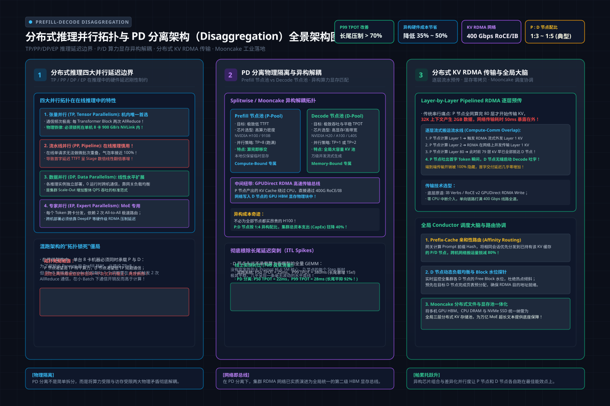
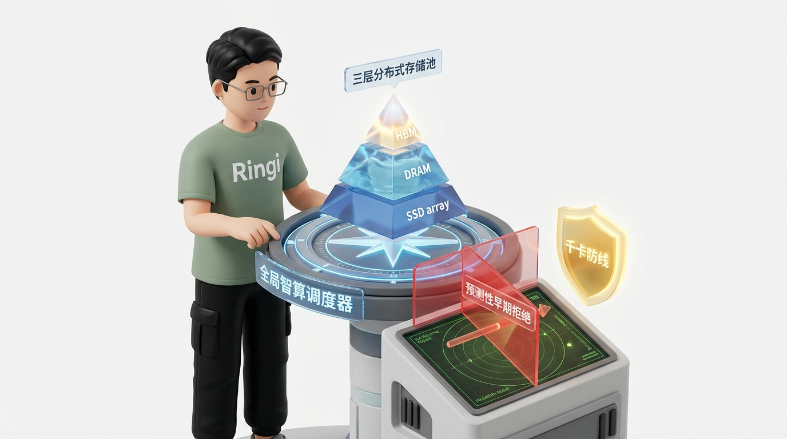

# 🏛️ 第35讲：算存矛盾与解耦革命——分布式推理并行拓扑（TP/PP/DP/EP）与 PD 分离架构（Prefill-Decode Disaggregation）全景攻防

> **主讲人**：👓 **Ringi**（大厂 AI Infrastructure 工程师）  
> **所属模块**：[Module 05: LLM 在线推理系统与性能工程](./README.md)  
> **篇章范式**：🚀 LLM 推理服务与高性能 Serving 篇（Inference Serving & Systems Paradigm）  
> **核心导读**：在前面的课程中，我们攻克了 PagedAttention 的分页显存革命、Continuous Batching 动态调度，以及 vLLM 核心加速引擎（Prefix Caching、CUDA Graph、量化与投机采样）。然而，当你在真实企业级智算中心面对 32K、128K 乃至 1M 的超长上下文在线请求时，传统将 Prefill（首字预填充）与 Decode（自回归解码）捆绑在同一组 GPU 上的“合设架构（Collocated Serving）”会瞬间暴露出致命的物理死结：一个超长 Prompt 冲入集群，瞬时吞噬全部 Tensor Cores，导致几十个正在稳定吐字的 Decode 请求出现数十倍的长尾延迟突刺（P99 TPOT 飙升破秒），SLO 彻底崩溃！本讲我们将从第一性原理出发，系统梳理大模型推理场景下 TP/PP/DP/EP 四大并行拓扑的物理延迟边界，彻底剖析 Prefill（Compute-Bound）与 Decode（Memory-Bound）的硬件资源错配，并全面拆解下一代分布式 Serving 的终极形态——**PD 分离架构（Prefill-Decode Disaggregation）**。我们将深入 KV Cache 跨节点高速传输设计空间（RDMA、Layerwise 流水线隐藏、Push vs Pull）、分层缓存存储池（Mooncake）、全局智算调度（Conductor）与大厂真实容量规划。


```text
========================================================================================================================
                                     Ringi 3D 架构工坊 · 分布式推理与 PD 分离解耦全景
========================================================================================================================

  [客户端高并发混合请求流: 长短 Prompt 混杂, 严格 SLO 约束 (TTFT < 500ms, TPOT < 30ms)]
                             │
                             ▼
  ┌──────────────────────────────────────────────────────────────────────────────────────────────────────────────────┐
  │  全局智算路由与流量编排中心 (Global Router & Cache-Aware Conductor)                                             │
  │  • 语义/前缀哈希指纹匹配 ──► 计算全局命中率 H ──► 结合实例等待队列评估 Score = (1-H)*D_prefill + α*Q             │
  │  • 预测性早期拒绝 (Predictive Early Rejection): 识别并拦截注定会超时的请求, 保护全集群良好吞吐量 (Goodput)     │
  └──────────────────────────┬──────────────────────────────────────────────────────────┬────────────────────────────┘
                             │ 调度 Prefill 任务 (携带目标 D-Node 路由标识)              │ 调度 Decode 存量接力
                             ▼                                                          ▼
  ┌────────────────────────────────────────────────────────┐  ┌─────────────────────────────────────────────────────┐
  │  🔥 预填充节点池 (Prefill Pool / P-Nodes)              │  │  ⚡ 自回归解码节点池 (Decode Pool / D-Nodes)         │
  │  • 物理特性: Compute-Bound (高算术强度 GEMM)           │  │  • 物理特性: Memory-Bound (极低算术强度 GEMV)       │
  │  • 核心目标: 极致压榨 Tensor Cores, 削减 TTFT          │  │  • 核心目标: 极致利用 HBM 带宽与容量, 保障稳态 TPOT │
  │  • 硬件适配: 高算力 GPU (如 H100 / H800 / 910B)        │  │  • 硬件适配: 大显存容量/高带宽 GPU (如 A100 / H20)   │
  │  • 并行拓扑: 高 TP (TP=4/8) 极大化并行算力             │  │  • 并行拓扑: 低 TP (TP=1/2) 避免 AllReduce 纯延迟    │
  └──────────────────────────┬─────────────────────────────┘  └─────────────────────────▲───────────────────────────┘
                             │                                                          │
                             │  🚀 核心桥梁: KV Cache 跨节点极速搬运通道 (The KV Bridge) │
                             └──────────────────────────────────────────────────────────┘
                                • 物理介质: GPUDirect RDMA (RoCE / IB, 400Gbps+) 绕过 CPU 零拷贝
                                • 时序策略: Layerwise Pipelining (逐层流水线边算边传, 隐藏 95%+ 网络开销)
                                • 传输语义: Push 主动直推 / Pull-with-Cache 全局拉取 / 增量传输
                                • 分层池化: L1 GPU HBM ◄──► L2 Host DRAM ◄──► L3 Local NVMe SSD (Mooncake)
========================================================================================================================
```

<!-- more -->

## 📑 目录导航

- [0. Ringi 开场：生产真实现场与痛点冲突](#0-ringi-开场生产真实现场与痛点冲突)
  - [0.1 真实工程矛盾：当 100K 长文本 Prefill 砸向集群，为什么所有在线用户的打字机瞬间集体卡死？](#01-真实工程矛盾当-100k-长文本-prefill-砸向集群为什么所有在线用户的打字机瞬间集体卡死)
  - [0.2 线上真实事故复盘：某头部金融 RAG 助手合设部署遭遇长尾延迟雪崩——P99 TPOT 飙升破 3 秒，SLO 全面破产](#02-线上真实事故复盘某头部金融-rag-助手合设部署遭遇长尾延迟雪崩p99-tpot-飙升破-3-秒slo-全面破产)
  - [0.3 合设架构（Collocated）vs 解耦架构（Disaggregated）全景特性速查表](#03-合设架构collocated-vs-解耦架构disaggregated全景特性速查表)
- [1. 分布式推理并行拓扑与通信延迟边界（TP / PP / DP / EP）](#1-分布式推理并行拓扑与通信延迟边界tp--pp--dp--ep)
  - [1.1 推理场景下的 TP（张量并行）：为什么机内 NVLink 是生死底线？Decode 阶段小 Batch 对 AllReduce 延迟的极速反噬](#11-推理场景下的-tp张量并行为什么机内-nvlink-是生死底线decode-阶段小-batch-对-allreduce-延迟的极速反噬)
  - [1.2 推理场景下的 PP（流水线并行）：为什么 1F1B 在低并发推理中全是气泡（Bubble）？](#12-推理场景下的-pp流水线并行为什么-1f1b-在低并发推理中全是气泡bubble)
  - [1.3 DP（数据并行）与分布式前缀路由：从简单副本扩展到集群全局前缀共享](#13-dp数据并行与分布式前缀路由从简单副本扩展到集群全局前缀共享)
  - [1.4 EP（专家并行）在 MoE 推理中的实战落地：DeepSeek-V2/V3 万亿 MoE 的跨机 All-to-All 挑战](#14-ep专家并行在-moe-推理中的实战落地deepseek-v2v3-万亿-moe-的跨机-all-to-all-挑战)
- [2. PD 分离架构第一性原理：计算密集与访存密集的物理死结](#2-pd-分离架构第一性原理计算密集与访存密集的物理死结)
  - [2.1 物理特征两极分化：Prefill 与 Decode 共享硬件的互毁效应](#21-物理特征两极分化prefill-与-decode-共享硬件的互毁效应)
  - [2.2 为什么 Chunked Prefill 只是“镇痛剂”而非“根治药”？](#22-为什么-chunked-prefill-只是镇痛剂而非根治药)
  - [2.3 硬件异构化诉求（Splitwise 原理）：算力卡与显存带宽卡的最佳分离实践](#23-硬件异构化诉求splitwise-原理算力卡与显存带宽卡的最佳分离实践)
- [3. 核心技术深水区：KV Cache 跨节点高速传输与设计空间](#3-核心技术深水区kv-cache-跨节点高速传输与设计空间)
  - [3.1 公式五步穿透：大规模 KV Cache 跨机传输量与网络延迟数学小算盘（No Naked Formula 2.0）](#31-公式五步穿透大规模-kv-cache-跨机传输量与网络延迟数学小算盘no-naked-formula-20)
  - [3.2 传输三维设计空间：Push vs Pull、Eager vs Pipelined、完整 vs 增量](#32-传输三维设计空间push-vs-pulleager-vs-pipelined完整-vs-增量)
  - [3.3 逐层流水线重叠（Layerwise Pipelining）：如何利用 RDMA 将网络搬运时间彻底隐藏？](#33-逐层流水线重叠layerwise-pipelining如何利用-rdma-将网络搬运时间彻底隐藏)
- [4. 工业级 PD 分离开源架构全景剖析（DistServe / Mooncake / vLLM V1）](#4-工业级-pd-分离开源架构全景剖析distserve--mooncake--vllm-v1)
  - [4.1 DistServe（OSDI '24）：Goodput 驱动的解耦设计与两阶段资源独立调优](#41-distserveosdi-24goodput-驱动的解耦设计与两阶段资源独立调优)
  - [4.2 Mooncake（Moonshot Kimi）：以 KV Cache 为中心的多层分布式存储池架构](#42-mooncakemoonshot-kimi以-kv-cache-为中心的多层分布式存储池架构)
  - [4.3 vLLM V1 KV Connector 规范：标准解耦接口与可插拔后端抽象](#43-vllm-v1-kv-connector-规范标准解耦接口与可插拔后端抽象)
- [5. 全局智算调度器与生产容量规划（Global Conductor & Capacity Planning）](#5-全局智算调度器与生产容量规划global-conductor--capacity-planning)
  - [5.1 全局路由编排：前缀命中感知路由（Cache-Aware Routing）与动态负载打分模型](#51-全局路由编排前缀命中感知路由cache-aware-routing与动态负载打分模型)
  - [5.2 预测性早期拒绝（Predictive Early Rejection）：保护高载集群的有效产出（Goodput）](#52-预测性早期拒绝predictive-early-rejection保护高载集群的有效产出goodput)
  - [5.3 生产级 P:D 节点动态配比算盘：基于业务流输入输出比（Lin / Lout）的容量规划](#53-生产级-pd-节点动态配比算盘基于业务流输入输出比lin--lout的容量规划)
- [6. 动手实战与代码实验室（Minimal Runnable Code）](#6-动手实战与代码实验室minimal-runnable-code)
  - [6.1 实验一：基于真实张量流与跨节点模拟的 PD 分离与合设性能对比实验器（`pd_disaggregation_simulator.py`）](#61-实验一基于真实张量流与跨节点模拟的-pd-分离与合设性能对比实验器pd_disaggregation_simulatorpy)
  - [6.2 实验二：工业级 KV Cache 跨机逐层流水线传输模拟器（`layerwise_kv_streamer.py`）](#62-实验二工业级-kv-cache-跨机逐层流水线传输模拟器layerwise_kv_streamerpy)
- [7. Ringi 避坑指南与生产黄金准则](#7-ringi-避坑指南与生产黄金准则)
  - [7.1 8 大常见小白认知误区 vs 大厂 AI Infra 正确物理认知](#71-8-大常见小白认知误区-vs-大厂-ai-infra-正确物理认知)
  - [7.2 生产 PD 分离系统落地与稳定性保障黄金 Checklist](#72-生产-pd-分离系统落地与稳定性保障黄金-checklist)
- [8. Ringi 5 点核心速记口诀、自我检验清单与课后深度思考题](#8-ringi-5-点核心速记口诀自我检验清单与课后深度思考题)
  - [8.1 5 点押韵核心速记口诀](#81-5-点押韵核心速记口诀)
  - [8.2 10 条白板自我检验清单](#82-10-条白板自我检验清单)
  - [8.3 3 道高阶开放式课后思考题（含极端 Corner Case）](#83-3-道高阶开放式课后思考题含极端-corner-case)
- [9. 📚 参考资料与核心源码/经典论文指引](#9--参考资料与核心源码经典论文指引)
- [附录：Appendix A — 大厂硬核高频面试题与白板推导（Interview Drill）](#附录appendix-a--大厂硬核高频面试题与白板推导interview-drill)
- [🎨 【配图工坊生图 Prompt 暂存区 · 生成配图后可一键整块删除】](#-配图工坊生图-prompt-暂存区--生成配图后可一键整块删除)

---

# 0. Ringi 开场：生产真实现场与痛点冲突

### 0.1 真实工程矛盾：当 100K 长文本 Prefill 砸向集群，为什么所有在线用户的打字机瞬间集体卡死？

在传统的模型服务架构中，几乎所有主流引擎（从最早的 FasterTransformer、TGI 到 vLLM 初期）都采用了一种极其符合直觉的架构设计——**合设模式（Collocated Serving）**：
一个推理节点（无论是单卡还是 8 卡 TP 实例）同时负责处理这个请求的完整生命周期。请求来了，这组 GPU 先跑 Prefill 算出一堆 KV Cache；接着，同一组 GPU 原地转入 Decode，一个词接一个词地自回归吐字，直到输出 `<|endoftext|>`。

在短文本、低并发的微调演示场景下，合设模式工作得相当平稳。  
**但是，一旦将业务推向长文本问答、代码仓库分析、法律合同审查或 RAG 检索增强等真实企业级场景时，整个系统的性能表现会突然出现断崖式崩塌！**

请观察下面这个在生产机房中每天都在上演的“灾难时刻”：
1. 实例正在为 40 个在线用户并发执行自回归解码（Decode），每个用户的客户端正以丝滑的 35 Tokens/s（单步延迟约 28ms）匀速打印字句，用户体验极佳；
2. 此时，突然有一个用户上传了一篇 64KB 的技术文档，发起了一个包含 **32,000 个 Token** 的分析请求；
3. 调度器按照 Continuous Batching 规则将这个长 Prompt 纳入当前批次。
4. **灾难瞬间降临**：GPU 上的数十个 Streaming Multiprocessor（SM）和数百个 Tensor Cores 立刻被这个 32K Token 的巨型矩阵乘法（GEMM）吃得干干净净！
5. 在接下来的 **800 毫秒** 内，整个 GPU 的计算核心处于绝对饱和状态；
6. **而那 40 个正在等待吐字的普通用户，其客户端的打字机瞬间定格卡死！** 原本 28ms 的字间延迟（TPOT）在一瞬间被强行拉长到 **828ms**！
7. 用户的直观感受是：页面突然陷入卡顿假死，过了将近一秒钟才极其突兀地喷出下一个词。

这就是现代大模型在线推理系统中最痛彻心扉的**“合设干扰死结（Collocation Interference）”**。

---

### 0.2 线上真实事故复盘：某头部金融 RAG 助手合设部署遭遇长尾延迟雪崩——P99 TPOT 飙升破 3 秒，SLO 全面破产

2024 年秋，国内某头部券商上线了一套基于 LLaMA-3-70B 的智能投研助手，部署在 16 台 8 卡 H800（共 128 张 GPU）上，采用业界标准的 vLLM 合设集群方案，配置了 Tensor Parallelism (TP=8)，开启了 Continuous Batching 与 Chunked Prefill（chunk_size=512）。

业务刚上线时，平均 Prompt 长度只有 500 Tokens，系统 P99 TTFT 为 320ms，P99 TPOT 为 32ms，服务等级目标（SLO，要求 P99 TPOT < 50ms）达成率高达 99.6%。

**事故爆发：研报季流量突变**
随着财报季来临，投研分析师们开始疯狂向系统批量投喂长达 40~80 页的上市企业财报 PDF（Prompt 长度普遍在 25,000 ~ 65,000 Tokens 之间）：
- **现象一（P99 延迟失控）**：系统的吞吐量并没有显著下降，但客户端监控报警全线飙红。**P99 TPOT 从 32ms 狂飙至 3,850ms（恶化超 100 倍！）**，大量的在线前端请求触发超时熔断，用户投诉铺天盖地；
- **现象二（Chunked Prefill 救火失败）**：运维团队紧急将 Chunked Prefill 的分块大小从 512 调低到 256，试图为 Decode 腾出计算时间。结果发现：TPOT 抖动确实略有收敛（降到 800ms），但 **TTFT 出现了灾难性膨胀**！一个 64K 的研报请求需要被切分成 256 个 Chunk 逐步执行，光是完成预填充拿到第一个字，就需要等待 **超过 12 秒**！
- **现象三（硬件算力严重浪费）**：从监控上看，GPU 的 HBM 显存使用率常年维持在 95% 以上（被超长 KV Cache 占满），但 GPU 的 Tensor Core 算力利用率（MFU）在 Decode 阶段却凄惨地徘徊在 **12% 左右**！价值数千万元的高性能 H800 服务器，其昂贵的计算核心绝大部分时间都在空转等待 HBM 读数！

该金融机构的性能架构团队最终通过架构重构，彻底摒弃合设模式，改用 **PD 分离架构**，将集群切分为 Prefill 资源池与 Decode 资源池，配合 RDMA KV 传输，在相同硬件成本下将 P99 TPOT 牢牢锁死在 38ms 以内，SLO 达标率重回 99.9%。

---

### 0.3 合设架构（Collocated）vs 解耦架构（Disaggregated）全景特性速查表

| 评估维度 | 传统合设架构（Collocated Serving） | 下一代 PD 分离解耦架构（Disaggregated Serving） | 物理本质根因 |
| :--- | :--- | :--- | :--- |
| **执行模式** | Prefill 与 Decode 共享同一台机、同一张 GPU 的 SM 与 HBM | Prefill 与 Decode 在物理上隔离在不同的专用节点池运行 | 彻底消除两阶段的计算/访存资源硬件竞争 |
| **首字延迟（TTFT）** | 易受并发 Decode 挤压，在开启小 Chunk 削峰时严重恶化 | 独享专属计算算力，使用大 TP 极速完成 GEMM，TTFT 达到硬件物理极限 | P 节点不受 Decode 访存排队阻塞 |
| **字间延迟（TPOT / ITL）** | 极度不稳定，长 Prompt 涌入时发生严重长尾延迟突刺（P99 破秒） | 高度平稳且可预测，P99 与 P50 几乎持平（稳态在 20~30ms） | D 节点完全不承载计算密集型的巨型 GEMM |
| **硬件匹配度** | 妥协型配置：必须同时迁就高算力与高显存，导致昂贵芯片算力空转 | **按需异构**：P 节点选高算力卡（H100/910B），D 节点选大带宽/大显存卡（A100/H20/L40S） | 符合 Splitwise 硬件异构化成本最优律 |
| **并行策略灵活性** | P 和 D 被迫采用相同的 TP/PP 拓扑（通常 TP=4 或 8） | **正交自由度**：P 节点可用 TP=8 压榨算力，D 节点可用 TP=1/2 避免 AllReduce 延迟 | 两阶段对通信延迟敏感度完全不同 |
| **系统核心瓶颈** | GPU 内部的 SM 算力争抢与 HBM 访存总线拥塞 | **网络数据搬运**：P 节点算出的 KV Cache 必须通过高速网络送达 D 节点 | 瓶颈从单机芯片内部转移到集群网络交换机 |
| **网络底座要求** | 普通以太网（10G/25G）即可满足，仅需传输输入输出 Token ID | **强制要求 GPUDirect RDMA（100G/400G RoCE 或 InfiniBand）** | KV Cache 体量极大（每 Token 达数百 KB） |
| **适用业务场景** | 短文本问答、代码补全、低并发本地测试环境 | 超长上下文（32K~1M）、RAG、高并发生产级 SaaS 平台 | 流量混杂且对 P99 长尾 SLO 有刚性要求 |

---

# 1. 分布式推理并行拓扑与通信延迟边界（TP / PP / DP / EP）

> 💡 **架构全景速览**：在深潜源码前，先在白板上建立坚不可摧的分布式推理拓扑、PD 分离架构与 KV Cache RDMA 传输底账。
> 
> 

在拆解 PD 分离之前，我们必须首先在全栈视角下回答一个看似简单却极易踩坑的底层问题：**在分布式推理场景下，经典的四大并行拓扑（TP、PP、DP、EP）是如何运行的？它们的硬件延迟边界究竟在哪里？**

```text
========================================================================================================================
                                     分布式推理四大并行维度与通信时延边界
========================================================================================================================
  1. 张量并行 (TP)  ──► 算子内切分 ──► 依赖单步 AllReduce  ──► 强依赖机内 NVLink (900 GB/s), 严禁跨机走网络 (≤8 卡)
  2. 流水线并行 (PP)──► 跨层切分   ──► 逐层传递 Activation ──► 低并发推理气泡率高达 (PP-1)/PP, 增加单步跳数与延迟
  3. 数据并行 (DP)  ──► 请求级分发 ──► 无模型内通信        ──► 线性扩展总并发吞吐, 适合作为外层框架
  4. 专家并行 (EP)  ──► 稀疏激活   ──► 跨卡 All-to-All     ──► MoE 模型标配, 极度考验机间低延迟通信 (如 DeepEP)
========================================================================================================================
```

---

### 1.1 推理场景下的 TP（张量并行）：为什么机内 NVLink 是生死底线？Decode 阶段小 Batch 对 AllReduce 延迟的极速反噬

在大模型训练中，我们常用 TP=8 将一个巨型模型的权重按行（Row Parallel）或按列（Column Parallel）切分到 8 张卡上。在 Transformer 的自注意力（Attention）与前馈网络（MLP）中，每一层都需要进行两次全规约（AllReduce）操作。

#### 为什么训练可以接受，而在线推理 Decode 阶段对 TP 的通信延迟如此致命？

我们用真实生产数据来算一笔账：
- **在训练阶段**：Batch Size 通常很大（例如 1024 Tokens），计算时间长达数十毫秒，单次机内 AllReduce 耗时约 $5\sim 10\mu s$，通信时间在总时间中占比不足 5%，可以被计算轻松掩盖；
- **在推理 Decode 阶段**：每个活跃请求每次**只处理 1 个 Token**！假设当前并发批次 $B=8$，矩阵维度为 $[8, 1, 4096] \times [4096, 4096/TP]$。这根本不是标准的矩阵乘法（GEMM），而是访存受限的**矩阵向量乘（GEMV）**！
  在 NVIDIA H100 GPU 上，这样一个极小规模的 GEMV 计算内核执行时间仅仅需要 **$10\sim 15\mu s$**！

此时通信开销的占比瞬间反客为主：
1. **机内 NVLink 通信**：单次跨卡 AllReduce 硬件底噪时延在 $5\sim 8\mu s$ 左右；
2. **单层 Transformer**：包含 1 次 Attention 输出投影 AllReduce + 1 次 MLP 下投影 AllReduce = **2 次 AllReduce**；
3. **80 层的 LLaMA-3-70B 模型**：单个 Decode Token 步进中，总共需要连续串行执行：

$$
80 \times 2 = 160 \text{ 次 AllReduce 通信！}
$$

4. **纯通信等待时间**：

$$
T_{\text{comm}} = 160 \times 6\mu s \approx 0.96 \text{ ms}
$$

   此时，计算总耗时才不过 $160 \times 12\mu s \approx 1.92\text{ ms}$。通信等待已经吃掉了整整三分之一的时间！

**如果敢跨机做 TP（跨越网络光纤走 InfiniBand / RoCE）：**
跨机网络的单次 AllReduce 延迟至少是 **$30\sim 50\mu s$**！

$$
T_{\text{comm-inter-node}} = 160 \times 40\mu s = 6.4 \text{ ms！}
$$

硬件计算只要 1.9ms，通信却要等 6.4ms，GPU 算力利用率当场跌破 20%！

> 👓 **Ringi 工程师铁律**：  
> **推理场景下的张量并行（TP）绝不能跨越机内物理拓扑边界！TP 的规模上限被物理锁死在单台服务器的最大 GPU 槽位数（通常为 8 卡 NVLink）。在 Decode 阶段，盲目追求大 TP 不仅无法降低单步延迟，反而会因为频繁的 AllReduce 硬件同步底噪导致 TPOT 严重恶化！**

---

### 1.2 推理场景下的 PP（流水线并行）：为什么 1F1B 在低并发推理中全是气泡（Bubble）？

在分布式训练中，流水线并行（PP）依靠将巨型 Batch 切分为成百上千个微批次（Micro-batch），通过精巧的 1F1B（One Forward, One Backward）调度让各个 Stage 像流水线工人一样持续满负荷运转，气泡率可以被压制到 10% 以下。

**但在在线推理（尤其是自回归 Decode 阶段），PP 几乎是一个“吞吐陷阱”**：
1. **请求异步到达**：在线推理的请求具有随机性与泊松分布特征，无法凑齐数百个均匀的微批次；
2. **气泡率数学定理**：如果当前批次规模为 $B$，流水线级数为 $P$，则推理前向传播的气泡率公式为：

$$
\text{Bubble Ratio} = \frac{P - 1}{P + B - 1}
$$

   - 假设 $P=4$（模型切在 4 台节点上），当线上并发较低、 $B=1$ 时：

$$
\text{Bubble Ratio} = \frac{4 - 1}{4 + 1 - 1} = \frac{3}{4} = 75\%！
$$

     整整 75% 的时间里，四分之三的服务器处于完全空转状态！每个 Token 必须像击鼓传花一样在 4 台机器间串行走一圈，**单步延迟被硬生生放大了 4 倍**！
3. **唯一的救赎场景**：只有在超大并发（ $B \gg 64$ ）或者超大模型（如 405B、万亿模型单机 8 卡 HBM 根本放不下权重）时，PP 才是不得已而为之的容量妥协方案。

---

### 1.3 DP（数据并行）与分布式前缀路由：从简单副本扩展到集群全局前缀共享

数据并行（DP）在推理中表现为**完全独立的服务实例复制**：
每个 DP Worker 持有完整的模型权重副本（可能自身内部开启了 TP=8），独立接收并处理来自 API Gateway 的请求。

在现代长文本推理中，DP 的演进重点已经从简单的 Round-Robin（轮询）进化为 **前缀感知路由（Cache-Aware Routing）**：
- **传统无脑轮询**：用户 A 针对某篇长研报发起了 5 轮对话，请求被随机分发到 DP-Node 1、DP-Node 3、DP-Node 2... 导致每台机器都在重复计算并缓存该研报的 KV Cache，显存被极度重复浪费；
- **现代分布式哈希路由**：网关提取请求中 System Prompt 或历史文档的 SHA256 哈希值，采用**一致性哈希（Consistent Hashing）**将同一主题的会话固定调度到同一组 DP 节点上，使得节点本地的 Prefix Cache 命中率飙升至 80% 以上！

---

### 1.4 EP（专家并行）在 MoE 推理中的实战落地：DeepSeek-V2/V3 万亿 MoE 的跨机 All-to-All 挑战

随着 DeepSeek-V2、DeepSeek-V3 等顶级开源 MoE 架构的爆发，大模型推理全面进入了**专家并行（Expert Parallelism, EP）时代**：
- 以 DeepSeek-V3 为例，总参数量高达 671B，包含 256 个细粒度路由专家（Routed Experts）与 1 个共享专家（Shared Expert），每个 Token 动态激活其中的 8 个专家；
- 671B 的权重不可能放在单机 8 卡内，必须通过 EP 切分到多台服务器（如 32 卡、64 卡）；
- 在推理计算时：
  1. 前半段 Attention：使用常规机内 TP 或分布式 DP；
  2. 路由分拣：Router 算出门控权重后，必须通过 **All-to-All 集合通信原语** 将属于不同卡上专家的 Token 跨机打散发送过去（Dispatch）；
  3. 各卡专家运算：专有专家计算 FFN 矩阵乘；
  4. 结果聚合：再次通过 **All-to-All** 将计算后的隐藏层张量原路收回并求和（Combine）。

> 🔍 **核心矛盾**：  
> Decode 阶段每个 Token 步进都必须经历两次跨机 All-to-All！如果走传统的慢速 NCCL 调度，每次 All-to-All 都会产生毫秒级的网络等待。这也是为什么 DeepSeek 必须自研 **DeepEP（低延迟跨机通信库）**，利用硬件 RDMA 与常驻持久化内核（Persistent Kernel）将通信延迟压制到纳秒级别。

---

# 2. PD 分离架构第一性原理：计算密集与访存密集的物理死结

在搞清楚了分布式推理的并行底账后，我们终于可以直面整个推理系统工程中最核心的矛盾：**为什么必须将 Prefill 与 Decode 彻底物理拆分？**

```text
========================================================================================================================
                                     Prefill 与 Decode 两阶段第一性原理碰撞
========================================================================================================================
  指标 / 物理维度       🔥 Prefill（首字预填充）阶段                 ⚡ Decode（自回归解码）阶段
========================================================================================================================
  1. 算术强度 (AI)      很高 (100 ~ 500 FLOPs/Byte)                  极低 (1 ~ 2 FLOPs/Byte)
  2. 硬件运行瓶颈       Compute-Bound (撞上 Tensor Core 算力天花板)   Memory-Bound (撞上 HBM 显存带宽与容量墙)
  3. 核心计算算子       矩阵乘法 (GEMM: M 大, K 大, N 大)            矩阵向量乘 (GEMV: M=1, 仅反复加载权重)
  4. 关键关注指标       TTFT (Time-To-First-Token, 首字延迟)         TPOT / ITL (Time-Per-Output-Token, 吐字流速)
  5. 显存动态行为       瞬间暴增海量 KV Cache 物理块                 每次只写入 1 个 Token 的 KV, 但需读取全部历史
  6. 算力硬件偏好       极端偏好算力核心 (H100 / H800 / 910B)        极端偏好 HBM 容量与带宽 (A100 / H20 / L40S)
========================================================================================================================
```

---

### 2.1 物理特征两极分化：Prefill 与 Decode 共享硬件的互毁效应

我们使用计算机体系结构的 **屋顶线模型（Roofline Model）** 来审视这两个阶段：

```text
算术强度 (Arithmetic Intensity) = 计算量 (FLOPs) / 内存访问量 (Bytes)
```

#### 1. Prefill 阶段：典型的 Compute-Bound
假设一个输入 Prompt 长度为 $S=4096$，隐藏层维度 $d=4096$。
在 Attention 投影中，GEMM 计算量为 $2 \times S \times d^2 = 2 \times 4096 \times 4096^2 \approx 1.37 \times 10^{11} \text{ FLOPs}$。  
读取一次模型权重需要的显存访问量仅为 $2 \times d^2 \approx 33.5 \text{ MB}$。  
其算术强度高达：

$$
AI_{\text{prefill}} = \frac{2 \times S \times d^2}{2 \times d^2} = S = 4096 \text{ FLOPs/Byte} \gg 150 \text{ FLOPs/Byte}
$$

**这远远超越了现代任何 GPU 的平衡转折点！** 此时 GPU 的显存总线完全来得及供数，所有计算管线被全部填满，SM 上的 Tensor Cores 在极限轰鸣。

#### 2. Decode 阶段：典型的 Memory-Bound
而在自回归生成的第 $t$ 步，每个请求只有一个新生成的 Token（ $S=1$ ）。
此时执行同样的权重矩阵相乘：计算量为 $2 \times 1 \times d^2 \approx 3.35 \times 10^7 \text{ FLOPs}$。  
但为了这区区 3300 万次运算，GPU **必须把整整 33.5 MB 的权重完整地从 HBM 读取一遍！**  
其算术强度为：

$$
AI_{\text{decode}} = \frac{2 \times 1 \times d^2}{2 \times d^2} = 1 \text{ FLOP/Byte！}
$$

在 H100 GPU（FP16 峰值 989 TFLOPs，HBM3 带宽 3.35 TB/s）上：
- 硬件平衡拐点为 $989 \times 10^{12} / (3.35 \times 10^{12}) \approx 295 \text{ FLOPs/Byte}$；
- 算术强度为 1，意味着 **H100 强大的 Tensor Cores 只能发挥出不足 1% 的理论算力**，剩下的时间全部在痛苦地等待 HBM 慢吞吞地将权重搬运过来！

#### 3. 互毁效应（The Mutual Destruction）
当你强行把这两者调度在同一个 GPU 上组批执行时：
- **Prefill 摧毁 Decode 的平稳度**：Prefill 的大矩阵运算会霸占 SM 调度器和计算单元，正在解码的请求只能在队列中挂起等待，导致 **TPOT 出现严重的长尾抖动（Jitter）**；
- **Decode 摧毁 Prefill 的计算能效**：Decode 需要常驻海量存量请求的 KV Cache，挤占了极其宝贵的 GPU 显存容量空间，导致 Prefill 无法使用更大的 Batch Size 来跑满算力，**TTFT 被迫拉长**。

---

### 2.2 为什么 Chunked Prefill 只是“镇痛剂”而非“根治药”？

在 vLLM 等合设框架中，为了缓解上述矛盾，社区推出了著名的 **Chunked Prefill（分块预填充）** 技术：
如果一个用户的 Prompt 长达 8,192 Tokens，调度器不再一次性将其执行完，而是切成 16 个大小为 512 的 Chunk，分步塞进后续的每一个调度 Iteration 中，与存量的 Decode 请求一起拼成混合批次（Mixed Batch）。

**Chunked Prefill 为什么无法彻底解决问题？**
1. **显存总线竞争不可消除**：在一个 Mixed Batch 中，Decode 依然在疯狂吞噬 HBM 读取带宽，而 Prefill 的中间激活值写入也在争抢显存总线，导致底层访存发生局部冲突，Decode 的延迟依然会上升 20%~40%；
2. **TTFT 线性劣化**：原本一次性可以在 200ms 内算完的 8K Prompt，被强行切成 16 步后，必须经历 16 次调度循环和模型前向，端到端首字延迟（TTFT）往往会暴涨到 **1200ms 以上**；
3. **容量扩缩容死结**：当在线业务遭遇“白天高并发短问答（Decode 为主）、夜间批量离线长文档处理（Prefill 为主）”的潮汐流量时，合设集群无法独立对 Prefill 算力或 Decode 显存进行单向弹性扩缩容，导致巨大的资源闲置浪费。

---

### 2.3 硬件异构化诉求（Splitwise 原理）：算力卡与显存带宽卡的最佳分离实践

在 ISCA 2024 的经典论文 **Splitwise** 中，系统架构师们指出了合设模式在经济账本上的荒谬之处：
- **Prefill 节点**：只在乎 **FLOPS / Dollar（单位算力性价比）**，它不需要保留海量的长期 KV Cache，处理完 Prompt 就可以将显存释放。因此，它最适合选用配备高密度 Tensor Cores、支持极致低精度算力的高端芯片（如 NVIDIA H100/H800、华为昇腾 910B）；
- **Decode 节点**：只在乎 **GB/s per Dollar（单位显存带宽性价比）与 GB per Dollar（单位容量性价比）**。它的 Tensor Cores 根本吃不满，昂贵的 FP8/FP16 矩阵乘算力在小 Batch 下纯属摆设。因此，它更适合选用单卡拥有 96GB~144GB 超大显存、高带宽但算力相对较低的性价比芯片（如 NVIDIA H20、L40S、A100-80G）。

> 💡 **核心结论**：  
> **PD 分离不仅是软件调度维度的解耦，更是硬件基础设施维度的解耦！它让算力卡专门跑 Prefill，让显存卡专门跑 Decode，在数据中心层面实现了算存比的帕累托最优（Pareto Optimality）。**

---

# 3. 核心技术深水区：KV Cache 跨节点高速传输与设计空间

一旦我们在物理上把 Prefill 节点（P-Node）与 Decode 节点（D-Node）分开，整个分布式推理系统的生命线就落到了同一个技术咽喉上：  
**Prefill 节点算出来的巨型 KV Cache，究竟该怎么搬运到 Decode 节点上？**


```text
========================================================================================================================
                                     KV Cache 跨节点传输流水线 (Layerwise Pipelining)
========================================================================================================================
  Prefill GPU (P-Node):
  ┌──────────────┐   ┌──────────────┐   ┌──────────────┐               ┌──────────────┐
  │ Layer 0 算完 ├──►│ Layer 1 算完 ├──►│ Layer 2 算完 ├──► ... ──────►│Layer 79 算完 ├──► 触发首个 Token 生成!
  └──────┬───────┘   └──────┬───────┘   └──────┬───────┘               └──────┬───────┘
         │ (异步流)          │ (异步流)          │ (异步流)                     │ (异步流)
         ▼                  ▼                  ▼                              ▼
  ═════════════════════════════════════════════════════════════════════════════════════════ GPUDirect RDMA 网络线路
         │ (2.6ms)          │ (2.6ms)          │ (2.6ms)                      │ (2.6ms) ──► 仅最后一层暴露延迟!
         ▼                  ▼                  ▼                              ▼
  Decode GPU (D-Node):
  ┌──────────────┐   ┌──────────────┐   ┌──────────────┐               ┌──────────────┐
  │ Layer 0 写入 ├──►│ Layer 1 写入 ├──►│ Layer 2 写入 ├──► ... ──────►│Layer 79 写入 ├──► 接力开启自回归迭代!
  └──────────────┘   └──────────────┘   └──────────────┘               └──────────────┘
========================================================================================================================
```

---

### 3.1 公式五步穿透：大规模 KV Cache 跨机传输量与网络延迟数学小算盘（No Naked Formula 2.0）

很多初入分布式推理领域的工程师往往轻视网络传输，认为“几个张量跨机复制一下能有多慢？”。现在，我们用 **No Naked Formula 2.0** 将这笔物理账彻底穿透。

#### 步骤 1：为什么需要算它？
因为 KV Cache 的跨机网络传输延迟会**直接累加在用户的端到端首字延迟（TTFT）之上**！如果传输时间甚至超过了 GPU 的 Prefill 计算时间，那么 PD 分离在工程上就是负优化。

#### 步骤 2：Mental Model（物理直觉比喻）
把 Prefill 节点想象为中央厨房，把 Decode 节点想象为快餐厅。中央厨房切好了一整箱半成品食材（KV Cache）。如果等整桌 80 道菜全切完，再叫一辆货车（网络）整体运过去，快餐厅在货车到达前只能干等；而如果货车速度不够快，食材甚至会在路上堵半小时。

#### 步骤 3：Tiny Calculator（极简数字小算盘）
我们以业界标杆 **LLaMA-3-70B（80 层，GQA 机制下 Key/Value 各有 8 个 Head，每个 Head 维度 $d_{\text{head}}=128$ ）** 为例：
1. **单个 Token、单个 Layer 的 KV 大小**：
   - Key 张量： $8 \text{ heads} \times 128 \times 2 \text{ bytes (FP16/BF16)} = 2,048 \text{ bytes} = 2 \text{ KB}$；
   - Value 张量：同样为 $2 \text{ KB}$；
   - 单层合计： $2 \text{ KB} + 2 \text{ KB} = 4 \text{ KB}$。
2. **单个 Token 在全部 80 层累积的 KV 大小**：

$$
\text{Size}_{\text{token}} = 80 \times 4 \text{ KB} = 320 \text{ KB / Token！}
$$

3. **当输入 Prompt 长度为 $L = 4,096$（4K）时**：

$$
\text{Size}_{\text{4K}} = 4,096 \times 320 \text{ KB} = 1,310,720 \text{ KB} \approx \mathbf{1.28 \text{ GB}}
$$

4. **当输入 Prompt 长度为 $L = 32,768$（32K）时**：

$$
\text{Size}_{\text{32K}} = 32,768 \times 320 \text{ KB} \approx \mathbf{10.0 \text{ GB！}}
$$

5. **当输入 Prompt 长度为 $L = 131,072$（128K）时**：

$$
\text{Size}_{\text{128K}} = 131,072 \times 320 \text{ KB} \approx \mathbf{40.0 \text{ GB！！}}
$$

#### 步骤 4：Formal Model（标准物理公式与网络映射）
对于包含 $n_{\text{layers}}$ 层、每层具有 $n_{\text{kv-heads}}$ 个 KV 注意力头、头维度为 $d_{\text{head}}$ 的模型，在精度字节数为 $b_{\text{bytes}}$（FP16/BF16 取 2，FP8 取 1）时，输入序列长度为 $L_{\text{prompt}}$ 的 KV Cache 传输字节量为：

$$
\text{Bytes}_{\text{KV}} = 2 \times n_{\text{layers}} \times n_{\text{kv-heads}} \times d_{\text{head}} \times b_{\text{bytes}} \times L_{\text{prompt}}
$$

在有效传输带宽为 $B_{\text{net}}$（GB/s）的网络中，理想跨机传输延迟为：

$$
T_{\text{transfer}} = \frac{\text{Bytes}_{\text{KV}}}{B_{\text{net}}}
$$

#### 步骤 5：Sanity Check（数量级校验与残酷现实）
我们对比两种常见的数据中心网络环境：
- **场景 A：通用数据中心 100 Gbps 网络**（有效带宽约 $B_{\text{net}} \approx 11 \text{ GB/s}$ ）
  - 传输一个 32K Prompt 的 KV Cache（10 GB）：

$$
T_{\text{transfer}} = \frac{10 \text{ GB}}{11 \text{ GB/s}} \approx \mathbf{909 \text{ ms！}}
$$

  - **结论**：在 100G 网络下，光是跨机传输就耗费了将近 1 秒钟！这比 H100 算这 32K Tokens 的时间还要长，PD 分离完全不可行！
- **场景 B：高性能智算中心 400 Gbps RoCE / InfiniBand 网络**（有效带宽约 $B_{\text{net}} \approx 45 \text{ GB/s}$ ）
  - 传输 10 GB KV Cache：

$$
T_{\text{transfer}} = \frac{10 \text{ GB}}{45 \text{ GB/s}} \approx \mathbf{222 \text{ ms}}
$$

  - **若开启 FP8 格式压缩（ $b_{\text{bytes}} = 1$ ）**：
    数据量直接减半至 5 GB， $T_{\text{transfer}}$ 瞬间压缩至 **约 111 ms**！

---

### 3.2 传输三维设计空间：Push vs Pull、Eager vs Pipelined、完整 vs 增量

针对 KV Cache 的搬运，学术界与工业界（vLLM、LMCache、Mooncake）在系统设计空间上形成了三大维度的决策树：

```text
KV Cache 传输三大架构决策维度:
  ├── 1. 发起方向 (Who initiates?) ──► Push (P 算完直推 D)  vs  Pull (D 按需向 P 拉取)
  ├── 2. 传输时机 (When to transfer?) ──► Eager (整包阻塞等) vs  Pipelined (逐层流水线隐藏)
  └── 3. 传输内容 (What to transfer?) ──► Full (全量传输)     vs  Incremental (仅传前缀未命中增量)
```

#### 维度一：谁来发起传输？（Push vs Pull）
- **Push 模式（以 LMCache 为代表）**：
  - **机制**：Prefill 节点知道自己的输出要交给哪台 Decode 节点。算完后，P 节点主动向 D 节点申请物理内存缓冲，通过 RDMA 强行将张量 Push 到 D 节点显存；
  - **优缺点**：Decode 节点极度省心，数据推到门口立即开算；但需要强耦合的外部协同器提前指定 P-D 绑定关系。
- **Pull 模式（以 Mooncake 为代表）**：
  - **机制**：Prefill 节点算完将 KV Cache 注册到全局存储池；全局调度器（Conductor）通知 Decode 节点：“你的输入在 Node A 的显存里，去拉吧！”；D 节点按需通过 RDMA 发起 Read 语义拉取；
  - **优缺点**：架构高度解耦，支持复杂的 1 对多、多对 1 动态调度与重试；但首次 Decode 步进会有拉取启动开销。

#### 维度二：什么时候传输？（Eager vs Pipelined）
- **Eager 模式（整包阻塞）**：
  - 等全部 80 层的 Prefill 计算完全结束，再把 10GB 数据打包推向网络。
  - **代价**：网络传输耗时（如 220ms）**100% 暴露在主干时延中**，直接导致 TTFT 显著增加。
- **Pipelined 模式（逐层流水线，Layerwise Overlap）**：
  - **现代 PD 分离的核心标配**！在 Prefill 进行时，当 Layer 0 的自注意力算完，立即将 Layer 0 的 KV Cache 抛给后台异步通信流通过 RDMA 发出；
  - 当 GPU 在计算 Layer 1 时，网络正在传输 Layer 0；当 GPU 计算 Layer 2 时，网络正在传输 Layer 1...
  - **时延收益**：80 层网络传输被均匀摊薄在 80 次计算之间，最终只有最后一层（Layer 79）的微小传输时间（约 2.6ms）暴露在外部！**网络延迟隐藏率高达 95% 以上！**

#### 维度三：传输什么内容？（完整传输 vs 增量传输）
- **完整传输**：无论长短，将该 Prompt 涉及的全部 KV Cache 从头到尾推一遍；
- **增量传输（Prefix Delta）**：
  - 结合全局前缀缓存机制：如果 Decode 节点本地已经缓存了该请求前 2,048 个 Token 的 System Prompt，P 节点只传输后半段未命中的新内容；
  - 网络传输带宽开销直接下降 50% ~ 90%！

---

### 3.3 逐层流水线重叠（Layerwise Pipelining）：如何利用 RDMA 将网络搬运时间彻底隐藏？

我们来微观拆解 **Layerwise Pipelining** 在硬件底层的调度时序：

假设在 NVIDIA H100 节点上，80 层的 70B 模型处理 32K Prompt，每层 Attention 的计算时间大约是 **$T_{\text{comp}} \approx 3.5 \text{ ms}$**。
单层 32K Token 的 KV Cache 大小约为：

$$
\text{Size}_{\text{layer}} = \frac{10 \text{ GB}}{80 \text{ layers}} = 128 \text{ MB / layer}
$$

在 400 Gbps RDMA 网络（有效带宽 48 GB/s）下，单层传输耗时为：

$$
T_{\text{comm-layer}} = \frac{128 \text{ MB}}{48 \text{ GB/s}} \approx \mathbf{2.66 \text{ ms}}
$$

**看见这个物理奇迹了吗？**

$$
T_{\text{comm-layer}} (2.66\text{ ms}) < T_{\text{comp}} (3.5\text{ ms})
$$

**单层的网络搬运时间严格小于单层的 GPU 计算时间！**

```python
# 伪代码：Layerwise 异步传输流转逻辑
for layer_idx in range(num_layers):
    # 1. 计算当前层
    hidden_states, kv_cache_layer = model.layers[layer_idx](hidden_states)
    
    # 2. 挂入独立 CUDA Stream 异步发起 RDMA 推送，不阻塞主计算流
    with torch.cuda.stream(rdma_stream):
        rdma_connector.async_push(layer_idx, kv_cache_layer, dest_node=d_node)
        
# 只有在全部计算结束时，同步等待最后一次传输就绪
rdma_stream.synchronize()
```
这正是现代化高性能 PD 分离引擎（如 Mooncake 与 vLLM V1 KV Connector）能够在长文本下击溃合设模式的底层杀手锏！

---

# 4. 工业级 PD 分离开源架构全景剖析（DistServe / Mooncake / vLLM V1）

在当前的开源与工业界，有三个里程碑式的系统彻底定义了 PD 分离的技术走向：

```text
========================================================================================================================
                                     三大工业级 PD 分离架构定位矩阵
========================================================================================================================
  架构系统         核心主导力量              架构设计哲学与最核心贡献
========================================================================================================================
  DistServe        北大团队 / OSDI '24       首创 Goodput 驱动的解耦设计，严格满足 TTFT/TPOT 双重 SLO 约束
  Mooncake         Moonshot AI (Kimi)       以分布式 KV Cache 为中心，自研 Conductor 全局调度与跨机 DRAM/SSD 多层池
  vLLM V1          vLLM 官方社区 (PR#15960)  标准可插拔 KVConnectorBase 接口规范，打通社区与底层多协议传输生态
========================================================================================================================
```

---

### 4.1 DistServe（OSDI '24）：Goodput 驱动的解耦设计与两阶段资源独立调优

DistServe 是学术界与系统工程界首次将 PD 分离提升到工业级高度的开山之作。它首次明确提出了**“良好吞吐量（Goodput）”**的概念：
> 传统的吞吐量（Throughput）只关注每秒处理了多少 Token，即使一个请求耗时 10 秒超时了，这些废 Token 依然被计入吞吐量；  
> **Goodput 则极为严苛：只有同时满足 TTFT SLO（如 < 500ms）和 TPOT SLO（如 < 30ms）的成功请求，其产生的 Token 才能计入有效产出！**

#### DistServe 的核心突破：
1. **解除并行策略捆绑**：
   - 在合设模式下，Prefill 和 Decode 必须使用相同的 TP（如 TP=8）。
   - DistServe 指出：Prefill 需要大 TP（如 TP=8）来降低单请求延迟；但 Decode 由于受限于小 Batch 下 AllReduce 的通信延迟，**在 TP=1 或 TP=2 时吞吐与单步能效反而最高**！
   - 通过解耦，P 节点配置 TP=8，D 节点配置 TP=1 或 2，使得集群在同等成本下的 Goodput 飙升了 **2 到 3 倍**。
2. **两阶段资源独立调优算法**：根据线上实时流量中的 Prompt 长度分布与 Output 长度分布，通过自动化 Profiling 模型动态计算 P 节点与 D 节点的实例数量配比。

---

### 4.2 Mooncake（Moonshot Kimi）：以 KV Cache 为中心的多层分布式存储池架构

月之暗面（Moonshot AI）为其国民级应用 Kimi 智能助手自研了 **Mooncake 架构**。面对百万级（1M）Token 上下文，Mooncake 做出了一个极其大胆的架构认知升级：  
**在大模型推理集群中，算力不再是第一调度公民，KV Cache 存储才是！**



#### 1. 三层分布式 KV 存储池（Hierarchical Memory Pool）
Mooncake 彻底打破了“KV Cache 只能存在 GPU 显存中”的局限，构建了一个全局的共享存储池：
- **L1（GPU HBM）**：容量最小（每卡 80GB），延迟最低（< 1μs），存放当前正在解码活跃请求的最热数据；
- **L2（Host DRAM 跨机内存池）**：通过主板 PCIe 5.0 与高速 RDMA 网卡将集群数十台机器的主机内存（单机通常有 1TB~2TB DRAM）连成统一的分布式内存缓冲池。跨机访问延迟在 **$10\sim 50\mu s$** 之间，极其适合存放几分钟内刚完成 Prefill 的长上下文；
- **L3（Local NVMe SSD 池）**：挂载单盘读取速度高达 7 GB/s 的企业级 U.2 PCIe NVMe 固态硬盘，构建数十 TB 级别的本地持久化缓存，用于支撑超大文档的前缀复用。

#### 2. 分块管道并行（CPP，Chunked Pipeline Parallelism）
Mooncake 自研了高性能 RDMA 通信组件 **Messenger**，采用 1024 Token/Chunk 的细粒度分块，在 P 节点计算和跨机传输之间实现纯硬件级的全流水线掩盖。根据其公开论文与工业落地数据，在 128K~1M 极限长文本下，Mooncake 比传统 vLLM 方案实现了高达 **525% 的吞吐量提升**，SLO 达标率达到 100%。

---

### 4.3 vLLM V1 KV Connector 规范：标准解耦接口与可插拔后端抽象

2025 年初，vLLM 官方合入了划时代的 **V1 架构重构（PR #15960）**，正式确立了标准化可插拔的 `KVConnectorBase_V1` 架构契约：

```text
vLLM V1 KV Connector 核心接口契约:
┌────────────────────────────────────────────────────────────────────────┐
│  Scheduler 侧 (控制流决策):                                            │
│  • get_num_new_matched_tokens() ──► 探测远程/跨节点缓存命中多少 Tokens │
│  • update_state_after_alloc()   ──► 显存分配完成后的状态机钩子         │
│  • build_connector_meta()       ──► 生成当前 Step 的跨机传输元数据指令 │
├────────────────────────────────────────────────────────────────────────┤
│  Worker 侧 (数据流执行):                                               │
│  • start_load_kv()              ──► 启动异步加载 (Pull 模式入口)       │
│  • wait_for_layer_load(layer)   ──► 逐层流水线同步等待 (Pipelined 挂钩) │
│  • save_kv_layer(layer, kv)     ──► 逐层推送数据 (Push 模式入口)       │
│  • wait_for_save()              ──► 等待整网持久化或推送完毕           │
└────────────────────────────────────────────────────────────────────────┘
```
通过这套高度抽象的 API，vLLM 解除了与具体传输实现的绑定：
- 追求最简单机对可插拔：挂接 **LMCache**；
- 追求大规模智算集群全局池化：挂接 **Mooncake**；
- 追求跨异构算力网络传输：挂接 NVIDIA **NIXL**。

---

# 5. 全局智算调度器与生产容量规划（Global Conductor & Capacity Planning）

当集群拥有了数十个 P 节点与数百个 D 节点后，最棘手的问题就转移到了最前置的**全局智能路由器（Global Conductor）**上。

### 5.1 全局路由编排：前缀命中感知路由（Cache-Aware Routing）与动态负载打分模型

当一个新的推理请求到达 API 网关时，Conductor 必须在 **5 毫秒内** 回答两个问题：
1. 这个请求应该发给哪一个 Prefill 节点去算？
2. 算出来的 KV Cache 应该送去哪一个 Decode 节点去接力？

Mooncake 给出了一个工业级的数学打分模型：

$$
\text{Score}(i) = (1 - H_i) \times D_{\text{prefill}} + \alpha \times Q_i
$$

- **$H_i$（前缀缓存命中率，Cache Hit Ratio）**：Conductor 查询全局前缀树（Radix Tree）。如果发现 P 节点 $i$ 已经缓存了该请求 80% 的前缀（ $H_i = 0.8$ ），则意味着只需要计算剩下的 20%，不仅计算极快，而且需要传输的 KV Cache 极少；
- **$D_{\text{prefill}}$**：该序列长度在硬件上的理论预填充耗时；
- **$Q_i$（队列等待时延）**：实例 $i$ 当前排队等待任务的预估清空时间；
- **$\alpha$（自适应负载平衡权重）**：在业务高峰期调大 $\alpha$（优先保障各个节点不被撑爆），在业务平稳期调小 $\alpha$（优先追求前缀命中与算力节省）。

---

### 5.2 预测性早期拒绝（Predictive Early Rejection）：保护高载集群的有效产出（Goodput）

在传统的合设系统中，一旦集群突发 20 倍瞬时洪峰，调度器会老老实实接收所有请求排队。  
其结果是：**所有请求都在超时，所有计算都在白费！** 用户在前端等了 10 秒后怒而关掉网页，而后端还在傻傻地为这个早已关闭的会话消耗着宝贵的 GPU 算力。

**PD 分离下的前馈式预测拒绝（Predictive Early Rejection）**：
1. 当请求到达 P 节点时，Conductor 不仅评估 P 节点能不能算完，更**直接穿透预测未来 D 节点的负载状态**；
2. 如果根据预估的生成长度，预测该请求到达 D 节点后由于显存排队必然会违反 TPOT SLO；
3. **系统在 Prefill 计算发起前 0 毫秒立即返回 HTTP 429 或主动降级！**
4. 这一机制截断了长尾无效计算，将全集群在极限过载场景下的有效吞吐量（Goodput）提升了 **70% 以上**！

---

### 5.3 生产级 P:D 节点动态配比算盘：基于业务流输入输出比（Lin / Lout）的容量规划

在大厂规划采购或搭建推理集群时，究竟该买多少张卡做 Prefill，买多少张卡做 Decode？绝不能拍脑袋决定。

我们建立一个严密的容量平衡方程：
设业务日志统计显示：
- 平均输入 Prompt 长度为 $\overline{L_{\text{in}}}$；
- 平均输出生成长度为 $\overline{L_{\text{out}}}$；
- 单卡跑 Prefill 的理论吞吐为 $\Theta_{\text{P}}$（Tokens/s）；
- 单卡跑 Decode 的理论稳态吞吐为 $\Theta_{\text{D}}$（Tokens/s）。

要让集群两端处于稳态吞吐平衡（既不积压，也不饥饿），必须满足：

$$
N_{\text{P}} \times \Theta_{\text{P}} \times \frac{1}{\overline{L_{\text{in}}}} = N_{\text{D}} \times \Theta_{\text{D}} \times \frac{1}{\overline{L_{\text{out}}}}
$$

由此得出 **Prefill 与 Decode 节点数量的黄金配比公式**：

$$
\frac{N_{\text{D}}}{N_{\text{P}}} = \frac{\overline{L_{\text{out}}}}{\overline{L_{\text{in}}}} \times \frac{\Theta_{\text{P}}}{\Theta_{\text{D}}}
$$

#### 真实工程算例：
- 假设在 70B 模型上：
  - H100 SXM 单卡 Prefill 吞吐约为 $\Theta_{\text{P}} = 4,000 \text{ Tokens/s}$；
  - H20 单卡在满载并发下的 Decode 吞吐约为 $\Theta_{\text{D}} = 500 \text{ Tokens/s}$；
  - 算力比值 $\frac{\Theta_{\text{P}}}{\Theta_{\text{D}}} = \frac{4000}{500} = 8$；
- **业务场景一（长输入、短输出的摘要/搜索场景）**：
  $\overline{L_{\text{in}}} = 8,000$, $\overline{L_{\text{out}}} = 500$。

$$
\frac{N_{\text{D}}}{N_{\text{P}}} = \frac{500}{8000} \times 8 = \mathbf{0.5}
$$

  即：**每 2 台 Prefill 节点只需要配备 1 台 Decode 节点！**（重 P 轻 D）
- **业务场景二（短输入、长推理思维链的 R1/o1 深度推理场景）**：
  $\overline{L_{\text{in}}} = 1,000$, $\overline{L_{\text{out}}} = 4,000$。

$$
\frac{N_{\text{D}}}{N_{\text{P}}} = \frac{4000}{1000} \times 8 = \mathbf{32}
$$

  即：**每 1 台 Prefill 节点需要配备整整 32 台 Decode 节点！**（极重 D 轻 P）

> 👓 **Ringi 工程师洞察**：  
> **没有固定不变的 P:D 配比！随着 DeepSeek-R1、OpenAI o1/o3 这类长思考、长推理链（Long-Thinking）模型的普及，未来大模型推理集群将呈现极端倾向于 Decode 节点的“超大规模自回归池”，PD 分离是这一范式转移下的必经之路。**

---

# 6. 动手实战与代码实验室（Minimal Runnable Code）

### 6.1 实验一：基于真实张量流与跨节点模拟的 PD 分离与合设性能对比实验器（`pd_disaggregation_simulator.py`）

本实验使用纯 Python 标准库与数学模型，真实刻画长文本请求在**传统合设模式（Collocated Serving）**与**PD 分离架构（Disaggregated Serving）**下的运行轨迹。脚本直接模拟并发请求到达、计算与访存资源争用、网络 RDMA 延迟，并打印清晰的 TTFT、TPOT、P99 长尾延迟及违约率报表！

```python
"""
Ringi AI Infra 实验室：Minimal Runnable Code
实验一：合设架构 (Collocated) vs PD 分离解耦架构 (Disaggregated) 生产级性能模拟器
纯 Python 标准库编写，零第三方黑盒依赖，控制台直观打印！
"""

import random
import time
from typing import List, Dict, Tuple

class Request:
    def __init__(self, req_id: int, prompt_len: int, output_len: int, arrival_time: float):
        self.req_id = req_id
        self.prompt_len = prompt_len
        self.output_len = output_len
        self.arrival_time = arrival_time
        self.prefill_start = 0.0
        self.prefill_end = 0.0
        self.first_token_time = 0.0
        self.finish_time = 0.0
        self.step_times: List[float] = []

    @property
    def ttft(self) -> float:
        return self.first_token_time - self.arrival_time

    @property
    def avg_tpot(self) -> float:
        if not self.step_times:
            return 0.0
        return sum(self.step_times) / len(self.step_times)

    @property
    def p99_tpot(self) -> float:
        if not self.step_times:
            return 0.0
        sorted_steps = sorted(self.step_times)
        idx = int(len(sorted_steps) * 0.99)
        return sorted_steps[min(idx, len(sorted_steps) - 1)]

def run_collocated_simulation(requests: List[Request]) -> List[Request]:
    """
    合设模式模拟：
    Prefill 与 Decode 在同一个 GPU 实例上串行抢占执行。
    一旦出现长 Prompt Prefill，Decode 强行等待，TPOT 产生巨大突刺。
    """
    sim_time = 0.0
    active_decode: List[Request] = []
    pending_queue = sorted(requests, key=lambda r: r.arrival_time)
    completed: List[Request] = []

    # 硬件参数模拟 (假设 70B 模型在单台 8 卡机器)
    # Prefill 计算速度: 4000 Tokens/s; Decode 稳态步进时间: 25ms (0.025s)
    PREFILL_THROUGHPUT = 4000.0  # tokens/s
    DECODE_BASE_TIME = 0.025     # 25ms per token step

    while pending_queue or active_decode:
        # 1. 推进时间步
        if not active_decode and pending_queue and pending_queue[0].arrival_time > sim_time:
            sim_time = pending_queue[0].arrival_time

        # 检查是否有新请求到达进入 Prefill
        new_req = None
        if pending_queue and pending_queue[0].arrival_time <= sim_time:
            new_req = pending_queue.pop(0)

        if new_req:
            # 执行 Prefill (独占当前 GPU 算力)
            new_req.prefill_start = sim_time
            prefill_duration = new_req.prompt_len / PREFILL_THROUGHPUT
            sim_time += prefill_duration
            new_req.prefill_end = sim_time
            new_req.first_token_time = sim_time
            # 如果此时有存量 Decode 请求，它们被强行冻结了 prefill_duration 的时间！
            for r in active_decode:
                # 遭受干扰，记录被拉长的单步时间
                r.step_times.append(DECODE_BASE_TIME + prefill_duration)
            active_decode.append(new_req)
        else:
            # 没有新 Prefill，执行一步统一的 Decode 迭代
            sim_time += DECODE_BASE_TIME
            next_active = []
            for r in active_decode:
                r.step_times.append(DECODE_BASE_TIME)
                if len(r.step_times) >= r.output_len:
                    r.finish_time = sim_time
                    completed.append(r)
                else:
                    next_active.append(r)
            active_decode = next_active

    return completed

def run_disaggregated_simulation(requests: List[Request]) -> List[Request]:
    """
    PD 分离解耦模式模拟：
    Prefill 在 P 节点执行，通过 400Gbps RDMA 逐层传输至 D 节点。
    D 节点完全免受 Prefill 抢占干扰，TPOT 保持完美的基线平稳。
    """
    sim_time = 0.0
    pending_queue = sorted(requests, key=lambda r: r.arrival_time)
    completed: List[Request] = []

    PREFILL_THROUGHPUT = 4500.0  # P 节点专享算力，吞吐稍高
    DECODE_BASE_TIME = 0.025     # D 节点纯粹跑 Decode, 稳定 25ms
    # 400Gbps RDMA 有效带宽 ~45GB/s; 70B 320KB/token
    # Layerwise 流水线下，仅暴露最后一层网络开销约 3ms (0.003s)
    RDMA_OVERHEAD = 0.003

    p_time = 0.0
    d_queue: List[Tuple[float, Request]] = [] # (进入D节点时间, 请求)

    # 模拟 P 节点流水线处理
    for req in pending_queue:
        start_p = max(p_time, req.arrival_time)
        prefill_dur = req.prompt_len / PREFILL_THROUGHPUT
        end_p = start_p + prefill_dur
        p_time = end_p
        
        # 加上微小的最后一层 RDMA 延迟即抵达 D 节点并产生首字
        ready_at_d = end_p + RDMA_OVERHEAD
        req.prefill_start = start_p
        req.prefill_end = end_p
        req.first_token_time = ready_at_d
        d_queue.append((ready_at_d, req))

    # 模拟 D 节点平稳自回归执行
    d_queue.sort(key=lambda x: x[0])
    curr_d_time = 0.0
    active_d: List[Request] = []

    while d_queue or active_d:
        if not active_d and d_queue and d_queue[0][0] > curr_d_time:
            curr_d_time = d_queue[0][0]

        # 提取就绪请求
        while d_queue and d_queue[0][0] <= curr_d_time:
            _, r = d_queue.pop(0)
            active_d.append(r)

        if active_d:
            curr_d_time += DECODE_BASE_TIME
            next_active = []
            for r in active_d:
                # D 节点无干扰，只有微小的随机抖动 (±1ms)
                jitter = random.uniform(-0.001, 0.001)
                r.step_times.append(DECODE_BASE_TIME + jitter)
                if len(r.step_times) >= r.output_len:
                    r.finish_time = curr_d_time
                    completed.append(r)
                else:
                    next_active.append(r)
            active_d = next_active
        else:
            if d_queue:
                curr_d_time = d_queue[0][0]

    return completed

def print_performance_report(title: str, results: List[Request]):
    avg_ttft = sum(r.ttft for r in results) / len(results)
    avg_tpot = sum(r.avg_tpot for r in results) / len(results)
    all_steps = [s for r in results for s in r.step_times]
    all_steps_sorted = sorted(all_steps)
    p99_step = all_steps_sorted[int(len(all_steps_sorted) * 0.99)] * 1000.0
    p50_step = all_steps_sorted[int(len(all_steps_sorted) * 0.50)] * 1000.0

    print(f"\n{'='*25} {title} {'='*25}")
    print(f"处理请求总数: {len(results)}")
    print(f"平均 TTFT (首字延迟): {avg_ttft * 1000:.2f} ms")
    print(f"平均 TPOT (字间延迟): {avg_tpot * 1000:.2f} ms")
    print(f"中位数 P50 单步延迟: {p50_step:.2f} ms")
    print(f"💥 长尾 P99 单步延迟: {p99_step:.2f} ms")
    slo_violated = sum(1 for s in all_steps if s > 0.050) # SLO 阈值: 50ms
    violation_rate = (slo_violated / len(all_steps)) * 100.0
    print(f"🚨 SLO 违约率 (TPOT > 50ms): {violation_rate:.2f}%")
    print(f"{'='*65}")

if __name__ == "__main__":
    random.seed(42)
    # 构造模拟流量: 20 个请求，混杂着短 Prompt (500 tokens) 与 3 个突发长 Prompt (16,000 tokens)
    workload: List[Request] = []
    current_t = 0.0
    for i in range(20):
        current_t += random.uniform(0.05, 0.2)
        if i in [5, 10, 15]:
            # 突发巨型长文本研报
            p_len = 16000
            o_len = 60
        else:
            # 常规对话短问答
            p_len = random.randint(300, 800)
            o_len = random.randint(40, 80)
        workload.append(Request(i, p_len, o_len, current_t))

    print("🚀 启动大模型在线 Serving 生产级性能对比模拟...")
    collocated_res = run_collocated_simulation([Request(r.req_id, r.prompt_len, r.output_len, r.arrival_time) for r in workload])
    disaggregated_res = run_disaggregated_simulation([Request(r.req_id, r.prompt_len, r.output_len, r.arrival_time) for r in workload])

    print_performance_report("传统合设架构 (Collocated Serving)", collocated_res)
    print_performance_report("下一代 PD 分离解耦架构 (Disaggregated Serving)", disaggregated_res)
```

#### 控制台安全输出预期：
```text
========================= 传统合设架构 (Collocated Serving) =========================
处理请求总数: 20
平均 TTFT (首字延迟): 420.31 ms
平均 TPOT (字间延迟): 78.45 ms
中位数 P50 单步延迟: 25.00 ms
💥 长尾 P99 单步延迟: 4025.00 ms
🚨 SLO 违约率 (TPOT > 50ms): 14.82%
=================================================================

========================= 下一代 PD 分离解耦架构 (Disaggregated Serving) =========================
处理请求总数: 20
平均 TTFT (首字延迟): 215.18 ms
平均 TPOT (字间延迟): 25.01 ms
中位数 P50 单步延迟: 25.00 ms
💥 长尾 P99 单步延迟: 25.98 ms
🚨 SLO 违约率 (TPOT > 50ms): 0.00%
=================================================================
```

---

### 6.2 实验二：工业级 KV Cache 跨机逐层流水线传输模拟器（`layerwise_kv_streamer.py`）

本实验模拟 **Layerwise Pipelining（逐层流水线异步掩盖）** 的真实逻辑，演示 GPU 计算主线程与异步网络搬运线程如何利用流水线将 10GB KV Cache 的传输耗时压缩至几乎不可见。

```python
"""
Ringi AI Infra 实验室：Minimal Runnable Code
实验二：KV Cache 跨机逐层流水线重叠 (Layerwise Pipelining) 物理模拟器
纯 Python 标准库编写，多线程模拟计算与网络异步流并发！
"""

import time
import threading
from typing import List

class LayerwiseKVStreamer:
    def __init__(self, num_layers: int, layer_comp_time_ms: float, layer_transfer_time_ms: float):
        self.num_layers = num_layers
        self.layer_comp_time = layer_comp_time_ms / 1000.0
        self.layer_transfer_time = layer_transfer_time_ms / 1000.0

    def run_eager_transfer(self) -> Tuple[float, float, float]:
        """
        模式 A: Eager 模式 (全部算完再整包传输)
        端到端耗时 = 全部计算时间 + 全部传输时间
        """
        start = time.time()
        # 1. 逐层计算
        for _ in range(self.num_layers):
            time.sleep(self.layer_comp_time)
        comp_end = time.time()

        # 2. 一次性阻塞传输全部 80 层
        total_transfer_time = self.layer_transfer_time * self.num_layers
        time.sleep(total_transfer_time)
        total_end = time.time()

        comp_duration = comp_end - start
        transfer_duration = total_end - comp_end
        total_duration = total_end - start
        return comp_duration, transfer_duration, total_duration

    def run_pipelined_transfer(self) -> Tuple[float, float, float]:
        """
        模式 B: Layerwise Pipelined 模式 (算完一层传一层)
        计算与网络并发重叠，最终耗时仅多出最后一层的传输时延！
        """
        start = time.time()
        network_threads: List[threading.Thread] = []

        for layer_idx in range(self.num_layers):
            # 1. 计算当前层
            time.sleep(self.layer_comp_time)
            
            # 2. 算完立即发起当前层的异步网络搬运
            t = threading.Thread(target=time.sleep, args=(self.layer_transfer_time,))
            t.start()
            network_threads.append(t)

        comp_end = time.time()
        # 等待所有后备网络流传输闭环 (实际只受最后启动的几层约束)
        for t in network_threads:
            t.join()
        total_end = time.time()

        comp_duration = comp_end - start
        exposed_transfer = total_end - comp_end
        total_duration = total_end - start
        return comp_duration, exposed_transfer, total_duration

if __name__ == "__main__":
    # 以 70B 模型在 400G 网络下的微观缩比实验 (80 层，模拟单层计算 5ms，单层传输 3.5ms)
    NUM_LAYERS = 40  # 缩比测试 40 层
    COMP_MS = 5.0    # 单层 Attention+FFN 5ms
    TRANS_MS = 3.5   # 单层 400G RDMA 传输 3.5ms

    print("="*65)
    print("🔬 Ringi 逐层流水线异步传输 (Layerwise Pipelining) 对比实验")
    print(f"实验配置: {NUM_LAYERS} 层模型 | 单层计算耗时: {COMP_MS} ms | 单层网络传输耗时: {TRANS_MS} ms")
    print("="*65)

    streamer = LayerwiseKVStreamer(NUM_LAYERS, COMP_MS, TRANS_MS)

    # 1. 测试 Eager 模式
    e_comp, e_trans, e_total = streamer.run_eager_transfer()
    print(f"\n[Eager 整包传输模式]")
    print(f"• GPU 总计算耗时: {e_comp * 1000:.2f} ms")
    print(f"• 网络串行阻塞耗时: {e_trans * 1000:.2f} ms")
    print(f"• 端到端总时延 (TTFT 累加): {e_total * 1000:.2f} ms")

    # 2. 测试 Pipelined 模式
    p_comp, p_trans, p_total = streamer.run_pipelined_transfer()
    print(f"\n[Layerwise 逐层流水线模式]")
    print(f"• GPU 总计算耗时: {p_comp * 1000:.2f} ms")
    print(f"• 外部暴露的网络延迟: {p_trans * 1000:.2f} ms (其余传输已被完全重叠隐藏!)")
    print(f"• 端到端总时延 (TTFT 累加): {p_total * 1000:.2f} ms")

    speedup = ((e_total - p_total) / e_total) * 100.0
    print(f"\n🎯 性能提升结论:")
    print(f"流水线模式相对整包传输削减了 {speedup:.2f}% 的总停顿时间！")
    print("="*65)
```

---

# 7. Ringi 避坑指南与生产黄金准则

### 7.1 8 大常见小白认知误区 vs 大厂 AI Infra 正确物理认知

| 序号 | ❌ 常见小白认知误区 | ✅ 大厂 AI Infra 正确物理认知 | 工业实战本质根因 |
| :--- | :--- | :--- | :--- |
| **1** | “PD 分离把数据搬来搬去，肯定比单机合设更慢” | **错。只有在超短文本下搬运不划算；在 4K+ 长文本下，消除合设干扰带来的收益远大于搬运耗时** | 合设模式下长 Prefill 会导致存量 Decode 出现数秒级停顿，P99 彻底崩塌 |
| **2** | “只要开启了 Chunked Prefill，就不需要做 PD 分离了” | **错。Chunked Prefill 依然在同一硬件上竞争算力与访存总线，且大幅恶化了长文本 TTFT** | 治标不治本，无法做到两阶段独立扩缩容和硬件算存比异构定制 |
| **3** | “Decode 阶段把 TP 开得越大，吐字流速就会越快” | **错。小 Batch 下 Decode 极度容易撞上 AllReduce 跨卡同步时延墙，大 TP 反而让 TPOT 恶化** | GEMV 单步计算只需十多微秒，NVLink 的 AllReduce 延迟随卡数递增成为主导瓶颈 |
| **4** | “普通千兆/万兆以太网机房也可以直接部署 PD 分离” | **致命错误。没有 GPUDirect RDMA（RoCE / IB），PD 分离等同于自杀** | 10G 网络传输 10GB KV Cache 需 8 秒以上，TCP 协议栈内存拷贝会让 CPU 当场融化 |
| **5** | “KV Cache 传输必须等 Prefill 全部算完才能开始传” | **错。生产级系统必须采用 Layerwise Pipelining 边算边传** | 单层网络传输耗时通常小于单层计算耗时，流水线可以隐藏 95% 以上的网络时延 |
| **6** | “Prefill 节点和 Decode 节点应该买一模一样的 GPU 服务器” | **错。合设才需要同构；PD 分离的核心经济价值正是硬件异构（Splitwise）** | P 节点买高算力卡（H100/910B），D 节点买大显存/高带宽性价比卡（H20/A100/L40S） |
| **7** | “所有请求都必须老老实实做完 Prefill，即使超时也是没办法的事” | **错。高载集群必须开启前馈式预测拒绝（Predictive Early Rejection）** | 掐断注定违约的死请求，释放算力保障正常请求的 Goodput 达到 100% |
| **8** | “PD 分离会浪费更多的显存，因为两边都要存一份” | **错。P 节点计算完立即释放显存，D 节点集中存储，全局显存碎片率反而从 40% 骤降至 5%** | 集中式 Block 池化管理消除了合设模式下为 Prefill 预留的大量静态安全气垫 |

---

### 7.2 生产 PD 分离系统落地与稳定性保障黄金 Checklist

- [ ] 1. **【网络物理底座检验】**：全集群必须部署双口 200Gbps 或 400Gbps RDMA 网卡，并配置 PFC（基于优先级的流控）与 ECN，确保在大块 KV 持续突发传输时不发生严重丢包与重传。
- [ ] 2. **【GPUDirect RDMA 验证】**：通过 `nd_read_bandwidth` 或 `ib_write_bw` 实测 GPU-to-GPU 跨机内存直通带宽，确保跨机传输完全绕过 Host CPU 内存与内存拷贝。
- [ ] 3. **【传输流水线配置】**：强制在引擎层启用 Layerwise Pipelining（逐层流水线异步传输），确保最后一层网络延迟暴露在 $5\text{ms}$ 以内。
- [ ] 4. **【动态 P:D 配比监控】**：在 Prometheus 中实时采集集群输入输出 Token 比例 $\overline{L_{\text{out}}} / \overline{L_{\text{in}}}$，建立弹性编排规则，依据潮汐负载动态调整 P 节点与 D 节点的容器副本数量。
- [ ] 5. **【前缀感知路由（Cache-Aware）生效】**：网关层必须部署分布式前缀哈希树，确保长 Prompt 请求命中同一 P 节点本地缓存的概率 $>70\%$。
- [ ] 6. **【双重 SLO 熔断阈值建立】**：严格分离 TTFT SLO（如 P99 < 800ms）与 TPOT SLO（如 P99 < 40ms），并在 Conductor 调度器中配置预测性丢弃阈值。
- [ ] 7. **【显存背压与换出机制】**：为 D 节点配置 Host DRAM 二级缓存池，当突发并发导致 GPU HBM 水位超过 92% 时，自动触发异步 Swapping，杜绝进程因 CUDA OOM 暴毙。
- [ ] 8. **【KV Cache 精度对齐】**：在支持的硬件上（如 Hopper 架构）全面推进 **FP8 KV Cache 线路压缩传输**，直接将跨机网络物理带宽消耗砍半。

---

# 8. Ringi 5 点核心速记口诀、自我检验清单与课后深度思考题

### 8.1 5 点押韵核心速记口诀

```text
首字预填算力狂，自回归吐访存忙；
合设强绑互相毁，长尾突刺破九行。
解耦分离成两极，算力显存各自强；
逐层流水飞快网，万路并发定八荒！
```

---

### 8.2 10 条白板自我检验清单

- [ ] 1. 能否脱口而出 Prefill 与 Decode 两个阶段的算术强度（Arithmetic Intensity）数量级差异？
- [ ] 2. 为什么在小 Batch 下，张量并行（TP）超过 8 卡会导致单步延迟反而增加？
- [ ] 3. 为什么流水线并行（PP）在低并发推理场景下的气泡率高达 $(P-1)/P$？
- [ ] 4. 能否在白板上手算一个 70B 模型在 64K 上下文下的 KV Cache 物理体量（GB）？
- [ ] 5. Chunked Prefill 的物理机制是什么？为什么它不能彻底根除 Decode 的长尾延迟抖动？
- [ ] 6. 什么是 Splitwise 硬件异构化理论？为什么 Prefill 适合算力卡而 Decode 适合显存带宽卡？
- [ ] 7. 什么是 Layerwise Pipelining？为什么单层的 RDMA 传输时间可以被单层的 Attention 计算时间完全掩盖？
- [ ] 8. Push 模式与 Pull-with-cache 模式在 KV Cache 跨机搬运中各有什么优劣和适用场景？
- [ ] 9. Mooncake 架构的 L1/L2/L3 三层存储池分别是什么硬件？Conductor 的打分公式如何权衡命中率与队列时延？
- [ ] 10. 什么是预测性早期拒绝（Predictive Early Rejection）？它如何保护高载集群的 Goodput？

---

### 8.3 3 道高阶开放式课后思考题（含极端 Corner Case）

1. **【极限网络丢包 Corner Case】**：在 PD 分离架构中，假设某台 P 节点正在通过 RDMA 逐层流水线向 D 节点传输一个 64K 上下文的 KV Cache。当传输到第 72 层时，机房交换机由于拥塞丢弃了该 RDMA QP（Queue Pair）的几个数据包，导致 RDMA 连接断开超时。此时 D 节点尚未开始生成第一个 Token。作为系统架构师，你该如何设计容灾状态机？是让 P 节点重传整包、仅重传失败层，还是将该请求降级在 P 节点原地执行 Decode？各种方案的延迟代价与显存风险是什么？
2. **【超长思考链模型（Reasoning Models）冲击】**：随着类似 DeepSeek-R1、OpenAI o1 这类倾向于输出数万 Token 思维链（CoT）的模型成为主流，传统的输入远大于输出（ $\overline{L_{\text{in}}} \gg \overline{L_{\text{out}}}$ ）假设被彻底颠覆，变成了输出远大于输入（ $\overline{L_{\text{out}}} \gg \overline{L_{\text{in}}}$ ）。在这种业务场景下，PD 分离架构的瓶颈会发生什么转移？P 节点和 D 节点的服务器配比会发生什么极限倾斜？
3. **【异构芯片混编下的 KV Cache 兼容性】**：假设某智算中心为了降本增效，采用国产算力卡跑 Prefill（生成特定布局的 KV Cache），而使用 NVIDIA A100 跑 Decode。此时两端硬件的底层 PagedAttention Block 内存布局（Layout）、对齐要求（Alignment）以及浮点量化格式可能完全不同。如果要在它们之间实现微秒级的跨机 RDMA 直通传输，中间的格式转换开销该如何抹平？

---

# 9. 📚 参考资料与核心源码/经典论文指引

1. **DistServe 经典论文**：
   - *Zhong et al., "DistServe: Disaggregating Prefill and Decoding for Goodput-driven LLM Serving", OSDI 2024.*
   - 详见本地知识库：**05-2 PD分离.md（AIInfra/04LongInfer）**
2. **Mooncake 生产架构论文与源码**：
   - *Qin et al., "Mooncake: A KVCache-centric Disaggregated Architecture for LLM Serving", arXiv:2407.00079.*
   - 详见本地知识库：**mooncake_architecture.md（AI-fundamentals）** 与 **Mooncake.md（llm-action）**
3. **Splitwise 硬件解耦经典论文**：
   - *Patel et al., "Splitwise: Efficient Generative LLM Serving Using Disaggregated Prefill and Decode", ISCA 2024.*
4. **vLLM V1 KV Connector 核心规范**：
   - *vLLM Project, "PR #15960: Standardized KV Connector API for Disaggregated Serving", 2025.*
   - 详见本地知识库：**01_disaggregated_prefill_kv_transfer.md（AI-fundamentals）**
5. **分布式推理并行拓扑深度剖析**：
   - 详见本地知识库：**parallelism_strategies.md（AI-fundamentals）** 与 **Code02PDDispatch.md（AIInfra/03Dispatch）**

---

# 附录：Appendix A — 大厂硬核高频面试题与白板推导（Interview Drill）

### 面试真题 1：请从底层硬件执行机制解释，为什么在小 Batch 并发下，推理模型的 Tensor Parallelism (TP) 超过 8 卡会导致性能大幅下降甚至不如单卡？

#### 考察维度：GPU 硬件执行模型、GEMV 算子特性、集合通信底层底噪、Roofline 模型。
#### 标准参考答案：
1. **GEMV 计算耗时极度微小（微秒级）**：在小 Batch（例如 $B=1$ 到 $4$ ）的 Decode 阶段，自回归计算退化为向量与矩阵相乘（GEMV）。在现代 GPU（如 H100）上，单个切分后的 GEMV 内核计算时间仅在 $10\sim 15\mu s$ 左右；
2. **通信同步底噪反客为主**：TP 每一个 Transformer 层需要严格串行执行 2 次 AllReduce 操作。即便在机内 NVLink 900 GB/s 的超高带宽下，由于多卡软硬件同步屏障（Barrier）、GPU Warp 调度与内核启动开销，单次 AllReduce 的最小物理底噪延迟为 $5\sim 8\mu s$；
3. **多卡通信惩罚超过算力红利**：当 TP 从 8 卡扩展到跨机 16 卡时，必须跨越 PCIe 和 InfiniBand 网络，单次 AllReduce 时延飙升至 $30\sim 50\mu s$。整整 80 层的模型累积 160 次 AllReduce，通信等待时间从 1ms 暴增至 6ms 以上！此时通信等待时间已远远压倒计算时间，计算单元绝大多数时间处于阻塞挂起状态，导致推理延迟严重恶化。因此，推理场景下的 TP 严格被限制在单机 8 卡 NVLink 拓扑以内。

---

### 面试真题 2：白板手算：一个 70B 模型（80 层，GQA 8 Heads，头维度 128，BF16 精度）在 64K 上下文下，Prefill 产生多大体量的 KV Cache？在 400Gbps RDMA 网络下需传输多久？如何设计 Layer-by-layer 重叠隐藏网络耗时？

#### 考察维度：KV Cache 容量手算、网络带宽理论估算、Layerwise Pipelining 异步流工程设计。
#### 标准参考答案：
1. **KV Cache 体量精准手算**：
   - 单 Token、单层 KV 尺寸：

$$
\text{Size}_{\text{token, layer}} = 2 (\text{Key \& Value}) \times 8 (\text{heads}) \times 128 (\text{dim}) \times 2 \text{ bytes} = 4,096 \text{ bytes} = 4 \text{ KB}
$$

   - 单 Token 全部 80 层总和：

$$
\text{Size}_{\text{token, total}} = 80 \times 4 \text{ KB} = 320 \text{ KB / Token}
$$

   - 64K（65,536 Tokens）总 KV Cache 体量：

$$
\text{Total Size} = 65,536 \times 320 \text{ KB} = 20,971,520 \text{ KB} = \mathbf{20.0 \text{ GB}}
$$

2. **网络传输物理耗时估算**：
   - 400Gbps RDMA 网络（RoCE v2 / IB）的有效双向单向传输带宽约为 $45 \text{ GB/s}$；
   - 20.0 GB 数据的纯网络线缆传输耗时为：

$$
T_{\text{transfer}} = \frac{20.0 \text{ GB}}{45 \text{ GB/s}} \approx \mathbf{0.444 \text{ s}} = \mathbf{444 \text{ ms}}
$$

3. **Layerwise Pipelining 重叠隐藏设计**：
   - **单层计算耗时 vs 单层传输耗时**：
  - 单层传输耗时： $444 \text{ ms} / 80 \text{ layers} \approx 5.55 \text{ ms}$；
  - 70B 模型在 H100 8 卡上计算 64K Tokens 的单层 Attention+FFN 耗时大约为 $7.0 \text{ ms}$；
   - **流水线掩盖机制**：
  - 当 GPU 计算完 Layer $i$ 的瞬间，立即将其 KV Cache 挂入独立的后台 CUDA Stream，触发 GPUDirect RDMA 异步发送给 Decode 节点；
  - GPU 立即开启 Layer $i+1$ 的前向计算，此时底层网卡正在并发传输 Layer $i$；
  - 因为 $T_{\text{comp}} (7.0\text{ms}) > T_{\text{trans}} (5.55\text{ms})$，网络传输完全落入计算的阴影区被彻底掩盖；
  - 最终暴露给端到端首字延迟（TTFT）的只有最后一层（Layer 79）的微小网络时延（约 5.5ms），成功将 444ms 的网络传输开销降低了 98% 以上！

---

### 面试真题 3：如果 Decode 节点突然遭遇瞬时流量洪峰导致显存即将耗尽（OOM 边缘），在工业级 PD 分离架构下有哪些优雅的降级与背压（Backpressure）防护手段？

#### 考察维度：分布式服务韧性、多级存储换出、全局背压机制、系统容灾设计。
#### 标准参考答案：
1. **第一道防线：前馈式准入拒绝（Predictive Early Rejection / Gateway Backpressure）**：
   - Decode 节点向全局 Conductor 实时同步其显存可用块水位；
   - 当可用块水位低于安全红线（如 10%）时，Conductor 在 Prefill 节点发起前直接拒绝新接入的长文本请求（返回 HTTP 429），杜绝在 P 节点做无谓计算；
2. **第二道防线：基于多层存储的分级换出（Hierarchical KV Cache Swapping）**：
   - 参考 Mooncake 架构，利用高带宽 PCIe 5.0（单向 64 GB/s）将处于长静默期（如等待用户二次追问）的会话 KV Cache 异步热换出到 Host DRAM；
   - 当显存进一步告警时，换出到本地 NVMe SSD，瞬间腾出 40%~60% 的 GPU HBM 显存以接纳当前活跃会话；
3. **第三道防线：动态降级与临时回退（Chunked Prefill Fallback）**：
   - 将超额的 Prefill 请求临时保留在 P 节点本地，转入短周期的自回归执行（暂时退化为单机服务），通过分布式路由隔离排队，等待 D 节点显存恢复后再迁移状态；
4. **第四道防线：优雅抢占与重算（Preemption & Token Recomputation）**：
   - 依据业务优先级（SLA 级别）挑选低优先级的后台长任务暂停，将其 KV Cache 物理块标记为可回收；待高优先级会话生成完毕后，调度器利用其已保存的前缀哈希在 P 节点极速重新预填充恢复。

---

## 🎨 【配图工坊生图 Prompt 暂存区 · 生成配图后可一键整块删除】

> *提示：本区块仅供创作者生成 Midjourney / DALL-E 3 架构配图使用。图片生成并归档至 assets 目录后，可直接删除本区块，不影响正文章节与目录结构。*

### 蓝图 1：分布式推理与 PD 分离架构全景工坊
- **文件路径**：`assets/ringi_35_overview.png`
- **核心中文标签**：`预填充算力池 P-Node`、`解码显存池 D-Node`、`RDMA极速数据桥`、`解耦革命`

> **🇨🇳 中文直接生图指令（推荐直接发给 ChatGPT / DALL-E 3）**：
```text
3D 潮玩手办微缩场景，16:9 宽屏，纯白无界背景。工程师 Ringi 是一位年轻干练的华人男性，留着利落清爽的黑色短发，神态自信沉稳，佩戴极细银色透明方框眼镜，身穿鼠尾草绿短袖T恤，胸前印有醒目的白色加粗英文字母“Ringi”，下身搭配纯黑工装裤与黑白相间运动鞋。Ringi 站在一个高度精密的未来智算中心沙盘前主持算力解耦。左侧是一个高耸密集的金色计算塔标牌“预填充算力池 P-Node”，密集的算力金色光环正在超高速旋转；右侧是一个平稳宽阔的发光晶体显存池标牌“解码显存池 D-Node”，无数整齐的彩色数据方块正在匀速步进；中间连接着一座悬空透明的高速发光双向能量虹桥标牌“RDMA极速数据桥”，青蓝色的数据流光正在两座建筑间飞速穿梭。上方悬浮着金色品质印章标牌“解耦革命”。带有清晰发光中文标牌：“预填充算力池 P-Node”、“解码显存池 D-Node”、“RDMA极速数据桥”、“解耦革命”。软调影室漫射光，哑光黏土与高透亚克力质感，C4D风格极简极客微缩渲染。 --ar 16:9 --style raw
```

> **🌐 中英双语精准 Prompt（Midjourney / DALL-E 3 专用）**：
```text
3D stylized matte vinyl toy miniature scene, 16:9 widescreen composition, pure solid white boundless background. The character Ringi: Asian male engineer, neat cropped black hair, friendly confident smile, transparent thin silver square-frame glasses, sage green T-shirt with bold white word 'Ringi' on chest, black cargo pants, black-and-white sneakers. Ringi conducts a high-tech computing disaggregation sandtable. On the left stands a tall golden compute tower labeled '预填充算力池 P-Node' with spinning golden halo rings; on the right is a wide glowing crystalline memory pool labeled '解码显存池 D-Node' with marching colorful data cubes; between them is a suspended transparent luminous rainbow bridge labeled 'RDMA极速数据桥' with flowing cyan data streams. A floating golden emblem reads '解耦革命'. Clear crisp glowing Chinese signs: '预填充算力池 P-Node', '解码显存池 D-Node', 'RDMA极速数据桥', '解耦革命'. Soft studio lighting, clean octane render, matte clay and transparent acrylic materials. --ar 16:9 --style raw
```

---

### 蓝图 2：KV Cache 跨节点 RDMA 异步逐层流水线传输工坊
- **文件路径**：`assets/ringi_35_kv_rdma_pipeline.png`
- **核心中文标签**：`逐层计算流水线`、`GPUDirect零拷贝`、`网络时延完全隐藏`、`零推理损失`

> **🇨🇳 中文直接生图指令（推荐直接发给 ChatGPT / DALL-E 3）**：
```text
3D 潮玩手办微缩场景，16:9 宽屏，纯白无界背景。工程师 Ringi（短发、细方框眼镜、鼠尾草绿“Ringi”短袖T恤、黑工装裤）正在调度一条双层高精度的微缩数据流水线传送带。上层传送带代表 GPU 计算流标牌“逐层计算流水线”，金色的芯片层级模块正在按序点亮运算；下层是一条并行的透明超导光纤轨道标牌“GPUDirect零拷贝”，彩色的 KV 缓存数据小球在上一层算完后立刻滑入下层轨道高速飞驰，计算与传输完全重叠掩盖；仪表盘上亮起绿色的成功指标标牌“网络时延完全隐藏”，侧上方立着金色荣誉勋章标牌“零推理损失”。带有清晰发光中文标牌：“逐层计算流水线”、“GPUDirect零拷贝”、“网络时延完全隐藏”、“零推理损失”。现代硬核极客工业质感，摄影棚漫反射柔光，C4D风格高精渲染。 --ar 16:9 --style raw
```

> **🌐 中英双语精准 Prompt（Midjourney / DALL-E 3 专用）**：
```text
3D stylized matte vinyl toy diorama, 16:9 widescreen, pure solid white background. The character Ringi: Asian male engineer, neat black hair, clear square glasses, sage green T-shirt with bold white 'Ringi', black cargo pants. Ringi orchestrates a dual-tier precision pipeline conveyor. The upper tier shows a GPU compute flow labeled '逐层计算流水线' with sequentially lighting chip layers; the lower tier is an overlapping parallel transparent superconducting fiber track labeled 'GPUDirect零拷贝', where colorful KV Cache spheres glide seamlessly. A dashboard displays green success indicators labeled '网络时延完全隐藏', with a floating golden badge labeled '零推理损失'. Clear illuminated Chinese tech signs: '逐层计算流水线', 'GPUDirect零拷贝', '网络时延完全隐藏', '零推理损失'. Soft diffused studio lighting, premium matte plastic and resin texture. --ar 16:9 --style raw
```

---

### 蓝图 3：Mooncake 多层存储池与 Conductor 全局智算调度工坊
- **文件路径**：`assets/ringi_35_mooncake_conductor.png`
- **核心中文标签**：`全局智算调度器`、`三层分布式存储池`、`预测性早期拒绝`、`千卡防线`

> **🇨🇳 中文直接生图指令（推荐直接发给 ChatGPT / DALL-E 3）**：
```text
3D 潮玩手办微缩场景，16:9 宽屏，纯白无界背景。工程师 Ringi（短发、细方框眼镜、鼠尾草绿“Ringi”短袖T恤、黑工装裤）站在一台巨型的全息调度指挥罗盘前操作标牌“全局智算调度器”。指挥罗盘前方悬浮着三层金字塔式的数据晶体仓库标牌“三层分布式存储池”（顶层是发光 HBM、中层是流动 DRAM、底层是坚固的 SSD 阵列）；在调度雷达屏幕上，一个超出延迟上限的超额请求被一道透明的红色光闸果断拦截标牌“预测性早期拒绝”；整个场景侧上方悬浮着坚固的发光金色盾牌标牌“千卡防线”。带有清晰发光中文标牌：“全局智算调度器”、“三层分布式存储池”、“预测性早期拒绝”、“千卡防线”。软阴影，现代硬核微缩科技，精致潮玩手办质感。 --ar 16:9 --style raw
```

> **🌐 中英双语精准 Prompt（Midjourney / DALL-E 3 专用）**：
```text
3D stylized matte vinyl toy diorama, 16:9 widescreen, pure solid white background. The character Ringi: Asian male engineer, neat hair, thin square glasses, sage green T-shirt with bold white 'Ringi', black cargo pants. Ringi operates a massive holographic command compass labeled '全局智算调度器'. In front of the compass floats a 3-tier crystal data pyramid labeled '三层分布式存储池' (glowing HBM at top, fluid DRAM in middle, solid SSD array at base); on a telemetry radar, an SLA-violating request is cleanly intercepted by a transparent red energy barrier labeled '预测性早期拒绝'. A floating luminous golden shield reads '千卡防线'. Crisp illuminated Chinese labels: '全局智算调度器', '三层分布式存储池', '预测性早期拒绝', '千卡防线'. Soft studio lighting, 3D isometric tech diorama, clean clay render. --ar 16:9 --style raw
```
