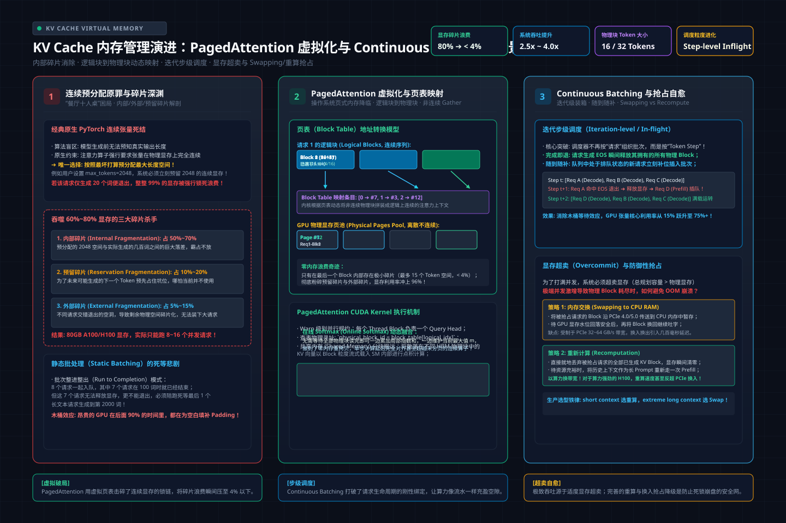
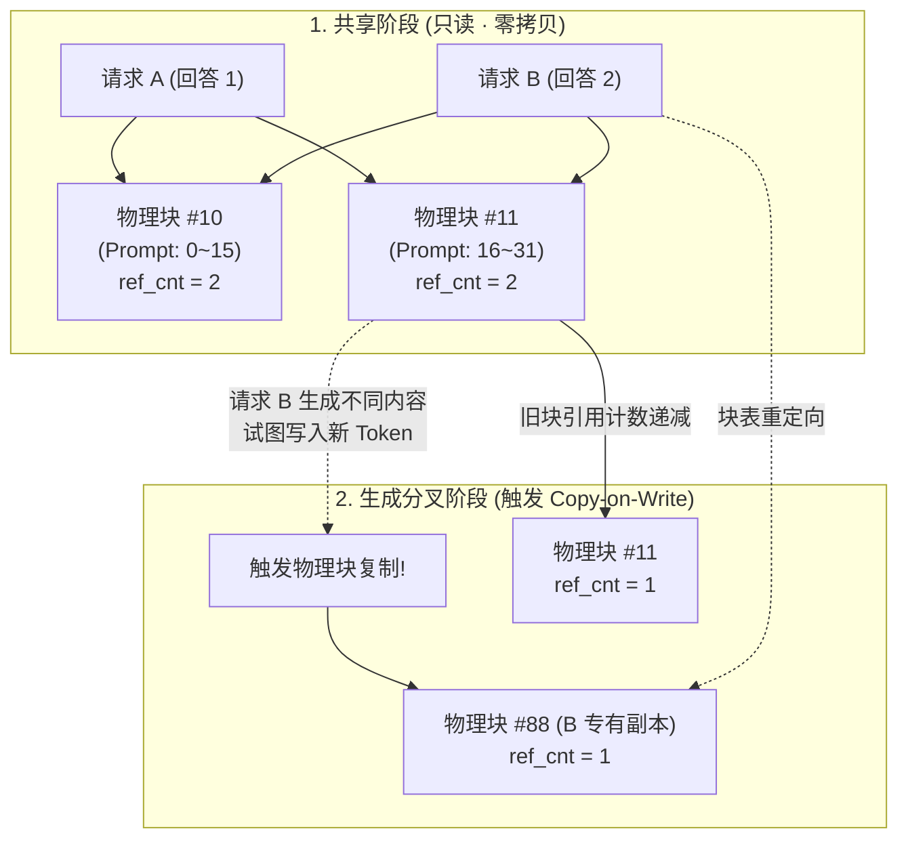
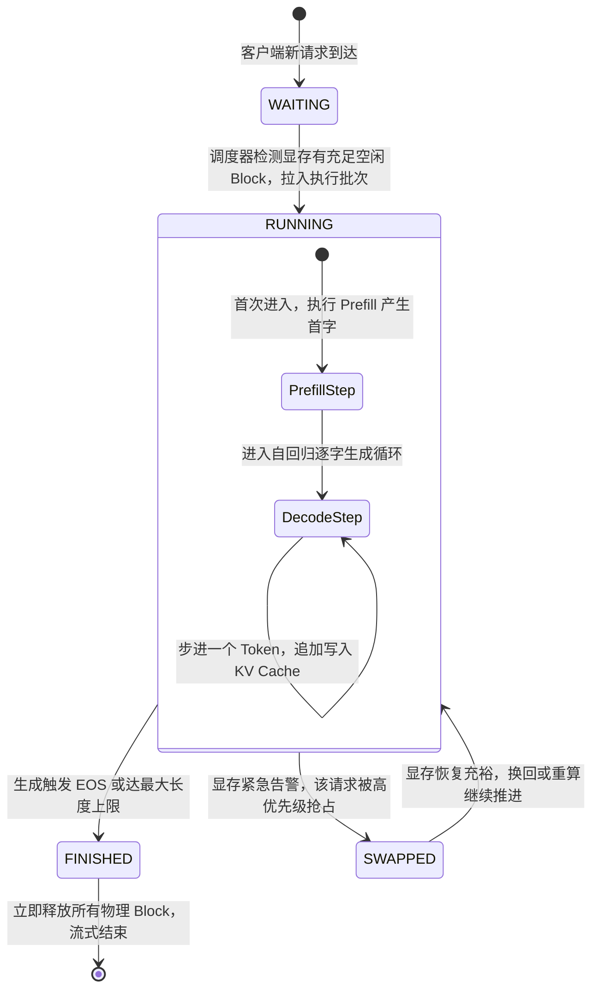
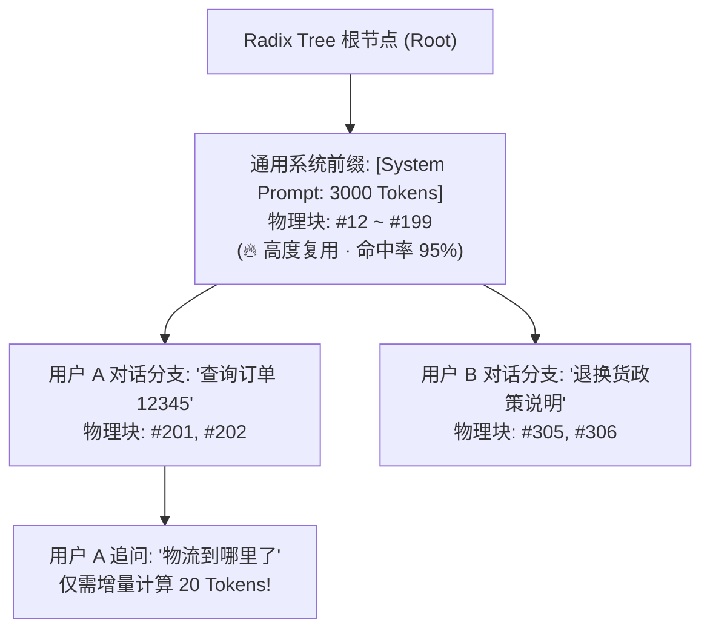

# 🏛️ 第33讲：显存碎片吞噬了60%算力？——KV Cache 内存管理演进：PagedAttention、Continuous Batching 与 Chunked Prefill 深度解构

> **主讲人**：👓 **Ringi**（大厂 AI Infrastructure 工程师）  
> **所属模块**：[Module 05: LLM 在线推理系统与性能工程](./README.md)  
> **篇章范式**：🚀 LLM 推理服务与高性能 Serving 篇（Inference Serving & Systems Paradigm）  
> **核心导读**：在上一讲中，我们建立起了 Prefill 与 Decode 两阶段物理特性的坐标系，并得出了一个冷酷的结论——Decode 是严重的访存受限型任务，而提升硬件利用率的唯一生命线就是“做大 Batch Size”。然而，当你兴冲冲地试图把并发请求塞进单张 80GB 的 GPU 时，现实却迎头泼来一盆冷水：系统往往只跑了不到 20 个并发就惨遭 CUDA OOM（显存溢出）崩溃，而 `nvidia-smi` 却显示实际用到的显存甚至还不到一半！到底是谁在暗中吞噬宝贵的显存？为什么操作系统几十年前发明的“虚拟内存分页”思想，在大模型时代成为了价值百亿美金的系统级突破？本讲将带你深入显存碎片的微观世界，从硬件指针与 Block Table 映射手算出发，彻底解构 PagedAttention、Continuous Batching（连续批处理）与 Chunked Prefill 的协同物理机制，并带你摸清显存耗尽时系统抢占（Swapping vs Recompute）的生死抉择。


```text
========================================================================================================================
                                     Ringi 3D 架构工坊 · PagedAttention 与连续动态组批全景
========================================================================================================================

 [逻辑请求视图 (Logical View)]
 Request A: [Token 0 ~ 3 (L-Block 0)] ──► [Token 4 ~ 7 (L-Block 1)] ──► [Token 8 ~ 9 (L-Block 2: 填 2 空 2)]
 Request B: [Token 0 ~ 3 (L-Block 0)] ──► [Token 4 ~ 5 (L-Block 1: 填 2 空 2)]
                               │
                               ▼ 经过 Block Table (虚拟页表映射) 间接寻址
 ┌────────────────────────────────────────────────────────────────────────────────────────────────────────────────────┐
 │  Block Table (逻辑块号 ──► 物理块号 映射枢纽)                                                                       │
 │  • Req A Block Table: [L0 ──► 物理块 #7] | [L1 ──► 物理块 #2] | [L2 ──► 物理块 #5 (部分填充)]                       │
 │  • Req B Block Table: [L0 ──► 物理块 #7 (🔥 共享前缀! ref_cnt=2)] | [L1 ──► 物理块 #9]                               │
 └──────────────────────────────┬─────────────────────────────────────────────────────┬───────────────────────────────┘
                                │                                                     │
                                ▼                                                     ▼
 ┌────────────────────────────────────────────────────────────────────────────────────────────────────────────────────┐
 │  GPU 物理显存池 (Physical KV Block Pool · 零外部碎片 · 碎片率 < 3%)                                                 │
 │  ┌───────────────┐ ┌───────────────┐ ┌───────────────┐ ┌───────────────┐ ┌───────────────┐ ┌───────────────┐      │
 │  │ 物理块 #2     │ │ 物理块 #5     │ │ 物理块 #7     │ │ 物理块 #9     │ │ 空闲物理块 #1 │ │ 空闲物理块 #3 │ ...  │
 │  │ [Req A: 4~7]  │ │ [Req A: 8~9]  │ │ [共享前缀:0~3]│ │ [Req B: 4~5]  │ │ (等待分配)    │ │ (等待分配)    │      │
 │  │ ref_cnt = 1   │ │ ref_cnt = 1   │ │ ref_cnt = 2   │ │ ref_cnt = 1   │ │ ref_cnt = 0   │ │ ref_cnt = 0   │      │
 │  └───────────────┘ └───────────────┘ └───────────────┘ └───────────────┘ └───────────────┘ └───────────────┘      │
 └────────────────────────────────────────────────────────────────────────────────────────────────────────────────────┘
                                                           ▲
                                                           │ 提供细粒度即时回收与按需分配能力
 ┌─────────────────────────────────────────────────────────┴──────────────────────────────────────────────────────────┐
 │  Continuous Batching (迭代级动态调度器 Iteration-level Scheduler)                                                  │
 │  • 步 t   : [Req A (Decode)] + [Req B (Decode)] + [Req C (Chunked Prefill: 512)] ──► GPU 统一前向计算               │
 │  • 步 t+1 : Req B 触发 EOS ──► 瞬间注销 ──► 物理块 #9 立即归还空闲池 ──► 新增 Req D 零等待秒级补位！               │
 └────────────────────────────────────────────────────────────────────────────────────────────────────────────────────┘
========================================================================================================================
```

<!-- more -->

## 📑 目录导航

- [0. Ringi 开场：生产真实现场与痛点冲突](#0-ringi-开场生产真实现场与痛点冲突)
  - [0.1 真实工程矛盾：为什么 80GB 显存还剩 30GB“可用”，新请求一进却当场报 CUDA OOM？](#01-真实工程矛盾为什么-80gb-显存还剩-30gb可用新请求一进却当场报-cuda-oom)
  - [0.2 线上真实事故复盘：某电商大模型对话集群在促销前夕因连续显存预分配导致请求并发断崖崩塌](#02-线上真实事故复盘某电商大模型对话集群在促销前夕因连续显存预分配导致请求并发断崖崩塌)
  - [0.3 传统连续分配 vs PagedAttention vs Continuous Batching 全维度对照速查表](#03-传统连续分配-vs-pagedattention-vs-continuous-batching-全维度对照速查表)
- [1. 连续分配的原罪：从“餐厅十人桌预留”到显存内外碎片深渊](#1-连续分配的原罪从餐厅十人桌预留到显存内外碎片深渊)
  - [1.1 内部碎片（Internal Fragmentation）：未知的输出长度与最坏打算预分配](#11-内部碎片internal-fragmentation未知的输出长度与最坏打算预分配)
  - [1.2 外部碎片（External Fragmentation）：可变生命周期造成的显存“蜂窝煤”](#12-外部碎片external-fragmentation可变生命周期造成的显存蜂窝煤)
  - [1.3 预留等待碎片（Virtual Reservation Waste）：长会话渐进增长的动态悲剧](#13-预留等待碎片virtual-reservation-waste长会话渐进增长的动态悲剧)
  - [1.4 公式五步穿透：连续分配显存有效利用率上限推导与数学证据](#14-公式五步穿透连续分配显存有效利用率上限推导与数学证据)
- [2. PagedAttention 核心架构：操作系统虚拟分页思想向 GPU 显存的史诗级迁徙](#2-pagedattention-核心架构操作系统虚拟分页思想向-gpu-显存的史诗级迁徙)
  - [2.1 体系结构对照：从 OS MMU/Page Table 到 vLLM Block Table](#21-体系结构对照从-os-mmupage-table-到-vllm-block-table)
  - [2.2 核心数据结构与 Shape 拓扑：Logical Block vs Physical Block vs Block Table](#22-核心数据结构与-shape-拓扑logical-block-vs-physical-block-vs-block-table)
  - [2.3 CUDA Kernel 执行层穿透：Warp 级物理间接寻址与非连续 SRAM 读取](#23-cuda-kernel-执行层穿透warp-级物理间接寻址与非连续-sram-读取)
  - [2.4 意外之喜：Copy-on-Write（写时复制）与多分支/并行采样零开销共享](#24-意外之喜copy-on-write写时复制与多分支并行采样零开销共享)
- [3. 调度范式革新：Continuous Batching（迭代级动态组批）的物理装箱原理](#3-调度范式革新continuous-batching迭代级动态组批的物理装箱原理)
  - [3.1 Static Batching 的“木桶之锁”：被最长序列霸凌的已完成请求](#31-static-batching-的木桶之锁被最长序列霸凌的已完成请求)
  - [3.2 Iteration-level Scheduling：以 Token 生成步为粒度的动态进出状态机](#32-iteration-level-scheduling以-token-生成步为粒度的动态进出状态机)
  - [3.3 为什么必须配合 PagedAttention？细粒度即时回收与按需分配的“水乳交融”](#33-为什么必须配合-pagedattention细粒度即时回收与按需分配的水乳交融)
  - [3.4 算力利用率从 30% 跃迁至 80% 的硬件物理归因](#34-算力利用率从-30-跃迁至-80-的硬件物理归因)
- [4. 削峰填谷之战：Chunked Prefill 与 vLLM V1 统一 Token 预算调度器](#4-削峰填谷之战chunked-prefill-与-vllm-v1-统一-token-预算调度器)
  - [4.1 长 Prefill 的“推土机效应”：同批 Decode 线程遭遇毫秒级断崖停摆](#41-长-prefill-的推土机效应同批-decode-线程遭遇毫秒级断崖停摆)
  - [4.2 Chunked Prefill 算法本质：将非弹性长 Prompt 物理切片](#42-chunked-prefill-算法本质将非弹性长-prompt-物理切片)
  - [4.3 vLLM V1 调度核心演进：抹平 Prefill 与 Decode 阶段二分](#43-vllm-v1-调度核心演进抹平-prefill-与-decode-阶段二分)
  - [4.4 优先级裁决树：Decode 先行保流速，余量装箱切 Prefill](#44-优先级裁决树decode-先行保流速余量装箱切-prefill)
- [5. 极端显存危机下的保命防线：Preemption（抢占）、Swapping（换出）与 Recomputation（重算）](#5-极端显存危机下的保命防线preemption抢占swapping换出与-recomputation重算)
  - [5.1 物理块池耗尽时的系统抉择：OOM 拒绝服务 vs 优雅抢占](#51-物理块池耗尽时的系统抉择oom-拒绝服务-vs-优雅抢占)
  - [5.2 换出（Swapping）：GPU HBM $\leftrightarrow$ Host RAM 跨 PCIe 搬运的成本与瓶颈](#52-换出swappinggpu-hbm-leftrightarrow-host-ram-跨-pcie-搬运的成本与瓶颈)
  - [5.3 重计算（Recomputation）：丢弃 KV Cache 重新 Prefill 的经济性比较](#53-重计算recomputation丢弃-kv-cache-重新-prefill-的经济性比较)
  - [5.4 临界抉择推导：计算算力 vs PCIe 带宽的交叉点手算](#54-临界抉择推导计算算力-vs-pcie-带宽的交叉点手算)
- [6. 高阶前缀复用：Prefix Caching 与 Radix Tree 块管理内核](#6-高阶前缀复用prefix-caching-与-radix-tree-块管理内核)
  - [6.1 多轮对话与统一 System Prompt 的重复计算浪费](#61-多轮对话与统一-system-prompt-的重复计算浪费)
  - [6.2 Radix Tree（基数树）物理机制：Token ID 路径匹配与 Block 引用计数维护](#62-radix-tree基数树物理机制token-id-路径匹配与-block-引用计数维护)
  - [6.3 带有有效内容的“空闲块”管理：双向链表 `FreeKVCacheBlockQueue` 的设计玄机](#63-带有有效内容的一空闲块管理双向链表-freekvcacheblockqueue-的设计玄机)
- [7. 动手实战与代码实验室（Minimal Runnable Code）](#7-动手实战与代码实验室minimal-runnable-code)
  - [7.1 实验一：纯 Python 原生复刻 PagedAttention 块分配器与 Block Table 映射器](#71-实验一纯-python-原生复刻-pagedattention-块分配器与-block-table-映射器)
  - [7.2 实验二：Continuous Batching 调度状态机极简仿真器](#72-实验二continuous-batching-调度状态机极简仿真器)
- [8. Ringi 避坑指南与生产黄金准则](#8-ringi-避坑指南与生产黄金准则)
  - [8.1 7 大常见小白认知误区 vs 大厂 AI Infra 正确物理认知](#81-7-大常见小白认知误区-vs-大厂-ai-infra-正确物理认知)
  - [8.2 生产 KV Cache 与并发调度黄金 Checklist](#82-生产-kv-cache-与并发调度黄金-checklist)
- [9. Ringi 5 点核心速记口诀、自我检验清单与课后深度思考题](#9-ringi-5-点核心速记口诀自我检验清单与课后深度思考题)
  - [9.1 5 点押韵核心速记口诀](#91-5-点押韵核心速记口诀)
  - [9.2 10 条白板自我检验清单](#92-10-条白板自我检验清单)
  - [9.3 3 道高阶开放式课后思考题（含极限 Corner Case）](#93-3-道高阶开放式课后思考题含极限-corner-case)
- [10. 📚 参考资料与核心源码/经典论文指引](#10--参考资料与核心源码经典论文指引)
- [附录：Appendix A — 大厂硬核高频面试题与白板推导（Interview Drill）](#附录appendix-a--大厂硬核高频面试题与白板推导interview-drill)
- [🎨 【配图工坊生图 Prompt 暂存区 · 生成配图后可一键整块删除】](#-配图工坊生图-prompt-暂存区--生成配图后可一键整块删除)

---

# 0. Ringi 开场：生产真实现场与痛点冲突

### 0.1 真实工程矛盾：为什么 80GB 显存还剩 30GB“可用”，新请求一进却当场报 CUDA OOM？

在大模型推理系统搭建的早期，许多工程师都曾经历过一次极度崩溃的“显存幽灵事件”：

你手头有一台装配了 8 张 NVIDIA A100-80GB 的服务器，部署了一个 13B 参数的对话模型。按理论计算：
- 模型静态权重占用约 $26\text{ GB}$ 显存；
- 单卡 80GB 显存扣除权重后，还足足剩下 **$54\text{ GB}$ 的巨额显存空间**专门给 KV Cache 使用；
- 按上一讲的手算结果，13B 模型单 Token KV Cache 仅占约 $160\text{ KB}$，哪怕平均会话长达 2048 Token，一个请求也就占约 $0.32\text{ GB}$；
- 算盘打得噼里啪啦响：$54\text{ GB} / 0.32\text{ GB} \approx 168$。也就是说，单卡理论上至少应该能轻松扛起 **150 个并发请求**！

然而，当你将并发压测工具的目标调到 **区区 35 个并发** 时，终端屏幕瞬间一片血红：

```text
torch.cuda.OutOfMemoryError: CUDA out of memory. Tried to allocate 1.25 GiB (GPU 0; 79.35 GiB total capacity; 
48.12 GiB already allocated; 29.80 GiB free; 1.43 GiB reserved in total by PyTorch)
```

你揉了揉眼睛，盯着那行报错信息倒吸一口凉气：
> **“48.12 GiB already allocated; 29.80 GiB free”** —— 显存明明还空余着整整 **29.8 GB**，系统却连一个 1.25 GB 的张量都申请不出来，直接当场暴毙挂掉！

**钱花在了哪里？为什么明明有空闲显存却用不了？**

答案就在于：在传统的连续显存分配框架下，显存被切成了无数彼此孤立的碎块。**大模型面对未知的生成长度，必须按最坏情况预留连续物理空间；而真实的会话长度天差地别、生命周期参差不齐，这使得物理显存很快退化成千疮百孔的“蜂窝煤”！**

空闲显存总量看起来虽然很大，但没有任何一块连续的物理空间能塞下下一个请求。这种“看得见、摸不着”的显存碎片，直接吃掉了系统超过 **60% 到 70% 的理论算力潜能**！

---

### 0.2 线上真实事故复盘：某电商大模型对话集群在促销前夕因连续显存预分配导致请求并发断崖崩塌

2023 年秋，某头部电商大厂为备战大促，上线了一套基于开源 LLM 架构的智能导购助手。底层推理引擎基于早期未集成 PagedAttention 的自研 Serving 框架构建，单机部署 8 卡 H800。

**事故现场还原**：
1. **流量激增**：晚间 20:00 促销活动开闸，外部网关流量从平时的 20 QPS 骤升至 180 QPS；
2. **保守配置**：为了防止线上请求因上下文超长而截断，业务配置了 `max_sequence_length = 4096`；
3. **连锁崩塌**：
   - 系统为每个涌入的 HTTP 请求按照 4096 Token 的最大尺寸在 GPU 显存中预开辟连续张量缓冲区；
   - 绝大部分用户的真实咨询非常简短（如“这件衣服有 M 码吗？”、“包邮吗？”），实际只聊了 150~300 个 Token 就主动关闭了会话；
   - 但因为请求退出时释放的大块内存与其它未结束请求交错，导致物理显存中留下了海量无法拼接的离散缝隙；
   - 在并发数仅仅达到 **42** 时，新进来的第 43 个请求由于在显存中找不到连续的 4096 空间，直接触发 CUDA OOM 异常；
   - 异常未被优雅捕获，导致 Serving 守护进程挂掉重启；其他可用节点瞬间遭遇流量倾泻，引发全集群连环雪崩！
4. **损失定级**：
   - 导购助手全网瘫痪 28 分钟，P99 响应超时率达 94.2%，大促前置转化率直接下跌 18%。

**救火复盘结论**：
基础设施团队痛定思痛，全量将底层推理引擎切换为支持 **PagedAttention 与 Continuous Batching 的 vLLM 生产栈**。
切换后，在完全相同的 8 卡 H800 硬件配置与相同的 4096 业务上限约束下：
- **最大稳定并发承载数从 42 飙升至 280（提升 6.6 倍）**；
- 显存碎片率从惊人的 **68% 骤降至 3.2%**；
- 硬件采购成本直接节约了数千万元！

---

### 0.3 传统连续分配 vs PagedAttention vs Continuous Batching 全维度对照速查表

| 技术体系 | 显存空间物理布局 | 内存分配与回收时机 | 内部与外部碎片表现 | 组批调度基本粒度 | 硬件算力利用率（MFU） | 生产代表引擎 |
| :--- | :--- | :--- | :--- | :--- | :--- | :--- |
| **传统静态连续分配 (Static Tensor)** | **物理必须绝对连续**，单个请求对应一个固定大张量 | 请求开始前**按最大长度 $S_{\text{max}}$ 预分配**，请求结束全量释放 | **极度严重**（内部碎片通常 $>60\%$，外部碎片随时间恶化） | **静态批处理 (Static Batching)**，以“批次整体生命周期”为单位 | **低迷（15% ~ 30%）**，大量计算浪费在 Padding `<PAD>` 上 | 早期 HuggingFace Accelerate / 原始 PyTorch |
| **PagedAttention (分页显存架构)** | **物理高度分散**，切分为固定大小 Block（如 16 Tokens），通过 Block Table 映射 | **按需逐块动态申请**，填满一块再要一块；退出时即时回收 | **几乎消除**（无外部碎片，内部碎片仅存在于尾块 $<16$ Tokens） | 支持任意颗粒度的非连续内存寻址 | **大幅提升显存容量 2~4 倍**，为高并发提供空间底座 | vLLM, TensorRT-LLM, TGI, SGLang |
| **Continuous Batching (迭代级调度)** | 配合分页内存，各请求在显存中以 Block 粒度灵活拼接 | **每个 Token 生成步（Step）动态重组批次**，完成即退，随到随补 | 完全依赖底层分页机制消除碎片 | **迭代步级 (Iteration-level)**，打破请求生命周期绑定 | **跃升至 70% ~ 85%**，权重搬运成本被高并发充分摊薄 | Orca (奠基), vLLM, TensorRT-LLM |
| **Chunked Prefill (分块统一预算)** | 深度融合 PagedAttention 与 Token Budget 虚拟分页 | 长 Prompt 在步间跨步分配，分块占有物理 Block | 极佳，显存与计算预算被完全量化 | **Token 预算级 (Token Budget)**，抹平 Prefill 与 Decode 边界 | **不仅吞吐极高，且 P99 TPOT 长尾延迟被彻底抹平** | vLLM V1 引擎, Sarathi-Serve |

---

# 1. 连续分配的原罪：从“餐厅十人桌预留”到显存内外碎片深渊

> 💡 **架构全景速览**：在深潜源码前，先在白板上建立坚不可摧的 KV Cache 内存管理演进、PagedAttention 与 Continuous Batching 物理底账。
> 
> 

### 1.1 内部碎片（Internal Fragmentation）：未知的输出长度与最坏打算预分配

在计算机体系结构中，**内部碎片（Internal Fragmentation）** 指的是：系统分配给某个任务的物理内存空间，远大于该任务实际消耗的空间，而这部分多余的空间被该任务强行霸占，无法被任何其他任务使用。

在大模型自回归推理中，内部碎片之所以致命，是因为一个纯粹的算法特性：
> **在生成结束之前，全世界没有任何人能提前预测一个大语言模型到底会输出多少个字！**

- 用户发送了一个 Prompt，设置了参数 `max_new_tokens = 2048`；
- 原生 PyTorch 算子要求注意力计算的张量必须在物理显存上呈现连续的内存布局；
- 引擎为了防止在生成到第 1500 个 Token 时因显存不足而报错，**只能在请求进来的第 0 步，就硬生生在显存里划出整整 2048 个 Token 的连续空间**；
- 最终结果：模型可能只回答了一个 JSON 结构体或一句简短的“好的”，在第 80 个 Token 输出了 `<|endoftext|>`；
- **剩下的 1968 个 Token 物理槽位，在整个会话执行期间全部在显存中“死躺”，有效利用率仅有区区 3.9%！**

---

### 1.2 外部碎片（External Fragmentation）：可变生命周期造成的显存“蜂窝煤”

如果说内部碎片是单个请求内部的浪费，那么 **外部碎片（External Fragmentation）** 则是多个并发请求在物理时间轴上交错交织引发的系统性崩盘。

在大模型在线服务中，不同请求的生命周期高度异构：
- 请求 A 处理快速问答，50 步结束退出；
- 请求 B 进行代码分析，800 步结束退出；
- 请求 C 处理长文翻译，2000 步结束退出。

```text
物理显存从平整走向“蜂窝煤”的过程:

[初始时刻: 连续平整显存池]
┌────────────────────────────────────────────────────────────────────────────────────────┐
│                                   80GB 空闲连续显存池                                   │
└────────────────────────────────────────────────────────────────────────────────────────┘

[运行一段时间后: 多个变长请求随机分配与释放]
┌──────────────┬──────────────┬──────────────┬──────────────┬──────────────┬─────────────┐
│ Req A (占1G) │ 空闲块1(2GB) │ Req B (占4G) │ 空闲块2(1GB) │ Req C (占3G) │空闲块3(1.5G)│
└──────────────┴──────────────┴──────────────┴──────────────┴──────────────┴─────────────┘

此时系统总空闲显存 = 2GB + 1GB + 1.5GB = 4.5 GB！
但如果此时来了一个新请求 Req D，要求申请一块 2.5 GB 的连续显存:
┌──────────────────────────┐
│  Req D 申请 2.5GB 连续空间 │ ──► 找不到任何一个单个空闲块 >= 2.5GB！
└──────────────────────────┘        💥 当场抛出 CUDA Out of Memory 崩溃！
```

每个请求退出后归还给显存控制器的，是一块块尺寸大小不一的“离散孤岛”。当服务持续运行几十分钟后，哪怕全局空闲显存加起来还有数十吉字节，却再也凑不出一整块连续的大空间。整个 GPU 显存退化成了孔洞密布的蜂窝煤，新的大请求只能在门外活活饿死！

---

### 1.3 预留等待碎片（Virtual Reservation Waste）：长会话渐进增长的动态悲剧

除了内部碎片和外部碎片，传统 Serving 架构还存在第三重极度隐蔽的浪费——**预留等待碎片（Reservation Waste）**。

即使一个长请求最终确实生成了 2048 个 Token，它的生成也是**一步一步（逐字自回归）发生的**：
- 在第 1 步，它实际只用了 1 个槽位，剩下的 2047 个槽位虽然未来会被填满，但**在当前这一时刻它们是纯粹的空闲显存**；
- 在第 100 步，它用了 100 个槽位，剩下的 1948 个槽位依旧处于闲置状态；
- 直到生成即将结束的那最后几步，这片显存才真正达到了 100% 的利用率。

在整个漫长的生成时间轴上，这些“为了未来可能用到而提前预留的槽位”，剥夺了其他短请求立即进入系统并完成退出的宝贵机会。

---

### 1.4 公式五步穿透：连续分配显存有效利用率上限推导与数学证据

#### ① Why（为什么需要算它？）
在向管理层或架构评审会汇报系统重构价值时，绝不能只说“连续分配不好”，必须给出严格的**数学利用率上限推导**，证明在统计学意义上，连续分配为什么注定会杀死 60% 以上的硬件吞吐。

#### ② Mental Model（物理直觉比喻）
假设一家拥有 100 个车位的停车场：每辆车进场时，管理员根本不看车型，一律按加长重型卡车的标准（占 5 个车位）给每辆车画专属隔离带。哪怕开进来的是一辆微型老年代步车，旁边 4 个车位也空着不准别人停。哪怕整座停车场只停了 20 辆小轿车，管理员就必须在门口挂出“车位已满”的牌子。

#### ③ Tiny Calculator（极简数字手算）
假设系统最大上下文预分配长度为 $S_{\text{max}} = 2048$。
真实业务流量的实际生成长度 $S_{\text{actual}}$ 服从均匀分布，介于 $50$ 到 $450$ 之间（平均值 $\mu = 250$ Token）。
- 单个请求平均实际消耗槽位：$250$；
- 单个请求强制预分配槽位：$2048$；
- **单请求内部利用率**：
  $$\eta_{\text{internal}} = \frac{250}{2048} \approx \mathbf{12.2\%}$$
- 即使考虑会话过程中逐步追加写入的动态积分，有效时间-空间乘积（Area-Time Utilization）在数学期望上：
  $$\eta_{\text{temporal}} = \frac{1}{S_{\text{actual}}} \int_0^{S_{\text{actual}}} \frac{t}{S_{\text{max}}} dt = \frac{1}{2} \times \frac{S_{\text{actual}}}{S_{\text{max}}} = \frac{1}{2} \times 12.2\% \approx \mathbf{6.1\%} \quad \text{！！！}$$

#### ④ Formal Model（标准公式与数学证明）
假设请求的实际生成长度 $s$ 服从概率密度函数 $p(s)$，定义域为 $[1, S_{\text{max}}]$。系统采用最大长度连续预分配策略。
整个在线推理集群的 **显存空间静态利用率期望值 $\mathbb{E}[\mathcal{U}_{\text{static}}]$** 为：

$$\mathbb{E}[\mathcal{U}_{\text{static}}] = \frac{\int_1^{S_{\text{max}}} s \cdot p(s) \, ds}{S_{\text{max}}} = \frac{\mathbb{E}[s]}{S_{\text{max}}}$$

在真实互联网大模型会话场景中（如 Chatbot、Search 等），实际生成长度长尾分布极强，平均生成长度 $\mathbb{E}[s]$ 通常在 $200 \sim 400$ Token 之间，而系统配置的 $S_{\text{max}}$ 通常为 $2048 \sim 4096$。

代入真实参数：

$$\mathbb{E}[\mathcal{U}_{\text{static}}] = \frac{300}{2048} \approx \mathbf{14.6\%} \quad \text{至} \quad \frac{400}{4096} \approx \mathbf{9.7\%}$$

如果再加上外部碎片导致的不可分配损耗系数 $\alpha_{\text{frag}} \approx 0.7$：

$$\mathcal{U}_{\text{effective}} = \alpha_{\text{frag}} \times \mathbb{E}[\mathcal{U}_{\text{static}}] \le 0.7 \times 14.6\% \approx \mathbf{10.2\%}$$

#### ⑤ Sanity Check（数量级校验）
**残酷的数学事实**：在不采用虚拟内存分页的前提下，大模型推理集群在物理显存上的有效利用率在数学上被死死锁死在 **10% ~ 20%** 的超低区间。这就意味着：**你花了 1000 万元买的 GPU 集群，有 800 万元纯粹是在为连续内存的愚蠢假设买单！**

---

# 2. PagedAttention 核心架构：操作系统虚拟分页思想向 GPU 显存的史诗级迁徙

### 2.1 体系结构对照：从 OS MMU/Page Table 到 vLLM Block Table

面对连续内存碎片的百年困局，计算机科学史早在几十年前就给出了终极答案——**虚拟内存分页（Virtual Memory Paging）**。

在现代操作系统（如 Linux）中，进程执行 `malloc(1GB)` 时，操作系统根本不会真的在物理内存里找一块连续的 1GB 空间；操作系统的内存管理单元（MMU）只是在进程的虚拟地址空间中画了一张饼，背后将这 1GB 拆解成数万个大小为 **4KB 的虚拟页（Virtual Pages）**。这些物理页散落在 RAM 的任意角落，甚至可以不连续、乱序存放，全靠一张 **页表（Page Table）** 进行物理地址动态寻址。

伯克利团队的划时代洞察在于：
> **大语言模型的 Prompt 和输出 Token 序列，在逻辑上是连续的文本流；但在 GPU 物理显存里，它们凭什么非得连续存放？为什么不能把操作系统的那套页表照搬进 GPU？**

这就是 **PagedAttention** 的灵魂所在。

```text
现代操作系统虚拟内存 vs PagedAttention 体系结构神级对照:

操作系统 (Linux OS)                      vLLM / PagedAttention
────────────────────────────────────────────────────────────────────────────────────────
CPU 应用程序虚拟内存空间       <=======>    请求逻辑上下文序列 (Token Sequence: 0, 1, ..., S)
虚拟页 (Virtual Page: 4KB)      <=======>    逻辑 KV 块 (Logical Block: 包含 16 个 Tokens)
物理页框 (Physical Page Frame)  <=======>    显存物理块 (Physical Block: HBM 显存真实空间)
操作系统页表 (Page Table)        <=======>    块表 (Block Table: 记录逻辑块到物理块号的映射)
硬件 MMU / TLB 快表寻址         <=======>    PagedAttention CUDA Kernel (在片上寄存器间接寻址)
缺页中断 (Page Fault)           <=======>    显存动态追加申请新 Block (按需填满再要)
写时复制 (Copy-on-Write)        <=======>    分支采样多请求共享前缀物理块 (Fork 机制)
```

---

### 2.2 核心数据结构与 Shape 拓扑：Logical Block vs Physical Block vs Block Table

在 PagedAttention 的世界中，显存管理被重构为三层精密的抽象结构：

#### 1. 块大小（Block Size, $B_{\text{size}}$）
系统将每个物理块能够容纳的连续 Token 数量定义为 **Block Size**（在 vLLM 中，标准基线通常取 **$B_{\text{size}} = 16$ 或 $32$**）。
- 为什么不选 $B_{\text{size}} = 1$？如果每个 Token 都是一个独立块，块表的长度和管理开销会过大，且无法利用 CUDA 内存合并访存（Coalesced Memory Access）；
- 为什么不选 $B_{\text{size}} = 256$？块过大又会导致最后一个块内的内部碎片回潮。实测证明 $16$ 和 $32$ 是碎片控制与访存吞吐的黄金平衡点。

#### 2. 显存物理块张量形状（Tensor Shape）
在 GPU 显存底层，vLLM 会在服务启动时开辟一个庞大的物理块池，其张量形状被固化为：

$$\mathbf{K}_{\text{pool}} \in \mathbb{R}^{\text{num\_blocks} \times H_{\text{kv}} \times \frac{d_{\text{head}}}{x} \times B_{\text{size}} \times x}$$

$$\mathbf{V}_{\text{pool}} \in \mathbb{R}^{\text{num\_blocks} \times H_{\text{kv}} \times d_{\text{head}} \times B_{\text{size}}}$$

其中 $x$ 是为了满足 GPU 向量化加载（如 16 字节 `float4` 内存指令）设置的内嵌重排维度（通常为 8）。
这个巨大的连续张量一旦分配，就再也不进行任何销毁与重分配，彻底规避了向操作系统反复申请释放显存的巨大开销。

#### 3. 块表（Block Table）的运作拓扑
每一个正在运行的推理请求，在 CPU 端由调度器维护一个动态递增的一维整型数组：`block_table = [p_block_id_0, p_block_id_1, ...]`。

```text
Block Table 寻址计算映射全景:

逻辑 Token 序号: Token 37 (查找它在显存的绝对位置)
设 Block Size = 16

1. 算出它属于第几个逻辑块:
   logical_block_idx = 37 // 16 = 2  (第 2 个逻辑块)

2. 算出它在块内的偏移槽位:
   block_offset = 37 % 16 = 5        (块内第 5 个槽位)

3. 查 Block Table 拿到真实物理块编号:
   physical_block_id = block_table[2] = 142 (在物理块池中的第 142 号物理块!)

4. 物理显存绝对基址定位:
   物理地址 = 物理块池起始地址 + 142 * Block_Stride + 5 * Token_Stride
```

---

### 2.3 CUDA Kernel 执行层穿透：Warp 级物理间接寻址与非连续 SRAM 读取

有人可能会产生一个深层怀疑：
> “把数据切成散落在各处的碎块，在数学和逻辑上确实省了显存，但在 GPU 上计算 Attention 时，难道不需要先把它们拷贝成一块连续的物理张量吗？如果要拷贝，那性能岂不是全毁了？”

答案是：**绝对不需要拷贝！PagedAttention 写出了一个专门的 CUDA Kernel，直接在算子内部通过间接寻址完成非连续读取！**

在 Decode 阶段执行 Attention 时：
1. **线程网格分配**：每个 CUDA Thread Block 负责处理一个或多个 Query Head 的注意力计算；
2. **块表送入高速缓存**：当前请求对应的 `block_table`（一小串整数数组）在启动 Kernel 时被复制进 GPU 的常量内存（Constant Memory）或 SM 片上共享内存（Shared Memory）；
3. **外层循环按块推进**：
   - Warp（32 个并行线程）在外层循环中逐一遍历该请求的物理块号；
   - 线程们直接拿到物理块号，通过物理步长（Stride）算出的地址，**直接用全局访存指令从 HBM 的分散物理块中读取这一批 16 个 Token 的 Key 向量**进 SRAM；
   - 在片上寄存器中与当前的 $Q$ 向量完成点乘累加（Online Softmax）；
   - 随后再从对应的 Value 物理块中加载 16 个 Value 向量完成加权乘加；
4. **完全零额外内存拷贝**：从 HBM 到片上 SRAM 的全流程中，根本没有任何多余的张量拼接开销！

```cpp
// PagedAttention CUDA Kernel 核心寻址逻辑抽象 (简化示意)
template <typename scalar_t, int BLOCK_SIZE>
__global__ void paged_attention_kernel(
    scalar_t* __restrict__ out,              // [num_seqs, num_heads, head_dim]
    const scalar_t* __restrict__ q,          // [num_seqs, num_heads, head_dim]
    const scalar_t* __restrict__ k_cache,    // [num_blocks, num_heads, head_dim/x, BLOCK_SIZE, x]
    const scalar_t* __restrict__ v_cache,    // [num_blocks, num_heads, head_dim, BLOCK_SIZE]
    const int* __restrict__ block_tables,    // [num_seqs, max_num_blocks_per_seq]
    const int* __restrict__ context_lens     // [num_seqs]
) {
    const int seq_idx = blockIdx.x;
    const int head_idx = blockIdx.y;
    const int context_len = context_lens[seq_idx];
    const int num_blocks = (context_len + BLOCK_SIZE - 1) / BLOCK_SIZE;
    const int* seq_block_table = block_tables + seq_idx * max_num_blocks_per_seq;

    // 每一个 Warp 负责一部分注意力的计算
    for (int block_idx = threadIdx.y; block_idx < num_blocks; block_idx += blockDim.y) {
        // 🔥 核心关键：直接查表，拿到离散的物理块号！
        const int physical_block_number = seq_block_table[block_idx];
        
        // 算出物理块在显存中的首地址，直接拉进片上寄存器！
        const scalar_t* k_ptr = k_cache + physical_block_number * block_stride_k;
        const scalar_t* v_ptr = v_cache + physical_block_number * block_stride_v;

        // 片上执行 Q * K^T 与 Softmax 加权 (FlashAttention 风格流式规约)
        // ... (在 SRAM 中完成计算，彻底免除跨 HBM 的物理拼接)
    }
}
```

---

### 2.4 意外之喜：Copy-on-Write（写时复制）与多分支/并行采样零开销共享

PagedAttention 的虚拟分页架构，还无心插柳地解锁了大模型系统中最令人惊叹的黑魔法——**内存写时复制（Copy-on-Write, CoW）**。

在大模型应用中，经常会遇到以下场景：
- **并行采样（Parallel Sampling / Best-of-N）**：用户给出一个 Prompt，要求大模型同时生成 4 个不同风格的回答供挑选；
- **束搜索（Beam Search）**：在复杂推理或机器翻译中，每一步维护 Top-K 条候选搜索分支；
- **Agent 多分支回溯**：智能体在决策树中尝试多条推演路径。

**在连续内存时代的悲剧**：
如果要并行生成 4 个回答，即使它们的前 1000 个 Prompt Token 完全一模一样，系统也必须把这 1000 个 Token 的 KV Cache **生硬地克隆复制 4 份**，白白浪费 4 倍显存！

**PagedAttention 的四两拨千斤（Copy-on-Write 机制）**：
1. **只读共享期**：
   - 4 个子任务的 `block_table` 在创建那一刻，直接指向那几个已经算好的相同的物理块；
   - 每个物理块维护一个轻量级的 **引用计数（`ref_cnt`）**，此时 `ref_cnt = 4`；
   - 显存复制量：**严格为 0**！创建 4 个分支只需要复制几十字节的整数映射表！
2. **写入分叉期（CoW 触发）**：
   - 当任务 1 生成了一个独特的词，试图向最后一个物理块写入新内容时，系统检测到该物理块的 `ref_cnt > 1`；
   - 此时系统才触发 **写时复制**：从空闲池中申请一个新的物理块，把被修改的这一个块的内容复制过去，成为任务 1 的私有块，其 `ref_cnt` 设为 1，同时原物理块的 `ref_cnt` 减 1；
   - 任务 1 更新自己的块表，后续写入完全独立，其他 3 个任务毫无察觉！



这种与 Linux `fork()` 进程如出一辙的设计，让束搜索和并行采样的显存开销**锐减了 55% 以上**，系统吞吐量翻倍提升！

---

# 3. 调度范式革新：Continuous Batching（迭代级动态组批）的物理装箱原理

### 3.1 Static Batching 的“木桶之锁”：被最长序列霸凌的已完成请求

如果说 PagedAttention 是彻底重构了“空间（显存）”的微观布局，那么 **Continuous Batching（连续批处理）** 则是彻底解放了“时间（计算调度）”的宏观流水线。

在上一章我们痛斥过 **Static Batching（静态批处理）** 的罪状。让我们用一个更残酷的时间步视图来看看它的算力空转：

```text
Static Batching 下惨烈的“幽灵空转”时间线:

时间步 (Step) ──► 0       50      100     150     200     250     300 ... 500
─────────────────┼───────┼───────┼───────┼───────┼───────┼───────┼───────────┼────►
请求 1 (短问答)   │███████│□□□□□□□□□□□□□□□□□□□□□□□□□□□□□□□□□□□□□□□□□□□□□□□□□□│ (50步完事, 幽灵空等450步!)
请求 2 (代码生成) │███████████████████████████████████████████████████████████│ (跑满500步, 拖垮所有人)
请求 3 (一般对话) │███████████████│□□□□□□□□□□□□□□□□□□□□□□□□□□□□□□□□□□□□□□□□│ (100步完事, 幽灵空等400步!)
请求 4 (翻译任务) │███████████████████████│□□□□□□□□□□□□□□□□□□□□□□□□□□□□□□□│ (150步完事, 幽灵空等350步!)
─────────────────┼───────┴───────┴───────┴───────┴───────┴───────┴───────────┴────►
                 ▲ 整个 Batch 必须死等最慢的请求 2 结束，才能整体释放并接客！
                 中间超过 60% 的白色方框 [□] 全是 GPU 在为已经退出的空槽位做无用功！
```

在由 4 个不同长度构成的批次中：
- 只要最慢的那个人还在跑，其他已经回答完毕的用户其结果不能及时返回给客户端（除非上层强行做流式 hack，但底层显卡槽位无法交还）；
- 排在等待队列里的请求 5、请求 6 只能眼睁睁看着空闲槽位在做无意义的 `<PAD>` 矩阵乘法，系统吞吐死死卡在三成以下。

---

### 3.2 Iteration-level Scheduling：以 Token 生成步为粒度的动态进出状态机

2022 年，微软团队在 OSDI 发表的奠基性论文 **Orca** 提出了一个直击灵魂的解决方案：
> **为什么必须把一整批请求‘同生共死’地绑在一起？大模型前向推理本来就是逐步推进的，为什么不在每一次生成单个 Token 的迭代步（Iteration / Step）之后，重新组装一次 Batch？**

这就是 **Continuous Batching（连续批处理 / 动态迭代级组批）**。

它的核心机制由一个严密运转的**请求生命周期状态机**驱动：



- **完成即退（Instant Eviction）**：在步 $t$，若请求 1 吐出了 `<|endoftext|>`，它在这一步结束的微秒级瞬间被当场剔除，其占用的槽位和显存 Block 立刻宣布释放！
- **随到随补（Immediate Admission）**：在步 $t+1$，调度器立刻从等待队列中拉入一个排队中的新请求 5。新请求 5 顺畅地与正在继续跑第 51 步的请求 2 拼在同一个物理张量中进 GPU 计算！
- **车轮永动**：GPU 内部的计算流水线就像一趟“招手即停、到站即下”的高频地铁，永远保持车厢满载，彻底消灭了无所事事的“幽灵等待”。


---

### 3.3 为什么必须配合 PagedAttention？细粒度即时回收与按需分配的“水乳交融”

这里必须强调一个被许多浅层文章忽略的**体系结构绝配关系**：
> **Continuous Batching 和 PagedAttention 不是两项孤立的技术，它们是必须合体才能产生核聚变的孪生兄弟！**

思考一个问题：如果**只有 Continuous Batching，却没有 PagedAttention**，系统会发生什么？
- 假设请求 1 在第 50 步退出了，空出了一片显存；
- 但如果显存分配依然是传统的连续大块，新来的请求 5 需要 2000 个 Token 的空间；
- 请求 1 留下的“小洞”根本塞不下请求 5！
- 调度器虽然想在下一个 Step 拉新请求上车，但由于**显存碎片无法被即时细粒度复用**，Continuous Batching 的动态进出机制将完全沦为空想！

**只有当 PagedAttention 将显存碎解为高度标准化、完全等价的 16-Token 物理小块时：**
- 任何一个请求退出，归还的都是几个标准的通用零件；
- 任何一个新请求进来，或者任何一个老请求长大，都是直接抓取这几个零件拼装；
- **正是 PagedAttention 提供的超细粒度、零碎片的物理显存弹性，才使得 Continuous Batching 的“随到随拼”成为了现实！**

---

### 3.4 算力利用率从 30% 跃迁至 80% 的硬件物理归因

在上一讲的 Roofline 模型推导中，我们证明了 Decode 阶段的核心困局是：

$$I_{\text{decode}}(B) \approx B \quad \left[\frac{\text{FLOP}}{\text{Byte}}\right]$$

单步计算必须从显存搬运完整的模型权重，唯有做大并发 $B$，才能平摊权重搬运的开销。

- **Static Batching 的死结**：为了防止 OOM，受制于显存碎片和木桶短板，静态 Batch Size 往往只能保守地设为 $4 \sim 8$。算术强度被压制在极低水平，GPU 算力利用率（MFU）惨淡地徘徊在 **20% ~ 30%**；
- **Continuous Batching + PagedAttention 的飞跃**：消除了碎片和等待，同一张卡可以常态化维持 **$B = 64 \sim 128$** 的超大并发批次。
- **物理回报**：算术强度成倍攀升，逼近 H100 的 295 FLOP/Byte 平衡点，**GPU 计算核心的有效利用率瞬间跃升至 75% ~ 85%！** 这就解释了为什么 vLLM 在 2023 年一经推出，全球各大云厂商立刻排队废弃旧架构。

---

# 4. 削峰填谷之战：Chunked Prefill 与 vLLM V1 统一 Token 预算调度器

### 4.1 长 Prefill 的“推土机效应”：同批 Decode 线程遭遇毫秒级断崖停摆

然而，历史的螺旋式上升从不停歇。当我们沉浸在 Continuous Batching 的高吞吐喜悦中时，我们在第 0.2 节遭遇的惨烈事故再次敲响了警钟：**Prefill 与 Decode 的物理冲突在 Continuous Batching 内部引爆了！**

在没有流量管控的系统中：
- 调度器每一步都在 Running 队列里装载了 32 个正在 Decode 的请求；
- 此时 Waiting 队列里冷不丁冒出一个带有长上下文的请求（如一段长达 8,000 Token 的文献翻译）；
- 调度器机械地判定：“显存够，把这个请求塞进这一步的批次里”；
- **推土机进场**：为了在单步内算完这 8,000 个 Token 的前向传播，GPU 的计算耗时从平时的 20ms **瞬间暴涨至 500ms 以上**；
- 同处该 Step 的 32 个无辜的 Decode 请求，全部被强行绑架在 GPU 物理执行流水线上，**整整停顿半秒钟无法吐字**！

这种因突发长 Prefill 造成同批正在出字的会话发生严重顿挫的现象，被称作 **Prefill-Decode 互相干扰（Interference）**，它是摧毁在线服务 P99 尾延迟的头号杀手。

---

### 4.2 Chunked Prefill 算法本质：将非弹性长 Prompt 物理切片

破解之道，正是微软与清华等学者提出的 **Chunked Prefill（分块预填充）**。

它的第一性原理极其纯粹：
> **如果一个巨型集装箱会压垮桥梁，就必须在收费站前将其拆解为若干个标准托盘，以均匀的间隙放行！**

系统不再允许任何长 Prompt“整存整取”地霸占 GPU 单步时间。
- 设定一个固定的分块切片阈值（如 $\text{Chunk Size} = 512$）；
- 当一个 4000 Token 的长 Prompt 到达时，调度器将其切为 $4000 / 512 = 8$ 个连续的 Chunk；
- **第 1 步**：仅执行 Chunk 0（计算 512 个 Token 的 Attention，将其写入 KV Cache），并与批次内的其他 Decode 请求一同执行，单步耗时稳定在 35ms；
- **第 2 步**：继续执行 Chunk 1（此时利用已经算好的 Chunk 0 的 KV Cache 作为历史进行掩码注意力），耗时依然为 35ms；
- ……
- **第 8 步**：最后一个 Chunk 7 执行完毕，产出首个输出 Token，该请求正式无缝切换为 Decode 模式！

```text
Chunked Prefill 下的切块流水线平稳演进:

[传统长 Prefill: 单步独占, 轰塌世界]
Step 100: [████████████████████████████ 8000 Tokens Prefill + 32 Decodes] ──► 耗时 550ms! (💥 P99 崩盘)

[Chunked Prefill: 均匀切块, 削峰填谷]
Step 100: [██ 512 Chunk 1][■■■■■■■■■■■■ 32 Decodes] ──► 耗时 32ms (平稳)
Step 101: [██ 512 Chunk 2][■■■■■■■■■■■■ 32 Decodes] ──► 耗时 32ms (平稳)
Step 102: [██ 512 Chunk 3][■■■■■■■■■■■■ 32 Decodes] ──► 耗时 32ms (平稳)
... 每一步的 Decode 都在如丝般顺滑地推进，前端用户毫无停顿感知！
```

---

### 4.3 vLLM V1 调度核心演进：抹平 Prefill 与 Decode 阶段二分

在 vLLM 最新的 **V1 生产级调度架构** 中，工程实现跨越到了一个前所未有的高度：**彻底抹平阶段界限**。

在 V1 引擎源码（`vllm/v1/core/sched/scheduler.py`）中，传统的“Prefill 调度队列”与“Decode 调度队列”被全部废弃。取而代之的是一个无比凝练的统一抽象：

$$\mathbf{Token\_Budget} = \text{max\_num\_batched\_tokens} \quad (\text{如 } 2048)$$

对底层 GPU 执行器而言：
- 一个做 Decode 的请求，本质是：**这一步需要处理 1 个 Token**；
- 一个做 Chunked Prefill 的请求，本质是：**这一步需要处理 512 个 Token**；
- 一个做短 Query Prefill 的请求，本质是：**这一步需要处理 64 个 Token**；
- 一个在做投机解码验证的请求，本质是：**这一步需要处理 5 个候选 Token**！

所有的业务模式，全部被统一量化为同一个度量衡：**“当前请求在当前 Step 申请消耗的 Token 额度”**。

---

### 4.4 优先级裁决树：Decode 先行保流速，余量装箱切 Prefill

调度器在每一步调度时的核心伪代码与决策树逻辑如下：

```text
       Step 开始: 获取全局 Token 预算 (如 Budget = 2048)
                           │
                           ▼
 ┌─────────────────────────────────────────────────────────────┐
 │ 阶段一：无条件保活存量 Decode (保用户流速第一定律)            │
 │ • 遍历当前所有 Running 队列中的 Decode 请求                  │
 │ • 每个请求分配 1 个 Token 额度: Budget -= 1                 │
 │ • 检查显存物理 Block 是否充足？若不足触发抢占                │
 └──────────────────────────────┬──────────────────────────────┘
                                │
                                ▼
 ┌─────────────────────────────────────────────────────────────┐
 │ 阶段二：余量装箱新请求与长切片 (削峰填谷第二定律)            │
 │ • 计算剩余算力预算: Remaining_Budget = Budget                │
 │ • 若 Remaining_Budget > 0，从 Waiting 队列依次取请求         │
 │ • 设当前请求剩余需 Prefill 长度为 Need                      │
 │ • 关键截断: Chunk_To_Run = min(Need, Remaining_Budget)      │
 │ • 申请对应尺寸的 KV Block 并扣减预算                         │
 └──────────────────────────────┬──────────────────────────────┘
                                │ 预算耗尽或无就绪请求
                                ▼
       下发 GPU Kernel 执行当前 Step 批次!
```

这种设计使得整个调度系统获得了极强的数学确定性与稳定性：单步计算总量永远受到刚性约束，长尾时延彻底被驯服。

---

# 5. 极端显存危机下的保命防线：Preemption（抢占）、Swapping（换出）与 Recomputation（重算）

### 5.1 物理块池耗尽时的系统抉择：OOM 拒绝服务 vs 优雅抢占

尽管 PagedAttention 消除了绝大多数无谓的显存碎片，但在极端高并发或超长会话突增的流量洪峰下，依然会遭遇物理现实的无情撞击：**GPU 上的所有物理 Block 真的被彻底用光了！**

当批次中有 64 个 Decode 请求正在推进，这一步它们各自需要生成一个新 Token，而物理块池中恰好连 **1 个空闲 Block 都没有了**，系统该怎么办？
- 选型 A：直接向客户端抛出 `Internal Server Error: Out of Memory`，掐断连接（直接杀死用户体验）；
- 选型 B：像 Linux 调度进程一样，临时**抢占（Preemption）**一部分倒霉的请求，剥夺它们的物理显存归还给公池，确保剩下的请求能够安全跑完！

vLLM 毫不犹豫地选择了选型 B。

---

### 5.2 换出（Swapping）：GPU HBM $\leftrightarrow$ Host RAM 跨 PCIe 搬运的成本与瓶颈

在抢占机制中，第一种经典的救火方案叫做 **Swapping（换出）**：
1. 调度器按照“后进先出（LIFO）”或“优先级队列”挑出一个最年轻的牺牲品请求；
2. 将该请求在 GPU HBM 显存中持有的所有物理 Block，通过 **PCIe 总线** 异步搬运拷贝到宿主机（Host CPU）的内存（RAM）中暂存；
3. 将该请求在 GPU 上的物理 Block 标记为释放，供高优先级的请求继续执行；
4. 等到高优先级请求完成退出、GPU 显存重新充裕后，再通过 PCIe 把这些 Block 从 CPU 内存拷贝回 GPU 显存，唤醒该请求继续 Decode。

**换出的物理瓶颈**：
PCIe 4.0 x16 的双向带宽仅为 **$32\text{ GB/s}$**（PCIe 5.0 约为 **$64\text{ GB/s}$**）。
如果一个 16K 的长上下文请求持有了约 5GB 的 KV Cache，将其换出到 CPU 内存需要耗费：

$$T_{\text{swap}} = \frac{5\text{ GB}}{32\text{ GB/s}} \approx \mathbf{156\text{ ms}}$$

在换出和换入的一来一回中，超过 300ms 的总线传输开销将完全暴露，对系统的吞吐和延迟产生不可忽视的次生冲击。

---

### 5.3 重计算（Recomputation）：丢弃 KV Cache 重新 Prefill 的经济性比较

针对 Swapping 的带宽瓶颈，第二种硬核方案应运而生——**Recomputation（丢弃重算）**：
1. 调度器直接将牺牲品请求在 GPU 中的所有 KV Block **当场清空抹去**，完全不往 CPU 内存搬运；
2. 将该请求打回 Waiting 队列的最前端；
3. 把该请求截至目前所生成的所有文本（原 Prompt + 已生成的输出 Token）全部打包，视作一段**全新的大 Prompt**；
4. 等显存空出来后，让它重新跑一次 Prefill！

---

### 5.4 临界抉择推导：计算算力 vs PCIe 带宽的交叉点手算

究竟是 Swapping 划算，还是 Recomputation 划算？
这是一个大厂资深架构师必须能够信手拈来的体系结构量化推导题。

设某请求已经累积生成的上下文长度为 $S$ Token，模型参数量为 $W$：
- **方案 1：Swapping 跨 PCIe 搬运的总耗时（以 PCIe 4.0 32 GB/s 计）**：
  $$\text{KV 字节数} = S \times \text{KV}_{\text{token}}$$
  $$T_{\text{swap}}(S) = 2 \times \frac{S \times \text{KV}_{\text{token}}}{B_{\text{pcie}}} \quad (\text{乘 2 为一出一进})$$
- **方案 2：Recomputation 重新 Prefill 跑一次的计算耗时（以 H100 实际 MFU 下算力 $P_{\text{eff}} \approx 500\text{ TFLOPS}$ 计）**：
  $$T_{\text{recompute}}(S) = \frac{2 \times W \times S}{P_{\text{eff}}}$$

**寻找经济性交叉平衡点（Crossover Point）**：
令 $T_{\text{swap}}(S) = T_{\text{recompute}}(S)$，两边的 $S$ 竟然直接对消！

$$2 \times \frac{\text{KV}_{\text{token}}}{B_{\text{pcie}}} = \frac{2W}{P_{\text{eff}}} \implies \mathbf{B_{\text{pcie}} \times W = \text{KV}_{\text{token}} \times P_{\text{eff}}}$$

以 LLaMA-3 70B（$W = 70 \times 10^9$，单 Token KV $\approx 320\text{ KB}$）为例：
- 重新计算该模型 1000 Token Prefill 的耗时：
  $$T_{\text{recompute}} = \frac{2 \times 70 \times 10^9 \times 1000}{500 \times 10^{12}} = \mathbf{0.28\text{ 秒} (280\text{ ms})}$$
- 而跨 PCIe 4.0 换出再换入这 1000 个 Token 的 KV（约 $320\text{ MB}$）的耗时：
  $$T_{\text{swap}} = 2 \times \frac{0.32\text{ GB}}{32\text{ GB/s}} = \mathbf{0.02\text{ 秒} (20\text{ ms})}$$

**关键决策结论**：
- **在中小模型或短上下文场景**：GPU 重算极快，Recomputation 简单高效，不吃 Host 内存；
- **在大模型或极长上下文场景**：重新跑一次大 Prefill 的算力开销极其昂贵，**Swapping 换出的速度比重算快整整一个数量级以上！** 因此工业引擎在 70B 级以上模型中普遍倾向于优先采用 Swapping 机制保命。

---

# 6. 高阶前缀复用：Prefix Caching 与 Radix Tree 块管理内核

### 6.1 多轮对话与统一 System Prompt 的重复计算浪费

在智能客服、多轮对话助手以及 Agent 应用中，流量存在极其恐怖的上下文冗余：
- 某企业客服机器人的 System Prompt（包含企业规章、免责声明、工具定义）长达 **3,000 Token**；
- 用户问第一句话：“你们营业时间是几点？”（10 Token）；
- 机器人回答后，用户追问第二句：“周日开门吗？”（10 Token）；
- 如果不作任何处理，在处理第二句追问时，系统必须把前序的 3,000 Token System Prompt + 第一轮对话的历史 **完完整整重新跑一次 Prefill！**

成千上万个并发用户同时在线，GPU 的 Tensor Core 每天有 **70% 以上的时间在机械地重复计算一模一样的 System Prompt**！

---

### 6.2 Radix Tree（基数树）物理机制：Token ID 路径匹配与 Block 引用计数维护

为了终结这种野蛮的算力浪费，以 SGLang（RadixAttention）为代表的技术创新将 **Radix Tree（基数树 / 前缀树）** 引入了 KV Cache 物理块管理。

其核心机制是：
1. **树节点即 Block 序列**：树的每一条分支路径代表一段特定的 Token ID 序列，叶子节点和内部节点直接索引着物理显存中对应的 Physical Block ID；
2. **前缀秒级匹配**：
   - 新请求到达后，调度器首先将其 Token ID 序列放入 Radix Tree 中进行最长前缀匹配（Longest Prefix Match）；
   - 若命中了一个包含 3,000 Token 的系统前缀，调度器直接在物理显存中找到这批已经算好的 Physical Blocks，并将当前请求的 `block_table` 前半段直接指向它们；
   - **该请求的 Prefill 计算量瞬间缩减 99%，TTFT 从数秒直接暴降至几毫秒！**
3. **引用计数与驱逐**：
   - 只要有会话在使用该分支，树节点所指向的物理块其 `ref_cnt > 0`，不可被释放；
   - 当会话退出后，物理块并不立刻抹去，而是保留在树上，其 `ref_cnt` 归零，成为“可被回收的缓存节点”。




---

### 6.3 带有有效内容的“空闲块”管理：双向链表 `FreeKVCacheBlockQueue` 的设计玄机

这里隐藏着 vLLM V1 引擎源码中一个极其令人拍案叫绝的工程细节：
在 `vllm/v1/core/block_pool.py` 中，管理所有物理空闲块的数据结构，为什么被专门设计成了一条 **双向链表（Doubly Linked List）**，而不是简单的 Python 列表或栈？

**背后深层原因**：
当开启了 Prefix Caching 之后，**“空闲块”被赋予了双重身份**：
1. **纯净空闲块**：从未被使用过，内部没有任何有效数据；
2. **带缓存的空闲块（Cached Free Block）**：前序请求已经退出，当前没有任何人引用它（`ref_cnt = 0`），但它里面**依然完好无损地保存着之前算好的 KV 数据**！

当一个新请求到达并命中前缀缓存时：
- 调度器必须从空闲链表的**中间任意随机位置**，把那几个命中特定前缀的 Block 给精准“揪”出来重新激活（将其 `ref_cnt` 从 0 变成 1）；
- 如果使用普通的数组或队列，从中间删除一个元素的复杂度是低效的 $\mathcal{O}(N)$；
- 而使用双向链表，通过哈希表定位节点后，可以在 **$\mathcal{O}(1)$ 绝对常数时间内完成任意节点的摘除与重插入！**

这就是顶级系统软件工程的魅力：每一个数据结构的选择，都在为高并发下的微秒级确定性时延服务。

---

# 7. 动手实战与代码实验室（Minimal Runnable Code）

### 7.1 实验一：纯 Python 原生复刻 PagedAttention 块分配器与 Block Table 映射器

本实验完整模拟真实大模型推理过程中的显存碎片形成过程。对比在相同的随机生成长度序列下，传统连续预分配与 Paged 分页分配的显存有效利用率，用数字验证为什么分页能够消灭 60% 以上的碎片浪费。

```python
#!/usr/bin/env python3
"""
===============================================================================
实验一：PagedAttention 物理块分配与显存碎片率实证对比
主讲人：Ringi
功能：模拟 100 个变长请求在连续预分配 vs 分页管理下的真实显存利用率
===============================================================================
"""

import math
import random
from typing import List, Dict

class PagedMemorySimulator:
    def __init__(self, block_size: int = 16, max_context_len: int = 2048):
        self.block_size = block_size
        self.max_context_len = max_context_len

    def run_benchmark(self, num_requests: int = 100):
        random.seed(2026) # 锁定随机种子
        
        # 模拟真实世界分布：请求的实际生成长度在 40 到 600 Token 之间波动
        actual_lengths: List[int] = [random.randint(40, 600) for _ in range(num_requests)]
        
        print("=" * 80)
        print(f"🔬 实验一：显存分配机制微观对比仿真 (测试样本数: {num_requests} 请求)")
        print("=" * 80)
        print(f"⚙️ 仿真参数设定: 最大预分配长度 S_max = {self.max_context_len} Tokens | Block Size = {self.block_size} Tokens\n")
        
        # 1. 传统连续预分配评估
        total_slots_static = num_requests * self.max_context_len
        total_used_slots = sum(actual_lengths)
        internal_frag_static = total_slots_static - total_used_slots
        utilization_static = (total_used_slots / total_slots_static) * 100.0
        waste_static = 100.0 - utilization_static
        
        # 2. PagedAttention 分页分配评估
        total_blocks_paged = 0
        internal_frag_paged = 0
        
        for length in actual_lengths:
            # 按需逐块分配: 向上取整
            needed_blocks = math.ceil(length / self.block_size)
            allocated_slots = needed_blocks * self.block_size
            total_blocks_paged += needed_blocks
            # 内部碎片仅存在于最后一个未填满的 Block
            internal_frag_paged += (allocated_slots - length)
            
        total_slots_paged = total_blocks_paged * self.block_size
        utilization_paged = (total_used_slots / total_slots_paged) * 100.0
        waste_paged = 100.0 - utilization_paged
        
        print(f"📊 1. 传统静态连续分配方案 (Static Allocation):")
        print(f"   • 系统强制预分配槽位总数 : {total_slots_static:,} Slots")
        print(f"   • 请求实际有效使用槽位   : {total_used_slots:,} Slots")
        print(f"   • 内部碎片浪费槽位总数   : {internal_frag_static:,} Slots")
        print(f"   🔴 实际显存有效利用率   : {utilization_static:.2f}% (绝大部分显存被闲置虚占!)")
        print(f"   ❌ 显存浪费与碎片率     : {waste_static:.2f}%\n")
        
        print(f"📊 2. PagedAttention 虚拟分页分配方案 (Paged Allocation):")
        print(f"   • 动态申请物理 Block 总数: {total_blocks_paged:,} Blocks (共 {total_slots_paged:,} Slots)")
        print(f"   • 请求实际有效使用槽位   : {total_used_slots:,} Slots")
        print(f"   • 仅末尾块碎片浪费总数   : {internal_frag_paged:,} Slots")
        print(f"   🟢 实际显存有效利用率   : {utilization_paged:.2f}% (接近理论物理完美值!)")
        print(f"   ✅ 显存碎片率控制在     : {waste_paged:.2f}%\n")
        
        capacity_boost = utilization_paged / utilization_static
        print(f"🚀 结论：在相同物理显存底座下，PagedAttention 带来的真实并发容量提升为: 【{capacity_boost:.2f}x 倍】！")
        print("=" * 80 + "\n")

if __name__ == "__main__":
    sim = PagedMemorySimulator(block_size=16, max_context_len=2048)
    sim.run_benchmark(num_requests=100)
```

---

### 7.2 实验二：Continuous Batching 调度状态机极简仿真器

本实验完整模拟 Static Batching 与 Continuous Batching 在处理一批动态完成序列时的调度时空图，直接输出两个模式完成所有任务的总步数对比与槽位空转率。

```python
#!/usr/bin/env python3
"""
===============================================================================
实验二：Continuous Batching 迭代级调度状态机仿真
主讲人：Ringi
功能：直观展示按批调度 vs 迭代级调度如何缩短总耗时并消除木桶效应
===============================================================================
"""

import random
from typing import List

def run_batching_simulation():
    random.seed(42)
    # 模拟 16 个不同输出长度的请求 (Token 数介于 10 到 120 之间)
    req_lengths: List[int] = [random.randint(10, 120) for _ in range(16)]
    batch_capacity = 4 # 单次 GPU 最大处理并发槽位
    
    print("=" * 80)
    print(f"🔬 实验二：Static Batching vs Continuous Batching 调度效能实测")
    print("=" * 80)
    print(f"📋 待处理任务序列长度明细 (16个请求): {req_lengths}")
    print(f"⚙️ 硬件批处理能力上限: 同时承载 {batch_capacity} 个请求\n")
    
    # -------------------------------------------------------------
    # 1. 模拟 Static Batching (静态整批等待)
    # -------------------------------------------------------------
    static_total_steps = 0
    static_idle_slot_steps = 0
    static_active_slot_steps = sum(req_lengths)
    
    # 每 4 个请求为一组，强制同生共死
    for i in range(0, len(req_lengths), batch_capacity):
        group = req_lengths[i : i + batch_capacity]
        group_max_steps = max(group)
        static_total_steps += group_max_steps
        for l in group:
            static_idle_slot_steps += (group_max_steps - l)
            
    static_slot_utilization = (static_active_slot_steps / (static_active_slot_steps + static_idle_slot_steps)) * 100.0
    
    # -------------------------------------------------------------
    # 2. 模拟 Continuous Batching (动态即时补位)
    # -------------------------------------------------------------
    cont_total_steps = 0
    cont_active_slots = list(req_lengths[:batch_capacity])
    waiting_queue = list(req_lengths[batch_capacity:])
    
    while cont_active_slots:
        cont_total_steps += 1
        next_step_slots = []
        for remaining in cont_active_slots:
            if remaining - 1 > 0:
                next_step_slots.append(remaining - 1)
            else:
                # 该任务在这一步恰好结束！立即从等待队列补位
                if waiting_queue:
                    next_step_slots.append(waiting_queue.pop(0))
        cont_active_slots = next_step_slots

    print(f"📊 1. 静态批处理模式 (Static Batching):")
    print(f"   • 全流程总消耗计算步数   : {static_total_steps} Steps")
    print(f"   • 槽位幽灵空转步数总和   : {static_idle_slot_steps} Slot-Steps")
    print(f"   🔴 计算核心有效工作利用率 : {static_slot_utilization:.2f}%\n")
    
    print(f"📊 2. 连续批处理模式 (Continuous Batching):")
    print(f"   • 全流程总消耗计算步数   : {cont_total_steps} Steps")
    print(f"   🟢 任务完成整体加速比   : 【{static_total_steps / cont_total_steps:.2f}x 倍速】！")
    print(f"   ✅ 节省的无效计算等待步数: {static_total_steps - cont_total_steps} Steps")
    print("=" * 80 + "\n")

if __name__ == "__main__":
    run_batching_simulation()
```

---

# 8. Ringi 避坑指南与生产黄金准则

### 8.1 7 大常见小白认知误区 vs 大厂 AI Infra 正确物理认知

| 序号 | ❌ 常见初学者与算法小白误区 | ✅ 大厂 AI Infra 严谨物理事实与工程真相 |
| :---: | :--- | :--- |
| **1** | “PagedAttention 是把 Attention 算法本身改写了，可能会损失模型的生成精度。” | **无稽之谈**。PagedAttention 改变的**仅仅是显存物理指针的寻址方式**，参与浮点运算的数值与数学逻辑与标准 Attention 100% 严格恒等，精度没有任何一比特损失。 |
| **2** | “Block Size 越小越好，设成 1 的话内部碎片就完全为零了。” | **典型只看局部**。Block Size 设为 1 会导致 Block Table 自身膨胀数十倍，引发极大的寻址开销，且彻底破坏 GPU 内存合并访存（Coalescing），导致带宽吞吐暴跌。 |
| **3** | “Continuous Batching 只要开启了，任何业务场景吞吐都能提升 4 倍。” | **忽视边界条件**。在输入极长（如全都是 16K 长文档）、输出极短（只输出 5 个字）的场景中，系统全程被 Prefill 霸占，Decode 阶段过短，Continuous Batching 收益将被大幅稀释。 |
| **4** | “开启 Prefix Caching 永远只有好处，应该在所有模型和服务上无脑常开。” | **存在显存锁死代价**。缓存的 Block 会常驻显存，如果业务流量具有高度离散性且无任何重复 Prompt，Prefix Caching 只会白白霸占显存，反向压缩有效并发。 |
| **5** | “为了极致性能，应该将 `gpu_memory_utilization` 调到 0.98 以上。” | **引火自焚**。模型在执行过程中除了 KV Block，还需要临时分配 CUDA Graph 空间、NCCL 通信环路、动态采样临时张量。预留过紧极易在业务高峰期突发底层 CUDA 内存硬崩。 |
| **6** | “显存满了发生抢占时，直接杀掉最长请求是最好的策略。” | **最烂策略**。长请求已经消耗了极高算力，将其杀死会造成灾难性的算力浪费和极差的用户体验。工业界通常采用优先换出年轻短请求，或对长请求实施 Swapping 换出。 |
| **7** | “Chunked Prefill 只是把 Prefill 变慢了，既然如此为什么不直接用两套物理集群做 PD 分离？” | **脱离成本谈架构**。PD 分离引入了昂贵的跨机 RDMA 网络和高度复杂的全局调度器。在单机或中小规模集群中，Chunked Prefill 是成本最低、收效最显著的平替方案。 |

---

### 8.2 生产 KV Cache 与并发调度黄金 Checklist

- [ ] **1. Block Size 生产基准核定**：
  - 在绝大多数主流开源大模型（LLaMA、Qwen、Mistral）上，生产环境严格保持 **`block_size = 16`**（针对极长文本大并发吞吐优化可测试评估 `block_size = 32`，严禁随意设为 4 或 64 以上）。
- [ ] **2. 显存利用率红线防御**：
  - `gpu_memory_utilization` 推荐基准设为 **0.90**（若启用了复杂 Speculative Decoding 建议下调至 0.85），强制为非 KV 运行时预留至少 6GB 以上物理缓冲。
- [ ] **3. 调度统一 Token 预算（Token Budget）刚性落地**：
  - 生产强制启用 Chunked Prefill；
  - 推荐配置 `max_num_batched_tokens`：A100 上配置 **512**，H100 上配置 **2048**，严禁允许未分块的超万字 Prompt 裸奔注入引擎。
- [ ] **4. 生产抢占策略熔断基线**：
  - 明确配置抢占模式：70B 以上大模型且 Host 内存充足时开启 **Swapping**；中小模型且网络带宽受限时开启 **Recomputation**；
  - 严密监控 `vllm:num_preemptions` 指标，若每分钟抢占次数 $>0$，必须立即触发集群自动水平扩容（HPA）。
- [ ] **5. 前缀复用（Prefix Caching）场景化开关**：
  - 在多轮 Agent、智能客服、知识库 RAG 等具有公共前缀的场景，必须开启 `enable_prefix_caching=True`；
  - 对纯随机输入、无公共 System Prompt 的离线翻译/标注任务，显式关闭前缀缓存，释放全部显存给动态 Block 池。

---

# 9. Ringi 5 点核心速记口诀、自我检验清单与课后深度思考题

### 9.1 5 点押韵核心速记口诀

```text
连续预留如占座，一人独占十人桌。
虚拟分页搬上卡，逻辑物理两分家。
块表映射不用拷，按需分配碎片少。
完成即退随到拼，连续组批算力满。
切片削峰保流速，字间长尾稳如山！
```

---

### 9.2 10 条白板自我检验清单

1. **什么是内部碎片与外部碎片？为什么大模型推理中内部碎片尤为严重？**
2. **画出 PagedAttention 中逻辑块（Logical Block）、物理块（Physical Block）与块表（Block Table）的映射架构图。**
3. **为什么 PagedAttention 的 CUDA Kernel 在执行非连续块读取时不需要提前在显存做物理张量拷贝？**
4. **Copy-on-Write（写时复制）在 PagedAttention 中是如何工作的？它对 Beam Search 有什么价值？**
5. **画出 Continuous Batching 的生命周期状态机，说明它为什么打破了 Static Batching 的“木桶短板”。**
6. **为什么说“没有 PagedAttention，Continuous Batching 就是空中楼阁”？二者如何紧密协同？**
7. **突发长 Prefill 是如何摧毁同批正在 Decode 请求的 TPOT 稳定性的？Chunked Prefill 如何化解它？**
8. **vLLM V1 调度器中的“统一 Token 预算”哲学是什么？它是如何将所有请求形态统一量化的？**
9. **当显存物理 Block 彻底耗尽时，Swapping（换出）与 Recomputation（重算）各自的优缺点是什么？**
10. **Radix Tree（基数树）是如何用于 Prefix Caching 的？空闲块队列为什么用双向链表实现？**

---

### 9.3 3 道高阶开放式课后思考题（含极限 Corner Case）

1. **【极限抖动与惊群效应题】**：
   在高度激进的超卖配置下，假设系统物理 Block 使用率已达 99.9%。此时若一个长请求触发了抢占被换出到 CPU，空出了 20 个 Block；但这 20 个 Block 瞬间被其他 20 个 Decode 请求瓜分完毕。随后该被抢占请求被重新唤醒试图换回，系统再度发生二次抢占，陷入残酷的“反复换入换出死锁（Thrashing）”。作为底层 Infra 工程师，你将如何设计冷却迟滞时间（Hysteresis）与退避算法来打破这种死锁？
2. **【硬件底层瓶颈题】**：
   从 GPU 硬件微架构的角度看，PagedAttention 读取离散物理块必定会导致跨 Cache Line 的非完全合并访存（Uncoalesced Memory Access）。为什么在实测中，这种非连续访存带来的硬件开销，没有吃掉它节省显存所带来的高吞吐收益？（提示：结合 Decode 阶段的 GEMV 访存模式与 SRAM 内部加载粒度分析）。
3. **【架构推演题】**：
   如果我们将注意力机制从经典的 Softmax Attention 替换为线性注意力（如 Mamba / RWKV / Linear Attention 等无 KV Cache 架构），PagedAttention 与 Continuous Batching 的存在意义是否还成立？在大模型架构可能再次演进的未来，推理系统的调度核心会发生怎样的质变？

---

# 10. 📚 参考资料与核心源码/经典论文指引

1. **[PagedAttention 原著]** Kwon, W., et al. (SOSP 2023). *"Efficient Memory Management for Large Language Model Serving with PagedAttention."* —— 开启大模型虚拟分页内存革命的奠基论文。
2. **[Orca 原著]** Yu, G. I., et al. (OSDI 2022). *"Orca: A Distributed Serving System for Transformer-Based Generative Models."* —— 首次确立 Iteration-level Scheduling 连续批处理范式。
3. **[Sarathi-Serve 论文]** Agrawal, A., et al. (OSDI 2024). *"Taming Throughput-Latency Tradeoff in LLM Inference with Sarathi-Serve."* —— 提出 Chunked Prefill 削峰填谷理论与实证。
4. **[SGLang / RadixAttention 论文]** Zheng, L., et al. (arXiv 2023). *"Efficiently Programming and Serving Large Language Models with SGLang."* —— 深入剖析 Radix Tree 前缀复用与自动树形调度。
5. **[vLLM 官方源码核心库]**：
   - 内存分配核心：`vllm/v1/core/kv_cache_manager.py` 与 `vllm/v1/core/block_pool.py`；
   - 调度核心：`vllm/v1/core/sched/scheduler.py`；
   - PagedAttention 算子实现：`csrc/attention/attention_kernels.cu`。

---

# 附录：Appendix A — 大厂硬核高频面试题与白板推导（Interview Drill）

### 面试题 1：现场手推 PagedAttention 的显存地址映射公式，说明其相比原生 PyTorch 连续张量的性能开销来自哪里。

#### 🎯 考核考察点
- 考察候选人对 GPU 底层内存对齐、Stride 计算与 CUDA 汇编间址寻址的掌握深度；
- 考察能否客观剖析 PagedAttention 的副作用（没有技术是完全无代价的）。

#### 💡 详细白板推导
**步骤一：原生连续张量的地址推导**
在原生连续内存中，给定请求索引 $b$、头索引 $h$、Token 序列位置 $t$、维度偏移 $d$：

$$\text{Addr}_{\text{contiguous}} = \text{BasePtr} + b \times \text{Stride}_b + h \times \text{Stride}_h + t \times \text{Stride}_t + d$$

该地址在编译期或进入 Kernel 前即可算出一维步长，GPU 指令流水线可以使用基址变址寻址（Base + Offset），硬件发射效率极高。

**步骤二：PagedAttention 的虚拟间接寻址推导**
在 PagedAttention 中，物理内存被切分为块大小为 $B_{\text{size}}$ 的 Block：
1. **计算逻辑块号与块内偏移**：
   $$\text{logical\_block} = \lfloor t / B_{\text{size}} \rfloor, \quad \text{offset} = t \pmod{B_{\text{size}}}$$
2. **查块表拿到物理块编号（引入一次访存开销）**：
   $$\text{physical\_block} = \text{block\_table}[b][\text{logical\_block}]$$
3. **计算最终物理地址**：
   $$\text{Addr}_{\text{paged}} = \text{K\_Pool\_Base} + \text{physical\_block} \times \text{Block\_Stride} + h \times \text{Head\_Stride} + \text{offset} \times \text{Token\_Stride} + d$$

**步骤三：性能开销本质剖析**
1. **额外的查表显存访问（Table Indirection Overhead）**：Kernel 在读取数据前必须先读取 `block_table`，虽然其较小通常能命中 L1/L2 Cache，但依然占用了片上寄存器资源；
2. **控制流发散与访存不合并（Memory Non-coalescing）**：相邻的逻辑 Token 跨块时可能会跳跃到物理显存完全不相邻的区域，破坏了连续 128 字节的 Cache Line 完美突发读取。
**大厂标准结论**：PagedAttention 以约 **3% ~ 5% 的极微弱 Kernel 算子纯执行延迟开销**，换取了 **200% ~ 400% 的显存容量释放与并发吞吐跃迁**，在系统级收益上是不可思议的大胜。

---

### 面试题 2：深入剖析 vLLM 抢占机制：当显存 Block 耗尽时，调度器如何选择被抢占的请求？Swapping 和 Recomputation 各自在什么场景下最优？

#### 🎯 考核考察点
- 考察对工业级分布式推理运行时（Runtime）高负载自愈策略的深度理解；
- 考察软硬件协同的量化权衡思维。

#### 💡 解题标准答案
1. **被抢占对象的选择算法（Victim Selection）**：
   - 调度器默认采用 **LIFO（后进先出） / 最年轻请求优先（Youngest First）** 策略；
   - **设计哲学**：新进入系统生成的请求，已经耗费的 GPU 算力最少，且其累积生成的 KV 块最少；抢占它所造成的浪费最小，且能迅速释放出急需的 Block 供给正在收尾的老请求。
2. **两类抢占恢复手段的适用场景划分**：
   - **Swapping 胜出场景**：大模型（如 70B）、长上下文（>2K）、且宿主机配备了 PCIe 5.0 高速总线及充裕 Host RAM。此时重新跑一次大 Prefill 算力成本高不可攀，跨 PCIe 搬运几十毫秒即可完成；
   - **Recomputation 胜出场景**：中小模型（如 7B/8B）、短上下文（<512）、或宿主机 Host 内存已被其他进程压满的场景。此时 GPU 算力充裕，几毫秒内即可重新算完 Prefill，同时完全避免了消耗昂贵的 CPU 内存。

---

### 面试题 3：如果将 Block Size 从 16 调大到 128 或调小到 4，系统会发生什么变化？请从硬件访存合并、块表开销、内部碎片三个维度给出权衡分析。

#### 🎯 考核考察点
- 考察对超参数底层物理机理的透视能力，拒绝死记硬背。

#### 💡 详细三维权衡分析

| 评测维度 | 极端调小：$\text{Block Size} = 4$ | 黄金基线：$\text{Block Size} = 16 \sim 32$ | 极端调大：$\text{Block Size} = 128$ |
| :--- | :--- | :--- | :--- |
| **内部碎片控制** | **极致优秀**：每个请求尾部最多只浪费 3 个 Token 的空间（几十 KB），碎片几乎物理归零。 | **极其优秀**：尾部最多浪费 15~31 个 Token，碎片率通常控制在 $<3\%$。 | **大幅恶化**：每个请求尾部平均浪费 64 个 Token，在短请求（如输出仅 20 字）场景下内部碎片再次高达 70%！ |
| **块表（Block Table）管理开销** | **严重恶化**：块数量暴增 4 倍，Block Table 长度翻 4 倍，CPU 调度开销与 GPU 常量内存占用显著加剧。 | **处于最优平衡点**：块表长度适中，完全可常驻 SM 共享内存与 L1 Cache。 | **极轻量**：块数量锐减，块表非常短小，调度元数据管理负担极低。 |
| **GPU 硬件访存合并 (Coalescing)** | **较差**：每个块仅 4 个 Token，很难充分填满现代 GPU 128 字节的 Cache Line，无法高效发挥 `float4` 向量化读取优势。 | **极佳**：16 个 Token 乘以 $d_{\text{head}}$ 的内存跨度完美契合 Warp 级并行访存对齐。 | **极佳**：长数据块允许极高效率的连续内存大块突发读取，算子局部执行吞吐略高。 |

**标准落地结论**：
工业生产环境绝不可盲目走向极端。Block Size 为 16 或 32 是经过全球开源社区成千上万次实测后确立的黄金中庸解。

---

## 🎨 【配图工坊生图 Prompt 暂存区 · 生成配图后可一键整块删除】

> *提示：本区块仅供创作者生成 Midjourney / DALL-E 3 架构配图使用。图片生成并归档至 assets 目录后，可直接删除本区块，不影响正文章节与目录结构。*

### 蓝图 1：PagedAttention 虚拟分页显存映射全景工坊
- **文件路径**：`assets/ringi_33_overview.png`
- **核心中文标签**：`逻辑KV块`、`块表映射枢纽`、`物理显存块池`、`零外部碎片`

> **🇨🇳 中文直接生图指令（推荐直接发给 ChatGPT / DALL-E 3）**：
```text
3D 潮玩手办微缩场景，16:9 宽屏，纯白无界背景。工程师 Ringi 是一位年轻干练的华人男性，留着利落清爽的黑色短发，露出额头，神态温和且充满自信微笑，佩戴一副极细银色透明方框眼镜，身穿一件鼠尾草绿（Sage Green）纯棉短袖T恤，胸前印有醒目的白色加粗英文字母“Ringi”，下身搭配纯黑工装裤与黑白相间运动鞋。Ringi 正在一座发光的双层立体模块化仓库前操作。上层滑轨代表连续的用户会话，整齐排列着带有标牌“逻辑KV块”的透明小格子；中间悬浮着一块巨大的半透明全息调度板，带有发光的连接线与指针标牌“块表映射枢纽”；下层是真实硬件空间，由数十个离散分布但规格完全统一的深蓝色科技立方体构成标牌“物理显存块池”。全息连线将上层整齐的格子动态映射到下层错落有致但严丝合缝的立方体中，上方悬浮着金色成就徽章标牌“零外部碎片”。带有清晰发光中文标牌：“逻辑KV块”、“块表映射枢纽”、“物理显存块池”、“零外部碎片”。柔和影室漫射光，高透亚克力与细腻树脂质感，C4D风格高精渲染。 --ar 16:9 --style raw
```

> **🌐 中英双语精准 Prompt（Midjourney / DALL-E 3 专用）**：
```text
3D stylized matte vinyl toy miniature scene, 16:9 widescreen composition, pure solid white boundless background. The character Ringi: an Asian male engineer, neat cropped black hair, clear forehead, friendly confident smile, transparent thin silver square-frame glasses, wearing a sage green T-shirt with the bold white word 'Ringi' on the chest, black cargo pants, black-and-white sneakers. Ringi operates an advanced two-tier modular cyber warehouse. The upper tier represents continuous conversational streams with neatly arranged transparent slots labeled '逻辑KV块'; in the center floats a large glowing holographic directory board with light beams and arrows labeled '块表映射枢纽'; the lower tier represents physical GPU memory composed of uniformly standardized dark-blue crystal blocks labeled '物理显存块池'. Glowing routing lines dynamically link the upper logical blocks to the non-contiguous lower physical blocks, with a floating golden emblem labeled '零外部碎片'. Crisp illuminated Chinese tech signs: '逻辑KV块', '块表映射枢纽', '物理显存块池', '零外部碎片'. Soft diffused studio lighting, clean octane render, matte clay and resin texture. --ar 16:9 --style raw
```

---

### 蓝图 2：Continuous Batching 动态迭代级组批流水线工坊
- **文件路径**：`assets/ringi_33_continuous_batching.png`
- **核心中文标签**：`动态即时补位`、`完成立即释放`、`迭代步级组批`、`算力无空转`

> **🇨🇳 中文直接生图指令（推荐直接发给 ChatGPT / DALL-E 3）**：
```text
3D 潮玩手办微缩场景，16:9 宽屏，纯白无界背景。工程师 Ringi（短发、细方框眼镜、鼠尾草绿“Ringi”短袖T恤、黑工装裤）站在一条高速循环运转的旋转传送带控制台旁。传送带代表 GPU 执行流水线，上面紧密卡扣着 8 个并排行进的标准加工底座，标牌为“迭代步级组批”。传送带一侧有一个弹射出口，一个刚刚装配完成的小机器人被瞬间弹出传送带并亮起绿灯，标牌为“完成立即释放”；而在空出的毫秒级瞬间，机械臂从等待轨道精准抓取一个新零件无缝嵌入空槽，标牌为“动态即时补位”。整条流水线一刻不停飞速运转，上方悬浮着金色标牌“算力无空转”。带有清晰发光中文标牌：“动态即时补位”、“完成立即释放”、“迭代步级组批”、“算力无空转”。软调影室漫射光，精致高精度科技微缩模型，极简极客渲染。 --ar 16:9 --style raw
```

> **🌐 中英双语精准 Prompt（Midjourney / DALL-E 3 专用）**：
```text
3D stylized matte vinyl toy diorama, 16:9 widescreen, pure solid white background. The character Ringi: Asian male engineer, neat black hair, clear square glasses, sage green T-shirt with bold white 'Ringi', black cargo pants. Ringi stands beside a high-speed continuous assembly carousel. The carousel represents GPU step execution loaded with 8 tightly synchronized processing bases labeled '迭代步级组批'. On one side, a finished micro-robot is instantly ejected from the belt flashing green labeled '完成立即释放'; in that exact vacant split-second, a robotic arm seamlessly places a new queued part into the empty slot labeled '动态即时补位'. The belt runs perpetually without stopping, beneath a floating golden banner labeled '算力无空转'. Illuminated crisp Chinese labels: '动态即时补位', '完成立即释放', '迭代步级组批', '算力无空转'. Soft studio lighting, 3D isometric tech diorama, clean clay render. --ar 16:9 --style raw
```

---

### 蓝图 3：Radix Tree 前缀复用与写时复制（CoW）工坊
- **文件路径**：`assets/ringi_33_prefix_caching_radix.png`
- **核心中文标签**：`公共系统前缀`、`基数树分支`、`写时复制CoW`、`秒级TTFT响应`

> **🇨🇳 中文直接生图指令（推荐直接发给 ChatGPT / DALL-E 3）**：
```text
3D 潮玩手办微缩场景，16:9 宽屏，纯白无界背景。工程师 Ringi（短发、细方框眼镜、鼠尾草绿“Ringi”短袖T恤、黑工装裤）正观察着一棵巨大的透明发光数据树结构。数据树的主干粗壮且散发着温暖金光，标注为“公共系统前缀”；从树干中部分叉出数条不同颜色的水晶枝桠，标注为“基数树分支”。其中一条蓝色枝桠在末端分裂生长时，激光探头在分叉点瞬间克隆出一个独立的紫色分块，闪烁着指示光环标注为“写时复制CoW”。在整棵树的顶端，悬浮着一块巨大的绿色全息倒计时仪表，指针指向零毫秒并标注“秒级TTFT响应”。带有清晰发光中文标牌：“公共系统前缀”、“基数树分支”、“写时复制CoW”、“秒级TTFT响应”。细腻树脂与磨砂亚克力质感，高精度 3D 渲染。 --ar 16:9 --style raw
```

> **🌐 中英双语精准 Prompt（Midjourney / DALL-E 3 专用）**：
```text
3D stylized matte vinyl toy diorama, 16:9 widescreen, pure solid white background. The character Ringi: Asian male engineer, neat hair, thin square glasses, sage green T-shirt with bold white 'Ringi', black cargo pants. Ringi examines a large glowing transparent data tree structure. The solid main trunk glows with warm golden light labeled '公共系统前缀'; several crystal branches of different colors diverge from the trunk labeled '基数树分支'. As one cyan branch bifurcates at the tip, an optical laser instantly duplicates a private purple block at the split point labeled '写时复制CoW'. Floating above the tree is a green holographic stopwatch dialed to zero milliseconds labeled '秒级TTFT响应'. Clear illuminated Chinese tech signs: '公共系统前缀', '基数树分支', '写时复制CoW', '秒级TTFT响应'. Soft diffused studio lighting, premium matte plastic and acrylic materials. --ar 16:9 --style raw
```
