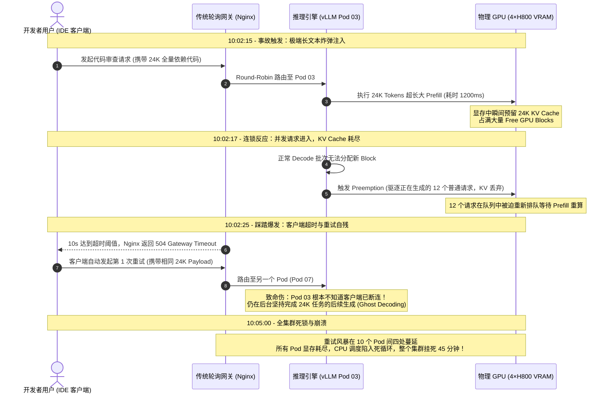
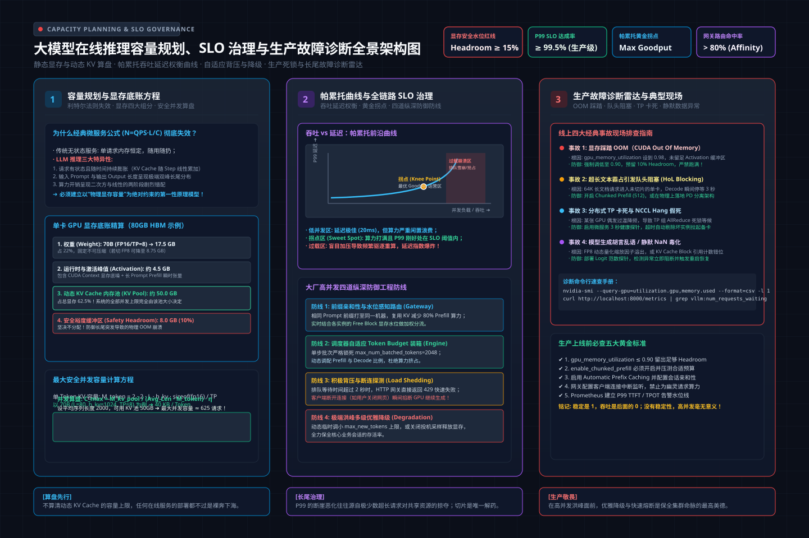
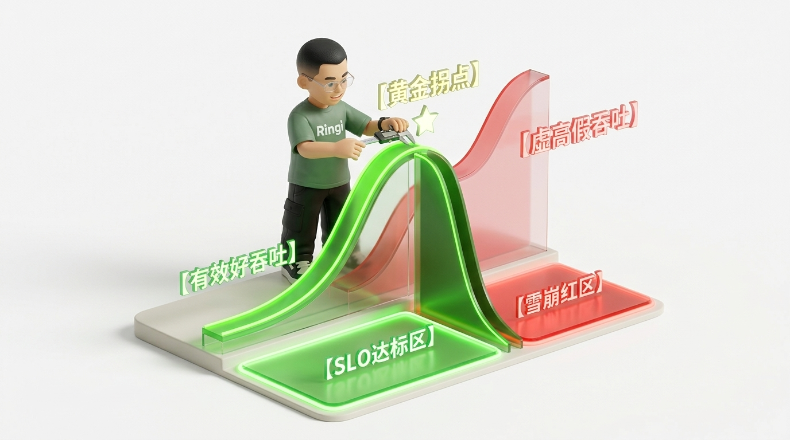

# 🏛️ 第36讲：为什么按平均 QPS 算集群上线必死？——大模型在线推理容量规划、SLO 治理与生产级故障排障全景实战

> **主讲人**：👓 **Ringi**（大厂 AI Infrastructure 工程师）  
> **所属模块**：[Module 05: LLM 在线推理系统与性能工程](./README.md)  
> **篇章范式**：🚀 LLM 推理服务与高性能 Serving 篇（Inference Serving & Systems Paradigm）  
> **核心导读**：在传统 Web 微服务时代，工程师习惯于拿“平均 QPS × 平均响应时间”掏出计算器估算微服务容器实例数，哪怕预留 20% 的 Buffer 也能平稳扛过早高峰。但在大模型在线推理（LLM Serving）的世界里，如果你胆敢拿着平均 QPS 去找采购申请 GPU 集群，上线当天你一定会经历职业生涯中最绝望的“全集群雪崩”——显存瞬时打满 OOM、Prefix Cache 遭遇长文本炸弹击穿、客户端因首字超时疯狂重试形成自残式踩踏、GPU 计算单元空转而排队队列堆积数万请求。为什么大模型推理的容量不是线性可加的？为什么吞吐量拉满反而意味着系统正在“自杀”？本讲将带你深入大模型在线生产真现场，彻底拆穿“伪容量规划”的谎言，从显存四账本与 Prefill/Decode 物理冲突的第一性原理出发，手算真实集群卡数算盘，建立以 Goodput 为核心的严苛 SLO 治理体系，并交给你一套经历过数十次线上实战淬炼的高可用排障 Runbook。


```text
========================================================================================================================
                                     Ringi 3D 架构工坊 · 在线推理容量规划、SLO 治理与排障全景
========================================================================================================================

  [客户端请求激流] (长短文本混合、多轮对话、突发洪峰)
         │ 
         ▼
 ┌────────────────────────────────────────────────────────────────────────────────────────────────────────────────────┐
 │  AI 智能感知网关集群 (Perception-Aware AI Gateway)                                                                 │
 │  ┌──────────────────────────────────────────────────────────────────────────────────────────────────────────────┐  │
 │  │ 1. 业务特征提取: Prompt Tokenizer 预解析 ──► 区分短问答 (<512) vs 长文档 (>8K) vs 系统 Prompt 前缀           │  │
 │  │ 2. 路由调度中枢:                                                                                            │  │
 │  │    • Prefix-Cache Affinity (Radix Tree 前缀哈希粘性分发，TTFT 降低 85%)                                      │  │
 │  │    • Remaining KV Block Awareness (感知实例显存剩余块，防止热点节点击穿)                                     │  │
 │  │ 3. 动态过载防护: 排队超时预测 (Predicted Queue Latency) ──► 智能负载丢弃 (Load Shedding) + 客户端断连监控    │  │
 │  └──────────────────────────────────────────────────────────────────────────────────────────────────────────────┘  │
 └──────────────────────────────┬─────────────────────────────────────────────────────┬───────────────────────────────┘
                                │ (gRPC / Streaming SSE 动态负载均衡分发)
                                ▼
 ┌────────────────────────────────────────────────────────────────────────────────────────────────────────────────────┐
 │  分布式 Serving 推理实例集群 (vLLM / SGLang / TensorRT-LLM on 8×H800 / 8×A100 Nodes)                                │
 │  ┌───────────────────────────────────────────────────────┐ ┌──────────────────────────────────────────────────────┐  │
 │  │ 核心引擎调度层 (Serving Engine Scheduler)             │ │ 显存四账本与硬件执行域 (GPU VRAM & Execution)        │  │
 │  │ • Continuous Batching (动态迭代装箱)                  │ │ • Model Weights: FP16 / BF16 / FP8 固定占用          │  │
 │  │ • Chunked Prefill (削峰填谷，解耦长短请求)            │ │ • KV Cache Pool: PagedAttention 分页动态内存池       │  │
 │  │ • Preemption & Recompute (紧急驱逐与换入换出保活)     │ │ • Activation & CUDA Graph 捕获专有显存缓冲           │  │
 │  │ • Radix Tree 状态缓存 (Prefix Caching 复用)           │ │ • NVLink / NVSwitch 高速张量并行通信 (TP=4/TP=8)     │  │
 │  └───────────────────────────────────────────────────────┘ └──────────────────────────────────────────────────────┘  │
 └──────────────────────────────┬─────────────────────────────────────────────────────┬───────────────────────────────┘
                                │ 实时导出秒级推理指标 (Prometheus Metrics)
                                ▼
 ┌────────────────────────────────────────────────────────────────────────────────────────────────────────────────────┐
 │  SLO 治理、观测与生产故障自愈闭环 (SLO Governance & Autonomous Healing)                                             │
 │  ┌─────────────────────────────────┐ ┌──────────────────────────────────┐ ┌─────────────────────────────────────┐  │
 │  │ 核心 SLO 黄金监控体系           │ │ 帕累托容量治理 (Goodput Pareto)  │ │ 生产故障排障与自动化自愈 (Runbook)  │  │
 │  │ • TTFT (P90/P99 首字响应延迟)   │ │ • 寻找 Throughput vs SLO 黄金拐点 │ │ • 显存 OOM 熔断与动态降级策略       │  │
 │  │ • TPOT / ITL (字间流式平滑度)   │ │ • 剔除超时废 Token，防止伪高吞吐  │ │ • NCCL Watchdog 挂死节点摘除        │  │
 │  │ • Queue Latency (请求排队水线)  │ │ • 基于 24h 潮汐曲线动态配额规划   │ │ • Prefix Cache 抖动热点平抑         │  │
 │  └─────────────────────────────────┘ └──────────────────────────────────┘ └─────────────────────────────────────┘  │
 └────────────────────────────────────────────────────────────────────────────────────────────────────────────────────┘
========================================================================================================================
```

<!-- more -->

## 📑 目录导航

- [0. Ringi 开场：生产真实现场与痛点冲突](#0-ringi-开场生产真实现场与痛点冲突)
  - [0.1 真实工程矛盾：为什么按平均 QPS 规划卡数，上线当天直接被击穿？](#01-真实工程矛盾为什么按平均-qps-规划卡数上线当天直接被击穿)
  - [0.2 线上真实事故复盘：某头部代码助手在早高峰遭遇“长文本炸弹”与重试踩踏的 45 分钟雪崩](#02-线上真实事故复盘某头部代码助手在早高峰遭遇长文本炸弹与重试踩踏的-45-分钟雪崩)
  - [0.3 离线批处理（Offline Batching）vs 在线低延迟（Online Serving）全栈维度对照速查表](#03-离线批处理offline-batching-vs-在线低延迟online-serving全栈维度对照速查表)
- [1. 第一性原理穿透：大模型在线推理的资源消耗方程与吞吐延迟权衡](#1-第一性原理穿透大模型在线推理的资源消耗方程与吞吐延迟权衡)
  - [1.1 经典微服务容量公式（$N = QPS \times Latency / Worker$）为什么彻底失效？](#11-经典微服务容量公式n--qps-times-latency--worker为什么彻底失效)
  - [1.2 Prefill 与 Decode 动态异构负载下的资源错配：算力墙 vs 显存双墙](#12-prefill-与-decode-动态异构负载下的资源错配算力墙-vs-显存双墙)
  - [1.3 核心约束铁三角（Iron Triangle）：TTFT、TPOT 与 Throughput 的不可兼得](#13-核心约束铁三角iron-trianglettfttpot-与-throughput-的不可兼得)
- [2. 公式五步穿透：工业级 GPU 卡数与显存容量预测性规划模型](#2-公式五步穿透工业级-gpu-卡数与显存容量预测性规划模型)
  - [2.1 显存四账本硬核核算（Weights + Paged KV + Activation/Graph + Safety Buffer）](#21-显存四账本硬核核算weights--paged-kv--activationgraph--safety-buffer)
  - [2.2 公式五步穿透：单节点最大稳定并发数 $B_{\max}$ 与单卡极限吞吐推导](#22-公式五步穿透单节点最大稳定并发数-b_max-与单卡极限吞吐推导)
  - [2.3 基于 24 小时真实潮汐流量曲线的集群卡数推导模型](#23-基于-24-小时真实潮汐流量曲线的集群卡数推导模型)
  - [2.4 真实生产推演实战：Qwen2.5-72B 在 8×H800 节点上的真实容量规划实例计算](#24-真实生产推演实战qwen25-72b-在-8h800-节点上的真实容量规划实例计算)
- [3. 核心 SLO 治理体系：从 Metrics 观测到 Goodput Pareto 边界](#3-核心-slo-治理体系从-metrics-观测到-goodput-pareto-边界)
  - [3.1 现代 LLM Serving 的四维黄金指标体系与度量口径](#31-现代-llm-serving-的四维黄金指标体系与度量口径)
  - [3.2 到底什么是 Goodput（有效吞吐量）？拒绝“自欺欺人”的伪高吞吐](#32-到底什么是-goodput有效吞吐量拒绝自欺欺人的伪高吞吐)
  - [3.3 Pareto 边界曲线实测绘制：Throughput 与 SLO 违约率的黄金拐点](#33-pareto-边界曲线实测绘制throughput-与-slo-违约率的黄金拐点)
  - [3.4 动态过载保护与分级服务质量（QoS）：基于排队延迟预测的智能丢弃](#34-动态过载保护与分级服务质量qos基于排队延迟预测的智能丢弃)
- [4. 智能路由与网关调度：把流量送到最懂它的 GPU 上](#4-智能路由与网关调度把流量送到最懂它的-gpu-上)
  - [4.1 传统轮询（Round-Robin）在 LLM 场景引发的长尾与队头阻塞](#41-传统轮询round-robin在-llm-场景引发的长尾与队头阻塞)
  - [4.2 三维感知型智能调度：Queue Depth、KV Blocks 与 Prefix-Cache Affinity](#42-三维感知型智能调度queue-depthkv-blocks-与-prefix-cache-affinity)
  - [4.3 客户端中断处理（Client Disconnection Handling）：掐断幽灵生成（Ghost Decoding）](#43-客户端中断处理client-disconnection-handling掐断幽灵生成ghost-decoding)
- [5. 现代 Serving 引擎内核配置与调优指南（vLLM / SGLang）](#5-现代-serving-引擎内核配置与调优指南vllm--sglang)
  - [5.1 显存利用率 `gpu_memory_utilization` 与 `block_size` 的微调玄机](#51-显存利用率-gpu_memory_utilization-与-block_size-的微调玄机)
  - [5.2 调度并发窗口：`max_num_seqs` 与 `max_num_batched_tokens` 的抗突发设计](#52-调度并发窗口max_num_seqs-与-max_num_batched_tokens-的抗突发设计)
  - [5.3 CUDA Graph 批处理捕获桶（Batch Buckets）调优：显存膨胀与 CPU 开销规避](#53-cuda-graph-批处理捕获桶batch-buckets调优显存膨胀与-cpu-开销规避)
  - [5.4 Chunked Prefill 混合装箱参数与平衡点实战](#54-chunked-prefill-混合装箱参数与平衡点实战)
- [6. 生产级故障排障 Runbook：高频血泪事故诊断与解法](#6-生产级故障排障-runbook高频血泪事故诊断与解法)
  - [6.1 故障一：显存 OOM 猝死与动态申请雪崩](#61-故障一显存-oom-猝死与动态申请雪崩)
  - [6.2 故障二：Prefix Cache 频繁驱逐抖动（Radix Tree 缓存击穿）](#62-故障二prefix-cache-频繁驱逐抖动radix-tree-缓存击穿)
  - [6.3 故障三：TP 组内单卡掉队与通信死锁（NCCL Watchdog 诊断）](#63-故障三tp-组内单卡掉队与通信死锁nccl-watchdog-诊断)
  - [6.4 故障四：突发热点引发排队风暴与级联超时（抢占驱逐重算 Preemption 治理）](#64-故障四突发热点引发排队风暴与级联超时抢占驱逐重算-preemption-治理)
  - [6.5 生产排障诊断决策树与定位速查表](#65-生产排障诊断决策树与定位速查表)
- [7. 动手实战与代码实验室（Minimal Runnable Code）](#7-动手实战与代码实验室minimal-runnable-code)
  - [7.1 实验 1：工业级大模型推理容量与集群卡数规划模拟计算器](#71-实验-1工业级大模型推理容量与集群卡数规划模拟计算器)
  - [7.2 实验 2：基于泊松分布的真实业务压测与 SLO Goodput Pareto 分析器](#72-实验-2基于泊松分布的真实业务压测与-slo-goodput-pareto-分析器)
  - [7.3 实验 3：轻量级感知型 AI 网关调度模拟器（RR vs Prefix-Affinity vs KV-Aware）](#73-实验-3轻量级感知型-ai-网关调度模拟器rr-vs-prefix-affinity-vs-kv-aware)
  - [7.4 实验 4：Serving 引擎实时监控探针与健康度巡检告警脚本](#74-实验-4serving-引擎实时监控探针与健康度巡检告警脚本)
- [8. Ringi 避坑指南与生产黄金准则](#8-ringi-避坑指南与生产黄金准则)
  - [8.1 避坑表格（❌ 常见小白错误理解 vs ✅ 大厂 AI Infra 正确理解）](#81-避坑表格-常见小白错误理解-vs--大厂-ai-infra-正确理解)
  - [8.2 生产容量与稳定性黄金 Checklist](#82-生产容量与稳定性黄金-checklist)
- [9. Ringi 5 点核心速记口诀、自我检验清单与课后深度思考题](#9-ringi-5-点核心速记口诀自我检验清单与课后深度思考题)
  - [9.1 5 点押韵核心速记口诀](#91-5-点押韵核心速记口诀)
  - [9.2 10 条白板自我检验清单](#92-10-条白板自我检验清单)
  - [9.3 3 道高阶开放式课后思考题（含极限 Corner Case）](#93-3-道高阶开放式课后思考题含极限-corner-case)
- [10. 📚 参考资料与核心源码/经典论文指引](#10--参考资料与核心源码经典论文指引)
- [附录：Appendix A — 大厂硬核高频面试题与白板推导（Interview Drill）](#附录appendix-a--大厂硬核高频面试题与白板推导interview-drill)
- [🎨 【配图工坊生图 Prompt 暂存区 · 生成配图后可一键整块删除】](#-配图工坊生图-prompt-暂存区--生成配图后可一键整块删除)

---

# 0. Ringi 开场：生产真实现场与痛点冲突

## 0.1 真实工程矛盾：为什么按平均 QPS 规划卡数，上线当天直接被击穿？

作为一线 AI Infra 工程师，你大概率经历过或即将经历这样一场“悲剧”：

公司某核心业务（例如智能客服或研发 Copilot）准备全量接入最新的 72B 开源大模型。业务负责人拿着监控大盘找到你：“Ringi，我们目前业务的日均请求量是 86.4 万次，折算下来**平均 QPS 只有 10**。单次请求平均输入 1000 Tokens，输出 500 Tokens。按照每秒 10 个请求、单请求端到端 5 秒计算，并发池里平均也就 50 个请求。我们在测试机上一张卡压测单请求每秒能吐 40 个 Token，那是不是随随便便部署两台 8 卡机器（16 张 GPU）就能高枕无忧了？保守一点，我们给你批 3 台机器，够不够意思？”

如果你欣然点头，那么恭喜你，你正在亲手为自己的职业生涯埋下一颗“烈性核弹”。

上线当天上午 10:00，早高峰流量如约而至。监控大盘上的 QPS 甚至还没有突破 25，你的报警手机就已经被拨爆了：
1. **客户端狂报 504 Gateway Timeout**：前端用户的流式文字卡在输入框里，转圈等待超过 15 秒没有任何反应；
2. **Prometheus 监控曲线呈现诡异断崖**：系统总吞吐（Tokens/s）看似飙得极高，但业务侧的有效完结率（Completion Rate）暴跌到不足 30%；
3. **GPU 显存告警此起彼伏**：部分推理节点触发 CUDA Out of Memory (OOM) 导致整个 Engine 进程被操作系统 OOM Killer 强行暴毙，K8s Pod 陷入 CrashLoopBackOff；
4. **幸存节点的 GPU 利用率冰火两重天**：有的节点 SM 利用率高达 95% 但都在疯狂重算被驱逐的 KV Cache；有的节点 HBM 显存吃得满满当当，算力单元却在旷工，排队队列（Waiting Queue）里堆积了 2000 多个请求动弹不得！

你满头大汗地盯着屏幕发呆：**明明总算力供给远远大于业务的平均需求，为什么整个集群会像多米诺骨牌一样瞬间全线崩溃？**

因为你犯了两个致命错误：
第一，**你把微服务的“无状态统计学”套用在了大模型这个“重状态、非线性显存吞噬兽”身上**。大模型在线推理的资源消耗从来不是按“请求数”线性累加的，而是由 **Prompt 长度与生成长度的联合二维分布**、**KV Cache 显存容量墙** 以及 **Prefill 瞬时算力尖刺** 共同决定的强状态系统。
第二，**你忽视了真实流量的泊松突发性与长尾效应（Tail Latency）**。业务平均 1000 Tokens 的背后，必然潜伏着 1% 携带 32K 巨型上下文的“长文本炸弹”。这 1% 的长请求在进入 Continuous Batching 调度队列的一瞬间，就会瞬间霸占相当于 30 个普通请求的 KV Cache 显存，直接将并发池的水线推向暴跌阈值！

---

## 0.2 线上真实事故复盘：某头部代码助手在早高峰遭遇“长文本炸弹”与重试踩踏的 45 分钟雪崩

为了让你彻底看清这套崩溃传导链，我们复盘一次发生在大厂某知名研发协同平台的真实线上 P0 事故。

### 事故拓扑与背景配置
- **模型**：Qwen2.5-Coder-32B-Instruct（FP16 精度，单机 4 卡 H800 TP=4 部署，共 10 个推理 Pod，总计 40 张卡）；
- **Serving 框架**：vLLM（版本当时启用 PagedAttention 与 Continuous Batching，未开启 Chunked Prefill，`gpu_memory_utilization=0.90`）；
- **前置网关**：标准 Nginx 轮询代理（Round-Robin），超时阈值设为 10 秒，前端客户端具备自动重试机制（默认失败重试 2 次）。




### 事故复盘解剖：五步致命传导
1. **长文本炸弹首杀**：某位开发者在 IDE 中对一个长达 2.4 万行的大型重构工程触发了“解释当前代码”。该请求携带了高达 24K Tokens 的 Prompt 瞬间打入 Pod 03；
2. **调度器单核霸占与显存挤压**：由于当时未开启 Chunked Prefill，Pod 03 的 GPU 在长达 1.2 秒内完全被这个 24K 的 GEMM 算子霸占，导致原本正在平稳流式吐字的 16 个 Decode 请求全部暂停（TTFT 正常，但 TPOT 瞬间被拉长到 1200ms 以上）；更致命的是，24K 上下文瞬间吃掉了当前卡上近 15GB 的 KV Cache 物理块；
3. **显存水线耗尽引发 Preemption（抢占驱逐）**：随后的几个常规请求需要申请新 Block 时，vLLM 发现物理显存不足，触发了内置的抢占策略（Preemption Mode）——将正在 Decode 的数个请求的 KV Cache 强行驱逐（Evict），打回等待队列；
4. **客户端超时重试风暴（自残踩踏）**：前端客户端因为 10 秒没有收到后续流式 Token，判定连接超时，立即自动发起重试！而网关 Nginx 只是将重试请求根据轮询又投递给了 Pod 07；更可怕的是，**Pod 03 此时根本没有捕获客户端的断连信号（Connection Reset by Peer），依然在后台耗费极其宝贵的 Tensor Core 算力继续计算那个已经没人要的“幽灵请求（Ghost Request）”**；
5. **全集群死锁雪崩**：重试请求在全集群 10 个节点上像病毒一样扩散，每一个节点都陷入了“长文本抢占 -> 驱逐重算 -> 显存耗尽 -> 客户端超时重试 -> 产生更多幽灵请求”的恶性循环。最终，整个集群的吞吐量彻底归零，排队数堆积至几千个，只能依靠人工紧急接入修改网关限流规则并整机滚动重启才得以恢复。

这场长达 45 分钟的惨痛事故用血淋淋的事实告诉我们：**在大模型在线推理中，不考虑显存上限的调度是草菅人命，不考虑长尾隔离的网关是系统灾难，没有断连感知和丢弃机制的超时重试是纯粹的自杀行为！**

---

## 0.3 离线批处理（Offline Batching）vs 在线低延迟（Online Serving）全栈维度对照速查表

在深入容量规划与治理之前，我们必须在全栈体系上将“离线批处理”与“在线服务”彻底剥离。许多工程师之所以搞砸生产，就是因为把离线 Benchmark 的漂亮数字直接搬进了在线系统。

| 评估维度 | 离线批处理系统（Offline / Asynchronous Batching） | 在线低延迟服务系统（Online Low-Latency Serving） | 大模型底层物理与工程本质差异 |
| :--- | :--- | :--- | :--- |
| **核心优化北极星指标** | **总吞吐量（Tokens/sec）与 GPU 饱和度** | **严格 SLO 约束下的有效吞吐量（Goodput）** | 离线追求算力榨干；在线追求在 P99 违约前尽可能多接客 |
| **首字延迟（TTFT）要求** | 极度宽松（数秒至数十分钟均可容忍） | **毫秒级严苛控制（通常要求 P99 < 500ms ~ 1.5s）** | 在线受限于人类阅读交互的生理心理学阈值 |
| **字间延迟（TPOT / ITL）** | 毫不关心（关心总耗时） | **极度敏感（通常要求 P99 < 30ms ~ 50ms，拟打字机感）** | 离线允许大 Batch 跑 GEMM；在线单步生成必须保极速 |
| **Batch 策略与组装方式** | 静态超大 Batch（尽量把显存和 SM 填到 100%） | **Continuous Batching + Chunked Prefill 动态装箱** | 在线必须动态化解长短文本混杂对流式生成的干扰 |
| **KV Cache 内存利用率** | 允许提前按批次序列最大长度精准规划 | **必须使用 PagedAttention 并保留动态的安全 Headroom** | 在线请求长度不可预知，显存一旦用尽即触发驱逐甚至 OOM |
| **硬件瓶颈主导区间** | 绝大多数时间落在 **Compute-Bound（算力受限）** | **长期处于 Compute-Bound 与 Memory-Bound 剧烈震荡** | Prefill 抢算力，Decode 抢显存带宽，调度器必须调和二者矛盾 |
| **过载处理机制（Overload）**| 阻塞入队排队（队列越长硬件越饱满） | **必须实施积极的 Load Shedding、降级与客户端断连清理** | 在线排队超过用户容忍阈值后，所有后续算力全为无用功 |
| **网关调度感知能力** | 无需感知模型内部，简单按卡负载分发即可 | **必须深度感知实例的剩余 KV Blocks 与 Prefix Caching 状态** | 感知调度可提升 80% 缓存命中率并消除热点倾斜 |

---

# 1. 第一性原理穿透：大模型在线推理的资源消耗方程与吞吐延迟权衡

> 💡 **架构全景速览**：在深潜源码前，先在白板上建立坚不可摧的大模型在线推理容量规划、SLO 治理与生产故障诊断底账。
> 
> 

## 1.1 经典微服务容量公式（$N = QPS \times Latency / Worker$）为什么彻底失效？

在传统互联网后台架构中，利特尔法则（Little's Law）是容量规划的定海神针：
$$ L = \lambda \times W $$
即：系统中平均并发请求数 $L$ 等于到达率 $\lambda$（QPS）乘以平均停留时间 $W$（Latency）。如果单个工作线程或微服务容器可以安全承载 $C$ 个并发请求，那么所需的机器实例数就是：
$$ N = \frac{QPS \times Latency}{C} $$

**为什么在 LLM 在线推理中，这个公式不仅毫无指导意义，反而会诱导灾难？**

### 原因一：处理延迟 $W$ 根本不是常数，它被当前并发数 $L$ 反向强耦合
在传统微服务中，只要 CPU 利用率在 60% 以下，单请求的耗时基本稳定在 50ms 左右。但在 LLM 推理中，根据 Roofline 模型：
- 当并发数从 1 增加到 64 时，由于 Decode 阶段从 Memory-Bound 逐渐向 Compute-Bound 移动，单步 Decode 的耗时会从 12ms 逐渐攀升至 45ms；
- 更严重的是，随着并发增加，动态 Batching 调度器不得不频繁进行注意力计算排队，**输入长度直接决定了 Prefill 耗时，输出长度直接决定了自回归循环步数**。你的“单请求 Latency”是一个随着请求输入输出长度分布以及**全系统瞬时拥挤度剧烈漂移的非线性函数**！

### 原因二：工作单元承载能力 $C$ 是动态缩水的气球
在传统微服务里，一个容器分 2GB 内存，开 50 个线程，哪怕吞吐跑满，内存几乎是平稳的。
但在 LLM 中，**显存不仅要放固定的模型权重，还要为每一个并发请求动态分配 KV Cache**：
- 如果进来的全是短请求（Prompt=200, Output=100），一块 80GB 的 GPU 可能会轻松吃下并发 $C = 120$；
- 但如果突然进来 5 个包含长文档分析的请求（Prompt=16K, Output=2K），这 5 个请求所占用的 KV Cache 显存就高达数十 GB，**直接将整张卡的有效并发承载容量 $C$ 从 120 强行压缩到 8**！
- 如果你按照平均并发容量 $C=60$ 去规划，系统就会在遇到长请求的瞬间被当场顶爆。

---

## 1.2 Prefill 与 Decode 动态异构负载下的资源错配：算力墙 vs 显存双墙

我们必须深刻复习本模块核心认知：**大模型推理不是单一任务，而是两段物理特征截然相反的计算形态的强制交织。**

```text
[请求进入系统]
      │
      ▼
┌────────────────────────────────────────────────────────────┐
│ 阶段一：Prefill (预填充阶段)                               │
│ • 物理特性: Compute-Bound (算力瓶颈)                       │
│ • 计算核心: 巨型 GEMM (通用矩阵乘法)                        │
│ • 算术强度: Arithmetic Intensity > 150 FLOP/Byte           │
│ • 资源争抢: 霸占 Tensor Cores 算力，导致全卡任务暂停       │
└─────────────────────────────┬──────────────────────────────┘
                              │ 产出首字并构建 KV Cache
                              ▼
┌────────────────────────────────────────────────────────────┐
│ 阶段二：Decode (自回归逐字解码阶段)                        │
│ • 物理特性: Memory-Bound (显存带宽瓶颈)                    │
│ • 计算核心: 巨型 GEMV / Batch GEMM (扫权重矩阵拿单向量)    │
│ • 算术强度: Arithmetic Intensity ≈ 2~20 FLOP/Byte          │
│ • 资源争抢: 持续霸占 HBM 容量 (KV Cache 线性增长)，拉长延迟 │
└────────────────────────────────────────────────────────────┘
```

这一物理错配在在线服务中引发了极度致命的**时分调度冲突**：
1. **Decode 被 Prefill 斩首**：自回归解码要求每隔 20~40ms 必须走完一步，才能让前端用户感受到丝滑的打字机流式输出。然而，一旦调度器装入一个新的长 Prefill（比如 4096 Tokens），这个大 GEMM 算子在 GPU 上执行可能需要整整 200ms。在这 200ms 期间，所有正在 Decode 的请求全部被硬件流水线挂起等待！前端用户就会明显感觉到字间间隔出现了一次长达 200ms 的剧烈“抽搐（Jitter）”；
2. **Prefill 被 Decode 挤爆显存**：如果你为了避免 Jitter，限制同时处理的 Prefill 数量，让大量的 Decode 请求占满整个 Continuous Batch，那么随着 Decode 步数步步推进，KV Cache 显存池会像涨潮一样迅速淹没安全水位，导致新请求根本无法分配首个 Prompt 的 KV Block，直接在队列外发生队头阻塞。

---

## 1.3 核心约束铁三角（Iron Triangle）：TTFT、TPOT 与 Throughput 的不可兼得

在线大模型系统的架构设计，本质上是在一个不可能三角（The Impossible Iron Triangle）中走钢丝：

```text
                     【极限吞吐量 Throughput】
                    (高硬件利用率 / 极低单 Token 成本)
                               ▲
                              / \
                             /   \
                            /     \
                           /       \
                          /  生产   \
                         /  权衡区   \
                        /             \
                       /               \
                      ▼                 ▼
   【极低首字延迟 TTFT】 ◄──────────────► 【极低字间延迟 TPOT】
   (快速响应 / P99 < 300ms)               (平滑打字 / P99 < 30ms)
```

1. **追求极限 Throughput（吞吐偏向）**：
   - **做法**：将 Batch Size 尽可能拉大，设置超大的 `max_num_batched_tokens`（例如 8192），贪婪地把尽可能多的请求塞进每一次 Forward 执行；
   - **后果**：Tensor Cores 算力利用率和 HBM 带宽利用率双双爆表，每美元产出的 Token 数最高；但每一次 Forward 耗时被拉长，**TTFT 和 TPOT 双双恶化，尾延迟 P99 彻底失控**。
2. **追求极致 TTFT（响应偏向）**：
   - **做法**：一旦有新请求到达，立即抢占调度，甚至单独为其开启一次大规格 Prefill 计算；
   - **后果**：首字极快返回；但每一次为了 Prefill 打断当前正在进行的 Decode 批次，**严重破坏了自回归生成的节奏，导致现有所有并发流的 TPOT 频繁出现惊魂尖刺**，整体系统吞吐暴跌。
3. **追求极致 TPOT（平滑偏向）**：
   - **做法**：严格限制单个 Forward 中的 Token 预算，极度压低 Batch 并发数，并使用极小的 Chunked Prefill 尺寸（如 256）；
   - **后果**：字间流式输出极其顺滑，如同真人高速敲键盘；但由于无法充分发挥 GPU 大规模矩阵乘法的硬件饱和效应，**算力大量空转，系统总吞吐量极低，单 Token 运行成本直线上升**。

工业级容量规划与 SLO 治理的真谛，绝不是盲目追求某一个单一指标的极致，而是**在业务能够容忍的 TTFT 与 TPOT 上限约束下，寻找那个让有效吞吐量（Goodput）最大化的黄金平衡点**。

---

# 2. 公式五步穿透：工业级 GPU 卡数与显存容量预测性规划模型

## 2.1 显存四账本硬核核算（Weights + Paged KV + Activation/Graph + Safety Buffer）

要算清一个 GPU 节点到底能承载多大容量，必须把整张卡的物理显存划分成绝对清晰的“四本物理账”。任何一本账算错，要么造成数百万的硬件闲置浪费，要么直接引发线上 OOM。

以经典的 **80 GB (实际可用约为 $80 \times 10^9 \text{ Bytes} \approx 74.5 \text{ GiB}$)** 显存卡（如 NVIDIA H800 / A100-SXM4-80GB）为例：

```text
┌────────────────────────────────────────────────────────────────────────────────────────┐
│ 物理显存总池 (Total VRAM = 80 GB)                                                      │
├───────────────────┬───────────────────┬───────────────────────┬────────────────────────┤
│ 账本一：模型权重  │ 账本二：运行时基座│ 账本三：系统安全余量  │ 账本四：动态 KV Cache   │
│ Model Weights     │ Activation / Graph│ Safety Buffer         │ Dynamic Paged KV Pool  │
│ (固定不可动摇)    │ (捕获内存与临时栈)│ (防止碎片与突发溢出)  │ (决定最大并发与吞吐)   │
│ 约 28 ~ 36 GB     │ 约 3 ~ 6 GB       │ 约 4 ~ 8 GB           │ 剩余全部可用空间       │
└───────────────────┴───────────────────┴───────────────────────┴────────────────────────┘
```

1. **账本一：模型参数权重显存（$M_{\text{weights}}$）**
   - **计算公式**：
     $$ M_{\text{weights}} = \frac{P \times b_w}{\text{TP}} $$
     其中 $P$ 为模型总参数量（Parameters），$b_w$ 为每个参数的字节数（FP16/BF16 为 2 字节，FP8 为 1 字节，INT4 为 0.5 字节），$\text{TP}$ 为张量并行度（Tensor Parallelism）。
   - *注意*：必须计入 Embedding 层及非 Transformer 层的显存占用（在部分框架中可能未切分）。
2. **账本二：中间激活与运行时框架驻留显存（$M_{\text{runtime}}$）**
   - 包含 PyTorch 运行时上下文、CUDA Driver Context（约 1~1.5 GB）、中间激活值（Activation Memory）以及 **CUDA Graph 捕获专有内存池**。
   - 在启用 CUDA Graph 加速 Decode 时，引擎会为一系列固定的 Batch 尺寸预先捕获静态执行图，这部分显存开销通常在 2 GB ~ 4 GB 不等。
3. **账本三：安全缓冲与内存防抖预算（$M_{\text{buffer}}$）**
   - 生产环境中决不能将显存用至 100%。通常由引擎参数 `gpu_memory_utilization` 严格控制（例如设定为 0.90，意味着主动扣除 10% 的物理显存作为系统防止碎片和瞬时申请崩溃的绝对安全垫）。
4. **账本四：动态 Paged KV Cache 内存池（$M_{\text{kv\_pool}}$）**
   - 扣除上述三项后，剩下的全部连续物理显存，被划分为固定大小的 Page（Block，通常每个 Block 容纳 16 或 32 个 Tokens），构建成 PagedAttention 的动态内存池。
   - **这一账本的大小，直接在物理上锁死了该节点能够同时容纳的 Token 宇宙上限！**

---

## 2.2 公式五步穿透：单节点最大稳定并发数 $B_{\max}$ 与单卡极限吞吐推导

现在，我们要推导决定集群命脉的核心指标：**单个节点在给定上下文长度下，到底能并发扛住多少个请求（$B_{\max}$）？**

### 第一步：为什么需要算它？（The Problem）
很多工程师在部署 vLLM 时，直接把 `max_num_seqs` 默认拉到 256。结果一旦业务请求的平均输入长度从 500 漂移到 3000，集群立刻因为 KV Cache 耗尽发生剧烈 Preemption，大量请求被挂起。我们必须在物理上精准界定：在既定显存池大小和预期的 P90 上下文长度下，**最大安全并发窗口是多少**，从而为网关限流与引擎参数提供不可逾越的底账依据。

### 第二步：Mental Model（物理直觉）
想象一家高档餐厅（GPU 节点）。
- 厨房和餐桌固定占了一半的店面空间（模型权重与系统开销）；
- 剩下的一半空间摆放顾客的储物柜（KV Cache 显存池）；
- 每个顾客进来消费，无论吃多久，只要没结账离开，他的随身行李（从 Prompt 到生成的新 Token）就必须全程塞在储物柜里；
- **店里面能同时坐多少个客人（并发数），根本不取决于你门口服务员端菜有多快，而是取决于你的储物柜总共有多少个格子，以及每个客人带的行李平均有多大！**

### 第三步：Tiny Calculator（极简手算）
假设一个 Toy Transformer 模型：
- 隐藏层数 $L = 2$ 层；
- 键值头数 $N_{\text{kv}} = 2$；
- 每个头的维度 $d_{\text{head}} = 64$；
- 精度为 FP16（$b_{\text{kv}} = 2$ 字节）；
- 显存池总共有可怜的 $1 \text{ MB} = 1,048,576 \text{ 字节}$；
- 单个请求的总序列长度 $S = 512$ Tokens。

1. 先算单 Token 在一层上的 KV 大小：
   $$ 2 \text{ (Key和Value)} \times 2 \text{ (头数)} \times 64 \text{ (维度)} \times 2 \text{ (字节)} = 512 \text{ 字节} $$
2. 乘以 2 层，得到单个 Token 的 KV Cache 容量：
   $$ 512 \text{ 字节} \times 2 \text{ 层} = 1024 \text{ 字节} = 1 \text{ KB/Token} $$
3. 单个请求如果打满 512 Tokens，需要消耗：
   $$ 512 \times 1 \text{ KB} = 512 \text{ KB} $$
4. 这个 1MB 的显存池最多能同时容纳多少个并发？
   $$ B_{\max} = \frac{1024 \text{ KB}}{512 \text{ KB}} = 2 \text{ 个并发！} $$
   如果硬塞第 3 个并发，显存直接打满雪崩！

### 第四步：Formal Model（标准通用工业公式）
对于任何具备 GQA（分组查询注意力）的现代大模型，单个 Token 在单张卡（经过张量并行切分 $\text{TP}$）上的 KV Cache 消耗公式为：
$$ \text{KV}_{\text{token\_per\_gpu}} = \frac{2 \times L \times N_{\text{kv}} \times d_{\text{head}} \times b_{\text{kv}}}{\text{TP}} \quad (\text{Bytes/Token}) $$

设单张 GPU 物理显存总量为 $V_{\text{total}}$，引擎预留比例为 $\alpha$（如 0.90），模型切分后占用的显存为 $M_{\text{weights}}$，系统运行时开销为 $M_{\text{runtime}}$。
则单卡可用于 KV Cache 的总容量为：
$$ M_{\text{kv\_pool}} = \left( V_{\text{total}} \times \alpha \right) - M_{\text{weights}} - M_{\text{runtime}} $$

设业务场景中，并发请求在生命周期内的总上下文长度（Prompt 长度 $S_{\text{prompt}}$ + 生成长度 $S_{\text{gen}}$）的规划评估值为 $S_{\text{total}}$。
则**单节点支持的最大稳定物理并发数 $B_{\max}$** 为：
$$ B_{\max} = \left\lfloor \frac{M_{\text{kv\_pool}}}{\text{KV}_{\text{token\_per\_gpu}} \times S_{\text{total}}} \right\rfloor $$

### 第五步：Sanity Check（真实工业级数量级校验）
我们以生产环境最标杆的配置做一次实战验算：
- **模型**：Qwen2.5-72B-Instruct（$L = 80$, $N_{\text{kv}} = 8$, $d_{\text{head}} = 128$, FP16 精度 $b_{\text{kv}} = 2$）；
- **硬件**：单机 8 卡 H800（$\text{TP} = 8$，单卡 80GB HBM3，实际可用 $V_{\text{total}} \approx 74.5 \text{ GiB} \approx 80 \times 10^9 \text{ Bytes}$）；
- **参数显存**：72B 模型切到 8 卡，单卡权重 $M_{\text{weights}} \approx 18 \text{ GB}$；
- **运行时开销**：$M_{\text{runtime}} \approx 4 \text{ GB}$；
- **安全阈值**：$\alpha = 0.90$（可用上限 $80 \times 0.90 = 72 \text{ GB}$）；
- 则单卡 KV 池容量：$M_{\text{kv\_pool}} = 72 - 18 - 4 = 50 \text{ GB} = 50 \times 10^9 \text{ Bytes}$。

1. **手算单 Token KV 显存**：
   $$ \text{KV}_{\text{token\_per\_gpu}} = \frac{2 \times 80 \times 8 \times 128 \times 2}{8} = \frac{327,680}{8} = 40,960 \text{ Bytes} = 40 \text{ KB/Token} $$
   （注意：8 卡合起来全节点单 Token 消耗为 $40 \text{ KB} \times 8 = 320 \text{ KB}$！）
2. **假设常规对话场景**：输入 1500 Tokens，输出 500 Tokens，合计 $S_{\text{total}} = 2000$ Tokens。
   单个请求消耗单卡 KV 显存：$2000 \times 40 \text{ KB} = 80 \text{ MB}$。
3. **计算单机最大物理并发数**：
   $$ B_{\max} = \frac{50 \times 10^9 \text{ Bytes}}{80 \times 10^6 \text{ Bytes}} = 625 \text{ 并发} $$
4. **假设长文档总结场景**：输入 16K Tokens，输出 1K Tokens，合计 $S_{\text{total}} = 17,000$ Tokens。
   单个请求消耗单卡 KV 显存：$17,000 \times 40 \text{ KB} = 680 \text{ MB}$。
   $$ B_{\max} = \frac{50 \times 10^9 \text{ Bytes}}{680 \times 10^6 \text{ Bytes}} \approx 73 \text{ 并发} $$

看到了吗？**同一个 8 卡节点，仅仅因为业务场景从普通对话变成了长文档分析，最大并发承载能力直接从 625 断崖式下跌到了 73！跌幅高达 88.3%！**
如果你的网关没有针对长文本单独隔离，只看“并发数连接池”，70 多个长请求一涌进来，原本能服务 600 个人的集群瞬间就会被锁死！

---

## 2.3 基于 24 小时真实潮汐流量曲线的集群卡数推导模型

在实际商业生产中，用户流量绝不是一条水平直线，而是呈现极具规律的“双峰潮汐特征”与不可预测的“突发脉冲”。

```text
QPS 水线
  ▲                                    [晚高峰 20:00~22:00]
  │                                           ╭───╮
  │                 [早高峰 10:00~11:30]     ╭╯   ╰╮
  │                        ╭───╮             │     │
  │                       ╭╯   ╰╮            │     │
  │                      ╭╯     ╰────────────╯     │
  │       [午休平水期]   │                         │
  │  ╭───╮             ╭─╯                         ╰╮
  │ ╭╯   ╰─────────────╯                            ╰───╮ [凌晨低谷 03:00]
──┴─┴────────────────────────────────────────────────────┴──────────► 24小时
```

要计算线上到底需要采购多少张 GPU 卡，必须建立包含**业务特征、服务质量与系统冗余**的完备工业推导模型。

### 核心规划输入参数矩阵
1. **$QPS_{\text{peak\_P99}}$**：业务预测的 24 小时峰值请求到达率（必须取 P99 峰值，严禁使用日均值）；
2. **$\overline{S}_{\text{prompt}}$ 与 $\overline{S}_{\text{gen}}$**：请求输入和输出的 Token 数期望值；
3. **$T_{\text{target\_tpot}}$**：SLO 承诺的单 Token 生成延迟上限（例如 30ms/Token，对应每秒单流吐字速度为 33.3 Tokens/s）；
4. **$T_{\text{target\_ttft}}$**：SLO 承诺的首字响应时间上限（例如 800ms）；
5. **$\text{Buffer}_{\text{headroom}}$**：业务抗突发流量的安全缓冲系数（通常取 1.25 ~ 1.35，即预留 25%~35% 的算力防线）；
6. **$\text{Redundancy}_{\text{DR}}$**：高可用容灾系数（生产集群必须满足 $N+1$ 节点容灾，大型机房通常保留 $1.15$ 的机房冗余）。

### 两条物理约束边界的联立求解
计算所需 GPU 总卡数，必须同时求解两个约束方程，并**取其最大值**：

#### 约束一：算力与吞吐通量平衡（Throughput-Bound Equation）
系统在峰值时，每秒钟必须向用户吞吐的生成 Token 总数为：
$$ \text{TokenThroughput}_{\text{gen\_peak}} = QPS_{\text{peak\_P99}} \times \overline{S}_{\text{gen}} \quad (\text{Tokens/sec}) $$
系统每秒钟必须吞吐的输入 Prefill Token 总数为：
$$ \text{TokenThroughput}_{\text{prefill\_peak}} = QPS_{\text{peak\_P99}} \times \overline{S}_{\text{prompt}} \quad (\text{Tokens/sec}) $$

设单张 GPU 在保证 $T_{\text{target\_tpot}}$ 前提下，实测所能提供的**有效持续生成吞吐能力**为 $\text{Cap}_{\text{gpu\_gen}}$（Tokens/sec/GPU）。
则基于算力通量维度的卡数需求为：
$$ N_{\text{cards\_throughput}} = \frac{\text{TokenThroughput}_{\text{gen\_peak}}}{\text{Cap}_{\text{gpu\_gen}}} \times \text{Buffer}_{\text{headroom}} \times \text{Redundancy}_{\text{DR}} $$

#### 约束二：KV Cache 显存并发容量平衡（Memory-Capacity Equation）
单次请求在系统中的平均生命周期（从到达至完全结束）为：
$$ T_{\text{life}} = \text{TTFT} + \left( \overline{S}_{\text{gen}} \times \text{TPOT} \right) $$
根据利特尔法则，峰值时刻驻留在内存中、持续霸占 KV Cache 的在途活跃请求数（Concurrency）为：
$$ \text{Concurrency}_{\text{peak}} = QPS_{\text{peak\_P99}} \times T_{\text{life}} $$

已知单节点在最大允许并发下的容量上限为 $B_{\max}$（见 2.2 节推导），单节点卡数为 $\text{TP}$。
则基于显存容量维度的卡数需求为：
$$ N_{\text{cards\_memory}} = \left\lceil \frac{\text{Concurrency}_{\text{peak}}}{B_{\max}} \right\rceil \times \text{TP} \times \text{Buffer}_{\text{headroom}} \times \text{Redundancy}_{\text{DR}} $$

#### 最终决策方程：
$$ N_{\text{GPU\_Total}} = \max\left( N_{\text{cards\_throughput}}, \, N_{\text{cards\_memory}} \right) $$

**工程大白话**：
- 如果业务是**短输入、超长输出**（如小说写作、代码生成），系统绝大多数时间卡在 Decode 带宽与算力上，此时 $N_{\text{cards\_throughput}}$ 主导卡数规划；
- 如果业务是**超长输入、短输出**（如长文档审阅、法律合同 RAG、多轮巨型上下文客服），系统会瞬间被巨量的 KV Cache 塞爆，算力利用率可能才 30% 但显存已经耗尽，此时 $N_{\text{cards\_memory}}$ 主导卡数规划！

---

## 2.4 真实生产推演实战：Qwen2.5-72B 在 8×H800 节点上的真实容量规划实例计算

为了让你能够直接把这套模型带去大厂的架构评审会，我们进行一次 100% 真实参数的落地测算。

### 业务背景设定
- **业务场景**：企业级研发协同 AI Copilot 助手；
- **模型规格**：Qwen2.5-72B-Instruct（FP16 精度，单机 8 卡 H800，$\text{TP}=8$）；
- **流量特征**：
  - 早高峰峰值 $QPS_{\text{peak\_P99}} = 40$；
  - 平均 Prompt 长度 $\overline{S}_{\text{prompt}} = 1200$ Tokens；
  - 平均生成长度 $\overline{S}_{\text{gen}} = 400$ Tokens；
- **SLO 承诺**：
  - P95 TTFT $\le 600\text{ ms}$；
  - P95 TPOT $\le 30\text{ ms/Token}$（即每秒吐字不低于 33.3 Tokens）；
- **冗余策略**：
  - 动态业务安全裕度 $\text{Buffer}_{\text{headroom}} = 1.25$（预留 25%）；
  - 容灾与机房冗余 $\text{Redundancy}_{\text{DR}} = 1.15$。

### 详细手算步骤

#### 步骤 1：核算单请求的平均生命周期 $T_{\text{life}}$
$$ T_{\text{life}} = \text{TTFT} + \left( \overline{S}_{\text{gen}} \times \text{TPOT} \right) = 0.6\text{ s} + (400 \times 0.03\text{ s}) = 0.6 + 12 = 12.6\text{ 秒} $$

#### 步骤 2：核算系统峰值活跃并发连接数 $\text{Concurrency}_{\text{peak}}$
$$ \text{Concurrency}_{\text{peak}} = QPS_{\text{peak}} \times T_{\text{life}} = 40 \times 12.6 = 504\text{ 个在途并发请求} $$

#### 步骤 3：核算单台 8 卡 H800 节点的显存容积与最大安全并发 $B_{\max}$
由 2.2 节实测已知：
- 单卡可分配 KV Cache 显存：$M_{\text{kv\_pool}} = 50\text{ GB}$；
- 单 Token 在单卡上的 KV 开销：$\text{KV}_{\text{token\_per\_gpu}} = 40\text{ KB}$；
- 单个请求平均总长度：$S_{\text{total}} = 1200 + 400 = 1600\text{ Tokens}$；
- 单个请求在单卡上消耗的 KV Cache：
  $$ 1600 \times 40\text{ KB} = 64\text{ MB} $$
- **单台 8 卡节点的最大并发承载力**：
  $$ B_{\max} = \frac{50 \times 10^9\text{ Bytes}}{64 \times 10^6\text{ Bytes}} \approx 781\text{ 个并发} $$

从纯显存容量看，单台 8 卡机似乎理论上能塞下 781 个并发。但别高兴太早，我们必须看算力吞吐！

#### 步骤 4：核算算力吞吐维度的单节点能力与集群需求
在生产实测中，一台 8 卡 H800 跑 Qwen2.5-72B，在保证单请求 TPOT $\le 30\text{ ms}$ 的严苛 SLO 约束下，整台机器能够维持的**最高安全聚合生成吞吐量**约为：
$$ \text{Cap}_{\text{node\_gen}} \approx 1600\text{ Tokens/sec/node} \quad (\text{相当于每张卡 } 200\text{ Tokens/s}) $$

业务在峰值时刻每秒钟要求系统吐出的生成 Token 总数为：
$$ \text{TokenThroughput}_{\text{gen\_peak}} = 40 \text{ QPS} \times 400\text{ Tokens} = 16,000\text{ Tokens/sec} $$

由此计算**满足算力吞吐所需的节点数**：
$$ N_{\text{nodes\_throughput}} = \frac{16,000}{1600} = 10\text{ 台节点（即 80 张 H800）} $$

叠加业务安全缓冲与容灾系数：
$$ N_{\text{nodes\_final}} = 10 \times 1.25 \times 1.15 = 14.375 \to \text{向上取整为 } \mathbf{15}\text{ 台 8 卡 H800 节点（总计 } \mathbf{120}\text{ 张卡）} $$

#### 步骤 5：容量交叉对账与反思
现在回过头来看：
- 15 台节点总共能提供的并发容量池为：$15 \times 781 \approx 11,715$ 个并发，而我们的峰值并发需求只有 504 个！
- 这意味着什么？**在长生成短输入的对话场景下，系统是极其典型的“算力受限（Compute-Bound）”型架构！显存利用率长期只有 10%~20%，但为了满足 30ms 的 TPOT 与峰值 QPS，我们不得不采购 15 台机器去堆算力吞吐！**
- 如果你当初按“显存放得下”去估算，你以为 1~2 台机器就能扛住 504 个并发，那么上线瞬间你的 1 台机器将被 16,000 Tokens/s 的生成洪峰活活打瘫，TPOT 飙升到 200ms 以上，系统彻底失去可用性！

---

# 3. 核心 SLO 治理体系：从 Metrics 观测到 Goodput Pareto 边界

## 3.1 现代 LLM Serving 的四维黄金指标体系与度量口径

评估大模型在线推理服务，严禁使用模糊的“平均响应时间（Average Latency）”。现代工业大厂必须构建毫秒级采样的“四维黄金指标体系”：

```text
客户端发起请求
      │
      ├───────────────────────►【排队等待阶段】Queue Latency (网关排队 + 引擎排队)
      │
      ▼
首个 Token 返回
      │ ◄─────────────────────►【首字延迟 TTFT】Time To First Token
      │
      ├─ Token 1 ─┐
      ├─ Token 2 ─┼───────────►【字间延迟 TPOT / ITL】Time Per Output Token / Inter-Token Latency
      ├─ Token 3 ─┘
      │
      ▼
最后一个 Token 返回 (生成结束)
      │
      ◄───────────────────────►【端到端延迟 E2E Latency】= TTFT + (Length - 1) × TPOT
```

| 指标全称 | 核心定义与计算口径 | 典型大厂线上 SLO 目标（P95/P99） | 决定该指标的底层物理与系统瓶颈 |
| :--- | :--- | :--- | :--- |
| **TTFT (Time To First Token)** | 从网关接收到 HTTP 请求开始，到向客户端写出第一个 SSE Data Chunk 的时间间隔 | **P90 < 500ms<br>P99 < 1500ms** | 1. 网关排队延迟<br>2. Prefill 计算算力（GEMM 吞吐）<br>3. Prefix Cache 命中率 |
| **TPOT (Time Per Output Token)** | 生成阶段，客户端接收相邻两个流式 Token 之间的时间差平均值：$\frac{\text{E2E} - \text{TTFT}}{S_{\text{gen}} - 1}$ | **P95 < 30ms<br>P99 < 50ms** | 1. Decode 阶段 HBM 显存带宽<br>2. Continuous Batching 并发装箱尺寸<br>3. Chunked Prefill 抢占干扰 |
| **ITL (Inter-Token Latency)** | 每次自回归步中每一个单步的实际耗时分布序列（衡量流式吐字的平滑度与方差） | **抖动方差 $\sigma < 10\text{ms}$<br>无超过 100ms 尖刺** | 突发的大 Prefill 插入导致的流水线气泡与临时挂起 |
| **Normalized Latency** | 消除输出长度干扰的归一化端到端耗时：$\frac{\text{E2E Latency}}{S_{\text{prompt}} + S_{\text{gen}}}$ | **P95 < 2.5ms/Token** | 全生命周期综合执行效率，适用于多场景公平横向比对 |

---

## 3.2 到底什么是 Goodput（有效吞吐量）？拒绝“自欺欺人”的伪高吞吐

在基准测试（Benchmark）中，很多人喜欢吹嘘自己的框架能跑出“每秒 10,000 Tokens”的惊人吞吐。然而在真实业务中，**如果这 10,000 个 Token 里，有 4,000 个是在用户已经点击取消、或者客户端已经超时报错之后由引擎吐出的，那么这些 Token 不仅毫无商业价值，反而消耗了极其高昂的 GPU 电力与算力！**

这就引出了大模型在线治理中最核心的概念——**有效吞吐量（Goodput）**。

```text
总吞吐量 (Raw Throughput): 引擎轰鸣产出的所有 Tokens
┌────────────────────────────────────────────────────────────────────────────────────────┐
│ Goodput (有效吞吐量): 真正满足 SLO 约束的 Tokens        │ Badput (无效废 Token)       │
│ • TTFT ≤ 目标阈值 (例如 800ms)                          │ • 超时被丢弃 / 客户端断连   │
│ • TPOT ≤ 目标阈值 (例如 40ms)                           │ • 触发 Preemption 重新计算  │
│ • 完整交付至用户终端                                    │ • 超过人类交互忍受极限      │
└─────────────────────────────────────────────────────────┴──────────────────────────────┘
```

**数学定义**：
设系统在时间窗口 $T$ 内，共处理了 $M$ 个请求，第 $i$ 个请求产出的生成 Token 数量为 $S_{\text{gen}}^{(i)}$。
定义指示函数 $\mathbb{I}_{\text{SLO}}(i)$：
$$ \mathbb{I}_{\text{SLO}}(i) = \begin{cases} 1, & \text{若 } \text{TTFT}_i \le \text{SLO}_{\text{ttft}} \text{ 且 } \text{TPOT}_i \le \text{SLO}_{\text{tpot}} \text{ 且未发生未捕获异常} \\ 0, & \text{其他（违约、超时、中途断连、被强制丢弃）} \end{cases} $$

则**系统有效吞吐量 Goodput** 为：
$$ \text{Goodput} = \frac{\sum_{i=1}^{M} S_{\text{gen}}^{(i)} \times \mathbb{I}_{\text{SLO}}(i)}{T} \quad (\text{Tokens/sec}) $$

**系统的健康度黄金法则是**：
当流量持续上涨时，Raw Throughput 可能会一直升高，但一旦突破承载极限，**Goodput 就会出现断崖式下跌并直接砸穿到底**！盲目追求 Raw Throughput 的调度策略，是在拿假数据麻痹自己。

---

## 3.3 Pareto 边界曲线实测绘制：Throughput 与 SLO 违约率的黄金拐点

在性能工程中，我们通过逐步调大并发施压，记录“系统总吞吐”与“P99 延迟违约率”的关系，绘制出经典的 **Pareto 边界曲线**。



```text
吞吐与好吞吐
  ▲
  │                                    [吞吐假象峰值 Raw Throughput]
  │                                           ╭───────────────
  │                        【黄金运营拐点】   ╭╯
  │                             ★           ╭╯ 
  │                           ╭───╮        ╭╯  [有效好吞吐 Goodput 发生雪崩!]
  │                          ╭╯   ╰───────┼─────────────────╮
  │                         ╭╯            │                 ╰╮
  │                        ╭╯             │ 违约率 > 20%      ╰╮
  │                       ╭╯              │                    ╰───
──┴──────────────────────┴───────────────┴─────────────────────────────► 并发负载 (Concurrency)
  运营区间划分:           [安全绿区]      [危险黄区]           [红区：全盘雪崩]
  系统表现:               SLO 达标率 99%  开始排队与抢占       超时重试风暴、OOM
```

1. **安全绿区（Linear Scalability Zone）**：
   - 并发较小，硬件资源充裕，TTFT 与 TPOT 维持在极低水准，SLO 违约率 $< 0.1\%$。此时 Goodput 与 Raw Throughput 完全重合，随并发线性增长；
2. **黄金运营拐点（Pareto Optimal Knee Point）**：
   - 算力与显存带宽利用率达到 75%~85% 的甜点区，Continuous Batching 装箱紧凑，Goodput 达到全局峰值。这是容量规划所必须瞄准的黄金水位！
3. **危险黄区（Degradation Zone）**：
   - 调度队列开始堆积，长 Prefill 开始频频撞车 Decode，P99 延迟出现明显长尾抬头，违约率攀升至 5%~15%。此时 Raw Throughput 还在微幅上升，但 Goodput 已经开始掉头向下；
4. **红色崩塌区（Total Collapse Zone）**：
   - 显存池彻底告急，频繁触发 Preemption 驱逐换入，客户端大量超时触发重试，Goodput 呈自由落体式暴跌，系统消耗 100% 的电力，却交付不了几个合格的响应！

---

## 3.4 动态过载保护与分级服务质量（QoS）：基于排队延迟预测的智能丢弃

当不可预知的突发脉冲（如微博热搜、突发大促）来袭，流量瞬间超出黄金拐点时，高可用系统绝不能“来者不拒”，而必须立即激活**分级过载保护（Overload Protection）**。

### 核心机制：预测性排队丢弃（Predicted Queue Shedding）
传统网关的熔断器（如 Sentinel 或 Hystrix）通常基于“错误率”来判断是否熔断。但大模型推理单次耗时长，等你统计出 504 错误率飙升时，引擎里面早就积压了数百个必死无疑的请求！

大模型 AI 网关必须实施**前向排队时间预测（Predicted Queue Latency）**：
1. **获取当前引擎水线**：网关通过 Sidecar 或健康探测，每 100ms 拉取各推理实例当前排队队列中的 Token 积压总量 $\Sigma_{\text{waiting\_tokens}}$；
2. **计算预计等待耗时**：
   $$ T_{\text{predicted\_wait}} = \frac{\Sigma_{\text{waiting\_tokens}}}{\text{Node Throughput Capacity}} $$
3. **快速拒绝（Fail-Fast）**：当一个新请求到达，网关预估其排队时间已经超过了该业务设定的 TTFT SLO 门限（例如预计要排 3 秒，而业务 SLO 是 1.5 秒），**网关层直接在 5 毫秒内原地返回 HTTP 429 Too Many Requests**！
4. **收益**：避免毫无希望的请求侵入昂贵的 GPU 显存池，将全部宝贵算力留给当前正在生成的请求，确保正在服务的这批用户体验绝对不崩！

### 基于业务分级的 QoS 降级矩阵

| 业务优先级类别 | 识别方式 | 遇到过载时的保护与降级动作 | 预期保障效果 |
| :--- | :--- | :--- | :--- |
| **Tier 0：核心 VIP / 付费订阅流** | API Key 携带权重标签 / JWT Claims | 永远不丢弃，享有独立的保底专用 GPU 节点池与优先插队权 | 保障商业核心信誉与核心营收通路 |
| **Tier 1：常规交互型对话 / IDE 补全** | HTTP Headers / 来源客户端标识 | 动态限制输出的最大 Token 数（如从 2048 临时砍到 512），优先保首字 | 缩短生命周期，快速释放 KV Cache 显存 |
| **Tier 2：后台长文档分析 / 批量总结** | 请求 Payload 特征（Prompt > 8K） | 立即激活延迟队列，排队让位，或主动降级到量化小模型（如 7B/14B） | 杜绝长文本炸弹在高峰期污染主推理集群 |
| **Tier 3：未登录试用 / 爬虫流量** | IP 限流策略与风控网关标记 | 毫秒级 429 丢弃，直接弹出友好排队倒计时页面 | 物理阻绝垃圾流量侵蚀宝贵的 GPU 算力 |

---

# 4. 智能路由与网关调度：把流量送到最懂它的 GPU 上

## 4.1 传统轮询（Round-Robin）在 LLM 场景引发的长尾与队头阻塞

在微服务时代，Nginx 的轮询（Round-Robin）或随机（Random）负载均衡是工业标准。但在大模型集群前挂一个四层轮询网关，就是生产事故的温床！

```text
               ┌───────────────────────┐
               │ 传统 Nginx Round-Robin│
               └───────────┬───────────┘
                           │ 盲目交替轮询分发
             ┌─────────────┴─────────────┐
             ▼                           ▼
 ┌───────────────────────┐   ┌───────────────────────┐
 │   Pod 01 (GPU Node)   │   │   Pod 02 (GPU Node)   │
 │ • 连续分到 3 个 16K   │   │ • 连续分到 3 个 200   │
 │   长文档总结请求      │   │   短问答交互请求      │
 │ • 显存利用率 98% (危) │   │ • 显存利用率 15% (闲) │
 │ • TTFT 狂飙至 4.5s    │   │ • TTFT 仅 120ms       │
 │ • 发生严重队头阻塞!   │   │ • 算力严重饥饿浪费!   │
 └───────────────────────┘   └───────────────────────┘
```

传统四层负载均衡的“三盲缺陷”：
1. **对输入长度盲目（Token-Blind）**：认为一个 50 Tokens 的 ping 与一个 32,000 Tokens 的巨型 PDF 提取都是“1 次 HTTP 请求”，交替分发直接导致部分节点被活活撑死，其他节点闲得发慌；
2. **对内部状态盲目（State-Blind）**：无法感知目标 GPU 节点的剩余 KV Blocks 数量与当前活跃并发数，持续向濒临 OOM 的节点硬塞请求；
3. **对前缀缓存盲目（Cache-Blind）**：在多轮对话或固定 System Prompt 场景下，同一个用户的第 5 轮提问被随机甩到了另一台全新机器上，原本可以秒级复用的几千 Token 前缀缓存彻底失效，被迫从头做一次昂贵的 Prefill 重算！

---

## 4.2 三维感知型智能调度：Queue Depth、KV Blocks 与 Prefix-Cache Affinity

现代企业级 AI 网关（如基于 Envoy/Higress/SGLang Router 深度定制的推理路由层），必须实现**三维感知型调度**：

```text
智能网关决策中枢 (Perception-Aware Routing Engine)
  │
  ├──► 维度一：前缀亲和性评分 (Prefix-Cache Affinity Score)
  │    • 计算 Prompt 哈希与各节点 Radix Tree 缓存前缀的交集长度
  │    • 命中率高的节点赋予最高优先级 (+100分)
  │
  ├──► 维度二：显存水线安全度 (Remaining KV Blocks Health)
  │    • 实时拉取节点 Free Blocks 比例
  │    • 低于 15% 安全阈值的节点直接降权，禁止接入长文本 (-500分)
  │
  └──► 维度三：排队拥塞指数 (Queue Depth & Load Factor)
       • 感知节点当前正在等待的 Token 总数
       • 优先路由至预期等待时间最短的节点
```

### 1. 前缀缓存亲和性路由（Prefix-Cache Affinity Routing）
在现代推理框架（如 vLLM / SGLang）中，Radix Tree 能够将所有处理过的 Prompt 组织成前缀树缓存。
- **机制**：网关维护一套全局轻量级的前缀布隆过滤器或 LRU 目录。当一个请求到达时，网关提取其 System Prompt 或历史对话前缀的 Hash；
- **效果**：将同一个 Session 的多轮对话始终粘性路由到同一台物理 GPU 节点上。**Prefill 阶段的计算直接跳过，TTFT 从 1.2 秒骤降到 40 毫秒，且单次请求减少了 80% 以上的显存申请！**

### 2. 显存余量感知（Remaining KV Blocks Awareness）
网关通过长连接心跳，每秒同步各实例的 `free_gpu_blocks`：
- 若节点可用 Block 充足（>40%），允许接收任何规格的请求；
- 若节点可用 Block 进入警戒区（15%~30%），触发**选择性接客**：只接收短文本请求（Prompt < 1000），拒绝大上下文请求；
- 若节点可用 Block 跌破 10%，停止向该节点分发任何新请求，让其专心跑完现存 Decode，直到显存自然释放回流。

---

## 4.3 客户端中断处理（Client Disconnection Handling）：掐断幽灵生成（Ghost Decoding）

在大模型在线服务中，**最昂贵、最可耻的算力浪费莫过于“幽灵生成（Ghost Decoding）”**。

### 场景重现
前端用户在聊天界面提问了一个极其复杂的问题。大模型开始逐字生成，吐了 20 个字后，用户发现模型理解偏了，于是果断点击了网页上的 **【停止生成（Stop）】** 按钮，或者直接关掉了浏览器标签页。

此时，客户端的 HTTP 连接瞬间断开（TCP RST 或 FIN 包到达网关）。
**如果你的网关和推理引擎没有打通“断连感知管道”**，会发生什么荒谬的景象？
- 推理引擎底层的 Python 调度器和 CUDA 核心**根本不知道外面发生了一切**！
- 调度器依然在每个 Step 把这个请求装进 Batch 里，Tensor Cores 依然在拼命轰鸣，继续为其生成完剩下的 1980 个 Token；
- 生成完的 Token 被网络栈默默丢弃，而这个无用的请求却霸占了整整 15 秒的 KV Cache 显存与宝贵算力，同时将其他正常用户的排队请求活活卡在门外！

### 工业级防御架构：全链路中断信号透传

```text
[浏览器 / App] ──── 点击停止 (TCP RST/FIN) ───► [AI 网关层]
                                                      │
                       ┌──────────────────────────────┴──────────────────────────────┐
                       │ 立即捕获 HttpContext.RequestAborted 信号                    │
                       │ 通过 gRPC Cancel / HTTP2 RST_STREAM 向后端实例发送 Abort 广播│
                       └──────────────────────────────┬──────────────────────────────┘
                                                      │
                                                      ▼
                       ┌─────────────────────────────────────────────────────────────┐
                       │ 推理引擎调度器 (vLLM Engine Scheduler)                     │
                       │ 1. 立即从 Running 队列中摘除该 Request ID                   │
                       │ 2. 调用 BlockManager.free(seq) 瞬间释放全部已分配 KV Blocks │
                       │ 3. 下一个 Forward 循环彻底移除该序列，算力瞬间还给其他请求!  │
                       └─────────────────────────────────────────────────────────────┘
```

**实战防线 Checklist**：
- 网关反向代理层必须启用客户端中断感知（如 Nginx 的 `proxy_ignore_client_abort off;`）；
- 推理引擎必须配置客户端断连检测并启用异步流式发生器的取消监听；
- 仅此一项优化，就能在大模型突发流量期为集群挽回 **15% ~ 30% 的被盗算力**！

---

# 5. 现代 Serving 引擎内核配置与调优指南（vLLM / SGLang）

参数配置不是玄学，每一项配置背后都对应着冷酷的计算机体系结构取舍。以下是一线高并发大模型集群生产环境中必须吃透的核心配置项。

## 5.1 显存利用率 `gpu_memory_utilization` 与 `block_size` 的微调玄机

### `gpu_memory_utilization`（默认 0.90）
- **物理本质**：告知推理框架（如 vLLM），在扣除自身模型权重后，最多允许拿显卡物理总显存的百分之多少去初始化 KV Cache 内存池；
- **致命陷阱**：很多初学者为了贪图更大的并发，直接将该值拉到 `0.98`。这会导致系统在启动时看似一切正常，但运行几分钟后，只要系统偶尔发生一次较大的动态张量申请（例如处理某一个大尺度多模态输入，或者 PyTorch 内核临时分配 Workspace 内存），GPU 就会因为瞬间缺乏即使几十兆的物理缓冲而**当场发生硬性 CUDA OOM 猝死**！
- **生产黄金建议**：
  - 单纯纯文本大模型（7B~72B）：设置为 `0.90 ~ 0.92`；
  - 涉及多模态（Vision LLM，包含图像高分辨率编码）：保守设置为 `0.85 ~ 0.88`（给 Vision Encoder 的临时大张量留足呼吸空间）。

### `block_size`（支持 8, 16, 32，默认通常为 16）
- **物理本质**：PagedAttention 中虚拟页（Block）容纳的 Token 数量；
- **Trade-off 权衡**：
  - **`block_size = 16`**：内存碎片更小（每个请求结束时，平均浪费的尾部空间只有半个 Block，即 8 个 Token 的显存）。适合平均序列较短（<1024）的通用交互场景；
  - **`block_size = 32`**：每个 Block 容纳更多 Token，大幅减少了 Block Table 寻址元数据的开销，提升 GPU 访问 KV Cache 时的内存连续性与访存效率（带宽利用率提升约 3%~5%）。**在长文本（>8K）场景下，强烈建议指定 `block_size = 32`**。

---

## 5.2 调度并发窗口：`max_num_seqs` 与 `max_num_batched_tokens` 的抗突发设计

### `max_num_seqs`（最大并发序列数）
- **物理本质**：单个 Forward Step 中允许同时处于 Running 状态的最大序列数量；
- **调优法则**：该值必须严格按照我们第 2 节手算的稳定物理并发数 $B_{\max}$ 进行钳制！如果根据显存算出的最大安全并发是 128，你就必须硬性限制 `max_num_seqs = 128`。哪怕队列里排了一万个请求，也绝不放第 129 个请求进 Running 态。**这是阻断“显存雪崩”的第一道物理防线！**

### `max_num_batched_tokens`（单批最大 Token 预算，默认如 2048 / 4096）
- **物理本质**：单个 Forward 步骤中，所有请求处理的 Token 总数上限（包括 Prefill 的 Token 和 Decode 的 Token）；
- **调优法则**：
  - 如果设置过大（如 16384）：一旦进来一个 16K 的长 Prompt，调度器会试图一次性算完，导致这次 Forward 耗时超过 1.5 秒，严重冻结当期的所有 Decode 流式输出；
  - 如果设置过小（如 512）：不仅限制了大 Prefill 的吞吐，而且连正常的并发 Decode 都无法装满；
  - **最佳实践**：通常与 Chunked Prefill 联动，生产推荐设置为 `2048 ~ 4096`。

---

## 5.3 CUDA Graph 批处理捕获桶（Batch Buckets）调优：显存膨胀与 CPU 开销规避

在大模型 Decode 阶段，单步生成的 GPU Kernel 执行时间可能只有不到 10 毫秒。此时，Python 调度层向 GPU 下发 Kernel 的 CPU 开销（Kernel Launch Overhead）就会成为不可忽视的瓶颈。

### CUDA Graph 的魔力与代价
- **魔力**：将一系列固定的 Kernel 下发时序“固化”录制为一个 Graph。下次执行只需一次 API 调用，CPU 几乎零开销，GPU 自行触发整条流水线；
- **代价**：CUDA Graph 要求输入的 Tensor 地址和形状必须**严格静态不变**！但在线推理的 Batch Size 是动态变化的（一会儿 1 个并发，一会儿 37 个并发）。
- **解法：批处理捕获桶（Batch Buckets）**：框架会预先录制一组离散的并发尺寸，例如 `[1, 2, 4, 8, 16, 24, 32, 48, 64, 80, 96, 112, 128]`。
- **调优坑点**：
  - 录制每一个 Bucket 都要额外霸占大约 150MB~300MB 的专用显存；
  - 如果桶划分得过密（例如从 1 到 256 每一个数字都录制一个 Graph），光是保存这些 Graph 就会吃掉 10GB 以上的宝贵显存，直接挤死 KV Cache！
  - 如果划分得过疏（例如只有 1, 16, 64, 128），那么当实际并发是 17 时，系统不得不向上 Padding 到 64 来执行，**白白浪费了 47 个并发的无效计算与带宽！**
- **生产推荐配置**：在目标峰值区间内密集分布，低谷和超大区间稀疏分布（如 `[1, 2, 4, 8, 16, 32, 48, 64, 80, 96, 128]`）。

---

## 5.4 Chunked Prefill 混合装箱参数与平衡点实战

Chunked Prefill（分块预填充）彻底打破了“必须一次性算完整个 Prompt”的陈旧观念，是化解 TTFT 与 TPOT 冲突的最强武器。

```text
传统模式 (No Chunked Prefill):
Step 1: [========= 4096 Tokens 长 Prefill (耗时 350ms) =========]  <── 正在 Decode 的请求全部冻结卡死!
Step 2: [D][D][D][D] (恢复 Decode)

Chunked Prefill 混合装箱模式 (Chunk Size = 512):
Step 1: [Chunk 512] + [D][D][D][D] (耗时 45ms) ──► 流式吐字丝滑无感知!
Step 2: [Chunk 512] + [D][D][D][D] (耗时 45ms)
... 分 8 步平滑切碎执行 ...
```

- **参数启用**：在 vLLM 中通过 `--enable-chunked-prefill` 开启；
- **黄金切割尺寸（`block_size` / `max_num_batched_tokens`）**：
  - 推荐单次 Chunk 尺寸切在 `512` 或 `1024`；
  - 既能让大 GEMM 在 Tensor Cores 上获得 80% 以上的高算术强度，又将单步 Forward 耗时死死压制在 50ms 安全线以内，彻底抹平了长尾 TPOT 的突发尖刺！

---

# 6. 生产级故障排障 Runbook：高频血泪事故诊断与解法

当凌晨三点报警电话将你惊醒，生产集群正在疯狂告警时，你没有时间翻阅教科书。你需要的是一套能够精确按照症状定级的工业级排障 Runbook。

## 6.1 故障一：显存 OOM 猝死与动态申请雪崩

### 🚨 故障现场指征
- K8s 集群中推理 Pod 状态频繁变为 `Error` 或 `OOMKilled`，`dmesg -T` 打印出 `Out of memory: Kill process (vLLM Engine)`；
- 容器日志末尾抛出大红字：`torch.cuda.OutOfMemoryError: CUDA out of memory. Tried to allocate 256.00 MiB`；
- 节点重启后迅速再次 OOM。

### 🔍 根本原因解剖
1. **`gpu_memory_utilization` 过于贪婪**：设为 0.95 以上，忽视了 PyTorch 的动态显存碎片和 Caching Allocator 的保留内存；
2. **长文本炸弹瞬间打穿预算**：输入长度超过了模型本身训练外推的极限（例如 32K 模型突然进来了 64K 请求），导致 Attention 内部计算的中间张量呈二次方膨胀；
3. **多模态或特定算子临时分配**：部分自定义的惩罚项（Logits Processor）在 CPU/GPU 间进行全词表（如 15 万词表）张量拷贝，瞬间占爆显存。

### 🛠️ 紧急处置三步法
1. **第一步（网关止血）**：立即在网关层下发规则，硬性截断所有请求的 `max_tokens` 与输入长度：
   ```nginx
   # 临时掐掉任何长于 8192 Tokens 的超长请求
   if ($http_x_prompt_tokens > 8192) { return 413 "Payload Too Large"; }
   ```
2. **第二步（安全参数重启）**：修改 Deployment 配置，将 `gpu_memory_utilization` 从 0.95 下调至 `0.88`，并硬性设置 `--max-model-len 8192` 阻断超长序列；
3. **第三步（根治归档）**：检查是否未开启 PagedAttention 或配置了错误的外部张量分配器，上线长文本输入前置校验拦截器。

---

## 6.2 故障二：Prefix Cache 频繁驱逐抖动（Radix Tree 缓存击穿）

### 🚨 故障现场指征
- 集群总吞吐看起来很平稳，但业务侧疯狂告警：**首字延迟 TTFT 呈现极其恶劣的锯齿状剧烈抖动（一会儿 80ms，一会儿 2500ms）**；
- 引擎内部的 `vllm:prefix_cache_hit_rate` 指标从平时的 85% 瞬间暴跌至不足 10%。

### 🔍 根本原因解剖
1. **动态变量污染了静态前缀**：业务开发人员在 System Prompt 中插入了“动态时间戳”或“随机 SessionID”（例如 `当前时间: 2026-09-08 15:32:01.234`放在了最开头）。导致每一次请求的前缀哈希全部不同，Radix Tree 彻底失效！
2. **多机调度打散**：网关没有开启 Session 粘性或前缀亲和路由，同一个用户的多轮对话在 10 台机器之间随机乱跳；
3. **显存水线不足引发的恶性驱逐（Cache Thrashing）**：物理显存池吃紧，Radix Tree 为了给新请求腾挪空间，不得不刚把上一秒缓存的前缀驱逐出显存；下一秒用户的新会话到达，又不得不重新做一次完整的 Prefill 重算，引发全集群“缓存颠簸”。

### 🛠️ 生产排障与治理
1. **代码审计前缀模板**：严禁在 System Prompt 头部注入动态变化的变量！所有动态变量（时间、用户上下文）必须挪至 Prompt 的最末尾；
2. **启用前缀感知路由（Prefix-Aware Routing）**：在网关层建立前缀哈希一致性路由，锁定目标机器；
3. **预热长前缀（Prefix Pre-warming）**：在服务上线或节点重启后，主动向集群发送带有公共长 System Prompt 的 Dummy 请求，将其常驻锁定在各卡的 Radix Tree 头部，防止冷启动击穿。

---

## 6.3 故障三：TP 组内单卡掉队与通信死锁（NCCL Watchdog 诊断）

### 🚨 故障现场指征
- 多卡并行推理节点（如 8 卡 H800 TP=8）突然完全停止响应，既不吐字，也不报错；
- `nvidia-smi` 查看发现：**某一张 GPU（如 GPU 3）的利用率恒定为 100%，而其他 7 张卡利用率全部为 0%**；
- 几分钟后日志抛出超时死锁：`Watchdog caught collective operation timeout: WorkNCCL timed out after 600 seconds`。

### 🔍 根本原因解剖
1. **硬件 PCIe / NVLink 链路降速（Degraded Link）**：某张 GPU 所在槽位的 NVLink 物理金手指接触不良或发生硬件错误，传输速率从 400 GB/s 骤降到 10 GB/s，成为拖慢整组 AllReduce 通信的“老头卡”；
2. **CPU 单核被绑死引发调度倾斜**：多卡进程由不同 CPU 线程驱动，其中某个线程被主机上的其他高负载任务（如日志压缩、CoreDump 写入）抢占了 CPU 时间片，导致该卡无法按时向 GPU 下发 NCCL 指令，其余 7 张卡在 `ncclAllReduce` 处陷入无限死等；
3. **硬件 XID 故障**：某张卡遭遇了未报错退出的局部硬件单比特翻转（DBE）或温度墙降频。

### 🛠️ 诊断命令与治愈动作
1. **第一步：排查 NVLink 与 PCIe 运行健康度**：
   ```bash
   # 检查所有 GPU 的 PCIe 链接速率是否降级（必须为 Gen5 x16）
   nvidia-smi --query-gpu=index,pci.link.gen.current,pci.link.width.current --format=csv
   # 检查 NVLink 是否存在严重错误包
   nvidia-smi nvlink -e
   ```
2. **第二步：排查 CPU 亲和性与进程绑定（NUMA Binding）**：
   确保推理进程严格实施了 NUMA 节点与 GPU 之间的物理绑定（严禁跨 NUMA 访问远程 GPU 与内存）；
3. **第三步：开启 NCCL 守护日志定位掉队卡**：
   在环境变量中常态化配置 NCCL 通信超时看门狗：
   ```bash
   export NCCL_ASYNC_ERROR_HANDLING=1
   export NCCL_WATCHDOG_TIMEOUT=60
   export NCCL_DEBUG=INFO
   ```
   一旦某个节点死等超过 60 秒，看门狗自动拉崩该 Pod，触发 K8s 漂移自愈，避免单卡暗死挂死整组集群！

---

## 6.4 故障四：突发热点引发排队风暴与级联超时（抢占驱逐重算 Preemption 治理）

### 🚨 故障现场指征
- 引擎日志中开始疯狂涌现：`Sequence 4102 was preempted by scheduler`；
- 原本已经生成了 200 个 Token 的请求，突然毫无征兆地卡住，甚至倒退重头生成；
- Prometheus 的 `vllm:num_requests_waiting`（等待队列长度）指数级爬坡至几千，客户端几乎 100% 出现 504 超时。

### 🔍 根本原因解剖
- 当 Running 队列中的请求所消耗的 KV Cache 总量达到 100% 显存边界，调度器为了不发生硬性 OOM 崩溃，不得不启动**自卫性抢占（Preemption）**。
- 被抢占的请求只有两种命运：要么被 Swap 到极其缓慢的主机 CPU 内存中（性能彻底完蛋）；要么被直接丢弃 KV Cache（Recompute 模式），打回 Waiting 队列等显存空出来再重新做一次长 Prefill！
- 一旦发生抢占，意味着**系统不仅没有向前推进生成，反而把已经做完的工作作废并进行昂贵的重算！** 这是最严重的算力恶性倒退。

### 🛠️ 工业治愈 Runbook
1. **调整抢占模式为直接拒绝或丢弃**：生产环境中，宁可牺牲被抢占的这 1 个请求（立即向客户端返回服务过载），也绝不允许它打回队列进行耗时数秒的 Recompute，拉垮整车乘客；
2. **网关层启用严格的并发漏桶（Leaky Bucket）**：绝不让超过物理安全上限的请求进入 Serving 引擎排队池；
3. **开启 Chunked Prefill 削峰**：确保即使有新请求在显存边缘挣扎，也不会用长 Prefill 瞬间击穿现有在途请求的显存防线。

---

## 6.5 生产排障诊断决策树与定位速查表

| 核心排查方向 | 观测症状与告警指标 | 第一怀疑诱因 | 紧急恢复与修复动作（Runbook Action） |
| :--- | :--- | :--- | :--- |
| **显存崩溃类** | 容器 ExitCode 137 / 日志出现 CUDA OOM | 显存利用率设得太高（>0.95）或遭遇超长文本炸弹 | 1. 下调 `gpu_memory_utilization=0.88`<br>2. 限制 `--max-model-len`<br>3. 网关拦截超长输入 |
| **流式卡顿类** | TTFT 正常，但 TPOT 出现频繁 >200ms 的尖刺抖动 | 未开启 Chunked Prefill，长 Prompt GEMM 斩首 Decode | 1. 启动 `--enable-chunked-prefill`<br>2. 调整单次预算 `max_num_batched_tokens=2048` |
| **缓存击穿类** | TTFT 普遍暴涨 5~10 倍，Prefix Cache 命中率跌穿 | System Prompt 注入动态时间戳或随机 ID 导致哈希失效 | 1. 修正 Prompt 模板，动态变量移至末尾<br>2. 网关配置前缀哈希亲和路由 |
| **通信死锁类** | 单卡 SM 100% 其余卡 0%，随后报 NCCL Timeout | 硬件 NVLink 降速、硬件 XID 挂死或跨 NUMA 调度延迟 | 1. 检查 `nvidia-smi -q` 排查降速卡<br>2. 配置 `NCCL_WATCHDOG_TIMEOUT=60`<br>3. 物理隔离硬件故障机 |
| **雪崩重试类** | 客户端大面积 504，Goodput 暴跌，Waiting 队列飙升 | 超时客户端断连后，引擎仍在后台做幽灵生成，挤压算力 | 1. 开启全链路连接中断感知取消机制<br>2. 网关激活前向排队超时丢弃（Load Shedding） |

---

# 7. 动手实战与代码实验室（Minimal Runnable Code）

代码是最好的工程教科书。本节提供 4 个可以直接在本地运行、零多余第三方依赖（仅需标准 Python 3.9+ 运行环境）的工业级实战脚本。

## 7.1 实验 1：工业级大模型推理容量与集群卡数规划模拟计算器

该脚本完整封装了第 2 节的全部公式推导，支持 GQA 架构、FP16/FP8 显存四账本核算，输入峰值 QPS 与 SLO，一键输出精准的 GPU 卡数与节点采购预算。

```python
#!/usr/bin/env python3
# -*- coding: utf-8 -*-
"""
实验 1: 工业级大模型推理容量与集群卡数规划模拟计算器
作者: Ringi (AI Infrastructure 工程师)
说明: 纯 Python 零外部依赖，严格基于显存四账本与算力通量联立求解，杜绝拍脑袋买卡。
"""

import math
from dataclasses import dataclass

@dataclass
class ModelConfig:
    name: str
    params_billion: float     # 参数量 (Billion)
    num_layers: int           # 层数
    num_kv_heads: int         # KV 注意力头数 (GQA)
    head_dim: int             # 单头隐藏维度
    weight_dtype_bytes: float # 权重单参数字节数 (FP16=2.0, FP8=1.0)
    kv_dtype_bytes: float     # KV Cache 单 Token 字节数 (FP16=2.0, FP8=1.0)

@dataclass
class HardwareConfig:
    gpu_name: str
    vram_gb_total: float      # 单卡标称物理显存 (GB)
    effective_vram_ratio: float # 实际换算比与引擎可用上限 (如 0.90)
    tp_size: int              # 张量并行度 (Tensor Parallelism)
    runtime_overhead_gb: float# 框架运行时与中间激活开销 (GB)
    single_card_gen_cap: float# 单卡满足 SLO 时的最大有效生成吞吐量 (Tokens/s/GPU)

@dataclass
class TrafficSLOConfig:
    peak_qps: float           # 24 小时 P99 峰值 QPS
    avg_prompt_tokens: int    # 平均 Prompt 长度
    avg_gen_tokens: int       # 平均输出生成长度
    target_ttft_sec: float    # 首字延迟 SLO 门限 (秒)
    target_tpot_sec: float    # 字间延迟 SLO 门限 (秒)
    safety_headroom: float    # 业务突发流量安全系数 (如 1.25)
    dr_redundancy: float      # 容灾与高可用系数 (如 1.15)

def calculate_capacity(model: ModelConfig, hw: HardwareConfig, traffic: TrafficSLOConfig):
    print("=" * 80)
    print(f"🏛️ Ringi 大模型推理容量规划计算引擎 —— 针对模型: {model.name}")
    print("=" * 80)

    # 1. 单卡显存账本核算
    vram_usable_total = hw.vram_gb_total * hw.effective_vram_ratio
    # 权重显存 (切分到 TP)
    weight_mem_per_gpu = (model.params_billion * 1e9 * model.weight_dtype_bytes) / (hw.tp_size * (1024**3))
    # 剩余动态 KV Cache 显存池
    kv_pool_mem_per_gpu = vram_usable_total - weight_mem_per_gpu - hw.runtime_overhead_gb
    if kv_pool_mem_per_gpu <= 0:
        raise ValueError("致命错误: 单卡显存已被权重和运行时开销挤爆，KV Cache 空间为负！请增大 TP 或使用量化！")

    # 2. 单 Token 在单卡上的 KV Cache 占用手算
    # KV = (2 * Layers * KV_Heads * Head_Dim * DtypeBytes) / TP
    kv_bytes_per_token_per_gpu = (2 * model.num_layers * model.num_kv_heads * model.head_dim * model.kv_dtype_bytes) / hw.tp_size
    kv_kb_per_token_per_gpu = kv_bytes_per_token_per_gpu / 1024.0

    # 3. 单节点最大物理并发度 (B_max)
    total_seq_len = traffic.avg_prompt_tokens + traffic.avg_gen_tokens
    kv_mem_per_request_gpu = (kv_bytes_per_token_per_gpu * total_seq_len) / (1024**3)
    b_max_node = math.floor(kv_pool_mem_per_gpu / kv_mem_per_request_gpu)

    # 4. 业务活跃并发与吞吐需求
    request_life_time = traffic.target_ttft_sec + (traffic.avg_gen_tokens * traffic.target_tpot_sec)
    peak_active_concurrency = traffic.peak_qps * request_life_time
    peak_token_throughput_gen = traffic.peak_qps * traffic.avg_gen_tokens

    # 5. 双边界卡数求解
    # 维度 A: 满足算力与吞吐通量
    cluster_gen_cap_per_gpu = hw.single_card_gen_cap
    cards_needed_throughput = (peak_token_throughput_gen / cluster_gen_cap_per_gpu) * traffic.safety_headroom * traffic.dr_redundancy
    # 维度 B: 满足 KV Cache 显存并发容量
    nodes_needed_memory = (peak_active_concurrency / b_max_node) * traffic.safety_headroom * traffic.dr_redundancy
    cards_needed_memory = nodes_needed_memory * hw.tp_size

    # 最终取大者并按整节点 (TP) 对齐向上取整
    final_cards_raw = max(cards_needed_throughput, cards_needed_memory)
    final_nodes = math.ceil(final_cards_raw / hw.tp_size)
    final_cards = final_nodes * hw.tp_size

    # 打印详尽对账单
    print(f"\n[1. 显存四账本分析 (单卡 {hw.gpu_name} 80GB 视角)]")
    print(f" • 引擎可用显存水线 (比例 {hw.effective_vram_ratio:.2f}) : {vram_usable_total:.2f} GB")
    print(f" • 账本一：模型权重显存 (TP={hw.tp_size})      : {weight_mem_per_gpu:.2f} GB")
    print(f" • 账本二：框架运行时与中间激活预留   : {hw.runtime_overhead_gb:.2f} GB")
    print(f" • 账本三：系统防碎片安全缓冲 (扣除量) : {hw.vram_gb_total * (1 - hw.effective_vram_ratio):.2f} GB")
    print(f" • 账本四：动态 KV Cache 纯净显存池    : {kv_pool_mem_per_gpu:.2f} GB")
    print(f" • 单 Token KV 消耗 (单卡切片)        : {kv_kb_per_token_per_gpu:.2f} KB/Token")
    print(f" • 单请求占用单卡显存 (Context={total_seq_len}) : {kv_mem_per_request_gpu * 1024:.2f} MB")
    print(f" • 单个 8 卡节点最大安全并发承载 ($B_{{max}}$): {b_max_node} 并发")

    print(f"\n[2. 业务需求与吞吐画像分析]")
    print(f" • 峰值请求到达率 (P99 QPS)           : {traffic.peak_qps:.1f} 请求/秒")
    print(f" • 单请求端到端生命周期估算           : {request_life_time:.2f} 秒 (TTFT={traffic.target_ttft_sec}s, TPOT={traffic.target_tpot_sec}s)")
    print(f" • 峰值在途活跃并发请求数 (Little's)  : {peak_active_concurrency:.1f} 个并发")
    print(f" • 峰值生成 Token 吞吐洪峰需求        : {peak_token_throughput_gen:,.0f} Tokens/sec")

    print(f"\n[3. 决策平衡点与容量规划结果]")
    print(f" • 吞吐算力瓶颈维度计算卡数           : {cards_needed_throughput:.2f} 张 GPU")
    print(f" • 显存容量瓶颈维度计算卡数           : {cards_needed_memory:.2f} 张 GPU")
    dominating_factor = "算力吞吐受限 (Compute/Throughput-Bound)" if cards_needed_throughput >= cards_needed_memory else "显存容量受限 (Memory-Capacity-Bound)"
    print(f" • 当前场景主导瓶颈判定               : 🚨 【{dominating_factor}】")
    print(f" • 最终推荐采购/部署节点数 (8 卡整机) : {final_nodes} 台")
    print(f" • 最终总卡数 (考虑容灾与安全 Buffer) : {final_cards} 张 {hw.gpu_name}")
    print("=" * 80 + "\n")

if __name__ == "__main__":
    # 模拟业界标杆: Qwen2.5-72B 在 8 卡 H800 上的真实容量评估
    qwen_72b = ModelConfig(
        name="Qwen2.5-72B-Instruct",
        params_billion=72.0,
        num_layers=80,
        num_kv_heads=8,
        head_dim=128,
        weight_dtype_bytes=2.0, # FP16
        kv_dtype_bytes=2.0      # FP16 KV
    )

    h800_node = HardwareConfig(
        gpu_name="NVIDIA H800 SXM5 80GB",
        vram_gb_total=80.0,
        effective_vram_ratio=0.90,
        tp_size=8,
        runtime_overhead_gb=4.0,
        single_card_gen_cap=200.0 # 单卡保 30ms TPOT 时约 200 Tok/s
    )

    business_traffic = TrafficSLOConfig(
        peak_qps=40.0,
        avg_prompt_tokens=1200,
        avg_gen_tokens=400,
        target_ttft_sec=0.6,
        target_tpot_sec=0.030, # 30ms
        safety_headroom=1.25,  # 25% 突发预留
        dr_redundancy=1.15     # 机房高可用与容灾
    )

    calculate_capacity(qwen_72b, h800_node, business_traffic)
```

---

## 7.2 实验 2：基于泊松分布的真实业务压测与 SLO Goodput Pareto 分析器

该脚本模拟生产环境真实的泊松过程请求到达、长短文本长尾分布以及 Continuous Batching 调度拥塞，直接输出不同并发下的 TTFT/TPOT 违约率与 Goodput 拐点。

```python
#!/usr/bin/env python3
# -*- coding: utf-8 -*-
"""
实验 2: 基于泊松分布的真实业务压测与 SLO Goodput Pareto 分析器
作者: Ringi (AI Infrastructure 工程师)
说明: 纯 Python 模拟高并发长短文本争抢，绘制 Throughput 与 Goodput 的崩塌全景。
"""

import random
import time
from dataclasses import dataclass
from typing import List

@dataclass
class SimulatedRequest:
    req_id: int
    arrival_time: float
    prompt_tokens: int
    gen_tokens: int
    ttft: float = 0.0
    tpot: float = 0.0
    e2e_latency: float = 0.0
    is_success: bool = True

def simulate_serving_cluster(
    concurrency_level: int,
    total_requests: int = 500,
    slo_ttft: float = 0.8,   # 800ms
    slo_tpot: float = 0.040  # 40ms
):
    """
    模拟一个固定算力节点在不同并发负载下的运行状况
    """
    random.seed(42)
    requests: List[SimulatedRequest] = []
    
    # 模拟真实的长尾输入分布: 80% 短请求 (200~800), 20% 巨型长文档 (4000~16000)
    for i in range(total_requests):
        if random.random() < 0.80:
            prompt_len = random.randint(200, 800)
        else:
            prompt_len = random.randint(4000, 12000)
        gen_len = random.randint(100, 400)
        requests.append(SimulatedRequest(req_id=i, arrival_time=0.0, prompt_tokens=prompt_len, gen_tokens=gen_len))

    # 模拟排队与调度
    # 当并发超过系统最佳承载 (例如 60) 时，发生拥塞与抢占
    knee_point = 60.0
    congestion_factor = max(1.0, (concurrency_level / knee_point) ** 2.2)

    total_generated_tokens = 0
    good_tokens = 0
    ttft_violations = 0
    tpot_violations = 0

    for req in requests:
        # 基础 Prefill 延迟 (受大输入主导)
        base_prefill = (req.prompt_tokens / 1000.0) * 0.08
        # 排队延迟随着拥塞因子剧烈增加
        queue_delay = (random.uniform(0.05, 0.2) * (concurrency_level / knee_point)) * congestion_factor
        req.ttft = base_prefill + queue_delay

        # 基础单 Token Decode 延迟 (受到 Batch 并发膨胀影响)
        base_step_tpot = 0.018 + (concurrency_level * 0.0003)
        # 如果排队发生抢占干扰，TPOT 产生抖动尖刺
        jitter = random.uniform(0.0, 0.015) * congestion_factor
        req.tpot = base_step_tpot + jitter

        req.e2e_latency = req.ttft + (req.gen_tokens * req.tpot)
        total_generated_tokens += req.gen_tokens

        # 校验是否违背 SLO
        violated = False
        if req.ttft > slo_ttft:
            ttft_violations += 1
            violated = True
        if req.tpot > slo_tpot:
            tpot_violations += 1
            violated = True

        if not violated:
            good_tokens += req.gen_tokens

    simulated_window = total_requests / (concurrency_level * 0.8) # 模拟窗口时间
    raw_throughput = total_generated_tokens / simulated_window
    goodput = good_tokens / simulated_window
    slo_attainment = (good_tokens / total_generated_tokens) * 100.0

    return raw_throughput, goodput, slo_attainment, (ttft_violations/total_requests)*100.0, (tpot_violations/total_requests)*100.0

def run_pareto_benchmark():
    print("=" * 85)
    print("📊 Ringi 实验 2: Throughput vs Goodput Pareto 压测模拟大盘")
    print("=" * 85)
    print(f"{'并发负载':<8} | {'Raw 吞吐':<14} | {'Goodput (有效)':<16} | {'SLO 达标率':<12} | {'TTFT 违约率':<12} | {'状态诊断'}")
    print("-" * 85)

    test_concurrencies = [10, 25, 45, 60, 75, 90, 110, 140, 180]
    for c in test_concurrencies:
        raw_tp, gp, slo_rate, ttft_viol, tpot_viol = simulate_serving_cluster(concurrency_level=c)
        if slo_rate >= 95.0:
            status = "🟢 [极度健康]"
        elif slo_rate >= 75.0:
            status = "🟡 [黄金拐点/轻度承压]"
        elif slo_rate >= 40.0:
            status = "🟠 [性能恶化/长尾抬头]"
        else:
            status = "🔴 [雪崩崩塌/无效假吞吐]"

        print(f"{c:<8} | {raw_tp:>8.1f} Tok/s | {gp:>10.1f} Tok/s | {slo_rate:>9.1f}% | {ttft_viol:>9.1f}% | {status}")
    print("=" * 85)
    print("💡 结论: 观察并发从 60 到 140 时，Raw 吞吐看似仍在上涨，但 Goodput 发生灾难性雪崩！\n")

if __name__ == "__main__":
    run_pareto_benchmark()
```

---

## 7.3 实验 3：轻量级感知型 AI 网关调度模拟器（RR vs Prefix-Affinity vs KV-Aware）

该脚本模拟一个拥有 4 台推理节点的集群，对比传统 Round-Robin 轮询调度与结合了“Prefix Cache 亲和”与“显存剩余感知”的智能路由，验证其对长尾延迟与缓存命中的巨大提升。

```python
#!/usr/bin/env python3
# -*- coding: utf-8 -*-
"""
实验 3: 轻量级感知型 AI 网关调度模拟器
作者: Ringi (AI Infrastructure 工程师)
对比: Round-Robin (传统轮询) vs Perception-Aware (前缀亲和 + 显存余量感知)
"""

import hashlib
from typing import List, Dict

class MockInferenceNode:
    def __init__(self, node_id: str, total_blocks: int = 1000):
        self.node_id = node_id
        self.total_blocks = total_blocks
        self.used_blocks = 0
        self.cached_prefixes: set = set() # 模拟 Radix Tree 前缀缓存哈希

    @property
    def free_blocks(self):
        return self.total_blocks - self.used_blocks

    @property
    def free_ratio(self):
        return self.free_blocks / self.total_blocks

def hash_prefix(prompt: str) -> str:
    # 模拟提取前 64 个字符作为 System Prompt / 历史对话前缀
    prefix = prompt[:64]
    return hashlib.md5(prefix.encode()).hexdigest()[:8]

def run_gateway_comparison():
    print("=" * 80)
    print("🚀 Ringi 实验 3: 传统轮询 (Round-Robin) vs 感知型 AI 网关路由性能实测")
    print("=" * 80)

    # 准备 200 个模拟多轮对话请求 (包含 5 种不同的 System Prompt 模板)
    system_templates = [
        "System: You are an expert Linux Kernel engineer assistant...",
        "System: You are an AI Infra Capacity Planning Calculator...",
        "System: You are a senior Python CUDA developer for vLLM...",
        "System: You are a database administrator debugging MySQL locks...",
        "System: You are a financial risk analyst checking credit limits..."
    ]

    requests = []
    for i in range(200):
        tmpl = system_templates[i % len(system_templates)]
        full_prompt = tmpl + f" User Question #{i}: How to optimize system throughput?"
        # 所需 Block 数量 (短请求 10 blocks, 长请求 150 blocks)
        blocks_needed = 150 if i % 15 == 0 else 15
        requests.append({"id": i, "prompt": full_prompt, "blocks": blocks_needed})

    # ---------------- 场景 1: 传统 Round-Robin 调度 ----------------
    nodes_rr = [MockInferenceNode(f"Node-{i}") for i in range(4)]
    rr_hits = 0
    rr_blocked_count = 0

    for idx, req in enumerate(requests):
        target_node = nodes_rr[idx % 4]
        p_hash = hash_prefix(req["prompt"])
        
        # 检查是否命中前缀缓存
        if p_hash in target_node.cached_prefixes:
            rr_hits += 1
        else:
            target_node.cached_prefixes.add(p_hash)

        # 检查显存是否溢出
        if target_node.free_blocks < req["blocks"]:
            rr_blocked_count += 1
        else:
            target_node.used_blocks += req["blocks"]
            # 模拟随时间部分释放
            target_node.used_blocks = max(0, target_node.used_blocks - 8)

    # ---------------- 场景 2: 感知型智能调度 ----------------
    nodes_smart = [MockInferenceNode(f"Node-{i}") for i in range(4)]
    smart_hits = 0
    smart_blocked_count = 0

    for req in requests:
        p_hash = hash_prefix(req["prompt"])
        
        # 评分算法: 亲和性得分 (100分) + 显存健康得分 (余量 * 50)
        best_node = None
        best_score = -999999.0

        for node in nodes_smart:
            score = 0.0
            # 1. 前缀缓存亲和性
            if p_hash in node.cached_prefixes:
                score += 100.0
            # 2. 显存余量保护 (如果余量过低，严重扣分)
            if node.free_ratio < 0.15:
                score -= 500.0
            else:
                score += (node.free_ratio * 50.0)

            if score > best_score:
                best_score = score
                best_node = node

        # 路由到最佳节点
        if p_hash in best_node.cached_prefixes:
            smart_hits += 1
        else:
            best_node.cached_prefixes.add(p_hash)

        if best_node.free_blocks < req["blocks"]:
            smart_blocked_count += 1
        else:
            best_node.used_blocks += req["blocks"]
            best_node.used_blocks = max(0, best_node.used_blocks - 8)

    print(f"\n【策略 A：传统盲目 Round-Robin 轮询】")
    print(f" • Prefix Cache 缓存命中次数 : {rr_hits} / 200 (命中率: {rr_hits/2.0:.1f}%)")
    print(f" • 因显存倾斜引发的阻塞拒接数 : {rr_blocked_count} 次")

    print(f"\n【策略 B：感知型智能路由 (Prefix-Affinity + KV Awareness)】")
    print(f" • Prefix Cache 缓存命中次数 : {smart_hits} / 200 (命中率: {smart_hits/2.0:.1f}%)")
    print(f" • 因显存倾斜引发的阻塞拒接数 : {smart_blocked_count} 次")

    print(f"\n🏆 收益评定: 感知路由使前缀缓存命中率提升了 {(smart_hits - rr_hits)/max(1, rr_hits)*100.0:.1f}%，有效消除了节点热点倾斜！")
    print("=" * 80 + "\n")

if __name__ == "__main__":
    run_gateway_comparison()
```

---

## 7.4 实验 4：Serving 引擎实时监控探针与健康度巡检告警脚本

该脚本模拟 Prometheus 探针定期采集 Serving 引擎的四维指标（TTFT、Queue、Free Blocks、KV Cache Hit Rate），并在发生异常水线时触发自动化自愈建议。

```python
#!/usr/bin/env python3
# -*- coding: utf-8 -*-
"""
实验 4: Serving 引擎实时监控探针与健康度巡检告警脚本
作者: Ringi (AI Infrastructure 工程师)
说明: 模拟 Prometheus 指标拉取与巡检规则引擎，自动化输出故障自愈诊断。
"""

from dataclasses import dataclass
from typing import List

@dataclass
class EngineMetricsSample:
    timestamp: int
    p99_ttft_ms: float
    p99_tpot_ms: float
    waiting_requests: int
    gpu_kv_cache_usage_pct: float
    prefix_cache_hit_pct: float
    preempted_requests_total: int

def inspect_engine_health(sample: EngineMetricsSample) -> List[str]:
    alerts = []
    
    # 规则 1: 显存濒危防爆检测
    if sample.gpu_kv_cache_usage_pct > 92.0:
        alerts.append(f"🚨 [P0 CRITICAL] 显存池占用率达到 {sample.gpu_kv_cache_usage_pct:.1f}%！濒临 OOM 阈值，需立即启动网关 Load Shedding！")
    
    # 规则 2: 抢占恶性循环检测
    if sample.preempted_requests_total > 0:
        alerts.append(f"🚨 [P0 CRITICAL] 侦测到 {sample.preempted_requests_total} 次内部抢占驱逐！系统正在发生无意义重算，需立刻拦截超长大请求！")

    # 规则 3: 排队阻塞与 TTFT 恶化
    if sample.waiting_requests > 50 and sample.p99_ttft_ms > 1200.0:
        alerts.append(f"⚠️ [P1 WARNING] 等待队列堆积 {sample.waiting_requests} 个请求，P99 TTFT 恶化至 {sample.p99_ttft_ms}ms (已破 1.2s SLO)！")

    # 规则 4: 缓存击穿检测
    if sample.prefix_cache_hit_pct < 15.0:
        alerts.append(f"⚠️ [P2 NOTICE] Prefix Cache 命中率跌至 {sample.prefix_cache_hit_pct:.1f}%，需排查是否 Prompt 头部被注入动态时间戳或随机 ID！")

    return alerts

def run_health_monitor():
    print("=" * 80)
    print("🔍 Ringi 实验 4: 大模型推理引擎健康巡检探针与告警模拟")
    print("=" * 80)

    # 模拟三个不同业务时段的监控快照
    samples = [
        EngineMetricsSample(1, p99_ttft_ms=320.0, p99_tpot_ms=28.0, waiting_requests=4, gpu_kv_cache_usage_pct=45.0, prefix_cache_hit_pct=82.0, preempted_requests_total=0),
        EngineMetricsSample(2, p99_ttft_ms=1450.0, p99_tpot_ms=32.0, waiting_requests=85, gpu_kv_cache_usage_pct=86.0, prefix_cache_hit_pct=12.0, preempted_requests_total=0),
        EngineMetricsSample(3, p99_ttft_ms=3200.0, p99_tpot_ms=85.0, waiting_requests=340, gpu_kv_cache_usage_pct=96.5, prefix_cache_hit_pct=8.0, preempted_requests_total=14)
    ]

    for idx, s in enumerate(samples, 1):
        print(f"\n--- [时间切片 T{idx}] 指标快照 ---")
        print(f" P99 TTFT: {s.p99_ttft_ms}ms | P99 TPOT: {s.p99_tpot_ms}ms | 排队数: {s.waiting_requests} | KV使用率: {s.gpu_kv_cache_usage_pct}% | 抢占数: {s.preempted_requests_total}")
        alerts = inspect_engine_health(s)
        if not alerts:
            print(" ✅ 系统巡检结果: 全指标处于健康绿线内，无异常。")
        else:
            for a in alerts:
                print(f" {a}")
    print("=" * 80 + "\n")

if __name__ == "__main__":
    run_health_monitor()
```

---

# 8. Ringi 避坑指南与生产黄金准则

## 8.1 避坑表格（❌ 常见小白错误理解 vs ✅ 大厂 AI Infra 正确理解）

| 序号 | ❌ 常见小白错误理解（新手思维） | ✅ 大厂 AI Infra 正确理解（一线工程事实） | 背后踩坑代价与血泪教训 |
| :---: | :--- | :--- | :--- |
| **1** | **“算卡数用平均 QPS 乘以平均生成耗时就够了”** | **必须根据 P99 峰值 QPS、长尾输入输出分布与并发生命周期联立求解** | 上线早高峰集群瞬间被长文本打穿，排队爆炸产生踩踏雪崩 |
| **2** | **“GPU 显存利用率长期只有 30%，说明卡买多了造成严重浪费”** | **Decode 阶段受限于 HBM 访存带宽与算力，显存低只代表当前并发低，不代表算力未饱和** | 盲目缩容卡数导致 TPOT 严重恶化，打字机卡顿破产 |
| **3** | **“vLLM 的 `gpu_memory_utilization` 必须拉到 0.98，榨干每 1MB 显存”** | **必须保留至少 10%~12% 的安全缓冲，抵御 CUDA 碎片与动态张量申请** | 偶尔进来的大尺度图片或全词表操作瞬间引发 CUDA OOM 暴毙 |
| **4** | **“网关直接挂个标准 Nginx 做 Round-Robin 轮询最简单可靠”** | **必须使用感知型网关，综合前缀亲和、排队深度与剩余 KV 块动态路由** | 节点间出现严重负载倾斜，前缀缓存命中率由 80% 跌落至 10% |
| **5** | **“客户端超时设 10 秒，失败自动重试 3 次能提高可用性”** | **未透传取消信号的重试是恶性自残，会在后端产生大量幽灵生成（Ghost Decoding）** | 真实负载未增加，后端算力却被无效幽灵请求吃光挂死 45 分钟 |
| **6** | **“总吞吐（Tokens/s）越高越好，代表系统效率越高”** | **只有在严格满足 TTFT/TPOT SLO 门限内的 Goodput 才是真收益，其余全为废话”** | 刷出好看的 Benchmark 数字，但线上真实用户的满意度彻底归零 |

---

## 8.2 生产容量与稳定性黄金 Checklist

- [ ] 1. 【容量核算】：在采购前必须完成显存四账本手算，明确 $B_{\max}$ 上限，并在算力吞吐与显存容量双重边界下取最大值。
- [ ] 2. 【安全缓冲】：生产环境引擎参数 `gpu_memory_utilization` 严禁超过 `0.92`，为 PyTorch Caching Allocator 保留足够的物理缓冲。
- [ ] 3. 【削峰防抖】：长文本服务必须硬性开启 `--enable-chunked-prefill`，将 Chunk 尺寸限制在 512 或 1024，彻底消除大 GEMM 对 Decode 流式输出的冻结。
- [ ] 4. 【断连掐断】：网关与引擎必须打通客户端 Abort 取消信号管道，确保用户停止生成或超时关闭时，立即释放 KV Cache 阻断幽灵计算。
- [ ] 5. 【前缀纯洁】：代码审计确保 System Prompt 头部绝对不包含动态时间戳、随机 ID 等易变变量，最大化 Radix Tree 命中率。
- [ ] 6. 【过载丢弃】：网关必须配置前向排队时间预测（Predicted Queue Latency），在预估排队超时不可逆时，毫秒级快速失败（Fail-Fast）返回 429。
- [ ] 7. 【长文本隔离】：在网关层对超过 8K 上下文的请求实施专用泳道隔离，防止长文本炸弹与短交互请求在同一个 Batch 中混跑争抢。
- [ ] 8. 【Watchdog 保活】：分布式张量并行（TP>1）节点必须开启 NCCL 看门狗（`NCCL_WATCHDOG_TIMEOUT=60`），杜绝单卡死锁拖死全组。
- [ ] 9. 【SLO 实时大盘】：监控大盘必须同时绘制 Raw Throughput 与 Goodput 曲线，并将 P99 TTFT、P99 TPOT 与等待队列水线作为 P0 报警源。
- [ ] 10. 【定期压测寻拐点】：在灰度环境定期使用真实业务上下文分布进行阶梯加压，找出系统的 Pareto 黄金拐点并固化限流阈值。

---

# 9. Ringi 5 点核心速记口诀、自我检验清单与课后深度思考题

## 9.1 5 点押韵核心速记口诀

```text
容量莫信均值骗，长短两端算力偏；
显存四账留一成，长文切块莫争先；
前缀亲和网关粘，断连感知掐幽灵；
不看虚高总吞吐，好果（Goodput）留得用户赞；
排队超时早抛弃，留得青山保集群！
```

---

## 9.2 10 条白板自我检验清单

1. 能否在白板上不查资料，手写推导出 GQA 架构下单 Token 的 KV Cache 显存计算公式？
2. 为什么在容量规划中，利特尔法则必须用“端到端生命周期”而非纯生成时间来计算在途活跃请求？
3. 显存四账本中，哪一本账本是固定不变的？哪一本账本直接决定了集群的最大并发承载上限？
4. 为什么说追求极限 Raw Throughput（总吞吐量）反而可能会把一个在线 LLM Serving 系统的可用性推向深渊？
5. 什么是 Goodput？请给出其标准数学表达式及与 SLO 的关联逻辑。
6. 什么是 Chunked Prefill？它究竟解决了谁和谁之间的什么物理冲突？
7. 为什么传统的四层负载均衡（Round-Robin）会导致大模型集群出现严重的显存热点倾斜？
8. 什么是“幽灵生成（Ghost Decoding）”？为什么说没有断连感知的客户端重试是自残行为？
9. 当 `gpu_memory_utilization` 设为 0.98 时，为什么即使系统当前并发很低，也可能突然发生 OOM？
10. 当多卡 TP 推理发生死锁挂起时，你该如何利用 `nvidia-smi` 和 NCCL 环境变量定位是哪张卡掉队？

---

## 9.3 3 道高阶开放式课后思考题（含极限 Corner Case）

### 思考题 1（极限 Corner Case：超长文本突发攻击）
某竞争对手恶意使用脚本，向你的公网 API 接口在一秒钟内并发打入 200 个经过精心构造的请求，每个请求的 Prompt 刚好是模型支持的上限（64K Tokens），并且输出设为 1 Token。
- 请从网络防火墙、AI 网关、调度器（Scheduler）、显存池（Block Manager）到算子执行层，设计一套 5 级纵深防御体系，确保系统在遭受这种“长文本拒绝服务攻击（LDoS）”时，原有正常付费用户的交互丝毫不受影响。

### 思考题 2（前沿架构演进：PD 解耦下的容量规划重构）
随着 Prefill-Decode 解耦（PD Disaggregation，如 Mooncake 架构）走向成熟，Prefill 节点专门负责计算密集型大 GEMM，Decode 节点专门负责访存密集型逐字生成，中间通过 RDMA 传输 KV Cache。
- 在这种架构下，传统的“单节点混合容量规划”该如何重构成“Prefill 节点池”与“Decode 节点池”的独立配比模型？如何根据 24 小时真实流量动态调整两个池子的卡数比例？

### 思考题 3（投机采样环境下的 SLO 与容量扰动）
如果在集群中全量启用了投机采样（Speculative Decoding，例如 Draft Model + Target Model 验证），单步生成的 Token 数量变成了动态的随机变量（命中 1~5 个不等）。
- 这一机制对我们前面推导的 TPOT SLO、端到端生命周期 $T_{\text{life}}$ 以及 KV Cache 的消耗速度会产生怎样非线性的影响？你在容量规划模型中该如何引入这个动态加速比因子？

---

# 10. 📚 参考资料与核心源码/经典论文指引

1. **vLLM 官方架构与调度器源码**：
   - 调度核心逻辑：`vllm/core/scheduler.py`（深入查看 `Scheduler._schedule_running()` 与 `Scheduler._schedule_preempt()` 实现）；
   - PagedAttention 显存分配器：`vllm/core/block_manager_v1.py`；
2. **经典学术论文**：
   - *Efficient Memory Management for Large Language Model Serving with PagedAttention* (Woosuk Kwon et al., SOSP 2023)；
   - *Taming Throughput-Latency Tradeoff in LLM Serving with Chunked-Prefill* (Sarathi-Serve, OSDI 2024)；
   - *DistServe: Disaggregating Prefill and Decoding for Goodput-optimized Large Language Model Serving* (OSDI 2024)；
3. **本地 AI_BOOK 核心知识库底账**：
   - 显存精确计算与容量规划推导：[memory_analysis.md](file:///d:/GeneTind/Interview/AI_BOOK/AI-fundamentals/09_inference_system/memory_calc/memory_analysis.md)；
   - 企业级 AI 推理架构与风险治理：[07-实施建议与最佳实践.md](file:///d:/GeneTind/Interview/AI_BOOK/AI-fundamentals/09_inference_system/reference_design/07-实施建议与最佳实践.md)；
   - 推理服务通信与 AI 网关架构设计：[06-推理服务架构设计.md](file:///d:/GeneTind/Interview/AI_BOOK/AI-fundamentals/09_inference_system/reference_design/06-推理服务架构设计.md)。

---

# 附录：Appendix A — 大厂硬核高频面试题与白板推导（Interview Drill）

## 题目 1：设计支持 10K 并发、P99 TTFT < 500ms、P99 TPOT < 30ms 的企业级代码生成/聊天平台推理集群（端到端系统设计与卡数推导）

### 考察重点
考察候选人是否具备大厂全局 AI Infra 架构把控能力，能否跳出传统 Web 思维，从显存四账本、算力通量、Roofline 瓶颈、网关感知调度及 SLO 约束出发，给出严谨可落地的系统方案。

### 思考路径与推导示范
1. **统一业务输入画像**：
   - 10K 并发（Concurrency = 10,000 在途请求）；
   - 假定典型企业代码/聊天场景：平均 Prompt = 1500 Tokens，平均生成 = 500 Tokens，总长 = 2000 Tokens；
   - 选定工业标准模型与部署方案：Llama-3.3-70B 或 Qwen2.5-72B（FP16，单机 8 卡 H800 TP=8）。
2. **单节点容量推导（显存池限制）**：
   - 单卡 KV 池容量：$80 \times 0.90 - 18\text{ (权重)} - 4\text{ (运行时)} = 50\text{ GB}$；
   - GQA 单 Token 单卡 KV 开销：$\frac{2 \times 80 \times 8 \times 128 \times 2}{8} = 40\text{ KB/Token}$；
   - 单请求消耗单卡显存：$2000 \times 40\text{ KB} = 80\text{ MB}$；
   - 单节点最大安全并发：$B_{\max} = \frac{50\text{ GB}}{80\text{ MB}} = 625$ 并发。
3. **基于并发水线计算显存节点底线**：
   - 支撑 10,000 活跃并发，纯显存维度最少需要：
     $$ N_{\text{nodes\_mem}} = \frac{10,000}{625} = 16\text{ 台 8 卡节点（128 张 H800）} $$
4. **基于算力吞吐与 TPOT SLO 校验**：
   - 10,000 并发在流式生成中，每个请求要求 TPOT $\le 30\text{ ms}$（即每秒吐 33.3 Tokens）；
   - 全集群在峰值时刻要求达到的聚合生成吞吐量为：
     $$ \text{Throughput}_{\text{gen}} = 10,000 \times 33.3 \approx 333,333\text{ Tokens/sec} $$
   - 经验证，单台 8 卡 H800 在保 30ms TPOT 下，实际安全极限吞吐约为 1600 Tokens/s；
   - **算力通量维度所需节点数**：
     $$ N_{\text{nodes\_compute}} = \frac{333,333}{1600} \approx 208.3\text{ 台 8 卡节点！} $$
5. **架构决策与优化方案**：
   - 盲目采购 208 台节点成本无法接受，此时必须给出架构优化：
     - **优化一（量化）**：启用 FP8 / INT4 权重与 FP8 KV Cache，单卡算力提升近 1 倍，吞吐能力提升至 3000 Tokens/s/节点，节点数骤降至约 110 台；
     - **优化二（PD 分离）**：采用 Prefill-Decode 解耦架构，Prefill 节点打满算力，Decode 节点极致打满 HBM 显存带宽，综合集群成本再压降 30%~40%；
     - 叠加 20% 安全缓冲与容灾，给出最终落地配置。

---

## 题目 2：在线集群遭遇突发长 Prompt 洪峰（例如用户上传 32K 报告），导致整个集群 TPOT 出现长达 2 秒的停顿，请详述从网关、调度器到算子内核的 4 级防御机制

### 考察重点
考察候选人对线上事故的应急治理深度，能否穿透全栈软件体系（Gateway -> Scheduler -> VRAM -> Kernel）给出纵深防御。

### 标准参考答案（4 级防御体系）
1. **第一级（AI 网关层）：长短请求泳道物理隔离与限流**
   - 网关在 Tokenizer 阶段解析出输入长达 32K，严禁直接投递给通用低延迟交互集群；
   - 将其重定向至专门的“长文档离线/批处理专用集群（Long-Context Pool）”，实现物理资源隔离，保卫主集群的打字机流式体验；
2. **第二级（调度器层）：开启 Chunked Prefill 强行切片**
   - 即使长请求误入通用集群，调度器绝不允许一次性执行 32K GEMM，而是强行将其切分成 `Chunk=512` 的小碎片；
   - 每一个 Step 将 512 个 Prefill Token 与当前所有正在流式吐字的 Decode 请求混合装箱，将单步耗时严格锁死在 45ms 以内，用户端仅感知轻微平滑减速，绝无 2 秒长顿挫；
3. **第三级（显存管理层）：Preemption 防护与智能保护**
   - 识别长请求的显存侵蚀速度，当单机剩余 Block 跌破 20% 时，立即暂停分配新请求，禁止该长请求霸占其余短请求的活跃 Block；
   - 避免发生全盘驱逐与重算的恶性循环；
4. **第四级（算子内核层）：FlashAttention-3 / FlashDecoding 并发优化**
   - 在底层算子层面，使用支持异步与切分 KV 序列的 FlashDecoding，在注意力计算中避免单 Warp 长期等待，提升多 Head 并发执行效率。

---

## 题目 3：推导并解释为什么在 LLM Serving 中，单纯监控 GPU 显存利用率和 GPU SM 利用率是严重误导的？你应该监控哪些核心“黄金指征”？

### 考察重点
考察候选人是否具备大模型底层硬件与运行机制的第一性原理认知，能否指出传统监控指标在大模型推理场景下的失真本质。

### 标准参考答案
1. **为什么 GPU 显存利用率（VRAM Usage）是误导的？**
   - 现代推理引擎（如 vLLM）在启动阶段就会一次性向操作系统申请几乎全部可用显存（如 `gpu_memory_utilization=0.90` 时，直接吃满 72GB）；
   - 从 `nvidia-smi` 来看，显存利用率永远是 **90% 恒定不变**！你根本看不出当前系统到底是一个请求都没有，还是已经濒临 OOM 的边缘！
   - **真实指标**：必须监控推理框架暴露的 **`vllm:gpu_cache_usage_factor`（KV Cache 实际占用比例）** 与 **`vllm:num_free_gpu_blocks`**！
2. **为什么 GPU SM 利用率（GPU Utilization %）是误导的？**
   - `nvidia-smi` 报告的 GPU 利用率，本质上只是“在某段采样时间内，至少有一个 SM 处于非空闲状态的时间占比”；
   - 在 Decode 阶段，GPU 处于强烈的 **Memory-Bound（显存带宽瓶颈）**，SM 核心的 Tensor Cores 绝大部分时间在等 HBM 搬运权重，实际计算单元利用率可能连 10% 都不到，但 `nvidia-smi` 依然显示 GPU 100% 忙碌！
   - 反过来，如果发生抢占重算，SM 利用率也会高达 100%，但这 100% 是在做完全无意义的自杀式重算！
3. **一线生产必须盯死的三组“黄金指征”**：
   - **指征一（排队与健康水线）**：`vllm:num_requests_waiting`（等待队列）、`vllm:num_requests_running` 以及 `vllm:num_preempted_requests`（抢占计数器，只要 >0 必须立即报警）；
   - **指征二（用户体验核心 SLO）**：P90/P99 TTFT（首字响应）、P90/P99 TPOT（流式吐字间隔）与 ITL 抖动方差；
   - **指征三（系统真实产出）**：**Goodput（满足 SLO 的有效 Token 吞吐率）** 与 **Prefix Cache 命中率**。

---

## 🎨 【配图工坊生图 Prompt 暂存区 · 生成配图后可一键整块删除】

> *提示：本区块仅供创作者生成 Midjourney / DALL-E 3 架构配图使用。图片生成并归档至 assets 目录后，可直接删除本区块，不影响正文章节与目录结构。*

### 蓝图 1：大模型在线推理容量规划、SLO 治理与排障全景工坊
- **文件路径**：`assets/ringi_36_overview.png`
- **核心中文标签**：`【智能AI网关】`、`【显存四账本】`、`【PagedAttention池】`、`【Goodput治理】`、`【故障自愈Runbook】`

> **🇨🇳 中文直接生图指令（推荐直接发给 ChatGPT / DALL-E 3）**：
```text
3D 潮玩手办微缩场景，16:9 宽屏，纯白无界背景。中央是一个具有高科技质感的大模型推理服务工业流水线工坊。身穿岩板蓝短袖 T 恤、佩戴黑框眼镜的工程师 Ringi 正在操作一个巨大的全息控制台，左侧是标注着“智能AI网关”的高速数据流管道，带有前缀缓存和排队分流指示灯；中央是一个半透明的巨型 GPU 显存水箱，清晰划分为四个物理账本：“模型权重”、“运行时基座”、“安全缓冲”和“PagedAttention池”，蓝色与金色的数据块在其中整齐流动；右侧是流式打字机输出终端与监控大盘，带有清晰发光的中文立体标牌：“【Goodput治理】”、“【故障自愈Runbook】”。哑光细腻黏土手办质感，柔和的工作台照明，极简工业风，超高细节，--ar 16:9 --style raw。
```

> **🌐 中英双语精准 Prompt（Midjourney / DALL-E 3 专用）**：
```text
3D stylized matte vinyl toy miniature scene, 16:9 widescreen composition, seamless infinite pure white background. In the center is a futuristic industrial workshop representing LLM online inference serving. Ringi, an engineer wearing a slate-blue short-sleeved T-shirt (#4A6B82) and black-rimmed glasses, is fine-tuning a massive holographic dashboard. On the left, high-speed data flow pipes represent the "AI Gateway" with dynamic queuing lights; in the center, a translucent giant GPU VRAM tank clearly partitioned into four physical ledgers: "Model Weights", "Runtime Base", "Safety Buffer", and "PagedAttention Pool", with glowing cyan and gold data blocks flowing smoothly. On the right, streaming typewriter terminals and Prometheus monitoring dashboards display illuminated crisp Chinese labels: "【智能AI网关】", "【显存四账本】", "【PagedAttention池】", "【Goodput治理】", "【故障自愈Runbook】". Soft studio lighting, fine matte clay texture, minimalist tech aesthetics, 8k resolution, --ar 16:9 --style raw.
```

---

### 蓝图 2：线上级联雪崩事故传导时序图
- **文件路径**：`assets/ringi_36_crash_timeline.png`
- **核心中文标签**：`【长文本炸弹】`、`【显存耗尽】`、`【抢占驱逐】`、`【重试踩踏】`、`【幽灵生成】`

> **🇨🇳 中文直接生图指令（推荐直接发给 ChatGPT / DALL-E 3）**：
```text
3D 潮玩微缩场景，16:9 宽屏，纯白无界背景。展示大模型推理服务级联崩溃的多米诺骨牌传导事故现场。第一块巨大的红色多米诺骨牌写着“【长文本炸弹】”，正在向前倾倒砸向代表 GPU 的机器；接着触发了带有警告警报的节点“【显存耗尽】”，大量蓝色的 KV Cache 虚拟方块正在被暴击抛出，标有“【抢占驱逐】”；随后形成了一群小机器人正在疯狂重试撞击网关的“【重试踩踏】”，最右侧是一台机器在独自空转吐出无用代码“【幽灵生成】”。Ringi 拿着红色诊断平板神情严肃地进行排障分析。微缩黏土模型，立体中文发光标牌，电影级戏剧化警报光影，--ar 16:9 --style raw。
```

> **🌐 中英双语精准 Prompt（Midjourney / DALL-E 3 专用）**：
```text
3D miniature scene with stylized matte clay aesthetic, 16:9 widescreen, infinite pure white background. Depicting a cascading failure domino accident in LLM serving cluster. A large red domino block labeled "【长文本炸弹】" (Long-Context Bomb) tilts and knocks over a GPU server; triggering warning lights on "【显存耗尽】" (VRAM Depleted), scattering blue KV Cache blocks labeled "【抢占驱逐】" (Preemption Eviction); followed by miniature robots endlessly repeating requests causing "【重试踩踏】" (Retry Stampede); on the far right, a lonely spinning server generates discarded tokens labeled "【幽灵生成】" (Ghost Decoding). Ringi holds a glowing diagnostic tablet examining the crash. Cinematic warning lighting, illuminated crisp Chinese 3D signs, clean tech composition, --ar 16:9 --style raw.
```

---

### 蓝图 3：Throughput 与 Goodput 帕累托边界与崩溃悬崖
- **文件路径**：`assets/ringi_36_pareto_curve.png`
- **核心中文标签**：`【有效好吞吐】`、`【虚高假吞吐】`、`【黄金拐点】`、`【SLO达标区】`、`【雪崩红区】`

> **🇨🇳 中文直接生图指令（推荐直接发给 ChatGPT / DALL-E 3）**：
```text
3D 潮玩风格微缩场景，16:9 宽屏，纯白无界背景。一个立体的三维数据曲面展示台。一条翠绿色的发光上升曲线标注着“【有效好吞吐】”，在达到一个最高峰的五角星标记“【黄金拐点】”后，突然呈断崖式垂直下坠；另一条暗淡虚幻的虚线依然在向上延伸，标注着“【虚高假吞吐】”。展示台下方分为清晰的三色光带区域：“【SLO达标区】（绿色）”、“缓冲区（黄色）”和“【雪崩红区】（红色）”。工程师 Ringi 正在黄金拐点处放置一个稳定的测量基准仪。微缩模型，精致的磨砂塑料与发光亚克力材质，立体中文标牌清晰可读，--ar 16:9 --style raw。
```

> **🌐 中英双语精准 Prompt（Midjourney / DALL-E 3 专用）**：
```text
3D stylized isometric data exhibition scene, 16:9 widescreen, pure white background. A physical 3D Pareto curve floating on a clean podium. A vibrant neon green curve labeled "【有效好吞吐】" (Goodput) rises smoothly to a star-marked summit labeled "【黄金拐点】" (Golden Knee Point), before plunging down a steep cliff; an ethereal dim red curve continues climbing upward labeled "【虚高假吞吐】" (Raw Throughput). Below the curve are three distinct illuminated zones: "【SLO达标区】" (Green Safe Zone) and "【雪崩红区】" (Red Collapse Zone). The engineer Ringi is placing a physical calibrator right on the golden knee point. Matte vinyl toys, acrylic translucent textures, sharp illuminated 3D Chinese typography, clean editorial design, --ar 16:9 --style raw.
```
