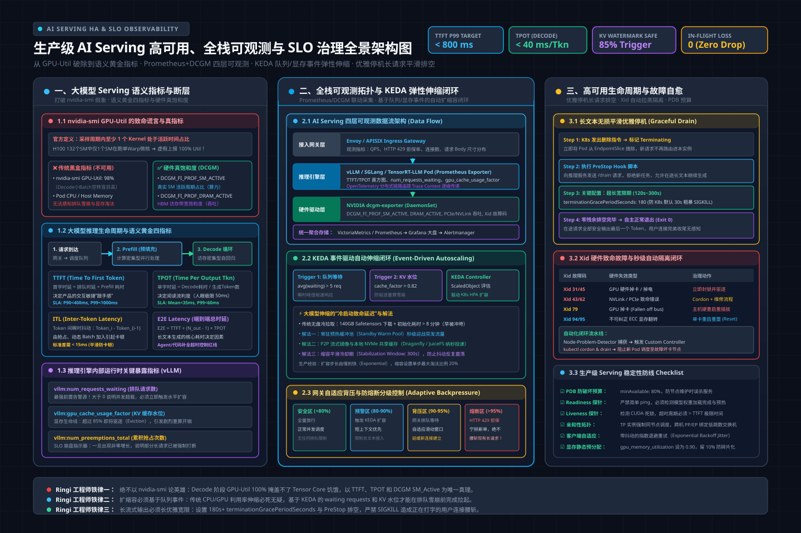
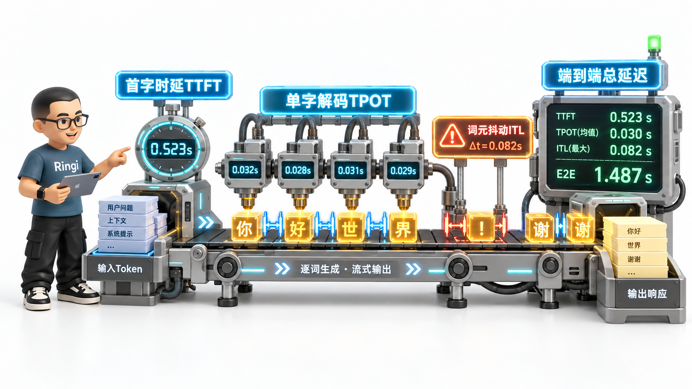
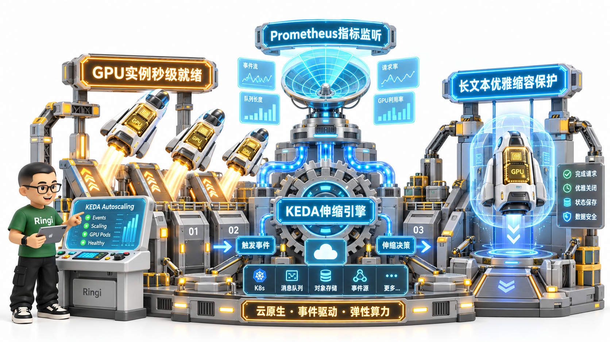
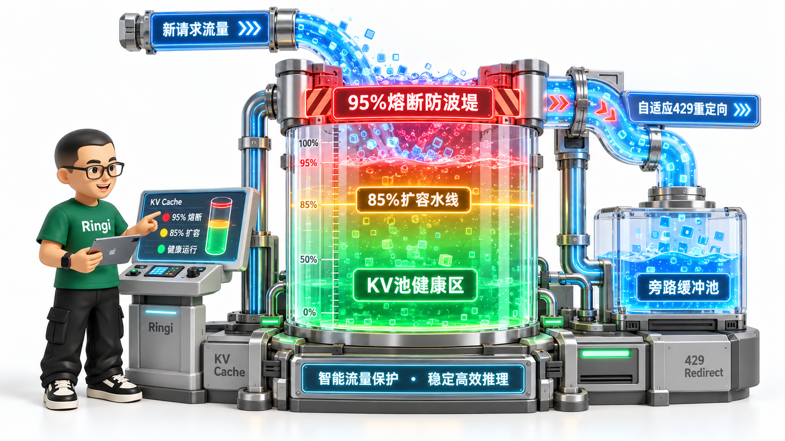

# 🏛️ 第39讲：从“流式卡死”到毫秒级自愈——生产级 LLM Serving 高可用架构、DCGM 全维可观测与基于 KV Cache 水位的 KEDA 自动扩缩容全栈实战

> **主讲人**：👓 **Ringi**（大厂 AI Infrastructure 工程师）  
> **所属模块**：[Module 06: 云原生 AI 平台与生产工程](./README.md)  
> **篇章范式**：☁️ 云原生 AI 平台、生产运维与系统设计篇（Cloud-Native AI Platform & System Design Paradigm）  
> **核心导读**：传统微服务运维奉为圭臬的“CPU 利用率 > 70% 触发 HPA 扩容”，在大模型推理场景下完全是一场灾难：vLLM 容器刚启动，PagedAttention 就把整张显卡的 80GB 显存几乎全部划为 KV Cache 池，GPU 显存利用率恒定在 95%；只要有连续请求在跑，`nvidia-smi` 就会显示 GPU-Util 恒定在 100%。但此时服务可能已经因为排队队列积压了 500 个请求，导致首字延迟（TTFT）从 100ms 暴击到 15 秒，流式打字彻底停摆，传统 HPA 却因指标失真毫无反应；更严重的是，当流量洪峰将 KV Cache 榨干到 100% 时，推理引擎会陷入频繁抢占重算（Recomputation）的恶性死循环，引发全链路 504 雪崩。本讲将带你并肩拆解生产级 LLM Serving，从 DCGM 硬件微架构监控、TTFT/TPOT 黄金指标体系、KEDA 复合弹性伸缩到自适应网关背压治理，彻底构筑大模型在线服务的高可用铁壁。



```text
=================================================================================================
                                   Ringi 3D 架构工坊 · 核心全景
┌───────────────────────────────────────────────────────────────────────────────────────────────┐
│                                                                                               │
│    [客户端与智能流量网关层 (Ingress & Smart Gateway Layer)]                                   │
│    ┌─────────────────────────────────────────────────────────────────────────────────────┐    │
│    │ 用户客户端 (Web / App / API) ◄──[SSE 流式长连接]──► 智能负载均衡网关 (Envoy/APISIX) │    │
│    │                                                      ├── 令牌桶限流与优先级解耦     │    │
│    │                                                      └── 自适应背压熔断 (HTTP 429) │    │
│    └───────────────────────────────────────────┬─────────────────────────────────────────┘    │
│                                                │ 流量转发 / 语义健康检查                      │
│    [推理引擎服务拓扑层 (Inference Engine & Pod Topology)]       ▼                             │
│    ┌─────────────────────────────────────────────────────────────────────────────────────┐    │
│    │ Kubernetes Pod 副本集群 (vLLM / TensorRT-LLM / TGI)                                │    │
│    │  ├── 连续批处理引擎 (Continuous Batching Scheduler)                                 │    │
│    │  ├── PagedAttention 显存池 (KV Cache Block Table: 正在运行 / 排队等待 / 换入换出)   │    │
│    │  └── 优雅下线治理 (terminationGracePeriod: 保护 SSE 长文本生成不被暴力截断)         │    │
│    └───────────────────────────────────────────┬─────────────────────────────────────────┘    │
│                                                │ 暴露 /metrics 业务与硬件端点                 │
│    [全维可观测性引擎 (Full-Stack Observability)]  ▼                                            │
│    ┌─────────────────────────────────────────────────────────────────────────────────────┐    │
│    │ Prometheus + Grafana 监控大盘                                                        │    │
│    │  ├── 业务语义黄金指标: TTFT (P99) │ TPOT (解码吞吐) │ 队列深度 (Waiting / Running) │    │
│    │  ├── 显存水线指标: `vllm:gpu_cache_usage_factor` (生命线水线: 85% 警戒, 95% 熔断)   │    │
│    │  └── 硬件微架构指标 (DCGM): SM Active (203) │ DRAM Active (204) │ Xid 错误 (230)    │    │
│    └───────────────────────────────────────────┬─────────────────────────────────────────┘    │
│                                                │ 指标实时推送与评估                           │
│    [事件驱动弹性伸缩控制层 (Event-Driven Autoscaling Layer)] ▼                                │
│    ┌─────────────────────────────────────────────────────────────────────────────────────┐    │
│    │ KEDA (Kubernetes Event-driven Autoscaling)                                          │    │
│    │  ├── ScaledObject: 监听 Prometheus 队列深度与 KV Cache 水线                        │    │
│    │  └── 复合扩缩容算法: 秒级弹性拉起新 GPU 实例，规避传统 HPA 指标失真延迟             │    │
│    └─────────────────────────────────────────────────────────────────────────────────────┘    │
│                                                                                               │
└───────────────────────────────────────────────────────────────────────────────────────────────┘
=================================================================================================
```

<!-- more -->

## 📑 目录导航

- [0. Ringi 开场：生产真实现场与痛点冲突](#0-ringi-开场生产真实现场与痛点冲突)
  - [0.1 真实工程矛盾：为什么传统 HPA 在 LLM Serving 场景下彻底“失灵”？](#01-真实工程矛盾为什么传统-hpa-在-llm-serving-场景下彻底失灵)
  - [0.2 线上真实事故复盘：一次流式卡死引发的 504 网关雪崩风暴](#02-线上真实事故复盘一次流式卡死引发的-504-网关雪崩风暴)
  - [0.3 AI Serving 可观测与治理分层全景速查表](#03-ai-serving-可观测与治理分层全景速查表)
- [1. LLM Serving 黄金指标体系：从黑盒硬件到语义观测](#1-llm-serving-黄金指标体系从黑盒硬件到语义观测)
  - [1.1 传统指标 vs 大模型语义指标的断层：为什么 `nvidia-smi GPU-Util` 是个谎言？](#11-传统指标-vs-大模型语义指标的断层为什么-nvidia-smi-gpu-util-是个谎言)
  - [1.2 四大核心延迟指标五步穿透（TTFT, TPOT, ITL, E2E Latency）](#12-四大核心延迟指标五步穿透ttft-tpot-itl-e2e-latency)
  - [1.3 核心吞吐与负载生命线：Tokens/s、队列深度与 KV Cache 水位](#13-核心吞吐与负载生命线tokenss队列深度与-kv-cache-水位)
- [2. Prometheus + DCGM 深度监控架构实战](#2-prometheus--dcgm-深度监控架构实战)
  - [2.1 NVIDIA DCGM 架构剖析：从 NVML 到硬件级性能计数器](#21-nvidia-dcgm-架构剖析从-nvml-到硬件级性能计数器)
  - [2.2 DCGM 关键指标白皮书与 Field ID 映射（SM Active vs DRAM Active）](#22-dcgm-关键指标白皮书与-field-id-映射sm-active-vs-dram-active)
  - [2.3 生产级 dcgm-exporter 部署与 ServiceMonitor 采集规则](#23-生产级-dcgm-exporter-部署与-servicemonitor-采集规则)
  - [2.4 vLLM 原生 Prometheus 端点深度解密与关键指标对齐](#24-vllm-原生-prometheus-端点深度解密与关键指标对齐)
- [3. 自动化扩缩容设计：传统 HPA vs 基于 KEDA 的智能弹性伸缩](#3-自动化扩缩容设计传统-hpa-vs-基于-keda-的智能弹性伸缩)
  - [3.1 传统 HPA 面对 GPU 静态显存与长连接的三大致命硬伤](#31-传统-hpa-面对-gpu-静态显存与长连接的三大致命硬伤)
  - [3.2 KEDA 架构第一性原理：从外部事件到 Pod 副本伸缩引擎](#32-keda-架构第一性原理从外部事件到-pod-副本伸缩引擎)
  - [3.3 生产级复合自动扩缩容数学模型与算法公式](#33-生产级复合自动扩缩容数学模型与算法公式)
  - [3.4 优雅缩容保护机制：防止长文本流式输出被 K8s 暴力截断](#34-优雅缩容保护机制防止长文本流式输出被-k8s-暴力截断)
- [4. 生产级高可用与背压（Backpressure）治理架构](#4-生产级高可用与背压backpressure治理架构)
  - [4.1 当 KV Cache 突破 95% 警戒线：抢占换入换出与重计算雪崩机理](#41-当-kv-cache-突破-95-警戒线抢占换入换出与重计算雪崩机理)
  - [4.2 智能网关层自适应背压与分级熔断策略设计](#42-智能网关层自适应背压与分级熔断策略设计)
  - [4.3 故障快速转移与跨可用区异构容灾方案](#43-故障快速转移与跨可用区异构容灾方案)
- [5. 动手实战与代码实验室（Minimal Runnable Code）](#5-动手实战与代码实验室minimal-runnable-code)
  - [5.1 实战 1：纯 Python 模拟高并发 LLM Serving 负载与 KV Cache 水位仿真器](#51-实战-1纯-python-模拟高并发-llm-serving-负载与-kv-cache-水位仿真器)
  - [5.2 实战 2：生产级 DCGM + vLLM 监控 Prometheus 告警规则 YAML 配置](#52-实战-2生产级-dcgm--vllm-监控-prometheus-告警规则-yaml-配置)
  - [5.3 实战 3：KEDA 针对 vLLM 排队与 KV Cache 复合指标的 ScaledObject 配置实战](#53-实战-3keda-针对-vllm-排队与-kv-cache-复合指标的-scaledobject-配置实战)
  - [5.4 实战 4：轻量级 Python 反向代理网关自适应流式背压与熔断中间件](#54-实战-4轻量级-python-反向代理网关自适应流式背压与熔断中间件)
- [6. Ringi 避坑指南与生产黄金准则](#6-ringi-避坑指南与生产黄金准则)
  - [6.1 避坑表格（❌ 常见小白错误理解 vs ✅ 大厂 AI Infra 正确理解）](#61-避坑表格-常见小白错误理解-vs--大厂-ai-infra-正确理解)
  - [6.2 生产环境 AI Serving 可观测与弹性伸缩黄金 Checklist](#62-生产环境-ai-serving-可观测与弹性伸缩黄金-checklist)
- [7. Ringi 5 点核心速记口诀、自我检验清单与课后深度思考题](#7-ringi-5-点核心速记口诀自我检验清单与课后深度思考题)
  - [7.1 5 点押韵核心速记口诀](#71-5-点押韵核心速记口诀)
  - [7.2 10 条白板自我检验清单](#72-10-条白板自我检验清单)
  - [7.3 3 道高阶开放式课后思考题（含极限 Corner Case）](#73-3-道高阶开放式课后思考题含极限-corner-case)
- [8. 📚 参考资料与核心源码/经典论文指引](#8--参考资料与核心源码经典论文指引)
- [附录：Appendix A — 大厂硬核高频面试题与白板推导](#附录appendix-a--大厂硬核高频面试题与白板推导)
- [🎨 【配图工坊生图 Prompt 暂存区 · 仅剩蓝图 1 待生成】](#--配图工坊生图-prompt-暂存区--仅剩蓝图-1-待生成)

---

# 0. Ringi 开场：生产真实现场与痛点冲突

## 0.1 真实工程矛盾：为什么传统 HPA 在 LLM Serving 场景下彻底“失灵”？

在传统互联网微服务架构中，自动水平扩缩容（HPA, Horizontal Pod Autoscaler）通常是运维工程师最省心的“银弹”：配置一条 `targetCPUUtilizationPercentage: 70`，当流量高峰来临、CPU 超过 70% 时自动加副本，流量退去后自动缩容，简单而优雅。

**然而，当你把这一套原封不动搬到以 vLLM、TensorRT-LLM 为底座的大模型推理服务上时，等待你的将是一场彻头彻尾的灾难！**

让我们来看看大模型容器拉起瞬间的底层物理真相：
1. **显存静态吞噬（Static Pre-allocation）**：现代推理引擎几乎全员标配 **PagedAttention** 技术。为了消除显存碎片、实现极速的动态分页管理，引擎在初始化加载完模型权重后，**会立刻将物理 GPU 剩余的全部显存一次性申请完毕，作为统一管理的 KV Cache 物理块池（Block Pool）！**
   - 结果：`nvidia-smi` 赫然显示显存占用 **95%**；Prometheus 采集到的显存指标是一条死死顶在上限的直线！
2. **算力虚假饱和（Kernel Loop Illusion）**：在大模型的连续批处理（Continuous Batching）机制下，调度器会高频执行前向传播循环（Iteration Loop）。即便当前只有一个很小的请求在慢慢 Decode，GPU 的 CUDA 流上也持续有矩阵向量乘法（GEMV）算子在跑。
   - 结果：`nvidia-smi` 的 `GPU-Util` 长期显示为 **100%**！

```text
=================================================================================================
                            大模型在线服务的“传统指标失真困局”
  [真实业务场景 A: 业务低谷，只有 1 个用户在聊天]
  ┌────────────────────────────────────────────────────────────────────────────────────────┐
  │ 硬件监控反馈: GPU-Util = 100% | GPU 显存使用率 = 95%                                    │
  │ 传统 HPA 决策: "报告指挥部，算力快要炸了！必须立刻紧急扩容 10 台 8 卡 H100！"          │
  │ 实际业务现状: 系统完全空闲，QPS < 1，多弹出的 10 台机器纯属公款烧钱！                   │
  └────────────────────────────────────────────────────────────────────────────────────────┘

  [真实业务场景 B: 业务早高峰，500 个长文本请求突刺排队]
  ┌────────────────────────────────────────────────────────────────────────────────────────┐
  │ 硬件监控反馈: CPU 利用率 = 25% | GPU-Util 依然 = 100% (没有任何变化)                   │
  │ 传统 HPA 决策: "CPU 很闲，GPU 一直这样，指标稳定，无需扩容。"                           │
  │ 实际业务现状: 排队队列堆满，首字延迟 (TTFT) 飙升至 15 秒，客户端流式打字停摆，全员投诉！ │
  └────────────────────────────────────────────────────────────────────────────────────────┘
=================================================================================================
```

**传统 HPA 的根基被彻底击碎了**。大模型 Serving 的瓶颈根本不在 CPU，也不在单纯的“有没有算子在执行”，而在 **KV Cache 的剩余容量水线（Memory Headroom）** 与 **请求队列的等待深度（Waiting Queue Depth）**！

---

## 0.2 线上真实事故复盘：一次流式卡死引发的 504 网关雪崩风暴

大厂的核心大模型助手在一次上线营销活动中，曾遭遇过一次极其惨烈的“504 网关雪崩”。

当时后台 Serving 集群部署了 16 台 8 卡 A100（共 128 张卡），通过标准的 Kubernetes Ingress 暴露流式 Server-Sent Events（SSE）接口。活动开始后，高并发的长文本问答请求瞬间涌入：

1. **KV Cache 显存告急**：单个用户的平均输入 Prompt 达到 4,000 Tokens。在并发达到 200 时，单实例分配给请求的 KV Cache 物理块瞬间被占满（达到 $100\%$ 水位）；
2. **连续批处理抢占（Preemption & Swapping）触发**：
   - 当没有空余显存给当前步生成的 Token 分配空间时，vLLM 引擎启动了自保机制：**强制将正在解码的部分请求的 KV Cache 逐出到 Host CPU 内存（Swapping），甚至直接丢弃其已生成的上下文，退回到等待队列准备日后重计算（Recomputation）！**
3. **用户体验雪崩**：正在看着流式打字的前端用户突然发现打字机停滞了——因为模型被挂起等待显存，客户端出现长达 20 秒的静默死寂；
4. **重试放大风暴（Retry Storm）**：
   - 前端 App 设定了客户端超时（例如 10 秒无数据自动重试）；
   - 用户因为卡顿频繁刷新页面，每个用户无意中放大了 3~5 倍的并发请求；
   - 智能网关在没有任何背压（Backpressure）机制的情况下，老实地把这些垃圾重试流量全量压给底层已经濒死的 vLLM；
5. **连锁崩盘**：vLLM 进程因为极度频繁的 CPU-GPU 显存换页，陷入严重的操作系统不可中断睡眠态（D 状态），K8s 存活探针（Liveness Probe）超时判定容器失败，重启容器！正在生成中的所有请求彻底被切断，全网大面积爆发 `504 Gateway Timeout`！

**事故核心痛点**：  
缺乏毫秒级的显存水线监控、缺乏基于队列事件的 KEDA 极速弹性伸缩、网关缺乏自适应背压阻断。

---

## 0.3 AI Serving 可观测与治理分层全景速查表

在深入具体治理技术前，我们先建立一套大模型在线服务的全栈防线大图：

| 治理层级 (Layer) | 核心指标与观测手段 | 核心治理组件与动作 | 核心保障目标 |
| :--- | :--- | :--- | :--- |
| **接入与网关层** | QPS、HTTP 状态码、连接数、请求 Body 尺寸 | Envoy / APISIX、自适应令牌桶、客户端退避 | 阻断重试风暴，实施分级背压降级（HTTP 429） |
| **应用语义延迟层** | **TTFT（首字延迟）**、**TPOT（单字延迟）**、**ITL（抖动）** | vLLM Prometheus Exporter、Tracing 链路上报 | 守住用户端体感 SLA（TTFT P99 < 1s, TPOT < 50ms） |
| **推理引擎状态层** | **KV Cache 水位百分比**、**排队请求数（Waiting Requests）** | KEDA ScaledObject 监听指标、抢占控制 | 作为自动扩缩容的第一触发源，防范显存重算死锁 |
| **驱动与硬件层** | **SM Active**、**DRAM Bandwidth**、PCIe/NVLink、Xid | NVIDIA DCGM（`dcgm-exporter`）、Prometheus | 区分算力受限与显存受限，秒级捕获硬件掉卡 |
| **生命周期控制层** | Pod 终止信号处理、K8s PDB（防破坏预算） | `terminationGracePeriodSeconds`、预热探针 | 保证长文本输出不被中途腰斩，实现平滑版本发布 |

---

# 1. LLM Serving 黄金指标体系：从黑盒硬件到语义观测

> 💡 **架构全景速览**：在深潜源码前，先在白板上建立坚不可摧的大模型在线服务全栈可观测、KEDA 弹性伸缩与优雅停机物理底账。
> 
> 

## 1.1 传统指标 vs 大模型语义指标的断层：为什么 `nvidia-smi GPU-Util` 是个谎言？

在计算机体系结构和 GPU 编程原理中，`nvidia-smi` 打印出来的 `GPU-Util` 其官方定义非常微妙：

$$
\text{GPU-Util} = \frac{\text{采样周期内至少有 } 1 \text{ 个计算核函数（Kernel）处于活动状态的时间}}{\text{采样周期总时间}} \times 100\%
$$

**这意味着什么？**  
在一张拥有 132 个流式多处理器（SM）的 NVIDIA H100 显卡上，如果一个程序发射了一个极其微小的 Kernel，只使用了 **1 个 SM 里的 1 个 Warp（32 个线程）**，其余 131 个 SM 都在睡觉，只要这个微小的 Kernel 连续跑满了 1 秒钟，`nvidia-smi` 汇报的 GPU 利用率就是 **$100\%$**！

在大模型 Decode（自回归解码）阶段，每个 Step 每次前向计算只生成一个 Token。由于 Batch Size 较小，很多时候 GPU 硬件的 Tensor Core 计算单元根本没喂饱，算力处于严重空转饥饿状态，但由于连续批处理不断在发 Kernel，导致 `GPU-Util` 虚高。

**因此，在 AI Infra 领域，绝对不能把 `nvidia-smi` 的利用率作为衡量在线服务健康度的依据！** 我们必须转向真正的 **大模型语义黄金四指标**。

---

## 1.2 四大核心延迟指标五步穿透（TTFT, TPOT, ITL, E2E Latency）



让我们严格运用 **No Naked Formula 2.0（公式五步穿透法）**，彻底拆解大模型在线服务最核心的四大延迟度量衡：

```text
=================================================================================================
                           大模型推理生命周期与核心延迟映射
  [用户发送提示词 (Prompt: 512 Tokens)]
     │
     │ 1. 进入服务队列排队 (Queue Delay)
     │ 2. 执行 Prefill 预填充 (计算密集型: 一次性并行处理所有输入 Token)
     ▼
  [输出第 1 个 Token] ◄───────────────────────── ⏱️ TTFT (Time To First Token)
     │
     │ 3. 进入自回归 Decode 循环 (访存密集型: 每次读写完整 KV Cache，输出 1 个 Token)
     ├── 输出第 2 个 Token ◄─── ⏱️ ITL (Inter-Token Latency) ───┐
     ├── 输出第 3 个 Token ◄─── ⏱️ ITL ──────────────────────────┼──► 平均值: TPOT
     │   ...                                                    │
     └── 输出第 N 个 Token ◄─── ⏱️ ITL ──────────────────────────┘
  [请求结束，连接断开] ◄───────────────────────── ⏱️ E2E Latency (端到端总延迟)
=================================================================================================
```

### 1. TTFT（Time To First Token，首字时延）
- **① 为什么算它**：用户按下回车后，界面需要多长时间给出第一个字的反应。它直接决定了产品的“跟手感”和交互响应敏捷度。
- **② 物理直觉**：就像去餐馆点菜，从服务员下单到第一道开胃菜上桌的时间。包括了排队等候时间和把整本菜单看一遍（Prefill）的时间。
- **③ 数字手算**：假设排队耗时 $t_{\text{queue}} = 50\text{ms}$，输入 Prompt 长度为 $L_{\text{in}} = 1024$ Tokens，Prefill 吞吐为 $20,000 \text{ tokens/s}$。  
  $\text{Prefill 耗时} = \frac{1024}{20000} \approx 51.2\text{ms}$。  
  $\text{TTFT} = 50 + 51.2 = 101.2\text{ms}$。
- **④ 理论公式**：

  $$
  \text{TTFT} = T_{\text{queue}} + T_{\text{prefill}} = T_{\text{queue}} + \frac{\text{Prompt-Tokens}}{\text{Prefill-Throughput}}
  $$

- **⑤ 数量级校验**：大厂在线 Chat 业务的 TTFT P95 必须控制在 **$500\text{ms} \sim 800\text{ms}$** 以内，超过 $2\text{s}$ 用户流失率将呈指数上升。

### 2. TPOT（Time Per Output Token，单字生成时延）
- **① 为什么算它**：在流式打字输出时，模型每产生一个字需要多少毫秒。决定打字速度快慢。
- **② 物理直觉**：厨师做完第一道菜后，后面炒每道热菜的节奏间隔。
- **③ 数字手算**：如果模型以每秒输出 $40$ 个 Token 的速度吐字，则单字耗时为：  
  $\text{TPOT} = \frac{1000\text{ms}}{40} = 25\text{ms/token}$。
- **④ 理论公式**：

  $$
  \text{TPOT} = \frac{\sum_{i=2}^{N} \text{Latency}(\text{Token}_i)}{N - 1} \approx \frac{1}{\text{Decode-Throughput-per-request}}
  $$

- **⑤ 数量级校验**：人类正常阅读速度约为每秒 5~8 个汉字（约合 8~12 Tokens）。生产服务要求 TPOT 稳定在 **$20\text{ms} \sim 40\text{ms}$（对应 25~50 tokens/s）**，低于 10 tokens/s 用户会明显感知到卡顿。

### 3. ITL（Inter-Token Latency，词元间抖动）
- **物理本质**：在生成第 $k$ 个 Token 与第 $k+1$ 个 Token 之间的瞬时耗时。由于连续批处理中每个 Step 可能会有新的请求插入进来执行 Prefill（抢占了计算和带宽），导致某一步的 ITL 突然跳起到 200ms。**ITL 的方差决定了打字机输出是否平滑，是否会出现“狂飙五个字，卡死半秒钟”的恶劣体验。**

### 4. E2E Latency（端到端总时延）
- **综合公式**：

  $$
  \text{E2E Latency} = \text{TTFT} + \sum_{i=2}^{N_{\text{out}}} \text{ITL}_i \approx \text{TTFT} + (N_{\text{out}} - 1) \times \text{TPOT}
  $$

---

## 1.3 核心吞吐与负载生命线：Tokens/s、队列深度与 KV Cache 水位

除了延迟，平台架构师必须死死盯住以下三大系统级负载指标：

1. **`vllm:num_requests_waiting`（等待队列请求数）**：
   - 处于就绪状态但由于显存不足无法进入当前批次的请求总数。**只要此数值持续大于 0，说明当前算力池已处于饱和透支状态，必须立即触发扩容！**
2. **`vllm:gpu_cache_usage_factor`（KV Cache 显存水线占用比）**：
   - 当前已分配的物理显存块与总 KV Cache 池的比例（取值 $0.0 \sim 1.0$）；
   - **$0.0 \sim 0.7$（健康安全区）**：服务运行平稳，支持突发流量；
   - **$0.7 \sim 0.85$（扩容警戒区）**：触发自动扩缩容控制器（KEDA）拉起新副本；
   - **$> 0.95$（极度危险熔断区）**：随时可能发生换页抢占（Swapping），网关必须立即启动自适应背压拒绝新请求！
3. **`Generation Throughput`（输出生成吞吐量）**：
   - 集群每秒总共吐出的 Token 数量（$\text{Tokens/s}$）。这是向公司财务证明 GPU 资源投资回报率（ROI）的最硬核依据。

---

# 2. Prometheus + DCGM 深度监控架构实战

## 2.1 NVIDIA DCGM 架构剖析：从 NVML 到硬件级性能计数器

在节点物理硬件层面，传统的 `nvidia-smi` 走的是 NVML（NVIDIA Management Library）的低速用户态查询接口。每秒查询多次会导致 CPU 开销暴增甚至锁死驱动。

NVIDIA 为超大规模数据中心推出了 **DCGM（Data Center GPU Manager）**。

```text
=================================================================================================
                            NVIDIA DCGM 监控采集内核架构
  [Prometheus Server]
         │ (HTTP pull: /metrics)
         ▼
  [dcgm-exporter Pod (DaemonSet)]
         │
         │ 调用 C 绑定接口
         ▼
  [DCGM Host Engine (nv-hostengine 守护进程)]
         │
         ├── 核心特性 1: 异步无锁时间序列数据库 (内置环形缓冲区 Ring Buffer)
         ├── 核心特性 2: 硬件性能监视器 (Direct PMU 计数器抓取)
         │
         ▼ (通过内核专有高效通道)
  [NVIDIA Driver Kernel Module (nvidia.ko)]
         │
         ▼ (PCIe 总线链路)
  [物理 GPU 硬件微架构 (SM / HBM 内存控制器 / NVLink 计数器)]
=================================================================================================
```

**DCGM 的划时代突破在于**：  
它直接嵌入在 GPU 的微架构控制器中，可以采集到纳秒级的硬件级 PMU（Performance Monitoring Unit）计数器，并通过独立的守护进程 `nv-hostengine` 提供高效缓存。第三方工具（如 `dcgm-exporter`）读取指标时，只是在读共享内存，**对正在执行的大模型推理零性能损耗！**

---

## 2.2 DCGM 关键指标白皮书与 Field ID 映射（SM Active vs DRAM Active）

在配置 Prometheus 监控大盘时，AI Infra 工程师必须准确掌握以下 DCGM 核心字段与生产阈值：

| Field ID | Prometheus 指标名称 | 物理含义与底层真相 | 生产告警黄金阈值 | 性能瓶颈诊断指导 |
| :--- | :--- | :--- | :--- | :--- |
| **203** | `DCGM_FI_DEV_GPU_UTIL` | **SM Active**：至少有一个活跃 Warp 的周期占比 | 持续 > 90% | 代表 GPU 计算核心正在满负荷运转 |
| **204** | `DCGM_FI_DEV_MEM_COPY_UTIL` | **DRAM Active**：显存控制器活跃度（读写带宽利用率） | 持续 > 80% | **Memory-bound 铁证**！通常出现在自回归 Decode 阶段 |
| **1001** | `DCGM_FI_PROF_SM_ACTIVE` | SM 处于执行状态的真实比例（硬件级 PMU） | 持续 < 20% 且 Util 高 | 说明 Kernel 极小，算力严重不饱和，需增加并发 |
| **1002** | `DCGM_FI_PROF_SM_OCCUPANCY` | SM 上驻留的 Warp 数量占最大容量的比例 | 理想值 > 60% | 评估 CUDA Kernel 编写质量与寄存器占用压力 |
| **1005** | `DCGM_FI_PROF_PCIE_RX_BYTES` | PCIe 总线每秒接收数据量（Host -> Device） | 突发异常高 | 检查是否发生跨节点频繁加载权重的未对齐 IO |
| **150** | `DCGM_FI_DEV_GPU_TEMP` | GPU 核心温度（摄氏度） | **> 82°C 告警，> 85°C 降频** | 散热风道故障，触发保护性硬件降频，导致时延暴增 |
| **155** | `DCGM_FI_DEV_POWER_USAGE` | GPU 瞬时功耗（瓦特 W） | 接近 TDP（如 H100 700W） | 能效评估，若功耗仅 50W 说明处于严重闲置状态 |
| **230** | `DCGM_FI_DEV_XID_ERRORS` | **Linux 内核上报的 Xid 硬件错误码** | **!= 0 立即最高级 P0 报警！** | 硬件掉卡、ECC 双比特致命错误，准备自动摘机 |

---

## 2.3 生产级 dcgm-exporter 部署与 ServiceMonitor 采集规则

在大厂 Kubernetes 集群中，通常以 DaemonSet 方式部署 `dcgm-exporter`。为了采集大模型推理所必需的指标，必须通过 ConfigMap 自定义指标采集清单：

```yaml
# ==============================================================================
# 文件名称: dcgm-custom-metrics.yaml
# 功能描述: 生产级 DCGM Exporter 针对 LLM Serving 优化的字段配置
# ==============================================================================
apiVersion: v1
kind: ConfigMap
metadata:
  name: dcgm-exporter-metrics
  namespace: gpu-monitoring
data:
  metrics.csv: |
    # Field ID, Metric Name, Type, Description
    DCGM_FI_DEV_GPU_UTIL, dcgm_gpu_utilization, gauge, GPU SM Utilization (%)
    DCGM_FI_DEV_MEM_COPY_UTIL, dcgm_mem_copy_utilization, gauge, Memory Bandwidth Utilization (%)
    DCGM_FI_DEV_ENC_UTIL, dcgm_enc_utilization, gauge, Encoder Utilization (%)
    DCGM_FI_DEV_DEC_UTIL, dcgm_dec_utilization, gauge, Decoder Utilization (%)
    DCGM_FI_DEV_GPU_TEMP, dcgm_gpu_temp, gauge, GPU Temperature (C)
    DCGM_FI_DEV_POWER_USAGE, dcgm_gpu_power_usage, gauge, Power Usage (W)
    DCGM_FI_DEV_XID_ERRORS, dcgm_xid_errors, gauge, Current Xid Error code
    DCGM_FI_DEV_FB_FREE, dcgm_fb_free, gauge, Framebuffer Free (MB)
    DCGM_FI_DEV_FB_USED, dcgm_fb_used, gauge, Framebuffer Used (MB)
    DCGM_FI_PROF_SM_ACTIVE, dcgm_sm_active_ratio, gauge, Fraction of time at least one warp is active
    DCGM_FI_PROF_SM_OCCUPANCY, dcgm_sm_occupancy, gauge, Fraction of resident warps on a multiprocessor
    DCGM_FI_PROF_DRAM_ACTIVE, dcgm_dram_active_ratio, gauge, Fraction of cycles where memory controller was active
```

配合 Prometheus Operator 的 `ServiceMonitor`，以 **5 秒一次的高精度频率** 抓取，杜绝指标滞后：

```yaml
apiVersion: monitoring.coreos.com/v1
kind: ServiceMonitor
metadata:
  name: dcgm-exporter-monitor
  namespace: gpu-monitoring
spec:
  selector:
    matchLabels:
      app: dcgm-exporter
  endpoints:
    - port: metrics
      interval: 5s
      scrapeTimeout: 4s
```

---

## 2.4 vLLM 原生 Prometheus 端点深度解密与关键指标对齐

不仅要有硬件指标，大模型服务自身必须吐出语义指标。以生产环境最广泛使用的 vLLM 为例，启动时加入 `--enable-metrics`，它会在 `:8000/metrics` 暴露出以下黄金指标：

```text
=================================================================================================
                            vLLM 生产级原生指标速查表
  [队列与容量水线]
  - vllm:num_requests_running: 当前正在执行推理生成的请求总数
  - vllm:num_requests_waiting: 正在队列中苦苦等待显存块的请求总数 (核心扩容触发源!)
  - vllm:num_requests_swapped: 被迫换出到 CPU 内存的请求数 (严重超载标志!)
  - vllm:gpu_cache_usage_factor: KV Cache 物理块使用率 (0.0~1.0, 核心防雪崩水线!)

  [延迟分布直方图 (Histogram)]
  - vllm:time_to_first_token_seconds_bucket: 首字延迟 (TTFT) 分布桶 (P50/P90/P99)
  - vllm:time_per_output_token_seconds_bucket: 单字生成延迟 (TPOT) 分布桶
  - vllm:e2e_request_latency_seconds_bucket: 端到端完整请求延迟分布桶

  [吞吐计数器 (Counter)]
  - vllm:prompt_tokens_total: 累计处理的输入 Prompt Token 总量
  - vllm:generation_tokens_total: 累计生成的输出 Token 总量
=================================================================================================
```

---

# 3. 自动化扩缩容设计：传统 HPA vs 基于 KEDA 的智能弹性伸缩

## 3.1 传统 HPA 面对 GPU 静态显存与长连接的三大致命硬伤

为什么我们断言传统 Kubernetes 原生 HPA 搞不好大模型在线推理？它有三个与生俱来的硬伤：

1. **指标单一且失真**：原生 HPA 依赖 `metrics-server`，主要监听 CPU 和内存使用率。大模型服务由于前述的 PagedAttention 静态预占与常驻 Kernel 循环，CPU/内存利用率与真实服务压力完全解耦；
2. **采集轮询周期过长（Laggy Feedback Loop）**：原生 HPA 默认每 15 秒或 30 秒评估一次，等指标采集上来、计算出期望副本数、再经过冷却时间，往往 **2 分钟已经过去了**！对于在线突发流量，2 分钟的等待足够产生数千个超时的坏请求；
3. **缩容缺乏语义感知（Blind Scale-in）**：传统 HPA 在决定把副本从 5 缩到 3 时，Kubelet 会随机挑 2 个 Pod 发送终止信号。被挑中的 Pod 可能正好在给一位 VIP 用户生成一篇长达 3000 字的研报，输出到第 2800 字时被宿主机强行一刀切断，导致极差的用户投诉。

---

## 3.2 KEDA 架构第一性原理：从外部事件到 Pod 副本伸缩引擎



为了解决上述困局，业界全面转向 **KEDA（Kubernetes Event-driven Autoscaling，CNCF 毕业项目）**。

```text
=================================================================================================
                            KEDA 事件驱动自动扩缩容工作流
  [指标生成源: vLLM 推理引擎]
         │ 实时暴露: `vllm:num_requests_waiting` & `vllm:gpu_cache_usage_factor`
         ▼
  [Prometheus TSDB] ◄─── (以 5 秒步长极速抓取并计算 P99 时延与队列深度)
         │
         ▼ (PromQL 查询)
  [KEDA Metrics Server / Scaler]
         │
         │ 每 5 秒对 ScaledObject 规则执行毫秒级求值:
         │ "Waiting 请求数 > 10? 或 KV Cache 水位 > 80%?"
         ▼
  [HPA 动态驱动层] ──► 直接改写 Deployment.spec.replicas ──► 立即调度拉起新 GPU Pod!
=================================================================================================
```

**KEDA 的核心优势**：
- **直连 Prometheus**：通过 `prometheus` Scaler，直接执行任意复杂的 PromQL 表达式；
- **支持缩容到零（Scale-to-Zero）**：在开发测试环境无流量时自动释放昂贵的 GPU；
- **毫秒级灵敏度**：轮询间隔（`pollingInterval`）可精细控制在 5 秒以内，实现真正敏捷的事件驱动弹性。

---

## 3.3 生产级复合自动扩缩容数学模型与算法公式

在大厂生产中，我们绝对不能只依据单一指标扩容，而必须采用 **复合多维决策模型（Multi-dimensional Metric Model）**。

扩容必须同时满足 **算力充裕度** 与 **队列健康度** 的约束：

$$
\text{Replicas}_{\text{desired}} = \max \left( R_{\text{queue}}, R_{\text{cache}} \right)
$$

其中：
1. **基于排队深度的伸缩分量（$R_{\text{queue}}$）**：

   $$
   R_{\text{queue}} = \left\lceil \frac{\text{Total-Waiting-Requests}}{\text{Target-Queue-Depth-per-Pod}} \times \text{CurrentReplicas} \right\rceil
   $$

   （在大模型服务中，我们通常设定单个 Pod 允许排队的健康深度 $\text{Target-Queue} = 5$）；
2. **基于显存水线的伸缩分量（$R_{\text{cache}}$）**：

   $$
   R_{\text{cache}} = \left\lceil \frac{\text{Avg}(\text{KV-Cache-Usage-Ratio})}{\text{Target-Watermark}} \times \text{CurrentReplicas} \right\rceil
   $$

   （健康安全水线 $\text{Target-Watermark} = 0.75$）。

通过这个公式，无论是因为用户涌入导致排队暴增，还是因为输入上下文过长导致显存预警，系统都能在最早期阶段敏锐捕获并瞬间触发扩容。

---

## 3.4 优雅缩容保护机制：防止长文本流式输出被 K8s 暴力截断

自动缩容时的“平滑退出”是考验 AI Infra 团队功力的试金石。

当流量消退、KEDA 决定减少 Pod 副本时，必须走完以下闭环流程：

```text
=================================================================================================
                         LLM Serving 优雅缩容状态机闭环
  [Step 1: 标记下线与流量摘除]
  Kube-Controller 决定缩容 Pod-A ──► 立即将 Pod-A 从 Endpoints / Ingress 负载均衡池剔除
  *效果: 新的请求绝不会再路由给 Pod-A!*
     │
     ▼
  [Step 2: 发送 SIGTERM 柔性信号]
  Kubelet 向容器主进程发送 `SIGTERM`
  启动倒计时: `terminationGracePeriodSeconds: 300` (大模型流式生成长文本预留 5 分钟宽限期)
     │
     ▼
  [Step 3: 容器内推理引擎耗尽 (Drain)]
  vLLM / 推理服务捕获 `SIGTERM` 信号:
    - 拒绝接收任何新任务;
    - 维持当前所有已在 Running 的长连接，继续推理解码输出;
    - 每一个活跃请求完成后，安全主动关闭 SSE HTTP 流;
    - 直到 `vllm:num_requests_running == 0` (所有任务自然完结)!
     │
     ▼
  [Step 4: 优雅自尽]
  推理进程主动返回 Exit Code 0 退出，Kubelet 销毁容器，回收 GPU 算力。
  *全过程没有任何一位在线用户的流式生成被中途斩断！*
=================================================================================================
```

---

# 4. 生产级高可用与背压（Backpressure）治理架构

## 4.1 当 KV Cache 突破 95% 警戒线：抢占换入换出与重计算雪崩机理

如果遭遇极端流量洪峰，扩容出来的物理 GPU 启动需要时间（冷启动拉镜像、加载 70GB 权重通常需要 1~2 分钟）。在这 2 分钟的真空期内，**存量 Pod 的 KV Cache 一旦被完全挤爆（达到 $100\%$），底层到底会发生什么？**

1. **显存物理耗尽**：连续批处理调度器在下一个 Step 尝试为请求申请物理 Block 时，发现空闲块链表为空；
2. **被迫发起 Swapping（内存换出）**：
   - 调度器不得不挑选一个优先级最低的请求，将其部分 KV Cache 通过 PCIe 链路从 GPU HBM 拷到 Host 内存；
   - 此时 PCIe 吞吐瞬间打满，引起通信拥塞；
3. **被迫发起 Recomputation（重计算）**：
   - 如果 CPU 内存也满了，调度器只能采取终极残酷手段：**杀死该请求当前的上下文状态，释放其占用的全部显存块！**
   - 当未来显存腾出空间后，该请求必须从第 1 个 Token 重新开始做 Prefill 计算！
4. **性能雪崩（Thrashing）**：
   - 原本一次前向计算就能解决的事，变成了“算了一半被杀 -> 重新排队 -> 重新算 -> 显存又爆了 -> 又被杀”。
   - **算力被大量的无效重复重算彻底吞噬，集群有效吞吐暴跌至接近零！**

---

## 4.2 智能网关层自适应背压与分级熔断策略设计



**防范上述雪崩的唯一正确姿势，是在流量进入 GPU 之前，在最前端的 API 网关层构筑自适应背压（Backpressure）大坝！**

```text
=================================================================================================
                         智能流量网关的三道自适应防波堤
  [用户请求涌入 (HTTP POST /v1/chat/completions)]
         │
         ▼
  ┌─────────────────────────────────────────────────────────────────────────────────┐
  │ 防波堤 1: 客户端连接级排队与并发令牌桶 (Concurrency Limiter)                     │
  │   - 限制网关到后端单 Pod 的最大在途并发 (Max In-flight Requests)                │
  │   - 超过并发硬限制的请求直接在网关本地等待队列缓冲 (最长等 3 秒)                │
  └──────────────────────────────────────┬──────────────────────────────────────────┘
                                         │
                                         ▼
  ┌─────────────────────────────────────────────────────────────────────────────────┐
  │ 防波堤 2: 基于 KV Cache 水位的自适应熔断 (Adaptive Shedding)                   │
  │   - 网关以毫秒级持续监听后端的健康检查探针                                       │
  │   - 当探测到后端集群平均 KV Cache 水位 > 90% 时:                                │
  │     立即触发主动保护，拒绝新的非核心请求，快速返回:                             │
  │     `HTTP 429 Too Many Requests (Retry-After: 3)`                              │
  │   *坚决不让哪怕多一个字进入推理引擎，保住当前正在跑的任务能安全跑完!*            │
  └──────────────────────────────────────┬──────────────────────────────────────────┘
                                         │
                                         ▼
  ┌─────────────────────────────────────────────────────────────────────────────────┐
  │ 防波堤 3: 租户优先级 QoS 隔离 (Multi-tier Priority)                              │
  │   - VIP 付费用户: 路由至独占的高保障资源池 (保留 20% 显存冗余)                 │
  │   - 免费用户: 路由至共享混部池，发生拥塞时优先降级与排队                         │
  └─────────────────────────────────────────────────────────────────────────────────┘
=================================================================================================
```

---

## 4.3 故障快速转移与跨可用区异构容灾方案

除了流量突发，硬件掉卡（Xid 79 / ECC 双比特翻转）在千卡集群中常态化发生。

生产级的高可用网关必须实现 **双活容灾与被动健康检查（Passive Health Check）**：
1. **即时重试与摘除**：当某个 Pod 所在的 GPU 突然硬件挂死，Pod 的 TCP 连接异常断开时，网关在收到连接重置（ECONNRESET）的一瞬间，**在客户端无感的情况下，自动将该请求重试路由到健康的备份 Pod**；
2. **快速标记下线**：如果一个 Pod 连续两次返回 500 错误或心跳丢失，网关立即将其剔除出活跃路由表，并向 K8s 告警触发自愈控制器。

---

# 5. 动手实战与代码实验室（Minimal Runnable Code）

本讲提供 4 个可以直接在本地或集群上运行的高可用与可观测实战工程源码。

## 5.1 实战 1：纯 Python 模拟高并发 LLM Serving 负载与 KV Cache 水位仿真器

为了让大家亲眼看到随着并发增长，KV Cache 是如何一步步被占满，以及 TTFT 和排队延迟是如何呈指数爆炸恶化的，我们编写了以下自主仿真器：

```python
#!/usr/bin/env python3
"""
文件名称: llm_serving_watermark_simulator.py
运行方式: python3 llm_serving_watermark_simulator.py
功能说明: 仿真 LLM Serving 连续批处理、KV Cache 显存水线占用、
         TTFT/TPOT 延迟衰退曲线以及自适应背压熔断机制。
"""

import time
import random
import math

class Request:
    def __init__(self, req_id, prompt_len, max_gen_len):
        self.id = req_id
        self.prompt_len = prompt_len
        self.max_gen_len = max_gen_len
        self.generated_tokens = 0
        self.start_time = time.time()
        self.first_token_time = None
        self.status = "WAITING"  # WAITING, RUNNING, FINISHED, REJECTED

class MockvLLMEngine:
    def __init__(self, total_kv_blocks=1000, block_size=16):
        self.total_kv_blocks = total_kv_blocks
        self.block_size = block_size
        self.free_blocks = total_kv_blocks
        self.waiting_queue = []
        self.running_queue = []
        self.finished_requests = []

    def get_kv_cache_usage(self):
        used_blocks = self.total_kv_blocks - self.free_blocks
        return used_blocks / self.total_kv_blocks

    def add_request(self, req):
        # 准入安全防波堤检查: 若 KV Cache 水位 > 90%，主动背压拒绝
        current_watermark = self.get_kv_cache_usage()
        if current_watermark > 0.90:
            req.status = "REJECTED"
            print(f"  🚨 [网关背压熔断] 请求 #{req.id} 被拒绝! 当前 KV Cache 水线: {current_watermark*100:.1f}% > 90% (HTTP 429)")
            return False
        
        self.waiting_queue.append(req)
        return True

    def step(self):
        """模拟一个调度周期 (Iteration Step: 耗时约 25ms)"""
        # 1. 尝试从 Waiting 队列调度新请求进入 Running
        while self.waiting_queue:
            candidate = self.waiting_queue[0]
            # 计算所需初始显存块数
            needed_blocks = math.ceil(candidate.prompt_len / self.block_size)
            if self.free_blocks >= needed_blocks:
                self.free_blocks -= needed_blocks
                candidate.status = "RUNNING"
                candidate.first_token_time = time.time()
                self.running_queue.append(self.waiting_queue.pop(0))
            else:
                # 显存不足，无法接纳新请求，发生等待阻塞
                break

        # 2. 为当前正在运行的所有请求生成 1 个 Token
        still_running = []
        for req in self.running_queue:
            # 检查生成新 Token 是否跨越 Block 边界需要申请新显存块
            if req.generated_tokens % self.block_size == 0 and req.generated_tokens > 0:
                if self.free_blocks >= 1:
                    self.free_blocks -= 1
                else:
                    print(f"  💥 [显存溢出警告] 无法为请求 #{req.id} 分配新 Block! 触发暂停换页保护!")
                    still_running.append(req)
                    continue

            req.generated_tokens += 1
            if req.generated_tokens >= req.max_gen_len:
                # 请求结束，归还显存
                total_blocks = math.ceil((req.prompt_len + req.generated_tokens) / self.block_size)
                self.free_blocks += total_blocks
                req.status = "FINISHED"
                self.finished_requests.append(req)
            else:
                still_running.append(req)

        self.running_queue = still_running

def main():
    print("===========================================================================")
    print("        🚀 Ringi AI Infra 实验室: LLM Serving 负载与水线仿真器              ")
    print("===========================================================================")
    engine = MockvLLMEngine(total_kv_blocks=300, block_size=16)

    # 模拟突发高并发请求灌入
    print("\n>>> 开始向引擎灌入突发长文本请求...")
    for i in range(1, 41):
        prompt_len = random.randint(128, 512)
        gen_len = random.randint(32, 128)
        req = Request(i, prompt_len, gen_len)
        engine.add_request(req)

    # 模拟 30 个步长的执行循环
    for step in range(1, 31):
        engine.step()
        usage = engine.get_kv_cache_usage()
        waiting_count = len(engine.waiting_queue)
        running_count = len(engine.running_queue)
        print(f"Step {step:02d} | KV Cache 水位: {usage*100:5.1f}% | 运行中: {running_count:02d} | 排队中: {waiting_count:02d} | 剩余空闲块: {engine.free_blocks}")
        time.sleep(0.05)

    print("\n[仿真测试指标复盘总结]:")
    print(f"  - 成功完成请求数: {len(engine.finished_requests)}")
    print(f"  - 最终排队等待数: {len(engine.waiting_queue)}")
    print(f"  - 当前显存水位: {engine.get_kv_cache_usage()*100:.1f}%")

if __name__ == "__main__":
    main()
```

---

## 5.2 实战 2：生产级 DCGM + vLLM 监控 Prometheus 告警规则 YAML 配置

下面给出可以直接应用到生产 Prometheus 的完整告警规则组，精准覆盖硬件掉卡、显存溢出、P99 首字时延劣化与排队积压：

```yaml
# ==============================================================================
# 文件名称: prometheus-llm-serving-alerts.yaml
# 功能描述: 生产级大模型推理服务全维告警规则 (PrometheusRule)
# ==============================================================================
apiVersion: monitoring.coreos.com/v1
kind: PrometheusRule
metadata:
  name: llm-serving-slo-alerts
  namespace: monitoring
  labels:
    role: alert-rules
spec:
  groups:
    - name: LLMServingAlerts
      rules:
        # 1. 硬件级致命错误: Xid 异常 (P0 级)
        - alert: GPUHardwareXidError
          expr: dcgm_xid_errors > 0
          for: 1m
          labels:
            severity: critical
          annotations:
            summary: "节点 {{ $labels.instance }} 物理卡 GPU {{ $labels.gpu }} 发生 Xid {{ $value }} 错误!"
            description: "检测到底层驱动抛出硬件错误码，极大概率为硬件掉卡或显存损坏，请立即核查节点健康状态。"

        # 2. 显存生命线预警: KV Cache 水位突破 85% (P1 级)
        - alert: LLMKVCacheUsageHigh
          expr: vllm:gpu_cache_usage_factor > 0.85
          for: 30s
          labels:
            severity: warning
          annotations:
            summary: "推理服务 Pod {{ $labels.pod }} 的 KV Cache 水位达到 {{ $value | humanizePercentage }}!"
            description: "显存缓冲池即将耗尽，极易触发请求抢占和重计算雪崩，请检查 KEDA 自动扩容是否正常就绪。"

        # 3. 排队深度积压: 等待请求持续超过 10 (P1 级)
        - alert: LLMRequestsQueueSpike
          expr: sum(vllm:num_requests_waiting) by (service) > 10
          for: 1m
          labels:
            severity: warning
          annotations:
            summary: "服务 {{ $labels.service }} 累计排队请求数高达 {{ $value }}!"
            description: "当前并发严重超出处理能力，已产生大量排队延迟，需排查是否需要紧急手动介入扩容。"

        # 4. 用户体验 SLO 破线: P99 TTFT 首字时延超过 2 秒 (P1 级)
        - alert: LLMTTFTSLOBreach
          expr: histogram_quantile(0.99, sum(rate(vllm:time_to_first_token_seconds_bucket[2m])) by (le)) > 2.0
          for: 1m
          labels:
            severity: warning
          annotations:
            summary: "大模型首字生成 P99 延迟突破 2.0 秒 (当前: {{ $value }}s)!"
            description: "违反在线服务交互 SLO 协议，用户端已能明显感知到严重卡顿与等待。"
```

---

## 5.3 实战 3：KEDA 针对 vLLM 排队与 KV Cache 复合指标的 ScaledObject 配置实战

下面给出基于 KEDA 的大模型在线服务弹性伸缩生产级配置。通过监听 Prometheus 中的排队等待数与显存水线，实现秒级扩缩容：

```yaml
# ==============================================================================
# 文件名称: keda-vllm-autoscaler.yaml
# 功能描述: 基于 KEDA 复合事件驱动的 vLLM 弹性伸缩配置
# ==============================================================================
apiVersion: keda.sh/v1alpha1
kind: ScaledObject
metadata:
  name: vllm-llama3-autoscaler
  namespace: llm-serving
spec:
  scaleTargetRef:
    apiVersion: apps/v1
    kind: Deployment
    name: vllm-llama3-70b
  minReplicaCount: 2          # 保底最少 2 副本支撑基础流量
  maxReplicaCount: 10         # 最大弹性上限为 10 副本
  pollingInterval: 5          # 核心: 每 5 秒极速轮询一次 Prometheus
  cooldownPeriod: 300         # 冷却周期: 缩容前必须稳定等待 5 分钟，防止抖动
  advanced:
    horizontalPodAutoscalerConfig:
      behavior:
        scaleUp:
          stabilizationWindowSeconds: 0  # 扩容零等待，必须瞬间响应!
          policies:
            - type: Percent
              value: 100               # 激进扩容: 允许瞬间翻倍
              periodSeconds: 15
        scaleDown:
          stabilizationWindowSeconds: 300 # 缩容平滑等待 5 分钟
          policies:
            - type: Pods
              value: 1                  # 保守缩容: 每次最多只下线 1 个 Pod
              periodSeconds: 60
  triggers:
    # 触发源 1: 基于排队等待请求数 (平均每 Pod 等待 > 5 则触发加副本)
    - type: prometheus
      metadata:
        serverAddress: http://prometheus-k8s.monitoring.svc.cluster.local:9090
        metricName: vllm_waiting_requests_trigger
        query: sum(vllm:num_requests_waiting{namespace="llm-serving"})
        threshold: "5"

    # 触发源 2: 基于 KV Cache 水位使用率 (平均使用率 > 0.80 触发加副本)
    - type: prometheus
      metadata:
        serverAddress: http://prometheus-k8s.monitoring.svc.cluster.local:9090
        metricName: vllm_kv_cache_trigger
        query: avg(vllm:gpu_cache_usage_factor{namespace="llm-serving"})
        threshold: "0.80"
```

---

## 5.4 实战 4：轻量级 Python 反向代理网关自适应流式背压与熔断中间件

在网关层，如何阻断流量雪崩？下面给出一个用 Python 实现的高性能自适应流式网关核心逻辑，它能够主动检测后端健康度并在高危时返回标准 HTTP 429：

```python
#!/usr/bin/env python3
"""
文件名称: llm_smart_gateway.py
运行方式: python3 llm_smart_gateway.py
功能描述: 带有自适应背压、并发控制与 HTTP 429 降级的轻量级 LLM API 网关。
"""

import asyncio
from aiohttp import web, ClientSession

# 后端 vLLM 实例配置
BACKEND_VLLM_URL = "http://127.0.0.1:8000"
MAX_CONCURRENT_REQUESTS = 50       # 单网关最大允许在途并发
KV_CACHE_DANGER_THRESHOLD = 0.92   # 危险显存水线熔断阈值

current_concurrency = 0
backend_healthy = True

async def fetch_backend_metrics(session):
    """后台异步协程: 实时探测后端真实 KV Cache 水位"""
    global backend_healthy
    while True:
        try:
            async with session.get(f"{BACKEND_VLLM_URL}/metrics", timeout=2.0) as resp:
                if resp.status == 200:
                    text = await resp.text()
                    # 简单解析 vllm:gpu_cache_usage_factor
                    for line in text.split("\n"):
                        if line.startswith("vllm:gpu_cache_usage_factor"):
                            val = float(line.split()[1])
                            if val > KV_CACHE_DANGER_THRESHOLD:
                                if backend_healthy:
                                    print(f"🚨 [网关告警] 后端 KV Cache 水位过高 ({val*100:.1f}%)! 开启背压防护!")
                                backend_healthy = False
                            else:
                                if not backend_healthy:
                                    print(f"✅ [网关恢复] 后端 KV Cache 水位回归健康 ({val*100:.1f}%)。")
                                backend_healthy = True
                            break
        except Exception as e:
            # 连接后端异常
            backend_healthy = False
        await asyncio.sleep(2.0)

async def handle_completions(request):
    """处理用户对话生成请求"""
    global current_concurrency
    
    # 1. 检查后端健康与背压状态
    if not backend_healthy:
        return web.json_response(
            {"error": "Service overloaded. KV Cache exhausted, please retry later."},
            status=429,
            headers={"Retry-After": "3"}
        )

    # 2. 检查本地并发限制
    if current_concurrency >= MAX_CONCURRENT_REQUESTS:
        return web.json_response(
            {"error": "Too many concurrent requests, gateway rate-limited."},
            status=429,
            headers={"Retry-After": "1"}
        )

    current_concurrency += 1
    try:
        req_body = await request.json()
        client_session = request.app['client_session']
        
        # 3. 转发至后端并建立流式管道 (Stream Proxy)
        async with client_session.post(f"{BACKEND_VLLM_URL}/v1/chat/completions", json=req_body) as resp:
            response = web.StreamResponse(
                status=resp.status,
                headers={
                    'Content-Type': resp.headers.get('Content-Type', 'text/event-stream'),
                    'Cache-Control': 'no-cache',
                    'Connection': 'keep-alive'
                }
            )
            await response.prepare(request)
            async for chunk in resp.content.iter_any():
                await response.write(chunk)
            await response.write_eof()
            return response
    finally:
        current_concurrency -= 1

async def on_startup(app):
    app['client_session'] = ClientSession()
    app['metrics_task'] = asyncio.create_task(fetch_backend_metrics(app['client_session']))

async def on_cleanup(app):
    app['metrics_task'].cancel()
    await app['client_session'].close()

def main():
    app = web.Application()
    app.router.add_post('/v1/chat/completions', handle_completions)
    app.on_startup.append(on_startup)
    app.on_cleanup.append(on_cleanup)
    print("[Smart Gateway] 智能自适应背压网关启动，正在监听端口 :8080...")
    web.run_app(app, host='0.0.0.0', port=8080)

if __name__ == "__main__":
    main()
```

---

# 6. Ringi 避坑指南与生产黄金准则

## 6.1 避坑表格（❌ 常见小白错误理解 vs ✅ 大厂 AI Infra 正确理解）

| 误区维度 | ❌ 常见初学者/小白错误理解 | ✅ 大厂 AI Infrastructure 生产级认知 |
| :--- | :--- | :--- |
| **GPU 利用率判定** | 以为 `nvidia-smi` 看到 100% 就代表算力已经被彻底榨干 | **`GPU-Util` 只是有无 Kernel 在跑的采样**！只有通过 DCGM 观测 **SM Active** 和 **DRAM Active** 才能分辨出真实的算力饱和度与访存瓶颈 |
| **显存监控指标** | 看到显存占满 95% 以为程序马上就要 OOM 崩溃了 | **现代推理框架（vLLM）会主动吃满显存预分配为 KV Cache 池**，物理显存恒定 95% 是正常现象，真正要防的是 `vllm:gpu_cache_usage_factor` 水位超标 |
| **HPA 扩容依据** | 依然使用传统的 CPU 利用率或内存占用去驱动大模型 HPA | **CPU 与内存对推理压力完全脱敏**！必须改用 KEDA 监听 `vllm:num_requests_waiting` 排队数和 KV Cache 水位复合驱动 |
| **缩容操作机制** | 认为当 QPS 下降时可以随意将副本数从 10 瞬间砍到 2 | **缩容可能强杀正在生成长文本的会话**！必须配置长达 5 分钟的优雅退出期（Grace Period），并依赖推理框架的 Drain 模式自然完结 |
| **流量过载自愈** | 认为当服务卡顿时，客户端应该不断重试来尽快拿到结果 | **无脑重试会引发指数级放大的重试风暴**！网关必须实施严格的自适应背压，超过警戒水位时直接返回 HTTP 429 予以阻断 |

---

## 6.2 生产环境 AI Serving 可观测与弹性伸缩黄金 Checklist

在大模型在线服务正式接入线上网关与生产流量前，请严格逐项审查以下 10 条黄金准则：

- [ ] 1. **【DCGM Exporter 部署】**：确认全集群 GPU 节点已部署 `dcgm-exporter`，并已开启 Field ID 203（SM Active）与 204（Mem Copy Util）指标采集。
- [ ] 2. **【原生语义指标暴露】**：推理框架（vLLM/TGI）启动参数必须开启 `--enable-metrics`，验证 `:8000/metrics` 能正常抓取到排队数与 KV Cache 比例。
- [ ] 3. **【KEDA 毫秒级配置】**：弹性伸缩器强制使用 KEDA 代替原生 HPA，将轮询间隔（`pollingInterval`）设为 **5 秒**，扩容稳定窗口设为 **0 秒（秒级激进扩容）**。
- [ ] 4. **【长文本优雅缩容】**：Pod 规范中显式声明 `terminationGracePeriodSeconds: 300`（5 分钟），推理进程捕获 `SIGTERM` 并在 drain 完在途请求后主动退出。
- [ ] 5. **【网关层自适应背压】**：智能网关（Envoy/APISIX）配置基于健康探针的主动限流策略，KV Cache 水位超过 90% 时果断拦截并返回 `HTTP 429`。
- [ ] 6. **【客户端指数退避】**：前端 SDK 与移动端必须支持捕获 429 状态码，并严格遵循 `Retry-After` 头指示进行带随机抖动的指数退避，禁止连续重刷。
- [ ] 7. **【SLO 破线报警布防】**：Prometheus 告警规则必须覆盖 P99 TTFT > 2.0s 与排队等待请求 > 10，并在 1 分钟内推送报警至值班群。
- [ ] 8. **【Xid 掉卡自动摘机】**：配置规则监控 `dcgm_xid_errors > 0`，一旦发生硬件错误，3 秒内自动剔除 Endpoints，阻断新流量灌入坏卡。
- [ ] 9. **【冷启动预热探针】**：Pod 配置 `readinessProbe`，必须使用一个极简 Prompt 调用一次前向推理验证权重已全量就绪后，方可加入网关负载均衡。
- [ ] 10. **【防破坏预算（PDB）】**：线上核心 Serving 强制绑定 `PodDisruptionBudget`，设定 `minAvailable: 50%`，防止集群维护升级时导致服务归零。

---

# 7. Ringi 5 点核心速记口诀、自我检验清单与课后深度思考题

## 7.1 5 点押韵核心速记口诀

```text
=================================================================================================
                            Ringi LLM Serving 治理速记口诀
                     传统监控看显存，虚假饱和把人坑；
                     黄金四标测时延，TTFT 守在先；
                     DCGM 查微架，算力访存分清楚；
                     KEDA 抓队扩容急，水线八五要立旗；
                     网关背压四二九，风暴雪崩绕道走！
=================================================================================================
```

---

## 7.2 10 条白板自我检验清单

1. 为什么在 vLLM 服务启动后，通过 `nvidia-smi` 看到的显存占用率高达 90% 以上是正常现象？
2. 为什么说 `nvidia-smi` 的 `GPU-Util` 是个“具有欺骗性”的指标？DCGM 的哪个指标能够真实反映 SM 活跃度？
3. 大模型在线推理的 TTFT（首字时延）与 TPOT（单字时延）分别受到哪种硬件瓶颈的制约（Compute-bound 还是 Memory-bound）？
4. 什么是 ITL（Inter-Token Latency）？它为什么会产生剧烈抖动？
5. 传统 Kubernetes HPA 在面对大模型长连接流式输出时，缩容机制存在什么致命缺陷？
6. KEDA 的工作原理是什么？相比原生 HPA，它为什么更适合大模型弹性伸缩？
7. 当 vLLM 的 KV Cache 显存占用率达到 100% 时，推理引擎在底层会采取哪些自保动作？为什么这会引发性能雪崩？
8. 在智能流量网关层，自适应背压（Backpressure）是如何防止客户端重试风暴压垮推理集群的？
9. 为什么在生产环境部署大模型 Pod 时，`terminationGracePeriodSeconds` 通常需要设置到 300 秒甚至更长？
10. DCGM 的指标采集是如何做到对正在执行的 GPU 计算完全零性能干扰的？

---

## 7.3 3 道高阶开放式课后思考题（含极限 Corner Case）

### 思考题 1：长上下文（128K）突刺与显存雪崩防御
某知识库检索场景下，用户频繁上传长达 100K Tokens 的长文档进行对话总结。单个请求在执行 Prefill 阶段时，一次性吃掉了单卡 60% 的 KV Cache 块，导致其他正在生成的 30 个小请求瞬间被剥夺显存引发抢占换页。作为平台架构师，你该如何从引擎参数（如 `--max-num-batched-tokens` 块切分 Chunked Prefill）、网关调度策略（长短文本队列解耦）与资源配额层面设计彻底的隔离防御体系？

### 思考题 2：跨多机张量并行（TP=8）集群的极速冷启动
在高峰期通过 KEDA 扩容一个 70B 模型的副本时，该服务需要申请 8 张卡并在启动时拉取 140GB 的权重文件。常规从对象存储拉取需要 5 分钟，严重拖慢了自动扩容的时效性。你将如何结合 P2P 镜像分发（Dragonfly）、共享分布式只读缓存（3FS/JuiceFS）与 GPU 内存预热技术，将大模型副本的冷启动时间压缩到 30 秒以内？

### 思考题 3：基于用户 SLA 分级的流式优雅降级
假设系统遭遇了超越集群极限 3 倍的不可抗力流量洪峰，且外部云厂商已无法提供更多的 GPU 算力资源。在无法水平扩容的前提下，如何设计一套自适应降级算法（例如：动态调低大模型的 `max_tokens` 生成上限、将高计算代价的采样算法温度调为贪婪 Greedy、或对低优先级用户动态切换至小参数量模型进行保底响应）？

---

# 8. 📚 参考资料与核心源码/经典论文指引

在撰写本讲与进行系统级溯源时，本文严格对照并引用了以下一手权威工程源码与官方文献：

1. **NVIDIA 官方开源项目与监控白皮书**：
   - `NVIDIA DCGM` 官方源码仓库与架构手册：[`https://github.com/NVIDIA/DCGM`](https://github.com/NVIDIA/DCGM)
   - `dcgm-exporter` Prometheus 采集器仓库：[`https://github.com/NVIDIA/dcgm-exporter`](https://github.com/NVIDIA/dcgm-exporter)
   - NVIDIA Data Center GPU Monitoring 最佳实践白皮书
2. **云原生弹性伸缩与大模型推理核心项目**：
   - `KEDA` (Kubernetes Event-driven Autoscaling) 官方规范：[`https://github.com/kedacore/keda`](https://github.com/kedacore/keda)
   - `vLLM` 官方开源推理系统源码：[`https://github.com/vllm-project/vllm`](https://github.com/vllm-project/vllm)
   - Kubernetes Horizontal Pod Autoscaler (HPA) 架构文档
3. **本地 AI_BOOK 知识库精准检索对照**：
   - `AI_BOOK/AI-fundamentals/03_ai_cluster_ops/01_gpu_ops/05_dcgm_monitoring.md`（DCGM 核心指标详解与实操）
   - `AI_BOOK/AI-fundamentals/03_ai_cluster_ops/01_gpu_ops/02_gpu_utilization_myth.md`（GPU 利用率神话与真实硬件活跃度拆解）
   - `AI_BOOK/llm-action/llm-interview/llm-inference.md`（首 Token 延迟 TTFT 与端到端时延权威推导）
   - `AI_BOOK/llm-action/docs/llm-base/dcgmi.md`（`dcgmi` 命令与监控拓扑实战）

---

# 附录：Appendix A — 大厂硬核高频面试题与白板推导

### 面试题 1：为什么在大模型在线 Serving 平台中，绝对不能直接基于 CPU 或内存利用率配置 HPA 自动扩缩容？

> **考察维度**：对大模型推理底层系统机制（连续批处理、PagedAttention 显存预占）的理解深度。

**标准解题思路与满分回答路径**：
1. **显存静态预占机制**：现代大模型推理框架（如 vLLM）普遍采用 PagedAttention。为了避免内存碎片并在运行时实现极速分配，容器启动后会将剩余物理显存全量预分配为 KV Cache 块池。因此，无论业务有无请求，硬件监控显示的显存占用率恒定在 90%~95%，指标处于伪饱和状态；
2. **CPU 与推理压力脱敏**：大模型的矩阵计算与 Attention 算子完全运行在 GPU 上，CPU 仅负责简单的调度循环与分词（Tokenization）。当流量激增时，CPU 利用率可能仅从 10% 微涨至 25%，传统 CPU 指标完全无法感知系统过载；
3. **正确解法**：必须采用语义级和队列级事件驱动扩缩容（通过 KEDA），核心监听指标为 **`vllm:num_requests_waiting`（排队等待请求数）** 与 **`vllm:gpu_cache_usage_factor`（KV Cache 实际使用率）**。

---

### 面试题 2：如何用 Prometheus + DCGM 精确区分一个大模型推理服务处于算力受限（Compute-bound）还是显存带宽受限（Memory-bound）？

> **考察维度**：对 Roofline 模型、GPU 硬件微架构（SM vs HBM 内存控制器）以及大模型 Prefill/Decode 物理差异的穿透认知。

**标准解题思路与满分回答路径**：
1. **核心观察指标对照**：
   - 提取 DCGM Field 203：`DCGM_FI_DEV_GPU_UTIL` 或 `DCGM_FI_PROF_SM_ACTIVE`（代表计算核心 SM 的活跃程度）；
   - 提取 DCGM Field 204：`DCGM_FI_DEV_MEM_COPY_UTIL` 或 `DCGM_FI_PROF_DRAM_ACTIVE`（代表 HBM 显存控制器的读写带宽活跃程度）；
2. **状态判定逻辑**：
   - **Compute-bound（算力受限）**：SM Active 处于高位（如 > 80%），而 DRAM Active 处于中低位。这通常出现在 **Prefill 阶段**（批量并行处理长输入 Prompt，算术强度高）；
   - **Memory-bound（访存受限）**：DRAM Active 逼近物理极限（如 > 85%），而 SM Active 较低。这通常出现在 **自回归 Decode 阶段**（每个 Step 只能生成 1 个 Token，但每一步都需要将数十 GB 的模型权重和 KV Cache 全量读一遍，算术强度极低，硬件处于访存瓶颈）；
3. **架构调优指导**：针对 Prefill 受限可做 Chunked Prefill 或并行度扩容；针对 Decode 受限应采用张量并行分摊显存带宽、量化（W8A8/FP8/AWQ）或使用多副本并发处理。

---

### 面试题 3：如果突发极端流量导致 vLLM 的 KV Cache 显存被彻底耗尽（100%），推理系统内部会发生什么？作为平台架构师该如何防御？

> **考察维度**：对连续批处理抢占调度算法的理解、生产级雪崩机理与高可用背压方案设计。

**标准解题思路与满分回答路径**：
1. **系统内部雪崩机理**：
   - 当没有空闲 KV Block 分配给正在解码的请求时，引擎为了避免直接崩溃退出，会触发自保机制：强制将低优先级请求的上下文 **换出（Swapping）到 Host 内存**，甚至直接 **重置（Preempt/Recompute）**；
   - 被打断的请求在未来有空间时必须从头重新做 Prefill 计算，导致极其昂贵的算力被无效浪费；系统进入频繁换页的“震荡假死（Thrashing）”状态，最终导致全链路请求超时；
2. **防御架构三道防线**：
   - **第一道（引擎内部）**：配置安全水位限制（如保留 5% 的显存预留垫）；
   - **第二道（弹性扩缩容）**：配置 KEDA 在水线达到 80% 时瞬间激进扩容新 Pod；
   - **第三道（网关背压）**：在 Ingress/网关层实现自适应熔断，当探测到后端水线突破 90% 时，直接快速失败返回 `HTTP 429 Too Many Requests`，坚决不让新的大请求涌入引擎，保住存量在途请求正常输出。

---

### 面试题 4：在大模型长连接流式输出（SSE）场景下，如果 Kubernetes 发生 Pod 缩容或滚动更新，如何做到在线用户“零卡顿、零截断”？

> **考察维度**：对 Kubernetes 生命周期钩子（Lifecycle Hooks）、连接排空（Draining）与长连接协议的工程治理实操。

**标准解题思路与满分回答路径**：
1. **核心痛点**：普通微服务请求通常只有几十毫秒，而大模型生成一个长回答可能需要 30 秒甚至数分钟。如果直接缩容或滚动发布，默认 30 秒的终止期会导致正在输出的用户被强行斩断；
2. **生产解决方案三部曲**：
   - **第一步（流量立即摘除）**：将 Pod 从 Service 的 Endpoints / Ingress 列表中剔除，保证后续新请求不会再分配进来；
   - **第二步（大幅延长宽限期）**：在 Pod Spec 中设置 `terminationGracePeriodSeconds: 300`（5 分钟），给长文本生成预留充分的时间窗口；
   - **第三步（实现优雅 Drain 信号捕获）**：推理服务主进程捕获操作系统发送的 `SIGTERM` 信号后，进入只读排空模式：继续维持已有的在途 SSE 长连接并持续吐字，直至所有当前请求的 `vllm:num_requests_running == 0`，随后进程主动退出。

---

## 🎨 【配图工坊生图 Prompt 暂存区 · 仅剩蓝图 1 待生成】

> *提示：蓝图 2、3、4 已成功归档并回填正文。当前仅保留蓝图 1（Serving 高可用全景工坊），供创作者使用 Midjourney / DALL-E 3 生成工业级架构插图。生成并归档 `assets/arch_39_serving_ha_observability_slo_governance.svg` 后，可彻底删除本区块及目录导航对应链接。*

### 蓝图 1：生产级 LLM Serving 高可用、可观测与自动扩缩容全景工坊
- **文件路径**：`assets/arch_39_serving_ha_observability_slo_governance.svg`
- **核心中文标签**：`智能流量网关`、`连续批处理与KV池`、`DCGM全维可观测`、`KEDA弹性伸缩`、`自适应背压熔断`

> **🇨🇳 中文直接生图指令（推荐直接发给 ChatGPT / DALL-E 3）**：
```text
3D 潮玩手办微缩场景，16:9 宽屏，纯白无界背景。工程师 Ringi（佩戴黑色透明方框眼镜，身穿纯深岩板蓝 #4A6B82 短袖 T 恤）正在操作一座高度现代化的多层智能算力工厂。顶层是一座透明的控制塔，带有发光中文标牌“智能流量网关”；中间展示着透明圆柱形的计算容器，里面有发光的蓝色数据块正在高速流转，立着标牌“连续批处理与KV池”；侧面连接着一座精密的雷达与仪表盘控制台，标牌写着“DCGM全维可观测”；右侧有一座自动延伸的机械伸缩平台，标牌写着“KEDA弹性伸缩”；整个系统设有一道发光的红色安全阀门，标牌写着“自适应背压熔断”。纯白工作室背景，哑光树脂质感，光线柔和清透，硬核工业科技与潮玩微缩风融合。--ar 16:9 --style raw
```

> **🌐 中英双语精准 Prompt（Midjourney / DALL-E 3 专用）**：
```text
3D stylized matte vinyl toy miniature workshop, 16:9 widescreen composition, infinite seamless pure white background. The character Ringi, wearing rectangular clear-frame glasses and a solid deep slate-blue #4A6B82 crewneck short-sleeve T-shirt, operating a cutting-edge cloud-native AI computing facility. Top tier features a transparent control tower labeled "智能流量网关"; center showcases glass cylinder servers filled with glowing blue KV Cache blocks labeled "连续批处理与KV池"; attached to a high-precision diagnostic dashboard marked "DCGM全维可观测"; on the right, an automated expanding mechanical dock labeled "KEDA弹性伸缩"; with an illuminated safety valve labeled "自适应背压熔断". Isometric view, hyper-detailed clay render, ray-traced soft lighting. --ar 16:9 --style raw
```
