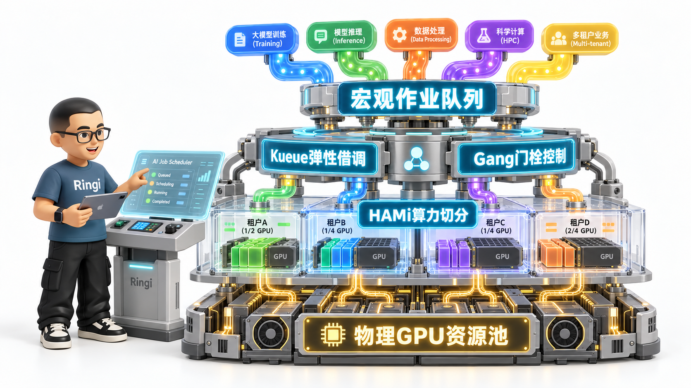
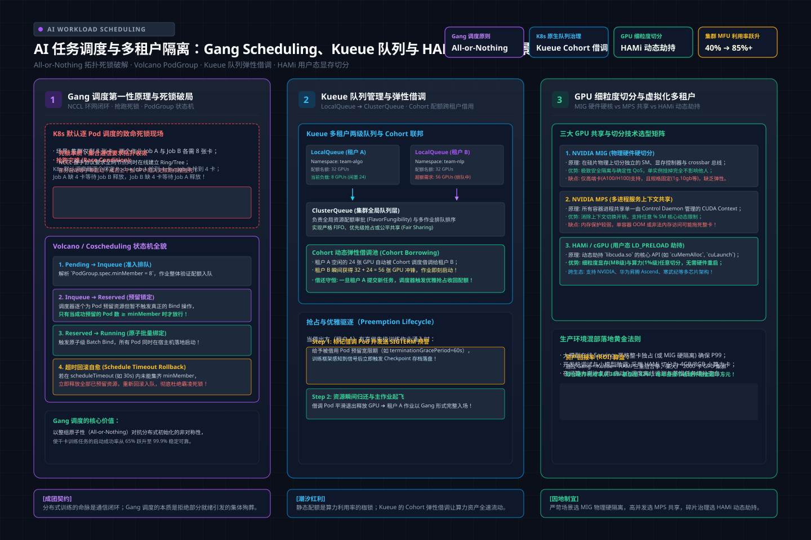
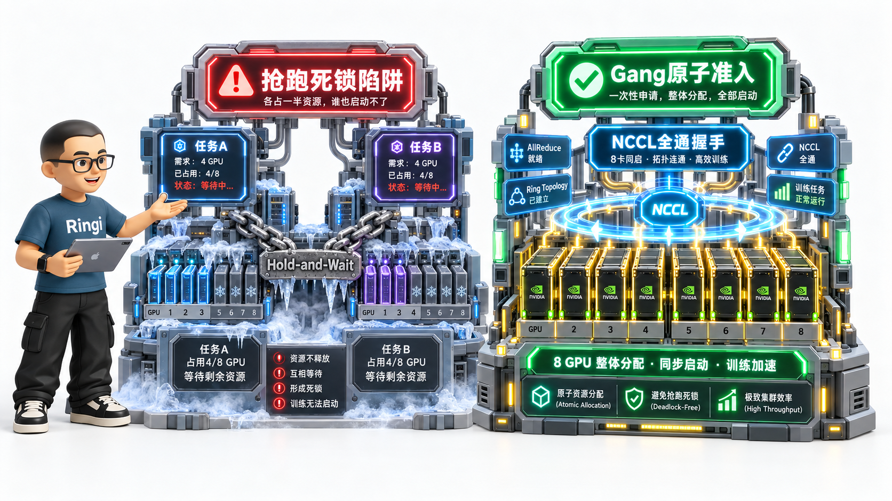
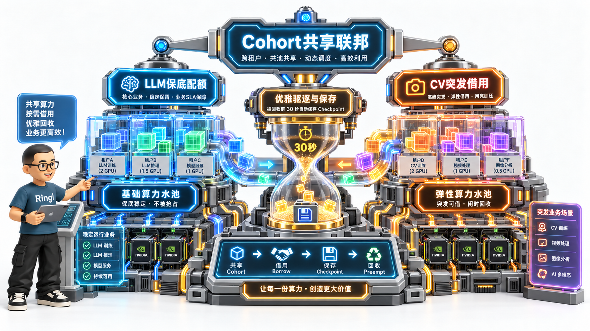
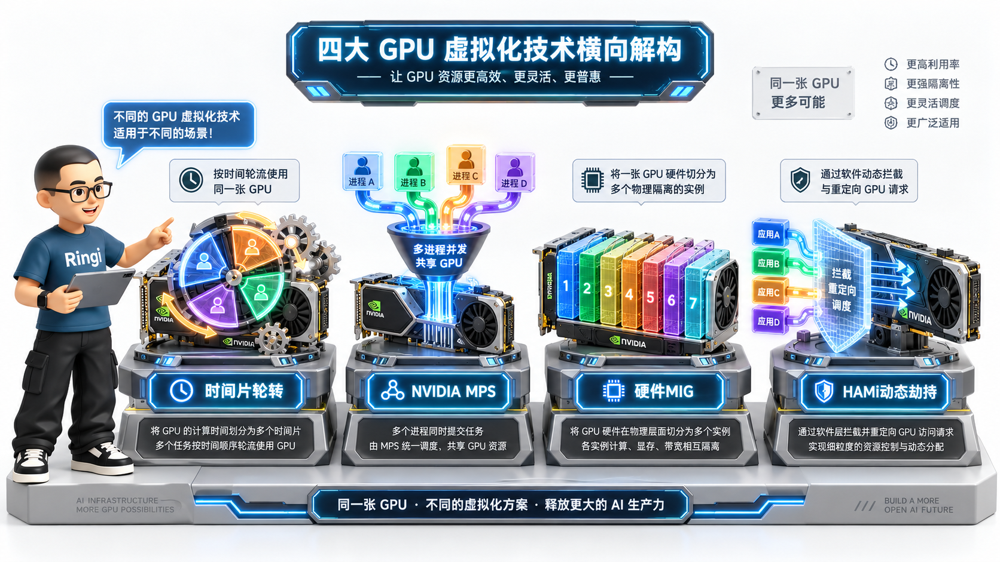
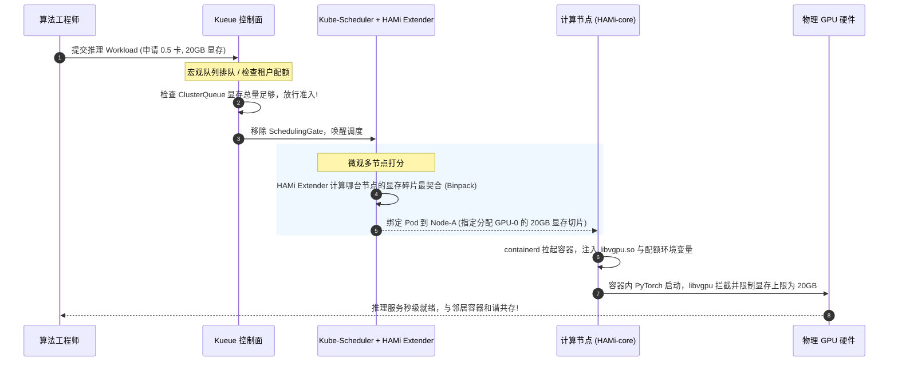

# 🏛️ 第38讲：从“死锁占坑”到细粒度算力切分——AI 任务高级调度（Gang Scheduling/Kueue）与多租户 GPU 虚拟化（MIG/MPS/HAMi）全栈实战

> **主讲人**：👓 **Ringi**（大厂 AI Infrastructure 工程师）  
> **所属模块**：[Module 06: 云原生 AI 平台与生产工程](./README.md)  
> **篇章范式**：☁️ 云原生 AI 平台、生产运维与系统设计篇（Cloud-Native AI Platform & System Design Paradigm）  
> **核心导读**：在单卡时代，调度器只需要回答“把这个 Pod 塞进哪台机器”。但在大模型千卡分布式训练与高并发推理时代，这个假设彻底瓦解：如果一个需要 8 张卡的训练任务被默认调度器分批塞进节点，前 6 个 Pod 占着卡空转等待，后 2 个 Pod 永远排不上队，就会触发经典的“抢跑死锁”，让价值数千万元的集群算力瞬间冻结；与此同时，数以百计的小模型推理与开发调试任务若按整卡申请，高达 70% 的显存和 80% 的 SM 算力将被白白荒废。本讲将带你深入调度器内部，从 Coscheduling / Gang Scheduling 第一性原理、Kueue 层次化队列与 Cohort 借调机制，一路杀到硬件级 MIG、运行时 MPS 与 HAMi 用户态 CUDA API 劫持切分的最前线。



```text
=================================================================================================
                                   Ringi 3D 架构工坊 · 核心全景
┌───────────────────────────────────────────────────────────────────────────────────────────────┐
│                                                                                               │
│    [作业接入与队列管理层 (Job Admission & Queue Management)]                                  │
│    ┌─────────────────────────────────────────────────────────────────────────────────────┐    │
│    │ 用户作业 (PyTorchJob / RayJob / Batch Job / Serving Deployment)                     │    │
│    └───────────────────────────────────────────┬─────────────────────────────────────────┘    │
│                                                │ 提交至租户本地队列 (LocalQueue)              │
│    [宏观队列与多租户弹性层 (Macro Queue & Cohort Borrowing)]    ▼                               │
│    ┌─────────────────────────────────────────────────────────────────────────────────────┐    │
│    │ Kueue Controller Manager                                                            │    │
│    │  ├── Workload 抽象转换器 (挂载 SchedulingGates 阻断普通 Pod 抢跑)                    │    │
│    │  └── ClusterQueue 调度引擎 ◄───[Cohort 弹性资源借用/归还协议]───► 动态配额池         │    │
│    └───────────────────────────────────────────┬─────────────────────────────────────────┘    │
│                                                │ 放行门控 / Gang 条件满足 (All-or-Nothing)     │
│    [微观拓扑与节点调度层 (Micro Scheduling & Topology Matching)] ▼                             │
│    ┌─────────────────────────────────────────────────────────────────────────────────────┐    │
│    │ Kube-Scheduler (增强型调度框架)                                                     │    │
│    │  ├── Volcano / Coscheduling 插件 (验证 PodGroup minAvailable 门限)                   │    │
│    │  └── HAMi-Scheduler 扩展器 (计算节点显存剩余与核心百分比，输出 Binpack / Spread 打分)│    │
│    └───────────────────────────────────────────┬─────────────────────────────────────────┘    │
│                                                │ 绑定 Pod 至特定 Node 并下发设备注入注解      │
│    [单机多租户隔离与切分执行层 (Device Isolation & Fractional Execution)]  ▼                 │
│    ┌─────────────────────────────────────────────────────────────────────────────────────┐    │
│    │ Node Kubelet ──► containerd ──► 容器运行时注入 Hook (libvgpu.so)                    │    │
│    ├─────────────────────────────────────────────────────────────────────────────────────┤    │
│    │ 方案 A: 硬件硬切分 (MIG)      │ 方案 B: 服务级共享 (MPS)    │ 方案 C: 动态劫持 (HAMi) │    │
│    │ 独立的 SM 实例与内存控制器    │ 共享 CUDA 上下文，降低延迟  │ 拦截 cuMemAlloc / 算力流控│    │
│    └───────────────────────────────────────────┬─────────────────────────────────────────┘    │
│                                                │ 物理硬件执行                                 │
│    [物理硬件底座 (Hardware Layer)]              ▼                                             │
│    ┌─────────────────────────────────────────────────────────────────────────────────────┐    │
│    │ 物理 GPU (H100/A100) │ 统一 HBM 显存池 (80GB) │ 物理 SM 算力集群 (132 SMs)          │    │
│    └─────────────────────────────────────────────────────────────────────────────────────┘    │
│                                                                                               │
└───────────────────────────────────────────────────────────────────────────────────────────────┘
=================================================================================================
```

<!-- more -->

## 📑 目录导航

- [0. Ringi 开场：生产真实现场与痛点冲突](#0-ringi-开场生产真实现场与痛点冲突)
  - [0.1 真实工程矛盾：为什么默认调度器会让大模型训练陷入“抢跑死锁”？](#01-真实工程矛盾为什么默认调度器会让大模型训练陷入抢跑死锁)
  - [0.2 线上真实事故复盘：一次双租户并发导致千卡集群集体“冰冻”惨剧](#02-线上真实事故复盘一次双租户并发导致千卡集群集体冰冻惨剧)
  - [0.3 调度与切分技术全景速查表](#03-调度与切分技术全景速查表)
- [1. Gang Scheduling（All-or-Nothing）第一性原理与状态机](#1-gang-schedulingall-or-nothing第一性原理与状态机)
  - [1.1 为什么分布式训练是绝对的“全有或全无”？](#11-为什么分布式训练是绝对的全有或全无)
  - [1.2 死锁消除的数学模型：科夫曼条件在 GPU 调度中的破局](#12-死锁消除的数学模型科夫曼条件在-gpu-调度中的破局)
  - [1.3 原生突破：Kubernetes SchedulingGates 调度门控状态机剖析](#13-原生突破kubernetes-schedulinggates-调度门控状态机剖析)
  - [1.4 Volcano PodGroup vs 原生 Coscheduling 机制深度对比](#14-volcano-podgroup-vs-原生-coscheduling-机制深度对比)
- [2. Kueue：现代云原生 AI 作业队列与多租户弹性调度中枢](#2-kueue现代云原生-ai-作业队列与多租户弹性调度中枢)
  - [2.1 架构分层：为什么有了 Kube-scheduler 还需要宏观队列？](#21-架构分层为什么有了-kube-scheduler-还需要宏观队列)
  - [2.2 核心抽象五剑客：LocalQueue、ClusterQueue、Workload、ResourceFlavor 与 Cohort](#22-核心抽象五剑客localqueueclusterqueueworkloadresourceflavor-与-cohort)
  - [2.3 跨租户资源弹性借调（Borrowing）与优雅归还（Preemption）状态流转](#23-跨租户资源弹性借调borrowing与优雅归还preemption状态流转)
  - [2.4 队列规则：StrictFIFO、BestEffortFIFO 与公平分享算法](#24-队列规则strictfifobesteffortfifo-与公平分享算法)
- [3. GPU 虚拟化与多租户共享技术全景对比](#3-gpu-虚拟化与多租户共享技术全景对比)
  - [3.1 共享的物理动机：Memory-bound 与 Compute-bound 的互补空间](#31-共享的物理动机memory-bound-与-compute-bound-的互补空间)
  - [3.2 方案 A：Time-Slicing（时间片轮转）及其“显存失控”致命伤](#32-方案-atime-slicing时间片轮转及其显存失控致命伤)
  - [3.3 方案 B：NVIDIA MPS（多进程服务）与上下文合并优化](#33-方案-bnvidia-mps多进程服务与上下文合并优化)
  - [3.4 方案 C：NVIDIA MIG（多实例 GPU）硬件级物理切分](#34-方案-cnvidia-mig多实例-gpu硬件级物理切分)
  - [3.5 方案 D：用户态 CUDA API 劫持虚拟化（HAMi / vGPU-manager）](#35-方案-d用户态-cuda-api-劫持虚拟化hami--vgpu-manager)
  - [3.6 四大多租户切分方案全维度综合对比矩阵](#36-四大多租户切分方案全维度综合对比矩阵)
- [4. HAMi 架构第一性原理与用户态拦截黑魔法](#4-hami-架构第一性原理与用户态拦截黑魔法)
  - [4.1 动态库劫持机制：`LD_PRELOAD` 与 `libvgpu.so` 初始化流程](#41-动态库劫持机制ld_preload-与-libvgpuso-初始化流程)
  - [4.2 显存硬限制算法：如何拦截 `cuMemAlloc` 并防止 OOM 溢出](#42-显存硬限制算法如何拦截-cumemalloc-并防止-oom-溢出)
  - [4.3 算力百分比限流：Kernel 启动拦截与令牌桶调度机制](#43-算力百分比限流kernel-启动拦截与令牌桶调度机制)
  - [4.4 Kueue 与 HAMi 的生产级端到端协同流转](#44-kueue-与-hami-的生产级端到端协同流转)
- [5. 生产级实战：训练与在线推理混部平台架构设计](#5-生产级实战训练与在线推理混部平台架构设计)
  - [5.1 混部特征分析：延迟敏感型（SLO） vs 吞吐敏捷型（Batch/SFT）](#51-混部特征分析延迟敏感型slo-vs-吞吐敏捷型batchsft)
  - [5.2 毫秒级抢占与优雅驱逐（SIGTERM -> Checkpoint -> SIGKILL）闭环](#52-毫秒级抢占与优雅驱逐sigterm---checkpoint---sigkill闭环)
  - [5.3 资源超卖模型与显存水线安全防波堤设计](#53-资源超卖模型与显存水线安全防波堤设计)
- [6. 动手实战与代码实验室（Minimal Runnable Code）](#6-动手实战与代码实验室minimal-runnable-code)
  - [6.1 实战 1：纯 Python 手写 Gang Scheduling 调度器与抢跑死锁模拟器](#61-实战-1纯-python-手写-gang-scheduling-调度器与抢跑死锁模拟器)
  - [6.2 实战 2：C 语言手写轻量级 CUDA 显存劫持动态库 `libmini_cuda_hook.c`](#62-实战-2c-语言手写轻量级-cuda-显存劫持动态库-libmini_cuda_hookc)
  - [6.3 实战 3：生产级 Kueue 层次化队列与弹性跨租户借调配置实战](#63-实战-3生产级-kueue-层次化队列与弹性跨租户借调配置实战)
  - [6.4 实战 4：HAMi 细粒度显存与算力切分部署及双容器压测验证](#64-实战-4hami-细粒度显存与算力切分部署及双容器压测验证)
- [7. Ringi 避坑指南与生产黄金准则](#7-ringi-避坑指南与生产黄金准则)
  - [7.1 避坑表格（❌ 常见小白错误理解 vs ✅ 大厂 AI Infra 正确理解）](#71-避坑表格-常见小白错误理解-vs--大厂-ai-infra-正确理解)
  - [7.2 生产环境调度与多租户切分黄金 Checklist](#72-生产环境调度与多租户切分黄金-checklist)
- [8. Ringi 5 点核心速记口诀、自我检验清单与课后深度思考题](#8-ringi-5-点核心速记口诀自我检验清单与课后深度思考题)
  - [8.1 5 点押韵核心速记口诀](#81-5-点押韵核心速记口诀)
  - [8.2 10 条白板自我检验清单](#82-10-条白板自我检验清单)
  - [8.3 3 道高阶开放式课后思考题（含极限 Corner Case）](#83-3-道高阶开放式课后思考题含极限-corner-case)
- [9. 📚 参考资料与核心源码/经典论文指引](#9--参考资料与核心源码经典论文指引)
- [附录：Appendix A — 大厂硬核高频面试题与白板推导](#附录appendix-a--大厂硬核高频面试题与白板推导)

---

# 0. Ringi 开场：生产真实现场与痛点冲突

## 0.1 真实工程矛盾：为什么默认调度器会让大模型训练陷入“抢跑死锁”？

在传统的微服务时代，Kubernetes 的调度器（Kube-scheduler）被公认为云原生的王冠。它的设计哲学非常单纯：**Pod 是第一公民，逐个独立决策，装箱调度（Binpack）**。一个微服务由 10 个 Pod 组成，调度器调度了 5 个，这 5 个就能立刻挂在 Ingress 后面开始承接流量；剩下的 5 个慢慢等机器弹出来，没有任何问题。

**但在大模型分布式训练场景下，这种“逐个调度、先到先占”的模式是致命的毒药！**

分布式深度学习（如 PyTorch DDP、Megatron-LM、DeepSpeed）的底层是 **集合通信（Collective Communication）**。当一个 8 卡分布式的作业启动时，主程序的第一行核心代码通常是：

```python
torch.distributed.init_process_group(backend="nccl", rank=my_rank, world_size=8)
```

在底层，NCCL 会尝试在 8 个 Rank 之间建立全互联的 TCP/Socket 握手通道。**这个握手是强同步阻塞的**——哪怕只有 1 个 Rank 没有启动，其余已经启动的 7 个 Rank 就会一直挂在系统调用上等待，直到超时崩溃（默认 1800 秒）。

现在，请想象一个残酷的生产现场：
- 节点 A 剩余 4 张空闲卡，节点 B 剩余 4 张空闲卡；
- 任务 1（需要 8 张卡）被提交；
- 任务 2（同样需要 8 张卡）几乎同时被提交；
- 默认调度器走上台前：它看到任务 1 的 Pod-0~3，立刻将它们调度到节点 A，占满了节点 A；
- 紧接着，调度器处理任务 2 的 Pod-0~3，立刻将它们调度到节点 B，占满了节点 B；
- 此时，任务 1 的后 4 个 Pod 发现节点 B 没卡了，进入 Pending；
- 任务 2 的后 4 个 Pod 发现节点 A 没卡了，也进入 Pending！

```text
=================================================================================================
                            大模型分布式训练的“抢跑死锁”惨剧
  [节点 A (4张物理卡)]                           [节点 B (4张物理卡)]
  ┌───────────────────────────────┐              ┌───────────────────────────────┐
  │ 任务 1 占有: Pod 0, 1, 2, 3   │              │ 任务 2 占有: Pod 0, 1, 2, 3   │
  │ (持有资源，阻塞等待其余 4 卡) │              │ (持有资源，阻塞等待其余 4 卡) │
  └──────────────┬────────────────┘              └──────────────┬────────────────┘
                 │                                              │
                 │ 等待获取资源                                  │ 等待获取资源
                 ▼                                              ▼
  [任务 1 的剩余 Pod 4, 5, 6, 7]                  [任务 2 的剩余 Pod 4, 5, 6, 7]
  (卡在 Pending 状态，无法调度)                  (卡在 Pending 状态，无法调度)
  ===============================================================================================
  *死锁结果: 8 张昂贵的物理 GPU 显存占满、功耗拉满、GPU-Util 为 0%，直到半小时后 NCCL 超时全部爆掉!*
=================================================================================================
```

这就是让每一个 AI Infra 架构师夜不能寐的 **Partial Allocation Deadlock（部分分配死锁 / 抢跑死锁）**。  
8 张卡、16 张卡尚且如此；在百机千卡的超级集群中，只要缺乏全局事务级的批调度控制，成百上千个 Pod 就会在几秒钟内把整个集群撕得粉碎，陷入相互等待资源的死循环。

---

## 0.2 线上真实事故复盘：一次双租户并发导致千卡集群集体“冰冻”惨剧

这是我亲历过的一次真实生产事故。

某大厂的核心推荐模型团队（租户 A）和多模态大模型团队（租户 B）共享一个拥有 128 台 8 卡 H800（共 1024 张卡）的物理集群。某天下午，由于调度配置失误，平台原有的批调度拦截器在一次滚动升级中意外下线，集群退回到了默认的 `kube-scheduler` 模式。

下午 14:00：
1. 租户 A 提交了一个 64 节点（512 卡）的百亿参数模型训练；
2. 租户 B 也提交了一个 64 节点（512 卡）的多模态预训练任务；
3. 调度器疯狂处理事件：它像洗扑克牌一样，把租户 A 的 380 个 Pod 散落在了前 80 台机器上，同时把租户 B 的 350 个 Pod 插花式地插在了这 80 台机器的剩余卡槽以及后 48 台机器上；
4. 结果：**租户 A 差 132 个 Pod 无法凑齐，租户 B 差 162 个 Pod 无法凑齐！**
5. 两批共计 730 个已经拉起的 Pod，各自持有 730 张物理 H800 显卡，在 `init_process_group` 上陷入长达 30 分钟的静默等待；
6. 在这 30 分钟里，其他小规模的 SFT、LoRA 任务全部被阻塞排队；
7. 最终，30 分钟 NCCL Timeout 阈值触发，730 个 Pod 全部抛出 `NCCL WARN: Call to connect returned Connection refused` 异常自杀崩溃；
8. 紧接着，K8s 控制器立即尝试重新拉起失败的 Pod，再度陷入新一轮的死锁循环……

**整整两个小时，价值上亿元的千卡计算集群，实际产出为零！直接电费与折旧损失数十万元！**

排查报告的最终结论只有一行字：  
**AI 分布式计算必须具备原子性（Atomicity）——要么全部上车（All），要么一个都别上（Nothing）！**

---

## 0.3 调度与切分技术全景速查表

在深入具体算法之前，我们先将解决上述矛盾的核心技术全貌理清楚：

| 技术层次 | 核心代表方案 | 解决的核心矛盾 | 运作所在的系统层级 | 生产关键特性 |
| :--- | :--- | :--- | :--- | :--- |
| **批作业与死锁治理** | Volcano / Coscheduling / SchedulingGates | 解决跨节点分布式作业抢跑死锁、保证资源分配原子性 | Kubernetes 调度器框架扩展层 | `minAvailable` 门限、超时自动回滚、抢占感知 |
| **宏观队列与配额管理** | Kueue / YuniKorn | 解决多租户公平排队、跨队列弹性借调、租户配额管控 | Kubernetes 控制面 CRD 与准入控制器 | `LocalQueue`、`ClusterQueue`、`Cohort` 动态配额借用 |
| **硬件级硬切分** | NVIDIA MIG (Multi-Instance GPU) | 解决不同租户强隔离、硬件故障物理隔离与确定性 QoS | GPU 芯片物理硬件与微架构层 | 独立的 SM、独立显存控制器、仅高端卡（A100/H100）支持 |
| **服务级动态共享** | NVIDIA MPS (Multi-Process Service) | 解决多进程 CUDA Context 显存浪费与并发利用率低 | 用户态 Control Daemon 与 GPU 驱动层 | 共享单一 CUDA Context、支持动态核心限制、单进程崩溃易全崩 |
| **用户态动态劫持** | HAMi / vGPU-manager / 4PD cGPU | 解决细粒度显存（MB级）与算力（%级）切分、免硬件重置 | 用户态动态链接库 (`LD_PRELOAD`) 拦截层 | 拦截 `cuMemAlloc`、支持多芯片架构（NVIDIA/昇腾/寒武纪） |
| **弹性混部治理** | 在线 Serving + 离线 Training 混部引擎 | 解决夜间与低谷期算力潮汐闲置、提高集群整体 MFU | 平台级 QoS 调度器与驱逐控制器 | 优先级抢占、毫秒级快速退避、Checkpoint 自动保存 |

---

# 1. Gang Scheduling（All-or-Nothing）第一性原理与状态机

> 💡 **架构全景速览**：在深潜源码前，先在白板上建立坚不可摧的 AI 任务调度、Gang/Kueue 队列与多租户 GPU 共享隔离物理底账。
> 
> 

## 1.1 为什么分布式训练是绝对的“全有或全无”？

我们在第 0.1 节中看到了抢跑死锁的现象，现在我们用 **Ringi 工程师五问** 从因果关系彻底穿透其本质：

1. **📐 Shape 与物理连接**：在张量并行（TP）或数据并行（DDP）中，每一个 Rank 负责处理全局 Batch 的一个分片（$\text{MicroBatch}$）。通信拓扑必须在物理上构成一个完整的环（Ring AllReduce）或一棵完整的树（Tree AllReduce）；
2. **⚙️ Machine 怎么跑**：NCCL 构筑环网时，Rank 0 必须向 Rank 1 发送握手信号，Rank 1 发送给 Rank 2……直到 Rank $N-1$ 回环连到 Rank 0。**环网中任何一个节点缺失，整个环路的拓扑初始化就无法收敛，状态机停滞在握手阶段**；
3. **💰 Cost 花在哪里**：当进程阻塞在 `init_process_group` 时，虽然没有执行 GEMM 矩阵乘法算子，但 CUDA 上下文已经建立，显卡已经被占用，其他任务无法获取该设备。

因此，对于分布式训练作业而言：

$$
\text{Utility}(Job) = \begin{cases} 1.0, & \text{当且仅当在线实例数 } M = N (\text{期望总数}) \\ 0.0, & \text{当且仅当在线实例数 } M < N \end{cases}
$$

它是一个非零即一的 **阶跃函数（Step Function）**。给它分配 $N-1$ 个 Pod，其有效产出不是 $90\%$，而是 **$0\%$**！

---

## 1.2 死锁消除的数学模型：科夫曼条件在 GPU 调度中的破局

计算机操作系统的奠基理论告诉我们，死锁（Deadlock）的发生必须同时满足四个 **科夫曼条件（Coffman Conditions）**：
1. **互斥条件（Mutual Exclusion）**：GPU 硬件在某一时刻只能被一个 Pod 独占；
2. **占有且等待（Hold and Wait）**：一个任务持有了已分配的 GPU，同时在等待未分配的 GPU；
3. **不可抢占（No Preemption）**：调度器不能强行剥夺一个正在运行中的 Pod 的 GPU，除非它自己退出或被杀；
4. **循环等待（Circular Wait）**：任务 A 占着 Node 1 等 Node 2，任务 B 占着 Node 2 等 Node 1。

**如何从数学上彻底根除死锁？**  
打破“互斥”不可能（物理卡就那么多）；打破“不可抢占”成本极大（中断正在算梯度的任务代价昂贵）。  
**唯一最高效、最低成本的方案，就是打破第二条：“占有且等待（Hold and Wait）”！**

> **Gang Scheduling（成组调度 / All-or-Nothing）核心定律**：  
> **调度器在能够同时为整个作业分配其全部所需的 $N$ 个计算实例之前，绝不为该作业的任何一个实例做实质性调度和资源占有！**



---

## 1.3 原生突破：Kubernetes SchedulingGates 调度门控状态机剖析

在早期，Kubernetes 为了实现 Gang Scheduling，必须引入庞大的第三方调度器（如 Volcano、Kube-batch），这要求将整个集群的核心调度器完全替换掉，侵入性极高。

从 Kubernetes 1.26 开始，官方调度框架引入了一个划时代的原生特性：**`SchedulingGates`（调度门控）**。

```text
=================================================================================================
                     Kubernetes 原生调度门控 (SchedulingGates) 状态机
  [Pod 提交 (Pending)]
         │
         ▼
  Pod.spec.schedulingGates 包含门栓: `["example.com/gang-all-ready"]`
         │
         ├──► 调度器直接忽略该 Pod! (不会执行任何预选 Filter 和打分 Score)
         │    [零资源消耗，不占任何节点配额!]
         │
         ▼
  外部控制器 (如 Kueue 或 Gang Controller) 持续监控:
  "检查当前作业的 8 个 Pod 是否全部就绪? 集群是否有足够的 8 张空闲卡?"
         │
         ├── 否 ──► 继续等待，门栓保持闭锁
         │
         └── 是 ──► [原子性解锁]
                    控制器并行移除 8 个 Pod 上的 schedulingGates 门栓!
                    ▼
  8 个 Pod 同时涌入调度队列，调度器在同一个调度周期内一气呵成完成全量绑定!
=================================================================================================
```

通过这一机制，Kubernetes 原生就具备了“阻止单个 Pod 偷跑”的能力。一个带有调度门控的 Pod 即使进入集群，也会被调度器直接视作“未准备好”，完全不会去争抢任何节点的物理卡，从而以极低的代码侵入性打破了“占有且等待”。

---

## 1.4 Volcano PodGroup vs 原生 Coscheduling 机制深度对比

在工业生产实践中，目前主流的 Gang Scheduling 实现主要分为两大阵营：

### 1. Volcano 的 `PodGroup` 体系
Volcano 是 CNCF 首个基于 K8s 的云原生批处理系统。它提出了 `PodGroup` CRD：
```yaml
apiVersion: scheduling.volcano.sh/v1beta1
kind: PodGroup
metadata:
  name: llama3-70b-gang
spec:
  minMember: 8         # 最小成组数量
  minResources:
    nvidia.com/gpu: 8   # 最小资源量
```
每个 Pod 通过 `schedulerName: volcano` 和注解关联到该 `PodGroup`。Volcano 内部重写了完整的调度队列、预选与优选算法，只有当就绪的 Pod 数量达到 `minMember` 时才统一触发调度。

### 2. Kube-scheduler 原生插件 `Coscheduling`
基于 Kubernetes 调度框架（Scheduling Framework）的官方插件。它不需要替换默认的 `kube-scheduler` 二进制，而是作为一个插件编译进去，利用 `QueueSort`、`PreFilter` 和 `Permit` 扩展点：
- **`Permit` 阶段等待**：当一个属于某个 Group 的 Pod 调度完成准备绑定前，Coscheduling 插件在 `Permit` 阶段将其 **挂起（Wait）**，最长等待 `scheduleTimeout` 秒；
- 只有当该 Group 内的所有兄弟 Pod 都成功走到 `Permit` 阶段，插件才向所有 Pod 发送 `Success` 信号，统一进入 `Binding` 阶段持久化到 etcd。

---

# 2. Kueue：现代云原生 AI 作业队列与多租户弹性调度中枢

## 2.1 架构分层：为什么有了 Kube-scheduler 还需要宏观队列？

很多工程师会产生一个疑问：“既然 Kube-scheduler 加上 Gang 插件已经能解决死锁，为什么我们还需要 Kueue？”

这里存在一个根本性的认知层次差异：
- **微观节点调度（Micro-Scheduling，Kube-scheduler 负责）**：回答的是 **“放哪里（Where）”** 的问题。它只关心特定 Node 的拓扑、亲和性、内存打分；
- **宏观准入与队列调度（Macro-Queueing，Kueue 负责）**：回答的是 **“谁先上、什么时候上、能借多少（When & Who & Quota）”** 的问题！

在大规模生产环境中，如果把数千个包含 8 卡请求的 Job 直接扔进 K8s API Server，API Server 会被海量的 Pod 对象瞬间打满，etcd 压力剧增，调度队列疯狂震荡。  
**Kueue 的核心定位：作为一道坚固的闸门，立在用户与 Kube-scheduler 之间！**

```text
=================================================================================================
                            Kueue 宏观管控与 Kubernetes 微观执行分层
  [算法用户层]
      Job 1 (团队 A)         Job 2 (团队 B)         Job 3 (团队 A)
        │                      │                      │
        ▼                      ▼                      ▼
  ┌─────────────────────────────────────────────────────────────────┐
  │ Kueue 宏观准入控制层 (Admission & Global Quota Control)         │
  │                                                                 │
  │  - 管理多租户队列优先级 (StrictFIFO / FairSharing)               │
  │  - 管理跨部门弹性配额借用 (Cohort Lending)                      │
  │  - 作业级别准入挂起 (控制总并发，避免 API Server 爆炸)          │
  └────────────────────────────────┬────────────────────────────────┘
                                   │ 准入放行 (Admit Workload)
                                   ▼
  ┌─────────────────────────────────────────────────────────────────┐
  │ Kubernetes 核心调度层 (kube-scheduler + Device Plugin / DRA)    │
  │                                                                 │
  │  - 物理节点过滤与打分 (Node Filter & Score)                     │
  │  - 物理拓扑感知 (NVLink / NUMA 对称性匹配)                     │
  │  - 容器硬件设备绑定与拉起                                       │
  └─────────────────────────────────────────────────────────────────┘
=================================================================================================
```

---

## 2.2 核心抽象五剑客：LocalQueue、ClusterQueue、Workload、ResourceFlavor 与 Cohort

Kueue 设计了一套精巧、解耦的五大核心资源模型：

### 1. `LocalQueue`（命名空间级租户入口）
每个团队或算法业务线拥有一个或多个属于自己 Namespace 的 `LocalQueue`。算法工程师提交任务时，只需将任务指向自己的 `LocalQueue`，对底层复杂的物理集群配置完全无感知。

### 2. `ClusterQueue`（集群级核心配额池）
平台管理员创建的集群级对象。它决定了一个队列最多能吃多少 CPU、多少内存、多少张 GPU，并定义了抢占策略。

### 3. `Workload`（统一作业抽象）
Kueue 把上层的各种异构任务（K8s Batch Job、Kubeflow PyTorchJob、RayCluster、MPIJob）统一抽象为一个轻量级的 `Workload` CRD。Kueue 的所有排队、准入、抢占操作，全部针对 `Workload` 进行。

### 4. `ResourceFlavor`（异构硬件特征切片）
定义节点池的物理特征。例如：
- `h100-nvlink-flavor`：带有标签 `gpu.nvidia.com/model: H100`；
- `a100-pcie-flavor`：带有标签 `gpu.nvidia.com/model: A100-PCIe`。

### 5. `Cohort`（跨租户共享资源联邦）
这是 Kueue 最惊艳的创新点！多个 `ClusterQueue` 可以加入同一个 `Cohort`。当队列 A 闲置时，其名下未使用的 GPU 配额可以被队列 B 临时借走；而当队列 A 有新任务进来时，Kueue 会自动发起抢占，把资源讨要回来！

---

## 2.3 跨租户资源弹性借调（Borrowing）与优雅归还（Preemption）状态流转

我们用一个极具实战意义的场景来观察 Cohort 的弹性流转状态机：



```text
=================================================================================================
                       Cohort 跨队列资源借用与抢占回收全景流转
  [初始状态]
  Cohort: `ai-research` (总卡数: 16 张 H100)
    ├── ClusterQueue-A (LLM 团队): 名义配额 (Nominal) = 8 卡 | 当前占用 = 0 卡 (空闲)
    └── ClusterQueue-B (CV 团队):  名义配额 (Nominal) = 8 卡 | 当前占用 = 8 卡 (饱和)

  [事件 1: CV 团队突发大任务，申请 6 张卡]
    ClusterQueue-B 发现本地已饱和，但同属 Cohort 的 A 队列闲置 8 卡
    触发借用协议: B 借用 A 的 6 张卡 (Borrowing = 6)
    当前占用: A = 0 卡, B = 14 卡 (集群利用率高达 87.5%!)

  [事件 2: LLM 团队突然提交 8 卡高优先级预训练任务!]
    ClusterQueue-A 发现自己的名义配额被 B 占用了，立即触发抢占回收状态机:
    ┌────────────────────────────────────────────────────────────────────────┐
    │ 1. Kueue 识别出 B 队列处于 "借用状态 (Borrowing)"                      │
    │ 2. 向 B 队列中后加入的、优先级较低的 Workload 发起驱逐 (Eviction)      │
    │ 3. 向被驱逐的 Pod 发送 SIGTERM，留出 30 秒保存 Checkpoint              │
    │ 4. B 的 Pod 退出，归还 6 张卡                                          │
    │ 5. A 队列的 8 卡任务立即准入放行，成功上车!                           │
    └────────────────────────────────────────────────────────────────────────┘
=================================================================================================
```

这种机制完美解决了大厂中“部门墙导致资源割裂”的顽疾：**有任务时保证自己有配额用，没任务时借给别人用，别人用完随时能要回来！** 集群整体 GPU 利用率往往能从 40% 直接拉升至 85% 以上。

---

# 3. GPU 虚拟化与多租户共享技术全景对比

## 3.1 共享的物理动机：Memory-bound 与 Compute-bound 的互补空间

解决了宏观任务的排队和死锁，我们必须直面微观层面的硬件利用率瓶颈：**如果一个任务根本吃不满一张 GPU，我们该怎么办？**

在现代 AI 工作负载中，存在两大典型极端：
1. **大模型训练（Compute & Memory Bound）**：显存吃满（80GB），算力吃满（SM 利用率 90%+）。这种任务必须独占整卡甚至多卡，严禁共享；
2. **小模型推理与开发调试（Lightweight / Memory Underutilized）**：
   - 例如一个用于文本嵌入的 BERT 或 BGE 模型，显存只占 4GB，显存带宽利用率不足 10%；
   - 或者工程师打开了一个 Jupyter Notebook 写代码，大部分时间在看文档，显卡在 95% 的时间里功耗仅有 30W，SM 利用率恒为 0%。

如果给这些任务一人分配一张物理 A100（80GB），那就是在“用黄金当砖头铺路”。因此，**GPU 虚拟化与细粒度切分** 成为了提升集群 ROI 的必由之路。

---

## 3.2 方案 A：Time-Slicing（时间片轮转）及其“显存失控”致命伤

**实现原理**：  
NVIDIA 官方在 K8s Device Plugin 中提供的最简方案。在节点配置文件中声明某张卡可以被复用为 $K$ 个副本（如把 1 张卡声明为 4 个虚拟卡）：
```json
{
  "sharing": {
    "timeSlicing": {
      "resources": [{"name": "nvidia.com/gpu", "replicas": 4}]
    }
  }
}
```

**底层物理机制**：  
GPU 驱动在时钟中断触发下，按时间片（毫秒级）在不同的 CUDA 上下文之间进行任务切换。

**致命缺陷（为什么生产不推荐单独用它？）**：
1. **零显存隔离（No Memory Isolation）**：时间片轮转只管时钟时间，不管显存！只要容器 A 里的代码写了一个死循环狂开 `torch.zeros(1024, 1024, 1024)`，瞬间吃满 80GB，容器 B 的程序在调用 `cudaMalloc` 时就会立刻收到 `CUDA out of memory` 崩溃！
2. **上下文切换开销（Context Switch Overhead）**：不同进程的上下文切换需要清空 SM 的流水线、保存通用寄存器和共享内存状态，延迟开销在毫秒级，会严重拖垮在线 Serving 的 P99 延迟。

---

## 3.3 方案 B：NVIDIA MPS（多进程服务）与上下文合并优化

为了克服时间片轮转的上下文切换开销，NVIDIA 推出了 **MPS（Multi-Process Service）**。

```text
=================================================================================================
                            传统多进程 vs NVIDIA MPS 架构对比
  [传统多进程模式: 多上下文排队]
  Process A (Context A) ──► [时间片切换 / 保存现场] ──► GPU 硬件执行
  Process B (Context B) ──► [时间片切换 / 保存现场] ──► (两个任务无法在 SM 上并发!)

  [MPS 模式: 上下文合并与空间复用]
  Process A (Client) ──┐
                       ├──► [MPS Control / Server 守护进程]
  Process B (Client) ──┘           │ (合并为一个单一的统一 CUDA Context!)
                                   ▼
                       ┌─────────────────────────────────────────┐
                       │ GPU 物理硬件 (SM 并发执行)              │
                       │ ┌─────────────────┬───────────────────┐ │
                       │ │ Process A 占用  │ Process B 占用    │ │
                       │ │ 40% SM 算力     │ 60% SM 算力       │ │
                       │ └─────────────────┴───────────────────┘ │
                       └─────────────────────────────────────────┘
=================================================================================================
```

**核心优势**：
- **真正的 SM 算力空间复用**：不同容器的 Kernel 可以在同一个 SM 内部的不同 Warp 调度器上同时并发执行；
- **显存与算力限制**：通过环境变量 `CUDA_MPS_PINNED_DEVICE_MEM_LIMIT` 和 `CUDA_MPS_ACTIVE_THREAD_PERCENTAGE`，可以限制客户端进程的最大显存占用和活跃线程比例。

**生产隐患**：
- **故障域共享（Shared Fault Domain）**：因为所有客户端共享 MPS Server 的同一个底层 CUDA Context，一旦某个客户端进程触发了非法的内存越界访问（Xid 31）导致 Context 崩溃，**该 GPU 上跑的所有其他容器全部会在同一瞬间一命呜呼！**

---

## 3.4 方案 C：NVIDIA MIG（多实例 GPU）硬件级物理切分

从 Ampere 架构（A100）和 Hopper 架构（H100）开始，NVIDIA 在芯片的硅片电路上做了终极的物理手术——**MIG（Multi-Instance GPU）**。

```text
=================================================================================================
                         NVIDIA A100 MIG 硬件级物理切分剖析
  一张 80GB A100 物理芯片在硬件层被刀劈为最多 7 个相互完全独立的硬件实例:
  ┌──────────────┬──────────────┬──────────────┬──────────────┬──────────────┬──────────────┐
  │ 1g.10gb 实例 │ 1g.10gb 实例 │ 1g.10gb 实例 │ 1g.10gb 实例 │ 2g.20gb 实例 │ 1g.10gb 实例 │
  ├──────────────┼──────────────┼──────────────┼──────────────┼──────────────┼──────────────┤
  │ 14 个独立 SM │ 14 个独立 SM │ 14 个独立 SM │ 14 个独立 SM │ 28 个独立 SM │ 14 个独立 SM │
  ├──────────────┼──────────────┼──────────────┼──────────────┼──────────────┼──────────────┤
  │ 10GB 独占 HBM│ 10GB 独占 HBM│ 10GB 独占 HBM│ 10GB 独占 HBM│ 20GB 独占 HBM│ 10GB 独占 HBM│
  ├──────────────┴──────────────┴──────────────┴──────────────┴──────────────┴──────────────┤
  │ 物理交叉开关总线 (Crossbar) 硬件级硬隔离 / 独立的 DMA 引擎 / 独立的 L2 Cache 切片      │
  └─────────────────────────────────────────────────────────────────────────────────────────┘
  *特性: 实例 A 哪怕彻底 Kernel Panic 甚至硬件死锁，对实例 B 的延迟和显存绝对产生 0.00% 的干扰!*
=================================================================================================
```

**MIG 的优点是无与伦比的安全性与确定性 QoS**。  
但大厂在落地 MIG 时，往往面临两大极其痛苦的现实枷锁：
1. **切分规格僵化（Inflexible Profiles）**：显存和算力比例是锁死在固定模板里的（例如 1g.10gb、2g.20gb、3g.40gb、4g.40gb、7g.80gb）。你绝不能像买菜一样申请“5GB 显存”或者“15% 算力”；
2. **运维成本高昂**：动态调整 MIG 切片规格通常需要排空卡上的全部容器，并调用 `nvidia-smi mig -cgi` 重新划分实例，灵活性极低。

---

## 3.5 方案 D：用户态 CUDA API 劫持虚拟化（HAMi / vGPU-manager）

由于 MIG 门槛太高、MPS 稳定性不足、时间片无隔离，大厂和开源界诞生了第四种最灵活的杀手锏——**基于用户态动态库劫持的虚拟化技术（以 CNCF 开源的 HAMi 为代表）**。

其核心第一性原理是：**在容器启动时，利用 Linux 的 `LD_PRELOAD` 机制，将一个经过精心编写的动态链接库（如 `libvgpu.so`）强行插入到用户应用程序和官方驱动库之间！**

```text
=================================================================================================
                            HAMi 用户态 CUDA API 动态拦截机制
  [容器应用层: Python / PyTorch]
              │
              │ 调用标准 API: `cudaMalloc(&ptr, 20GB)`
              ▼
  ┌─────────────────────────────────────────────────────────────────────────────────┐
  │ HAMi 劫持代理层 (libvgpu.so - 通过 LD_PRELOAD 注入)                             │
  │                                                                                 │
  │  1. 拦截该 API 调用，提取申请显存大小: size = 20GB                             │
  │  2. 读取 Pod 声明的配额限额: limit = 16GB                                       │
  │  3. 账本校验: Current_Allocated (8GB) + 20GB = 28GB > 16GB (超额!)              │
  │  4. 【直接短路拦截】: 根本不向底层驱动发指令!                                   │
  │  5. 伪造错误码，直接向上返回: `CUDA_ERROR_OUT_OF_MEMORY`                      │
  └──────────────────────────────────────┬──────────────────────────────────────────┘
                                         │ 若未超额: 放行指令
                                         ▼
  ┌─────────────────────────────────────────────────────────────────────────────────┐
  │ 官方驱动库: `libcuda.so` ──► 系统调用 ioctl ──► Linux 内核 `nvidia.ko`           │
  └─────────────────────────────────────────────────────────────────────────────────┘
=================================================================================================
```

**它的巨大威力在于**：
- **完全支持任意粒度的显存切分**：你可以给 Pod 声明 `hami.io/gpu-memory: 4096`（只给 4GB 显存），甚至支持 MB 级精细切分；
- **支持动态算力限制**：通过拦截 `cuLaunchKernel`，利用令牌桶算法（Token Bucket）进行微秒级延迟控制，限制容器只能使用整卡 20% 的算力；
- **对应用完全透明**：业务代码完全不需要修改一行，镜像不需要改动，纯纯的云原生非侵入式架构！

---

## 3.6 四大多租户切分方案全维度综合对比矩阵



| 架构维度 | 方案 A: Time-Slicing | 方案 B: NVIDIA MPS | 方案 C: NVIDIA MIG | 方案 D: HAMi (API 劫持) |
| :--- | :--- | :--- | :--- | :--- |
| **隔离实现层级** | 驱动层时间片轮转 | 守护进程 Context 合并 | **芯片物理电路硬隔离** | **用户态动态库劫持 (`LD_PRELOAD`)** |
| **显存隔离能力** | ❌ **无隔离**（可互相打爆） | ➖ 软限制（Pin 内存上限） | ✅ **绝对物理隔离** | ✅ **强内存拦截（超限直接拦截）** |
| **算力隔离能力** | ➖ 粗粒度时间片竞争 | ➖ 线程百分比软限制 | ✅ **绝对 SM 物理划分** | ➖ 令牌桶 / 核心百分比流控 |
| **故障隔离域** | ✅ 单容器崩溃不影响他人 | ❌ **一人越界，全卡崩溃** | ✅ **硬件级隔离，完全无关** | ✅ 单容器崩溃不影响他人 |
| **切分灵活性** | 只能按副本整数切分 | 动态按需，但缺乏统一调度 | ❌ **模板锁死，需重置实例** | ✅ **极高（MB 显存，1% 算力步长）** |
| **硬件门槛限制** | 支持所有 NVIDIA GPU | 支持大多数现代 GPU | **仅高端卡（A100/H100）支持** | 支持所有卡，且扩展支持昇腾/寒武纪 |
| **吞吐与延迟损耗** | 上下文切换延迟明显 | 延迟最低，并发吞吐极佳 | 接近零损耗，确定性 QoS | 极微弱的 Hook 拦截开销（< 1%） |
| **推荐生产场景** | 仅供个人测试与极简环境 | 同一租户下的小型微服务合并 | 严苛公有云多租户、高等级金融/核心AI | **大厂通用 AI 平台、Notebook 共享、混部** |

---

# 4. HAMi 架构第一性原理与用户态拦截黑魔法

## 4.1 动态库劫持机制：`LD_PRELOAD` 与 `libvgpu.so` 初始化流程

让我们并肩拆开机器，看一看大厂在部署 HAMi 时，容器启动瞬间的底层数据流：

1. **Mutating Webhook 注入**：当用户提交一个声明了 `hami.io/gpu-memory: "16384"`（16GB 显存）的 Pod 时，HAMi 的准入控制器在 K8s API Server 层面拦截 Pod Spec；
2. **挂载卷与环境变量劫持**：
   - 自动在 Pod 中挂载宿主机的 `libvgpu.so` 目录；
   - 注入关键环境变量：
     ```bash
     LD_PRELOAD=/usr/local/vgpu/libvgpu.so
     CUDA_DEVICE_MEMORY_LIMIT=16384m
     CUDA_DEVICE_SM_LIMIT=50
     ```
3. **动态链接器接管**：当容器内的 Python 执行 `import torch` 并首次通过 `dlopen` 加载 `libcuda.so` 时，Linux 动态链接器（`ld-linux.so`）优先查找 `LD_PRELOAD` 中指定的 `libvgpu.so`；
4. **符号抢占（Symbol Preemption）**：`libvgpu.so` 导出了所有与 `libcuda.so` 完全同名的函数符号（如 `cuInit`, `cuMemAlloc_v2`, `cuLaunchKernel` 等），从而神不知鬼不觉地篡夺了所有 API 的控制权！

---

## 4.2 显存硬限制算法：如何拦截 `cuMemAlloc` 并防止 OOM 溢出

在 `libvgpu.so` 内部，维护着一个属于当前容器的私有显存记账器。我们来看其核心算法逻辑的数学表达与物理机制：

假设容器声明的最大显存为 $M_{\text{limit}}$，当前已分配显存总量为 $M_{\text{allocated}}$。当应用层调用 `cuMemAlloc(dptr, bytes)` 时：

```text
=================================================================================================
                            HAMi 显存拦截四步裁决算法
  Step 1 [尺寸对齐]:
    size_aligned = AlignToPage(bytes, 2MB) // 按照 GPU 物理显存大页 2MB 进行边界对齐
  
  Step 2 [阈值裁决]:
    if (M_allocated + size_aligned > M_limit) {
        // 超出用户声明的配额!
        // 根本不打扰底层物理驱动，直接伪造 CUDA 返回值
        return CUDA_ERROR_OUT_OF_MEMORY;
    }
  
  Step 3 [透传执行]:
    // 调用真正的底层系统库函数 (通过 dlsym(RTLD_NEXT, "cuMemAlloc_v2") 提取的真实句柄)
    CUresult res = real_cuMemAlloc_v2(dptr, size_aligned);
  
  Step 4 [账本更新]:
    if (res == CUDA_SUCCESS) {
        AtomicAdd(&M_allocated, size_aligned);
    }
    return res;
=================================================================================================
```

这一拦截机制彻底堵死了容器内程序通过 CUDA 申请超出配额显存的可能，**以零内核侵入的代价，完美实现了 cgroups 在 GPU 显存控制领域的替身！**

---

## 4.3 算力百分比限流：Kernel 启动拦截与令牌桶调度机制

除了显存，算力（SM 占用）如何限制？如果两个容器共享同一张卡，容器 A 是密集的矩阵乘法，容器 B 也是密集的矩阵乘法，如何保证 A 只能用 40% 的算力，B 能用 60%？

HAMi 采用了一种精妙的 **基于时间窗口的令牌桶限流算法（Token Bucket Rate Limiter）**：
1. 拦截 `cuLaunchKernel`（每一个 CUDA 核函数的发射入口）；
2. 根据用户的配额设定一个调度时间窗口（例如 $T_{\text{window}} = 100\text{ms}$），若算力限额为 $40\%$，则该容器在一个窗口内最多能获得 $40\text{ms}$ 的 GPU 执行时间；
3. 在每次发射 Kernel 之前，利用 CUDA Event（`cudaEventRecord` 与 `cudaEventElapsedTime`）测量前置 Kernel 在 GPU 上的实际耗时；
4. **如果累计耗时超标**：Hook 程序在 CPU 端通过微秒级 `usleep()` 挂起当前线程，延迟向 GPU 命令队列发射新的 Kernel；
5. GPU 硬件由于命令队列暂时被挂起，流水线自然让渡给同一张卡上的另一个容器执行！

---

## 4.4 Kueue 与 HAMi 的生产级端到端协同流转

在大厂成熟的云原生平台上，**Kueue（宏观队列与弹性借调）** 与 **HAMi（微观切分与算力隔离）** 通常是强强联合的黄金搭档：



---

# 5. 生产级实战：训练与在线推理混部平台架构设计

## 5.1 混部特征分析：延迟敏感型（SLO） vs 吞吐敏捷型（Batch/SFT）

要做到千卡集群的高效混部，必须将集群的工作负载精准分类，看透它们的本质差异：

| 负载类型 | 典型代表任务 | 关键 SLA / 核心瓶颈 | 对资源波动的容忍度 | 调度与隔离策略 |
| :--- | :--- | :--- | :--- | :--- |
| **在线高优先级（LS - Latency Sensitive）** | 生产大模型 API 服务、vLLM 推理、搜索打分 | **P99 延迟严苛**、流量波峰波谷明显（昼夜潮汐差 3~5 倍） | **极度脆弱**（绝不允许被任何突发流量阻塞） | **独占或通过 MIG/HAMi 强保显存**；享有最高抢占优先级 |
| **离线低优先级（BE - Best Effort）** | LoRA 微调、SFT 数据预处理、离线评测 Batch | **吞吐量与成本敏感**、无毫秒级延迟要求 | **高容忍度**（可随时暂停、重启、迁移） | **使用借调资源混部**；一旦高优任务需要，立即让渡资源 |

---

## 5.2 毫秒级抢占与优雅驱逐（SIGTERM -> Checkpoint -> SIGKILL）闭环

混部平台最忌讳的是“野蛮杀进程”。如果离线训练任务已经跑了 5 个小时，因为在线服务一个突发的流量毛刺，离线任务被直接 `kill -9`，前面 5 个小时算出来的梯度全部化为乌有，这是不可接受的浪费！

大厂标准的 **优雅驱逐四步闭环协议** 如下：

```text
=================================================================================================
                            离线训练任务优雅驱逐全生命周期
  [Step 1: 流量告警触发]
  在线服务 HPA 检测到 P99 时延突破 SLO 阈值 (如 > 50ms) ──► 发起扩容请求
     │
     ▼
  [Step 2: 宏观抢占信号发射]
  Kueue 标记占用借调配额的离线任务，调用 K8s API 发送 `DeletePod`
  设置优雅退出宽限期: `terminationGracePeriodSeconds = 30`
     │
     ▼
  [Step 3: 容器内部响应与紧急保存 (10~20 秒)]
  ① 离线训练主进程捕获 `SIGTERM` 信号
  ② 立即停止下一个 Iteration 的前向传播
  ③ 触发内存级轻量化快照: 将当前 Step 的权重与优化器状态极速 dump 到共享分布式存储 (JuiceFS)
  ④ 向控制台打印日志: `Checkpoint saved at step 10420, ready to exit.`
  ⑤ 进程主动以状态码 0 退出
     │
     ▼
  [Step 4: 物理资源瞬时让渡]
  若 30 秒内未退出，Kubelet 发送 `SIGKILL` 兜底清理；
  在线服务 Pod 瞬间入驻腾空的 GPU，化解流量风暴!
=================================================================================================
```

---

## 5.3 资源超卖模型与显存水线安全防波堤设计

在实际生产中，很多人喜欢盲目激进超卖（Overcommit）。例如一张 80GB 的卡，硬塞 6 个声明了 20GB 的容器（总计 120GB），心想“反正大家不会同时跑满”。

**这在 AI 生产中是极其危险的赌博！**  
CPU 超卖最多导致大家算得慢一点（CFS 限流）；而 **GPU 显存一旦物理超卖打爆，没有任何类似 Linux Swap 的低代价缓冲机制，必然导致某个关键业务直接 Crash！**

大厂的黄金防波堤公式为：

$$
M_{\text{allocatable}} = M_{\text{physical}} - M_{\text{driver\\_overhead}} - M_{\text{safety\\_buffer}}
$$

对于一张 80GB（实际约 81,920 MB）的 H100 显卡：
1. **驱动与 CUDA 上下文保留（$M_{\text{driver\\_overhead}}$）**：固定预留 **1,500 MB**；
2. **防波堤安全缓冲（$M_{\text{safety\\_buffer}}$）**：预留 **10%（约 8,000 MB）** 作为防御 PyTorch 显存碎片（Fragmentation）与临时通信缓存的绝对隔离带；
3. **真实最大可切分额度**：控制在 **$72,000 \text{ MB}$** 以内，严禁突破红线！

---

# 6. 动手实战与代码实验室（Minimal Runnable Code）

本讲提供 4 个可以直接在本地运行验证的完整工程级脚本，涵盖调度器模拟、C 语言动态库劫持、Kueue 生产配置与 HAMi 压测。

## 6.1 实战 1：纯 Python 手写 Gang Scheduling 调度器与抢跑死锁模拟器

为了让大家在没有任何复杂 K8s 集群的环境下，也能深刻体验“默认 FIFO 调度器是如何引发死锁”以及“Gang Scheduler 是如何优雅破解死锁”，我们用 Python 编写了一个完全自主实现的调度算法对比仿真器：

```python
#!/usr/bin/env python3
"""
文件名称: gang_scheduler_simulator.py
运行方式: python3 gang_scheduler_simulator.py
功能说明: 纯 Python 模拟仿真器，对比传统默认调度器（产生抢跑死锁）
         与 Gang 调度器（All-or-Nothing，保证原子性）的执行差异。
"""

import time
import copy

class Job:
    def __init__(self, name, required_gpus, min_available):
        self.name = name
        self.required_gpus = required_gpus  # 总共需要的 GPU 数量
        self.min_available = min_available  # Gang 要求的最小就绪数量
        self.allocated_gpus = []           # 已分配的物理卡 ID
        self.status = "PENDING"             # PENDING, RUNNING, DEADLOCKED

class Cluster:
    def __init__(self, total_gpus=8):
        self.total_gpus = total_gpus
        self.free_gpus = list(range(total_gpus))

    def reset(self):
        self.free_gpus = list(range(self.total_gpus))

def simulate_default_scheduler(cluster, jobs):
    print("\n" + "=" * 75)
    print(" 🚨 实验 1: 运行标准默认调度器 (逐个 Pod 贪心分配，无 Gang 保护)")
    print("=" * 75)
    cluster.reset()
    
    # 模拟交替提交与分配 (模拟并发提交场景)
    # 假设任务 A 需要 8 卡，任务 B 需要 8 卡，当前集群只有 8 卡
    for step in range(4):
        # 任务 A 分配 1 张
        if cluster.free_gpus and len(jobs[0].allocated_gpus) < jobs[0].required_gpus:
            gpu = cluster.free_gpus.pop(0)
            jobs[0].allocated_gpus.append(gpu)
            print(f"  [Default-Sched] 将 GPU {gpu} 分配给 -> {jobs[0].name} (已占有: {len(jobs[0].allocated_gpus)}/{jobs[0].required_gpus})")
        
        # 任务 B 分配 1 张
        if cluster.free_gpus and len(jobs[1].allocated_gpus) < jobs[1].required_gpus:
            gpu = cluster.free_gpus.pop(0)
            jobs[1].allocated_gpus.append(gpu)
            print(f"  [Default-Sched] 将 GPU {gpu} 分配给 -> {jobs[1].name} (已占有: {len(jobs[1].allocated_gpus)}/{jobs[1].required_gpus})")

    print("\n[调度结果检查]:")
    for j in jobs:
        if len(j.allocated_gpus) < j.min_available:
            j.status = "DEADLOCKED"
            print(f"  ❌ {j.name}: 状态 = {j.status}! (持有 {len(j.allocated_gpus)} 卡但不足最小门限 {j.min_available}，在 NCCL 处死锁空转!)")
    print(f"  集群剩余空闲 GPU 数量: {len(cluster.free_gpus)}")
    print("  💥 结论: 8 张物理卡全部被死锁任务强行霸占，集群陷入彻底假死！")

def simulate_gang_scheduler(cluster, jobs):
    print("\n" + "=" * 75)
    print(" ✅ 实验 2: 运行 Gang Scheduler (All-or-Nothing 事务级全量校验)")
    print("=" * 75)
    cluster.reset()
    for j in jobs:
        j.allocated_gpus = []
        j.status = "PENDING"

    queue = copy.copy(jobs)
    step = 0
    while queue:
        step += 1
        current_job = queue.pop(0)
        print(f"\n[Gang-Sched Step {step}] 尝试调度作业: {current_job.name}")
        
        # 核心判定条件: 必须能一次性满足 min_available
        if len(cluster.free_gpus) >= current_job.min_available:
            # 满足全量条件，原子性一次性划拨
            allocated = [cluster.free_gpus.pop(0) for _ in range(current_job.min_available)]
            current_job.allocated_gpus.extend(allocated)
            current_job.status = "RUNNING"
            print(f"  🎉 [调度成功] {current_job.name} 一次性获得全部 {len(allocated)} 张 GPU: {allocated} -> 启动训练!")
        else:
            # 绝不部分分配! 保持原样排队
            print(f"  ⏳ [资源不足] 集群剩余空闲 {len(cluster.free_gpus)} 卡，无法满足 {current_job.name} 的最小需求 {current_job.min_available} 卡!")
            print(f"     -> 保持其处于 PENDING 状态，绝不占用任何单卡!")
            # 放回队尾或等待前置任务完成
            break

    print("\n[最终状态对比总结]:")
    print(f"  - 任务 1: {jobs[0].name} 状态: {jobs[0].status} | 占有卡: {jobs[0].allocated_gpus}")
    print(f"  - 任务 2: {jobs[1].name} 状态: {jobs[1].status} | 占有卡: {jobs[1].allocated_gpus}")
    print("  🎉 结论: 任务 1 满血全速跑完后释放卡，任务 2 将顺利执行，完美消除死锁！")

if __name__ == "__main__":
    job_a = Job("Llama3-70B-DP-A", required_gpus=8, min_available=8)
    job_b = Job("Llama3-70B-DP-B", required_gpus=8, min_available=8)
    
    my_cluster = Cluster(total_gpus=8)
    simulate_default_scheduler(my_cluster, [job_a, job_b])
    simulate_gang_scheduler(my_cluster, [job_a, job_b])
```

---

## 6.2 实战 2：C 语言手写轻量级 CUDA 显存劫持动态库 `libmini_cuda_hook.c`

下面这段代码展示了 HAMi 核心原理的极简微缩实现。它通过重写 `cuMemAlloc_v2`，演示如何利用 `dlsym(RTLD_NEXT)` 拦截显存申请，并在超过设定的环境变量限额时主动报错：

```c
/*
 * 文件名称: libmini_cuda_hook.c
 * 编译方式: gcc -shared -fPIC -o libmini_cuda_hook.so libmini_cuda_hook.c -ldl
 * 使用方式: LD_PRELOAD=./libmini_cuda_hook.so MAX_GPU_MEM_MB=1024 ./your_cuda_app
 * 功能描述: 拦截 CUDA Driver API 的 cuMemAlloc_v2，实现容器内用户态显存配额硬限制
 */

#define _GNU_SOURCE
#include <stdio.h>
#include <stdlib.h>
#include <dlfcn.h>
#include <stdint.h>
#include <stdbool.h>

// 模拟 CUDA Driver API 返回值定义
typedef int CUresult;
#define CUDA_SUCCESS 0
#define CUDA_ERROR_OUT_OF_MEMORY 2

// 定义真实 cuMemAlloc 函数指针类型
typedef CUresult (*real_cuMemAlloc_t)(void** dptr, size_t bytesize);
static real_cuMemAlloc_t real_cuMemAlloc = NULL;

static size_t current_allocated_bytes = 0;
static size_t max_allowed_bytes = 0;
static bool initialized = false;

static void init_hook(void) {
    if (initialized) return;
    
    // 1. 获取底层真正的 libcuda.so 中的 cuMemAlloc 符号地址
    real_cuMemAlloc = (real_cuMemAlloc_t)dlsym(RTLD_NEXT, "cuMemAlloc_v2");
    if (!real_cuMemAlloc) {
        // 兼容 v1 命名
        real_cuMemAlloc = (real_cuMemAlloc_t)dlsym(RTLD_NEXT, "cuMemAlloc");
    }

    // 2. 读取环境变量中的配额限制 (单位: MB)
    char* limit_env = getenv("MAX_GPU_MEM_MB");
    if (limit_env) {
        max_allowed_bytes = (size_t)atoll(limit_env) * 1024 * 1024;
    } else {
        max_allowed_bytes = (size_t)4096 * 1024 * 1024; // 默认给 4GB
    }

    initialized = true;
    fprintf(stderr, "[Ringi-VGPU-Hook] 初始化成功! 当前进程受控 GPU 显存上限: %zu MB\n", 
            max_allowed_bytes / (1024 * 1024));
}

// 篡夺同名符号: cuMemAlloc_v2
CUresult cuMemAlloc_v2(void** dptr, size_t bytesize) {
    if (!initialized) {
        init_hook();
    }

    fprintf(stderr, "[Ringi-VGPU-Hook] 拦截到显存申请请求: %zu 字节 (%.2f MB)\n", 
            bytesize, (double)bytesize / (1024 * 1024));

    // 检查账本是否超额
    if (current_allocated_bytes + bytesize > max_allowed_bytes) {
        fprintf(stderr, "[Ringi-VGPU-Hook] ❌ 配额超限拦截! 已分配: %.2f MB, 申请: %.2f MB, 上限: %.2f MB\n",
                (double)current_allocated_bytes / (1024 * 1024),
                (double)bytesize / (1024 * 1024),
                (double)max_allowed_bytes / (1024 * 1024));
        // 直接返回 OOM 错误码，不向下透传
        return CUDA_ERROR_OUT_OF_MEMORY;
    }

    // 若未安装真实显卡驱动，做安全防御演示
    if (!real_cuMemAlloc) {
        fprintf(stderr, "[Ringi-VGPU-Hook] (仿真模式) 模拟分配成功，更新账本。\n");
        current_allocated_bytes += bytesize;
        *dptr = (void*)0xdeadbeef;
        return CUDA_SUCCESS;
    }

    // 透传执行真正的硬件分配
    CUresult res = real_cuMemAlloc(dptr, bytesize);
    if (res == CUDA_SUCCESS) {
        current_allocated_bytes += bytesize;
        fprintf(stderr, "[Ringi-VGPU-Hook] 底层驱动分配成功，当前累计占用: %.2f MB\n",
                (double)current_allocated_bytes / (1024 * 1024));
    }
    return res;
}
```

---

## 6.3 实战 3：生产级 Kueue 层次化队列与弹性跨租户借调配置实战

下面给出在生产环境中，如何声明一套完整的 Kueue Cohort 配置。大模型训练团队（队列 A）与多模态团队（队列 B）共享同一个物理资源池，支持相互借用与抢占：

```yaml
# ==============================================================================
# 文件名称: kueue-production-cohort.yaml
# 功能描述: 生产级 Kueue 层次化弹性配额与 Cohort 跨租户借用声明
# ==============================================================================

# 1. 定义物理硬件特征: H100 节点
apiVersion: kueue.x-k8s.io/v1beta1
kind: ResourceFlavor
metadata:
  name: "h100-flavor"
spec:
  nodeLabels:
    gpu.nvidia.com/model: "H100-SXM5-80GB"

---
# 2. 租户 A (大模型预训练队) 的集群队列: 名义 8 卡，可借用至 16 卡
apiVersion: kueue.x-k8s.io/v1beta1
kind: ClusterQueue
metadata:
  name: "cluster-queue-llm"
spec:
  namespaceSelector: {} # 允许匹配租户命名空间
  cohort: "general-ai-cohort" # 核心: 加入通用 AI 共享联邦
  queueingStrategy: "StrictFIFO"
  resourceGroups:
    - coveredResources: ["nvidia.com/gpu"]
      flavors:
        - name: "h100-flavor"
          resources:
            - name: "nvidia.com/gpu"
              nominalQuota: 8      # 名义基础保底配额: 8 卡
              borrowingLimit: 8    # 最大允许从邻居借走 8 卡 (最高可跑 16 卡)
  preemption:
    reclaimWithinCohort: "Any"     # 当自己名义配额被占且有新任务时，立即向同伴发起抢占!
    withinClusterQueue: "LowerPriority"

---
# 3. 租户 B (多模态视觉队) 的集群队列: 名义 8 卡，可借用至 16 卡
apiVersion: kueue.x-k8s.io/v1beta1
kind: ClusterQueue
metadata:
  name: "cluster-queue-cv"
spec:
  cohort: "general-ai-cohort"     # 核心: 加入同一个 Cohort
  queueingStrategy: "BestEffortFIFO"
  resourceGroups:
    - coveredResources: ["nvidia.com/gpu"]
      flavors:
        - name: "h100-flavor"
          resources:
            - name: "nvidia.com/gpu"
              nominalQuota: 8
              borrowingLimit: 8
  preemption:
    reclaimWithinCohort: "Any"

---
# 4. 团队本地接入队列 (LocalQueue)
apiVersion: kueue.x-k8s.io/v1beta1
kind: LocalQueue
metadata:
  name: "team-llm-queue"
  namespace: "team-llm"
spec:
  clusterQueue: "cluster-queue-llm"
```

---

## 6.4 实战 4：HAMi 细粒度显存与算力切分部署及双容器压测验证

在已经部署了 HAMi 的集群上，通过以下 Pod 模板，可以在同一张 80GB 的 H100 物理卡上同时拉起两个完全隔离的容器：一个分得 24GB 显存和 30% 算力，另一个分得 48GB 显存和 70% 算力：

```yaml
# ==============================================================================
# 文件名称: hami-gpu-sharing-demo.yaml
# 功能描述: 同一物理 GPU 细粒度显存与算力切分运行演示
# ==============================================================================

apiVersion: v1
kind: Pod
metadata:
  name: hami-inference-pod-a
  namespace: default
  annotations:
    # 声明使用 24GB 显存与 30% 的物理 SM 算力
    hami.io/gpu-memory: "24576"
    hami.io/gpu-core: "30"
spec:
  containers:
    - name: worker-a
      image: pytorch/pytorch:2.4.0-cuda12.1-cudnn9-runtime
      command: ["python3", "-c"]
      args:
        - |
          import torch, time
          print("容器 A 启动，申请 20GB 显存...")
          x = torch.zeros((5, 1024, 1024, 1024), dtype=torch.float32, device="cuda")
          print("分配成功! 保持常驻...")
          while True:
              time.sleep(1)
      resources:
        limits:
          hami.io/gpu: 1 # 申请 1 个虚拟切分单元

---
apiVersion: v1
kind: Pod
metadata:
  name: hami-inference-pod-b
  namespace: default
  annotations:
    # 声明使用 48GB 显存与 70% 的物理 SM 算力
    hami.io/gpu-memory: "49152"
    hami.io/gpu-core: "70"
spec:
  containers:
    - name: worker-b
      image: pytorch/pytorch:2.4.0-cuda12.1-cudnn9-runtime
      command: ["python3", "-c"]
      args:
        - |
          import torch, time
          print("容器 B 启动，申请 40GB 显存...")
          y = torch.zeros((10, 1024, 1024, 1024), dtype=torch.float32, device="cuda")
          print("分配成功! 保持常驻...")
          while True:
              time.sleep(1)
      resources:
        limits:
          hami.io/gpu: 1
```

---

# 7. Ringi 避坑指南与生产黄金准则

## 7.1 避坑表格（❌ 常见小白错误理解 vs ✅ 大厂 AI Infra 正确理解）

| 误区维度 | ❌ 常见初学者/小白错误理解 | ✅ 大厂 AI Infrastructure 生产级认知 |
| :--- | :--- | :--- |
| **Gang 调度理解** | 以为只要把所有 Pod 打包成一个 Job 就能避免死锁 | **默认 K8s Job 依然是一个个 Pod 逐个创建调度的**！必须配合 Volcano PodGroup 或 Kueue SchedulingGates 强制全量原子准入 |
| **GPU 共享误区** | 以为开启了 NVIDIA Device Plugin 的 Time-Slicing 就万事大吉 | **时间片轮转没有任何显存物理限制**！容器内只要有一次内存泄漏就会引发整卡崩溃，多租户生产必须配合 HAMi 或 MIG |
| **MPS 稳定性认知**| 认为 MPS 性能那么好，可以在生产所有多租户集群大规模开启 | **MPS 存在单点故障崩溃传播风险**！同一 GPU 上的一个客户端 Core Dump 会波及整卡所有容器，仅适用于同一业务内受控的推理混部 |
| **配额借调安全** | 以为配额借调出去后，原属团队想用就必须等别人自然跑完 | **成熟的批调度必须支持抢占（Preemption）**！通过优雅驱逐（SIGTERM）给借用方 30 秒保存 Checkpoint，随后立即归还配额 |
| **显存切分边界** | 以为 80GB 的卡可以精确切分成两个 40GB 的容器 | **必须扣除驱动开销与安全防波堤**！CUDA Context 和驱动结构体固定消耗约 1~1.5GB，按 40GB 切会导致第二个容器遭遇意外 OOM |

---

## 7.2 生产环境调度与多租户切分黄金 Checklist

在生产 AI 平台上线高级调度与虚拟化功能前，必须严格核对以下 10 条黄金清单：

- [ ] 1. **【Gang 门栓全量接入】**：所有分布式作业（DDP/Megatron/Ray）强制自动注入 `schedulingGates`，禁止裸 Pod 直接竞争调度队列。
- [ ] 2. **【NCCL 超时参数校准】**：生产容器环境变量统一固化 `NCCL_ASYNC_ERROR_HANDLING=1` 与 `NCCL_TIMEOUT=1800`，避免无限挂起死锁。
- [ ] 3. **【Kueue 准入白名单】**：确保所有业务 Namespace 均已正确绑定对应 `LocalQueue`，未绑定队列的作业拒绝提交。
- [ ] 4. **【优雅终止宽限期】**：可抢占/可借调的离线任务，其 Pod `terminationGracePeriodSeconds` 统一设定为 **30~60 秒**，留足保存 Checkpoint 的窗口。
- [ ] 5. **【HAMi 驱逐探针】**：配置 HAMi 的 Webhook 故障降级开关，一旦 Webhook 异常，自动 fallback 为整卡安全模式，避免阻塞全集群交付。
- [ ] 6. **【显存防波堤硬隔离】**：单卡切分总显存上限严格限制在物理显存的 **90%** 以内，坚决预留 10% 缓冲带。
- [ ] 7. **【MIG 模式专用池隔离】**：将 MIG 实例节点划分为独立的独立节点池（NodePool），严禁将整卡训练机与 MIG 切分机混合调度。
- [ ] 8. **【MPS 守护进程生命周期】**：若使用 MPS，必须通过 DaemonSet 统一管理 MPS Control Daemon，并配置 `IPC_LOCK` 权限与共享内存（shm）配额。
- [ ] 9. **【混部优先级梯度建立】**：集群内明确定义 3 级优先级：`P0-System`（系统管控）、`P1-OnlineServing`（在线推理）、`P2-BatchTraining`（离线任务）。
- [ ] 10. **【可观测指标覆盖】**：Prometheus 必须完整采集 Kueue 维度的 `kueue_pending_workloads` 与 HAMi 维度的 `hami_vmemory_allocated` 核心指标。

---

# 8. Ringi 5 点核心速记口诀、自我检验清单与课后深度思考题

## 8.1 5 点押韵核心速记口诀

```text
=================================================================================================
                            Ringi AI 任务调度与切分速记口诀
                     逐个调度死锁现，八卡空转哭成线；
                     Gang 调度全或无，门栓不齐不准入；
                     Kueue 跨队借配额，抢占归还真叫绝；
                     时间切片无防备，HAMi 拦截把账对；
                     在线离线巧混部，算力榨干降成本！
=================================================================================================
```

---

## 8.2 10 条白板自我检验清单

1. 为什么 8 卡的 PyTorch DDP 任务如果只拿到了 7 张卡，其有效算力产出不是 87.5% 而是 0%？
2. 科夫曼死锁四条件中，Gang Scheduling 主要是通过打破哪一个条件来根除死锁的？
3. Kubernetes 原生的 `SchedulingGates` 是如何工作的？它与传统的 Volcano PodGroup 相比有何架构优势？
4. 在 Kueue 体系中，`LocalQueue`、`ClusterQueue` 与 `Cohort` 的层级关系是什么？
5. 当队列 B 借用了队列 A 的名义配额时，队列 A 突然提交了新任务，Kueue 会执行什么动作？
6. 为什么 NVIDIA 原生的 Time-Slicing 时间片轮转不能称为“真正的多租户隔离”？
7. NVIDIA MPS 的核心优势是什么？为什么很多公有云厂商不敢在多租户环境开启 MPS？
8. NVIDIA MIG 的物理切分机制与 HAMi 的 API 动态库劫持机制在实现层级上有何本质区别？
9. HAMi 的 `libvgpu.so` 是如何通过 `LD_PRELOAD` 在应用层调用 `cuMemAlloc` 时实现显存硬拦截的？
10. 在设计训练与在线推理混部平台时，为什么 GPU 显存绝不能像 CPU 一样激进超卖？

---

## 8.3 3 道高阶开放式课后思考题（含极限 Corner Case）

### 思考题 1：大模型 Checkpoint 紧急转储与超时竞态
在 Kueue 触发抢占（Preemption）时，给离线任务下发 `SIGTERM` 并给予 30 秒宽限期。如果该离线任务是一个 70B 大模型，其单个 Checkpoint 权重高达 140GB，无论分布式存储性能多高，30 秒内绝对写不完。作为平台架构师，你该如何设计一套分级退避机制（如先降频限流算力、将权重异步 dump 到本地 NVMe 缓存再异步落盘）以避免数据损坏？

### 思考题 2：拓扑感知与 Gang Scheduling 的联合求解复杂度
当集群规模达到 10,000 张 GPU 时，每个任务既要求 Gang Scheduling（All-or-Nothing），又要求拓扑感知（必须在同一个 NVSwitch 域或同一个 Spine 交换机下）。此时，全局调度器的图匹配求解算法复杂度会急剧上升。你将如何设计一套分层剪枝（Hierarchical Pruning）或两阶段启发式调度方案，保证高并发下调度器的 P99 决策时延仍在 50ms 以内？

### 思考题 3：用户态劫持对抗静态编译与 Go/Rust 原生系统调用的破局
HAMi 等方案高度依赖 `LD_PRELOAD` 劫持动态链接库。如果某个算法团队使用了静态编译（Static Linking）的二进制程序，或者使用 Go/Rust 绕过 `libcuda.so` 直接向 `/dev/nvidiactl` 发送底层 `ioctl` 系统调用，用户态 Hook 将彻底失效。面对这种高安全等级场景，平台架构该如何从 eBPF、内核态驱动补丁或硬件 MIG 层面构筑不可被绕过的防御纵深？

---

# 9. 📚 参考资料与核心源码/经典论文指引

在撰写本讲与进行系统级溯源时，本文严格对照并引用了以下权威开源项目与学术文献：

1. **Kubernetes 官方调度项目与 KEP 文档**：
   - `Kueue` 官方源码仓库与架构文档：[`https://github.com/kubernetes-sigs/kueue`](https://github.com/kubernetes-sigs/kueue)
   - KEP-1248: Pod Scheduling Gates 官方增强提案：[`https://github.com/kubernetes/enhancements/tree/master/keps/sig-node/1248-scheduling-gates`](https://github.com/kubernetes/enhancements/tree/master/keps/sig-node/1248-scheduling-gates)
   - `Volcano` 云原生批处理系统：[`https://github.com/volcano-sh/volcano`](https://github.com/volcano-sh/volcano)
2. **GPU 虚拟化与切分核心开源项目**：
   - `HAMi` 异构 GPU 虚拟化管理平台：[`https://github.com/Project-HAMi/HAMi`](https://github.com/Project-HAMi/HAMi)
   - NVIDIA MPS 官方架构白皮书：[`https://docs.nvidia.com/deploy/mps/index.html`](https://docs.nvidia.com/deploy/mps/index.html)
   - NVIDIA Multi-Instance GPU (MIG) User Guide：[`https://docs.nvidia.com/datacenter/tesla/mig-user-guide/`](https://docs.nvidia.com/datacenter/tesla/mig-user-guide/)
3. **本地 AI_BOOK 知识库精准检索对照**：
   - `AI_BOOK/AI-fundamentals/04_cloud_native_ai_platform/k8s/03_kueue_hami_integration.md`（Kueue 与 HAMi 深度集成机制与源码）
   - `AI_BOOK/AI-fundamentals/04_cloud_native_ai_platform/gpu_manager/02_virtualization.md`（GPU 虚拟化技术篇：MIG、MPS 与用户态劫持对比）
   - `AI_BOOK/AI-fundamentals/04_cloud_native_ai_platform/gpu_manager/03_resource_management.md`（GPU 显存切分与算力管理实践）
   - `AI_BOOK/AI-fundamentals/03_ai_cluster_ops/04_gpu_scheduling/01_gpu_scheduling_problem.md`（GPU 调度核心三大盲区剖析）

---

# 附录：Appendix A — 大厂硬核高频面试题与白板推导

### 面试题 1：为什么在千卡 GPU 集群上，绝对不能直接使用 Kubernetes 默认调度器？

> **考察维度**：对分布式深度学习通信机制的理解、批处理与微服务调度的本质区别。

**标准解题思路与满分回答路径**：
1. **点出根本矛盾**：Kube-scheduler 是针对独立无状态微服务设计的逐个 Pod 贪心调度器，而大模型分布式训练是高度强耦合、需要全量协同的紧耦合作业；
2. **揭示死锁机理**：
   - 分布式训练（DDP/TP）依赖 NCCL 集合通信环网，初始化阶段必须全量 Rank 节点同时在线完成通信握手；
   - 默认调度器逐个调度，在多任务并发场景下极易把有限的 GPU 分别切片分给不同的任务，导致所有任务都满足不了最小成组数量，触发“占有且等待（Hold and Wait）”，引发千卡集群死锁冻结；
3. **指出性能盲区**：默认调度器缺乏拓扑感知，容易挑出跨 NUMA、跨不同 NVSwitch 域的非连续卡，导致 AllReduce 带宽暴跌；
4. **给出标准破局解法**：必须采用 Gang Scheduling（通过 Kueue 的 `SchedulingGates` 或 Volcano `PodGroup`）实现“All-or-Nothing”原子调度。

---

### 面试题 2：深度横向对比 NVIDIA MIG、MPS、Time-slicing 与用户态 API 劫持（如 HAMi）的优缺点与适用场景？

> **考察维度**：对 GPU 虚拟化技术全谱系的掌握广度与深度、系统隔离与性能开销 Trade-off。

**标准解题思路与满分回答路径**：
1. **四维横向对比**：
   - **MIG**：硬件电路级物理切分，故障完全隔离，QoS 极高；缺点是切分粒度僵化，且仅限 A100/H100 等高端卡；
   - **MPS**：服务级 CUDA Context 合并，无上下文切换开销，小 Kernel 并发性能极佳；缺点是一旦某进程内存违规会波及全卡所有容器崩溃；
   - **Time-Slicing**：时间片轮转，官方开箱即用；致命缺点是没有显存隔离，极易被单容器打爆 OOM；
   - **HAMi（API 劫持）**：通过 `LD_PRELOAD` 劫持 `libcuda.so`，支持任意粒度的显存（MB级）与算力（%级）切分，非侵入式；缺点是属于用户态软隔离，对抗静态编译存在局限；
2. **生产选型准则**：
   - 严苛多租户公有云 / 高保障核心业务 -> 首选 **MIG**；
   - 同一业务线内的微服务高并发合并 -> 可选 **MPS**；
   - 企业内大模型开发测试平台、Jupyter Notebook 共享与在线离线混部 -> 首选 **HAMi**。

---

### 面试题 3：Kueue 的 Cohort 机制是如何兼顾“保障团队名义配额”与“全集群算力利用率最大化”的？

> **考察维度**：对现代云原生作业队列架构的理解、多租户配额共享与动态借调抢占算法。

**标准解题思路与满分回答路径**：
1. **抽象定义**：`Cohort` 是一个由多个 `ClusterQueue` 组成的资源共享联盟；
2. **名义配额与借用配额（Nominal vs Borrowing）**：每个队列拥有自己的保底名义配额（`nominalQuota`）。当队列空闲时，其未使用的配额自动贡献给 Cohort 共享池；
3. **弹性借用流转**：当其他兄弟队列负载突发激增时，可以在不超过自身 `borrowingLimit` 的前提下，无感借走闲置配额，使集群整体 GPU 利用率维持在 85%+；
4. **抢占回收闭环**：当原属团队有高优先级任务提交时，Kueue 识别出自己的配额被借用，立即向借用方的低优先级 Workload 发起优雅驱逐（给留 30 秒保存 Checkpoint），收回资源并立即放行自己的任务，做到“闲时充分借用，忙时秒级收回”。

---

### 面试题 4：如果让你设计一套支撑“千卡 GPU 在线推理与离线训练”的生产混部系统，你的核心架构与安全防线是什么？

> **考察维度**：企业级系统架构设计（Architecture RFC）能力、容灾与 QoS 治理深度。

**标准解题思路与满分回答路径**：
1. **分级 QoS 划分**：
   - 在线推理（LS，P0 级）：声明绝对独占或通过 HAMi 强切显存，调度至高保障节点，享有最高抢占权；
   - 离线训练（BE，P2 级）：使用借调资源，必须支持周期性轻量化 Checkpoint（例如通过 3FS/JuiceFS 秒级落盘）；
2. **两级调度协同**：
   - 宏观层：Kueue 负责日夜潮汐配额管理（白天向在线服务倾斜，夜间将 70% 配额划归离线训练批量跑）；
   - 微观层：Kube-scheduler + 拓扑感知扩展器，保证分布式训练卡间全通 NVLink；
3. **安全防波堤与显存水位管控**：
   - 严禁 GPU 物理显存超卖，单卡切分总额严格卡在物理显存的 90% 以内；
   - 部署节点级探针，实时监控显存使用率与 Xid 错误；
4. **毫秒级抢占与故障自愈**：
   - 在线服务流量突刺触发 HPA 扩容时，调度引擎在 100ms 内选定离线 Pod，下发 `SIGTERM`；
   - 离线框架捕获信号，优雅保存 step checkpoint 后 15 秒内安全退出，腾出算力。
