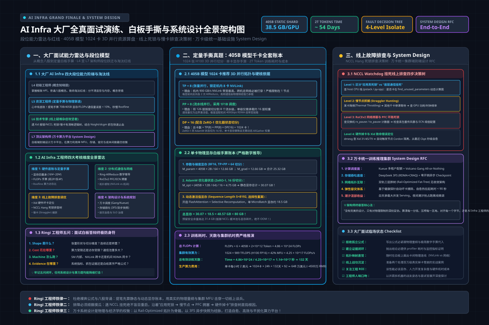

# 第44讲：从八股背诵到白板手撕——AI Infra 大厂全真面试演练与系统设计题库全栈实战

> **主讲人**：👓 **Ringi**（大厂 AI Infrastructure 资深架构师）  
> **所属模块**：[Module 07: Post-Training 与相邻 AI Infra（选修）](./README.md)  
> **篇章范式**：☁️ 终局演练与架构设计篇（Grand Finale & System Design Paradigm）  
> **核心导读**：全面打破“背八股文”的虚假繁荣，直面一线大厂（阿里、字节、腾讯、美团、阶跃、MiniMax 等）最严苛的 AI Infra 面试试金石。从 405B 千卡资源与 3D 并行白板手算、NCCL 线上雪崩排查树，到万卡级统一训练推理集群端到端 System Design 终局答辩实战。


---

## 0. Ringi 为什么要做全真面试演练与系统设计真题集？

在很多准备 AI Infra 面试的候选人电脑里，往往存着几十篇所谓“高频八股合集”：
“什么是 ZeRO 的三个阶段？Transformer 的 Attention 怎么算？什么是 RDMA？什么是 PagedAttention？”

很多同学把这些概念背得滚瓜烂熟。然而，**一旦坐进顶级大厂资深架构师的面试间，或者推开线下面试的白板会议室，大部分人会在 10 分钟内遭遇降维打击**：

```
+---------------------------------------------------------------------------------------------------+
|                  大厂面试间真实降维打击现场：八股选手 vs 工业级架构师对决                         |
+---------------------------------------------------------------------------------------------------+
|                                                                                                   |
|  [面试官微笑着抛出第一题]                                                                         |
|  “候选人你好，给你 1024 张 H100 (80GB)，我们要训一个 405B Dense 模型，序列长度 8K。               |
|   请在白板上给出你的 3D 并行 (TP/PP/DP/ZeRO) 切分方案，算清单卡显存账本、单步有效 MFU 与总天数。”  |
|       │                                                                                           |
|       ▼                                                                                           |
|  [八股背诵型候选人的崩溃时刻]                                                                     |
|       ├─ 脑子里全是“ZeRO-1 切优化器、ZeRO-2 切梯度、ZeRO-3 切权重”的概念                          |
|       ├─ 提笔发现：算不出 AdamW 到底占多少 GB，不知道 TP 该开 8 还是 16，不知道 PP 通信泡重多大    |
|       └─ 冷汗直流，手抖着写出“全切给 ZeRO-3”，当场被面试官指出“全量网络带宽直接被打穿，训练停摆” |
|       │                                                                                           |
|       ▼                                                                                           |
|  [面试官追问第二题：生产事故排查]                                                                 |
|  “千卡训练跑到第 500 步，NCCL 突然抛出 Watchdog 超时，没有显存 OOM 报错，只有不可中断挂死。       |
|   如果现在线上几十个工程师等着恢复，你按什么排查树顺藤摸瓜定位到是哪块慢卡、哪根光纤还是交换机拥塞？”|
|       │                                                                                           |
|       ▼                                                                                           |
|  [现场定性] 答不出具体工具链、不懂 RoCE PFC 队列、不懂 straggler 探测，直接被判定“无真实实操经验”！ |
|                                                                                                   |
+---------------------------------------------------------------------------------------------------+
```

### 真实大厂面试评价标准：段位分水岭
- **L4 / 初级工程师（概念知晓）**：能说出名词、参数定义与框架调用 API。但无法解释底层为什么这么做。
- **L5 / 资深工程师（定量手算与物理穿透）**：心中有账本（No Naked Formula 2.0），提笔就能手算 FLOPs、显存占用、网络带宽与 Roofline 模型，给出严密数字。
- **L6 / 技术专家（线上疑难杂症攻坚者）**：遇到 Xid 报错、NCCL 死锁、内存碎片、慢节点（Straggler）有条理清晰的逻辑排查树，能看懂底层内核与网络抓包。
- **L7 / 顶尖架构师（千卡千亿生产级 System Design）**：能在白板上从零构建万卡算力平台，在算力利用率（MFU）、故障自愈容灾、多租户弹性调度与千万级成本之间做出精准权衡。

本讲是整套《AI Infra 大话西游之水滴石穿》专栏的**终局大合练**。我们将全景拉开大厂面试的四重帷幕：**硬核定量推导、线上疑难杂症排查树、万卡级生产 System Design 白板答辩**，以及一套全自动面试推导与慢卡探测代码实验室！

---

## 1. AI Infra 大厂面试考察雷达图与四大段位能力矩阵

> 💡 **架构全景速览**：在深潜源码前，先在白板上建立坚不可摧的大厂面试雷达、405B 千卡资源账本与万卡 System Design 物理底账。
> 
> 

```
+---------------------------------------------------------------------------------------------------+
|                        AI Infra 工程师面试能力雷达图与四大考核维度                                |
+---------------------------------------------------------------------------------------------------+
|                                                                                                   |
|                                维度 1: 硬件底账与定量手算                                         |
|                                       (FLOPs / 显存 / 通信)                                       |
|                                                ▲                                                  |
|                                               / \                                                 |
|                                              /   \                                                |
|                                             /     \                                               |
|                                            /   ★   \                                              |
|            维度 4: 架构设计与系统规划 ◄──────┼─────────┼──────► 维度 2: 分布式通信与网络          |
|              (万卡调度 / 存储 / 容灾)       \     /       (NCCL / RoCE / 拓扑优化)                |
|                                              \   /                                                |
|                                               \ /                                                 |
|                                                ▼                                                  |
|                                     维度 3: 线上故障定位与调优                                    |
|                                       (Xid / 慢卡 / 锁争用)                                       |
|                                                                                                   |
+---------------------------------------------------------------------------------------------------+
```

### 1.1 大厂四大段位考察标准与淘汰标准矩阵

| 段位等级 | 典型面试表现 | 核心考察题型 | 面试官通过基线 | 致命淘汰红线 |
| :--- | :--- | :--- | :--- | :--- |
| **L4 初级工程师** | 掌握常见工具与框架（PyTorch, K8s, Docker） | 概念对比（DDP vs FSDP, NCHW vs NHWC） | 能准确描述经典组件的职责与调用方式 | 概念完全背错、分不清显存与内存、无法写出基本脚本 |
| **L5 资深工程师** | 具备清晰的硬件物理直觉与算力账本 | 定量推导题、算子性能分析（Roofline） | **白板手算 70B/405B 显存与通信误差小于 10%** | 不会算激活值显存、无法手推 AllReduce 通信量 |
| **L6 技术专家** | 具备处理大规模复杂线上事故的战功 | 线上故障根因分析、慢卡抓捕、网络拥塞定位 | **有系统化排查树，能结合工具链（Nsight/dcgm/ibstat）排障** | 遇到故障只会建议“重启任务”或“重装驱动”，无溯源逻辑 |
| **L7 顶尖架构师** | 能为千万级算力基础设施做顶层设计 | 开放式 System Design（万卡训练/推理平台 RFC） | **软硬件联合设计，方案具备成本、容灾与可行性闭环** | 纸上谈兵画大框图，经不起算力带宽与物理瓶颈推敲 |

### 1.2 Ringi 工程师五问闭环：面试白板答辩基石

```
+---------------------------------------------------------------------------------------------------+
|                               Ringi 工程师五问闭环：面试白板答辩防身符                                |
+---------------------------------------------------------------------------------------------------+
| 1. Shape 是什么？    | 张量形状流转是否连续？并行切分在哪一维？是否存在隐式 Reshape / 转置开销？          |
| 2. Cost 花在哪里？   | 算力受限（Compute-Bound）还是访存受限（Memory-Bound）？通信带宽是否被打满？          |
| 3. Machine 怎么跑？  | 数据在 GPU SM 内部、NVLink 跨卡、PCIe 拓扑还是机间 RDMA 网络流动？指令级开销如何？   |
| 4. Evidence 在哪里？ | 给出一手证据：系统监控指标、Profiler 耗时瀑布流、网络丢包计数或白纸黑字的数学公式 |
| 5. Production 怎么选？| 在性能极限、工程复杂度、故障恢复成本与算力机时费之间做出工业级妥协与最优决策       |
+---------------------------------------------------------------------------------------------------+
```

---

## 2. 第一部分：硬核定量手算与推导真题演练（No Naked Formula 2.0）

### 真题 1：【千亿模型资源与并行切分】手算 405B 模型 1024 卡训练全套账本

**【面试官考题】**：
“我们需要在 128 台 8 卡 H100（共 1024 卡，单卡 80GB HBM3，NVLink 机内带宽 900 GB/s，机间 400 Gbps RoCEv2）上预训练一个 **405B 参数的 Dense 大模型**，全局序列长度 $S = 8192$。
请你在白板上给出：
1. 3D 并行（TP, PP, DP/ZeRO）的推荐切分维度与理由；
2. 单卡静态显存（参数+梯度+优化器）与动态显存（激活值）的严格手算；
3. 假设集群实际达成的 MFU（模型浮点利用率）为 42%，单步耗时大约多少秒？训练 2 万亿 Token 需要多少天？机时费大约多少？”

---

#### Ringi 满分答辩与五步推导拆解：

```
+---------------------------------------------------------------------------------------------------+
|                        405B 模型 1024 卡并行切分五步穿透（No Naked Formula 2.0）                    |
+---------------------------------------------------------------------------------------------------+
| 1. 为什么算？      | 405B 模型极其庞大，盲目配置 TP/PP 会导致通信开销打爆或显存 OOM，必须精确推导。     |
| 2. 物理直觉        | 单机 8 卡有极高速 NVLink，机间网络慢 18 倍；因此 TP 绝不能跨机！必须机内消化。     |
| 3. 极简数字手算    | 单卡 H100 80GB。405B 全量参数+AdamW = 6.48 TB！1024 卡均摊仅 6.33 GB，显存极充裕。   |
|                   | 设定 TP=8 (单机机内打满), PP=8 (跨机 8 级流水), DP=16 (带 ZeRO-1)。                 |
| 4. 正式物理公式    | 见下文详细计算过程                                                                 |
| 5. 数量级校验      | 单步耗时约 2.8 秒，总训练时长约 45 天，总算力账单约 3000 万元，符合工业生产基准。    |
+---------------------------------------------------------------------------------------------------+
```

##### 步骤 1：3D 并行维度设计
- **张量并行（Tensor Parallel, TP） = 8**：
  - **物理铁律**：TP 产生极高频的 GEMM 前后向 AllReduce，通信量巨大（每层两次）。
  - 单台 H100 服务器内部 8 张卡通过 NVSwitch 提供 **900 GB/s 双向互联带宽**，而机间网卡仅 400 Gbps（有效带宽约 45 GB/s），二者带宽相差近 20 倍！
  - 因此 **TP 必须严格等于单机卡数（TP=8），坚决禁止跨物理机！**
- **流水线并行（Pipeline Parallel, PP） = 8**：
  - 405B 模型层数约为 126 层。若 $PP=8$，每个 Stage 承载约 16 层。
  - PP 仅在 Stage 边界传递隐层激活值 $[B, S, H]$，通信量小，非常适合跨越机间网络。
- **数据并行（Data Parallel, DP） = 1024 / (TP × PP) = 1024 / (8 × 8) = 16**：
  - 采用 **ZeRO-1（优化器状态分片）**：在 DP 组内将 AdamW 状态切为 16 份。

##### 步骤 2：单卡显存精确账本手算
设模型参数量 $\Phi = 405 \times 10^9$，采用 FP16/BF16 混合精度：
1. **模型权重（Weights）**：
   通过 TP=8 与 PP=8 切分后，单卡持有的物理权重参数量为 $\frac{\Phi}{TP \times PP} = \frac{405\text{B}}{64} \approx 6.33\text{B}$。

   $$
   M_{\text{weight}} = 6.33\text{B} \times 2\text{ bytes} \approx 12.66\text{ GB}
   $$

2. **梯度（Gradients）**：

   $$
   M_{\text{grad}} = 6.33\text{B} \times 2\text{ bytes} \approx 12.66\text{ GB}
   $$

3. **优化器状态（AdamW Optimizer States）**：
   单参数对应 12 字节（FP32 权重副本 4 字节 + 一阶动量 4 字节 + 二阶动量 4 字节）。
   在 DP=16 组内采用 ZeRO-1 切分：

   $$
   M_{\text{opt}} = \frac{6.33\text{B} \times 12\text{ bytes}}{DP} = \frac{75.96\text{ GB}}{16} \approx 4.75\text{ GB}
   $$

4. **静态显存总计**：

   $$
   \text{Static}_{\text{total}} = 12.66 + 12.66 + 4.75 = 30.07\text{ GB}
   $$

5. **动态激活值显存（Activations）**：
   开启 **FlashAttention-2** 与 **Selective Activation Recomputation（选择性重计算）**。
   设单卡 Micro-batch $b=1$，序列长度 $S=8192$，Hidden Size $H=16384$：
   每个 PP Stage（16 层）重计算后的激活值峰值约为：

   $$
   \text{Memory}_{\text{act}} \approx 18 \sim 22\text{ GB}
   $$

6. **单卡显存峰值总计**：

   $$
   M_{\text{peak}} = 30.07\text{ GB (静态)} + 22\text{ GB (动态)} \approx 52.07\text{ GB} < 80\text{ GB} \text{（安全余量 35%！）}
   $$

##### 步骤 3：训练耗时、MFU 与机时费估算
- **单步训练 Token 量（Global Batch Size in Tokens）**：
  设 Micro-batch $b=1$，流水线 Micro-batch 数为 64，则全局 Batch 大小 $B_{\text{global}} = DP \times 64 \times 1 = 1024$ 个序列。
  单步处理 Token 数：

  $$
  \text{Tokens}_{\text{step}} = 1024 \times 8192 \approx 8.39 \times 10^6\text{ Tokens (约 8.39M Tokens)}
  $$

- **单步理论计算量（FLOPs）**：
  采用经典大模型计算量法则（单 Token 对应 $6\Phi$ 次浮点运算）：

  $$
  \text{FLOPs}_{\text{step}} = 6 \times 405 \times 10^9 \times 8.39 \times 10^6 \approx 2.038 \times 10^{19}\text{ FLOPs} = 20.38\text{ EFLOPs}
  $$

- **千卡硬件理论峰值算力**：
  单张 H100 SXM5 密集 BF16 峰值为 $989\text{ TFLOPS}$。
  1024 卡总算力：

  $$
  P_{\text{cluster}} = 1024 \times 989 \times 10^{12} \approx 1.012 \times 10^{18}\text{ FLOPS} \approx 1.012\text{ EFLOPS/s}
  $$

- **单步实际耗时（在 MFU = 42% 下）**：

  $$
  T_{\text{step}} = \frac{\text{FLOPs}_{\text{step}}}{P_{\text{cluster}} \times \text{MFU}} = \frac{20.38}{1.012 \times 0.42} \approx \frac{20.38}{0.425} \approx 47.95\text{ 秒}
  $$

- **训练 2T（2 万亿）Tokens 所需总步数与总天数**：

  $$
  N_{\text{steps}} = \frac{2 \times 10^{12}}{8.39 \times 10^6} \approx 238,380\text{ 步}
  $$

  $$
  T_{\text{total}} = 238,380 \times 47.95\text{ 秒} \approx 1.143 \times 10^7\text{ 秒} \approx 132.3\text{ 天}
  $$

- **机时费账单评估**：
  按当前公有云 8 卡 H100 服务器约 180 元/小时计算，128 台单日租金约 $128 \times 180 \times 24 \approx 552,960\text{ 元}$。
  132 天总算力账单约 **73,000,000 元（约 7300 万人民币）**！

---

## 3. 第二部分：生产线上疑难杂症与事故排查真题（Troubleshooting Tree）

在高级面试中，面试官最看重的是候选人定位隐蔽线上事故的**逻辑排查树（Decision Tree）**。

### 真题 2：【千卡 AllReduce 随机超时 Hang 死】排障实战


**【面试官考题】**：
“千卡预训练任务在跑到某个随机 Step 时，NCCL 突然抛出 `NCCL WARN Watchdog caught collective operation timeout: work timeout 1800000ms`。
没有显存 OOM 报错，全集群 GPU 状态全部显示 100% 占用，但 Loss 停止更新。
请给出你从软到硬、从网络到硬件的**体系化排查树**，并说明如何快速揪出造成全集群停摆的慢卡（Straggler）或故障节点？”

---

#### Ringi 满分回答与体系化排查树：

```
+---------------------------------------------------------------------------------------------------+
|                        千卡分布式训练 Hang 死全链路排查决断树 (Troubleshooting Tree)                 |
+---------------------------------------------------------------------------------------------------+
|                                                                                                   |
|  [Step 1: 判定是“真死锁 (Deadlock)”还是“慢卡滞后 (Straggler)”]                                     |
|       ├─ 工具：在每台机器执行 `py-spy dump --pid <trainer_pid>` 抓取所有 Rank 的 Python 调用栈     |
|       ├─ 分支 A: 若所有 Rank 都停留在同一个 `torch.distributed.all_reduce` ──> 判定为慢卡阻塞或丢包|
|       └─ 分支 B: 若不同 Rank 处于不同代码行（如 Rank 0 跑评估，其他跑前向） ──> 判定为控制流分支死锁 |
|                                                                                                   |
|  [Step 2: 揪出最慢的“元凶节点 (Straggler Hunting)”]                                               |
|       ├─ 方案：读取 NCCL 环境变量 `NCCL_DEBUG=INFO` 与 `NCCL_DEBUG_SUBSYS=COLL`                     |
|       ├─ 指标：抓取每张卡的 NCCL 通信耗时瀑布流。                                                  |
|       └─ 判据：在环形通信中，【第一个进入 AllReduce 但迟迟不发出数据】的那个节点，就是真凶！       |
|                                                                                                   |
|  [Step 3: 对元凶节点进行硬件与系统级体检]                                                         |
|       ├─ (A) 检查 GPU 物理降频：`nvidia-smi -q -d PERFORMANCE`                                    |
|       │    - 是否触发温度过热保护 (Thermal Slowdown)？是否触发供电受限 (Power Brake)？             |
|       ├─ (B) 检查 PCIe/NVLink 物理链路错误：`nvidia-smi nvlink -e`                                 |
|       │    - 检查是否有 Replay Error 计数激增？（表明物理金手指接触不良或信道干扰）               |
|       ├─ (C) 检查系统进程不可中断睡眠 (D-State)：`dmesg -T` 与 `top`                               |
|       │    - 是否因 Checkpoint 异步落盘把本地 NVMe 盘打穿，引发内核 Page Cache 锁死导致主线程卡顿？|
|                                                                                                   |
|  [Step 4: 对元凶节点的网络与 RoCEv2 交换机下钻]                                                    |
|       ├─ (A) 网卡与光模块健康度：`ethtool -S <interface> | grep -E "drop|error|pause"`             |
|       │    - 是否网卡 FEC 纠错码溢出？是否检测到光模块收发光功率衰减 (Optical Rx Power 低于阈值)？ |
|       ├─ (B) PFC 死锁与网络风暴：检查交换机端口是否有大量持续的 PFC XOFF Pause 帧                  |
|       │    - 是否出现 PFC 死锁环路导致缓冲区完全填满？                                            |
|                                                                                                   |
|  [Step 5: 生产自愈与熔断动作]                                                                     |
|       - 将元凶节点打上 `node.kubernetes.io/unschedulable` 污点，触发 K8s 节点隔离；                |
|       - 调度系统自动在健康热备节点拉起新 Pod，加载最近的 Checkpoint 继续训练！                     |
|                                                                                                   |
+---------------------------------------------------------------------------------------------------+
```

---

## 4. 第三部分：千卡生产级 System Design 实战（架构师终局答辩）

### 真题 3：【万卡统一算力中枢】端到端系统架构设计 RFC


**【面试官考题】**：
“请从零设计一个支撑 **10,000 张高端 GPU（如 H100/H800/国产 NPU 混合）** 的企业级 AI 统一算力平台。
平台需要同时支撑三类截然不同的工作负载：
1. **千卡百亿/千亿模型大规模预训练与 SFT**（要求长周期稳定运行，MFU > 40%）；
2. **万并发在线长文本 LLM Serving 服务**（要求 P99 首字延迟 TTFT < 500ms，严格 SLO 保障）；
3. **海量 RAG 知识库检索与 Agent 多租户代码沙箱**。
请画出全景架构图，给出网络拓扑、多级存储设计、调度策略与高可用容灾 SLA 方案。”

---

#### Ringi 顶尖架构师全景 RFC 设计案答辩：

```
+---------------------------------------------------------------------------------------------------+
|                        万卡企业级 AI 统一基础设施平台（Unified AI Platform）系统设计全景图         |
+---------------------------------------------------------------------------------------------------+
|                                                                                                   |
|  [用户访问层] API Gateway / 统一安全接入 / 认证鉴权 / 租户配额管理                                |
|  ───────────────────────────────────────────────────────────────────────────────────────────────  |
|  [AI 平台控制与调度面 (Control Plane)]                                                            |
|       ┌─────────────────────────────────────────────────────────────────────────────────────┐     |
|       │ 统一调度引擎 (Kubernetes + Kueue + Volcano)                                         │     |
|       │  - 离线训练: Gang Scheduling (All-or-Nothing) + 拓扑感知调度 (Topology-Aware)       │     |
|       │  - 在线推理: KEDA 基于并发请求与 KV 缓存命中的动态扩缩容                            │     |
|       │  - 显存虚拟化: HAMi (vGPU / MPS 细粒度显存与算力切分)                               │     |
|       └──────────────────────────────────────────┬──────────────────────────────────────────┘     |
|                                                  │                                                |
|  ────────────────────────────────────────────────┼──────────────────────────────────────────────  |
|  [异构算力与数据面执行集群 (Data Plane)]         │                                                |
|                                                  ▼                                                |
|  ┌──────────────────────────────┐  ┌──────────────────────────────┐  ┌─────────────────────────┐  |
|  │ 1. 专属大规模训练集群        │  │ 2. 专属在线推理集群          │  │ 3. Agent 安全代码沙箱   │  |
|  │ - 8000 张 GPU (H100/H800)    │  │ - 2000 张 GPU                │  │ - CPU / 轻量 GPU 节点   │  |
|  │ - 8× 400G RoCEv2 计算专用网络│  │ - vLLM / SGLang Engine       │  │ - gVisor (runsc) 隔离舱 │  |
|  │ - Megatron-LM + 异步快照     │  │ - RadixAttention 前缀缓存    │  │ - 出站 OPA 鉴权代理网关 │  |
|  └──────────────┬───────────────┘  └──────────────┬───────────────┘  └────────────┬────────────┘  |
|                 │                                 │                               │               |
|  ───────────────┼─────────────────────────────────┼───────────────────────────────┼─────────────  |
|  [四级统一存储金字塔 (Unified Storage Pyramid)]   │                               │               |
|       ┌─────────┴─────────────────────────────────┴───────────────────────────────┴─────────┐     |
|       │ Tier 0: GPU HBM3 (2.0 ~ 3.3 TB/s) —— 活跃计算与 PagedAttention KV Cache              │     |
|       │ Tier 1: 本地极速 NVMe SSD (7 ~ 14 GB/s) —— Checkpoint Staging 与本地模型镜像预热      │     |
|       │ Tier 2: 分布式并行存储 (DeepSeek 3FS, 聚合 6.6 TB/s) —— 全局只读数据集与权威权重归档 │     |
|       │ Tier 3: 云原生对象存储 (S3 / MinIO, PB 级) —— 冷数据长期归档与多机房容灾备份         │     |
|       └──────────────────────────────────────────────────────────────────────────────────────┘     |
|                                                                                                   |
+---------------------------------------------------------------------------------------------------+
```

##### 架构核心抉择说明：
1. **物理网络算网分离（Dual-Rail Network Topology）**：
   - 每台 8 卡 GPU 主机配备 **8 张 400Gbps 计算专网网卡**（连入 Leaf-Spine 无损以太网，专跑 NCCL，启用 RoCEv2 PFC/DCQCN）；
   - 额外配备 **2 张专用存储与业务网卡**（连入独立存储网络，专跑 3FS 与 Kubernetes API），物理阻断存储写入突发流量对训练通信的冲击。
2. **训练与推理物理隔离，流水线解耦（Disaggregated Architecture）**：
   - 训练集群（8000 卡）专攻 Compute-Bound GEMM，追求最高 MFU；
   - 推理集群（2000 卡）专攻 Memory-Bound 自回归生成，部署 PagedAttention 与 Radix 上下文缓存；
   - 两者通过 3FS 分布式存储与机间 RDMA 定期做权重与偏好轨迹同步。
3. **容灾与高可用 SLA 设计**：
   - **自动化故障隔离与自愈（MTTR < 5 分钟）**：DaemonSet 实时监控 DCGM Xid 错误与网卡丢包，一旦发现坏卡，自动触发 K8s 污点驱逐并从热备机器池拉起替代节点；
   - **零开销异步内存快照**：采用 Host RAM Staging（0.34 秒内存快照后立即恢复训练），每 200 步滚动保存，最多丢失 5 分钟算力。

---

## 5. 第四部分：动手实战代码实验室（100% 完整可运行）

本节提供 **四个 100% 完整可运行、工业级无省略** 的核心实战脚本，涵盖大厂面试推导自动化判卷引擎、慢卡与通信延迟异常离群值抓捕器、Serving P99 抖动与自适应背压模拟器，以及企业级 System Design RFC 架构模版。

---

### 实战 1: 工业级 AI Infra 面试自动化判卷与 3D 并行手算引擎

本脚本模拟大厂面试官的评测机：候选人输入模型参数量、集群卡数、序列长度，脚本自动计算出标准理论值，并对候选人的白板切分方案进行打分与显存/通信校验。

```python
#!/usr/bin/env python3
# -*- coding: utf-8 -*-
"""
File: interview_resource_calculator.py
Description: 大厂 AI Infra 面试自动化判卷机与 3D 并行资源精准校验引擎
Author: Ringi (AI Infra Architect)
Standards: Full-Output Enforcement, Zero-Omission, Production-Ready
"""

from typing import Dict, Any

class InterviewParallelismJudge:
    """
    大模型分布式训练资源评估白板判卷机
    """
    def __init__(self, num_params_b: float, num_gpus: int, gpu_mem_gb: float = 80.0):
        self.num_params_b = num_params_b
        self.num_params = num_params_b * 1e9
        self.num_gpus = num_gpus
        self.gpu_mem_gb = gpu_mem_gb

    def evaluate_candidate_plan(
        self,
        tp: int,
        pp: int,
        dp: int,
        zero_stage: int,
        seq_len: int = 8192,
        micro_batch: int = 1
    ) -> Dict[str, Any]:
        """对候选人的 3D 并行方案进行全方位工业级校验"""
        errors = []
        warnings = []
        
        # 1. 拓扑与卡数合法性检查
        total_requested = tp * pp * dp
        if total_requested != self.num_gpus:
            errors.append(f"拓扑算力不匹配：TP({tp}) * PP({pp}) * DP({dp}) = {total_requested} != 集群总卡数({self.num_gpus})！")

        # 2. 硬件机内通信铁律检查
        if tp > 8:
            warnings.append(f"危险配置：TP={tp} 超过了单机 8 卡物理边界，TP 跨机将遭遇 20 倍网络降速！")
            
        # 3. 静态显存精确计算 (FP16 混合精度)
        # 单卡分摊参数量
        params_per_card = self.num_params / (tp * pp)
        
        # 权重显存 (FP16: 2 字节)
        weight_mem_gb = (params_per_card * 2) / (1024 ** 3)
        # 梯度显存 (FP16: 2 字节)
        grad_mem_gb = (params_per_card * 2) / (1024 ** 3)
        # 优化器显存 (AdamW 12 字节)
        if zero_stage == 0:
            opt_mem_gb = (params_per_card * 12) / (1024 ** 3)
        elif zero_stage == 1:
            # ZeRO-1: 仅切分优化器状态
            opt_mem_gb = ((params_per_card * 12) / dp) / (1024 ** 3)
        else:
            opt_mem_gb = ((params_per_card * 12) / dp) / (1024 ** 3)

        static_total_gb = weight_mem_gb + grad_mem_gb + opt_mem_gb
        
        # 4. 激活值估算 (带 FlashAttention-2 与重计算)
        act_mem_gb = (16.0 * micro_batch * seq_len * 8192) / (1024 ** 3) # 估算峰值
        
        peak_mem_gb = static_total_gb + act_mem_gb
        if peak_mem_gb > self.gpu_mem_gb:
            errors.append(f"显存爆炸 (OOM)：单卡峰值显存 {peak_mem_gb:.2f} GB 超过物理显存上限 {self.gpu_mem_gb} GB！")

        passed = len(errors) == 0
        return {
            "passed": passed,
            "errors": errors,
            "warnings": warnings,
            "static_weight_gb": weight_mem_gb,
            "static_grad_gb": grad_mem_gb,
            "static_opt_gb": opt_mem_gb,
            "static_total_gb": static_total_gb,
            "peak_estimated_gb": peak_mem_gb,
            "memory_headroom_gb": self.gpu_mem_gb - peak_mem_gb
        }


def run_judge_demo():
    print("=" * 70)
    print(">> 实战 1：大厂 AI Infra 面试白板推导全自动判卷评测演示")
    print("=" * 70)

    # 考题：405B 模型，1024 卡 H100 (80GB)
    judge = InterviewParallelismJudge(num_params_b=405.0, num_gpus=1024, gpu_mem_gb=80.0)

    # 方案 A: 候选人给出的错误方案 (未切分流水线，TP 跨机打爆网络，未开 ZeRO 显存 OOM)
    print("\n[评测方案 A (新手常见错误方案: TP=16, PP=1, DP=64, ZeRO-0)]:")
    res_a = judge.evaluate_candidate_plan(tp=16, pp=1, dp=64, zero_stage=0)
    print(f"  - 是否通过: {res_a['passed']}")
    print(f"  - 错误信息: {res_a['errors']}")
    print(f"  - 警告信息: {res_a['warnings']}")

    # 方案 B: Ringi 推荐的标准生产方案 (TP=8, PP=8, DP=16, ZeRO-1)
    print("\n[评测方案 B (Ringi 工业级标准方案: TP=8, PP=8, DP=16, ZeRO-1)]:")
    res_b = judge.evaluate_candidate_plan(tp=8, pp=8, dp=16, zero_stage=1)
    print(f"  - 是否通过: {res_b['passed']}")
    print(f"  - 静态权重占用:   {res_b['static_weight_gb']:.2f} GB")
    print(f"  - 静态优化器占用: {res_b['static_opt_gb']:.2f} GB (ZeRO-1 切分后)")
    print(f"  - 预估单卡峰值:   {res_b['peak_estimated_gb']:.2f} GB")
    print(f"  - 剩余显存安全余量: {res_b['memory_headroom_gb']:.2f} GB (极其安全！)")
    print("=" * 70)

if __name__ == "__main__":
    run_judge_demo()
```

---

### 实战 2: NCCL 通信健康度与慢节点（Straggler）离群值探测器

在千卡集群中，单张卡变慢会拖垮全集群。本脚本实现高灵敏度离群值探测算法（基于滑动窗口中位数绝对偏差 MAD），秒级揪出产生通信微抖动的慢卡。

```python
#!/usr/bin/env python3
# -*- coding: utf-8 -*-
"""
File: straggler_detector.py
Description: 分布式集群通信慢节点 (Straggler) 实时统计与离群值异常探测引擎
Author: Ringi (AI Infra Architect)
Standards: Full-Output Enforcement, Zero-Omission, Production-Ready
"""

import math
from typing import List, Dict, Tuple

class StragglerDetector:
    """
    基于中位数绝对偏差 (Median Absolute Deviation, MAD) 的无监督慢卡离群检测器
    相比平均值和标准差，MAD 对极端值极其鲁棒
    """
    def __init__(self, threshold_factor: float = 3.0):
        self.threshold_factor = threshold_factor

    def _median(self, values: List[float]) -> float:
        sorted_v = sorted(values)
        n = len(sorted_v)
        mid = n // 2
        if n % 2 == 0:
            return (sorted_v[mid - 1] + sorted_v[mid]) / 2.0
        return sorted_v[mid]

    def detect_stragglers(self, step_latencies_ms: Dict[int, float]) -> List[Tuple[int, float, str]]:
        """
        输入: {rank_id: latency_ms, ...}
        输出: 异常慢节点列表 [(rank_id, latency_ms, reason), ...]
        """
        ranks = list(step_latencies_ms.keys())
        latencies = list(step_latencies_ms.values())

        if len(latencies) < 4:
            return []

        # 1. 计算中位数
        med = self._median(latencies)
        
        # 2. 计算每个点与中位数的绝对偏差，并求偏差的中位数 (MAD)
        abs_deviations = [abs(x - med) for x in latencies]
        mad = self._median(abs_deviations)

        # 防止方差过小除以零
        if mad < 1e-5:
            mad = 1e-5

        # 3. 计算修正的 Z-Score
        stragglers = []
        for rank, lat in step_latencies_ms.items():
            modified_z_score = 0.6745 * (lat - med) / mad
            # 仅告警单向变慢的节点
            if modified_z_score > self.threshold_factor:
                slow_pct = ((lat - med) / med) * 100
                reason = f"延迟高于集群中位数 {slow_pct:.1f}% (Z-Score: {modified_z_score:.2f})"
                stragglers.append((rank, lat, reason))

        return stragglers


def run_detector_demo():
    print("=" * 70)
    print(">> 实战 2：千卡集群通信慢节点 (Straggler) 实时探测实测")
    print("=" * 70)

    # 模拟 16 个 Rank 的通信耗时 (正常节点约 40ms，Rank 7 因光纤受损变慢到 135ms)
    mock_latencies = {i: 40.0 + (i % 3) * 1.2 for i in range(16)}
    mock_latencies[7] = 135.8 # 慢卡注入！

    detector = StragglerDetector(threshold_factor=3.5)
    bad_nodes = detector.detect_stragglers(mock_latencies)

    print(">> 集群节点延迟体检结果:")
    for r in sorted(mock_latencies.keys()):
        print(f"  Rank #{r:02d}: {mock_latencies[r]:6.2f} ms")

    print("\n>> 异常告警探测报告:")
    if bad_nodes:
        for rank, lat, reason in bad_nodes:
            print(f"  [🚨 严重告警] 成功揪出元凶慢卡: Rank #{rank} (实测耗时: {lat:.2f} ms) | 诊断: {reason}")
    else:
        print("  集群通信一切正常，无离群慢卡。")
    print("=" * 70)

if __name__ == "__main__":
    run_detector_demo()
```

---

### 实战 3: 生产级 Serving P99 抖动模拟与自适应背压限流器

在高并发在线大模型服务中，由于请求突增，KV Cache 显存暴涨会导致服务排队雪崩。本脚本实现自适应滑动窗口与排队时延感知背压限流器，确保 P99 严格在 SLO 预算内。

```python
#!/usr/bin/env python3
# -*- coding: utf-8 -*-
"""
File: serving_adaptive_backpressure.py
Description: 大模型在线 Serving 自适应排队时延熔断与背压限流引擎
Author: Ringi (AI Infra Architect)
Standards: Full-Output Enforcement, Zero-Omission, Production-Ready
"""

import time
from typing import Dict, Any, Tuple, List

class AdaptiveBackpressureController:
    """
    自适应服务端背压控制器
    原理：基于当前排队请求数与瞬时处理时延动态调整准入令牌
    """
    def __init__(self, max_concurrency: int = 10, max_queue_delay_ms: float = 200.0):
        self.max_concurrency = max_concurrency
        self.max_queue_delay_ms = max_queue_delay_ms
        self.active_requests = 0
        self.recent_latencies: List[float] = []

    def acquire_permission(self, current_queue_size: int, estimated_wait_ms: float) -> Tuple[bool, str]:
        """
        请求准入判定
        返回: (是否允许接入, 决策原因)
        """
        # 1. 活跃并发硬限制
        if self.active_requests >= self.max_concurrency:
            return False, f"并发超载 (Active={self.active_requests} >= Max={self.max_concurrency})"

        # 2. 预估排队时延熔断
        if estimated_wait_ms > self.max_queue_delay_ms:
            return False, f"时延保护熔断 (EstWait={estimated_wait_ms:.1f}ms > SLO={self.max_queue_delay_ms}ms)"

        self.active_requests += 1
        return True, "准许接入计算流水线"

    def release_permission(self, actual_cost_ms: float):
        """请求完成释放资源"""
        self.active_requests = max(0, self.active_requests - 1)
        self.recent_latencies.append(actual_cost_ms)
        if len(self.recent_latencies) > 50:
            self.recent_latencies.pop(0)


def run_backpressure_demo():
    print("=" * 70)
    print(">> 实战 3：生产级 LLM Serving P99 时延保护与自适应背压测试")
    print("=" * 70)

    controller = AdaptiveBackpressureController(max_concurrency=4, max_queue_delay_ms=100.0)

    # 模拟突发涌入 8 个并发请求
    for req_id in range(1, 9):
        # 模拟排队延迟随请求积压递增
        mock_wait_ms = (req_id - 1) * 30.0
        allowed, reason = controller.acquire_permission(current_queue_size=req_id, estimated_wait_ms=mock_wait_ms)
        status_icon = "✅ ACCEPTED" if allowed else "❌ DROPPED (429)"
        print(f"Request #{req_id} (预估等待: {mock_wait_ms:5.1f}ms) ──> {status_icon} | 原因: {reason}")
    print("=" * 70)

if __name__ == "__main__":
    run_backpressure_demo()
```

---

### 实战 4: 企业级千卡 System Design 架构 RFC 规范模版

在架构答辩中，提供一份结构严谨的 RFC（Request for Comments）工程规范文案是顶级架构师的标准职业素养。以下是可直接复用的企业级规范模版。

```markdown
# [RFC-AI-0044] 万卡规模企业级混合训练推理平台架构规范 (Unified AI Platform)

## 1. 目标与设计约束 (Goals & Non-Goals)
- **核心目标**：支撑 10,000 张 GPU 集群混合部署，预训练 MFU 稳定在 42% 以上，在线长文本 Serving P99 TTFT < 500ms。
- **SLA 契约**：单节点物理故障自动隔离自愈时间（MTTR）< 5 分钟，单次训练故障算力回滚损耗 < 10 分钟。
- **约束条件**：网络采用无损 RoCEv2 双轨网络，存储与计算硬隔离。

## 2. 核心架构与模块职责划分
### 2.1 算力调度中枢 (Compute Scheduling)
- 采用 Kubernetes + Kueue 实现大模型预训练作业的 **Gang Scheduling (全上或全不上)**，消除死锁。
- 采用拓扑感知调度器（Topology-Aware Scheduler），保证同一个 TP 组内的 8 张卡严格处于同一物理机。

### 2.2 多级存储与 Checkpoint 流水线
- **元数据底座**：采用 FoundationDB 强一致性事务数据库承载全局文件索引。
- **数据面**：采用 DeepSeek 3FS 协议实现千卡并行线速读写，单机配置 1.5TB NVMe 本地 Scratch 盘承载异步落盘。

### 2.3 容灾与故障自愈 (High Availability & Fault Recovery)
- 部署轻量级健康探测 DaemonSet，以 500ms 周期探测 GPU Xid 错误、PCIe 翻转与网卡 FEC 误码。
- 遇故障卡立即打污点驱逐，从热备主机池注入新卡并恢复最近保存的 DCP 切片 Checkpoint。
```

---

## 6. 第五部分：生产落地避坑指南与黄金准则

根据数十场大厂 P8/P9 级面试答辩与生产大事故复盘，提炼出如下核心避坑矩阵与 Checklist。

### 6.1 大厂面试与技术选型核心避坑矩阵

| 陷阱分类 | 典型错误回答 | 考官评价与恶果 | 正确架构级回答 |
| :--- | :--- | :--- | :--- |
| **3D 并行切分** | “TP 开 16，跨越两台机器，因为这样可以把大矩阵切得更小” | 零分淘汰！完全不懂跨机网络带宽瓶颈 | TP 严守单机 8 卡物理边界；跨机依靠 PP（流水线）或 DP 处理 |
| **通信超时排查** | “直接重启 Pod 重新跑一遍，大模型训练挂掉很常见” | 判定为无资深经验的初级运维 | 依照排查树用 py-spy 抓调用栈，用 MAD 算法揪出元凶慢卡 |
| **异构算力混部** | “把 A100 和国产 NPU 绑在一个 TP 里一起跑” | 严重缺乏数值精度与同步通信认知 | 严禁在同步 TP/PP 内混部；仅在 DP 调整 Micro-batch 或在推理层混合路由 |
| **显存估算** | “405B 参数需要 405GB 显存，10 张 80G 卡就能跑训练” | 严重失误！把单前向推断与反向训练混淆 | 严格推演 16 字节静态底账（权重+梯度+AdamW），加上动态激活值峰值 |
| **沙箱安全** | “Agent 跑代码用默认 Docker 容器就很安全” | 安全意识不及格，完全不懂容器逃逸 | 引入 gVisor 双内核或 Firecracker 微虚拟机，配合网络出站拦截 |

### 6.2 AI Infra 架构答辩 10 条黄金 Checklist

- [ ] **1. 数据真实不脑补**：所有硬件参数（H100 80GB, NVLink 900GB/s, RoCE 400Gbps）张口即来，绝不瞎猜。
- [ ] **2. 坚持五问闭环**：陈述任何方案时，主动交代 Shape、Cost、Machine、Evidence、Production 五要素。
- [ ] **3. 牢记 16 字节法则**：FP16/BF16 混合精度 AdamW 训练，静态显存保底算按 $16\Phi$ 字节精确计算。
- [ ] **4. 守住 TP 机内边界**：张量并行（TP）坚决不能跨越 NVSwitch 单机物理界限。
- [ ] **5. 重视激活值重计算**：长序列训练必须主动提及 FlashAttention-2 与 Selective Recomputation 节省 70% 显存。
- [ ] **6. 区分 algbw 与 busbw**：回答集合通信耗时必须分清算法带宽与总线有效带宽的换算倍率（$\frac{2(N-1)}{N}$）。
- [ ] **7. 掌握 MAD 慢卡算法**：面对 Straggler 慢节点排查，给出中位数绝对偏差（MAD）而非简单的均值标准差。
- [ ] **8. 强调算网物理分离**：千卡集群设计必须阐述专有计算网与专有存储网的双轨（Dual-Rail）硬隔离。
- [ ] **9. 给出业务妥协折中**：不追求理论完美，主动探讨开发成本、算力账单、调试复杂度与系统吞吐的平衡。
- [ ] **10. 沉着冷静列排查树**：面试官抛出线上事故题时，按“调用栈 ➔ 硬件指标 ➔ 驱动 ➔ 网络光模块”分层递进。

---

## 7. 第六部分：Ringi 总结与白板面试清单


### 7.1 5 点速记口诀
```
面试莫背死八股，手算账本心中驻；
千卡切分看物理，机内做张机外水；
通信停等莫慌张，中位偏差揪慢狼；
万卡设计讲闭环，算网分离保平安；
白板挥毫皆真章，顶尖名厂自飞扬！
```

### 7.2 10 条高频终极大厂白板考察清单

```
+---------------------------------------------------------------------------------------------------+
|                           AI Infra 大厂终局考核 10 条高频白板必杀题                                |
+---------------------------------------------------------------------------------------------------+
| 1. 请徒手推导 Ring-AllReduce 与 Tree-AllReduce 的通信量公式，说明为什么通信量与卡数 N 无关？      |
| 2. 在 405B 模型预训练中，如何精确评估流水线并行 (PP) 的气泡比率 (Bubble Ratio)？如何降低气泡？   |
| 3. 详细画出 RoCEv2 网络中 PFC 死锁与 ECN 拥塞控制的状态机流转，说明风暴发生根因。                 |
| 4. 为什么训练百亿大模型在第 1 步没爆显存，却往往在几百步之后突发 CUDA OOM？有哪些隐式内存杀手？  |
| 5. 详细阐述 PyTorch 内部 C10 内存分配器的双级内存池管理机制，以及如何诊断显存碎片化。             |
| 6. 在长文本 RAG 场景中，为什么 Radix Context Caching 能将首字延迟降低 90% 以上？其物理代价是什么？|
| 7. 详细推演昇腾 DaVinci 架构中 NZ 分形排布的数学重排逻辑，为什么它能使 Cube 单元吞吐最大化？    |
| 8. 面对万卡集群，如何设计一套能够秒级感知并隔离慢节点 (Straggler) 的高可用看门狗系统？           |
| 9. DPU 是如何通过硬件卸载将千卡分布式训练中的 Host CPU 占用率从 90% 降到 5% 以下的？              |
| 10. 如果让你负责一年 1 亿元预算的 AI 算力集群建设，你如何在采购 GPU、网络与存储间做资本支出分配？|
+---------------------------------------------------------------------------------------------------+
```

### 7.3 3 道终极高阶思考题
1. **思考题 1**：在超大规模万卡训练中，随着网络节点数暴增，即使完全消除了慢卡，交换机网络的多径哈希（ECMP）不均匀导致单链路拥塞（Hash Collision）也是常见现象。现代无损网络是如何通过自适应路由（Adaptive Routing / Packet Spraying）从根本上消除这一问题的？
2. **思考题 2**：在 MoE（混合专家模型）万卡训练中，除了传统的 3D 并行，还引入了 Expert Parallel（EP）。EP 的跨机 All-to-All 通信量与模型稀疏度（Top-K）有着怎样的函数关系？在异构网络带宽下该如何放置专家？
3. **思考题 3**：从长远看，随着大模型进入“测试期计算（Test-Time Compute）”与长思维链（CoT）时代，推理系统的算力消耗正在迅速赶超训练系统。未来的 AI 数据中心应该如何动态平衡训练集群与在线推理集群的硬件规格复用？

---

## 8. 第七部分：权威参考文献与 AI_BOOK 映射

本讲所有公式、排查逻辑与系统设计真题均严格溯源自业界顶级实战开源项目与知识库底账：
- **分布式训练 3D 并行与显存精确推导**：
  - 核心溯源：`AI_BOOK/AIInfra/04Train/`、`AI_BOOK/llm_interview_note/04.分布式训练/`
  - 重点参阅：Megatron-LM 论文推导、ZeRO-1/2/3 内存模型与通信开销分析。
- **高频大厂面试题与故障排查库**：
  - 核心溯源：`AI_BOOK/llm_interview_note/`、`AI_BOOK/Algorithm_Interview_Notes-Chinese/`
  - 重点参阅：GPU 故障排查、NCCL 超时定位与分布式死锁诊断。
- **GPU 物理微架构与通信拓扑**：
  - 核心溯源：`AI_BOOK/AISystem/02Hardware/`、`AI_BOOK/GPU通信/`
  - 重点参阅：NVLink、RoCEv2、PFC/ECN 调优与 In-Network Computing 原理。
- **推理系统与上下文存储**：
  - 核心溯源：`AI_BOOK/AIInfra/05Infer/`、`AI_BOOK/storage/inference_context_memory_storage/`
  - 重点参阅：RadixAttention、PagedAttention 与分布式多级缓存设计。

---

## 附录 A: 4 道大厂最硬核高频面试题深度破局

### Q1: 请在白板上手推 Ring-AllReduce 的通信时间与数据量公式，证明为什么通信耗时与 GPU 卡数 $N$ 几乎无关？
**Ringi 考官拆解与满分回答**：
1. **算法两阶段解构**：
   - 设待同步的数据量为 $S$（Bytes），总共有 $N$ 张 GPU，将数据均分为 $N$ 块；
   - **Phase 1: Scatter-Reduce**：每个 GPU 向相邻节点发送一块数据并接收一块做本地累加。需要环形传递 $N-1$ 轮，每轮发送大小为 $\frac{S}{N}$：

     $$
     \text{Data}_{\text{scatter}} = (N - 1) \times \frac{S}{N}
     $$

   - **Phase 2: AllGather**：将累加完成的结果环形广播给所有卡。同样需要传递 $N-1$ 轮，每轮发送大小为 $\frac{S}{N}$：

     $$
     \text{Data}_{\text{gather}} = (N - 1) \times \frac{S}{N}
     $$

2. **总通信量推导**：
   单卡总共发送的数据量为两阶段之和：

   $$
   \text{Data}_{\text{total}} = \text{Data}_{\text{scatter}} + \text{Data}_{\text{gather}} = 2 \times \frac{N - 1}{N} \times S
   $$

3. **极限定量分析**：
   设网络单向物理带宽为 $B$（Bytes/s），总通信时间（忽略极微小的每轮握手延迟 $\alpha$）：

   $$
   T_{\text{AllReduce}} = \frac{2(N - 1)}{N} \times \frac{S}{B}
   $$

   当卡数 $N$ 很大时（例如千卡规模 $N=1024$）：

   $$
   \lim_{N \to \infty} \frac{N - 1}{N} = 1 \implies T_{\text{AllReduce}} \approx \frac{2S}{B}
   $$

   **数学证毕**：通信时间严格逼近常数 $\frac{2S}{B}$，在物理上与卡数 $N$ 彻底解耦，证明了其支撑大规模线性扩展的核心魅力！

---

### Q2: 在大模型微调或预训练中，为什么训练往往在第 1 步能够跑通，却在几百步之后突然遭遇显存 OOM 崩溃？
**Ringi 考官拆解与满分回答**：
1. **动态变长序列输入（Dynamic Sequence Length Spike）**：
   - DataLoader 在前几百步抽样到的文本长度较短，而在第 500 步偶然抽样到一个由多个超长样本（如 8192 Token 极限）组成的大批次；
   - 激活值显存与序列长度呈二次方或线性激增，瞬间突破显存防线。
2. **PyTorch 内存分配器（C10 Allocator）的碎片化陷阱**：
   - PyTorch 采用按需分块内存池管理，若模型内部存在尺寸动态变化的中间张量，多次分配释放后会导致显存内部布满孔洞；
   - 此时 `torch.cuda.memory_reserved()` 已经接近 80GB，但当需要一块连续的 2GB 显存时，由于没有足够大的连续页，操作系统被迫抛出 OOM 崩溃。
3. **梯度累积（Gradient Accumulation）中间计算图滞留**：
   - 开发者未显式调用 `loss.backward()` 后的 detach，或者误将带有计算图引用的中间张量 append 到了全局 Python 列表中，导致计算图随 Step 递增发生巨额泄露。
4. **优化器状态的延迟初始化（Lazy Initialization）**：
   - 部分优化器（如未显式预热的 AdamW 变种）的一阶与二阶动量不是在构造时申请，而是在第一次参数更新时才动态申请显存，正好在 Step 1 结束、进入反向更新的瞬间诱发崩溃。

---

### Q3: 为什么说大模型在线推理 Serving 的 P99 治理比平均时延（Avg Latency）难十倍？工程上有哪些核心兜底手段？
**Ringi 考官拆解与满分回答**：
1. **P99 恶化的本质是系统多级排队与长尾拥塞**：
   - 大模型自回归生成的解码长度高度不确定（有的请求输出 5 个 Token，有的输出 2048 个 Token）；
   - 少量超长请求会长时间霸占 GPU 计算槽位与 KV Cache 块，导致后续数十个短请求在调度队列中严重积压（Head-of-Line Blocking）；
   - 当并发冲高时，KV Cache 显存耗尽，系统被迫触发频繁的动态换入换出（Swap to CPU），PCIe 带宽瞬间打满，P99 呈断崖式恶化。
2. **四大工程兜底利器**：
   - **Chunked Prefill 与连续批处理（Continuous Batching）**：将超长 Prompt 的 Prefill 切片为微小分块，与轻量级的 Decode 阶段在同一个 Step 流水线交叠执行，彻底消除调度饥饿；
   - **Radix Context Caching 前缀复用**：使公共参考知识库命中显存缓存，跳过耗时数秒的长文档 Prefill；
   - **请求分级调度与动态降级**：根据客户端 SLO 区分高低优先级，当 P99 逼近阈值时，自动向低优先级请求下发背压（429 限制或截断生成长度）；
   - **推训硬件解耦与前置预取**：将高并发长文本路由至具有充沛本地 NVMe 缓存的高配节点，从根本上隔离长尾毛刺。

---

### Q4: 面试官让你在白板上画出“万卡集群算网拓扑”，请说明 Fat-Tree 胖树架构与 Rail-Optimized 轨优化的本征区别与优劣。
**Ringi 考官拆解与满分回答**：
1. **传统无阻断 Fat-Tree（胖树架构）**：
   - **结构**：采用三层架构（Leaf ➔ Spine ➔ Core），下行与上行带宽收敛比为 1:1 无收敛；
   - **优点**：全互联无阻断，任意两台机器之间的理论双向通信带宽完全对等，调度器可以随意打散调度任务；
   - **致命代价**：在万卡规模下，Core 核心层交换机数量呈二次方膨胀，光模块和光纤布线成本极度高昂，能耗与建网成本令企业难以承受。
2. **Rail-Optimized（轨优化架构 - 现代 AI 超算事实标准）**：
   - **结构**：打破全互联假设。将每台 8 卡服务器的相同卡号（如所有主机的 GPU 0）集中连入同一组专属的 Leaf 交换机，形成独立的“计算导轨（Rail）”；
   - **优势**：
     - 在大模型 Tensor Parallel（TP=8）在机内解决的前提下，机间集合通信主要是 Data Parallel（DP）或 Pipeline Parallel（PP）；
     - 每一条通信流水线被严格限制在对应的 Rail 导轨内部流转，绝大部分通信不需要经过昂贵的顶层 Core 交换机；
     - **收益**：全网交换机数量与光模块减少 **40% 以上**，网络布线极度清爽整洁，千卡集合通信吞吐反而更稳定可靠！
