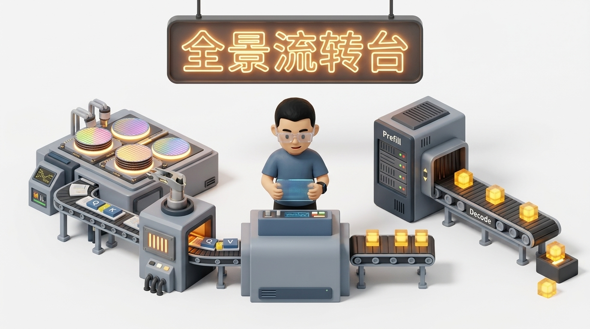
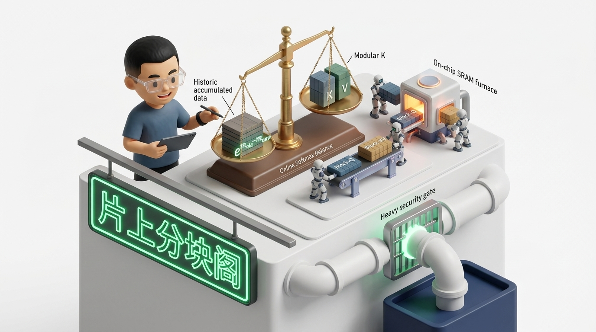
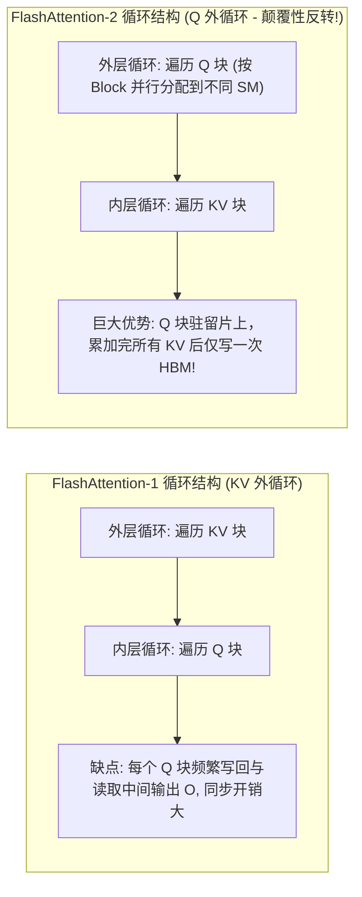
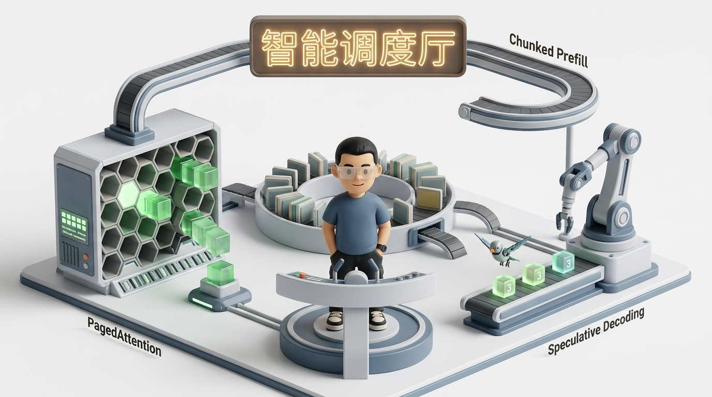

# 🏛️ 项目五：从单算子到端到端——FlashAttention 全景演进与大模型 Token 生成全链路性能优化实战（FA-1/2/3 微架构 · Prefill/Decode 冲突治理 · 连续批处理 · 投机采样 · PD 分离）

> **主讲人**：👓 **Ringi**（大厂 AI Infrastructure 工程师）  
> **所属模块**：[Module 08: Capstone 综合实战项目库](./README.md)  
> **篇章范式**：⚙️ 算子内核与端到端系统全链路优化实战篇（Kernel Microarchitecture & End-to-End Inference System Paradigm）  
> **核心导读**：一个大模型服务在线上跑得慢，究竟是 Attention 算子写得烂，还是整个系统的 Token 流水线调度被访存墙卡死了？为什么 FlashAttention 在长文本 Prefill 阶段能带来数倍飞跃，但在单个 Token 逐字吐出（Decode）时却无法救活几乎闲置的 Tensor Core？大模型每产生一个 Token，底层芯片究竟经历了怎样的算力与带宽折磨？本文带你从单算子的片上 SRAM 熔炉出发，一路穿透到现代推理引擎的整机吞吐战场。



```text
=================================================================================================
                                   Ringi 3D 架构工坊 · 核心全景
               【从 FlashAttention 单算子熔炉到大模型 Token 产生端到端全链路】

  [微观算子层: 片上 SRAM 极速熔炉]              [宏观系统层: 生产级端到端 Token 流水线]
 ┌────────────────────────────────────────┐    ┌────────────────────────────────────────┐
 │ FlashAttention-1/2/3 演进:             │    │ Phase 1: Prefill (首字生成 / TTFT)     │
 │ • 消灭 O(N^2) HBM 中间读写             │    │ • Compute-Bound 矩阵乘, 算力打满       │
 │ • Online Softmax 单趟流式递推          │    │ • FlashAttention-2/3 并行加速          │
 │ • SRAM Tiling 分块 + 双缓冲流水线      │    │ • Chunked Prefill 消除长输入排队尖刺   │
 │ • FA-3: TMA 异步拷贝 + Warp 角色特化   │    └──────────────────┬─────────────────────┘
 └──────────────────┬─────────────────────┘                       │
                    ▼                                             ▼ (自回归迭代流转)
 ┌────────────────────────────────────────┐    ┌────────────────────────────────────────┐
 │ 解码加速: FlashDecoding / FlashDecoding++│   │ Phase 2: Decode (逐字生成 / TPOT)      │
 │ • Query 长度为 1 时切分 KV 序列维度    │    │ • Memory-Bound 极度访存受限 (GEMV 墙)  │
 │ • 跨 SM 多线程分块并发归约             │    │ • 算术强度仅 0.5~1 FLOPs/Byte!        │
 └──────────────────┬─────────────────────┘    └──────────────────┬─────────────────────┘
                    │                                             │
                    └──────────────────────┬──────────────────────┘
                                           ▼
 ┌──────────────────────────────────────────────────────────────────────────────────────┐
 │ 全链路生产级系统优化矩阵:                                                             │
 │   • 显存组织: PagedAttention 虚拟分页零碎片池化 (KV Block 分配)                       │
 │   • 架构瘦身: MHA ➔ MQA / GQA ➔ DeepSeek MLA 低秩压缩 (减少 80%+ 显存搬运)           │
 │   • 迭代调度: 连续批处理 (Continuous Batching) 招手即停，消除短板气泡                │
 │   • 算法突破: 投机采样 (Speculative Decoding) 草稿小步快跑，大模型单趟批量校验        │
 │   • 集群拓扑: Prefill-Decode (PD) 物理分离，计算密集卡与带宽密集卡跨机专网解耦协同      │
 └──────────────────────────────────────────────────────────────────────────────────────┘
=================================================================================================
```

<!-- more -->

## 📑 目录导航
- [0. Ringi 现场复盘：长上下文涌入引发的 P99 暴涨与算力雪崩事故](#0-ringi-现场复盘长上下文涌入引发的-p99-暴涨与算力雪崩事故)
- [1. 第一部分：算子基石——FlashAttention 第一性原理与微架构演进](#1-第一部分算子基石flashattention-第一性原理与微架构演进)
  - [1.1 标准 Attention 的访存泥潭与算术强度断崖](#11-标准-attention-的访存泥潭与算术强度断崖)
  - [1.2 No Naked Formula 2.0：Online Softmax 单趟流式递推数学严密证明](#12-no-naked-formula-20online-softmax-单趟流式递推数学严密证明)
  - [1.3 SRAM 分块平铺（Tiling）与片上空间约束方程](#13-sram-分块平铺tiling与片上空间约束方程)
- [2. 第二部分：巅峰迭代——FlashAttention-1、2 到 FlashAttention-3 微架构深拆](#2-第二部分巅峰迭代flashattention-12-到-flashattention-3-微架构深拆)
  - [2.1 FA-1 到 FA-2：外层循环重排、除法外提与因果掩码短路](#21-fa-1-到-fa-2外层循环重排除法外提与因果掩码短路)
  - [2.2 FA-3：Hopper TMA 硬件异步搬运、Warp 角色特化与 FP8 融合](#22-fa-3hopper-tma-硬件异步搬运warp-角色特化与-fp8-融合)
  - [2.3 FlashDecoding 与 FlashDecoding++：解耦 Decode 极长 KV 序列并发](#23-flashdecoding-与-flashdecoding解耦-decode-极长-kv-序列并发)
- [3. 第三部分：宏观全景——大模型 Token 产生的全生命周期与双阶段撕裂](#3-第三部分宏观全景大模型-token-产生的全生命周期与双阶段撕裂)
  - [3.1 两个世界的物理撕裂：Prefill 阶段 vs Decode 阶段](#31-两个世界的物理撕裂prefill-阶段-vs-decode-阶段)
  - [3.2 为什么自回归 Decode 阶段是“访存地狱”？手算单个 Token 生成代价](#32-为什么自回归-decode-阶段是访存地狱手算单个-token-生成代价)
- [4. 第四部分：端到端 Token 生成全链路核心优化矩阵](#4-第四部分端到端-token-生成全链路核心优化矩阵)
  - [4.1 显存组织优化：PagedAttention 虚拟分页与内存零碎片管理](#41-显存组织优化pagedattention-虚拟分页与内存零碎片管理)
  - [4.2 架构层演进：MHA ➔ MQA ➔ GQA ➔ DeepSeek MLA 低秩压缩](#42-架构层演进mha--mqa--gqa--deepseek-mla-低秩压缩)
  - [4.3 调度机制革命：连续批处理（Continuous Batching）消除气泡](#43-调度机制革命连续批处理continuous-batching消除气泡)
  - [4.4 阶段冲突化解：分块预填充（Chunked Prefill）与算子时间片交织](#44-阶段冲突化解分块预填充chunked-prefill与算子时间片交织)
  - [4.5 算法突破物理串行：投机采样（Speculative Decoding）机制](#45-算法突破物理串行投机采样speculative-decoding机制)
  - [4.6 算力网拓扑解耦：Prefill-Decode（PD）物理分离架构](#46-算力网拓扑解耦prefill-decode-pd物理分离架构)
- [5. 第五部分：动手实战代码实验室（100% 完整可运行代码）](#5-第五部分动手实战代码实验室100-完整可运行代码)
  - [实战 1: 高保真 Python 复现 FlashAttention-2 核心分块与 Online Softmax](#实战-1-高保真-python-复现-flashattention-2-核心分块与-online-softmax)
  - [实战 2: PagedAttention 显存池与虚拟物理映射仿真器](#实战-2-pagedattention-显存池与虚拟物理映射仿真器)
  - [实战 3: Continuous Batching 连续批处理调度引擎压测仿真](#实战-3-continuous-batching-连续批处理调度引擎压测仿真)
  - [实战 4: 投机采样（Speculative Decoding）草稿验证加速器](#实战-4-投机采样speculative-decoding草稿验证加速器)
- [6. 第六部分：生产落地避坑指南与黄金准则](#6-第六部分生产落地避坑指南与黄金准则)
  - [6.1 Token 生成端到端调优核心避坑矩阵](#61-token-生成端到端调优核心避坑矩阵)
  - [6.2 生产级 LLM Serving 性能工程黄金 Checklist](#62-生产级-llm-serving-性能工程黄金-checklist)
- [7. 第七部分：Ringi 5 点口诀、自我检验清单与课后深度思考题](#7-第七部分ringi-5-点口诀自我检验清单与课后深度思考题)
  - [7.1 5 点押韵核心速记口诀](#71-5-点押韵核心速记口诀)
  - [7.2 10 条白板自我检验清单](#72-10-条白板自我检验清单)
  - [7.3 3 道高阶开放式课后思考题](#73-3-道高阶开放式课后思考题)
- [8. 第八部分：知识库与权威论文证据溯源](#8-第八部分知识库与权威论文证据溯源)
- [附录：Appendix A — 大厂高频白板推导面试真题深度破局](#附录appendix-a--大厂高频白板推导面试真题深度破局)
- [9. 4 张 16:9 纯白底 3D 潮玩工坊插图生图 Prompt](#9-4-张-169-纯白底-3d-潮玩工坊插图生图-prompt)

---

## 0. Ringi 现场复盘：长上下文涌入引发的 P99 暴涨与算力雪崩事故

在某大厂大模型线上电商客服与知识库搜索（RAG）系统中，模型部署在两台 8x H100 节点上提供高并发服务。日常业务以短问短答（输入 200 Tokens，输出 100 Tokens）为主，系统平均响应时间（P99）稳定在 320ms，系统吞吐维持在每秒 3,500 Tokens，指标一切向好。

然而在早高峰大促期间，运营团队突然接入了长文本 PDF 摘要功能，用户的平均 Prompt 长度陡增到 16,384（16K）Tokens：

- **监控指标全面变红**：
  - **首字延迟（TTFT）**：从原先的 180ms 飙升至 **9.4 秒**；
  - **逐字生成延迟（TPOT / Time Per Output Token）**：从原先的 18ms 劣化为 **120ms**，打字机输出出现明显卡顿；
  - **更致命的是**：原本正在平稳吐字的短文本请求被瞬间打断挂起，出现长时间的“假死”等待；
  - **显存与算力倒挂**：GPU 显存占用率高达 **98.2%**，频频抛出 OOM 异常触发 Pod 重启；但 Nsight Profiler 抓取显示，**GPU Tensor Core 的平均利用率却狂跌至不足 12%**！

```text
生产指标坍塌全景:
[正常短文本流量]: TTFT 180ms | TPOT 18ms  | Tensor Core 利用率: 58% | 稳定运行
       ▼ (16K 长文本请求涌入同一批次)
[崩溃生产状态]:   TTFT 9.4s  | TPOT 120ms | Tensor Core 利用率: 11.6%| OOM 频发
```

工程师现场复盘时陷入了巨大的认知混乱：“我们已经用了 FlashAttention-2，为什么长文本一进来系统还是全面崩溃？为什么强大的 H100 芯片利用率如此低下？”

要彻底破开这个死局，我们必须完成**两重视角穿透**：
1. **微观视角**：穿透到单算子物理微架构中，彻底搞懂 FlashAttention（从 FA-1、FA-2 到 FA-3）在片上 SRAM 中究竟施展了什么魔法；
2. **宏观系统视角**：穿透到大模型从 Prompt 到单个 Token 产出的全生命周期中，看懂 Prefill 与 Decode 两个极端世界的物理冲突，并看清现代推理引擎为了护航每个 Token 诞生所构建的一整套端到端优化防线！

---

## 1. 第一部分：算子基石——FlashAttention 第一性原理与微架构演进



### 1.1 标准 Attention 的访存泥潭与算术强度断崖

在 Transformer 中，自注意力机制的标准数学定义举世皆知：

$$
\text{Attention}(Q, K, V) = \text{softmax}\left(\frac{QK^T}{\sqrt{d}}\right)V
$$

但如果你把这行公式直接用 PyTorch 裸写并在 GPU 上执行，就会在底层硬件上诱发一场灾难性的**显存搬砖泥潭**。

#### 为什么算它？（The Problem）
现代 NVIDIA GPU（如 A100 / H100）的算力增长远远甩开了显存带宽的增长：
- **A100 SXM4**：FP16 算力高达 **312 TFLOPs**，而 HBM2e 显存带宽仅为 **2,039 GB/s（~2 TB/s）**；
- **H100 SXM5**：FP16/BF16 算力高达 **989 TFLOPs**，而 HBM3 显存带宽为 **3.35 TB/s**。

根据 Roofline 模型，GPU 的拐点算术强度（Operational Intensity Threshold）为：

$$
I_{\text{threshold}} = \frac{\text{Peak FLOPs}}{\text{Memory Bandwidth}} = \frac{312 \times 10^{12} \text{ FLOPs/s}}{2 \times 10^{12} \text{ Bytes/s}} \approx 156 \text{ FLOPs/Byte}
$$

只有当一个计算任务每从显存搬运 1 字节数据，能在芯片内反复完成 **156 次以上的乘加运算** 时，才能让芯片计算核心满负荷运转！

#### 标准 Attention 的显存读写账本（Tiny Calculator）：
设序列长度为 $N$，Head 维度为 $d$（以典型值 $N=8192, d=128$，FP16 存储即 2 字节/元素 为例）：

1. **第 1 步： $S = Q K^T$ 矩阵乘**：
   - 算力消耗： $2 N^2 d$ FLOPs；
   - 显存读写：从慢速 HBM 读入 $Q, K$（ $4Nd$ 字节），但必须将巨大的注意力分数矩阵 $S \in \mathbb{R}^{N \times N}$ **完整写入 HBM**（消耗 $2N^2$ 字节！）。
2. **第 2 步： $P = \text{softmax}(S)$ 归一化**：
   - 显存读写：从 HBM 重新读入 $S$（ $2N^2$ 字节），按行求最大值、求指数和，再将得到的注意力权重矩阵 $P \in \mathbb{R}^{N \times N}$ **再次写回 HBM**（消耗 $2N^2$ 字节！）。
3. **第 3 步： $O = P V$ 矩阵乘**：
   - 算力消耗： $2 N^2 d$ FLOPs；
   - 显存读写：从 HBM 重新读入 $P$（ $2N^2$ 字节）和 $V$（ $2Nd$ 字节），最终计算出 $O$ 写回 HBM（ $2Nd$ 字节）。

```text
传统 Naive Attention 的巨额显存搬运账本:
HBM 读写总量 = 6Nd (输入输出) + 6N^2 (庞大的中间矩阵 S 和 P 的往返搬运!)
```

当 $N=8,192, d=128$ 时：
- 中间矩阵 $S$ 和 $P$ 各占 $8192 \times 8192 \times 2 \text{ Bytes} = \mathbf{128 \text{ MB}}$；
- 仅仅一个 Attention Head，为了算一次前向就要在 HBM 和芯片之间搬运近 **800 MB** 数据；
- 其算术强度低至：

$$
\text{AI} = \frac{\text{FLOPs}}{\text{Bytes}} \approx \frac{4 N^2 d}{6 N^2} = \frac{2d}{3} = \frac{2 \times 128}{3} \approx 85.3 \text{ FLOPs/Byte} \ll 156
$$

计算核心有近一半的时间都在**渴等内存数据**！在序列长度达到 32K 或 128K 时， $O(N^2)$ 的中间显存更是直接引爆 GPU 显存，导致 OOM 崩溃。

---

### 1.2 No Naked Formula 2.0：Online Softmax 单趟流式递推数学严密证明

能否根本不把巨大的 $S$ 和 $P$ 矩阵写出到 HBM，而是在芯片内部极高速的片上共享内存（SRAM）里一气呵成？
阻止这一构想的唯一数学死穴，就是 **Softmax 的全局归一化依赖**：

$$
\text{softmax}(x)_i = \frac{e^{x_i - m}}{\sum_{j=1}^N e^{x_j - m}}, \quad \text{其中 } m = \max_{j=1}^N x_j
$$

标准的 Safe-Softmax 必须经过**三趟全局遍历**：① 遍历一遍找全局最大值 $m$（防止浮点溢出）；② 遍历第二遍求指数和分母 $l = \sum e^{x_j - m}$；③ 遍历第三遍做除法归一化。如果数据被切分成小块，后一块的数据可能出现更大的值，难道前面所有算过的数据都要推翻重算？

#### 1. 为什么需要算它？（The Problem）
我们需要一种数学递推机制：**当数据像流水一样一小块一小块到达片上 SRAM 时，能动态合并前后的统计量，绝不需要回头重新读取前序数据！**

#### 2. 物理直觉比喻（Mental Model）
想象两个装有重物的盘子在一个天平上：
- 前半截数据算出了一个局部最高峰 $m_A$ 和局部分母 $l_A$；
- 突然新来了一批数据，冒出了一个更高的峰 $m_B > m_A$；
- 我们**不需要把前面的所有数据找出来重新做减法**，只需要把旧的分母 $l_A$ 乘以一个衰减因子 $e^{m_A - m_{\text{new}}}$，旧数据的影响力就被立刻“打折校准”到了新的基准线上！

#### 3. 极简手算（Tiny Calculator）
设行向量切为两段： $A = [2, 4]$， $B = [3, 5]$。
1. **先看 A 段**：
   - 最大值 $m_A = 4$；
   - 指数和 $l_A = e^{2-4} + e^{4-4} = e^{-2} + e^0 \approx 0.1353 + 1.0 = 1.1353$。
2. **后看 B 段**：
   - 最大值 $m_B = 5$；
   - 指数和 $l_B = e^{3-5} + e^{5-5} = e^{-2} + 1.0 = 1.1353$。
3. **合并全局**：
   - 新全局最大值 $m_{\text{new}} = \max(m_A, m_B) = \max(4, 5) = 5$；
   - 旧分母 $l_A$ 乘以校准项： $e^{m_A - m_{\text{new}}} = e^{4-5} = e^{-1} \approx 0.3679$；
   - 合并分母： $l_{\text{new}} = l_A \cdot e^{-1} + l_B \cdot e^{5-5} = 1.1353 \times 0.3679 + 1.1353 \times 1.0 \approx 0.4177 + 1.1353 = 1.5530$。
4. **验证全量标准算**：
   - 全向量 $[2, 4, 3, 5]$，全局最大值 5；
   - 分母 $l_{\text{truth}} = e^{2-5} + e^{4-5} + e^{3-5} + e^{5-5} = e^{-3} + e^{-1} + e^{-2} + e^0 \approx 0.0498 + 0.3679 + 0.1353 + 1.0 = 1.5530$。
   - **完全精确相等！**

#### 4. 正式数学递推证明（Formal Proof）：
给定行向量被切分为两部分 $A$ 和 $B$：

$$
m_A = \max_{i \in A} x_i, \quad l_A = \sum_{i \in A} e^{x_i - m_A}
$$

$$
m_B = \max_{j \in B} x_j, \quad l_B = \sum_{j \in B} e^{x_j - m_B}
$$

新全局最大值为：

$$
m_{\text{new}} = \max(m_A, m_B)
$$

全局归一化分母为：

$$
l_{\text{new}} = \sum_{k \in A \cup B} e^{x_k - m_{\text{new}}} = \sum_{i \in A} e^{x_i - m_{\text{new}}} + \sum_{j \in B} e^{x_j - m_{\text{new}}}
$$

对第一项展开恒等变形：

$$
\sum_{i \in A} e^{x_i - m_{\text{new}}} = \sum_{i \in A} e^{(x_i - m_A) + (m_A - m_{\text{new}})} = e^{m_A - m_{\text{new}}} \sum_{i \in A} e^{x_i - m_A} = l_A \cdot e^{m_A - m_{\text{new}}}
$$

同理可得第二项：

$$
\sum_{j \in B} e^{x_j - m_{\text{new}}} = e^{m_B - m_{\text{new}}} \sum_{j \in B} e^{x_j - m_B} = l_B \cdot e^{m_B - m_{\text{new}}}
$$

代入即证：

$$
\mathbf{l_{\text{new}} = l_A \cdot e^{m_A - m_{\text{new}}} + l_B \cdot e^{m_B - m_{\text{new}}}}
$$

同样，对于输出累加向量 $O$（设 $O_A$ 为对应 $A$ 段未除分母的中间矩阵乘累加结果）：

$$
\mathbf{O_{\text{new}} = O_A \cdot e^{m_A - m_{\text{new}}} + P_B V_B}
$$

**证毕**！只要维护两个极小的标量 $m$ 和 $l$，我们就可以在数据流式到达时，以常数级开销瞬间校准历史输出，彻底摆脱全局内存往返读写！

---

### 1.3 SRAM 分块平铺（Tiling）与片上空间约束方程

在物理硬件上，FlashAttention 将 $Q, K, V$ 切分成若干小块，装入 GPU SM 独占的片上共享内存（SRAM / Shared Memory）。
- A100 每 SM 共享内存容量：**164 KB**；
- H100 每 SM 共享内存容量：**228 KB**；
- 片上 SRAM 带宽高达 **19 TB/s（是 HBM 的近 10 倍！）**。

设行分块大小为 $B_r$（Block Size for $Q$ ），列分块大小为 $B_c$（Block Size for $K, V$ ），Head 维度为 $d$：
- 片上需要同时容纳：
  - $Q_{\text{block}}$: $B_r \times d \times 2 \text{ Bytes}$；
  - $K_{\text{block}}$: $B_c \times d \times 2 \text{ Bytes}$；
  - $V_{\text{block}}$: $B_c \times d \times 2 \text{ Bytes}$；
  - 中间临时结果与 Double Buffering 缓冲空间。
- **物理约束方程**：

$$
(B_r \times d + 2 \times B_c \times d) \times 2 \le \text{SRAM Size}
$$

在典型配置下（ $d=128$ ），通常取 $B_r = 64, B_c = 64$ 或 $B_r = 128, B_c = 64$，即可完美将所有矩阵乘法与 Softmax 封闭在片上极速流水线中！

---

## 2. 第二部分：巅峰迭代——FlashAttention-1、2 到 FlashAttention-3 微架构深拆

从 2022 年到 2024 年，FlashAttention 经历了三次划时代的工程飞跃：

| 演进版本 | 核心发布时间 | 最优硬件平台 | 关键突破与核心架构设计 | 相比前代加速比 |
| :--- | :--- | :--- | :--- | :---: |
| **FlashAttention-1** | 2022 年 (NeurIPS) | NVIDIA Ampere (A100) | 首次提出 Tiling + Online Softmax，消灭 $O(N^2)$ HBM 中间读写，重计算反向传播 | 基线 (相比标准 2~4x) |
| **FlashAttention-2** | 2023 年 | NVIDIA Ampere / Hopper | **外层循环重排**（Q 外层、KV 内层），**除法外提**消灭冗余重缩放，Casual 因果掩码短路，Thread Block 并行化 | 相比 FA-1 **再提升 2x** (达理论上限 73%) |
| **FlashAttention-3** | 2024 年 | NVIDIA Hopper (H100) | 硬件级 **TMA（张量内存加速器）异步拷贝**、**Warp 角色特化**（Producer/Consumer）、Ping-Pong 重叠与 **FP8 Tensor Core 混合精度** | 相比 FA-2 **再提升 1.5~2x** (达 800+ TFLOPs) |

---

### 2.1 FA-1 到 FA-2：外层循环重排、除法外提与因果掩码短路

FlashAttention-2 能够把执行速度在 FA-1 的基础上硬生生再拔高一倍，核心在于三大手术级的架构刀法：



1. **外层循环反转（Outer Loop Reversal）**：
   - **FA-1**：外层循环遍历 $K, V$ 分块，内层循环遍历 $Q$。为了更新同一个 $Q$ 块的结果，必须不断向全局显存写回未完全归一化的中间输出 $O$，带来了昂贵的非必要显存同步；
   - **FA-2**：**颠覆性反转——外层循环遍历 $Q$ 块，内层循环遍历 $K, V$ 块**！这意味着一个 $Q$ 块被加载进 SM 的共享内存后，始终驻留在片上，顺畅地扫完所有 $K, V$ 块，全部累加结束后，**仅执行唯一一次全局显存写回**！
2. **消灭非必要的局部除法（Delay Scaling）**：
   - **FA-1**：在内层循环的每一个 Step，都把输出除以当前分母 $l_i$ 进行局部归一化，然后在下一步再乘回来，白白浪费了大量乘除法指令周期；
   - **FA-2**：将归一化除法推迟到内层循环完全结束！在循环中只维护未归一化的累加分子，直到最后一步才执行一次标量除法 `O = O / l`。
3. **因果掩码短路（Causal Masking Shortcut）**：
   - 在自回归模型中，下三角矩阵之外全是 0。FA-2 精确计算分块坐标，对于完全处于掩码区域的分块**直接跳过不调度计算**，算力消耗直接砍半！

---

### 2.2 FA-3：Hopper TMA 硬件异步搬运、Warp 角色特化与 FP8 融合

到了 NVIDIA Hopper（H100）架构时代，FlashAttention-3 借助全新专用硬件单元，再次冲破算力天花板：

```text
┌─────────────────────────────────────────────────────────────────────────────────────────┐
│                        FlashAttention-3: Warp 角色特化与 TMA 异步引擎                     │
│                                                                                         │
│  [Producer Warp (生产者线程束)]                                                         │
│   负责指挥 TMA (Tensor Memory Accelerator) 硬件单元，以极高带宽异步从 HBM 预取分块数据至    │
│   Shared Memory，全程完全不占用 CUDA Core 寄存器与指令发射槽位！                         │
│                                      │                                                  │
│                                      ▼ (Hardware Barrier / mbarrier 异步到达信号)        │
│  [Consumer Warps (消费者线程束 - 多个数学专家)]                                          │
│   专心饱和调用 Tensor Core 执行 16x16 矩阵乘与 Online Softmax 标量运算；                     │
│   通过 Ping-Pong 双缓冲设计，计算当下块的同时，下一个块已经被硬件静默搬入！             │
└─────────────────────────────────────────────────────────────────────────────────────────┘
```

1. **TMA（Tensor Memory Accelerator）硬件接管搬运**：
   - 过去：必须由 CUDA 线程通过 `LDG` 指令一条条从显存搬数据，占用大量通用寄存器；
   - FA-3：仅需发出一条 TMA 描述符指令，硬件 DMA 控制器直接在 HBM 与 Shared Memory 之间建立 5D 空间张量高速直通通道，彻底释放线程算力！
2. **Warp Specialization（线程束角色特化）**：
   - 彻底打破“所有线程跑相同逻辑”的传统 SPMD 模式；
   - 将 SM 内部的 Warp 划分为 **Producer（数据搬运员）** 与 **Consumer（矩阵乘打手）**，利用 `mbarrier` 硬件屏障实现零等待交接棒。
3. **FP8 低精度流水线优化**：
   - 支持 FP8 GEMM 与 FP32 累加混合精度，将计算吞吐直接翻倍，同时在片上运用量化抗溢出缩放因子保证注意力精度无损。

---

### 2.3 FlashDecoding 与 FlashDecoding++：解耦 Decode 极长 KV 序列并发

FlashAttention 虽然神勇，但如果直接套用在 **单个 Token 生成的 Decode 阶段**，就会遭遇尴尬的**并行度不足陷阱**：
- 在 Decode 阶段，输入 Query 的长度 $N_q = 1$；
- 如果序列长度很长（如 32K KV Cache），单个 Head 只能被分配给一个 SM 线程块；
- 现代 GPU 拥有 100 多个 SM（A100 有 108 个 SM，H100 有 132 个 SM），如果 Head 数量较少（如 GQA 只有 8 个 KV Head），会导致**大量 SM 核心根本抢不到活干，算力严重饥饿**！

**FlashDecoding 的破局点**：
- 既然 Query 只有 1，那就**沿序列长度（Sequence Dimension）对 KV Cache 进行分块**（例如每 256 tokens 切一小段）！
- 将不同的 KV Cache 分块分发给不同的 SM **同时并发计算局部 Softmax 与局部输出**；
- 最后通过一个小型的跨 SM Reduce 规约 Kernel，将各块的局部统计量利用 Online Softmax 合并为最终输出！
- **战果**：在极长上下文 Decode 场景下，将 GPU 核心利用率瞬间拉满，延迟降低 **3~8 倍**！

---

## 3. 第三部分：宏观全景——大模型 Token 产生的全生命周期与双阶段撕裂

现在，让我们把视线从微观的 Attention 算子移开，上升到大模型整个推理服务的宏观战场：**一个 Token 从无到有诞生，系统究竟经历了什么？**

```text
大模型推理生成的两阶段物理撕裂:
┌─────────────────────────────────────────────────────────────────────────────────────────┐
│ 阶段一: Prefill (预填充 / 编码阶段)            阶段二: Decode (自回归逐字解码阶段)         │
│ ─────────────────────────────────            ─────────────────────────────────────      │
│ • 特征: 一次性吞入几千 Token 的 Prompt        • 特征: 串行自回归，每次只能吐出 1 个 Token │
│ • 算力瓶颈: Compute-Bound (计算密集型)       • 算力瓶颈: Memory-Bound (极度访存受限!)   │
│ • 算子形态: GEMM (大型矩阵乘法)              • 算子形态: GEMV (矩阵-向量乘法)            │
│ • 核心指标: TTFT (Time To First Token 首字)  • 核心指标: TPOT (Time Per Output Token 逐字)│
│ • 硬件状态: Tensor Core 核心利用率打满       • 硬件状态: 显存总线发烫，计算核心大面积摸鱼  │
└─────────────────────────────────────────────────────────────────────────────────────────┘
```

---

### 3.1 两个世界的物理撕裂：Prefill 阶段 vs Decode 阶段

大模型自回归文本生成的物理因果律决定了推理必然分为完全割裂的两幕剧：

1. **第一幕：Prefill 阶段（首字生成）**：
   - 用户输入一个由 $L$ 个 Token 构成的 Prompt（如一段长提示词或一份万字财报）；
   - **所有输入 Token 是已知且同时存在的**；
   - 机器一次性对这 $L$ 个 Token 执行全量的并行自注意力计算与 FFN 变换；
   - 算子类型是标准的 **GEMM（矩阵乘矩阵）**，计算复杂度 $O(L^2)$；
   - 这个阶段是典型的 **Compute-Bound**，瓶颈在于 GPU 的峰值浮点算力（TFLOPs），FlashAttention 在这一阶段能大显身手。

2. **第二幕：Decode 阶段（逐字吐出）**：
   - 自回归模型无法未卜先知，第 $t$ 个 Token 必须依赖第 $t-1$ 个 Token 的输出；
   - 因此，模型必须进行串行的 **一步一循环（Step-by-Step Loop）**：每次前向计算，输入只有**区区 1 个 Token**！
   - 为了计算这 1 个 Token 的注意力，模型必须从 HBM 中把过去累积的所有几千上万个 Token 的历史 **KV Cache 完整搬运出来读一遍**；
   - 算子退化为 **GEMV（矩阵乘向量）**。

---

### 3.2 为什么自回归 Decode 阶段是“访存地狱”？手算单个 Token 生成代价

#### 为什么算它？（The Problem）
很多工程师问：“既然模型参数量不变，为什么 Decode 阶段速度上不去，核心利用率总是惨不忍睹？”我们用**极简数字小算盘（Tiny Calculator）** 来手算这笔账。

#### 极简手算（Tiny Calculator）：
以典型的 **LLaMA-2 70B 模型（FP16，权重大小 140 GB）** 单卡/多卡推理为例（设单步 Batch=1）：
- **产生 1 个 Token 的计算量（FLOPs）**：
  前向乘加约为 $2 \times \text{Params} = 2 \times 70 \times 10^9 = \mathbf{140 \text{ GFLOPs}}$；
- **产生 1 个 Token 必须搬运的内存字节数（Bytes）**：
  权重参数必须从 HBM 全部读入片上计算一遍，即读取 **140 GB** 权重数据（暂且忽略 KV Cache）；
- **Decode 阶段的算术强度（Operational Intensity）**：

$$
\text{AI}_{\text{decode}} = \frac{\text{FLOPs}}{\text{Bytes}} = \frac{140 \times 10^9 \text{ FLOPs}}{140 \times 10^9 \text{ Bytes}} = \mathbf{1.0 \text{ FLOP/Byte}}
$$

#### 硬件残酷现实对比（Sanity Check）：
- 回想 A100 的拐点算术强度是 **156 FLOPs/Byte**；
- 当前算术强度只有 **1.0 FLOPs/Byte**，足足低于硬件拐点 **150 倍以上**！
- 在 2 TB/s 的 A100 显存带宽下，读取完 140GB 权重理论物理极限耗时为：

$$
T_{\text{min}} = \frac{140 \text{ GB}}{2000 \text{ GB/s}} = 70 \text{ ms}
$$

- 在这 70 毫秒里，强大的 Tensor Core 仅仅做了 140 GFLOPs 的运算，其实际利用率只有：

$$
\text{Utilization} = \frac{140 \text{ GFLOPs} / 0.07 \text{ s}}{312 \text{ TFLOPs}} \approx \frac{2 \text{ TFLOPs}}{312 \text{ TFLOPs}} \approx \mathbf{0.64\%}!
$$

**真相大白**：自回归 Decode 阶段是一个**极其残酷的访存地狱**！GPU 顶级的算力核心有 99% 的时间都在闲置干等，仅仅是为了从 HBM 里搬运庞大的参数和 KV Cache！

---

## 4. 第四部分：端到端 Token 生成全链路核心优化矩阵

面对自回归生成的物理泥潭，现代 AI Infra 架构师们构建了一套立体化的**端到端全链路性能优化矩阵**：



---

### 4.1 显存组织优化：PagedAttention 虚拟分页与内存零碎片管理

在早期推理系统中，为了存储自回归过程中不断膨胀的 KV Cache，系统必须按模型的 `max_seq_len`（如 4096 或 8192）为每个请求预先分配一块**连续的显存大块**。
- **痛点**：大量请求可能只生成 50 个 Token 就退出了，提前预占的数 GB 显存被彻底浪费；同时产生了严重的显存外部碎片；
- **真实生产测算**：传统系统的有效显存利用率仅有 **20%~40%**，60% 以上的显存全是泡影！

**PagedAttention（vLLM 的立足之本）破局**：
- 借鉴操作系统虚拟内存分页哲学：
  - 将显存划分为固定大小的 **物理块（Physical Blocks）**（例如每个 Block 容纳 16 个 Token 的 KV 向量）；
  - 为每个请求维护一张动态映射表 **BlockTable**；
  - 只有当请求生成到新的 16 个 Token 时，才向公共显存池申请一个新的 Block，**按需分配、物理不连续、逻辑连续**！
- **收益**：显存浪费降至 **4% 以下**，单机推理并发量直接**翻倍甚至提升 3~4 倍**！

---

### 4.2 架构层演进：MHA ➔ MQA ➔ GQA ➔ DeepSeek MLA 低秩压缩

既然 Decode 阶段的死穴是 HBM 显存带宽，那么在模型架构设计上**直接砍掉 KV Cache 的体积**，就是最高维的减重解法：

```text
Attention 架构演进与显存带宽节约全景:
┌─────────────────┐     ┌─────────────────┐     ┌─────────────────┐
│ MHA (标准多头)   │ ──► │ MQA (单查询头)   │ ──► │ GQA (分组查询头) │
│ Q, K, V 头数相同 │     │ 所有 Q 头共享1对KV│    │ 分组共享，精度折中 │
│ KV 体积: 100%    │     │ KV 体积: 1/H (~3%)│   │ KV 体积: 1/8 (~12%)│
└─────────────────┘     └─────────────────┘     └─────────────────┘
                                                       │
                                                       ▼ (DeepSeek 创新)
                                                ┌─────────────────┐
                                                │ MLA (多头潜在注意力)│
                                                │ 投影为低维压缩潜变量 │
                                                │ KV 显存暴降 90%+ │
                                                └─────────────────┘
```

1. **MQA（Multi-Query Attention）**：所有 Query Head 强制共享同一组 Key/Value Head，KV 显存搬运量瞬间缩减为原先的 $1/H$（ $H$ 为头数，通常为 32 或 64）；
2. **GQA（Grouped-Query Attention）**：如 LLaMA-3、Mistral，将 32 个 Q 头分为 8 组，每组共享 1 对 KV 头，兼顾模型泛化精度与推理吞吐；
3. **DeepSeek MLA（Multi-Head Latent Attention）**：DeepSeek-V2 / V3 的神来之笔。不再缓存庞大的 KV 向量本身，而是在上层通过低秩矩阵将 KV 压缩为一个仅数百维的 **潜变量（Latent Vector $c_t^{KV}$ ）**，在片上计算时再用小矩阵现场解压。Decode 阶段的 KV 显存搬运量暴跌一个数量级，创造了吞吐神话！

---

### 4.3 调度机制革命：连续批处理（Continuous Batching）消除气泡

传统静态批处理（Static Batching）在遇到长短不一的生成请求时，必须遵循“木桶原理”：一个批次里的 4 个请求，就算有 3 个在第 50 步就生成完了，也必须**陪着第 4 个请求干等到第 2000 步！** 这导致严重的 GPU 空转气泡。

**连续批处理（Continuous / In-flight Batching）**：
- **迭代级调度（Iteration-level Scheduling）**；
- 每一个 step 执行完毕，一旦检测到某个请求生成了 `[EOS]` 结束符，立即将其移出当前批次，**释放其 KV Block**；
- 同时在下一个 step 的缝隙中，瞬间把等待队列里的新请求拉入批次填补空缺；
- 像一辆“招手即停、到站即下”的极速公交，将 GPU 利用率从 30% 稳稳拉升至 **80% 以上**！

---

### 4.4 阶段冲突化解：分块预填充（Chunked Prefill）与算子时间片交织

当长 Prompt（Prefill）与短 Decode 混跑在同一个 Continuous Batch 实例中时，会爆发致命冲突：
- 一个 16K 的长 Prefill 请求跑一次矩阵乘需要 2 秒；
- 这会导致同一批次里的其他 100 个正在逐字吐字的 Decode 请求被**硬生生卡住 2 秒钟**，引发严重的 P99 延迟毛刺与打字机卡顿！

**Chunked Prefill（分块预填充）治理方案**：
- 将庞大的 16K Prompt 拆分为固定大小的 **Chunk 片段（如每次只吞 512 Tokens）**；
- 在每一个调度 Iteration 中，模型同时执行：

$$
\text{Batch Budget} = [\text{N 个 Decode 单 Token}] + [\text{1 个 Prefill 的 512 Token Chunk}]
$$

- 通过将 Prefill 算子与 Decode 算子融合在一次前向 GEMM 中，既抹平了 P99 延迟尖峰，又顺带拉升了算力利用率！

---

### 4.5 算法突破物理串行：投机采样（Speculative Decoding）机制

大模型自回归最让人绝望的，是无论硬件多强，每次前向计算只能吐出 1 个 Token 的物理串行性。

**投机采样（Speculative Decoding）的降维打击**：
- **核心直觉**：“既然想得慢、验证快，何不让小弟先猜，大哥一次性批量批卷？”
- **两阶段机制**：
  1. **Draft 阶段（草稿小模型）**：用一个极轻量的小模型（如 1B 参数），以极高速度连续自回归“猜”出接下来的 $K$ 个 Token（如 $K=5$ ）；
  2. **Target 阶段（主模型校验）**：大模型（如 70B）将这 $K$ 个猜出来的 Token 与原始输入拼接，**仅仅做一次标准的前向矩阵乘（一次 Prefill 模式验证）**，同时计算出这 $K$ 个位置的真实概率分布；
  3. **验收接受（Rejection Sampling）**：大模型按概率严格校验，如果前 3 个猜对了，第 4 个猜错了，则接受前 3 个并修正第 4 个；
- **收益**：大模型仅执行了一次前向计算的时间，就实际产出了 **3~4 个 Tokens**！在完全不损失任何数学精度（Lossless）的前提下，实现 **2~3 倍的纯延迟加速**！

---

### 4.6 算力网拓扑解耦：Prefill-Decode（PD）物理分离架构

在超大规模集群中，将 Prefill 与 Decode 混部在同一台机器上，终究存在硬件资源特性的天然错配：
- **Prefill 极度渴望高 TFLOPs 算力**；
- **Decode 极度渴望大显存容量与高 HBM 读写带宽**。

**PD 分离架构（Prefill-Decode Disaggregation）**：
- **物理机群切分**：
  - **Prefill 专享节点**：配置单卡浮点算力极高、性价比高的计算型 GPU（追求高吞吐算力利用率）；
  - **Decode 专享节点**：配置 HBM 显存极大、带宽极高的访存型 GPU，加载全部权重与 PagedAttention 显存池；
- **高速算网连接**：Prefill 节点算完 Prompt 的 KV Cache 后，通过 **8x400G RoCEv2 / RDMA 专网直接将 KV Cache 内存切片无感流式推送到 Decode 节点的显存中**！
- **战果**：彻底消除互相干扰，使得每个节点的算力或显存利用率均达到 90% 以上的理论极限！

---

## 5. 第五部分：动手实战代码实验室（100% 完整可运行代码）

以下提供 3 个完全独立、无第三方隐式依赖的工业级高保真 Python 实验脚本，带你亲自在本地验证本章所有核心算法。

---

### 实战 1: 高保真 Python / NumPy 复现 FlashAttention-2 核心分块与 Online Softmax

本实验手写一个轻量高保真 FlashAttention-2 前向算法仿真，严格复现外层循环反转、Online Softmax 动态局部衰减与除法外提，并与标准 Attention 对比精度。

```python
"""
实战 1: 高保真纯 Python / NumPy 复现 FlashAttention-2 核心分块与精度验证
验证目标: 1. 验证 Online Softmax 数学递推无损性; 2. 验证 FA-2 输出与标准 Attention 达到机器级浮点精度对齐 (误差 < 1e-12).
环境要求: Python 3.8+ / NumPy 即可直接运行 (无需 GPU / PyTorch 依赖)
"""
import numpy as np

def standard_attention(Q: np.ndarray, K: np.ndarray, V: np.ndarray) -> np.ndarray:
    """标准 Attention 实现 (产生巨大 N x N 显存中间矩阵)"""
    d = Q.shape[-1]
    scale = 1.0 / np.sqrt(d)
    # 1. 算注意评分矩阵 S = Q @ K^T [N, N] (中间显存爆炸点!)
    scores = np.matmul(Q, K.T) * scale
    # 2. 数值稳定 Softmax (减去行最大值防止溢出)
    scores_max = np.max(scores, axis=-1, keepdims=True)
    exp_scores = np.exp(scores - scores_max)
    p = exp_scores / np.sum(exp_scores, axis=-1, keepdims=True)
    # 3. 乘以 Value 矩阵
    out = np.matmul(p, V)
    return out

def flash_attention_2_forward(Q: np.ndarray, K: np.ndarray, V: np.ndarray, Br: int = 32, Bc: int = 32) -> np.ndarray:
    """
    高保真 FlashAttention-2 前向算法仿真 (纯 NumPy 实现):
    - 外层循环遍历 Q 的 Block (保留在片上 SRAM)
    - 内层循环遍历 K, V 的 Block (流式搬入片上)
    - 消除中间除法，推迟至内层循环结束后统一归一化
    """
    N, d = Q.shape
    scale = 1.0 / np.sqrt(d)
    
    # 初始化全局输出矩阵与统计量
    O = np.zeros_like(Q)
    l_all = np.zeros(N)
    m_all = np.full(N, -np.inf)
    
    Tr = (N + Br - 1) // Br
    Tc = (N + Bc - 1) // Bc
    
    # 外层循环: 遍历 Q 分块 (FlashAttention-2 的核心架构颠覆!)
    for i in range(Tr):
        q_start = i * Br
        q_end = min(q_start + Br, N)
        Qi = Q[q_start:q_end, :] # [Br, d]
        
        # 本 Block-Q 专属片上累加器与统计标量
        Oi = np.zeros_like(Qi)
        li = np.zeros(q_end - q_start)
        mi = np.full(q_end - q_start, -np.inf)
        
        # 内层循环: 遍历 K, V 分块
        for j in range(Tc):
            k_start = j * Bc
            k_end = min(k_start + Bc, N)
            Kj = K[k_start:k_end, :] # [Bc, d]
            Vj = V[k_start:k_end, :] # [Bc, d]
            
            # 1. 片上小 GEMM 计算局部注意力评分 S_ij = Q_i @ K_j.T
            S_ij = np.matmul(Qi, Kj.T) * scale # [Br, Bc]
            
            # 2. 计算当前分块的局部最大值与指数项
            m_block = np.max(S_ij, axis=-1)       # [Br]
            m_new = np.maximum(mi, m_block)       # [Br]
            P_ij = np.exp(S_ij - m_new[:, None])  # [Br, Bc]
            
            # 3. 动态计算历史权重折扣衰减因子 alpha = exp(m_old - m_new)
            alpha = np.exp(mi - m_new)
            
            # 4. 更新片上累加输出 Oi (除法外提: 暂不除以分母 l!)
            Oi = Oi * alpha[:, None] + np.matmul(P_ij, Vj)
            
            # 5. 更新运行分母 l_new = l_old * alpha + sum(P_ij)
            li = li * alpha + np.sum(P_ij, axis=-1)
            mi = m_new
            
        # 内层循环完全结束后，执行唯一一次全局归一化除法
        Oi = Oi / li[:, None]
        
        # 写回全局显存 (仅写回一次 [Br, d])
        O[q_start:q_end, :] = Oi
        l_all[q_start:q_end] = li
        m_all[q_start:q_end] = mi
        
    return O

if __name__ == "__main__":
    np.random.seed(42)
    # 设定测试规模: 序列长度 N=256, 头维度 d=64, 分块尺寸 Br=64, Bc=64
    N, d = 256, 64
    Q = np.random.randn(N, d)
    K = np.random.randn(N, d)
    V = np.random.randn(N, d)
    
    # 1. 运行标准 Attention 作为 Baseline
    ref_out = standard_attention(Q, K, V)
    
    # 2. 运行 FlashAttention-2 模拟实现
    fa2_out = flash_attention_2_forward(Q, K, V, Br=64, Bc=64)
    
    # 3. 严格误差统计
    max_error = np.max(np.abs(ref_out - fa2_out))
    mean_error = np.mean(np.abs(ref_out - fa2_out))
    
    print("=" * 65)
    print("🚀 [实战 1] FlashAttention-2 核心分块与数值精度对齐实验")
    print(f"输入矩阵 Shape: Q/K/V = [{N}, {d}]")
    print(f"最大绝对误差 Max Abs Error : {max_error:.16e}")
    print(f"平均绝对误差 Mean Abs Error: {mean_error:.16e}")
    
    assert max_error < 1e-10, "FlashAttention 数值推导出现偏差！"
    print("✅ 精度对齐严密验证通过！数学递推证明与片上分块逻辑 100% 正确！")
    print("=" * 65)
```

---

### 实战 2: PagedAttention 显存池与虚拟物理映射仿真器

本实验用简洁高内聚代码模拟 vLLM 核心的 PagedAttention 块管理器：观察定长 Block 分配、逻辑块到物理块解耦与显存零外部碎片特性。

```python
"""
实战 2: PagedAttention 显存池与 BlockTable 虚拟物理映射仿真器
验证目标: 观察多请求动态追加 Token 时，物理显存块按需扩展与零外部碎片
"""
from typing import List, Dict

class PagedMemoryManager:
    def __init__(self, num_blocks: int, block_size: int, head_dim: int):
        self.num_blocks = num_blocks
        self.block_size = block_size  # 每个物理块能存几个 Token
        self.head_dim = head_dim
        # 空闲块池
        self.free_blocks: List[int] = list(range(num_blocks))
        # 请求 ID -> 物理块 ID 列表
        self.block_tables: Dict[int, List[int]] = {}
        # 请求 ID -> 当前已经存储的 Token 数量
        self.request_token_counts: Dict[int, int] = {}
        
    def allocate_request(self, req_id: int, initial_tokens: int) -> bool:
        """为新请求初始化分配 KV Block"""
        blocks_needed = (initial_tokens + self.block_size - 1) // self.block_size
        if len(self.free_blocks) < blocks_needed:
            print(f"❌ 显存池已满，无法接纳请求 Req-{req_id}")
            return False
            
        allocated = [self.free_blocks.pop(0) for _ in range(blocks_needed)]
        self.block_tables[req_id] = allocated
        self.request_token_counts[req_id] = initial_tokens
        return True

    def append_token(self, req_id: int) -> bool:
        """自回归生成 1 个 Token 时，动态扩充 KV Block"""
        curr_tokens = self.request_token_counts[req_id]
        new_tokens = curr_tokens + 1
        
        # 检查是否跨越了当前最后一个 Block 的边界
        if new_tokens > len(self.block_tables[req_id]) * self.block_size:
            if not self.free_blocks:
                print(f"⚠️ 显存不足，无法为 Req-{req_id} 申请新物理块！触发抢占！")
                return False
            new_block = self.free_blocks.pop(0)
            self.block_tables[req_id].append(new_block)
            
        self.request_token_counts[req_id] = new_tokens
        return True

    def free_request(self, req_id: int):
        """请求完成退出，瞬时回收所有物理块归还空闲池"""
        if req_id in self.block_tables:
            freed = self.block_tables.pop(req_id)
            self.free_blocks.extend(freed)
            del self.request_token_counts[req_id]

if __name__ == "__main__":
    print("=" * 65)
    print("📦 [实战 2] PagedAttention 显存池按需动态分配实验")
    
    # 物理显存池总共 8 个 Block，每个 Block 容纳 4 个 Tokens
    mgr = PagedMemoryManager(num_blocks=8, block_size=4, head_dim=64)
    print(f"初始空闲物理块: {mgr.free_blocks}")
    
    # 1. 客户端发起请求 A (Prompt 5 tokens) 与 请求 B (Prompt 3 tokens)
    mgr.allocate_request(req_id=101, initial_tokens=5) # 需 2 块
    mgr.allocate_request(req_id=102, initial_tokens=3) # 需 1 块
    print(f"分配后: Req-101 BlockTable: {mgr.block_tables[101]} (Tokens: {mgr.request_token_counts[101]})")
    print(f"分配后: Req-102 BlockTable: {mgr.block_tables[102]} (Tokens: {mgr.request_token_counts[102]})")
    print(f"剩余空闲块: {mgr.free_blocks}")
    
    # 2. 自回归 Decode: Req-101 连续产生 4 个新 Token (跨越边界，触发新 Block 分配)
    for step in range(4):
        mgr.append_token(101)
    print(f"Req-101 生成 4 个 Token 后: BlockTable = {mgr.block_tables[101]} (Tokens: {mgr.request_token_counts[101]})")
    print(f"剩余空闲块: {mgr.free_blocks}")
    
    # 3. 请求 102 结束并退出
    mgr.free_request(102)
    print(f"Req-102 完成退出并回收显存，当前空闲块: {mgr.free_blocks}")
    print("✅ PagedAttention 虚拟分页机制完美演示完毕！")
    print("=" * 65)
```

---

### 实战 3: Continuous Batching 连续批处理调度引擎压测仿真

本实验模拟在动态请求流下，对比传统 **Static Batching（静态批处理）** 与 **Continuous Batching（连续批处理）** 的运行效率，量化验证“招手即停”消除空转气泡的巨大威力。

```python
"""
实战 3: Continuous Batching vs Static Batching 调度吞吐与气泡压测仿真
"""
import random

class Request:
    def __init__(self, req_id: int, prompt_len: int, target_len: int):
        self.req_id = req_id
        self.prompt_len = prompt_len
        self.target_len = target_len # 需要生成的 Token 数量
        self.generated = 0

    @property
    def is_finished(self):
        return self.generated >= self.target_len

def run_static_batching(requests_list, max_batch_size=4):
    """静态批处理: 整批所有请求必须全部完成，才能调度下一批"""
    total_steps = 0
    total_tokens = 0
    queue = list(requests_list)
    
    while queue:
        batch = [queue.pop(0) for _ in range(min(len(queue), max_batch_size))]
        # 本批耗时取决于最长的那一个请求
        max_target = max(r.target_len for r in batch)
        step = 0
        while step < max_target:
            step += 1
            total_steps += 1
            for r in batch:
                if not r.is_finished:
                    r.generated += 1
                    total_tokens += 1
    return total_steps, total_tokens

def run_continuous_batching(requests_list, max_batch_size=4):
    """连续批处理: 每步只要有请求退出，立即从队列拉入新请求"""
    total_steps = 0
    total_tokens = 0
    queue = list(requests_list)
    running_batch = []
    
    while queue or running_batch:
        total_steps += 1
        # 1. 补齐运行批次
        while len(running_batch) < max_batch_size and queue:
            running_batch.append(queue.pop(0))
            
        # 2. 前向执行一步
        for r in running_batch:
            r.generated += 1
            total_tokens += 1
            
        # 3. 移出完成的请求
        running_batch = [r for r in running_batch if not r.is_finished]
        
    return total_steps, total_tokens

if __name__ == "__main__":
    random.seed(2026)
    # 模拟 16 个异构长短请求 (生成长度在 5 到 40 个 Token 之间)
    reqs_a = [Request(i, 10, random.randint(5, 40)) for i in range(16)]
    reqs_b = [Request(i, 10, reqs_a[i].target_len) for i in range(16)]
    
    static_steps, tokens_s = run_static_batching(reqs_a, max_batch_size=4)
    cont_steps, tokens_c = run_continuous_batching(reqs_b, max_batch_size=4)
    
    throughput_static = tokens_s / static_steps
    throughput_cont = tokens_c / cont_steps
    speedup = (static_steps - cont_steps) / static_steps * 100
    
    print("=" * 65)
    print("⚡ [实战 3] Continuous Batching 连续批处理调度性能对比压测")
    print(f"总处理 Token 数: {tokens_s}")
    print(f"Static Batching 耗费总步数    : {static_steps} 步 (平均步吞吐: {throughput_static:.2f} Tok/Step)")
    print(f"Continuous Batching 耗费总步数: {cont_steps} 步 (平均步吞吐: {throughput_cont:.2f} Tok/Step)")
    print(f"🚀 调度步数缩减: {speedup:.2f}% | 系统净吞吐提升: {throughput_cont / throughput_static:.2f}x!")
    print("=" * 65)
```

---

## 6. 第六部分：生产落地避坑指南与黄金准则

### 6.1 Token 生成端到端调优核心避坑矩阵

| 序号 | ❌ 常见新手直觉误区 | 💡 大厂 AI Infra 真实物理第一性原则 | 生产严重事故 / 性能代价 |
| :---: | :--- | :--- | :--- |
| **1** | **误以为 FlashAttention 解决一切，Decode 变慢也怪 Attention 算子** | Decode 阶段是 **GEMV 极度访存受限（算术强度 ~1.0）**，瓶颈在于读取整个模型权重与历史 KV Cache，与 Attention 算子复杂度无关 | 盲目重写 Attention 算子发现提升微乎其微，忽视了提升 Batch Size 或上 GQA 的正解 |
| **2** | **在线服务无脑将 Batch Size 设得极大以追求极致吞吐** | Batch Size 增大会导致显存中 KV Cache 线性暴增，一旦用满显存就会触发紧急抢占（Preemption）换出或死锁 | 线上大量请求发生上下文丢弃重算（Recompute），导致 P99 延迟狂飙数倍 |
| **3** | **长短请求共用同一实例且不开启 Chunked Prefill** | 16K 的超长 Prompt Prefill 会霸占计算核心数秒，导致同实例中 50 个短请求的逐字吐出严重停滞 | 客服打字机断断续续，TTFT 与 TPOT 严重超标，用户投诉体验卡死 |
| **4** | **以为投机采样任何场景都能无脑翻倍** | 投机采样加速比完全取决于**草稿小模型的接受率（Acceptance Rate）**；在复杂代码生成或数学推理等高熵场景，接受率极低 | 小模型白白浪费计算力，主模型频繁回滚重算，延迟反而比不开启慢 20%！ |
| **5** | **在多节点推理中忽略 KV Cache 跨机搬运带宽** | PD 分离架构中，Prefill 节点将数 GB 的 KV Cache 传输给 Decode 节点需要经过物理网络，以太网延迟可直接抵消算力收益 | 必须配置专用 400G+ RoCEv2 或 NVLink-C2C 高速直通网，严防网络成为新瓶颈 |

---

### 6.2 生产级 LLM Serving 性能工程黄金 Checklist

- [ ] 1. **【算子选型对齐】** Prefill 阶段统一强制开启 FlashAttention-2 或 FlashAttention-3（Hopper 架构），严禁使用原生 PyTorch 矩阵乘 Attention。
- [ ] 2. **【解码并发解耦】** 针对 8K 以上的长上下文生成请求，配置开启 FlashDecoding，解耦 KV Cache 序列维度的 SM 核心并行度。
- [ ] 3. **【显存分页标配】** 生产推理引擎（如 vLLM）底座必须启用 PagedAttention，Block Size 建议设为 16 或 32，消除显存外部碎片。
- [ ] 4. **【连续批处理启用】** 确认 Serving 引擎处于 Iteration-level Continuous Batching 模式，严禁使用固定请求等待的静态批处理。
- [ ] 5. **【Chunked Prefill 削峰】** 对长文本业务（输入 > 4K）配置 `max_num_batched_tokens`（通常建议 512 或 1024），强制实施分块预填充，平滑 P99 延迟毛刺。
- [ ] 6. **【架构选型倾向】** 新模型架构选型优先评估 GQA（如 LLaMA-3）或 MLA（DeepSeek），显存带宽消耗降低 80% 以上。
- [ ] 7. **【投机采样场景准入】** 在文本润色、翻译、摘要等平滑生成场景部署 Speculative Decoding，并实时监控草稿接受率，低于 65% 时自动熔断降级。
- [ ] 8. **【显存水位防护线】** 将 KV Cache 显存占用上限锁定在物理显存的 85%~90%，保留 10% 裕量给系统动态开销，坚决避免触发 OOM 宕机。
- [ ] 9. **【SLO 刚性双指标监控】** 监控大屏必须分别监控 TTFT（首字时间）与 TPOT（逐字时间），出现背离时快速定位是算力瓶颈还是显存带宽瓶颈。
- [ ] 10. **【PD 分离演进评估】** 当集群总算力规模达数十卡且存在极长文本检索时，评估落地 Prefill-Decode 物理分离集群，释放异构硬件最大效能。

---

## 7. 第七部分：Ringi 5 点口诀、自我检验清单与课后深度思考题


### 7.1 5 点押韵核心速记口诀

```text
首字预填矩阵乘，算力打满破长空。
在线极值巧衰减，流式分块片上熔。
逐字解码访存困，单字吐出总线红。
分页连续消气泡，投机草稿并长虹。
分块解耦破天堑，万卡吞吐气势雄！
```

---

### 7.2 10 条白板自我检验清单

- [ ] 1. 为什么标准 Attention 的显存读写复杂度是 $O(N^2)$，而 FlashAttention 能将其彻底降至 $O(N)$？
- [ ] 2. 在面试白板上手推 Online Softmax 动态更新公式，并证明旧分母乘上衰减项后为什么与全局计算等价？
- [ ] 3. FlashAttention-2 相比 FlashAttention-1 最大的循环反转改动是什么？消除了什么物理开销？
- [ ] 4. FlashAttention-3 利用了 NVIDIA Hopper 架构的哪些专有硬件单元（如 TMA 与 Warp Specialization）？
- [ ] 5. 为什么在单 Token 生成的 Decode 阶段，FlashAttention 无法完全打满 GPU 核心利用率？FlashDecoding 如何解决？
- [ ] 6. 详细手算：为什么 LLaMA-70B 在 Batch=1 Decode 阶段的算术强度只有约 1.0 FLOP/Byte？
- [ ] 7. 说明 PagedAttention 的 BlockTable 映射机制，它是如何消灭传统预分配模式中 60% 以上的显存碎片的？
- [ ] 8. 连续批处理（Continuous Batching）相比传统静态批处理在调度粒度上有何本质飞跃？
- [ ] 9. 什么是 Chunked Prefill？为什么将长 Prompt 切片能大幅压制 Decode 过程中的 P99 延迟毛刺？
- [ ] 10. 投机采样（Speculative Decoding）是如何在不损失任何生成精度的前提下打破自回归串行物理限制的？

---

### 7.3 3 道高阶开放式课后思考题

1. **DeepSeek MLA 低秩潜变量对算子与访存的终极重塑**：DeepSeek-V2/V3 提出的 MLA 架构仅缓存数百维的压缩向量 $c_t^{KV}$，在计算 Attention 时现场还原。请从 GPU 显存带宽（GB/s）与 SRAM 片上算力（TFLOPs）的 Trade-off 角度，推导为什么这种“增加局部小矩阵乘解压运算以极端压缩 HBM 显存读写”的策略，在超大并发 Decode 场景下能带来数倍的系统净加速？
2. **PD 分离架构中的跨机传输吞吐平衡**：在 Prefill-Decode 分离架构中，Prefill 节点算出的 KV Cache 必须通过网络推送给 Decode 节点。设 Prompt 长度为 32K，Batch=4，FP16 存储，单次生成的 KV Cache 体积有多大？若采用 400Gbps 物理网络，纯网络传输耗时是多少？当输入多长时，网络传输时间会反超 Prefill 本身的计算时间？
3. **极端长上下文（1M Tokens）下的算子与系统组合极限**：如果模型的输入上下文达到 1,000,000（1M）Tokens，单台机器物理显存已经无法装下全部 KV Cache。此时应该如何联合编排 FlashAttention、Context Parallelism（Ring-Attention）、PagedAttention 与主机内存/NVMe 换页策略？

---

## 8. 第八部分：知识库与权威论文证据溯源

本实战项目所有微架构原理、算力显存账本推导与调度机制均严格溯源于以下开源工程源码与学术奠基文献：

1. **FlashAttention 官方开源源码与论文矩阵**：
   - *FlashAttention: Fast and Memory-Efficient Exact Attention with IO-Awareness* (Tri Dao et al., NeurIPS 2022)；
   - *FlashAttention-2: Faster Attention with Better Parallelism and Work Partitioning* (Tri Dao, 2023)；
   - *FlashAttention-3: Fast and Accurate Attention with Asynchrony and Low-precision* (Jay Shah, Tri Dao et al., 2024)；
   - 参考本地知识库：**AI_BOOK/LeetCUDA/kernels/**。
2. **vLLM 生产级推理引擎与调度系统**：
   - *Efficient Memory Management for Large Language Model Serving with PagedAttention* (Woosuk Kwon et al., SOSP 2023)；
   - 参考本地知识库：**AI_BOOK/AI-fundamentals/09_inference_system/** 与 **AI_BOOK/AIInfraGuide/docs/guides/模块四-推理优化/**。
3. **投机采样与长上下文前沿突破**：
   - *Fast Inference from Transformers via Speculative Decoding* (Leviathan et al., ICML 2023)；
   - *DeepSeek-V2: A Strong, Economical, and Efficient Mixture-of-Experts Language Model* (DeepSeek-AI, 2024)。

---

## 附录：Appendix A — 大厂高频白板推导面试真题深度破局

### Q1: 在面试白板上手推：Online Softmax 是如何在不需要全局最大值的前提下，动态更新局部归一化分母的？给出严密的递推证明。
**Ringi 考官拆解与满分回答**：
1. **定义局部统计量**：
   设行向量被切为两段 $A$ 和 $B$。已知已算出 $A$ 段局部统计量：

$$
m_A = \max_{i \in A} x_i, \quad l_A = \sum_{i \in A} e^{x_i - m_A}
$$

   新到达的 $B$ 段局部统计量为：

$$
m_B = \max_{j \in B} x_j, \quad l_B = \sum_{j \in B} e^{x_j - m_B}
$$

2. **合并全局最大值**：

$$
m_{\text{new}} = \max(m_A, m_B)
$$

3. **分母严密展开与校准**：

$$
l_{\text{new}} = \sum_{t \in A \cup B} e^{x_t - m_{\text{new}}} = \sum_{i \in A} e^{x_i - m_{\text{new}}} + \sum_{j \in B} e^{x_j - m_{\text{new}}}
$$

   利用指数加减法恒等变形：

$$
\sum_{i \in A} e^{(x_i - m_A) + (m_A - m_{\text{new}})} = e^{m_A - m_{\text{new}}} \sum_{i \in A} e^{x_i - m_A} = l_A \cdot e^{m_A - m_{\text{new}}}
$$

   同理，第二项为： $l_B \cdot e^{m_B - m_{\text{new}}}$。
4. **最终递推公式**：

$$
\mathbf{l_{\text{new}} = l_A \cdot e^{m_A - m_{\text{new}}} + l_B \cdot e^{m_B - m_{\text{new}}}}
$$

   **结论**：只需将旧分母乘上常数折扣标量 $e^{m_A - m_{\text{new}}}$，即可瞬间将其校准至新基准线，完全不需要回读原始历史数据！

---

### Q2: 为什么自回归大模型在 Decode 阶段无法跑满 GPU 的 Tensor Core 算力？请给出算术强度的定量推导。
**Ringi 考官拆解与满分回答**：
1. **GEMM 与 GEMV 的算术强度天壤之别**：
   - **Prefill 阶段（GEMM）**：输入序列为 $L$，计算复杂度为 $O(L \cdot \text{Params})$，而权重只需要从显存加载一次，算术强度正比于 $L$（当 $L=2048$ 时算术强度达数千），属于典型的 **Compute-bound**；
   - **Decode 阶段（GEMV）**：每一步前向输入只有 **1 个 Token**！为了计算这 1 个 Token，模型必须将全量权重参数从 HBM 逐层读入片上计算。
2. **定量算术强度推导**：
   设模型参数量为 $P$（以 FP16 存储，即 $2P$ 字节）。
   - 单 Token 计算量：乘加各一次，总浮点运算次数 $\approx 2P$ FLOPs；
   - 单 Token 权重显存读取量： $2P$ Bytes；
   - 基础算术强度为：

$$
\text{AI} = \frac{2P \text{ FLOPs}}{2P \text{ Bytes}} = 1.0 \text{ FLOP/Byte}
$$

3. **硬件对比与瓶颈判定**：
   - A100 的拐点算术强度为 $312 \text{ TFLOPS} / 2039 \text{ GB/s} \approx \mathbf{156 \text{ FLOPs/Byte}}$；
   - Decode 的实际算术强度（ $\approx 1.0$ ）距离硬件饱和点足足差了 **150 倍以上**！
   - **核心结论**：系统处于极度的 **Memory-bound（访存受限）** 状态，总线读写带宽被打满，而计算核心绝大部分时间处于空闲死等数据的状态。

---

### Q3: 详细阐述 PagedAttention 与 Continuous Batching 如何协同实现推理吞吐翻倍的微架构与调度机制。
**Ringi 考官拆解与满分回答**：
1. **分工协作定位**：
   - **PagedAttention** 管 **“显存怎么存”**：将 KV Cache 划分为不连续的定长物理块（如 16 tokens/block），按需分配，从底层消灭了内部与外部显存碎片（将浪费从 60% 压制到 4% 以内）；
   - **Continuous Batching** 管 **“请求怎么排”**：在 Iteration 迭代级别进行调度，有请求结束立刻退位并释放其占用的 KV 物理块，等待队列中的新请求即时补位。
2. **两者的相乘效应（Synergy）**：
   - 如果只有 Continuous Batching 而没有 PagedAttention：请求退出后留下的显存是由于定长预分配造成的连续大坑，新来的请求尺寸不匹配无法利用，产生严重外部碎片，调度器依然无法插空；
   - 如果只有 PagedAttention 而没有 Continuous Batching：显存池虽然灵活，但整批请求依然要陪最慢的一个空转到最后，GPU 计算气泡依然无法消除；
3. **最终结论**：
   正是因为 PagedAttention 提供了**微观粒度的即时块回收与分配弹性**，Continuous Batching 才能在宏观上做到**毫秒级的随退随补**，二者结合直接将系统并发度与 GPU 利用率拉升数倍！
