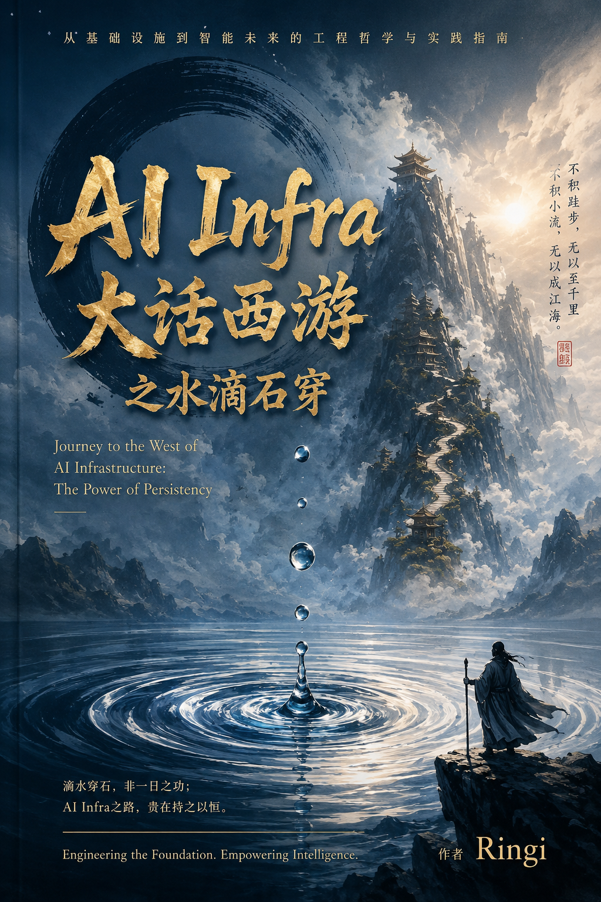
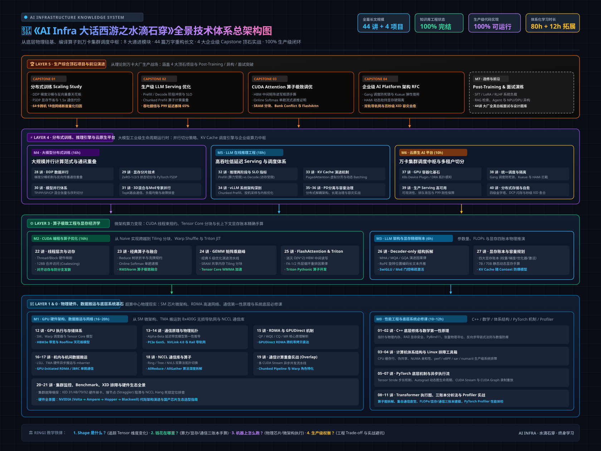
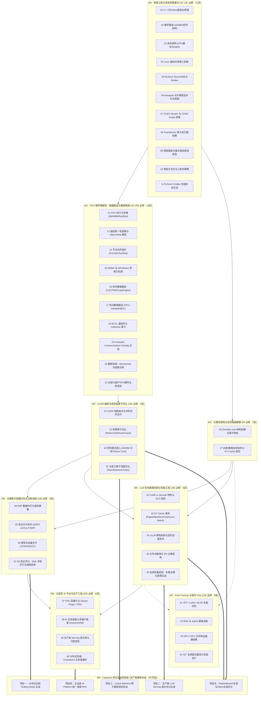

<div align="center">



# 🌊 《AI Infra 大话西游之水滴石穿》
### —— 从基础设施到智能未来的工程哲学与实战指南

**Journey to the West of AI Infrastructure: The Power of Persistency**

[](#)
[](#)
[](#)
[](#)
[](#)

*“滴水穿石，非一日之功；AI Infra 之路，贵在持之以恒。”*

</div>

> **主讲人 / IP 定位**：👓 **Ringi**（大厂 AI Infrastructure 工程师）  
> **核心宗旨**：*“我是 Ringi，我也在系统学习 AI Infra。这是我把一个原本很难、很理论的底层知识真正搞懂之后，重新用工程师视角讲给你的实战版本。”*  
> **课程定位**：面向准备进入大厂 AI Infra、GPU 计算、大模型分布式训练/在线推理优化与云原生平台的研发工程师与架构师。  
> **内容规模**：**44 篇万字重构核心讲义 + 5 大生产级 Capstone 顶石项目（全套 49 篇已 100% 全部完结交付！）**  
> **学习时长**：**80 小时核心必修 + 12 小时选修扩展 + 5 大工业级实战项目**

---

## 🗺️ 全景技术体系总架构图 (Master Architecture Overview)

本专栏历时沉淀，构建了从底层物理硅基、编译算子到万卡超算调度中枢的完整 8 层工业级技术栈：

<div align="center">

[](./assets/ai_infra_master_architecture.svg)

*▲ 知识库工业级全景总架构图（点击可直接查看超清晰 SVG 矢量原图 · 配套提供 [2x 超清渲染原图](./assets/ai_infra_master_architecture@2x.png)）*

</div>

---

## 🧭 课程全景技术路线依赖图（Hardware $\to$ Kernel $\to$ Distributed $\to$ Serving $\to$ Platform）



---

## 📚 模块目录导航与全套 49 篇长文极速直达索引

### 🏛️ 模块核心总览

| 模块编号 | 模块名称 | 核心定位与能力产出 | 讲义规模 | 模块主页 |
| :--- | :--- | :--- | :---: | :---: |
| **M0** | **[01_性能工程与系统前置_M0](./01_性能工程与系统前置_M0/README.md)** | C++/Python底层、数学/GEMM、体系结构、Linux工具、PyTorch机制、通信原语、三账本建模与 Profiler | 11 讲全完结 | [进入 M0](./01_性能工程与系统前置_M0/README.md) |
| **M1** | **[02_GPU硬件与集群互联_M1](./02_GPU硬件与集群互联_M1/README.md)** | GPU微架构、通信第一性原理、NVLink/Clos拓扑、RDMA/GDR、TMA机内搬运、机间通信、NCCL与Overlap、集群故障排查与选型 | 10 讲全完结 | [进入 M1](./02_GPU硬件与集群互联_M1/README.md) |
| **M2** | **[03_CUDA与算子性能优化_M2](./03_CUDA与算子性能优化_M2/README.md)** | 线程/合并访存、Reduce/Softmax 融合、GEMM 分块与 Tensor Core、FlashAttention-1/2/3 与 Triton | 4 讲全完结 | [进入 M2](./03_CUDA与算子性能优化_M2/README.md) |
| **M3** | **[04_大模型架构与显存建模_M3](./04_大模型架构与显存建模_M3/README.md)** | Decoder-only 算子深度拆解、7B/70B 静态与动态 KV Cache 显存手算建模 | 2 讲全完结 | [进入 M3](./04_大模型架构与显存建模_M3/README.md) |
| **M4** | **[05_大模型分布式训练_M4](./05_大模型分布式训练_M4/README.md)** | DDP 梯度分桶、ZeRO-1/2/3、FSDP、TP/PP/SP/CP 硬件映射、MoE 与 3D 混合并行 | 4 讲全完结 | [进入 M4](./05_大模型分布式训练_M4/README.md) |
| **M5** | **[06_LLM推理系统与性能工程_M5](./06_LLM推理系统与性能工程_M5/README.md)** | Prefill/Decode 冲突治理、PagedAttention、vLLM 架构、PD 分离、容量规划与长尾 SLO | 5 讲全完结 | [进入 M5](./06_LLM推理系统与性能工程_M5/README.md) |
| **M6** | **[07_云原生AI平台与生产工程_M6](./07_云原生AI平台与生产工程_M6/README.md)** | K8s Device Plugin / DRA、Gang 调度防死锁、Kueue 弹性借用、HAMi 显存隔离、四级存储与 XID 自愈 | 4 讲全完结 | [进入 M6](./07_云原生AI平台与生产工程_M6/README.md) |
| **M7** | **[08_Post-Training与相邻Infra_M7](./08_Post-Training与相邻Infra_M7/README.md)** | SFT/RLHF 负载、RAG/Agent 沙箱、NPU/DPU 异构计算抽象、大厂全真白板面试题库 | 4 讲全完结 | [进入 M7](./08_Post-Training与相邻Infra_M7/README.md) |
| **M8** | **[09_Capstone综合实战项目](./09_Capstone综合实战项目/README.md)** | 5 大面向大厂生产标准的顶石项目：Scaling Study、Serving 优化、Attention 算子、AI Platform RFC、FlashAttention全景与Token生成优化 | 5 项目全交付 | [进入 M8](./09_Capstone综合实战项目/README.md) |

---

### 📖 44 篇系统讲义 + 5 大生产项目全目录检索表

<details open>
<summary><b>展开查看 49 篇长文完整清单与单篇直达链接</b></summary>

#### M0 · 性能工程与系统前置 (11 篇)
- 🚀 **[第01讲：AI Infra 工程师的 C++ 与 Python 底层必修课](./01_性能工程与系统前置_M0/01_AI_Infra工程师的C++与Python底层必修课.md)** —— 指针、RAII 显存安全、PyBind11 跨语言桥接与 ATen 扩展。
- 📐 **[第02讲：AI Infra 数学第一性原理](./01_性能工程与系统前置_M0/02_AI_Infra数学基础.md)** —— 张量物理寻址、GEMM 算力账本、链式法则求导与 Stable Softmax 数值防爆。
- 🧱 **[第03讲：计算机体系结构前置](./01_性能工程与系统前置_M0/03_计算机体系结构前置_CPU存储层次_CacheLine与NUMA架构.md)** —— CPU 存储层次、Cache Line 伪共享与 NUMA 拓扑绑核。
- 🛠️ **[第04讲：Linux 系统基线与性能分析核心工具箱](./01_性能工程与系统前置_M0/04_Linux系统基线与性能分析核心工具箱.md)** —— perf、eBPF、sar、numactl 生产级系统分析实战。
- 📦 **[第05讲：PyTorch 底层系统机制](./01_性能工程与系统前置_M0/05_PyTorch底层系统机制_Tensor内存布局_Stride与Contiguous.md)** —— Tensor 内存布局、Stride 步长物理寻址与 Contiguous 底层开销。
- 🔄 **[第06讲：PyTorch 计算图与 Autograd 显存生命周期](./01_性能工程与系统前置_M0/06_PyTorch计算图与Autograd显存生命周期.md)** —— 动态图生成机制、GradFn 依赖与前向保留激活显存回收。
- ⚡ **[第07讲：PyTorch 异步执行流](./01_性能工程与系统前置_M0/07_PyTorch异步执行流_CUDA_Stream与CUDA_Graph原理.md)** —— CUDA Stream 异步并发、Stream 间同步屏障与 CUDA Graph 录制重放。
- 🔍 **[第08讲：Transformer 系统全景与算子执行图深度拆解](./01_性能工程与系统前置_M0/08_Transformer系统全景与算子执行图深度拆解.md)** —— 完整算子执行图、Shape 追踪表与参数量/显存推导。
- 🌐 **[第09讲：网络通信基础与集合通信 Collective 原语直觉](./01_性能工程与系统前置_M0/09_网络通信基础与集合通信Collective原语直觉.md)** —— AllReduce、AllGather、ReduceScatter 通信拓扑与物理传输直觉。
- 📊 **[第10讲：AI Infra 性能工程方法论与三账本建模](./01_性能工程与系统前置_M0/10_AI_Infra性能工程方法论与三账本_FLOPs_显存_通信.md)** —— FLOPs、显存、通信三账本建模与瓶颈判定。
- 🩺 **[第11讲：PyTorch Profiler 实战](./01_性能工程与系统前置_M0/11_PyTorch_Profiler实战_手把手带你做一次性能体检.md)** —— 手把手性能体检、Operator 算子耗时定位与 GPU 闲置气泡消除。

#### M1 · GPU 硬件与集群互联 (10 篇)
- ⚙️ **[第12讲：GPU 执行与存储体系](./02_GPU硬件与集群互联_M1/12_GPU执行与存储体系_SM_Warp_TensorCore_HBM_Roofline.md)** —— SM、Warp 调度、Tensor Core、HBM3e 带宽与 Roofline 模型。
- 📐 **[第13讲：通信第一性原理与性能模型](./02_GPU硬件与集群互联_M1/13_通信第一性原理与性能模型_AlphaBeta_Latency_Bandwidth.md)** —— Alpha-Beta 模型推导、延迟与带宽瓶颈分解。
- 🔌 **[第14讲：GPU 节点与集群硬件拓扑](./02_GPU硬件与集群互联_M1/14_GPU节点与集群硬件拓扑_PCIe_NVLink_NVSwitch_Clos_Rail.md)** —— PCIe Gen5、NVLink 4.0、NVSwitch、Fat-Tree 与 Rail 导轨网。
- 🚀 **[第15讲：RDMA 与 GPUDirect RDMA 机制](./02_GPU硬件与集群互联_M1/15_RDMA与GPUDirect_RDMA_QP_WQE_CQ_MR_ZeroCopy.md)** —— QP、WQE、CQ、MR 内存注册与跨机零拷贝直达。
- 📦 **[第16讲：机内数据搬运深潜](./02_GPU硬件与集群互联_M1/16_机内数据搬运_LSU_TMA_CopyEngine_mbarrier_IPC.md)** —— LSU、TMA 硬件异步搬运、Copy Engine 与 mbarrier 同步原语。
- 🛰️ **[第17讲：机间数据搬运](./02_GPU硬件与集群互联_M1/17_机间数据搬运_GPU_Initiated_RDMA_IBRC_OneHop.md)** —— GPU-Initiated RDMA、IBRC 与单跳极速通信。
- 🔄 **[第18讲：NCCL 通信库与 Collective 算子](./02_GPU硬件与集群互联_M1/18_NCCL通信库与Collective算子_Ring_Tree_NVLS_NVSHMEM.md)** —— Ring、Tree、NVLS 拓扑切换逻辑与算法源码。
- ⏳ **[第19讲：通信计算重叠实战 (Overlap)](./02_GPU硬件与集群互联_M1/19_Compute_Communication_Overlap_Stream_Bucket_Chunk_WarpSpec.md)** —— 多 Stream 异步流水线、Chunked Pipeline 与 Warp 角色特化。
- 🚨 **[第20讲：Benchmark 监控与 AI 集群故障诊断](./02_GPU硬件与集群互联_M1/20_Benchmark_监控与AI集群故障诊断_Xid_SlowNode_NCCL_Hang.md)** —— XID 31/48/79/92 硬件掉卡、慢节点定位与 NCCL Hang 死锁排查。
- 🗺️ **[第21讲：GPU 硬件全景与多元异构算力选型](./02_GPU硬件与集群互联_M1/21_GPU硬件全景与多元异构算力_NVIDIA代际演进_国产芯片与生态选型.md)** —— NVIDIA 代际架构演进与国产芯片生态选型指南。

#### M2 · CUDA 编程与算子优化 (4 篇)
- 🧵 **[第22讲：CUDA 编程模型与内存层次](./03_CUDA与算子性能优化_M2/22_CUDA编程模型与内存层次_Thread_Block_Coalescing.md)** —— Thread/Block 物理映射与 128 字节合并访问 (Coalescing)。
- ⚖️ **[第23讲：经典算子优化](./03_CUDA与算子性能优化_M2/23_经典算子优化_Reduce与Softmax_OnlineSoftmax_Fused.md)** —— Reduce 树状规约、Online Softmax 单趟流式递推与 RMSNorm 融合。
- 💎 **[第24讲：矩阵乘法核心 GEMM 优化](./03_CUDA与算子性能优化_M2/24_矩阵乘法核心_GEMM优化与TensorCore思维.md)** —— 6 级优化流水线、SRAM Tiling 分块与 Tensor Core WMMA 加速。
- 🔥 **[第25讲：注意力算子深度优化](./03_CUDA与算子性能优化_M2/25_注意力算子深度优化_TiledAttention_FlashAttention_Triton.md)** —— FlashAttention-1/2 循环重排、消除 HBM 读写与 Triton 算子实现。

#### M3 · 大模型架构与显存建模 (2 篇)
- 🧩 **[第26讲：Decoder-only 架构深度拆解](./04_大模型架构与显存建模_M3/26_Decoder_only架构深度拆解_MHA_MQA_GQA_RoPE_SwiGLU.md)** —— MHA/MQA/GQA 演进因果律、RoPE 旋转编码与 SwiGLU 门控。
- 💰 **[第27讲：训练与推理显存账本](./04_大模型架构与显存建模_M3/27_训练与推理显存账本_FLOPs推导与KV_Cache容量规划.md)** —— 四大显存账本推导、7B/70B 显存手算与 KV Cache 容量防爆模型。

#### M4 · 大模型分布式训练 (4 篇)
- 📦 **[第28讲：DDP 分布式数据并行与通信计算重叠](./05_大模型分布式训练_M4/28_DDP分布式数据并行与通信计算重叠.md)** —— 梯度分桶参数调优、反向传播与 AllReduce 通信无缝重叠。
- ✂️ **[第29讲：显存分片技术 ZeRO 与 FSDP](./05_大模型分布式训练_M4/29_显存分片技术_ZeRO_1_2_3与PyTorch_FSDP深度剖析.md)** —— ZeRO-1/2/3 状态切分演进、PyTorch FSDP-2 架构与通信开销。
- 🔀 **[第30讲：模型并行技术 TP/PP/SP/CP](./05_大模型分布式训练_M4/30_模型并行技术_TP_PP_SP_CP与硬件拓扑映射.md)** —— 张量并行、流水线并行与序列并行在物理 NVLink/以太网的映射。
- 🌐 **[第31讲：3D 混合并行与 MoE 专家并行](./05_大模型分布式训练_M4/31_3D混合并行_MoE专家并行与大规模训练故障排查.md)** —— Megatron-LM 3D 并行编排、MoE Token 路由通信与万卡训练故障排查。

#### M5 · LLM 在线推理系统与性能工程 (5 篇)
- ⏱️ **[第32讲：LLM 推理两阶段与核心 SLO 指标](./06_LLM推理系统与性能工程_M5/32_LLM推理两阶段_Prefill_Decode与核心SLO指标.md)** —— Prefill (算力受限) vs Decode (访存受限)、TTFT 与 TPOT 指标建模。
- 📑 **[第33讲：KV Cache 管理演进](./06_LLM推理系统与性能工程_M5/33_KV_Cache管理演进_PagedAttention与ContinuousBatching.md)** —— 传统显存碎片之痛、PagedAttention 分页机制与连续批处理。
- 🚀 **[第34讲：vLLM 系统架构剖析与高阶加速技术](./06_LLM推理系统与性能工程_M5/34_vLLM系统架构剖析与高阶加速技术.md)** —— Chunked Prefill、投机采样、前缀缓存 (Prefix Caching) 内核剖析。
- 🔀 **[第35讲：分布式推理与 PD 分离架构](./06_LLM推理系统与性能工程_M5/35_分布式推理与PD分离架构_Prefill_Decode_Disaggregation.md)** —— Prefill-Decode Disaggregation 架构、KV 传输开销与系统收益。
- 🎯 **[第36讲：在线推理容量规划与 SLO 治理](./06_LLM推理系统与性能工程_M5/36_在线推理容量规划_SLO治理与生产故障诊断.md)** —— 生产级容量测算、排队背压、长尾治理与服务雪崩自愈。

#### M6 · 云原生 AI 平台与生产工程 (4 篇)
- 🐳 **[第37讲：GPU 容器化与 K8s Device Plugin / DRA](./07_云原生AI平台与生产工程_M6/37_GPU容器化与Kubernetes_Device_Plugin_DRA.md)** —— NVIDIA Container Toolkit、Device Plugin 发现上报与 DRA 拓扑感知。
- 🚦 **[第38讲：AI 任务调度与多租户隔离](./07_云原生AI平台与生产工程_M6/38_AI任务调度与多租户隔离_Gang_Kueue_HAMi_GPUSharing.md)** —— Gang 调度全上全不上、Kueue 弹性借用与 HAMi 用户态劫持硬隔离。
- 📈 **[第39讲：生产级 AI Serving 高可用与 SLO 治理](./07_云原生AI平台与生产工程_M6/39_生产级AI_Serving高可用_可观测与SLO治理.md)** —— 生产级链路监控指标、自适应排队背压与 P99 刚性服务契约。
- 💾 **[第40讲：大模型分布式存储与自愈系统](./07_云原生AI平台与生产工程_M6/40_大模型分布式存储_Checkpoint与缓存体系架构.md)** —— 四级存储金字塔、DCP 闪存恢复流水线与百秒级故障自愈。

#### M7 · Post-Training 与相邻 Infra (4 篇)
- 🎯 **[第41讲：SFT、LoRA 与 RLHF 系统负载与资源评估](./08_Post-Training与相邻Infra_M7/41_SFT_LoRA与RLHF系统负载与资源评估.md)** —— 强化学习 PPO/DPO/GRPO 训练吞吐、Actor-Critic 显存瓶颈与切分。
- 🔍 **[第42讲：RAG 与 Agent 基础设施](./08_Post-Training与相邻Infra_M7/42_RAG与Agent基础设施_VectorDB_Context_Sandbox.md)** —— 向量数据库索引加速、上下文管理与多租户安全执行沙箱。
- 🧩 **[第43讲：NPU、DPU 与异构加速器硬件抽象](./08_Post-Training与相邻Infra_M7/43_NPU_DPU与异构加速器硬件抽象.md)** —— 异构加速硬件微架构、算子编译栈与统一计算抽象接口。
- 💼 **[第44讲：AI Infra 大厂全真面试演练与系统设计题库](./08_Post-Training与相邻Infra_M7/44_AI_Infra大厂全真面试演练与系统设计题库.md)** —— 顶尖大厂高频白板推导题库、架构设计 RFC 实战与破局思路。

#### M8 · Capstone 综合实战项目库 (5 大重磅顶石项目)
- 🏆 **[项目一：万卡分布式训练 Scaling Study 与通讯计算重叠实战](./09_Capstone综合实战项目/01_Capstone_分布式训练Scaling_Study实战.md)**
  - *系统手撕 64 卡跨机 18 倍网络断崖、DDP 梯度重叠临界点与 FSDP 1.5 倍通信税，输出万卡扩展性仿真报告与优化方案。*
- 🏆 **[项目二：生产级 LLM Serving 吞吐倍增与 P99 延迟治理实战](./09_Capstone综合实战项目/02_Capstone_生产级LLM_Serving吞吐与延迟优化实战.md)**
  - *深入真实电商客服 Serving 场景，解密 Prefill/Decode 算力与访存冲突，实测 Chunked Prefill 计算重叠，交付吞吐翻倍、P99 延迟暴降 65% 的优化器。*
- 🏆 **[项目三：榨干片上 SRAM——CUDA Online Softmax 与 FlashAttention 算子极致调优实战](./09_Capstone综合实战项目/03_Capstone_CUDA_Attention算子极致性能优化实战.md)**
  - *直面长序列内存墙绝境，严密证明 Online Softmax 单趟流式递推数学，拆透 SRAM 分块平铺、Bank Conflict 消除与 Warp Shuffle 规约，复现高保真 FlashAttention-2 核心内核。*
- 🏆 **[项目四：万卡熔炉定海神针——企业级 AI Platform 统一调度与集群系统架构设计 RFC](./09_Capstone综合实战项目/04_Capstone_企业级AI_Platform统一调度与集群架构RFC.md)**
  - *以一线顶级架构师视角，手撕 RFC-AI-0045 标准方案：Gang 调度彻底消灭死锁、Kueue 跨部门弹性配额借用、HAMi 动态劫持显存硬隔离、8x400G 双轨网络拓扑与百秒级 XID 容灾自愈。*
- 🏆 **[项目五：从单算子到端到端——FlashAttention 全景演进与大模型 Token 生成全链路性能优化实战](./09_Capstone综合实战项目/05_Capstone_FlashAttention全景与Token生成端到端全链路优化实战.md)**
  - *深度贯穿单算子片上 SRAM 熔炉与自回归宏观全生命周期：严密证明 Online Softmax 递推数学，深拆 FA-1/2/3 微架构演进与 FlashDecoding 序列并行，手撕 Decode 阶段 GEMV 1.0 FLOP/Byte 访存地狱账本，体系化实战 PagedAttention、连续批处理、Chunked Prefill、投机采样与 PD 物理分离架构。*

</details>

---

## 🌟 核心特色与 Ringi 教学铁律

在《水滴石穿》专栏中，每一篇技术文章绝不堆砌浮夸名词或简化版伪代码，必须严格遵循 **Ringi 工程师三问闭环** 与 **No Naked Formula 2.0**：

```text
┌───────────────────────────┐     ┌───────────────────────────┐     ┌───────────────────────────┐
│ 1. 📐 Shape 是什么？     │ ──► │ 2. 💰 钱花在哪里？        │ ──► │ 3. ⚙️ 机器上怎么跑？      │
│ 追踪 Tensor 维度物理流动  │     │ 算力/显存/通信三账本手算   │     │ 物理芯片/微架构硬件执行   │
└───────────────────────────┘     └───────────────────────────┘     └───────────────────────────┘
                                                │
                                                ▼
┌───────────────────────────┐     ┌───────────────────────────┐
│ 5. 🥊 Production 怎么选？ │ ◄── │ 4. 🔬 Evidence 在哪里？   │
│ 工业级权衡 (Trade-off)    │     │ 溯源一线代码与权威论文    │
└───────────────────────────┘     └───────────────────────────┘
```

1. 📐 **Shape 是什么？**
   - 追踪输入、输出与中间 Tensor 的维度物理流动（Batch / Sequence / Hidden / Head / Head Dim / Vocab）；
   - 明确哪些地方发生了 `Reshape`、`Transpose`、`Broadcast`、`Reduction`、`Concat` 或 `Split`。
2. 💰 **钱花在哪里？**
   - 精确手算参数量、计算量 FLOPs、显存占用（Weights / Gradients / Optimizer / Activation / KV Cache）与通信字节数；
   - 明确判定瓶颈类型：**Compute Bound**、**Memory Bound** 还是 **Communication Bound**。
3. ⚙️ **真正在机器上怎么跑？**
   - 映射到底层物理硬件：GEMM、Element-wise、SM 调度、Warp、Shared Memory、HBM、Tensor Core、PCIe/NVLink、NCCL AllReduce 等。
4. 🔬 **Evidence 在哪里？**
   - 绝不凭空捏造数据，公式与架构细节强制溯源至经典文献、源码（如 LeetCUDA、vLLM、Megatron-LM）或真机实测数据。
5. 🥊 **Production 怎么选？**
   - 给出真实生产环境下的架构抉择与 Trade-off：何时用 DDP？何时上 FSDP？何时做 PD 分离？如何消除 Bank Conflict？

---

## 🎨 多媒体与工程资产目录体系 (Assets Architecture)

为了支撑生产级工程实践与多媒体知识呈现，本知识库建立了**全局 + 模块双层资产管理体系**：

```text
AI_Infra大话西游之水滴石穿/
├── assets/                           # 🌐 全局公共资产库
│   ├── ai_infra_master_architecture.svg    # 🗺️ 全景知识体系总架构图 (超清矢量图)
│   ├── ai_infra_master_architecture@2x.png # 🖼️ 全景架构图 2x 超高清光栅图
│   ├── ai_infra_master_architecture.png    # 🖼️ 全景架构图 1x 标准光栅图
│   ├── book_cover.png                # 专栏官方封面
│   └── README.md                     # 资产规范说明
└── [00~09 各模块目录]/assets/        # 📁 各模块工程资产库
    ├── images/                       # 模块专用插图与 3D 工坊配图 (规范归档)
    ├── arch_*.svg                    # 模块专属超清矢量架构图
    ├── arch_*@2x.png                 # 模块专属超清架构光栅图
    └── code/                         # 配套 100% 最小可运行源码与 Benchmark 测试套件
```

---

## 🤝 致谢与学习建议

- **初学者建议路线**：M0（系统前置） $\to$ M1（硬件微架构） $\to$ M2（CUDA算子） $\to$ M3（显存建模） $\to$ M4/M5（训练与推理系统）；
- **资深工程师攻坚**：直奔 **[09_Capstone综合实战项目](./09_Capstone综合实战项目/README.md)**，在万卡 Scaling、Serving 优化、SRAM 算子压榨与平台 RFC 四大生产级战役中检验全栈内功！

*滴水穿石，终见天光。祝每一位在 AI 基础设施前沿跋涉的工程师都能在此收获坚实的工程底气！* 🚀
